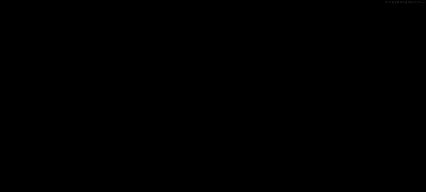
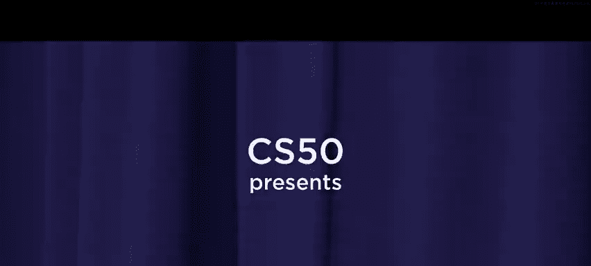
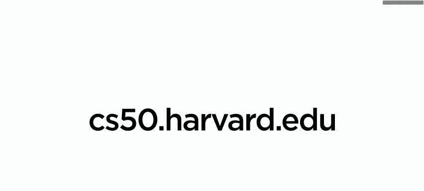

# 001：课程介绍 🎬

在本节课中，我们将要学习哈佛大学CS50R课程的开篇介绍，了解这门课程的核心目标、内容结构以及学习路径。课程将引导你从零开始，逐步掌握R语言在数据处理、分析和可视化方面的强大能力。

## 课程概述

大家好，这里是CS50的R语言编程入门课程。R是一种流行的语言，广泛应用于统计计算、图形绘制、数据科学以及其他领域。

我的名字是David Main，我的名字是Carters Anke。与更广泛关注计算机科学与编程的CS50（或称CS50X）不同，本课程CS50R将完全专注于R语言。你可以在学习CS50X之前、之中或之后学习CS50R。

## 课程内容结构

上一节我们了解了课程的基本定位，本节中我们来看看课程将如何展开。我们将首先探索这种名为R的语言中的数据。

以下是课程的核心学习路径：

1.  **学习数据结构**：我们将学习名为**向量**和**数据框**的数据结构。
2.  **数据转换**：我们将进阶到转换数据，特别是使用**逻辑表达式**进行筛选，以便分析数据的子集。
3.  **编程范式**：我们将探讨如何使用函数、循环以及像**函数式编程**这样的编程范式来转换数据。
4.  **数据整理**：我们将站在前人的肩膀上，学习如何整理数据，使其更易于分析。
5.  **数据可视化**：一旦数据变得整洁，我们也能更容易地将其可视化。
6.  **程序测试**：在课程后期，我们将测试我们的程序，确保它们的行为符合预期。
7.  **打包分享**：一旦程序运行无误，我们将把它们打包起来。

## 学习目标与总结

这个核心学习路径将带你从对R一无所知，到能够与世界分享你的R语言知识。我们期待看到你将创造什么。这就是CS50的R语言编程入门。

本节课中我们一起学习了CS50R课程的总体介绍，明确了课程专注于R语言及其在数据处理全流程中的应用。从下节课开始，我们将正式踏入R语言的世界，首先探索其基础的数据结构。