# R语言编程入门：1：数据表示

## 概述

在本节课中，我们将要学习R语言的基础知识，特别是如何表示和操作数据。我们将从编写第一个简单的“Hello World”程序开始，逐步学习函数、变量、数据类型、数据结构（如向量和数据框），以及如何从文件中读取数据。课程内容设计简单直白，旨在让初学者能够轻松理解。

---

## 1.1：欢迎与R语言简介 👋

大家好，欢迎来到CS50R的R语言编程入门课程。我是Carter Zenke，很高兴能与大家一起学习这门名为R的语言。

你可能从未编程过，这没关系。你可能会问，编程语言究竟是什么？编程语言是人类创造出来与计算机交流、让计算机为我们解决问题的工具。你可能听说过“代码行”，它们告诉计算机该做什么。程序就是一行行代码，逐步告诉计算机我们想要它完成的任务。

你可能还听说过其他语言，如C、Python、JavaScript。你可能会问，为什么要学习R？R是一种从底层构建、专门用于处理数据的语言。如果你对数据、数据科学、数据可视化、研究或统计学等领域感兴趣，R可能适合你。

虽然本课程不教授数据科学、统计学或其背后的数学，但学完后你将能够使用R进行这些领域的工作。例如，研究人员曾使用R来模拟COVID-19的传播，这是一个完全用R构建的可视化模型，模拟了病毒在邮轮上的传播。你可能也听说过FiveThirtyEight，这些数据记者使用R分析数据、撰写文章并分享可视化图表，帮助我们理解数据背后的洞察。

---

## 1.2：第一个R程序与RStudio 🚀

现在，让我们开始编写我们的第一个R程序。为此，我们将使用一个称为集成开发环境（IDE）的工具。代码本质上是文本，你可以使用任何文本编辑器来编写代码。但当你需要编写大量代码时，拥有一个专门的工具会很有帮助，这就是IDE的作用。

让我向你介绍这个名为RStudio的IDE。RStudio是专门为R语言构建的IDE。你会立刻注意到这里有一个大于号和一个闪烁的光标，这表示我们称之为R控制台的地方。我可以在这里输入R语句并逐行运行它们。这是一个很好的地方，可以一次执行或运行一行代码。

让我们输入我们的第一行R代码。我们将创建一个名为`hello.R`的文件，它将是一个完整的程序。要在RStudio中使用控制台创建文件，我可以输入`file.create()`，然后在括号内输入我想要创建的文件名。这里，我将创建`hello.R`。注意，`hello.R`以`.R`结尾，这在R中非常特殊，我们使用`.R`来表示R程序文件。

让我按回车键运行这个R语句。现在，我看到`TRUE`显示在这里，这意味着文件已创建。我们还会看到`[1]`，随着学习的深入，我们会更多地了解它。因为R经常处理数据和数据列表，当有很多数据时，给出我们在列表中的位置指示符通常很方便。我们稍后会看到它的用处。

这个文件创建在哪里？RStudio有一个文件资源管理器，我可以在侧边打开它。文件资源管理器显示我计算机上某个特定文件夹的内容。即使你不了解计算机，你可能也知道文件和文件夹。这里，我似乎在`/users/jharvard`文件夹内，RStudio和R在那里为我创建了名为`hello.R`的文件。

RStudio默认在单个文件夹中工作，这个文件夹称为R工作目录。如果我要求R为我创建一个文件，它将在工作目录中创建该文件。如果我要求它查找某个数据文件并将其读入我的R程序，它将首先在该工作目录中搜索。

现在，让我们打开这个R文件并编写我们的第一个R程序。我点击`hello.R`文件图标，暂时关闭文件资源管理器。现在，我看到了RStudio的这个新组件——文件编辑器。正如之前所见，下面的R控制台非常适合编写单个R语句或单行R代码，而`hello.R`文件则适合编写多行代码，创建完整的程序。

我有一个闪烁的光标，这意味着我可以直接输入一些文本。让我们输入一些文本，这将是我们的第一个R程序。我输入`print()`，然后在括号内输入`"hello, world"`。现在，我已经输入了一些文本，这是我的第一行R代码。我可以点击保存图标（在Mac上按Command+S，在Windows上按Ctrl+S）来保存这个文件。现在，这个程序已保存在我的计算机上。

你可能习惯于通过双击程序或点击图标来运行程序，但这里看不到这些图标。这是我们自己创建的程序，需要不同的运行方式。即使你不了解计算机，你可能也知道计算机说一种叫做二进制或0和1的语言。现在我们只有`print()`、引号和`hello world`，这看起来不像0和1。因此，必须有一种方法将我们编写的R文本翻译或解释成计算机能理解的0和1。

R不仅是一种语言，还是一个解释器，它将我们编写的文本转换成计算机能理解的0和1。要启动这个解释过程，我可以点击这里的“Run”按钮。让我先到控制台，输入`Ctrl+L`来清空控制台，这样就能清楚地看到发生了什么。然后，我回到代码的第一行，点击“Run”。我应该会看到我的第一个R程序在这里向世界问好。

---

## 1.3：函数、参数与副作用 ⚙️

让我们退一步，思考一下我们刚刚做了什么。在R中，我们创建了第一个程序，并使用了一个叫做“函数”的东西。在R和许多其他语言中，你可以访问这些称为函数的东西，函数让你告诉计算机采取某些行动，解决特定问题。在这个例子中，我们的问题是显示一些文本，而我们看到的名为`print`的函数帮助我们做到了这一点。

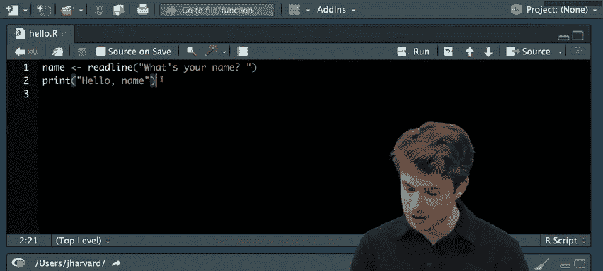

让我们回到RStudio，再次展示这个程序。我们看到这个函数叫做`print`，你大概能猜到。我们知道它是一个函数，因为我使用了括号。在R中，约定是通过函数名后跟括号来表示函数，括号内是该函数的特定输入。

当R开发者设计`print`时，它并不总是打印预定的文本。相反，它打印我想要它打印的文本。随着我们一起学习编程，我们会看到这些函数可以接受输入，更准确地说，这些输入称为函数的“参数”。它们是改变函数实际运行方式的输入。

那么，`print`做了什么？在下面的控制台中，我看到它打印了`"hello, world"`，这被称为函数的“副作用”——函数运行时发生的可视化效果。副作用也可能是通过音频发生的东西，或者其他我看到的东西。函数运行时发生的任何事情都称为其副作用。

这是目前为止我们在R中的第一个程序。让我们暂停一下，问问关于R、RStudio或我们刚刚编写的这个名为“Hello World”的程序有什么问题。

---

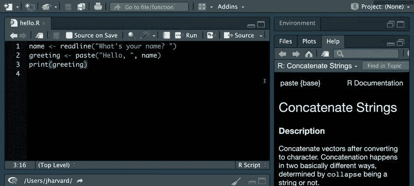

## 1.4：问答与工作目录设置 ❓

关于为什么使用RStudio而不是VS Code的问题：如果你熟悉VS Code，你会知道它可以处理多种语言，如Python和C等。然而，RStudio是专门为R量身定做的。正如我们将在课程后面看到的，RStudio的许多功能使得使用R更加容易，特别是在可视化和绘图方面。

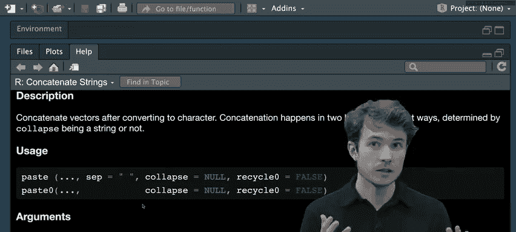

关于为什么使用R而不是Python的问题：Python是一种非常庞大的语言，可以用于很多事情。你可以使用像NumPy这样的Python库来完成R能做的类似工作。然而，R更像是一个精确的工具，它从底层构建就是为了处理数据，而Python更像是一个解决各种问题的通用工具。R带有一些优化，使得处理数据更高效。但总的来说，你可以使用带有NumPy或其他库的Python，或者使用R来处理数据。

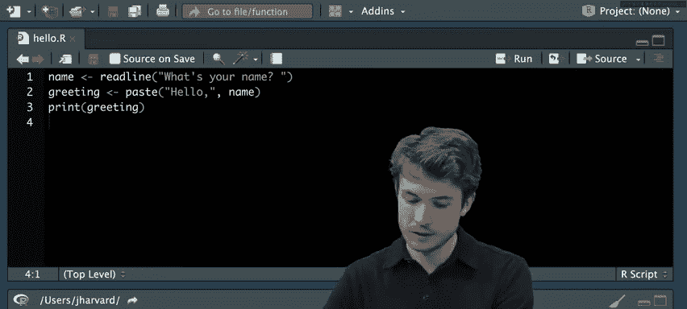

来自Louise的问题：你能展示如何更改控制台的工作目录吗？这是一个关于更改工作目录的好问题。我们之前看到RStudio默认有某个工作目录，但如果你想更改，可以这样做。在R中，有一个专门用于更改工作目录的函数。让我回到RStudio环境，特别是我的控制台。更改工作目录只需要一行R代码。我可以清空下面的控制台，然后在控制台中执行那行代码。执行此操作的函数是`setwd()`，然后在括号内输入你想要更改到的路径或文件夹。如果你想这样做，可以使用`setwd`函数。

---

## 1.5：处理错误与用户输入 🐛

我们已经完成了第一个“Hello World”程序，但事情可能不会总是这么顺利。如果你是编程新手，甚至如果你更有经验，你可能会遇到代码中的“错误”。

让我在这里故意重现一个可能出现在我程序中的错误。假设我在输入时，没有输入`print`，而是输入了`prin`。让我保存这个程序，然后运行它看看会发生什么。我点击“Run”。现在，我在控制台看到错误：`Error in prin("hello, world") : could not find function "prin"`。这个错误告诉我，没有名为`prin`的函数。通过看到这个，我应该知道我不打算输入`prin`，我本意是输入`print`。所以我可以回去修复它。这个回去修复程序的过程被称为“调试”——通过查看这些错误并与同事交流或尝试修复来找出代码中的错误并消除它们。

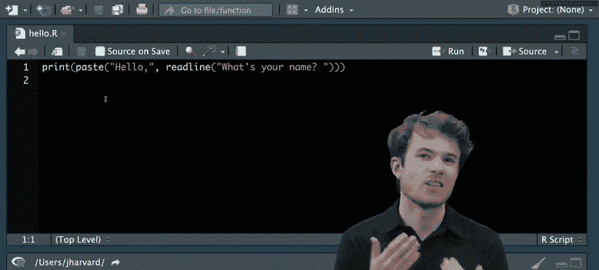

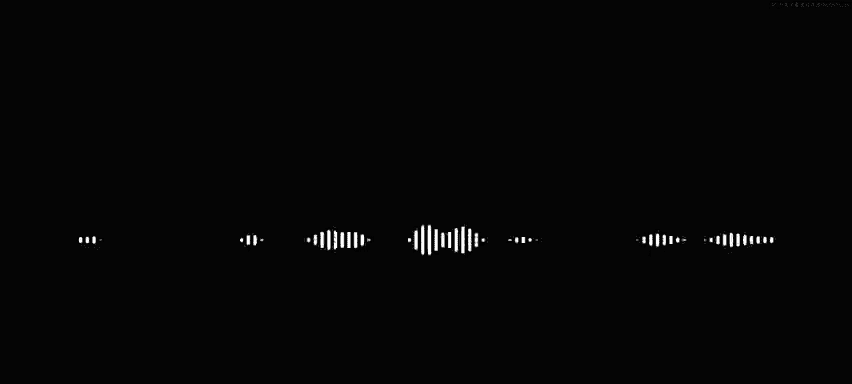

让我回去清空终端（控制台），再次运行这行R代码（或运行这个程序），我会再次看到`"hello, world"`。

这是一个相当好的程序，但我认为我们可以做得更好。我们不必只向所有人问好，我们可以尝试向特定用户问好。所以，我们的下一步将是实际询问用户的姓名，然后向该特定用户问好。

要获取用户输入，R中有一个函数，它不是`print`，而是叫做`readline`。让我们在这里使用`readline`函数。我输入`readline`（这是一个单词），然后是括号。`readline`接受一个参数，这个参数将是提示用户的文本。我会问用户`"What's your name?"`，然后保存文件。

让我到下面清空控制台，然后运行这行R代码。我会看到`"What's your name?"`。我可以输入我的名字，比如`Carter`，然后按回车。我看到`Carter`。这与其说是问候，不如说只是把我的名字回显给我。我认为这还可以做得更好。让我清空控制台，理想情况下，我想说类似`"Hello, Carter"`这样的话。

我可以在第二行再次使用`print`，也许说`print("Hello, Carter")`，然后再次保存文件。现在，我不只有一行R代码，而是有两行。当R解释这个程序时，它将从上到下、从左到右读取这些代码行，沿途执行每个函数。

但事实证明，这里的“Run”按钮实际上一次只运行一行R代码。例如，我可以只运行第一行或只运行第二行。但我们这里实际上是一个完整的程序，它不止一行代码，而是两行。要运行整个程序，我需要使用不同的方法，在这种情况下是使用不同的按钮，即顶部的“Source”按钮。“Source”在这里意味着运行整个源文件。

让我继续点击“Source”，然后输入我的名字`Carter`，我会看到`Hello Carter`。但这个程序中可能仍然存在一个错误。让我们再试一次，清空控制台，再次点击“Source”。如果我的名字是任天堂宇宙中的`Mario`呢？我可以输入`Mario`，但输出却是`Hello, Carter`。让我们再试一次，点击“Source”，也许我的名字是`Princess Peach`，输入`Princess Peach`，输出仍然是`Hello, Carter`。所以，在我看来，我们需要做一些比仅仅打印`Hello Carter`更动态的事情。我们需要实际打印用户在控制台输入的内容。

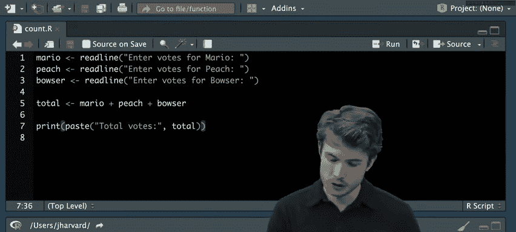

为此，我们实际上需要编程中的一个新概念，称为“返回值”。函数不仅有参数和副作用，它们还有返回值。在这种情况下，`readline`将把用户输入作为其返回值返回给我们。你可以把它想象成一个比喻：让你的朋友出去问别人的名字，他们可能会写下来并交还给你（程序员），以便你稍后在代码中使用。这就是返回值的作用。

但是，如果我有一个返回值，我需要一个地方来存储它，以便稍后在代码中重用。为此，我们需要一种叫做“变量”或“对象”的东西。变量是某个可能改变的值的名称。让我们看看如何在R中使用返回值和对象来使这个程序更加动态。

---

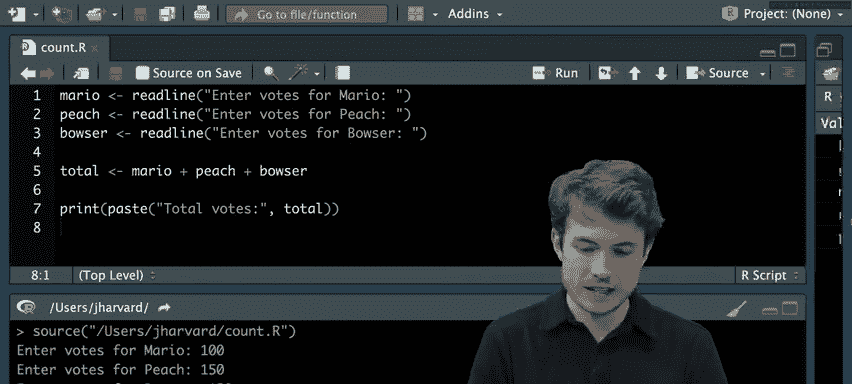

## 1.6：变量、赋值与字符串拼接 🔗

让我回到第一行，尝试给`readline`的返回值一个我稍后可以重用的名字。如果用户输入`Carter`，我想通过某个名称来引用那个值，也许合适的名称就是`name`。我在这里输入`name`。现在，如果我想将`readline`的返回值（即用户输入的任何内容）存储在这个名为`name`的对象中，我可以使用这种语法：`<-`。注意，如果我们从右到左阅读：首先，`readline`将作为一个函数运行，它会提示用户输入，用户将输入内容，然后`readline`会返回给我们用户输入的值，接着这里的这行代码`name <-`会将其存储在这个名为`name`的名称下。

这个箭头，这个向左的箭头，称为“赋值运算符”。我们将`readline`的任何返回值“分配”给这个名为`name`的新对象。

现在，为了专注于这一部分，让我暂时去掉第二行。让我“Source”这个文件，然后输入我的名字`Mario`，按回车。由于没有`print`，我还没有看到任何输出。但现在，如果我打开RStudio的这个新窗格，转到“环境”窗格，我实际上会看到我们创建的名为`name`的这个对象的值。看起来RStudio告诉我，我有一个名为`name`的对象，它的值现在是`Mario`。这是环境的一部分，环境是我们在程序运行时实际存储对象的地方，以便稍后重用它们。

我已经捕获了这个用户输入并将其存储在名为`name`的对象中。但现在让我们看看如何使用它。我回到RStudio，回到第二行，现在让我打印`"hello, name"`。我关闭环境窗格，然后“Source”这个特定文件，输入`Mario`作为我的名字，然后按回车。我看到`hello name`。所以这不是我们想要的，我实际上打印出了字面意思的`hello name`。我认为我们需要在这里找到其他解决方案。

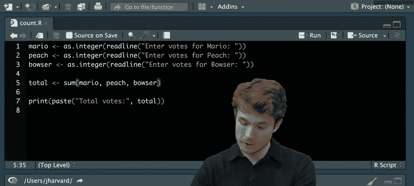

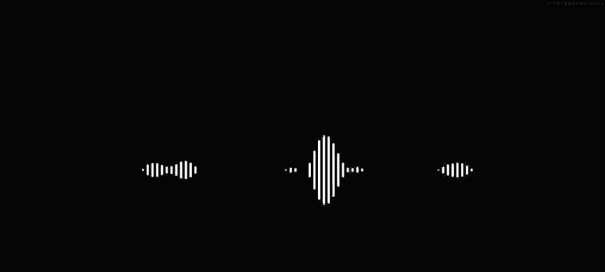

我们解决了一个问题，即获取用户输入并将其存储在某个地方，但我如何稍后重用它呢？如果我仔细观察，我可能会注意到我真正想做的是组合一些文本片段。比如这里的文本是`"hello, "`，而我试图组合的是用户输入的任何内容，或者存储在这个`name`对象中的任何内容。所以，我试图组合`"hello, "`和来自用户的文本`Mario`。

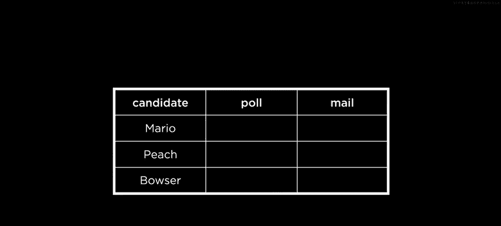

这是编程中的一个常见问题——尝试组合文本片段，如此常见以至于它有自己的特定名称。这被称为“字符串拼接”，其中“拼接”意味着将各种文本片段或“字符串”组合在一起。让我们分解一下。当然，我们这里有问候语的第一部分。这是一段文本，从现在起称为“字符串”——之所以叫字符串，是因为字符被串在一起形成一段文本。字符串以双引号开始和结束。所以我有`"hello, "`，这是一个特定的字符串。

然后用户进来，他们输入自己的字符串，比如`Carter`。现在我的任务是将它们组合成一个字符串并打印回给用户。所以我的目标是将这两个单独的字符串有效地变成一个单独的字符串。

幸运的是，R自带了一个函数来做这件事。让我们探索一下这个函数。这个函数实际上叫做`paste`。`paste`允许我连接各种字符串。让我们试试这个。如果我想使用`paste`，我以与使用任何其他函数相同的方式使用它。我可以使用函数名，然后是开括号和闭括号。然后，`paste`将接受我想要连接或粘贴在一起的任意数量的字符串作为输入。

假设第一个字符串是`"hello, "`。下一个字符串是新的东西，它实际上是存储在这个`name`对象中的任何内容。所以，如果我想给`paste`提供另一个输入，我应该用逗号分隔它。在`paste`的第一个输入（第一个参数）之后，我会给它第二个输入或第二个参数，这个参数在这种情况下就是字面上的`name`——这个存储了用户自己输入的值的对象。

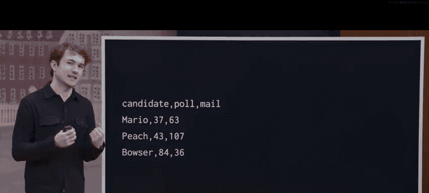

现在，`paste`的返回值将是这两个字符串的组合版本。让我们试试。也许我会将返回值存储在一个名为`greeting`的对象中。我使用左箭头（赋值运算符）将`paste`的返回值存储在这个名为`greeting`的对象中。然后在下面的`print`中，我不会打印字面意思的`hello name`，而是打印存储在名为`greeting`的对象中的任何内容。

当我运行这个时，让我打开环境窗格，我们可以看到这些值如何随时间变化。我点击“Source”这里，我的名字是`Carter`，按回车。我看到`Hello Carter`。如果我回到环境窗格，我不仅看到这个存储着`Carter`的名为`name`的对象，还看到这个存储着拼接版本字符串的名为`greeting`的对象，在这个例子中是字符串`"hello, "`和字符串`"Carter"`本身。

但如果你在这里特别观察，你注意到这个程序有什么错误吗？让我问问观众：你注意到这个程序有什么错误？有两个空格。是的，有两个空格。所以我只想要一个空格，但似乎我不知怎么得到了两个。比如这里的`greeting`是`"hello,  Carter"`（有两个空格）。为什么会这样？

我可以花很多时间思考为什么这不起作用，或者我可以查看一些叫做“文档”的东西。所以，当程序员编写像`paste`这样的函数时，他们也会编写文档，确切地告诉我如何使用`paste`以及`paste`的有效输出可能是什么。那么，让我们看看`paste`的文档。

我实际上可以通过在R中使用这个特殊字符（问号）来访问文档。如果你想记住这个，可以把它想象成感到困惑：我该怎么做？问号就是那个符号。然后我跟着函数名，在这个例子中是`paste`。现在，在右侧，让我把它放大，我实际上会看到`paste`的文档。创建这个名为`paste`的函数的人好心地编写了这个文档来指导我如何使用`paste`本身。

我会在顶部看到`paste`的目标是连接字符串，就像我们刚才讨论的那样，这非常明显。但下面我认为是有帮助的部分。下面会告诉我`paste`可能接受哪些类型的输入。我会看到和我们之前看到的一样：`paste`后面跟着一些括号，里面有各种我们称之为“参数”的东西。这些仍然是`paste`的输入，但它们是潜在的输入，因为它们是潜在的，所以我们称它们为参数。参数是我们传递给`paste`的实际值，而参数是潜在的值。

现在，如果我往下看，我会看到`...`，这些点意味着`paste`可以接受任意数量的参数——可以是我想要连接的任意数量的字符串。然后我这里有一个名为`sep`的命名参数，它说`sep = " "`（引号内有一个空格）。这是一个所谓的“命名参数”，它有一个给定的名称，因为它在`paste`的这个用例中有特殊用途。等号意味着这个参数的默认值将是这里的这个值，即`" "`（引号空格）。所以看起来这个名为`sep`的参数可能是导致输出中出现额外空格的原因。

如果我回到这里的文档，让我向下滚动一点以便我们可以看到。我会看到参数，你可以看到`sep`实际上是一个用于分隔各项的字符串。所以，我现在的任务是思考，为了去掉那个额外的空格，我应该将`sep`的值更改为什么？我可以回到我的程序，理想情况下，我不希望任何字符默认分隔字符串，我只希望它们直接连接在一起，中间没有空格。

要使用这个名为`sep`的命名参数，我可以在`paste`后面再跟一个输入，用逗号分隔，就像这样，然后使用那个命名参数`sep`，并将其设置为某种新值，在这种情况下是`""`（完全没有空格）。让我们现在试试这个。我清空控制台，运行“Source”，然后再次输入`Carter`。现在我会看到`Hello, Carter`，只有一个空格。

如果你像我一样，你可能会想，我经常会想要连接中间没有空格的字符串，如果编写很多行代码，总是输入`sep = ""`会非常繁琐。事实上，一些R用户厌倦了这一点，他们编写了自己的函数，其中默认值就是`sep = ""`。这个函数简称为`paste0`。`paste0`中的零意味着这些连接的字符串之间没有任何东西。我现在不需要提供`sep`输入，因为默认值总是完全没有空格。现在，我重新运行这个程序，“Source”并输入`Carter`，我会得到相同的输出。

做这件事的另一种方式（因为总有不止一种方法做某事）是，也许我可以完全省略空格。比如，我可以说`"hello,"`作为我的字符串，然后假设`paste`会为我添加空格。我可以像这样运行“Source”，输入`Carter`，现在我会再次看到`Hello Carter`，完成了我们的程序。

---

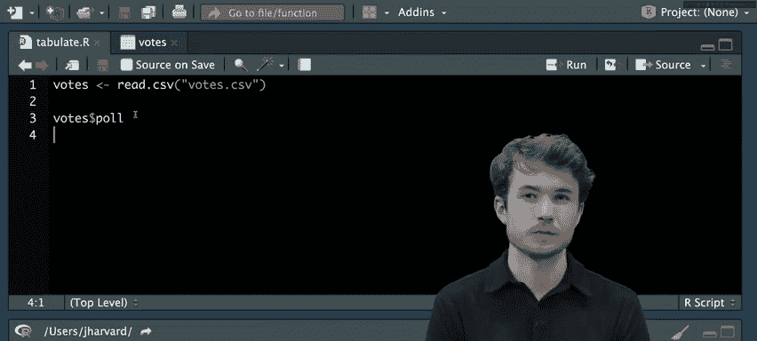

## 1.7：函数组合与代码设计 🧩

让我暂停一下，问问关于`paste`、字符串拼接或我们目前为止的程序有什么问题。

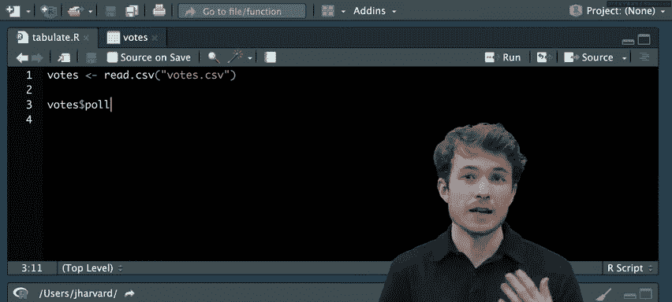

`paste`函数和`cat`函数有什么区别？我认为两者都用于字符串连接。是的，问得好。如果你熟悉R，你可能也听说过这个叫做`cat`的函数。`cat`本身代表连接。`cat`和`paste`有两个相似的用例，它们都涉及组合字符串，但它们的输出略有不同。`cat`具有将你连接的内容打印到控制台的副作用。另一方面，`paste`不会，`paste`只是默默地返回给你连接后的版本，然后你可以在代码中稍后使用。我相信`cat`实际上不会返回结果，只是作为一种副作用将其打印到屏幕上。所以，两个非常不同的用例，但目标相同。

好的，让我们继续，并继续改进我们的程序。你可能会注意到的一件事是，我有一个名为`greeting`的对象，然后在下一行立即使用那个相同的对象，这看起来有点冗余，因为我只是将`paste`的值存储在`greeting`中，然后立即将其返回给这个叫做`print`的函数。

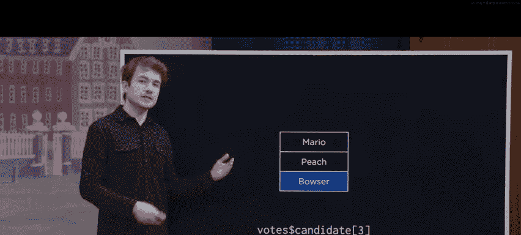

为了获得相同的结果并实际减少一些代码行数，我可以做以下事情：我可以去掉将`paste`的结果存储在任何给定对象中的想法，我可以简单地运行`paste`，并立即将`paste`的值或返回值作为输入传递给`print`。

这可以说是我们迄今为止看到的最复杂的代码行，所以让我们稍微分解一下。我们在这里做的被称为“函数组合”。我让一个函数运行，然后立即将该函数的输出作为输入传递给下一个函数。所以这是我们的R代码行。我们之前说过，R从上到下、从左到右逐行运行代码，这大部分是正确的。但在这种情况下，我们看到在这一行代码上有不止一个函数要运行或动作要执行，那么R该怎么做？

R总是会先寻找括号中最内层的函数。所以在这个例子中，那就是`paste0`函数，这个连接器将`"hello, "`和这里的`name`组合在一起。这将使返回值变成`"hello, Carter"`，然后立即将其作为输入传递给`print`。一旦完成，`print`就可以完成它的工作，当然，只是打印出类似`Hello Carter`的内容。所以，总是先考虑最内层的函数运行，并将其返回值作为输入传递给下一个最内层的函数，依此类推。

让我们继续尝试这个。我回到RStudio，这里我有`paste`而不是`paste0`，但和我们之前看到的类似。我点击“Source”这里，输入`Carter`，我们会看到我得到了完全相同的结果，而没有存储在这个额外的对象中。

这个的一个扩展可能是以下内容：我可以使用`readline`，注意它只是将值存储在`name`中，然后我立即将其作为输入传递给`paste`。我可以这样做：我可以使用`readline`并把它直接放在那里。现在我有三个函数嵌套在一起。

但让我问问你，为什么这可能不是一个好主意？让我们想想其他可能阅读这段代码的人，或者考虑在项目上合作，为什么我可能不想这样做，或者在代码设计上走这么远？我认为是因为它没有完美地向用户解释代码。是的，这有点难以阅读。如果我看到这行代码，我不得不自己思考：好吧，哪个函数先发生？看起来可能是`readline`，然后接下来发生什么？好的，`paste`接下来发生。所以，当我阅读这个程序时，需要思考很多。尽管它更短，但我会说它不一定更好。所以，这些是关于程序设计的问题，哪种编写代码的方式更好？它们有相同的结果，所以它们都是正确的，但在可读性方面仍有不同的设计方式和权衡需要考虑。

---

## 1.8：注释与程序结构 📝

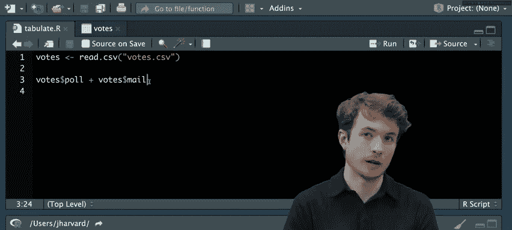

所以，让我们回来，尝试稍微修复一下这个程序。我认为，如果我们将`readline`放在单独的一行代码上可能会更清晰。我把它放在第一行，然后回到存储这个名为`name`的对象，并像这样将其作为输入传递给`paste`。

我们刚刚讨论了使代码更具可读性的想法，事实证明R带有一个功能，可以让我做到这一点。我实际上可以给自己留下一些称为“注释”的笔记，帮助我用英语理解我的代码。如果我想在我的代码中写注释或给自己写笔记，我可以输入这个井号`#`，后面跟一个空格，然后输入我想输入的注释。我可以说，也许这一行询问用户的名字，就像这样。下一行，这行代码做什么？这行代码向用户问好。

按照惯例，注释放在它们所讨论的代码行的上方。所以在这种情况下，我知道第一行的注释指的是第二行的代码，第四行的注释指的是第五行的代码。但是，当你实际处理一个更大的项目，后来回来不知道你做了什么时，注释会非常有帮助。注释可以帮助你确切地理解该做什么以及你之前做了什么。

这是我们的“Hello World”程序，我们向世界问好，我们向一些用户问好。现在让我们开始处理一些数据。在一个案例中，我们可能想要处理选举计票的数据。所以，让我们继续尝试模拟任天堂宇宙中一些虚构角色之间的选举，在这个例子中是Mario、Peach和Bowser。

要创建这个新程序，我再次进入控制台，输入`file.create()`，在这个例子中，我想计算一些选票，所以我将称这个程序为`count.R`。我按回车，会看到文件已创建。所以现在，如果我打开我的窗口，转到文件，我现在应该看到`count.R`作为一个文件可供我编写这个程序。我打开`count.R`，现在我有一个空白的程序可以编写。

我们有三个候选人需要跟踪选票：Mario、Peach和Bowser。所以，让用户实际输入那些选票，并返回或打印出这次选举中的总票数。也许我会使用`readline`询问用户输入Mario的选票，就像这样。我也会询问用户输入Peach的选票，就像这样（Princess Peach）。我还会使用`readline`询问用户输入Bowser的选票，就像这样。

很可能我想稍后在代码中使用用户输入的任何内容，所以我为什么不将`readline`的返回值存储在一个我可以稍后重用的对象中呢？也许我称这个为`mario`，这个为`peach`，这个为`bowser`。我保存它。同样，目标是累加这些总票数。也许我会创建一个名为`total`的新对象来存储总票数，并分配那个总票数。

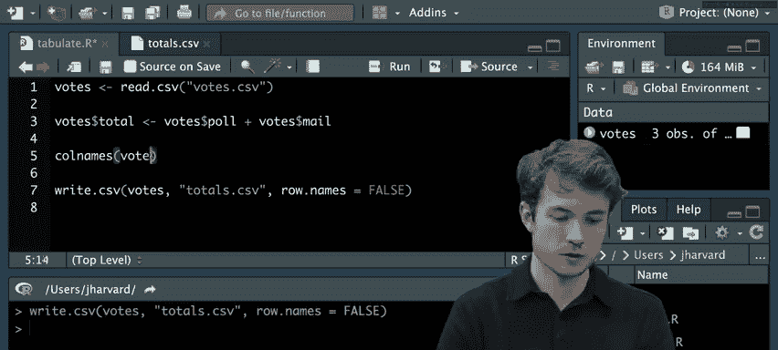

事实证明，要实际将数据相加，我可以在R中使用这个加号`+`运算符。所以我说`mario + peach + bowser`，这应该返回给我用户实际在控制台输入的总票数。如果我想然后将其打印回给用户，我可以使用`print`和`paste`。所以我使用`print(paste("Total votes:", total))`。

我们之前见过的一些东西和一些新东西。新的是这个算术。我们刚刚使用了这个加号运算符来将一些数字相加。R不仅有加号运算符，还有其他几个。它有我们刚刚看到的加法（加号）、减法（减号或破折号）、乘法（星号或星号运算符）和除法（正斜杠）。还有其他运算符，我们将在课程后面讨论。但现在，这四个将帮助你做一些基本的算术，它们可以帮助我们解决一些非常有趣的问题，在这个例子中。

让我们回来运行我们的程序。我回到RStudio，我认为这应该可行。我继续点击“Source”，然后输入Mario的选票，也许我会说Mario有100票，Peach有150票，Bowser有120票。现在我应该看到这次选举中投出的总票数。我按回车。我会看到另一个错误，说`Error in mario + peach : non-numeric argument to binary operator`。另一个错误元素更容易理解，这个不太容易。至少它告诉我错误发生在`mario + peach`。所以看起来也许在第五行，当我尝试将用户输入的Mario选票与用户输入的Peach选票相加时，它说原因是非数值参数传递给二元运算符。二元运算符我告诉你就是这个加号，但非数值参数，看起来它告诉我们`mario`和`peach`根本不是数字。

所以，让我们看看我们存储这些实际对象的环境。如果我查看环境，也许移除下面这些旧东西，我会看到一些旧的东西，比如`greeting`和`name`，我之前没有清除，但我还看到`bowser`、`mario`、`peach`。你注意到了什么？嗯，看起来之前我们有，比如说`greeting`，它是一个字符串，我们知道它是一个字符串，因为它周围有引号，对吧？但现在我们看到`bowser`、`mario`和`peach`也有同样的情况，这暗示我这些仍然是字符串，它们不完全是数字。我认为R现在告诉我，它需要数字才能将这些东西相加，它不能将字符串`"120"`与字符串`"100"`相加，这些需要是实际的数字。

---

## 1.9：数据类型与强制转换 🔢

那么，让我们看看我们能做些什么。让我们回到RStudio，实际上引入这个关于“数据类型”或R中“存储模式”的新想法。我们有各种存储数据的方式，我们到目前为止见过一种，称为字符串，但还有很多其他类型。其中有我们刚刚看到的字符，然后是双精度和整数——这些都是数字。双精度指的是像1.5这样的小数，整数指的是像1这样的整数。还有更多，但这里重要的是这些。

所以在我看来，`readline`在返回用户输入时，返回的是字符数据类型或存储模式。但我真正需要相加的是双精度或整数——这些数值存储模式。那么，让我们看看是否有函数可以帮助我们实际转换它们。其中有这个想法：`as.character`、`as.double`和`as.integer`。这些是函数，实际上接受某个特定对象并将其转换为我们想要的存储模式。所以我可以给`as.integer`一些对象作为输入，它会返回给我相同的对象，但现在作为整数。这被称为“强制转换”——使用像这样的函数将对象的存储模式更改为某个特定的新存储模式。

让我们试试这些。我再次来到RStudio。然后我尝试在相加之前将这些数据转换为整数。让我们在第五行及以下，继续使用`as.integer`。我输入`as.integer(mario)`和`as.integer(peach)`和`as.integer(bowser)`。嗯，在这种情况下，希望这应该可行。让我再次点击“Source”，然后输入Mario 100票，Peach 150票，Bowser 120票。我仍然看到它们不是数值。一个常见的错误是，仅仅在这里运行函数不足以改变这个特定对象。我需要然后将这个函数的返回值重新分配给对象本身。

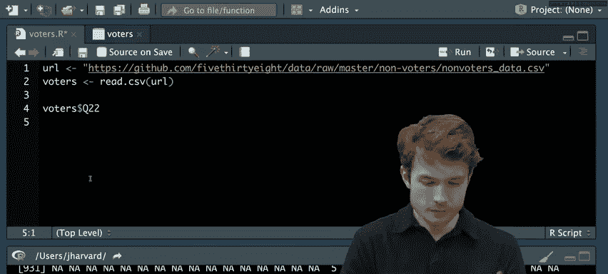

例如，如果我想更新`mario`的值，我需要将其重新分配为`as.integer`的返回值，或者我需要通过将其重新分配为此函数的返回值来更新`peach`的值，`bowser`也一样。现在，我认为如果我运行这个（祈祷），我清空控制台，再次运行“Source”，然后为Mario选择100，为Peach选择150，为Bowser选择120。我会看到总票数是370。

这是一个比我们之前看到的更长的程序，总共大约11行。可能有一种方法可以稍微清理一下。一种方法是立即尝试将用户输入转换为整数，这样我就可以使用函数组合，并立即将`readline`的返回值作为`as.integer`的输入传递，对`peach`和`bowser`也一样。让我实际清理一下，这里有`as.integer`和`readline`。现在我可以去掉第5到第7行，现在它稍微短了一点。我认为这实际上是这个特定函数组合的一个很好的用例，因为现在我立即看到，好吧，我想要用户输入一个整数。

让我继续再试一次，我点击“Source”，现在我会看到100、150、120，我仍然看到370。这很好，但让我们考虑一个用例或其他有超过三个候选人的场景。在这种情况下，我不想总是输入加号、加号、再加号某个新候选人。我想使用的可能是一个叫做`sum`的函数。因为R经常处理数据，所以它有一个叫做`sum`的函数，可以接受任意数量的数值参数作为输入，并为我求和。

所以，让我们在`total`中使用`sum`。我实际上想返回调用带有三个参数（三个输入）的`sum`的结果。第一个是`mario`，第二个是`peach`，第三个是`bowser`。现在，`sum`将查看所有这三个数字，将它们相加，然后现在存储在`total`中。我清空控制台，运行“Source”，然后输入Mario 100票，Peach 150票，Bowser 120票，现在我会看到总票数也是370。所以，我们到目前为止改进了我们的程序。我们已经看到了如何使用这些存储模式来将数据相加。

现在，关于这个程序或存储模式有什么问题？一般来说，我们能否像数组一样输入一个参数给这个相同的函数？是的，所以我听到你提到数组的想法，如果你熟悉其他编程语言，你可能听说过数组，比如一些数据列表。问题是，我们能否给出不是这三个单独的值，而实际上是一个数组或一些数据列表？事实上，我们可以。如果我们实际休息五分钟，回来学习更多关于我们可以用来表示数据的结构，就像那样。五分钟后见。

---

## 1.10：数据框与向量 📊

我们回来了，所以我们到目前为止已经看到了如何编写接受用户输入的程序。但很可能，当你编写更多R程序时，你不会那么依赖用户实际为你输入数据，而是会从文件中读取数据，比如CSV文件。所以，让我们看看实际表示数据的方法，以及如何在R中使用这些表示。

你经常发现数据存储在这些叫做“表格”的东西中。这里有一个我试图表示的表格示例：候选人如Mario、Peach和Bowser，以及他们在投票站和邮寄选票中获得的票数。所以，这是实际的物理投票地点和邮寄选票的数据。

注意这个表格既有行（这种水平方向）也有列（垂直方向）。特别是有三个有名称的列：一个是`candidate`，我有我的候选人的名字，在这个例子中是Mario、Peach和Bowser；这里有这个叫做`poll`的列，表示Mario、Peach和Bowser在实际物理投票地点收到的选票或票数，比如Mario得了37票，Peach 43票，Bowser 84票；对于`mail`列，这里也会有一些数字，比如Mario得了63张邮寄选票，Peach 107张，Bowser 36张。这就是我们的行和列表格。

我们可能想对这个表格做的一种分析叫做“制表”，即找出我们通过投票站或邮寄收到了多少票，以及每个候选人收到了多少票。所以我们可以问：Mario总共收到了多少票？这将是对这些行的制表。我们也可以问：我们在实际物理投票地点收到了多少票？这将是对这个列的制表。所以，有两个问题我们实际上可以用R来回答。

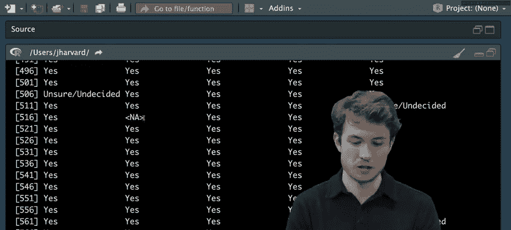

但R至少没有立即给我们一种像这样精确表示表格的方法。如果你想长期存储这些数据，你需要将其存储在文件中。在文件中表示像这样的数据的一种流行方式是使用CSV文件或逗号分隔值文件。所以，这里是相同的数据表示，但现在作为CSV文件。注意，这里有相同的列名：`candidate`、`poll`、`mail`。我仍然有相同的列值：Mario、Peach、Bowser、37、43、84等等。但你可能注意到，列现在使用这些逗号分隔，这是有道理的，这是一个逗号分隔值文件或CSV文件。每一行在文件中仍然在自己的行上，但现在这些列用逗号表示。

那么，让我们看看如何使用R来读入这个CSV文件，并给我们一个实际的数据表格来处理。我来到RStudio，我实际可能想做的第一件事是清理我的工作空间。如果我想查看当前环境中有什么，我可以在控制台输入这个函数`ls()`，然后按回车。现在我会看到我环境中仍然存在的所有对象，来自一些先前的程序。当我编写一些全新的程序时，我可能想摆脱这些。所以，要做到这一点，我可以使用这个叫做`rm()`的函数，它代表移除，而`ls`代表列表。我可以使用`rm()`，事实证明`rm()`接受一个名为`list`的命名参数，即我想要从环境中移除的值列表。我会说这个列表是调用`ls()`的结果，也就是说，它将包括`bowser`、`greeting`、`mario`、`name`、`peach`和`total`——所有这些我不再想要的前对象。我按回车，然后再次输入`ls()`。现在我会看到`character(0)`，这基本上是说这里什么都没有。我的环境中有一个空字符串，什么都没有。

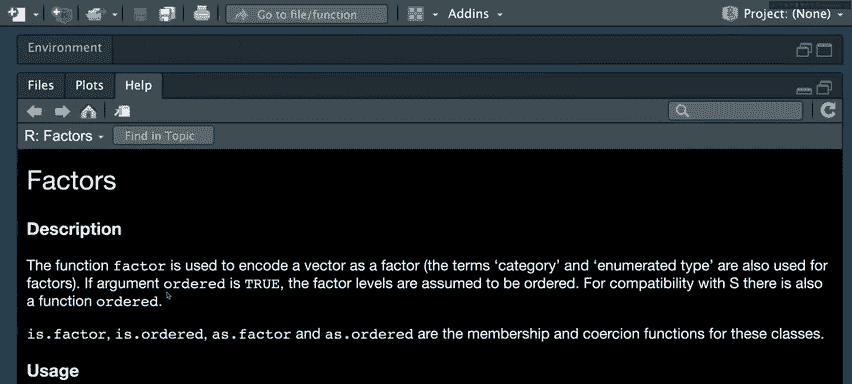

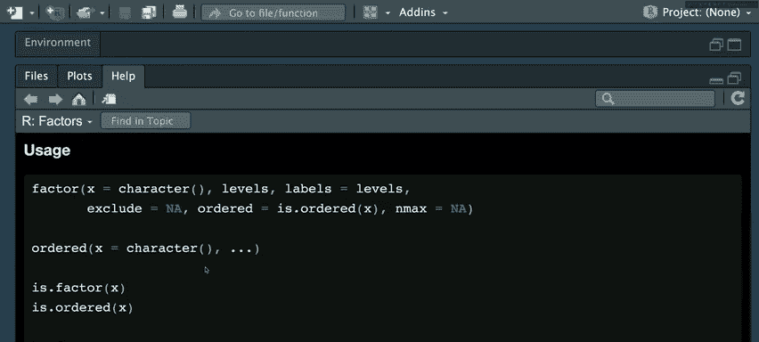

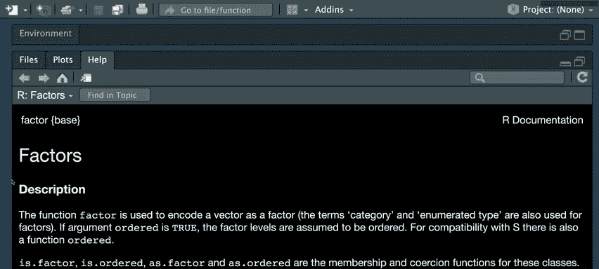

所以现在我的环境是干净的，这里没有对象。让我实际创建一个新程序，一个叫做`tabulate.R`，来表示我们将如何对这个数据表格进行制表，并找出每个候选人和每种投票方式的票数。我输入`file.create("tabulate.R")`，按回车，我会看到文件为我创建。我转到我的文件资源管理器，打开`tabulate.R`。

实际上，注意在我的文件资源管理器中，我确实有这个名为`votes.csv`的文件。如果我点击它，我可以实际查看里面有什么。注意，我有和幻灯片上看到的完全一样的东西：`candidate,poll,mail`，然后是我的数据集中每一行的一行。

所以，我们的目标是读取这个CSV并将其存储在R中，这样我们就可以实际获得一个数据表格在R中处理。一个我可以用来从这样的文件中读取数据的函数实际上叫做`read.table()`。我可以给`read.table()`我想要读取或加载到R中的文件名。那个文件名是`votes.csv`。因为`votes.csv`在那个工作目录中，我可以简单地通过其普通名称来引用它。

`read.table()`有返回值，它会返回给我一个数据表格。所以，我实际上要存储那个，比如说，在这个叫做`votes`的表格中。现在让我只运行这行R代码，我可以点击这里的“Run”，或者在Mac上按Command+Enter，在Windows上按Ctrl+Enter。我在Mac上按Command+Enter，现在根据控制台，我已经读取了投票数据表格。

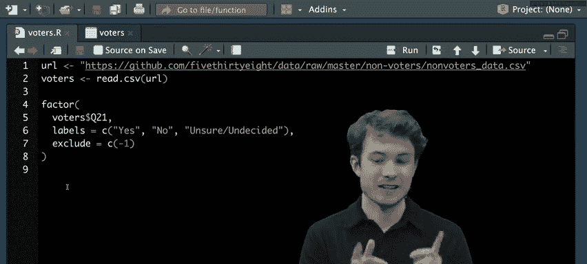

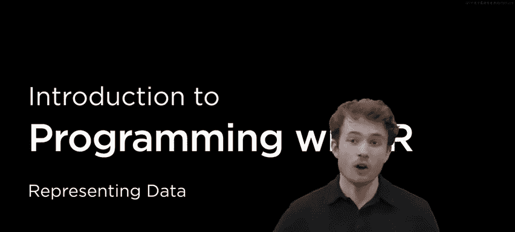

如果我想看看它是什么样子，有几种方法可以做到。我实际上可以查看我的环境，让我们先试试这个。我转到环境，我会看到以下内容：`votes`似乎有4个观测值和1个变量。观测值实际上指的是我返回的表格中的行数，变量指的是列数。你可能已经在想，这似乎不对，因为我认为我至少有3行，我至少有3列，而我似乎有4