# R语言编程入门：第2讲：数据转换


## 概述

在本节课中，我们将学习如何转换数据。我们将看到如何移除不需要的数据片段、如何对数据进行子集化以查找我们想要查看的特定部分，以及最终如何将来自不同来源的数据组合成一个单一的数据集。

## 识别和移除异常值

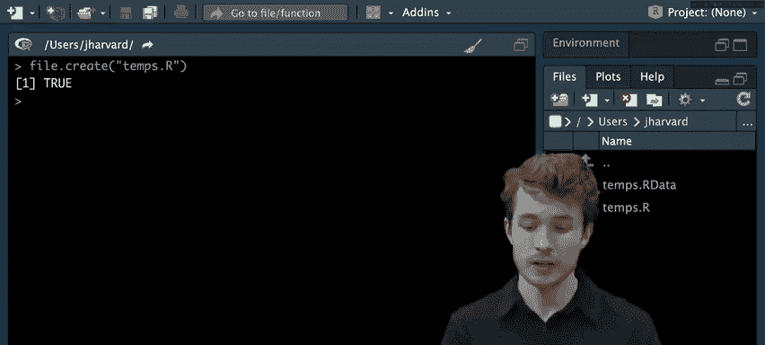

上一节我们介绍了数据的基本概念，本节中我们来看看如何处理数据中的异常值。在统计学或数据科学中，你可能会听说过“异常值”这个概念，即落在某个标准范围之外的数据点。

例如，下图显示了美国东北部一月份的平均气温。Y轴是华氏温度，X轴是月份中的日期（1到31日）。大多数条形图显示温度在0到50华氏度之间，但似乎有几天超出了这个范围：第2天和第4天异常寒冷（约-10到-20度），而第7天异常温暖（约60度）。这些就是数据集中的异常值。出于某种原因，你可能希望作为科学家或统计学家完全移除这些异常值，并在不包含它们的情况下进行分析。


让我们看看如何使用R来解决异常值问题。

### 加载数据

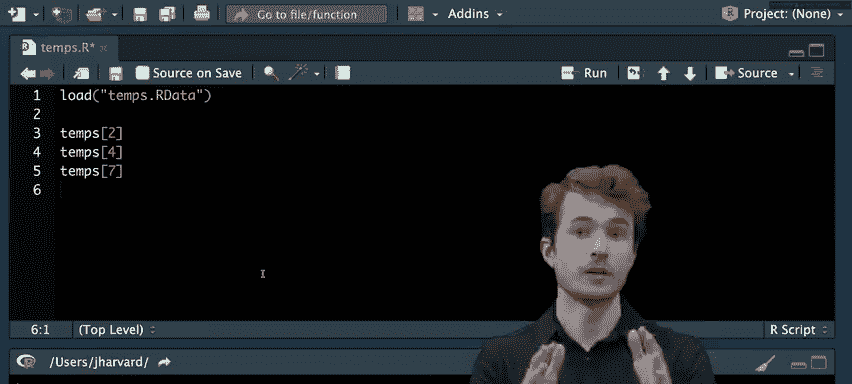

首先，我们回到RStudio集成开发环境。我们将创建一个新文件来编写R代码。

```r
file.create("temps.R")
```


现在，我们打开这个文件。在R中，我们经常需要从文件中读取数据。除了CSV文件，R还可以处理特定于R的R数据文件格式。R数据文件可以存储R的数据结构（如向量、数据框），加载时可以直接在环境中看到相同的向量或数据框。

要加载一个R数据文件，我们可以使用`load()`函数。

```r
load("temps.RData")
```

运行这行代码后，如果查看环境面板，应该会看到一个名为`temps`的向量，其中包含31个数字（代表31天的温度）。

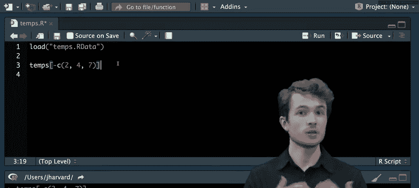

### 计算平均值并识别异常值

首先，计算整个一月份的平均温度。我们可以使用`mean()`函数。

```r
mean(temps)
```
输出结果约为22.74华氏度。


但我们的目标是处理异常值。让我们先查看整个向量。

```r
temps
```

在输出中，我们可以看到异常值：第2天为-15度，第4天为-20度，第7天为65度。

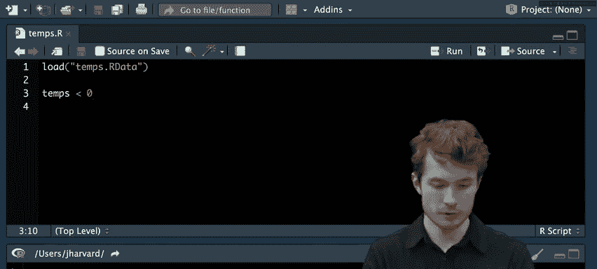

之前，我们学习了使用索引从向量中提取特定值。

```r
temps[2]  # 返回 -15
temps[4]  # 返回 -20
temps[7]  # 返回 65
```


但我们希望得到一个包含所有异常值的向量，而不是单独处理它们。我们可以通过提供一个索引向量来实现。

```r
temps[c(2, 4, 7)]
```
这将返回一个包含这三个异常值的新向量：`c(-15, -20, 65)`。

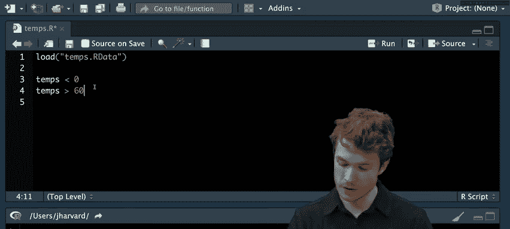

### 移除异常值

要移除这些值，我们可以在索引向量前使用减号`-`。

```r
temps[-c(2, 4, 7)]
```
现在，返回的向量将不包含第2、4、7天的温度。但请注意，这并没有修改原始的`temps`向量，只是返回了一个新向量。要永久更新`temps`，需要重新赋值。


```r
temps <- temps[-c(2, 4, 7)]
```

## 使用逻辑表达式自动识别异常值

手动查找索引效率低下。更好的方法是询问数据：“这个数据点是异常值吗？”在R中，我们可以使用**逻辑表达式**来表达这种是/否问题。

逻辑表达式通常使用**比较运算符**：
*   `==`：等于
*   `!=`：不等于
*   `>`：大于
*   `>=`：大于或等于
*   `<`：小于
*   `<=`：小于或等于

这些运算符返回**逻辑值**：`TRUE`（真）或`FALSE`（假）。

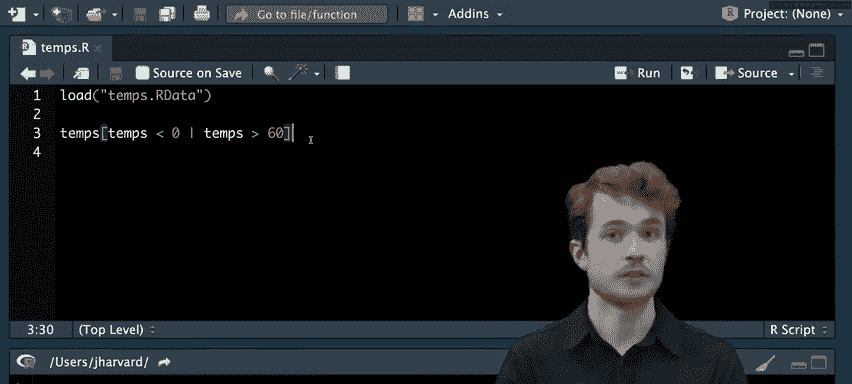

让我们用逻辑表达式来识别低温异常值（例如，低于0度）。

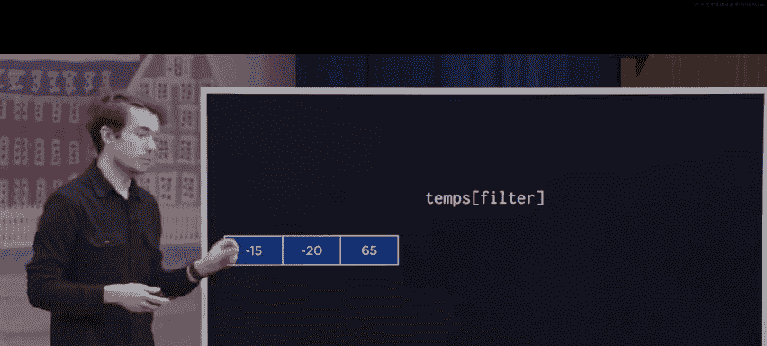

```r
temps[2] < 0  # 对单个元素提问，返回 TRUE
temps[4] < 0  # 返回 TRUE
```

但逐个元素提问仍然繁琐。好在比较运算符是**向量化**的，可以对整个向量进行操作。

```r
temps < 0
```
这将返回一个与`temps`长度相同的逻辑向量，其中对应位置温度低于0度的元素为`TRUE`。

我们可以使用`which()`函数找出逻辑向量中`TRUE`值对应的索引。

```r
which(temps < 0)
```
返回 `2, 4`。

### 组合逻辑条件

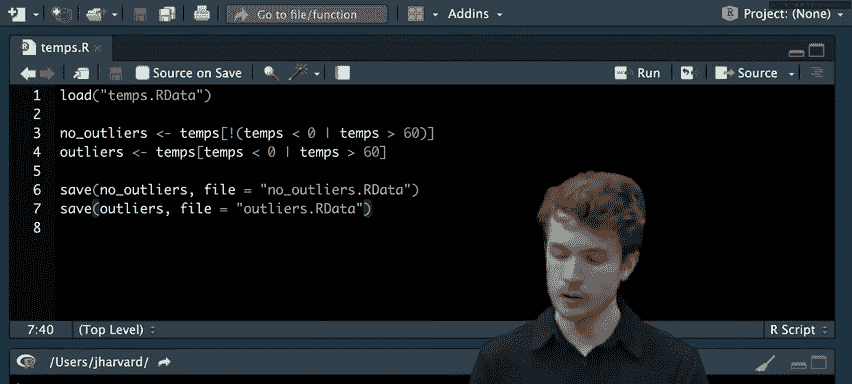

异常值可能既包含极低值也包含极高值。我们想找到温度低于0度**或**高于60度的数据点。这需要使用**逻辑运算符**来组合逻辑表达式。


逻辑运算符：
*   `&`：AND（与） - 用于向量
*   `&&`：AND（与） - 用于单个逻辑值
*   `|`：OR（或） - 用于向量
*   `||`：OR（或） - 用于单个逻辑值

我们使用`|`来组合条件。

```r
temps < 0 | temps > 60
```
现在，逻辑向量中，温度低于0度**或**高于60度的位置为`TRUE`。使用`which()`可以找到这些位置的索引。

```r
which(temps < 0 | temps > 60)
```
返回 `2, 4, 7`。

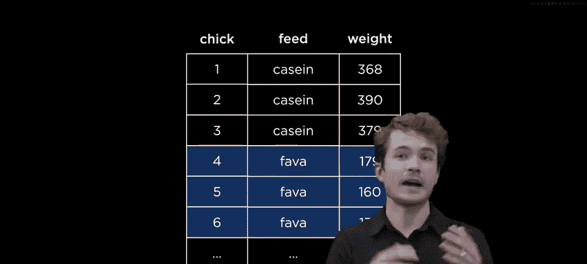

### 使用逻辑向量进行子集化

实际上，我们可以直接用逻辑向量对向量进行子集化。R会返回所有对应逻辑值为`TRUE`的元素。

```r
filter <- temps < 0 | temps > 60
temps[filter]
```
这将直接返回异常值向量 `c(-15, -20, 65)`。

要获取非异常值，可以使用逻辑非运算符`!`来取反。

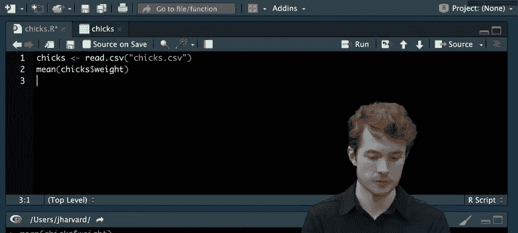


```r
temps[!(temps < 0 | temps > 60)]
```
或者，更清晰的方式是：

```r
no_outliers <- temps[!(temps < 0 | temps > 60)]
outliers <- temps[temps < 0 | temps > 60]
```

### 保存结果

最后，我们可以使用`save()`函数将处理后的向量保存为R数据文件。

```r
save(no_outliers, file = "no_outliers.RData")
save(outliers, file = "outliers.RData")
```

## 对数据框进行子集化

上一节我们学习了如何对向量进行子集化，本节中我们来看看如何将这些工具应用于整个数据表，以找出我们感兴趣的数据子集。

我们将使用一个关于小鸡生长的数据集。数据框中，每一行代表一只小鸡，列包括：
*   `chick`：小鸡编号
*   `feed`：饲料类型（如酪蛋白、蚕豆、亚麻籽等）
*   `weight`：两周后的体重（克）

我们感兴趣的是：不同饲料组的小鸡平均体重是多少？这有助于分析哪种饲料更有营养。

### 加载和查看数据

首先，创建新文件并加载数据。

```r
file.create("chicks.R")
chicks <- read.csv("chicks.csv")
View(chicks)
```

数据中包含一些`NA`（不可用）值，我们需要处理它们。

### 处理NA值并计算总体平均

直接计算体重列的平均值会因为`NA`值而返回`NA`。

```r
mean(chicks$weight)  # 返回 NA
```

我们需要告诉`mean()`函数如何处理`NA`值。使用参数`na.rm = TRUE`来移除它们。

```r
mean(chicks$weight, na.rm = TRUE)  # 返回约 287.7 克
```

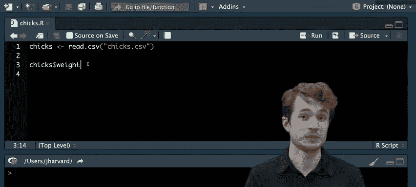

### 基于条件子集化数据框


我们想找出所有喂食“酪蛋白”的小鸡。一种方法是使用行索引。

```r
casein_chicks <- chicks[c(1, 2, 3), ]  # 假设前3行是酪蛋白组
mean(casein_chicks$weight, na.rm = TRUE)  # 返回约 379 克
```

使用`:`运算符可以简化连续索引的创建。

```r
chicks[1:3, ]
```

但更好的方法是使用逻辑表达式。我们关心的是`feed`列等于“casein”的行。

```r
chicks$feed == "casein"
```
这将返回一个逻辑向量，指示每行饲料是否为“casein”。

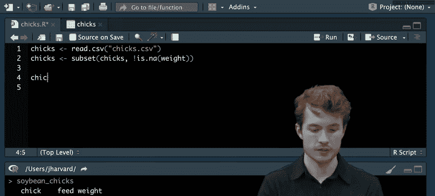

我们可以用这个逻辑向量对数据框进行子集化。

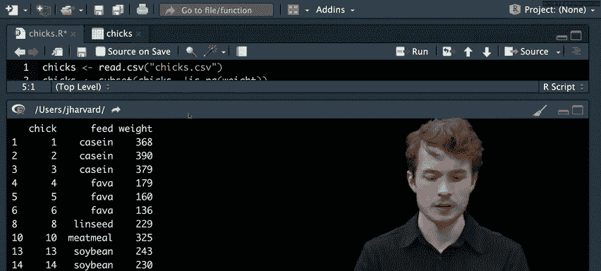

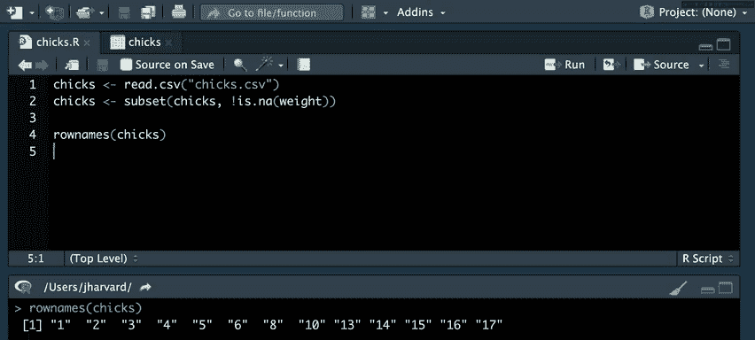

```r
filter <- chicks$feed == "casein"
casein_chicks <- chicks[filter, ]
```


R中还有一个专门的`subset()`函数，语法更简洁。

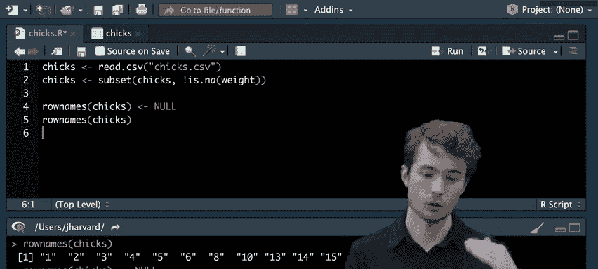

```r
casein_chicks <- subset(chicks, feed == "casein")
```

### 移除含有NA值的行


为了在后续分析中避免反复使用`na.rm = TRUE`，最好先移除体重为`NA`的行。我们可以使用`is.na()`函数来检测`NA`值。

```r
# 找出体重不是NA的行
weight_not_na <- !is.na(chicks$weight)
chicks <- chicks[weight_not_na, ]

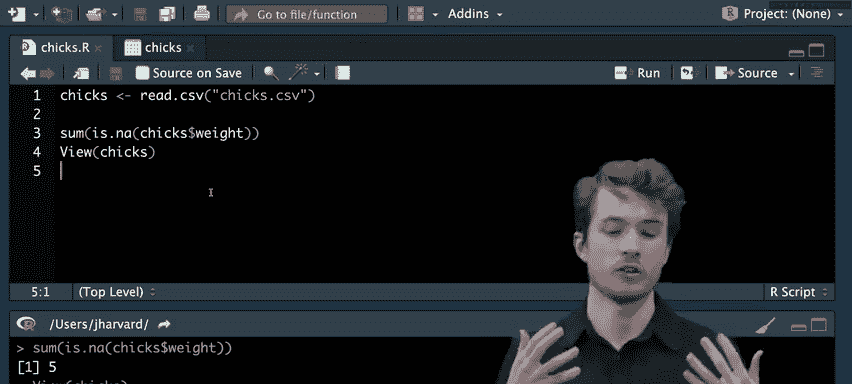

# 或者使用 subset 函数
chicks <- subset(chicks, !is.na(weight))
```

移除行后，数据框的行名（rownames）可能不再连续。我们可以将其重置为`NULL`，R会自动生成连续的行名。


```r
rownames(chicks) <- NULL
```

### 计数NA值

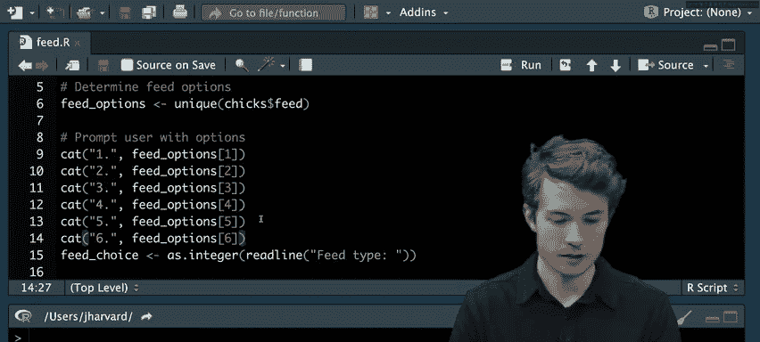

有时我们需要知道数据中有多少`NA`值。由于逻辑值`TRUE`在底层对应数字`1`，`FALSE`对应`0`，我们可以对逻辑向量求和来计数。


```r
sum(is.na(chicks$weight))  # 返回NA值的数量
```

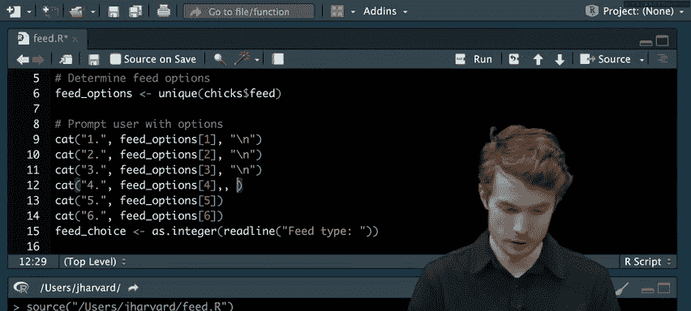

## 创建用户交互式菜单


上一节我们实现了程序化的数据子集化，本节中我们将把控制权交给用户，让他们选择要查看的数据子集。我们将创建一个文本菜单，让用户选择饲料类型，然后程序显示对应的数据子集。

### 显示选项菜单

首先，我们需要向用户展示可用的饲料选项。使用`unique()`函数获取`feed`列中的所有不重复值。

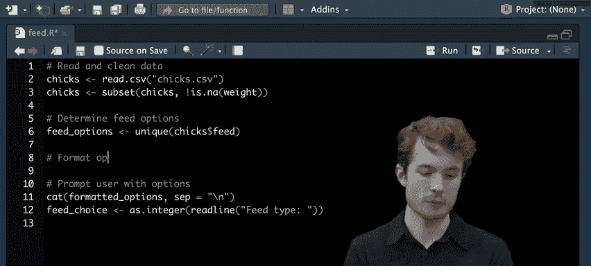

```r
feed_options <- unique(chicks$feed)
```

然后，我们需要格式化这些选项（例如，“1. casein”, “2. soybean”）。我们可以使用`paste()`或`paste0()`函数来连接字符串。为了高效处理，我们以向量化的方式思考：我们需要一个数字向量（1, 2, 3...）、一个固定的分隔符（“. ”）和饲料选项向量。

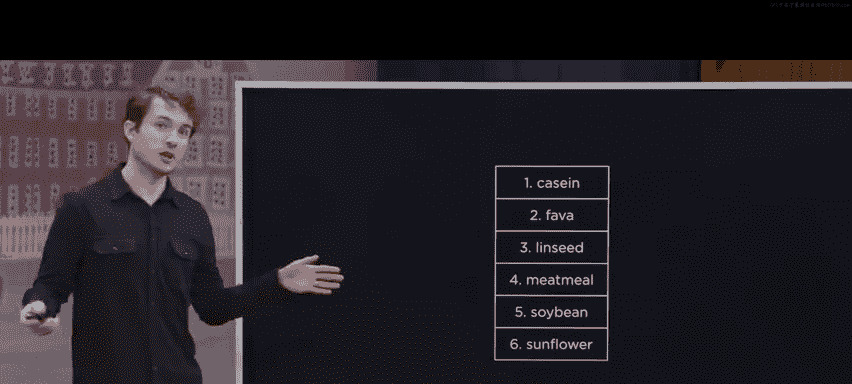

`paste0()`函数可以接受向量作为输入，并**按元素**进行连接。如果输入的向量长度不同，R会**循环利用**较短的向量以匹配最长向量的长度。

```r
formatted_options <- paste0(1:length(feed_options), ". ", feed_options)
```

为了使程序更健壮，我们使用`length(feed_options)`动态确定选项数量，而不是硬编码数字。

现在，使用`cat()`函数和换行符`\n`（转义字符）将格式化后的选项打印给用户。

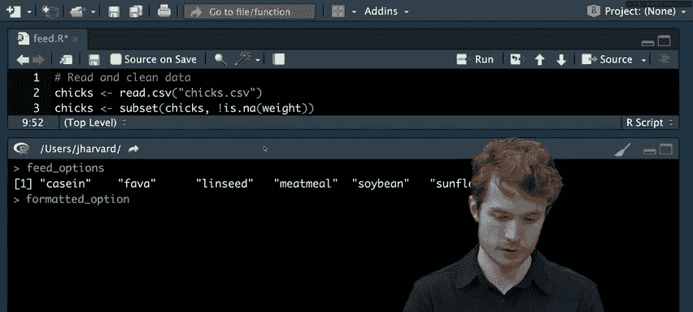

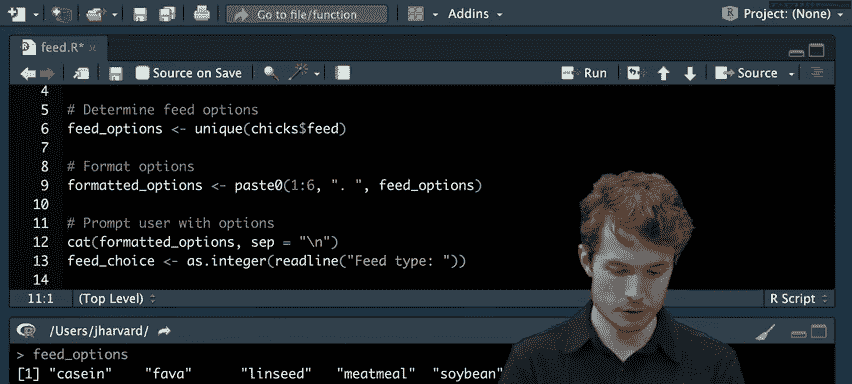

```r
cat(formatted_options, sep = "\n")
```

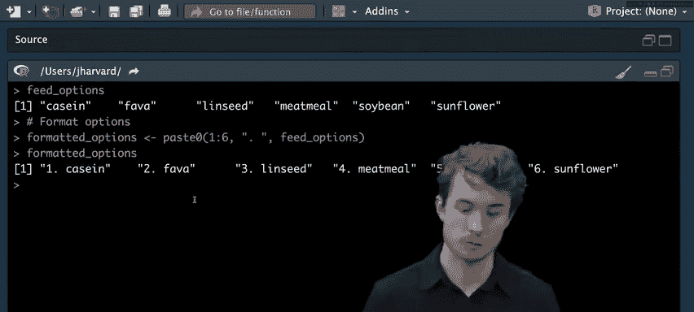

### 获取用户输入并显示子集


使用`readline()`函数获取用户输入的数字。

```r
feed_choice <- as.integer(readline("Enter the number of the feed type to view: "))
```

将用户输入的数字转换为对应的饲料类型字符。

```r
selected_feed <- feed_options[feed_choice]
```

最后，显示用户选择的子集。

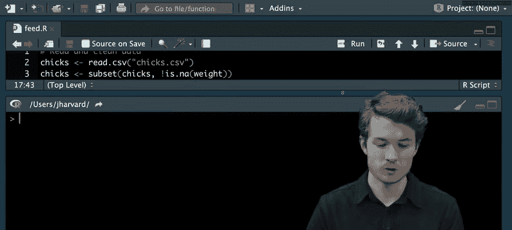


```r
selected_subset <- subset(chicks, feed == selected_feed)
print(selected_subset)
```

### 添加输入验证

用户可能输入无效数字（如0或7）。我们需要使用**条件语句**来处理这种情况。

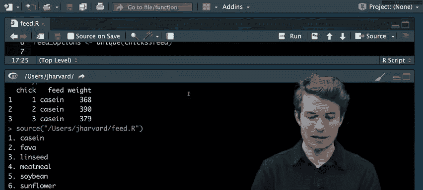


条件语句允许我们根据逻辑表达式的真假来有条件地运行代码块。主要关键字是`if`、`else if`和`else`。

```r
if (feed_choice < 1 | feed_choice > length(feed_options)) {
  cat("Invalid choice.\n")
} else {
  selected_feed <- feed_options[feed_choice]
  selected_subset <- subset(chicks, feed == selected_feed)
  print(selected_subset)
}
```
如果用户输入无效，程序打印错误信息并跳过显示子集的代码。如果输入有效，则执行`else`块中的代码。

## 合并不同来源的数据

在数据处理中，数据通常存储在不同的表格中。我们需要将它们合并成一个数据集进行分析。假设一个电子商务公司，其销售数据按季度（Q1, Q2, Q3, Q4）存储在四个独立的CSV文件中。我们的任务是将它们合并。

### 读取和合并数据

首先，读取每个季度的数据。

```r
q1 <- read.csv("Q1.csv")
q2 <- read.csv("Q2.csv")
q3 <- read.csv("Q3.csv")
q4 <- read.csv("Q4.csv")
```

如果这些数据框具有相同的列数和列名，我们可以使用`rbind()`函数按行合并它们。

```r
sales <- rbind(q1, q2, q3, q4)
```
`rbind()`将第二个及后续数据框的行追加到第一个数据框的底部，生成一个更长的数据框。

### 添加标识列

合并后，我们丢失了每条销售记录属于哪个季度的信息。因此，在合并前，最好给每个季度的数据框添加一个标识列。

```r
q1$quarter <- "Q1"
q2$quarter <- "Q2"
q3$quarter <- "Q3"
q4$quarter <- "Q4"
```
现在，每个数据框都有一个`quarter`列。确保所有数据框列数一致后，再进行`rbind()`。

```r
sales <- rbind(q1, q2, q3, q4)
```

### 基于条件创建新列

假设我们想根据销售额对交易进行分类：超过100美元的为“高价值”，否则为“常规”。我们可以使用`ifelse()`函数，它非常适合向量化操作。

`ifelse()`函数接受三个参数：
1.  一个逻辑向量（条件）。
2.  条件为`TRUE`时返回的值。
3.  条件为`FALSE`时返回的值。

```r
sales$value <- ifelse(sales$sale_amount > 100, "high value", "regular")
```
这行代码会创建一个新列`value`，根据`sale_amount`的值填充“high value”或“regular”。

## 总结

本节课中我们一起学习了数据转换的核心技能：
1.  **识别和移除异常值**：使用逻辑表达式（比较运算符和逻辑运算符）和逻辑向量来识别数据中的异常点，并通过索引或取反操作将其移除或提取。
2.  **数据框子集化**：使用逻辑条件对数据框进行子集化，以聚焦于特定的数据子集（如特定饲料组的小鸡）。学习了`subset()`函数和如何处理`NA`值。
3.  **创建交互式程序**：使用`cat()`、`readline()`和条件语句（`if`, `else`）构建简单的用户菜单，使程序能够响应用户输入并显示相应的数据。
4.  **合并数据**：使用`rbind()`函数将结构相同的多个数据框按行合并成一个更大的数据集，并学习了如何添加标识列以保留数据来源信息。
5.  **数据分类**：使用`ifelse()`函数基于现有列的值创建新的分类列。

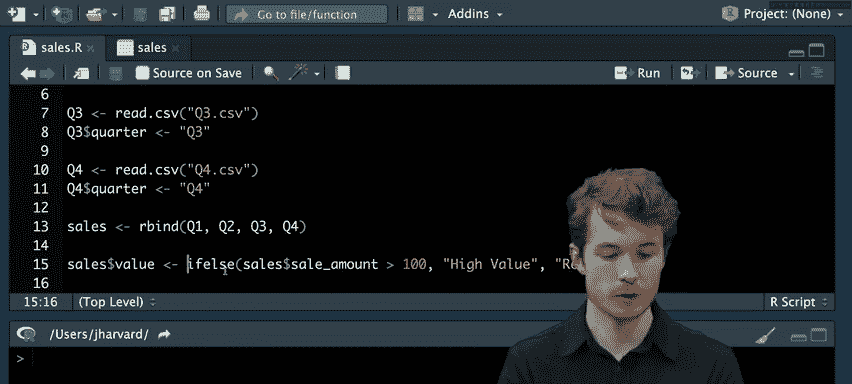

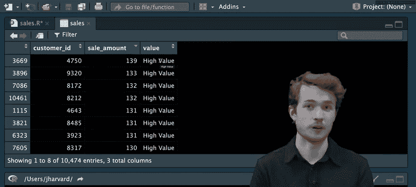

通过这些技术，你可以清理、筛选、组合数据，为后续的分析和可视化做好准备。下一讲，我们将更深入地学习函数，并开始编写自己的函数。