# 004：应用函数 🧮


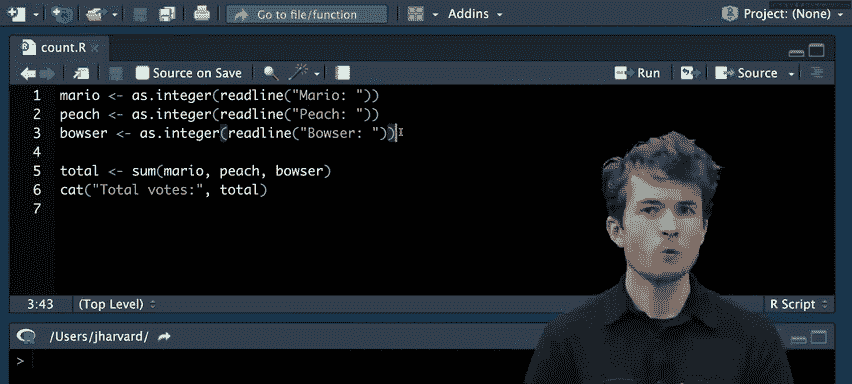


在本节课中，我们将要学习如何编写自己的函数，以及如何使用循环来重复执行代码。课程结束时，我们将结合这两个概念，初步探索函数式编程。

## 定义自己的函数 🛠️

上一节我们介绍了R语言的基础操作，本节中我们来看看如何创建自定义函数。函数允许我们将代码块封装起来，以便重复使用，从而提高代码的可读性和可维护性。

### 函数的基本结构

在R中，我们使用 `function` 关键字来创建函数。一个函数通常包含名称、参数和函数体。

**公式**：
```r
函数名 <- function(参数1, 参数2, ...) {
  # 函数体
  # 执行的代码
  return(返回值)
}
```

### 创建第一个函数

让我们从一个简单的投票计数程序开始。原始程序重复了三次相同的代码来获取用户输入。

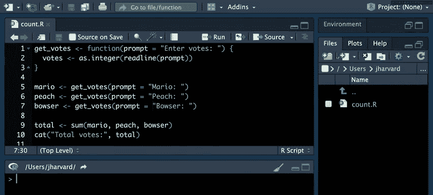

```r
# 原始代码示例
mario <- as.integer(readline("Mario: "))
peach <- as.integer(readline("Peach: "))
bowser <- as.integer(readline("Bowser: "))
total <- mario + peach + bowser
cat("Total votes:", total, "\n")
```

我们可以将获取投票的逻辑封装成一个函数。


```r
# 定义函数 get_votes
get_votes <- function(prompt = "Enter votes: ") {
  votes <- as.integer(readline(prompt))
  return(votes)
}

# 使用函数
mario <- get_votes("Mario: ")
peach <- get_votes("Peach: ")
bowser <- get_votes("Bowser: ")
total <- mario + peach + bowser
cat("Total votes:", total, "\n")
```

### 处理用户输入错误

用户可能会输入非数字内容。我们需要在函数中添加错误处理逻辑。

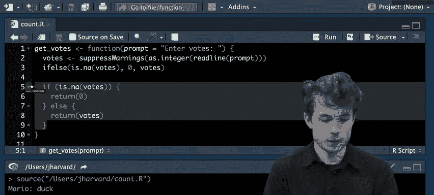

```r
get_votes <- function(prompt = "Enter votes: ") {
  # 使用 suppressWarnings 来抑制转换警告
  votes <- suppressWarnings(as.integer(readline(prompt)))
  # 使用 ifelse 处理 NA 值
  return(ifelse(is.na(votes), 0, votes))
}
```

### 函数的作用域

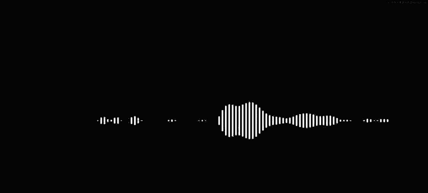

在函数内部创建的变量（如 `votes` 和 `prompt`）只存在于该函数的**作用域**内。这意味着在函数外部无法直接访问这些变量。这种设计有助于保护数据并避免命名冲突。

## 使用循环重复代码 🔄

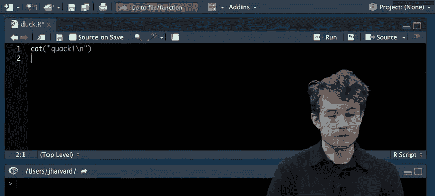

当我们发现自己在重复相同的代码块时，循环是一个强大的工具。它允许我们根据条件或次数重复执行代码。

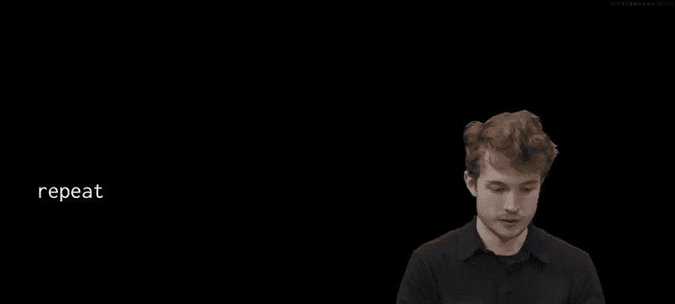

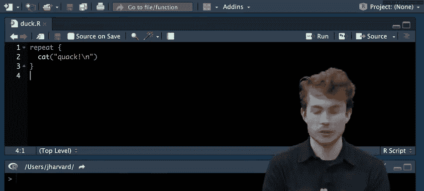

### 循环的类型


R语言提供了几种循环结构：

1.  **`repeat` 循环**：无限循环，直到遇到 `break` 语句。
2.  **`while` 循环**：当指定条件为真时重复执行。
3.  **`for` 循环**：遍历向量或列表中的每个元素。

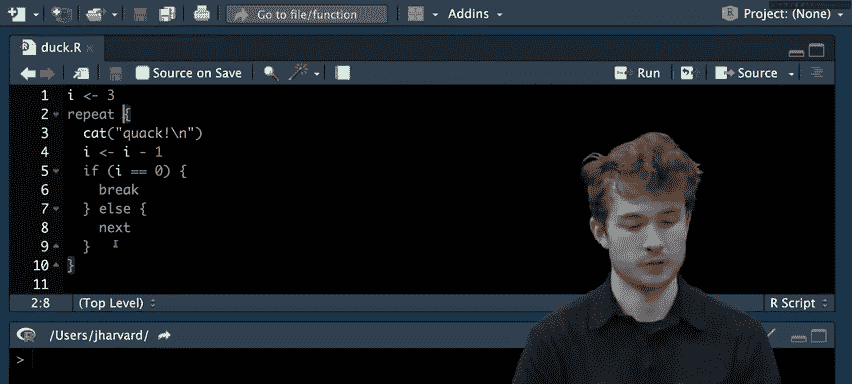

### repeat 循环示例


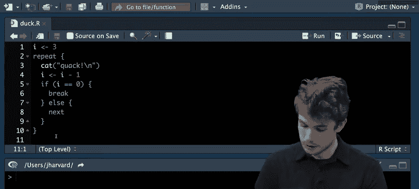

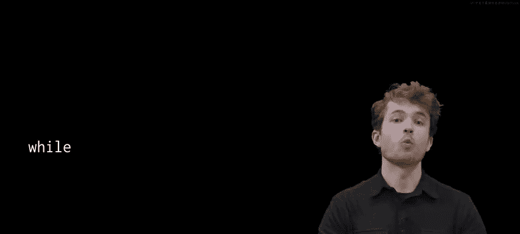

`repeat` 循环至少会执行一次代码块。

```r
# 模拟挤压鸭子玩具三次
i <- 3
repeat {
  cat("Quack\n")
  i <- i - 1
  if (i == 0) break
}
```

### while 循环示例

`while` 循环在每次迭代前检查条件。

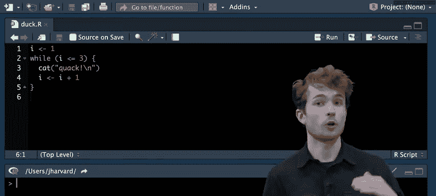


```r
# 使用 while 循环挤压鸭子三次
i <- 3
while (i > 0) {
  cat("Quack\n")
  i <- i - 1
}
```

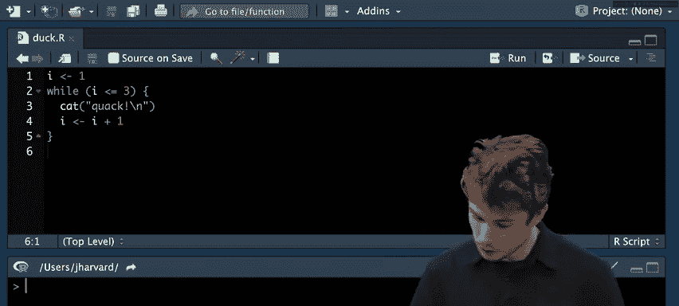


### for 循环示例

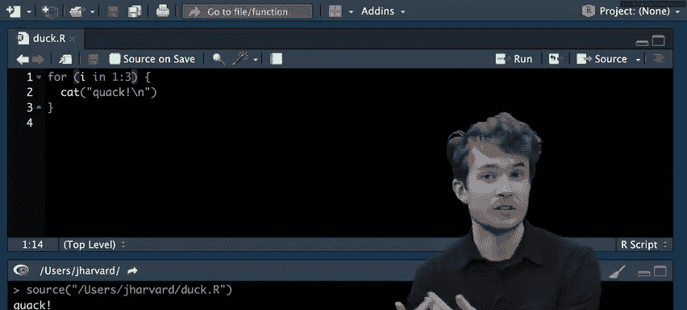


`for` 循环非常适合遍历集合中的元素。

```r
# 使用 for 循环挤压鸭子三次
for (i in 1:3) {
  cat("Quack\n")
}
```

## 结合函数与循环优化程序 🚀

现在，让我们将函数和循环结合起来，改进我们的投票程序。目标是持续提示用户，直到他们输入有效的数字。

```r
get_votes <- function(prompt = "Enter votes: ") {
  repeat {
    votes <- suppressWarnings(as.integer(readline(prompt)))
    if (!is.na(votes)) {
      return(votes)
    }
    # 如果 votes 是 NA，循环会继续，重新提示用户
  }
}

# 使用 for 循环为每个候选人获取投票
candidates <- c("Mario", "Peach", "Bowser")
total <- 0

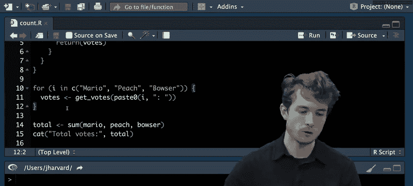

for (candidate in candidates) {
  votes <- get_votes(paste0(candidate, ": "))
  total <- total + votes
}

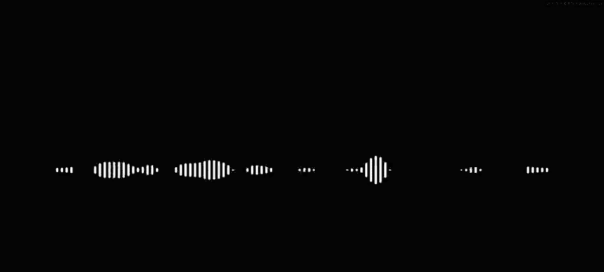

cat("Total votes:", total, "\n")
```

## 函数式编程与 apply 函数族 📊

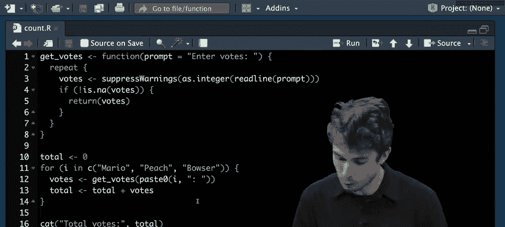

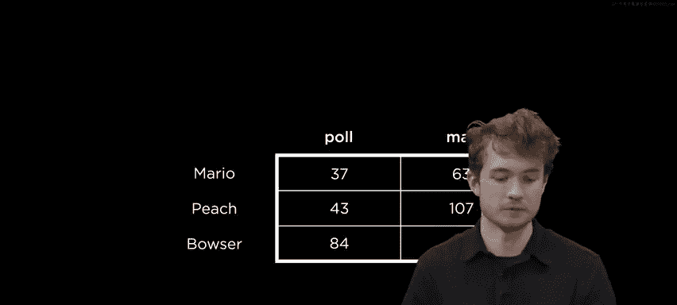

函数式编程的核心思想是使用函数来处理数据，而不是详细描述每一步操作。R中的 `apply` 函数族是这一思想的典型体现。

### 使用 apply 函数

假设我们有一个数据框 `votes`，包含候选人在不同投票方式下的得票数。

```r
# 假设 votes 数据框
#          Poll Mail
# Mario     37   63
# Peach     43  107
# Bowser    21   99

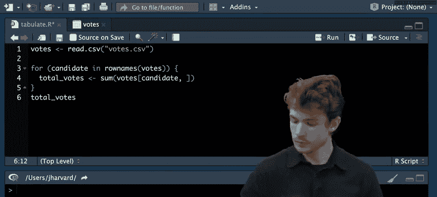

# 使用 apply 计算每行的总和（每个候选人的总票数）
row_totals <- apply(votes, 1, sum)
# 结果: Mario: 100, Peach: 150, Bowser: 120

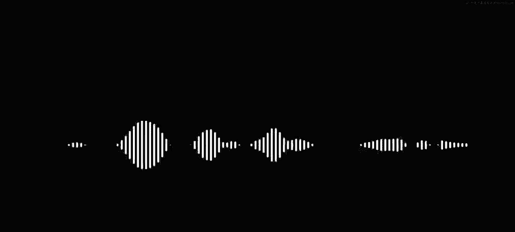

# 使用 apply 计算每列的总和（每种投票方式的总票数）
col_totals <- apply(votes, 2, sum)
# 结果: Poll: 101, Mail: 269
```

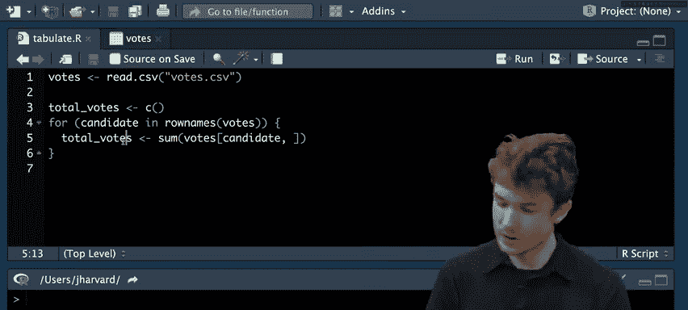


**代码解释**：
*   `apply(votes, 1, sum)`：`1` 表示按行应用 `sum` 函数。
*   `apply(votes, 2, sum)`：`2` 表示按列应用 `sum` 函数。

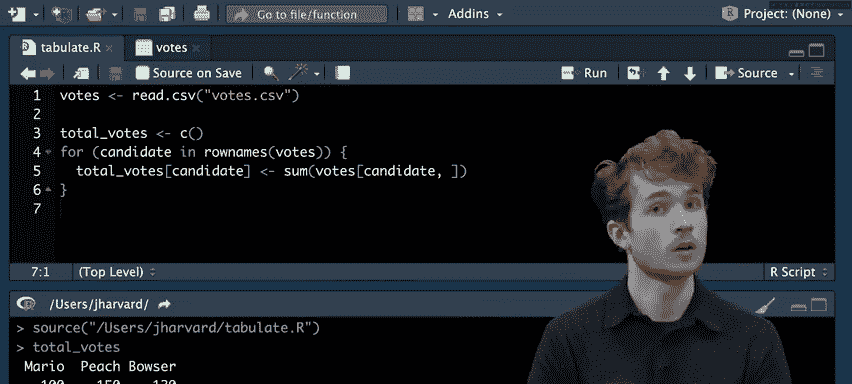

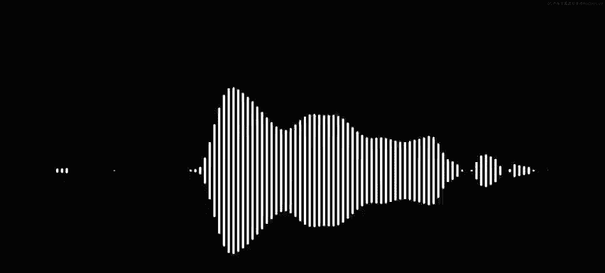

与手动编写 `for` 循环相比，`apply` 函数使代码更简洁、更易读。

### 数据排序

我们可以使用 `sort` 函数对结果进行排序。

```r
# 对行总和进行降序排序
sorted_totals <- sort(row_totals, decreasing = TRUE)
```

## 总结 📝

本节课中我们一起学习了R语言编程中的几个核心概念：

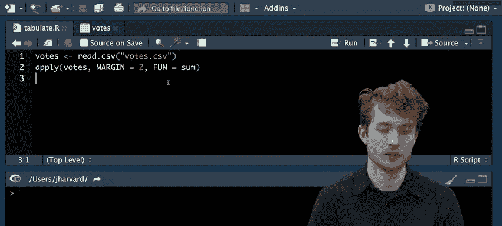


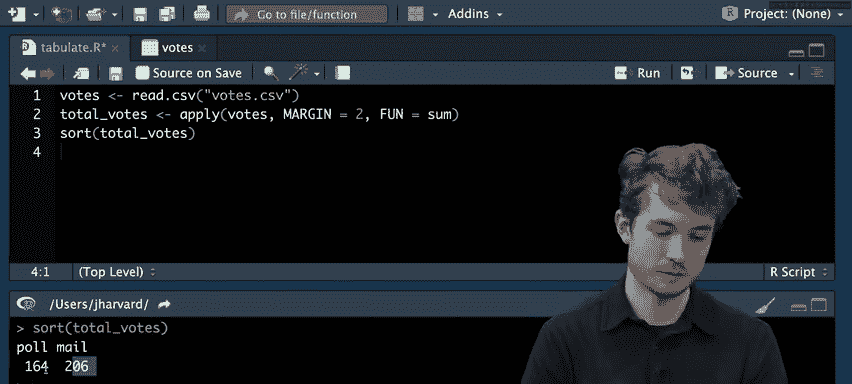

1.  **自定义函数**：我们学会了如何使用 `function` 关键字创建函数，包括定义参数、函数体和返回值。我们还探讨了函数作用域的概念。
2.  **循环结构**：我们介绍了三种循环：`repeat`、`while` 和 `for` 循环，并理解了它们各自适用的场景。
3.  **错误处理**：我们通过 `suppressWarnings` 和条件判断（`ifelse`）来优雅地处理用户可能输入的错误数据。
4.  **函数式编程入门**：我们接触了 `apply` 函数族，它允许我们将函数应用于数据结构的行或列，这是一种更声明式、更高效的编程风格。

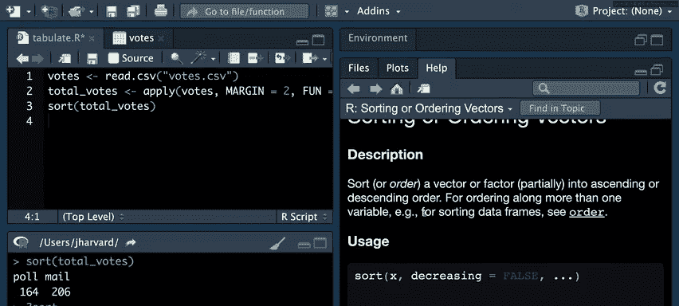

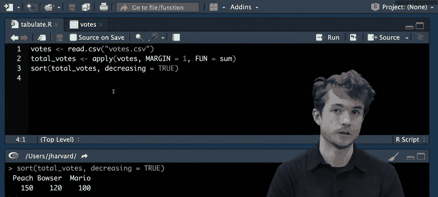

通过将重复的代码封装成函数，并使用循环或 `apply` 函数来处理重复性任务，我们可以编写出更清晰、更健壮且更易于维护的R语言程序。