# R语言编程入门：第4讲：数据整理 🧹


在本节课中，我们将学习如何使用R语言中的工具来整理和清洗数据。数据常常以混乱的格式出现，例如表格形状不正确、格式错误或包含不需要的字符。通过使用他人编写的代码包，我们可以高效地解决这些问题。今天，我们将重点介绍一个名为 **tidyverse** 的包集合，它包含多个用于数据转换、可视化和字符串处理的工具。

---

## 安装与加载 tidyverse 📦

要使用 `tidyverse`，首先需要安装并加载它。`tidyverse` 实际上是一个包的集合，其中包括 `dplyr`（用于数据转换）、`ggplot2`（用于数据可视化）、`stringr`（用于处理字符串）和 `tidyr`（用于整理数据）。

```r
# 安装 tidyverse
install.packages("tidyverse")

# 加载 tidyverse
library(tidyverse)
```

安装后，我们可以使用 `library()` 函数将其加载到当前会话中。请注意，**包**（package）是他人编写的可重用代码，而**库**（library）是这些包在您计算机上的存储位置。

---

## 使用 dplyr 转换数据 🔧

`dplyr` 是 `tidyverse` 中用于数据转换的核心包。它提供了一系列函数，可以类比为“钳子”，用于将数据塑造成我们想要的形状。我们将学习六个主要函数：

*   `select`: 选择数据框中的特定列。
*   `filter`: 根据条件筛选行。
*   `arrange`: 对行进行排序。
*   `distinct`: 查找唯一的行。
*   `group_by`: 对数据进行分组。
*   `summarize`: 对分组数据进行汇总。

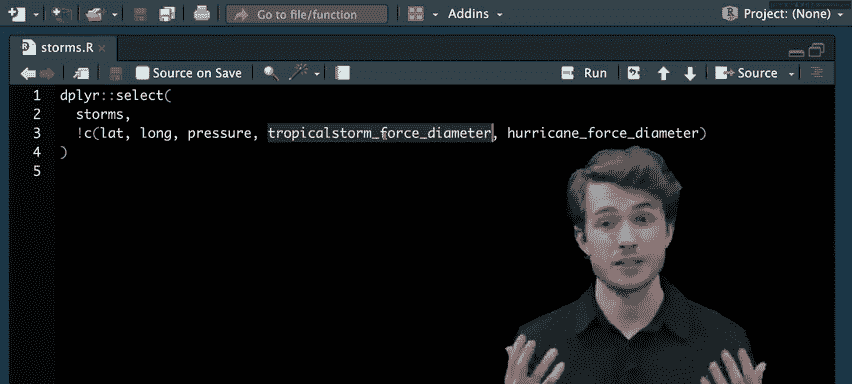


我们将使用 `dplyr` 内置的 `storms` 数据集进行演示。该数据集记录了北大西洋地区强风暴的观测数据，包含风暴名称、年份、状态、风速等信息。

```r
# 查看 storms 数据集
storms
```

输出显示这是一个 **tibble**（一种增强型的数据框），共有 19537 行和 13 列。列信息包括风暴名称（`name`）、年份（`year`）、状态（`status`，如飓风）、风速（`wind`）等。

---

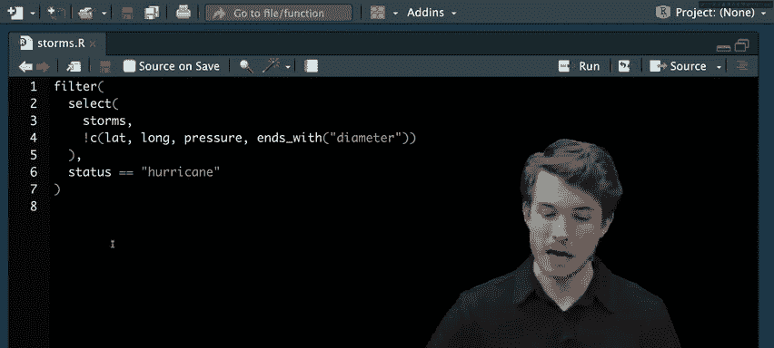

### 1. 选择列 (select)

假设我们只想保留与风暴强度和名称相关的列，而去除经纬度、气压等列。我们可以使用 `select()` 函数。

```r
# 方法1：明确列出要删除的列
dplyr::select(storms, -lat, -long, -pressure, -tropicalstorm_force_diameter, -hurricane_force_diameter)


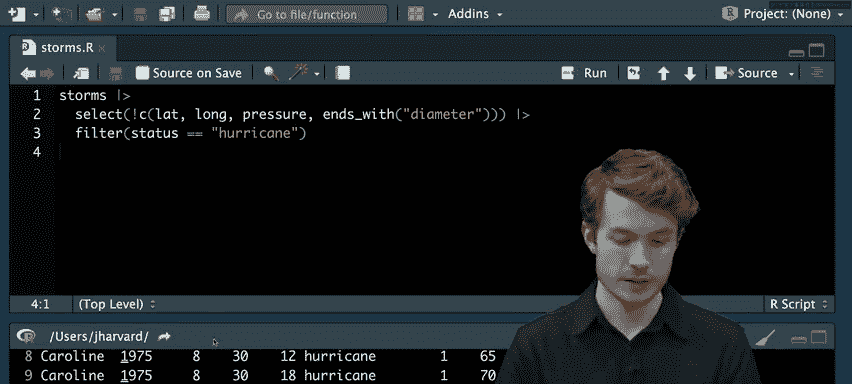

# 方法2：使用辅助函数（更简洁）
dplyr::select(storms, -ends_with("diameter"), -lat, -long, -pressure)
```

`select()` 的辅助函数（如 `ends_with()`）可以帮助我们更高效地选择列。`-` 符号表示排除这些列。


---

### 2. 筛选行 (filter)

接下来，我们可能只关心飓风（`status == "hurricane"`）的数据。`filter()` 函数可以用于此目的。

```r
dplyr::filter(selected_data, status == "hurricane")
```

---

### 3. 管道操作符 (%>%) 简化代码

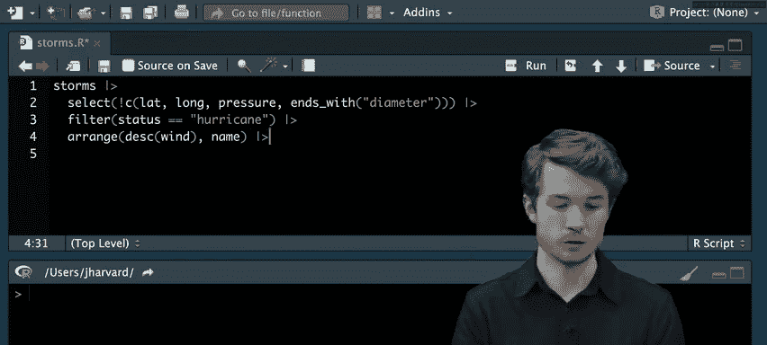

嵌套多个函数会使代码难以阅读。R 中的**管道操作符** `%>%` 可以将左侧的结果作为第一个参数传递给右侧的函数，从而实现链式操作，让代码更清晰。

```r
# 使用管道操作符链式调用 select 和 filter
storms %>%
  select(-ends_with("diameter"), -lat, -long, -pressure) %>%
  filter(status == "hurricane")
```

现在，代码可以从左到右、从上到下阅读：首先处理 `storms`，然后选择列，最后筛选行。

---

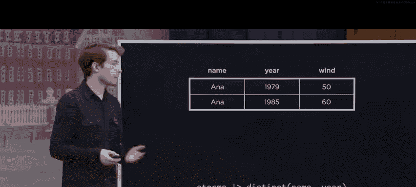

### 4. 排列行 (arrange)

我们的目标是找出最强的飓风并按风速降序排列。`arrange()` 函数可以对行进行排序。

```r
storms %>%
  select(-ends_with("diameter"), -lat, -long, -pressure) %>%
  filter(status == "hurricane") %>%
  arrange(desc(wind)) # desc() 表示降序
```

如果想在风速相同的情况下再按名称排序，可以向 `arrange()` 传递多个参数。

```r
arrange(desc(wind), name)
```

---

### 5. 去除重复行 (distinct)

目前数据集中包含同一场飓风的多次观测记录。为了得到每场飓风的唯一记录，我们需要使用 `distinct()` 函数。默认情况下，`distinct()` 会查找所有列完全相同的行。但我们需要的是**名称和年份组合**唯一的飓风。

```r
storms %>%
  select(-ends_with("diameter"), -lat, -long, -pressure) %>%
  filter(status == "hurricane") %>%
  arrange(desc(wind)) %>%
  distinct(name, year, .keep_all = TRUE) # 根据 name 和 year 去重，并保留所有其他列
```

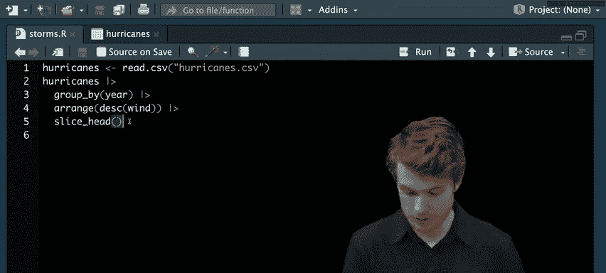

参数 `.keep_all = TRUE` 确保在去重后保留其他列的数据。


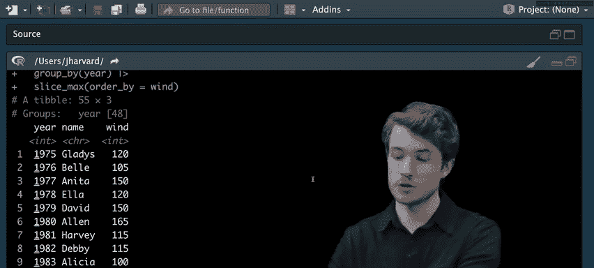

---


### 6. 分组与汇总 (group_by & summarize)

一个更深入的问题是：找出**每年最强的飓风**。这需要先将数据按年份分组，然后在每个组内进行操作。

```r
# 创建一个简化后的飓风数据集
hurricanes <- storms %>%
  select(name, year, wind) %>%
  filter(status == "hurricane") %>%
  distinct(name, year, .keep_all = TRUE)

# 找出每年风速最高的飓风
hurricanes %>%
  group_by(year) %>%           # 按年份分组
  slice_max(order_by = wind, n = 1) # 在每个组内，找出 wind 值最大的行
```

`group_by()` 定义分组依据。`slice_max()` 是一个便捷函数，用于在每个组内选择指定列值最大的行。我们也可以使用 `arrange()` 加 `slice_head()` 的组合来实现。

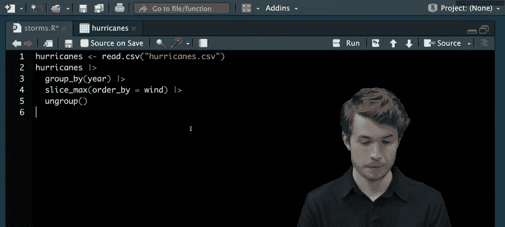

```r
# 另一种方法：分组后排序并取每组第一行
hurricanes %>%
  group_by(year) %>%
  arrange(desc(wind), .by_group = TRUE) %>% # 按组内降序排列
  slice_head(n = 1)
```

完成分组操作后，可以使用 `ungroup()` 函数移除分组标签，以便进行后续无关分组的操作。

---

### 7. 汇总分组数据


我们还可以对分组数据进行统计汇总，例如计算**每年飓风发生的次数**。

```r
hurricanes %>%
  group_by(year) %>%
  summarize(hurricane_count = n()) # n() 函数计算每组行数
```

`summarize()` 会为每个组创建一个新的汇总数据框。我们可以为汇总结果列命名（如 `hurricane_count`）。

---

## 使用 tidyr 整理数据结构 📐

即使数据经过转换，其本身的结构也可能不符合“整洁数据”的原则。整洁数据遵循三个准则：
1.  每个变量构成一列。
2.  每个观测构成一行。
3.  每个值构成一个单元格。

### 数据透视：pivot_wider

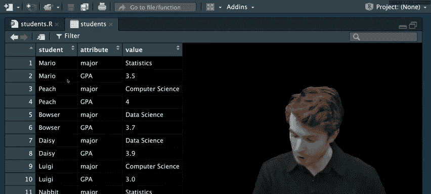

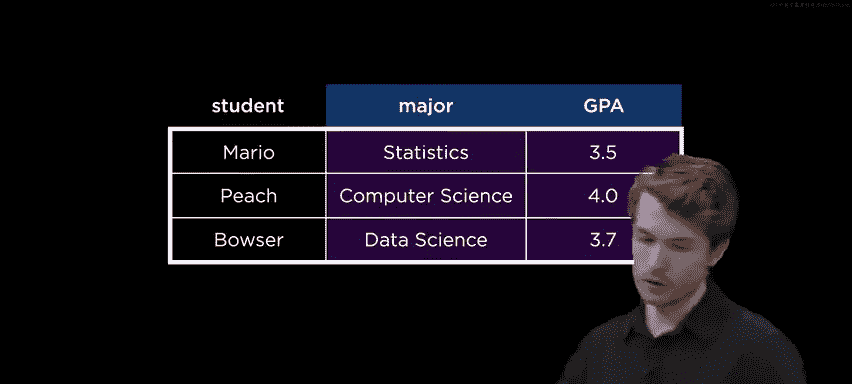

常见的不整洁情况是，本应作为列名的值（如“专业”、“GPA”）却存储在某一列的行中。`tidyr` 包中的 `pivot_wider()` 函数可以将“长”格式数据转换为“宽”格式。

假设有一个 `students` 数据集，其中 `attribute` 列的值（“major”, “GPA”）应该作为列名，而 `value` 列则是对应的值。

```r
# 原始不整洁数据
students

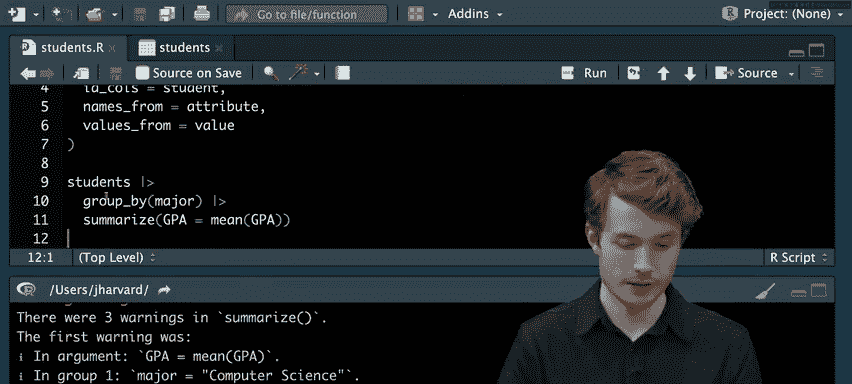

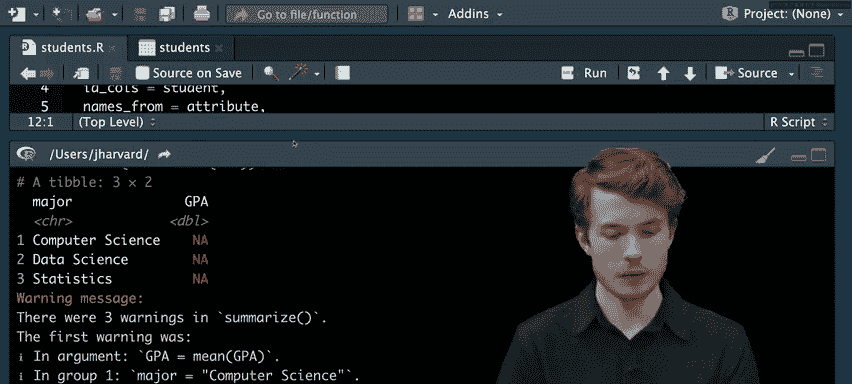

# 使用 pivot_wider 进行整理
students_tidy <- students %>%
  pivot_wider(
    id_cols = student,       # 标识列，每个学生唯一
    names_from = attribute,  # 新列名的来源
    values_from = value      # 新单元格值的来源
  )

# 现在数据是整洁的，可以方便地进行分组分析
students_tidy %>%
  mutate(GPA = as.numeric(GPA)) %>% # 确保GPA是数值型
  group_by(major) %>%
  summarize(average_gpa = mean(GPA))
```

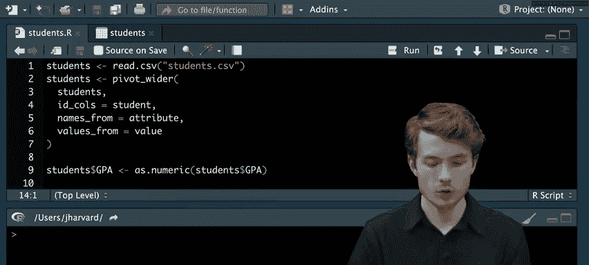


`pivot_wider()` 能够智能处理缺失值，用 `NA` 填充。


对应的 `pivot_longer()` 函数则用于将“宽”格式数据变“长”，您可以在课后自行探索。


---


## 使用 stringr 清洗字符串数据 ✨

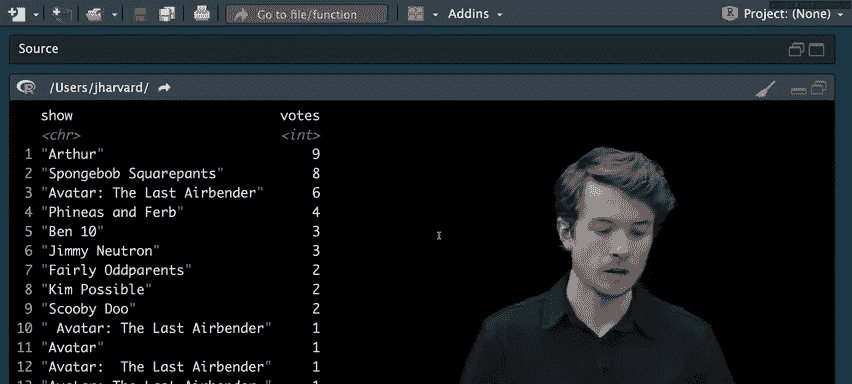

数据值本身可能包含多余空格、大小写不一致或拼写错误。`stringr` 包提供了字符串处理函数。


假设有一个电视节目投票数据集 `shows`，数据中存在各种不一致。


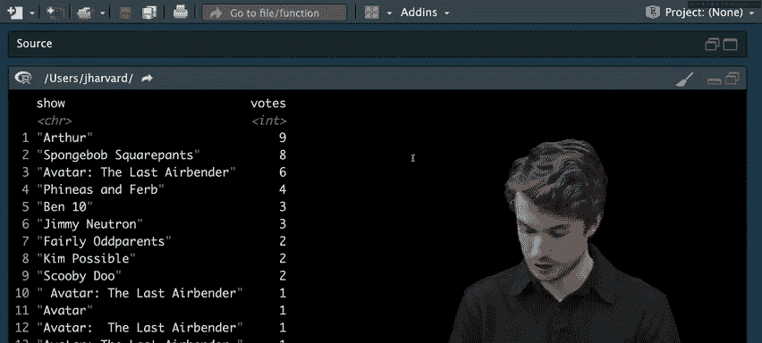

```r
# 读取数据
shows <- read_csv("shows.csv")

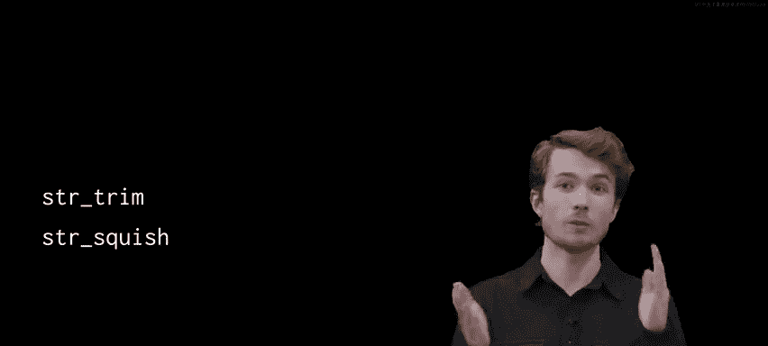

# 1. 去除首尾空格
shows <- shows %>%
  mutate(show = str_trim(show))

# 2. 将内部多个空格压缩为一个
shows <- shows %>%
  mutate(show = str_squish(show))

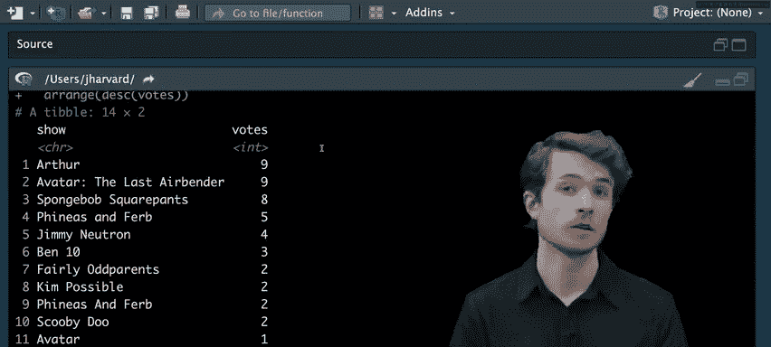

# 3. 统一为标题大小写（每个单词首字母大写）
shows <- shows %>%
  mutate(show = str_to_title(show))


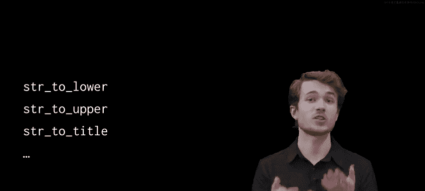

# 4. 检测并标准化特定名称（例如，所有包含“Avatar”的节目都统一为全称）
# 注意：此操作需谨慎，确保不会错误覆盖其他含义的相同词汇
shows <- shows %>%
  mutate(show = if_else(str_detect(show, "Avatar"),
                        "Avatar: The Last Airbender",
                        show))
```

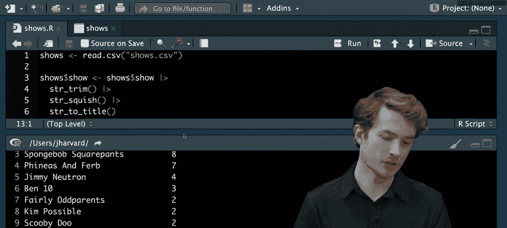

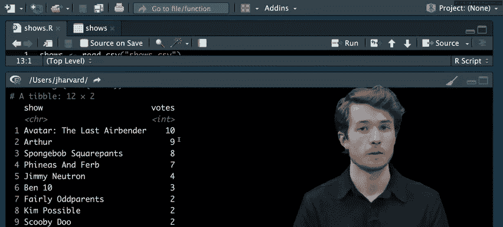

常用 `stringr` 函数包括：
*   `str_trim()`: 去除字符串首尾空格。
*   `str_squish()`: 去除首尾空格并将内部多个空格压缩为一个。
*   `str_to_lower()`, `str_to_upper()`, `str_to_title()`: 转换大小写。
*   `str_detect()`: 检测字符串是否包含某种模式。


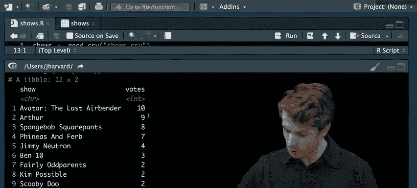

---


## 总结 🎯

本节课中，我们一起学习了R语言中强大的数据整理工具：

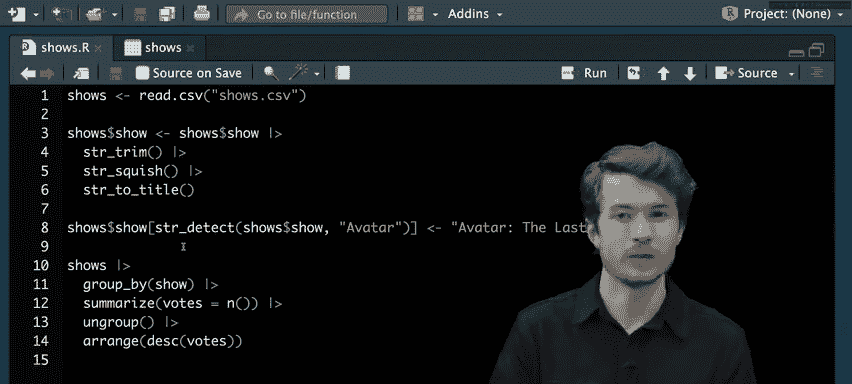

1.  **tidyverse 生态系统**：我们学会了如何安装和加载这个集合了 `dplyr`、`tidyr`、`stringr` 等包的强大工具集。
2.  **使用 dplyr 转换数据**：我们掌握了六个核心函数（`select`, `filter`, `arrange`, `distinct`, `group_by`, `summarize`）以及用于链式操作的管道运算符 `%>%`，来对数据进行子集选择、筛选、排序、去重、分组和汇总。
3.  **使用 tidyr 整理数据结构**：我们理解了“整洁数据”的概念，并学会了使用 `pivot_wider()` 将数据从长格式转换为宽格式，使其符合每个变量一列、每个观测一行的标准。
4.  **使用 stringr 清洗字符串**：我们探索了如何清理数据中的文本，包括修剪空格、标准化大小写以及检测和替换特定的字符串模式。


通过这些工具，您可以将原始、混乱的数据集转换为干净、结构良好的格式，为后续的数据分析和可视化打下坚实的基础。下一讲，我们将学习如何利用整理好的数据进行可视化。