# R语言编程入门：第6讲：程序测试 🧪


在本节课中，我们将学习程序可能出错的各种方式，了解如何处理这些称为“错误”的情况，并学习如何测试我们的程序以确保它们按预期运行。

## 程序可能出错的方式

上一节我们介绍了课程概述，本节中我们来看看一个函数可能出错的具体方式。

假设我们编写了一个名为 `average` 的函数，其目的是计算一个数字向量的平均值。我们可能会依赖R内置的 `sum` 和 `length` 函数来实现这个功能。

```r
average <- function(x) {
  sum(x) / length(x)
}
```

然而，用户可能不会总是提供数字向量。例如，他们可能提供字符向量，这会导致程序出错。

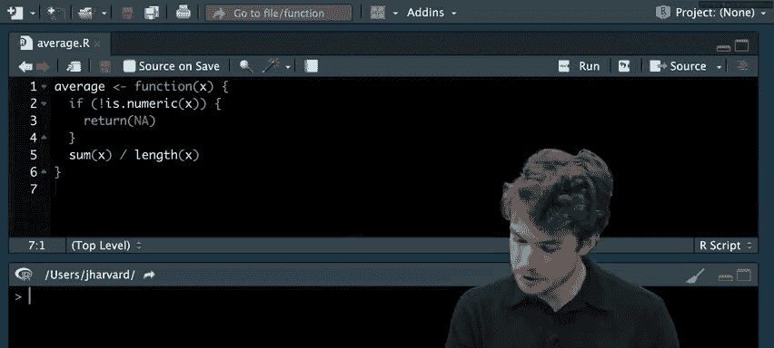


```r
average(c("1", "2", "3"))
```

运行上述代码会产生一个错误，更正式地称为**异常**。当程序遇到无法处理的情况时，就会发生异常，导致程序完全停止。

## 处理异常

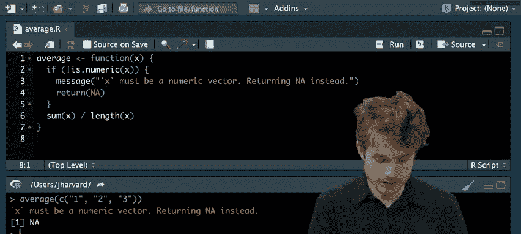


那么，我们如何在代码中处理这些异常呢？一种方法是更主动地预见它们，并在错误发生前采取其他措施。

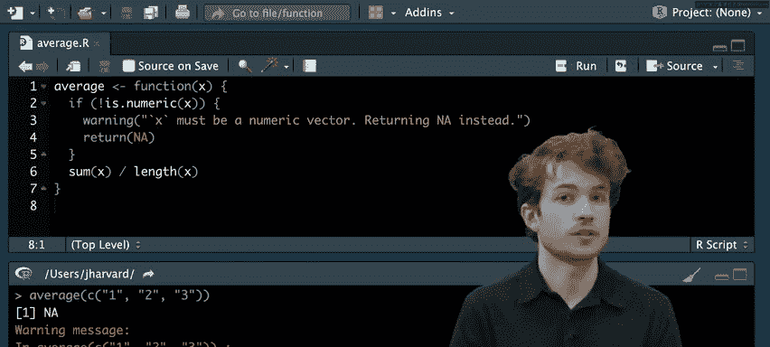

我们可以使用条件语句来检查输入是否为数字。如果不是，我们可以返回一个特殊值，例如 `NA`，而不是让错误发生。

```r
average <- function(x) {
  if (!is.numeric(x)) {
    return(NA)
  }
  sum(x) / length(x)
}
```


现在，如果我们再次运行 `average(c("1", "2", "3"))`，函数将返回 `NA` 而不会报错。但是，我们是在“静默”地处理错误，用户可能不知道哪里出了问题。

## 与用户沟通

为了告知用户，我们可以使用 `message` 函数在控制台发送消息。

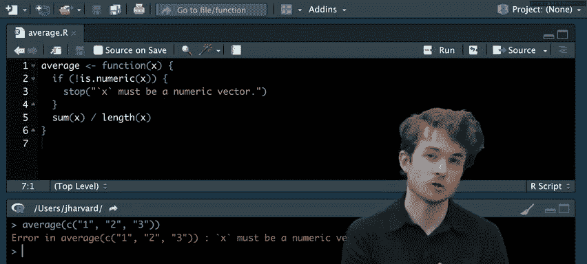


```r
average <- function(x) {
  if (!is.numeric(x)) {
    message("x must be a numeric vector. Returning NA instead.")
    return(NA)
  }
  sum(x) / length(x)
}
```

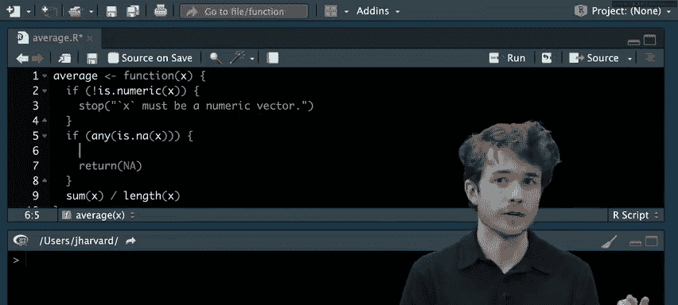

然而，`message` 通常用于程序运行顺利时向用户传递信息。当出现潜在问题时，更好的选择是使用 **`warning`**。警告会提示用户可能存在需要检查的问题，但程序会继续运行。


```r
average <- function(x) {
  if (!is.numeric(x)) {
    warning("x must be a numeric vector. Returning NA instead.")
    return(NA)
  }
  sum(x) / length(x)
}
```

如果问题非常严重，函数根本无法继续执行，我们应该使用 **`stop`** 函数来抛出一个错误，完全停止函数。

```r
average <- function(x) {
  if (!is.numeric(x)) {
    stop("x must be a numeric vector.")
  }
  sum(x) / length(x)
}
```

## 处理其他边缘情况

除了非数字输入，我们还需要考虑其他情况，例如输入向量中包含 `NA` 值。我们可以添加额外的检查。

```r
average <- function(x) {
  if (!is.numeric(x)) {
    stop("x must be a numeric vector.")
  }
  if (any(is.na(x))) {
    warning("x contains one or more NA values. Returning NA.")
    return(NA)
  }
  sum(x) / length(x)
}
```

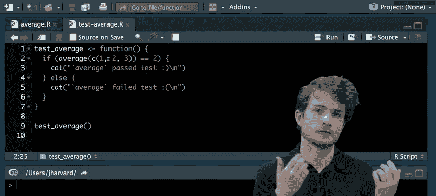

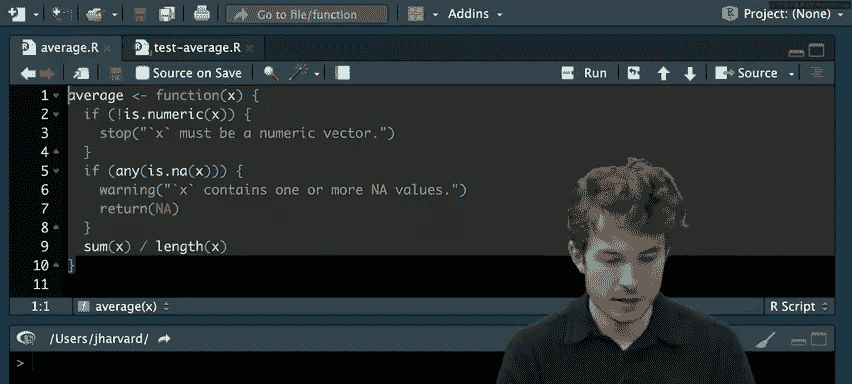

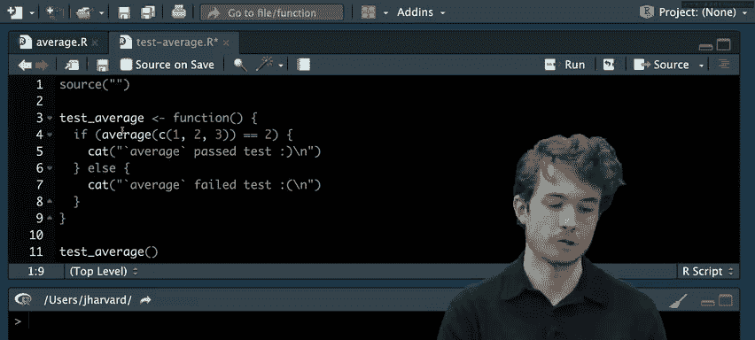

现在，我们的函数能够更好地处理各种边缘情况，并适当地通知用户。

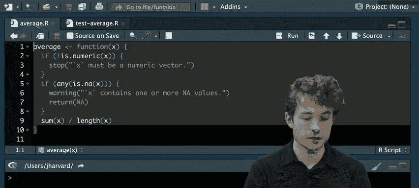

## 编写单元测试

上一节我们介绍了如何预见和处理错误，本节中我们来看看如何通过编写**单元测试**来确保代码按预期运行。单元测试是用于测试程序中单个单元（通常是函数）的代码。

我们将为 `average` 函数编写测试。按照惯例，我们创建一个名为 `test_average.R` 的新文件。

首先，我们需要导入 `average` 函数。

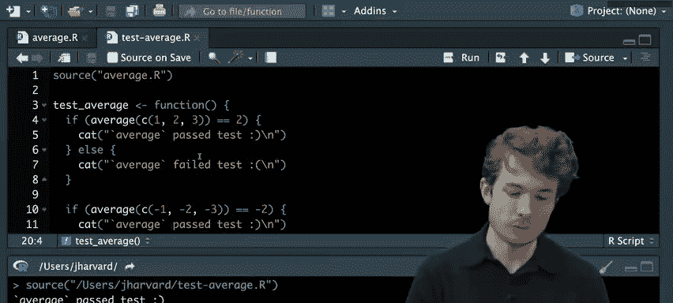


```r
source("average.R")
```

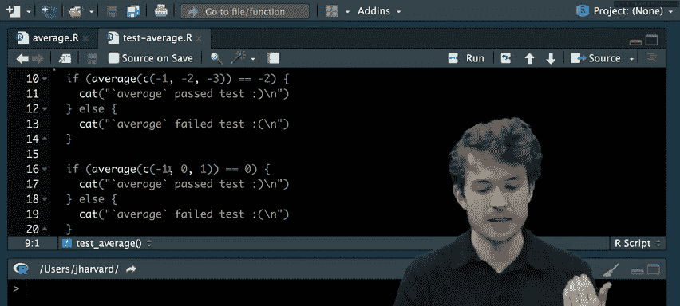

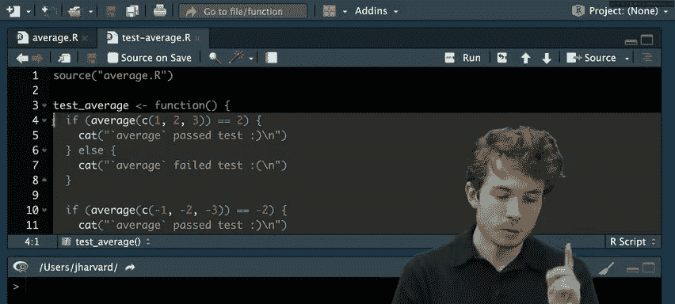

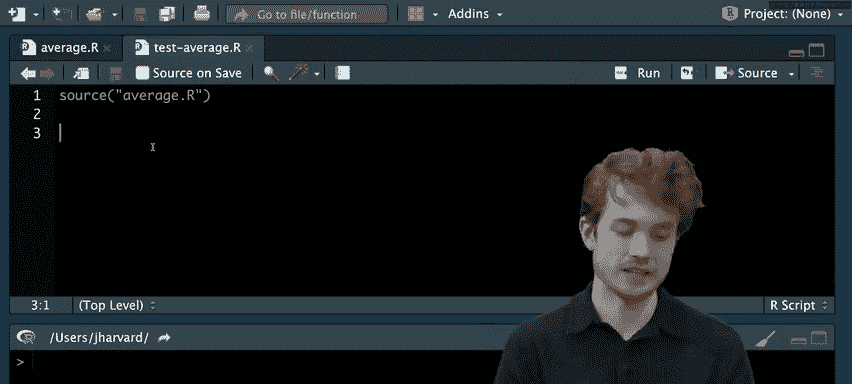

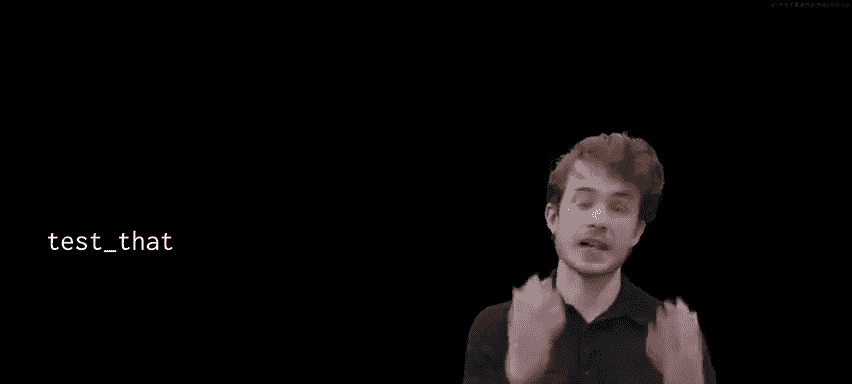

然后，我们可以编写一个测试函数，其中包含一个或多个**测试用例**。测试用例代表了函数可能遇到的典型场景。

```r
test_average <- function() {
  if (average(c(1, 2, 3)) == 2) {
    cat("Average passed the test! :)\n")
  } else {
    cat("Average failed the test. :(\n")
  }
}
test_average()
```

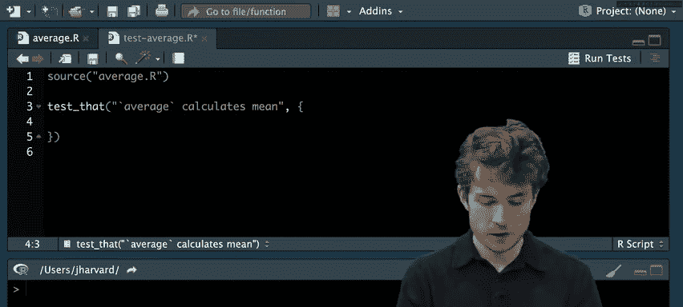

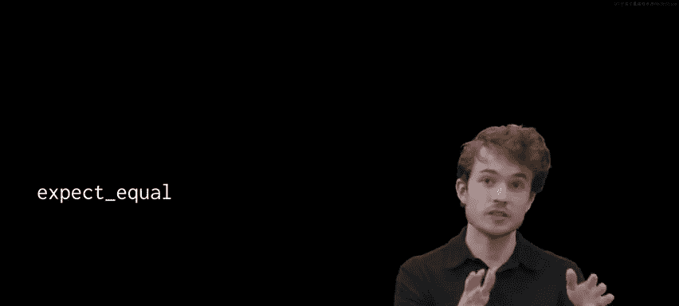

这种方法虽然有效，但随着测试用例增多，代码会变得冗长且重复。

## 使用 `testthat` 包

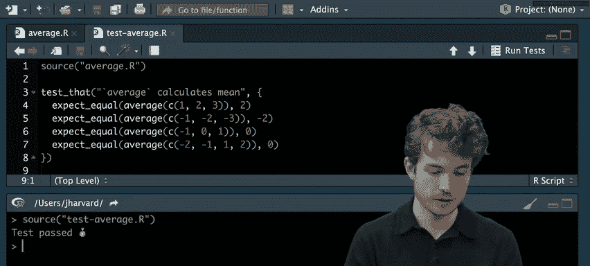

幸运的是，R社区开发了 `testthat` 包，它使测试变得更加容易和高效。

首先，安装并加载 `testthat` 包。


```r
install.packages("testthat")
library(testthat)
```

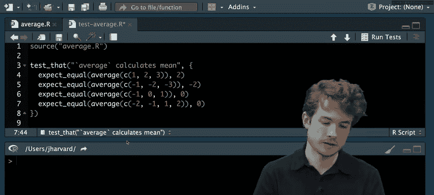

然后，我们可以使用 `test_that` 函数来组织测试。`testthat` 提供了诸如 `expect_equal`、`expect_warning` 和 `expect_error` 等函数来定义我们的期望。

以下是使用 `testthat` 重写的测试：

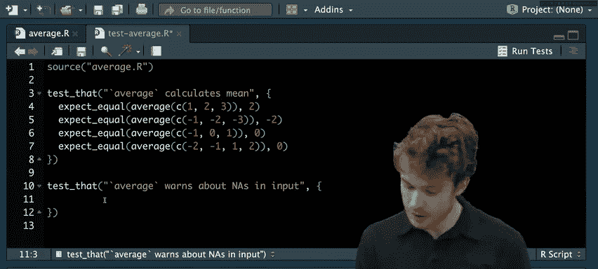

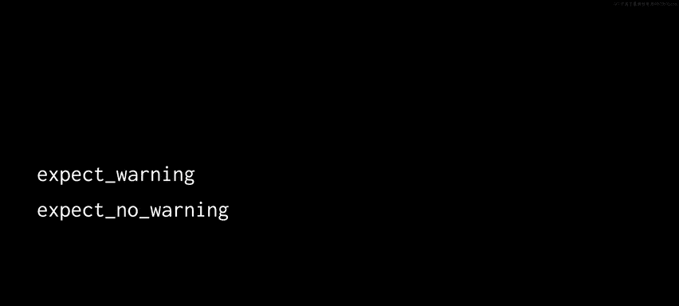

```r
source("average.R")

test_that("average calculates the mean", {
  expect_equal(average(c(1, 2, 3)), 2)
  expect_equal(average(c(-1, -2, -3)), -2)
  expect_equal(average(c(-1, 0, 1)), 0)
})

test_that("average warns about NAs in input", {
  expect_warning(average(c(1, NA, 3)))
  expect_warning(average(c(NA, NA, NA)))
})

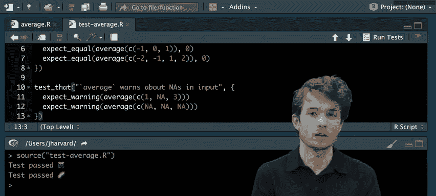

test_that("average returns NA with NAs in input", {
  expect_equal(suppressWarnings(average(c(1, NA, 3))), NA)
  expect_equal(suppressWarnings(average(c(NA, NA, NA))), NA)
})


test_that("average stops if input is non-numeric", {
  expect_error(average(c("1", "2", "3")))
})
```

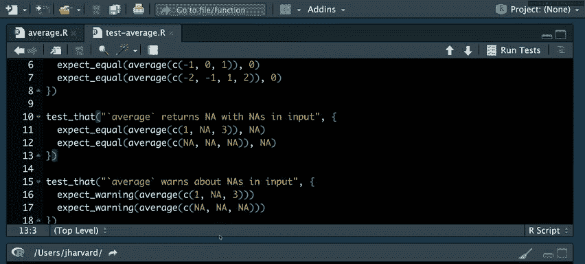

使用 `testthat`，我们可以轻松地添加和管理多个测试用例，并且测试输出更加清晰。

## 浮点数精度与容差

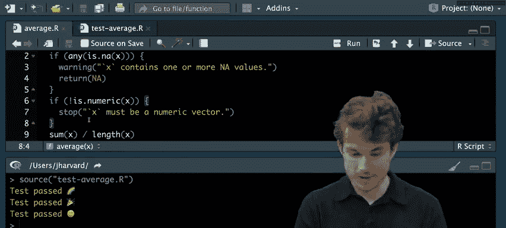

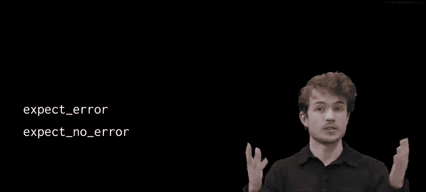

在测试涉及小数的计算时，我们需要考虑**浮点数精度**问题。由于计算机表示小数的方式，计算结果可能不是完全精确的。

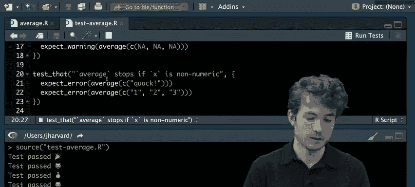


例如，`0.1 + 0.5` 的平均值在计算机中可能不是精确的 `0.3`。

```r
print(0.3, digits = 17) # 可能显示为 0.29999999999999999
```

因此，在测试浮点数相等性时，我们需要使用**容差**。`expect_equal` 函数内置了容差参数 `tolerance`，允许结果在预期值的一个小范围内波动。

```r
expect_equal(average(c(0.1, 0.5)), 0.3, tolerance = 1e-8)
```

## 测试驱动开发与行为驱动开发

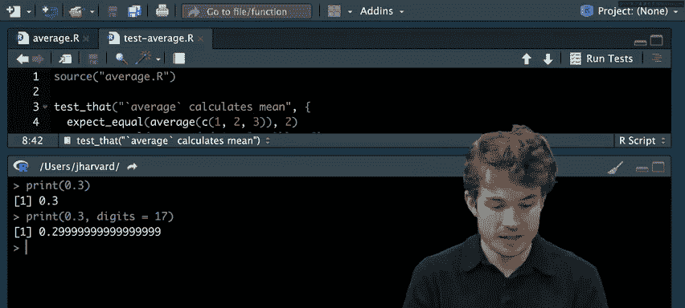

**测试驱动开发** 是一种开发哲学，主张在编写实际代码之前先编写测试。这有助于明确代码应该做什么。


例如，假设我们要编写一个打招呼的函数 `greet`。我们首先编写测试：

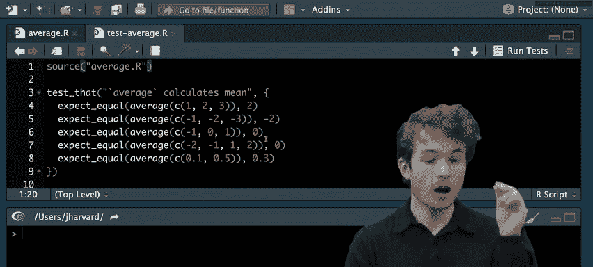

```r
# test_greet.R
source("greet.R")

test_that("greet can say hello to a user", {
  expect_equal(greet("Carter"), "Hello, Carter")
})
```

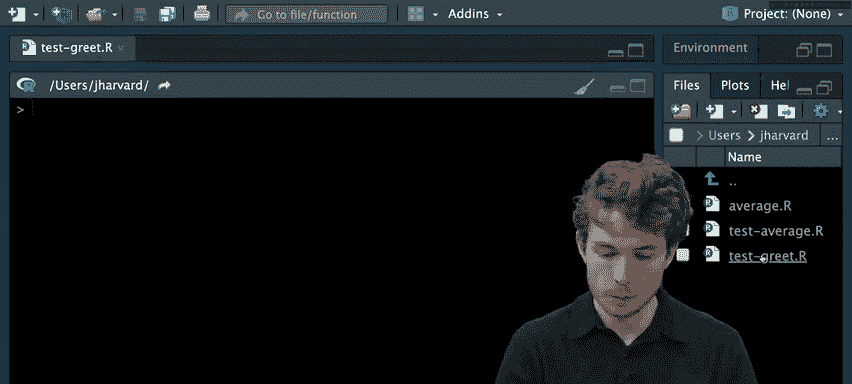

然后，我们根据测试来编写 `greet` 函数：

```r
# greet.R
greet <- function(who) {
  paste("Hello,", who)
}
```

**行为驱动开发** 是TDD的一种变体，它更侧重于从用户行为的角度描述功能。`testthat` 也支持BDD风格的测试，使用 `describe` 和 `it` 函数。

```r
describe("greet function", {
  it("can say hello to a user", {
    name <- "Carter"
    expect_equal(greet(name), "Hello, Carter")
  })

  it("can say hello to the world", {
    expect_equal(greet(), "Hello, world")
  })
})
```

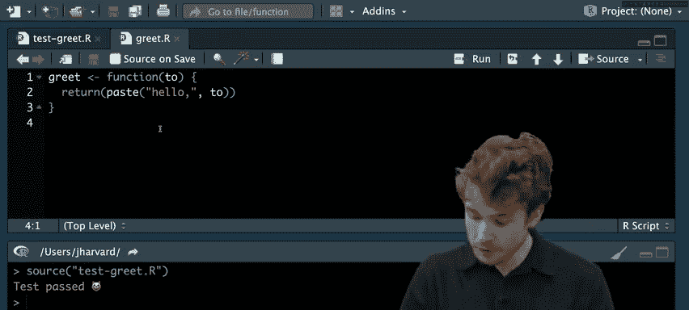

BDD风格的测试读起来更像自然语言，描述了函数“应该”具有的行为。


## 测试覆盖率

最后，一个重要的概念是**测试覆盖率**。它衡量的是你的测试套件执行了多少代码。对于由多个函数组成的大型程序，测试覆盖率可以帮助你了解哪些部分已经过充分测试，哪些部分还需要更多测试。

## 总结

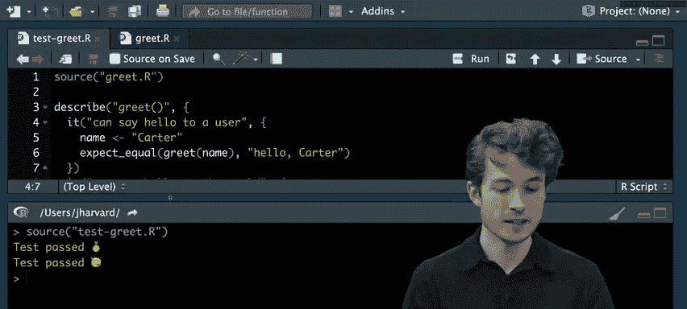

本节课中我们一起学习了：
1.  程序可能出错的多种方式以及异常的概念。
2.  如何使用 `message`、`warning` 和 `stop` 与用户沟通不同严重程度的问题。
3.  如何通过编写**单元测试**来系统地验证代码行为。
4.  如何使用强大的 `testthat` 包来简化测试编写。
5.  处理**浮点数精度**问题和设置**容差**的重要性。
6.  **测试驱动开发** 和 **行为驱动开发** 两种编程哲学。
7.  测试覆盖率的概念及其重要性。

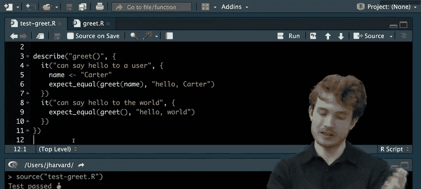


通过编写和维护良好的测试，你可以更有信心地确保代码的正确性，并在未来修改代码时快速发现潜在的问题。