# R语言编程入门：第7讲：打包程序 📦


在本节课中，我们将学习如何将R代码打包成一个完整的、可分享的软件包。我们将创建一个名为 `ducksay` 的包，其功能是接收一段文本，并输出一只“说”出这段文本的鸭子图案。

## 概述：什么是R包？

到目前为止，我们一直是R包的使用者，学会了如何安装、加载和使用包内的函数。但我们还没有探索过包背后的源代码是如何构建的。当你从CRAN等地方下载一个包时，你得到的是一个单一的二进制文件。然而，创建包时，你并不需要直接编写二进制代码，而是使用源代码——即构成你包的各个 `.R` 文件和文件夹。当需要分享你的包时，你会将这些源代码“构建”或“编译”成一个可以分发的单一文件。

## 创建包的基本结构

首先，我们需要为我们的包创建一个文件夹。按照惯例，包的源代码应放在一个以包名命名的文件夹中。

```r
# 创建一个名为‘ducksay’的文件夹
dir.create("ducksay")
```

创建文件夹后，我们将工作目录设置到这个新文件夹中，以便在其中创建所有后续文件。

```r
# 设置工作目录到‘ducksay’文件夹
setwd("ducksay")
```

现在，我们面对的是一个空白的画布。一个典型的R包包含以下核心文件和文件夹：
*   **DESCRIPTION**: 描述你的包（名称、版本、作者等）。
*   **NAMESPACE**: 定义包中可供用户使用的函数。
*   **man/**: 存放函数文档（手册）。
*   **R/**: 存放包含函数定义的 `.R` 文件。
*   **tests/**: 存放测试代码。

接下来，我们将逐一创建这些组件。

## 编写DESCRIPTION文件

DESCRIPTION文件是包的“身份证”，它包含了一些必需的字段。让我们创建并填写它。

首先，创建DESCRIPTION文件。

```r
# 创建DESCRIPTION文件
file.create("DESCRIPTION")
```

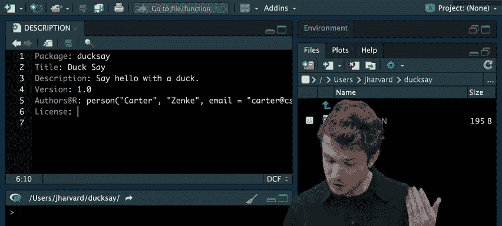

打开DESCRIPTION文件，并填入以下内容。每个字段都有其特定含义：
*   **Package**: 包的名称（用户安装时使用的名字）。
*   **Title**: 包的标题（更友好的英文描述）。
*   **Description**: 包的详细描述。
*   **Version**: 包的版本号。
*   **Authors@R**: 使用R函数定义作者信息。
*   **License**: 软件许可证。


一个基本的DESCRIPTION文件内容如下：

```
Package: ducksay
Title: Ducksay
Description: Say hello with a duck.
Version: 1.0
Authors@R: person("Carter", "Zenke", email = "carter@cs50.harvard.edu", role = c("aut", "cre", "cph"))
License: MIT + file LICENSE
```

在上面的 `Authors@R` 字段中，我们使用了 `person()` 函数来定义作者。`role` 参数是一个向量，指定了作者的角色：
*   `"aut"` (Author): 包的作者。
*   `"cre"` (Creator): 包的维护者。
*   `"cph"` (Copyright holder): 版权持有者。

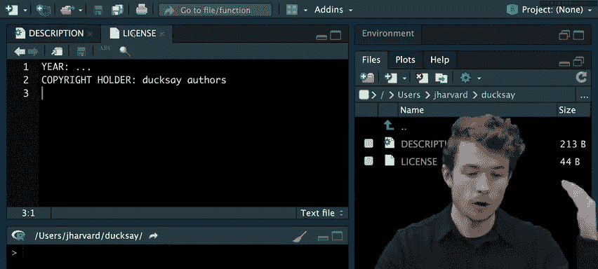


对于许可证，我们选择了MIT许可证，并额外引用了一个名为 `LICENSE` 的文件来补充详细信息（如年份和版权方）。因此，我们需要创建这个LICENSE文件。

```r
# 创建LICENSE文件
file.create("LICENSE")
```

在LICENSE文件中，我们可以填入类似以下的内容（请根据实际情况修改年份和版权方）：
```
YEAR: 2024
COPYRIGHT HOLDER: Ducksay authors
```

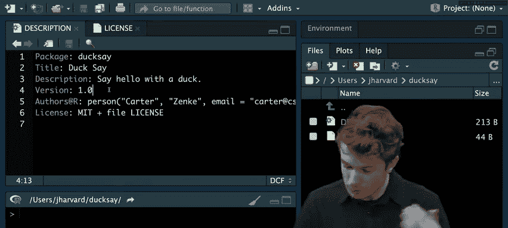

## 使用devtools包辅助开发

手动管理所有文件夹和文件可能很繁琐。幸运的是，有一个名为 `devtools` 的包可以帮助我们更高效地创建和管理R包。它提供了一系列函数来初始化包结构、运行测试等。

首先，确保安装并加载 `devtools` 包。

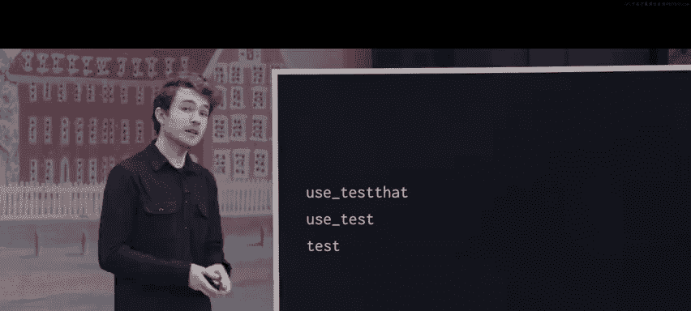

```r
# 安装并加载devtools包
library(devtools)
```

## 为包编写测试

在编写实际功能代码之前，先编写测试是一个好习惯。这有助于我们明确函数应该做什么。我们将使用 `testthat` 包来编写单元测试。

`devtools` 包提供了 `use_testthat()` 函数来为我们的包配置 `testthat` 测试框架。

```r
# 配置包以使用testthat进行测试
use_testthat()
```

运行此命令后，你会看到DESCRIPTION文件中添加了一个 `Suggests` 字段（建议安装 `testthat`），并且创建了一个 `tests/` 文件夹，其中包含测试配置文件。

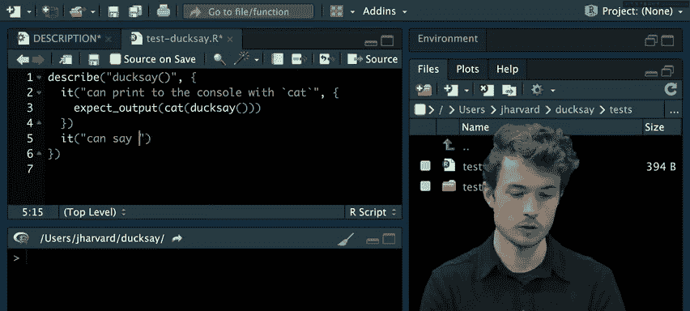

现在，让我们为 `ducksay` 函数创建具体的测试文件。

```r
# 为‘ducksay’函数创建测试文件
use_test("ducksay")
```

这将在 `tests/testthat/` 文件夹下创建一个名为 `test-ducksay.R` 的文件。我们可以在这个文件中编写测试。例如，我们希望 `ducksay` 函数能够：
1.  与 `cat()` 函数配合，将输出打印到控制台。
2.  在输出中包含“hello world”。
3.  在输出中包含一只鸭子的图案。

以下是测试代码示例：


```r
# 在 test-ducksay.R 文件中
describe("ducksay", {
  it("can print to the console with cat", {
    expect_output(cat(ducksay()))
  })
  it("can say hello to the world", {
    expect_match(ducksay(), "hello world")
  })
  it("can say hello with a duck", {
    duck <- paste0(" (>'_')>\n", " (___)_/")
    expect_match(ducksay(), duck, fixed = TRUE)
  })
})
```

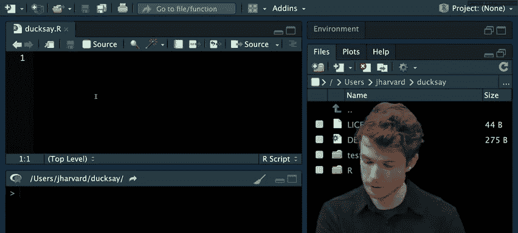

注意，在第三个测试中，我们使用了 `fixed = TRUE` 参数。这是因为鸭子图案中包含像 `>`、`'` 这样的字符，它们在“正则表达式”中有特殊含义。`fixed = TRUE` 告诉 `expect_match` 进行精确的字符串匹配，而不是将其视为正则表达式模式。


## 编写函数代码

测试定义好后，我们就可以编写实现功能的函数了。R包中的函数代码通常放在 `R/` 文件夹中。我们可以使用 `devtools` 的 `use_r()` 函数来创建对应的R文件。

```r
# 为‘ducksay’函数创建R源文件
use_r("ducksay")
```

这将在 `R/` 文件夹下创建 `ducksay.R` 文件。现在，我们在这个文件中定义 `ducksay` 函数。最初，我们让它返回一个说“hello world”的鸭子。

```r
# 在 ducksay.R 文件中
ducksay <- function() {
  paste("hello world",
        " (>'_')>",
        " (___)_/",
        sep = "\n")
}
```

函数定义好了，但为了让用户能使用它，我们需要在 `NAMESPACE` 文件中“导出”这个函数。

```r
# 创建并编辑NAMESPACE文件
file.create("NAMESPACE")
```

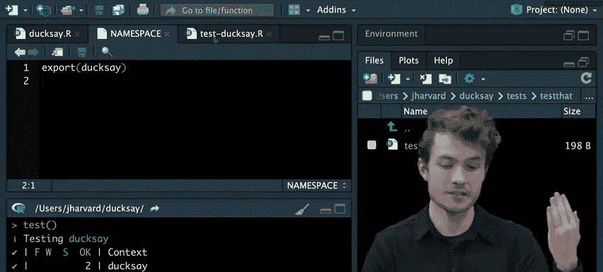

在NAMESPACE文件中，添加以下内容：
```
export(ducksay)
```


这行代码表示将 `ducksay` 函数导出，使其在包加载后对用户可用。

现在，我们可以使用 `devtools::load_all()` 来加载我们包中所有已导出的函数，以便在控制台交互测试。

```r
# 加载包中的所有导出函数
load_all()
# 测试函数
ducksay()
```

运行测试，确保我们的代码通过了所有测试。

```r
# 运行测试
test()
```

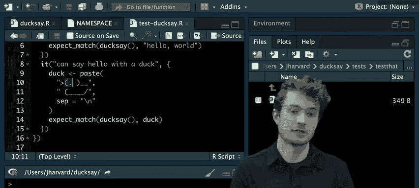

## 为函数编写文档

一个好的包必须有清晰的文档。R包的文档使用一种特殊的标记语言编写，并放在 `man/` 文件夹中，文件扩展名为 `.Rd`。


首先，创建 `man/` 文件夹和文档文件。

```r
# 创建man文件夹和文档文件
dir.create("man")
file.create("man/ducksay.Rd")
```

在 `man/ducksay.Rd` 文件中，我们可以编写如下文档：

```
\name{ducksay}
\alias{ducksay}
\title{Ducksay}
\description{A duck that says hello.}
\usage{
ducksay()
}
\value{
A string representation of a duck saying hello to the world.
}
\examples{
cat(ducksay())
}
```

文档写好后，在R控制台中输入 `?ducksay` 就可以查看渲染后的帮助页面了。

## 迭代开发：让鸭子说任何话

目前我们的鸭子只会说“hello world”。让我们改进它，使其能说任何我们输入的短语。这需要更新测试、代码和文档。

首先，更新测试文件 (`test-ducksay.R`)，增加一个测试用例。

```r
# 在测试文件中增加
it("can say any given phrase", {
  expect_match(ducksay("quack"), "quack")
})
```

接着，修改 `ducksay` 函数 (`R/ducksay.R`)，使其接受一个 `phrase` 参数，并设置默认值为 `"hello world"`。

```r
ducksay <- function(phrase = "hello world") {
  paste(phrase,
        " (>'_')>",
        " (___)_/",
        sep = "\n")
}
```

然后，更新文档文件 (`man/ducksay.Rd`)，反映新的参数和用法。

```
\usage{
ducksay(phrase = "hello world")
}
\value{
A string representation of a duck saying the given phrase.
}
\examples{
cat(ducksay())
cat(ducksay("quack"))
}
```

每次修改后，记得重新运行 `load_all()` 来加载最新版本的函数，并运行 `test()` 确保测试通过。

## 构建和安装包

当我们的包开发完成后，需要将其从源代码“构建”成一个可以分发的单一文件（通常是一个 `.tar.gz` 文件，也称为“tarball”）。

```r
# 构建包，生成 .tar.gz 文件
build()
```

构建成功后，你会在包目录的上层目录找到一个类似 `ducksay_1.0.tar.gz` 的文件。

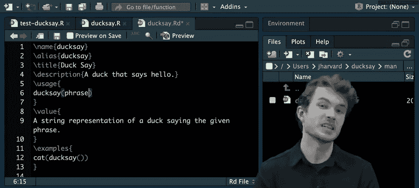

要使用这个包，我们需要先安装它。可以使用 `install.packages()` 函数从本地文件安装。

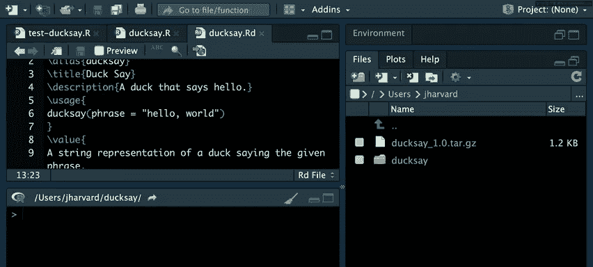

```r
# 从本地文件安装包
install.packages("../ducksay_1.0.tar.gz", repos = NULL, type = "source")
# 加载包
library(ducksay)
# 使用函数
cat(ducksay("Hello from the installed package!"))
```


## 使用自己的包

现在，我们可以像使用其他CRAN上的包一样使用我们自己的 `ducksay` 包了。例如，创建一个新的R脚本 (`greet.R`)：

```r
# greet.R
library(ducksay)
name <- readline("What's your name? ")
greeting <- ducksay(paste("Hello,", name))
cat(greeting)
```

运行这个脚本，你就会得到一只向你问好的鸭子！

## 分享你的包

构建好的 `.tar.gz` 文件可以通过多种方式分享：
*   提交到 **CRAN**（需要遵循其指南）。
*   上传到代码托管平台如 **GitHub**。
*   直接通过电子邮件发送给朋友或同事。

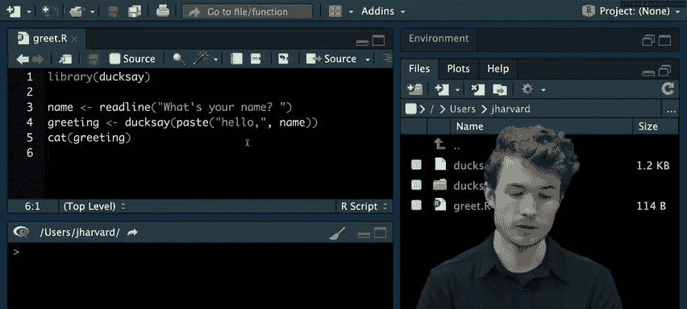

## 总结

在本节课中，我们一起学习了如何将一个R项目打包成完整的、可分享的软件包。我们涵盖了以下核心步骤：
1.  **创建包结构**：初始化包含DESCRIPTION、NAMESPACE、R/、man/、tests/等文件夹的包框架。
2.  **编写元数据**：在DESCRIPTION文件中定义包的基本信息、作者和许可证。
3.  **测试驱动开发**：使用 `testthat` 包先编写测试，再实现功能函数。
4.  **编写函数与文档**：在 `R/` 文件夹中编写函数代码，并在 `man/` 文件夹中编写对应的 `.Rd` 格式文档。
5.  **构建与安装**：使用 `build()` 将源代码打包，并使用 `install.packages()` 从本地文件安装。
6.  **迭代与分享**：不断更新改进你的包，并将其分享给世界。

通过将你的数据分析、可视化或工具函数打包，你可以更有效地组织代码、确保其可靠性，并方便地与其他人协作和共享你的工作成果。