# 001：Scratch - 计算机科学导论


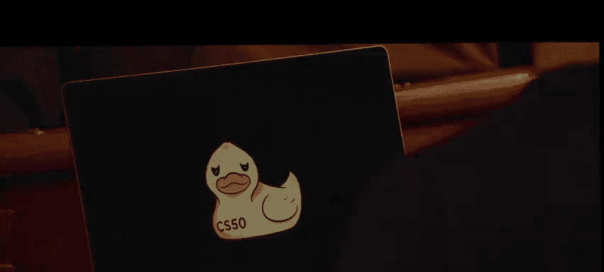

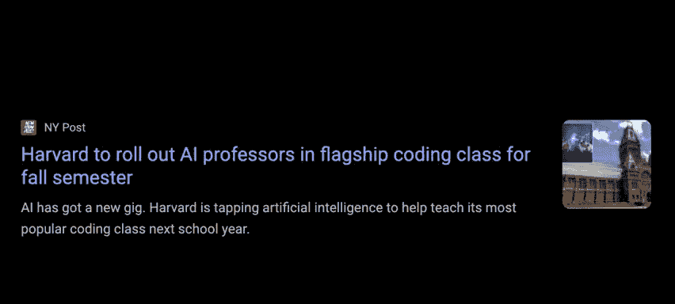

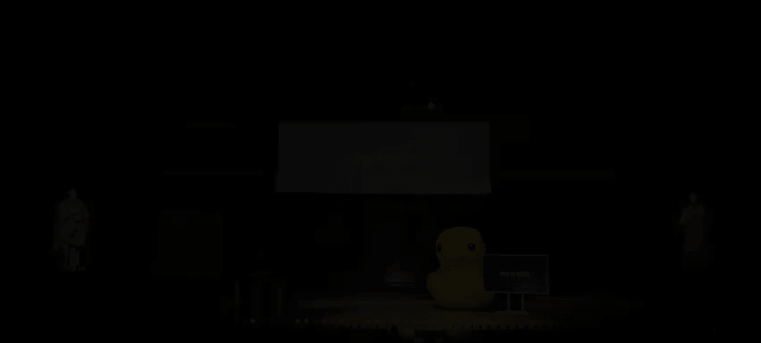

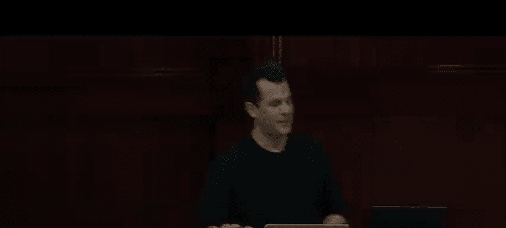

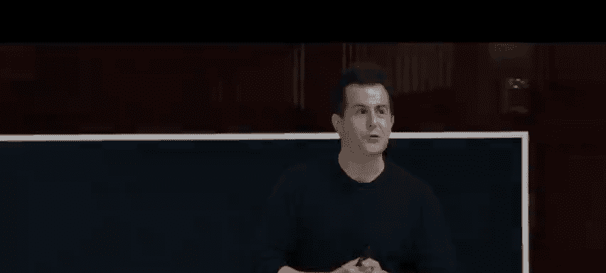

## 概述

在本节课中，我们将学习计算机科学的基础概念，包括如何用二进制表示信息（如数字、字母、颜色），以及如何通过算法和代码来解决问题。我们将从最基础的二进制系统开始，逐步理解计算机如何工作，并最终使用图形化编程语言 Scratch 来实践这些概念。

---

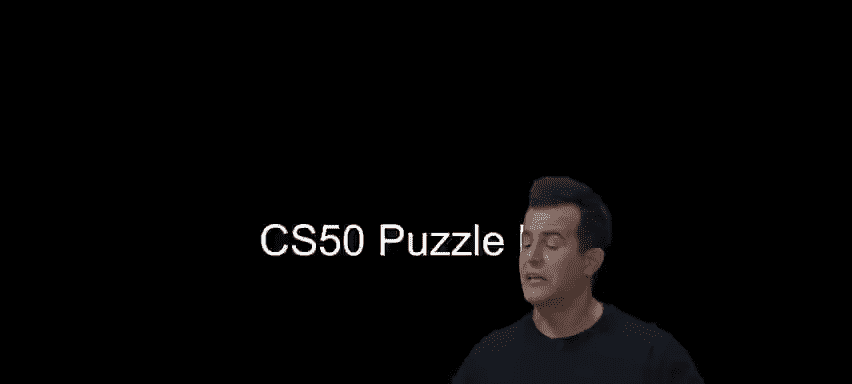

## 什么是计算机科学？🤔

计算机科学是研究信息的学科，更具体地说，是关于使用特定思想和技术来解决问题的学科。其核心是**计算思维**，即以一种系统化、严谨的方式思考问题，就像计算机一样。这种思维方式能帮助你更清晰、更精确地表达自己的想法，即使你未来不从事技术领域的工作。

## 问题解决：输入、算法与输出 🎯

解决问题可以简化为一个模型：**输入**（待解决的问题） -> **算法**（解决问题的步骤） -> **输出**（问题的解决方案）。

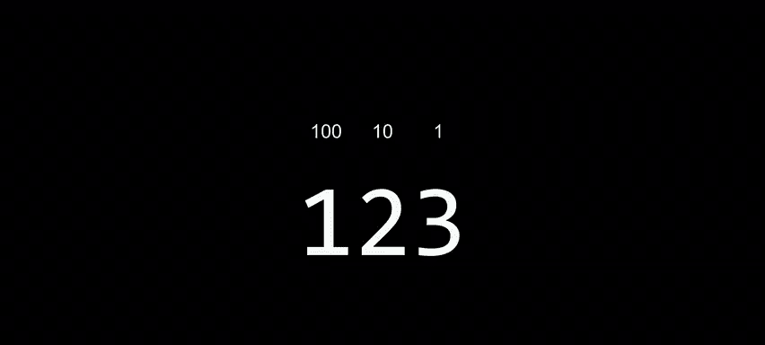

在深入探讨如何设计算法之前，我们首先需要就如何表示这些输入和输出达成共识。

## 信息的表示：从二进制开始 🔢

你可能听说过，计算机只理解0和1，即**二进制系统**。但比二进制更简单的是**一元制**，例如用手指计数。然而，一元制效率低下。

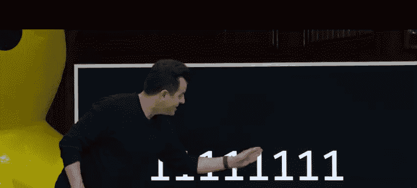

在二进制（基数为2）中，我们只需要两个数字：0和1。这与计算机作为电子设备的本质完美契合：电流的“有”（1）或“无”（0）。计算机内部的微小开关——**晶体管**——就是通过打开或关闭来控制电流的。

一个二进制数字称为一个**比特**。但单独一个比特用处不大，我们通常将8个比特组合成一个**字节**，这是一个更实用的信息单位。

### 二进制如何表示数字？

我们熟悉的十进制系统（基数为10）使用0-9这十个数字。数字123实际上表示 `1*100 + 2*10 + 3*1`，其中每一位数字处于不同的“位权”（个位、十位、百位，对应 `10^0`, `10^1`, `10^2`）。

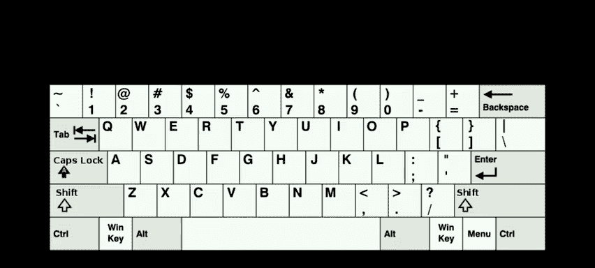

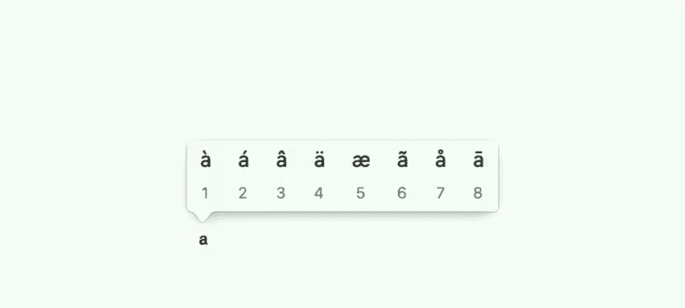

二进制系统（基数为2）遵循相同的逻辑，但位权变成了 `2^0`, `2^1`, `2^2`... 即个位、二位、四位...

例如，用三个比特（或三盏灯泡）可以表示0到7：
*   `000` = 0
*   `001` = 1
*   `010` = 2
*   `011` = 3
*   `100` = 4
*   `101` = 5
*   `110` = 6
*   `111` = 7


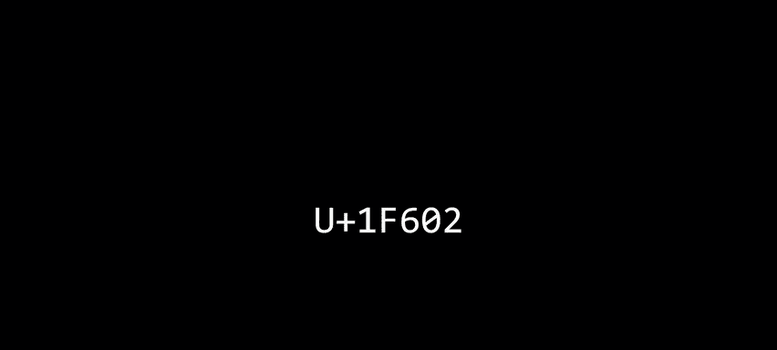

要表示更大的数字，只需要更多的比特（硬件）。

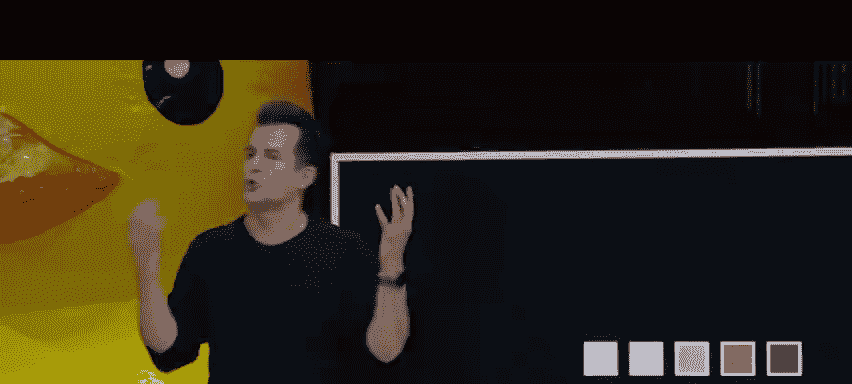

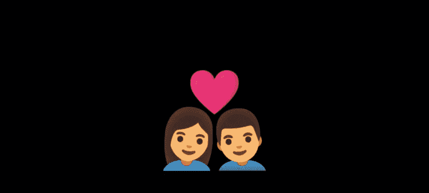

## 超越数字：表示字母与文本 🔤

既然我们可以用二进制表示数字，那么也可以为字母分配一个数字。这就是 **ASCII**（美国信息交换标准代码）所做的。例如，大写字母‘A’被分配了数字65。在计算机内存中，存储的是一串代表65的二进制位（如 `01000001`），但显示在屏幕上时，计算机会将其解释为字母‘A’。

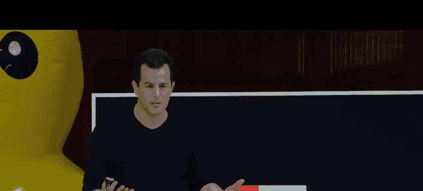

然而，ASCII只使用7或8比特，最多只能表示256个字符，这对于英语可能足够，但无法涵盖全球所有语言和符号（如带重音的字符、亚洲文字、表情符号）。

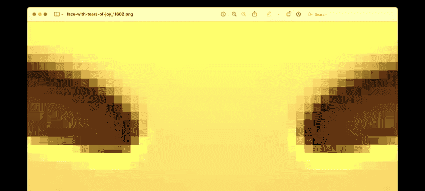

因此，我们有了 **Unicode**。它是一个更庞大的字符集，有时使用16、24甚至32比特来表示一个字符，从而能够表示超过40亿个不同的字符，足以容纳所有人类语言以及海量的表情符号。

## 表示颜色、图像、声音与视频 🎨🎵🎬

*   **颜色**：通常使用 **RGB** 模型。屏幕上的每个点（**像素**）由三个数字控制，分别代表红色、绿色和蓝色的强度（每个数字通常是一个字节，范围0-255）。组合起来就能产生任何颜色。
*   **图像**：就是由许多这样的像素组成的网格。
*   **声音**：可以用数字来表示音高、持续时间和响度。
*   **视频**：本质上是一系列快速连续播放的图像（例如每秒30帧），利用人眼的视觉暂留形成动态画面。

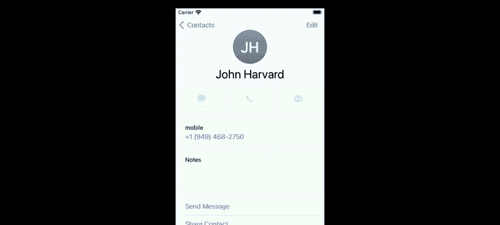

**关键点**：**上下文决定解释**。同一串二进制位，在文本编辑器中被解释为字母，在计算器中被解释为数字，在Photoshop中则被解释为颜色。

## 算法：解决问题的步骤 📝

算法是解决问题的、一步步的指令。以在电话簿中查找“John Harvard”为例：
1.  **算法一**：一页一页翻。正确但非常慢。
2.  **算法二**：一次翻两页。速度翻倍，但可能错过目标，需要偶尔回翻一页检查。
3.  **算法三**：从中间翻开。如果目标在那一页之前，就丢弃右半部分；如果在之后，就丢弃左半部分。在剩余部分重复此过程。这种方法效率高得多，属于“分而治之”。

**算法的效率**至关重要。随着问题规模（如电话簿页数）的增长，不同算法所需时间的增长方式不同。第三种算法的时间增长非常缓慢，其数学形状是对数曲线，远优于前两种的直线增长。

## 从算法到代码：伪代码与编程基础块 🧱

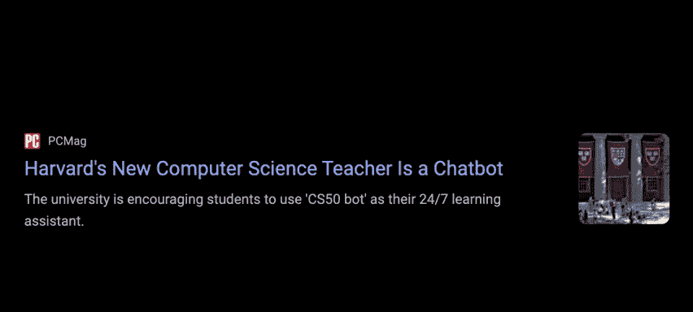

在编写实际代码前，我们可以先用**伪代码**清晰地描述算法思路。伪代码没有固定格式，使用简洁、精确的人类语言。

以下是查找电话簿的伪代码示例：
```
1 拿起电话簿
2 翻开到电话簿中间
3 查看那一页
4 如果目标人物在这一页
5     打电话
6 否则，如果目标人物在书中较前的部分
7     翻开到左半部分的中间
8     回到第3步
9 否则，如果目标人物在书中较后的部分
10    翻开到右半部分的中间
11    回到第3步
12 否则
13    退出
```

从这段伪代码中，我们可以识别出几种基本的编程**构建块**：
*   **函数**：代表一个动作或动词（如“拿起”、“翻开”、“查看”）。
*   **条件语句**：根据问题的答案（是/否）决定执行哪条路径。
*   **布尔表达式**：产生是/否答案的问题（如“目标人物在这一页吗？”）。
*   **循环**：重复执行某些步骤（如“回到第3步”）。

这些构建块是几乎所有编程语言的基础。

## 实践编程：初识 Scratch 🐱

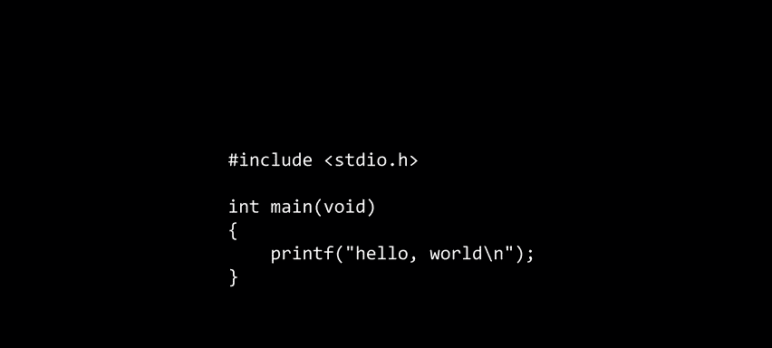

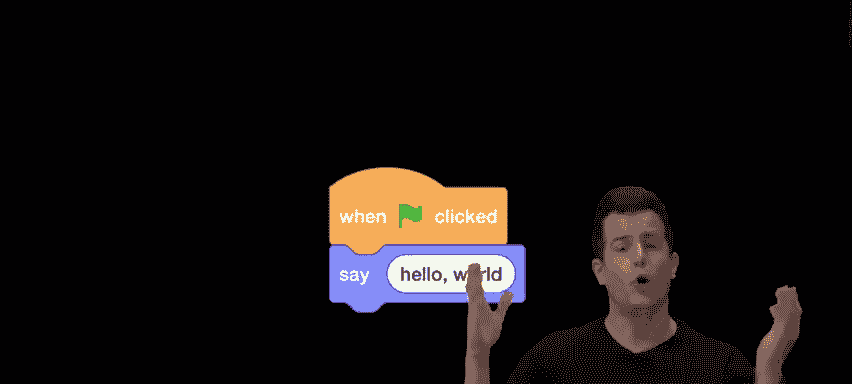

上一节我们介绍了算法的概念和基本构建块，本节中我们来看看如何在一个直观的环境中应用它们。我们将使用 **Scratch**，一种图形化编程语言，通过拖拽代码块来创建程序，从而避开复杂的语法，专注于逻辑和思想。

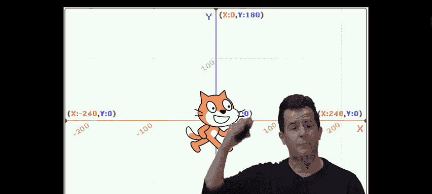

### Scratch 环境简介

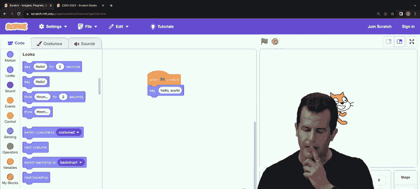

Scratch 的工作区包含：
*   **舞台**：角色（精灵）活动和显示的区域。
*   **精灵列表**：你的程序中的所有角色。
*   **代码块区域**：按颜色分类的编程积木（如运动、外观、声音、控制等）。
*   **脚本区域**：你将代码块拖拽到这里并拼接起来，形成程序。

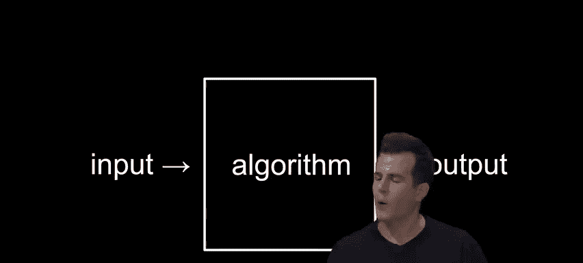

### 从“Hello, World”开始

最简单的程序是让角色说“Hello, World”。
1.  从 **事件** 类别拖出 `当绿旗被点击` 积木。
2.  从 **外观** 类别拖出 `说 [Hello!]` 积木，将其拼接在下面。
3.  将文本改为“Hello, World”。
4.  点击舞台上的绿色旗帜，角色就会说出这句话。

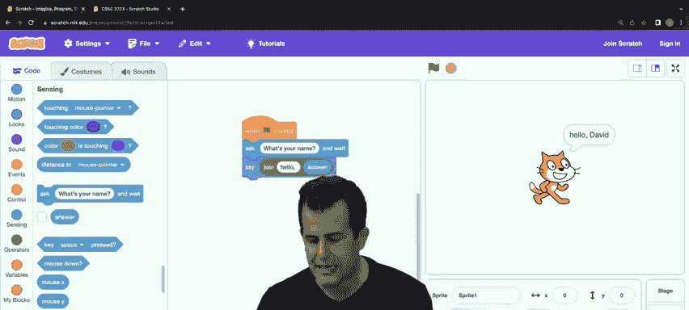

在这里，`说` 是一个**函数**，“Hello, World”是它的**参数**（输入），而屏幕上出现的对话气泡就是**输出**。

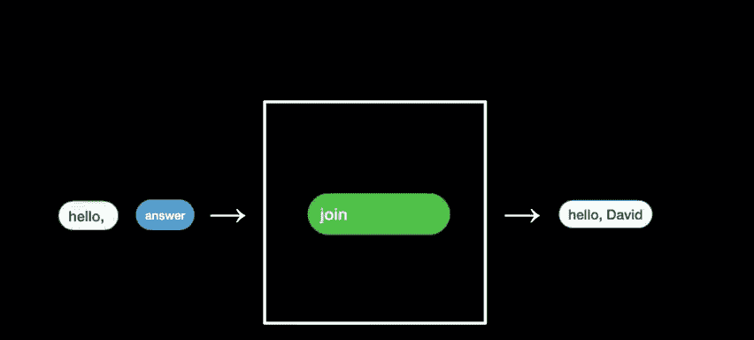

### 实现交互：询问并问候

让我们创建一个能询问用户姓名并打招呼的程序。
1.  使用 `当绿旗被点击`。
2.  从 **侦测** 类别添加 `询问 [What‘s your name?] 并等待`。这会提示用户输入，并将答案作为**返回值**。
3.  为了说“Hello, [名字]”，我们需要组合文本。从 **运算** 类别使用 `连接 [Apple] [Banana]` 积木。
4.  将第一个参数改为“Hello, ”，第二个参数从 **侦测** 类别拖入 `回答`。
5.  最后，用这个连接好的结果作为 `说` 函数的参数。

这个流程完美体现了 **输入 -> 处理 -> 输出** 的模型：用户的姓名是输入，`连接` 函数是处理算法，最终的问候语是输出。

### 使用循环与创建自定义函数（抽象）

如果想让猫叫三声，你可以重复三次 `播放声音 [Meow] 直到播放完毕` 和 `等待 [1] 秒` 的积木。但更好的方法是使用**循环**。
1.  从 **控制** 类别使用 `重复执行 [10] 次` 积木，将次数改为3。
2.  将叫声和等待积木放入循环内部。

更进一步，我们可以**抽象**出“喵叫”这个行为，创建自己的函数。
1.  在 **我的积木** 类别点击“制作新的积木”，命名为“Meow”。
2.  在定义“Meow”积木的脚本区，放入叫声和等待的积木。
3.  现在，在主程序中，你可以直接使用 `Meow` 这个积木。你甚至可以为它添加一个“次数”参数，让它在定义内部使用循环。

**抽象**的力量在于隐藏复杂性。你不需要知道 `说` 或 `播放声音` 积木内部如何工作，只需要知道它们能做什么。同样，创建自己的“Meow”函数后，主程序变得更简洁、易读。

### 条件语句与交互

让我们创建一个当鼠标碰到猫时，猫会叫的程序。
1.  使用 `当绿旗被点击` 和 `重复执行` 形成一个持续运行的循环。
2.  在循环内，放入 `如果 <> 那么` 积木。
3.  条件部分：从 **侦测** 类别拖入 `碰到 [鼠标指针]?` 这个**布尔表达式**。
4.  如果条件为真，则执行 `播放声音 [Meow] 直到播放完毕`。

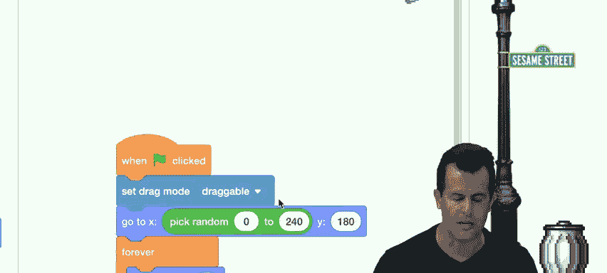

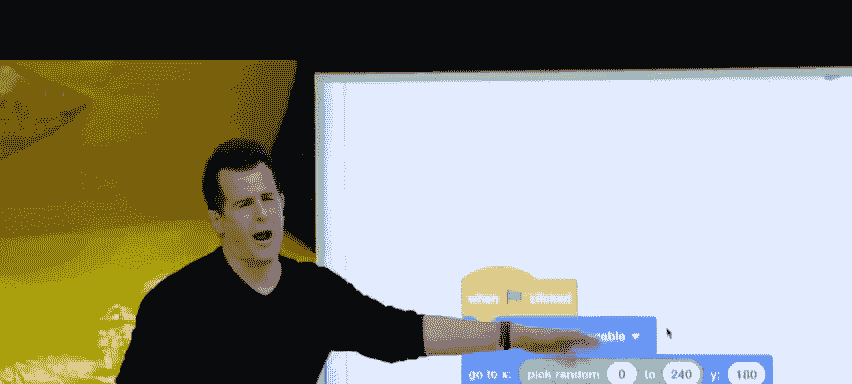

通过组合**函数**、**循环**、**条件语句**和**布尔表达式**这些基本构建块，你已经可以创造出具有复杂交互性的项目，比如游戏。

## 关于人工智能（AI）与CS50小鸭 🤖🦆

课程中还将引入 **CS50 Duck**，一个AI编程助手。它的设计理念不是直接给你答案，而是像一位耐心的导师，通过提问和引导帮助你找到解决方案，克服学习编程时遇到的障碍。这代表了教育工具发展的一个方向：提供个性化、全天候的学习支持。

## 总结

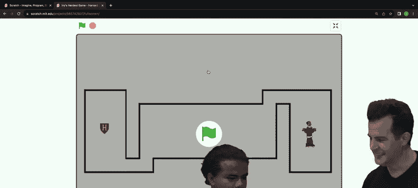

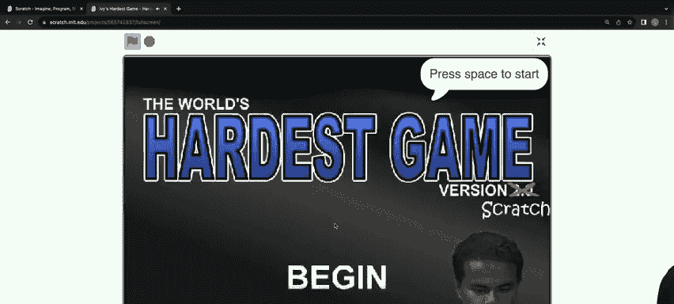

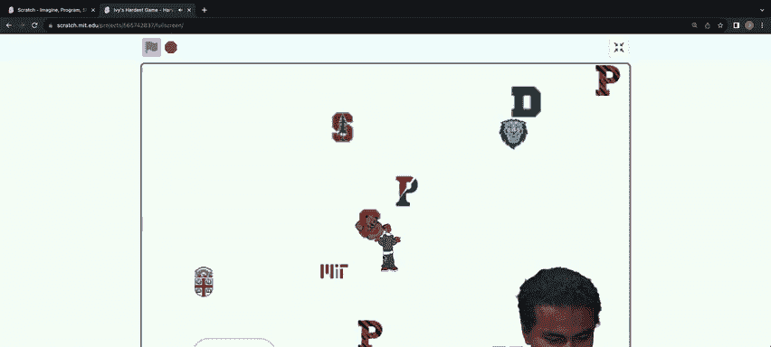

本节课中我们一起学习了计算机科学的基石：
1.  **信息表示**：计算机使用二进制（0和1）表示一切，包括数字、文本（ASCII/Unicode）、颜色（RGB）、图像、声音和视频。
2.  **算法与效率**：算法是解决问题的步骤。设计正确且高效的算法（如分而治之）至关重要。
3.  **编程基础块**：**函数**、**条件语句**、**布尔表达式**和**循环**是构成所有程序的基本元素。
4.  **从思想到代码**：我们通过**伪代码**理清思路，并在 **Scratch** 中通过拖拽积木实践编程，理解了**输入-算法-输出**模型以及**抽象**的重要性。
5.  **实践方法**：构建复杂项目应从简单版本开始，逐步迭代添加功能。

记住，本课程的目标不仅是学习编程，更是掌握一种解决问题和系统化思考的方式。旅程刚刚开始，享受探索的过程吧！