# 004：算法 🧠


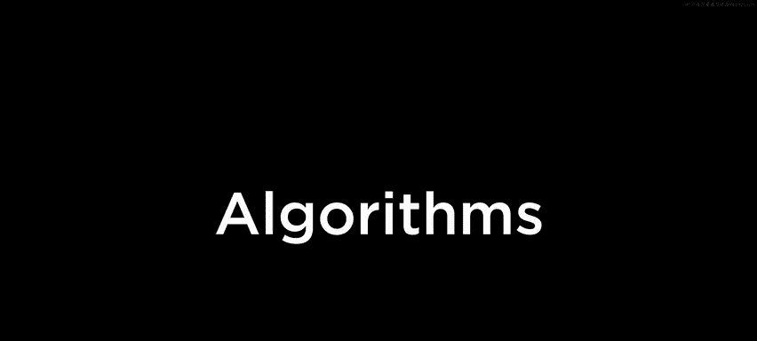


## 概述
在本节课中，我们将学习算法的核心概念，包括如何分析算法的效率（使用大O、Ω和Θ表示法），并探索几种经典的搜索和排序算法，如线性搜索、二分搜索、选择排序、冒泡排序和归并排序。我们将通过伪代码和C语言示例来理解这些算法的实现和性能差异。

---

## 从分治思想到算法效率

上一节我们回顾了第0周电话簿问题中体现的分治思想。本节中，我们来看看如何将这种思想应用到更广泛的算法设计中。

在电话簿例子中，我们比较了三种算法的效率：
1.  **一次一页**：线性增长。
2.  **一次两页**：速度翻倍，但仍是线性增长。
3.  **分而治之（二分法）**：对数级增长，效率显著提升。

这种对数级增长的算法，其运行时间与问题规模的关系可以表示为 **log₂ n**。当问题规模（如电话簿页数）翻倍时，所需的步骤仅增加一步，这体现了分治算法的巨大优势。

---

## 搜索算法：线性搜索与二分搜索

理解了算法效率的概念后，我们来看看两种基础的搜索算法。

### 线性搜索 🔍
线性搜索是最直观的搜索方法，即从头到尾（或从尾到头）依次检查每个元素。

以下是线性搜索的伪代码描述：
```c
For i from 0 to n-1
    If number behind doors[i] is 50
        Return true
Return false
```

### 二分搜索 ⚡
二分搜索要求数据已排序。它通过反复将搜索区间对半分割来快速定位目标。

以下是二分搜索的伪代码描述：
```c
If no doors left
    Return false
If 50 is behind middle door
    Return true
Else if 50 < middle door
    Search left half
Else if 50 > middle door
    Search right half
```

---

## 算法效率分析：大O、Ω和Θ表示法

在比较了具体算法后，我们需要一种形式化的方法来描述和比较它们的效率。

计算机科学家使用**渐近符号**来描述算法的运行时间，关注当输入规模 `n` 变得非常大时的趋势，并忽略常数因子和低阶项。

*   **大O表示法 (O)**：描述算法的**最坏情况**运行时间，即**上界**。例如，线性搜索是 **O(n)**。
*   **Ω表示法 (Ω)**：描述算法的**最好情况**运行时间，即**下界**。例如，线性搜索在最好情况下是 **Ω(1)**。
*   **Θ表示法 (Θ)**：当算法的最坏情况和最好情况运行时间相同时，可以用Θ表示。例如，选择排序是 **Θ(n²)**。

常见的运行时间类别有：
*   **O(1)**：常数时间。
*   **O(log n)**：对数时间（如二分搜索）。
*   **O(n)**：线性时间（如线性搜索）。
*   **O(n log n)**：线性对数时间（如归并排序）。
*   **O(n²)**：二次时间（如选择排序、冒泡排序）。

---

## 在C语言中实现搜索

理论分析之后，让我们在C语言中实践这些搜索算法。

### 实现线性搜索
以下是在整数数组中实现线性搜索的C代码：
```c
#include <cs50.h>
#include <stdio.h>

int main(void)
{
    int numbers[] = {20, 500, 10, 5, 100, 1, 50};
    int n = get_int("Number: ");
    for (int i = 0; i < 7; i++)
    {
        if (numbers[i] == n)
        {
            printf("Found\n");
            return 0;
        }
    }
    printf("Not found\n");
    return 1;
}
```
**注意**：在循环内找到目标后，我们使用 `return 0;` 立即成功退出程序。只有在遍历完整个数组都未找到时，才执行最后的 `printf("Not found\n");` 并 `return 1;` 表示失败。

### 比较字符串
比较字符串不能直接使用 `==`，需要使用 `string.h` 库中的 `strcmp` 函数。若两字符串相同，`strcmp` 返回 `0`。

```c
#include <cs50.h>
#include <stdio.h>
#include <string.h>

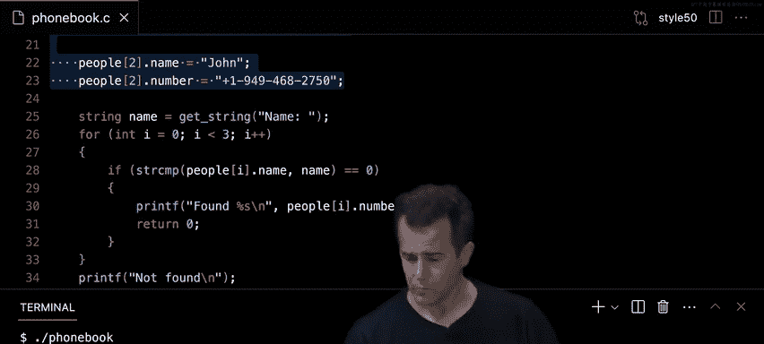

int main(void)
{
    string strings[] = {"battleship", "boot", "cannon", "iron", "thimble", "top hat"};
    string s = get_string("String: ");
    for (int i = 0; i < 6; i++)
    {
        if (strcmp(strings[i], s) == 0) // 使用 strcmp 比较字符串
        {
            printf("Found\n");
            return 0;
        }
    }
    printf("Not found\n");
    return 1;
}
```

---

## 结构体：创建自定义数据类型

当数据间存在逻辑关联时（如电话簿中的姓名和号码），将它们分开存储在平行数组中容易出错且难以维护。C语言允许我们使用 `struct` 创建自定义数据类型来组合相关数据。

以下是定义和使用 `person` 结构体的示例：
```c
#include <cs50.h>
#include <stdio.h>
#include <string.h>

typedef struct
{
    string name;
    string number;
}
person;

int main(void)
{
    person people[3];
    people[0].name = "Carter";
    people[0].number = "+1-617-495-1000";
    people[1].name = "David";
    people[1].number = "+1-617-495-1000";
    people[2].name = "John";
    people[2].number = "+1-949-468-2750";

    string name = get_string("Name: ");
    for (int i = 0; i < 3; i++)
    {
        if (strcmp(people[i].name, name) == 0)
        {
            printf("Found %s\n", people[i].number);
            return 0;
        }
    }
    printf("Not found\n");
    return 1;
}
```
使用结构体使代码更清晰，数据关系更明确，减少了出错的可能性。

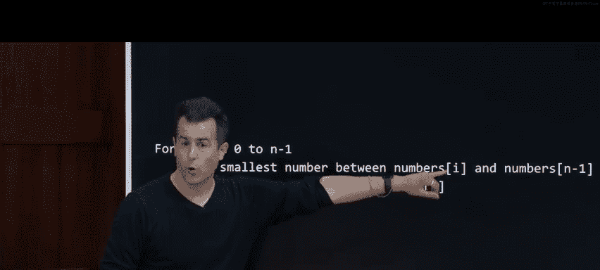

---


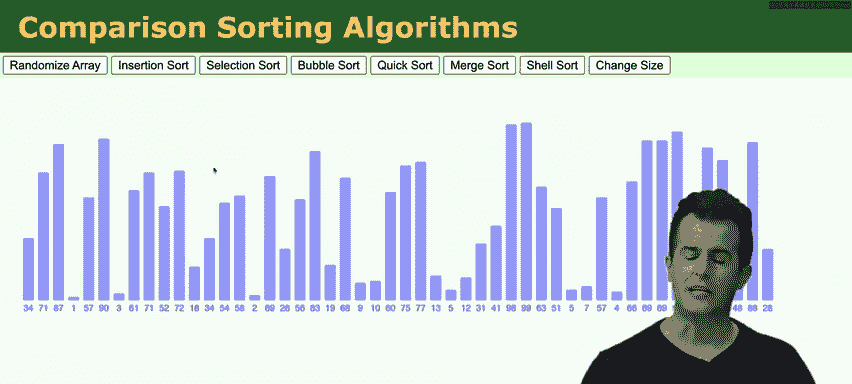

## 排序算法

搜索算法通常假设数据已排序。那么，排序本身的效率如何？我们探讨两种简单的排序算法。

### 选择排序
选择排序 repeatedly 选择剩余元素中的最小值，并将其放到已排序序列的末尾。

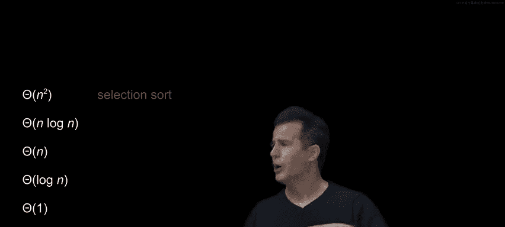

**伪代码**：
```c
For i from 0 to n-1
    Find smallest item between numbers[i] and numbers[n-1]
    Swap smallest item with numbers[i]
```
**效率分析**：选择排序需要进行大约 `(n-1) + (n-2) + ... + 1` 次比较，其和约为 **n²/2**。因此，其运行时间为 **O(n²)**。即使在最好情况下（数组已排序），它仍然需要进行所有比较，所以也是 **Ω(n²)**，即 **Θ(n²)**。

### 冒泡排序
冒泡排序 repeatedly 比较相邻元素，如果顺序错误就交换它们，使较大的元素逐渐“冒泡”到右侧。

**基础伪代码**：
```c
Repeat n-1 times
    For i from 0 to n-2
        If numbers[i] and numbers[i+1] out of order
            Swap them
```
**优化**：如果在一轮遍历中没有发生任何交换，说明数组已排序，可以提前终止。
**效率分析**：
*   **最坏情况**：**O(n²)**。
*   **最好情况**（数组已排序且使用优化）：只需一轮遍历检查，即 **Ω(n)**。

---

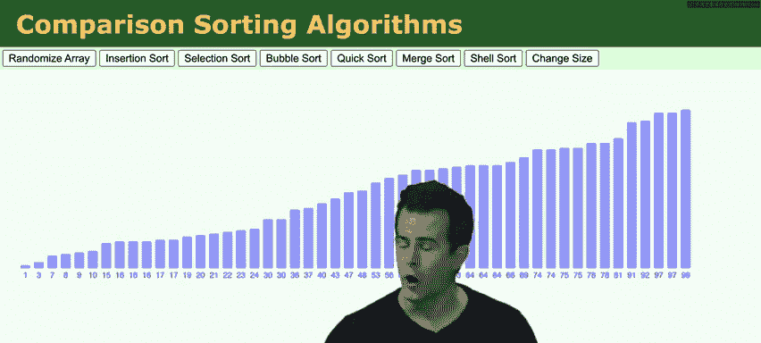

## 递归：函数调用自身

递归是一种强大的编程技术，其中函数直接或间接地调用自身。它通常用于解决可以分解为相同类型的子问题的问题。

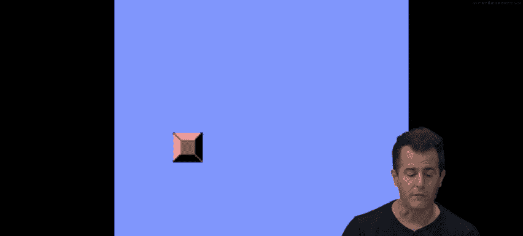

### 递归示例：绘制金字塔
迭代方法（使用循环）：
```c
void draw(int n)
{
    for (int i = 0; i < n; i++)
    {
        for (int j = 0; j < i + 1; j++)
        {
            printf("#");
        }
        printf("\n");
    }
}
```
递归方法：
```c
void draw(int n)
{
    if (n <= 0) // 基本情况：防止无限递归
    {
        return;
    }
    draw(n - 1); // 递归调用：绘制高度为 n-1 的金字塔
    for (int i = 0; i < n; i++) // 绘制第 n 行
    {
        printf("#");
    }
    printf("\n");
}
```
递归思想：一个高度为 `n` 的金字塔 = 一个高度为 `n-1` 的金字塔 + 第 `n` 行。`if (n <= 0)` 是**基本情况**，确保递归能够终止。

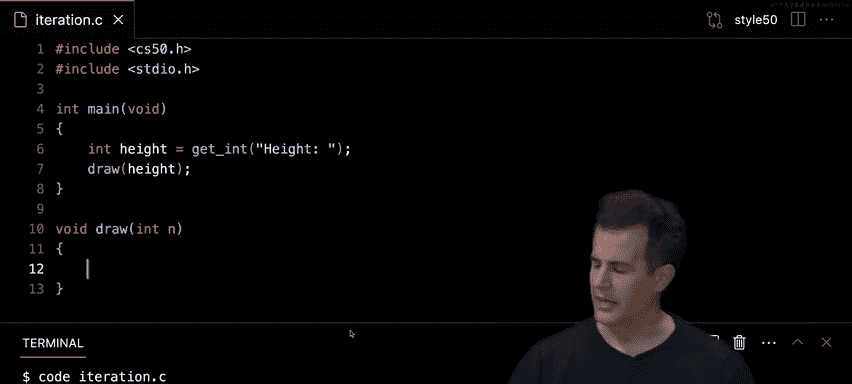

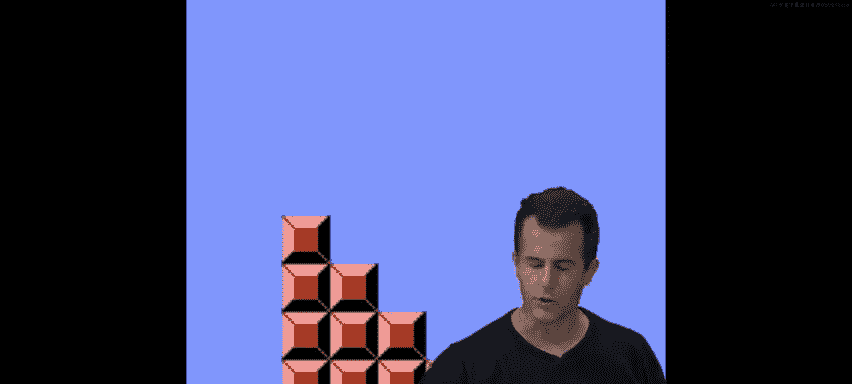

---

## 归并排序：一种更快的排序算法

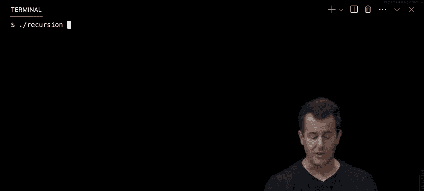


选择排序和冒泡排序的 O(n²) 时间复杂度对于大规模数据来说太慢。归并排序采用**分治**和**递归**策略，达到了 **O(n log n)** 的效率。


**归并排序伪代码**：
```c
If only one number
    Quit
Else
    Sort left half of numbers
    Sort right half of numbers
    Merge sorted halves
```
**核心操作“合并”**：假设有两个已排序的数组，可以通过比较各自前端元素，依次选择较小的放入新数组，从而合并成一个大的有序数组。

**效率分析**：
*   将 `n` 个元素的数组不断对半分割，直到成为单个元素，需要 **log n** 层（以2为底）。
*   在每一层，我们需要合并总共 `n` 个元素。
*   因此，总工作量为 **n * log n**，即 **O(n log n)**。
*   归并排序在所有情况下的效率都是 **Θ(n log n)**。

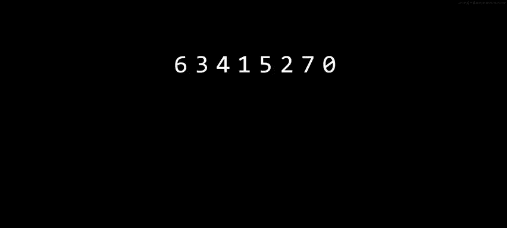

归并排序的代价是需要额外的内存空间来在合并时存放临时数组，这是典型的**空间换时间**策略。

---


## 总结

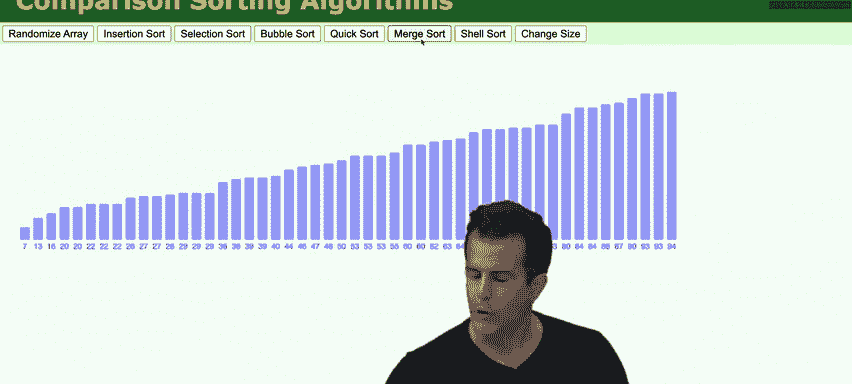

本节课中我们一起学习了算法的核心思想。
1.  我们回顾了**分治法**，并通过**二分搜索**看到了其效率优势。
2.  我们学习了使用**大O、Ω和Θ表示法**来形式化地分析算法的时间复杂度。
3.  我们在C语言中实现了**线性搜索**和**二分搜索**，并学会了使用 `strcmp` 比较字符串。
4.  我们使用 `typedef struct` 创建了**自定义数据类型（结构体）**，以更优雅的方式组织关联数据。
5.  我们探索并分析了两种简单的**排序算法**：**选择排序（Θ(n²)）** 和**冒泡排序（O(n²), Ω(n)）**。
6.  我们引入了**递归**的概念，即函数调用自身，并看到了它在简化问题描述上的作用。
7.  最后，我们学习了高效的**归并排序算法（Θ(n log n)）**，它综合利用了分治、递归和合并操作，以额外的空间消耗换来了远高于二次时间排序算法的性能。

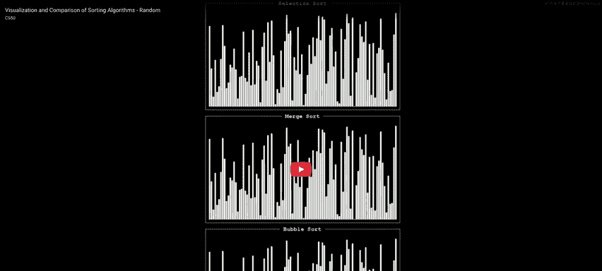


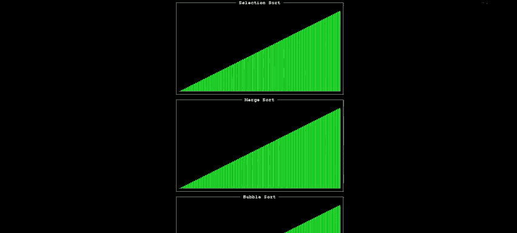


理解这些基础算法及其效率分析，是学习计算机科学和编写高效程序的关键一步。