# 005：内存

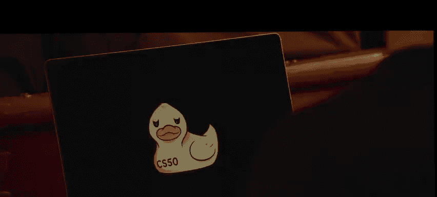

## 概述

在本节课中，我们将要学习计算机内存的工作原理。我们将从更底层的视角理解计算机如何工作，以及当你编写代码时，计算机内部究竟发生了什么。这将帮助我们建立一个完整的心智模型，以便在解决问题、修复错误或编写代码时，真正理解计算机内部的构建模块。我们将最终移除过去几周在C语言中使用的一些“辅助轮”，并介绍更常见的媒体类型，如图像文件。我们将探讨当你查看照片、GIF或任何屏幕上的图像时，其背后的原理。我们会明白，与好莱坞影视剧不同，你无法无限“增强”一张图片来获取更多细节，因为构成这些文件的比特或字节是有限的。不过，我们也会了解到，通过人工智能的统计推理、建模和预测，计算机可以在原本没有信息的地方创造出信息。

## 图像与像素

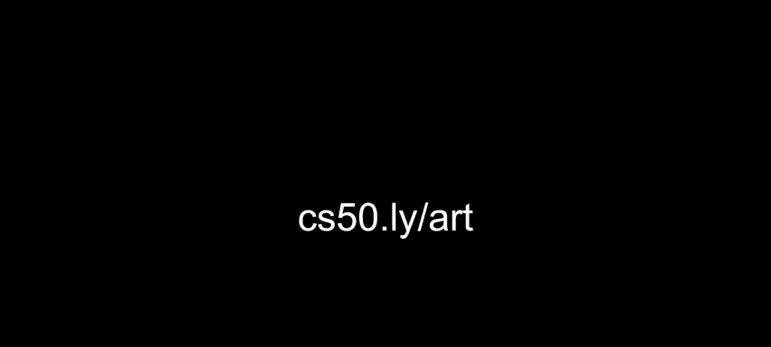

屏幕上的一切，或者说所有这些像素，本质上只是一个上下左右的网格，共同构成了这些图片。我们很幸运有三位志愿者在课前用便利贴创作了他们自己的像素艺术。每个便利贴代表屏幕上的一个像素或点。通常像素可能是黑色或白色，但我们这里的便利贴是粉色或蓝色的。每个便利贴代表屏幕上的一个点。

他们创作了一个烟花图案。它看起来非常“块状”，因为我们给他们的便利贴每个代表一个像素。通常像素可能是黑色或白色，但我们这里的便利贴是粉色或蓝色的。每个便利贴代表屏幕上的一个点。

他们还创作了另一个版本，可能传达了更多信息。我们还有更多的像素艺术。让我们为志愿者们仅用像素就能完成的作品鼓掌。

这里的重点是，当屏幕上只有点时，你能做的事情是有限的。当然，我们之前看到的压力球图像质量要高得多，保真度更高，或者更具体地说，分辨率更高。分辨率指的是屏幕上有多少点或像素。像素越小，屏幕上能容纳的像素越多，图像就越清晰。但归根结底，即使是这里的像素艺术也代表了你的手机、笔记本电脑、台式机或现代电视上正在发生的事情，因为所有图像都只是这个像素网格。

## 从像素到内存

在我们能够编写实际操作这些图像的代码之前，我们需要理解并掌握一些新的语法来导航文件，而不仅仅是文本文件，还包括存储在计算机或服务器某处的文件。

让我们考虑一下如何存储像这样的信息，但我们会简化它。这里是一个由0和1组成的网格。但我要说，每个0或1都可以代表一个像素，一个单独的点。如果那个点是0，它代表黑色。如果那个点是1，它代表白色。基于此，谁能看出这个网格是什么图片吗，即使它使用的是0和1而不是便利贴。

这是一张笑脸。你怎么看出来的？稍后它会变得非常明显。但如果我实际上去掉1，只留下0，你就有了刚才在那里的0。所以，这通常在屏幕上转换成的不是字面上的0和1图案，而是点的图案。同样，白色可能是1，黑色可能是0，但我们在屏幕上将其描绘成这个实际的网格，但这确实是我们在文件中存储图像所需的一切，我们只需要一个0和1的图案。

当然，拥有更多颜色会更有趣。如果你有一个更大的网格，你甚至可以用像素艺术做更多事情。事实上，在本学期初的助教培训中，我们给了所有助教一个谷歌电子表格，并将所有行和列调整为正方形，而不是默认的矩形。然后我们鼓励他们用这个创作一些东西。实际上，这里有一些今年的创作，他们基本上使用谷歌电子表格创建了图像，将每个单元格视为屏幕上的一个点。

## 颜色的表示：RGB与十六进制

让我们讨论一下如何表示不仅仅是黑白两色的0和1，而是实际的颜色。回想第0周，当我们讨论如何表示信息（包括颜色）时，我们介绍了RGB，它代表红、绿、蓝。这只是一种使用一定量的红、绿、蓝混合在一起以获得你想要的颜色的约定。

在计算机世界中，有一种描述这些红、绿、蓝数量的方法。归根结底，它当然只是比特，等效地，它只是像72、73、33这样的数字，这是我们在第0周用于表示黄色的任意示例。但实际上，为了表示我们今天看到的颜色，通常有一种不同的约定表示法，随着我们探索内存世界，我们也会看到它。

这是Photoshop的截图。如果你以前从未使用过它，这就像一个颜色选择器，你可以通过点击、拖动或输入数字来选择数百万种颜色中的任何一种。但请注意下面这里。目前我们通过将滑块一直拖到左下角选择了黑色。这个用户界面告诉我们，红色是0，绿色是0，蓝色是0。在屏幕上写这个的常规方式就是字面上一个井号，然后是三对数字：红色00，绿色00，蓝色00。

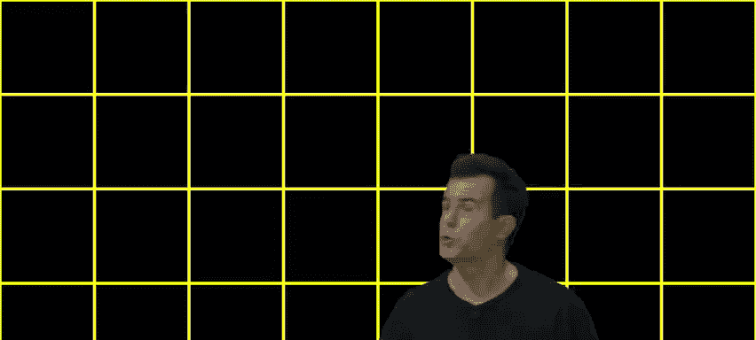

相反，如果你要选择白色。现在它变得有点奇怪。现在有很多红色、很多绿色、很多蓝色，正如你所期望的，将所有值都调高。但常规的写法不是使用十进制，而是使用字母表中的字母。所以红色是FF，绿色是FF，蓝色是FF。关于这一点稍后再谈。

当涉及到表示红色时，这里有很多红色：255红色，0绿色，0蓝色。所以现在的模式是FF0000。在我揭示绿色是什么之前，它可能应该是什么模式？应该是00FF00，因为它似乎遵循从左到右红、绿、蓝的模式。所以0红色，255绿色，0蓝色，因此是00FF00。最后，如果我们做纯蓝色，就是0红色，0绿色，很多蓝色，因此是0000FF。所以不知何故，F显然代表数字255。我们马上会看到原因。

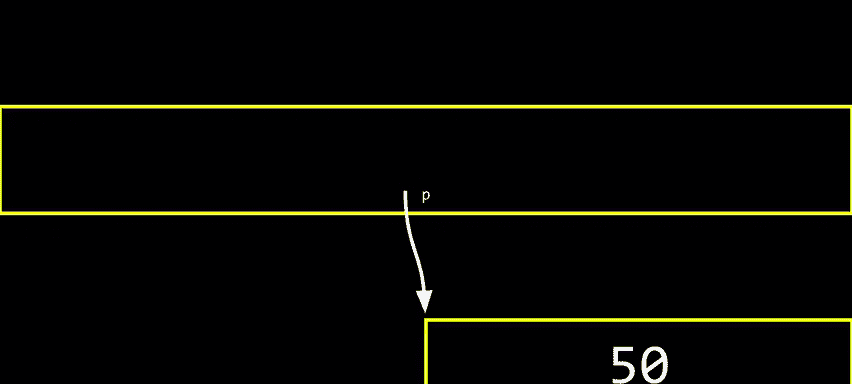

回想一下，在计算机世界中，它们只说0和1。我们已经以黑白形式看到了这一点。当然，在现实世界中，我们倾向于使用十进制而不是二进制。所以我们有10个数字0到9可用。但事实证明，在图形和颜色领域，以及在计算机内存领域，使用一种叫做十六进制的东西往往更方便，当你需要的数字总数超过10个时，你开始从英文字母表中借用。所以接下来的几个数字，或者更确切地说是数字，是A、B、C、D、E、F。还有其他系统使用更多的字母，但这可能是我们详细讨论的最后一个。

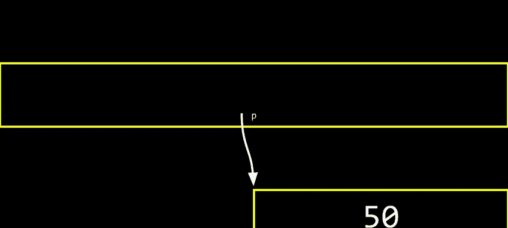

在这种情况下，我们总共有10加6，即16个，也就是十六进制，或者我们可能称之为基数为16。大写或小写实际上并不重要，只要大体一致即可。所以“hex”暗示16，“decimal”是十进制。所以这里是十六进制表示法，或者出于可以追溯到第0周讨论的数学原因，也称为基数为16。

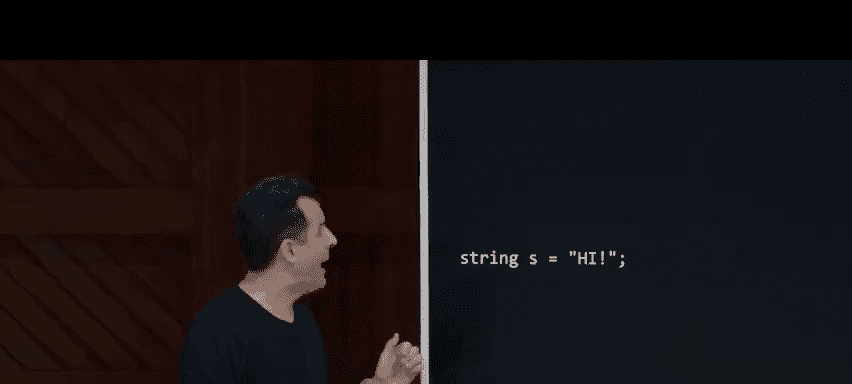

## 十六进制详解

这里有一些与第0周相同的推理。我们如何使用两位十六进制数字来表示你我所知的十进制数字？如果我们将其视为16的0次方位和16的1次方位。如果我们进行数学计算，当然，这给了我们个位和十六位。所以我们只是改变了基数，而不是第0周的故事。

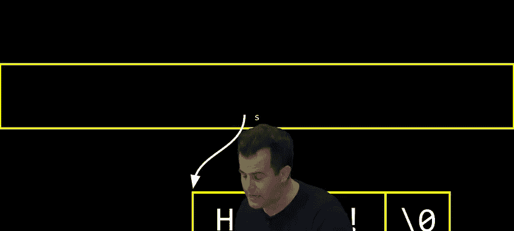

如果我们开始用十六进制表示实际值，这里是两个零。所以是1乘以0加上16乘以0，当然，这给了我们你我所知的数字0。所以在十六进制、二进制和十进制中，表示你我所知的数字0的方式是相同的。但现在这里是十六进制的数字1。这里是数字2。这里是数字3、4、5、6、7、8、9。所以直到这一点，它与我们的十进制世界是相同的。

但我如何数到你我所称的十进制10？根据我们目前所看到的。现在它上升到A，因为A显然代表你我所知的10。B代表11。C代表12、13、14、15。然而，我如何数到16？不是“10”，而是10，因为左边第二列中的1实际上代表十六位。所以是16乘以1得到16，加上1乘以0得到0，总共是16。所以现在这是你我所认为的17、18、19、20、21……的方式。如果我们一直数到尽可能高，十六进制中最大的数字显然是F。所以一旦你达到FF，数学计算就有点烦人了。但现在是16乘以15加上1乘以15，这实际上给了我们你我所知的数字255。

所以我们在Photoshop中看到了它，现在在十六进制中也看到了它。这不是你经常做的数学，但它确实与第0周的系统完全相同，只是基数不同。

## 为什么使用十六进制？

但为什么要有所有这些额外的复杂性？为什么我们要引入另一个系统来给我们像FF这样的模式？事实证明，十六进制只是方便。为什么？如果你字母表中有16个数字，0到F，你需要多少比特，多少0和1来表示16个不同的值？是4，因为你有4个比特，第一个有2种可能性，乘以2乘以2乘以2，所以是16种可能性，2的4次方。如果你有4个比特用一个数字表示，这对计算机科学家和程序员来说在实践中很方便。

所以F可能确实代表1111，但那不是一个完整的字节，字节是8比特。在计算中，没有人以4为单位计数，总是以8、16、32、64等单位计数。但事实证明，因为十六进制适合一次表示4个比特，如果你只使用两个十六进制数字，你可以一次表示8个比特，而8比特是一个字节，这是一个常见的度量单位。这就是为什么即使是Photoshop也使用这个约定，就像颜色程序和更一般的网页开发一样，使用两个十六进制数字来表示单个字节，因为左边的一个代表前4个比特，右边的一个代表后4个比特。所以这并不是什么大问题。它只是方便，即使这可能一下子感觉很多。

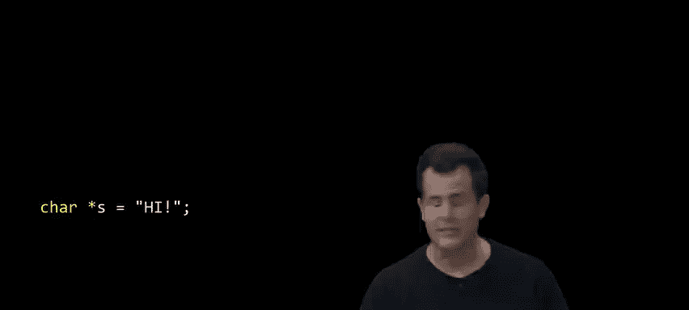

## 内存地址与指针

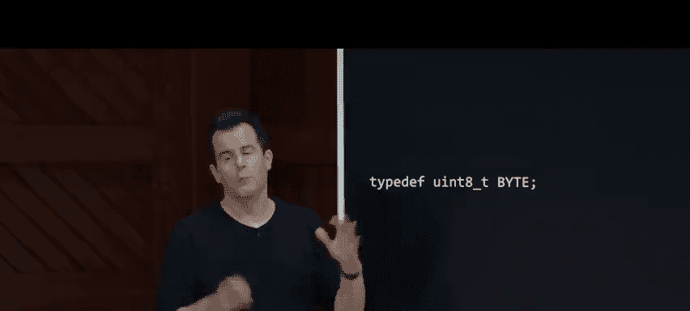

有了这个系统，让我们考虑一下在计算世界的其他地方我们可能在哪里看到它。我建议我们像过去一样考虑，我们的计算机实际上只是这个内存网格，例如，其中每个方块代表一个单独的字节。我已经提过几次，当我们谈论计算机内存时，我们可以将每个方块视为具有单独的位置，就像我过去随口说的那样，也许这是第一个字节，第二个字节，第三个字节，也许这是第十亿个字节，所以我们可以对计算机内的所有字节进行编号。

事实证明，正如我们今天将在代码中看到的，计算机通常确实使用数字来表示其内存中的所有字节，并且按照惯例，它们通常使用十六进制表示法来表示这些字节。我这么说是什么意思？从技术上讲，如果我们开始对这些字节编号并从0开始计数（大多数程序员会这样做），这是字节0、1、2、3……这是字节15。但如果我想继续，那将是16、17。但在十六进制中不是这样。所以在十六进制中，一旦你达到9，你实际上会使用A到F，正如我提出的那样。同时，如果你在那之后继续，你会有10，但正如你注意到的，这不是10。这是16。17、18、19。所以这里事情变得有点奇怪。我说16，我说17，而你显然看到任何正常人都会读作10和11的东西。所以存在这种二分法。因此，我们需要一些约定来向读者明确这些是十六进制数字，而不是十进制。否则就完全模糊了。那里的约定，你可能在现实世界中见过，即使有点奇怪，就是在十六进制数字前加上前缀0x。它在数学上不做任何事情，不是乘法或类似的东西。只是0x意味着后面跟着一个十六进制数字，只是为了将其与十进制区分开来。

你可以看到，即使我们没有足够的空间容纳255个字节，你开始看到我们甚至还没有讨论过的模式，因为我们只使用那两列作为个位、十六位等等。大写或小写都可以。

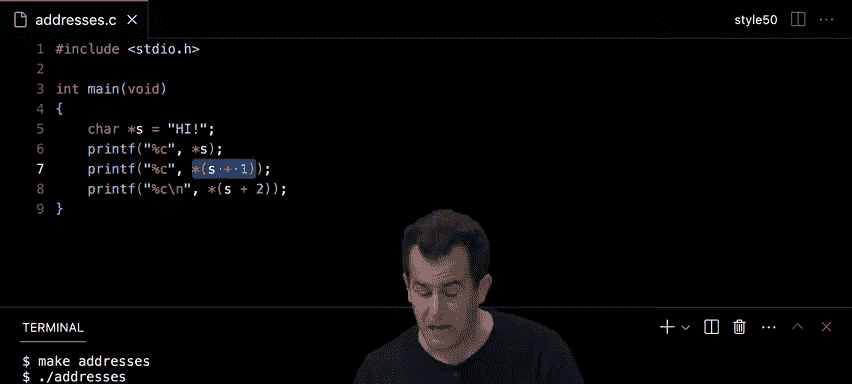

## 在代码中探索地址

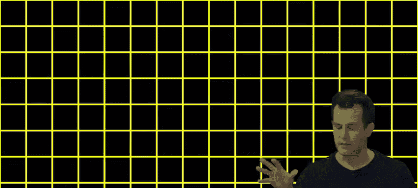

有了这些，让我们实际上做一些技术上更有趣的事情，比如回顾一些我们已经见过的代码，看看我们实际上可以从这种新的内存位置表示中获得什么。

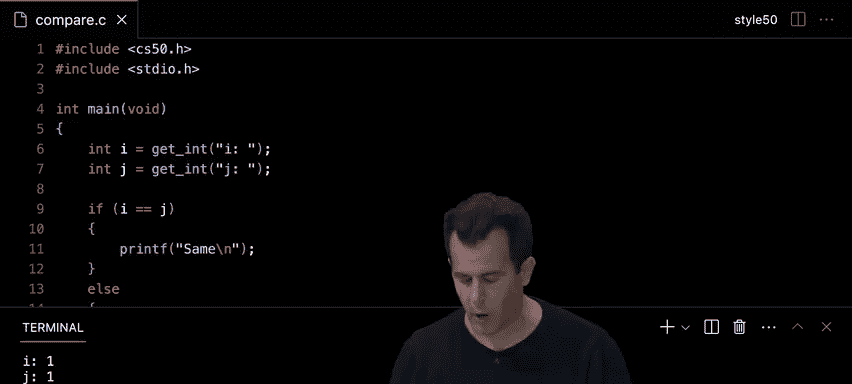

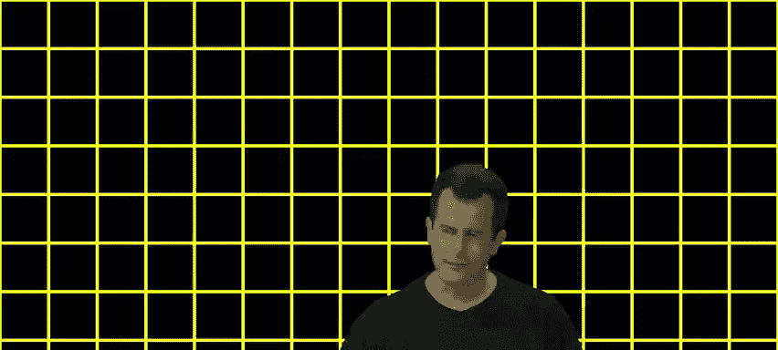

我将转到VS Code，在那里我打开了终端窗口但还没有代码文件，我将继续创建一个名为`addresses.c`的文件，因为我想开始在我的计算机中玩弄信息的地址。为此，让我先做一些非常简单的事情。让我包含`stdio.h`。让我做`int main(void)`，没有命令行参数。然后在这里，让我做我们刚才看到的那行代码：声明一个名为`n`的`int`，将其设置为默认值50，只是为了程序做一些值得注意的事情，让它实际打印出`%i\n`并插入那个`n`的值。

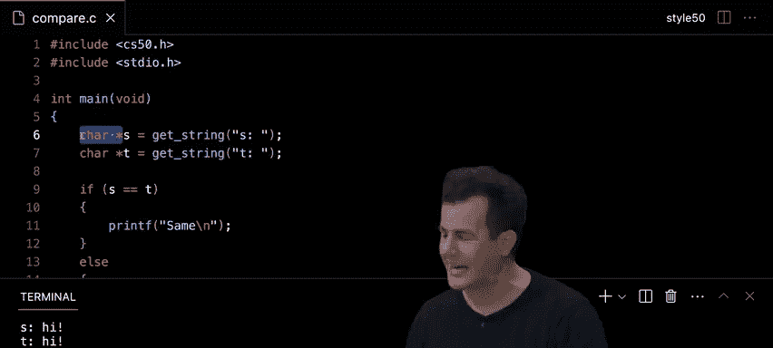

这就像第一周的内容，只是创建一个变量并打印出它的值，以确保我们在同一页上。所以让我在终端窗口中执行`make addresses`。当我执行`./addresses`时，毫不奇怪，我确实应该看到数字50。但让我们考虑一下，现在通过翻转到同一行代码并将其转换到这个相同的网格中，这在计算机内部实际上做了什么。

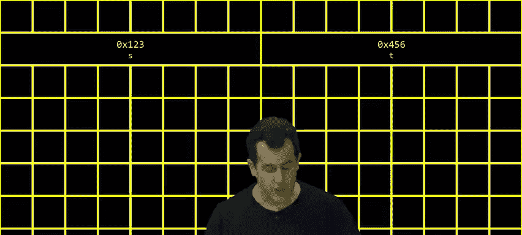

这里是一个内存网格。我不一定知道它最终会出现在计算机内存中的哪个位置。所以我任意选择位置。但我知道在大多数系统上，一个`int`通常是4字节。所以我使用了1、2、3、4个方块。我假设下面第一个可用的四个，我称之为`n`，并把值50放进去。所以从字面上看，当你写那行代码`int n = 50;`时，计算机在底层做了类似这样的事情。它可能在这里，可能在那里，但我只是简单地画在了下面。

但这意味着那个50，特别是那个变量`n`，存在于计算机内存的某个地方。它可能存在于哪里？我真的不知道。坦白说，今天之后我最终不会关心，但让我假设如果所有这些字节都从0开始编号，也许为了讨论，这是地址0x123。所以它是一个十六进制数字1、2、3。不是123，是1、2、3，但用十六进制表示只是因为说起来容易一点。但那个变量`n`显然必须存在于某个地址。那么我们能也许看到这个吗？事实证明，在C语言中，我们今天可以引入更多语法，实际上让你能够访问计算机内存中变量的位置。

第一个是字面上的`&`符号。你可能会将其发音为“地址运算符”。使用单个`&`符号，你实际上可以询问计算机这个变量的地址是什么。然后这里的`*`可能被称为“解引用运算符”，它允许你获取一个地址并前往该地址，有点像遵循地图，X标记地点，星号将带你到内存中的那个位置，这样你就可以看到那里实际有什么。

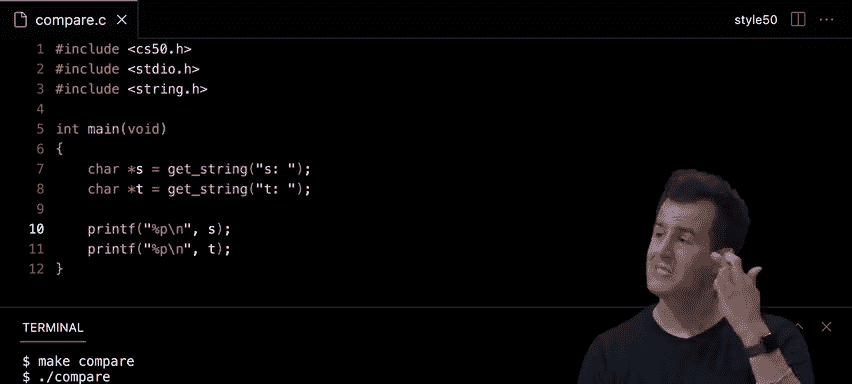

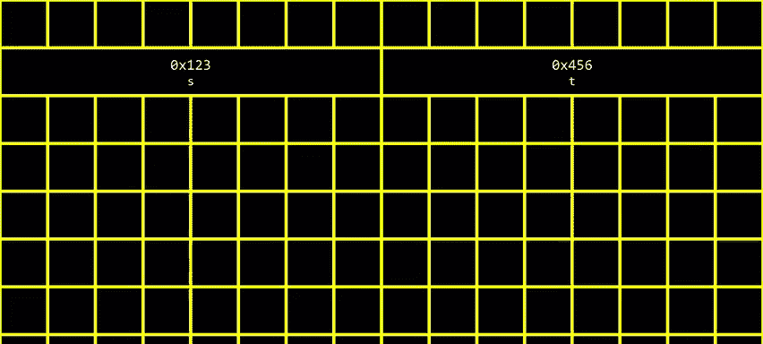

我是什么意思？让我回到VS Code，让我继续稍微改变我的程序如下：我仍然要像以前一样声明`n`，值为50，但与其打印出整数本身，不如打印出一个地址。事实证明，使用`printf`的格式代码是`%p`。如果我现在想打印出`n`的地址，回想一下我有这两个新功能，第一个是相关的，`&`将给我`n`的地址。

所以让我现在回到VS Code，让我做一个改变，我将把`%i`改为`%p`，这将向我显示一个地址而不是整数本身，但我需要告诉`printf`显示什么地址。我不想打印出`n`，因为那字面上是数字50，我想打印出`n`的地址，比如它在内存中的位置。所以我在这里给它加上前缀`&`。现在如果我回到终端窗口，再次执行`make addresses`，`./addresses`，我可能不会幸运地看到0x123，因为我的计算机内存比那多得多，但当我按下回车时，我确实看到了0x……。如果我在这里放大，“增强”一下，此时在服务器上它恰好是`0x7ffcc3a7fffb`。所以这是一个很大的地址。如果我们真的做了所有的数学计算，那真的是一个很大的数字，但谁在乎呢？现在唯一重要的是它存在于某个地方这一事实。

所以这个我们作为格式代码传递给`printf`的`%p`符号，利用了C支持所谓的指针这一事实。所以指针实际上只是一个地址，某个变量的地址，你甚至可以将其存储在另一个本身称为指针的变量中。

我这么说是什么意思？如果指针是一个地址，我们可以开始玩弄同样的想法如下。让我实际上再次回到VS Code，玩弄像这样的语法。所以让我仍然声明一个名为`n`的变量并将其设置为等于50。但让我们实际创建一个实际的指针，一个其生命目的不是存储像50这样无聊的数字，而是存储某个值的地址的变量。

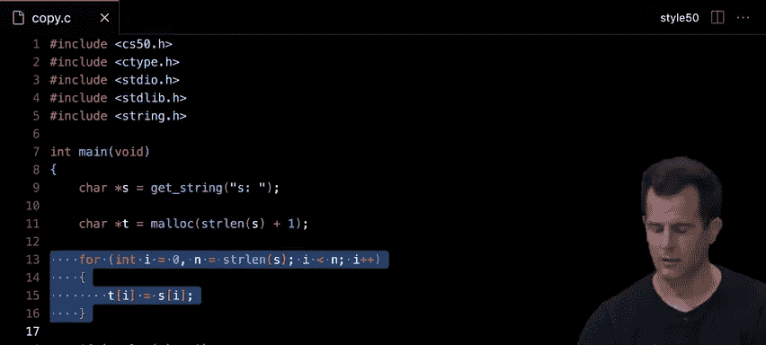

这样做的语法 admittedly 很奇怪。如果你希望`p`是一个指针，一个存储地址的变量，你字面上说`int *`，原因我们稍后会看到。这与我之前提到的星号不同，原因我们也会很快看到。但`int *p`意味着：嘿编译器，给我一个名为`p`的变量，我可以在其中存储一个整数的地址。你想把什么地址放进去？现在我可以借用刚才的相同语法，我可以使用`&n`，它会说：嘿编译器，或者嘿计算机，给我`n`本身的地址。之前我没有麻烦使用变量，我只是直接将`n`的地址直接发送到`printf`，但我现在可以如下玩弄它。

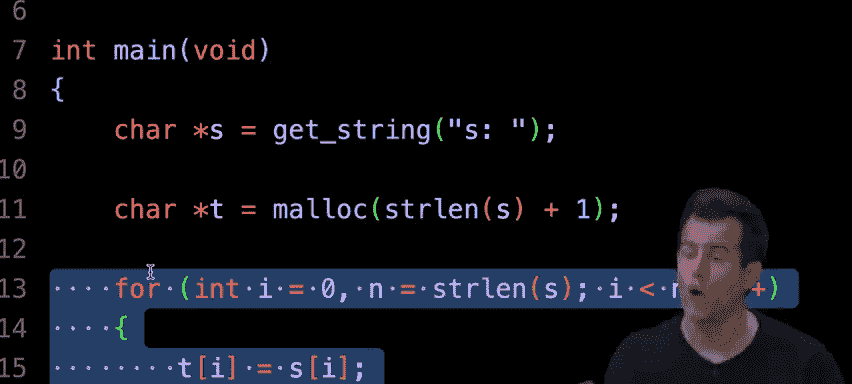

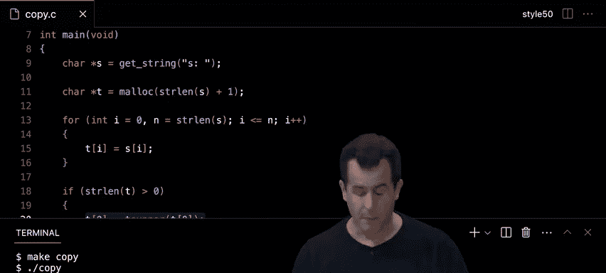

让我回到VS Code。我将清除终端窗口，让我们只是玩弄两个变量。所以`int *p`。它是一个星号，但大多数人会说`*`。等于`&n`的地址。现在我可以稍微调整第7行，而不是打印出重复的`&n`，我可以字面上只传入`p`作为指针。所以我并没有做任何真正有趣的事情，只是添加了一个变量，但只是为了向你展示创建变量的语法，该变量的生命目的是存储这些地址之一。

所以让我继续现在再次执行`make addresses`，`./addresses`，我们应该确实看到几乎相同的想法，`n`现在所在的地址，因为我已经重新编译并实际运行了我的代码。

但它变得比那更有趣一点。当涉及到我的计算机内存时，我可以再做一件事。让我再次清除终端。让我看看我是否能以某种方式逆转这个过程。如果`n`是50，而`p`存储着`n`的地址，如果我能以某种方式表达“前往`n`的地址并告诉我那里有什么”，那会不会很有趣？所以要做到这一点，我只是在撤销我在这里所做的所有智力工作。但如果我想打印出某个位置的整数，我可以回到`%i`，只是像往常一样打印一个整数。但`p`现在存储着某个地方的地址。它是藏宝图，可以这么说。所以如果我想去X标记的地点，这样做的语法我刚才声称是`*p`。所以`*p`意味着前往那个地址，不要打印地址，前往那个地址并向我展示计算机内存中那里有什么。

所以现在如果我进入终端并执行`make addresses`和`./addresses`，当我按下回车时，屏幕上应该看到什么？50，所以我确实看到了50。

现在这里有一个不幸的语法选择，来自几十年前C语言的作者。显然，我在两个不同的位置使用星号。 suffice it to say，它在任何一个中都不代表乘法。它被用来以某种方式表示地址。当在第6行，我指定一个数据类型如`int`，然后我有一个星号，然后是一个变量名时，那是声明指针的语法，用于声明一个将存储地址的变量。什么地址？嗯，`&n`，无论那是什么，0x……。当你执行星号然后是指针名而不指定类型时，这只是意味着去那里。所以星号显然与内存有关，显然与……相关。不幸的是，它是相同的符号。如果他们为标点符号选择不同的符号就好了，但它们在上下文中含义略有不同。在第6行，我们声明指针，声明一个名为`p`的变量，它将指向整数的位置。但当我说`*p`时，那意味着前往那个实际位置。所以请记住这一点，即使它有那么一点细微的不同。

## 指针的内存表示

那么计算机实际内存中发生了什么？让我们在图形形式中考虑一下。即使我以这种方式编写指针：`int`然后空格然后`*p = &n;`，这是常规方式，这是你在大多数网站、大多数教科书上看到的方式。从技术上讲，我承认，如果你实际上将星号稍微向左移动，可能更容易理解，因为这使得视觉上我认为更清楚`int *`是变量`p`的类型，而不是星号以某种方式附加到变量名本身。然而，你也可能看到两边都有空格的写法，我认为这对任何人都没有帮助。但重点是，在这种情况下空白无关紧要，常规方式是通过在变量名前加上星号来做到这一点，这避免了在声明多个指针时遇到麻烦。但如果它有助于你思考，你可以将`int *`视为类型。它不仅仅是一个`int`本身。

有了这些，让我们现在考虑计算机内存的画布，我们在其中存储`n`和现在的`p`。之前，我提出`n`可能在屏幕的右下角。所以`n`在这里存储数字50。但从技术上讲，`n`存在于某个地方。为了简单起见，我将声称它在0x123，而不是我们刚才看到的更大的实际地址。但是`p`呢？`p`本身是我单独声明的另一个变量。所以它必须存在于计算机内存的某个地方。事实证明，按照惯例，指针占用更多空间，它们现在通常使用8字节而不是仅仅4字节。为什么？如果你有8字节，你可以数得更高，可以有更多的地址，你的Mac、PC和手机可以有更多内存。这是一件好事。

所以指针往往是8字节，这就是为什么我在这里屏幕上使用了8个方块。但`p`实际上存储了什么？嗯，它只是存储一个数字。是的，从技术上讲它是一个整数，但那个整数本身应该被认为是某个其他值的地址。所以`n`在下面的0x123。`p`在这里的某个地址，为了讨论起见，具体是什么地址无关紧要，但它的值，它用其64位模式存储的，显然是0x123。

## 指针的抽象与比喻

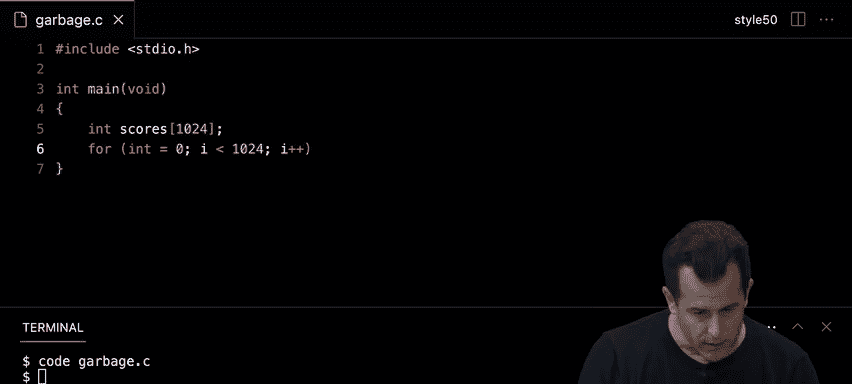

这如何帮助我们？如果你更抽象地思考这一点，谁在乎计算机内存中还有什么其他事情发生，实际上有助于以类似这样的方式在图形上思考它。归根结底，即使当我们开始在C中编写使用指针的代码时，你和我通常永远不会关心实际地址，即使我向你展示了0x7……，那通常不是有用的信息。知道它存在于某个地方就足够了，让计算机弄清楚如何到达那里。所以当谈论指针和更一般的地址时，人们实际上经常抽象它们，可以这么说。所以与其在屏幕或白板上字面写下实际地址0x123，谁在乎它是什么，只要它是一个引导我到我关心的另一个值的值就足够了，就像我早先描述的藏宝图。

所以现在让我们更比喻性地连接这一点。卡特，也许你已经注意到，我们在舞台上的屏幕上已经有一段时间了这两个邮箱。所以这个白色的标有`p`代表我们的指针变量。卡特的标有`n`代表我们的实际整数。这里真正发生的事情是，如果我要访问`p`内部的值，就像我们在这里看到的那样，那就像打开这个并弄清楚实际值是什么。现在这本身有点神秘，0x123。所以如果我们更比喻性地做这件事，我们也许可以这样做并实际指向我们的方式。

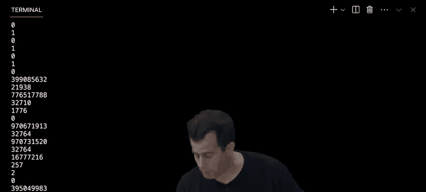

我们有一个大指针。哦，原谅我。我想我们将使用这个。好的，所以我们有这个基本上指向我们关心的内存位置的大指针，无论是0x123还是其他什么。然后如果我们解引用这个，即使用星号表示法，`*p`，那就像要求卡特去那个位置。打开邮箱，瞧，你在那里有什么值？也许为卡特事先和我练习过这个而热烈鼓掌。这主要是今天使用电话手指的借口。

但话虽如此，这 hopefully 是一个有帮助的比喻，老实说，因为这些指针，这些地址实际上往往是C语言中更神秘的课题之一，即使现在事情有点明白了，一旦你开始编写涉及地址的代码，很容易在一些细节中迷失方向。但比喻性地，这些邮箱旨在代表实际发生的事情。邮箱和物理人类世界有地址。我可以去那个地址打开它，然后我可以通过遵循那个藏宝图去另一个地址，如果你愿意，或者在这里图形上从一个位置指向另一个位置的箭头。

所以即使有`&`和`*`等非常奇怪的语法，它也只是内存中的地址，就像现实世界中的邮箱一样。

## 字符串的本质：字符指针

有了这些，让我们也许开始通过重新审视字符串的本质来移除某些辅助轮，正如我们迄今为止一直在使用它们的那样。所以这是我们从第一周以来一直在C中使用的代码行，我声明一个名为`s`的字符串变量，将其设置为引号内的“hi”。现在，从技术上讲，“hi”是两个字母加一个标点符号。但那个字符串占用了多少字节？是1、2、3还是？我在这里看到，是4。是的，总是有一个空字符，即使你在屏幕上没有看到它，那就是我们之前声称的终止每个字符串的东西。

所以如果我要画出这个，也许“hi”最终在计算机内存的右下角，但它确实是4字节，不仅仅是三个，因为秘密地，一直有那个空字符，即使我们作为程序员通常不必自己显式键入它。双引号为我们做了，它用那个空字符终止字符串。

现在回想第二周，当我们讨论数组时，我们开始将字符串视为实际上只是字符数组。所以我们称它们为字符串，但我们可以将它们视为字符数组，可以这么说。所以如果字符串被称为`s`，`s[0]`会给我们第一个字符，`s[1]`第二个，`s[2]`第三个。如果你真的好奇，`s[3]`会给你最后一个隐藏的空字符，当我们在摆弄一些实际代码时，我们在屏幕上看到它只是一个零。

但从技术上讲，今天，逻辑上似乎同样正确的是，H、感叹号和空字符显然必须存在于某个地址。它们显然必须存在于它们自己的邮箱中，可以这么说。所以也许为了讨论，这个H今天在0x123，但回想一下，数组的特征是从左到右的连续性。所以如果H在0x123，那么I必须在0x124，感叹号在0x125，空字符在0x126，因为这些相差一个字节。我故意在这里显示数字，无论是十进制还是十六进制。这无关紧要。它们本身只相差一个字节。所以这意味着它们确实在内存中是相邻或连续的。

但是`s`是什么呢？当我声明`s`为一个字符串时，如果`s`实际上是这个东西，那么`s`里面一直发生着什么？嗯，字符串在几周内一直是一种善意的谎言，因为`s`本身从技术上讲是一个指针。`s`是这个字符串的地址。所以字符串在内存中的某个地方，但`s`本身是一个单独的变量，它给你一个线索，告诉你如何在内存中找到所有这些字符。

所以如果你现在必须凭直觉猜测，如果这是内存中实际的字符串，也就是说，这是内存中的字符数组，那么将什么作为`s`的值在逻辑上是有意义的？一个指针，具体来说，指向H的指针。我如何表达那个？实际值是什么？0x123很可能就足以作为这里`s`的值。现在，为什么可能是这样？嗯，这 essentially 给了你足够的信息来找到字符串“hi”的开头。

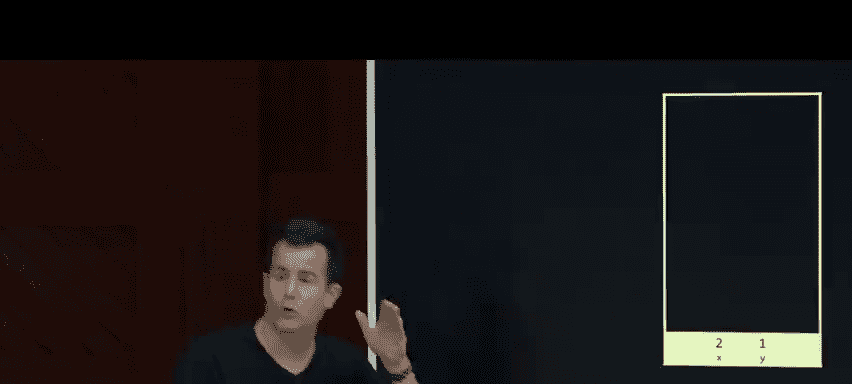

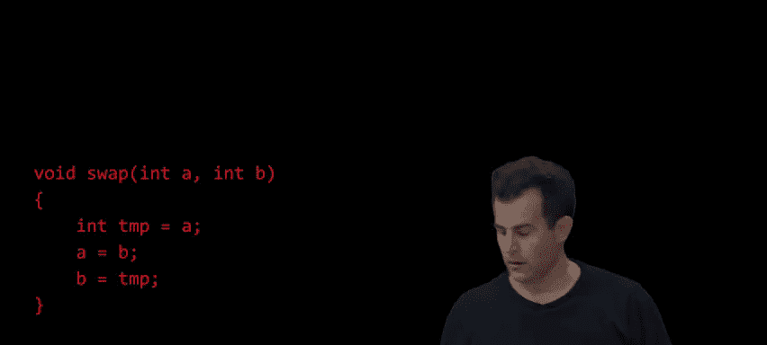

现在你可能会想，等等，它怎么知道第二个和第三个字符？但现在如果你及时回想一下，等等，也许现在空字符从第二周开始更有意义了，为什么？因为如果`s`从技术上讲存储字符串开头的位置，必须有人跟踪字符串的结束位置。这实际上是字符串本身，因为几十年前人类决定，让我们只用特殊字符0，全0比特，具体是8个0比特，来空终止每个字符串。但这足够了信息。藏宝图引导你到字符串的开头。然后你可以使用for循环、while循环等来遍历字符串。这就是`printf`所做的。你一看到那个空字符就停止。

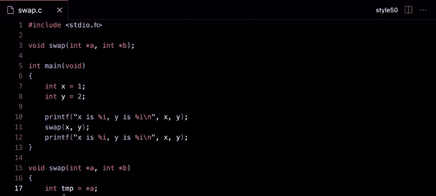

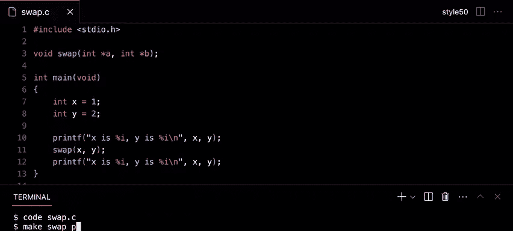

## 字符串即字符指针

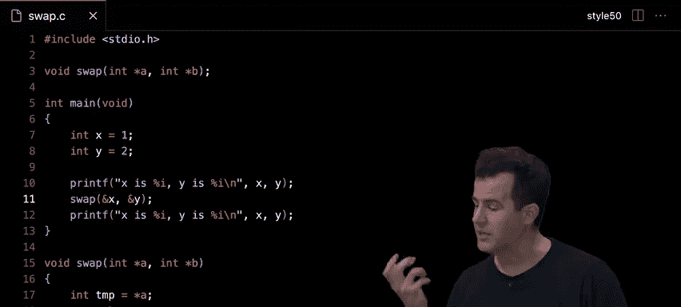

那么这就是字符串实际上是什么。`s`是并且从第一周以来一直是一个指针，可以这么说，它实际上指的是那个字符数组的开头。坦率地说，再次，谁在乎0x123的具体细节，我们可以将其抽象化，实际上只将`s`视为字面上指向该字符串开头的箭头，因为我们很少会关心这个东西在计算机内存中的物理位置。

现在，在我们用代码看到这个之前，对这个启示有什么问题吗？是的。指针是否随着几十年来计算机内存的增加而变得更大？试图回答：是的，就像在我那个时代，我们总共被限制在比如2GB内存。为什么是2？嗯，如果你有32位内存，或者如果你使用32位来表示地址，按照惯例是4字节，你可以回想数到高达40亿个值，但通常数字既有负也有正。所以减半。所以几十年前，计算机、PC、Mac最多只能有2GB内存的原因是因为字面上使用的整数，使用的指针只有4字节长，也就是32位。所以你字面上可以买更多内存，你可以买第三或第四GB，但你字面上没有办法在数学上表达所有这些更大的位置。所以在这种情况下它实际上是无用的。在更现代的时代，计算机倾向于使用64位，这允许你数到疯狂的高。这足以寻址更大的内存块。非常好的问题。

## 在代码中验证字符串即指针

好吧，让我们通过回到VS Code将这一点翻译成一点代码，让我现在建议我们重新审视一个更简单的字符串示例，而不是这些整数。所以让我继续扔掉所有这些与整数相关的代码，让我暂时包含`cs50.h`，以便我们可以像第一周一样访问字符串和其他东西，让我做`string s = "HI";`，让我做一个简单的安全检查`printf("%s\n", s);`，以确保一切像第一周一样工作。

所以`make addresses`，`./addresses`，我应该确实在字符串上看到“HI”。现在让我们摆弄一下底层发生了什么。现在事情可以变得更具体于内存。我仍然要在这里将`s`声明为字符串。但你知道吗？与其打印出字符串本身，不如让我实际上将`s`视为我声称的指针。我声称字符串只是一个地址。所以我有今天这个新语法`%p`来打印出指针，打印地址。让我们看看`s`实际上是什么。让我再次执行`make addresses`，`./addresses`。它在那里。它不像0x123那么简单，但它确实在位置`0x55c7c678004`。好吧，谁真的在乎具体是什么？但如果我们再多探索一点，事情可能会更有意义。

让我们这样做。让我们也使用`%p`打印出`s`的第一个字符的地址。所以`s`的第一个字符被称为`s[0]`，我们在第二周这样做，将字符串视为数组。但我如何获取一个字符的地址？嗯，我有今天的新符号，`&`。所以即使这看起来有点拗口，`&s[0]`，它只是两个想法的结合：`s[0]`给你字符串`s`中的第一个字符，在开头添加一个`&`表示告诉我那个地址是什么。

所以如果我重新编译这段代码`make addresses`，`./addresses`，即使你不记得值，0x……，我们将在屏幕上看到什么？在更高层次上，也许是完全相同的东西。为什么？嗯，`s`只是一个地址。但那是什么意思？嗯，它只是其第一个字符的地址。我们根据我们刚才的图片看到了这一点。

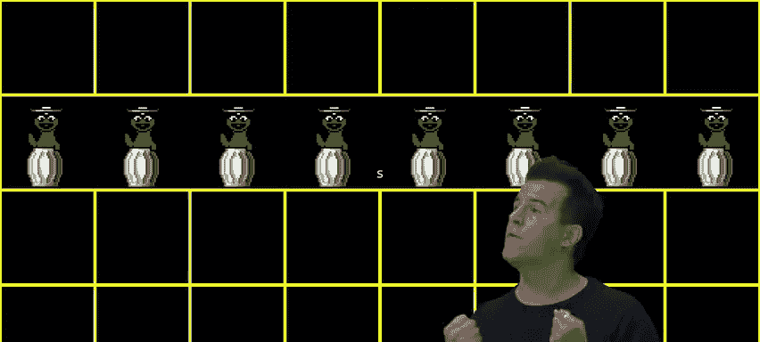

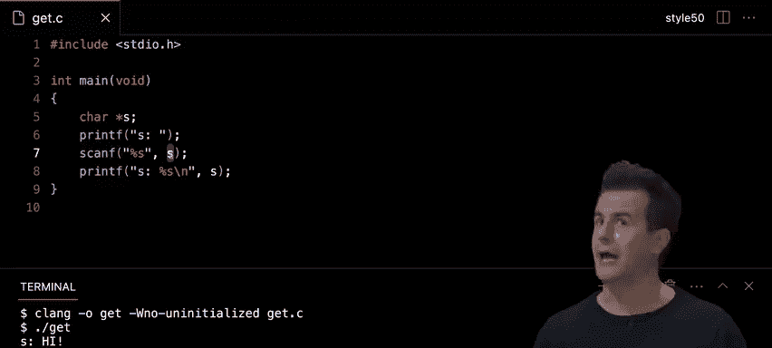

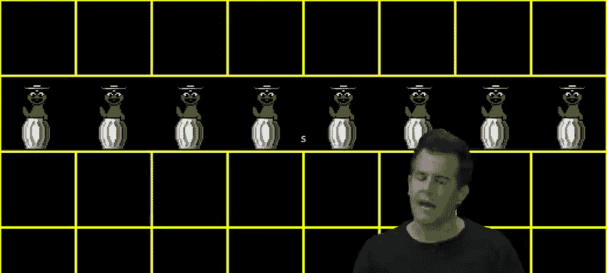

那么我能看到这个的连续性吗？嗯，为了节省时间，我将 resort to 一些复制粘贴，即使这看起来有点傻，我当然可以用循环代替，但让我打印出第二个位置，第三个位置，还有第四个位置，空字符的第四个位置是什么？如果我现在再次执行`make addresses`和`./addresses`并放大，我并不真的关心这些具体是什么，但注意前两个确实相同，因为第一个代表`s`，第一个代表`s`的第一个字符，现在我揭示完全相同的东西，接下来的几个字面上只相差一个字节，分别以5、6和7结尾。所以再次，数字本身并不是有用的可操作信息，但它确实让我们实际看到底层发生了什么。

## 移除字符串的“辅助轮”

只是为了回顾一下，让我实际上回到使用`%s`打印字符串本身的原始版本，让我重新`make addresses`以确保它仍然打印出“hi”，但现在一直发生着什么？让我回到我们从第一周以来一直在使用的简单代码行，它给了我们一个名为`s`的字符串，将其设置为“hi”的值，让我现在提议字符串确实是一种善意的谎言，如果我可以不必要地戏剧性地说，在这里我们像取下辅助轮一样，揭示一直以来，字符串……字符串……从技术上讲可能实际上是什么？是的，`char *`，太棒了，谢谢。所以它是`char *`， admittedly 乍一看，只是让一个简单的想法看起来不必要地复杂。这就是为什么在第一周，我们确实引入了这些辅助轮，我们CS50发明了称为`string`的数据类型，只是为了隐藏这种较低级别的细节。也就是说，`string`对我们来说是一种抽象。现在，也就是说，`string`不是CS50特定的词，就像世界上每个程序员都知道字符串是什么，它是一个字符序列，它是一个字符数组，但在C语言中，从技术上讲，几十年前当它被发明时，他们没有想到，他们没有决定创建一个称为`string`的实际数据类型，特别是如果他们属于那些更熟悉的人，`char *`是等效的，它实现了完全相同的事情，即使乍一看，我们不想从第一周开始就面对那种较低级别的细节。

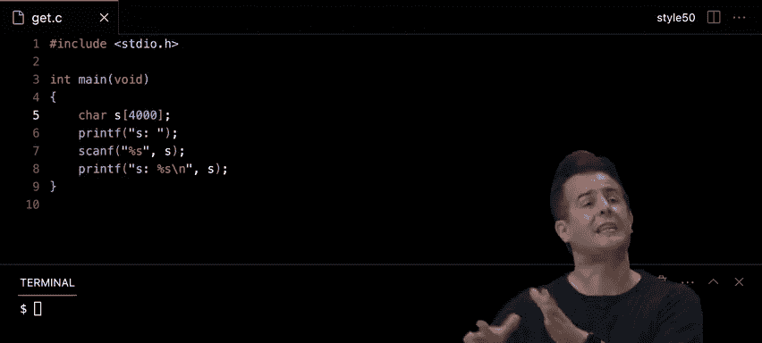

当然，我可以澄清星号如何使其成为字符串。到目前为止，我们一直只称它为字符串，所以`s`是一个字符串，这是一个足够的心智模型，但从技术上讲，字符串是什么？我声称用我的内存网格图形表示，字符串实际上只是一个地址。它实际上只是其第一个字符的地址。然后我试图在代码中通过使用`%p`并向你展示字面上`s`是一个像0x……这样的值，并且字面上它的第一个字符是那个相同的地址0x……来证明这一点。所以在这里，当我声称`string`从未真正存在过，除了在CS50的范围内，从技术上讲，字符串的数据类型最好表示为`char *`。为什么？虽然字符串显然不能只是一个`char`，因为根据定义，`char`是单个字符。我们已经知道字符串是字符序列，但你如何表示字符序列？你可以称它为`char *`，这是我们今天第一次引入的不同数据类型，星号只是意味着`s`不是一个`char`。星号意味着`s`是一个`char`的地址。按照惯例，它是字符串中第一个`char`的地址。

所以有了这些，如果我回到我实际的VS Code，我可以字面上改变。`string`改为`char *s`。我可以摆脱CS50库，我们所谓的辅助轮，过去几周的目标是 initially 把它们放上，然后很快取下。所以现在这是相同的程序，`%s`仍然是相同的，`s`仍然是相同的，其他一切仍然是相同的，我所做的只是将“string”改为“char *”，这消除了对CS50库的需求，如果我现在执行`make addresses`和`./addresses`，“hi”的行为完全一样。所以现在这是原始的原生C代码，没有任何辅助轮，没有任何CS50脚手架，只使用这些基本的构建块和原语。

## 关于字符串指针的其他问题

关于这个还有其他问题吗？正确，为什么我们不为这个使用`&`符号？虽然我们之前用了。所以在这种情况下，没有理由使用`&`，因为`&`告诉你一个变量的地址是什么。我承认可能更一致的做法是这样做，也许你的思路是这样的。现在，别管它看起来更糟的事实，我认为在语法上。这是一个合理的本能。但事实证明，这也是双引号为你做的事情。C编译器`clang`足够聪明，意识到当它看到双引号围绕一系列字符时，它想为你把第一个字符的地址放在变量中。但当我们有一个像`n`这样的变量，我们创建它时，你必须区分`n`和它的地址。这就是为什么我们给`n`加上前缀`&`。但双引号为你处理了它。

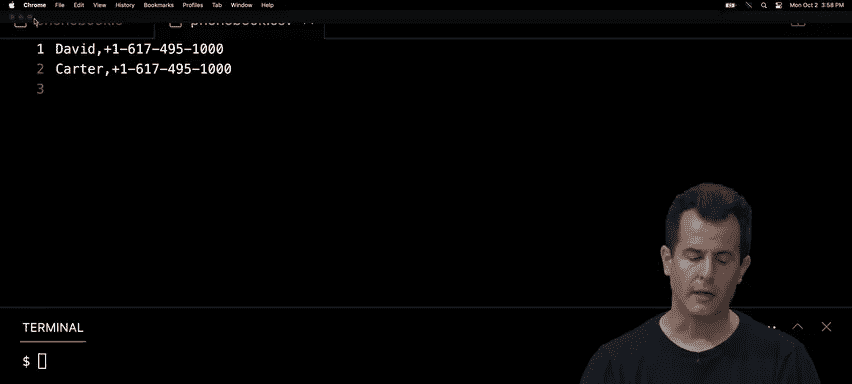

关于这些地址还有其他问题吗？没有。好吧，除此之外，让我建议我们摆弄另一个想法，看看我们实际上是如何发明这个叫做字符串的东西的。嗯，我声称`string`只是`char *`。你实际上以前见过这种技术。就在一周前，我们摆弄了结构体，自定义数据类型来表示一个人，回想一下，我们有一个包含姓名和数字的结构体来表示一个人，但更重要的是，我们有关键字`typedef`，它定义你自己的类型为你想要的任何东西。上次我们更强大地使用它来实际表示一个人的整个结构体，有姓名和数字，但归根结底，我们真的只是发明了我们自己的数据类型，我们显然称之为`person`，但`typedef`确实是那里的使能元素。

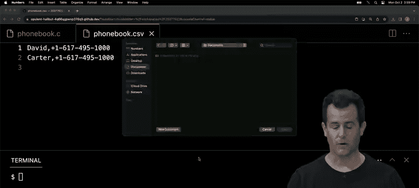

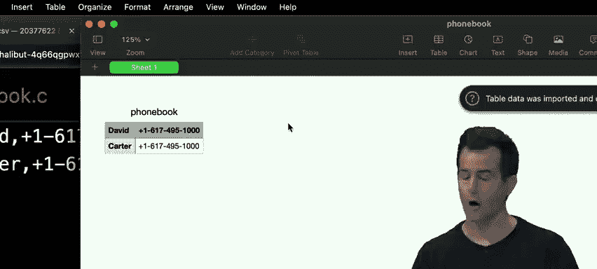

所以事实证明，使用`typedef`，你可以创建任意数量的自己的数据类型。例如，如果你真的无法习惯将整数称为`int`，你可以创建自己的称为`integer`的数据类型，它本身是`int`的同义词，因为`typedef`的工作方式，即使这个比结构体更简单，你可以从右到左阅读它。这意味着给我一个实际上是一个`int`的称为`integer`的数据类型。这与刚才发生的情况相同：给我一个称为`person`的数据类型，它实际上是这整个结构体，但`integer`更简单。现在，大多数人不会这样做。这真的不会在数据类型方面创造任何智力增强，但如果你真的想要更常见，你可以在未来的代码中看到这一点，不仅仅是`typedef`像`integer`这样的东西，但事实证明奇怪的是，C没有字节的数据类型。就像没有内置的明显方式来表示8位并在其中存储任何你想要的东西。然而，你可以使用所谓的`uint8_t`，这是一个随C一起提供的数据类型。坦率地说，那些更熟悉的人可能只是使用这种数据类型，一旦你 sort of 记住它存在。但老实说，对于我们大多数人来说，当你想要编写操作一个或多个字节的代码时，将字节视为自己的数据类型要方便得多。拥有一个称为`byte`的数据类型不是很好吗？

所以事实证明，你可以使用具有8位的无符号整数来表示一个字节，这只是一个在其他C头文件中声明的数据类型，但长话短说，你很快就会看到并使用这个。但这只是一个同义词，让事情对用户更友好一点，就像`person`、`string`、`byte`。

那么`cs50.h`头文件中有什么，除其他外，字面上就是这行代码。这是我们从第一周开始部署的单行代码，它教`clang`将单词`string`视为与`char *`同义，这样你们所有人都不必键入或知道或思考`char *`，直到美妙地今天在第四周，几周后。这就是我们一直在做的。这是辅助轮的技术实现。它只是以这种方式使用自定义数据类型。

## 指针算术

那么这里还有另一对例子，用我们的地址，这样我们可以进一步摆弄一点。事实证明，一旦世界上的所有东西都可以使用这些指针寻址，就像使用数字地址来表示内存中事物的位置一样，你实际上可以做一种叫做指针算术的事情，在这里，我们程序员通常不关心具体的值是什么，但我们关心它们确实存在。如果它们确实存在，我们也许可以对它们进行一些算术运算，比如加1去下一个字节，加2去下下一个字节，加3去下下下一个字节，依此类推。所以指针算术字面上指的是对地址进行数学运算。

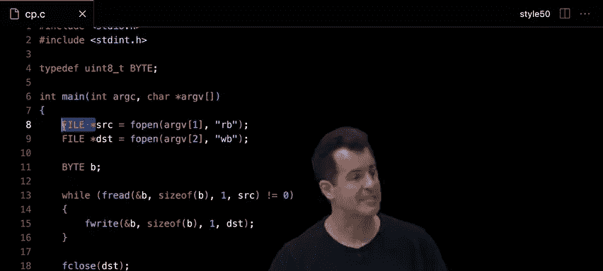

那么我们如何将其转化为可操作的东西？让我实际上回到VS Code，让我建议我们做类似以下的事情：我将扔掉我的第一个`printf`，而是像第二周那样逐个字符地打印出这个字符串。让我继续调用`printf`，传入`%c`表示单个字符，`\n`，逗号，现在我想使用数组表示法打印出`s`中的第一个字符。我键入什么来打印`s`中的第一个字符？是的，`s[0]`。所以`s[0]`给我`s`中的第一个字符。让我为了演示的目的在这里复制