# CS50x 2024：第6讲：Python


## 概述

在本节课中，我们将学习Python编程语言。我们将从C语言过渡到Python，了解Python的基本语法、数据类型、控制结构、函数以及一些高级特性。Python是一种更现代、更高级的语言，它提供了许多抽象概念，使得编程变得更加简单和高效。

---

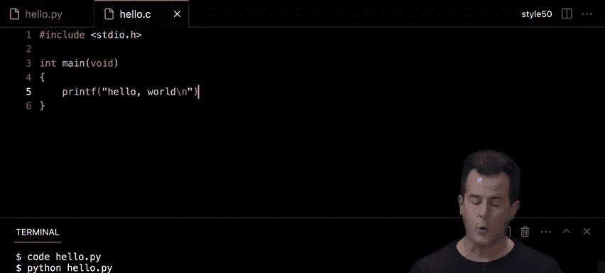

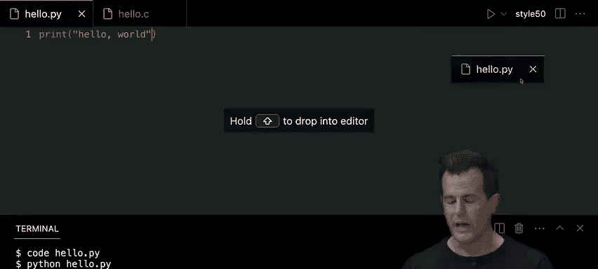

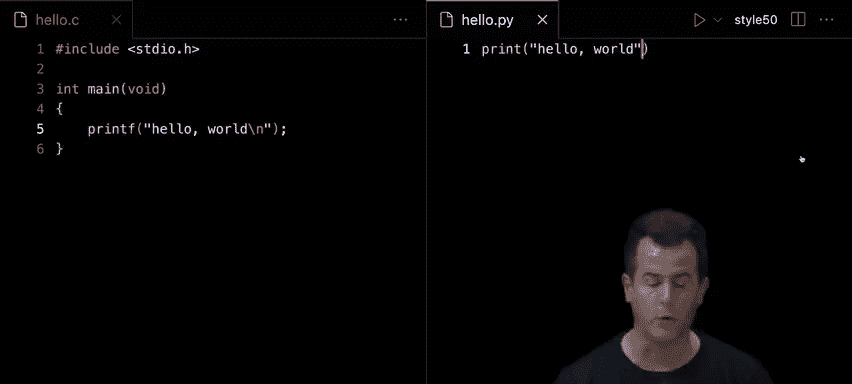

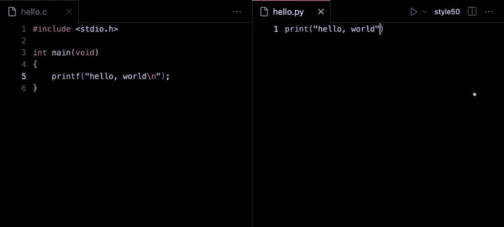

## 从C到Python的过渡

上一节我们回顾了C语言的基础知识，本节中我们来看看如何将C语言中的概念转换到Python中。

在C语言中，我们编写一个简单的“Hello, World!”程序需要包含头文件、定义主函数等步骤。而在Python中，这个过程被大大简化。

**C语言版本：**
```c
#include <stdio.h>

int main(void)
{
    printf("hello, world\n");
}
```

**Python版本：**
```python
print("hello, world")
```

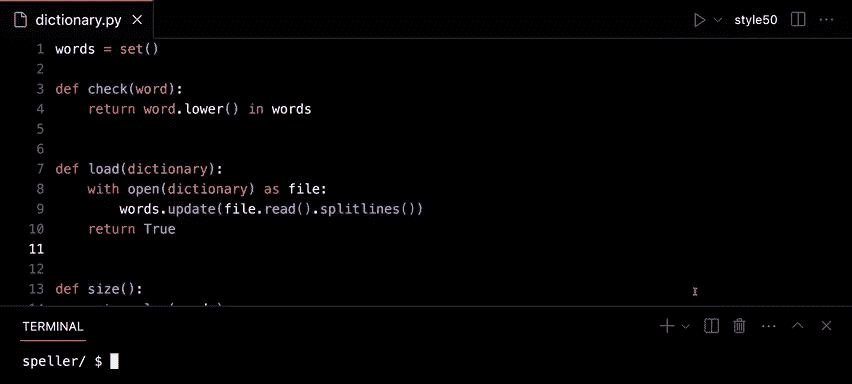

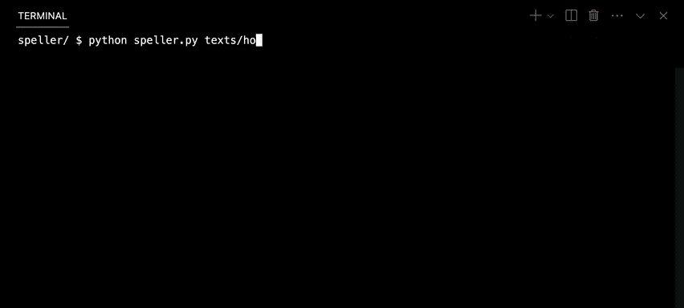

以下是两种语言版本的主要区别：

*   **库的引入**：在Python中，`print`函数是内置的，无需引入特定库。
*   **主函数**：Python程序不需要显式定义`main`函数，可以直接从文件顶部开始执行代码。
*   **分号与换行**：Python语句不需要以分号结尾，并且`print`函数默认在输出后添加换行符。
*   **字符串引号**：Python中可以使用单引号或双引号定义字符串，但需保持一致。

---


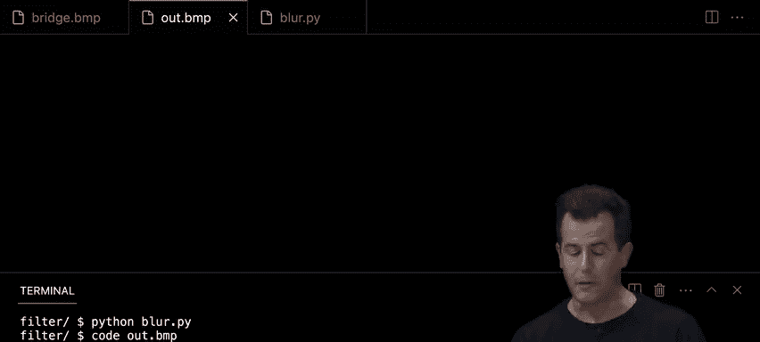

## Python的优势与执行方式

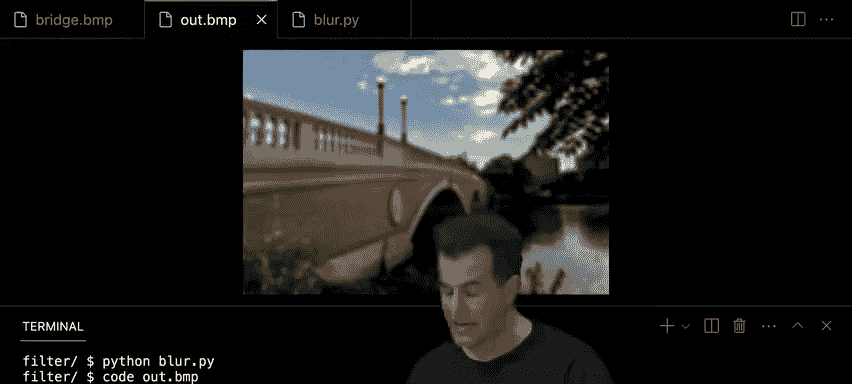

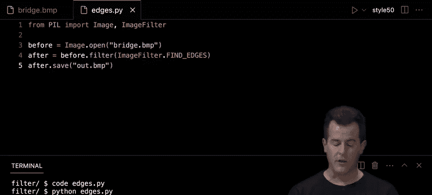

上一节我们看到了Python语法的简洁性，本节中我们来看看Python如何执行以及它相对于C语言的优势。


Python程序通过**解释器**执行，而不是编译器。这意味着你无需单独的编译步骤，可以直接运行代码。

**执行Python程序：**
```bash
python hello.py
```

Python的优势在于其丰富的**生态系统**和**库**。许多常见问题（如拼写检查、图像处理）已有现成的解决方案，你可以直接使用这些库来快速构建程序。


例如，用Python实现一个拼写检查器的核心功能可能只需要几行代码，因为它可以利用内置的数据结构（如**集合**）和函数。

**Python拼写检查器核心示例：**
```python
words = set()

def check(word):
    return word.lower() in words

def load(dictionary):
    with open(dictionary) as file:
        words.update(file.read().splitlines())
    return True

def size():
    return len(words)

def unload():
    return True
```

然而，这种便利性通常以**性能**为代价。Python程序可能比等效的C程序运行得更慢，占用更多内存，因为Python解释器本身需要处理更多底层细节（如内存管理）。

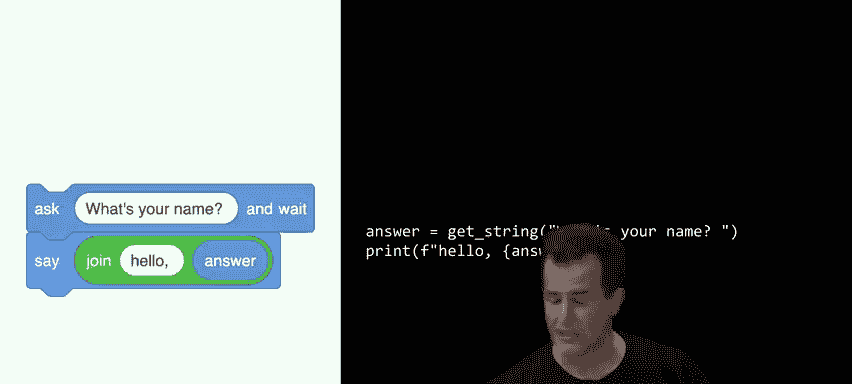

---

## 变量与数据类型

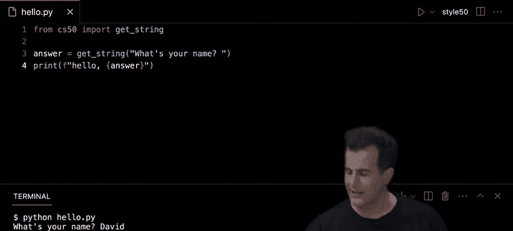

上一节我们讨论了Python的执行方式，本节中我们来看看如何在Python中定义变量和使用基本数据类型。

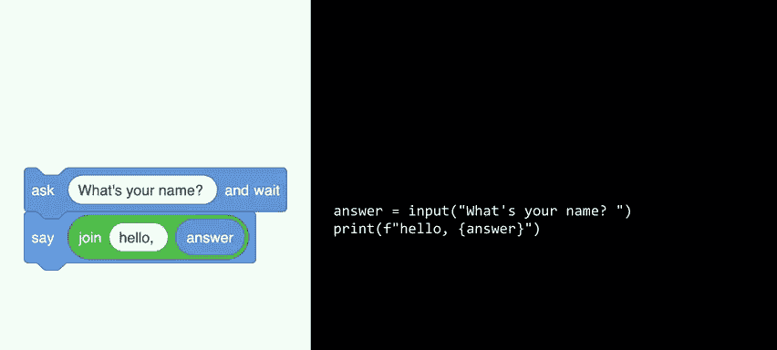

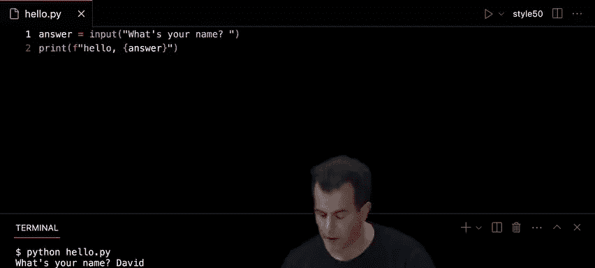

在Python中声明变量时，你**无需指定类型**。解释器会根据赋值自动推断。

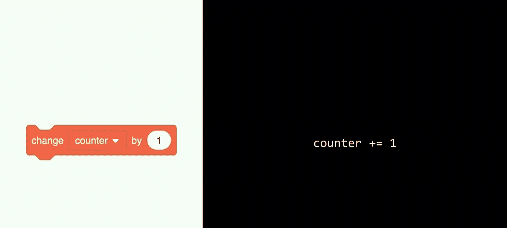

**变量声明与赋值：**
```python
counter = 0
counter = counter + 1
counter += 1  # 等价于上一行
```

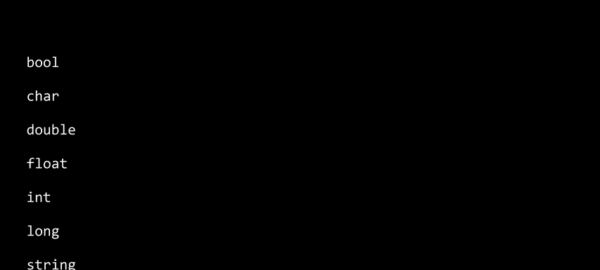

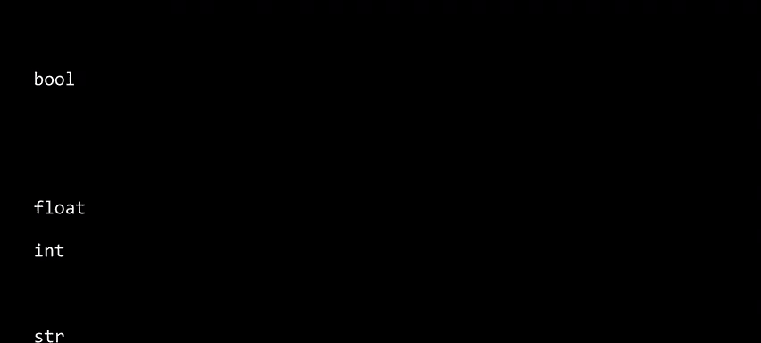

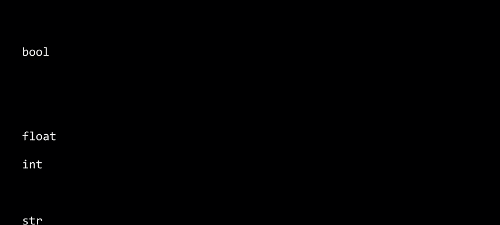

Python内置的基本数据类型比C语言更精简，主要包括：

*   `bool`：布尔值（`True` 或 `False`）
*   `float`：浮点数
*   `int`：整数
*   `str`：字符串

注意，Python中没有`double`、`long`、`char`这样的类型。整数可以任意大（无溢出问题），字符串是一个完整的对象类型。

---

## 获取用户输入

上一节我们介绍了变量，本节中我们来看看如何与用户交互，获取输入。

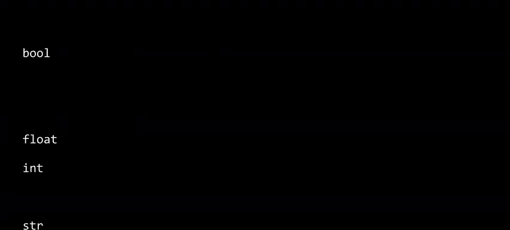

在Python中，可以使用内置的`input()`函数获取用户输入，它总是返回一个字符串。

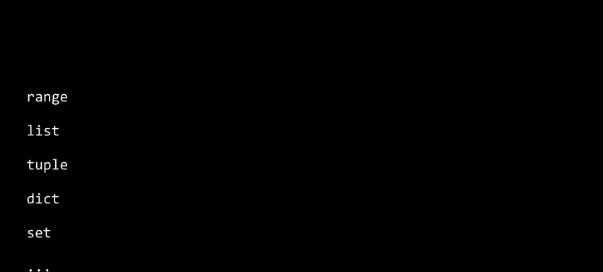

**获取字符串输入：**
```python
answer = input("What's your name? ")
```

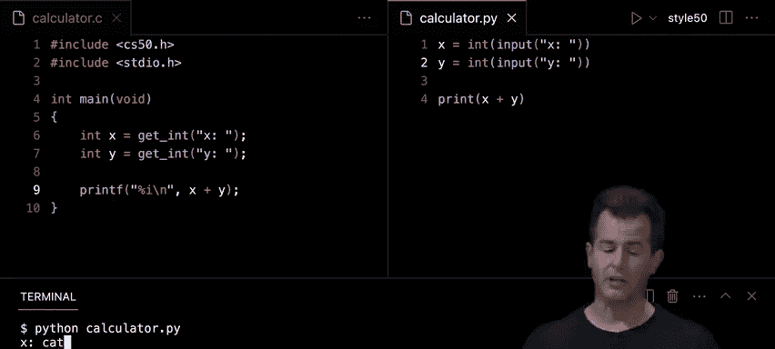

如果需要整数或浮点数，需要对字符串进行转换。

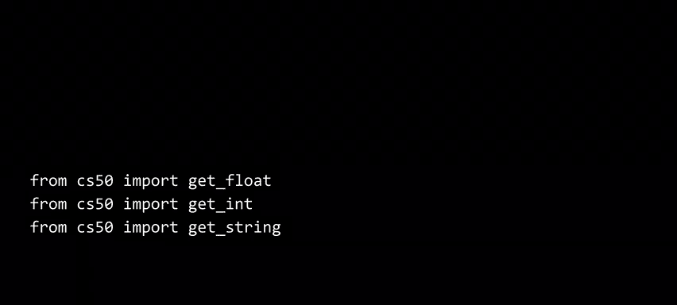

**获取整数输入并计算：**
```python
x = int(input("x: "))
y = int(input("y: "))
print(x + y)
```

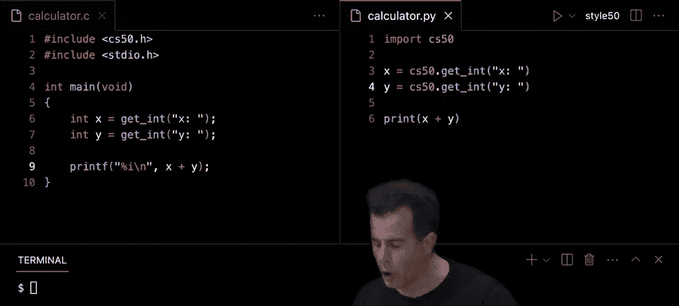

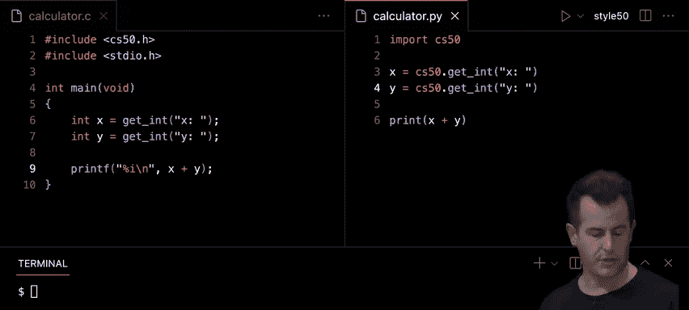

CS50库也提供了类似的函数（如`get_int`, `get_string`），它们在内部处理了错误检查，使用起来更安全便捷。

**使用CS50库：**
```python
from cs50 import get_int

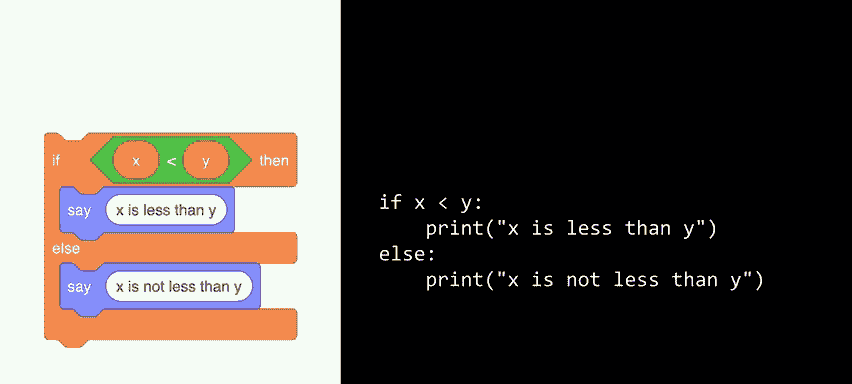

x = get_int("x: ")
y = get_int("y: ")
print(x + y)
```

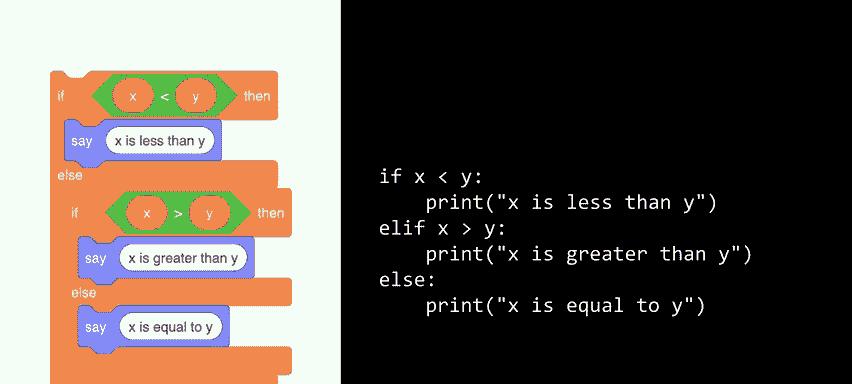

---

## 条件语句

上一节我们学会了获取输入，本节中我们来看看如何根据条件执行不同的代码分支。

Python使用`if`、`elif`和`else`关键字进行条件判断。逻辑与C语言相似，但语法更简洁。

**基本条件判断：**
```python
if x < y:
    print("x is less than y")
elif x > y:
    print("x is greater than y")
else:
    print("x is equal to y")
```

需要注意的语法点：

*   **条件**：条件表达式不需要放在括号内。
*   **代码块**：使用冒号(`:`)和**缩进**（通常是4个空格）来定义代码块，而不是花括号`{}`。
*   **逻辑运算符**：使用英文单词`and`、`or`、`not`，而不是`&&`、`||`、`!`。

字符串比较在Python中更直观，`==`直接比较内容，而不是内存地址。

**字符串比较：**
```python
s = input("s: ")
t = input("t: ")
if s == t:
    print("Same")
else:
    print("Different")
```

为了使字符串比较不区分大小写，可以先将字符串转换为统一格式。

**不区分大小写的比较：**
```python
s = input("Do you agree? ").lower()
if s in ["y", "yes"]:
    print("Agreed.")
elif s in ["n", "no"]:
    print("Not agreed.")
```

---

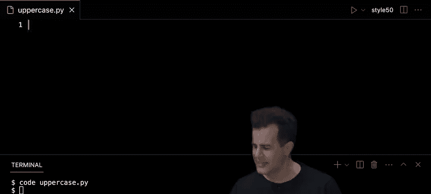


## 循环

上一节我们使用条件语句实现了分支，本节中我们来看看如何使用循环重复执行代码。

Python主要使用`for`循环和`while`循环。

**`for`循环与`range`函数：**
`range(n)`函数生成一个从0到n-1的整数序列，常用于循环固定次数。
```python
for i in range(3):
    print("meow")
```
如果循环变量在循环体内不被使用，可以用下划线`_`代替。
```python
for _ in range(3):
    print("meow")
```

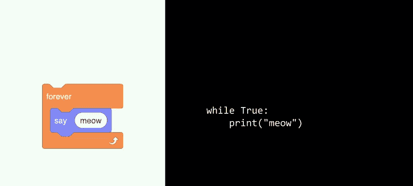

**`while`循环：**
```python
while True:
    print("meow")
```
注意：Python中的布尔值`True`和`False`首字母需要大写。

**遍历字符串：**
Python可以方便地遍历序列（如字符串）中的每个元素。
```python
before = input("Before: ")
print("After: ", end="")
for c in before:
    print(c.upper(), end="")
print()
```
更简洁的方法是直接使用字符串方法：
```python
before = input("Before: ")
after = before.upper()
print(f"After: {after}")
```

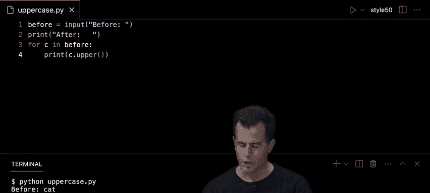

---

## 函数

上一节我们利用循环完成了重复操作，本节中我们来看看如何将代码组织成可重用的函数。

使用`def`关键字定义函数。


**定义并调用函数：**
```python
def main():
    for _ in range(3):
        meow()


def meow():
    print("meow")

main()  # 调用主函数
```

**带参数的函数：**
```python
def main():
    meow(3)

def meow(n):
    for _ in range(n):
        print("meow")

main()
```

关于函数定义的注意事项：

*   Python程序从顶部开始执行。如果函数调用在定义之前，会发生错误。
*   虽然Python不要求有`main`函数，但按照惯例定义一个`main`函数，并在文件最后调用它，是一种良好的代码组织方式。
*   函数参数不需要指定类型。

---

## 异常处理

上一节我们创建了函数来组织代码，本节中我们来看看如何在Python中优雅地处理错误。

当程序运行中出现问题（如将非数字字符串转换为整数）时，Python会**抛出异常**。你可以使用`try`和`except`语句来捕获并处理异常，而不是让程序崩溃。

**基本的异常处理：**
```python
try:
    x = int(input("x: "))
except ValueError:
    print("That is not an int!")
```

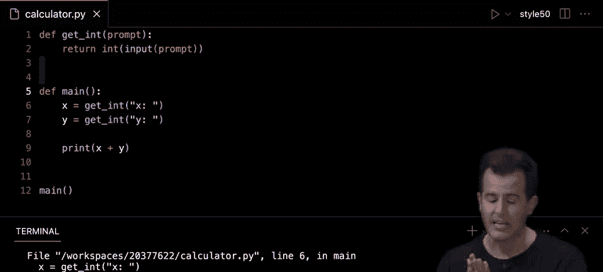

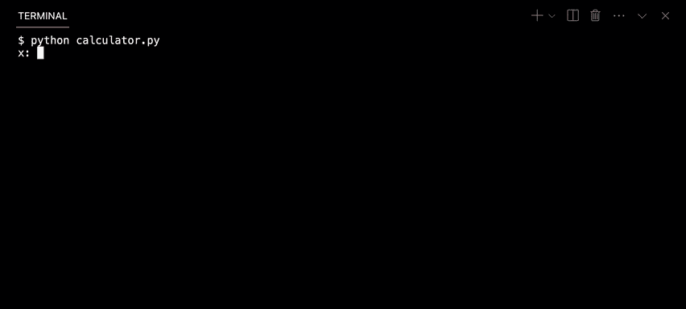

**实现健壮的输入获取函数：**
以下代码模拟了CS50库中`get_int`函数的行为，通过循环和异常处理确保用户输入一个有效的整数。
```python
def get_int(prompt):
    while True:
        try:
            return int(input(prompt))
        except ValueError:
            pass  # 忽略错误，继续循环

def main():
    x = get_int("x: ")
    y = get_int("y: ")
    print(x + y)

main()
```

---

## 列表

上一节我们处理了程序中的意外错误，本节中我们来看看Python中一个强大的内建数据结构：列表。

**列表**类似于C语言中的数组，但功能更强大，可以动态增长和收缩，并且内置了许多方法。

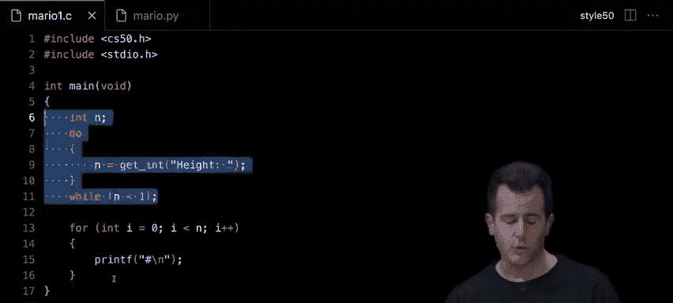

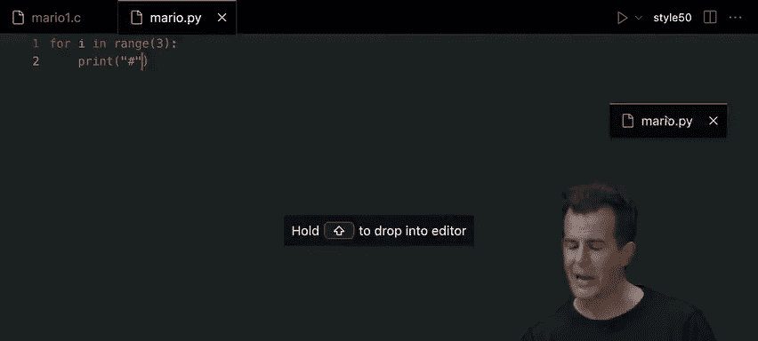

**创建与访问列表：**
```python
scores = [72, 73, 33]
```

**使用列表方法：**
```python
scores = []
for _ in range(3):
    score = get_int("Score: ")
    scores.append(score)  # 向列表末尾添加元素

average = sum(scores) / len(scores)  # sum和len是内置函数
print(f"Average: {average}")
```

**遍历列表：**
```python
names = ["Carter", "David", "John"]
name = input("Name: ")

for n in names:
    if name == n:
        print("Found")
        break
else:  # 这个else属于for循环，当循环完整执行完毕（未break）时执行
    print("Not found")
```
更简洁的方法是使用`in`运算符：
```python
if name in names:
    print("Found")
else:
    print("Not found")
```

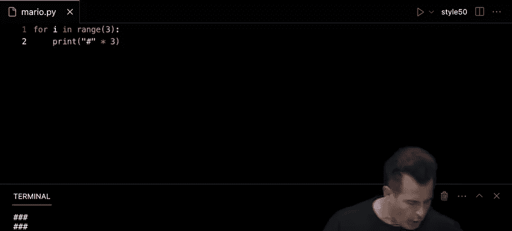


---

## 字典

上一节我们使用列表存储了一系列值，本节中我们来看看如何存储键值对——使用**字典**。

字典是Python中极其有用的数据结构，它允许你将唯一的**键**与**值**关联起来。

**创建字典：**
```python
people = {
    "Carter": "+1-617-495-1000",
    "David": "+1-617-495-1000",
    "John": "+1-949-468-2750",
}
```

**在字典中查找：**
```python
name = input("Name: ")
if name in people:
    number = people[name]  # 通过键获取值
    print(f"Found {number}")
else:
    print("Not found")
```

字典提供了高效的查找能力，底层通常由哈希表实现，但你无需关心其具体实现细节。

---

## 命令行参数与第三方库

上一节我们探索了字典的妙用，本节中我们来看看如何让Python程序接收命令行参数，并体验其强大的第三方库生态。

**命令行参数：**
通过`sys`模块的`argv`列表可以获取命令行参数。
```python
import sys

if len(sys.argv) == 2:
    print(f"hello, {sys.argv[1]}")
else:
    print("hello, world")
```

**退出状态：**
使用`sys.exit()`可以指定程序的退出状态码。
```python
import sys

if len(sys.argv) != 2:
    print("Missing command-line argument")
    sys.exit(1)

print(f"hello, {sys.argv[1]}")
sys.exit(0)
```

**第三方库：**
Python拥有庞大的第三方库生态系统。可以使用`pip`工具安装。例如，`cowsay`库可以生成有趣的ASCII艺术，`qrcode`库可以生成二维码。

**安装并使用第三方库：**
```bash
pip install cowsay
pip install qrcode
```

**使用`cowsay`库：**
```python
import cowsay

name = input("What's your name? ")
cowsay.cow(f"hello, {name}")
```

**使用`qrcode`库生成二维码：**
```python
import qrcode

img = qrcode.make("https://youtu.be/xvFZJ5PGG0")
img.save("qr.png")
```

---

## 总结

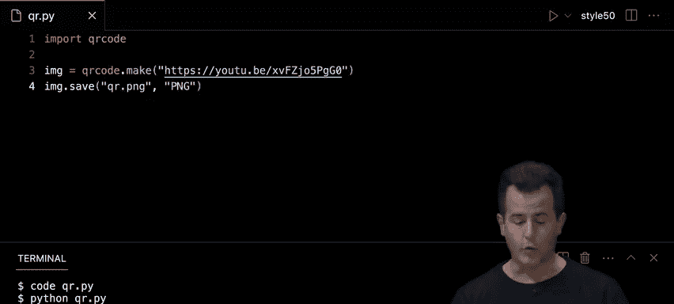


本节课中我们一起学习了Python编程语言的基础知识。我们从C语言过渡到Python，领略了Python语法简洁、表达力强的特点。我们涵盖了变量、数据类型、输入输出、条件语句、循环、函数、列表、字典等核心概念，并了解了异常处理和命令行参数的使用。最后，我们看到了Python强大的第三方库生态如何让我们能够轻松实现复杂功能，如图像处理、二维码生成等。记住，编程的核心思想在不同语言中是相通的，Python为你提供了更高效的工具来实现这些思想。