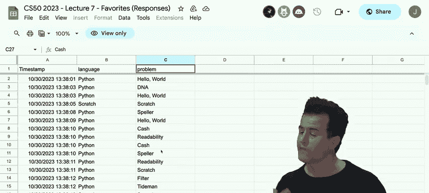
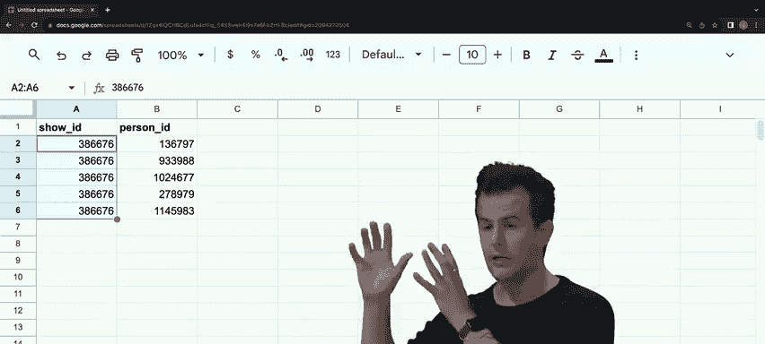
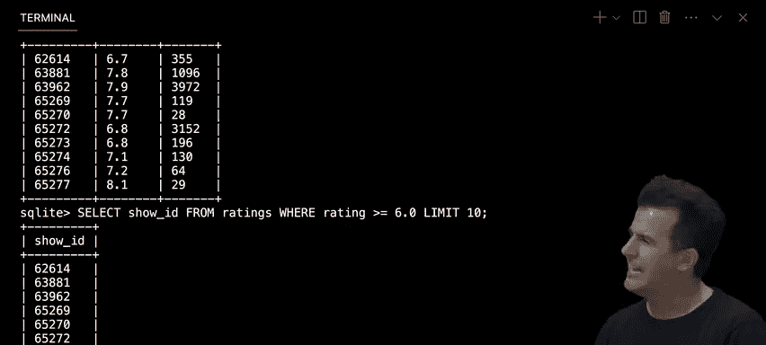
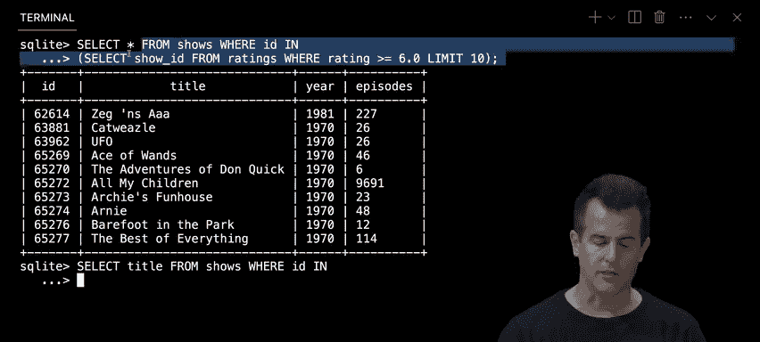
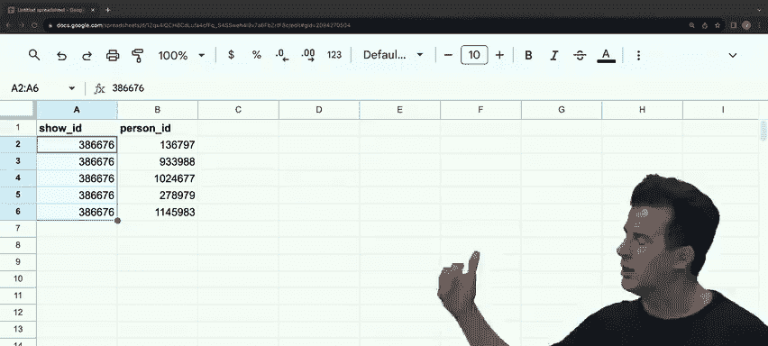
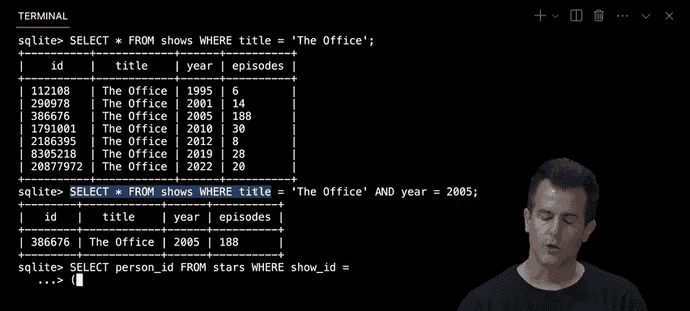
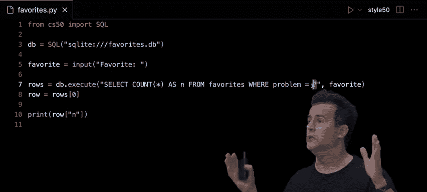
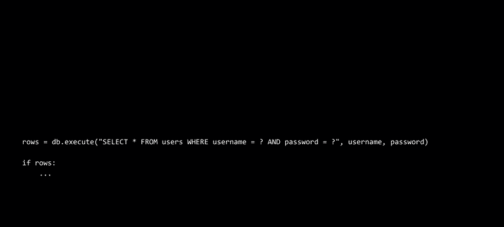

# 009：SQL 🗄️


在本节课中，我们将学习一种新的语言——SQL（结构化查询语言）。我们的目标不是为了学习新语言而学习，而是强调在软件编程和工程领域，不同的任务需要不同的工具。我们将看到，即使是Python，在处理大规模数据时也并非总是最佳选择。今天，我们将重点介绍一种以数据库为中心的语言——SQL，并探索如何用它来高效地管理和查询数据。



## 从数据收集到分析 📊


在深入SQL之前，让我们先收集一些实际数据。我们使用了一个简短的Google表单，询问大家最喜欢的编程语言（Scratch、C、Python）和最喜欢的问题集。这些数据会自动汇总到Google Sheets电子表格中。

### 使用Python分析CSV数据

电子表格数据可以导出为CSV（逗号分隔值）文件。这是一种简单的文本文件，用逗号分隔值，用换行符分隔行。我们可以用Python来读取和分析这个文件。

以下是使用Python读取CSV文件并统计每种语言出现次数的基本步骤：

```python
import csv

with open("favorites.csv", "r") as file:
    reader = csv.DictReader(file)
    counts = {}
    for row in reader:
        favorite = row["language"]
        if favorite in counts:
            counts[favorite] += 1
        else:
            counts[favorite] = 1

for favorite in sorted(counts, key=counts.get, reverse=True):
    print(f"{favorite}: {counts[favorite]}")
```

这段代码打开CSV文件，使用`DictReader`将每一行读取为字典，然后统计每种语言出现的次数，并按出现次数从高到低排序输出。

### 使用Python的`collections`模块简化

Python的`collections`模块提供了`Counter`类，可以进一步简化计数过程：

```python
import csv
from collections import Counter

with open("favorites.csv", "r") as file:
    reader = csv.DictReader(file)
    counts = Counter()
    for row in reader:
        favorite = row["language"]
        counts[favorite] += 1

for favorite, count in counts.most_common():
    print(f"{favorite}: {count}")
```

`Counter`类会自动初始化计数器，并提供了`most_common()`方法来获取排序后的结果。

## 引入SQL：结构化查询语言 🗃️

虽然Python可以处理CSV文件，但当数据量变大或需要更复杂的查询时，使用专门的数据库语言会更高效。SQL就是这样一种语言，它遵循CRUD范式：创建（Create）、读取（Read）、更新（Update）和删除（Delete）数据。

### 什么是SQLite？

在CS50中，我们使用SQLite，这是一个轻量级的SQL实现，广泛用于移动应用和桌面程序。它包含了SQL的核心功能，易于学习和使用。

### 将CSV数据导入SQLite数据库

首先，我们需要将CSV文件导入SQLite数据库。以下是具体步骤：

1. 打开终端，运行`sqlite3 favorites.db`创建一个新的数据库文件。
2. 在SQLite提示符下，设置模式为CSV：`.mode csv`
3. 导入CSV文件到名为`favorites`的表中：`.import favorites.csv favorites`
4. 退出SQLite：`.quit`

现在，我们有了一个SQLite数据库文件`favorites.db`，其中包含了所有数据。

### 基本SQL查询

在SQLite中，我们可以执行各种查询来分析和操作数据。以下是一些基本示例：

- 选择所有数据：`SELECT * FROM favorites;`
- 选择特定列：`SELECT language FROM favorites;`
- 限制返回行数：`SELECT language FROM favorites LIMIT 10;`
- 计算行数：`SELECT COUNT(*) FROM favorites;`
- 获取唯一值：`SELECT DISTINCT language FROM favorites;`
- 使用条件过滤：`SELECT COUNT(*) FROM favorites WHERE language = 'C';`

### 分组和排序

SQL还支持分组和排序，以便进行更复杂的分析：

- 按语言分组并计数：`SELECT language, COUNT(*) FROM favorites GROUP BY language;`
- 按计数排序：`SELECT language, COUNT(*) AS n FROM favorites GROUP BY language ORDER BY n DESC;`

这些查询可以让我们快速获取数据的统计信息，而无需编写复杂的Python代码。

## 数据库设计：关系与规范化 🔗

在现实世界中，数据通常存储在多个表中，并通过关系连接。例如，IMDB（互联网电影数据库）的数据就分布在多个表中。


### 实体关系图

IMDB的数据结构可以用实体关系图表示，其中包括`shows`、`ratings`、`genres`、`people`、`stars`和`writers`等表。这些表通过外键相互关联。

### 表之间的关系

- **一对一关系**：例如，每个节目有一个评分。
- **一对多关系**：例如，一个节目可以有多个类型。
- **多对多关系**：例如，一个节目可以有多个演员，一个演员也可以参与多个节目。这种关系通常通过中间表（如`stars`表）实现。

### 使用JOIN连接表


SQL的`JOIN`操作允许我们将多个表的数据合并在一起。例如，要获取节目名称及其评分，可以执行以下查询：


```sql
SELECT title, rating
FROM shows
JOIN ratings ON shows.id = ratings.show_id
WHERE rating >= 6.0
LIMIT 10;
```

这个查询将`shows`表和`ratings`表连接起来，返回评分至少为6.0的节目名称和评分。


### 嵌套查询

除了`JOIN`，我们还可以使用嵌套查询来获取相关数据。例如，查找Steve Carell参与的所有节目：



```sql
SELECT title
FROM shows
WHERE id IN (
    SELECT show_id
    FROM stars
    WHERE person_id = (
        SELECT id
        FROM people
        WHERE name = 'Steve Carell'
    )
);
```




这个查询首先找到Steve Carell的ID，然后找到他参与的所有节目ID，最后返回这些节目的名称。



## 性能优化：索引 ⚡


当数据库中的数据量很大时，查询可能会变慢。为了提高查询性能，我们可以创建索引。索引是一种数据结构，可以加快对特定列的搜索速度。

### 创建索引


例如，为`shows`表的`title`列创建索引：


```sql
CREATE INDEX title_index ON shows (title);
```




创建索引后，查询`SELECT * FROM shows WHERE title = 'The Office';`的速度会显著提升。

### 索引的权衡

虽然索引可以加快查询速度，但它们也会占用额外的存储空间，并可能减慢插入、更新和删除操作的速度。因此，需要根据实际需求选择性创建索引。


## 结合Python与SQL 🐍🗃️



在实际应用中，我们经常需要将SQL与Python结合使用。例如，我们可以用Python编写用户界面，用SQL查询数据库。


### 使用CS50库执行SQL查询

CS50库提供了一个简化的接口来执行SQL查询。以下是一个示例：

```python
from cs50 import SQL


db = SQL("sqlite:///favorites.db")
favorite = input("Favorite: ")
rows = db.execute("SELECT COUNT(*) AS n FROM favorites WHERE problem = ?", favorite)
row = rows[0]
print(row["n"])
```


这段代码提示用户输入最喜欢的问题，然后查询数据库中该问题的出现次数并输出结果。


## 常见问题与安全考虑 🛡️

在使用SQL时，需要注意一些常见问题，如竞态条件和SQL注入攻击。

### 竞态条件

当多个用户同时访问和修改数据库时，可能会发生竞态条件，导致数据不一致。例如，多个用户同时点赞一个帖子，可能会导致点赞计数错误。

解决方案是使用事务（Transaction），确保一系列操作要么全部完成，要么全部不完成：

```python
db.execute("BEGIN TRANSACTION")
# 执行一系列SQL操作
db.execute("COMMIT")
```

### SQL注入攻击

SQL注入是一种常见的安全漏洞，攻击者通过输入恶意SQL代码来操纵数据库查询。例如，在登录表单中输入`' OR '1'='1`可能会绕过密码验证。

为了防止SQL注入，应始终使用参数化查询（即使用问号占位符），而不是直接拼接用户输入到SQL语句中：

```python
# 安全的方式
rows = db.execute("SELECT * FROM users WHERE username = ? AND password = ?", username, password)

# 不安全的方式（不要这样做）
rows = db.execute(f"SELECT * FROM users WHERE username = '{username}' AND password = '{password}'")
```



参数化查询会自动转义用户输入中的特殊字符，从而防止SQL注入攻击。



## 总结 📝

在本节课中，我们一起学习了SQL的基本概念和用法。我们从使用Python分析CSV数据开始，然后引入了SQL，并展示了如何将数据导入SQLite数据库、执行基本查询、设计规范化数据库、使用JOIN连接表、创建索引优化性能，以及结合Python与SQL进行开发。最后，我们还讨论了竞态条件和SQL注入攻击等安全考虑。

SQL是一种强大的工具，特别适合处理大规模和复杂的数据。掌握SQL将为你未来的Web编程、移动应用开发或数据分析工作打下坚实的基础。