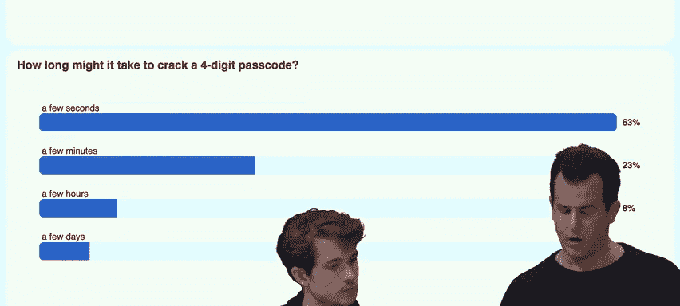
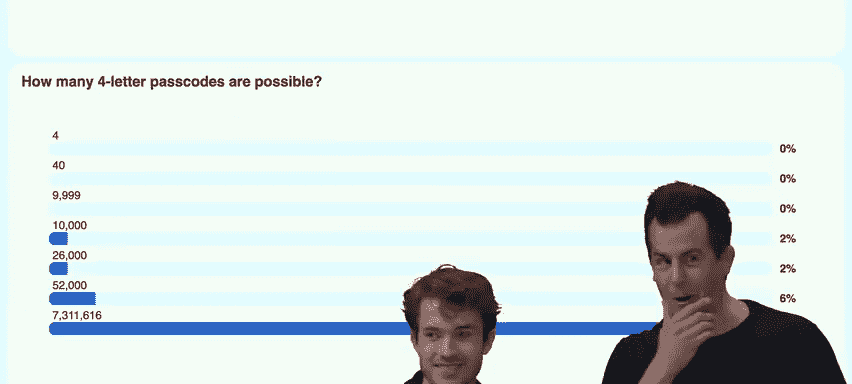
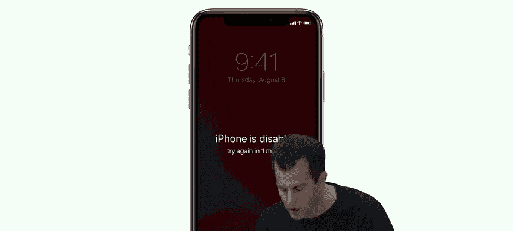
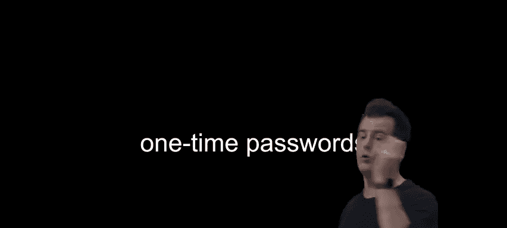
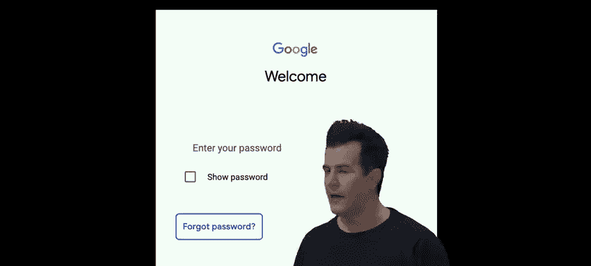
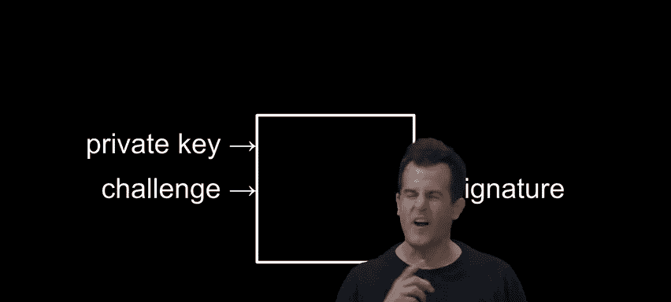
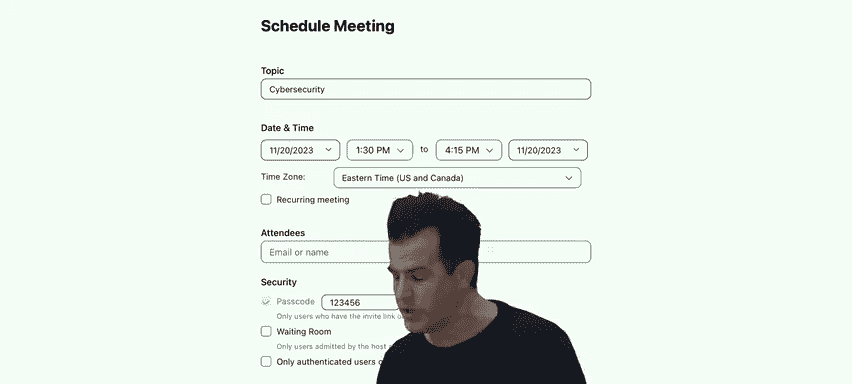
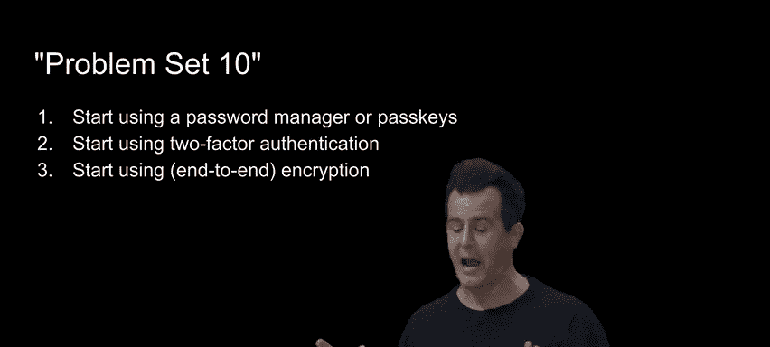
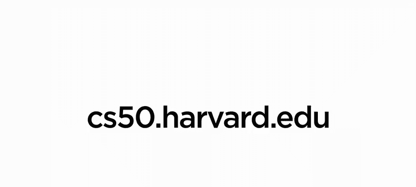

# 012：网络安全与课程总结 🛡️


在本节课中，我们将回顾整个CS50课程的旅程，并深入探讨网络安全这一关键领域。我们将学习如何评估和应对现实世界中的安全威胁，并了解如何运用过去几个月学到的编程和计算机科学知识来保护我们的数字生活。

## 课程回顾与展望 🚀

在过去的几个月里，我们从第0周开始，就像打开消防水带一样，接受了大量信息的冲击。课程的设计初衷就是不断挑战你，让你在每次掌握新知识后，都能迎接更高的难度，从而在最后一周依然能学到新东西。

现在，课程的核心部分已经结束，剩下的就是最终项目。今天，我们将简要回顾一下我们的起点和现在的位置，并深入了解网络安全的世界。这是一个充满挑战的领域，但希望你现在已经具备了评估现实世界威胁的心智模型和词汇，能够在个人、专业乃至行业和政府层面做出明智的决策。

最重要的是，我们希望你已经掌握了编程的核心理念。你不仅学会了C、Python、SQL和JavaScript等语言的编程技能，更重要的是，你学会了如何编程。这门课程为你打下了坚实的基础，即使未来技术不断变化，这些基础也将伴随你，帮助你快速适应新的技术环境。

归根结底，这门课程是关于解决问题的。我们希望它清理了你的思路，为你提供了更多工具，让你能够更有条理地思考和解决问题，无论是在代码中还是在算法层面。

## 网络安全基础 🔐

网络安全指的是保护我们的系统、数据、账户等免受威胁的过程。随着技术在我们生活和工作中的无处不在，其重要性日益凸显。那么，什么是“安全”？

*   **抵抗攻击**：系统能够抵御未经授权的访问或破坏。
*   **控制访问权限**：你能够控制谁可以访问你的数据和系统，这涉及到**身份验证**（如登录）和**授权**（决定已认证用户的访问级别）。

目前，我们最常用的身份验证机制仍然是密码。因此，我们将从密码的安全性开始，更系统、更量化地评估其安全性。

### 密码的安全性分析 🔑

不幸的是，人类并不擅长选择强密码。每年都有大量账户因此被入侵。安全研究人员通过分析已泄露的数据库，总结出了一些最常见的（也就是最差的）密码，例如 `123456`、`password`、`12345678` 等。

从这些密码中，我们可以推断出一些公司或系统的密码策略（例如最小长度要求）。即使是一些看似“聪明”的变体，如用 `@` 代替 `a`，用 `0` 代替 `o`，也早已被攻击者熟知并纳入攻击字典。

因此，攻击者通常会从这些最常见的密码列表开始尝试，这被称为**字典攻击**。统计上，他们有很大概率能成功入侵至少一个账户。


### 量化评估密码强度 ⏱️



让我们更学术地分析一下。以最常见的四位数手机锁屏密码为例。一个四位数密码有多少种可能性？从 `0000` 到 `9999`，共有 **10,000** 种可能。

那么，破解一个四位数密码需要多久？我们可以通过编写一个简单的Python程序进行**暴力破解**来测试。以下是一个示例代码：

```python
from string import digits
from itertools import product


for passcode in product(digits, repeat=4):
    # 尝试 passcode，例如通过数据线发送到设备
    print(''.join(passcode))
```



这段代码会尝试所有10,000种组合。在实际的计算机上运行，这只需要**几秒钟**。

如果我们使用4个字母（区分大小写，共52种可能）作为密码呢？可能性增加到 **52^4 ≈ 7百万** 种。虽然比数字多，但用类似的程序尝试所有组合，也只需要**不到一分钟**。

为了提高安全性，我们通常会要求密码包含大写字母、小写字母、数字和标点符号。如果一个8位字符的密码包含所有这些类型（共约94种字符），那么可能性是 **94^8 ≈ 6千万亿** 种。这个数字非常巨大，即使使用暴力破解，也需要极长的时间。


### 防御机制与权衡 ⚖️

然而，现实中的设备（如手机）通常会有防御机制来应对暴力破解。例如，在连续输入错误密码一定次数（如10次）后，设备会暂时锁定，要求你等待一段时间（如1分钟、5分钟甚至更久）才能再次尝试。

这极大地**增加了攻击者的成本**（时间和风险）。攻击者无法在短时间内尝试大量组合，而且长时间连接设备进行尝试的风险很高。



但这也带来了**权衡**：如果你自己忘记了密码，也会被暂时锁在外面。一些企业级设备甚至会在多次尝试失败后**擦除所有数据**，以保护敏感信息。

另一个常见问题是**密码复用**。由于记住多个复杂密码很困难，许多人会在不同网站使用相同密码。这非常危险，因为一旦一个网站的数据泄露，攻击者就可以用得到的密码尝试登录你的其他账户。

为了解决这个问题，可以使用**密码管理器**。这类软件可以为你每个账户生成并存储超长、复杂的随机密码。你只需要记住一个**主密码**来解锁密码管理器即可。虽然这带来了“把所有鸡蛋放在一个篮子里”的风险，但相比使用弱密码或重复密码，这通常是更安全的选择。在选择密码管理器时，请务必选择信誉良好的产品。

### 双因素认证 (2FA) 📱





**双因素认证** 是另一个强大的安全层。它要求你在输入密码（你知道的东西）之后，提供第二个验证因素（你拥有的东西），例如：
*   发送到手机的短信验证码。
*   身份验证器应用（如Google Authenticator）生成的动态码。
*   物理安全密钥（如YubiKey）。

这显著降低了账户被入侵的概率，因为攻击者即使获得了你的密码，也很难同时获取你的第二因素设备。需要注意的是，第二因素设备（如手机）本身也可能丢失，因此需要有备用方案。

## 密码的服务器端存储 🔒

当你忘记密码时，一个设计良好的网站应该通过邮件发送“重置密码”链接，而不是直接告诉你密码。这是因为服务器**不应该明文存储你的密码**。

正确的做法是使用**哈希函数**。哈希函数是一种单向加密算法，可以将任意长度的输入（如密码）转换成一个固定长度的、看似随机的字符串（哈希值）。这个过程是单向的，理论上无法从哈希值反推出原始密码。

服务器在注册时存储密码的哈希值，而不是密码本身。当你登录时，服务器对你输入的密码进行同样的哈希运算，然后比较两个哈希值是否一致。这样，即使服务器的数据库被泄露，攻击者得到的也只是哈希值，而非原始密码。

然而，攻击者可以预先计算大量常见密码的哈希值，制作成**彩虹表**，然后通过查表来反推哈希值对应的密码。为了应对这一点，可以采用**加盐**技术。

**加盐**是指在哈希过程中，除了密码本身，还加入一个随机字符串（盐）。这个盐会与哈希值一起存储在数据库中。即：
`哈希值 = 哈希函数(密码 + 盐)`

即使用户使用了相同的密码，由于盐不同，最终的哈希值也会完全不同。这有效防止了彩虹表攻击，也掩盖了不同用户使用相同密码的事实。

## 密码学进阶应用 🔐

### 非对称加密与公钥密码学

在第2周，我们学习了**对称加密**（如凯撒密码），加密和解密使用同一个密钥。但这存在“密钥分发”问题：双方如何安全地共享这个密钥？

**非对称加密**（公钥密码学）解决了这个问题。它使用一对数学上关联的密钥：**公钥**和**私钥**。
*   **公钥**是公开的，任何人都可以获取。
*   **私钥**是严格保密的，只有所有者持有。

加密过程：发送者使用**接收者的公钥**加密信息。
解密过程：只有拥有对应**私钥**的接收者才能解密该信息。



这样，即使在不安全的信道上，双方也能建立安全通信。HTTPS协议就使用了非对称加密来初始建立安全连接。常见的算法包括RSA、Diffie-Hellman和椭圆曲线加密。

### 通行密钥



**通行密钥**是近年来兴起的一种无密码登录技术。它本质上利用了非对称加密的原理：
1.  你的设备（手机、电脑）为每个网站生成一对唯一的公钥和私钥。
2.  公钥发送给网站保存，私钥安全地存储在设备上。
3.  登录时，网站发送一个挑战码，你的设备用私钥对其签名后返回。
4.  网站用你之前提供的公钥验证签名，确认你的身份。

这消除了记忆密码的需要，安全性更高，是未来的发展趋势。

### 端到端加密

**端到端加密**是一种更强的加密形式。它确保只有通信的双方能解密信息，即使是传输数据的服务提供商（如消息应用的公司）也无法读取内容。iMessage、WhatsApp、Signal等应用都提供端到端加密。在视频会议软件（如Zoom）中，也请注意选择“端到端加密”选项，而不仅仅是“增强加密”。

### 全盘加密与安全删除

**全盘加密**可以保护整个硬盘的数据。在开启此功能后，硬盘上的所有数据都会被加密。只有输入正确的密码（或解锁密钥）才能解密并访问数据。即使硬盘被盗，里面的数据也无法被读取。macOS的FileVault和Windows的BitLocker都提供此功能。但请注意，如果忘记密码，数据将永久丢失。



关于删除文件，通常操作系统“删除”文件只是标记存储空间为可用，并未真正擦除数据。**安全删除**会覆盖原有数据，使其难以恢复。对于高度敏感的数据，最彻底的方法是物理销毁存储介质。

## 总结与行动建议 ✅

在本节课中，我们一起回顾了CS50的旅程，并深入探讨了网络安全的核心概念。我们学习了：

1.  **密码的脆弱性**：常见密码、暴力破解和字典攻击。
2.  **安全防御**：设备锁定机制、密码管理器和双因素认证。
3.  **服务器安全**：密码哈希、加盐存储。
4.  **现代密码学**：非对称加密、通行密钥和端到端加密。
5.  **数据保护**：全盘加密和安全删除。

为了让你在课程结束后能更好地保护自己，这里有三条具体的行动建议：

1.  **开始使用密码管理器**：至少为你最重要的账户（如银行、邮箱）生成并管理强密码。
2.  **启用双因素认证**：为你所有支持2FA的重要账户开启此功能。
3.  **在可能时启用端到端加密**：在通信和存储敏感数据时，优先选择支持端到端加密的工具和服务。

记住，安全是一个持续的过程，而不是一个终点。通过应用这些知识，你可以显著提升你的数字安全水平。



最后，感谢所有让CS50成为可能的人，包括教学团队、工作人员以及屏幕前的你。继续构建，继续探索，这，就是CS50。