# CS50X 计算机科学导论：第0讲：Scratch


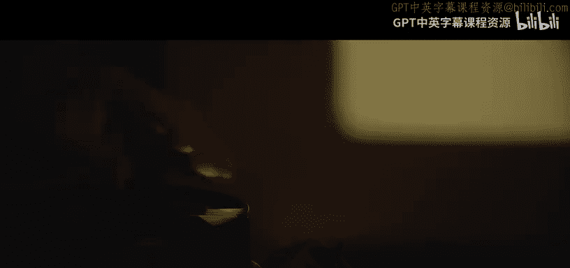


## 概述

在本节课中，我们将要学习计算机科学的基础概念，包括信息如何用二进制表示，以及如何通过算法和编程来解决问题。我们将从零开始，探索编程的核心思想，并使用Scratch这一图形化编程工具来实践这些概念。

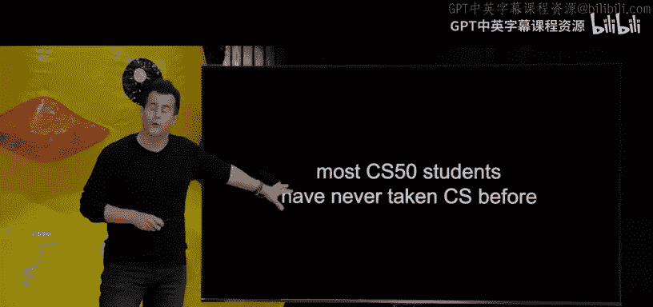

---

## 什么是计算机科学？

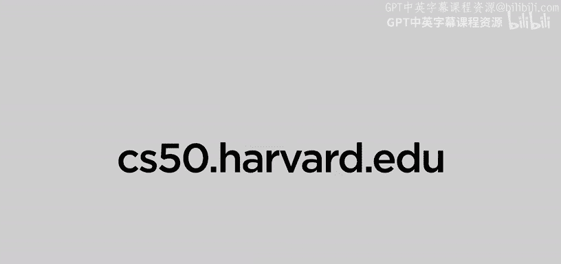

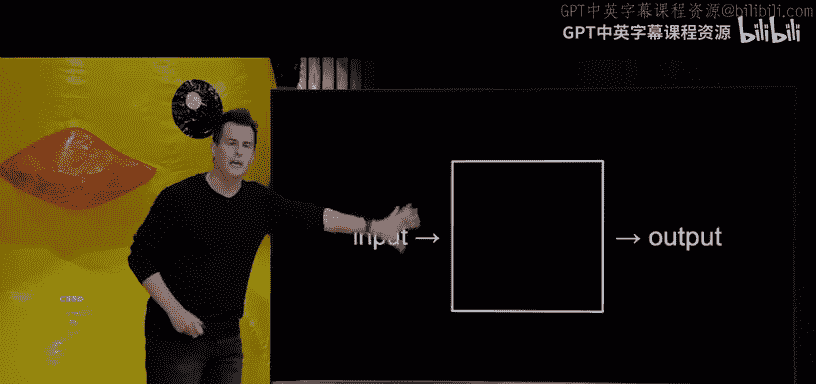

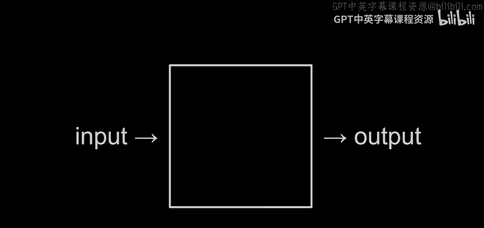

计算机科学是研究信息的学科，即如何表示信息以及如何处理信息。更根本地说，这门课程将教授**计算思维**，即应用计算机科学的思想来解决我们感兴趣的问题。

问题解决可以简化为一个模型：我们有一个需要解决的**问题**（输入），目标是产生一个**解决方案**（输出）。关键在于如何将输入处理成输出。

---

## 如何表示信息？

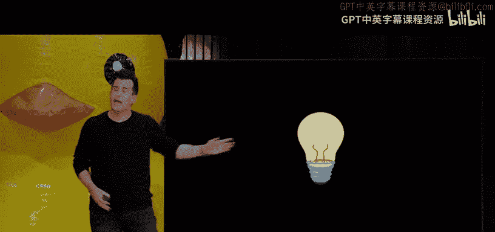

为了用计算机处理信息，我们首先需要一种标准化的方式来表示输入和输出。计算机内部只使用**0**和**1**，即二进制系统。

### 二进制系统

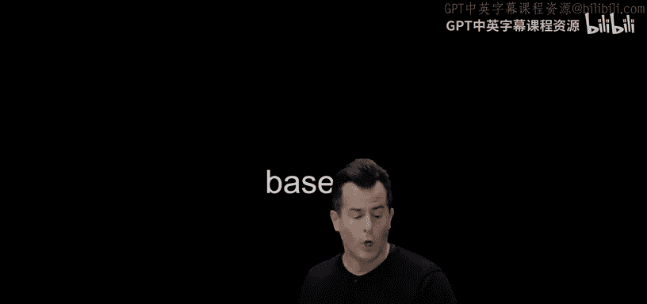

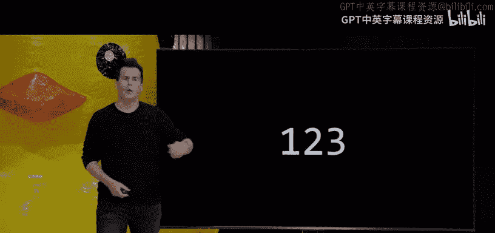

*   在十进制系统中，我们使用0到9这十个数字。
*   在二进制系统中，计算机只使用0和1这两个数字。一个二进制数字称为一个**比特**。

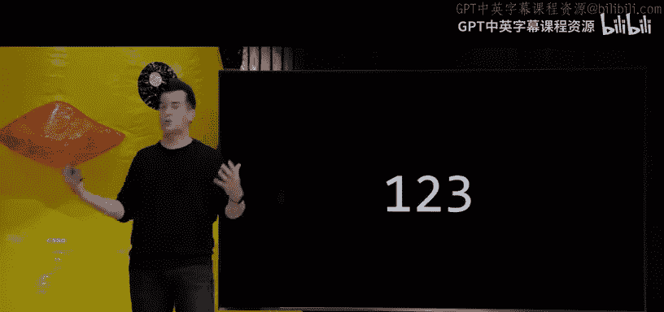

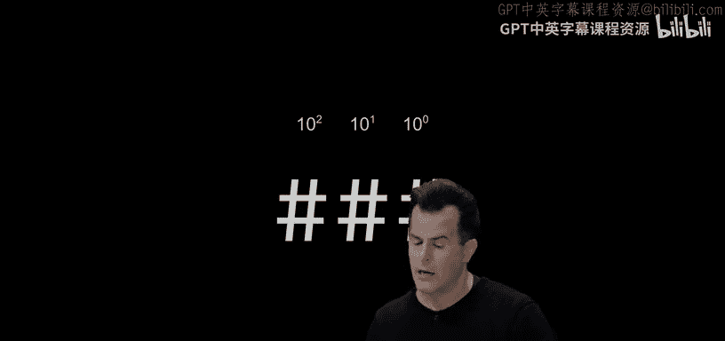

我们可以用物理开关（如晶体管）或灯泡来类比比特：关代表0，开代表1。

**如何用二进制计数？**
使用多个比特，每个位置代表2的幂次方（从右到左：2^0, 2^1, 2^2...）。这与十进制中每位代表10的幂次方（个位、十位、百位）原理相同。

**公式：**
对于一个二进制数，例如 `101`，其十进制值为：
`(1 * 2^2) + (0 * 2^1) + (1 * 2^0) = 4 + 0 + 1 = 5`

通常，计算机将8个比特组合在一起，称为一个**字节**。一个字节可以表示从0到255（共256个）不同的值。

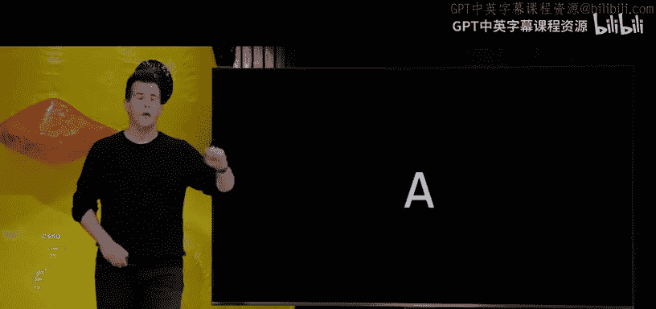

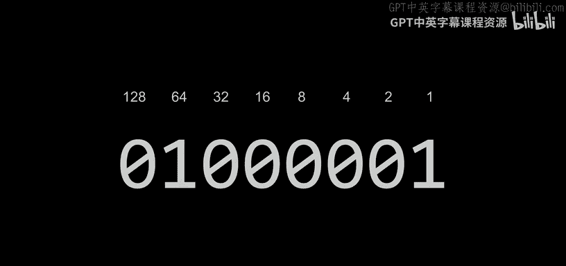

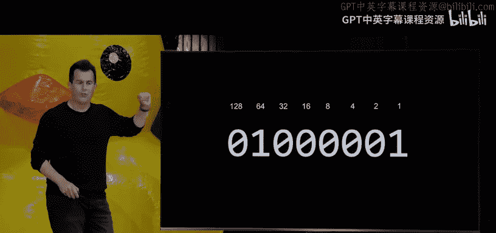

---

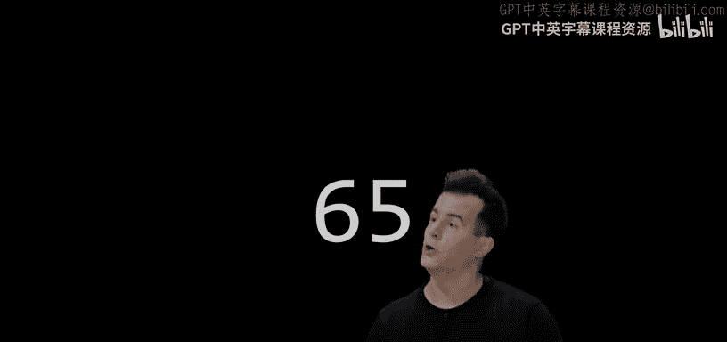

## 表示文本：ASCII 与 Unicode

上一节我们介绍了如何用二进制表示数字。本节中我们来看看如何表示字母和文本。

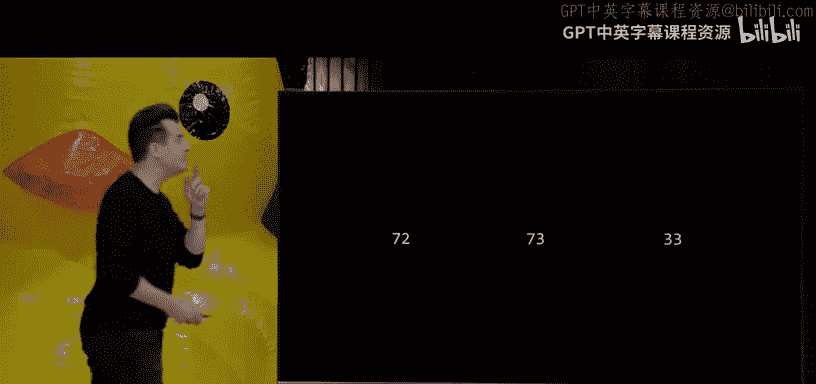

计算机通过为每个字符分配一个唯一的数字代码来表示文本。例如，早年制定的**ASCII**编码标准规定：
*   大写字母 `A` 对应数字 **65**（二进制 `01000001`）
*   大写字母 `B` 对应数字 **66**
*   依此类推。

当计算机接收到一串二进制数字（如代表72、73、33的三个字节）时，它会查找ASCII表，将其显示为对应的字符“HI!”。

然而，ASCII只使用7或8比特，最多只能表示256个字符，不足以涵盖所有人类语言。因此，更现代的**Unicode**标准应运而生，它使用更多比特（如16、24或32位），可以表示超过400万个字符，包括各种文字符号和**表情符号**。

---

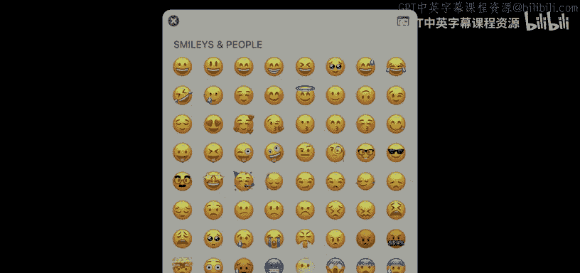

## 表示颜色、图像与多媒体

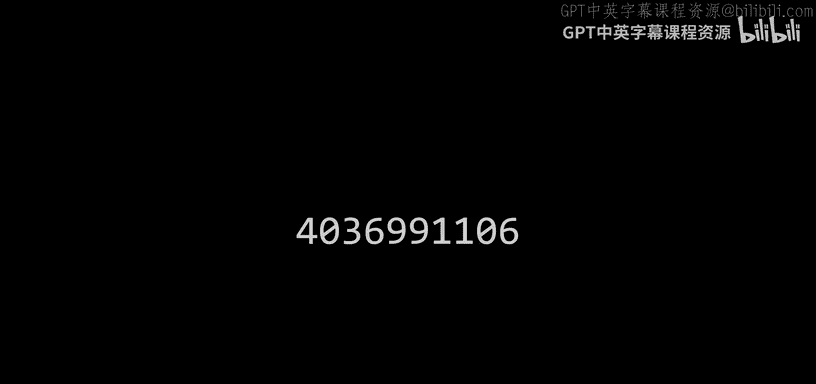

我们不仅可以用数字表示文本，还可以表示更丰富的多媒体信息。

**表示颜色**
计算机通常使用**RGB**系统来表示颜色。一个像素的颜色由三个数字组成，分别代表红色、绿色和蓝色的强度。每个强度值通常用一个字节（0-255）表示。

**代码/公式概念：**
一个黄色像素可能由 `(红色: 72, 绿色: 73, 蓝色: 33)` 这三个值定义。

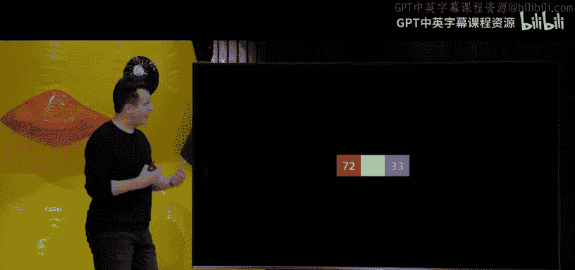

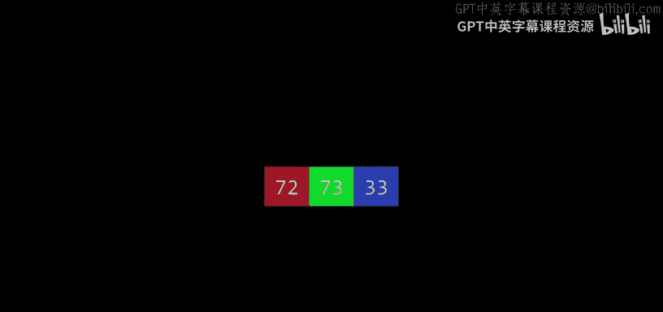

**表示图像**
一张数字图像由成千上万个像素组成。每个像素需要至少3个字节（用于RGB），这就是为什么图像文件通常很大的原因。

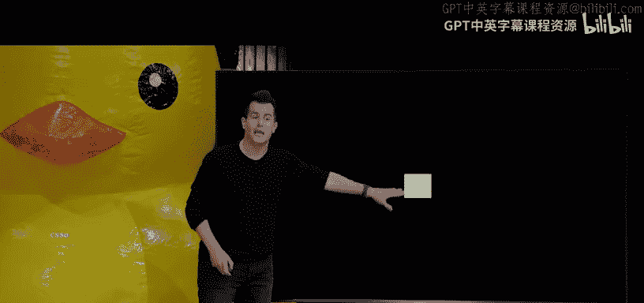

**表示视频**
视频本质上是一系列快速连续播放的图像（帧），例如每秒24或30帧。将许多图像组合起来，就形成了运动的画面。

**表示声音**
声音可以用数字表示，例如，用数字表示音高（频率）、音量（振幅）和持续时间。将这些数字组合起来，计算机就能合成或播放音乐。

**关键在于上下文**：同样一串二进制数字 `72, 73, 33`，在文本编辑器中是“HI!”，在图像处理软件中可能是一个黄色像素。程序员的代码决定了计算机如何解释这些数据。

---

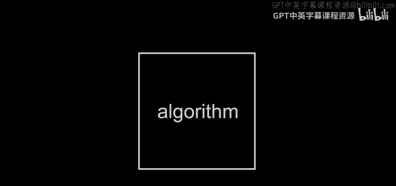

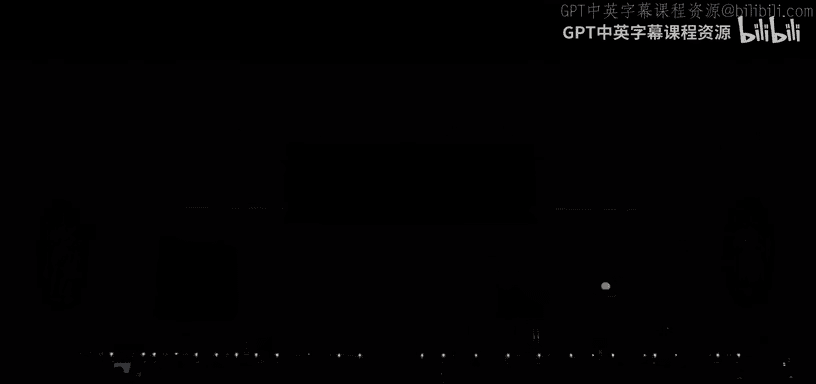

## 算法与问题解决

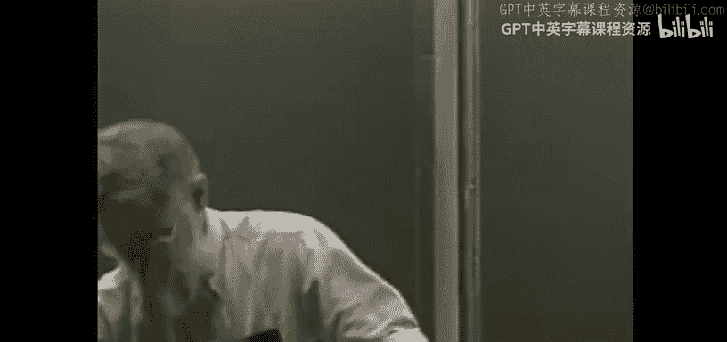

现在我们已经了解了如何表示信息（输入和输出）。接下来，我们看看解决问题的核心——**算法**。

算法是解决某个问题的**精确的、一步一步的指令集**。以在电话簿中找人名为例，我们可以比较几种不同的算法：

1.  **逐页查找**：从第一页开始，一页一页地找。如果电话簿有N页，最多需要N步。
2.  **每次翻两页**：速度更快，但可能会错过目标，需要额外步骤修正。最多需要大约 N/2 步。
3.  **二分查找**：
    *   打开电话簿到中间。
    *   如果目标名字在这一页，完成。
    *   如果目标名字在字母顺序上更靠前，则忽略右半部分，在左半部分重复此过程。
    *   如果更靠后，则忽略左半部分，在右半部分重复此过程。
    *   这个算法每一步都将问题规模减半，最多只需要大约 log₂(N) 步。对于1000页的电话簿，最多只需约10步。

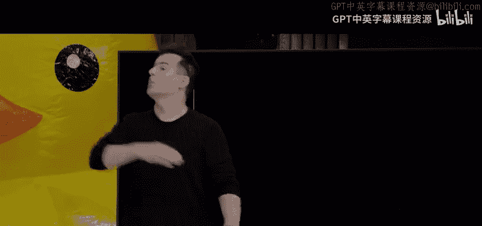

**算法效率对比**：二分查找（对数级增长）的效率远高于线性查找（线性增长）。当数据量增大时，高效算法的优势更加明显。

---

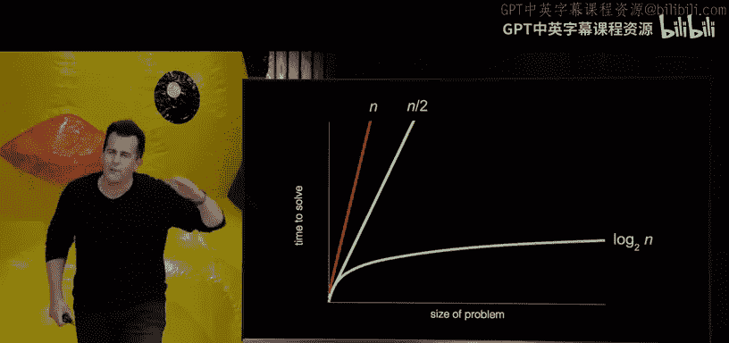

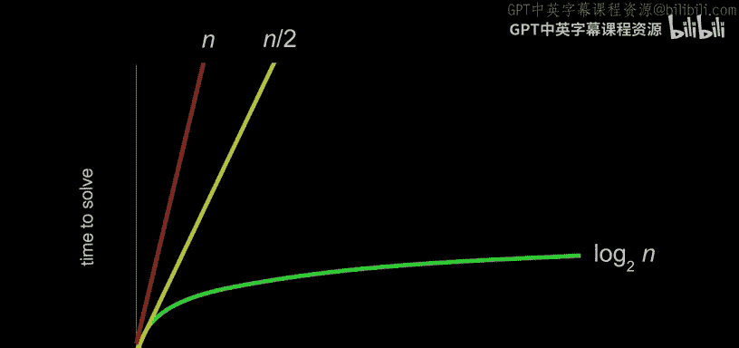

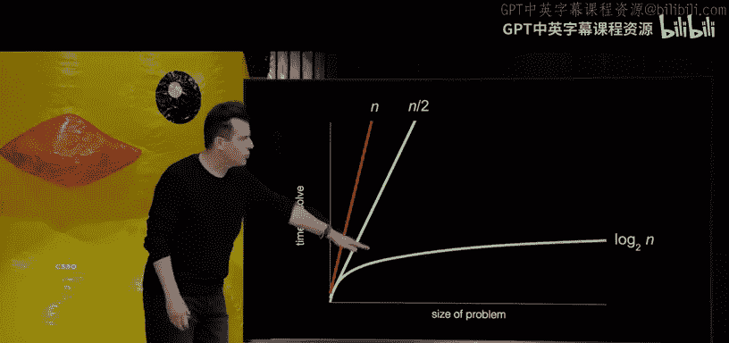

## 用伪代码表达算法

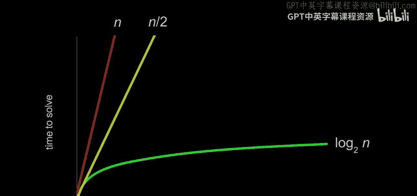

为了将算法思想转化为可执行的程序，我们首先用**伪代码**来描述它。伪代码使用类似英语的结构，清晰表达逻辑，而不拘泥于特定编程语言的语法。

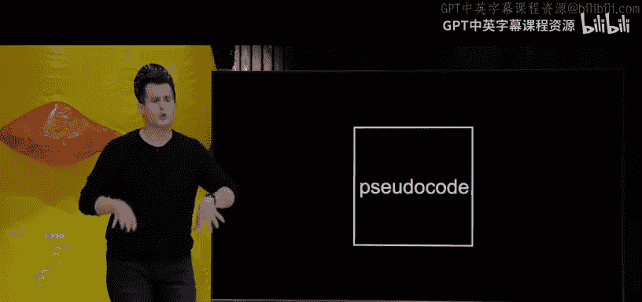

以下是二分查找算法的伪代码示例：

```
1 拿起电话簿
2 打开电话簿到中间页
3 查看这一页
4 如果目标人物在这一页
5     打电话给这个人
6 否则，如果目标人物在电话簿的前半部分
7     打开电话簿左半部分的中间页
8     回到第3行
9 否则，如果目标人物在电话簿的后半部分
10    打开电话簿右半部分的中间页
11    回到第3行
12 否则
13    退出
```

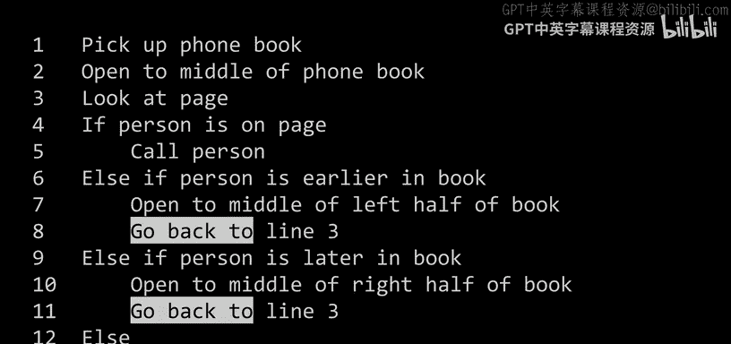

从这段伪代码中，我们可以识别出编程的几种基本构建块：
*   **函数**：如“拿起”、“打开”、“查看”、“打电话”，代表一个动作或任务。
*   **条件语句**：如“如果…否则如果…否则”，代表基于布尔表达式（真/假问题）做出决策的分支路径。
*   **循环**：如“回到第3行”，代表重复执行某段代码。
*   **布尔表达式**：如“目标人物在这一页吗？”，是结果为是或否的问题。

正确的算法必须避免**无限循环**，确保在有限步骤内结束。在上述例子中，因为电话簿被不断对半分割，最终一定会到达只剩一页或找不到的情况，从而退出循环。

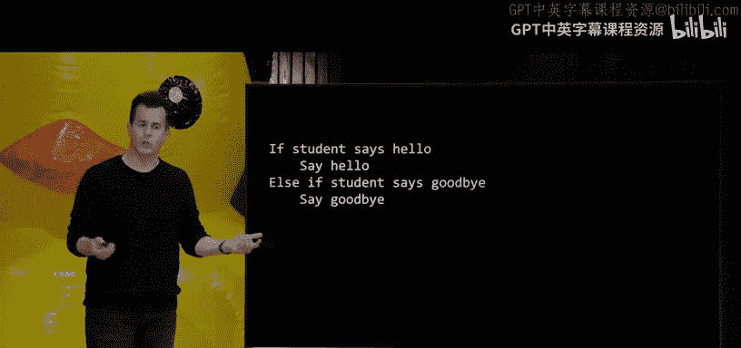

---

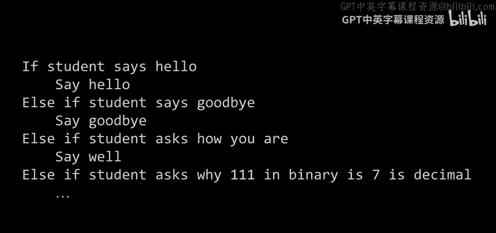

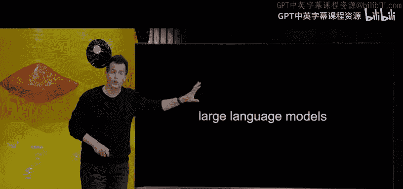

## 初识编程：从 Scratch 开始

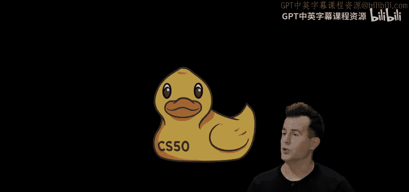

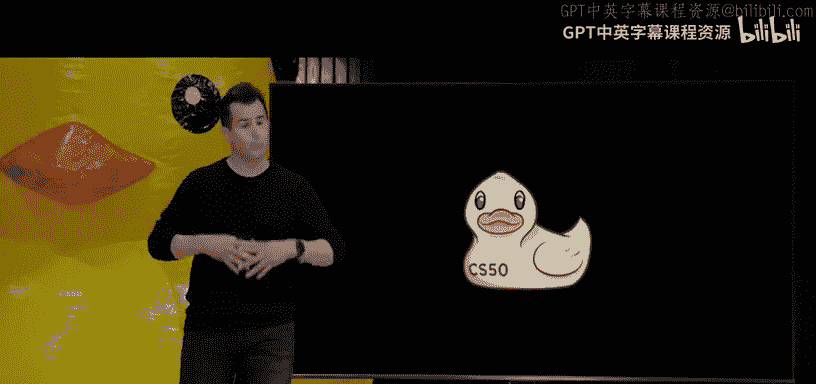

理解了算法和基本概念后，我们开始实际编程。为了避免一开始就陷入复杂的语法，我们使用**Scratch**——一款由MIT开发的图形化编程语言。

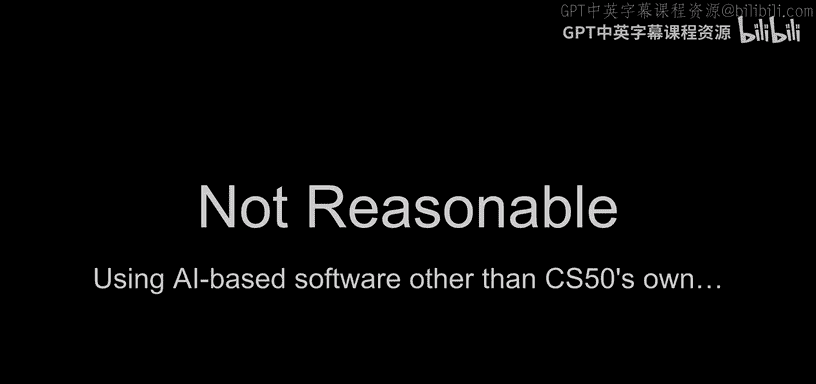

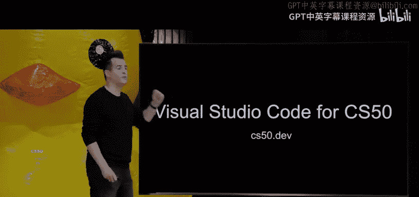

在Scratch中，你通过拖拽彩色的代码块来构建程序，而不是键入文本代码。这让我们能专注于编程逻辑本身。


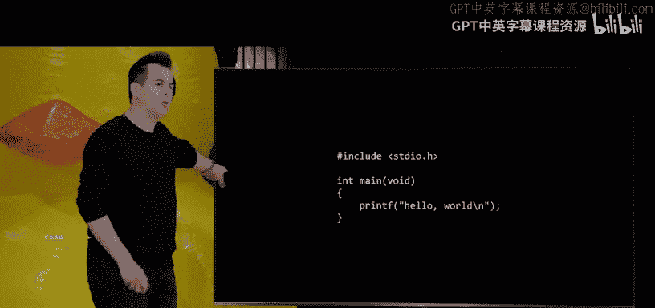

### Scratch 环境与第一个程序

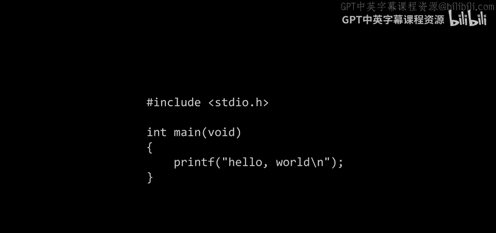

Scratch界面主要包含：
*   **代码块区域**：按功能分类（运动、外观、声音等）的代码块。
*   **编程区域**：将代码块拖拽到这里组合成脚本。
*   **舞台**：程序运行的可视化区域。
*   **角色**：舞台上的对象（如默认的小猫），你可以控制它们。

**编写“Hello, World”程序：**
1.  从“事件”类中，拖出 `当绿色旗帜被点击` 块。
2.  从“外观”类中，拖出 `说 Hello!` 块，将其拼接在旗帜块下方。
3.  将“Hello!”改为“Hello, World”。
4.  点击舞台上的绿色旗帜，小猫就会说“Hello, World!”。

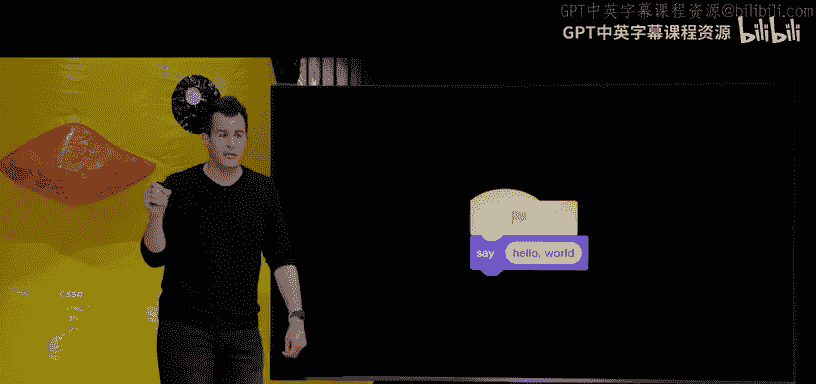

在这个简单的例子中：
*   **输入**：字符串“Hello, World”。
*   **函数**：`说` 代码块。
*   **输出（副作用）**：屏幕上显示的对话气泡。

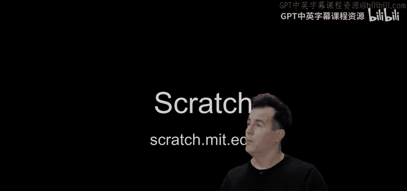

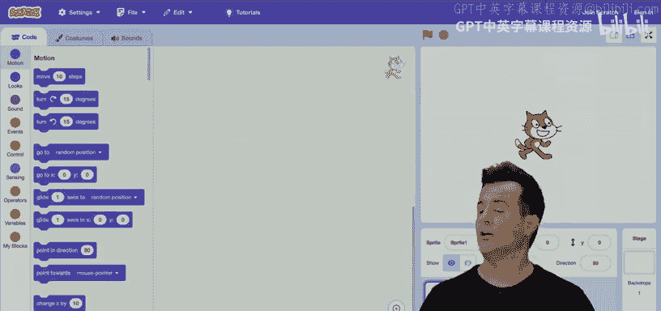

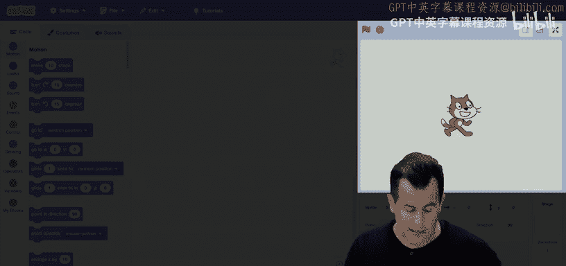

---

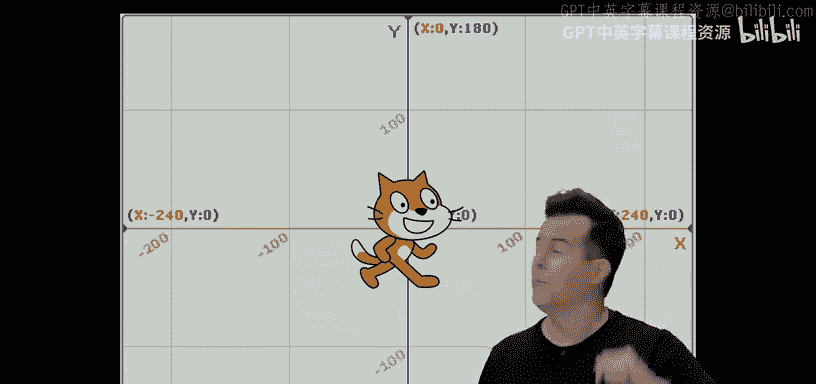

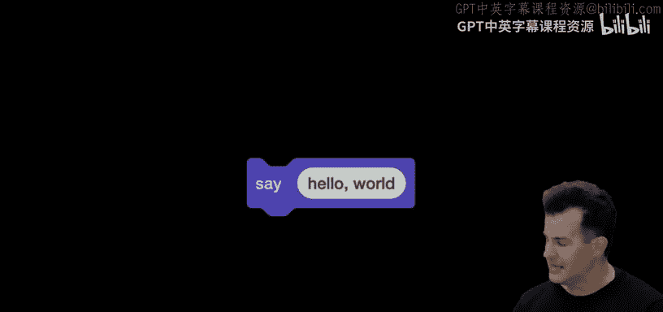

## 深入 Scratch：函数、输入与变量

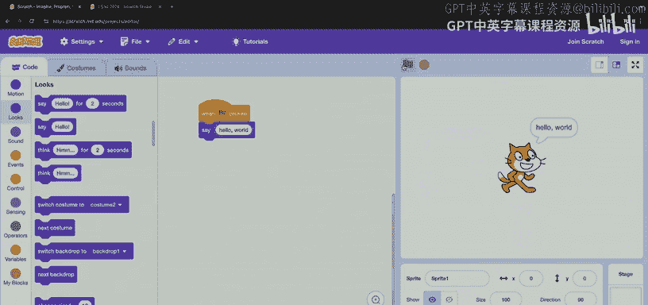

让我们创建一个更交互的程序，让小猫问候用户。

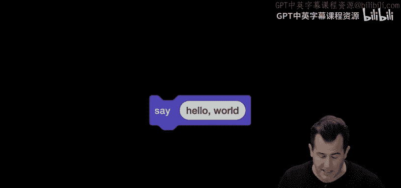

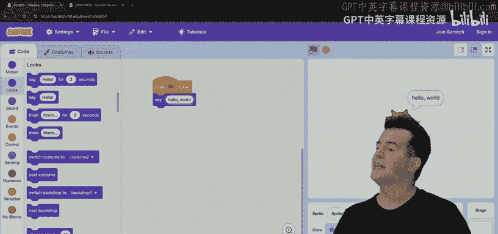

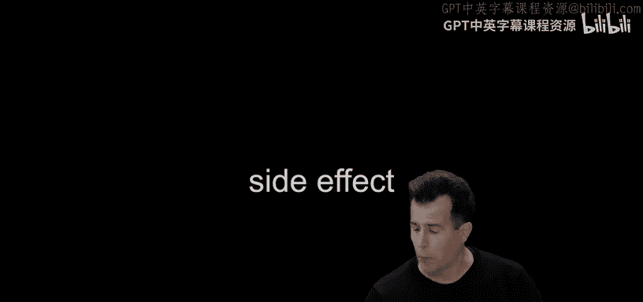

**基础版本（有缺陷）：**
```
当绿色旗帜被点击
询问 你叫什么名字？ 并等待
说 Hello, David
```
问题：它永远只会说“Hello, David”，不会使用用户输入的名字。

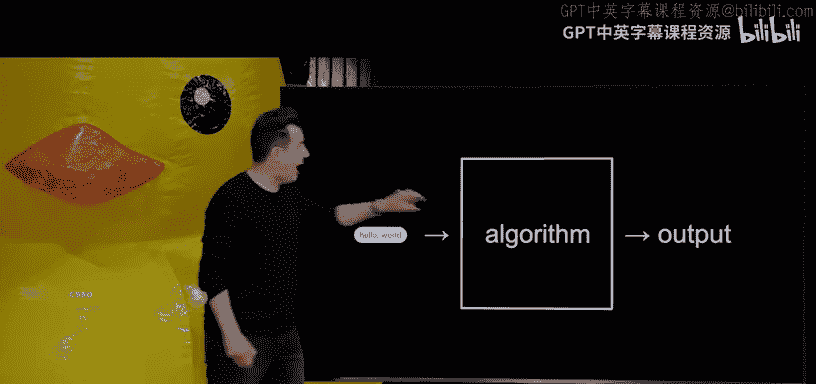

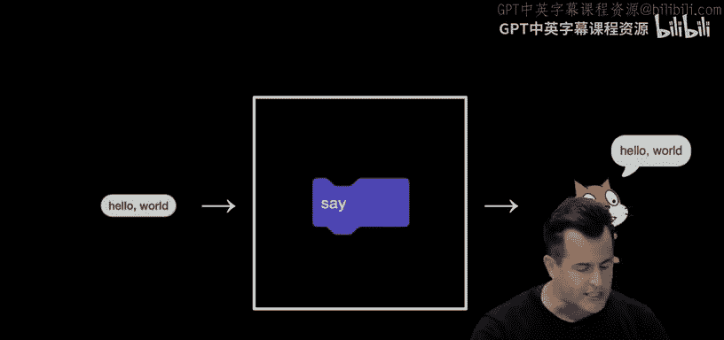

**改进版本（使用“回答”变量）：**
```
当绿色旗帜被点击
询问 你叫什么名字？ 并等待
说 Hello
说 回答
```
问题：两个“说”指令执行太快，看起来只说了名字。

**最终版本（连接字符串）：**
```
当绿色旗帜被点击
询问 你叫什么名字？ 并等待
说 连接 Hello,  和 回答
```
*   `询问...并等待` 是一个函数，它会暂停程序等待用户输入，并将输入值存储在特殊的 **变量** `回答` 中。
*   `回答` 是一个**返回值**，我们可以用它。
*   `连接` 是另一个函数，它接受两个输入（“Hello, ”和 `回答`），并输出拼接后的新字符串，作为 `说` 函数的输入。

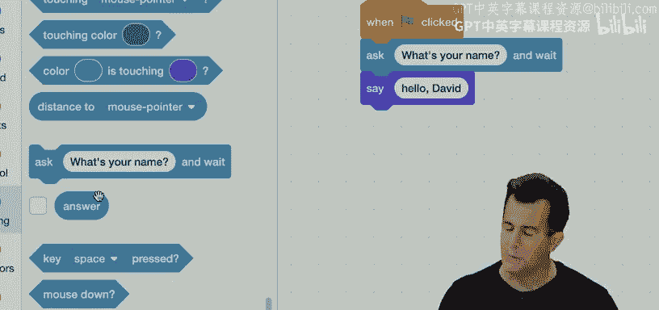

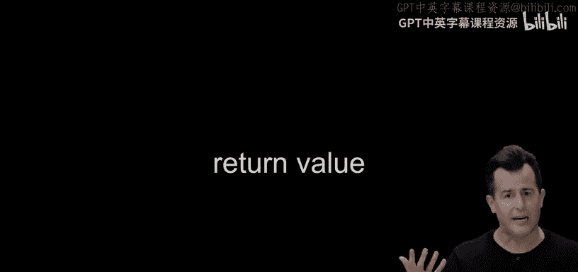

**关键概念：**
*   **函数**：执行特定任务的代码块（如 `询问`、`说`、`连接`）。
*   **参数**：传递给函数的输入值（如 `说` 函数中的文本）。
*   **返回值**：函数执行后返回的结果（如 `询问` 函数返回的 `回答`）。
*   **变量**：存储数据的容器（如 `回答`）。

---

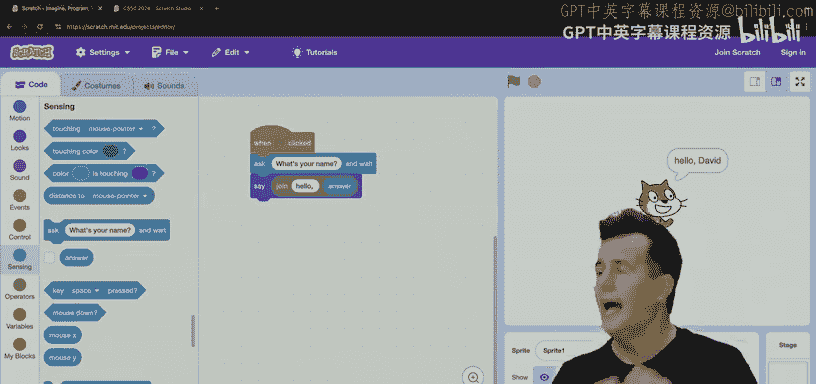

## 循环、条件与自定义积木

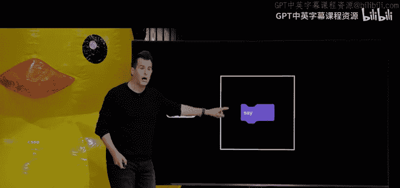

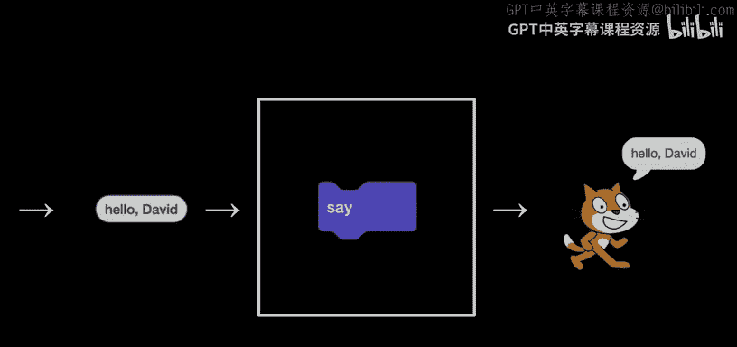

为了编写更有用的程序，我们需要控制代码的执行流程。

**循环：重复执行**
如果想让小猫叫三声，笨拙的方法是重复写三遍“播放声音”和“等待”。更好的方法是使用**循环**。

```
当绿色旗帜被点击
重复执行 3 次
  播放声音 Meow 直到播放完毕
  等待 1 秒
```

**条件语句：根据情况做决定**
让小猫在鼠标碰到它时才叫。

```
当绿色旗帜被点击
重复执行
  如果 碰到 鼠标指针 ？ 那么
    播放声音 Meow 直到播放完毕
```

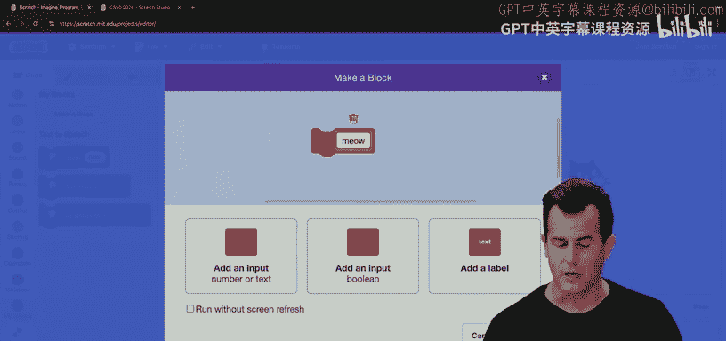

**自定义积木（函数）：创建自己的抽象**
Scratch 没有直接的“喵”积木，但我们可以自己创建，隐藏实现细节，让主程序更清晰。

1.  点击“我的积木”，创建新积木，命名为“喵”。
2.  定义“喵”积木的动作（播放声音并等待）。
3.  在主程序中使用你创建的“喵”积木。

```
定义 喵
播放声音 Meow 直到播放完毕
等待 1 秒

当绿色旗帜被点击
重复执行 3 次
  喵
```

你甚至可以创建带参数的函数，比如“喵 n 次”。

```
定义 喵 n 次
重复执行 n 次
  播放声音 Meow 直到播放完毕
  等待 1 秒

当绿色旗帜被点击
喵 10 次
```

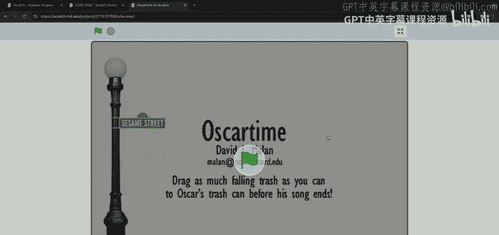

通过创建自定义积木，我们将复杂功能封装起来，使主程序更简洁、更易理解和修改。

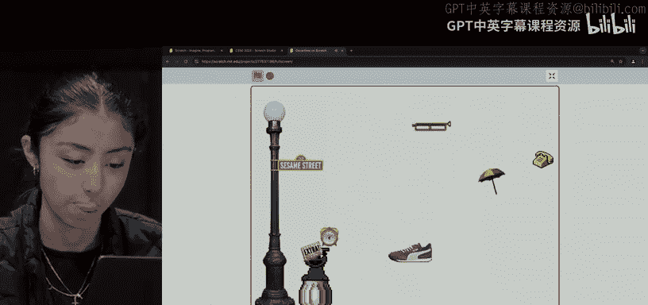

---

## 实践：从简单项目到复杂游戏

编程最好的学习方式是实践。通过将复杂项目分解为一系列**小步骤**，你可以逐步构建出有趣的作品。

例如，创建一个“接垃圾”游戏可能涉及以下步骤：
1.  **第0步**：让垃圾桶角色在鼠标碰到时改变外观（动画）。
2.  **第1步**：让垃圾角色从屏幕顶部随机位置下落。
3.  **第2步**：检测垃圾是否碰到垃圾桶。如果是，将垃圾重置到顶部，并增加分数变量。
4.  **后续步骤**：添加更多垃圾类型、计时器、音效、更复杂的关卡等。

另一个例子是创建迷宫追逐游戏：
*   使用 `如果 按下 上箭头键？` 等条件来控制主角移动。
*   使用 `碰到颜色 ？` 或 `碰到 角色 ？` 来检测墙壁碰撞。
*   让敌人角色使用 `重复执行` 和 `移动` 积木来回巡逻。
*   让更聪明的敌人使用 `面向 角色` 和 `移动` 积木来追逐主角。

每个步骤只解决一个小问题，最终将它们组合起来。记住，编程中一切所需的时间通常比你预期的要长，但通过增量开发，你总能取得可见的进展。

---

## 总结

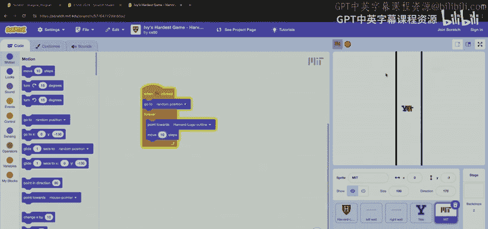

本节课中我们一起学习了计算机科学的基石：
1.  **信息表示**：计算机使用二进制（0和1）表示一切，包括数字、文本（ASCII/Unicode）、颜色（RGB）、图像、视频和声音。
2.  **算法**：算法是解决问题的精确步骤序列。设计高效的算法（如二分查找）至关重要。
3.  **编程基础**：我们了解了编程的核心概念——**函数**、**条件语句**、**循环**和**变量**，并使用伪代码进行了描述。
4.  **实践入门**：我们通过Scratch图形化编程环境实践了这些概念，学习了如何响应事件、处理输入、使用循环和条件，以及通过创建自定义积木来构建更清晰、更模块化的程序。

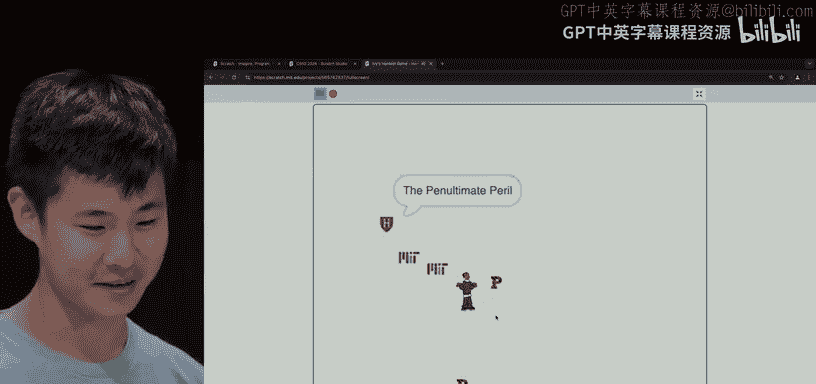

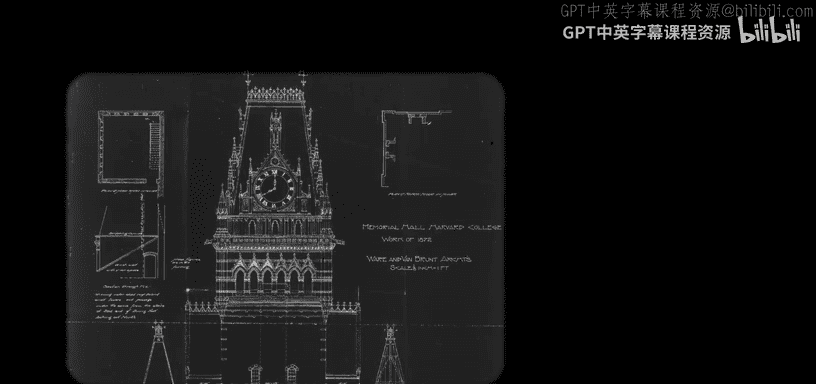

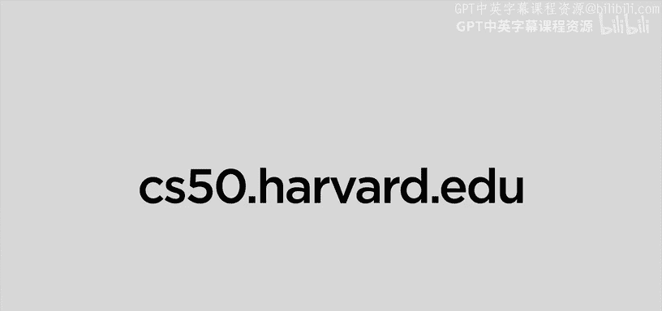

记住，计算机科学不仅仅是关于编程，更是关于**解决问题**和**计算思维**。从今天开始，你将踏上学习如何将想法转化为现实的道路。欢迎来到CS50！