# CS50x 2025：第4讲：内存 🧠


## 概述
在本节课中，我们将要学习计算机内存的底层工作原理，包括指针、地址、十六进制表示法以及如何直接操作内存。我们将理解字符串在C语言中的真实本质，学习动态内存分配，并探讨文件输入/输出的基础。

---

## 十六进制表示法 🔢

上一节我们回顾了二进制和十进制系统。本节中我们来看看另一种在计算机科学中常用的表示法：十六进制。


十六进制（Hexadecimal）是一种基数为16的计数系统。它使用16个不同的符号来表示数值：0-9代表数值0到9，而A-F（或a-f）代表数值10到15。

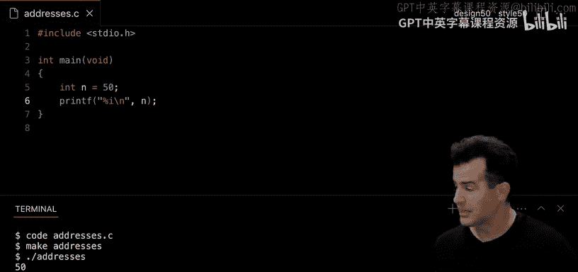

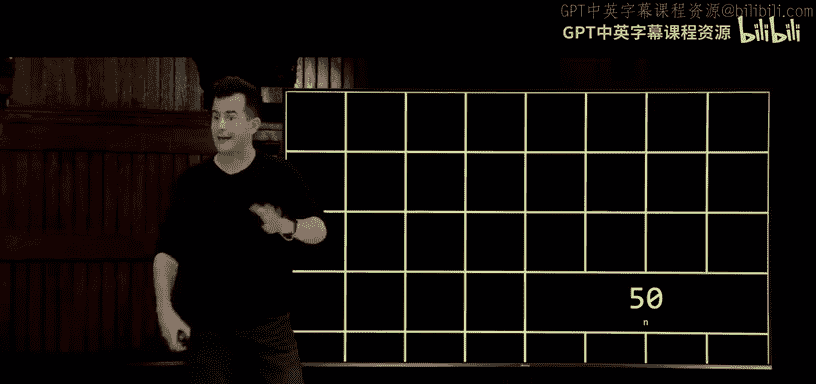

**公式**：`0, 1, 2, 3, 4, 5, 6, 7, 8, 9, A, B, C, D, E, F`

在编程和表示内存地址时，十六进制非常有用，因为它可以更紧凑地表示二进制数据。例如，一个字节（8位）可以用两个十六进制数字表示。

**代码**：在C语言中，十六进制数字通常以 `0x` 为前缀，例如 `0x1A3F`。

---

## 指针与地址 📍

上一节我们介绍了十六进制。本节中我们来看看计算机内存中的地址以及如何通过指针访问它们。


指针是一个变量，其值是另一个变量的内存地址。通过指针，我们可以间接访问和操作内存中的数据。


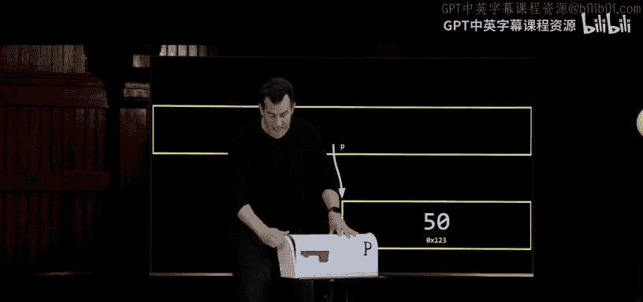


以下是C语言中与指针相关的关键运算符：

*   **`&`（地址运算符）**：获取变量的内存地址。
    *   **代码**：`int n = 50; int *p = &n;` （`p` 现在存储了 `n` 的地址）
*   **`*`（解引用运算符）**：访问指针所指向地址的值。
    *   **代码**：`printf("%d\n", *p);` （这将打印出 `n` 的值，即50）

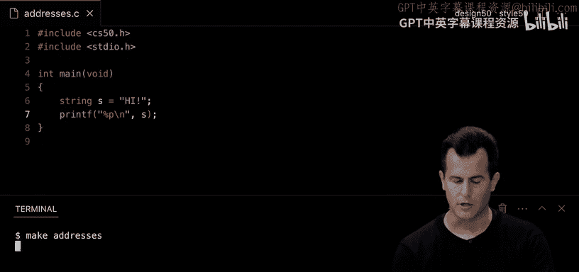

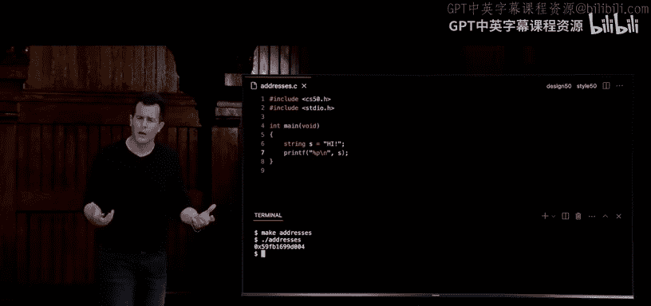

**代码**：一个简单的指针示例
```c
#include <stdio.h>

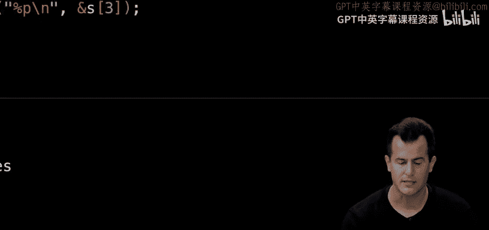

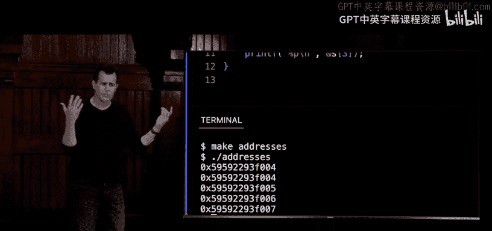

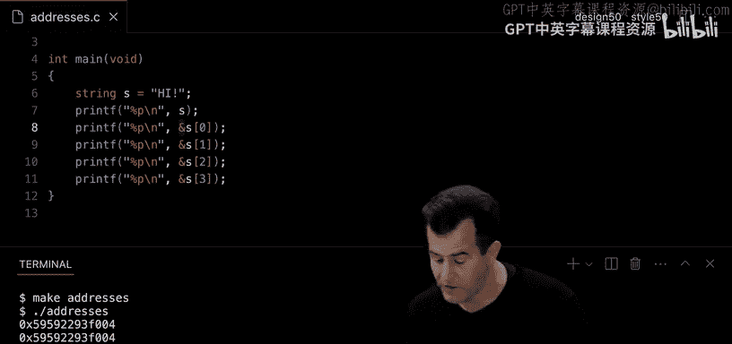

int main(void)
{
    int n = 50;
    int *p = &n; // p 是指向整数 n 的指针
    printf("n 的值: %d\n", n);
    printf("n 的地址: %p\n", &n);
    printf("指针 p 的值 (即 n 的地址): %p\n", p);
    printf("通过 p 访问 n 的值: %d\n", *p);
    return 0;
}
```


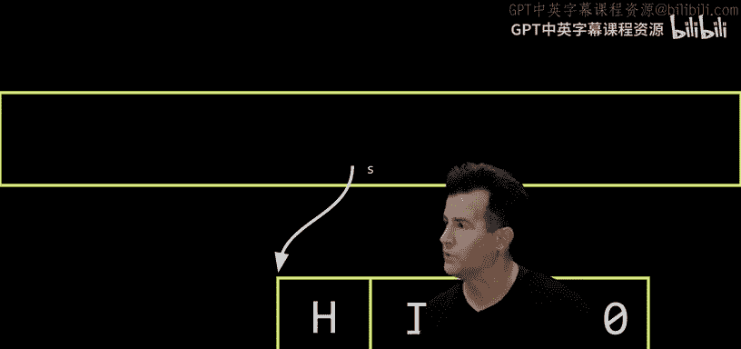

---

## 字符串的本质 🧵


上一节我们探讨了指针。本节中我们来看看C语言中字符串的真实表示。

在C语言中，并没有内置的“字符串”数据类型。所谓的“字符串”实际上是一个字符数组，并且这个数组的末尾有一个特殊的空字符（`\0`）作为终止符。

更准确地说，一个字符串变量（如 `char *s`）实际上是一个指针，它存储了该字符数组中第一个字符的内存地址。

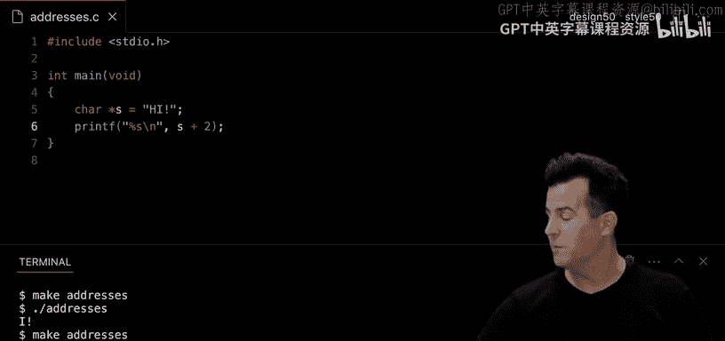


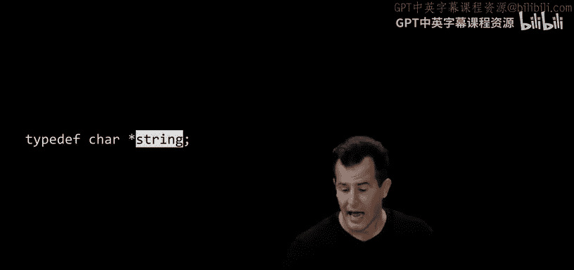


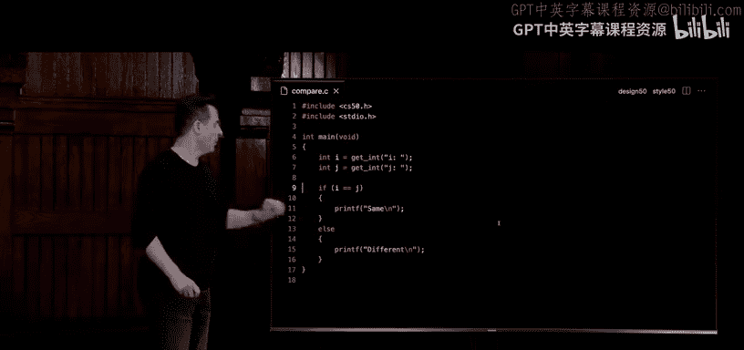

**代码**：字符串即字符指针
```c
#include <stdio.h>

int main(void)
{
    char *s = "HI!";
    printf("字符串: %s\n", s);
    printf("第一个字符: %c\n", s[0]);
    printf("第二个字符: %c\n", *(s + 1)); // 指针算术
    printf("字符串的地址 (即 'H' 的地址): %p\n", (void *)s);
    printf("字符 'H' 的地址: %p\n", (void *)&s[0]);
    return 0;
}
```

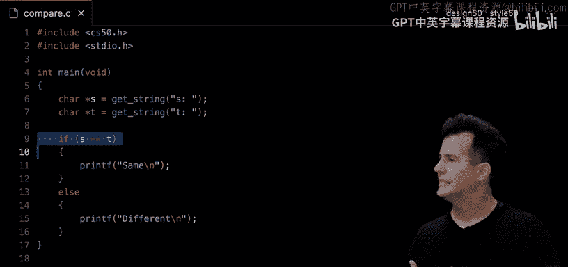

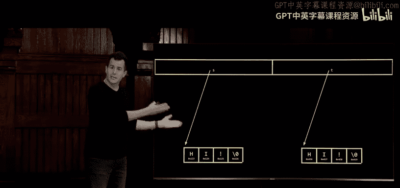

`string` 这个类型名在标准C中并不存在。在CS50课程中，它是在 `cs50.h` 头文件中通过 `typedef char *string;` 定义的一个别名，目的是让初学者更容易上手。

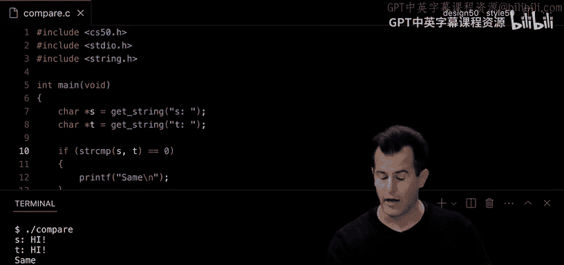

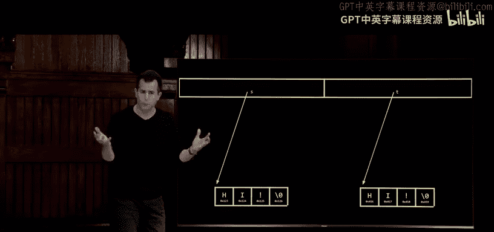

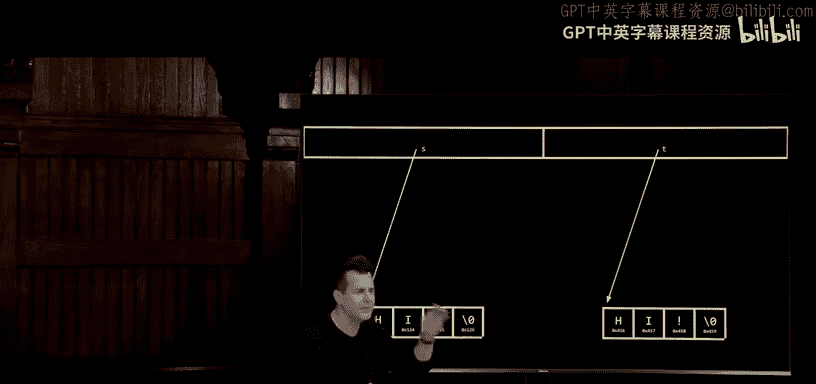

---

## 指针算术 ➕

上一节我们了解了字符串是指向字符的指针。本节中我们来看看如何对指针进行算术运算。

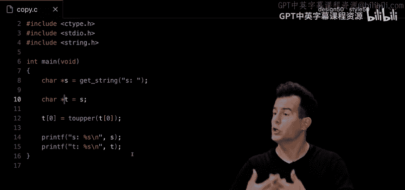

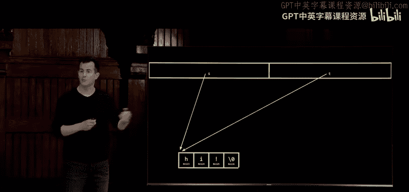

由于指针存储的是地址（即数字），我们可以对这些地址进行加减运算，从而在内存中移动。这对于遍历数组（包括字符串）特别有用。

**代码**：使用指针算术遍历字符串
```c
#include <stdio.h>
#include <string.h>

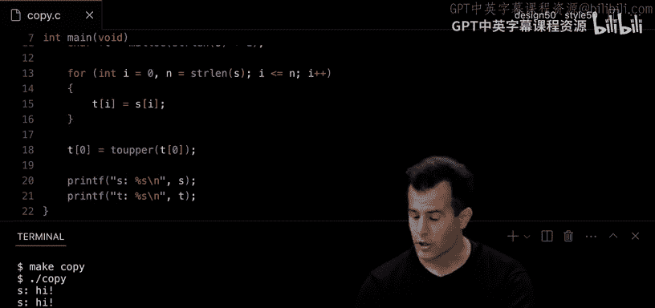

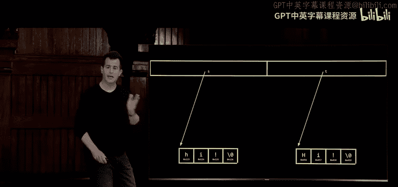

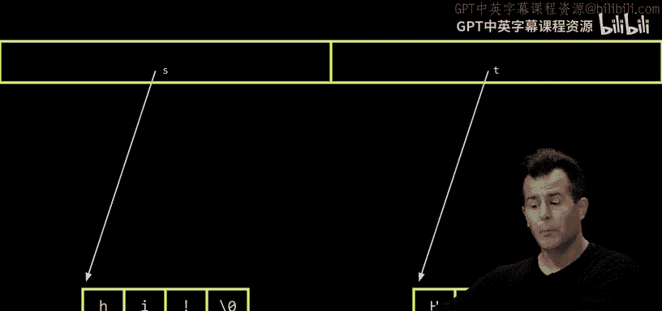

int main(void)
{
    char *s = "HI!";
    // 方法1：使用数组下标
    for (int i = 0; i < strlen(s); i++)
    {
        printf("%c", s[i]);
    }
    printf("\n");

    // 方法2：使用指针算术
    for (int i = 0; i < strlen(s); i++)
    {
        printf("%c", *(s + i));
    }
    printf("\n");
    return 0;
}
```


需要注意的是，对指针加1，实际上是让它指向下一个相同类型数据的内存地址。对于 `char *`，加1移动1个字节；对于 `int *`，加1则可能移动4个字节（取决于系统）。

---

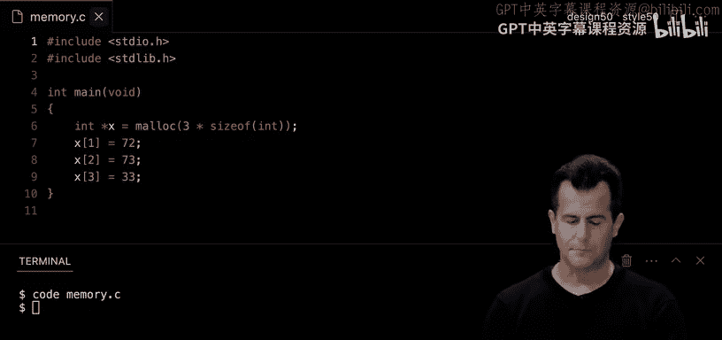

## 内存分配：malloc 和 free 💾

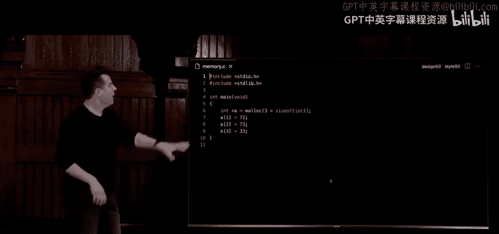

上一节我们学习了如何访问已有的内存。本节中我们来看看如何在程序运行时动态地请求新的内存。

C语言提供了 `malloc` 函数（内存分配）来从堆（heap）区域申请指定大小的内存块。使用完毕后，应使用 `free` 函数释放该内存，防止内存泄漏。

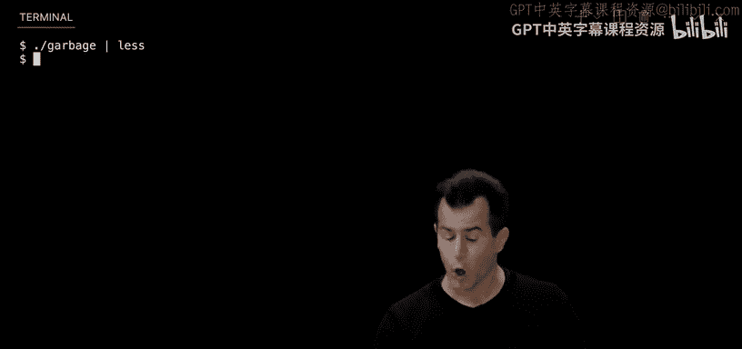

**代码**：动态分配内存来复制字符串
```c
#include <stdio.h>
#include <stdlib.h>
#include <string.h>

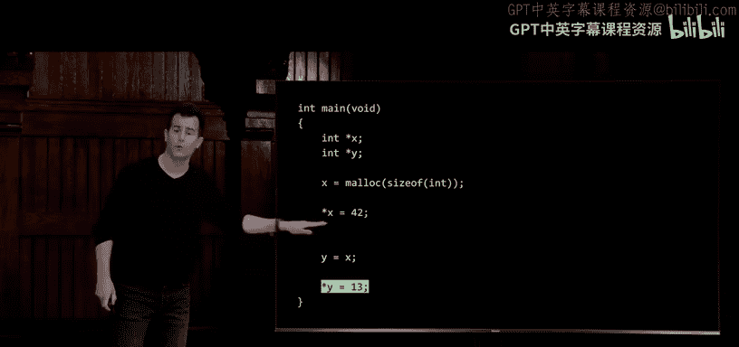


int main(void)
{
    char *src = "Hello";
    // 分配足够的内存来存储 src 的内容（包括终止符 \0）
    char *dst = malloc(strlen(src) + 1);
    if (dst == NULL) // 总是检查 malloc 是否成功
    {
        return 1;
    }

    // 复制字符串
    for (int i = 0; i <= strlen(src); i++) // 注意 <= 以复制 \0
    {
        dst[i] = src[i];
    }
    // 或者使用 strcpy(dst, src);

    printf("源字符串: %s\n", src);
    printf("目标字符串: %s\n", dst);

    free(dst); // 释放分配的内存
    return 0;
}
```


以下是使用动态内存时的关键步骤：
1.  使用 `malloc(size)` 请求内存。
2.  检查返回值是否为 `NULL`（表示失败）。
3.  使用分配的内存。
4.  使用 `free(pointer)` 释放内存。

---

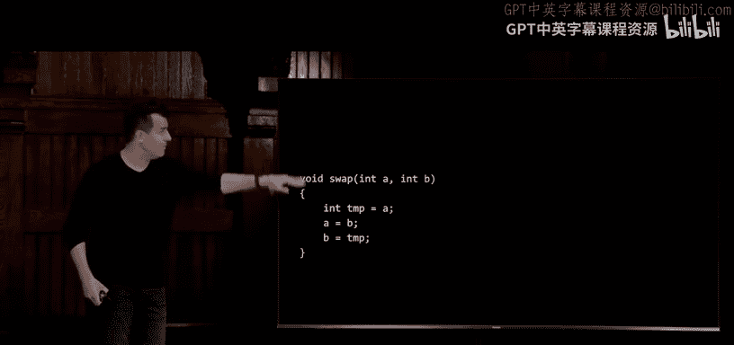

## 内存布局：栈与堆 🥞

上一节我们使用了 `malloc`。本节中我们来看看程序运行时内存是如何组织的。

一个运行中的程序的内存通常被划分为几个区域：
*   **代码区（Text）**：存储程序的机器指令。
*   **全局/静态区（Global/Static）**：存储全局变量和静态变量。
*   **堆区（Heap）**：用于动态内存分配（`malloc`）。向上增长。
*   **栈区（Stack）**：用于函数调用、局部变量。向下增长。


当函数被调用时，它的参数和局部变量被压入栈中，形成一个“栈帧”。函数返回时，其栈帧被弹出。

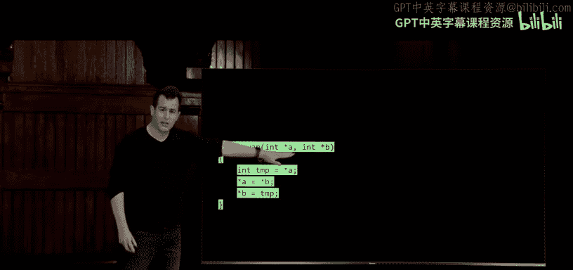

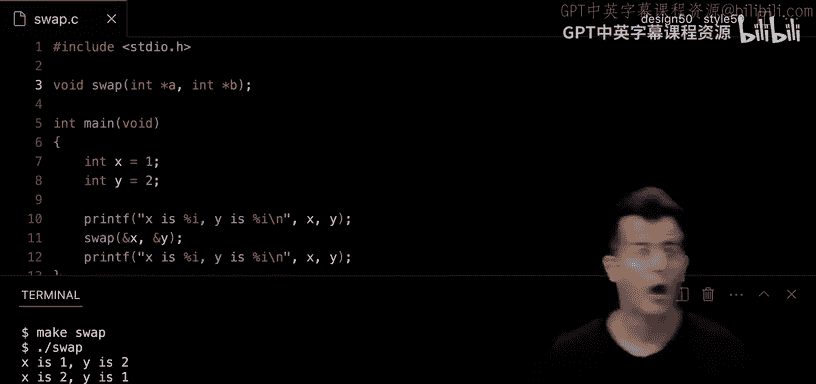


理解栈和堆有助于解释变量作用域和指针传递的行为。例如，将变量的地址（指针）传递给函数，允许该函数修改原始变量（“按引用传递”），而不仅仅是副本（“按值传递”）。


---


## 文件输入/输出 📁


上一节我们深入了解了内存管理。本节中我们来看看如何与磁盘上的文件进行交互。


C语言提供了一系列标准库函数来处理文件，例如 `fopen`, `fclose`, `fprintf`, `fscanf`, `fread`, `fwrite` 等。

**代码**：将数据写入CSV文件
```c
#include <stdio.h>
#include <stdlib.h>

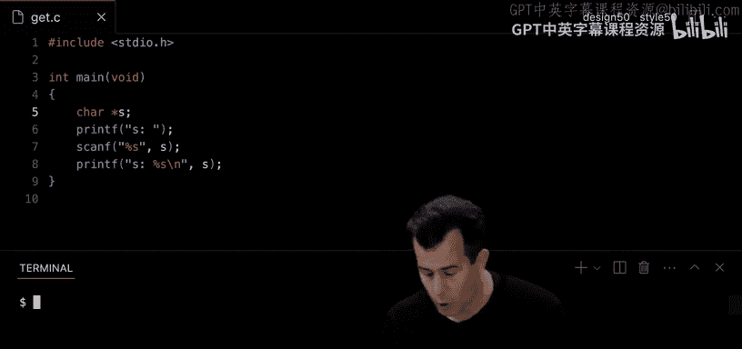

int main(void)
{
    // 以写入模式打开（或创建）文件
    FILE *file = fopen("phonebook.csv", "a");
    if (file == NULL)
    {
        printf("无法打开文件。\n");
        return 1;
    }

    char name[100];
    char number[20];

    printf("姓名: ");
    scanf("%99s", name); // 注意限制输入长度防止缓冲区溢出
    printf("号码: ");
    scanf("%19s", number);

    // 将数据写入文件
    fprintf(file, "%s,%s\n", name, number);

    fclose(file); // 关闭文件
    printf("信息已保存。\n");
    return 0;
}
```

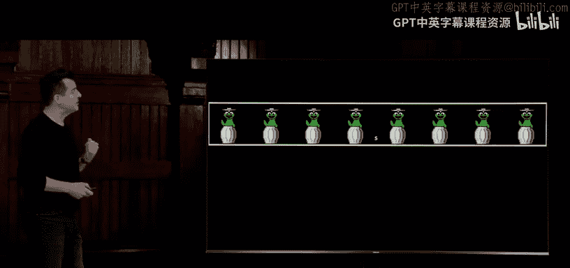

**代码**：复制文件（逐字节）
```c
#include <stdio.h>
#include <stdint.h> // 用于 uint8_t


typedef uint8_t BYTE;

int main(int argc, char *argv[])
{
    if (argc != 3)
    {
        printf("用法: ./cp 源文件 目标文件\n");
        return 1;
    }

    FILE *src = fopen(argv[1], "rb"); // 以二进制读模式打开
    if (src == NULL)
    {
        printf("无法打开源文件。\n");
        return 1;
    }

    FILE *dst = fopen(argv[2], "wb"); // 以二进制写模式打开
    if (dst == NULL)
    {
        fclose(src);
        printf("无法创建目标文件。\n");
        return 1;
    }

    BYTE buffer;
    // 逐字节读取并写入
    while (fread(&buffer, sizeof(BYTE), 1, src) == 1)
    {
        fwrite(&buffer, sizeof(BYTE), 1, dst);
    }

    fclose(src);
    fclose(dst);
    return 0;
}
```

---

## 总结 🎯

本节课中我们一起学习了计算机内存的核心概念。
*   我们认识了**十六进制**，一种表示内存地址的常用系统。
*   我们深入理解了**指针**和**地址**，学会了如何使用 `&` 和 `*` 运算符。
*   我们揭开了**字符串**在C语言中的面纱，它本质上是字符指针。
*   我们掌握了**指针算术**，用于在内存中导航。
*   我们学习了使用 `malloc` 和 `free` 进行**动态内存分配**，并理解了其重要性。
*   我们探讨了程序运行时的**内存布局**（栈和堆）。
*   最后，我们开始了**文件输入/输出**的基础，学会了如何读写文件。


这些概念是理解计算机如何工作以及编写高效、强大程序的基础，并为接下来学习更复杂的数据结构和算法做好了准备。