# 007：数据结构


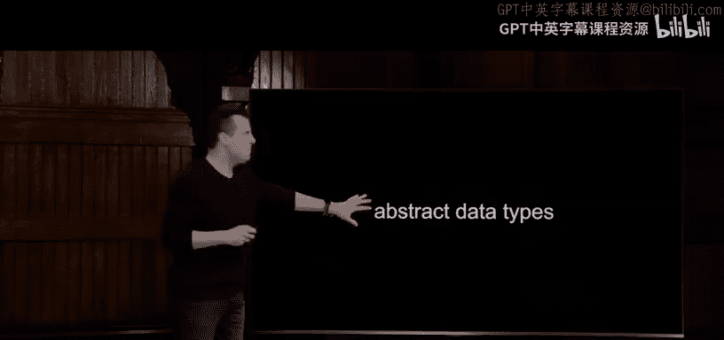


## 概述

在本节课中，我们将要学习数据结构。我们将从回顾数组开始，然后介绍抽象数据类型（如队列和栈），接着深入探讨如何使用指针在内存中构建更复杂的数据结构，例如链表、二叉搜索树、哈希表和字典树。我们将分析每种数据结构的优缺点，特别是它们在时间和空间上的权衡。

---

## 队列与栈：抽象数据类型

上一节我们介绍了数组，它是一种简单但有限的数据结构。本节中我们来看看两种更抽象的、用于组织数据的方式：队列和栈。

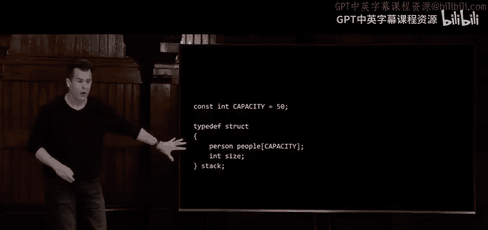

队列是一种“先进先出”（FIFO）的数据类型。就像在电影院排队一样，第一个排队的人会第一个得到服务。


以下是队列的核心操作：
*   **入队 (enqueue)**：将元素添加到队列末尾。
*   **出队 (dequeue)**：从队列前端移除元素。


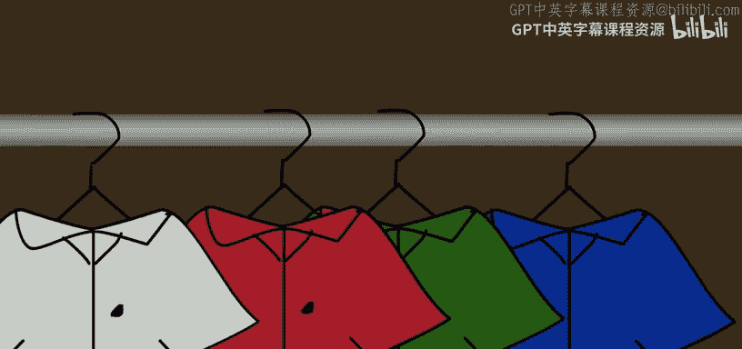

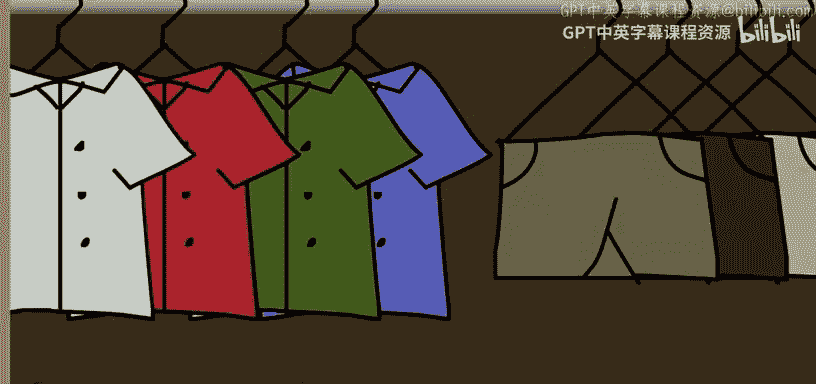


栈则是一种“后进先出”（LIFO）的数据类型。就像一叠盘子或你的电子邮件收件箱，最后放上去的会最先被取走。

以下是栈的核心操作：
*   **压栈 (push)**：将元素添加到栈顶。
*   **弹栈 (pop)**：从栈顶移除元素。

这两种都是抽象数据类型，它们定义了数据的组织方式和操作，但并不规定具体的实现细节。你可以用数组或我们即将学到的其他结构来实现它们。

---

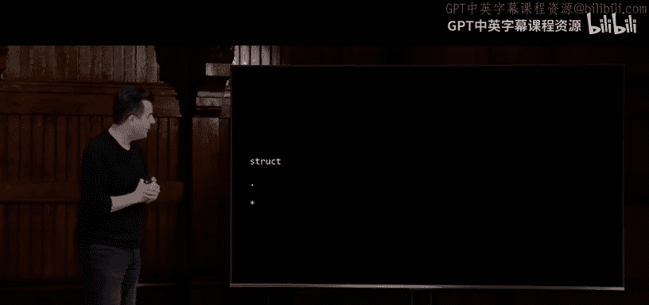

## 数组的局限性：动态调整大小

上一节我们介绍了队列和栈的概念。本节中我们来看看实现这些结构时可能遇到的一个基础问题：数组的固定大小。

数组要求内存空间是连续的。如果你声明了一个大小为3的数组来存储数字1、2、3，但后来需要添加数字4，你可能会遇到问题，因为数组后面的内存可能已被其他数据占用。

解决这个问题的一种方法是：
1.  使用 `malloc` 分配一个更大的新数组（例如，大小为4）。
2.  将旧数组中的所有元素复制到新数组中。
3.  将新元素（数字4）添加到新数组的末尾。
4.  使用 `free` 释放旧数组的内存。
5.  更新指针，使其指向新的数组。

这种方法虽然可行，但有一个明显的缺点：每次需要扩大数组时，你都需要花费 **O(n)** 的时间来复制所有现有元素。这效率很低。

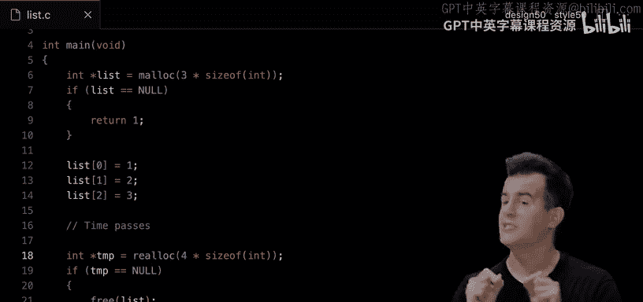

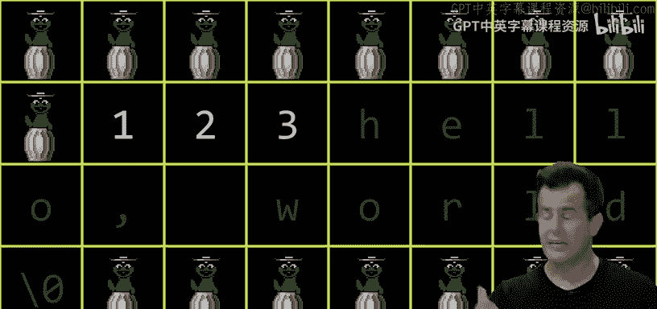

另一种方法是使用C语言提供的 `realloc` 函数。它会尝试在原地调整内存块的大小。如果成功，就无需手动复制数据；如果失败，它会分配一块新的内存并复制数据。但即便如此，底层可能仍然涉及数据移动。


那么，有没有一种数据结构可以让我们高效地添加元素，而无需移动现有数据呢？这就是链表要解决的问题。

---

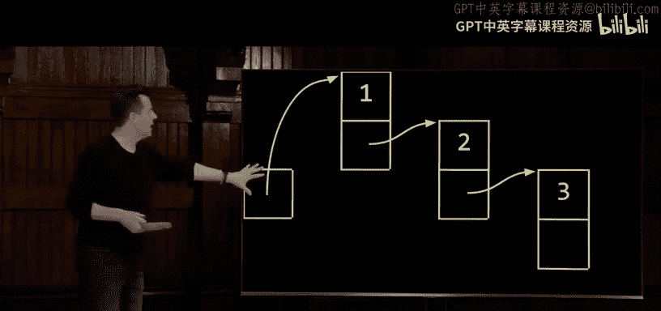

## 链表：使用指针连接数据

上一节我们看到了动态调整数组大小的开销。本节中我们来看看链表，它是一种通过指针将数据元素（称为“节点”）非连续地连接起来的数据结构。

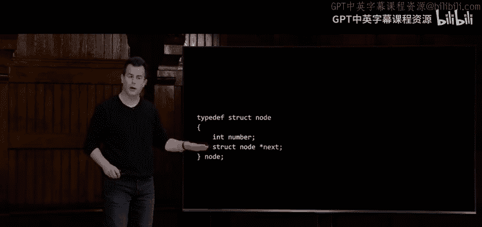

链表的每个节点至少包含两部分：
*   **数据**：例如，一个整数值。
*   **指针**：指向列表中下一个节点的内存地址。

列表的末尾用一个特殊的 `NULL` 指针表示。

**链表节点的C语言结构定义**：
```c
typedef struct node
{
    int number;
    struct node *next;
}
node;
```

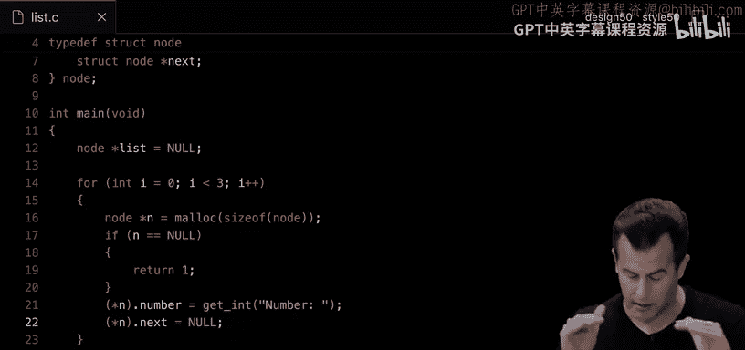

这样，即使节点分散在内存的不同位置，我们也可以通过跟随指针从一个节点访问到下一个节点。添加新节点时，只需将其放在任何空闲内存位置，并调整相关指针将其“链接”到列表中即可，无需移动其他节点。

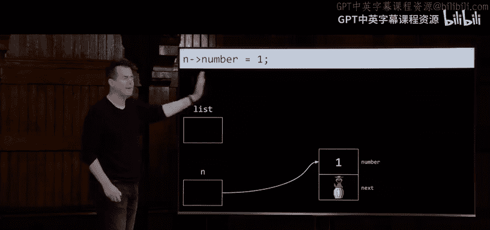

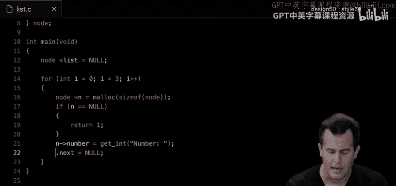

**优点**：
*   可以动态增长和收缩。
*   插入和删除操作（在已知位置）很快。
*   能有效利用零散的内存空间。

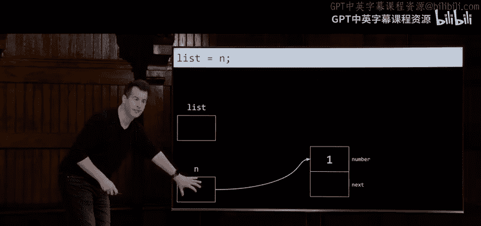

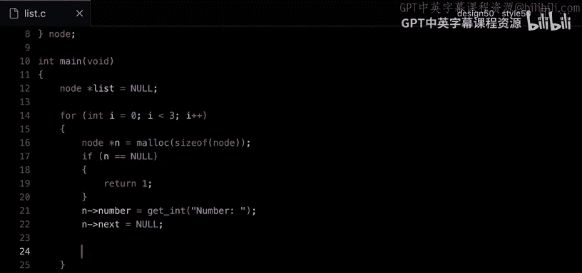

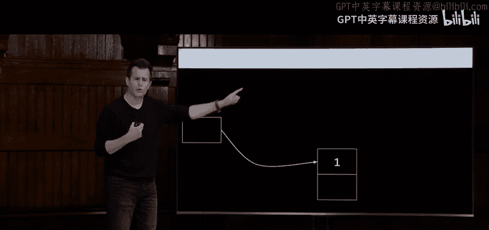

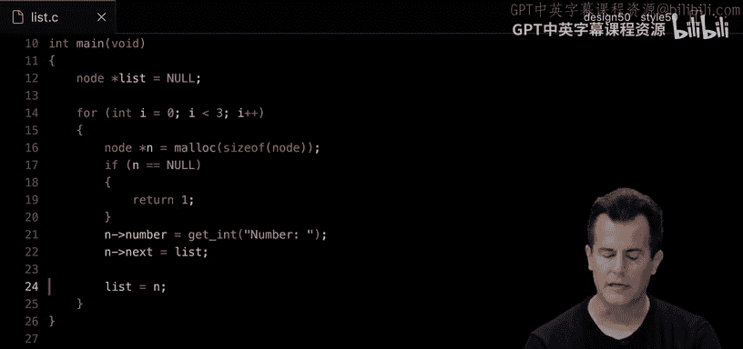

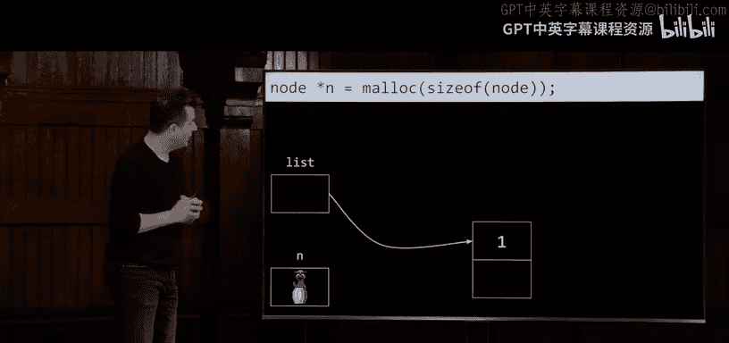

**缺点**：
*   需要额外的内存来存储指针。
*   不能像数组那样通过索引直接访问元素（即“随机访问”），必须从头开始遍历。
*   无法进行二分查找。

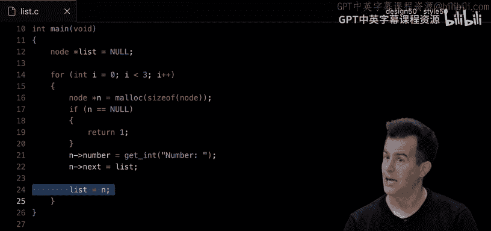

---

## 在代码中实现链表

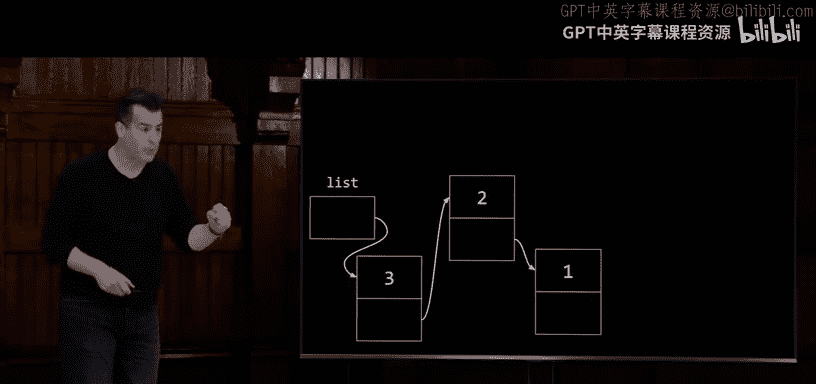

上一节我们介绍了链表的原理。本节中我们来看看如何在C语言中具体实现它，包括创建节点、将节点插入链表（这里以“前插法”为例），以及遍历链表。

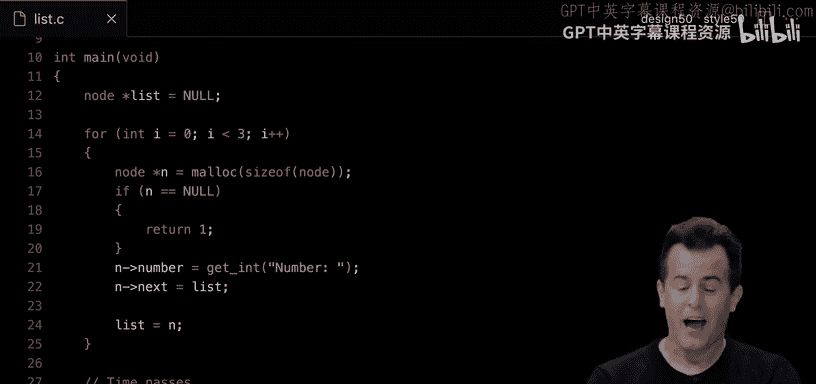

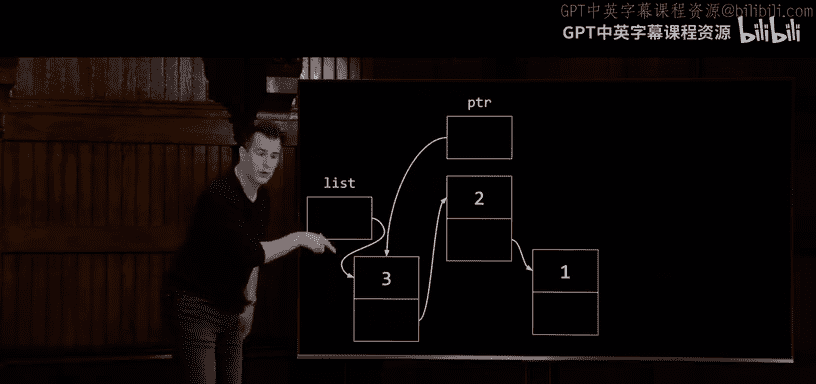

以下是构建一个链表并打印其内容的关键步骤代码：

```c
// 初始化链表头指针
node *list = NULL;

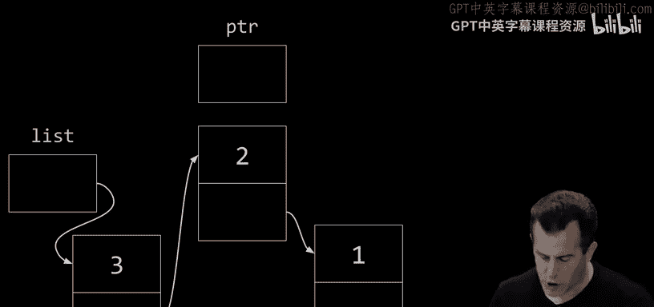

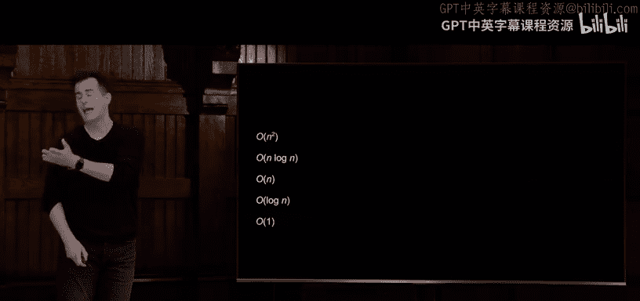

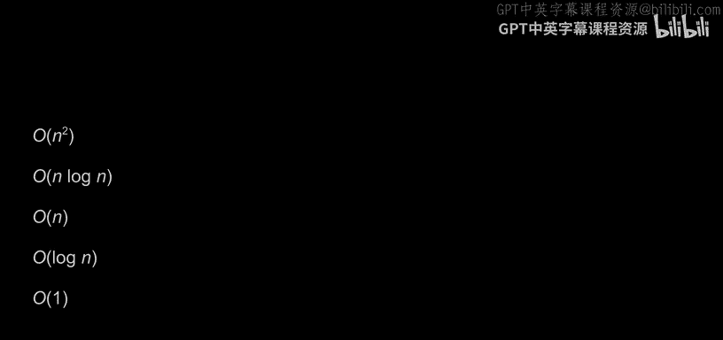

// 循环创建并插入节点（例如，插入3个节点）
for (int i = 0; i < 3; i++)
{
    // 为新节点分配内存
    node *n = malloc(sizeof(node));
    if (n == NULL)
    {
        return 1; // 内存分配失败
    }

    // 初始化新节点
    n->number = get_int("Enter a number: "); // 获取用户输入
    n->next = NULL;

    // 将新节点插入到链表头部（前插法）
    n->next = list; // 新节点指向原链表头
    list = n;       // 更新链表头为新节点
}

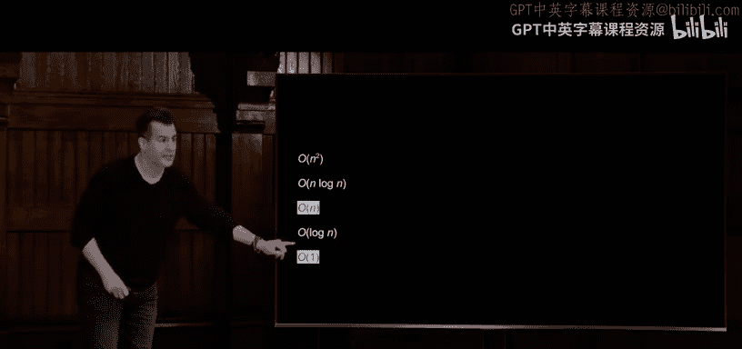

// 遍历并打印链表
for (node *ptr = list; ptr != NULL; ptr = ptr->next)
{
    printf("%i\n", ptr->number);
}

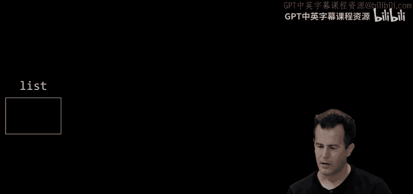

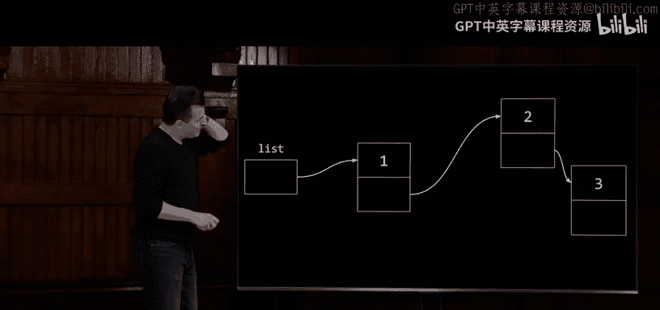

// 释放链表内存（防止内存泄漏）
node *ptr = list;
while (ptr != NULL)
{
    node *next = ptr->next; // 在释放前保存下一个节点的地址
    free(ptr);
    ptr = next;
}
```

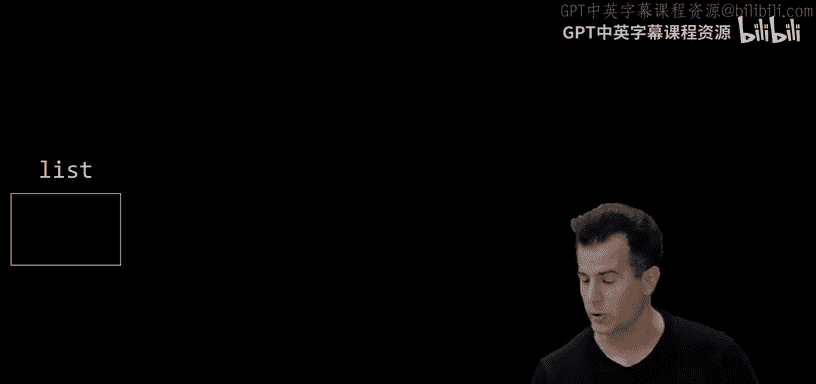

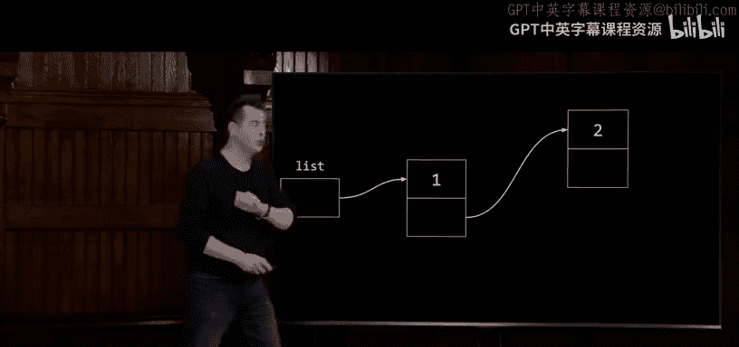

**注意**：上述“前插法”会导致插入的数字顺序与输入顺序相反。如果要保持插入顺序（“尾插法”），代码会更复杂，因为需要遍历到链表尾部，时间复杂度变为 **O(n)**。

---

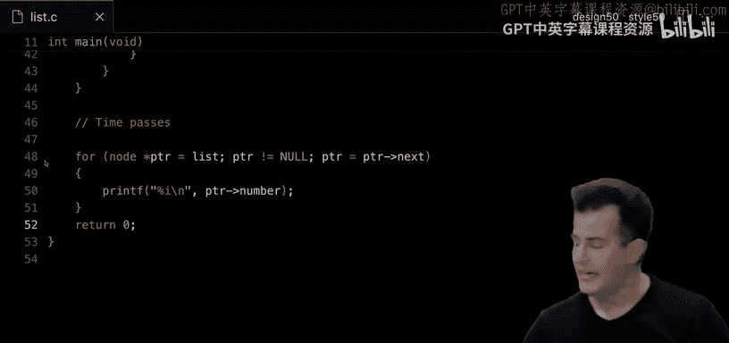

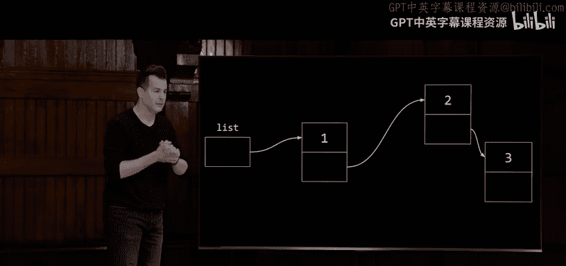

## 二叉搜索树：结合数组与链表的优点

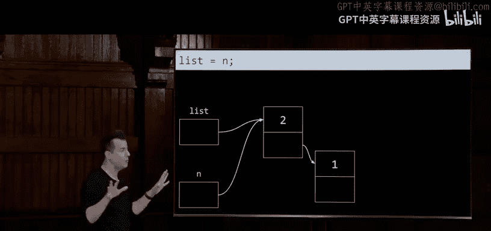

上一节我们实现了链表，但它不支持高效的搜索。本节中我们来看看二叉搜索树，它是一种二维数据结构，能让我们重新获得二分查找的效率。

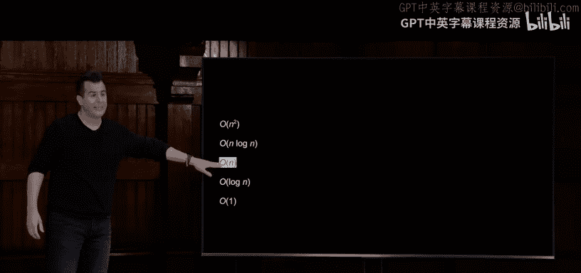

在二叉搜索树中，每个节点包含：
*   一个值。
*   一个指向“左子树”的指针，其中所有节点的值都小于当前节点。
*   一个指向“右子树”的指针，其中所有节点的值都大于当前节点。

**二叉搜索树节点的C语言结构定义**：
```c
typedef struct node
{
    int number;
    struct node *left;
    struct node *right;
}
node;
```

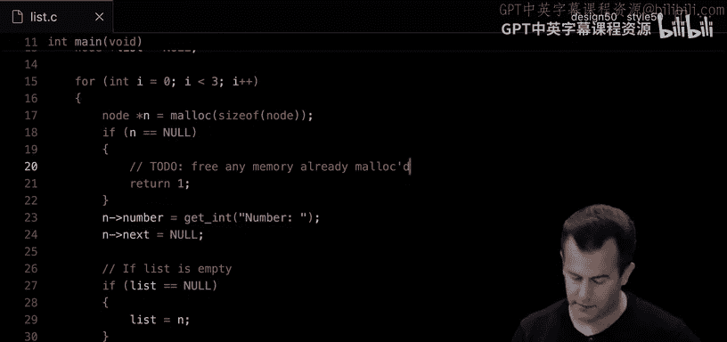

这种结构允许我们进行类似二分查找的操作：从根节点开始，比较目标值与当前节点值，根据比较结果决定进入左子树或右子树，从而每次都将搜索范围减半。

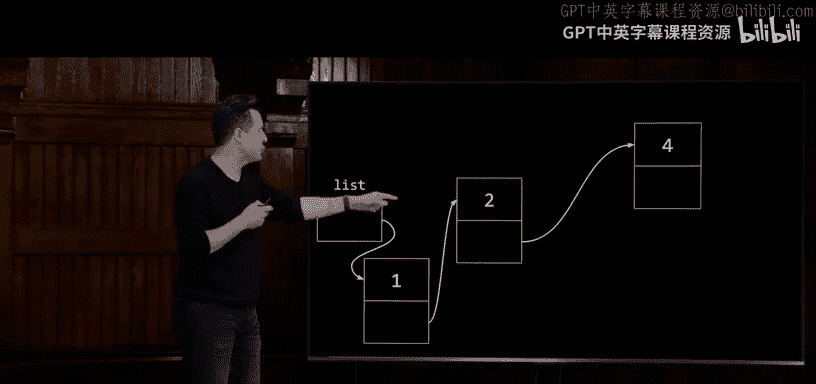

**二叉搜索树的搜索函数（递归实现）**：
```c
bool search(node *tree, int number)
{
    if (tree == NULL)
    {
        return false;
    }
    else if (number < tree->number)
    {
        return search(tree->left, number);
    }
    else if (number > tree->number)
    {
        return search(tree->right, number);
    }
    else
    {
        return true;
    }
}
```

**优点**：
*   在平衡状态下，搜索、插入、删除的时间复杂度为 **O(log n)**。

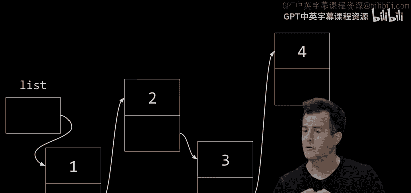

**缺点**：
*   如果插入的数据顺序不当（例如已排序序列），树可能会退化成一条链，时间复杂度降为 **O(n)**。
*   需要维护树的平衡（例如通过旋转操作），这增加了实现复杂度。
*   每个节点需要存储两个指针，内存开销比链表更大。

---

## 哈希表：追求常数时间的访问

上一节我们看到了二叉搜索树在平衡时的优秀性能。本节中我们来看看哈希表，它旨在实现平均情况下接近常数时间的插入和查找操作。

哈希表的核心思想是：
1.  使用一个**哈希函数**，将输入（如字符串键）转换成一个数组索引（哈希值）。
2.  这个数组（称为“桶数组”）的每个位置可以存储一个值，或者（更常见地）存储一个链表的头指针，以解决**哈希冲突**（即不同输入产生相同哈希值的情况）。

**一个简单的哈希函数示例（基于字符串首字母）**：
```c
unsigned int hash(const char *word)
{
    return toupper(word[0]) - 'A';
}
```

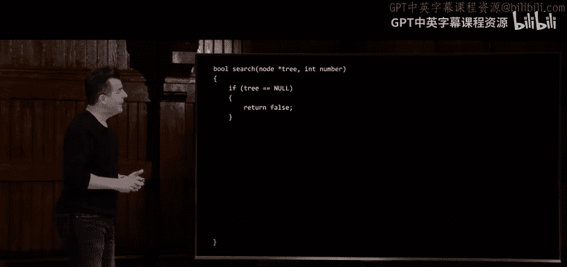

**哈希表的结构（数组+链表）**：
```c
node *table[26]; // 假设有26个桶，对应字母A-Z
```

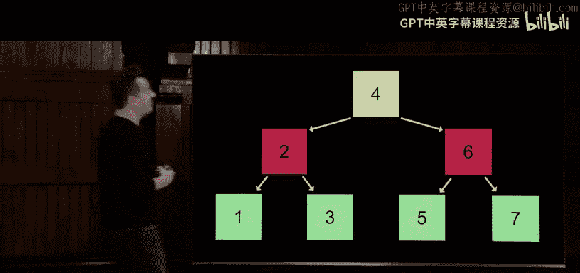

插入“Mario”时，哈希函数 `hash("Mario")` 返回 `'M' - 'A' = 12`，因此我们将包含“Mario”信息的节点插入到 `table[12]` 所指向的链表中。

**优点**：
*   在哈希函数良好、数据分布均匀的情况下，插入和查找的平均时间复杂度接近 **O(1)**。

**缺点**：
*   最坏情况下（所有数据都哈希到同一个桶），时间复杂度退化为 **O(n)**。
*   哈希函数的设计至关重要，设计不当会导致很多冲突。
*   需要预分配桶数组，可能浪费空间。

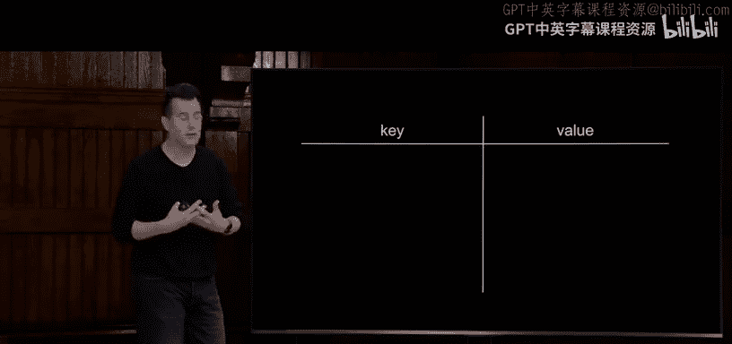

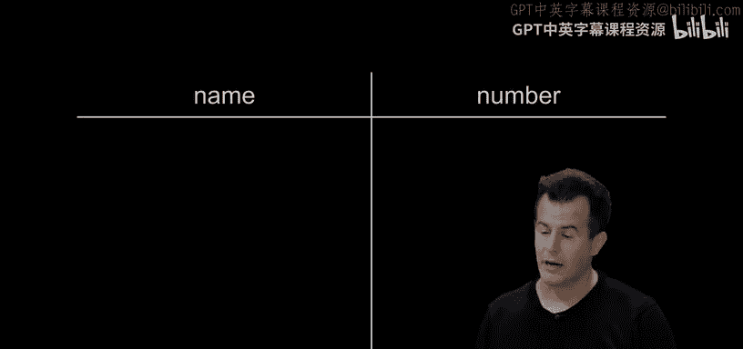

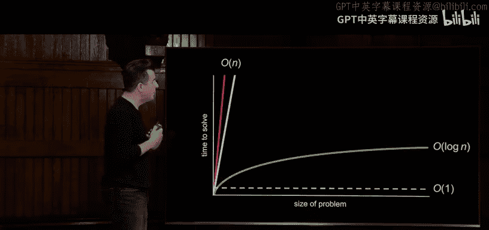

哈希表是空间换时间的典型例子，通过使用更多内存来减少操作时间。

---

## 字典树：真正的常数时间搜索

上一节我们探讨了哈希表如何接近常数时间。本节中我们来看看字典树，它是一种理论上可以实现真正常数时间搜索的数据结构，但代价是巨大的空间消耗。

字典树是一种树形结构，用于存储动态集合或关联数组，其中键通常是字符串。在字典树中，每个节点包含一个指针数组（例如，大小为26，对应英文字母），指向下一层的节点。

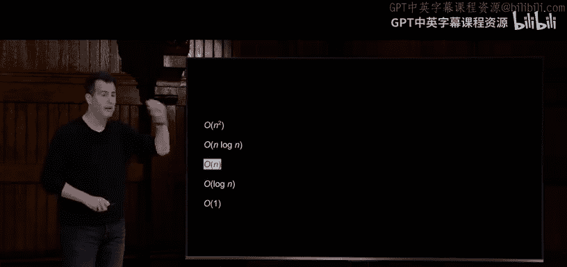

**字典树节点的C语言结构定义**：
```c
typedef struct node
{
    struct node *children[26]; // 26个字母的指针数组
    char *number; // 存储与该节点对应的电话号码（如果此节点是某个名字的结尾）
}
node;
```


例如，插入名字“Toad”：
1.  从根节点开始，根据 `'T'` 找到对应的子节点指针。
2.  进入该节点，根据 `'O'` 找到下一个子节点。
3.  依此类推，经过 `'A'`、`'D'`，最终在 `'D'` 对应的节点中，将 `number` 字段设置为Toad的电话号码。

搜索一个名字所需的时间**只取决于该名字的长度**，而与字典树中已存储的名字总数 **n** 无关。由于名字长度有一个固定的上限（例如50个字符），因此搜索时间是常数 **O(1)**。

**优点**：
*   查找、插入、删除的时间复杂度为 **O(k)**，其中 **k** 是键的长度，与数据规模无关，是真正的常数时间。
*   不会出现哈希冲突。


**缺点**：
*   空间消耗极大。每个节点都需要一个很大的指针数组，即使很多指针是 `NULL`。
*   实现相对复杂。


字典树是**用巨大的空间换取绝对的速度**的极端例子。

---

## 总结

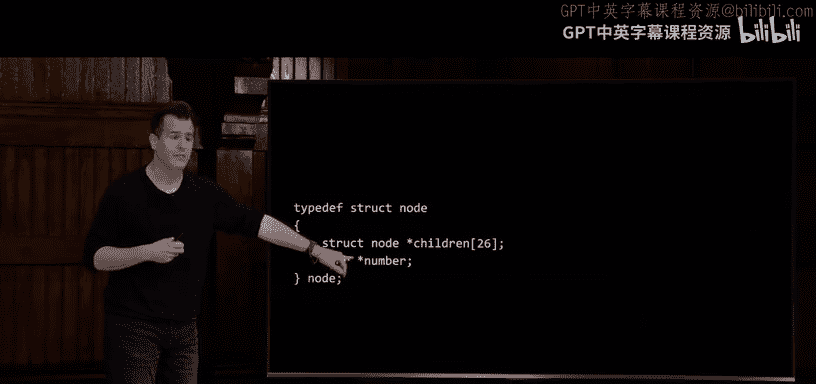

本节课中我们一起学习了多种重要的数据结构。我们从简单的数组出发，认识了队列和栈这两种抽象数据类型。然后，我们深入探讨了如何使用指针在内存中构建更灵活的结构：链表避免了数组调整大小时的数据拷贝；二叉搜索树在保持动态性的同时恢复了二分查找的效率；哈希表通过哈希函数追求平均情况的常数时间操作；字典树则以巨大的空间为代价，实现了真正的常数时间搜索。


每种数据结构都在**时间、空间和代码复杂度**之间做出了不同的权衡。理解这些权衡是选择合适工具来解决特定编程问题的关键。随着课程进展，我们将看到更高级的语言如何帮我们抽象掉这些底层细节，但今天学到的原理将为你的计算思维打下坚实的基础。