# CS50X 计算机科学导论：第6周：Python 🐍


## 概述


在本节课中，我们将从C语言过渡到Python语言。我们将学习Python的基本语法、核心概念，并通过对比C语言来理解Python作为高级语言的优势。我们将涵盖变量、数据类型、条件语句、循环、函数、列表、字典、异常处理以及文件操作等内容，并通过实际例子展示Python如何简化编程任务。

---

## 从C到Python的过渡

上一节我们介绍了Python作为高级语言的优势。本节中，我们来看看如何运行Python程序。

在C语言中，我们需要编译程序然后运行它，例如：
```bash
clang -o hello hello.c
./hello
```
而在Python中，我们只需一步即可运行程序：
```bash
python hello.py
```
这是因为Python是一种解释型语言，而C是编译型语言。Python解释器会逐行读取并执行代码，无需预先编译成机器码。

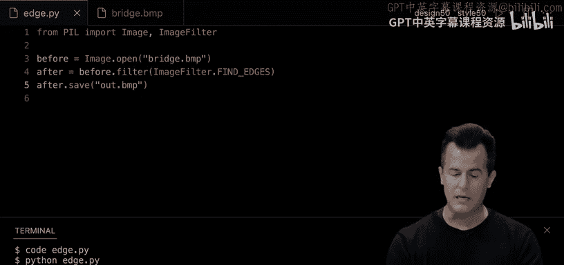

---

## 第一个Python程序：Hello World

以下是实现“Hello World”程序的几种方式。


在C语言中，我们需要多行代码：
```c
#include <stdio.h>

int main(void)
{
    printf("hello, world\n");
}
```
在Python中，只需一行代码：
```python
print("hello, world")
```
以下是Python中实现“Hello World”的几种变体：

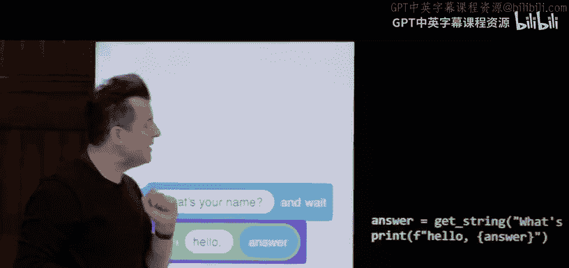

1. **基本打印**：
   ```python
   print("hello, world")
   ```

2. **使用变量和拼接**：
   ```python
   answer = input("What's your name? ")
   print("hello, " + answer)
   ```

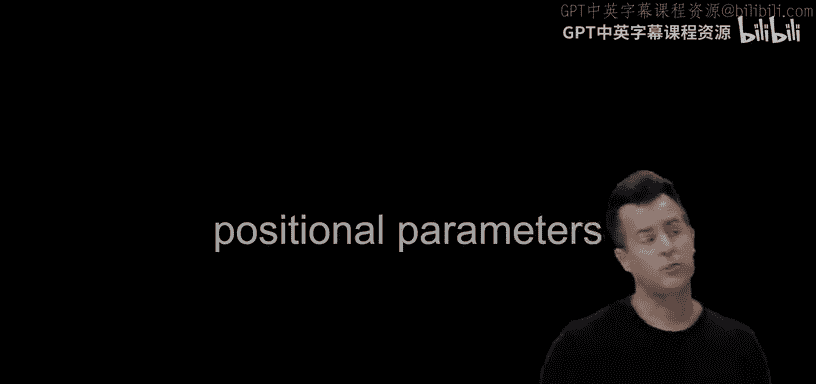

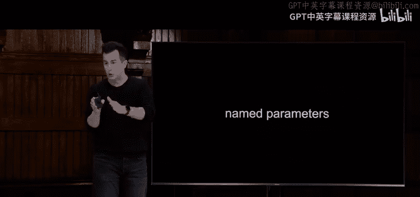

3. **使用逗号分隔参数**：
   ```python
   answer = input("What's your name? ")
   print("hello,", answer)
   ```

4. **使用格式化字符串（f-string）**：
   ```python
   answer = input("What's your name? ")
   print(f"hello, {answer}")
   ```

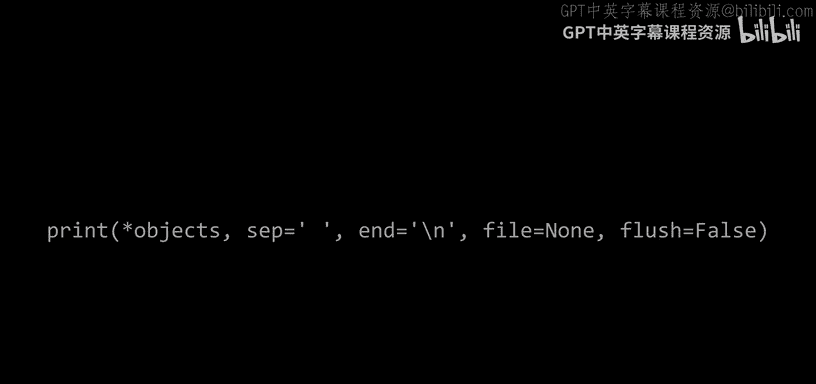

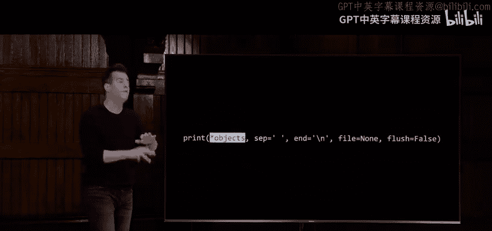

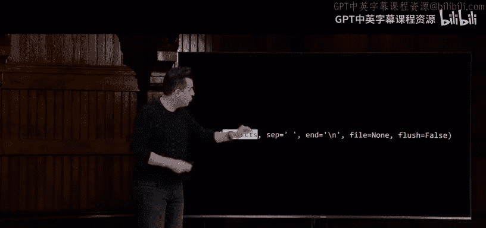

---

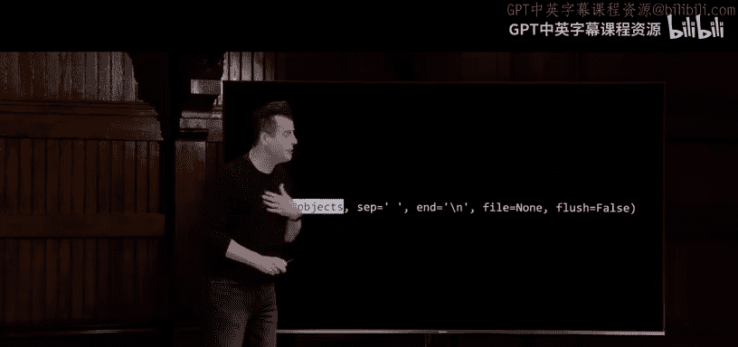

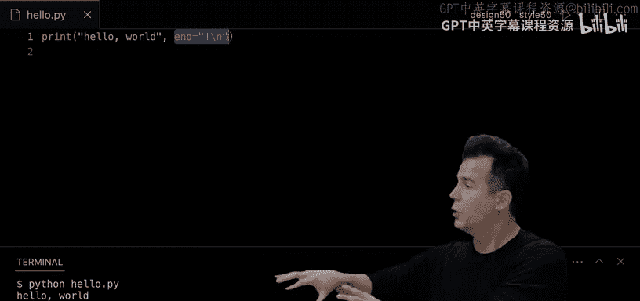

## 变量与数据类型

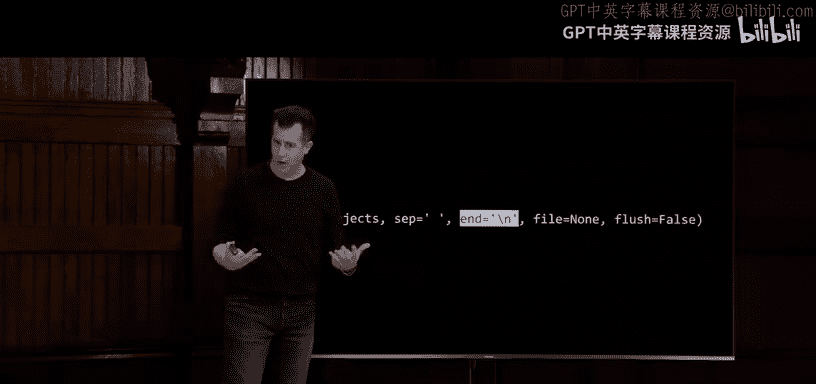

在Python中，变量的类型由解释器自动推断，无需显式声明。


以下是Python支持的基本数据类型：
- **布尔值（bool）**：`True` 或 `False`
- **整数（int）**：例如 `42`
- **浮点数（float）**：例如 `3.14`
- **字符串（str）**：例如 `"hello"`

Python还提供了高级数据结构，如列表、字典、元组和集合，这些结构可以动态调整大小，无需手动管理内存。


---

## 条件语句

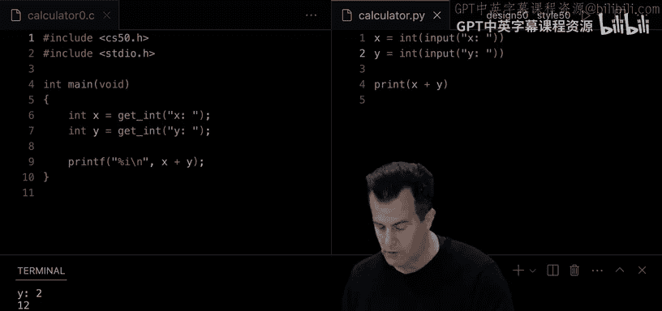


在Python中，条件语句的语法与C类似，但更加简洁。


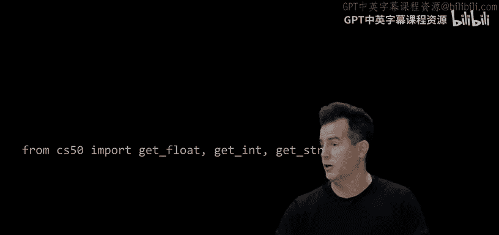

以下是条件语句的示例：

1. **简单条件判断**：
   ```python
   if x < y:
       print("x is less than y")
   ```


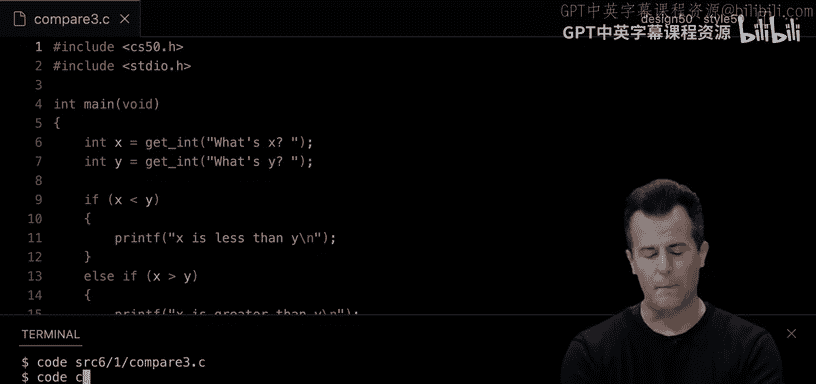

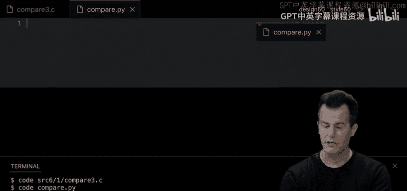

2. **if-else语句**：
   ```python
   if x < y:
       print("x is less than y")
   else:
       print("x is not less than y")
   ```

3. **if-elif-else语句**：
   ```python
   if x < y:
       print("x is less than y")
   elif x > y:
       print("x is greater than y")
   else:
       print("x is equal to y")
   ```

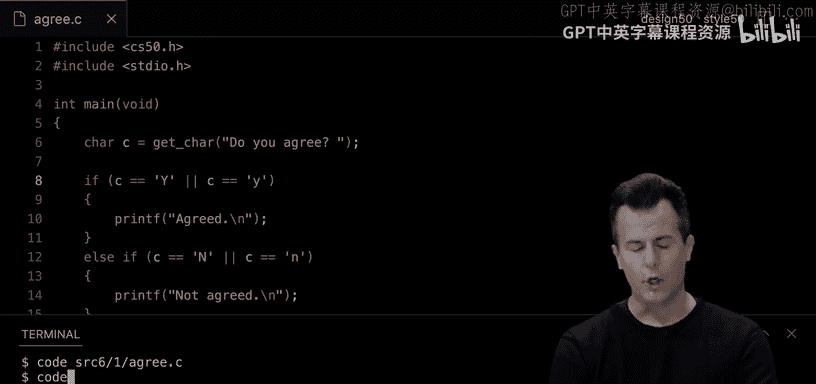

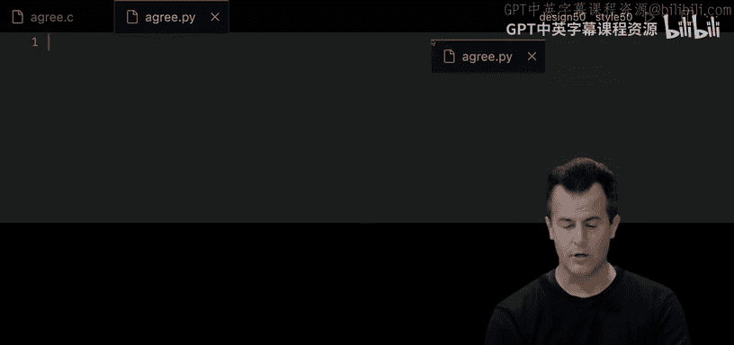

注意：Python使用缩进来表示代码块，而不是花括号。

---

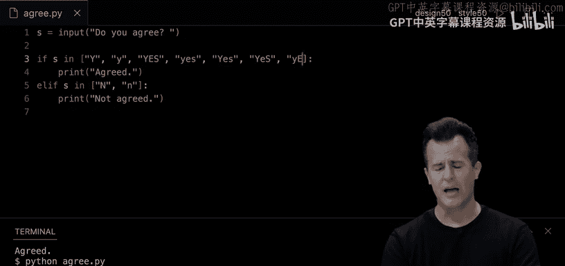

## 循环


Python支持`for`循环和`while`循环，语法更加简洁。

以下是循环的示例：

1. **for循环**：
   ```python
   for i in range(3):
       print("meow")
   ```

2. **while循环**：
   ```python
   i = 0
   while i < 3:
       print("meow")
       i += 1
   ```

3. **无限循环**：
   ```python
   while True:
       print("meow")
   ```

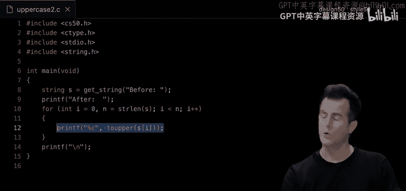


---

## 函数

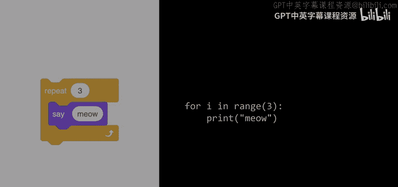

在Python中，函数使用`def`关键字定义。

以下是函数的示例：

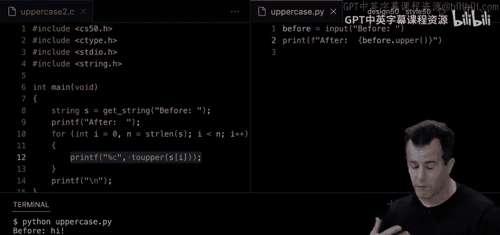


1. **定义函数**：
   ```python
   def meow():
       print("meow")
   ```

2. **带参数的函数**：
   ```python
   def meow(n):
       for i in range(n):
           print("meow")
   ```

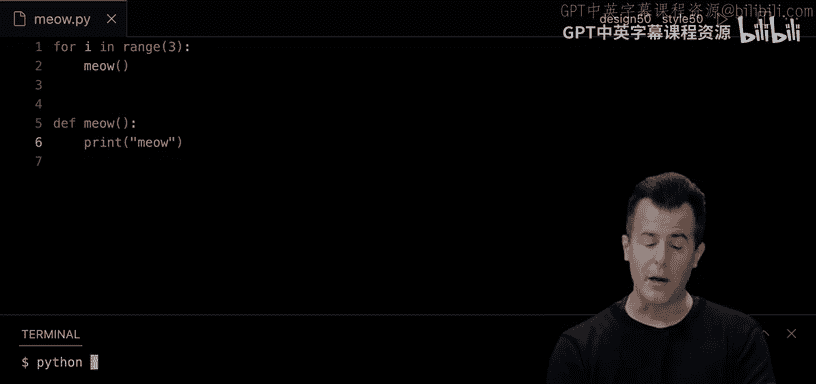

3. **调用函数**：
   ```python
   meow(3)
   ```

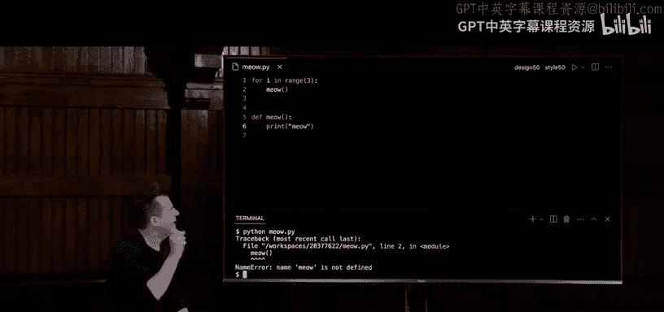

---

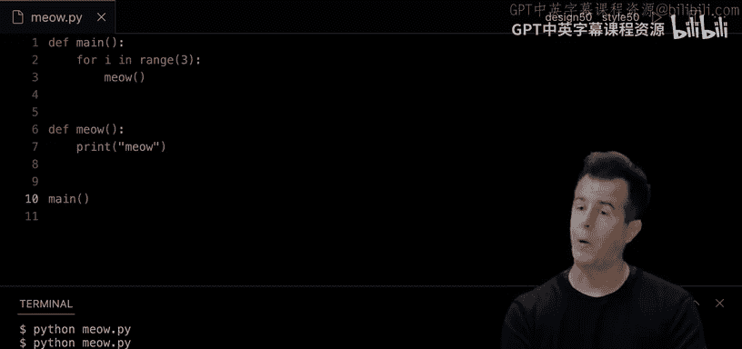

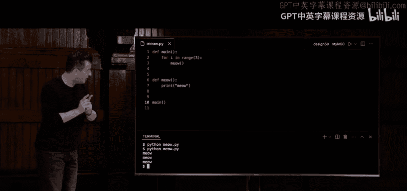

## 列表

列表是Python中常用的数据结构，类似于C中的数组，但可以动态调整大小。

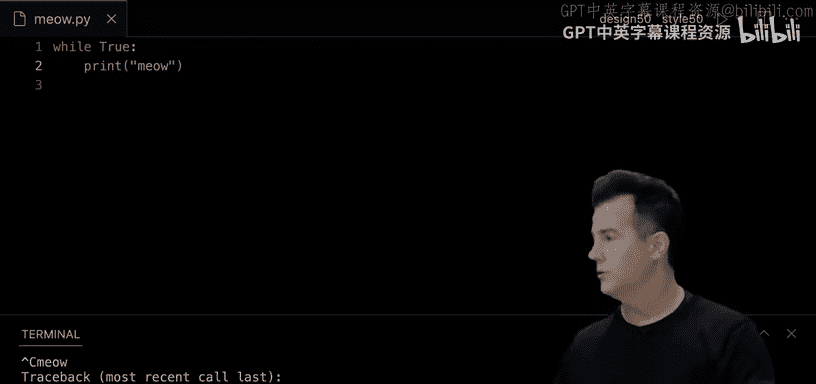

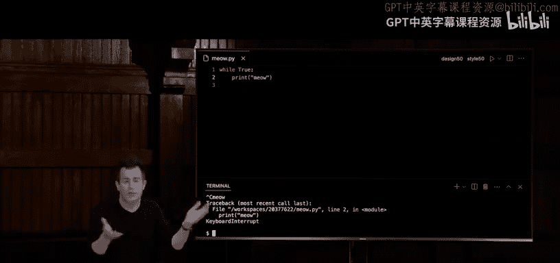

以下是列表的示例：

1. **创建列表**：
   ```python
   scores = [72, 73, 33]
   ```

2. **计算列表平均值**：
   ```python
   average = sum(scores) / len(scores)
   print(f"Average: {average}")
   ```

3. **向列表添加元素**：
   ```python
   scores.append(42)
   ```

---

## 字典

字典是键值对的集合，类似于哈希表。

以下是字典的示例：

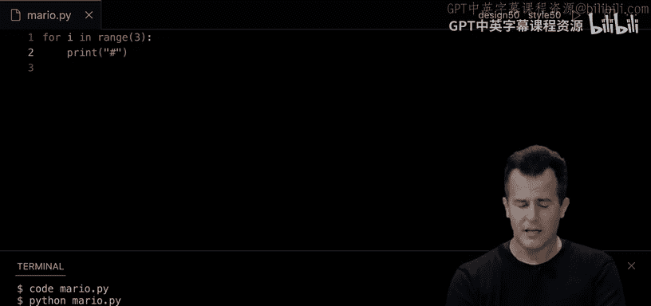


1. **创建字典**：
   ```python
   people = {
       "Julia": "+1-617-495-1000",
       "David": "+1-617-495-1000",
       "John": "+1-949-468-2750"
   }
   ```

2. **查找字典中的值**：
   ```python
   name = input("Name: ")
   if name in people:
       print(f"Number: {people[name]}")
   else:
       print("Not found")
   ```

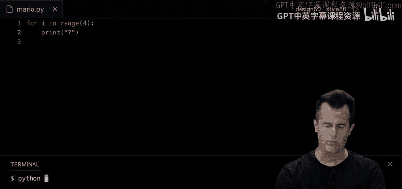


---

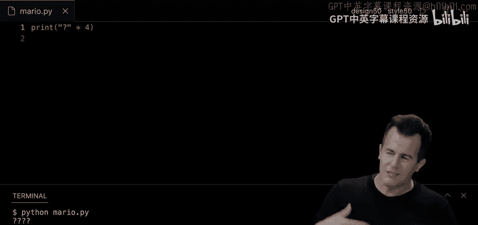


## 异常处理

Python使用异常处理机制来捕获和处理错误。

以下是异常处理的示例：

```python
try:
    x = int(input("x: "))
    y = int(input("y: "))
    print(x / y)
except ValueError:
    print("Invalid input")
except ZeroDivisionError:
    print("Cannot divide by zero")
```

---

## 文件操作

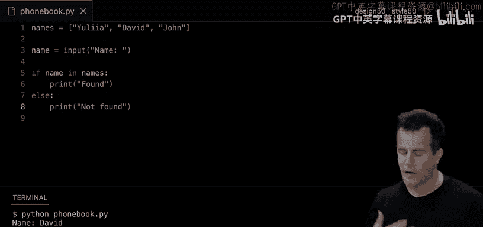


Python提供了简单易用的文件操作功能。

以下是文件操作的示例：

1. **写入CSV文件**：
   ```python
   import csv

   name = input("Name: ")
   number = input("Number: ")

   with open("phonebook.csv", "a") as file:
       writer = csv.writer(file)
       writer.writerow([name, number])
   ```

2. **读取CSV文件**：
   ```python
   import csv

   with open("phonebook.csv", "r") as file:
       reader = csv.reader(file)
       for row in reader:
           print(row)
   ```

---

## 命令行参数

Python通过`sys`模块支持命令行参数。

以下是命令行参数的示例：

```python
import sys

if len(sys.argv) == 2:
    print(f"hello, {sys.argv[1]}")
else:
    print("hello, world")
```

---

## 总结

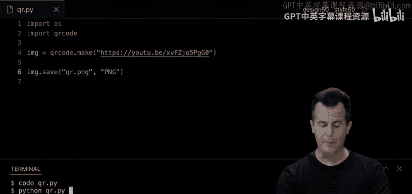


在本节课中，我们一起学习了Python的基本语法和核心概念。通过对比C语言，我们看到了Python作为高级语言的优势，包括更简洁的语法、动态类型、自动内存管理以及丰富的内置数据结构。我们还探讨了条件语句、循环、函数、列表、字典、异常处理和文件操作等主题，并通过实际例子展示了Python如何简化编程任务。希望这些知识能帮助你更好地理解和使用Python，为未来的编程学习打下坚实的基础。