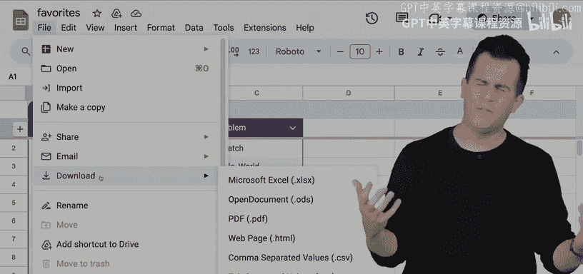
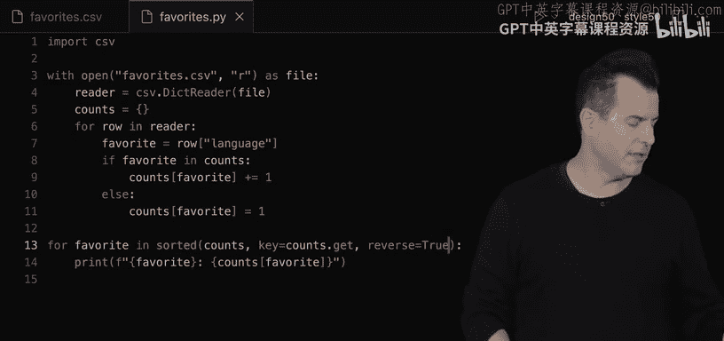
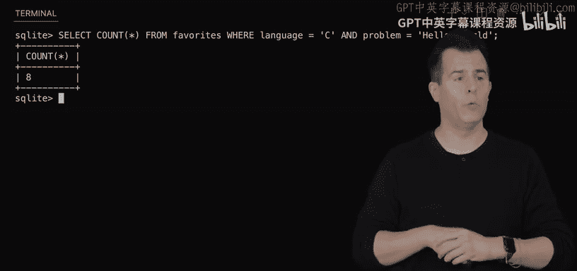
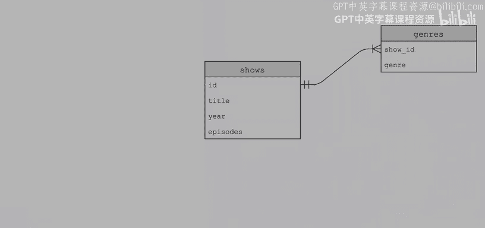
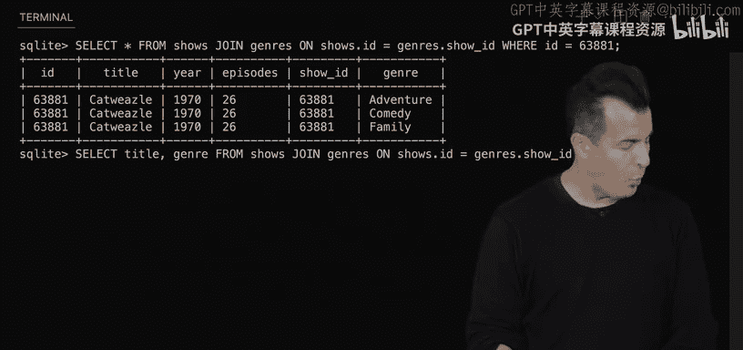
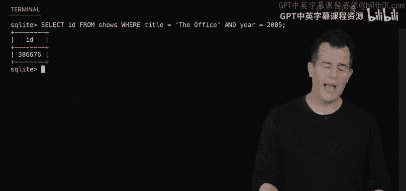
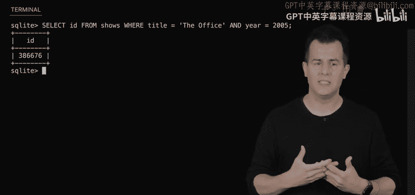
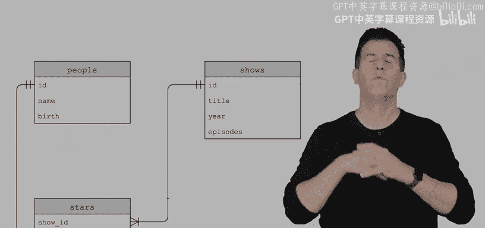
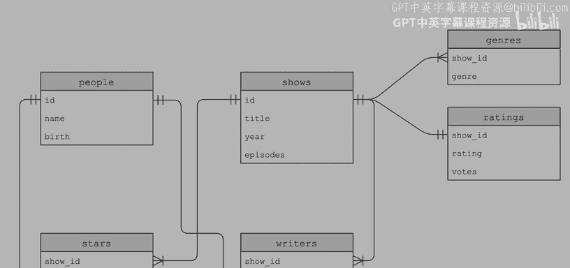
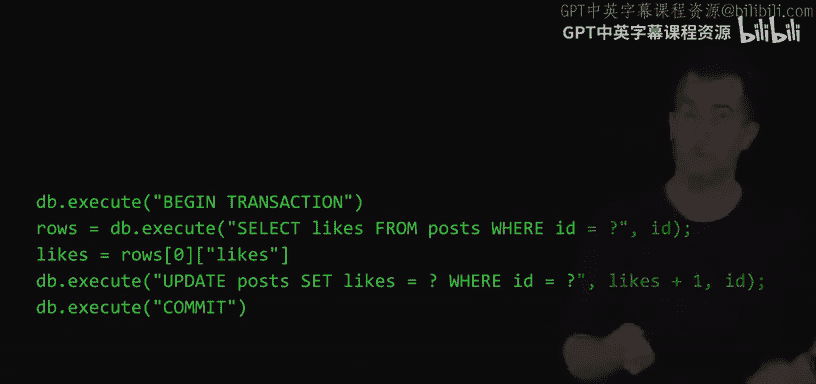

# 010：SQL 🗄️


在本节课中，我们将学习 SQL（结构化查询语言），这是一种专门用于与数据库通信的编程语言。我们将通过从 Python 过渡到 SQL，以新的、不同的方式解决一些问题。虽然 Python 功能多样，但某些计算任务可能并非其理想选择。通过使用 SQL 这种领域特定语言，我们可以用更少的代码行更轻松、更快速地表达意图并完成实际工作。




## 从 CSV 文件到数据库 📊

在深入探讨 SQL 之前，我们需要一些数据来操作。让我们通过一个在线表单收集一些实时数据，这些数据将存储在一个 Google 表格中，并最终导出为 CSV（逗号分隔值）文件格式。

### 什么是 CSV 文件？

CSV 文件是一种简单的平面文件数据库格式，它使用纯文本存储数据。数据按行存储，每行代表一条记录，而列则由逗号分隔。

**示例 CSV 格式：**
```
timestamp,language,problem
2023-10-26 10:00:00,Python,Hello World
2023-10-26 10:01:00,C,Mario
```

在 CSV 文件中，第一行通常是标题行，描述了后续每列数据的含义。如果数据值本身包含逗号，则需要用双引号将整个值括起来，以避免歧义。

## 使用 Python 处理 CSV 数据 🐍

首先，我们使用 Python 来读取和分析 CSV 文件中的数据。以下是使用 Python 的 `csv` 模块读取文件并统计每种编程语言受欢迎程度的步骤。

### 步骤 1：导入 CSV 模块并打开文件

我们使用 Python 内置的 `csv` 模块来简化文件读取过程。

```python
import csv

with open("favorites.csv", "r") as file:
    reader = csv.reader(file)
    for row in reader:
        print(row[1])  # 打印第二列（喜欢的语言）
```




### 步骤 2：跳过标题行

由于 CSV 文件的第一行是标题，我们需要跳过它，以避免将其误认为数据。

```python
import csv

with open("favorites.csv", "r") as file:
    reader = csv.reader(file)
    next(reader)  # 跳过标题行
    for row in reader:
        print(row[1])
```

### 步骤 3：使用字典读取器

为了更灵活地处理数据，我们可以使用 `csv.DictReader`，它会将每一行作为字典返回，其中键是列标题。

```python
import csv

with open("favorites.csv", "r") as file:
    reader = csv.DictReader(file)
    for row in reader:
        print(row["language"])
```

### 步骤 4：统计每种语言的受欢迎程度





接下来，我们统计每种编程语言被选择的次数。

```python
import csv

with open("favorites.csv", "r") as file:
    reader = csv.DictReader(file)
    counts = {}
    for row in reader:
        favorite = row["language"]
        if favorite in counts:
            counts[favorite] += 1
        else:
            counts[favorite] = 1

for favorite in sorted(counts, key=counts.get, reverse=True):
    print(f"{favorite}: {counts[favorite]}")
```

通过以上代码，我们可以得到每种语言的受欢迎程度排序。然而，尽管 Python 功能强大，但处理这类简单统计任务时代码量仍然较多。这正是 SQL 可以大显身手的地方。


## 引入 SQL：结构化查询语言 🗃️


SQL 是一种专门用于管理数据库的编程语言。它支持四种基本操作，通常简称为 CRUD：
- **C**reate（创建）
- **R**ead（读取）
- **U**pdate（更新）
- **D**elete（删除）

在 SQL 中，数据存储在**表**中，表由行和列组成，类似于电子表格中的工作表。

### 使用 SQLite 创建数据库

SQLite 是一个轻量级的 SQL 数据库，非常适合学习和原型开发。我们可以通过命令行工具 `sqlite3` 来创建和管理数据库。


**创建数据库并导入 CSV 文件：**
```bash
sqlite3 favorites.db
.mode csv
.import favorites.csv favorites
```

### 基本 SQL 查询

一旦数据导入数据库，我们就可以使用 SQL 查询来分析和操作数据。


**查询所有数据：**
```sql
SELECT * FROM favorites;
```


**查询特定列：**
```sql
SELECT language FROM favorites;
```

**使用条件过滤数据：**
```sql
SELECT COUNT(*) FROM favorites WHERE language = 'C';
```


**分组和排序数据：**
```sql
SELECT language, COUNT(*) AS n FROM favorites GROUP BY language ORDER BY n DESC;
```

通过以上 SQL 查询，我们可以用一行代码完成之前需要多行 Python 代码才能完成的任务，大大提高了效率和可读性。

## 数据库设计与关系 🧩

在现实世界的应用中，数据通常存储在多个表中，并通过关系连接起来。常见的表关系类型包括：
- **一对一关系**
- **一对多关系**
- **多对多关系**

### 示例：电影数据库

以 IMDb（互联网电影数据库）为例，数据可能存储在多个表中，例如 `shows`、`ratings`、`genres`、`people` 和 `stars`。这些表通过主键和外键相互关联。


**主键**是表中唯一标识每一行的列。
**外键**是另一个表中引用的主键，用于建立表之间的关系。




### 使用 JOIN 连接表

SQL 的 `JOIN` 关键字允许我们将多个表的数据连接在一起，以便进行复杂查询。

**查询某部电视剧的所有演员：**
```sql
SELECT name FROM people
WHERE id IN (
    SELECT person_id FROM stars
    WHERE show_id = (
        SELECT id FROM shows
        WHERE title = 'The Office' AND year = 2005
    )
);
```




**使用 JOIN 简化查询：**
```sql
SELECT title FROM shows
JOIN stars ON shows.id = stars.show_id
JOIN people ON stars.person_id = people.id
WHERE people.name = 'Steve Carell';
```








## 索引与性能优化 ⚡

随着数据量的增长，查询性能可能成为问题。SQL 允许我们创建**索引**来加速查询。索引是一种数据结构（通常是 B 树），可以快速定位数据。


**创建索引：**
```sql
CREATE INDEX title_index ON shows (title);
```




创建索引后，查询速度会显著提升，但代价是插入、更新和删除操作可能会变慢，因为索引需要维护。

## 在 Python 中使用 SQL 🐍🗃️

在实际应用中，我们经常需要在 Python 程序中执行 SQL 查询。CS50 库提供了便捷的方法来实现这一点。

**示例：查询用户喜欢的语言数量：**
```python
from cs50 import SQL

db = SQL("sqlite:///favorites.db")
favorite = input("Favorite: ")
rows = db.execute("SELECT COUNT(*) AS n FROM favorites WHERE language = ?", favorite)
row = rows[0]
print(row["n"])
```

使用参数化查询（`?` 作为占位符）可以防止 SQL 注入攻击，确保程序的安全性。

## SQL 注入攻击与防御 🛡️

SQL 注入是一种常见的安全漏洞，攻击者通过在用户输入中插入恶意 SQL 代码来操纵数据库查询。

**示例攻击：**
假设登录查询如下：
```sql
SELECT * FROM users WHERE username = '{username}' AND password = '{password}'
```
如果用户输入 `admin' --` 作为用户名，查询将变为：
```sql
SELECT * FROM users WHERE username = 'admin' --' AND password = '{password}'
```
`--` 是 SQL 中的注释符号，因此密码检查被忽略，攻击者可能无需密码即可登录。



**防御方法：**
始终使用参数化查询，避免直接拼接用户输入到 SQL 语句中。


## 总结 📝

本节课我们一起学习了 SQL 的基本概念和操作。我们从 CSV 文件开始，使用 Python 进行数据分析，然后引入了 SQL 作为更高效的数据查询语言。我们探讨了数据库设计中的表关系，学习了如何使用 `JOIN` 连接多个表，并通过创建索引优化查询性能。最后，我们了解了 SQL 注入攻击及其防御方法，并学习了如何在 Python 程序中安全地执行 SQL 查询。


SQL 是一个强大的工具，掌握它将帮助你在处理数据时更加得心应手。在接下来的课程和问题集中，你将有机会进一步应用这些知识解决更复杂的问题。