# 013：课程总结与展望 🎓

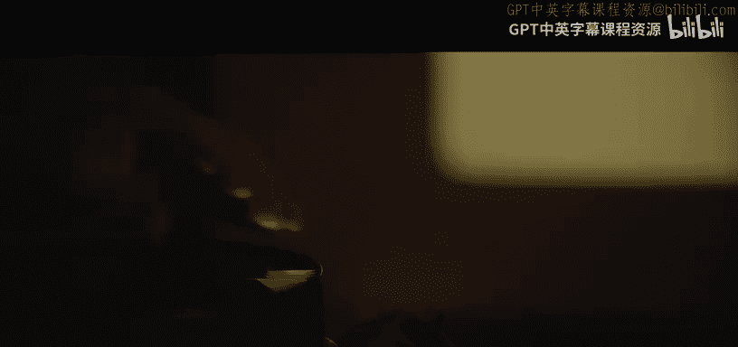

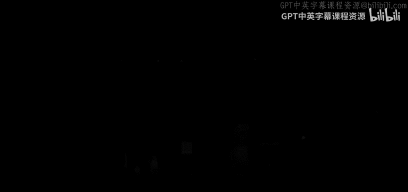

在本节课中，我们将一起回顾整个CS50课程的学习历程，通过互动游戏重温核心概念，并展望课程结束后如何继续你的计算机科学之旅。

## 课程回顾与起点

回想一下，我们是以一张“从消防水管喝水”的图片开始这门课程的。这形象地比喻了每周学习大量新知识的感受。但请意识到，每周的学习都在你身后积累了更多的内容和技能。如果你回想大约十周前，像“马里奥”这样的问题曾让你感到困难，这恰恰衡量了你已经走了多远。我们每周都会引入新的、更深入的内容，构建在之前的知识之上。即使有时感觉没有完全站稳脚跟，但事实上你已经取得了很大进步。

最终项目的目标之一，就是让你确信你不再需要我们。你不再需要一个具体的作业任务；现在，你只需要朋友、同事、谷歌、ChatGPT等工具，凭借你已掌握的概念基础和实用技能，去自学新事物。

在这门课中，真正重要的不是你相对于同学的位置，而是你相对于课程开始时的自己所处的位置。这就是你应该用来衡量过去一学期成就的“增量”。

## 互动游戏：编程与精确性 🎨

为了测试我们对“精确性”和“正确性”这两个核心原则的理解，我们进行了一个互动游戏。

### 游戏一：绘制立方体

首先，我们邀请志愿者乔丹上台，让他通过口头指令，指导观众在纸上绘制一个特定的立方体图案。乔丹只能看到屏幕上的目标图案。

**以下是乔丹给出的指令：**
*   想象一个立方体，我们正从三个面观察它。
*   立方体的中心是所有线条相交的地方。
*   我们有三个类似菱形的形状连接在一起形成一个立方体。
*   首先画一个六边形。
*   在六边形内部，画一个连接顶部、左部、右部和中心底部的“Y”形。

然而，根据这些抽象指令，观众画出的结果五花八门。这说明了**抽象层级**的重要性。从最高层级的“画一个立方体”开始，信息量不足。逐步降低抽象层级，例如具体说明笔的起始位置和线条方向（“从页面中心点，向左画一条线…”），才能更精确地传达意图。最终，我们展示了目标图案——一个简单的立方体线框图。

这个游戏展示了编程中精确描述步骤的重要性。

### 游戏二：绘制火柴人

接着，我们互换了角色。志愿者维安上台，背对屏幕。这次由观众通过喊出指令来“编程”，指导维安在白板上绘制一个火柴人图案。

**以下是观众给出的指令：**
*   在中间画一个圆。
*   从圆的底部画一个倒置的“Y”。
*   给圆画上手臂。
*   在圆旁边写上“Hi”。

维安出色地完成了任务，画出的火柴人非常接近目标。但我们也注意到，像“圆在说Hi”这样的指令不够精确，应该指定文字的具体位置（如左上角）。一旦我们解决了如何绘制一个基本火柴人的问题，就可以将其**抽象**为一个函数，未来通过参数来控制其角度、大小和文字等。

这再次强调了抽象的能力：首先在较低层级解决具体问题，然后所有人可以在此基础上反复构建，避免重复解决完全相同的问题。

## 学期知识旅程回顾 🧭

现在，让我们回顾一下这学期我们探索的广阔领域：

1.  **第0周：Scratch** 🐱
    我们从Scratch这个图形化编程语言开始，通过拖放积木块引入了**函数、参数、返回值、条件语句、循环和变量**等基本概念。这为我们提供了一个舒适的环境来实验这些思想。

2.  **第1周及以后：C语言**
    我们迅速进入了C语言，看到了更传统的语法。虽然充满了括号、分号和引号等“干扰”，但核心思想与Scratch相同。编程的智力趣味不在于这些语法细节，而在于解决问题。

3.  **内存与算法**
    我们探索了如何在内存中解决问题。**数组**是第一种在内存中存储信息的方式。接着，我们退一步关注**算法**——解决问题的逐步指令，如搜索和排序。这些简单版本的问题在当今的谷歌、微软和ChatGPT中无处不在。

4.  **底层探索**
    我们在最底层讨论了**内存和指针**。请放心，在几乎所有后续编程语言中，你都是在这些思想之上构建，而非深入底层。

5.  **数据结构**
    数据结构是计算机科学的重要特征。**树、字典树、哈希表**等结构只存在于内存和我们的思维中，但通过画图，它们变得生动，并能更高效地解决问题。

6.  **高级语言与Web**
    **Python**在很多情况下比C语言更有用。**SQL**让我们接触了**声明式编程**，你只需说明想要什么数据，而不必关心如何获取。最后是**Web**：HTML、CSS，再加上一些JavaScript。这些构成了我们日常使用的绝大多数应用程序的基础。在JavaScript中，我们再次重温了函数、条件语句和循环。

编程世界远不止于此，还有**函数式编程、面向对象编程**等。CS50主要关注**过程式编程**。课程以Flask结束，不是为了教授某个特定的库或框架，而是让你在一个简单的环境中，探索所有这些思想的融合，为你最后的习题集和最终项目做准备。

## 最终项目与未来活动 🚀

现在，我们来到了第10周。最终项目是一个机会，让你运用新获得的编程和计算机科学知识，构建对你重要或感兴趣的东西，而不是按照既定的规范行事。你会发现这很有挑战性，需要频繁使用谷歌和ChatGPT——在这个阶段，这是受欢迎且被鼓励的，因为编程很大程度上就是学习新事物。

**项目的口号是**：构建你感兴趣的东西，解决一个实际问题，影响校园或改变世界。最终目标是创造出比这门课程寿命更长的东西。

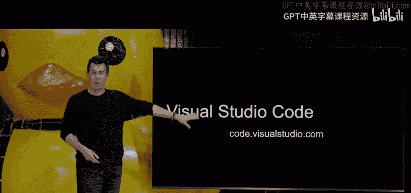

为了帮助你，我们有以下传统活动：

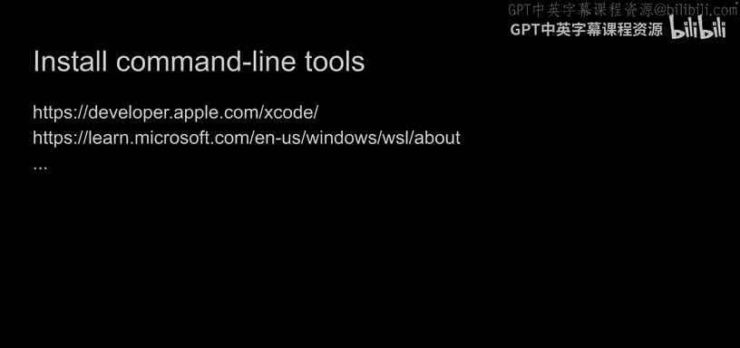

*   **CS50 Hackathon**：本周晚些时候开始，持续通宵。这是一个与同学、工作人员和朋友协作、共同解决问题的难忘经历。将有晚餐、凌晨点心，甚至清晨的煎饼之旅。
*   **CS50 Fair**：感恩节假期后举行。这是一个向同学、教职工展示你最终项目成果的盛会，现场会有气球、音乐和食物。

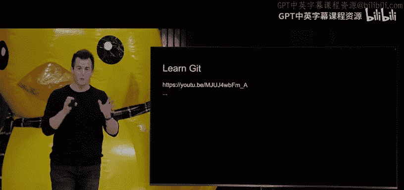

完成课程后，你还将收到一件“我上了CS50”的T恤。

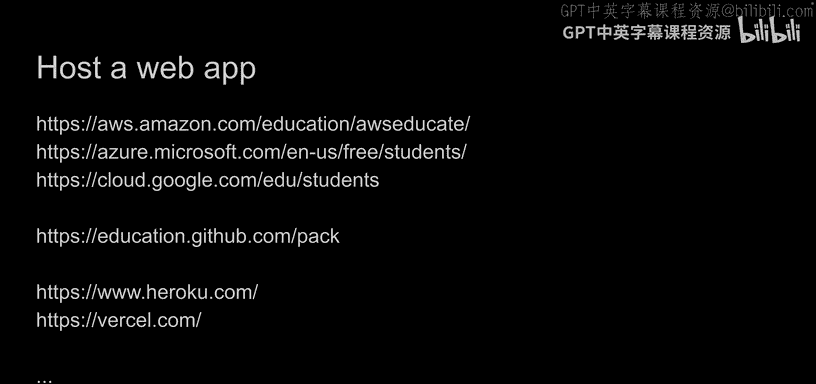

## 互动游戏二：CS50猜词游戏 🎭

接下来，我们进行了第二个游戏：CS50猜词游戏。两队志愿者轮流表演与CS50相关的术语（如“搜索算法”、“哈希表”、“迭代”），由队友猜测。游戏充满乐趣，也考验了大家对课程术语的熟悉程度。

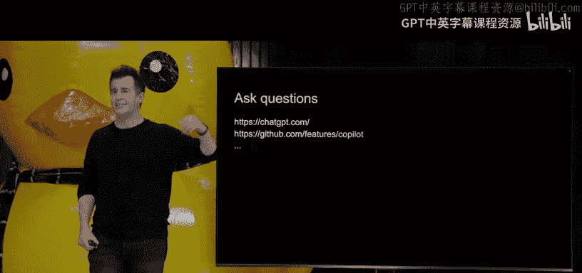

## 课程结束后的工具与资源 🛠️

课程即将结束，但你的旅程才刚刚开始。以下是一些建议，帮助你在课程结束后继续前进：

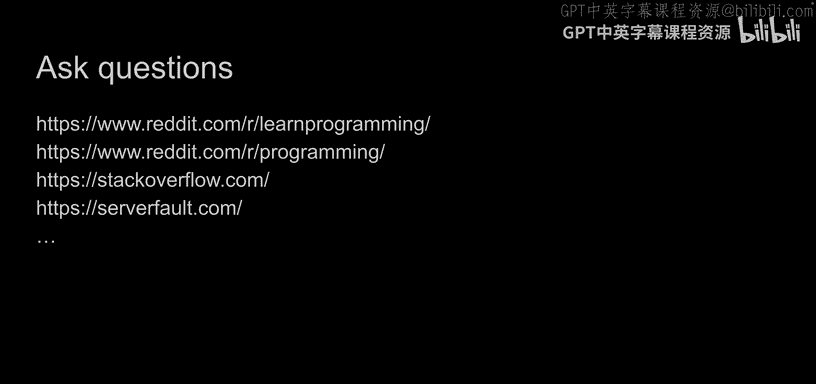

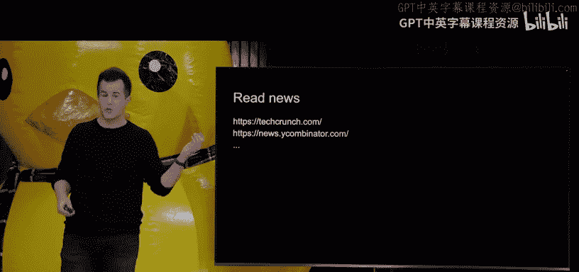

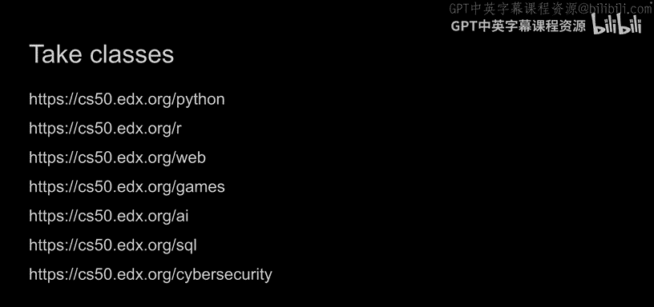

**1. 迁移到本地开发环境**
我们一直使用CS50定制的VS Code在线环境。现在，我们强烈建议你过渡到在本地安装**Visual Studio Code**或其他你喜欢的工具。这能让你真正脱离CS50的“训练轮”，更自主地开发。CS50文档提供了配置指南。

**2. 安装命令行工具**
在Mac或PC上安装开发者命令行工具，可以获得更强大、更高效的开发环境。

**3. 学习Git**
在CS50中，我们使用GitHub来备份代码。在现实世界中，**Git**是协作和版本控制的行业标准。CS50的Brian有一份优秀的视频教程帮助你入门。

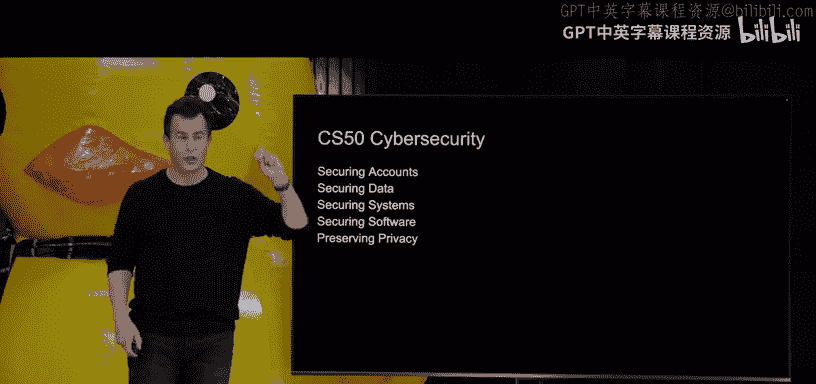

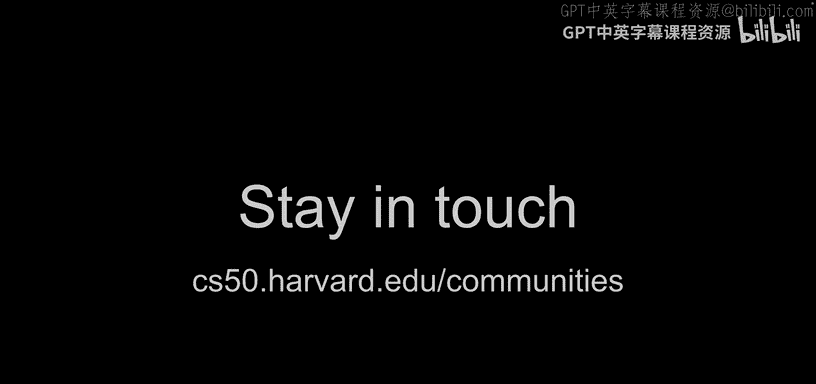

**4. 托管网站**
*   **静态网站**：如果你想建立个人作品集或简历网站，可以使用**GitHub Pages**等服务，免费且简单。
*   **动态Web应用**：对于Flask等后端应用，可以考虑**Amazon、Microsoft、Google**的云服务（学生通常有免费额度），或更易用的平台如**Heroku、Railway**。

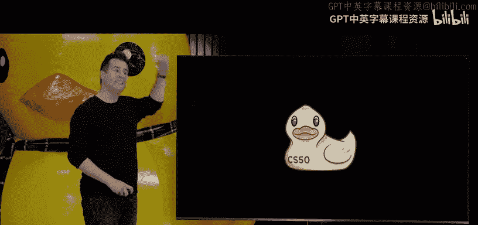

**5. 提问与学习**
*   **AI工具**：如**ChatGPT**，现在可以鼓励用于最终项目，它是一个强大的虚拟助手。
*   **编程辅助**：**GitHub Copilot**等工具可以提供强大的代码自动补全。
*   **社区**：**Stack Overflow、Reddit**等仍然是向真人提问的好地方。
*   **资讯**：关注**TechCrunch、Hacker News**以了解技术动态。

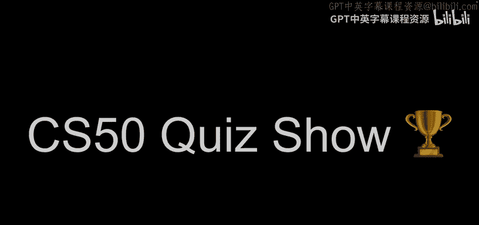

**6. 后续课程**
CS50团队提供了一系列免费的后续课程，你可以按自己的节奏学习：
*   **CS50P**：深入的Python编程。
*   **CS50R**：用于数据科学的R语言。
*   **CS50W**：深入的Web编程。
*   **CS50G**：游戏开发。
*   **CS50AI**：人工智能。
*   **CS50SQL**：深入的SQL。
*   **CS50 Cybersecurity**：网络安全导论。

CS50的目标不是精通某一种语言，而是让你学会**像计算机科学家一样思考**，并能够**自学新事物**，在未来遇到新语言或项目时，能够识别出“哦，这就像我们在CS50里学过的那个东西”。

## 致谢与结束 👏

在课程的最后，我们要感谢所有让CS50成为可能的人：Memorial Hall的团队、音视频团队、我们的合作伙伴，以及最重要的——CS50在哈佛和耶鲁的教学团队。当然，还有今年的**CS50 Duck**！🦆

## 最终测验：CS50问答秀 ❓

最后，我们进行了一个包含15道CS50相关问题的趣味测验，所有观众通过手机参与。问题涵盖了C语言语法、内存管理、算法复杂度、数据结构、SQL等核心概念。大家的表现非常出色！

---

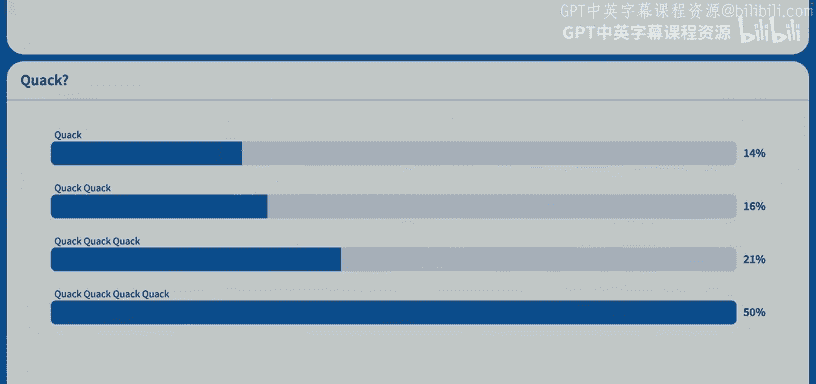

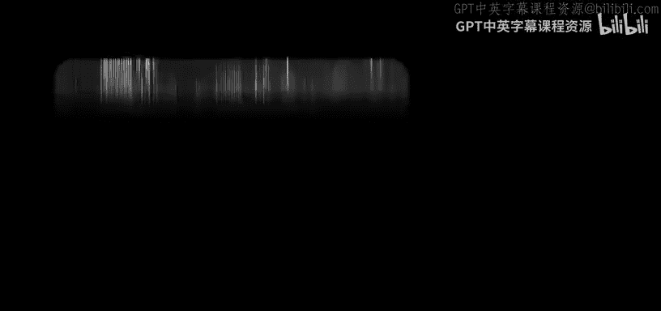

**本节课中我们一起学习了**：回顾了整个CS50的学习历程，通过游戏理解了编程中精确性与抽象的重要性，总结了从Scratch到Web开发的完整知识体系，了解了最终项目及后续活动，并获得了课程结束后继续学习和发展的宝贵资源与建议。记住，这门课的结束不是你计算机科学学习的终点，而是一个全新的、充满可能性的起点。祝你最终项目顺利，未来在编程世界里继续探索！