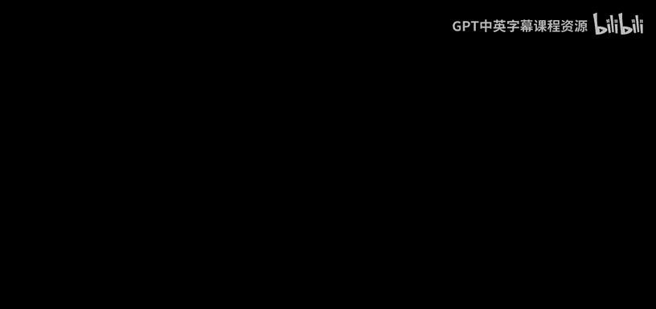

# CS50X 计算机科学导论：P14：-01：课程介绍 🎓

在本节课中，我们将一起了解哈佛大学CS50X课程的核心内容、学习路径以及课程所能为你带来的价值。

大家好，我是大卫·马兰，这里是CS50。这是哈佛大学为专业与非专业学生开设的计算机科学知识探索与编程艺术入门课程。

无论你对技术的熟悉程度如何，这门课程乃至整个计算机科学领域，事实上都适合你学习。课程通过edX、YouTube、Apple TV、Google TV以及CS50官网等平台免费提供。

通过这门课程，你将学会如何更有条理、更具算法性地思考。你将学会如何简洁而精确地沟通。你还将学会如何用代码高效地解决问题。

## 课程学习路径 🛤️

上一节我们了解了课程的基本定位，本节中我们来看看课程的具体学习路径。课程从零开始，循序渐进。

以下是课程涵盖的主要编程语言与技术栈：

*   **Scratch**：课程始于一种非常友好的图形化编程语言。你将通过拖放拼图块来编写代码，这些拼图块只有在逻辑上合理时才能组合在一起。
*   **C语言**：随后，课程将过渡到C语言，这是一种更传统的基于键盘输入的语言。通过它，你将了解计算机底层的工作原理。
*   **Python**：接着，课程将转向更现代的Python语言。你可以用它来分析数据、自动化流程、构建网络应用等。
*   **SQL**：课程还将介绍SQL语言，你可以用它来读写数据库中的海量数据。
*   **Web技术**：在课程后期，我们将深入HTML、CSS和JavaScript，这些语言可用于创建网络应用和移动应用。
*   **最终项目**：在课程结束时，你将设计并实现一个属于自己的最终项目，向世界展示你的所学。

## 学习支持与资源 🤝

了解了学习内容后，你可能会关心在学习过程中如何获得帮助。请放心，课程提供了全面的支持体系。

如果你在任何时候遇到困难，整个CS50社区都会为你提供支持。此外，得益于人工智能技术，你现在还可以随时向一个虚拟的“橡皮鸭”提问。

本节课中，我们一起学习了CS50课程的目标、从Scratch到Web开发的完整学习路径，以及课程提供的强大社区与技术支持。这一切，就是CS50。