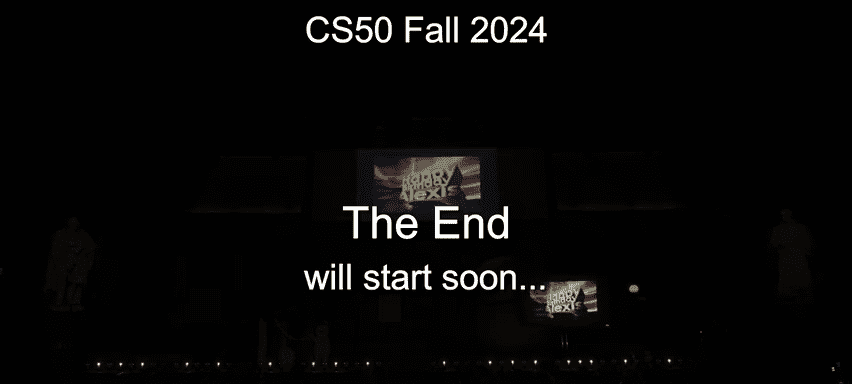
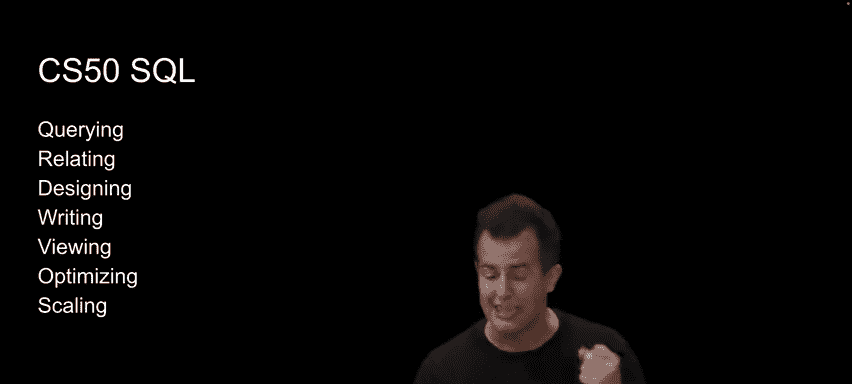
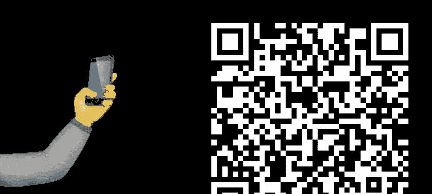
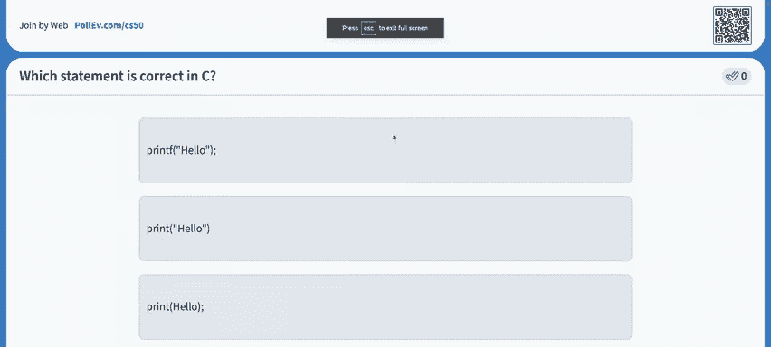
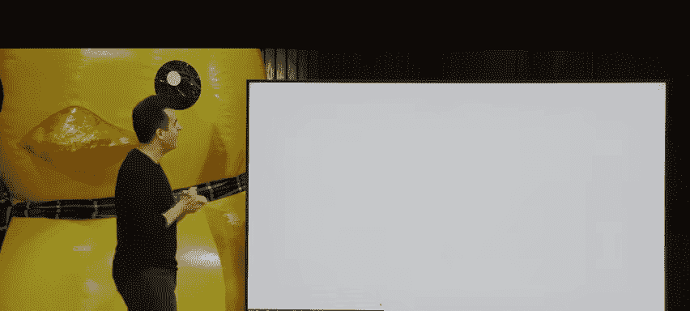

# CS50 最后一课：第 1 章：课程回顾与展望

在本节课中，我们将一起回顾 CS50 课程的核心内容，通过互动游戏重温计算思维，并展望课程结束后的学习路径与资源。

---

## 课程回顾：从起点到终点

上一节我们介绍了课程的整体目标，本节中我们来看看我们共同走过的旅程。

回想一下，课程开始时我们展示了一张“从消防水管喝水”的图片。这形象地比喻了每周学习大量新知识的感受。然而，随着时间推移，你积累的内容和技能越来越多。事实上，如果你回想大约十周前，像“马里奥”这样的问题曾让你感到困难，这恰恰衡量了你已经走了多远。我们每周都会引入新内容，构建在前一周的基础上。即使你有时感觉没有完全掌握，但很可能你已经取得了巨大进步。

最终项目的一个核心目标，就是让你确信你不再需要我们，也不再需要一个具体的作业。现在，你拥有了概念基础和实践技能，可以依靠朋友、同事、Google、ChatGPT 等工具来自学新事物。这门课真正重要的，不是你相对于同学的位置，而是你相对于自己起点的进步。

---

## 互动游戏一：编程与精确性

上一节我们回顾了学习历程，本节中我们通过一个游戏来体验编程中的精确性与正确性。

我们邀请了一位志愿者 Jordan 上台。他的任务是：用语言精确地指导台下所有同学，在纸上画出一个指定的立方体图案。他不能展示图片，只能说出口头指令。

以下是 Jordan 尝试的指令，从抽象到具体：
*   **最高抽象层**：“想象一个立方体，我们只看到它的三个面，所有线条在中心相交。”
*   **中等抽象层**：“先画一个六边形，然后在里面画一个 Y 形，连接左上、右上和中心底部。”
*   **较低抽象层**：“从纸的中心点开始，向左画一条线，向右画一条线，再从中心点向底部画一条线。然后，围绕这些线画出一个六边形，最终形成一个有三面的立方体。”

收集同学们的作品后，我们发现结果五花八门，与目标图案相去甚远。这个游戏说明了**抽象**的重要性。从“画一个立方体”这样的高级指令开始很有用，但缺乏方向、角度等具体信息。只有当我们给出像“从中心点向东南方向画一条直线”这样更低级、更精确的指令时，才有可能得到一致的结果。这就像在 Scratch 或童年绘画游戏中，我们需要一步步给出具体的“上、下、左、右”指令。

---

## 互动游戏二：角色反转

上一节我们体验了发出指令的挑战，本节中我们反转角色，让观众来编程。

我们邀请了另一位志愿者 Vian 上台。这次，观众们会看到屏幕上要画的图案（一个说“Hi”的简笔画），而 Vian 背对屏幕。观众需要轮流给出一步步的指令，指导 Vian 在白板上画出这个图案。

观众给出的指令包括：
*   “在中心画一个圆。”
*   “从圆底部画一个倒 Y 形（作为身体）。”
*   “画一些手臂。”
*   “从圆上画一条线到‘Hi’。”

最终，Vian 画出的作品与目标非常接近，只是“Hi”的位置略有偏差。这再次强调了**精确性**的重要性。仅仅说“圆在说 Hi”是不够的，应该指定“在左上角”等具体位置。同样，“画手臂”的指令也可以更具体地描述形状或角度。

一旦我们解决了“画一个简笔画”这个问题，就可以将其**抽象**为一个函数，放入工具箱。未来，我们可以通过参数来控制这个函数，指定大小、角度、文字等，从而避免重复解决完全相同的问题。

---

## 核心概念与技术栈回顾

上一节我们通过游戏理解了抽象与精确，本节中我们系统回顾本学期所学的核心概念。

本学期我们涵盖了广泛的内容：
1.  **Scratch**：通过图形化拖拽编程，引入了函数、参数、返回值、条件语句、循环、变量等**基础编程概念**。
2.  **C 语言**：接触了更传统的语法（括号、分号等），但核心思想不变。这帮助我们理解编程的实质不在于语法细节，而在于逻辑。
3.  **数组与内存**：学习了如何在内存中存储和操作多个数据。
4.  **算法**：深入研究了解决问题的步骤，特别是**搜索**与**排序**算法，这些是处理大数据（如 Google、ChatGPT）的基础。
5.  **指针与内存底层**：理解了数据在计算机中的存储和访问方式，为学习其他语言打下坚实基础。
6.  **数据结构**：探索了如何用内存“画布”构建更复杂的数据组织方式，如**树**、**字典树**、**哈希表**等，以更高效地解决问题。
7.  **Python**：转向更高级、应用更广泛的语言，因其在解决常见问题上更便捷。
8.  **SQL**：学习了**声明式编程**，专注于“要什么数据”，而非“如何获取”，语言本身处理循环和条件等细节。
9.  **Web 编程 (HTML, CSS, JavaScript)**：接触了构建现代网页和移动应用的基础。在 JavaScript 中，我们再次重温了函数、条件、循环等核心思想。

编程世界远不止于此，还有函数式编程、面向对象编程等范式。CS50 专注于**过程式编程**，即用代码一步步解决问题的指令。但最重要的是，我们为你打开了自学新知识的大门。

---

## 最终项目与课程传统

上一节我们回顾了所学技术，本节中我们聚焦于本课程的收官之作——最终项目。

第 10 周的核心是**最终项目**。这是一个机会，让你运用新获得的编程和计算机科学知识，构建自己感兴趣或认为重要的东西，而不是按照既定的规范行事。你会发现这很有挑战性，需要大量搜索和咨询 ChatGPT——这在现阶段是受鼓励的，因为编程很大程度上就是不断学习新函数、新 API、新库的过程。你会越来越擅长此道。

项目的唯一要求是：**构建你感兴趣的东西，解决一个实际问题，影响校园或改变世界**。目标是创造一些能超越本课程寿命的作品。

为了帮助你，我们有两个传统活动：
*   **CS50 Hackathon**：一个从本周某晚 7 点持续到次日早上 7 点的活动。这是一个与同学、助教一起协作、攻坚、为最终项目开个好头的难忘经历。活动中会提供餐食，甚至清晨有去 IHOP 吃 pancakes 的班车。
*   **CS50 Fair**：感恩节假期后举行的展示会。你可以在这里向全校师生展示你的最终项目。这是一个庆祝彼此成果、分享学习过程的场合。所有参与者都将获得一件 CS50 T 恤。

---

## 从 CS50 开发环境到真实世界工具

上一节我们介绍了课程的传统活动，本节中我们探讨如何从课程环境过渡到真实世界的开发工具。

本学期我们一直使用 **CS50 Dev**（定制版的 Visual Studio Code）。这是一个行业标准的开源工具，我们为了简化初始学习，默认关闭了许多功能并预配置了设置。

现在课程即将结束，我们强烈建议你过渡到在自己电脑上安装使用 **Visual Studio Code** 或其他你喜欢的编辑器。虽然初次安装配置可能遇到问题，但你现在的 troubleshooting 能力已大大增强。CS50 文档提供了配置指南，帮助你复现熟悉的环境。这是为最终项目做准备、真正摆脱 CS50 “训练轮”的最佳方式之一。

此外，你还可以：
*   **安装命令行工具**：在 Mac 或 PC 上配置开发者工具，获得强大的命令行环境，提高效率。
*   **学习 Git**：使用 `git` 命令进行代码版本管理，而不仅仅是依赖 CS50 的自动备份。这是行业协作的标准工具。
*   **托管网站**：
    *   **静态网站**：可以使用 **GitHub Pages** 等服务免费托管个人简历或作品集网站。
    *   **动态 Web 应用**：对于 Flask 等项目，可以使用 **Amazon Web Services**、**Microsoft Azure**、**Google Cloud** 等云服务（学生通常有免费额度），或更易用的平台如 **Render**、**Fly.io**。

---

## 持续学习资源与路径

上一节我们讨论了真实世界的工具，本节中我们看看课程结束后如何继续你的计算机科学之旅。

**提问与获取帮助**：
*   **AI 工具**：如 **ChatGPT**，已成为强大的编程助手和学习伙伴，尤其擅长计算机科学领域的问题。
*   **人类社区**：**Stack Overflow**、**Reddit** 的 r/cs50 等论坛仍然是向真人提问的好地方。
*   **资讯**：关注 **TechCrunch**、**Hacker News** 等网站，了解技术动态。

**深入学习课程**：
CS50 团队提供了一系列免费的后续课程，你可以按自己的节奏学习：
*   **CS50P (Python)**：深入讲解 Python，涵盖面向对象、单元测试等进阶主题。
*   **CS50R (R 语言)**：专注于数据科学和统计编程。
*   **CS50W (Web 编程)**：深入探讨 Django、React、测试、CI/CD 等现代 Web 开发技术。
*   **CS50G (游戏开发)**：学习使用 Lua 和 Love2D 框架开发 2D 游戏。
*   **CS50AI (人工智能)**：深入人工智能理论，并使用 Python 实现相关算法。
*   **CS50SQL (SQL)**：深入学习数据库和 SQL 查询。
*   **CS50 Cybersecurity (网络安全)**：探讨代码中可能出现的各种安全威胁和防御方法。

CS50 的设计目标不是精通某一种语言，而是掌握**编程的通用思维**。希望到课程结束时，你能在遇到新语言或新项目时，自信地说：“哦，这很像我们在 CS50 里学过的那个概念”，并具备自学的能力。

---

## 致谢与结束

最后，我们要感谢所有让 CS50 成为可能的人：Memorial Hall 的团队、音视频团队、我们的合作伙伴，以及最重要的——CS50 教学团队的每一位成员和助教。当然，还有我们的吉祥物 **CS50 Duck**！

---

## 终极挑战：CS50 知识问答

在课程的最后，我们通过一个包含 15 道选择题的在线小测验，与全场观众一起检验本学期所学。问题涵盖了从 C 语言语法、内存管理、算法复杂度到课程趣闻的各个方面。在欢声笑语与对蛋糕的期待中，我们共同为 CS50 的正式课程部分画上了句号。

---

本节课中我们一起回顾了 CS50 的完整学习路径，通过互动游戏加深了对编程核心思想——抽象与精确——的理解，并为你展示了课程结束后继续探索计算机科学世界的丰富资源和清晰路径。记住，这门课的终点，正是你自主探索的起点。