# 哈佛大学《2D游戏开发｜CS50 Introduction to 2D Game Development 2025 Fall》中英字幕 p01 CS50 2D - Lecture 0 - Pong .cut.zh_en -BV15xsPzEETf_p1-

Hello world。 This is another of CS50's live streams。

 This one focused on CS 50's new and improved introduction to22D game development。

 My name my name is David Malon。 I'm here with CS50's own Colton and among the things you should realize today is that we might start and stop several times because we're filming this live but we're gonna edit it thereafter。

 So please forgive if we make mistakes or we need to start over or even mute the audio for a little bit as we make some technical changes。

 but this will be a sneak preview for you of the courses first lecture onong More on that in just a moment。

 and if you have any questions throughout the process， feel free to ask by chat。

 I'll do my best to raise my hand to verbalize your question perhaps some of my own for Colton the course itself won't be available onedX until later this year along with the assignments for those of you already familiar with CS50G that is essentially an older superet version of this course Colton this time around will be focusing entirely on 2D game development which is among his areas of expertise in fact the。

😊，pastt few years he's been working in the real world as a software developer。

 you want to tell us a bit about that。 Yeah， so I've been doing language。

 so an elearning platform do lead sort of architecting and dev on that。

 So we teach various languages， but primarily Japanese it's called from zero。

 if you want to check it out。 Yeah，s doing web stuff。 So unfortunately not a ton of games。

 although I do enjoy web stuff as well。😊，Can I put you on the spot and ask you to say hello world to in Japanese to our Japanese students today Sure。

 I guess it would be something of like O Kica。Very nice。 All right。 Well。

' give us just a moment to get started， and this will be lecture 0。 Thanks and welcome back。

 Thank you。😊，Hello world， this is CS50's In to 2D game development， also known as CS502D。

 my name is Cololton Ogden and today we'll be taking a look at Pong for our first lecture。

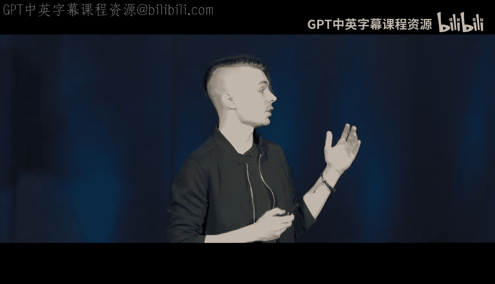

So I have a bit of a story about game development and programming so what got me into programming to begin with many years ago was as a kid。

 I really loved playing video games， and so I decided one day to go to the bookstore and look for whatever book seemed the most appealing or the most likely to help me in my endeavor to learn video game development。

 and so I stumbled upon this book even though it says 3D game programming all in one。

 it was kind of an all catchall book teaching an engine called torque。

 which we can see an image of here， which was sort of a precursor in some sense to unity and Unreal engine which are popular engines nowadays。

 but back then you know this was the first time I'd ever see anything quite like it。

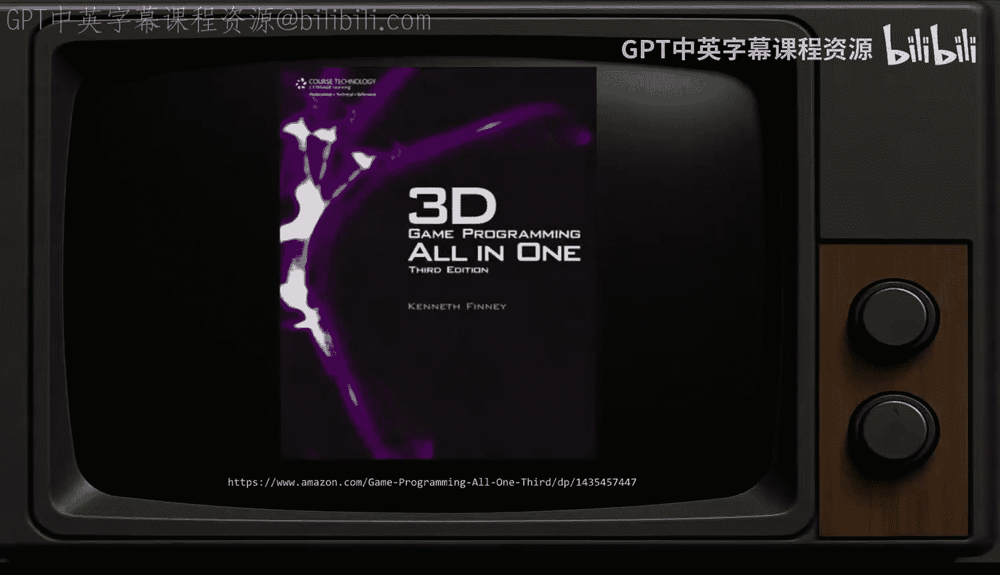

And I remember very vividly opening up the book and also looking at some of the source code and I had never really thought too much about programming up to that point or what game development really meant。

 I just knew that I wanted to make them， I enjoyed playing them。

 and it was a surprise to say the least when I opened up the book and saw dollar signs and ampersands and pipes and all these things and it was very overwhelming to me and I ended up unfortunately。

 I suppose tucking the book away and not really looking at it again。

 but sort of by happenstance I was in a Barnes and Noble， not too far in the future。

 found a book that was a little bit more， I guess to my liking or sensibilities。

 but I think also I had maybe been stewing on game programming and been disappointed at the fact that I had been disappointed or at least my expectations had been negatively subverted。

 so I started reading this in a Barnes and Noble C for dummies。

 which is on the surface kind of humorous but I found myself actually with a different mindset really enjoying it and got more invested and interested in programming in general。

 not just。

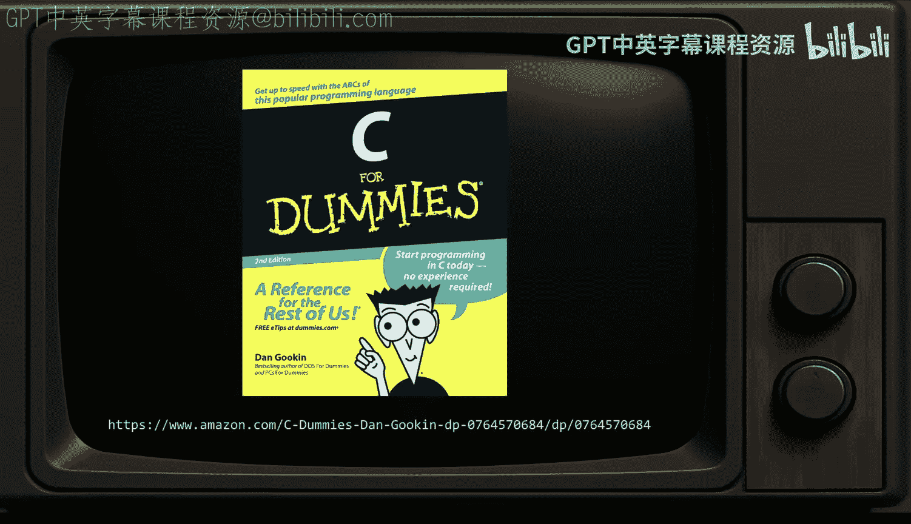

related to game programming， and then this spawned a whole foray of looking at other languages and other engines and frameworks。

 not really torque so much， but certainly all the way here now teaching this course。

And so one of the big things as I was putting this course together and thinking about this course was thinking about。

 okay， when I was first learning game programming， there were a lot of games growing up。

 I loved games， Super Nintendo game Boy， NES， whatever。

 theres a couple examples here of Legen of Zelda and final fantasy and Pokemon and Mario and all of those games are iconic games and I think most people that want to learn how to program games are probably keeping these sorts of games in mind when they decide oh。

 I would like to take a look at learning how to program games。

 but unfortunately at the time there weren't really all that many resources that I could find that would help me learn game programming in the way that I was hoping I could。

In the sense that I could learn how to make these full types of games。

 and so when building this course。We decided to go with a whole approach that kind of is just this whole smorsbo of video games。

 and these are all replications of famous games。 But as you can see， we run quite the gamut。

 We go through classics like Pong， which is what today's lecture is which is all the way from the 70s。

 a very simple game， we talk about recent games like Flappy Bird or like Angry Birds， even Pokemon。

 and then classics like Mario and Zelda， which I think are some of the most famous and most beloved games。

😊，But really pong and today's topics I think set the stage really well for game programming in general。

 even though on the surface， Pong is such a simple game。

 I think a lot of people have seen it and we'll take a closer look in a moment。

 there's really most of the fundamentals of 2D game development exist within Pong and then they transcend Pong to all the other examples。

 all the other games that we'll be building in this course the two main key pieces。

 key tools we'll be using are Lua and Love Lua being the programming language well use love is a sort of this microeng sort of framework。

 a runtime that uses Lua but love is what gives us the ability to draw things to the screen and do audio。

 all the things that a game typically needs or game engine typically needs。

And we'll be taking a look at the basics of shapes and text。

 actual visuals that you need to get something on the screen， deelta time and velocity。

 which is how you move things and we'll take a look at that on the screen。

 games are real time and things are always moving， we'll talk about states so that we can persist things like score object oriented programming so we can represent our game objects。

 our actual data as if it were real objects， and then we'll take a look probably maybe most importantly at collision。

 2D collision， which will be used in all other examples which allows us to actually have interactions in our games。

 and then lastly for fun， but also just to sort of complete the package we'll be looking at sound effects。

 things like sounds in this lecture and music and future lectures and we'll look at a couple of free tools that we can use that are just browser based to actually create our own custom sounds and not need to fancy of tools。

So for folks at home to be able to follow along you'll want to download love。

 so love is a also known as love2D， it's a framework， it's a binary。

 it's just a program that you can run on your computer。

 it's supported by most major operating systems， you'll just run it and you'll run all of your code examples through just either dragging or dropping it or installing a VS code extension if you're using VS code。

 things of that nature and there's an excellent wiki as well that you can visit to get instructions for your operating system。

And then that's in terms of getting installed and getting everything set up。

 you don't have to install Lua that comes with love， it's baked into love。

 but we should start by actually talking about Lua before we even talk about love because in order to make love do things as our framework we need to actually be able to code in the language we'll be using。

And so we won't have a tremendous tutorial on it， but just a few quick tidbits， a few quick facts。

 so it's a Portuguese name， Lua， which is Moon。

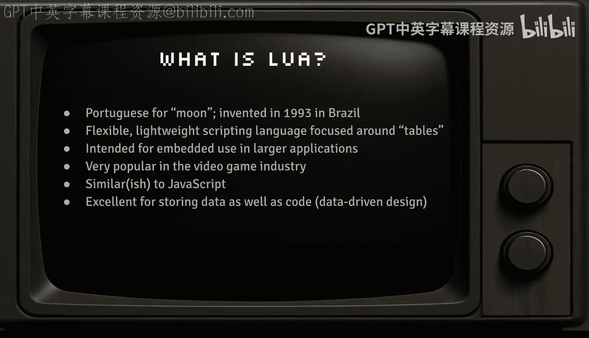

It's used very often in industry， it's very flexible， it's very lightweight， a lot of engines low。

 I've encountered using it a ton of engines myself for scripting。

 it's really cool if anybody's used JavaScript is very similar actually in syntax to JavaScript although it does introduce its own syntax。

And then it has a very， just like JavaScript， it's very easy to store data， JavaScript has Jason。

 Lua itself， everything is stored in what are called tables。

 which are kind of like JavaScripts objects and it makes for a very clean easy storage of information。

And so love itself， which I've already sort of talked about。

 it's a very fast lightweight C++ compiled framework s binary for developing games。

 but it's coded it scripted in Lua。It's got all the modules that you could hope to want for 2D game development。

 graphics， keyboard input， everything it even with thankfully because it comes with Lua。

 it's got all these modules for math and it's even going to start incorporating networking stuff in some of the upcoming releases and of course it's completely free open source portable。

 it's a great framework and I just love also' it has a very readable API which we'll look at it's great for learning and it's great for real worldor projects。

😊，In fact， this game is very popular right now， it's called Balatro， it was released last year。

 it's still very popular and it was popular then I played a good amount of it last year。

 there's an article here so CS50's Ian Sextton link me this article as I was putting these slides together so shout out to Ian。

 but Balettro is written in love it might now be， I don't want to necessarily say for sure but it's probably the most popular wellknown game as of right now in Love2D and there's certainly some other ones and you can see this now listed on Love2D's homepage but this is an amazing game and it's testament to the fact that you can make full games in love2D。

 it's not just for prototyping。And also interestingly and kind of fun and cool is a 3D engine。

 there's been a few of these such experiments， but this repo in particular has some really cool demonstrations of somebody building on top of love 2D to create their sort of own love 3D S engine。

 which has been sort of a wish that I think a lot of people including myself have had because Loves API is just so nice and friendly。

 clean to use that it feels sad to not have a 3D version of that sometimes so this does an excellent job I think of getting us in that direction。

 this almost looks like it was built in unity it's really cool project。

So enough of the actual tools and love and Lua， those are very easy to download configure for your operating system So today's goal we're going to focus on pong and so on the surface pong is a very simple looking game almost I would say humorously so especially compared to modern games but we have a few different things that are worth noting this is just a screenshot of representative example of pong and I'm going to go to a demo of our actual repo in a second but just looking at the game you can see we have essentially just a bunch of shapes and text but all the fundamentals of what we just laid out in that previous slide or here we have movable rectangles the ball here is a circle and our example is going to be a square but either way you could implement it the ball is going to have to collide with the paals so we need the collision detection when it collides with something maybe we want it to actually play a sound we want score to show on the screen we're going to want state in our game that updates we're going to have win conditions all of the fundamentals that go across all 2D games that we'll see through the rest of this course are。

In Pg。And so I'm going to do a demo real quick just so that we can see what it looks like and then we'll start to dive into the specifics of what we're going to look at。

 I'm going to look at the repo for the course， so we're going to be releasing all of this source code and we'll be going through Pong sort of in a series of steps we'll be implementing some of it from scratch up to a certain point and then we'll start looking at the code a little bit more high levell but just to give you a sense of what we're going to be looking at。

 so this is maint Lua in Pong final now something to take note of is that everything that you run in love2D。

 which you'll see also if you look at their documentation。

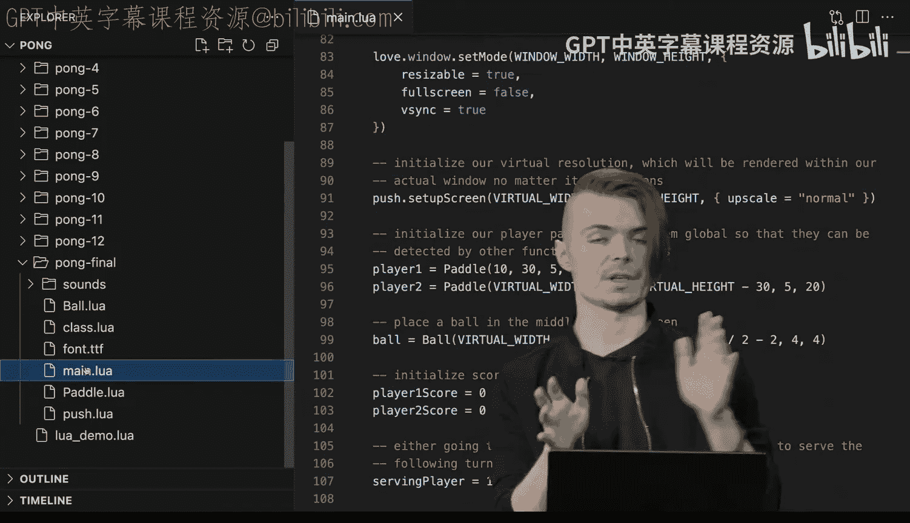

All of your main just like you might have programmed in C or C++ you'll have a main function in those languages in most languages and so in Lua it's a little bit different in love in Lua it's a little bit different where you have a main do Lua that has all of the code that bootstraps your program and we'll take a closer look at this and what this means。

 just for the sake of example I'm going to load main Lua in VS code using an extension that I have which I'll also show in a second。

 but just so that we don't take too long to show the example here， I'm go ahead and start that。

So I've gone ahead and triggered love to run this source code example， this folder。

 and you can see this is largely a fully represented version of pong。

 it says welcomecom to pong at the top I can move the paddles on the left and the right with the WAD keys on the left and the arrow keys on the right and so you can see that it says press enter to begin so it's waiting for me to press enter to trigger some phase change。

 the ball is static in the center and the scores are zero so once I press enter you'll see the ball move。

or rather it's going to go to the serve state first。

 so player one is going to serve it and then once I press enter。

 the ball is going to move towards the right because when player1 serves it it's going to serve towards player two。

So now I'm going to move it and then bounce it the ball。I'm not very good at playing pong by myself。

 but you can see I let the ball move to the left， I let it move to the left of the screen and it was able to trigger not only different sound effects based on what it was doing。

 but the score also updated now we can see there's a0 and a1 on the screen0 on the left being the player1 score one being player two score since it went past the left edge of the screen。

 player 2 got a point and so therefore the scores are slightly different so if I press enter again。

Conserve。So whoever， whoever。Lost。Last' dig in there。

 whoever loses or whoever gets scored against gets to serve so if I， for example。

Try to move this and I'm going to just let this go to the right player  two will be the server。

 as you can see now player  two gets to serve and it'll go to the left by default。

And then we can keep doing that on and on and on up until I think it's coded for 10 points。

 and then we get to a sort of game over state or a victory state。

 which we'll look at where whoever gets the first to 10 points is declared the winner。

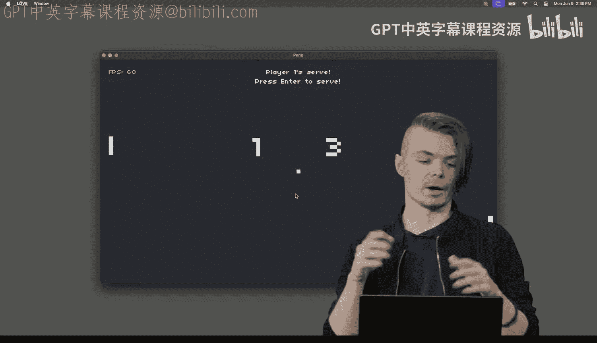

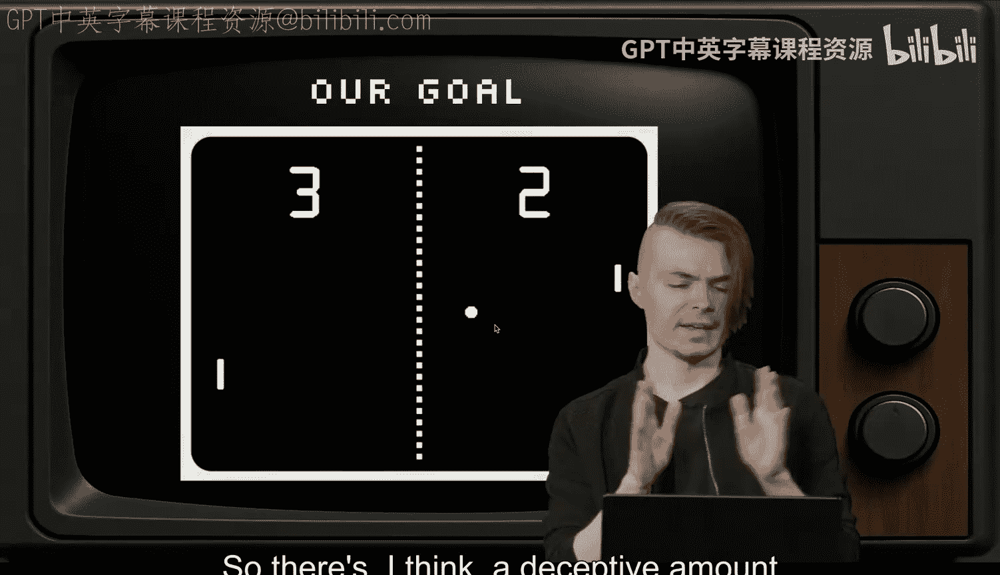

So there's， I think a deceptive amount of things that go on with pong。

 even though pong is such a very simple game on the surface， it has all the pieces。

 we'll use a lot of these same pieces as we transition to later lectures， especially， for example。

 even breakout， which is essentially an evolution of Pong has a lot more detail going on in next week as well。

So let's look at some of the things that we're actually going to in detail look at during this lecture。

 a lot of things that we just enumerated and took a look at so we want shapes right we saw we had rectangles and that's sort of an important first step is actually drawing something onto the screen you know not just having a blank screen but actually having shapes those things can move so we want to be able to control their 2D position so they weren't just static they actually responded to keyboard input they moved up and down。

The collision detection is very important， the whole game is driven by collision detection。

 whether it's the top or bottom of the screen to bounce off the walls or the left and the right。

 which is essentially the lost condition for either paddle or I should say maybe not lost condition。

 but certainly what gets a point scored against the opponent， is when one of the other side。

 the ball is able to reach it past the paddle。And then sound effects。

 as we saw and then scorekeeping， so some basic state。

And so the approach that we'll take for the first five or six examples here， theyre a total of 12。

Or 13。Are going to be done just from scratch because thankfully Pong is a pretty easy lecture in which we can essentially just write it from scratch we'll go over a few basics for every example and then we'll actually dive into the code and I have VS code set up as my editor you can use any editor you could just use a plain textpa or text editor or the like although that I wouldn't encourage that probably but VS code thankfully has a nice extension called by it's called love2D by Pixel by Studios and it allows you to very easily just hit a keystroke and I'll show that I'll illustrate that。

But for right now， just as a fun little also aside too。

 you'll see that I titled this slideThe day Ze Upate， it's sort of a thing in industry。

 particularly I think with early access titles， but you'll see a lot of games， like Minecraft did it。

 no man sky and shrouded which are three these are all very famous games， some in early Access。

 some not so much， and it's kind of a thing in industry where no matter what you release it seems like whether it's trivial or not。

 it's whatever update， something update the X update。

 which I think is fun and cute and that's kind of what I styled this course after so every code example will have a sort of moniker。

 the whatever update that we're talking about。

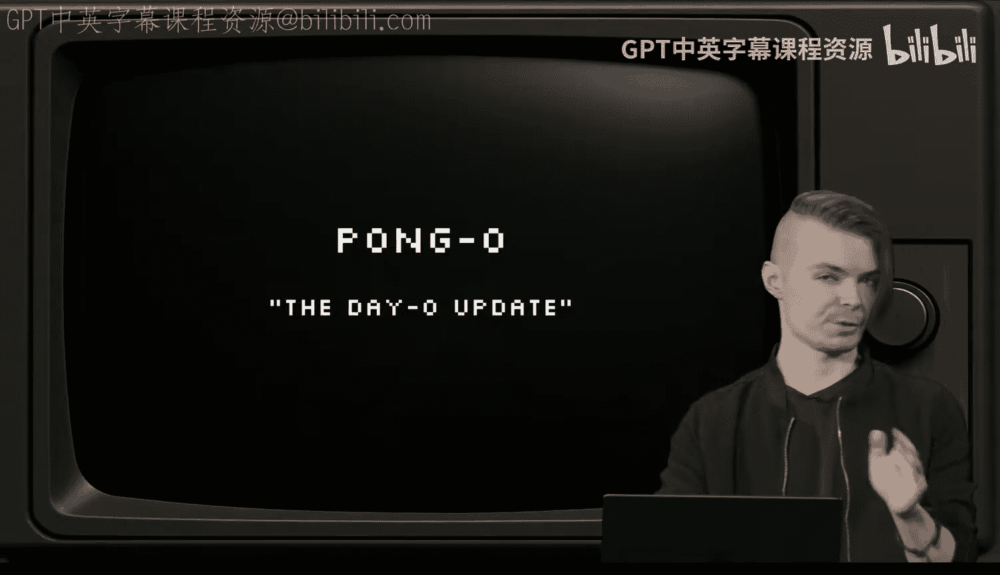

An important thing before we can even get started in programming this example， Pg zero。

 the day zero update， which is just going to be drawing a window onto the screen basically to get us started we should talk about game loops and love 2D is built I think very elegantly around this idea where。

All games， whether the 2D or 3D games， they're all going to have some kind of inner game loop and a game loop is a really simple actually series of steps when you look at it diagrammed out now it gets complicated and there's obviously very many permutations of this and the engineering of it gets complicated but in a nutshell and for the purpose of our lecture here we can look at a game loop as a series of pretty simple steps just a few steps the first step is processing of input so by processing of input that means we need to essentially pull to check which keys have been pressed on any given frame so a game will run you know between one to 60 ideally frames per second on most computers and so when a game essentially is is an illusion and might have this on the next slide but it is essentially like a flipbook that you just run constantly I also think this is a pretty cute example of a flipbook and I won't spoil it。

I quite like it。It's cute，'s proposal， but it's essentially this is what we're doing with our game。

Giving the users a flipbook that they control the appearance of through their actions。

By processing input each frame， each1/60th of a second， so think of a while loop。

 so if you're familiar with。Other foundational programming courses。

 which this course kind of assumes at least a basic introduction to programming and computer science。

But you can think of this as a while loop that just runs and it's time to run about 60 frames a second on average。

 it can fluctuate， 30 frames is console standard， 60 frames for PC。

 but then if you have a higher hertz monitor， this Mac is 120 hertz， there is 144 hertz screens。

 your graphics card will fit that refresh rate assuming the engine supports it。

 but every 160th on average of a second， so every 16 or so milliseconds， it'll check for input。

It'll then update the game based on that input， so if you pressed the enter key， do something。

 if you pressed W or S or something， move or set the velocity of some object to some value。

Or any number of things that could change in the game world based on input that's typically what happens or it could change based on AI decision making and then based on that change based on what we've just updated。

 you'll want to render those changes and then that's what essentially gives us this illusion of things happening on the screen is that we've taken our input we've made changes to state variables and then we have made those changes visible through rendering through drawing sprites through drawing shapes through moving those shapes and those sprites are all contingent on those state value。

 the state variables， x and Y values that we'll see shortly and then sometimes depending on your game's architecture you might or the speed of your computer and hence this cyclical arrow here。

 you might repeatedly update in one frame， maybe your computer is too slow to render 60 times a second and so you need to update multiple times in between frames or maybe you need to update multiple times per frame to account for particular physics calculations that。

That have to ensure that no matter what your frame rate is， they stay consistent。Yes。

You mentioned the term sprite earlier， what does that mean？

So a sprite and we'll definitely take a look at this a little bit more and sorry so the question was I mentioned the term sprite and so what is a sprite so sprites will get into detail next lecture。

 but in short they're essentially just an image file so you can think of like a PNG file any kind of image file that you can imagine。

So for today's lecture we'll just be drawing as you saw pong is just shapes， it's just rectangles。

 you could draw circles， whatever you want， but sprites are essentially actual images drawn to the screen and what the vast majority of 2D games are implemented with versus shapes and rectangles and the like Yeah let me talk so no need to repeat the question I asked and I would reanswer that but do it much more succinctly。

Just so it's to not steer us too far down the rabbit hole Oh sorry， much more what succinctly？

ASrite is a character on the screen that you write code against it or something。

 What's a good launchback point， Andrew。I think it's here。And stage。

That's where you are can watch right。No no and no repeating of the mic。

 so no need to repeat the questions。 Okay， I wasn't aware that was going into the feed。 Okay， sorry。

 yeah， okay， so you can just start with good question。Yeah。哎。哎。So good question。

A sprite is simply an image that we draw to the screen and we can move around and do things with unlike shapes。

 which is the focus of today for pong and simplicity。

 but generally 2D engines will you'll see sprite art much more than you'll see just shapes being drawn。

And so again， this is essentially the analogy that I was drawing， it's a flipbook that you control。

 you update， you do input， then you update， and then the rendering happens 60 times a second。

 you can visualize your GPU doing a flipbook for you every second effectively of 60 pages。

So that's the groundwork for the paradigm within which we'll be working and how games generally work。

 but love also does a great job of embracing this with the way that it has its functions structure。

 and so we'll take a look at all of these and we'll see these many times some of the functions we'll see the most throughout the course love dot load is essentially the initialization of our game and then we have love dot update which we'll take a look at in more detail a little bit later。

 we'll get started not quite with a bunch of updating。

 but this is the ultimate driver I would argue of our entire game and then love dot draw which is actually where we do all of the drawing and we can visualize these as essentially being these steps that we laid out in this diagram except these are functions。

In this case， that love essentially expects us to have implemented in our code and we'll look at those and then call them for us in a game loop that it manages under the hood。

So those would be the core functions for the game looping， and we'll take a closer look at this。

In order to， before we actually program this and for this to completely make sense。

 we also need to understand that when we're looking at 2D games。

 we're dealing with 2D coordinate systems， which I think most people have probably seen something like this before in geometry or what have you。

 they're pretty prevalent but this is essentially just a way of looking at the world as a series of XY coordinate pairs。

 and different engines， different frameworks will implement this in a different way。

 some will have Y for example going up instead of down some will have Y going up instead or down instead of up。

 so on and so forth。

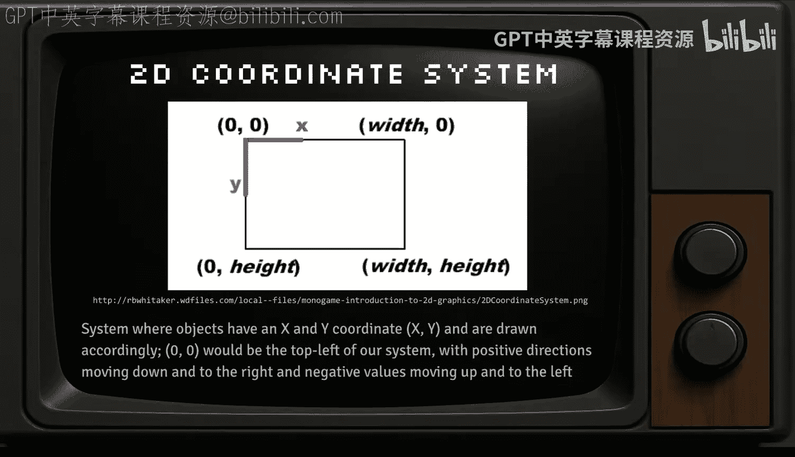

In our case， in our axis， our system， y goes down and x goes to the right and left and negative y goes up。

 so positive y goes down， negative y goes up， positive x goes right， that might be flipped。

 positive x goes right， negative x goes left， negative y goes up， positive y goes down。

And essentially， this is important because all 2D programming。

especially when we're looking at chor and it's essentially mapped to the actual pixels on your screen。

 so in order to draw anything on your screen， whether it's a sprite。

 whether it's text or it's a shape，the pixels on your screen are essentially following this coordinate system there's different ways you can look at your screen as coordinates and where you base your axes。

 your origin point from， but in general you can see these are all RGB triplets which will look at RGB throughout this course as well color is very important in games and getting 2D games stored properly。

But in order to draw anything， we need to look at our computer's pixels essentially as a 2D grid。

 a Cartesian grid of pixels。And so the last two functions we'll look at which will allow us to finally write some code is love。

 graphics。print F， which is what we're going to do to write hello pg or hello world to the screen and then love。

window。et mode， which is what's going to allow us to actually get a window up and running on the screen so I'm going actually concretely built out so let's take a look at that right now I'm going to transition to my laptop。

And I have a sort of blank project here that I've got set up。I'm just going to create。

 I alluded to this previously， now I'm using VS code and for folks who are interested。

We're going to want to go to the extensions menu， which on Macus command shift X。

 but you can just find it on normally when you have VS code installed。

 me show the activity bar just so you can see what it looks like。

You'll see this for folks using VS code， which I'm sort of assuming a lot of people will be using VS code though certainly you don't have to use VS code。

 you'll see an extensions panel here， you can look for this love 2D support by Pixelbyte Studiouds。

 it's a very handy extension that allows you just hit command L or control L on your computer and it will trigger love2D to run without you having to click and drag a main。

 Lua file onto it onto your binary or a folder onto your binary。

 Love 2D will work with either you can drag a main。

tlua or you can drag a folder with the main dot Lua。And so I've installed that。

 I have that configured on my Mac， I'm going to go ahead and hide the activity bar and then I'm also going to hide that and now we're just in main dot Lua now so recall we looked at all of the pieces of the game loop so we saw love dot load。

And so you can see the syntax here， so for folks who have looked at JavaScript in some sense the function keyword might be similar。

 LuA has an end keyword to end terminate many of its blocks， most all of its blocks。

 which we'll see with if statements as well。But to define a function。

 we just say function then the function name then the parentheses of it which could be the parameters as well in this case Love Out low doesn't take parameters and again I'm assuming some degree of prior programming experience。

 so if this is unfamiliar there are certainly resources if you look up LuA 5。1。

 its programming manual has a lot of information。But we saw love。t load as one of the functions。

 Love。t update is also one of them， although we do not need love。t update just yet。

 so I'm not going to include that。But we have love。 draw， we did need that。

 and then recall our goal was to do two things， one。

 we want to set a window and I actually have a window up on the screen。

That's the first step really to get anything running in a game is to actually have a window up and running。

 so we're going draw a window， we're going to render a window rather load a window and then we're going to print some text to the window。

 so we're not going to do any shapes， nothing fancy just yet。

 but we're going to print something onto the screen much like you would expect in an intro programming course。

 for example， saying hello world or the like。So in love。

t load what I'm going to do is I'm going to say love。window。et mode。

 so recall this was one of the functions we looked at。Now。

There are two3 parameters that we need to pass into this function。

 So a window needs a width and a height。 So I'm just going to define a couple of constants here。

 So we'll say window width， and we'll just say 432。Or rather， 1280。

Getting a little bit ahead of myself with one， 1280 and then window height at 720。

 so this is just like a standard 16 by 9 on the small side window you could do 1920 by 1080p。

 you could do 4K。 We're going with a 720p window。And then what I'm going to do is I'm going to pass in the window width window height。

And then an object。Where we're going to say resizable false vync true and full screen false these are three flags that tell our window about how it should operate in a few specific ways。

 the resizable aspect we'll take a look at later we don't want to be able to resize it right now。

 vync is important to avoid screen tearing which is just if your GPU and your thing or running it different or rather your monitor and your application are running or rendering at different frame rates you could see screen tearing and we want to avoid that。

 and then we don't want this to be full screen， I just want this for the sake of ease of demoing to just be a regular window。

 so that's what the full screen is false does there。 So in lovedo draw。

We can reference the other function I alluded to， which is love。t graphicics。 print F。

 and then we're going to want to say something like hello pong。

We'll that this is going to be at we'll say this is going to start at0。

 this isn't going to quite make sense yet， we're going to start it at x coordinate0。

 so that's what this is， this argument is the x coordinate then the y coordinate。

 the y coordinate we're going to say window height。Divided by two。

 so about halfway down the window and we minus six pixels so we're going to go up by six pixels。

 so we're going to roughly center this text in our window。And then we're going to do a。

Another parameter that's going to specify within how much size we should format this text。

 so this is a print F function which is for print formatted text so we'll see based on this last parameter but I'm going to go ahead and I'm going to say window width。

 we're going to take up the whole width for our formatting and then I'm just going to pass in center center and then so we have the also you can notice here we can use either single quotes or full quotes when we specify strings in Lua it will accept either。

And so you can see here we have this text hellelloong starting at x coordinate0。

 and that goes hand in hand with this window with format Specifier， that's why we chose zero。

Then we're going to center it window width divided by2 minus6。

 and then assuming that I made no mistakes here， this should just work。

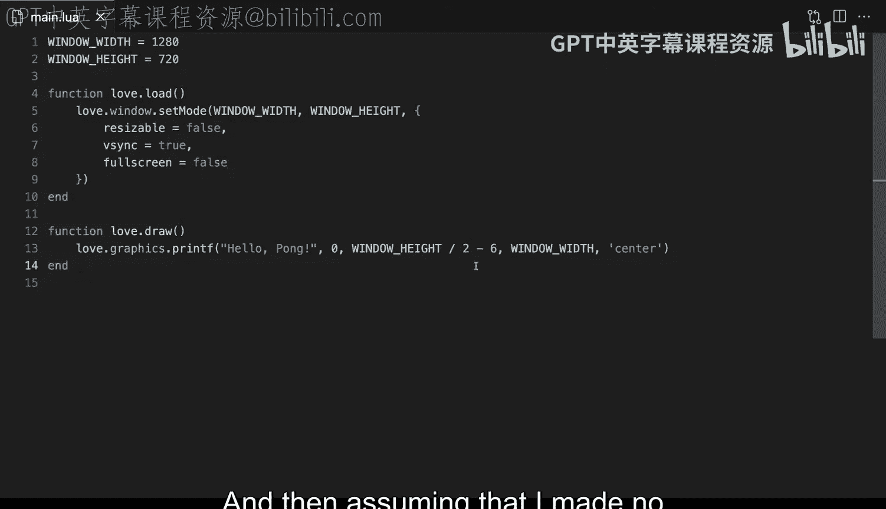

And it does。It's a little on the small side， I would say but you can see it very tiny there。

 hellello pong perfectly centered visually in our window。So again there's a few pieces there。

 but really this is kind of one of the more important foundational pieces we actually have something on the screen and I think this is kind of an exciting moment for a lot of people and it's kind of one of those things that kind of gets you hooked maybe I'm just speaking for myself but every time I even see something like this in a new framework or something I find myself getting motivated to keep working on stuff and I forgot to close the old pong as well。

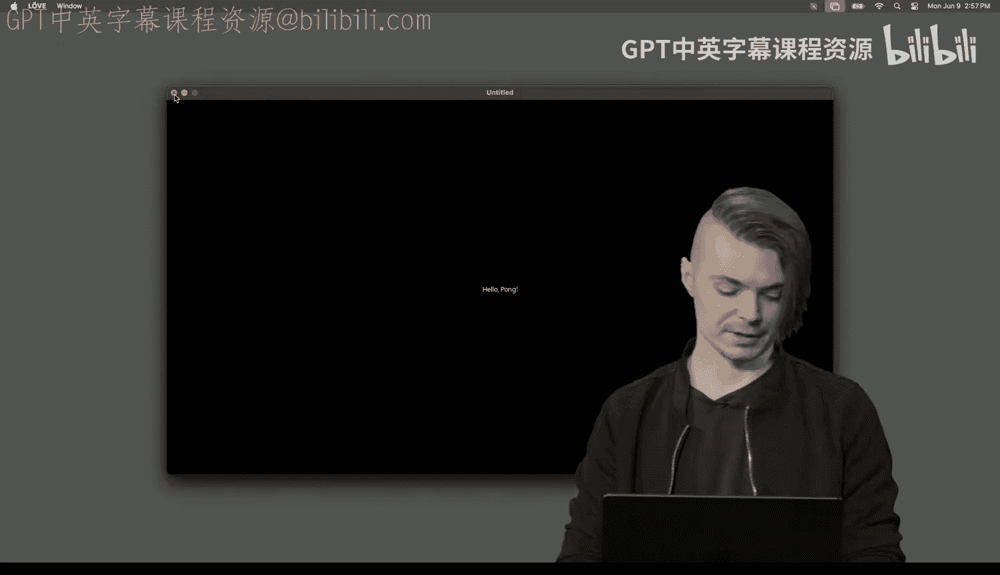

So a lot of stuff there， but we explored， we covered a lot of ground already。

 sorry can we use this as a breaking point to take a short break， yeah okay。All right。

 so let's go ahead and take a look and transition to that right now。

 we're going to go ahead and open up a project that I have pre sort of set up an empty project now in Love and Lua。

The way to open up。Games or to start games is through a maint Lua file and so I'm going to go ahead and create that right now。

 so a lot of programming languages will have this main sort of as a function， so C or C++ Java。

 all these languages will have a main function that you write。And in Lu， I love。

 the expectation is a little bit different， so Lua。Doesn't really have that same idea。

 but love expects a certain set of functions to exist in a main dotlua file that you can then run。

 you can either click and drag this main dotlua file over to your love executable or and this is my preference you can actually install an extension if you're using VS code。

 which is what I'm using here， it's called love2D support and you can find it in the side menu of VS code if you go to the extension sidebar。

 it's by pixelixbyte Studios and it allows you to conveniently just press command or control L depending on which operating system you're using。

 and then instead of having to do the dragging yourself or load the main dotlua or your folder at the command prompt this will just detect love installed in your system with some setup depending on your operating system which you can look at the wiki to see the exact steps needed to do this。

And then save you just a bunch of time。 it's really great for developer experience so I'm going to go ahead and hide that for right now so I've created a main dot Lua file and so we just looked at all of the 2D sort of game loop functions in a nutshell and some of the functions that love has built into it that we can use to do that same loop so I'm going to go ahead and write a couple of those so the first one is going to be love dot load。

😊，And so this is Loves or Lua's way its syntax of declaring a function。

Its the function keyword exists in JavaScript and in other languages。

 I'm sure this end keyword is a kind of bash like end of a block， it's function blocks。

 it could be if statements， we'll see that in the future， it's a sort of a quirk of Lua。

But this is how you define a function， and then the parentheses can take arguments in the case of love。

 load， it does not expect arguments to be passed into it。

And you can define whatever functions that you want to。We'll go ahead and we'll also add love。

update dt， although we don't really need to for this particular example。

 that was one of the functions that we alluded to， so just for simplicity I'm not going to add it。

 but this is where you would add it and it does take a parameter DT。But we do need love。 draw。

So there are a couple of functions here， so love dot load again it will execute at the beginning of when you run your main dot Lua so right at the beginning it's good for setup and everything like that。

 just runs one time Love dot draw is the render part of our loop that we looked at so there was the input there was the update and then there was the render that in this case level call it love dot draw and so these are functions it expects in here so it will call these for you it maintains its own game loop that's always running aspiring for the refresh rate of your monitor 60 frames a second and love dot draw is one of those pieces。

Now。There are two important things that we need to do in order to actually get this example off the ground。

 the purpose of this example for the day zero update is just a very simple。

 let's program let's just output a hello world or hello pong into a simple just black window just very simple very minimal example there are a couple things we need we need a window and then we also need the ability to render text onto the screen so what we'll do I'm going to declare a couple of constants here so by convention constantss are。

Fully capitalized with underscores between them。Let's say window height。

 or rather I'll start with window width is equal to 1280。And we'll say window height。Is equal to 720。

 so this is just 720p resolution。And one of the functions that we looked at when we were looking at the sort of set of important functions for this example was love。

 windowdow。et mode， which takes in a few parameters。

 the first two being the width and height of the window， so we'll say window width。Window height。

And then it takes in a table and this if you're familiar with JavaScript or Python and JavaScript。

 these are called objects and Python they be called dictionaries。

 so the same thing in Lua is called a table， which is itss catch all data structure。

 so we're going to declare a set of key value pairs here， we're going to sayresizable equals false。

V syncync。Equals true。And full screen。Equals false。So we don't want it full screen。

 we do want vSync VSync is an important thing you see in games all over the place。

 pretty much every game has vync on and off support。

 it just means to sync the game's rendering to your monitors refresh rate so that you don't see screen tearing which is when half of the screen or some portion of it seems slightly off because the rendering was sort of interrupted in the middle we don't want that I people have different opinions about it。

 I like vync typically I don't like screen tearing but there are certain situations where you don't want it to be turned on for sure for performance but we don't have to worry any of that stuff so we're going set the window mode with these parameters and then love dot draw we're going to also call the function。

Love Dot graphics。printf， so this is a rendering function that we saw earlier that love 2D provides for us。

 it has a few different parameters， so we're going to say hello pong。

This is the string that we're going to pass as our first parameter this is what will actually print to the screen。

 then it takes in an x and a y parameter where it's going to actually start its rendering so the X。

 we want this text to be right in the middle of the screen right in the middle horizontally and vertically but weirdly because this is a formatted function formatted text function。

 the way that we specify the x parameter here is going to be a little bit different than what we might expect。

 we're going to say zero， and then we're going to pass in the Y so this is going to be window height divided by two which is about halfway but we're going to shift it up six pixels minus x to account for the font height。

 then we're going to say we have to pass it a formatting width so the width in which the text will actually be formatted。

Wwhich will be what applies to the last parameter in the function。

 so we'll say window width to format within and then center and so we can see also a couple of different use cases here of single quotes and double quotes which Luo will support either one so use whatever your preferences So this window width is going to apply the center styling parameter formatting parameter to the window width starting at this x value which is0 so it effectively starts at the left side of the window takes up the full width and then apply center to it to center within the full width of the window so now assuming I haven't made any typos we're going to go ahead and run that with command L because I've got the extension setup and we do indeed have our very basic window that just says hello pong in very。

 very tiny text it's just rendering at native resolution 12 pixel font but it is perfectly centered we have essentially the hello world of 2D game development in this case。

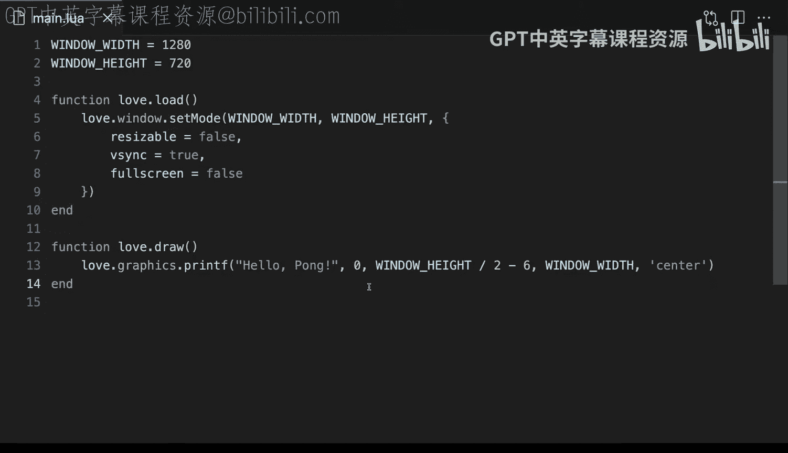

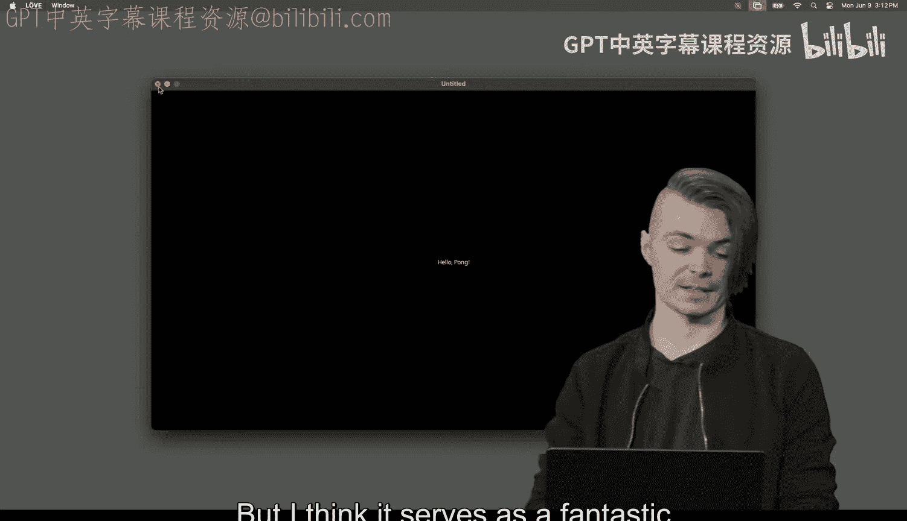

tailored with Hello Pg， but I think it serves as a fantastic and motivating example to do more。

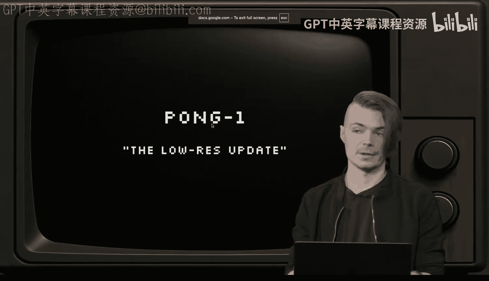

Yeah。I notice that in your code， you use the word function and n to start and stop the function。

 but a method like set mode uses parentheses like other languages。

 and how do you know whether you use the word end or parentheses？

So end is going to be typically used for the definition of blocks and terminating the definition of a block。

 so a block is when you have something like an if statement or a function body。

 something that defines its own scope is typically delimed by an end at the very end。

 versus these are called function invocations， so they have multiple new lines for readability。

 but essentially this is just a table that has been an anonymous table that is just in line in our function as a parameter which has a few key value pairs。

And doesn't actually define a new scope， it's just a piece of data effectively。

 and then same thing with this， it has parentheses to actually trigger the function call。

 so we're triggering love。window。et mode here。The difference between these parentheses and these parentheses is that in the case of a function。

 a function is expected to have with parentheses， its list of arguments。

 and so in the case of Lovedot load， it doesn't have any arguments， Love。

t draw doesn't have any arguments but lovedot updateate for example。

 which we'll take a look at has a single argument called DT by convention。

 and that is the difference in parentheses between the two instances where one is a function definition which also comes with end。

 and then one is a function invocation， we're calling a function we're actually telling it to do something with that function。

And when you pass a table like you did to set mode as an argument。

 does it matter what order you pass the key value pairs in No。

 it does not matter so yeah if you're passing in a table to anything as a piece of data。

 the keys and the key value pairs can be in whatever order you want to ultimately it just is going to take a look at all of them and it's going to essentially just store all of them in data to be referenced by later functions and not actually not actually account for order in any meaningful way。

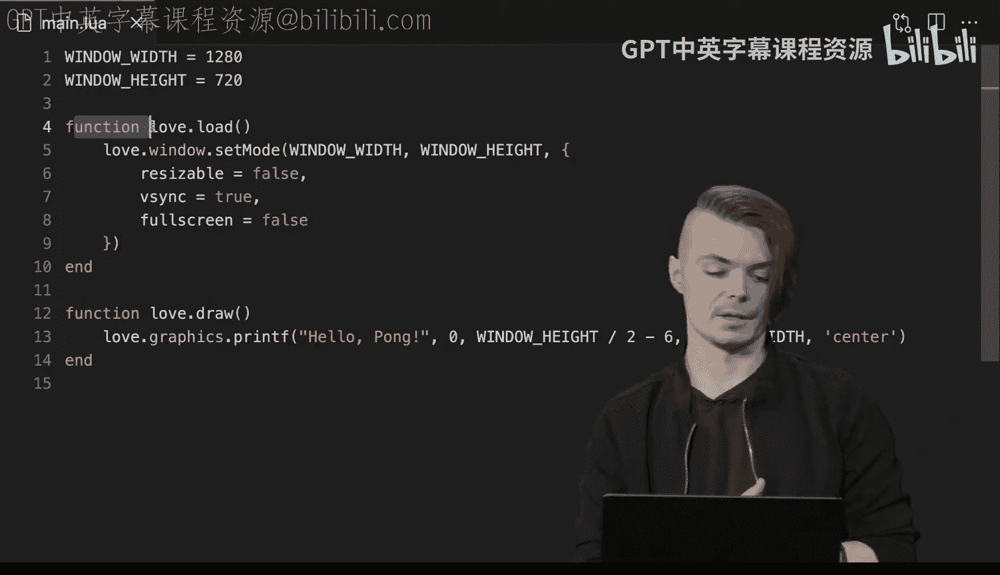

All right， so that was Pong zero， which was the day zero update now the one thing I will say。

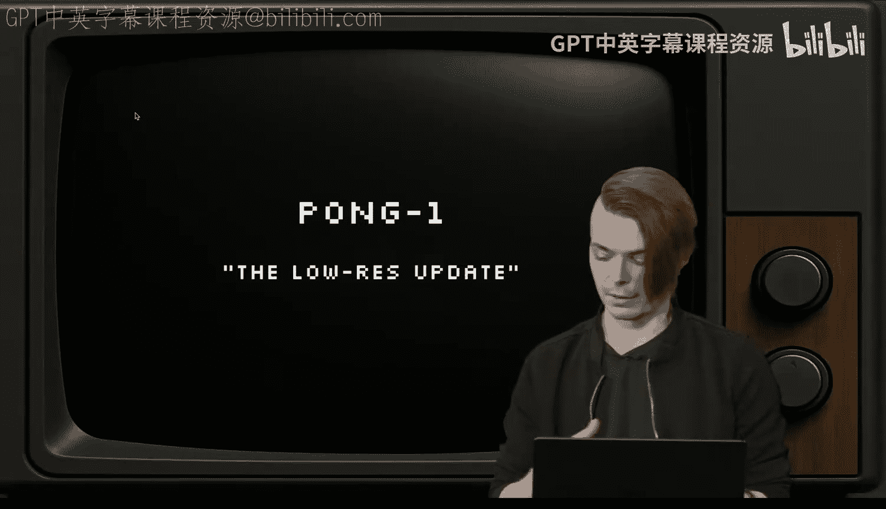

Is that。In looking at that example， the thing that sticks out to me the most， I mean。

 there are a couple of things， but certainly it's the。The low resolution。

Text in the middle of the screen that's borderline unreadable， pretty unreadable。

 and doesn't really fit。When I started getting into games。

 I think aesthetics matter a good deal I think。Pixelation matters for that retro nostalgic look。

 especially if we're doing 2D game development。 It's a very popular thing。

 You certainly don't need it。 You certainly can do fully native resolution 2D games。

 Most mobile games are this way and they look great but pong in particular is quite an older game and many of the games that we look at are very pixelixelated style games but it's not very easy often to do this with game engines or frameworks without particular tools or ways of rendering things because by default。

 if you're rendering a texture， a font， anything， any shape anything at all。

 it's just going to be whatever your native resolution of your screen is。

 and so there are there's thankfully a library that we're just going to bake into the course we're going to use that we include with the course。

 which takes care of sort of the heavy lifting of setting up a virtual canvas for us that essentially allows us to。

Pretend as if we were developing for a much smaller resolution screen。

 so most screens back in the day， if you were programming for I guess not screens per se。

 but most games were programmed with a maximum size effectively pixel wise of around 300 by 200。

 depending on which error you're in plus or minus a bit。

And now we're dealing with you 1080p or 4K resolutions and so if you try to render something at that resolution it's not going to look very good。

 you can fit it maybe within a screen but it's gonna to be tiny， we want the ability to fill our。

 for example， 1280 by 720 or 1080p window but we wanted to look pixelated just like we were on a CRT or a full screen TV playing a classic retro video game there are a few steps that we have to do in order to accomplish this and one of those is using a filter to make sure that we don't。

Have blurry art or fonts or textures， which is by default what happens in most engines or most graphics libraries they' will apply some form of filtering you should buy linear。

 tryline filtering to your fonts to your images， and it just looks blurry。

 we'll at a couple of examples of that。Also， while we're at it， just as a quick little thing。

App currently or the program that we just wrote the day zero update in order to close it。

 you might have noticed I actually had to click the X at the top left of the screen。

 it's quite a bit more ergonomic to be able to just press escape or some key to close the app and it's also a great opportunity for us to look at key handling。

 very basic input handling which remember was one of the parts of our game loop that we looked at the architecture of our game and so we're going to look at a couple of ways to do that so Lovet Key pressed is a function。

 one of Love's functions which will take a key as a parameter which is handled for us by love。

We'll have access to that key variable， and then we can do checks on it， say， hey， is key。

 was it escape， was it W， was it down？And then in order to actually quit the game programmatically based on key input。

 there's a function that we' given by love in its event namespace called love。even。quit。

 which will allow us just quit rather than us clicking the X or whatever it is in whatever command Q or Q or control W。

 we can actually just programmatically quit the application。

Here's a slide that just shows a little bit about the difference between point and linear bi linear and triline filtering。

 you can see here this graphic kind of illustrates it people that have seen N64 graphics or other engines of older times might recognize that sort of aesthetic。

 it's even prevalent still for。For good use cases in modern engines。

 because when it's applied to the right graphics， it actually causes a smoothing of various textures。

Sometimes point texture in a bigger game can be detrimental to the aesthetics of the game although we'll see a counterexample to that。

 but essentially this is just an application of the towards the magnification and minimization of a texture or a font。

 how does it actually do it， does it do it based on just literally taking what would be the nearest pixel if you were to scale those values down hence nearest neighbor filtering or point filtering or would we do something a little bit more sophisticated。

 sort of like a Gaussian blur of those pixels and filter them so that it actually looks like it's blurry in this case because it's pixel here it doesn't look fantastic but this can actually look quite nice？

Here's an example of Ari of time， which is an N64 game。

 very famous N64 game and the N64 is notorious for having bilinear filtering on everything it had very tiny texture cache。

 very tiny textures in general， and so developers would have to be stretching these very tiny textures over these large surfaces and as you can see on the right this is applying point filtering to it and it does not look fantastic I mean it looks quite like PlayStation1 graphics PlayStation had point filtering on by default versus the N N64 is biline filtering and you can see here it's just much smoother versus the right side there with point filtering you can also sort of see how the developers sort of used small textures to achieve particular aesthetics but that's essentially the difference between point and biline filtering or nearest neighbor on the right and biline filtering on the left but it can also be used for point filtering for aesthetic。

Positives， I mean I'm a fan of Minecraft， Minecraft does not have filtering on its textures。

 it is notorious for this， but I think it's to its benefit because it has this reputation now where things that are pixelated look like Minecraft textures。

 but this is an example of using point filter textures for actual aesthetic positive。

And so on that note。Let's go ahead and transition over to。

Our source code。And so a couple of things that we wanted to do， we wanted to take keyboard input。

So remember we saw Love。t Key pressed。Which takes a key， another function definition。

And then we also saw。The function love。even。quit。So we're going to go ahead and say if key。

Is equal to， we'll say escape， because I want escape to be the key that quits the application。

 then we'll just simply say love。even。quit。And then right at the very top， love。 graphics。

 set default filter。This will apply to everything， whether it's textures， whether it's fonts。

 and this will matter a lot for the future because we'll start to see this。Nearest and。Nearest。

So we'll go ahead and。So this was the， we also are going to want to do one more thing。

So I'll start this to illustrate the key pressed， the event handling showing up。

 the nearest neighbor filtering won't quite make sense yet。

 but there's one more detail we need to also take a look at so if I run this。

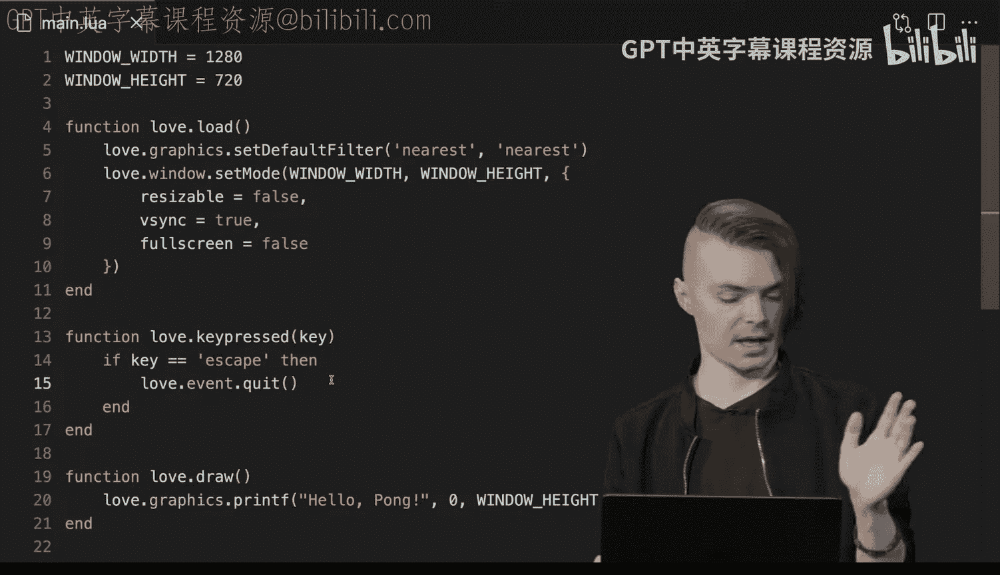

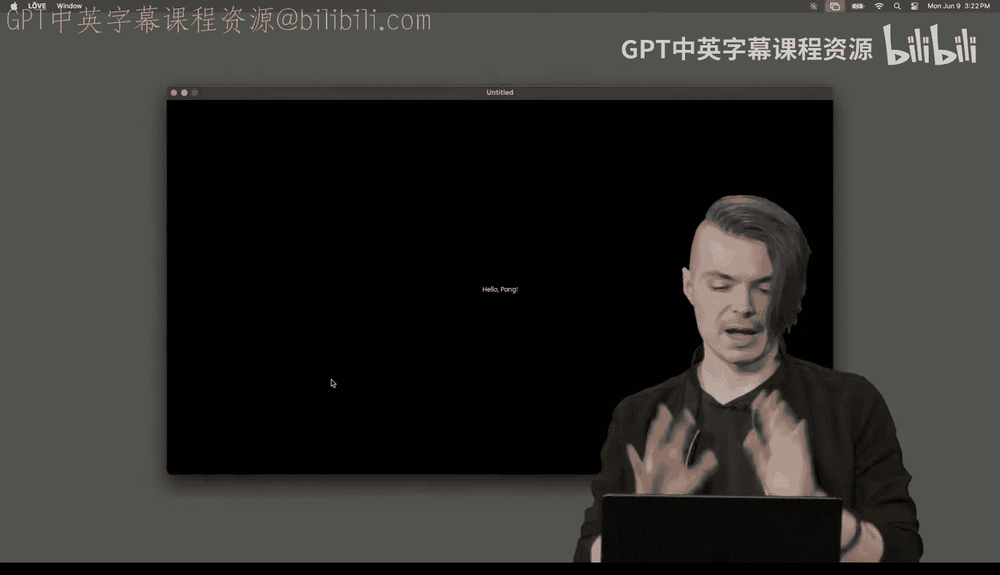

Not much looks different， it looks exactly the same in fact。

 but I've hit escape which I just did on my keyboard did not click the X。

 it did indeed close the application， so that's a huge step。

 we now have the ability not just to load things， not just to draw things but also to process input。

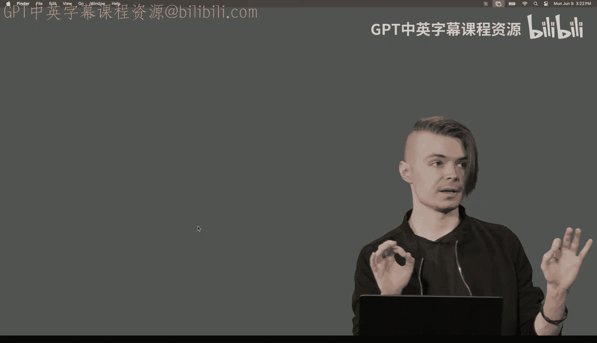

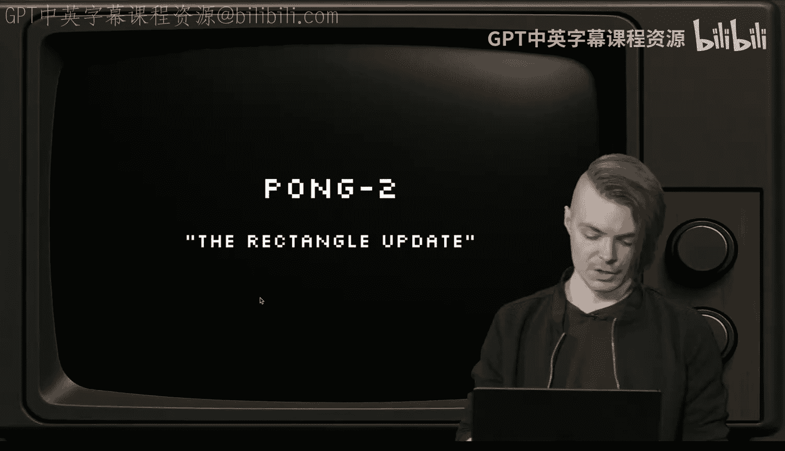

So there is one more thing we want to do。And that is to actually achieve that pixelated look that I talked about。

 So we're thinking right now in terms of 1280 by 720P。

 but I want to start thinking in terms of a lower resolution。And so we're going to set。

 let's just define a couple more constants， virtual width。

 which be we'll set that to 432 and virtual height。To 243。

 so this is a roughly 16 by9 ish resolution。And we need one more ingredient。

 which we haven't taken a look at。 And so if I open up our。Sidebar here。

You can see that I included a library called push。lua， so push is an excellent library。

Created by Ulysses Rammj。U dev and push essentially allows us to spoof as if we were drawing to a virtual canvas。

 a virtual screen， in fact， of whatever size we want to。

 while keeping it within a window that we decide we like and I think this is really important especially for this course and it's aesthetic just consistency and I mean it's a personal sensibility of mine I think。

 but the I think one of the things that sort of turned me off at times to 2D game development in certain learning context was that things looked very。

Programr art at times for lack of a better term in that there just wasn't like a coherence to the fonts versus the art。

 and I think pixelized fonts and appealing more to that retro aestheticthetic solves this problem pretty elegantly。

So push is already required now we haven't talked about how to actually use libraries。

 so it's pretty simple if you're familiar with other environments where you might use libraries and Python and JavaScript land。

 this is very very common， so we're going to say push equals require。

Push and this is a quirk of Lua that the required statement doesn't need parentheses and then push here。

 so what I haven't said so far is that all of these variables here that are capitalized rather than are just declared like this without a specifier in front of them。

Like instead of having basically instead of something like local here， which we'll take a look at。

 these are all global variables， meaning that we can declare them anywhere we want to and they'll just be accessible anywhere we want to。

 you'll notice that we are using them here and it's fine。

 we could also just define a variable in here called virtual with equals whatever and it would also be globally accessible by the nature of just how LuA works。

I would argue that that's probably not great practice。

 you typically want to prevent too many global variables or keep a handle on them。

 but we'll explore that topic in detail a little bit later。So we've required push， we've imported it。

 we can now use its code， its purpose is to set up our screen。

 it' to set up our game our window to operate as if it were a lower resolution screen。

 so we can call push that setup screen。And then we will do virtual width and virtual height。

And then it takes a particular parameter called upscale in its table， it's very similar to love。

window。et mode， but it takes a parameter called upscale which just is the way that it applies its pixelization it magnification to fit your window there's also pixel perfect which we'll try to preserve the overall layout of things to fit but just like downscale it versus upscale willll actually shrink everything and fit it within our window and we'll see that in just a moment。

So that's step one， step two。Is we need to actually wrap。Everything that we do。

In in our draw function inside two push calls so this sort of like puts our game or our code in a state of existence so by calling push dot start we're essentially saying okay。

 everything you draw right now is going to be drawn to this virtual screen。

 this virtual resolution and then once we call push dot finish that's essentially saying okay now turn off push。

 whatever you draw is going to draw just to the window it's going to be native resolution。

 no magnification so I'm going to save that。And I'm going to run this， now this should， essentially。

 if all goes well， hellello world recall previously it was very tiny。

 it should now be substantially larger but still centered in our screen。

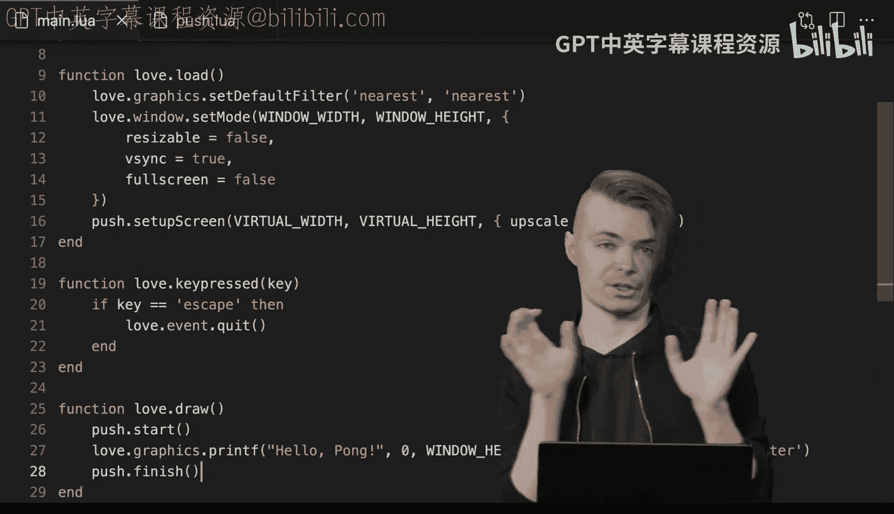

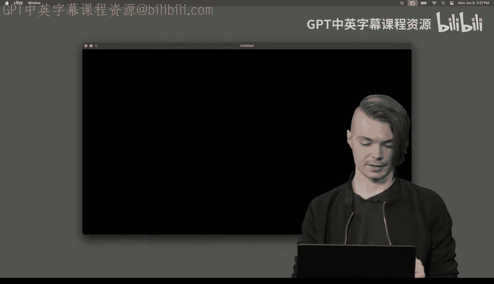

It is black because。Let me go back to the source code here。

 I neglected to also change the window height and window width of the actual printer function that's also an important thing to do so all of our actual calculations should also be done all of our printing drawing everything should also be done in virtual width and height terms not in window width and height terms because now if we're pretending that we're instead of a 1280p by 720 screen right a 432 by 243。

 we want to also be thinking in terms of those XY coordinates。

 so I'm going to go ahead and change window height to virtual height。

And window width to virtual width。

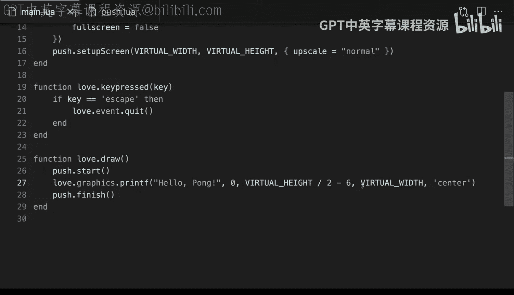

And now if I rerun this。We'll see that indeed， we have perfectly centered。Hello Pong。

 except now it is no longer very very tiny， it is in fact it feels very cohesive。

 it feels like we're rendering for something from a bygone era， perhaps。

 but I'm just a huge fan of this sort of aesthetic this way of programming this virtual way of doing things and it'll transcend to all of the other lectures that we have going forward to give us a coherent sort of like super Nintendo or whatever era style look。

Yeah。In main dot Lua you had a couple of strings that were double quoted。

 but others that were single quoted， does it matter in Lua which you use。

 it does not matter in Lua whether you single quote or double quotea string。

 the only time it would matter is if， for example， in your string you had an apostrophe in that case。

 and this is a problem this is an issue that。

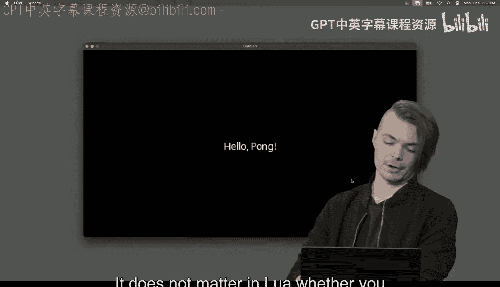

problem issue quirk that any language that has these two types of strings we have to deal with。

 so in JavaScript or Python， the same issue occurs。

You would either escape it with a back with a forward slash or you would single or you choose to use double quotes if you wanted an apostrophe and single quotes if you wanted a quotation mark and so forth。

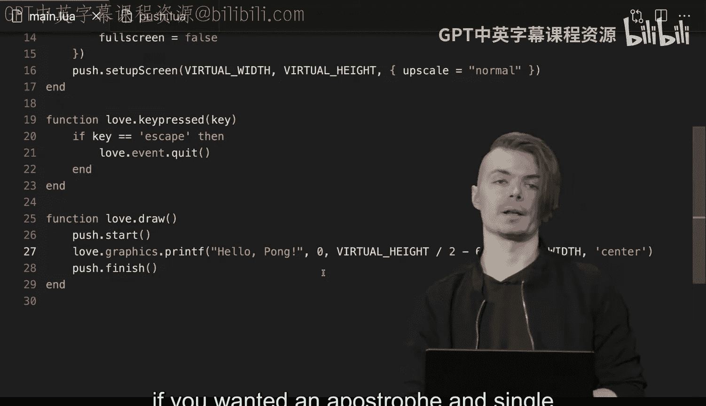

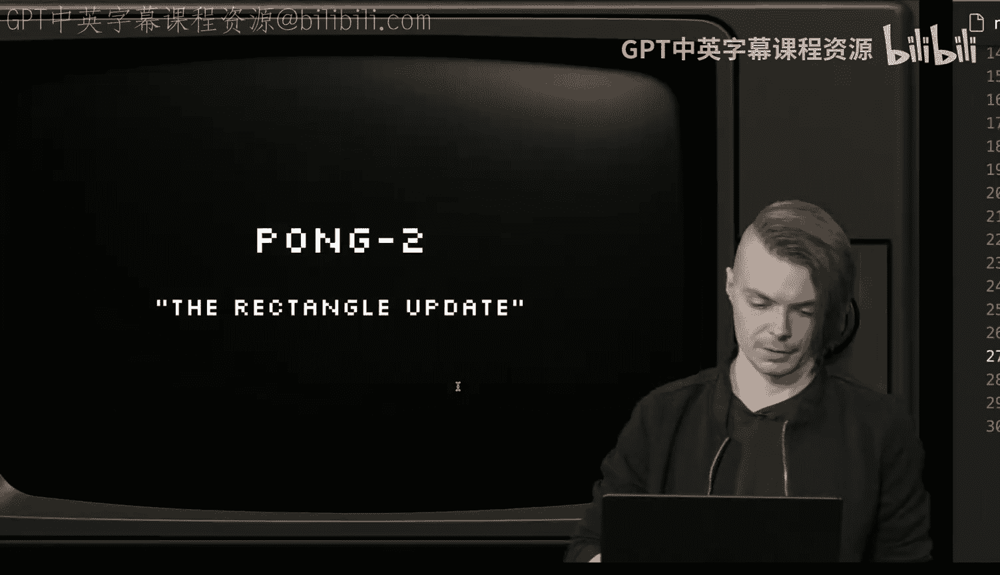

All right， so that was the low Res update， so now we are essentially configured to render in low resolution。

 which is great， this will help that project here。

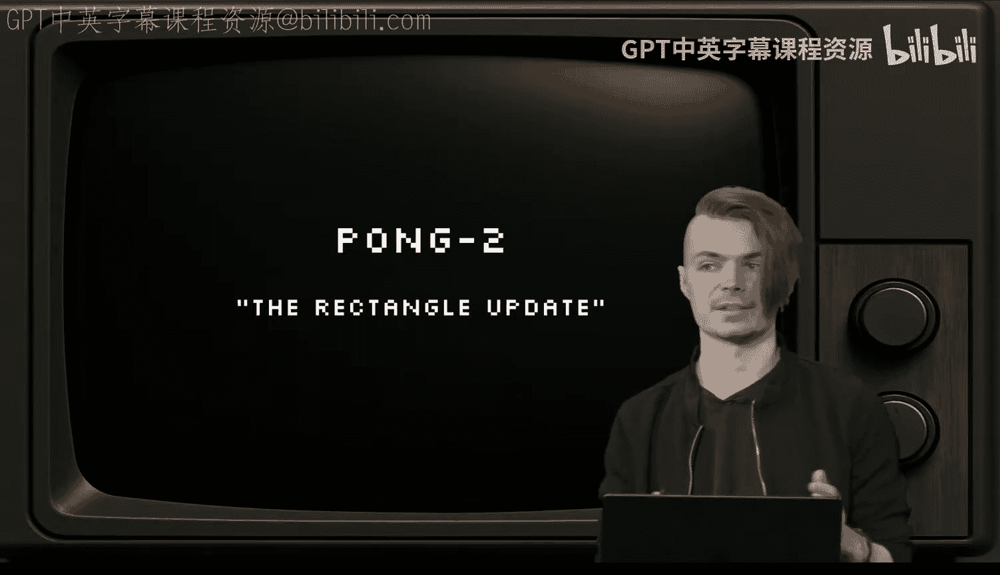

Maybe we should rewind just to get you saying something like。In fact， for consistency。

 I should probably stick with single quotes for these strings。

Theres no rhyme or reason why those two were singled out。

 so I might just at least verbally do something about that。I can try to help you rewind。

Because do I prefer probably prefer？In main dot Lua。

 you used double quotes around a couple of strings， Nor and Ho Pong。

 Does Lua support both single quotes and double quotes。Yes。

 so Lua does support both single quotes and double quotes。

 the situations which you might want to use the double quotes for sure might be if you have an apostrophe。

 for example in your string so that it's not acting as the delimiter for your string if you were to use single quotes and vice versa if you wanted to actually have a quote in your string you might want to use single quoted strings in this case for consistency though we should definitely make sure that these follow the traditional rules for that so I'm going to go ahead and change both of these to be single quotes。

 which is typically what I program with throughout the course of the lecture and all the example code。

 and then we'll abide by those rules just to insure consistency going forward。

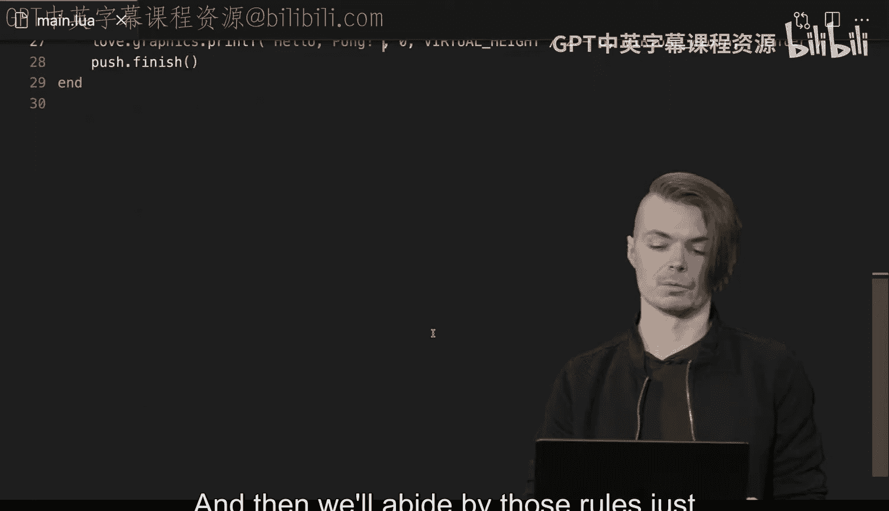

All right， so that was the low Res update， so now we're going to take a look at something slightly more interesting than low resolution。

 in my opinion。Although I do love the low resolution the fact that we're only drawing text right now is somewhat on the austeor side I suppose。

 so in order to actually get graphics onto the screen pong is interesting in that it is pretty much just rectangles。

 rectangles in color and a little bit of text so we already know how to draw text which will be able to use for our scoring rendering but in order to actually draw rectangles we want a way to draw rectangles and thankful that's very easy with love they give us a function called love dot graphics do rectangle takes a mode which can be either fill or line so we're gonna to be using fill rectangles meaning that it's just literally filled in low line rectangles can be useful for example if you want to render debug collision boxes for your sprites or for whatever that can be a very useful tool in fact we'll see uses of that in the future but we'll be using fill mode and then it takes an x and a y and then a width and a height and then love we'll just based on our 2D remember coordinate systemll just draw that rectangle there and so we can draw squares rectangles。

 whatever。

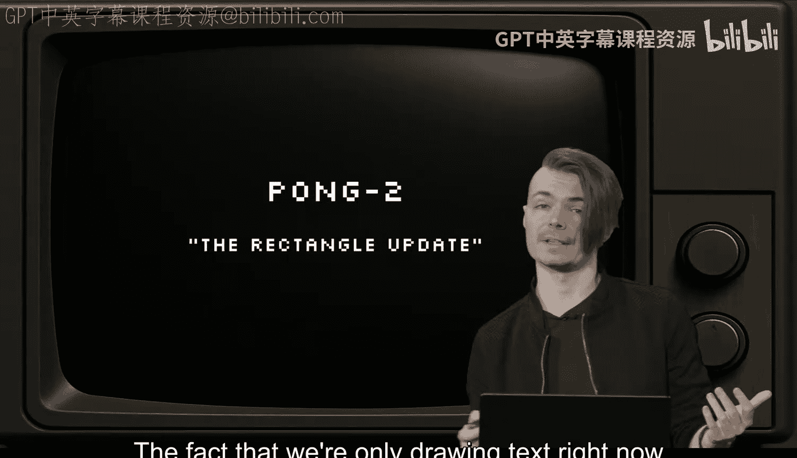

namee it， but they are all going to be rectangular， they won't be rotated or anything like that。

 and then that' will essentially be everything meaningful graphically。

 it will be our paddles on the left and right as well as the ball in the center of the ball as a square but it is still a rectangle drawn with an X Y a width and a height There will be a couple of other functions that we want to show here too。

I want to also kind of begin laying out some other aspects of the game in particular the scores next to the ball as we're rendering sort of the beginning layout of our pong official game or at least what will be our game right now it' just a black screen with some text in the center。

 but pong itself actually has a slightly different color to the background than just pure black。

 it's some sort of grayish， darkish grayish， bluish color。

It also has the scores to the left and the right of the paddle and so we can actually knock out all of these at once if we just use a few of these extra functions here so recall that we sort of used love。

 graphicics。 printf but we didn't have any font information or anything we alluded to the fact that the font was 12 pixels by shifting it up six pixels half of its size on the Y axis but if we want to actually show a big font well we probably don't want to use a 12 pixel font we probably want to use something maybe like 32 pixels we can mess around with the sizes in there but in order to do that we actually have to create a font object in love and we do that with love。

 graphics。 new font it takes a path to the font as well as a size。And then。

Also one other thing to note too is we're just using whatever the default font is in love 2D。

 which isn't all that exciting of a font， I think for most game development。

 a lot of gaming is about smaller they're not really small but meaningful aesthetic choices can do a great deal to help immerse you and just make you feel good about what you're playing and the default font is。

Less than stellar I think for pong so we're going to use a new font。

 a new open source public free font that is really nice and pixelated and I think does the job pretty well。

 And then in order to also have it render with it， we need to set it we need to call love graphics。

 set font and then lastly， in order to change the color of the window so right now it's just pure black but if we want it to be that like grayish color in the background we're going to want to set the color with this clear function Love graphics do clear it uses a clear color。

 whatever the current color is in Love2D it sort of like the state background variable that we can also manipulate。

 it's going to use that to actually clear the screen and so another point about font too which I think this is a good example of sort of why it's meaningful this is a final fantasy1 remaster or which came out a few years ago and initially when it came out there was a lot of complaints about the font because as you can see it's using some sort of aerial or Helvetica that's very tightly smashed together and aesthetically it just doesn't quite。

Mesh when you have this sort of pixel JRPG look that the rest of the game is going for and so font meaningfully I think is a good aesthetic thing to take into consideration and to actually apply so we'll start doing that right now with the next example。

So I'm going to go ahead and walk back and we'll start incorporating these new ideas。

So。We'll knock out one thing。Right now to start off with。That was the love Dot graphics do clear。

And so we had a。We have a color， I have a color in mind， I don't remember the exact RGB offhand。

 but it's something like。45，5020 I think， and so the interesting thing about lovedo graphics。

 clear and I think this is a broadly useful piece of information is that it takes in an RGBA sort of quartet and those four variables are what form and RGBA not triplet RGB triplet。

 but it has also an alpha component which is transparency， RGB is a very prevalent。

 there are multiple color spaces to work within but RGB is very prevalent historically and still today in not only just game development but also CSS and the other domains。

 which essentially models and you that we saw that in the pixels that we saw previously they were modeled with RGB lights。

You have three different lights that go from 0 to1 or 0 to 255 that if you combine them in different ways。

 you produce many millions of colors， so by setting something like 45 over 255， 50 over 255。

 20 over 255， and then one，The reason that we're dividing these numbers by 255 is that love。

 graphics。cle expects a 0 to1 floating point value。

 and RGB is traditionally thought of as groups of eight bits， so 0 to 255 for RGB and A。

 and those together form one full byte of color。And what that allows us to do is model those components separately and then raise and lower them within a relatively decent range。

 but because love is built in a particular way where the GPU sort of expects voting point values。

This function expects floating point values so in order for us to think about these RGB values from 0 to 255 but also communicate them to love in a way that is between 0 and1 we're just going to normalize them by dividing them by 255 so these will equate to the zero to one floating point values that love do graphics do clear and any other color functions that we use in the future is going to want to see so if I just save this and run it。

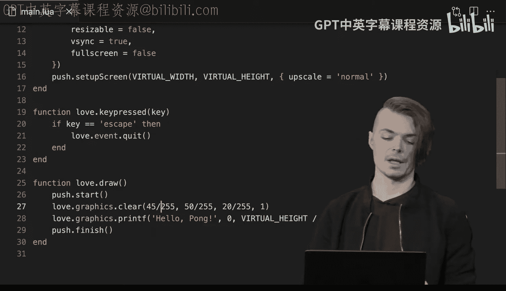

We'll see， this is not the color that I was hoping it would be I might have to cheat and look at my RGB colors。

 It's a different color for the sake of fun， maybe we can keep it。

 but you can see that we changed the background color at the very least of the window using that function and so that's happening every single time that the screen that lover is calling that draw function rather so this is happening along with the printout this is happening every 160th of a second。

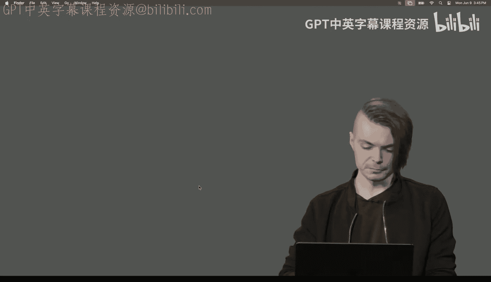

So I'm going to quit that。Go back to the code。Now。Probably the more perhaps meaningful thing that we wanted。

Was to actually create the rectangles and the score that was in our example。

So if we look at the directory that we're in right now。

 so previously I had added in advance the pushushdolua file which we imported last time。

 but there's also a font。 ttF file in here which I've included。

 I wonder if Mac does Mac have a preview they usually have a preview if you're looking at it in finder we'll see it in a second but what this will allow us to do is this is just a font file。

 there's TtFs， there's OTFs， there's a couple of other font file types but these are very very prevalent TtFs and OTFs。

 and so this is just a fonts data and so by itself it just represents the fonts overall shape and then we can also size it however we want to so I'm going to go ahead。

And do a。We're going to go ahead and。Close that。So we have two things we have to do。

 we have to create the font and then we also have to set the font， so I'm going to go ahead and say。

 we'll do it maybe here， so we'll say large font is equal to love dot graphics do new font。

And then this should be at font。ttf at size 32。Let's say we want to also keep rendering at a smaller font to maybe give us information。

 debug stuff， whatever， we're going to create another font。We'll call it small font。

Love our graphics in font。Same font。But eight pixels instead of 32 pixels。

So now we've got these two fonts。If I come down here。

And I say love dot graphics dot set font to small font。

And we rerun this now this is going to be slightly off。

 I'm going to change this to four pixels minus to account for the fact that now we're using an eight pixel font so the default 12 pixel font going to run this。

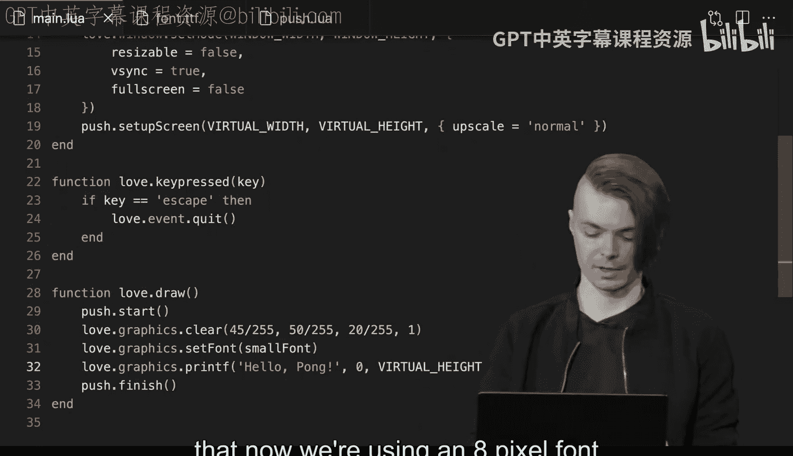

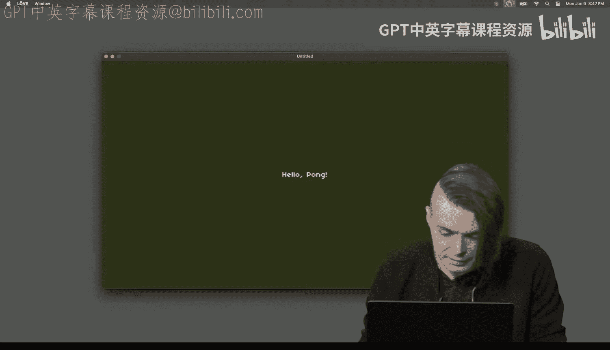

It's a little bit blurry looking because I think I put that above the love Dog graphics that set default filter。

 which you don't want to do。

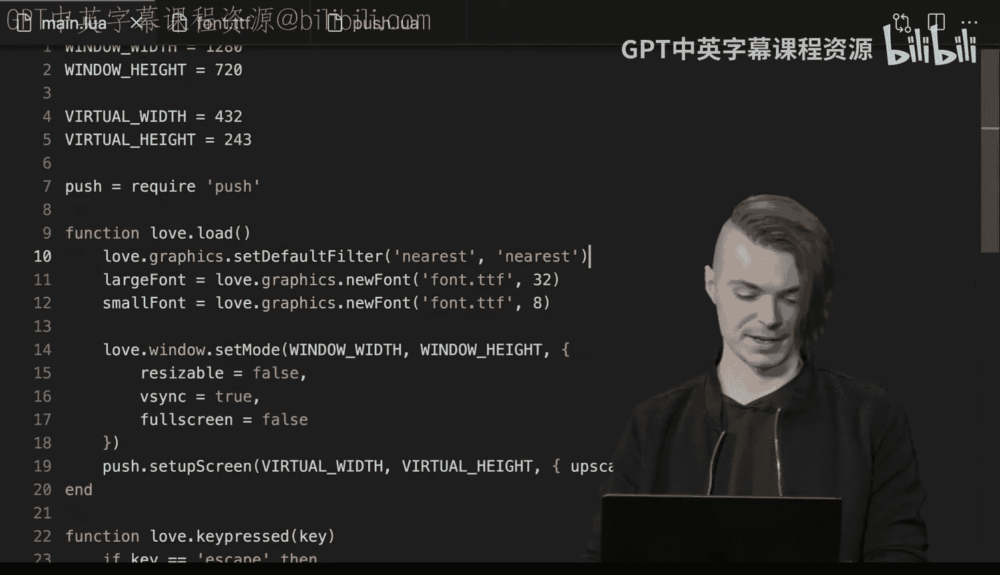

That was an example of bilinear filtering， and it looked not good。

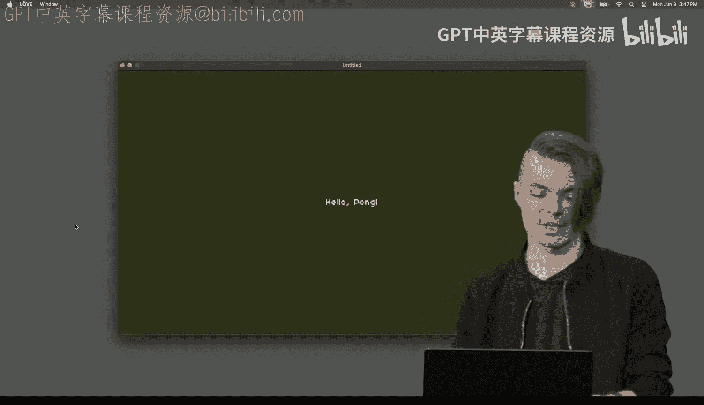

So I'm going to go ahead and rerun that， you can see now it looks very crisp， but it's quite small。

 eight pixels is quite small。But if we were to conversely instead。

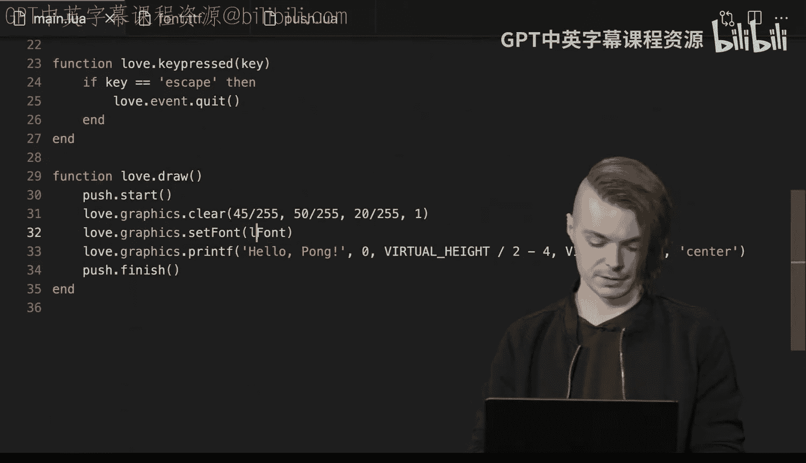

Set the font to the large font and then minus 16 here。We'll see it's very large。

 so this is an excellent font for us to use for our score to the left and the right of the if you're called the image from before。

 where we have the ball sort moving the paddles， the score in the top left and the top right。

 this is an ideal ish size for that font。

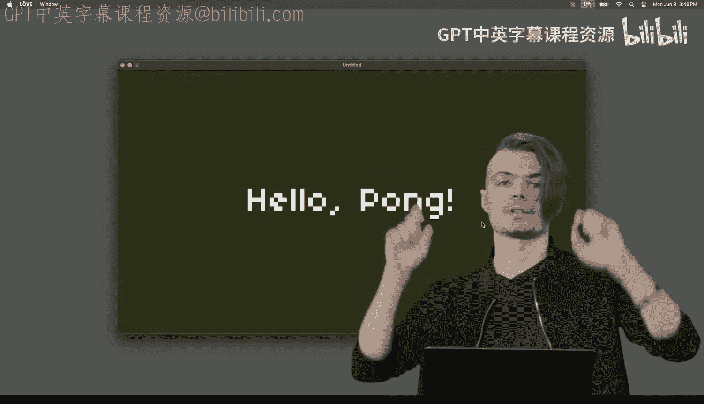

Still not an ideal background color， but we'll fix that。

I'm going to go ahead now so we've got the fonts taken care of we can now import and create new fonts and set them to whatever we want to and that's great that's going to serve us very well。

 we also want to be able to draw our rectangles onto the screen which we talked about so thankfully that's quite simple I'm just going to go ahead and say。

😊，Love dot graphics， dot rectangle。It's going to be a fill rectangle， so not a line rectangle。

 which you alluded to。I want this。 this is going to be Paddle1。

 so let's just say that over write a comment。 So this is how you write a comment in Lua incidentally。

 which is just a dash dash， hyphen hyphen space and then whatever you want。

Sort of an interesting way to do comments。So it's going to be a fill rex so recall Love our graphics I rectangle takes an x or Y width and a height。

 so let's say I want it to be slightly away from the left edge， so let's say at 10 pixels。

 I want it to be a little bit below the top so we'll say1 again I suppose。

 so 10 pixels from the left， 10 pixels from the top and then I'm going to want to set this to be let's say five pixels wide by 20 pixels tall。

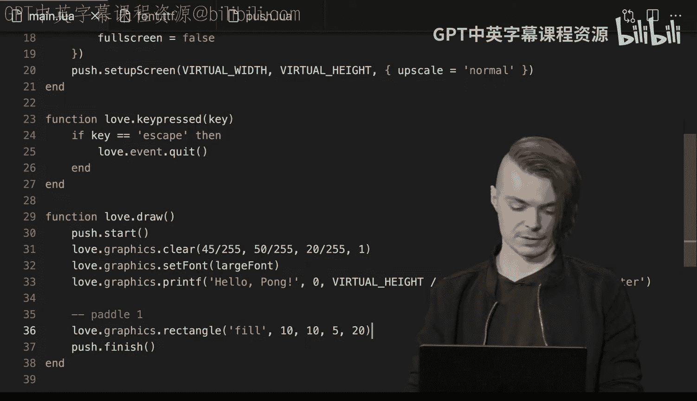

And then let's go ahead and run this。We do indeed see it。

 we see our rectangle exactly where we said it would be 10 pixels from the left。

 10 pixels from the top， these are virtual pixels so it might seem like that's more than 10 pixels on modern screens。

 but that's 10 virtual pixels left and from the top and then the rectangle is five pixels wide。

 20 pixels tall， it is rendering in white， which is the default sort of like draw color which is different from the clear color。

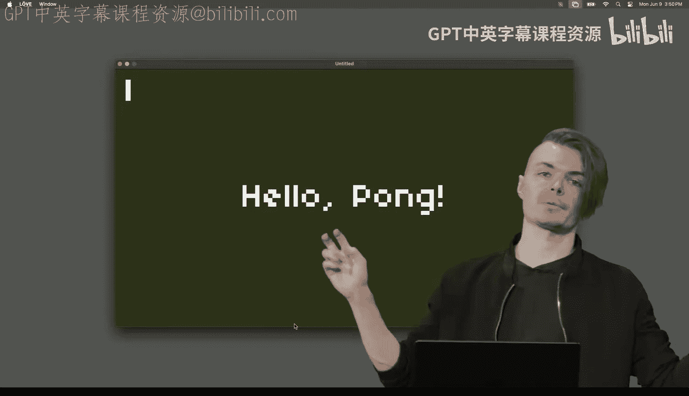

So I'm going to go ahead and now let's do the pedal too。Love do graphics that rectangle， fill。

So this is going to be on the right side， let's say this one we want to be sort of from the bottom。

 so we'll say virtual width minus 15。And we'll say virtual height。Minus 30， approximately。

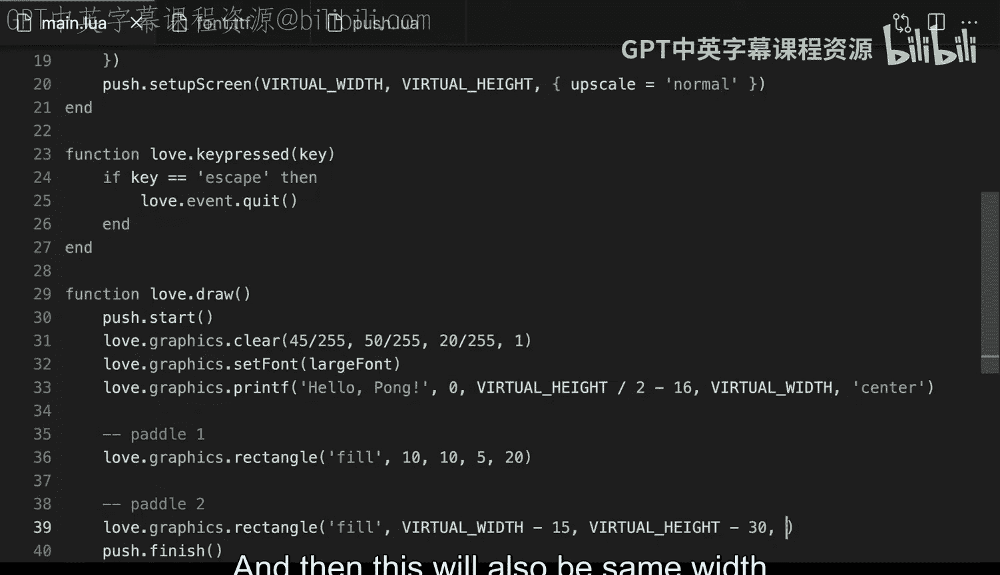

And then this will also be same width and height as the other one， so 5hi by 20。

 and we'll just render that。

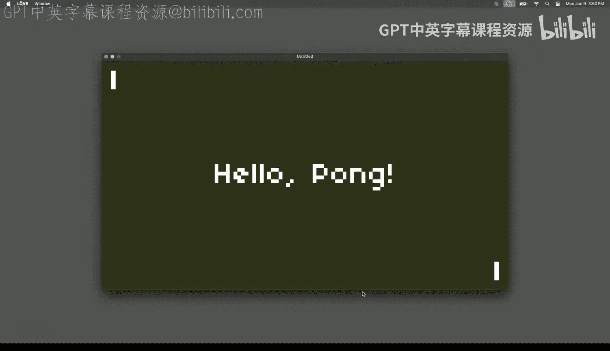

And we'll see that perfectly matches sort of like symmetrically with the other rectangle。

 Let's go ahead and get rid of the hellello pg for a second here。

 I'm going to hit command slash to comment that line， and then I'm going to also draw the ball now。

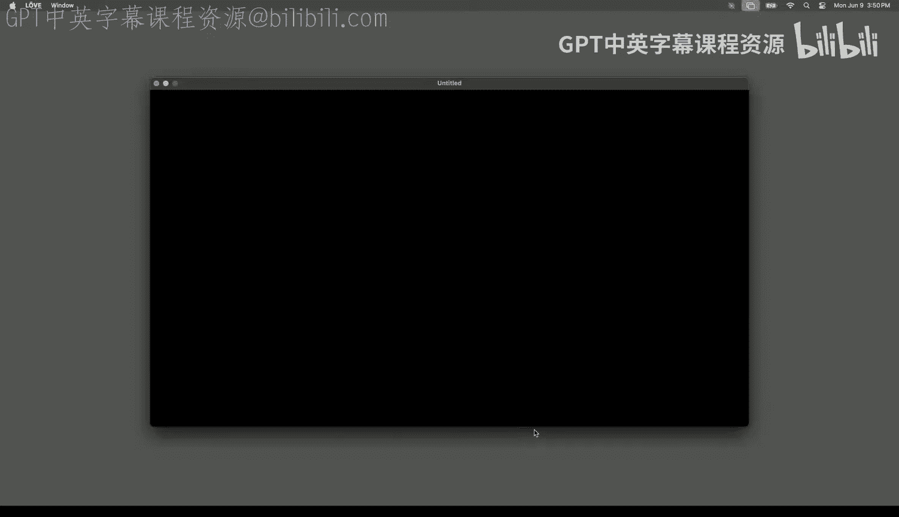

Love dot graphics， dot rectangle， fill。And then this is going to be centered right in the middle of the screen and let's just say the balls four pixels wide by tall。

 so we'll say virtual width divided by 2 minus2， so we're instead of drawing it right at the center。

 we're going to shift it backwards by about half its size so that it is because everything gets drawn relative I may not have mentioned this explicitly。

 but everything gets drawn by its top left coordinate。

 so when we say10 pixels by 10 pixels we're saying。For this first paddle， for example。

 let me just rerun this， making sure that this works properly。

 I'll figure I'll finish the rest of this ball call first。 So I'll say virtual height divided by 2-2。

4，4。

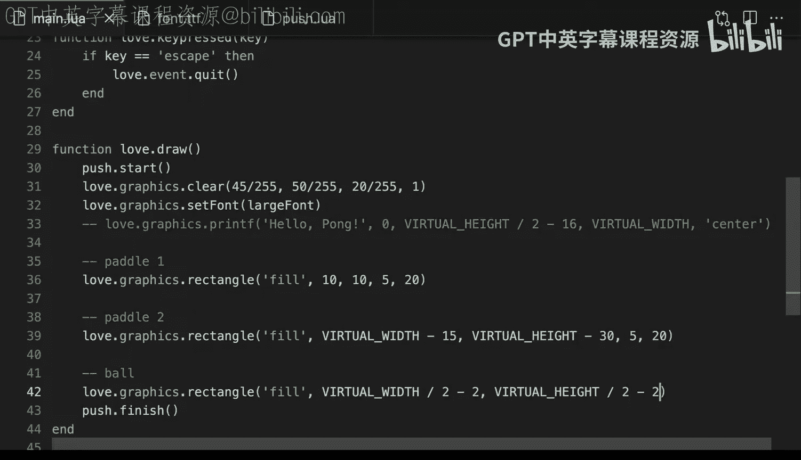

So it's quite tiny， but you can see that for the top left rectangle， for example。

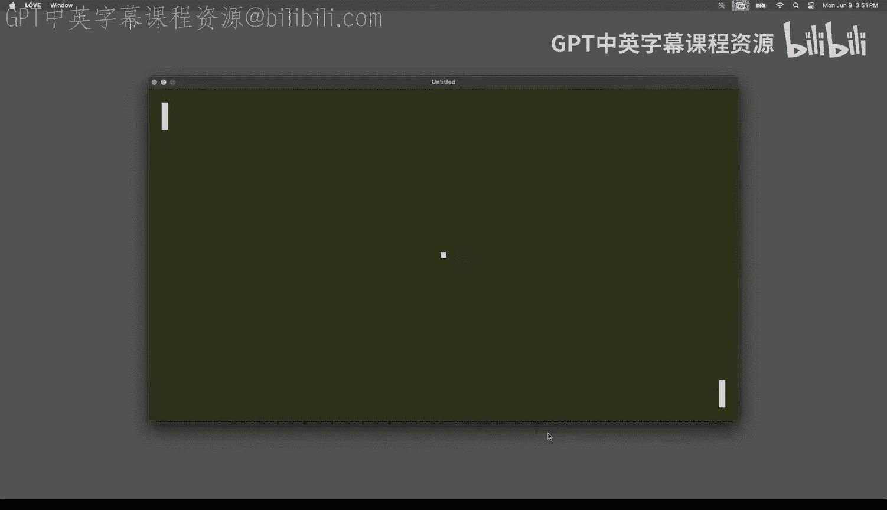

We specified that it should render at x coordinate 10 y coordinate 10。

 and when we say render at x coordinate 10 Y coordinate 10。

 what we mean is that the top left corner of that rectangle should start at that position and then it will draw its width and height towards the right relative to that so you can see that we do indeed see that 10 pixels to the left and from the left and from the top and then five pixels wide by 20 pixels tall and same thing here with the right paddle what we did is we decided to draw it all the way to the bottom right of the screen using virtual width and virtual height except we applied a negative offset。

 we said virtual width 15 to accommodate for not only the 10 pixels away from the edge but also the five pixels of the width because we have to remember accommodate for the fact that we're drawing based on the top left coordinate so if if we want to show it 10 pixels from the right it actually has to be drawn 15 pixels。

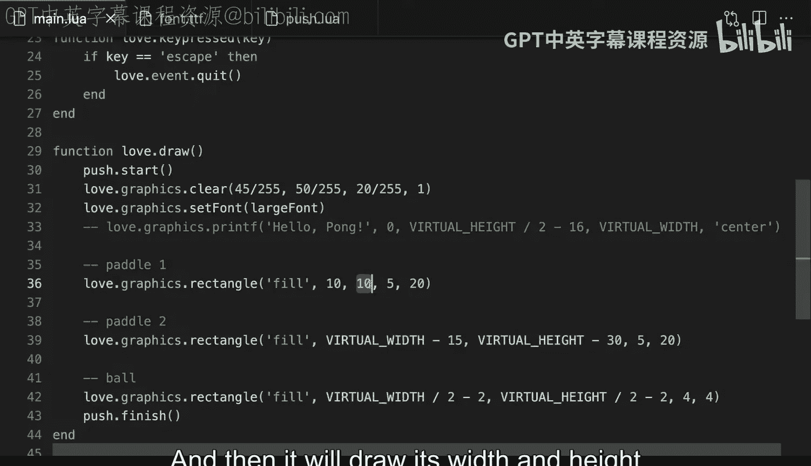

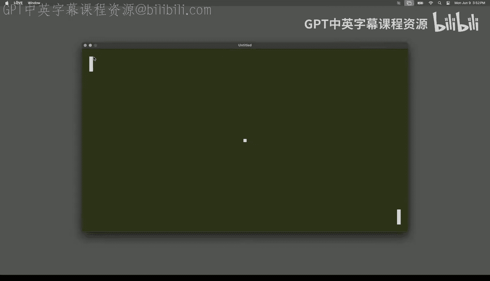

From that right side。Because the width is baked of the rectangles baked into that calculation。

 So that's what that offset is there。 and then same thing for this 30 pixels。

 where're actually if you want it to be 10 pixels from the bottom because the rectangle gets drawn 20 pixels tall we actually have to start drawing at 30 pixels from the bottom so the 10 plus the 20 of the height and then here because we're just centering pretty evenly we can just divide by two and then subtract half of the width and height and then that gets says the paddles and the ball And so the very last step in this example would be we don't have the score now we have essentially already thankfully a piece of code here that we can kind of use for that so if instead。

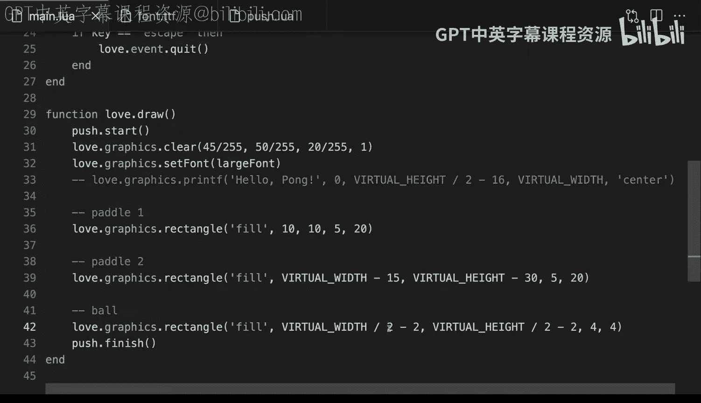

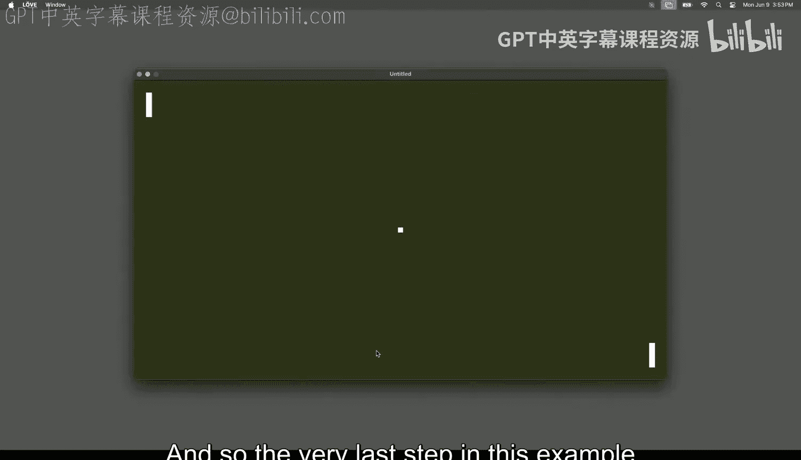

We go ahead and we say， let's just go ahead and print， first of all。

 why don't we start storing the score？These aren't used for anything yet。

 but let's just say for looking towards the future， we'll say player 1 score is equal to0。

 player2 score is equal to0， these are global variables again because they weren't declared with the local keyword which we haven't seen yet。

 but these can be used anywhere， so player1 score， player2 score。

What we'll now do is instead of previously we had Hello Pong as a hard coded string in this function。

 what we're going to do instead。There's a function called two string baked into a Lua。

 which will take in an integer value or pretty much any value， I believe。

 and print out a string representation of it， or return a string representation of it that we can pass into lovedographs。

 printf。So what I'm going to go ahead and do， I'm going to go ahead and say love print off two string。

 and then we'll say player one score。And then love graphics up printf， two string player two score。

And then this will also be virtual height divided 2 minus 16。Virtual width。And then center。

And then this。Believe we can just call love do graphic do print， give it a。Hard coded。Value。

Instead of centering， instead of doing any formatting， just for eases right now。

 we'll just use love do graphic print， which won't apply formatting。

 it' will just print at literally the X Y that we tell it to。

 so I'm just going to say we'll start at virtual width divided by 2 and actually let's minus that by let's minus that by 50 maybe and then virtual width。

Divided by 2 plus 30 ish to ballpark， and then we're going to go ahead and get rid of these last parameters here。

 these are no longer useful because we're not applying formatting operations。So get rid of those。

And we'll go ahead and now we should run this， we should be able to now see the scores on the left and the right approximately。

 but centered， there are going to be a little bit maybe too low in the middle because of the virtual height here。

 but let's just take a look and make sure we're on the right track。

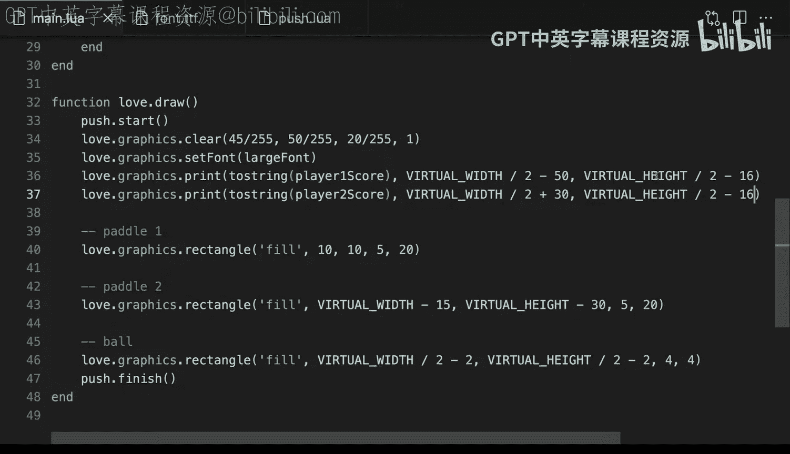

WellThat's quite actually not horrible looking right in the center there。

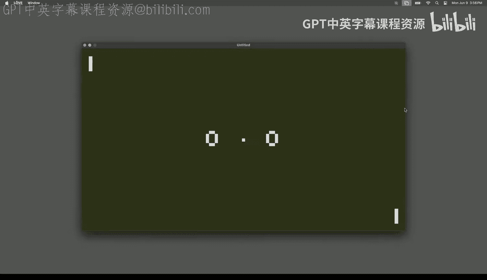

Let's maybe shift them up just a touch just to make them look slightly better。

 they'll say virtual height divided by  two minus like 80 something like that。

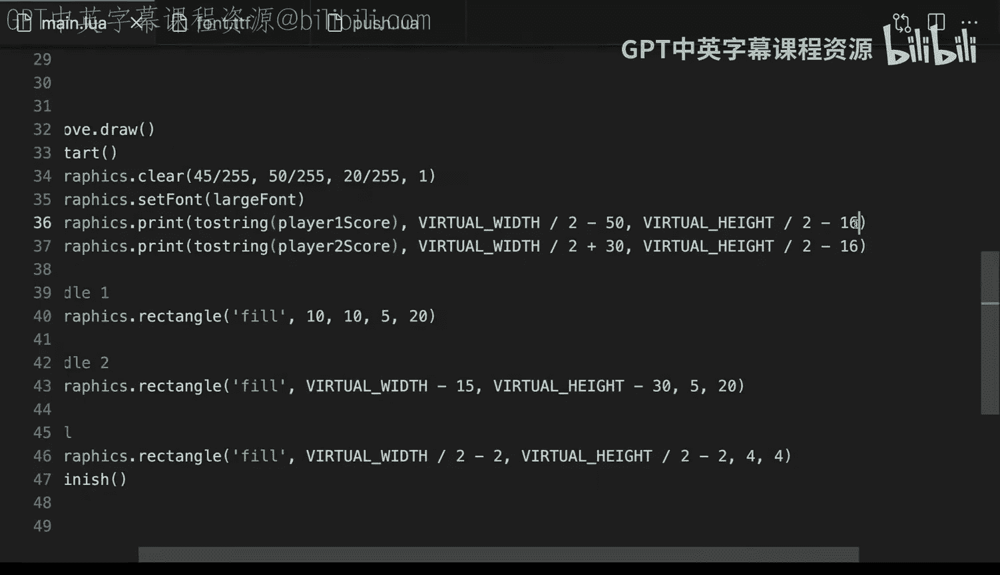

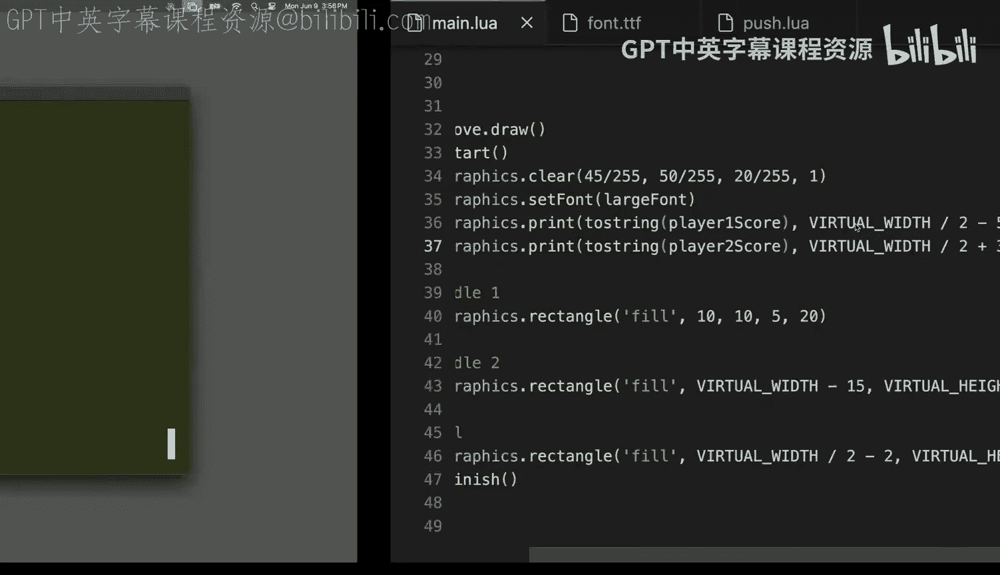

See if that's not too bad looking。

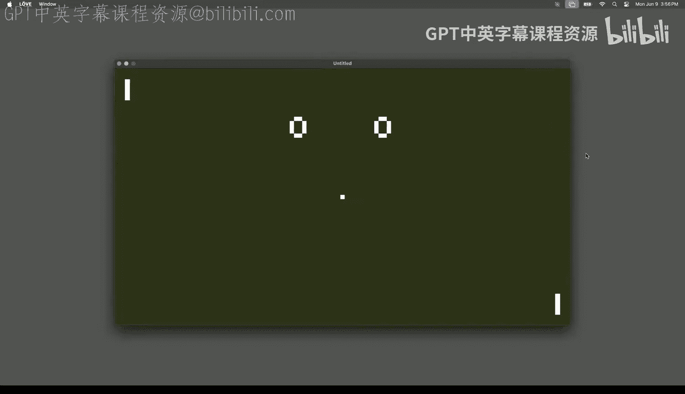

Yeah， I would say it looks pretty good， and so with that minus this rather unappealing olive color。

 which I can cheat maybe and look at my source code real quick and see what did I actually use for the RGB colors？

40，45，52，40，45。40，45。

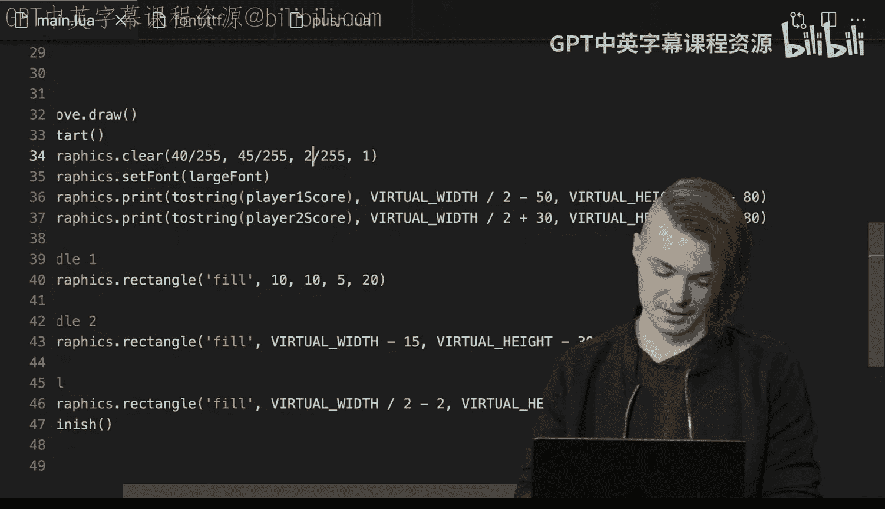

52， I was a little off on the on the B there， the B value， the blue value。 that looks much better。

 Okay， that's much closer to much closer to pong。 And what's cool is now we have effectively。

 at least a skeleton， a visual skeleton of real。😊，More or less pong。

 you might look at this and think， oh wow， I'm actually playing pong， so yeah。

 we've made a ton of progress already。I was thinking a break maybe right there。 question， Yeah。

 can we take the mics down。So now that we have a sort of rough approximation of what our game is going to look like visually。

 the question presents itself of how to actually get the game to behave more like a game because right now it's very static but I could press keys all day long。

 nothing's going to happen we've seen input handling so far but it's been just to quit the game hasn't been anything dynamic of movement related but we are going to need to start integrating things like that in order to properly have the game that's interactive so to illustrate some of that we're going to go to the next update which is the paddle update and so it's named that way because the left and the right rectangles that we created that we drew we're both our paddles so that'll be the nomenclature that we use paddles and then ball in the center which will be relevant in a few examples but essentially what we need to do is now allow for those to move because then being static it's obviously this just we're essentially making very strange art at the moment。

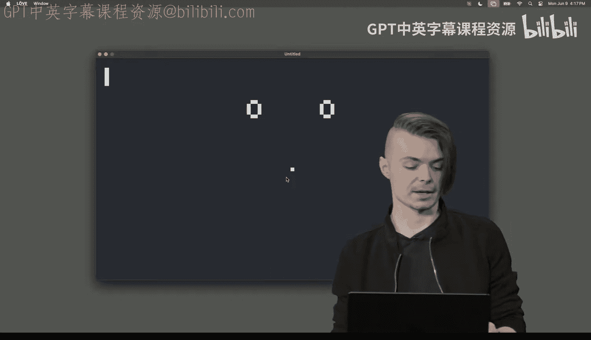

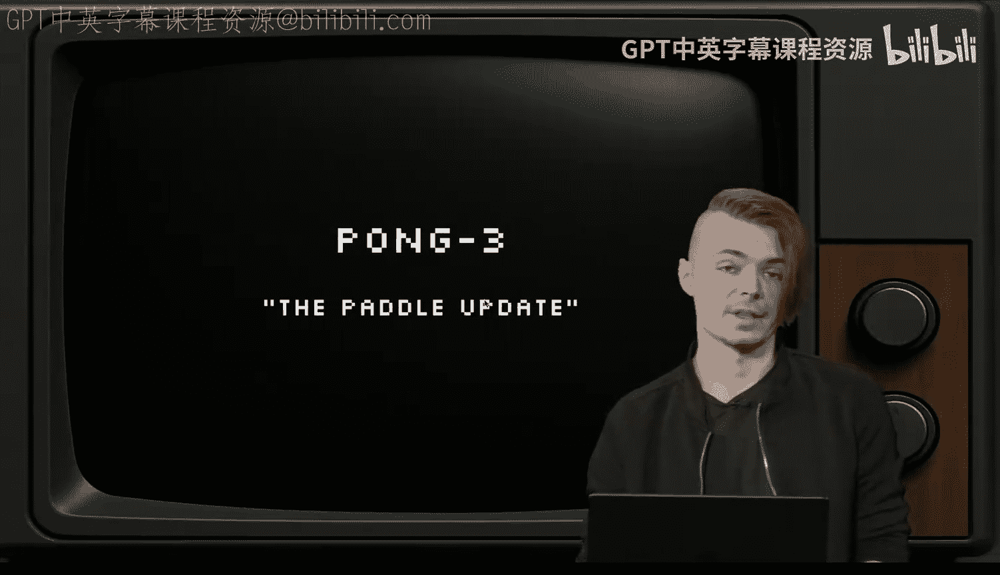

But we're going to need a couple of functions in order to do this。

 so one of them is going to be so recall we used love dot key pressed。

 which is just a callback function essentially that will trigger once whenever a key is pressed。

 so we press it， love is listening to that and then it fires that event and then handles the actual pressing with whatever we decide to put in that function。

But if we， for example， want to press and hold a key in order to move a pa。

 let's say up and down consistently， well keys isn't going to work for that because key press just works one key one time so you press it and you can hold it all day it's just only going to fire the one time Thankly there's a function called lovet keyboard dot is down which will just continuously do a check whenever you call it。

 but we can't put that in love dot key press， this is where we actually get to use the arguably most important function that's in the game loop。

 although you can make arguments for any of them I suppose but love dot update which takes in a DT parameter and Dt is short for deelta time and this is a very important concept that we'll talk about。

But essentially。Lovet update is going to fire every single frame。

 so 160th of a second approximately depending on which resolution or not resolution。

 but what our game is actually running at hurttzwise， 60 frames 30 frames， 144 frames。

 it's going to run just like Drawwall once every time that happens every frame and then it's going to also pass in the time that DT is the delta time it's called that because it's the time that is passed in seconds since the last frame。

 so this will be some fraction， some 0。 whatever it is 0。

00 or 016 or something which is a small very small value， but this is actually a very crucial value。

 maybe the most crucial value that we use because it ultimately is the driver for how we can get consistent behavior across different computers。

 because if I'm running computer or console that renders let's say at 30 frame。

per second or is not well equipped and maybe 20 frames a second or maybe it's running really fast at 144 herz a second because they have a really good GPU and we're just doing things every frame well in one second。

 60 iterations could happen， 144 iterations could happen 10，20 iterations could happen。

 we need some way to normalize across all possible frame rates and the way that we do this is with this DT variable so love keeps track of this processes it and sends it to us via this parameter when we call when we define lovedot update and so we'll have access to this DT in our update function which will allow us to multiply essentially anything that we want to that is movement or timebased and it will scale no matter how many frames that delta value will be smaller。

 the more frames run in a given second and so therefore those things will move more times but smaller。

Incrementments and therefore， everything will sort of be normalized this way across variable frame rates。

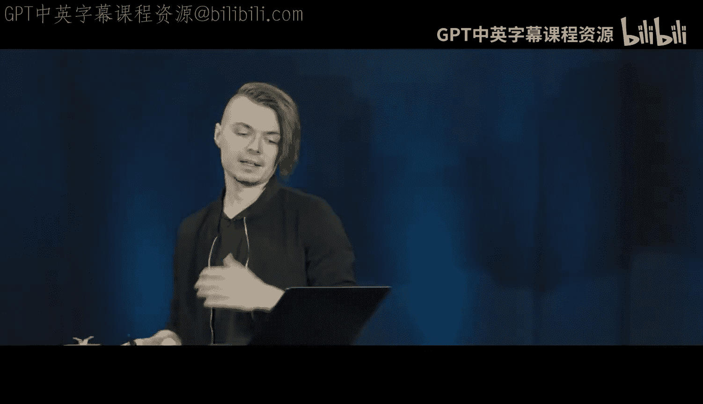

So let's go ahead and illustrate this by making the paddles actually move up and down in our code。

I'm going to go ahead and come into here now previously I sort of alluded to。Adding love。

 updatedate in here。But I took it out， so I'm going to add it back again。

It's another one of Love's main functions， just like draw and key presss and load。

So in here we can call that function that I also showed on the last slide， love。tkeyboard。 is down。

And in this case， it's going to take a particular key as a string for its parameter。

 so let's say the left paddle， I want it to move up and down when I use W and S and then the right paddle will be up and down so this code right here is going to adjust the paddle moving up and down。

 so if love that keyboard do is down W， which is like WASD。Then。

 and we haven't seen it if I guess we have seen an if statement then and I neglected to mention that if statements in Lua use the then keyword to specify the beginning of a block。

 and then these then blocks will end with an n， just like function blocks do。

 but I neglect as mentioned that last time， but that's what's happening here with the syntax。

 if love keyboard dot is down W， then。So essentially what we're going to want to do at that point is we want to lower the y value of that paddle。

 the problem is we're not keeping track of that in a variable of any kind。

 so we probably need to start keeping track of that。By our scores here， why don't we say player 1。

 y is equal to and recall that we sort of hard coded these last time in the love dot graphics do rectangle function calls。

 So I'm just going to declare it here to start with。 So player 1 y was set to 10， where player 2 y。

Wass set to virtual height minus 5 rather 30。If I have that correctly， yes， virtual at minus 30。

And so now we have these two variables， we're going to want to move these variables。

 we're going to want to adjust these now whenever we press these keys。

 and there's a particular way we have to do this in order for it to work like I alluded to about deelta time just a moment ago。

So what I'm going to do first。Let's go ahead and define a paddle speed and we'll say that this is in pixels per second that we want this movement to occur so we'll say paddle speed and we'll just you can make this whatever you want。

 this is the aspect of game development that is sort of the balancing side where you decide how fast。

 how strong， how whatever to make things I'm just going to choose an arbitrary 200 pixels per second。

Value for paddle speed。And so what I'm going to do now。So again， we're going back into our love。

update。dt。If lovedot keyboard。t is down W， meaning that we're pressing W， this is a Boolean check。

 then we want that y value to decrement by effectively that paddle speed。

 we want it to be moving 200 pixels a second up。And so we can't just flat say。Player1 Y gets。

Player  one y minus paddle speed， because now this is going to happen 60 frames a second。

 It's actually going to be。200 times 60 times what we want to do now is remember DT is going to be a fractional difference in time between this frame and the last frame。

 and we can effectively just multiply paddle speed by。And sorry。

 this is going to be player one plus paddle speed。Negative paddle speed rather times delta time。

 So what we're going to do here is we're adding a sort of negative for readability。

 This will kind of help things， I think， be。Presented in a clearer way when we sit it all together and also simplify the code later on。

 but essentially what we're doing is we're taking the player1 Y and we're taking we're just going to add to itself a。

Mulipplication of Delta time with negative paddle speed。 So this is going to be 200 by default。

 Delta time is going to be some。Value probably 0。016 approximately， which is going to。

Every160th of a second。Decrease that。Paddle that player1 y value by some160th of 200 pixels effectively so that by the time we've allotted 60 frames。

 we will have moved 200 pixels， regardless of our frame rate， because in theory。

 if only one frame passed between this second and the last second。

 this DT value would just be one and which would effectively mean that your computer could be horrendously slow and the movement is going to always scale by this delta in time between this frame and the last frame。

And so we're going to do that， we're going to do this same operation in a few different ways here。

 so we're going to say else if love。t keyboard。 is down S。

Player 1 y is equal to player 1 y plus just paddle speed。And。And then so this is for W and S。

 so W being up， S being down， y goes down as it increments as it gets higher。

So we're going to also say if love dot keyboard dot is down up。

And then we're going to do this to player2 is y， so not player1。

 player 1 just moves based on W and S， player 2 is going to move based on up and down。

 so we'll say player 2 y is equal to player 2 y plus negative p speed times delta time times dt。

Altif love。 keyboard。t is down， down。Whoops， can't type。

Then player2 Y gets player 2 y plus paddle speed times delta time and close that off。 save it。

 let's go ahead。 Actually we can't run， it's not going to do anything yet because these are just variables that we have we actually have to incorporate them into where we were rendering because remember update is just one part of the game loop we also have to transfer those updates to the render phase。

 the render phase has to see those in order to do the actual updated drawing our flipbook analogy And so right now as you can see。

 these are hardcoded in particular the widths can stay hardcoded because in pong the paddles never will move but the heights in this case will move So instead of virtual height minus-30 as a hardcoded paddle1 and was I was accidentally hovering over this thing which is the ball it's these two here this virtual height minus-30 is now player2 Y and this。

10 is player1， y， and so if we save that。

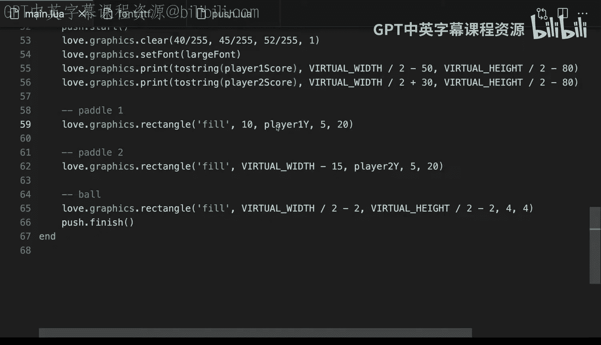

And run it。So our paddles are in the exact same spot that they were previously。

 but now if I hit W and S， you can see the paddle is indeed moving at about 200。Taking it onfaith。

 but the math should check out 200 pixels per second。

 same thing with the up and down guiding the right paddle and unfortunately this is just one small step forward because all we have to do is tinker a little bit to realize that we have a couple of issues with our code namely that our paddles can go off the edge of the map。

 which is not ideal normally in Pong you want your paddles to stay in view and we'll fix that with collision detection which well look at very simple form of collision detection。

 but clearly you can see that we have a。The ability to now manipulate the game world。

 it's not just a static sketch， it's not just a illustration of pong。

 it actually is beginning to feel and look more like pong， it is actually becoming manipulable。

 so to speak。Okay， I'm going to take a pause there for just a moment。All right。

 so now that we have a shell in place， we're going to begin to take a look at a few deeper topics。

 but also I mean one thing that stands out is the fact that you know we have the paedddles moving the ball's not moving we're going to take a look at how to fix that in addition to trying to think about how to clean up our data a little bit our code it's a little bit on the messy side and it's only gonna to get messier with all these variables that we start adding and throwing around so I'm going to go ahead and close this out we're going to go back to the slide deck so Pg4 is the ball update so as its name implies。

 this is essentially just going to be a slide about or sorry an example about how to start moving the ball but interestingly this also gives us an opportunity to talk about random number generation which is a very important topic in video games because if the game is always the same no matter what happens。

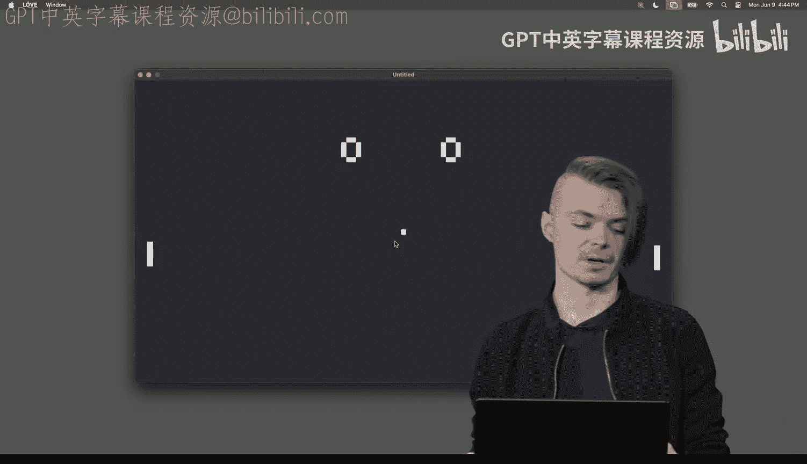

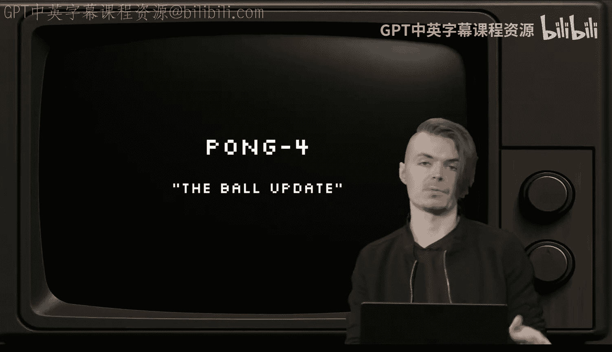

The predictability is a little bit I would say underwhelming and I think people like to have sort of dynamism in their games and there's an opportunity for us to test that here with our ball actually because our ball doesn't really do anything but the ball is in the center and has to start moving the question is in which direction should it start moving and we can start to solve that problem using random numberer generation and a few important functions here。

 mathtran seed OS do time and math dot random so random seed is going to allow us to actually seed our random number generator meaning anytime you have a random number that you need to generate in your system essentially pseudoran number generator starts at a point from which math is done to some number that changes it in sort of unpredictable ways that you can then use to simulate sort of like chaos and randomness in your game and so we're going to do that in order to actually seed it though give it that's that first initial value that's going。

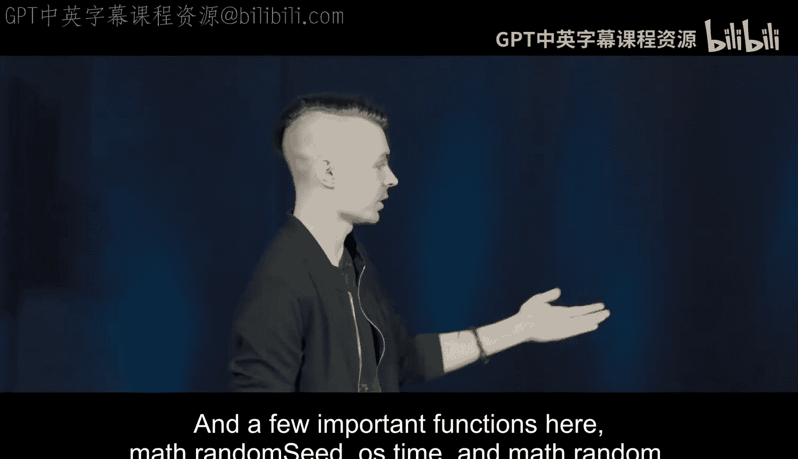

to allow it to always start from a different place every time we run the game。

 we're going to need to pass it some value that's always going to be different because if we had a random number generator。

 but every time you started it every time it just gave you the same random。

Random set of static numbers， it wouldn't really be much of a random number generator and so the best way we can accomplish that is using our time so every clock every computer has a time and milliseconds that it has access to from the start of the creation of the Unix operating system and once that's in place once we've seeded our random number generator with OS do time we can then call Madot random which takes in a min and a max value and it will give us a number between those two numbers based on that random number generator。

And then in addition to that， we have a couple of other functions。

 mathth do min and mathth do max and these functions allow us to clamp effectively values。

 we can take the greater or the lesser of two numbers if we want to do some arithmetic and then make sure that we don't exceed a particular number we can take the min of two numbers because that'll return the lowest so if we go above zero on our y axis for example。

 we can take the minimum of rather the maximum of0 and that value going decrementing so I have that backwards so if we want to take want to clamp something to a decreasing value and make sure it doesn't go below a certain amount。

 we use math dot max and then the inverse for math do min if we want to prevent it from going higher than a certain value。

 we'll use math do min so we're going to go ahead and transition now to some source code to take a look at this and rather than necessarily spend all the time hand writing this code I think what we'll do instead is I have a bunch of pre-written。

amples of all of the source code in the course and I feel like because we've done a。

 I think fairly good job of looking at the core of love2D， the core game loop elements。

 we can probably start to transition into looking at things at a slightly higher level the code is fairly well documented and I'll draw attention to the code as we're looking at it but hopefully folks now at home have enough of a sense of how love works so we can begin to kind of go through some of this code a little bit more quickly so this is Pong4 in the distribution that will go out and this is the ball update。

So a couple of things changed in this example， one of those being that in love dot update。

 so recall the last thing we looked at was the clamping the math dotmin and mathth。tmax。

 so we'll get to the ball in a second but we're going to clamp first off the big issue that was left over from last time was our paddles would move up and below the edges of the screen and the's top in the bottom and so we can get around this issue by just using mathm and mathth。

tmin Col can I interrupt you sorry before we do this code did you mean to have all these tabs open。

 I think you were poking around them before Oh you know I did not actually but I think we can cheat and just pick this up when you're done talking about the slides。

Okay。U。So just have it like this basically。Yeah， any configuration is fine。

And I would swipe to it from your slide，All right， so and with that， with those functions explained。

 we're going to go ahead and transition out to some source code for Pong4。

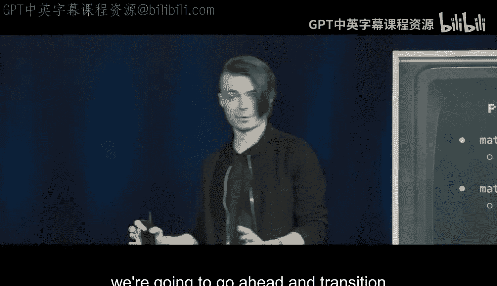

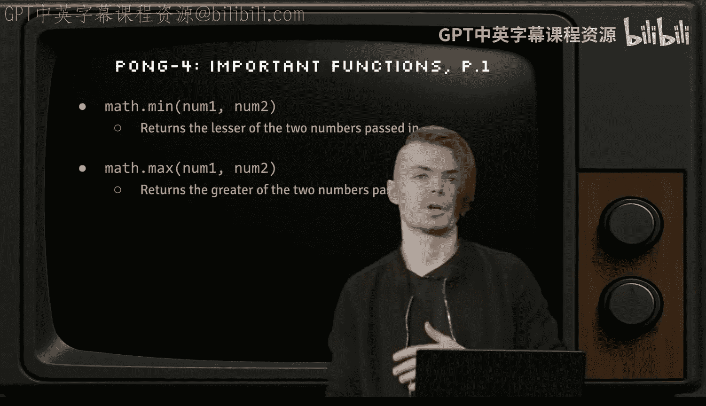

And because we've sort of gone over， I think most of the core pieces of Love 2D， the game loop。

 the love Dot low， Love thatt update， Love dot draw。

 we know that overall the core of love and Lua for the most part。We're going to。

 I think instead start instead of actually handwriting every example。

 we'll start looking at prem examples that will go out with the source code distro marked after these updates。

 so for example， in the distro there was going to be a。Marked folder that aligns with each example。

 in this case we're looking at Pong4， main D Lua。And some of the things that we looked at we talked about were again the clamping and that's going to apply to the paddles。

 that was one of the things in the last example that we noticed was still awry because we could move our paddles。

 but they would go above and below the edges， thankfully with Math dot max， mathth dot min。

 we can sort of ensure that that doesn't happen。In addition to also the fact that the ball doesn't actually do anything currently。

 the paddles still move up and down， but the ball still static， so we ever really。

Made a terrible amount of progress， albeit we have visually。

 but I'm going to draw folks' attention now to in if we're looking at Ma Dal Lua。

 now all the code here is relatively well commented should be for the most part。

 so I'll go ahead and allow for the fact that folks might read more and glean more at home。

 but on 93 for example in Pong4 we'll see that in our lovet keyboard do is down if statement that we were previously using where I just did a flat edition of the paddle speed by Delta time。

We're now doing that same addition of negative paddle speed times delta time。

 but we're also math dot maxing it with zero， which means that it's going to take the greater of those two values in the case that player1 y goes less than zero。

 math dot max is always going to choose zero and so therefore if we try to move player 1 y up above the top edge of the screen or player 2 y。

 it's just going to get stuck there and will return zero effectively every time it tries to subtract value from player1 or player 2 y and conversely it will take the minimum if we try to go below a certain point in the actual game space。

 so if we try to go lower than virtual height minus 20。

 which is at the exact point basically up from the bottom that the height of the paddle is then it'll also return the minimum of that and what we're trying to add with the paddle speed times delta time。

Which means that it will always ever be virtual height minus 20 at the lowest point。

 and so through this means in both of these examples， it's the same math。

 we end up ensuring that our paddles are always hard clamped to the screen。

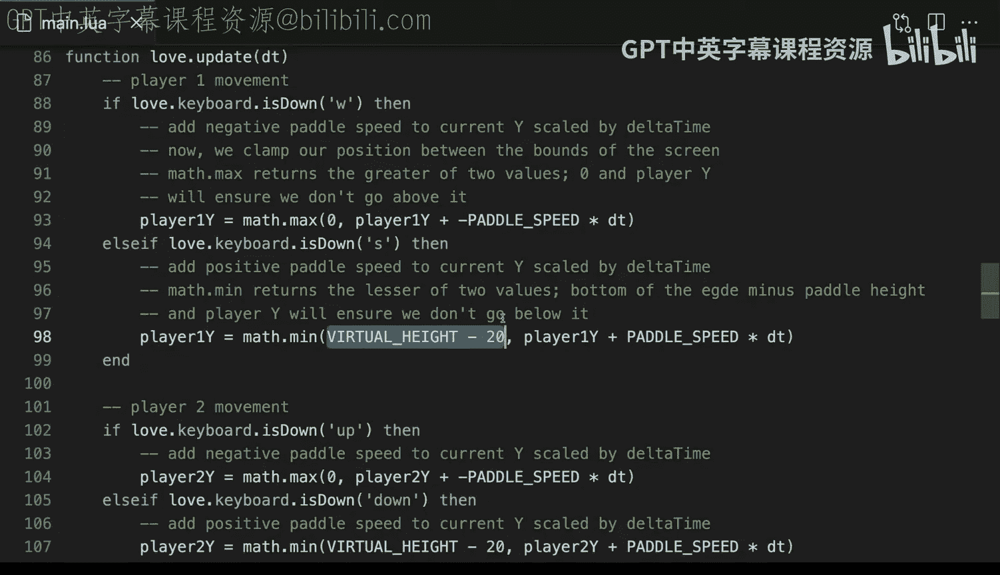

So if we demo that real quickly， just that part， I can maybe illustrate that。

You'll see I'm moving up and down。Trying to move down， I'm pressing down an S， nothing's happening。

 pressing a W and up， nothing's happening。

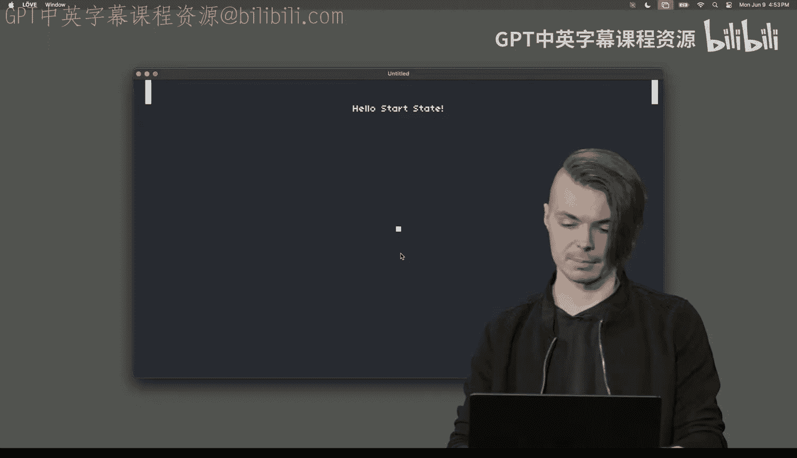

Now。Also another part of the update is that we want to be able to start seeding the random number generator and using that to direct the movement of our ball So if we go up to love dot load。

 which is where I typically like to do this anything that is like a one time thing that you do typically is a great place to do in lovet load in this case seeding the random number generator is something that you typically only do one time at the start of your program execution。

 you'll see right here， we're calling mathran seed。

 which just see are random number generator global random number generator and then we're just passing in OS do time we call OS do time again it returns that value in millisecond since the start of the UniX operating system。

Wwhichch is always going to be an incrementing value throughout time。

 no matter when you run your program， that's always going to be different。

 so our random number generator will always be different every time we run the source code。

 we execute this program。So you'll notice that we have a ball X and a ball Y as well as a ball DX and a ball DY now what's interesting is that the ball unlike the paddles。

 so the paddles only move vertically， they only move up and down and they will never move left and right just by the nature of Pong's design as a game。

 you only want your paddles to move up and down。However the ball can move all over the place。

 it can go left and right， bounce off the top， bounce off the bottom。

 it changes its velocity depending on where it's going。

 and so because it's going to actually need this velocity that can be either on the X and or the Y axes。

 we need to start keeping track of those two variables and so what we'll do is we'll create these two variables。

 Dx and DY which you can create for any entity and this is typically how velocity is kept track of in games。

 and then we're calling that mathaw random function which I alluded to also in that slide。

 which in this case， we're using in different uses two different ways here。So for Bald D。

 we're saying。Jim give me a value between negative 50 and 50 so that's what math dot random does if you give it a range。

 so math dot random negative 50 and 50 okay so that means it'll be anywhere within that range it can be either negative or positive and that means that the Y up and down will be either negative or positive。

 which is cool。And then we're using it in a different way here。

 so we're saying math thought random2 just one value which is going to give us a value between one and that number。

 so in this case it'll give us either a one or a two。

 so it's just a random coin flip effectively how you would do like a coin flip in a video game。

 a random number generator。Now what we're doing is we're basically saying if that's equal to one。

 so if we got the one flip。Then this is a sort of way to do a turnernary expression if folks are familiar。

 which is where you sort of do a condensed if something else。

 something sort of in line from languages like C they'll have turnernary with a question mark and a colon or JavaScript in Lua。

 you sort of do it with a hack which is based on Boolean logic where you can do an and on the first two values。

 if the first of the two expressions in the and is false then the and will execute the and will finish executing and then this or will then execute so in this case if it's not equal to one。

 so the 100 or negative 100 will then execute in this case。Or rather sorry。

 if this first value is true， then this and will result and actually return that value。

 otherwise it will default to this or negative 100 in which case we sort of approximate a turnernary unless this value here is nil so you don't want to always use it for ternary。

 if you know that your first value could possibly be nil but even if your value is0。

 this will still work in Lu' is the way that Lua does Boolean logic and this is kind of like the shorthand。

 if something else something in line ternary expression。

 so if you see this and or pattern that's essentially what we're doing we're doing a ternary。

 so either 100 or negative 100 depending on whether we flip a coin and it's one essentially so it'll be either left or the right。

And so in order to actually have this work。😊，We're going to need to add an additional piece of logic to our update function and that piece of logic。

 well we have this Dx and this DY， we actually need to update our ball with those values so in order for this to render we have the x and the Y and then the Dx and the DY so there's the speed at which we're moving and then our actual position at any point in time we always render with our Xy but we need to update with with our velocity and velocity will always multipplay again by delta time because we want to make sure that we're scaling with time and frame rate so what we're going to do is we're gonna to take our existing x and then we're going to add the delta x times delta time it could be positive or negative remember so this will be moving either left or right and then same thing with the delta Y you'll also notice that we added this game state is equal to play so now we're actually looking kind of in advance that this idea of states of a game state and we'll look at state machines in more detail later but this essentially just means。

that。A game， any particular game that you play is going to have different states。

 whether it's you're in the play state， you're at the start the title state， the menu。

 the high score state， whatever victory state， there's a lot of states in this particular instance we only have two states that we really care about and that's play and start so we start with a start state and we're destroying in a global variable for now and for most of this code reappa we'll keep it in a variable but we'll look at better patterns for this later but we start with a start state。

And then in Love Dot Key pressed， you'll notice that we also added this block here。

So we're checking to see now not only do we press escape in our callback function。

 do we press enter or return because Max will register the enter key as the return key and if we did。

If the game state is start， so literally that constant， that string constant。

 which is how it gets initialized， then we want to transition to the play state。And then otherwise。

 we can set the。Game state back to start at any time to essentially reset our state if we want to。

 which is what we're doing here。And then also reinitialize randomly the velocity so we can like repeatedly test okay let's get a new random velocity。

 let's get a new random velocity， a new random velocity and see the random number generator at work。

 and that's essentially it。 The ball will also get rendered here and now the ball is going to have its x and Y rendered。

W which is being again edited or manipulated， changed over time with Delta X and Delta Y。

 but now it's no longer constant， it's no longer hard coded in the center of the screen。

 it will always be changing with time， so let's go ahead and run this。

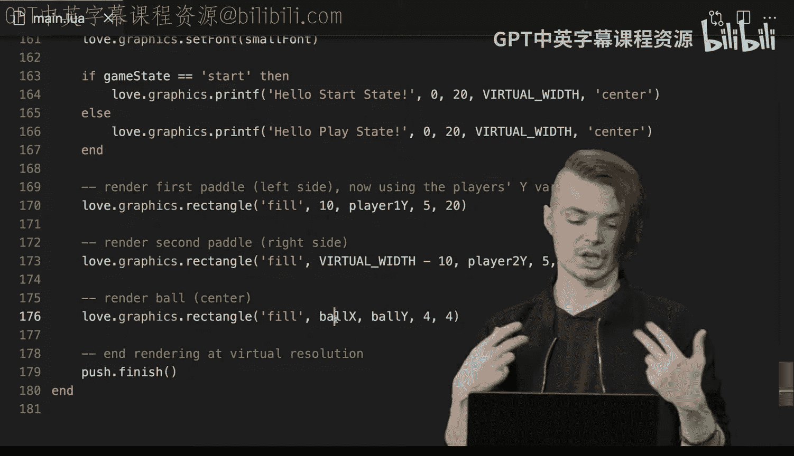

We'll see we're in the start state， we've also added a print statement to tell us what state we're in。

 so hellello start state I'm going to press enter you'll see the ball sort of moved to the left up and the left I'm going to hit enter。

 we're back in the start state， so we have this member this if else in our update that's going to check to see okay what state are we in should we update the ball？

K' in to press enter again。This time went up to the top right so math dot random is generating different velocities right the y is the most variable and then the x will be either 100 or negative 100 and this will determine it's essentially a static speed left and right to start with which we can add to progressively。

 for example， as the game goes on to add difficulty but the y is the more variable it could be negative 50 it could be 50 so you'll see different angles if press enter again。

 we'll see that was a slightly sharper angle， less sharp of an angle。About the same， about the same。

But they're roughly。Similar， not too steep， that one was a slightly steeper one。

 but it's going between negative 50 and 50 pixels per second on the Y axis。

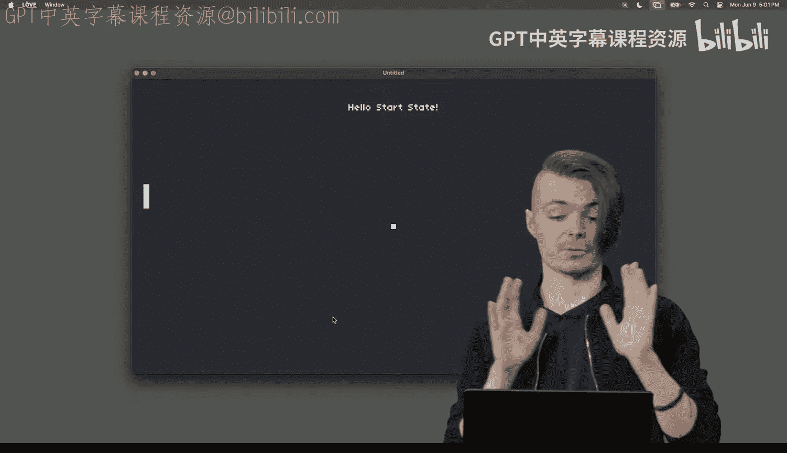

And so that is all for the。Love or for the Pong4 example， or is that pg for， yeah， pg4？Okay。

Take a second to regain my thoughts。All right， so we've now got the paals working。

 we have the ball working。

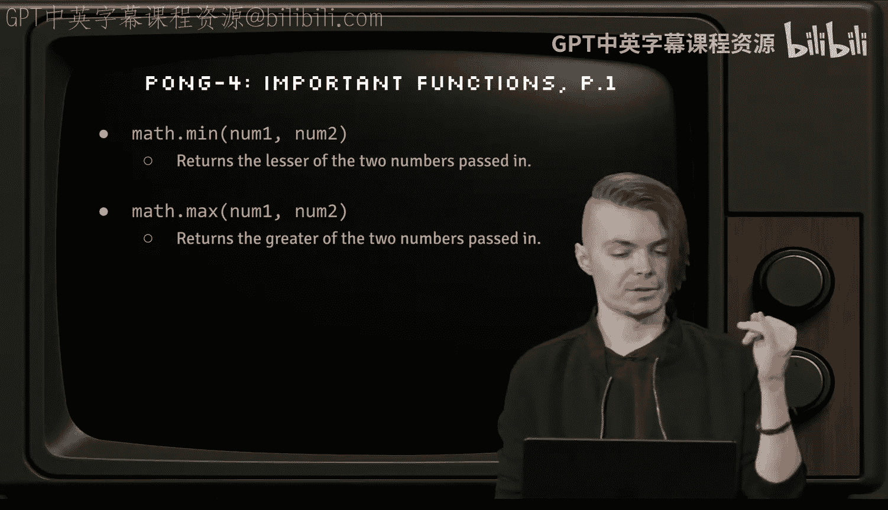

But we do have a bit of an unwieldy code situation on our hands and rather than just continue to add a bunch of these variables。

 I think this is a good opportunity to look at something called object oriented programming Now Pong5 is called the class update because this allows us to introduce this idea of a class so a class in the world of object oriented programming is you can think of it like a blueprint where it sort of defines the shape of。

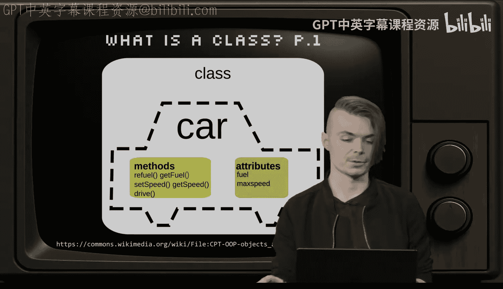

An object， so an object is essentially a way to containerize data and methods。

 so think of all of the velocities and Xy position and everything and then functions that those entities be they paddles or balls or whatever might actually apply to those data inside them。

 especially when we get to things like collision detection and more sophisticated interactions between entities。

 the fact that we can just have all of the data compartmentalized inside of something rather than have you an Xy variable for every paddle or ball or entity。

 delta X， delta Y and all these different。Especially global variables right now gets to be very unwieldy。

 especially if you can imagine having like 100 creatures in your game or you go even crazier than that。

 so a class allows us to think of okay well how can I define maybe the idea of a paddle as a piece of data that has all of its own information and also functions that deal with that information together in one place that I can just reference and call and not bog up my main dotluaophil or what have you and so this diagram here sort of illustrates that it defines the car blueprint here。

 the class as sort of having these methods and attributes。

 methods like refuel or get fuel attributes like fuel and max speed so the attributes and the methods sort of work together to achieve particular goals。

And so this slide kind of enumerates a few of the essentially a lot of things that I just talked about。

op which essentially just talks about a car example more concretely where a car can refuel。

 it can honk， can do all sorts of things and in games especially so objects and classes sort of model the real world sort of more or less as actors。

 entities working and sending messages to each other， invoking actions。

 invoking methods between one another in order to accomplish things。

 and games are essentially just this big collection of entities， doing these things。

 and so game development sort of lends itself well to objectoriented programming， I think。Also。

 there are other paradigms like entity component systems which are less in the form of objectoriented programming and more of a compositional approach to data modeling。

 but in this case in this course to start with， we will focus primarily on objectoriented programming with a helper library that we have included。

 and then folks can， if they ever venture into some place like unity or some other engines。

 they might see something a little bit more like an entity component system。

 which models data slightly differently。So I'm going to go ahead and just kind of show quickly how we can remodel all of our data。

 all of our existing codes thus far in the repo。

If we go to Pong5， you'll notice that we do have a class。

lua file included in there and so this is just a library。

 LuA sort of includes most of these features that we can use the syntax that we can use to use objects but it makes a couple of things cumbersome and so this library helps us a lot with that especially later down the line。

 so it's called class。lua， we'll see examples of how to use this。

If I just open a mainda Lua really quickly， and we'd take a look。

We'll see we're using a lot of the same constants and everything， we can scroll through love。

t load and we'll see everything is largely the same except when we get to line 81 and 82 we're no longer seeing these collections of DX。

 DI， player1 Y， all these things even well I think the scores might still be in here or maybe we move those somewhere else。

 but player1 is now just paddle， you can see it's got a capital paddle， it's taking in the XY。

 the width and height。Wwhichch are those constants you might those literals might look familiar。

 they're the same literals we were using previously to define the data。

 and then player2 is kind of getting those same literals。

 but now rather than have these variables they get stored and manipulated。

 we have just this thing called paddle that we're using and same with ball and we've condensed our code highly down now in our love dot load function if we go to update。

We're still doing input processing and changing D， those DY values that we talked about。

 the delta Y of our paddle and ball， except well in this case just our paddles。

 but you'll notice that now we're doing player1 doDY。

 we're actually using a field within player rather than just having a variable called player1 DY now it's player1 dot DY。

 so DY is now located inside of player1 it's a field in the object oriented sense。

Same thing with player2's movement block here these are separated out they have different movements so it sort of makes sense to still keep the logic here inside of love dot update outside of their own update functions but as we'll see as we can see。

 for example here at the bottom they actually do now have their own update functions so we don't have to put all of the logic needed to update them inside of love dot update in fact I think it's better practice to keep love dot update all of the love functions in your main dot Lua as clean and concise as possible and defer the heavy lifting to other files modules。

 but you can see we have this ball colon update and we're passing in delta time and then player1 colon update delta time player2 colon update delta time Now this colon is different from dot in that in Lua to get objectoriented programming to sort of behave in a less clumsy way you can essentially use colon which will take an object。

Take a table or a piece of data， a table in all of these cases and it will actually implicitly pass itself to a function defined on the class。

 remember class being the blueprint， the thing called paddle with the capital P or ball with the capital B。

 which we'll take a look at in a second， but essentially all this does for now to think about it is that it allows us to call methods on ball。

 player one and player2 that are a part of that blueprint definition。

 every paddle has a function that does something that that paddle can use to by itself to reference that all paddles will have access to。

 but the function will work on the paddle making that call like this ball's update will know about ball's information。

This player one update will know about player one's information。

 all the fields are in player one and all the methods are in the player class。

 and so it will know what to do with that we'll take a look at that in just a second。

And pretty much all of these are the same except we do have a reset method now on ball。

 so remember anything that is sort of like within the domain of what your class should do is going to be。

Ideally modeled as some sort of method in this case reset instead of manually saying， okay。

 ball do x is equal to virtual width divided by2 minus2。

 we can say ball colon and reset and then just define that inside of the ball class and now we don't need to know how reset works。

 we just need to know that reset is a method on the ball class and this ball object here has access to that at any time。

And the last piece of this is that all of these now also have their own render function。

 no longer do we have to specify the complicated logic for how to render the paddles and the ball。

 we just say okay ball player one。 render or player one colon and render。

 player two colon and render and ball colon and render we sort of like are hiding this information so we don't have to worry about it so much from within our main dot Lua so I'm going to go ahead now I'm going to pull up ball。

These are relatively simple， you can see we're just calling essentially this class capital class and this is part of main dot Lua is importing this which I failed to mention I think at the very top sort of as a library similar to push we are defining class by requiring it so the class library when we import it we'll return this class sort of helper function which will create classes for us or allow us to create classes and then we're also requiring these we haven't really done this yet。

 but we're requiring our own files with paddle and ball we're just calling them paddle and ball Lua does not require that you specify dot Lua it'll know to look for a dotlua so you can just say require paddle and then require ball and we're defining those as globals within those modules so we don't actually have to say something equals require paddle or something equals require ball you certainly could do that if you wanted to but in this case we're just going to say。

Require paddle， and then require a ball。 And then now we can call。

 We can create paddles and balls whenever we want to。So I'm going to go ahead now。Open back ball。

 so remember we were importing class， it's global because we imported it without local in Ma D Lua。

These curly brackets here， in a definition just mean it's the equivalent of essentially calling this。

LuA allows you to call a function that takes a table and just directly use the curly brackets just to save on a little bit of syntax。

 so class takes in， it can take in any table， it has various specifiers。

 but in this case we're just going to pass it a default table， so ball is just a new class。

And then now we're free to define all these methods that we want to that every ball will have access to so it'll expect an init function。

 this is part of the class library， this is called a constructor so this is just something that will flesh out our ball with initial values and create it as an actual as an actual thing so you can see here we have an x or Y a width and a height those are the important values that we need to get our ball started in the world to actually place it somewhere so you can see this self keyword here so we'll say self。

 X self。 y self。t width that just means whatever ball calls this init function。

 it is going to be called just self， it is just implicitly whenever we say for example。Here。

Player1 is equal to paddle 10， 35 and 20， self is just going to be whatever the object is that's being defined with this call with this and this by default calls the init functions part of the class library so we can just say paddle。

Prenheses and then the values it expects， in it gets called and then self is going to be that paddle object that becomes player1。

 and in itself in this method call or this constructor call is going to be the paddle that becomes player two and the ball will become ball。

 self will be that ball and so forth。So here we have just the same essentially the same logic we looked at previously。

 these were just variables， separate variables， but now they're sort of hidden tucked away in the class definition in the init function。

 all of these self variables， these fields as they're called。

 will be referenceable later in any other function as long as they're defined in inni。

 they'll be accessible at any other point within these other functions， so reset for example。

 just sets it in the center of the screen and also sets its DY and DX randomly。

 which we saw in the last example。And then update just does the same logic essentially that we saw last time just very elegantly stated now as self。

x plus self。dx times delta time and Dy and whether it's negative or positive it'll have the intended effect and then here's just the draw call for the rectangle that we did previously for the ball it's just now in its own tucked away render function using its self。

x self。y self。t with self height variables， its fields so that it essentially manages its own data and has its own methods that we can now do stuff with and again not bog up our mainluaophile saves us a lot of real estate and just kind of cleans up our code also gives us abstractions to work with now we're thinking in terms of paddles and a ball we're not thinking in terms of 8。

10，12 different variables that that we're trying to juggle altogether。And then if we look at paddle。

 it's very much the same thing， we're just taking essentially creating a class and then field definitions all based on the same types of fields that we saw defined as variables previously that same update function where we're claming clamping the y value based on above going trying to go above or below the screen edges and doing also with the DY times delta time multiplication notice also these functions are also we've defined them to take in a D deelta time。

 and we pass that in ourselves in our update function which is down here so we have love update DT which this is done for us by Lua or by love2D but down here you can see for our own updates。

 because we still want access to that DT when we call those methods later we're passing in that DT and we then have access to it through other functions that we serve。

So we can kind of pass it along the chain so to speak and so here we have that clamp function and then again just like ball。

 they're very similar classes ultimately right now just with a couple of slight differences。

 but this paddle has its own fill， its own the same draw call that we saw previously and so if we run this which should be largely ultimately the same code。

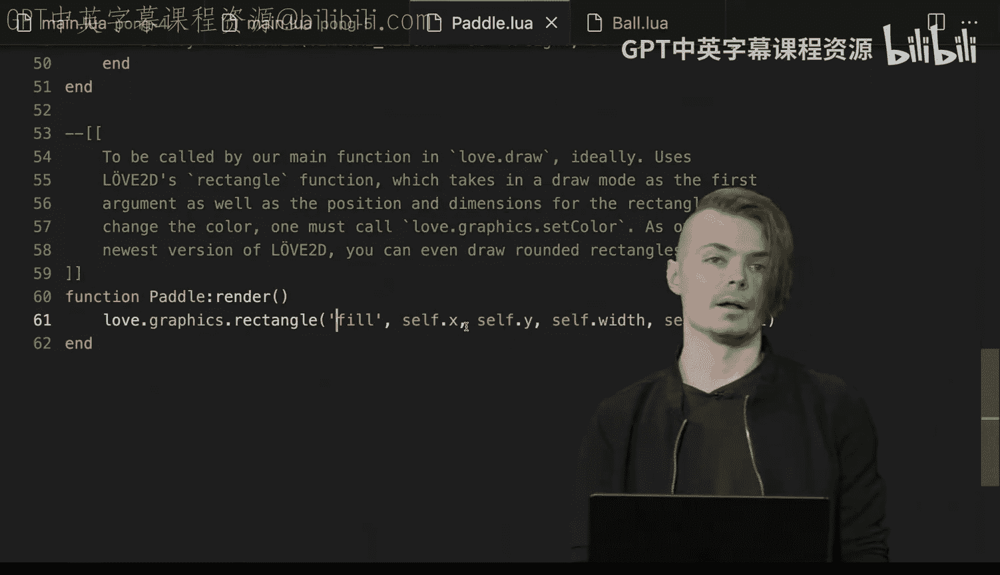

Just going to now be slightly better architected。 It could see that was a failil of a shot there。

 It's， it's largely doing the same thing。 It's setting the values and。

Going down a lot of the times here。Dia。X value must be set to a slightly lower。

Random value for this instance， but it's still random and we're moving the paddles up and down。

 paddle to the right looks like it's slightly shifted to the right。

 might just a typo or something in there， but as you can see altogether functions the same。

 we haven't really added anything we haven't taken anything away。

 but we've architected we've rearchitected all of the code to now be more elegant。

 more compartmentalized and ultimately object oriented。

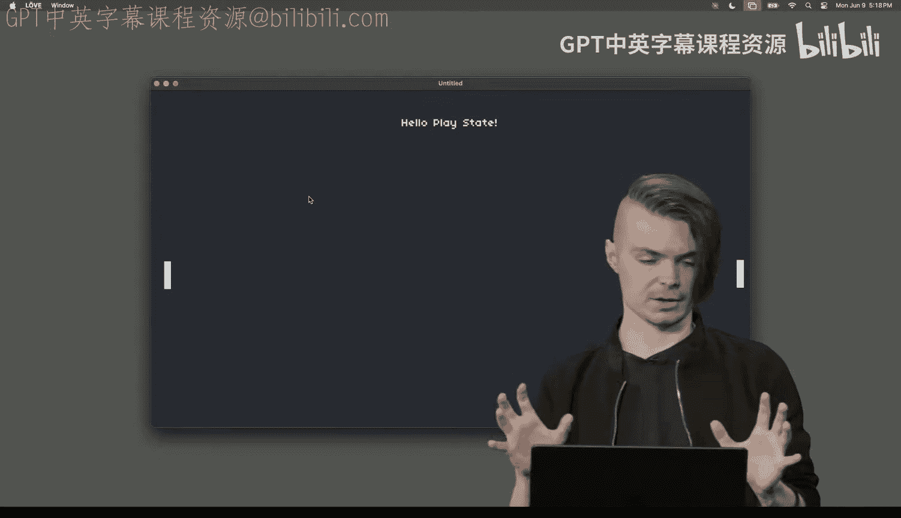

Okay。Is that was the pacing okay？All right， so we'll take a little bit of a brief break because that was quite a lot of information to digest。

 We'll add something on that's kind of just a fun little cute example to illustrate something that happens a lot with games。

 but also just to。😊。

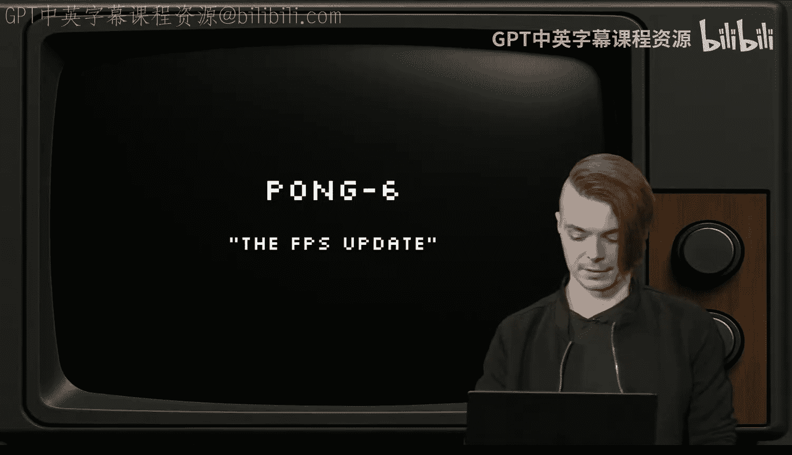

It's a useful tool as well for us for our own debugging and that's FPS measurements so in this case the couple of functions I want to point you to are setting the title first off which is sort of like an incidental thing because if you've noticed every example that we've run so far just says untitled at the top of the screen and typically that's kind of an unpolished not very sophisticated placeholder thing to do but also love coincidentally and this is I think indicative just of how rich their libraries are they give us a really convenient FPS function in their timer namespace so love do timer getfPS which allow us to actually write we can just take that value and just print it which we will show here in a second so I'm going to go ahead and quickly just illustrate that。

So there would be a much less。I think overhauling example。

 I'm just going to go ahead and close out a few of these windows here。

 which we won't need to look at so much。Open up pong6。

And so the majority of this is going to again be in the love。window。t set title。

Which is right here at the very beginning， we just created pong， pretty simple， nothing too fancy。

 and then down here it went ahead and created if we scroll all the way to the bottom。

It created a little function。So we also haven't looked at the set color function。

 which allows us to because we looked at the clear color the clear color。Function。

 but this is actually going to set the color for drawing so things for fonts for visual things like rectangles。

 things like that you've noticed like for example， the background was the different color from all the drawable stuff like the fonts and the rectangles because those are using a different color so love has a active drawing color that you can set and I figured this is a good opportunity to illustrate that so in this case what we're doing is we're just setting it to literally hard green so zero on the red。

ant 255 over 255 or we could write one here for the green0 on blue and then 100% opaque and so after that we then say FPS。

 colon，2 string， which we saw previously for the scores。And then again， the function love。timer。

getfps， and then right here you'll notice that we also set the color to 1111。

And I would even argue sometimes it's nice to see the 255， I think in RGB terms a lot。

 my brain sometimes goes to 11 on one really quickly as well for just quick and easy white and then black could be 0000 as well。

 but I'll just you for consistency you could also just set these to1 because remember it's just always trying to be between0 and1。

So but anyway we havelo。timer。gefps so this will be based on your computer based on your refresh rate based on how many things you have running and so forth。

 but very useful to test things， so I'm going to go ahead and run this so you'll see at the very top left we're just drawing this text just as FPS colon and then the two string thankfully love just manages this for us and then if you're at your full Htz rate of your computer you'll know that you're not you know hopefully burning too many resources and the like yeah what does the dot dot before two string do Good question so if we go back to the code really quickly。

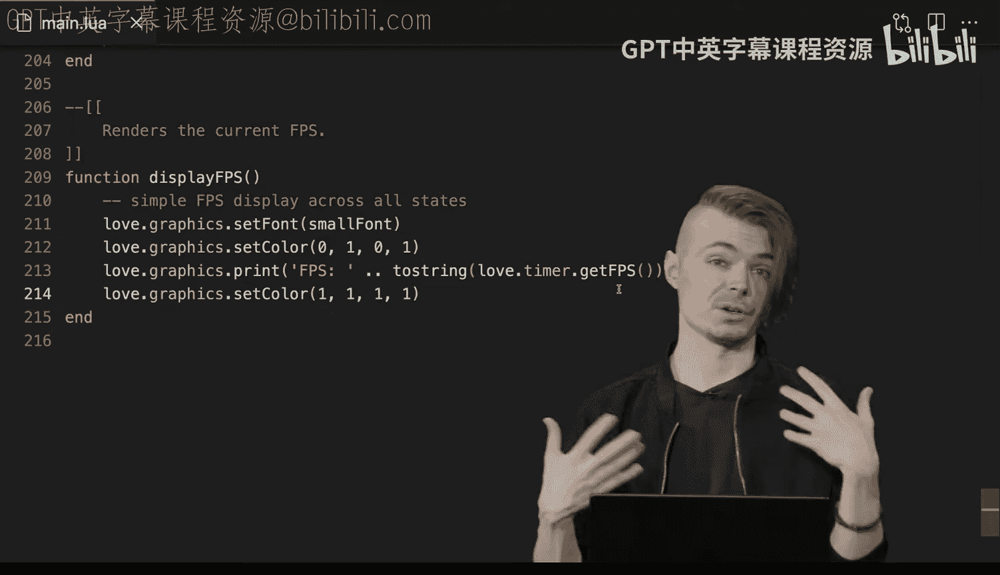

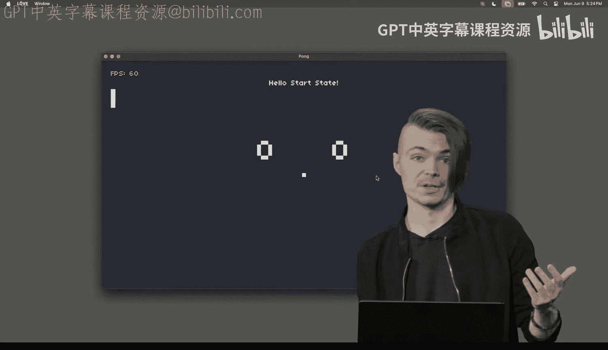

So in Lua， string concatenation is done with dot dot。

 different languages will have different ways of doing string concatenation， some will do pluses。

 some will require you to use a function， but in this case in or in Lua rather。

 they decided that dot dot should just be how you add two strings together to form a new string essentially。

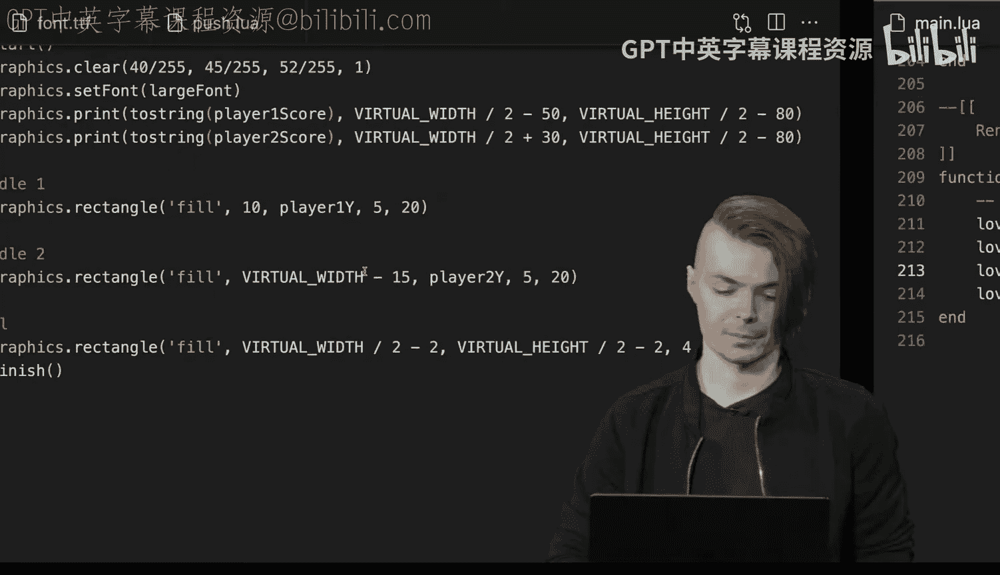

So if we go back here， you can see that the FPS briefly changed there as I was scrolling between screens。

 but I like things like this， this is I think representative also of a philosophy of overall just debugging when you're doing any programming。

Programming in the world of games is very convenient in some ways because you can visually do things that are otherwise rather difficult to do in more systemsoriented environments。

 web is similar in that way you can actually visually debug your application but if you're doing server-side programming other like you sort of miss having nice visual tools like this and so we'll see this a lot you'll often run to debug modes in games where you'll see wireframe meshes around things or rectangles in 2D games to visualize their collision boxes but it's a similar concept to this and often using a different color。

 something bright like the screen really helps it stand out。

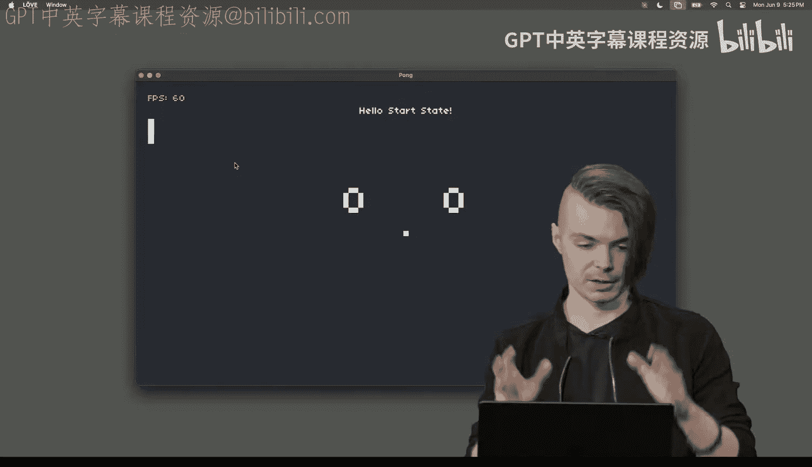

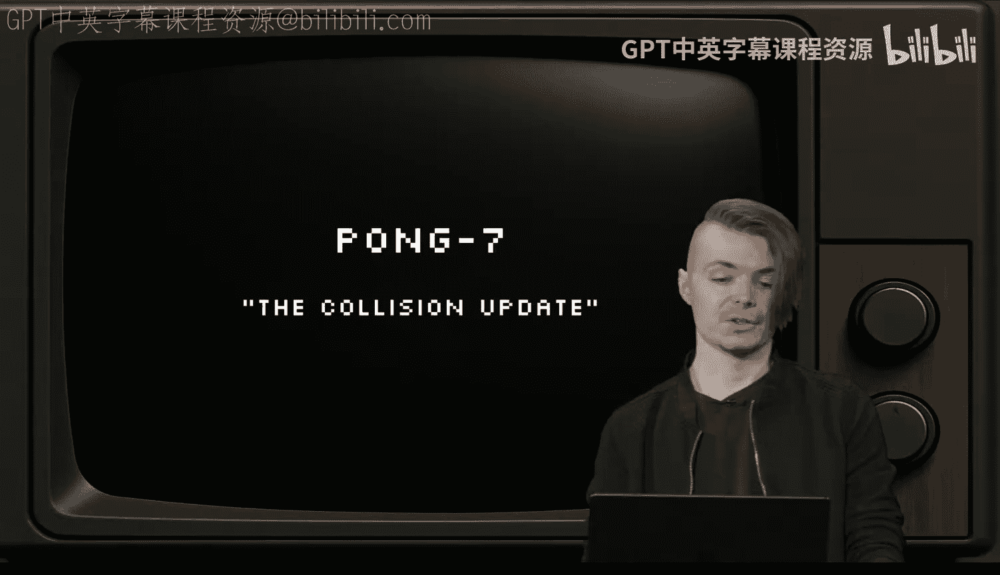

All right， which brings us speaking about the topic of collision to the next important subject。

 which is the collision update arguably the most important part of this whole。

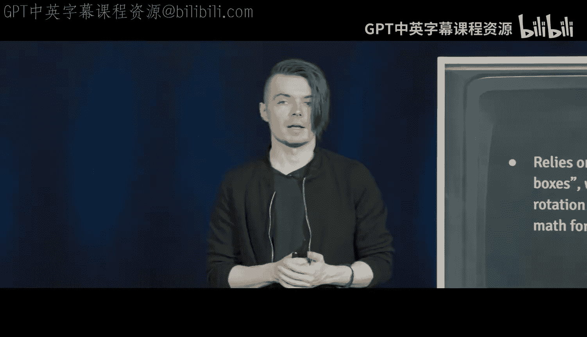

I would say example this whole code base。Is。Right now we have things that can move。

 we have velocities， moving things， we have input moving things。

 we have all of the important factors to sort of get the game interactive。

 but a game isn't a game if you can't lose really it's more of just a fun little experiment visual experiment and so we have to talk about collision detection and the world of 2D collision detection。

 if we want for example the paddles so we have like the clamping we're using to make sure they don't go above and below the edges of the screen and that's pretty straightforward but if we want for example the paddle and the ball to collide with each other to get a message to the like that they have collided and to then set for example the velocity of the ball to invert on the x axis if it hits a paddle and on the y axis if were to collide with the top of the screen which doesn't use AABB but similar idea we're going need to talk about access line bounding boxes。

 AABB collision detection which is simply testing to see that literally。As this name sort of implies。

 you have two boxes that are access aligned， meaning they're not rotated at all。

 they're very tightly aligned to your XY coordinates。

 meaning that they can be deterministically calculated based on width and height offsets to determine whether they're colliding。

As you can see here I put some coordinates there just to show like what an example of two rectangles colliding might look like。

 this is an example of them definitely colliding， but you can effectively think of AAB as checking do my two rectangles have a gap between them and you can decide whether you want a collision to also count if they're directly touching each other or if they have to be actually intersecting in our code base。

 they have to be intersecting but different depending on what you want your game to look like。

 for example you might want people to walk on your ground in a game and might not want certain collision to occur when you're just walking but you might want it to occur if they're like falling through the earth and they have that's to trigger a fall damage calculation or a balance or something so there are instances where you might want collision detection to occur。

Based on touching but not intersecting， and in some cases where just only checking for either is fine and hard checking for intersecting is what you want。

So there are a couple of ways to sort of look at the overall pseudocode。

 you can check to see whether there are no gaps， in other words just doing it and and overall。

 basically essentially checking to see is there no gap on all four sides。

 basically are all four sides there's no space basically between any of them。

 you can also check to see if any of them are spaced apart from the rectangles。

 like if rectangle A is spaced apart from rectangle B。On its opposite sides。

 which we'll see a visual of in just a second， you can sort of think of it mentally in two different ways if we move ahead to a couple of slides。

 this is just the other way that you can check to see。Whether there's any gap at all。

It basicallysically a combination of ands and a combination of or's and it's like a de Morganorgan's law of Boolean logic essentially。

 but if we take just a rectangle B and we have an xy top left as usual。

 and we start to think about x plus width which is the right edge of the rectangle and then a y plus height which is the bottom edge of the rectangle that gives us all four sides that we can then start to perform calculations on so if we're looking at。

 for example here's an instance where they're separated。

 the two rectangles are separated any instance of collision detection where it's not a collision is going to have a space between your rectangles and one of these conditions is going to be true in this case。

 this a plus the a dot x which is here plus a dot width is less than or equal to B do x。

 you can see the right edges literally to the left of this rectangle and again you can tailor it if you want it to be if you want it to actually touch and have it count。

 you can certainly do that but in this case this would be considered。Not a collision。

And so if we keep going down the line， again， this is actually the same exact code， but just flipped。

 now we're looking at it from B's perspective， if B's dot x is greater than or equal to a plus x plus a dot width。

 again， that's here。That's essentially checking those sides。

We can do the same thing on all the other sides， so we can see here's the top sides， top of A。

 a bottom of A and top of B。And both versions of that。Right of B， left of A， both versions of that。

I usually mentally think of A relative to B when I'm thinking of AABB。

 but you can think of it however you want to and then here this is checking the gap between the bottom of B and the top of A any of these are true at all。

 then we definitely don't have a collision in the case that we have a collision。

 none of them are true once you have any collision there is none no gap of this if we even go back and see this example which is a collision。

You'll see that there is no instance of， for example， this top edge being below this。

 this bottom edge being above this， this left edge being to the right of that。

 and the right edge being to the left of that， none of them are true。

 and that it will apply to any collision possible with this algorithm。

So if we just skip back ahead just a little bit。That's the end of essentially the visual diagram。

 so we'll just all transition now to looking at the code for it， it's actually quite simple。In code。

 I think it's more to explain and more to look at than it actually amounts to encode code。

 but I'm going to go to our actual repo here， I'm going to close out the old mainluo we're just looking at go down to Pong 7。

I have chosen to add it to the ball class。And so there's a function in here。

 and I've also sort of written it so that it's split in terms of edges just mentally。

 that's kind of the way I like to look at it。But it's the same code that we just looked at checking to see whether any of the edges is further out than the opposite edge if the left edge is to the right of the right edge of the other rectangle we know that there's no collision and so we can just check whether either these is true and then we just return false for the left and the right side and then we can check to see the bottom edge is higher than the top edge of the other vice versa and the return false there。

 if none of them return false then that means we have a collision that means that we have not satisfied is there is no gap anywhere。

 the gaps are completely closed in is indeed a collision in our code， and so now if we go back to。

Main D Lua。In our update function。We'll see here。I've gone ahead and I've added a play state。

Whi I may have had last time， but that's essentially checking because we had serve and start。

 so now we have play， so play is going to basically be like are we in play。

 can somebody score against somebody else？And here we're going ahead and we're just using the ball as our sort of source of checking for collisions。

 if ball colon collides player one， so notice again。

This takes in a paddle this really just takes in a rectangle could be whatever you want it to be。

 it could be another ball if we wanted to play with we have multiple balls going around and bouncing around breakout can have things like that commonly but in this case we're just taking in paddle mean it's referencing that paddle's arguments with and itss x and its y value sore basically passing in if ball collides player1 notice the readability of this code2 we've abstracted out the sort of idea of what it means to have accessalign bounding box collision detection in a method within the ball class we don't have to add that to the already quite still large love do updates body we just say okay in a sort of almost English way if ball collides with player1 then and then what we're going to do is。

The important thing to do is we should。In I think a lot of games like the escalation of difficulty helps spur the game along to some extent。

 and that's all we're doing here， we're basically doing is we're inverting the DX first off because if we collide with a paddle on the left or the right。

the left or the right for the camera， then the ball is going you know in this case it's going negative。

 but as soon as it hits the paddle， we want it to go the opposite direction on the x axis。

 which means we have to flip it， we have to make it positive and vice versa it's going positive。

 we have to flip it and make it negative and so that's why we're doing here with the ball's DX。

 and then we're also multiplying it by a constant 1。03 so whether it's positive or negative。

 it's just going to get more and more it's going to grow faster with time with every collision until somebody gets scored on。

And then we're also doing this important step here。

 and this is important anytime you do collision detection resolving。

 it's moving the thing that collided outside of the rectangle that it collided with。

 because as you're moving things as you're updating， for example， a ball and a paddle。

The balls moving it can be moving pretty quickly and so you frame by frame by frame。

 it's going to clip into the paddle some amount， maybe several pixels and so we want to make sure that on the next frame as it's updating。

 it's not still inside the paddle because then it'll just be infinitely colliding with the paddle。

 we want to essentially knock it out of the bounds in the direction we want kind of nudge it in a correct position and so that's all we're doing here。

 we're basically saying the balls X we're sort of hard setting it to player1 do X plus5 so we're essentially because we have to offset the width of player one。

 we're essentially saying okay if it collides of player one which will be in this direction from the camera's perspective。

 if we want it to be on the right edge of player1， which means that we're going to have to add it to basically the width of player1 plus itss x that'll be just flush with the right edge of it。

 and then it's Dx will immediately be negative， it'll be inverted， it'll be positive but it'll be。

Inverted from what it was and it'll start moving in that opposite direction right away and then in this case down here with ball collides player2 it's essentially the same thing except now what we're doing is because player two's dot x is on the side where we're going to collide with it we're going to actually just shift minus four pixels because that will shift the ball now because now the ball needs to be shifted to the left if we're colliding with player2 we want to account for the player two we want to account for the balls width and so shift it so that it's touching right against the paddle so that would be player2s do x and then minus the width of the ball which is four pixels the last thing we also add here too is。

We also influence the velocity a little bit as well， we keep it going。

 but we add a little bit of randomization just for fun。

And then here's an upper screen boundary and a lower screen boundary to also flip the ball's DY so that when the ball bounces with the top of the screen。

 it also bounces， but unlike the DX flips the top and bottom of the screen。

 merit a DY flip because if we're going up and we hit the top of the screen we want it to bounce down and then if we're going down and it hits the bottom of the screen。

 we want it to bounce back up so that merits a negative DY so let's go ahead and just test that real quick。

 make sure that it works。

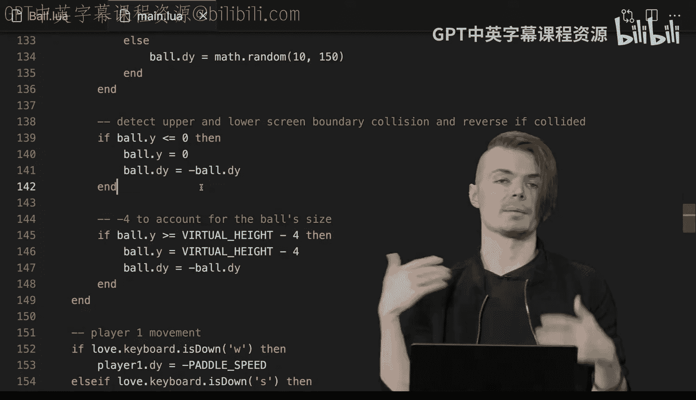

I'm going to start it here， it's in play state， you can see it bounced， bounced off the right paddle。

 very exciting， see if I don't lose really quickly。Try it maybe be like one more time。Okay。

 it might be hard to see I'll see if I can try to get it to visibly。Oh， see。

 there was the randomization of the Y， which we added just for variability in there。

Pong's actual logic is a little more sophisticated with physical modeling which we look at a little bit in breakout when we get to breakout we'll see an example of how to use paddle movement to guide the change in velocity it's a little bit hard to tell right now because it's only 1。

03 but I did actually。I lost anyway， so it doesn't really matter。

 but you will notice that even though we are updating we are colliding and things are moving around。

 there's still ultimately more to solve because。There's no score updating。

 we move the ball went past the left edge of the screen and well okay that didn't make a difference。

 the state is still an important part， so even though we've solved a major probably the most major problem of the game to actually win a game and have it be valuable。

 you need an actual certain amount of scoring implemented and ways to do that so we'll take a look at that right now。

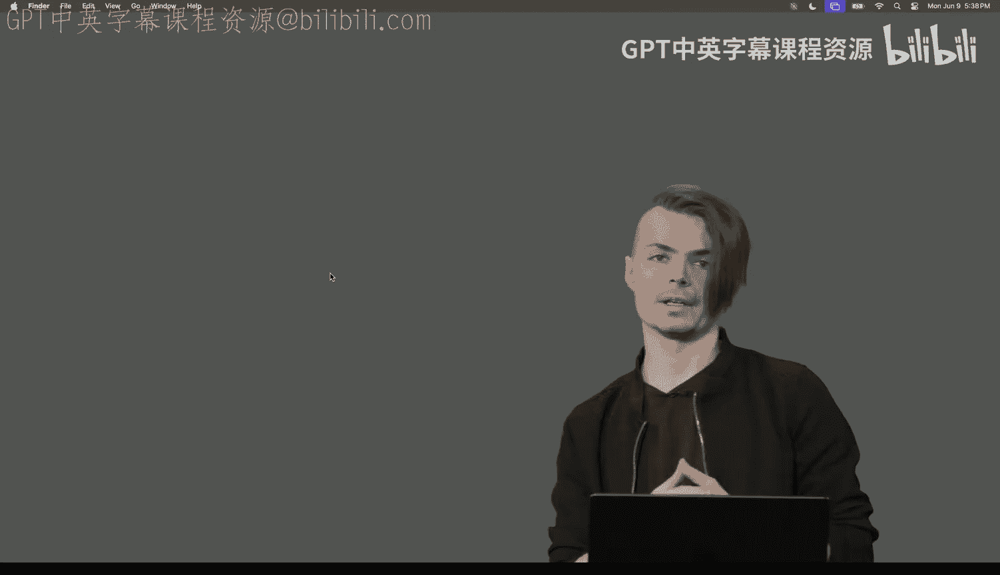

Right， so now that we have。The paddle's moving。The ball collides with the ceiling on the floor and the paddles。

 we do need to take care of that last variable in order for the game to make sense。

 in order for it to actually be a competitive game， we need to make sure that scoring works。

So thankfully this example is quite easy because we already had the pieces for it。

 recall we did have score variables that we were just rendering to the screen。

 so I'm going to go ahead and go right to the code。

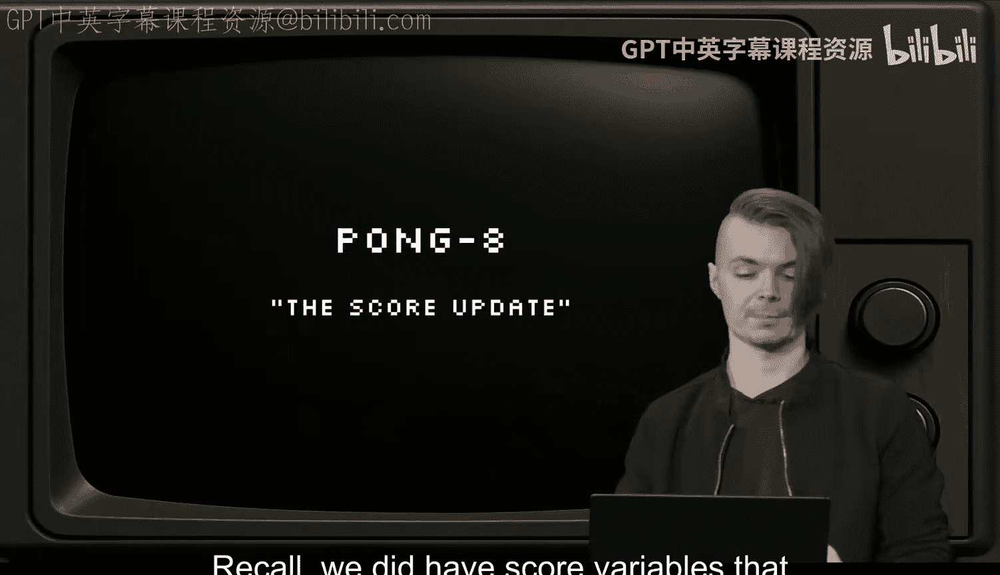

So if we go over to Pong 8。So will be in Maine。Now the place， of course。

 to be testing this is going to be an update because。An update。

 basically essentially on top of the collision that we're doing with the paals with the ceiling in the floor。

 we also want to check the left and right edges of the game space， the game world。

 because that's essentially when the opponent scores on the other player is when， for example。

 player one who is on the left side， has the ball go past their edge all the way over to what is essentially zero on the X axis。

And then player two， if they get the ball all the way on the right side。

 which is virtual with effectively， then player one gets a point and as the first two you can balance however you want the exact number of points that people need to win or lose the game。

 but I think by default often will just pick 10 as a number。

But you can see here we have our player1 score， player2 score， if we go down into update here。

 so still within play。We added some new code right here underneath kind of where we previously were doing the test for the ceiling and for the floor where we were inverting the Y。

 we're now going to do those checks that I just enumerated， which is ball。 X less than  zero。

And then another one that's ball x greater than virtual width so that'll just mean if it's reached the either edge of the screen so you can see here we've added serving player so I think it's a fair thing to do and I don't know if this is exactly how it was done in pong but if somebody scores against the other player。

 I think it's probably fair that the player who had just gotten scored on gets to serve in other words the ball will move first towards the opponent rather than them it's kind of an arbitrary decision but kind of feels like good sportsmanship I suppose。

And so that will get set。 So if we end up getting if player one gets scored on。

 they become the serving player effectively， ball X to 0 means that the。

Player one got scored on and then， but player two will get one more incremented to their score and then ball the ball will get reset and then the game state will be set to start again and so if we're in start。

 which I believe is up here， just to touch。This might be actually in the key pressed function。

 actually。So in the case that we get enter or return and the game state is equal to start。

 then we set game state equal to play and this allows us to kind of get a pause as well which I think is kind of important it's kind of a nice breather that way we're not just like immediately serving the ball right away after somebody scores。

 I feel like that would be kind of a little bit too chaotic but that's essentially it for scoring you know if we look down here we do have two string player one score but we alluded to that previously so none of that is new if we run this I'm going to go ahead and just run this file。

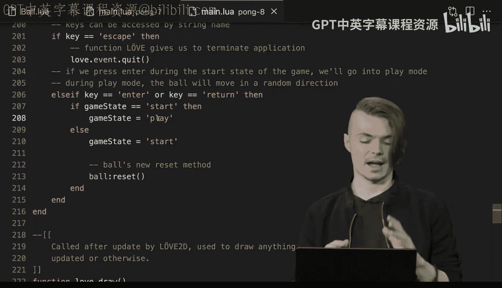

See it largely looks the same， but as soon as we start to render or run the program。

 we're going to bounce it， I'm going to purposefully lose here with player1 and then you'll notice that player2 got one so that variable got incremented and then the game just kind of stopped the ball is reset but we're not in the play state so we're not actually actively all of that update logic where the ball is moving and such and the collisions are being detected is behind whether game state is equal to play and so this is our new serve state and this is sort of like kind of a preview of overall again state machines and we'll be looking at state machines in more detail next week or next lecture rather。

But you can see now we do have the ability to score， we don't have the ability to win just yet。

 that will be in the victory update， which is coming soon， but we do have scoring implemented。

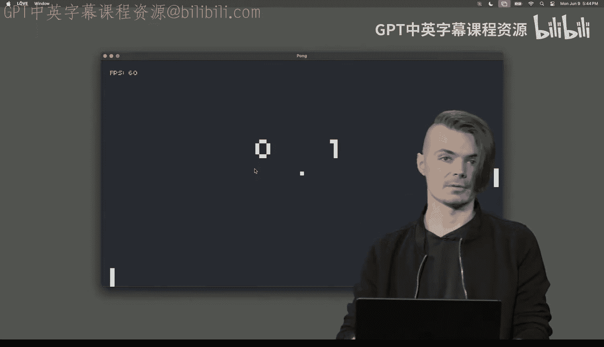

Now serving is just kind of another light extension of the idea that I just mentioned。

 so the serve update is basically just the idea that when we start the game for the first time。

 somebody's going to be the server like we're going have the game is going to start and then we're going to serve and then we're going to play and then anytime somebody scores we're just going to keep serving in fact we're already sort of doing it。

 but I'm going to go ahead and open up the code here and again real quick。

 this is just the state a state machine graphic to sort of overall show。

The idea of what a state machine is and we'll look at this in more detail next lecture。

 but all of the transitions between you know whether we're playing， whether we're serving。

 whether we're，Whether we're in a victory， whether it's game over all those are essentially just states and a game can be looked at as just this big state machine with all these complicated transitions here this is kind of like a platform or Mariio e state machine so we can imagine we're ducking and then we release down that turns into standing so the actual transitions are modeled and what they actually represent what what the triggers are rather and then what they represent going towards so if you duck release down。

 you stand if you press be jump if you press down while you're jumping you dive in this example which isn't I don't think a thing in Mario by default。

 but it just for a more illustrated illustrative example of you all the different states。

 a character or a game can be in you can think of doing any sort of thing and transitioning to any sort of thing and this is a very useful abstraction that we will build up on starting next week and then going throughout the rest of the course and essentially that's what we're doing with the Ser state and also the play state we're just doing it in the kind of a sloppy。

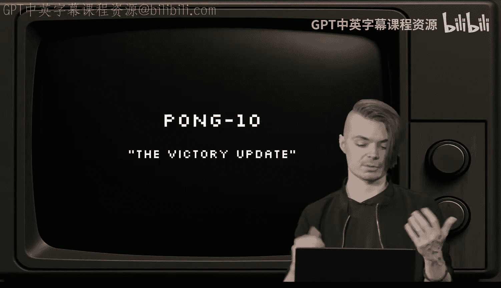

Sloppy， but I would well， maybe I would say sloppy way。 it's a very simplistic way。

 but it's for illustrative purposes。 I'm going to go ahead and close these examples。

I'm going to open up Pong 9。

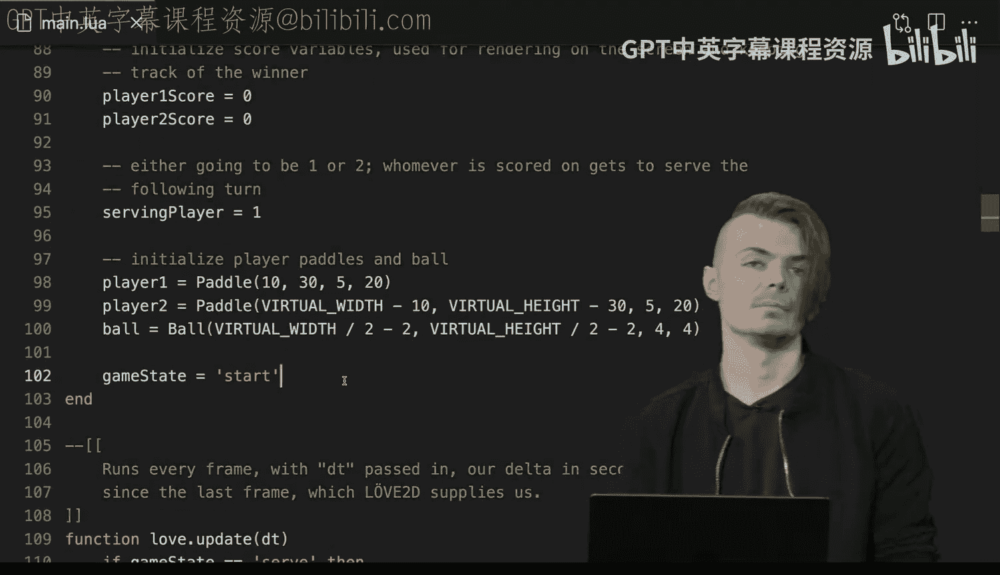

And then we can see that we start in the start state。Is just essentially now when the game begins。

 I'll go ahead and run it so we can see it。But it just says welcome to Pong press En to begin。

 so this is very clearly。Kind of representing a sort of like main not main menu。

 but more of like a you've just begun playing， let's actually start playing the game so once I press enter for the first time。

Player one gets to serve and then it's waiting now still now we can still move。

 our movement isn't locked behind a particular state， and so that's a choice that you can make。

You can see the ball isn't moving， the ball is locked behind the play state。

But the paddle moving is not locked by anything， you can move at any time。

 so there are we'll see this in different iterations throughout the course。

 there are different ways in which you might want certain things to be moving or animating and playing sounds and all this stuff。

Between a bunch of different states。But in this particular case， the ball， for example， is static。

 but as soon as we hit enter， we're going to go from the serve to the play state。

 you'll see it right here。We do that， we're going to let ourselves lose a point and then we go back to serve and then we still haven't implemented victory condition yet。

 which would be the  ten points， but weve all we've essentially added is just a state that represents that start state。

 we take a look at it。

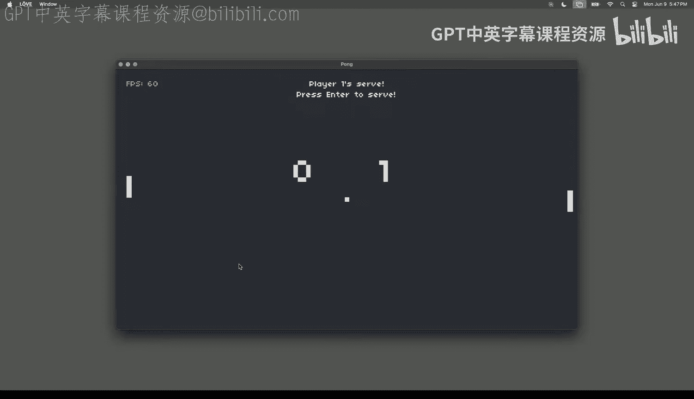

We see it right here。We're essentially just going to do a transition here。 So we're going to。

If the game is in the start state。We're going to set it to the serve state。

 so it's basically just almost like a second serve state of sorts。

But here's where we do some additional logic in the draw function。

 which is that if we're in the start state we want， again。

 we saw that welcome to Pong message which just says， hey this is you started the game。

 go ahead and press enter， and then with for and Ser， okay， who's serving， let's display the message。

 which is here， we're keeping a serving player variable to keep track of this and this influences what direction the ball starts off DxYs。

And then if we are in the play state， as you saw there are no UI messages just blank。

 we're just playing a game and focused on that， and so this is essentially a representation of just how we can add more states to the game and what they represent combinations of keyboard handling。

 updating and drawing and then conditions and again we'll build up a much better abstraction for this next time。

 but for right now we're keeping things pretty simple and just in a variable holding a string value。

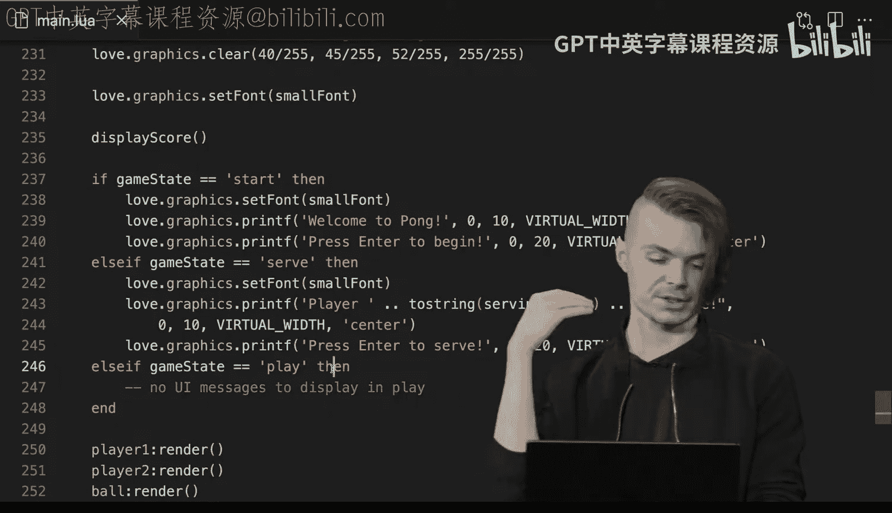

So let's go back here。Whoops， so that was it for the serve update and so the next big update is this is kind of like the one that I guess officially kind of seals the game off as being。

Quote unquote a game and finished， but it's essentially the idea of。

 well okay how do we actually win like a game doesn't really make sense if you you can play to infinity。

 but if you can't win why I mean you can make an argument that's fun to play for its own sake。

 but you I think we want in a competitive game especially some way to know that the other person has won and thankfully this is pretty easy we're going to just essentially add another state。

 another victory state so to speak， that's going to。

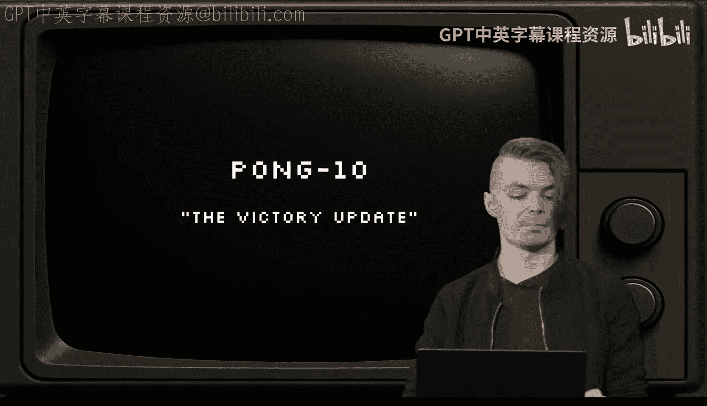

Trigger once we have and I'm sorry， that was the wrong window。

 but it's going to trigger when one player reaches 10 points。

 and so let's go ahead and open up Pong 10。You go to mainine here。

And I called it done here only because I suppose victory will be relative to whoever the player is。

 you could call it done， victory， game over， finish， redo， whatever you want。

 as long as it's a different string key that we keep consistent so if the game is done。

 we have a set of messages， you know player X wins or whatever that gets decided if we go up here。

So we have a couple of pieces of code as well， so we have scores that get reset when we get into the done state。

Rather， if we're in the Dun state and we're going to be finished with the Dun state because we want to reset the game ideally。

 so you'll notice this is in the love Do Keep press， so if we press enter or're in the Dun state。

We're going to go back to serve except now we're going to reset the ball， which is normal。

 but we're also going to reset player scores and then whoever won the opposite person gets to serve for the first time。

 just as like an arbitrary fun thing。So if you come up here。

You'll see that whenever basically we do score calculation score adjustments。

 we essentially also increment the score of the other player， which we were already doing。

 but then we do a check if player two score is equal to 10 or player one score is equal to 10 if based on their side of the board having been passed。

 then we set the winning player to the opposite person or rule we set winning player to whoever score reached 10 in this case player two score is 10。

 winning player two， then game state is done。And then otherwise。Gamay's not done。

 we're still in the middle of the game， maybe somebody got four points，5 points，6 points。

 so we're just going to go back to serve and reset the ball。

 but we're going to set it to Dun specifically if somebody gets to 10 points。

And then that's essentially it， so if we were to play， I mean， it might be slightly tedious。

 but let's go ahead and instead of 10， maybe we'll say two。

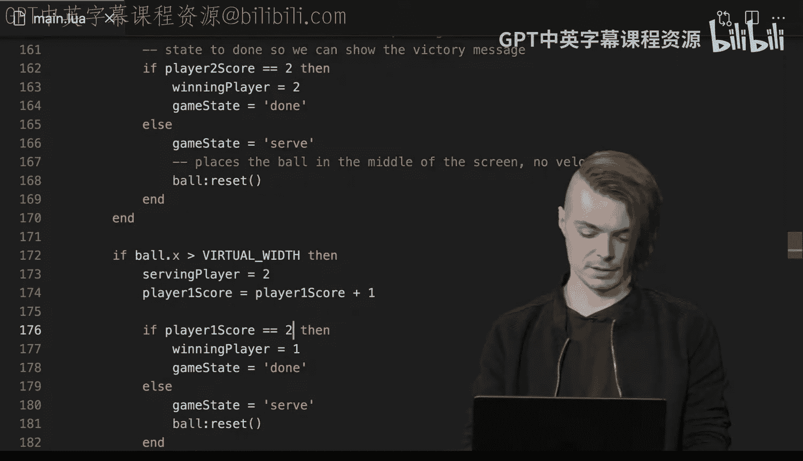

Just for the sake of speed， real quick。I'll go ahead and run this。

So now with the first to two points now is going to be declared the winner。

 so I'm going to go ahead and press En to start。And I'm just going to purposefully lose。

So player one will be the winner here。So player one win。

 so notice that we got the two point threshold， player one became the winner and then our state entered into the done state so we're not moving the ball around or anything like that。

 we can still move around like paals can move no matter what the scores are still displayed there but now we have a victory condition。

 enter is going to restart and then once we hit enter to transition into the serve state again recall that we're going to reset the scores back to zero and0。

And then player two gets to serve the ball， so now we have the ability to completely play the game。

 people could play this add infinite and actually it's an actual full finished game。

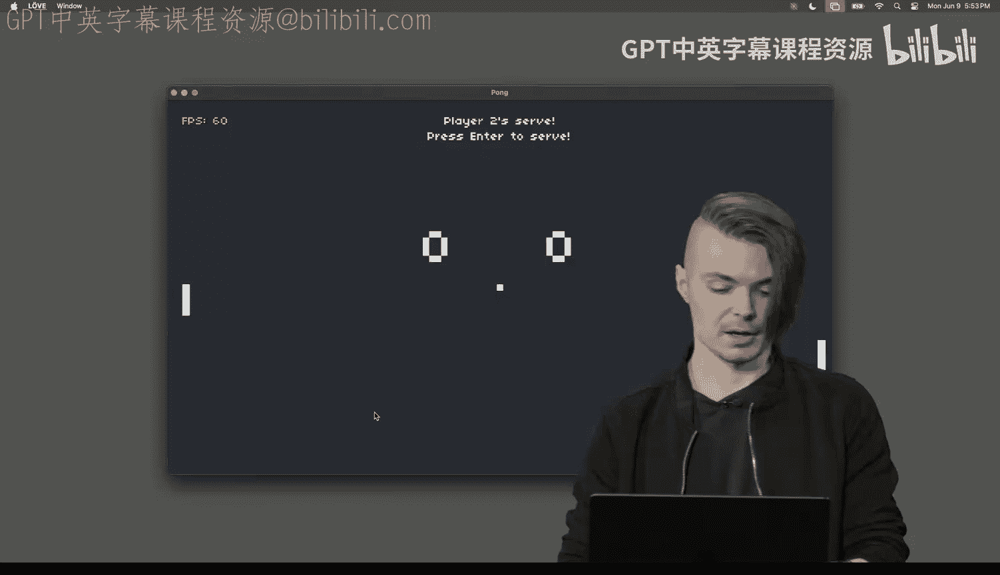

So the core of the game is finished， which is kind of cool to see It's a relatively simple game。

 but a lot of pieces when you really boil it down， it's actually reasonably complicated。 now granted。

 I think the major thing that sticks up to me right now is that yeah we have a game that works and it's cool it's great it it even looks relatively like it should but it's just you it's dead quiet。

 There's no sound。 There's just it feels a little bit stifling to be honest and so there's an important function that we can look at called love audio news source and thankfully love makes this super easy。

 it's just you load a file， it can be a music file。

 it can be a sound file and then you can just trigger this sound to play to stop to loop to do all these different things whenever you want to and just call it in the code basically wherever you might have other things happening and so you can see some of essentially the same things that I just said there and what's cool is that know sound is a very。

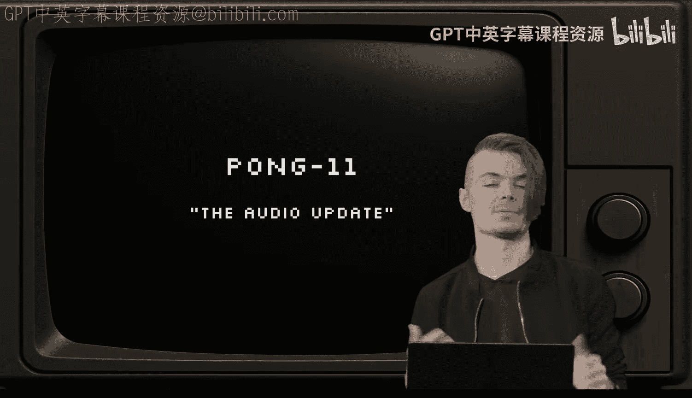

Complicated domain you could spend a bunch of time doing really low levelvel sound synthesis in a D or something or even programmatically。

 but thankfully some folks have created some really cool tools online BF Xer is one that we've used in the past and it has a nice web app for it but also chiptone is another one that I just discovered really recently that I really like and I just love the aesthetic of it I feel like you could just use that and just have fun tinkering with it。

 it's got a really cool visualizer as well for the sound and I figured we could try to maybe download or try to create a sound using chip toneone just to illustrate it。

So I'm going to go ahead and go to。My browser， which I should have open here。

And so this is Chitone just on SFB games that itched that Iosize chiptone。And。

Sounds are really interesting and cool。 there's a lot of different types of sounds。

 obviously if you're thinking about you classic Mario games or Zelda games even you've got coins。

 jumps you know the sound when you run into an enemy when when you grab a mushroom you grow larger and it makes that elevated sound。

 a lot of the sort of categories of sounds you can generate are sort of modeled I think off of that have very heavily and this was the same thing with BFx or two。

 but if I just click on one of these， for example， we primarily want if we think about what do we want soundwise。

 we want and I already have some sounds pre-created but just for fun we can sort of think about this and maybe maybe incorporate them but we want minimally a sound when the ball bounces off the paddles and I'm thinking like something kind of like bright kind of like not too high pitch but nice and almost like a metallicky plasticky sound。

And when it bounces off the top and the bottom， I'm thinking maybe like a more dull sound and then when it goes off the left or right side。

 something that's a little harsher that sounds like oh I just suffered some loss like there's a lot of information that you can bake into sounds like the semantic meaning of a sound in the game can be a subtle but very effective thing that you incorporate that gives it a lot of life So if we click you can just click on these buttons here so these will all just generate random sounds and click on coin for example。

And it just generates sounds。So it just creates a variety of kind of relatively interesting sounds or hurt。

These being like also generally representative of what you might expect if you were playing a game and you maybe hit an enemy in a platform or something。

 what we'll probably want for the paddles is like the blip category。Butbably don't want that。

Not that。That's not bad， we can try that， so it'll save that as a wave file。

 so it's going to download that。Now we want the top and the bottom of the screen as well so if we do something like。

Let's just tinker with hurt， maybe。Maybe now， let's try blip again。Or in entire boom。Okay。

 that's a good sound for the top on the bottom， we'll download that and then we'll do a hurt one。

Lets try，Let's just take it from hurt。That's good， okay。So these are all， let's grab these。

So this first one。Was for the paddle。The second one was for。That would be wall， I think。

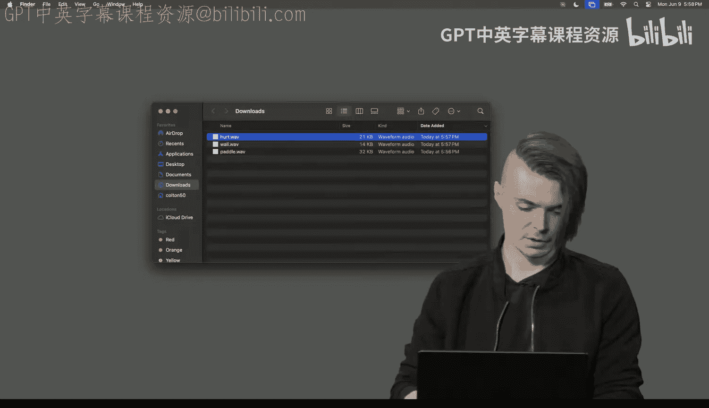

And then this one will be， let's say that we'll call that one hurt。

 and I'm going to look at the code really quickly just to remember what exactly we use to reference it。

 but I'm going to open up Pg 11。

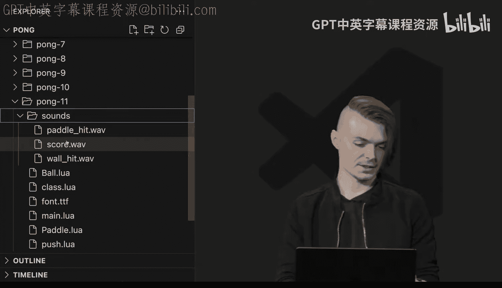

There's preexisting sounds in here。 Okay， so like we call them paddle hit score and wall hit。

 So okay， so let's go back to this。Paddle hit。Wall hit。And score。Okay。

 and then now if we're go ahead and copy these into I'm going to。Find my way into。

My repo here on the fly， so this should be in pong。Pong 11 sounds。

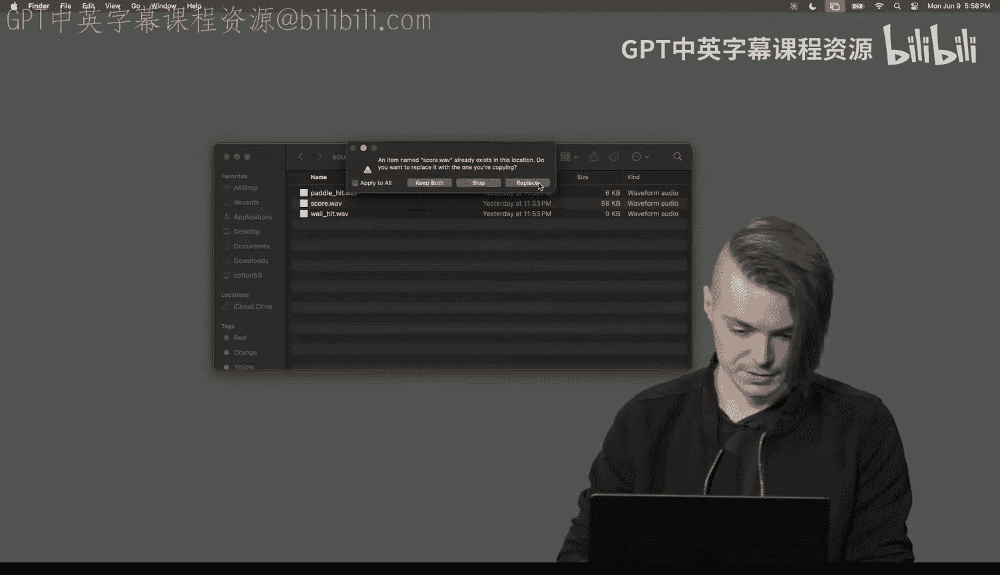

What's replace these？And then now。If we load this up， so let's look at the code。

 we'll look at the code really quickly as well just to see exactly how we're using these。

 so have we have the actual sounds that we want and they can be in wave， MP3， OGG。

 all kinds all kinds of different formats。But we have the actual file but now we have to load it and then we have to call it。

 we have to actually play the sound and in some cases we have to stop the sound if it's music and we want certain things to happen or we want to play a sound repeatedly。

 typically we have to stop it before we can replay it so we're going to scroll all the way up to our lovedot load which is where we take care of this and I've decided to sort of create a table here。

 which so far we haven't really looked at creating tables ourselves。

 so this is a good opportunity also just to look at how tables can work in a basic way in Lua。

 at least as far as they function as key value pairs， so in this particular case。

 if we define a table called sounds。That takes in a paddle hit。

 it's going to have a paddle hit key that maps up to our paddle hit wave file。

 a score key that maps up to our score do wave file and so on like these keys we can now do something like sounds。

Paddle hit。And we're indexing into this sounds table which and we'll get back whatever this value is。

 in this case I love audio new source that maps to these three file names that we just downloaded from Chiptone。

 and then there's a parameter static it could also be streaming。

 which allows us to either load the file in memory。

hi case it will just be immediately available to us， or if it's a larger file， larger audio file。

 we can stream it over time and then sort of like give our memory a little bit more legroom。

 so to speak。So if we go down now， so we can think about the places where it happens where we want to play these sounds。

 can we interject a question here Yeah sorry can you scroll back up in your code so that we can splice this end yeah。

And or this might be a slightly awkward cut， but I think we should try or do you want to。

 I've raised my hand， do you want to pretend ask me to call on me sure？Okay， sure。Previously。

 when we created a table earlier in class， we didn't have the square brackets around the key names。

 Are they necessary now or optional when you have a。

There is a particular time when you need them and it might be。Because of the underscores here。

But I don't think they're strictly necessary， but there are instances where you can't have a string。

It might have been a thing that I began to do by default for consistency because of examples that come later in the source code in lectures。

 where there are particular characters that you can't have as your keys。

 you definitely can't start them with a number， and you can't have them be you can't have certain characters like slashes or dashes or things like that in them。

 that might have been the original rationale for why they're this way and then rather than just have variable showing of them in at least in data declarations like this。

 I elected to just keep them all consistent， but it is often the case， especially if variables。

 especially if the keys are not going to be use special characters or be weird that it is in they're interchangeable。

Okay， I think we should reshoot that answer， but make it much tighter。嗯。

And I just Googleod this real quick， it sounds like it doesn't sound like these are problematic。

 but if you had used the underscore at the beginning or end of the token， it would be yeah。

Is that true the beginning of the end， I guess is that。

 I guess that would be trying to think that I have seen a lot of language grammars that do not allow that。

 That's true。 All right， I'm trying to get a definitive answer real quick。 Yeah， this。

 this is working fine when subbing it。 So I think it is。

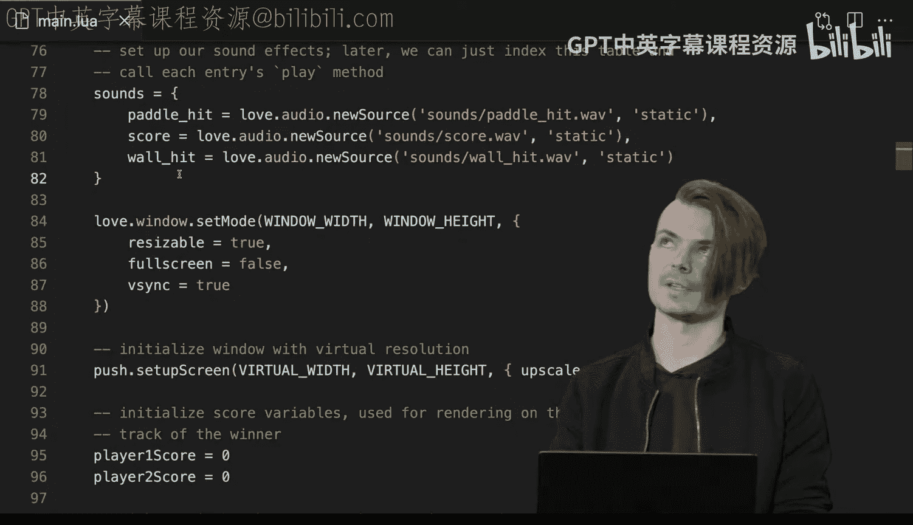

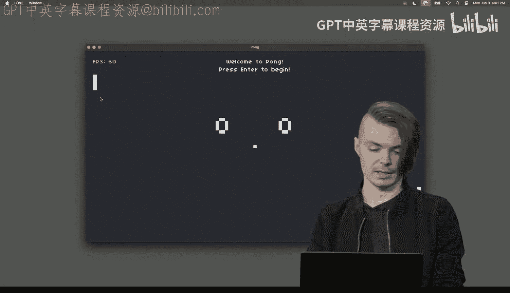

I think it's the numbers and hyphens because hyphens for sure don't work。

Because that'll be interpreted as a minus。Okay， so for what it's worth。

 even though I'm picking this up for the first time。It sounds like。In this particular case。

 they're not necessary， but it's best practice so that you can include other characters in your key names。

Do you want to can I reask it so that you can answer with something like that？Yeah。

Previous when we had a table in a very early example。

 you didn't have the square brackets around the key names are they necessary here。

 so they're not strictly necessary， in fact， with these examples they're interchangeable。

 but if you were to try to include characters that are not underscores or alphanumeric characters。

 for example， if you wanted hyphens if you wanted other special syntax。

 you would not be able to use those as keys because they'd be interpreted by LuA as sort of not valid variable names。

 and so just for consistency and flexibility we elect to。

 I elect to for data like this especially just keep it consistent with strings。Okay。

 so let's take a look now， so we have our wave files， our sound files in place。

If we go down just a bit。We know that we want to when we bounce off of the paddles we want to play the paddle hit sound and then when we bounce off the walls。

 the top and bottom， we want to play that sound， and then when we bounce off of the or rather when we go off the left and the right edges of the screen。

 we want to also play the score sound and if we just scroll a little bit here， you'll see indeed。

Where we have the collision occurring between the ball and a player。

 you'll see we have sounds paddle hit， colon play， and sounds are objects。

 so they do take colon syntax and then play is a method on that sound object。

Same thing here for the paddle hit occurring when the ball glides with player two。Now。

 if it's the top and the bottom， we do the wall hit play。And then if we go and look for the yeah。

 if the ball do x goes to the left edge of the screen。

 we see the score play and then the opposite occurs here if it goes past the virtual width。

 so if you play this， we'll be able to hear some sounds occur， so let's go ahead and。

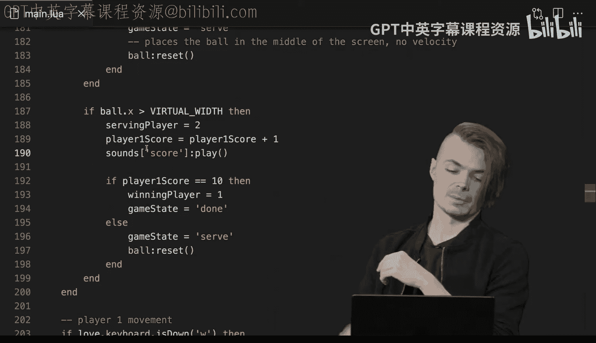

Even these out。Okay。Okay， we're hear my soul sound there。Okay， and then well purpose for Li。

Yeah as you can see sounds that areruply similar to what you'll get in the distro。

 but you know just generated off of a few moments on chiptone。

 the FXer is also really great and it adds a lot of value it's cheap nowadays with very generously offered free tools if you wanted to you can get into sound synthesis yourself。

 load up a do and do a bunch of experimentation and obviously this will work with music as well and music is an incredible part of ensuring atmosphere with games and we'll get into that even just next week but already we now sort of just with that very small adjustment。

 we just added a few sounds and a few specific places for the things that interact in our game world。

 we now sort of can feel the game in a way that's different， it feels very immersive。

 it feels a lot more polished and complete。

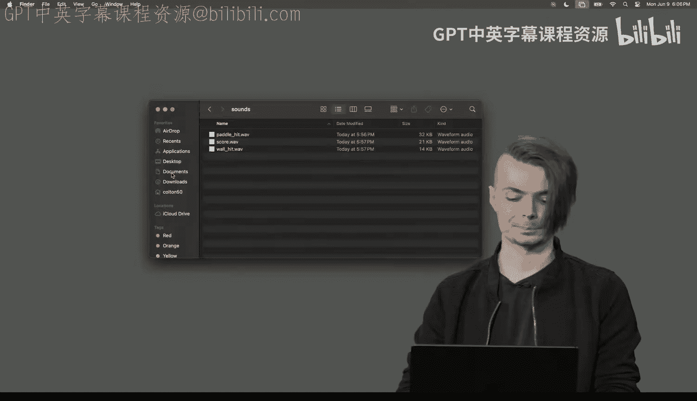

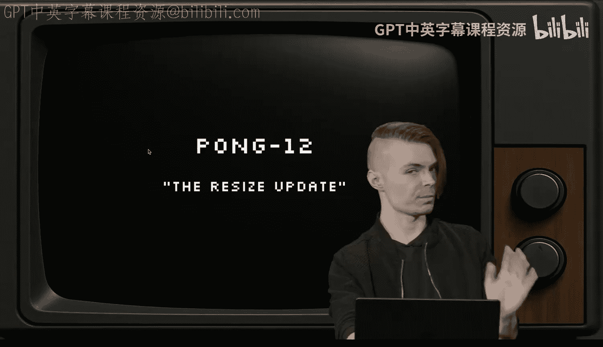

So I'm going to transition back here， the very last thing we'll look at and this is a rather small code thing to look at is just right now if we were to try to resize things。

 it doesn't work very well and this is something that is a function of the fact that the window has to be resizable and also push as a library does things with the resizing of the virtual canvas that it uses that has to be synced up with the window and that occurs during Love's own callback function。

 love。 resize， which takes in a width and a height， if we， for example were' to look at。

The not this window， but if we were to go here into pg 11， so not pg 12 yet。

 but if I were to rerun that exact same example。

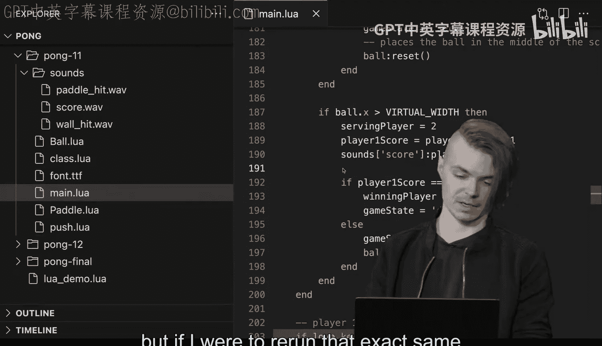

And then try to resize this， you'll notice that it doesn't do a very elegant job。

 it doesn't resize it at all， it just kind of cuts it off because push isn't getting updated by Love dot resize and LoveDt resize as a callback function is responsible for doing that。

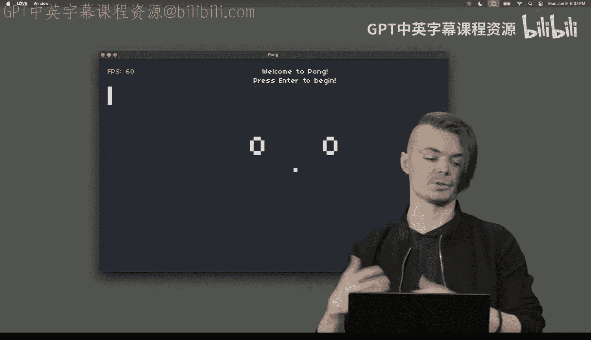

So what we're going to do is we're just going to literally define this， call it。

 and then make sure that resizable is equal to true in our main file。So we go to main。Come down here。

So you'll see it resizable is true now in our Windows dot set mode where previously I had set it to false。

 and might have by default， a lot of these examples might have also still be set to true。

if we scroll down just a little bit， it's a very trivial， very small example。

 a very small thing just to top things off but you'll see that love。

 resize just is calling in here pusht resize which I think was designed with this in mind but literally just needs to get the message sent to it from love that the Windows resize at W and H and for it to sort of take the reins and to also resize so we covered a lot of information know it was a dense lecture in a lot of ways I think a deceptively complicated lecture for what the game ultimately looks like but with the stepping stones that we established today every other lecture will make a lot more sense and we'll see a lot of patterns repeated so this was CS52D lecture 0 pong and we'll see you next time。

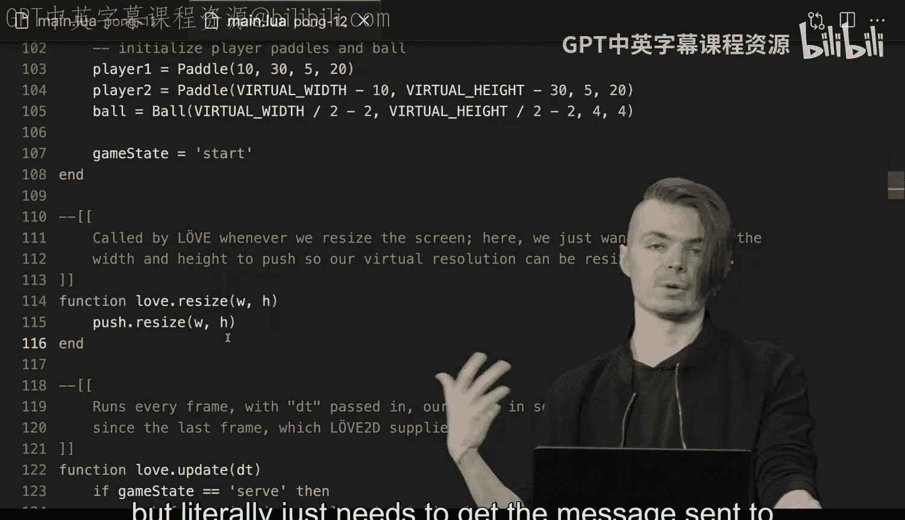

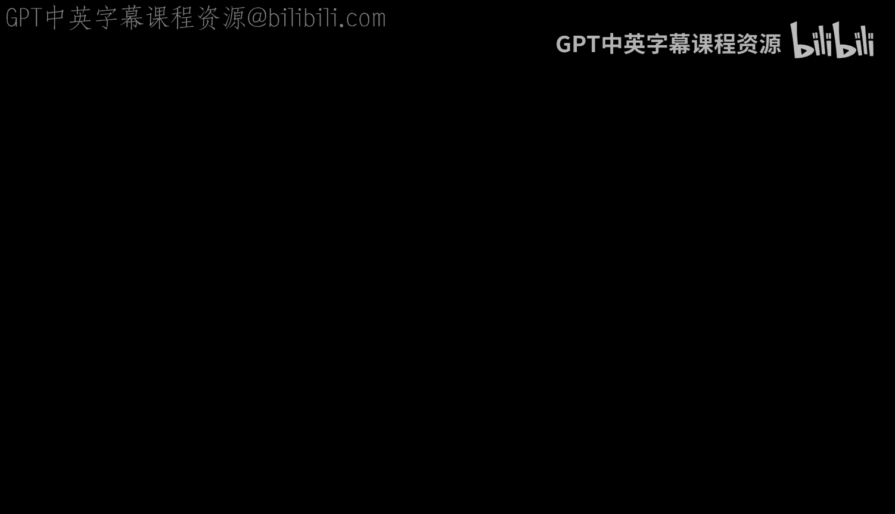