# 哈佛大学《2D游戏开发｜CS50 Introduction to 2D Game Development 2025 Fall》中英字幕 p04 CS50 2D - Lecture 3 - Match 3 .cut.zh_en -BV15xsPzEETf_p4-

Hello world。 My name is David Main， and I'm here， of course， with Colton Agen。

 And this is our second of two live streams today。 This one on CS 52D。

 the new and improved version of CS 50's introduction to 2D game development。

 I'll be fielding any questions via the chat if I can or raising my hand on your behalf。

 This course will be live on edX later this year， as will the assignment。

 So all watching now offers a bit of a preview and please forgive as always if we start and stop to fix things along the way。

 This is very much a live lecture。 So we've been doing some fun facts each。

 and they're getting harder to come up with fun facts。 But I'm thinking this right now。

 people will be familiar with today's topic， probably in the form of a mobile app nowadays。

 And I wonder what is your goto mobile game these days， if any。😊，I don't mobile game at all。

 but I think funnily enough in an airport not too long ago， it was Candy Crush。

 literally their newest version， like Candy Cru sodas， pop or something。

 Oh interesting I can't remember if I'll have to check my history if I've ever installed Candy Crush。

 It's addictive。 I mean， I respect the formula it works。 Yeah All right well more on that today。

 We'll be back in a minute to begin in class thanks。Hello world， this is CS52D。 This is week3。

 and this week we're going to take a look at a classic game that a lot of people are probably familiar with in recent times on their phones is called Match3。

 Well the genre is called matchch3 and the game probably originally in its most famous initial incarnation started with a game called Bejeweled。

 it had a predecessor for Dos back in the 90s but Bejeweled was a game that was very popular I remember playing this in the 2010s circa 2012。

 2013 quite a bit as the sort of addicting game that was kind of easy to play on phones or just on the computer。

 what have you and it's a very simple formula really it's literally in the name which is kind of funny but essentially it is you have this grid of tiles。

 it can be whatever you won this particular case of bejeweled。

 it's themed after jewelry and I think sort of the more glitzy or appetizing the theme is the better typically for engagement。

But in this case we have various jewels of different colors。

 they're very individually recognizable and they're all arranged such that you know essentially they're orthogonal to one another you can swap any two that are directly adjacent to each other and what you get from this is essentially once you have let's say these examples appear these orange and blue gems if you were to swap these two together such that now you have three contiguous orange gems well now you've completed a match and then you will get some points for that at which point the tiles will replace to fill in the gap that gets created from those gems and there's all sorts of other effects more people probably nowadays are familiar with candy crush and I've even played this relatively recently and it's also the same exact ID in fact if you were to go between the two of these they're almost indistinguishable at a glance except this one being a little bit more candy themed but if we think about last week we talked about sprite sheets we talked about breaking a texture apart into these individual tiles and in some。

way iss a continuation of the same ideas that we looked at last week。

 but we'll also be looking at a lot of other very interesting ideas。In particular。

 Tweing and timers are the two biggest ones this lecture iteration。

 we looked at anonymous functions in flapappybiird when we introduced the state machine and the ability to have anonymous functions instantiate the states within that but in this week's lecture we'll look at that a little bit in a different use case in conjunction with Tweing which is essentially just interpolating a value between two points timers which will allow us to perform that but allow us to do a lots of other very interesting things to think of our game as a set of operations over time for things that should animate or transition smoothly。

Up till now we've only been doing essentially automated movement based on velocity。

 DX and DY things have been otherwise very discrete and very instantaneous and as a result we don't have that fluidity of motion that allows us to do certain things like transition things from one spot to another so we will do stuff like that We'll look at how to solve matches which is the key to match3。

 how do we detect that a matches actually happen and then replace those tiles in the grid。

We'll look at how to fill that grid up with tiles and we'll look at how tiles and ID sort of map one to one in this version of how we're going to implement things using quads。

 which we looked at last week， tile sheets， and then lastly at the very end is a little bit of fun we'll look at Sprite art and palettes which are it was another detail that is really important in the aesthetics of a game and which we are capitalizing on this week with our Spritehe which as you can see here through a few previews of what our goal is to implement today。

 we have a somewhat feature rich game example implementing the same exact principles of match3 using its own version its own tile set therein。

 but I think it'd be nice to actually get a chance to take a look at what it looks like and I'm hoping maybe if we could get a volunteer to come up and take a look at the game and try it out。

Oh sorry， I guess probablym so sorry I guess we should we should have probably。

 we should have probably， I should have probably。 Yes， I'm sorry。

 I'm supposed to be saying in front for that。 I should have primed that。 I'm sorry。 That's okay。

 Let me come up and let's we can cut this together。 Yeah。

 let me also make sure that that's ready quickly to go， okay。😊。

Sorry， I was realizing as I was saying it， I was like， oh shoot。

 I tried to slow my words down a little bit and get your attention。Yes， no， totally， my fault。

 as my fault。Can we use this， can we use the same words Colton said， or do we have to redo that。

Oh yeah， okay， that makes sense。 Yeah， I think I can just come up， right？

Do you want to joke again about not knowing your name or sure， let's do it， make it a thing。Okay。

 here we go， ready？What。

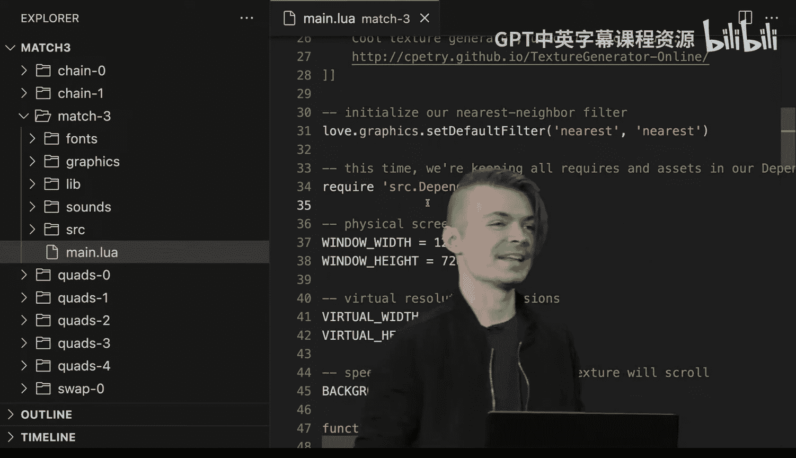

Okay。Oh， I think we went Dan right David Oh okay nice to meet you， nice to meet you， Okay。

 so I want to go ahead and run the code here this is this week's final example yours。

So arrow keys will move between start and put game and enter to start the game。

Not we have a transition to white， we have this moving thin transition as well。

 so the controls our arrow keys will move your cursor around and then if you press enter。

 you'll select a tile to swap and then you can swap it with another tile adjacent to directly orthoon on the left or right。

 top to bottom。So then you going to so that will click it in place so then you want to move to the tile that you want to swap too Oh and so click it once。

So you had it selected there so now you have that one selected so now you can move into you know top right left or bottom to come playing this2 and then you can move those to you can swap those two if you wanted to and so we have the swap operation perform notice they happen sort of smoothly they twe。

Pohysicitionians。Okay I can do this one though Oh I think I know what I'm doing what I'm doing now Oh Oh subtle color that one's a purple color and that one's a think pink very subtle color difference it's in the highlight here this is this is this particular sprites sheet has a couple colors that are very similar I'm going to move this one up。

And this one up very amazing and then tiles knows the tiles move down to fill it in how did I lose I just won you know it's balanced a little bit for you know high scores but we have all the pieces here for you know match three but you know thank you very much appreciate it See you next time。

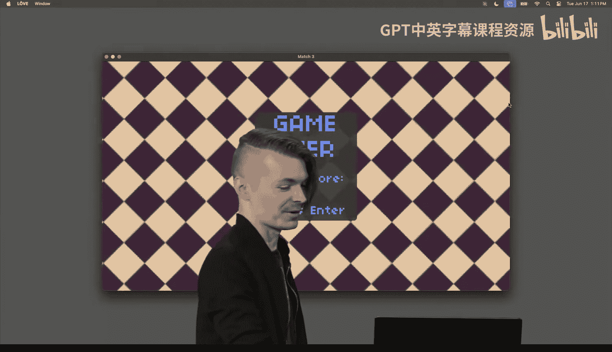

Go ahead and press enter there to restart it。So I think we saw a bunch of interesting pieces looking just at that example。

 the biggest pieces that jump out to me， and I think the pieces that are going to be relevant for this week's lecture in particular that transcend just this lecture are the transitions themselves so if I'm going to restart the game just we can look at a couple of pieces real fast。

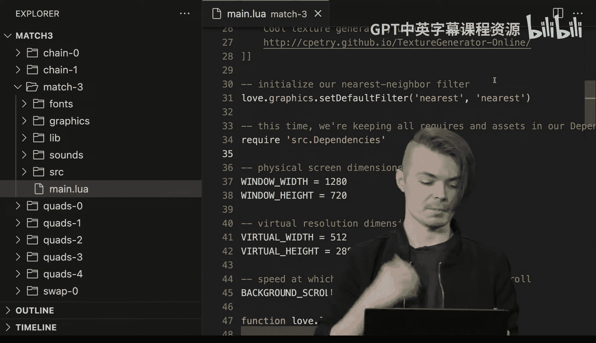

But we'll notice。🎼One， right up the gate。 Mat three of the letters are rotating their colors on a timer。

 It's very fast in this case， but it is operating on a timer。 The background is scrolling。

 but that's not anything related necessarily to this week's lecture But if I hit start。

 we'll notice that we fade to white and then from white into a new state and then we have this transition of rather this translation of our level text to the middle of the screen and then off screen so this y position interpolation。

 You'll notice also at in this box of text to the left。

 we have a timer which is counting down to0 at which point this current level will end in the game will the player will lose the game。

 if they were to go over their score of 1250， they go to level 2 at which point their score threshold will be higher for them to not lose effectively and you know as we saw even moving two tiles。

They don't instantly switch positions， they interpolate between the two positions。

 and the same thing were to happen if you were to watch the match occur here。

 you'll see that the space gets filled by the tiles above it and also the new tiles that come down will interpolate into their in this case their y position in all cases their y position。

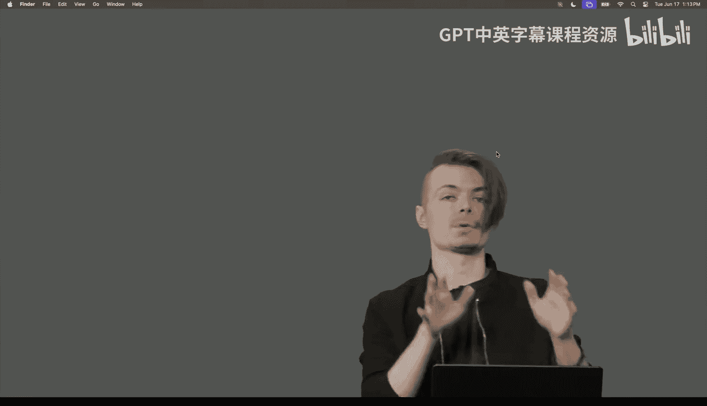

But there are a lot of sort of similar pieces there。

 but they all come from the same idea of using interpolation。

 using tweing and using a timer We've done everything based on automatic sort of position calculations using physics in the case of breakout and pong and in the case of flappy bird you know we did have gravity applying to the bird。

 but the pipes were moving sort of like on their own from right to left。

 but also the way that the pipes were generated was a sort of primitive version of the timer that we'll end up looking at。

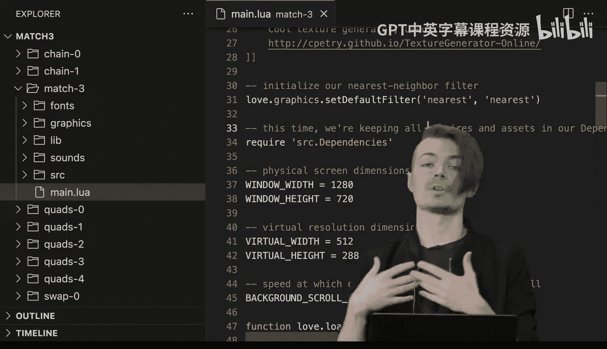

And so。I think in order to set the stage for us going forward。

 before we even get into the time or stuff， I think it's important that we have a little bit of a review in terms of the quads that we looked at last week with breakout that was one of the bigger themes of last week's lecture。

 last sorry last lecture breakout and that is this idea of having a。

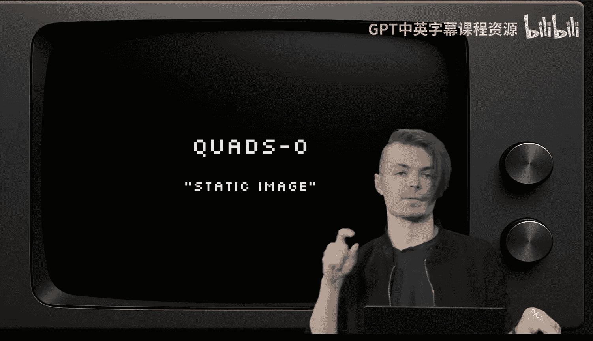

Larger image that you can then slicelice up and then draw an individual piece of that texture。

 so if I were to go to my source code here， I'm going to go ahead and close out this match3 main repo here。

And then let's go to Quads zero Quad zero is very simple， in fact。

 it's not really anything that people haven't seen yet。

But here to start us off with is just the texture that we're working with。

 And in the case of last week we saw with breakout， there was a texture that was，Similar to this。

 it was a texture atlas。 It had a lot of different types of。Elements on it， whether they were bricks。

 there were paddles， they were the balls or the hearts， different colors， different arrangements。

 different sizes for the paddles， chopping up that texture was a little bit of work。

 this particular week's lecture we're only using one texture and this texture is uniformly the same size for all of these tiles they're in these are all 32 by 32 tiles and we can split this up into one just singular array or multi-dimensional array if we want to based on color or based on the rows and they're all just 32 by 32 pixels so in some ways a lot easier to deal with and think about than last week。

 but you can also envision that each of these individual tiles could therefore if we're just chopping it up into one array or table 2D or singular dimensional they all can just get a number and ID essentially that maps to whatever that tile is and then that allows us to say okay which three numbers maybe are the same that are contiguous or so on and so forth。

So I'm going to go ahead and look at quad zero here real quick。

 this is a very simple example I'm going to run it。

We'll see that it literally just prints the texture because the goal is for us to get started just what do we have to work with where are we moving towards。

 so this is just literally drawing the texture， it's nothing that folks really haven't seen yet。

 but we're loading it， we're getting things ready to go just a very simple love。 graphics。

 draw of the texture。

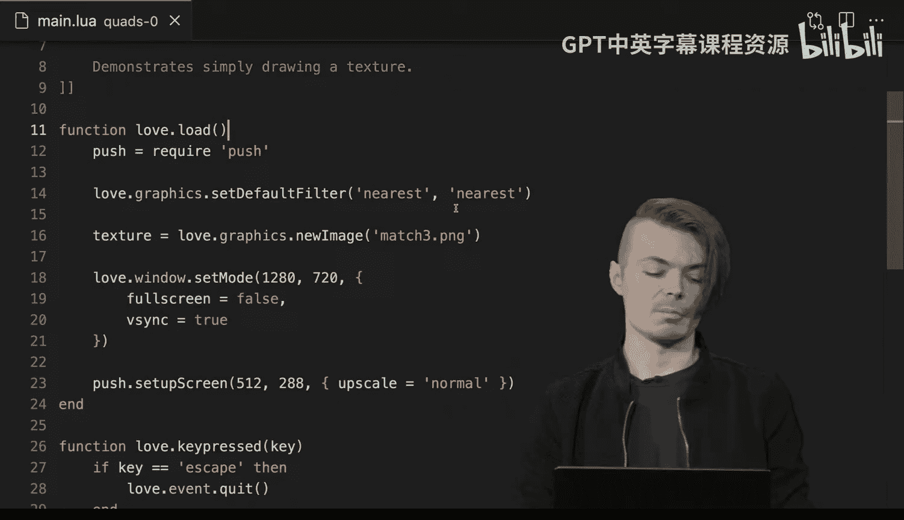

Now， as we saw last week， if we wanted to draw a simple piece of that or an individual piece of that texture。

 we need what's called a quad， so if I go ahead and go back to the code and let's go and open up quads1 now instead of quad0。

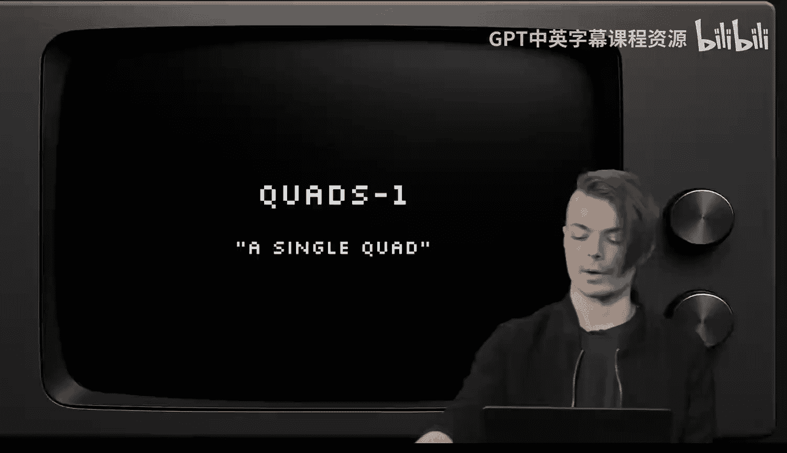

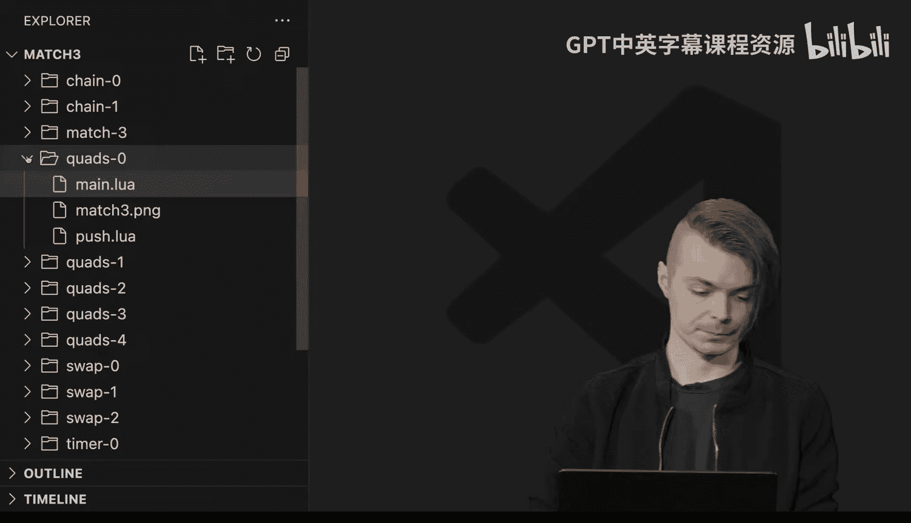

We can see that we have， as we used last week， more or less。

 a single quad at the top left of the screen， which in this case。

 literally just the first quad of the texture， the first rather。

Srite or element or texture image within the actual atlas。

 which is just the singular block at the top left or call if we were to just open the texture again。

 it's right inside this same folder， it's the same just simple sort of khaki colored texture tile。

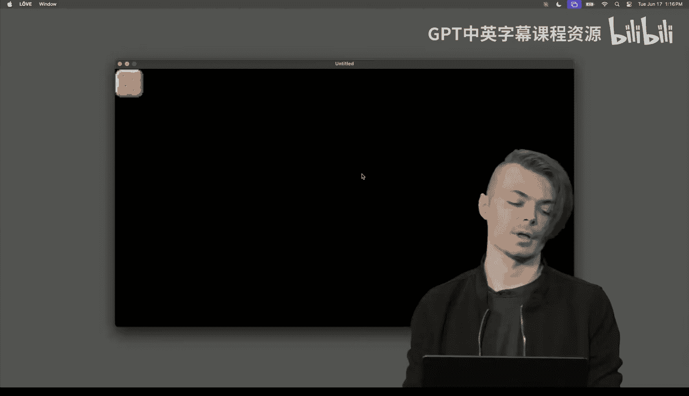

In this case， if we remember from last week， we can take the same image and then load the same texture and then draw it kind of largely the same。

 but now we're going to create a new quad which is from 00 on the x and y to 3232 on the x and Y。

 so we're defining a 32 by 32 sort of square rectangle。As our quad， and then if we come down here。

 remember， we can just draw quad as the second argument to love。graphics。draw。

 and that has the result of the texture gets drawn but only through that window of that quad。

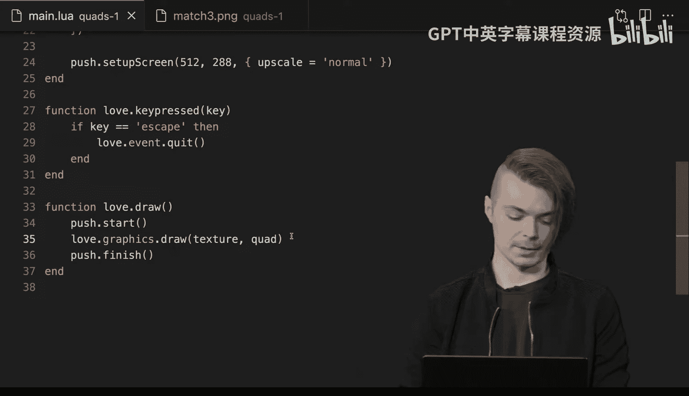

So simple enough so far， whoops， almost lost the clicker there。

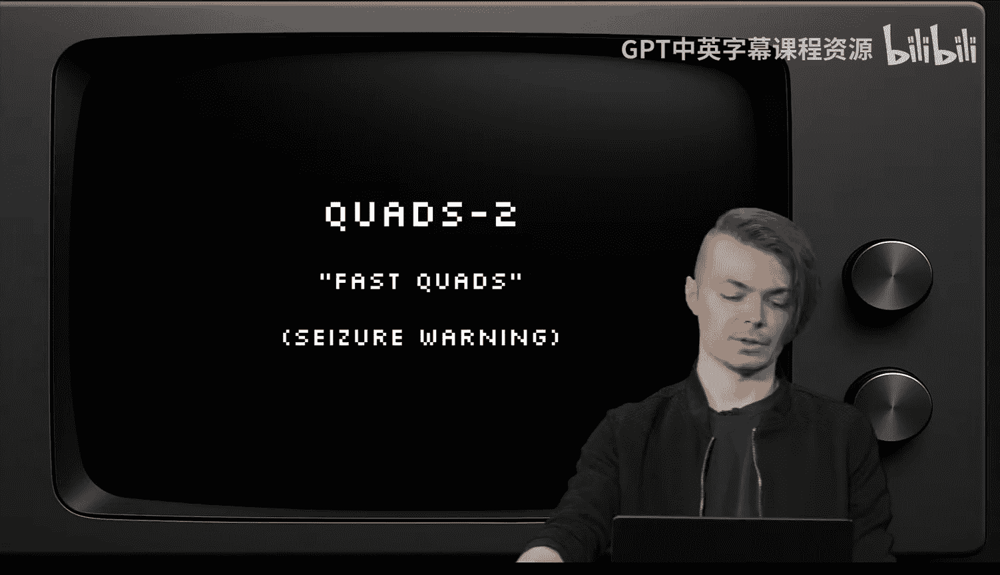

So quads too and caution for folks this might visually look a little bit might be a little bit intense for a second。

 I won't keep it on screen too long。But we can sort of。

 if we were to chop up our texture into all of those individual quads right now in that last example。

 all we did was we just created one quad， but if we want to have this idea of every single tile in our game。

 we can generate every single quad for the generate quads function we looked at last week。

Which is in this repo。As well。We can store all of those into a data structure and then index into it。

 index into this table， this array。And then the index is effectively just the ID of the tile。

 right if we open up。In this case， let's open up， well， we can look at this texture。

 but if we imagine that this is ID1。If we were to break up this whole texture into just one large array of quads。

 each of them are 32 by 32。Then this one at the very top could be ID1， this could be ID2， 3，4，5，6。

 and then 7，8，9， 10， 11， 12， so on and so forth if you were to just iterate throughout the entire chopping up of your texture into quads。

And that's essentially what we mean by an ID whenever we're。

Trying to draw some kind of a sprite or some kind of。Tile or whatever we want to talk about。

 this will be relevant especially next week too， when we get into Mario into worlds and such。

But these IDs， thesedice indices into this array is effectively the way that we can think about these tiles as entities that are。

Orderable or comparable。So and also their color and their， as you can see。

 if we look at this texture， for example， we have these different colors that can be grouped into their own tables。

 their own subars， which have variants。In this week's lecture。

 we won't look at variance as a relevant factor that's going to be part of the problem set。

 but you could imagine comparing that it's in this color range for equality。

 but then whatever the variant actually is on that tile stored as a separate flag is some sort of score multiplier or the like。

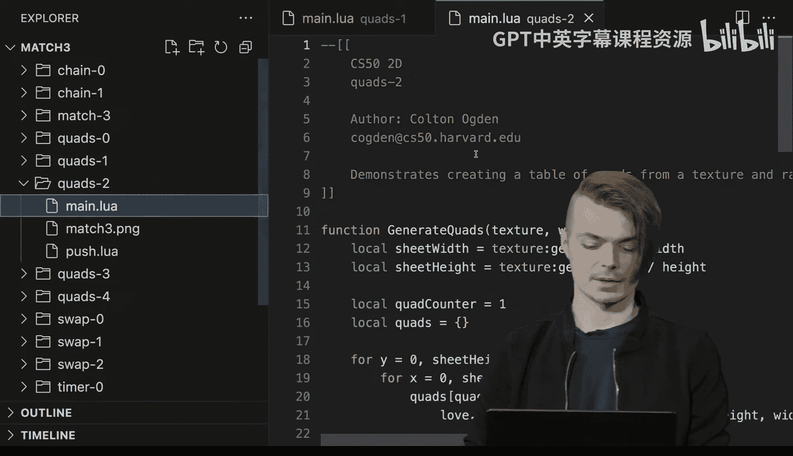

So if we go to Quads2。And I caution again， this is going to be visually kind of a lot。

 but I'm just going to do it very briefly for a second。

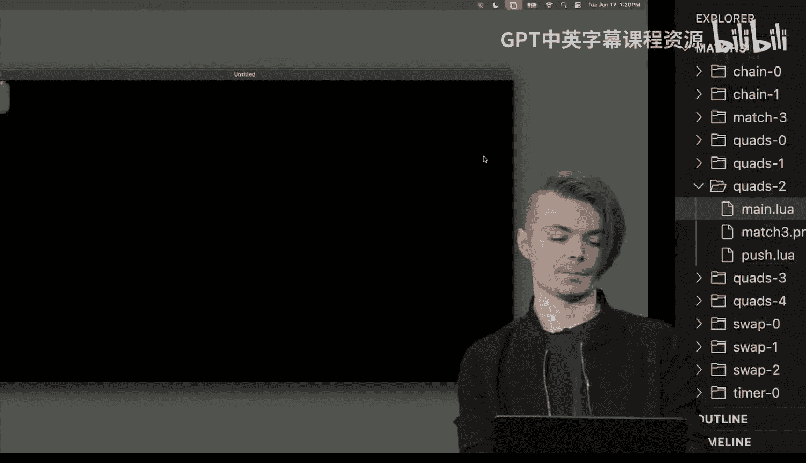

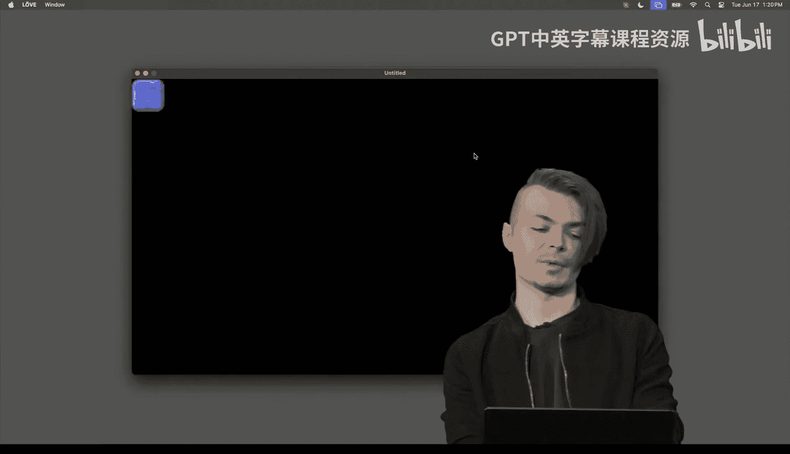

And you'll see a texture。Rather， the set of quads very rapidly changing on the screen。

And so in order for us to have this idea of a。Board of tiles that's consistent， right。

 It's one thing to draw the tiles， but it's another thing to actually have a board that's a data structure that we can compare tiles within and actually have some persistence。

 We can draw quads。 We can draw rectangles。 We can draw the texture， but we need some persistence。

 So this is illustrating the first step towards。I guess that idea is illustrating that things aren't persistent now。

 but we can draw at any point in that quad table， any given quad， so let's go to Quads 2。And then。

So we'll notice the one big thing here is rather than just creating an individual quad。

 we're going to use that generate quads function that we had previously。And if we I embedded it here。

 just at the top of main， typically this is in Uil Lua within each project。

But all we're doing is we're essentially saying。Given a texture and what's the width and height of the tile within that texture。

 we're assuming a uniformity of size for texture， all of the tiles rather。

 and this applies to animations， various other things we'll see later。

But we're going to get whatever the width and height is in tiles of this texture。

 and then we're going to create this quads table that we're just going to。

Using a 2D loop for every y going you every row throughout the entire texture。

 every column within each row， we're going to create at quad counter within quads， that new quad。

 that's effectively essentially the representation of this tile。

 the window of looking at that tile in our texture。

And then just increase quad counter and then we're storing essentially just all of the quads that make up the entirety of that texture。

 and then as a result， we can then just randomly choose any one quad to draw per frame and you see the result on the screen we have just this quickly going through all of these random texture or all these random tiles right？

Because we're drawing it in the same place， we're drawing texture。

 but we're deciding to randomly choose an index within that quads。

Table that we've created from Gene quads， and in case we'd never mentioned it previously。

 this number sign is essentially how you get the length of a table in Lewis。

 so we're just saying a math dot random between one and the length of the table quads so that we just get a random number each time。

So cool， we have the ability to draw whatever。Random。Tile we want from that texture。

Now we can sort of get closer to approximating our grid if we were to think about， okay， well。

 to create a grid， I need a random assortment 2D assortment of tiles， so let's just draw that。

Cl go to Quads 3。

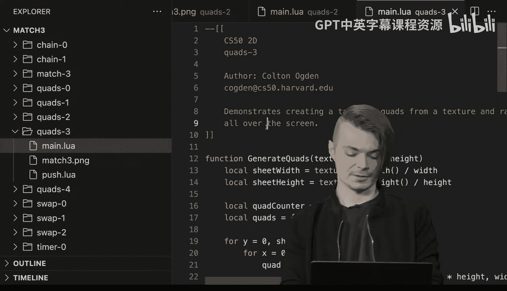

And I should have probably prefaced that again with a warning， but yeah， warning for folks。

 it's very visually kind of intense， but that is， if we were to think about， okay。

 now let's draw over an entire range。

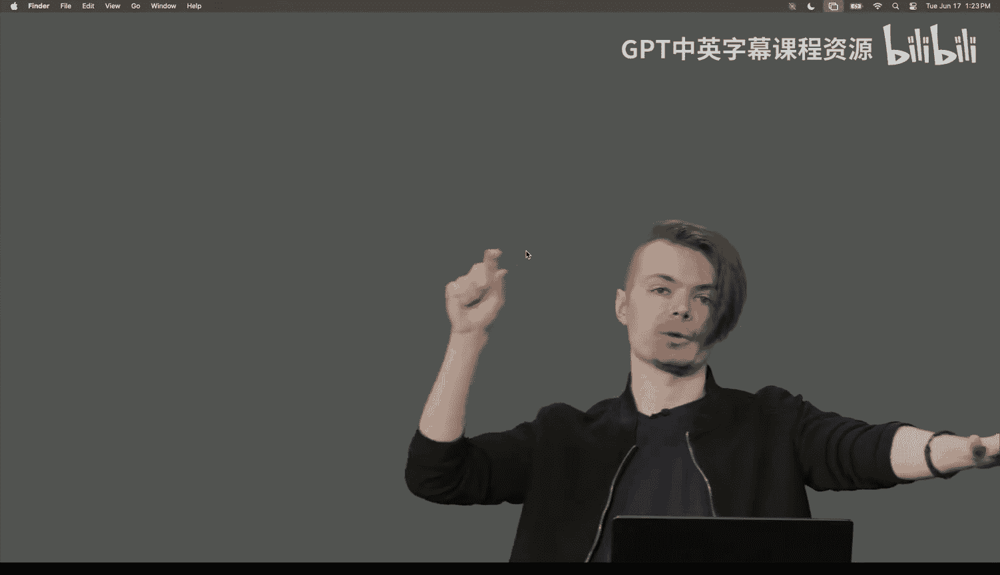

Of tiles， not just the one corner， but let's actually pretend we're drawing a grid of tiles and then do the same thing we are getting closer。

So if we go to Quad 3， reason the same logic， essentially。

But instead of in draw doing a singular draw at the top left， we're going to go ahead and。

Draw from 288 to 32 backwards and basically from 0 to 288 going backwards in 32 pixel increments and then 512 sorry that's from the y axis going from top down to left to right。

 we're going to draw in 32 pixel blocks。A random。Tile and that's effectively what we're doing when we draw the board in the actual distro。

 except here we're not storing it， this is just ephemeral information which ultimately isn't that useful。

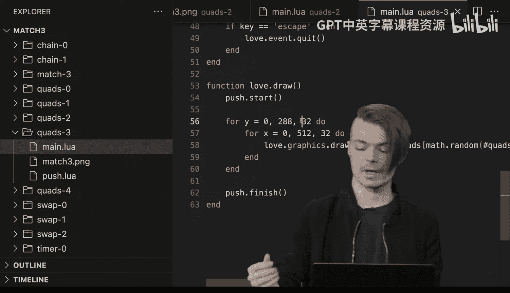

Because it's not preservable， we can't perform any operations on it。

 but we're getting closer to our end goal。And so。That was full screen quads。

And then lastly what we want to do is we want to save these。

 we want to have these be persistent because this is how we actually have a board state that is checkable。

 we can actually iterate through it and say okay， this ID or this， whatever we decide to store。

 this tile is equivalent in color or equivalent in tier to this particular tile。

 so if we go ahead to Quads 4 and just run this。😊。

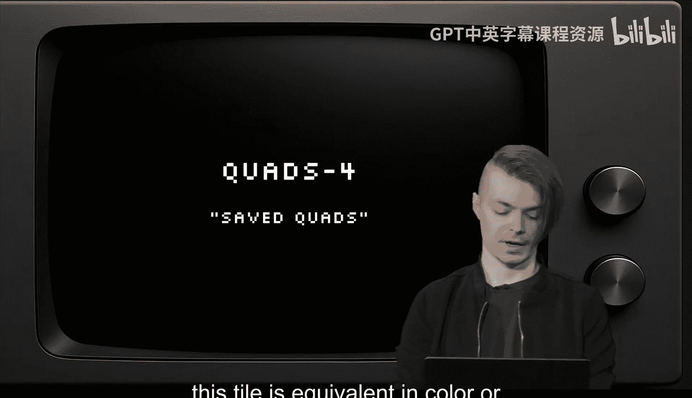

We'll see it's no longer jumping all over the place， we have a consistently rendered set of tiles。

 very cleanly fills the screen。And all we're essentially doing now is， well。

 the one piece left is we have to store， we're generating this random number every frame。

 but we need to store it in place， and then if we store it in place in the data structure we can just iterate over it。

 x over y or y over x。And then just draw the same each frame。

 so let's go ahead and take a look at that。In our love。 load， you can see we have a tiles table。

 so this is where we'll store things。Same thing everywhere else。

 we do have a refresh tiles function which is going to generate things。

 so if I reload this you can see I can hit I believe spacebar to refresh tiles call that same function。

 I have a key handler setup and all this is doing is running that randomization except it is storing them each time I do it。

So I can effectively do the same thing， almost imitate what we were just looking at。

But we've essentially got our table now we've got our， well I say table。

 we have our data structure representing our game， our board state， if we come down here。

Refresh tiles is just going to。Store numbers， right， That's all we're doing。 We're just storing。

The number of whatever that quad。Is that we want。 And then we can just reference that number later when we do that two dimensional iteration over our data structure down here and draw。

 we'll just say。Draw the texture at Quads tiles Yx。

 which we're using a 2D array in this case to store the tiles， so if we come up here as well。

The important detail here is we're not just。In important detail here。

 should we refresh at a certain point， do you want to restart at a certain point。

 that's fine just when I hold things up， try it just to read it without stopping， sorry。That's fine。

Okay， what did we have？On the screen。And an important detail here is that rather than storing all of these necessarily in one contiguous array。

 we can choose to store them in a set of arrays， an array of arrays， a 2D array。

Whi some folks prefer to store it singularly， some folks prefer to store in 2D。

 I typically tend to prefer to store arrays in 2D， but it's relatively simple math to convert between the two。

 and there are certain environments where storing in a single array is going to be more performant。

 but in this case we're going to store everything in a 2D array and so to do that what we're doing is when we refresh tiles。

 tile starts off as just this empty table here。But as we're iterating over y。

 going from one up until 288 divided by 32， which I think is somewhere around7。7even or8。

 what we can do oh sorry and that's9。 I can't do math。

 but what we're doing is saying from essentially from one to9。

 we're going to insert a empty table here， which is going to then store that row of tiles。

 So at tiles Y we're then going to。Have this tile， this other table， which is the row there。

 So Y being the rows， X being the columns。 So at this row， we will then store。

 we will insert just some random。ID， in this case， we're just math out random， the length of quads。

And then what that will allow us to do is as we come down here。We can just iterate over quads。

Tiles Yx is going to be the actual array， our 2D array， our tiles our data structure for the board。

 Quads being our quads table of IDEs， so we'll fetch the ID link it rather our table of quads that are effectively like thinking of our tiles like their IDs。

 which we'll do through here so by offsetting into quads。

 we then are able to redraw the exact tile that maps to that ID that random number between one and the size overall of our number of tiles and you might want to adjust that so account for color and the fact that our color is spaced apart in groups of six。

 for example， and two groupings per row in our sprite sheet which is tackled in the distro。

 but that's one consideration when you're splicing up individual texture。

 sometimes they don't always align perfectly sometimes you might still have to navigate the semantics of the tile sheet versus just the overall straightforwardness of the operation。

And so with that now we've essentially got the entirety of what it means to store the board。

 at least in terms of it visually and also for persistence for right now。

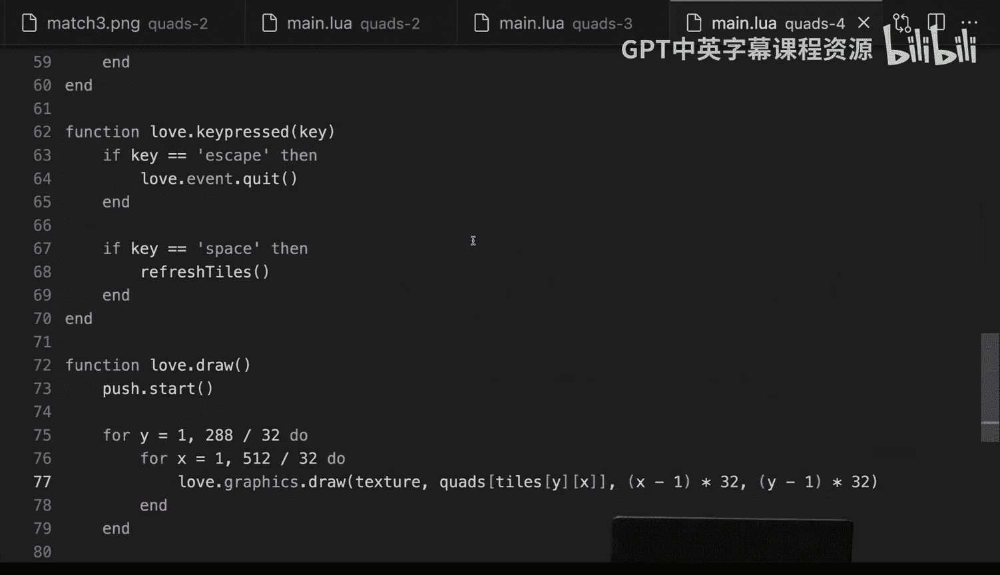

Okay， I'm going to take a drink real quick。Are you coming down。All right。

 so with that now we've looked at how to think of tiles sort of as data right now it's literally just a number。

 it's just a random number that we're effectively using to index into our sort of array or table of quads and we're going to put that aside for now we've got our quads we've got rectangles we've got textures drawing board state largely sort of figured out but now we need to take on I think one of the bigger parts of this week's lecture which is the idea of timers and things that are happening over time or if it's happening after a certain period of time and I want to just relook at a couple of things so in particular。

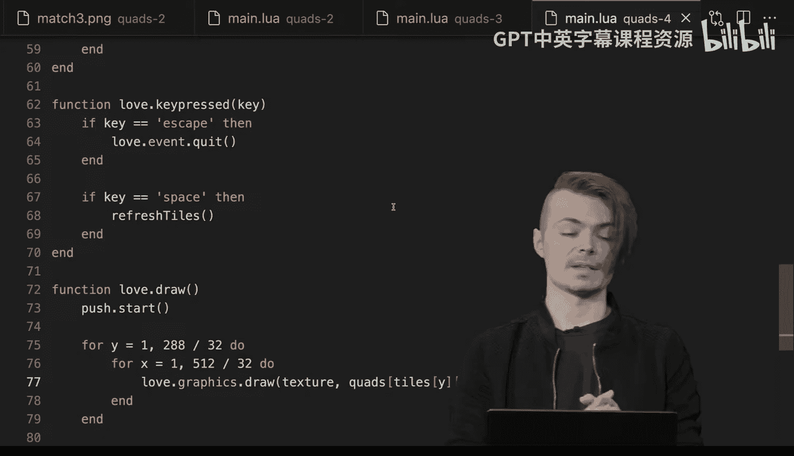

I think to start with， I should say， the first time we looked at this was in Flappybiird。

 when flapappybiird had pipes that were moving from sort of right to left on the screen。

 and that was occurring on a timer and I'm going to show sort of a naive approach to how we could do this ourselves。

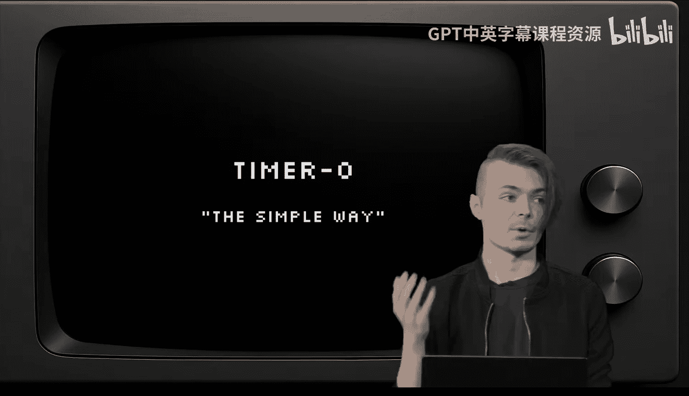

And let's go ahead and to do that， I'm going to go ahead and close all of these。

There were a few things that we've seen and we'll take a look again at those things as we're looking at all these and how they apply to the game。

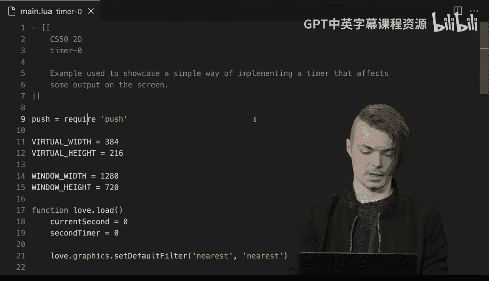

So timer， we'll look at timer0。And I'm just going to run timer zero just to show it for now to get started。

It's very simple， it's just a timer， literally just a text string changing。

 some number that's incrementing every second。And this was effectively what we were doing with the pipes in flapybiird。

 except they were moving， they were instead of a timer a second going up every two seconds or so。

 we would have pipes that would be moving from right to left or respondwning to move。

 then move right to left。 and then their position would change over time until they got to the end of the screen。

 and then they would despawn。And that's fine。 It works in a simple sense。

 but it is a little bit cumbersome， especially when you think about。

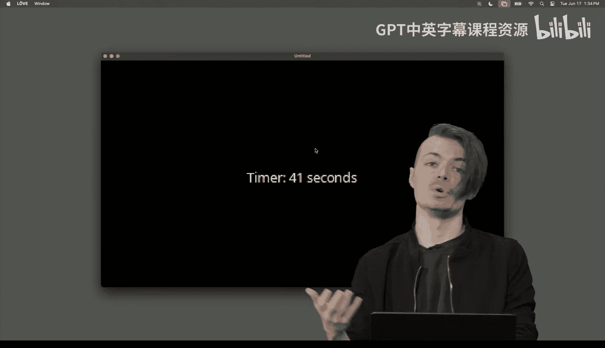

What if I have 10，20， 30，50 things that are all moving around on the screen right let's take a look at how we're implementing it here in timer 0 So all we're doing is literally just we know that we need to draw a second on the screen and we know we need a timer to measure how much delta time has passed so that we can eventually say okay。

 a full second has passed， let's increment second and let's wrap back around to zero。

Accumulated milliseconds effectively or fractional seconds。So here an update。We do indeed have the。

Timer is getting its DT increased， and then if second timer is greater than one， in this case。

 second time meaning like number of seconds。Then we'll increment print second。

 and then we'll just modulo by one to loop it back around to0 point， whatever something。

And the result of this is that sure we have this looping timer every time zero。

 this number that's zero is going to accumulate up to1， it'll go back to zero。

 and then this will you know over time track things perfectly the way that we want to it's fine for now but I would argue that it's not the most elegant or efficient way。

 it can be quite ugly especially if we were to look at for example。

 the idea of having maybe multiple timers that have different intervals， for example。

 so let's go ahead and open up timer1。

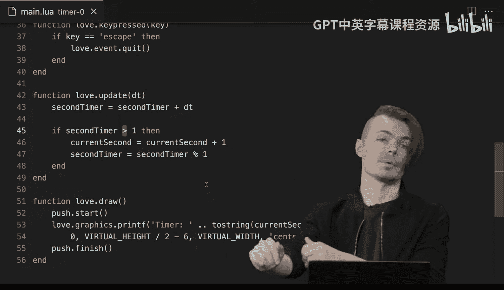

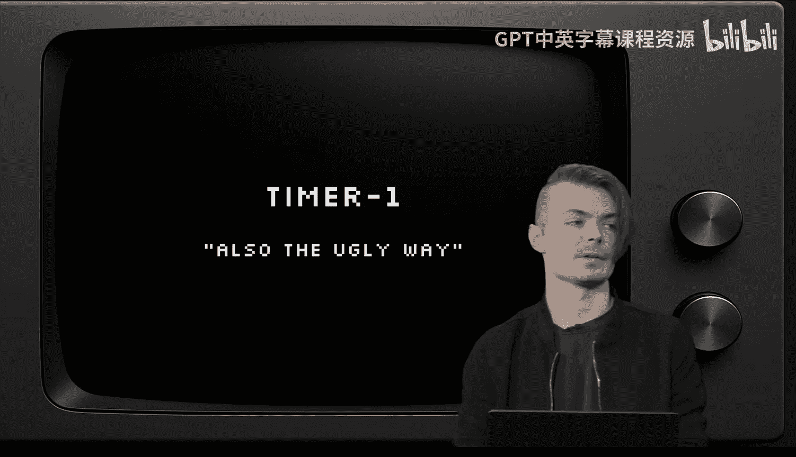

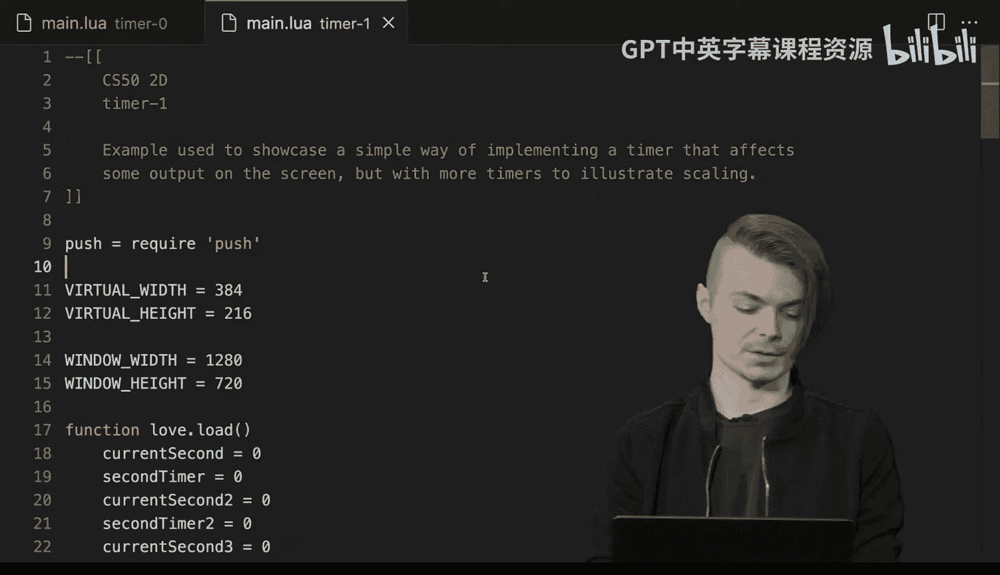

And I'm just going to run this。And we'll see。That okay， we've got different timers running now。

 we've got a timer running every second， every two， every four。

 every three and another every two seconds， and they're keeping in step fine， it's great。

 but let's look at how we actually implemented it。

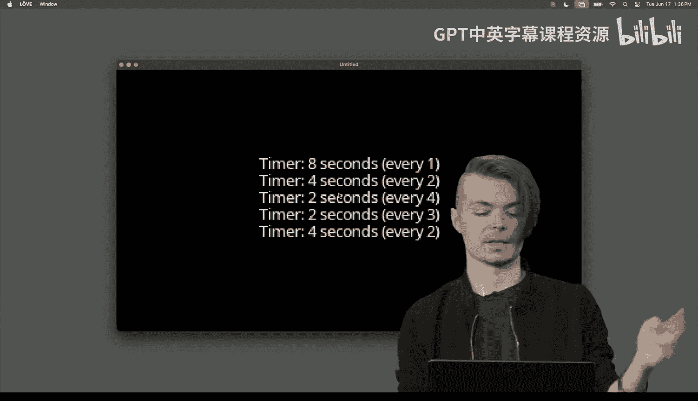

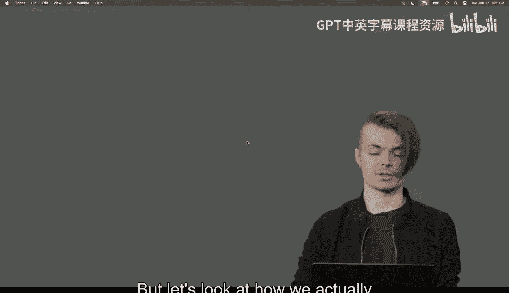

With our current approach， it's not the most elegant solution in the world。

There are of course ways to improve the way this is structured and organized and whatnot that's essentially the point of what we're going to start looking at here。

 but you can see that this approach， even mentally if we're just thinking about it。

 it can be a little bit cumbersome， we have all of these timers。

 we have all of these actual values that are getting adjusted and incremented and it's just not a pleasure to deal with。

 especially an update all of these have different times。

 different durations that they need to be kept track of DT needs to apply to all of them。

 it's just not it's not great， it's not a great approach， so。

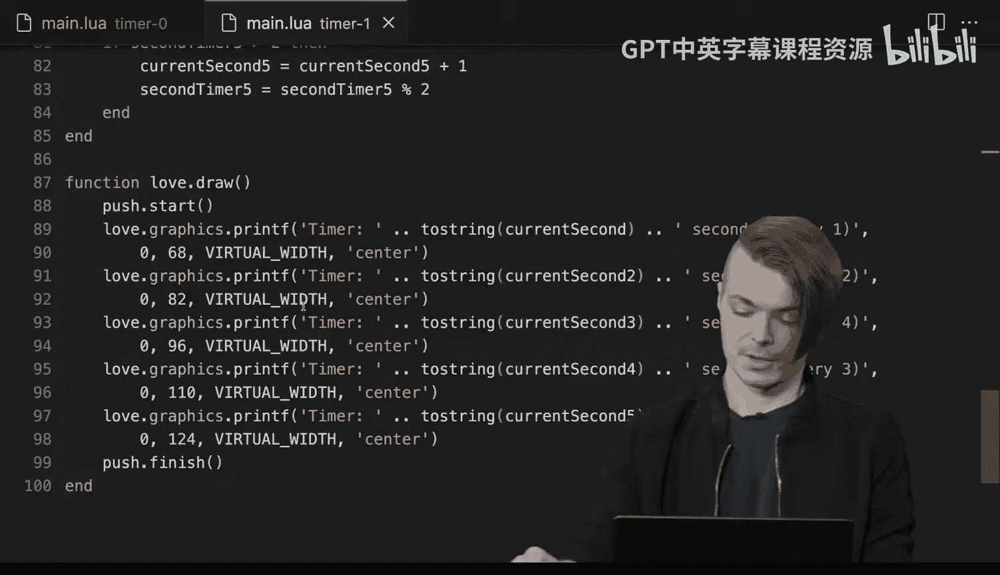

What we can do is we'll take a look at timer two， which is the clean way to do this。

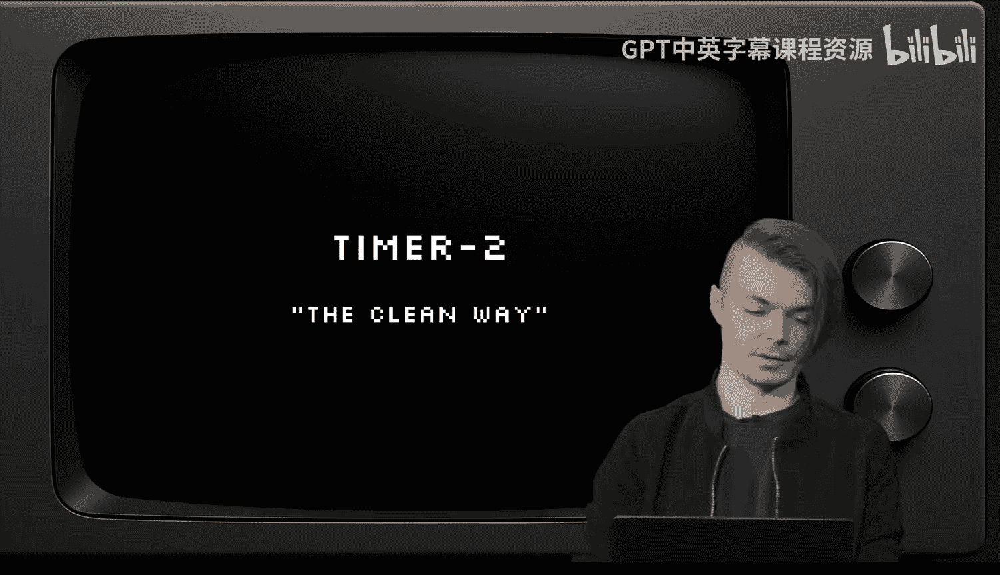

So I'm going to go ahead and clean way。

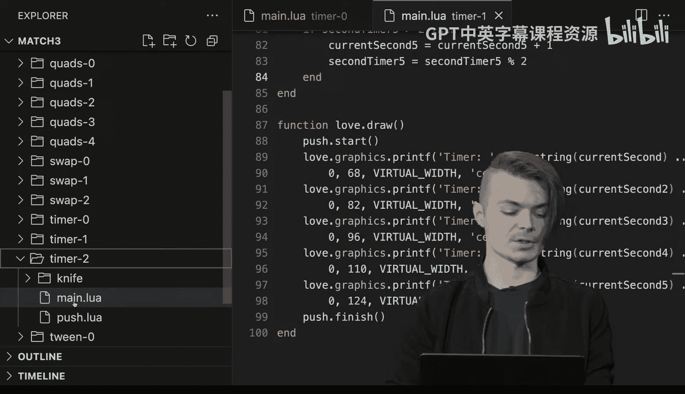

Always going to be subjective， but let's go ahead and open up timer two。But before we do that。

 actually， let's talk about how we're going to do it。So there's a library in this ecosystem。

 you could get something similar to this analogous to this in many different environments。

 in particular what we're going to be looking at is similar to a lot of what happens in the web world or the JavaScript world。

 but this library is called knifefe， but you could even make something like this yourself if you wanted to。

It's got a lot of really cool modules。 We'll be looking at only a couple today and throughout the course of the term。

 it's got a lot of various things that are really neat。

 but timer in particular at the bottom is going to be our biggest one today and also chainin will' be looking at chain a bit。

 These will recur throughout the rest of the term are。😊。

They are ubiquitously useful tools to use to make your games a lot more smooth and also just conceptualizing time and things moving over time in a way that's not as manual or procedural。

 I think that's really the bigger takeaway that I want to emphasize。

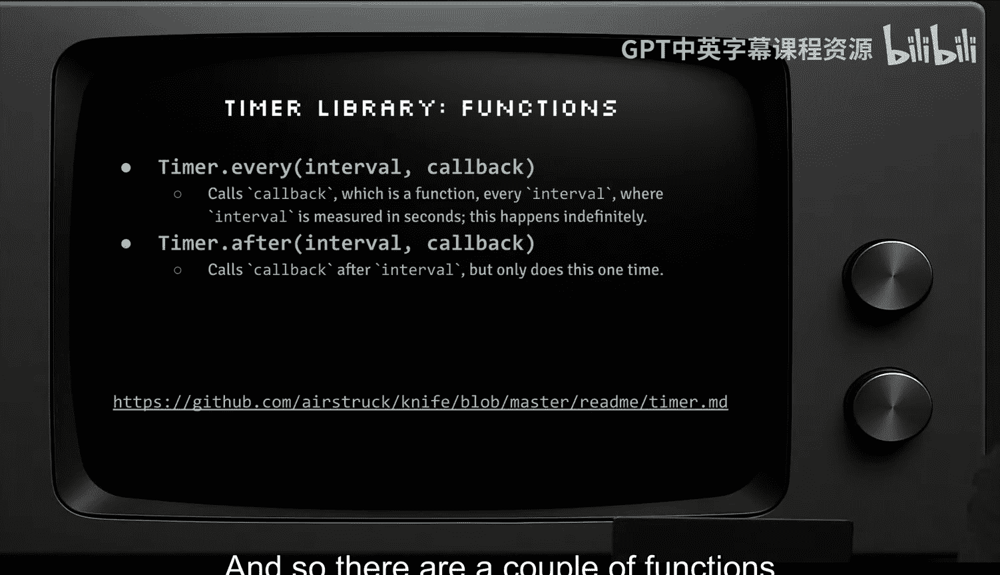

And so there are a couple of functions that we want to take a look at here。Timer。ever timer do after。

 and if we think about this， when we want to do something in our world。

 often when we think about transitions， for example。

 every one second I want to increment the counter or decrement the counter。

 we already saw that with the timer in the game。Or after one second I want this thing to move over here。

 I don't want it to do it every second， but maybe something moves into a position and then after one second I want it to then move to another position。

 we did see that in the transition state of the game which had the level text。

 it moved from the top to the middle， then from the middle to the bottom after about one second or so。

And these two alone allow us to do so many different things based on time。

 based on thinking in terms of time and not having to manage time in a sort of unintuitive sense。

 and so that's what this library in particular timer allows us to do as part of the knife library。

So let's go ahead and take a look at before we go to that next part。

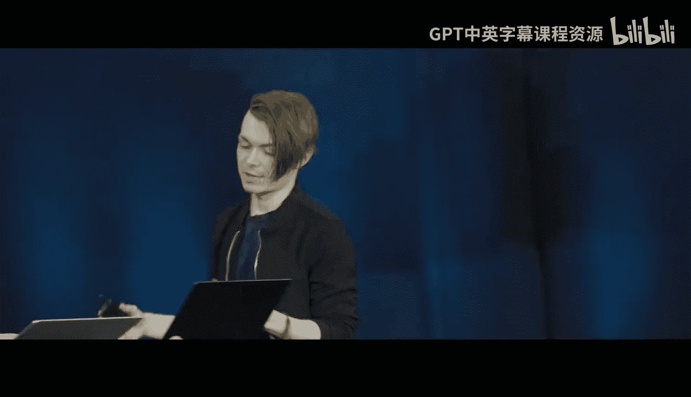

We're going to use this to clean up our code。 So we have manually managed timers up till now。

 I'm going to go ahead and transition。

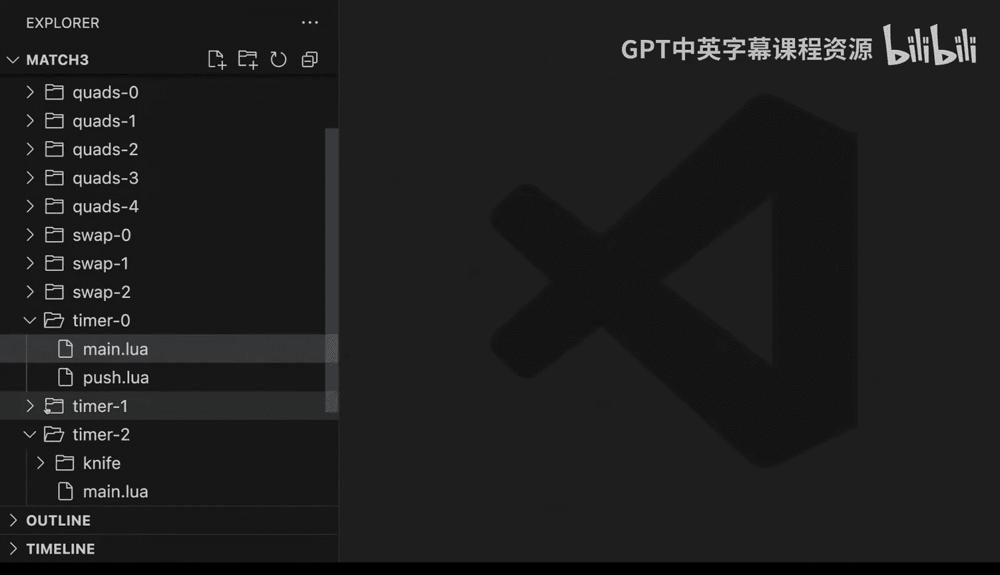

Over to timer two， and I'm going to run it first。And you'll see it largely looks the same。

 except we've added an eight second timer at the very bottom。

 we'll let it get to at least that point， but you can see they all operate in lockstep very cleanly。

 it's very similar to what we just saw。

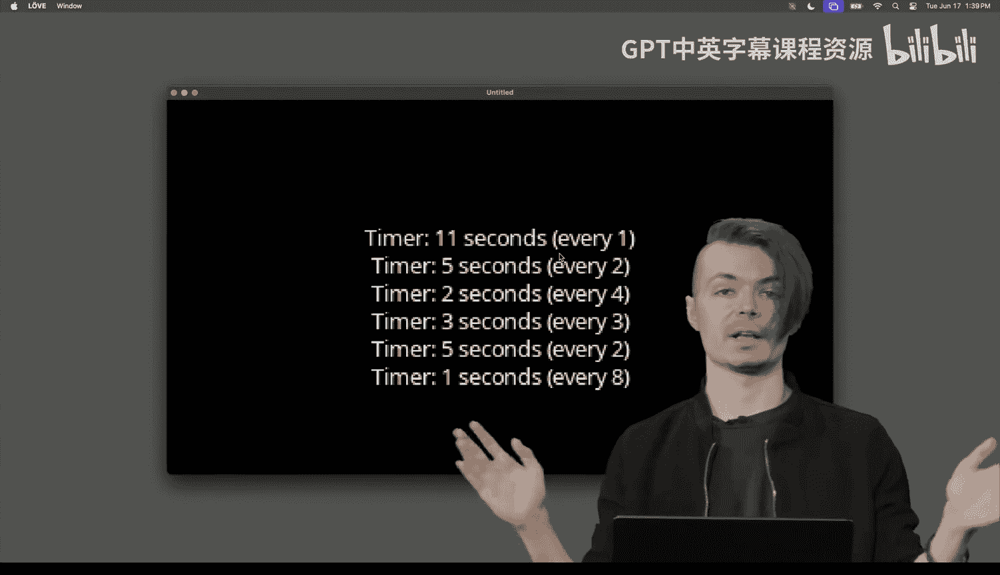

I'm going to go over back to timer two。And the key difference here is that。

Instead of doing all the things that we were doing previously。I can set a group of intervals。

I can then set a group of counters。And then I can just iterate over all of those and we recall we had every one second。

 every two seconds， every four seconds， and then we have the counters that should map to those。

 the actual incremented numbers to show how many of those blocks of time have elapsed。

Rather than keeping track of all of the deelta time and updating them and then having all of that chaos of code。

 we can just use timer dot every。And then just say， okay。

 in a loop over that list of intervals and say every whatever that interval is。

Notice I passing it an anonymous function。So it's basically saying。

 okay it's making a contract that says， okay after that thing happens or after that every increment of that period of time happening。

 I'm going to execute this block of code that you give me this is again the anonymous function idea we looked at with state machines here it allows us to give it behavior that should happen at a certain point in time。

 it literally is just taking this in as if it were data like anything else like a number or string and it keeps track of that。

 it holds a reference to it doesn't have to be declared anywhere。

 it doesn't have be named anything and once that interval has been passed。

Every time I should say it passes， it will perform this。

Block of code and we're aligning the interval with the counter here such that we then cleanly have everything getting updated in clean lockstep and the best part about this。

 if you remember how big our update function was， is all we have to do now is just update timer timer。

 update Dt and it will manage all of these variables behind the scenes for us in terms of the Dt and how much time is past and whether we need to call the thing and as story as the block of code and it's very powerful here we're just using an example of a very simple just incrementing some value。

 but we can put because it's an anonymous function。

 you can put whatever code you want in there and we'll see this used in multiple instances throughout this repo but as you can see。

 you we've gone down to 72 lines， if we were to open up timer1。

It I mean it's 100 lines and I'm sure you could clean this up in some way to not be as bulky。

But just in terms of thinking， it's a lot easier to think in terms of like every X second I want to do this thing or after X seconds。

 I want to do this thing than it is about thinking in terms of。

I have six timers that I want to update and think about if you have。

Not just timers and simple numbers， if you have positions of things moving around in space or properties of things that need to get changed or various whatever you can imagine happening and it gets very complicated very quickly。

 this allows us to solve that problem。So that's essentially what timers allow us to do Every X seconds or after X seconds we get to do stuff。

 I'll draw your attention again to where we can see this immediately。

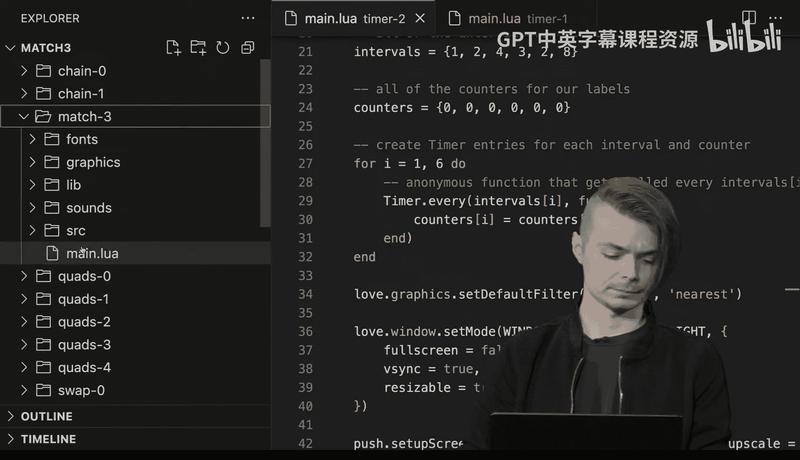

In our source code。Just as a reminder。Match 3， every 。075 seconds。

 approximately those letters are changing。You can see after one second。

 the level one stayed there in the middle of the screen。And also the timer is going down one second。

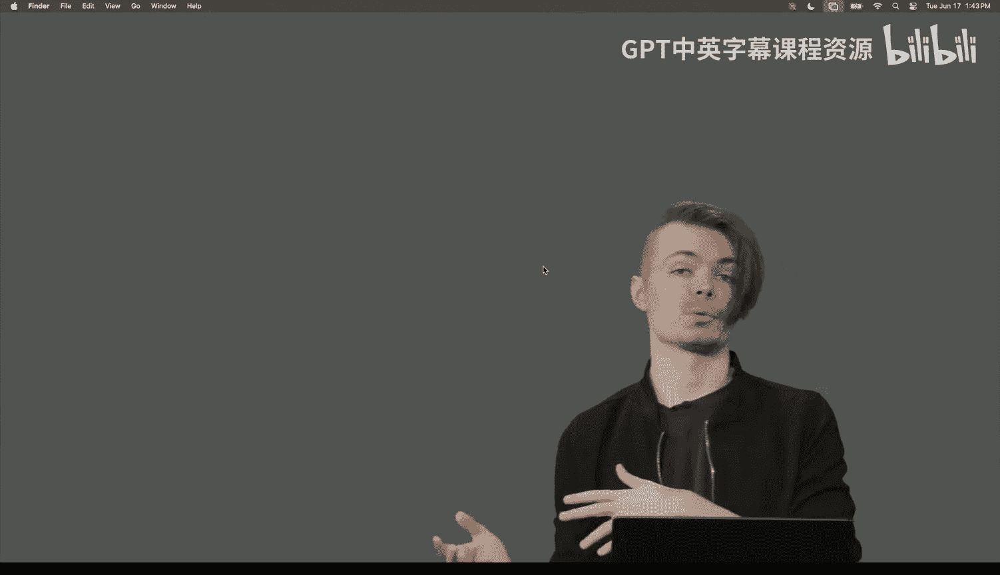

We don't have to have timers to manage these things anymore and this allows us to do a lot of really cool things。

 this allows us to go into not only more visually interesting domains but just smooth domains that feel more natural and organic and allow us to do things like for example。

 if you can imagine you're playing a game a strategy game or something and you want to move a unit between two squares know you don't want to do it just instantly discreterely sometimes you want it to move between the squares。

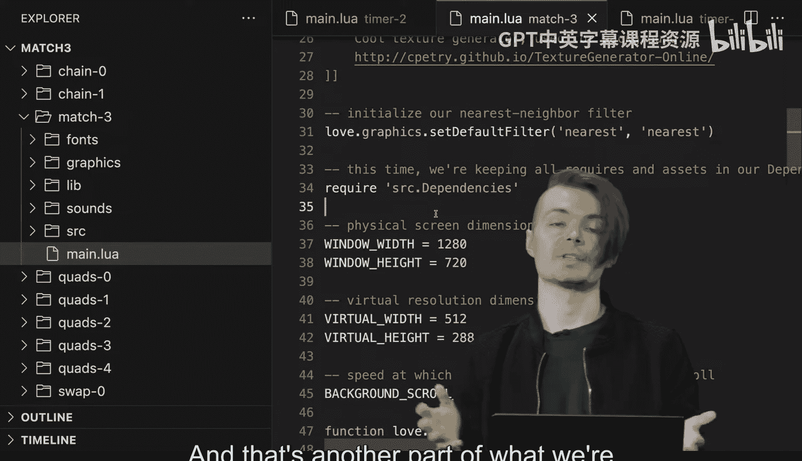

Things like that are very important。And that's another part of what we're going to be talking about today。

 which is also tweing， which is the next step。So I'm going to go ahead and transition here。

So speaking of tweing。So that's sort of like the first step in terms of like time based thinking is。

After a certain period of time every。Amount of time let this thing happen， do this thing。

 don't make me think about the details about managing the time and modulating back to zero and doing all this stuff。

 just let me say after every x do Y but okay that's fine what if we want to。

Move something smoothly between two positions or to do something between two values in a way that is continuous and not just instant。

So I'm going to bring up match three again just to illustrate this。

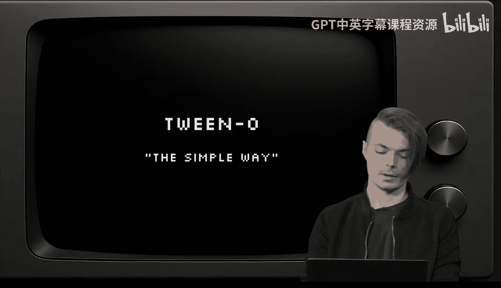

So in particular， notice that when I hit start， the transition from this state to the next。

And also that operation there。So that level operation was a combination of ultimately the timer dot after and then the tweing operation。

 which we're about to talk about。

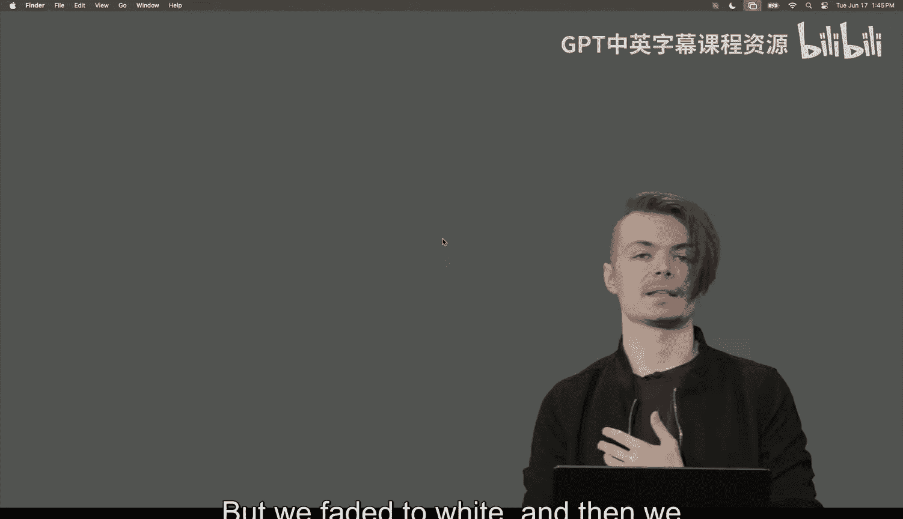

We faded to white and then we faded out from white into the next state。

 we had this sort of smooth transition between the two and previously in all of the lectures we just instantly switched。

 but now we have the ability or I posit that we will have the ability to do something a little bit more elegant。

In this way。And I'll illustrate that later concretely in the code base， but for right now。

 let's actually understand how Tweing works。I'm going to go ahead。And open up。Tween 0。

Between just being like between。Two values。

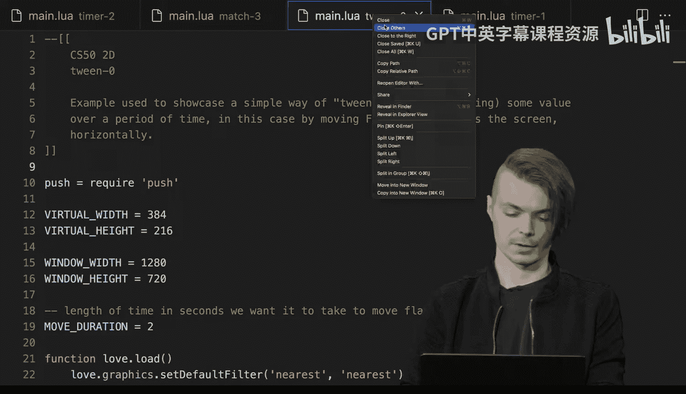

Let's go ahead， I'm going to close the others here。Let's just run this。

And youll see that we have sort of the flappy bird graphic from previously。Moving from left to right。

 Now if we were to think about， okay， how do we。Move something with over the space of two seconds from one area to the next。

I mean， sort of previously we did that in a way with the pipes。

 although we didn't explicitly know that they should move between right to left over a certain period of time。

 they just had a velocity。Well every two seconds we spawn a pipe and then we approximated somewhere in there that over a certain period of seconds。

 that'll be how many pipes move from right to left but here。Up till now。

 we've essentially just been letting things move around through physics or let the bird let gravity apply。

you know， positive y velocity to the bird here we're actually deciding， okay。

 I want this bird to move from the left of the screen to the right of the screen over two seconds concretely。

 we don't really have a way to solve that yet。

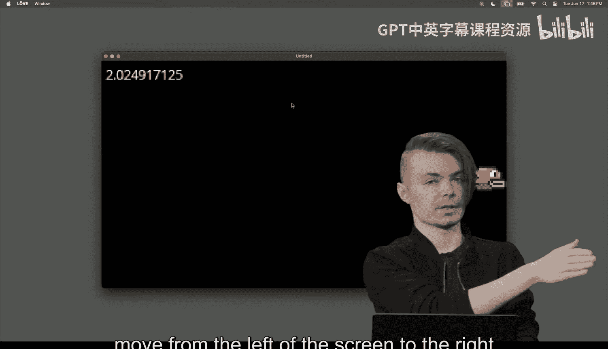

So I posit there's a way to do it。Sort of naively and crudely。We could essentially say， okay。

 the bird's exposition is going to start at zero and we know that we want its exposition to end at essentially virtual width minus its width。

 because then thatll count for its width。Touching just against the wall。And then we can say， okay。

 I'm going to maybe multiply。Some that that end value。

 I want to eventually that I want it's x value to eventually be that value。

 So I can essentially just multiply some value by one， or I can try to get。

Some coefficient to be the value1 against that value and set its x to that。So I can essentially say。

 okay， if it's going to be two seconds， we need to add up two seconds worth of deelta time。

And then if once becomes that ratio becomes 1， deelta time over 2 becomes 1。

Multiplied by that end destination， we will have reached that point and assuming that we're interpolating it。

 we're doing it every frame， we're adding that every frame， we'll see it move from left to right。

So I'm going to go ahead down here， we see。We said it。

At just zero to start with the why is irrelevant for this example， we have a timer。

 we're doing this manually here， we're not tweeting ourselves。

And we'll say that there's a move duration， we've defined this to be two up here。Two seconds。

So again， another manual operation and then we're going to set the X of the bird that we're going to draw to the lower of。

 and this is going to clamp it so it can't get any farther than the right side of the screen。

And X being that destination that we talked about times。Timer overmove duration， meaning that timer。

 we want that to be two seconds。 we want it to move over two seconds。 This is going to start at zero。

And effectively gradually move towards one as this approaches two。2 seconds worth of time。

 at which point this will essentially be multiplying by one， and we will have arrived at end X。

 So this is a very crude sort of linear interpolation， assuming that we started0 here。

 which willll see a more robust version of that coming forth， which is fine。 This works。

 This works when you assume that you start from 0， which isn't。😊。

Going to apply to the majority of cases probably， but gives us a starting point。

And allows us to do interpolation over a set period of time。

 we know that we can set this to whatever we want to。

 we can set move duration to four seconds if we want。

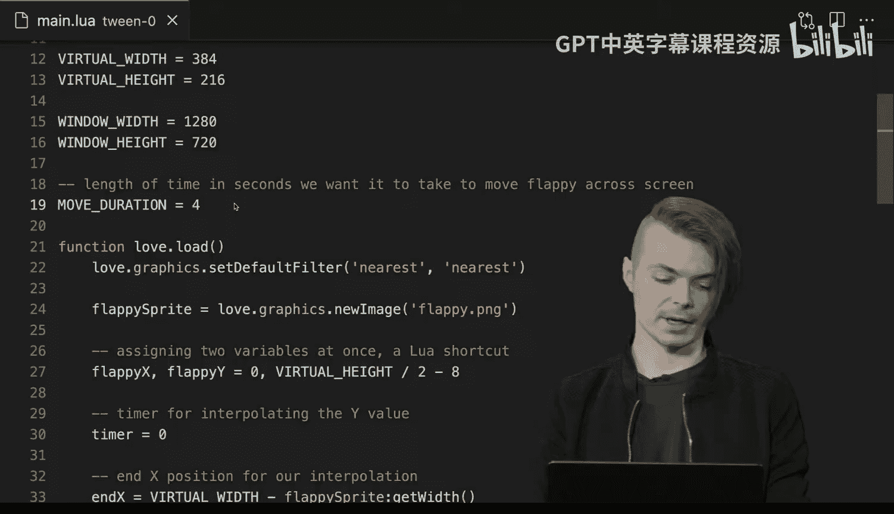

And run it。And it's going to take four seconds instead of two seconds。

And that number at the very top is just showing a little bit of overlap when deelta times is going to slightly go over four between frames and that's fine。

 that's expected。

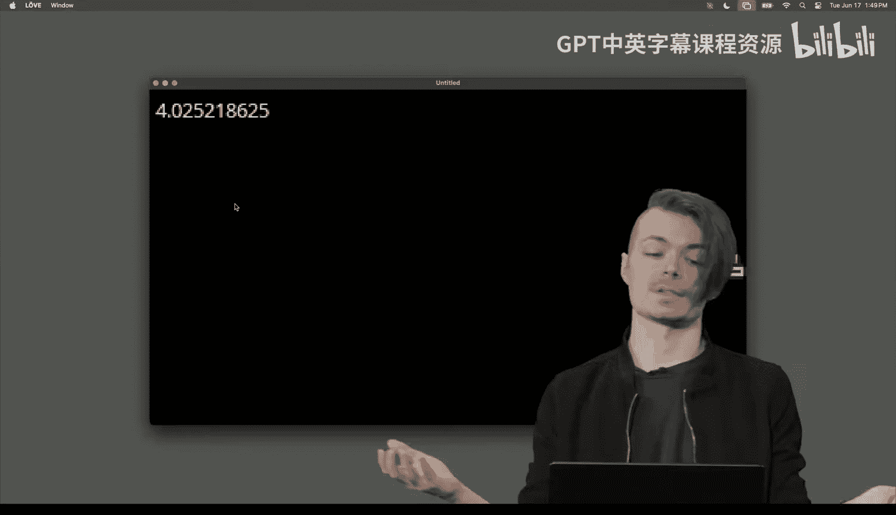

But you can see it works， but it is a little bit heavy handed still we're dealing with timers。

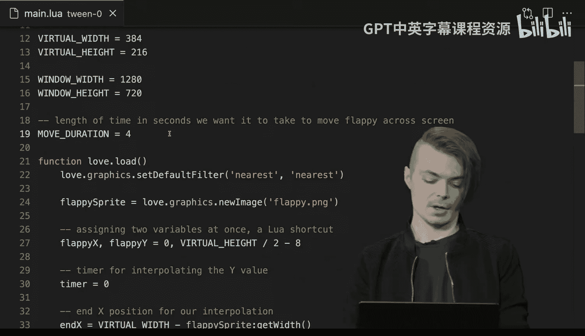

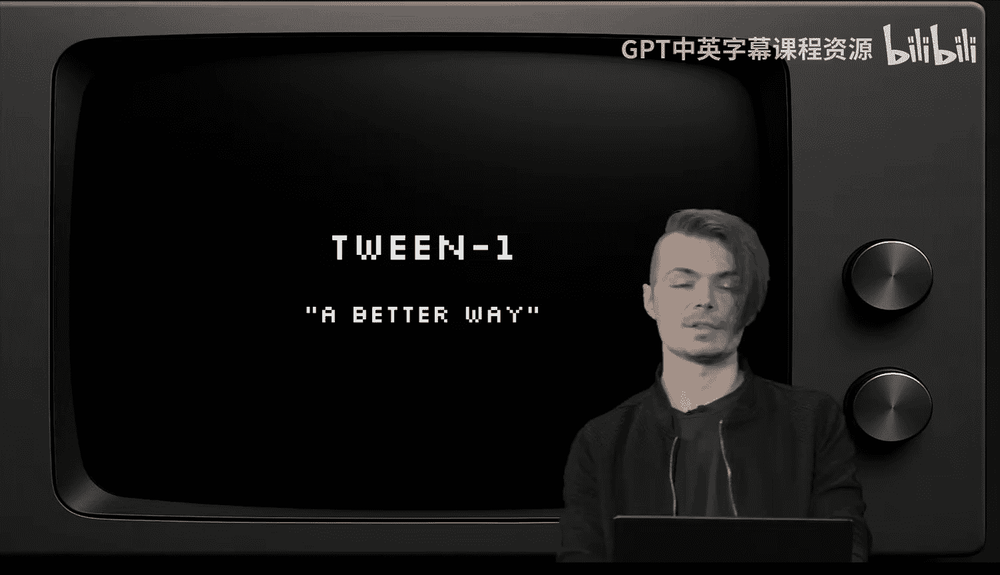

So。We clearly have some iteration， we have some refinement we can do， let's improve it a little bit。

I'm going to go over to Tween1。And。

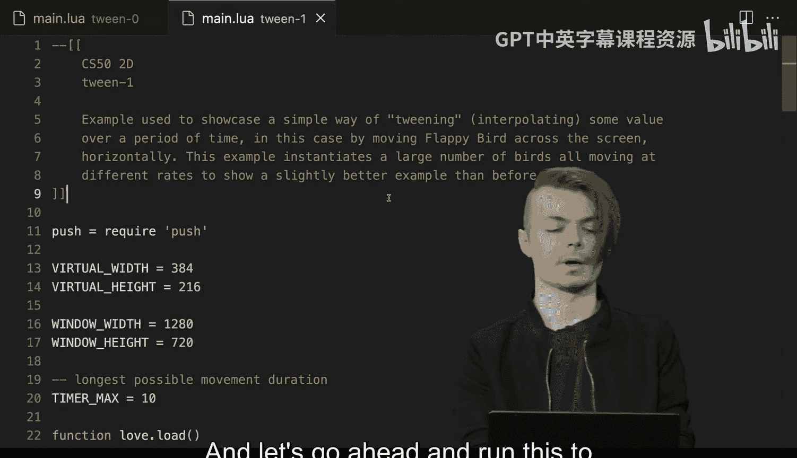

Let just go ahead and run this to start with so we see what's going on。

You can see we've got a lot more birds。And they're sort of all moving at different rates。

Which is good。We've got in this 10 seconds capped， I'm running at this at 24 frames per second。

But we have essentially now 100， I think， or so birds that are all spawning。

 they're all just tables with a rate that they're preserving and some change over time。

 which is cool， it's fine， it's great， it showcases that we have some way to scale this at least。

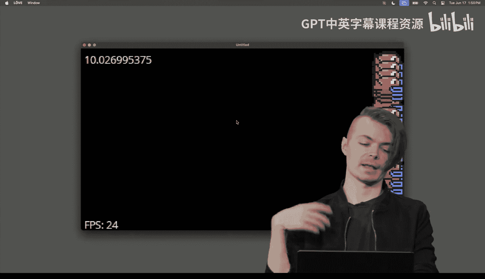

I'm going to go ahead and show here we're inserting into birds， one over 100 at the start of Maine。

We we start them all at zero on the x， we start them at just some random y value so we can actually see them all sort of moving with each other。

 and then we set a rate for them as well， so this rate will allow them to all independently move and we're going to set that to be some sort of random value between1 and the max。

 some sort of value between point something and the end of。

Whatever the 10 second value is it'll be between 10 seconds and。

Zero point itll have some surf fractional amount in there。

We have to do this mathOt random will give you between zero and one floating point。

 and the reason we're doing this is because if you set it just to be mathOt random，As an integer。

 it will only give you integerial numbers and so this allows us to have a fractional value between 0 and whatever that end value is。

Fractionally as well， so it'll add point， whatever it could be 0。5。

221 through9 so that we end up getting between 0 and 9。99999。Or actually。

 technically it's from zero to one so we could get 10。

Now this is fine and then ultimately we have a timer like some sort of global timer。

And then we're going to in our update。We're still doing things manually here。

 we have this timer that's updating， and then we're going to take the timer。

 which is acting as the sort of like global clock for all of our objects。

And we're going to do the same interpolation that we did last time。

 except now we're using the bird's internally stored rate to determine whether that ratio has reached one。

And。It's fine， it works， but there are issues with it like we have this global timer that now is being checked against everything。

 if we have new things that start，After the timer has already started。

 there's going to be difficulty coordinating that。 it's not going to scale very well。

 we're still manually thinking about things in terms of timers so there's a better way I posit than any of these approaches which is the timer do tween way and so timer dot tween is cool it's essentially the same kind of function as timer dot every timer dot after in this case it's going to take some duration and then a definition and this definition is going to be okay I have some period of time that I want some operation to occur。

 some interpolation to occur what do I want to interpolate and what's cool is as we'll see in a second love or Lua allows you to define table keys using tables so we can say okay I want this object to interpolate its certain fields over this certain period of time and this not only gives us a nice sort of syntax for describing this operation but flexibility we were just doing position there and it had an interpolation sort of expression there which was just based on the x value。

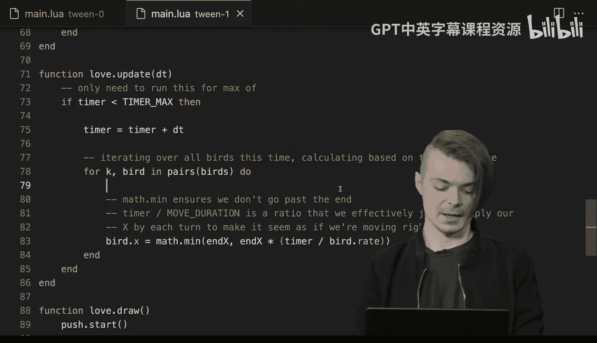

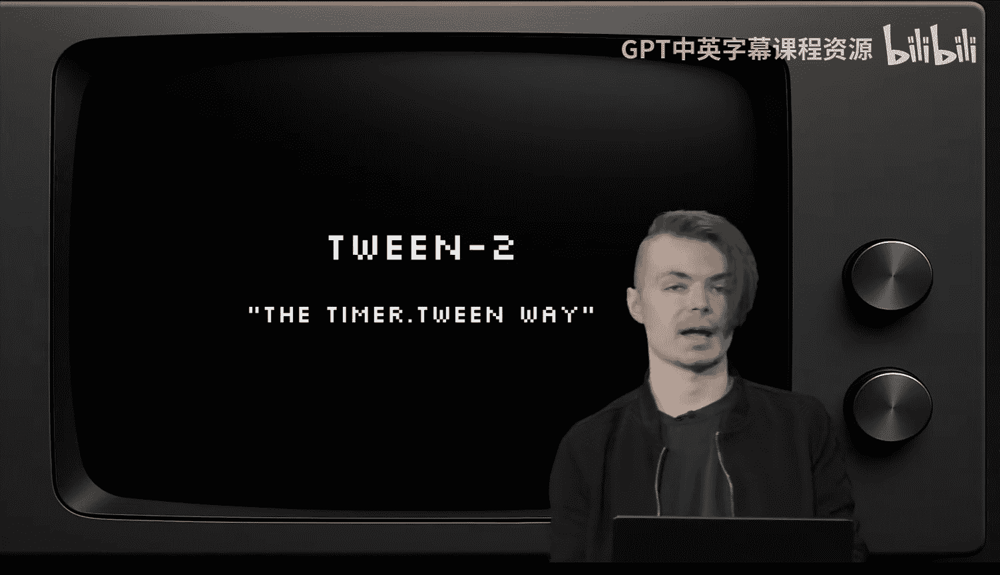

But what if we wanted to do other things， other fields。

 we'll see how that works in just a second here。But this essentially is going to be the way that we accomplish exactly what I'm talking about without having to worry in terms of this global timer and this clumsy sort of way of thinking about time manually。

 which we want to get out of the habit of doing， so I'm going to go ahead。

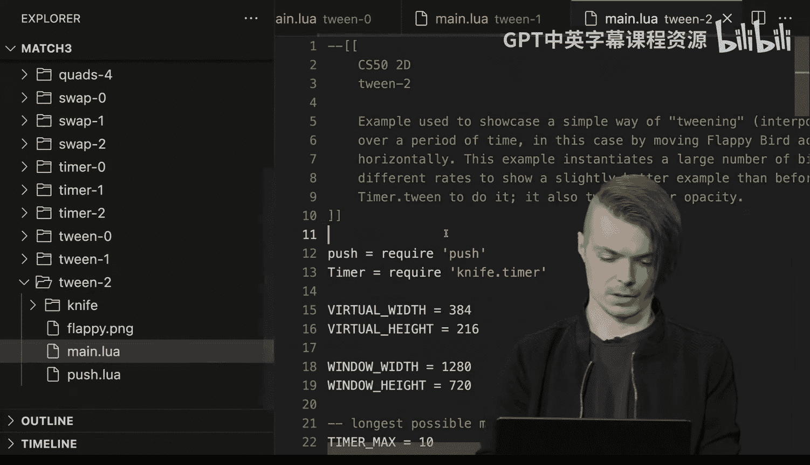

And go to timer betweenen two rather。Let's run this， see what it looks like。

You'll see we have a lot of birds。That looks like more than 100 birds。

And not only are they all moving from right to left as they were previously。

 but they also are interpolating in another attribute within their table definition， their object。

 if you want to think of it that way， and that is their opacity they or they started off transparent and gradually as they moved from right to left or left to right。

 they became fully opaque。

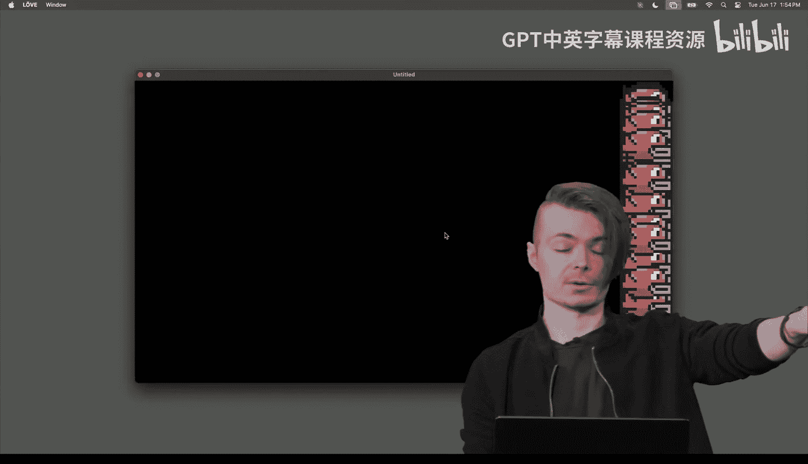

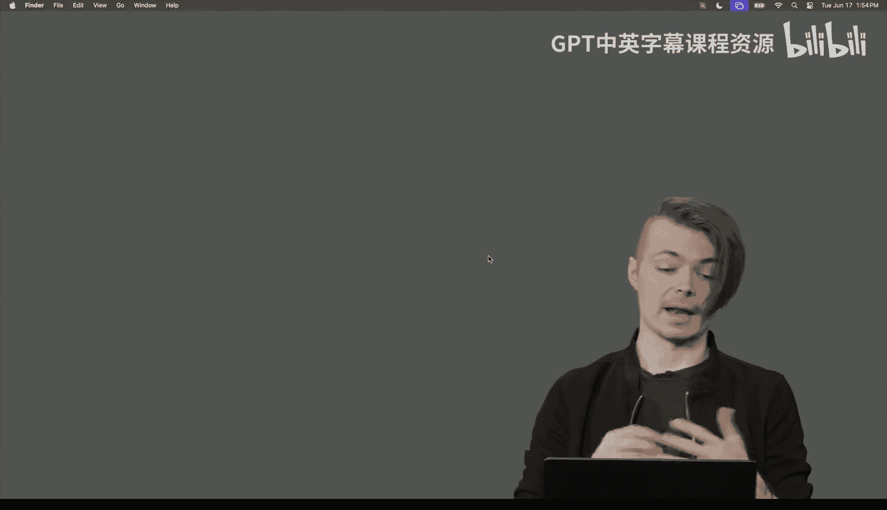

So and as we'll see here， I'm going to go ahead and open up this code。We're using knife dot timer。

Which also if I hadn't alluded to that previously， this will be in all the reoss， all the examples。

 we're just importing it as an object， it's just a library just like pushes。

 just like classes that we've used so far。And this will be in every example。

We're going to go ahead and see all of the we do 100 birds a s of birds。

 but we're also setting the rate just like we did last time they each have a rate still。

 we want them all to move at their own speed and keep track of it。

 also in opacity that starts at zero。And here is the function in question that's important。

 which is timer do tween， so for every bird that we are defining in this sort of list of this table of birds。

 and we're just using a very simple， not even using class。

 we're just using a table to sort of represent a simple class， simple object。Inline。

We're going to go ahead and call over each bird's rate， so we're iterating over every bird， all 1。

000 birds， we're setting it using its rate， we're going to define a tween。

 we're going to set timer to tween that value。Which is essentially saying here。

 manage this operation for us。Again， this is all happening in load， so this is only happening once。

 this is happening up front， we don't have to then worry about it too much。

And then notice again we're passing the bird in as a key， it's going to take a table here。

 that's what this is， so the bird Lu allows you to use tables as keys。

 so this is one of the benefits of it is you can define with your library sort of this cool these sort of DSLs of a sort to sort of express ideas but here we're saying I want to take the bird and interpolate its x to end X and its opacity to 255 so whatever it is at this moment in time it's going to perform an interpolation on that for us and we can pass in any number of fields we want to give assuming that we assign there assuming that that field exists within the bird and it's going to have some sort of end the lefthand side rather exists already and this end value is an expression that you is interable or is derivable for right now。

What this ends up being is that now okay every bird is going to be a reference to it is going exist as a key timer。

 tween is going to do the equivalent of that interpolation。

 but we are not going to have to manage it ourselves anymore now it's just literally timer。

 update DT it's that simple and now we have scalability for any number of fields that we care about just run it again just because it's fun to look at but not only do we get X but we also get opacity for free and any other attribute and this is very important for any of the future lectures including today's lecture。

 this tweing we saw multiple instances of it， let me remind people of that。

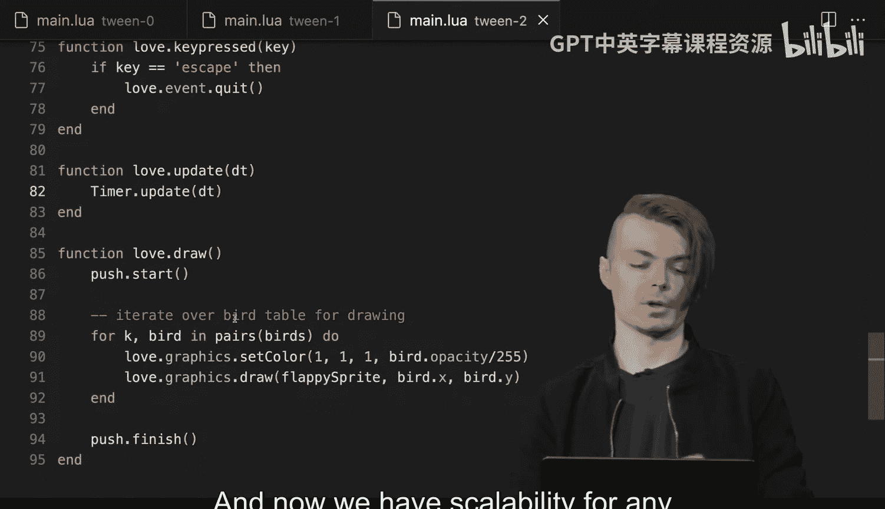

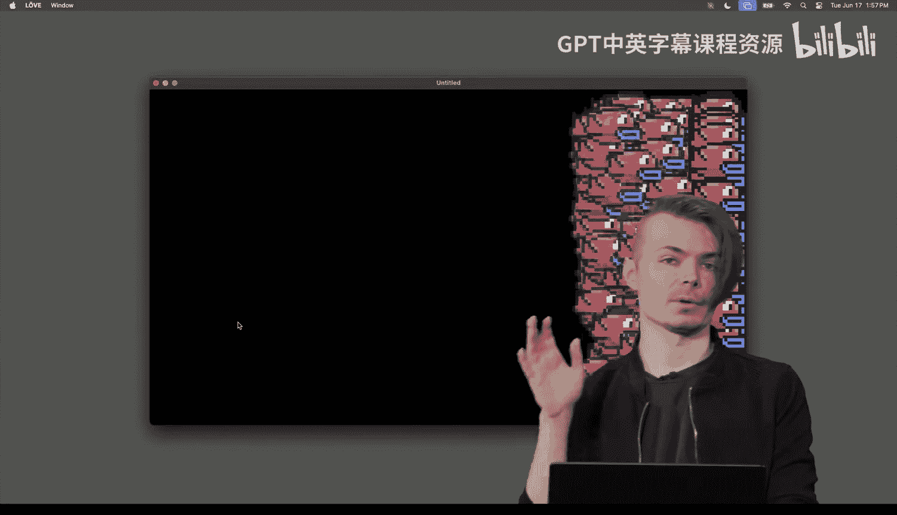

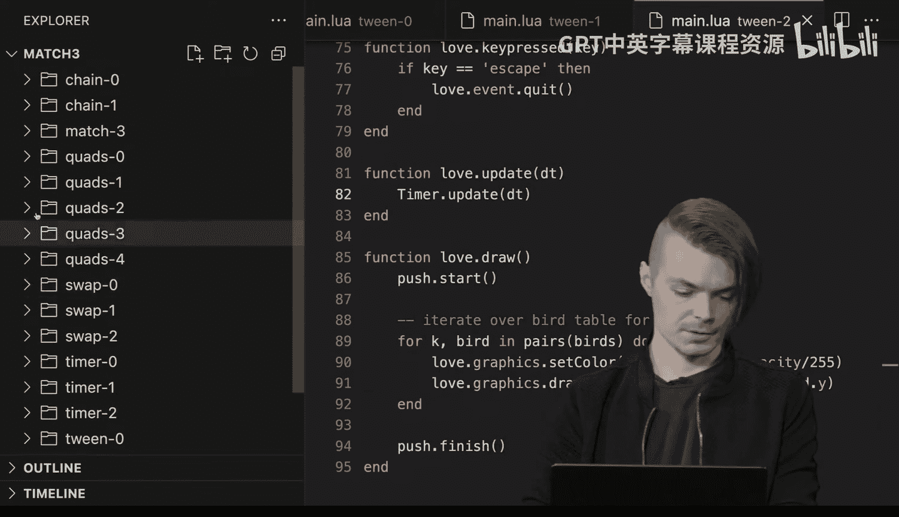

If we look at。

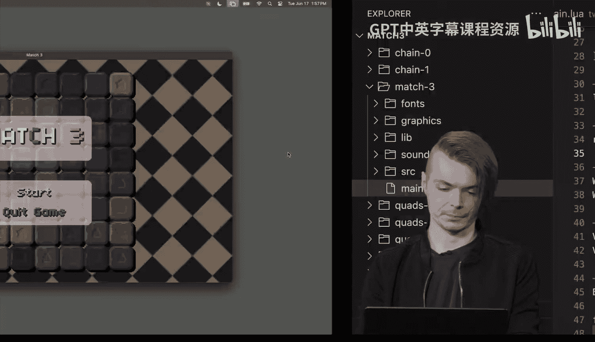

Match  three， let me just run it。我' see。That opacity of that full white too transparent of that rectangle is a tween operation。

 so is the position of the top to the middle， to the bottom。

And then if we move any two tiles together。That's a tween happens very quickly。

 but those two tiles are tweed to be opposite in this case in the Y axis。

 you can do the same thing between DC C right here。And then if I solve a match。All of those tiles。

 every single one of those tiles that came from the top had its y value tweed to be where it needs to be now in the grid。

So those are a lot of the main features， a lot of the main ideas that we need to use to expand our repertoire。

 so to speak。The last big piece that timer gives us or knife the library gives us is this idea of chaining and chaining is cool because it allows us to essentially think of operations in sequence throughout time which right now it's kind of difficult so if I want to think about okay well the birds yeah they all move in one direction the birds will move from right to left or left to right。

 and then they op pass changes but what if we want some character on the battlefield or whatnot to move around in a series of steps and to have that be smooth or we want some thing to move around on the screen at different positions almost like I guess I'm envisioning the old screen savers that would do something like that。

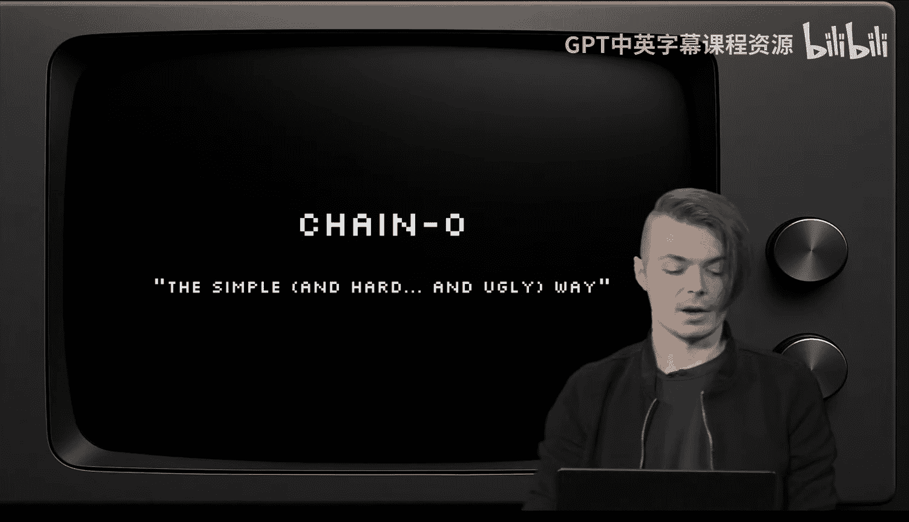

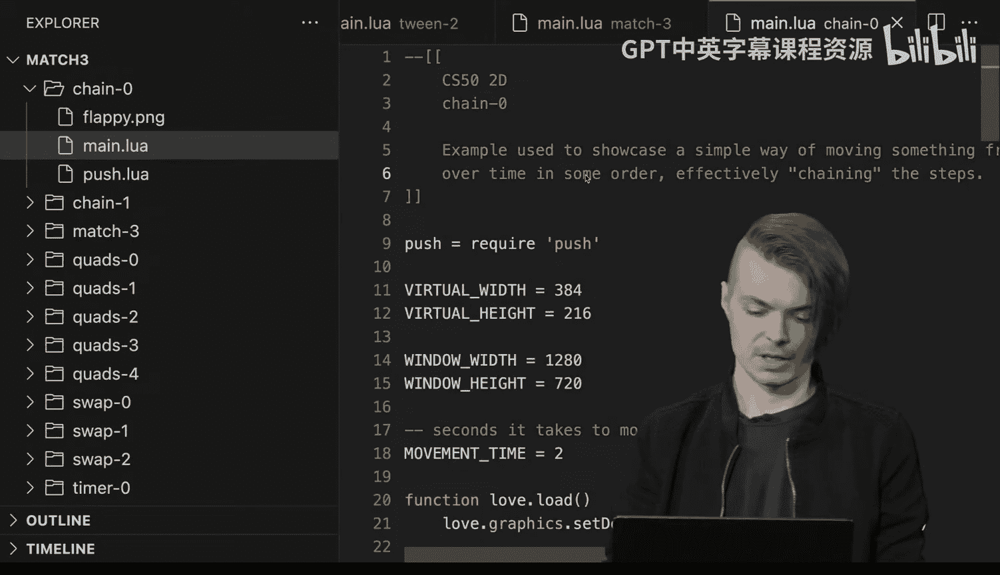

Well， let's go ahead and run chain zero。I'm going to go ahead and show what this looks like。

So we have an implementation of this idea。We can see that the bird is moving starts from right to left to right。

 and then it moves from top to bottom， then it moves from bottom right to the left and then it moves from the bottom left to the top left back in its original position。

 Now we could do an approach of that that is sort of naive in a similar sense that we've done so far。

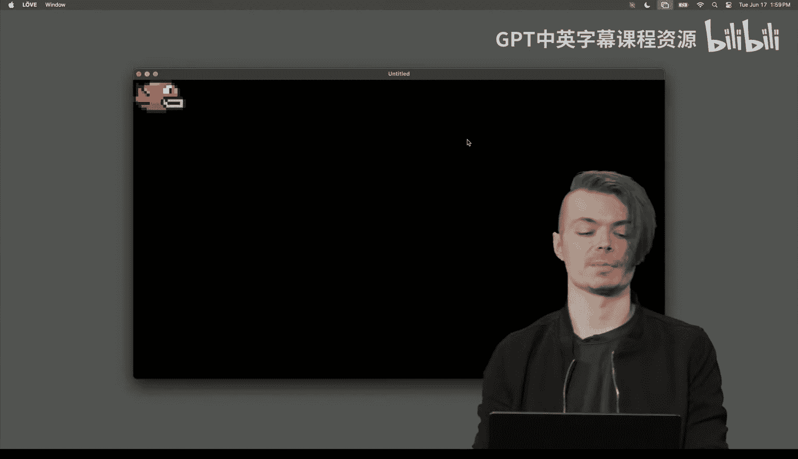

In that we could say， okay， I have this set of destinations。

 I know that the birds is going need to move left， you know it's going to need to move here to this X and y。

 it's going to need to move to this X and y， then to this X and Y then to this X and Y。

 each destination should probably be marked as being reached or not because we're going to iterate through them in sequence and ultimately determine okay。

 I need to interpolate its position between these two values， right？

So if we come down here to update， we're not using timer at all here。

 this is just our own inhouse implementation of this idea。

But we can iterate over all of the pairs in that destination that we looked at and say， okay。

If it wasn't reached， we'll just set our x and Y to be the interpolated sort of next value of whatever the destination is relative to our base and so so far thus far we've only been interpolating from0 to 255 effectively with timer tween we could set the start point and endpoint however where we want to it's fine in this particular example this is also to illustrate a more robust way to define the interpolation algorithm which is that your x should be some sort of constant value that you start from that you then interpolate towards your destination value from we've been starting it at zero implicitly。

 you can start this at one， you can start this whatever you want as long as it's different from your ending value the interpolation math will work out such that if you were to subtract the destination value from your actual base value and then multiply the timer over movement in order to eventually make that coefficient B1 by adding that difference to wherever you are right now or wherever you were at the base of when the interpolation was figured out you will eventually。

Rive there once x seconds have passed by。 So this is essentially kind of a way we were implementing the time manual timer approach previously when we were looking at tweing。

But you can see here once it reaches movement time， cool， we'll market as reached， cool。

 we went through destination1 cool we reached that okay， destination 2 is not reached。

 okay we'll move down there now， okay cool， setting our base X and y to be whatever that last destination was。

 which is why we do right here because the interpolation assumes a base。

 it assumes this x and Y here， any value that you interpolate needs a base in order for the math to work out such that you go from the one position to the other over that span of time。

 you essentially create that line segment between the two destinations。

So we have to set our base and base X and base Y to our destination。

 and then reset our timer and then we can rerinse and repeat this idea over and over again。

 but what kind of isn't great about this approach is that it's quite cumbersome。

 it's not very scalable again， we're thinking in terms of，You know。

 the actual interpolation we're we're not thinking in terms of like。

 okay the bird is going to move here and then after that it's going to move here。

 then after that it's going move there， then after that it's going to move there in this sort of linear way of thinking about time。

 The destinations are described linearly in the sense that they are structured linearly but the way that it's implemented and described and shown。

 I would say isn't quite the mental model that I like to think about this kind of stuff and I think most people prefer to think about this kind of stuff。

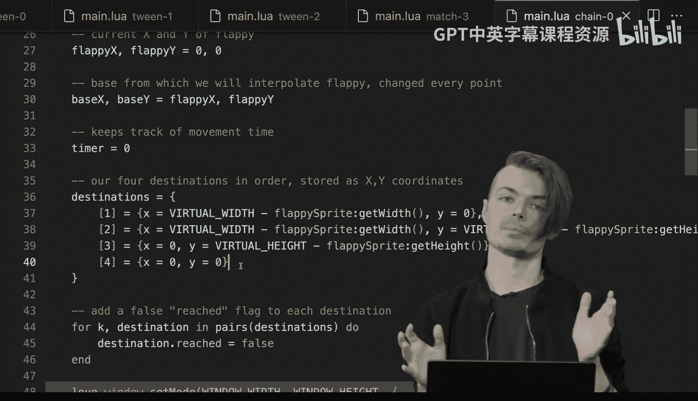

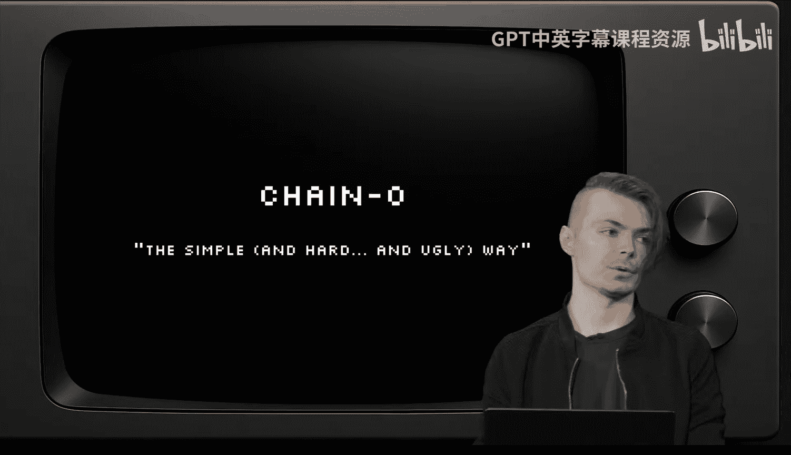

So if instead。We were to go to chain one， which is the better way to do this。In my opinion。

Usingnives。Chain functionality。Which is essentially。This finish function here。So。

Timer calls it chain， that's just the object that they define these callback as these finished functions that result off of these tween operations。

 you can apply to any function that you want to。

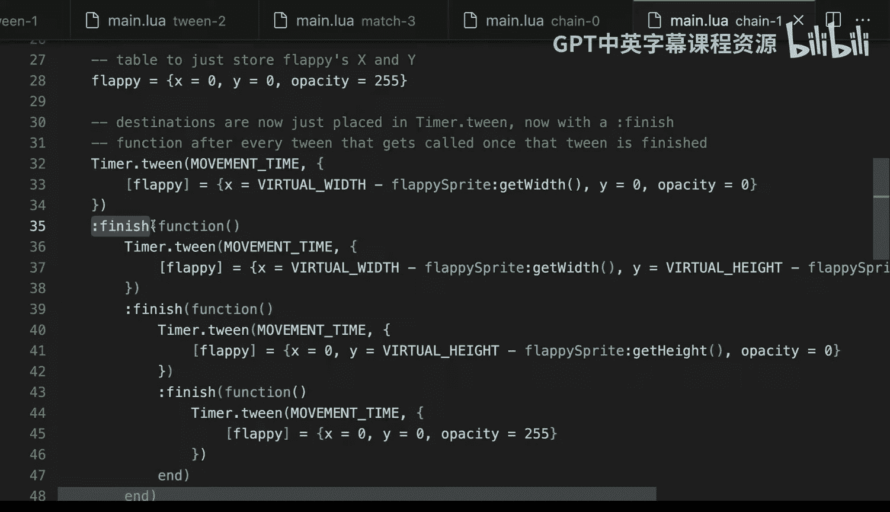

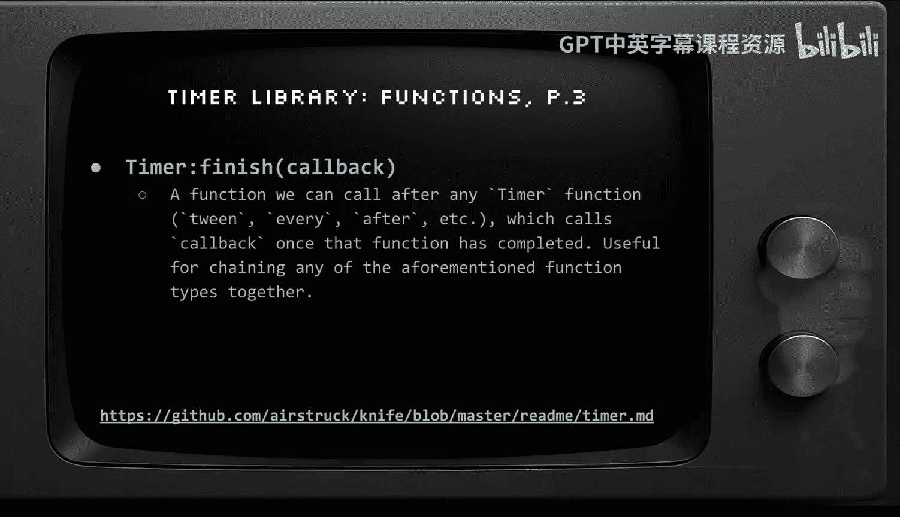

It can apply to an every， I think it might even did I have a slide about it I did so timer finish。

 which is their idea of chaining things together so we can call this after any timer function as shown here。

 whether it's after a tween after in every this is the idea of once one thing happens。

 we should transition to doing this other thing right after that and we can describe it therefore in linear time or rather we can describe it in linear code and not have to think about it in this sort of disjointed way of thinking about interpolations and managing time。

 doing all these things that are rather cumbersome and rather sort of separate from the problem at hand。

 and so with this we'll be able to begin looking at our idea of moving the bird through space in a quite straightforward way if we transition back to here。

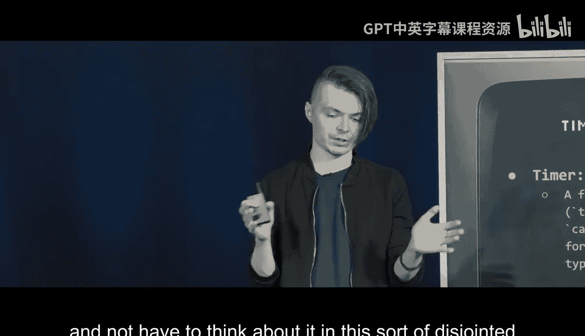

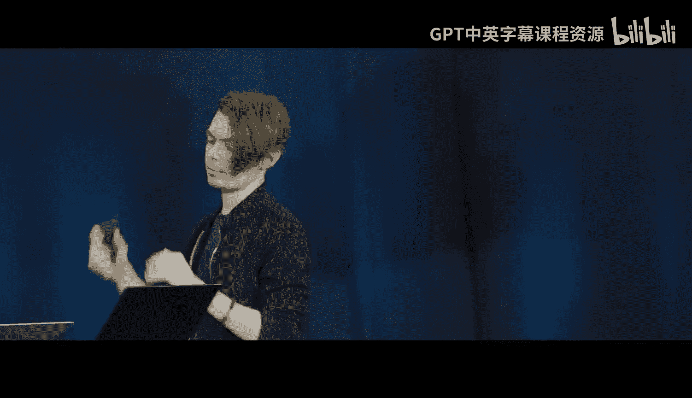

We'll see we have our。Initial birds。Fields here， just a very simple object of X Y opacity。

 we're setting the opacity at 255 to start with。And then now what we're doing。

 you'll see that there's this odd sort of like nested callback kind of code here。

 which this is a common pattern， especially in web， especially in historical web code。

 this idea of a promise of this thing that is going to happen after some period of time happens。

You're promised to get this value back for or for this callback function to call to do something for you。

 And that's essentially what this is only that's just called with different words here in the web you might see dot then here we're going to see colon finish。

 So after this thing is finished this timed operation is finished this movement time has the flappy bird moving to virtual width minus its。

It's width， so the bird's width itself， so moving all the way to the right side of the screen。

We're also doing changing the opacity， this is the same syntax this is the tween function which we looked at once it's finished it's going to call this anonymous function which is going to itself have a timer do tween within it which we can then over the same movement time pass in the same flappy with different values x equal to virtual width minus flappy sprite dot get width so it's going to still be at the right side but then we're going to move down to the bottom of the screen we're going to say y gets virtual height minus its height and then we're going to in this case we said that sacity is  zero for the first movement。

 we're going to say it back to 255 when it moves down and then we're going to repeat that exact same operation essentially the rest of the way to get the exact same code that we saw previously only again all we have in our update is just this timer update I'll run this。

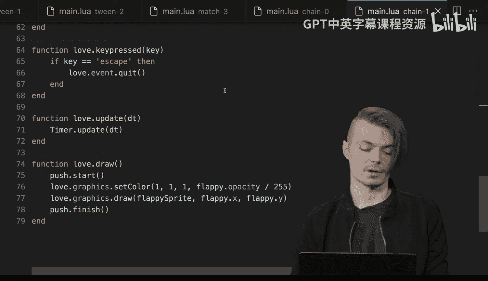

You can see。Not only are we interpolating over time， this set of individual steps are bird moving。

 but it's also sort of phasing in and out of existence， kind of like a ghost and Mariio or something。

 which is cool， because now we can just think in terms of the actual linear nature of what we're trying to conceptualize over time。

 I don't want to have to worry about managing timers and doing all this sort of manual work of thinking and creating a data structure to represent these movements。

 let me just call these blocks of code and sequence and you can if up to your choice to your taste。

 you could choose to maybe not have them all be。

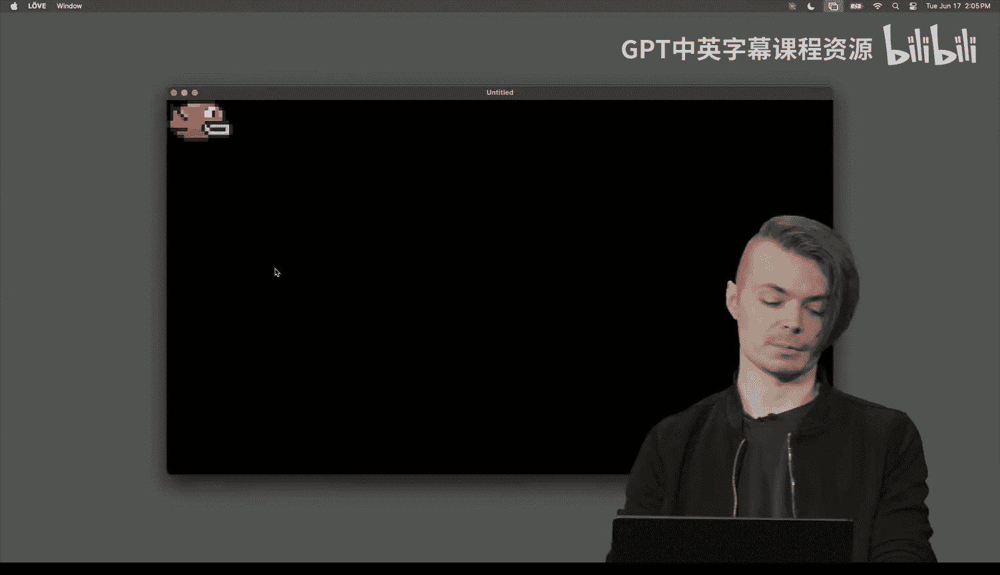

At this level of indentation， you could move them back and then just kind of have it like this ultimately。

And then sort of do the same thing here if you prefer and then you're sort of really looking at it in terms of just very linearly and not thinking in terms of the callback actually happening。

 but timer is going to essentially just store this function and then just finish is going to call once its time operation finishes for each of these and just trigger that callback function and you can call another timer dot T or timer dot whatever you want just like you could increment the counters that we looked at previously when we did timer dot every in timer dot after kind of a similar idea and so with this idea now we can represent essentially almost anything over time。

On finish for any particular thing we can just say， hey， move this thing here， move this thing here。

 perform this calculation， after I swap two tiles， calculate was there a match and then after the tween is finished and then perform the actual moving of the tiles and then after that set the cursor to be some color or do something else。

And this is one of the bigger pieces of this lecture is this ability of thinking about time through your game and being able to do smoother animations and transitions between states。

 but also just between objects interacting within your states。

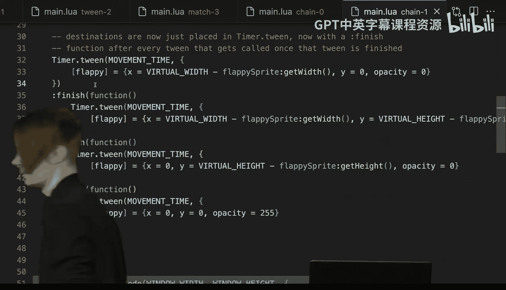

Cool， alright。Glass of water or drink of water。Co。So with that， we've looked at time。

 we've looked at managing time， transitions， movement， tweing and times particularly。

 and also a look at anonymous functions， again， which is all the more going to be prevalent throughout the rest of the code。

But I think sort of the big elephant in the room， we started off the lecture with the grid。

 we started out laying out the tiles and persisting them。

 we can move things around but we need to actually be able to start interacting with the grid before we can really be productive in match3 and so let's go ahead and start with swap zero which is going to be our very initial example to illustrate and again a reminder this is what we're dealing with with the tiles we just have a list of essentially quads defined left to right top to bottom these are all getting IDs effectively through and we're indexing into that quad table that we're creating and with that we can essentially start to compare two tiles。

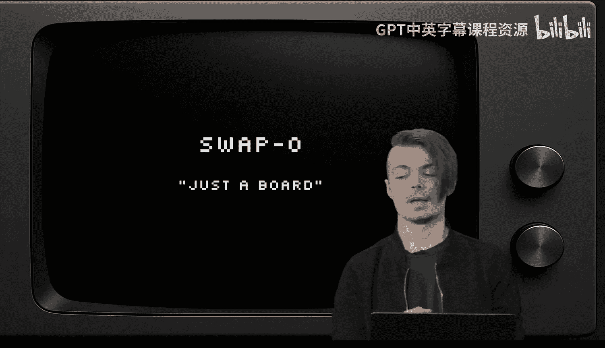

And move them around as well。So I'm going to go ahead and go back here to the code。

Let's go ahead and close out all of these examples that were there before。

 and let's go over to match or swap zero。

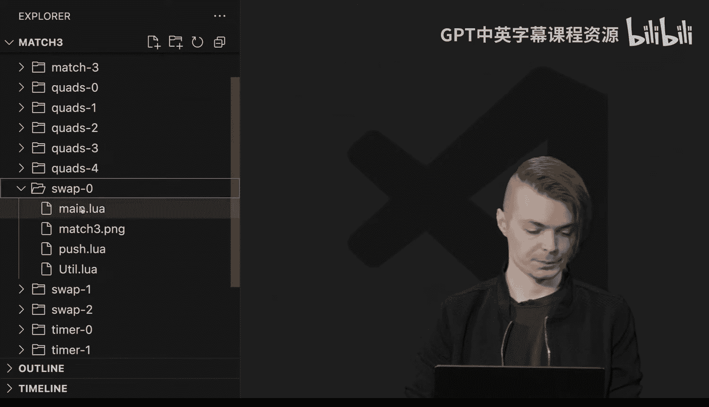

And let's run this。So this is largely what we had before。

 except now it's not filling up the entirety of the screen。

 this is actually in line with what we expect for the game itself， it's an eight by8 grid of tiles。

 these are all just random and they're persistent and with that we can effectively begin to。

If we want， we could draw a cursor， we start moving the cursor around。

 and then we could start thinking about， okay。

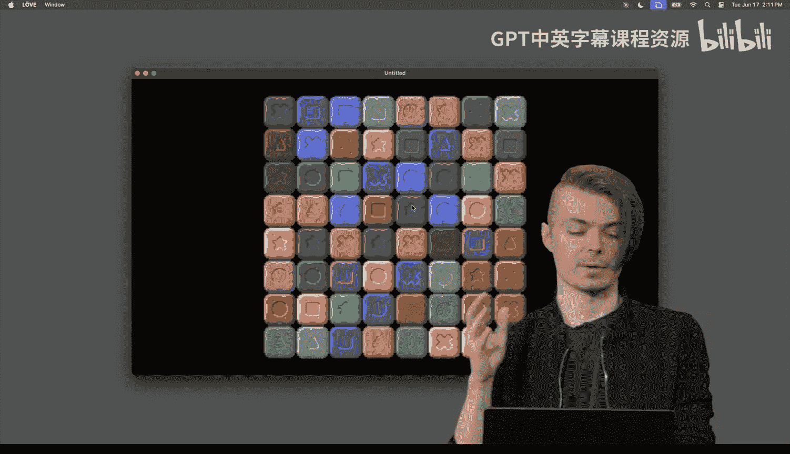

We have this grid， what if I want to move two blocks around。

 actually swap them the grid actually be interactive so that we can then apply the check in order for this to be match3。

 properly match3 I'm going to go ahead and let's just take a look at what we're doing here real quick just establish the same。

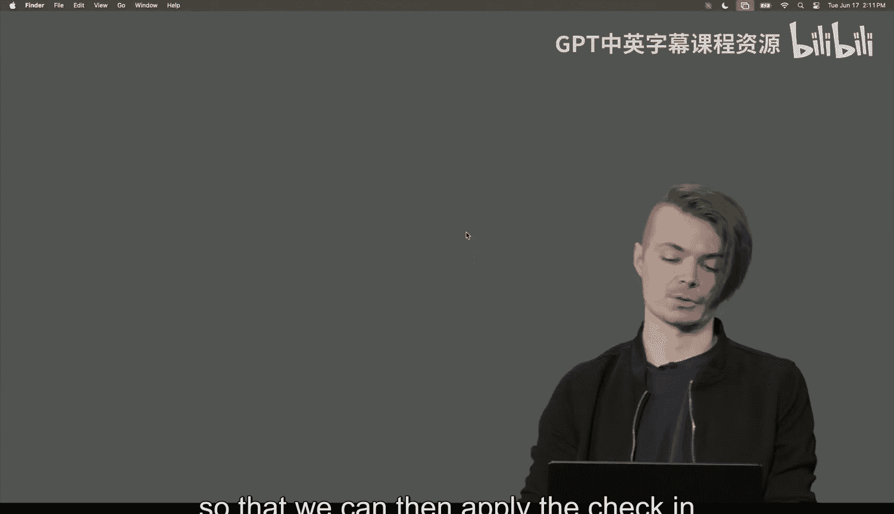

Nothing too much that we haven't seen already， we have a generate board function which is handling the actual board generation。

 everything else is largely pretty germane， we have a draw board function which takes an offset on the x and the Y so that we can center it appropriately once we have it drawn。

 it's not just drawing at the top left anymore it's actually within the confines of the screen。

So generate board here， we saw this before， all this is doing is just that twoD it's going to go through row by row column by column within each row。

 insert within those column into those row tables rather these IDs that end up actually being what we index into our quads table to draw the quad at。

 so pretty overall pretty simple right now。The the only difference is that rather than the ID just being the only thing we're storing。

 we're also storing everything as within a table right here。

 so we have an actual full table within which the tile itself is preserving that ID and then we have an x and a Y coordinate because we do need to draw these tiles and as some folks might be able to predict when we do things like tweing those tiles are going to have some sort of index into this array。

 but they're going to need those X and y values that actually move left and right。

 top to bottom as they're swapped， those are going to have to interpolate and so they have to actually be a stored value within this object that we can move around。

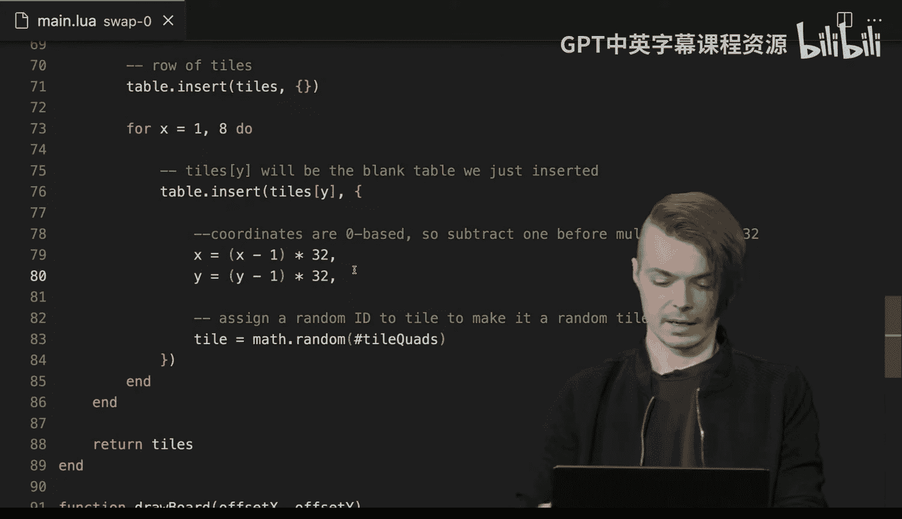

So with that。And again， just for illustration2， just to bring home the point。

 this is an illustration， this is just a code， rough mockup of what memory this would look like in a simple form previously especially right now they're tables of they have essentially that number behind a tile field。

 but you can envision our grid as essentially this， it's essentially just a。

Aray of arrays of numbers， numbers that are sort of elegantly wrapped in a table which also will carry with it color and variety metadata and then the X and the Y that we can then interpolate but this is essentially the mental model for which we can navigate looking at our grid of tiles and this transcends into all other domains within which we'll look at tilebased anything in particular next week when we look at Mario。

 this is essentially the foundation of that lecture as well。

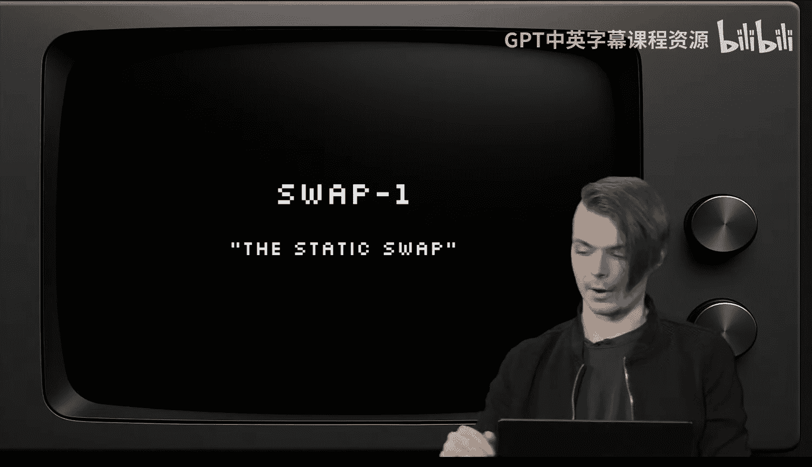

Let's go to swap1 now and here we're just going to illustrate a swap that doesn't actually have much of a visual sort of thing going for it but illustrates what it means to swap the tiles I'm going to go ahead and open up swap1。

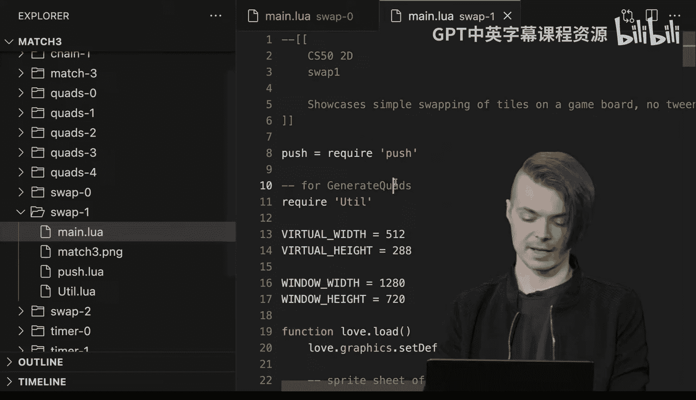

Not going to be smooth， not going to be animated， not going to be fancy。

 but I can move this cursor around。And if I want to move， for example， this tile here。

I can just do it。 and it's instant， but you know depending on your preferences， maybe that's okay。

 it's certainly not， I think what most people expect。 especially' playing games like。

Candy crush or bejeul， there's some sort of animation that should happen。

 but we have the gist behind having this grid of tiles。

 this grid of numbers that we're essentially able to move these numbers around with so let's go ahead and transition back to the code itself。

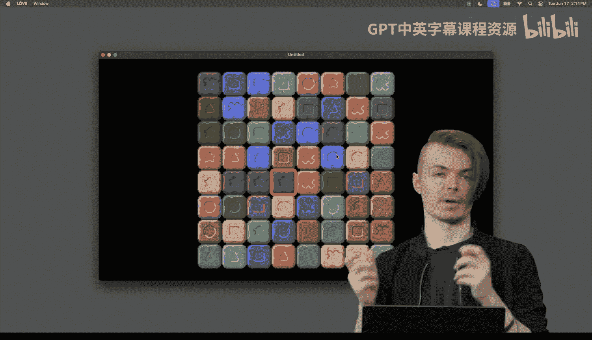

Now we have our board as usual， we have whether we are currently highlighting a tile。

 meaning that we are ready to swap a tile so recall actually if we are ready to swap a tile。

 notice that there's a rectangle， a highlighted rectangle actually applied to whatever we just chose there。

 we're not really doing any bound checking currently in this example so we could just swap these two for example if we wanted to and it's totally legal in this code this is not how the main distro works but just to illustrate。

 but we do have a highlighted rectangle to illustrate okay this is what you chose and then here's where you're going to swap and so there's a reference that has to be made to that。

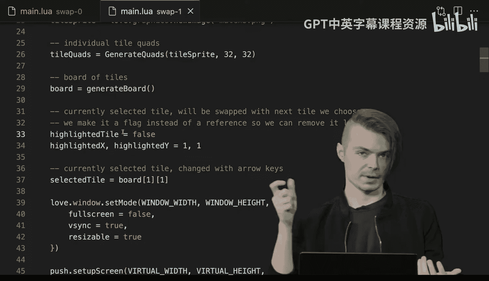

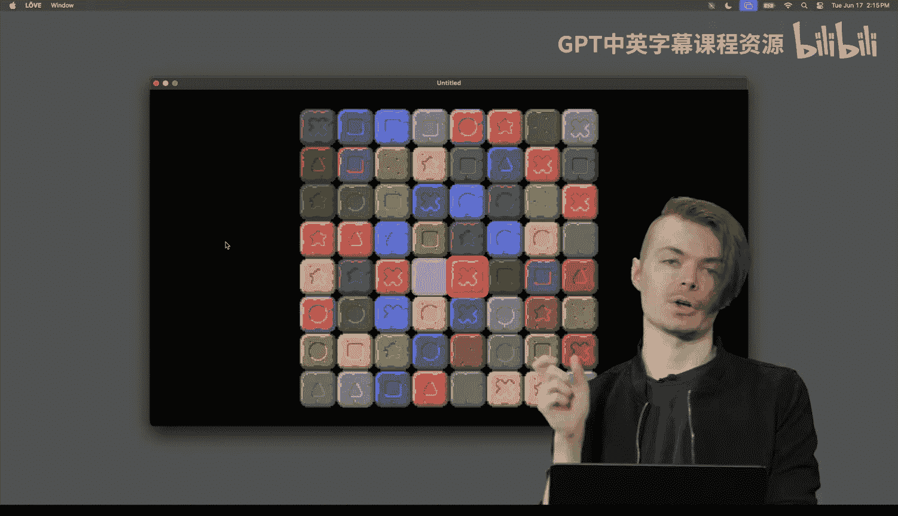

So that's what we do here。We have a highlighted tile and then the actual Y X and Y will preserve that when we are highlighting it。

 but we don't need to- this isn't being used until we actually have clicked enter and are highlighting the tile in this case we do also want to be able to select select or hovering over tiles is going to be the indicator for our little red cursor to show okay we're moving around。

 we need some way to show which tile we want to select which actual tile we want to highlight and then swap。

 so that's what that's for。Here in Love Dot Keyre， if we end up pressing up down left to right。

 we're going to clamp our our x and y values by the board's size， which is what we're doing here。

And then after that。We can press enter or return and then actually determine， okay。

 if we press enter once， then we've highlighted something and we should just either highlight it or unhighlight it。

 or rather we should either perform the swap if it's on a different tile or we should unhighlight that tile。

So we haven't highlight anything， let's do the highlight and then we'll end up just swapping them。

So here we go， it's just ultimately a pretty simple like defining temp X and y for whichever pick one of the two tiles swap the two by setting the other tile to be the X Y of the other tile and then with the temp tile that you've chosen set the other tile to be the temp X and Y。

 so it's a relatively simple swap operation here。And then once that's done。

 we can also swap them in the board as well， which will allow the board to sort of keep a persistent rather the board at grid Y and grid X will be set to the actual instances of those tiles we have to actually swap the individual tiles to do that。

 but then once the coordinates the grid position are swapped。

 we can then unhigh whatever our last tile was selected。

 sorry that was horribly worded I need to word that。I was stammering over myself。

So we could press enter or return and what that'll allow us to do is if we are highlighted already on a tile。

 it will perform the actual swap operation， it'll do the check and then it will actually swap the tiles if we're not highlighted well then we haven't got an initial tile the swap so it's not going to do that it's going to actually highlight whatever tile we want to by setting the highlighted x and Y to be whatever that tiles grid X and yR and then setting highlighted tile to true。

So in the event that we've already got the highlighted tile。

 what we're going to want to do is we're going to want to swap them by getting a reference to both of the tiles here。

 and then at that point we can just essentially swap their information by getting a temp。

 X and temp Y to be equal to tile2 so that'll just preserve essentially itss XY and grid X and gridY。

 we're going to save them both as sets of variables at which point then we set we can swap their places in the board。

And then we can do the sort of like classic swap operation where you have a temp variable。

 you have a in this case we have an Xy， a gridX and a grid Y。

 so we're going to take whatever the temp variables were and give them to tile 1 because we took them from Ti2。

 but tile2 we're just going to then take whatever tile1 currently has before we do that and then therefore they're going to have swap to data and then we'll be able to highlight unhighlight them rather and then。

That'll be at our selected tile is going to be tile2， which is where we end up on。

 we're going to be still at tile2 for our cursor。And there's some folks might see you know a few magic numbers in here。

1， eight various numbers like this， this whole game was largely designed around a consistent aesthetic and arrangement of tiles。

 but if you wanted things to be a little bit more robust and this trendends also from here into the match3 distro proper。

 but you could set eight， for example， to be like grid width or grid height or grid size in this case。

 and then you could tweak that if you wanted to play a game with four， five，6，7。

 eight sized dimensions on your x and Y， but in here in this case。

 things were very specifically tailored for a few specific numbers so that's why you'C numbers that way。

So。That's essentially how you can swap the variables。

 essentially just like taking the metadata of those two tiles。And。Swapping them。

 literally just like changing the XY and the grid X and the grid Y， and then that's it。

And then we can draw it here， we saw that before， de generaterate boards all the still the same。

 and that's pretty much it here we're also drawing the red rectangle that's going to go around our cursor。

Here， that's what this is， this set line width to four is just like the stroke size essentially of that rectangle and then we just draw it over whatever our selected tile is and then we also have this offset we're using to draw you know again the board to a different。

It's right here， this offset X and Y so that it can draw it centered on the screen。

 this is applying to the cursor as well so that the cursor gets moved around。

 it's not drawn relative necessarily to zero on the top left of the screen， it's getting offset。

And then we set our you might see this as well a few times this set color 1111。

 if I didn't allude that to that last time that's because when you set color in love2D。

 this is sort of like a global color， so if you'd forget to do this and you see weird greens and blues and other colors like that。

 just make sure you set your color back to 1111 which is pure RGB white color at full opacity。

 make sure to set it to that just so that whatever the next thing you draw isn't preserving for example this red color which would be the case if you were to like not set that back to full white。

So that's the static swap， so just essentially a data swap。

 but you know if we are looking at this world of timers and between operations and whatnot will。

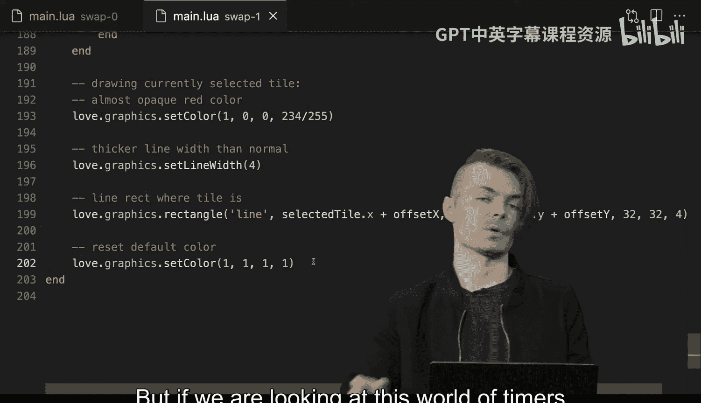

We can do a better job if we were to do a tween based swap instead。

 and really it's essentially going to be the same thing except now instead of hard setting the x and the y between the grid rather the grid x or rather yeah they're x and y and not they' grid x and grid y。

 those will stay small and discrete， but their x and y values， will actually be。

Tweenable right to sort of spoil it， I suppose。

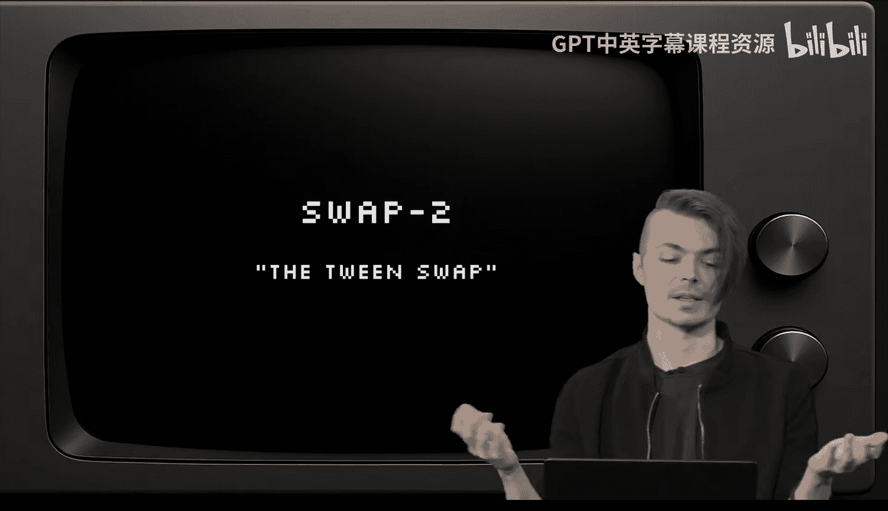

Right now we're just hard swapping them， but if we were to tween them back and forth to whatever the other tile's value was。

 well， we might be able to achieve a slightly better effect， so I'm going to go ahead。

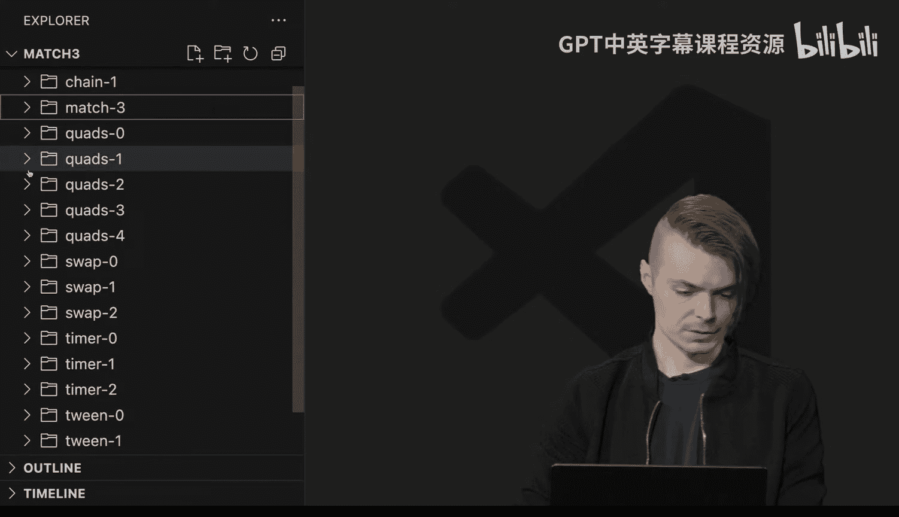

And bringing this over too。

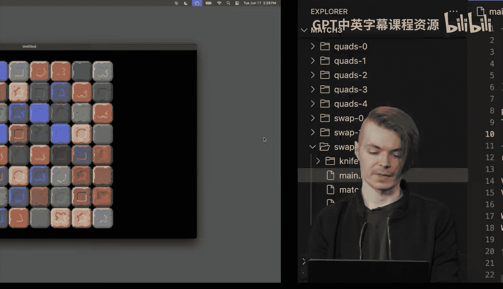

Swap2。If you run this。So it's largely the same。Except now， if I were to select this tile here。

You'll notice that they swapped smoothly over time。

 It wasn't just an instant sort of transition that happened。 We've decided on some amount of time。

 point whatever seconds，  point0， something seconds or 080。2 seconds。

And what this is going to do is the x and the Y rather than being just like instantly， okay。

 this tile was was this tiles X and y and now this tile was this tiles X and Y。

 it'll be some sort of like let's smoothly interpolate。

 And then that gives us whatever this tweing effect as we do it again here。

 you'll see it just happens smoothly。 same thing that happens when the tiles come down from the top of the screen or when tiles that are currently in line。

 get a space below them because of a match that come down。

 they twean themselves down rather than just hard setting their position to be that new value。

 they'll move in the actual。Table where they're stored， the actual get swapped in the table。

 but they preserve a reference to their actual X and Y position so that timer dot tween can then smoothly put it into the right place effectively。

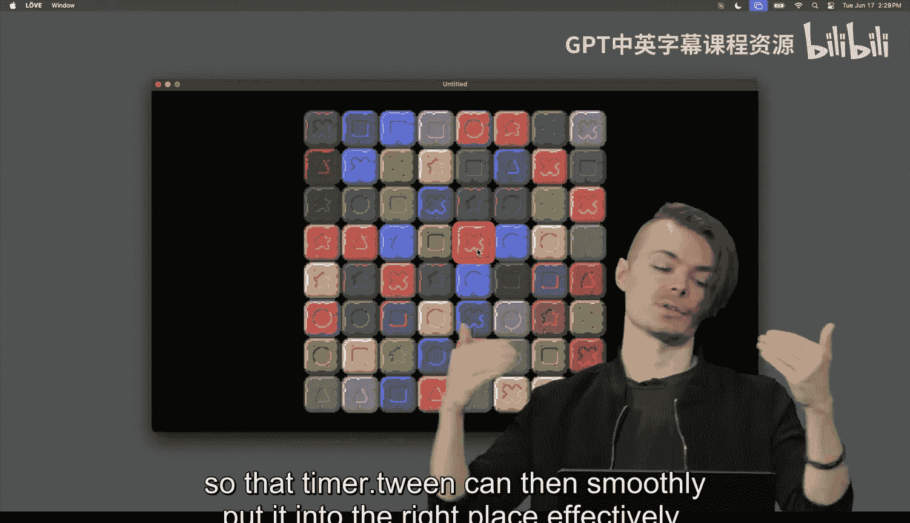

And we'll go ahead and we'll just look at main here if we come down to。

R Love doc Key press does all the same stuff kind of that we saw previously。

Except rather than the hard transition to x and their hard x Y is getting swapped here in the code notice that now we're setting a timer dot tween no finish or anything like that。

 just a simple tween but here we're just passing in tile2 and we're saying it's x should be equal whatever tile 1 do x is and whatever tile 1 do y is and then tile 1 is just going to essentially get whatever the temps is it's x will be whatever the temp x is and the y will be whatever the temp Y is and as a result these are going to now thanks to timer have a nice transition between them and things look visually a lot smoother and it's just kind of easier once you have a lot of these things going on to not have to manage them quite as much as meticulously it's still unavoidable at a certain point there are certain things you're gonna to have to manage grid positions being discrete for checks and then the actual positions of the x and y moving around independently of that but you know at least we've saved ourselves a little bit。

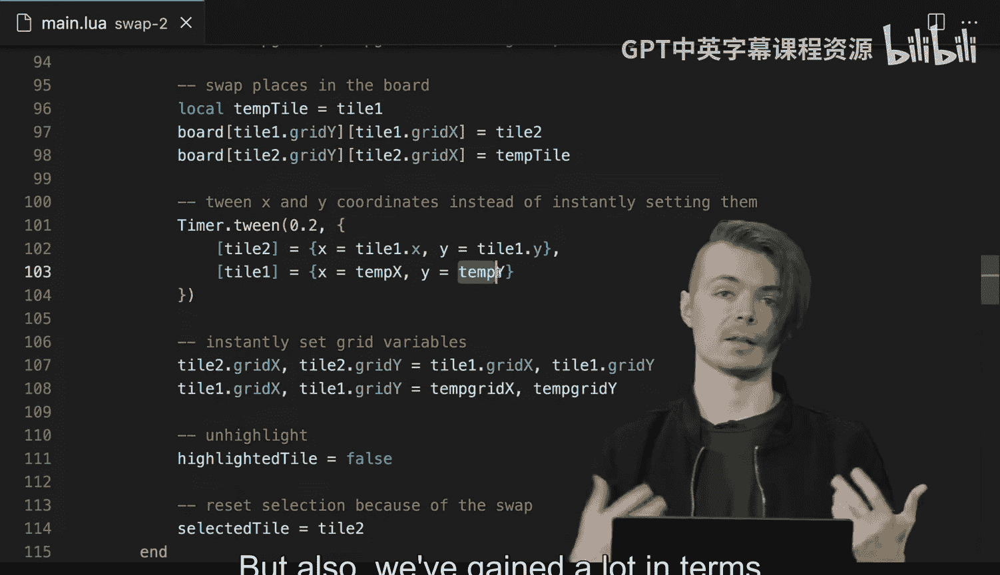

In some sense， but also we've gained a lot in terms of visual smoothness and fluidity。

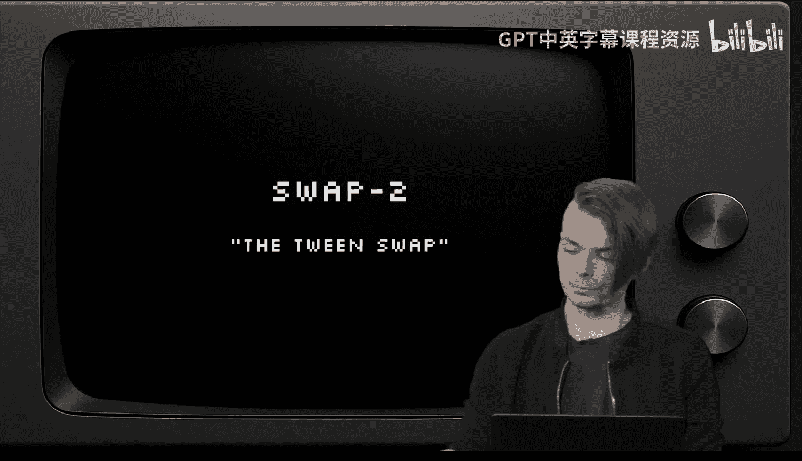

So。That's the extent of the sort of examples that we'll look at before we end up applying。

 taking a look at some of the aspects of the code that are relevant for the problem set。

We're going to look now at matches so matches， this is the most fundamental aspect of the lecture itself。

 or I should probably shouldn't say that necessarily but it is the underpinning of what makes match3 work certainly right now we can swap all we want to things aren't really going to work。

 we can't have a way of gauging whether we've won the game or clear to level or whatnot this is the last big big piece is how do we determine that we have a match and then once we have a match。

 how do we determine okay well we're gonna to have to take tiles out， how do we put them back。

 how do we get new tiles， how do we shift tiles。So matches are relatively easy。In that essentially。

 if we have just a grid of tiles here， we can think of any matches being just three or more contiguous tiles of the same color。

 we can define this however we want to for this example。

 we're going say it's just the same color3 in a row in either the x axis or the y axis not diagonals but just orthogonal axes matches in a row。

 those will be a match。 So if we start at the very top and let's assume that we're going to look at every row first。

 we have to first calculate okay we're going to have to take care of the x axis。

 we need to check all horizontal matches then we're going to need to do all of that again。

 but oppositely 90 degrees on the y axis to calculate vertical matches。

 but let's just start with horizontal matches So we'll start here。

And then we're just going to essentially say， okay， we're at this first row， we'll check this block。

This is khaki color， okay， cool， we'll check the next color。Okay， it's red。 So it's a different。

 It's a different color than this last one。 So okay， we're not gonna preserve any idea of a match。

 That's fine。 Okay， next one's blue。 same thing。 Okay， it's not， it's not pink。

 It's not gonna be the same color。 Okay， what about the next tile。 Okay， it's blue。 Okay， so okay。

 so we're， we're in it， we're currently in a match。 We dont need to reset the color。😊，And then。

 we found a match here。 This is three in a row and we can keep going until we get to different color in the case that we get four colors。

 but here we've also reached the end of the row。 we reach the end of the row。

 we're also going to check okay， did because we're at the end if we can't check whether the next color is different because there is no next color So we're gonna basically say。

 okay do we have at least three， let's return the match。

 We're going do the same thing now for the next row just going one by one。 you know we're at blue。

 okay， red's not blue， So it's not a match， green is not red， So it's pink。

 so it's not a match yellow is not greens， it's not a match， but then weve got two yellow。

 but now we're at the end of the row and it's only two。

 it's not three so it's not a match doesn't count。We'll do the same thing kind of going through。

 we're always just checking， okay， is this color the same as the last color if it was？

Preserve that else， the new color is whatever that last， whatever this current color on this tile is。

Do the same thing here。we got two， but it's not a match and then here gray is not khaki。

 but gray is gray， gray is gray， that's a match， and then as soon as we hit purple。

 we determine that's a match and we save it。We'll do the same thing， We're going to go vertically。

 in this case， we're just essentially crawling through the rows now。You know， why is incrementing。

 we're doing the same check。 Once we get to the bottom of the grid， we know， okay， no matches here。

 Okay， oh， we got two in a row。 We got three in a row。 Co， That's a match。

 As soon as we know that we've gotten to the gray one。 we can say the match is done with。

 It's not four tile match or anything like that。 We got two here。 but again。

 we're at the end of the row or end of the column。 So it's not a match。😊。

And then we're just going loop through this whole process one more time。

 going through every single column and then here we got our last match， three in a row。

 at the very end， kind of the same thing at the very end， check do we have， are we at the end。

 we can't check the next color so this is a match because we are storing in state in some sort of loop we've got three contiguous tiles。

And then once we're done with all of that， we can essentially say， okay。

 we've got four matches in this particular instance and we can represent them as just sort of we could choose to represent them however we want to。

 we can say， okay， these will just become four tables that store these tiles and then we'll just say。

 okay， let's just get rid of them。Cool， so those are empty gonna be empty spaces now in the table。

 We're gonna have nll values here。 Now， the next step of that， Obviously。

 we can't just leave it like this， we're gonna have to say， okay， well， what next。

 Now we need to first， before we even generate new tiles。

 we need to probably let gravity do its thing and say。

 okay let's bring all these tiles down such that tiles can come in from the top then and fill in these gaps that exist。

 So what we'll do is we'll just we can essentially just think of this in terms of from the bottom up。

 we'll say， okay is there a hole Like if I go from the bottom to the top。

 Are there any gaps such that there's a empty space below a tile。

And we could do that by just starting at y equals the bottom。 let's go up this was solid。

 this was solid， cool， solid， no problem， solid， no problem， solid， no problem。

 nothing needed to be shifted。 We'll go to the next column over and it'll be on the X axis so we'll see immediately we have a space where there should be a tile so this will be a nll index into our table and so we can say okay I need to find whatever the next tile is vertically and that's gonna need to come down to wherever this space is so we'll just go up a tile。

We find it right away。 and so we'll just say， okay， now that we found it。

 let's just put it right back to where the space was cool， and then we can say。

 let's do that same exact operation starting up above。😊，This tile that we just place down here。

 And so we find a space immediately and we're going to do the same logic。 we're going to say， okay。

 I found a space。 I mean， I need to find a tile to replace， so it's going to go up。

It's going to go up again， it's going to go up again。

 but it's going to reach the top and it's going to say， oh， there are no tiles。

 so actually okay we don't need to put any bricks down to the bottom where we found that first space。

 we can just end this iteration of the loop and go into the next column which we'll do here so right out the gate we find a space so we'll do the same thing we'll go up。

Okay let's replace we'll put this tile down where we've have the space， cool。

We'll go up up another space， okay， let's do the same thing， okay， tile comes down， go up。

Tile comes down， go up， and then we eventually get to the ceiling。

 quote unquote of our grid where there are no spaces to fill there are no tiles to fill the spaces。

 but we have effectively shifted these down， and then we can do the same thing again for the next column and then the next column。

 it's all the same logic， look for a space， look for the highest or the lowest tile to then fall down。

 match that space and then repeat until you effectively go all the way up to the top of the grid。

 which is the ceiling in the grid。And then once that's finished， well， okay， we've got the。

 we cleared out all the matches as the first step， we then。

Applied gravity to the tiles that existed already。And now what we need to do is fill in the spaces that now exist。

 There will always be spaces at the top of the board that need to be populated with tiles。

 so we can essentially do kind of an inverse of what we just did in that we're going to start from the top in each of these rows。

 but we're going to just like count down how many spaces we get to before we reach the bottom and in the case of a full tile here just be none so we won't have to generate any tiles。

 So if I go ahead and start here。Well we'll assume， I guess that we， we don't have to hear。

 but essentially we would look here and say， okay， it's0， or there's a tile here already。

 zero tiles need to be filled in， but we'll we'll go here and we'll say， okay， there's a space here。

 and then okay。Another space here， we're taking y at this column and we're essentially saying okay y gets one。

 there's a space， two， there's a space， okay， that's two tiles， three spaces。

 four spaces just checking for nil in our board， and then finally a tile so it's going to stop generating generating knowing that it needs to generate a tile for this column here。

 and it's going to move over to the next one space， two space， one space， two space。

 and then four spaces here。And then what that's going to do is it' going to， okay。

 I need four batches effectively of tiles or you can think of it in terms of individual tiles in the distro。

 we think of it in terms of individual groupings of tiles for that row or for that column。

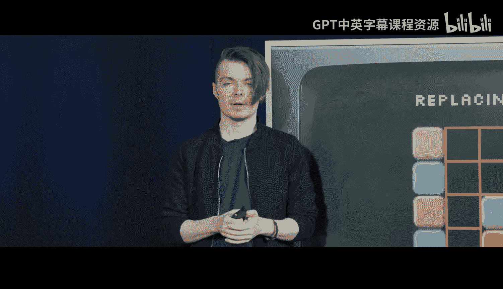

And so what we'll do is we'll say， okay， we're just going to essentially tween in a bunch of tiles to fill in those gaps。

 we'll populate them， we'll put in the tiles with their grid X and grid Y will' set all of their actual X and Y to be some number above the ceiling and then by just performing a y interpolation a time we're tween onto their value we get the effect of effectively a slide in from the top of all of the tiles that match up to the spaces that were left in our board state and in now all of the board is back into a relatively good shape。

 things are fine unless you have matches again， in which case now is the time that you would want to check for matches and then repeat this process。

 people that have played bejeweled and candy crush。

 these kinds of games know that the most fun that you probably have when you play a game like this is when you just like get chained after chain of matches in a row and the board is exploding and doing all this crazy stuff。

But that's effective what we would do here until the board is in this sort of stable state of there are no matches left。

 so we no longer have to do any replacement， any checks for anything。

 the users back again allow to move their curor around and try to swap tiles to affect a match。

And so let's go ahead now and take a few minutes to see how these concepts apply to the code in the actual distribution。

So I'm going to go over to the code here。We haven't looked terribly closely at the code in the course that's in the distro itself for the week。

But folks might notice it's slightly less dense than the breakout code in that it doesn't have quite as many bells and whistles。

So we'll be able to focus， I think， and narrow in on some of the ideas a little bit more。

But it is still functionally a full game in the sense that you can go through the full process of it。

 but we have elected not to do like high scores and various things like that just to focus in on what was relevant for the week。

 So I'm going to go ahead now。And look at a couple of these files。

 so I'm going to get rid of this main dot Lua。So board is important， tile is important。

Some of the states are important that we want to look at。Now， the。Tile is very simple。

 Tile is just a， it's going to have a grid X， a grid Y。

 it's going to have a regular X and a regular y for interpolation for movement。

And then it's going to have its color and variety and remember when we talked about color is essentially the way that we are differentiating between tiles and allowing them to be compared for matches。

 and that's the field that we care about most for that purpose。

And then it's a lot of the same stuff that we've seen previously。

 we're indexing into a frame array to draw the actual texture and just get whatever that ID is for the color。

 We have a utility function that's actually splitting the tiles up rather than it being a contiguous set of just a unidial array of tile rectangles what we have is a function that is actually creating a 2D array off of so we have our frame sort of table which is divided into multiple different kinds of frames by convention in this particular games example。

 we're not going to have a lot of other types of categories of frames that we care about。

 but this will be relevant for other lectures， but this 2D array here is actually dividing things into color and variety。

 so if we go ahead and look at。For example。In u。Generate tile quads。

Is a buildup of generate quads or it's essentially an extension of the idea where it's instead of going through the entire spreadsheet or the entire spriteheet。

It's based on the unit of whatever the size of the tile is， including one table。

We're going to go ahead and recall the texture in this particular example， if I just pull it up here。

Is actually split up， the rows are split up into two groups of six， so we have six khaki。

 six magenta ish， six， like whatever green this is， and then six pink， and then six darker greens。

 six red。And that's essentially all that this does or all this pays attention to is the fact that we can twice within each。

Loop iteration for each row， we can essentially say from one to 6 and then grab whatever the。

Tile is within that group offsetting X， and then do the same thing。

Essentialentially doing it twice will allow us to split things up into two。Yeah。

 in this particular tile set are the shapes on the tiles meant to be distractions from the colors？

The tiles， the shapes themselves are。Not so much meant to be distractions as they are meant to。

In my mind， it was probably relatively ambiguous based on what the designer of the Sprite sheet initially went for。

 but I interpreted as a way to。Have a higher value on that color so that you can imagine if you started off all of these。

 they kind of initially have no design on them， but you could imagine having， for example。

 if you chose this star to be some sort of special tile that you then add a highlight to or a particle effect or something or this x。

 maybe you tint it some color or you do something with it to designated it as being a bad color。

 or you just treat all of these as different values that are slightly higher than regular flat color。

I see them as variants that can either be point multipliers or some sort of feature for the gameplay。

 a punishment， a benefit， the assignment itself is to。

Create a tile such that if you were to match it， some variant。

 some shiny variant that will destroy an entire row in addition to other aspects of the problem set。

 and you could designate that via some particle effect or through maybe the star in addition to the particle effect。

 there's really a lot of options I think， but the overall goal probably if I had to guess would be that these were probably point multipliers or feature multipliers or some other variant thereof。

But essentially what this variant of generate quads is doing is iterating over each row。

 creating a row sheet and then。Rather a half row sheet。

 which then gets populated with just the colors， just the six colors， six color block at a time。

 all the way through the brightite sheet， which allows us then to do what we see here where we can index into the tile sheet at color and then also add variety variety will just be one through6 in that case into that array into that table and color will just be from one to 12 or one to9 by I think it's9。

 I think it's 18。One through 18 is essentially the range of colors which will allow you to choose you know if red is6 or whatever indexing into6 will that6 will be that particular sub row of red tiles and the variant or the variety you could then choose by indexing into this latter part of the 2D array that offshoots off of this really this is a 3D array。

 but the 2D array that we're concerned about is just these two these two branching off of Gframes tiles。

So that's tile board is a bit more complicated， board's got a lot more going on for it。

 it's got the actual initializer very similar to what we've looked at previously。

 except now we'll see that our constructor for tile takes in a random number between 1 and 18 which is the color range and then Marandom 6 which is the variant of variety range so again if we look at tile that's what the constructor does here。

 just takes an XY， a color and a variety and that's what gets stored here。And then here we can see。

That in initialized tiles， we want to also do something interesting kind of。

And that' we want to calculate the matches when we generate the tiles because if we start the game and there's already matches。

 then we're sort of in this weird thing where we're going to start to see matches happening when we start gameplay。

 we didn't even do anything so we want to make sure that we start on essentially a slate that is completely clean that doesn't have any of these matches that is ready for us to create matches so what we can do is we can take a look at calculate matches and essentially the logic here is that we're just going to reinitialize over and over again until we hit a point mathematically it's very easy with how number of variants that there are right now。

 but in the world where you might have only a few variants。

 you might want to instead just perform the actual matches。

And then just keep the same board state and just repeat that over and over again until you get to a stable board state。

 that's going to be faster and easier than at least in terms of processing for a smaller range of tiles than this approach。

 this approach is just expedient， but ultimately isn't the ideal sort of I think for a。

 especially if you start to lower your range of tile colors and variances。

But this calculate matches is what we essentially just took a look at in the slides and that's what I want to focus on probably the most this and a couple of other pieces throughout the rest of the lecture and what we talk about before signing things off and talking about the problem set but calculate matches is essentially the logic that we exactly just talked about which is remember again going through from the left to right top to bottom we're going to check how many contiguous tiles of the same color are there in a row on either of those axes and then let's return those back to the calling bit of code the calling bit of code is in play state so in play state there's going to be stuff happening the user is going to move their cursor they're going to highlight things exactly like we showed the examples that we showed are very similar to what's actually in the code。

But when we actually， and we'll take a look at a couple instances of where timer is relevant for the code as well。

😊，But if we go down here。2。At the very end of this part of the update function， so we'll see。

This is essentially。If they press enter， so this is again basically kind of what we were looking at previously。

 but when they press enter， we' can either highlight a tile and get ready to swap on the next enter click or unhighlight or what we're going to do is perform the actual swap and then when we perform the actual swap。

 it's all the same stuff that we did previously， it's all the same sort of like moving the X and Y back and forth between the two or unhighlighting things in that particular case we were just looking at but all the swapping is basically the same code。

 all the same all the same code。嗯。For the most part。

 even here there's a tween and in this case we're doing it over 0。1 seconds between the two tiles。

 but once this tween is finished once the two tiles have actually finished moving back and forth。

 we want to actually do self calculateulate matches so it's called from play state after we've actually perform a move between two tiles and we can do that in from board or actually well I should say we're going to call boards calculate matches from self in this case self has a function called calculate matches。

 so take a look at that first that's going to be more relevant。

It wraps a couple of things so the first thing that we'll do is we'll say okay let's get the matches back。

 recall that we showed that in the slides it was you know we go through all of the thing of all the process of going through X Y。

 okay do we have a match here do we have a match here do we have a match here do we have match here do we have a match here。

 get all four in the case that we saw。😊，We want to return those back to the play state because the important thing about matches is that they are effectively our score。

 like the more matches we get， the tiles are each worth some amount of points。

 so we can do is very simply just say， okay， if we did get matches back from board calculate matches which we'll look at in a second。

 which is the bulk does the bulk of the heavy lifting， we'll just okay for every match。

And pairs of matches we'll just whatever the length of that is we'll multiply that by 50 and then add that to our score。

 that's it， that's all we have to do。 and then after that we'll do the remove matches step。

 we saw that we alluded to that in the code we'll remove the matches so we need to actually set those tiles to nll so we have these spaces then let's get the falling tiles and that includes the tiles that are in the board so the boards will actually the tiles that are in the board will fall down and they'll get displaced and then the tiles will come up from the top of the ceiling and fall down this will happen at the same time everything's moving in unison。

And then。That essentially what we'll get back from this function is a set of tween operations it's a set of xs xy interpolations。

 we can just pass that directly into tween and then once that's finished well again we're gonna to need to make sure that we don't have more matches left because who knows what tiles are going to get generated。

 they're all random so if there's more matches well let's just perform it again and then this is a recursive function because self calculateculate matches is the function that we're in right now So if there are more matches。

 well we're just going to keep doing this over and over and over again and sometimes again。

 some of the most fun you have in these kinds of games is just like putting together a smart match that just gives you a ton of points and just and just kind of ricochetches and does all this stuff but that's essentially how we're achieving this sort of infinitely processable swap operation it's going to calculate the matches get all the falling blocks do all that stuff and it's going to call itself again if it needs to if there are matches that have to actually。

Then have to actually process。The first step， the main step in calculate matches is going to be the actual boards。

 calculate matches so we won't spend maybe a terrible amount of time looking at it in tremendous detail。

 We'll go through it so that folks can follow along we're to take too much time doing it but essentially we're just going to go through every row we're going to look through X and Y do we have horizontal matches I this color the same as the last one was it also the same as the last one y we got at least three and then once we get to the next color that's not the same color Co however many we had that we restoring a reference to let's take that away from well let's store it in a match and we're going to return it for points。

 but then also we're going to need to flag all those matches are going to get stored and they're going to get removed from the board as part of the remove matches function。

So here we can see we have like a color that we're going to match。

 which is the first color in the loop。Every horizontal tile x from 2 to 8。

 we don't need to calculate1 because we already did that by default we're just going to say is it the same color is the tile there at yx the same color and this is traditional with 2D arrays in games typically you're going to go based off of Yx because y being each row right because if you go top to bottom you're going one row at a time so Yx do color will be whatever as we're going left to right each row。

If it's the same color， cool， increase the match number。And then if it's not， okay， well。

 then now we need to change the color to be whatever this color is， did we get more？

Did we get at least three tiles and if we did， let's create a match。

 let's put it into a table which we're going to insert into this matches table that we're going to return and then we're going to go backwards from where we are currently in the match and then we're going to insert the tiles that we had found up until this point into this table and then this table is going to get added to a table that gets returned back。

And then if we're at greater than or equal to seven and it wasn't a match。

 we don't even need to worry about the last two， it's impossible for two tiles that aren't part of a match at the end to be a match。

 so we just kind of shortcut the loop here and we do the exact same thing for the vertical matches way down here。

And then it's essentially how we get the entirety of all the matches。

 we just are iterating through the vertical。Well， we're iterating horizontally by going down through each row。

 and then we're going through each column by going left to right。

So we're going each column and then within each column， we're able to look at all of the vertical。

Tileles within that column to determine。If we have any matches。And then once that's all done。

 if there's。You know greater than zero matches within the actual match table will return it。

 others will return false。At which point we can then use that in play state if playSt gets a falsey value from this function。

 it's not going to have any matches， we don't have to worry about it， it's not going to do anything。

 it's not going to actually do all of this code here， recall， but if it does。

 we want to remove the matches which。Re'storing a self dot matches reference to these matches for this purpose。

So remove matches is simple， all it is is essentially just for every match that we have。

 let's iterate through all the tiles and set them to nll。In our table。

The result of this is that we'll try to index into whatever that particular index was in R。

 it's not going to be anything that's going to be nil， so we don't have to worry about actually。

Anything there？But then what we can do is add tiles to fill it。

And then interpolate them into those new positions so they'll get erased because they won't exist。

 They'll lose that color value and。Won't be rendering， but the tiles above it will fall。

 and then the new tiles will come in to populate it。So that brings us to falling tiles。

 which is sort of the last piece of the puzzle， so to speak。Again， we're returning a tween table。

 we're saying okay， we want this table to come back that's got all this tween information。

 which is XY values in our case。So we're saying， okay。Remember， we saw this visually。

 but we're just going to go through each column up until we hit the top of the actual the ceiling。

 so to speak of our grid， looking for spaces and then looking for the nearest tile to bring down to that space and then just kind of going up until we reach the top of the。

Ceiling。So here we see， we just have simple。Space， what's the y what our space was at？You know。

 while y is greater than equal to 1， so until we get to the top of the we're assuming bottom would be eight。

 top would be1。And then we're going to get the tile that's there。

 we're going to try to index into our if it's nil， then it's not going to be a tile。

 it's not going to be anything， and that's going to be where we should flag it as having a space if we haven't already。

If there isn't a space and the tile is no， let's set space to true。If space y is0。

 then that means that it's not a space that we've actually found yet so we can just assign our space Y20 or rather our space Y2 y and keep track of that so as we go up。

 that's where we're going to need to make sure that for example， if there's a tile at the bottom。

We need to make sure that we put the next tile that's let's say there's a tile， a space。

 and then a space and the tile， we're going to want to make sure that we put that top tile not all the way at the bottom but above the tile that existed there。

 so that's why we maintain a reference to the Y that needs to exist there。

And then in the event that we have a space flagged， but we find a tile when we're going up， well。

 then we'll just set that actual space Y area to be whatever that tile is。

 we'll set that tile to nil。Setting the grid Y to be that， whatever that space Y is that we had set。

 we' were going to flag the tile itself， it's grid Y to be that space Y。

And then it's actual because that's it discrete spot in the grid。

 but it actual Y is going to go into this tween table。

 so this is going to move it down using its grid Y as a reference point。

 minus1 because of coordinate based access versus table based one indexing。

Times 32 which is the tile size， and so this is just going to eventually accumulate a bunch of these tiles that need to move down。

 they all are going to be tiles that move down until we return at the very bottom。

The Twe operation or the table of Twe operations。That's for the in the case that we're talking about right now。

 we're talking about the tiles that are already in the grid that need to move down to fill those spaces。

 but as we saw the very last example visually illustrated was the top of the actual grid has spaces that needs to get filled with new tiles。

 which is how the game is sort of infinitely playable。

 the tiles that go away have to be replenished and so we do that here。

 again from the top we look down or the tiles at all in this or other spaces， and if we see spaces。

 we're going to count the number of spaces going from y equals1 to y equals8。

 and then we're just going to essentially add those to our tween operations。

 we're going to add them into the table but we're also going to add a tween operation to them。

That has their y position from negative 32 is where it starts at to whatever its grid y minus1 times 32 is。

 so it starts at the very top of the screen and then comes all the way back down to wherever it's resting places in the grid。

 which is going to be multiplied by 32 pixels so all of that。

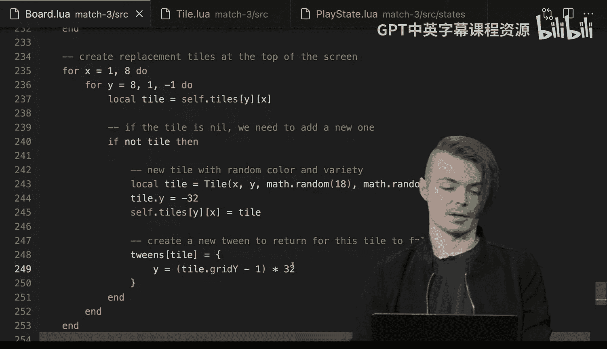

And we'll just again， visually illustrate it。And we'll take a couple seconds just to again。

 relook at some of the other things， the tweing and timer based things we looked at。

But we'll move over here。See if we can get a match。

 but you know I'm moving around so these grid X's and Y's， we've got this tile here。

 I want to move this here， the three tiles above it are going to twe down。

 three tiles above that are going to twe in to replace those tiles so I do that。

You can see that happen there and then if I， let's say I move， I can find a match， let's see's move。

Kind of tricky sometimes， okay， let's move this one here。So again。

 we're going to have a sort of the red， purple， yellow are going to move down to fill this space。

which they did indeed and then we had three tiles that spawn above that and then if you were to get sufficiently lucky or skilled at playing something like this and have many many matches occurring and filling in the space or rather many。

 many matches that would sort of organically come up to be because you got a bunch of matches figured out somehow。

 you would essentially see this repeat over and over again。

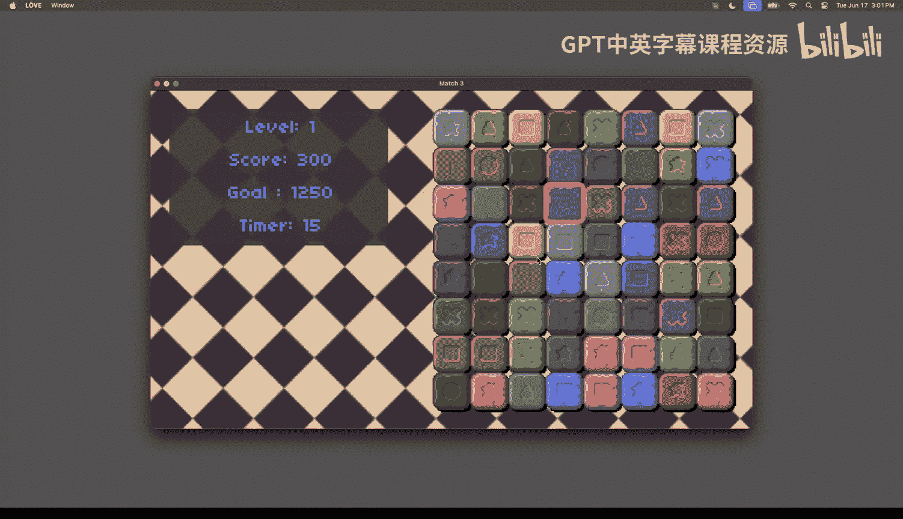

🎼嗯。I'm going to restart it one more time because we should look at also again draw your attention to the transitions。

 the last two pieces that we'll look at are the transition between this state and the next state and then also the sort of moving down of the level text。

 which are the last sort of pieces I think that are relatively new that represent the tweing and timerbased operations that we looked at。

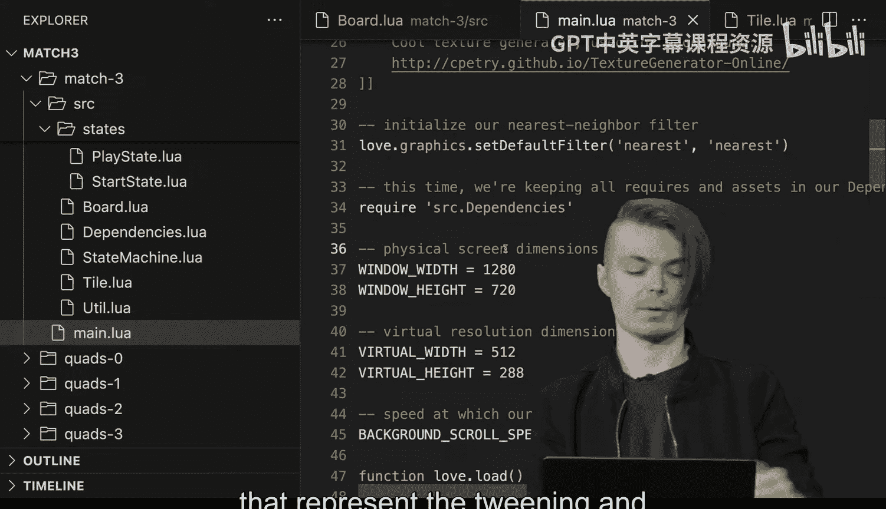

Let's go ahead and start this so again there's a imagine here you know if you were to think about it right like how do we make this screen white。

 fully white well there's not really an easy way to do that other than maybe a rectangle that we could draw to the screen on top of everything else that is just transparent and then transitions to full opacity and that's exactly what we do and then you know how do we go back from the next。

Seecene or the next state to rather the transition at the start of that。

 how do we go from that to seeing to having the white sort of fade out？

And that's just the same thing in reverse if we just start that state with a fully opaque rectangle that's white and they just fade it to zero opacity。

 well， we get this illusion that we've transitioned smoothly between these states。

 they've been like very actually still the same abrupt transition。

 it's just that we are like tricking the user， the viewer into not seeing that。

Through clever uses of timers， so here's the rectangle， it exists already， it's not being rendered。

 it's going to tweed it opacity to one。And then it starts off at one and twes it to zero in that begin game state。

 then it gets the sort of level text transition down and then transition at the very bottom。

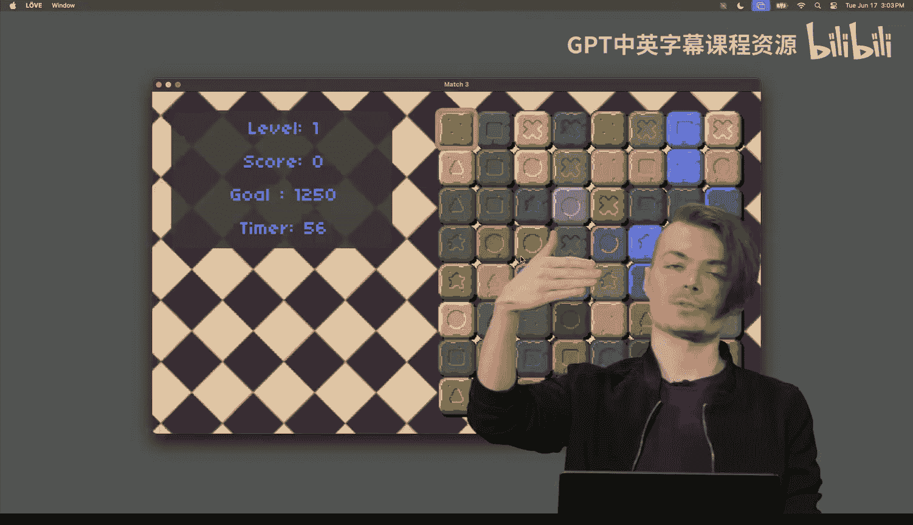

We'll go ahead and just see what that looks like here and close these examples。And in particular。

 we care about the start state。Because that's where we're going to keep the actual transition rectangle for the transition to the begin game state。

If we look up here， whether it's down here。We have a transition alpha that's zero。And if we。

Press enter。You'll see that we do indeed do a twe operation。Between self， in this case。

 you cant pass self if you're within an object， you can do that。It'll just use whatever self。

 transitionition alpha is。And then transition that to one。That'll go from zero to1 over one second。

 that's what this member this initial argument is。And then again， at which point we've seen this。

 this is the chaining idea， this is at Fish， an anonymous function that has our state machine change that takes us to level one of the begin game state。

 so we are including our state machine transition within this finish callback of the timer。

tween operation， this new thing， these building blocks that we've put together this whole time and then we're removing a color timer here because it maintains a reference to things that are going to not exist in you can remove timers from timer。

 if you maintain a reference to them if they're going to refer to values that won't exist at a certain point。

 this is good because you'll crash your game if you don't do that it'll try to tween a value that gets delocated effectively。

But if we come down here。You see。That we have a rectangle here that we just draw。

 it's a fill rectangle， the whole width and height of the screen。

We initially set transition alpha right before that， rather we set the color using transition alpha。

 such that the rectangle gets drawn with that color with that opacity。

 and then we remember to set our marker our sort of global color tracker to full 1111。

And then so the result of that is we transition to one over one second in opacity。

 which gets us to be full white， at which point we instantly transition to the begin game state。

 so once we open that up。This has its own transition alpha that's already set to one。Such that。

We can immediately。On En， remember that all of these states expect an enter in an exit function。

 in this case， enter。Gets called right as soon as the state machine gets loaded into the state machine the state object does。

 so we are going to just immediately begin the transition from1 to0 on this transition alpha。

 so we're essentially going to from zero to one cutting to a new state that has already pre- bakeked into it a transition alpha of one so it's a full rectangle that's white。

At which point？Once this is finished， we have a finished callback that's going to over 0。25 seconds。

 move this thing called level label Y down to halfway down the screen， that's the level。

 literally the label， the rectangle that's semitrans with the text in it。

 it's going to move it there。On finish， we were going to say after one second， let's tween。

 so this is like the timer dot after we talked about。

 we haven't really seen after two any time we just saw timer dot every timer dot after we just care about one second I want to then trigger another tween of that same label text down towards the bottom of the screen at which point we can then call G state machine change to play and then we're in the play state and then we can begin our game loop and do all that stuff and everything is very smoothly and cleanly transition to and from each other。

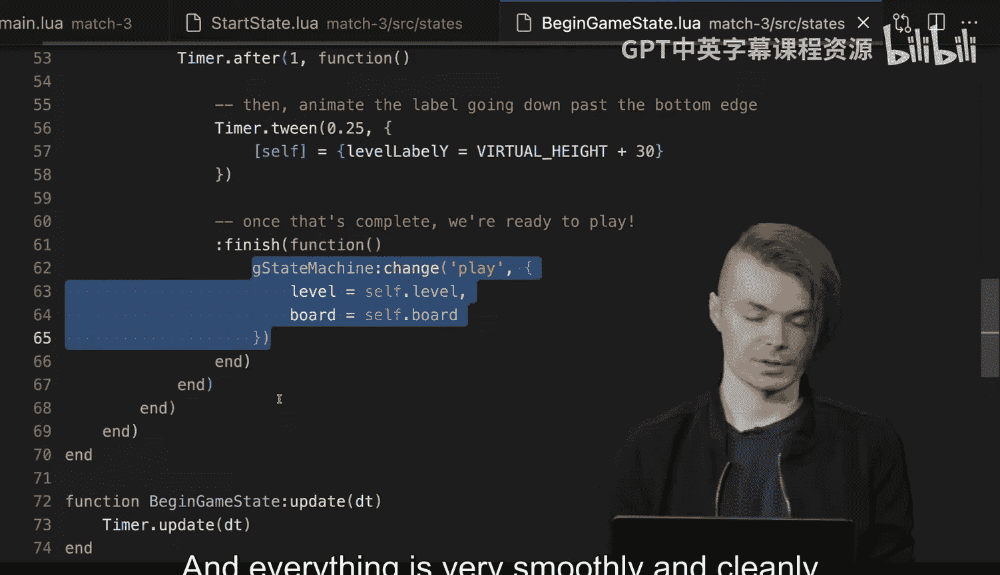

And I think that is the majority of all the pieces that you will need in order to。

Do the problem set for match 3。 So quite a lot of pieces。

 There's a lot of various new time based mechanics that we've talked about。

 And I think it would be kind of fun at the very end just to kind of look at a couple of things that are。

😊，I think that are important for me， at least when I'm thinking about games and aesthetics。

 matter two， especially in 2D， but I think it applies globally。

 but we used deliberately a sprite sheet that is a limited palette sprite sheet that uses I believe this exact same palette。

 Don Ber， which is a Don Bringer， sorry Don Bringer 32 color palette， he has Doner。

 they have multiple different numbered colored palette。

 but it's a very sort of famous in at least in the retro community。

And this one's really cool because it's the colors are。

Created in a line such that you get a very tremendous gamut with only 32 colors using dithering。

 So this is essentially like pixel patterning the color such that like if you mix any two colors and you off color them in a particular way。

 you can get colors that look to the human eyes if they're actually between shades of color。

 these sort of larger palette shades of color。 And so here this is just know the 32 color by 32 color matrix in sequence。

 and it's quite impressive。 It looks like a full range of color。

 but game art historically was paletteized in older consoles。

 there were limitations that made it such that color value。

 color size was only certain size and you had to have a certain bit depth for every pixel on screen that was represented in different ways。

 depending on the console。 but。With just a very primitive。Seemingly palette on the surface。

 You can achieve very nice aesthetic visuals and coherence to your design。

 It's kind of the one of the benefits of it， too， is that。

There's a mistake that you can make by choosing palettes that are overly rich sometimes。

 especially in art like this， where the just sheer number of choices leads to more opportunity for conflicts。

 for overly harsh contrast on the eyes， and so if you have just a set of very well-des colors。

 your risk of that is pretty minimal and so it's common in games nowadays。

 I think in retro community especially to try to use some of these ideas。

And we used it today in all the matchty art， it was all 32 bit or 32， just 32 colored。

32 color palette。This is an example of if you were to use the same palette on a real image。

You can preserve almost all the detail。 you do see some of the artifacting and some of the sort of weirdness of it。

 but like it's impressive what you can represent and here's a better example。

 this is just a comic cover。 this is the base color and then if you apply Donringer to at the 32 this is what it looks like and it's very little actual loss in color but you still get like pretty much everything exactly as you would want it and it's cool and impressive and super fun。

And I think it's important to take that into consideration if you're developing a game。

 try it as an exercise， use only 16， 32， maybe even eight colors。

 or be ambitious and use like two colors like game Boy or four colors。

 it gets to be trickier that way， but it's interesting what comes about through limitations。

This applies also it's the same idea in pallet swapping。

 so in consoles like the NES or the super Nintendo you would have a pallet that's loaded in memory that can be swapped out and then all of the sort of video work that's being done by the NES it was the PPU I believe the picture processing unit。

 pixel processing unit and it would be looking at this range of memory addresses for the colors that it would then draw onto the screen and every piece of art that's on the screen would be therefore easily changeable on the fly to be some different color and this is something that's used in a lot of retro gamesme to good effect。

 Super Nintendo is a console that I loved and has a lot of instances of this but it's just a cool technique and it's related to the idea of palettes。

 it's essentially the same thing of having this set of 32168 colors that are at that time in hardware but nowadays in software sort of like limited for aesthetic or functional purposes。

So assignment3 is going to be， you know so far what we've done is we've seen that by playing the game。

 you sort of have this hard set 60 seconds when you're playing and it's pretty difficult。

 but it would be better if you could just add some time if you were to get matches。

 be actually incentivized and rewarded for your time or for your performance。

 so it'll be add the ability to get time added to your timer rather refund it to you effectively。

 such that you can keep playing and not run the risk of losing quite so easily。

The blocks that we saw so far were all using variants。

 but the problem set is going to encourage folks to use variants that scale up with difficulty and actually mean something for point multiplication。

 so rather than just having all of them be the same value， like take the flat block。

 have that be some value and then incrementally add these variances as the level increases as your performance throughout the game goes up and then allow that to be a multiplier for how many points you get for that color。

The sort of thing that I always think about when I think of bejeul when I think about candy crushsh is like these blocks or these candies or whatnot that have like just this explosive power or this bored wiping effect and this problem that's going to require that folks determine some block generate at random that has this shiny flag or that has some sort of variant on it that's visually different and allows you to destroy a whole row of blocks when that gets cleared out and also in addition to that。

Create some kind of a particle effect such that it's visually also represented on all of the tiles that it affects。

Then right now， you can swap any two blocks that you want。

 but you should only be allowed to swap blocks when there's a match and you should also calculate such that if there is no possible one swap that will result in a match。

Then you should restart the board or have the board reset this is a thing that happens in candy Christian be jewelled。

 if you can't do a swap that actually will give you a match。

 it'll just completely wipe the board for you and give you a whole new board that does have。

Tiles that you can swap in order to create a match， so you want to do that。And then lastly。

 implement matching with the mouse right now， we don't have that ability。

 you just have to use the cursor， but know match3 and bejeulled at least on phones would typically be mobile games that you would use your cursor or your finger to actually create a match with and so allow the ability to do that and you'll need as a hint here in order for this to work well the virtual resolutions in the push library you'll need this function push2ga of XY so next time that's the problem set for this week。

 but next time which is this certainly is one of my favorite lectures coming up。

 but a lot of the things that we talked about are going to be applicable particularly for the maps and idea of talking about tiles as IDs and having that be meaningful。

 but we're going to look at Mario， Super Mariri Brothers and we're going to look at an example here using artwork that is sort of open source public domain art a variant thereof。

 but a very robust tile set but we'll be looking at tile maps which is very similar to what we looked at with today's grid except tile map is sort of this way of representing a world in 2D space。

And then having your world be essentially subdivided， if in terms of like Minecraft does in blocks。

 but in 2D， it was sort of like the original Mincraft in that sense I suppose。

 but how does the sky differ from a block on the ground versus a bush versus a pipe or something。

 these are all going to be represented as tiles which we will deal with collision and other things related to those。

2D animation， your character should move around on the screen。

 but they can't be like a stiff like just translating sprite。

 so we're going to need to animate movement and jumping and various things like that platformer level generation will look at an actual meaningful procedural generation sort of approach and look at some really cool level designs we can get for free just through code。

 which will be exciting。And then platform physics， which is just essentially an extension on AABB collision detection。

 but it has some slight differences in the world of platformsers and then we'll also look at her boxes for how to actually interact with enemies and then lastly power ups and how those work and how we can use triggers to create them。

So that was all for Mat3， it was a bit of a sort of return to modernity from last week。

 we've sort of gone back and forth and back and forth and the next week we'll be going back again to Mario but that era has so much nostalgia for me。

 Mario and Zelda and all these different games so I'm very excited for that。

 this is CS52D and this was match3， we'll see you next week。

Thanks。Nice。