# 哈佛大学《2D游戏开发｜CS50 Introduction to 2D Game Development 2025 Fall》中英字幕 p08 CS50 2D - Lecture 7 - Pokemon .cut.zh_en -BV15xsPzEETf_p8-

Hello world， my name is David Main， I'm here of course with Cololton Ag and this is the very last shoot for CS502D。

 the new and improved version of CS50's introduction to 2D game development which follows on the heels of what was CS50G Feel free to ask questions along the way via the chat please forgive as always if we start and stop to make fixes but we're looking forward to wrapping up this final shoot today I think we have an opportunity for one final fun fact。

And let's do a compare and contrast， do you remember a game that you won and a game that you never won？

A game that I won and a game that I never won。 Well definitely linked to the past。

 I won that and I presume you beat Zeldom multiple timesia I and I always really enjoyed Super Mariio world for Super Nintendo。

 but I don't think I actually ever beat it but I think my brother might have beat interesting Super Mario brothers won definitely beat that Well and I admittedly don't know if I beat it properly because back in the day there was this magazine that we were talking about yesterday called Nintendo power and cousin of mine had Nintendo power。

 the magazine and when we would go to her house and she had an Nintendo we could kind of cheat by looking through the magazine issue because they had big printed versions of the maps of every level those are amazing where it is but the coolest part was it would tell you were like all the secret stuff is like the pipes that would teleport each like the next world there were things like the canami code you recall that in Con I think that's the origin up up down down left right。

 left right B。Never goes away， really let's ingrained in you。 So all right， those were fun facts。

 cool break a look， thanks。OK了。Hello world， this is CS52D lecture 7， the final lecture of the course。

 and today we'll be looking at a game that's a big part of my childhood and sort of a culmination of some of the ideas and some new ideas with which we've been talking about in this course and that is Pokemon stylized with this slide here by a game that I grew up playing in particular Pokemon crystalt for the game Boy and here's a screenshot of what Pokemon looked like the very first Pokemon game that I ever played which was Pokemon red and I remember the very first time sort of being able to play this on a handheld device back in the day in a gamebo and thinking just how incredible it was that you could go around while you're out on the playground in school or whatnot。

 and then you are playing as this character in this world going around and catching these creatures called Pokemon shown here this is a Weep and bell versus a Ge dudeude。

 there were 151 original Pokemon and that was a big deal。

Again， a huge franchise， just like Mario and Zelda at spawn countless different various products。

 including in anime， including trading cards， all sorts of things， huge part of my childhood。

 huge part of I think many folks's childhood。 they evolved over the years much like the Pokemon themselves do。

 This is gold and silver and crystalt， which was the one that I spent probably the most time playing after red and then they got to the Game Boy advance where you had titles like Fire Red Leaf green and then there were games for the DSs where they incorporated the dual screen where this is a Pokemon black excerpt tier。

 where they have all the moves here that your Pokemon can use in battle where now shown all at once on the bottom。

 and then you still have the same sort of combat screen up top。

 And then here's another example of Pokemon X and Y sorry this is black and then X and Y is this version here which is their first foray into 3D。

 And now they've gone and spawn a bunch of new games that I can't even keep up with on the switch and so forth。

 but the same core formula is the same where you have a Pokemon here shown even though it's in 3D you still have the。

Same dialogue， you still have the same sort of view of the front and back。

 and though they now have more dynamic camera movements and the like。

 the underlying turn based battle structure has largely stayed the same and we'll be taking a look at that today。

 in addition to various other aspects that make the game work。

So some of the topics we'll be looking at in addition to turnbased systems which I've just alluded to。

 we've been looking at state machines thus far and state machines are a great way to model behavior as it changes throughout time。

 be that for your game or be that for your entities in the game but today we'll be looking at a way to model states that layer on top of each other folks are familiar with Pokemon you typically are out in the world as a character moving around much like in legend of Zeldo or games like final fantasy of old sort of these RPG turn-based RPG type tropes like Drquest and so forth。

 but if you are to walk around and let's say some area of grass where there are wild Pokemon that you can encounter you will transition to a new state。

 this battle sort of state where you're fighting in the screenshot that we've seen thus far。

 except once the battle is over you go back to exactly where you were in the world previously and so there's this preservation of your position and you can certainly sort of keep that as a variable and pass it back and forth between states and whatnot but there are many effects and many sorts of ways of modeling these。

Think about also pause menus and the like where you might want to render something that is a different state but on top of a state that is kind of paused in the background。

 And so the way that we do that is we actually start to think about our states not as a machine with a discrete individual state。

 but rather as a stack that we can pop and push states on and off of Well to spend bunch of time looking at GuI elements as well graphical user interfaces today。

 which games like this is you can see by the screenshots。

 they're very sort of menu and UI drivenri and so we have to take a look at how to actually compose those and then RPG mechanics in general as we look at how the battle system XP things like that work to allow us to sort of build up our team of Pokemon fight get stronger。

 so on and so forth。And this is what our goal ultimately is going to look like here's a differentiable screenshot between the field state as we'll typically call it in an RPG or in Pokemon。

 Pokemon being an example of an RPG， albeit quite a different example than what was common at the time。

 and specifically a Japanese RPG or a J RPG。

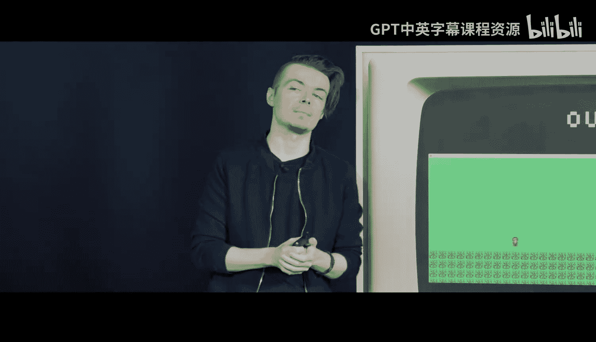

And so it typically will have a field state and then some kind of a battle state and then maybe other additional states with larger menus and the like which we won't necessarily have in this implementation to start with。

 but which will be a part of the problem set， but this is a sort of core differentiator between the two main states that we'll be talking about So I think it's important that we as usual take an actual look at the demo of the game and see what it looks like in practice if we could get a volunteer to maybe come up the stage Yeah come on。

And it's David， David， yes， yes， good to you again calling on good to see you again。

 so we're going to go ahead and run it here。🎼And we'll notice that we've got a little title screen here。

 they Pokemon sort of like we're using this sort of open source set of Pokemon and so they sort of per the normal game will' do this in the beginning where they're transitioning back and forth。

 but you can press enter and that will take us to the actual field state notice the transition that occurred there and so here we have the first example of an actual dialogue window which we haven't looked at yet Now it's interesting on the surface it might not seem this way。

 but this is actually a state， but notice we also have this other state underneath it which you can go ahead and press enter to dismiss the dialogue。

 you can now walk around you'll notice that there is like kind of flat sort of low grass but also this like darker deeper grass so if you spent a couple moments maybe walking through there just for a little bit and maybe a chance permits you might stumble randomly across。

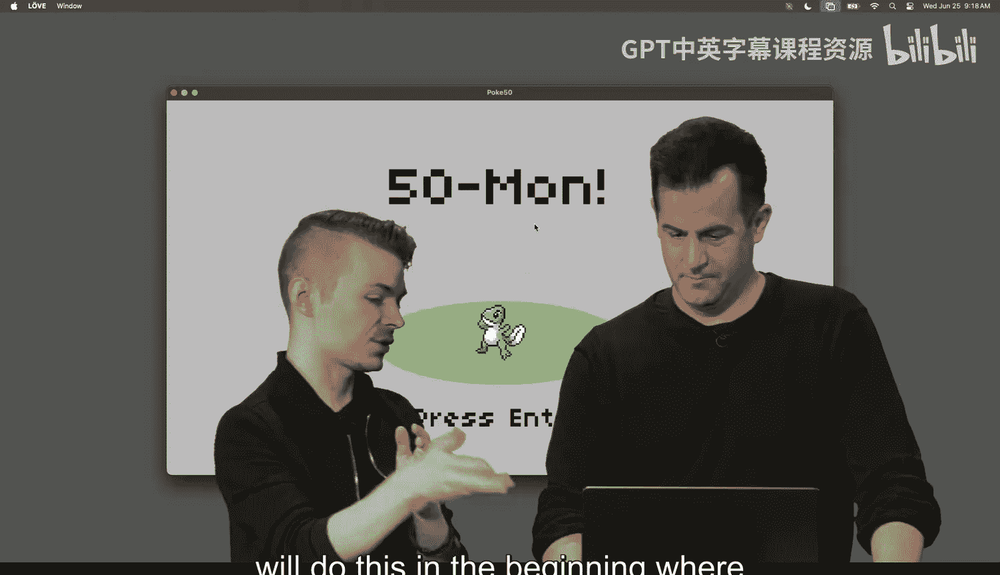

Encounter， although they seem to be a little bit scared of you right now， but there we go。

 So if we've transitioned now into a new state， things are very different now。

 you've got a Pokemon that you've been given for free。

 it looks like you're fighting the same one by happenstance So if you press enter。

 you'll see that you're sort of getting a set of dialogue prompts or press enter again and now you've got two options that you' to use the arrow keys you you choose Do you want to fight what do you want to run and so fighting。

It does indeed input put some damage you got some effects there some graphical effects。

 you notice your sort of stats are higher than the enemy so you do more damage so if you can maybe do that a couple more times。

 you notice's a sort of turn base sort of like you're turn then there turn okay so very well you defeated the enemy you get some victory music and if you were to press enter you might notice。

🎼XP there part of the game， too， is you level up over time。 you fight more and more creatures。

 And after you order to try and maybe get into another example and it said。A fighting。You know。

 it's your XP and health sort of preserved from last time。

 but now I don't you go ahead and run instead of fighting once we get past these first couple of prompts here。

It notice that you flee and then you come again， you don't have to fight you have that choice not to。

 in theory， if you were to get knocked out from fighting a Pokemon。

 you might go to a different state if you want to try that as well。Okay we get an art art here。

 which is a different type， we'll see if he's strong enough to fight to knock you out if you fight him。

🎼，And my health is on the right， your health is on the right， y。Any。

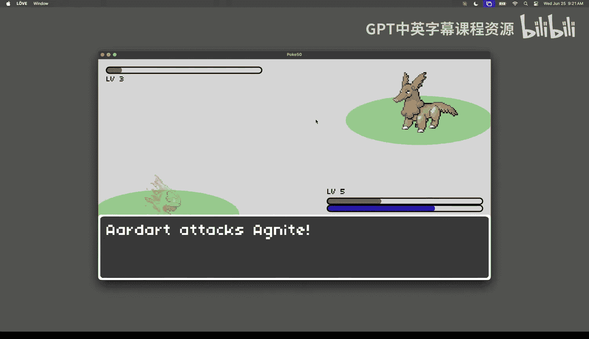

So far he is winning is he gonna knock you out he did so you fainted now if you were to press enter we sort of transitioned a little bit differently it was to black but then you get kindly revived and then a little bit of a notice that says Pokemon have even fully restore store and try again and so that's overall the gist of Pokemon so thanks thanks so much for coming up to try the example。

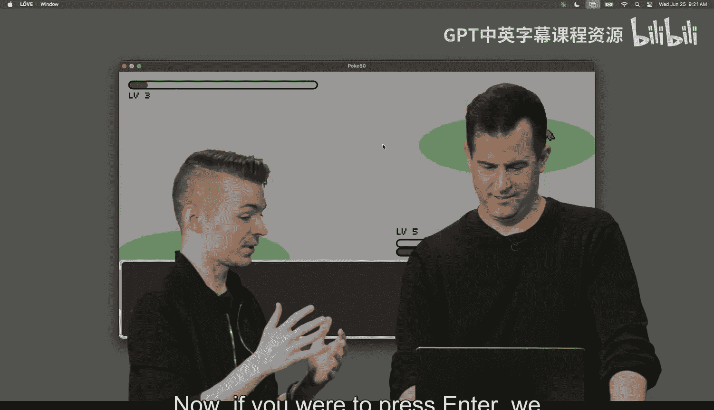

So we saw a lot of pieces there， certainly in order to run the full experience。

 we kind of had to go through a few different things there。

 but there are a lot of things that are happening sort of invisibly that structurally might not look all of that different than what we've done but we had some dial boxes for the first time these sort of boxes that are actually rendering a rectangle with some text。

 we had a menu there in the battle state which allowed us to actually choose options which then affected the game in particular ways。

 and this is just kind of the beginning of what GuI means graphical user interfaces。

 what they can look like， how they can behave， but Pokemon is a great testbed from which we can start to implement some basic Gui elements。

 even the progress bars that were shown there， the health and the XP were also Gui elements with their own values and their own sort of ways of rendering and behaving and they have of course interpolated behaviors that we've been using timer dotween and the like。

 even for the transition some of those things are repeated things but a lot of those things are indeed new。

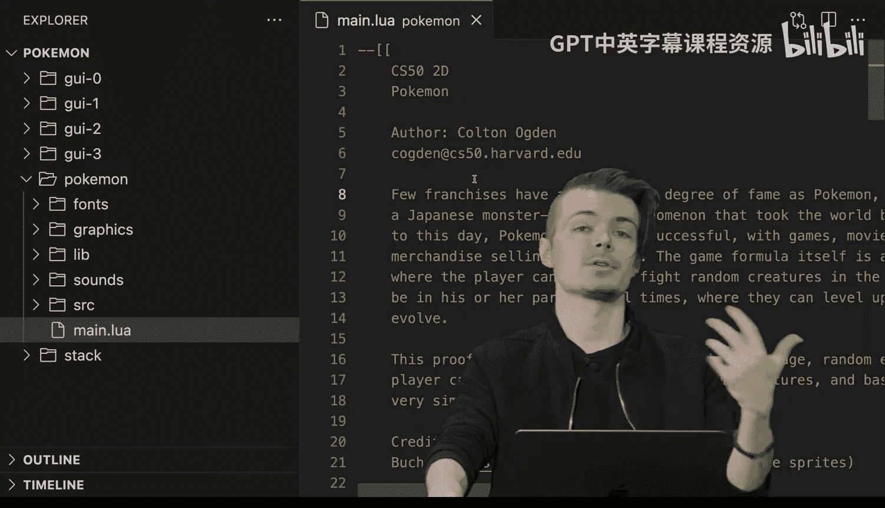

So when I was first learning Lua and Love2D a little bit more in detail many years ago。

 one of the things that I was looking at was this resource， how to make an RPG do co。

 which I learned some of the things that go into this lecture as well。

 understand thought it was a great resource when I was going through it。

 so I encourage people to give that a look if they're curious the sprite sheet we'll be using today we'll actually be making use of the Zelda sprite sheet again in this case we're not using any of the monsters that we used previously。

 but we needed a character avatar to represent our character moving in the field。

 and so we are just using this section of the same character sprite sheet that we used last time。

 we also are using this tile sheet here for the grass part。

 particularly two of the tiles here that are flat grass folks might have noticed that we had flat grass but also the deeper grass and folks might have noticed we actually are rendering two layers there in this case we're also rendering this thicker grass on the bottom where we're testing as the player walking on thick grass this is a Pokemon trope where don't don't go into beware of the tall grass because that's where you'll find a Pokemon while Pokemon that will try to。

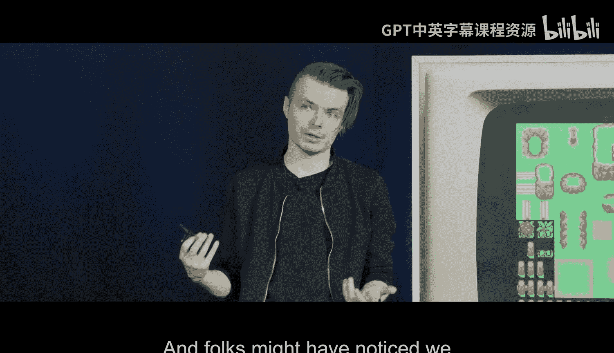

Attack you， you can then try to capture it and that's often one of the goals besides just making your Pokemon stronger why you'd want to go into the tall grasss。

 but we are adopting the same idea whereby these tiles we'll end up giving you a chance every time you walk as your character is in their walk state to trigger a wild Pokemon random encounter。

So the first thing I will take a look at just to sort of set the stage for the new elements that we're gonna to look at today are Gus what they are and some basic versions thereof So Gos are just literally graphical user interfaces。

 they're very frequently built up of many smaller parts that compose in a sort of way to give us more complicated UIs in particular folks might have noticed we had these panels that were relatively similarly styled for the dialo box and for the battle message states and whatnot and even the menu that folks could choose options for within which they will render text and you can have things like cursors and then you can have progress bars and you can do all kinds of really fancy things with Gos and we'll keep it relatively contained today primarily looking at panels。

 text boxes， selections and menus and the like but folks there's all kinds of things you can do you can do various wheels。

 various kinds of style toggles especially for folks familiar with web development there are many。

 many different types of UI and elements and widgets that people create and build upon and so we'll be looking at a few examples so I'm going to transition right from。

Yes。Into a few examples that I prepared in advance that we can take a look at I'm going to transition over here and sort of close out this main Pokemon source file。

 which we will come back to 100%， but I'm going to open up Gui0。

 and I'm just going to run the code that's in here to start with and folks will see that it is somewhat underwhelming perhaps in its presentation。

 but it is the same rectangle that folks might have noticed that appeared in the Pokemon example。

 This is just a panel meaning some kind of flat surface upon which we can draw something and contain something and this can maybe be moved around and placed in different parts of the screen or whatnot。

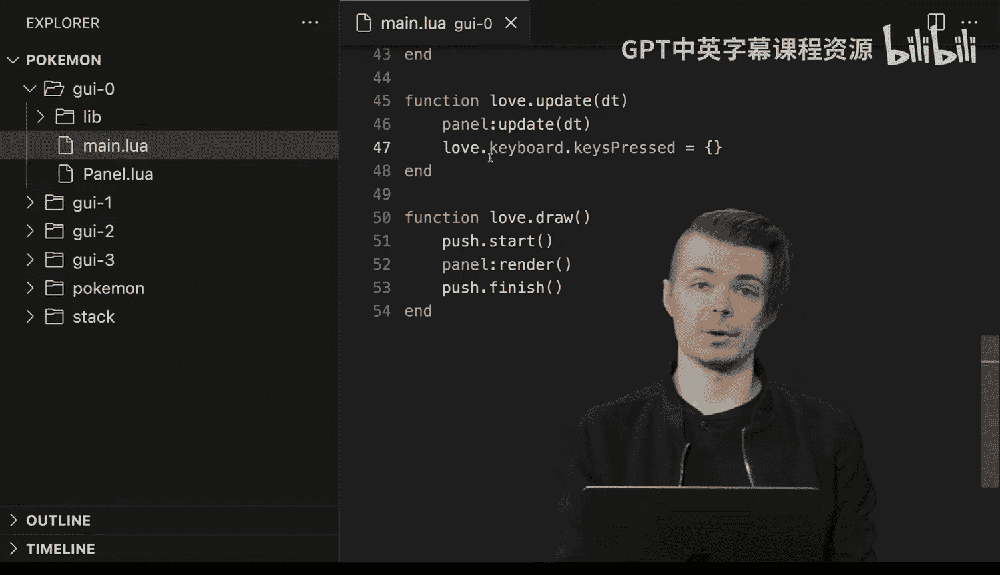

And you can use or you can use panels to affect certain things like modals on the screen and the like。

 But they're essentially just a contained canvas upon which we can draw things。

 And folks might notice that there's a little bit of a styling going on here just for a sort of visual flare to not just make it a plain rectangle。

 you can add some sort of border and you can get really fancy with these。

 We're just going essentially use two rectangles to accomplish this。 But all we're really doing。

 it's quite simple， only 50 lines of code or so。 If it come up here。

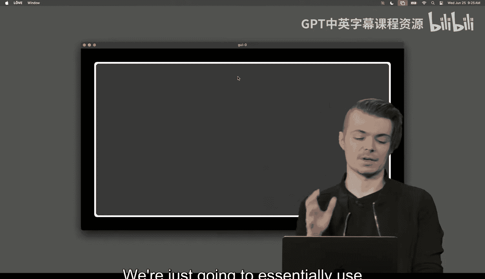

We'll notice that we besides the class itself， we are creating a panel object which is going to be at 1616 Xy。

 It's going to be 32 pixels minus the height and the width to accommodate for the 16 pixel offsets from the corners and then we're just going to draw it and then we're going to render it as usual and update it if it's so had any behaviors we would want to update so it's go ahead and take a look at what panel itself looks like it's going be pretty simple it's got an x Y。

 a width and a height， whether it's visible or not so we want to toggle it on or off with a keystroke。

 it's got an update function that we're not doing anything with and then if it is visible if it is actually set to render we're going to first draw a white rectangle that's going to be slightly larger then the actual content thereof and so this we're just drawing it at its full size X Y with height with this sort of pixel border radius。

 this rounding value which is going to be how many pixels of sort of effectively bevellling or rounding are going to occur at the edges of the rectangle and this is something that you get just with love。

Fix rectangle， it's something that's also in CSS in the web world， it's very common。

We can also then here set the color to a sort of a grayish color， really darkish gray color。

 and then we're just going draw the same effectively rectangle。

 but just shrunk in by two pixels on either side and what this is going to do is make it look like we've got this two pixelel border around the entirety of our rectangle but we are effectively still drawing at X Y width and height that same rectangle and if Id go ahead and run this one more time we'll notice we do indeed have just effectively two rectangles drawn in and centered in the screen So sort of simulating this idea of having this border when all we're doing is just drawing two rectangles So that's a panel panels very simple nothing too complicated about it the next example that I would like to bring people to see So some folks probably saw panels in the Pokemon game and in fact if we just run this really quickly folks might notice。

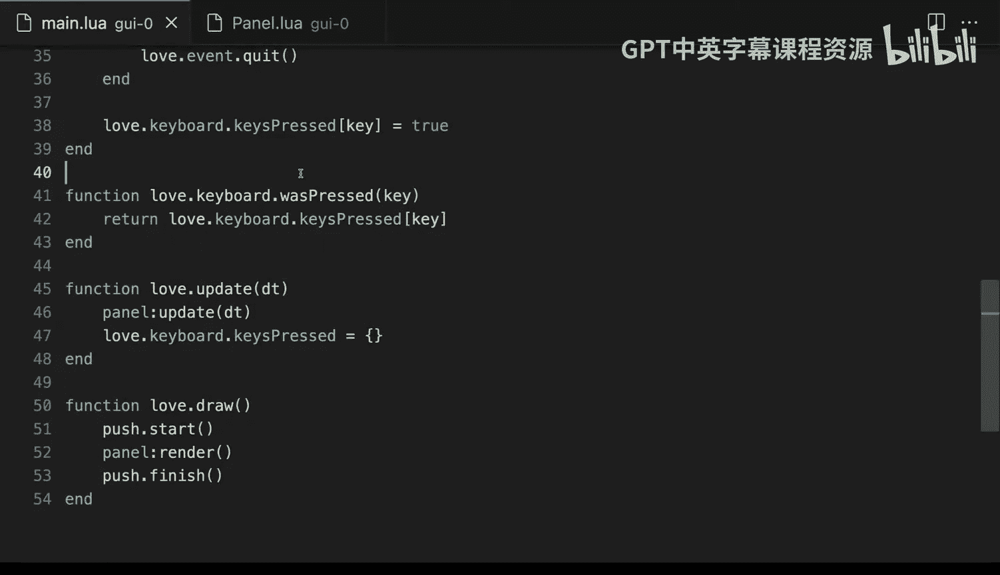

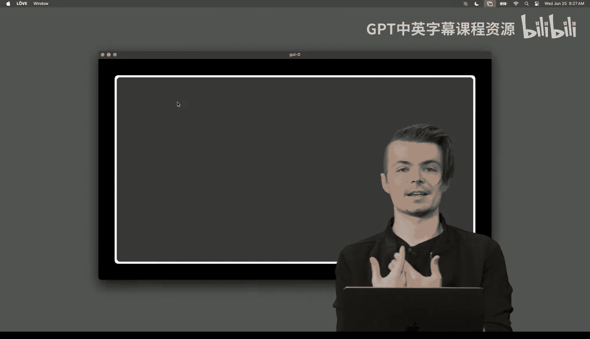

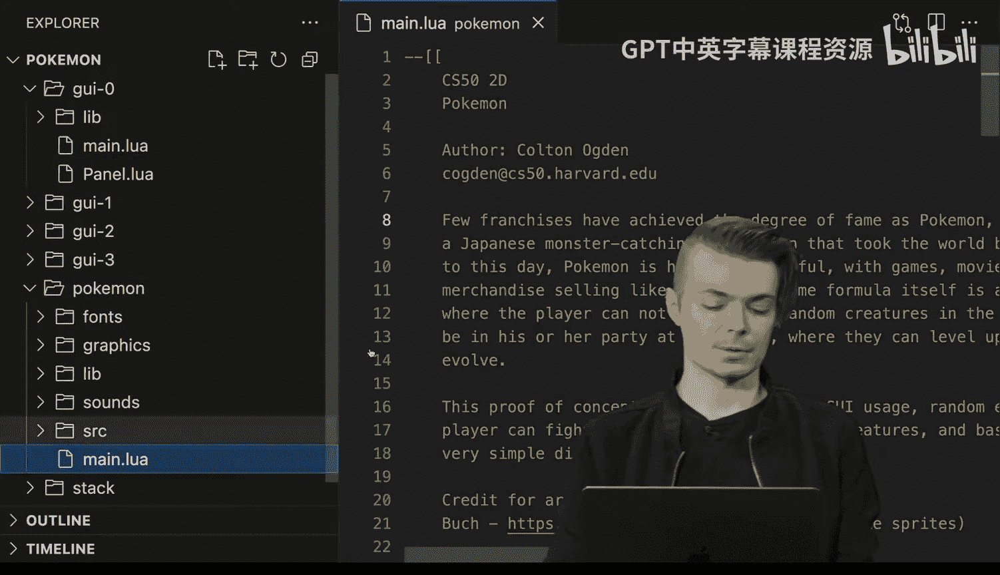

Besides the intro screen。🎼I'm going to press P to sort of pause the game here briefly actually it's not necessary。

 the audio will still continue， but notice that it is the exact same rectangle only it's got text on the inside of it。

 And so that brings us to the question of okay， how do we actually draw a text box or the like and it's quite simple although there's a bit more complicated code in deciding you know if you want your text box to have this ability to make sure it contains no more than the text inside of it。

 we're going to have to adopt a couple of considerations for that。

 but I'm going to go ahead and open up GuI1。

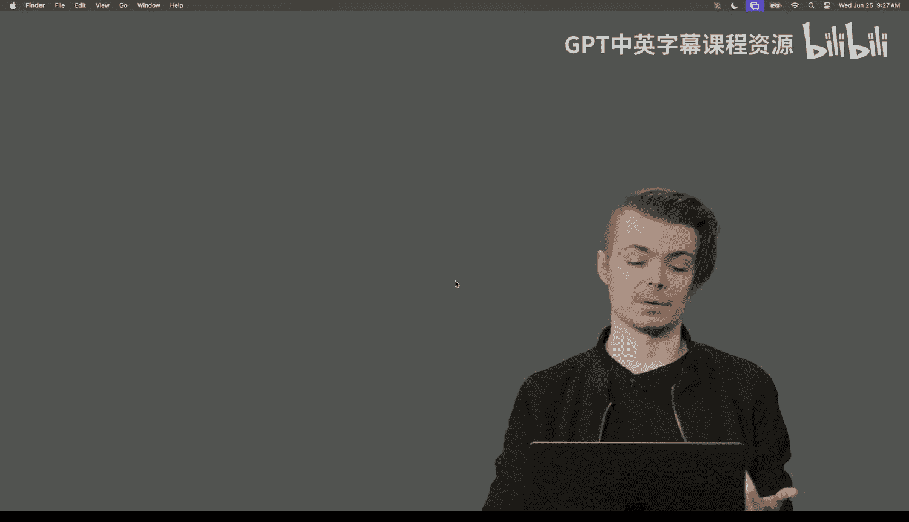

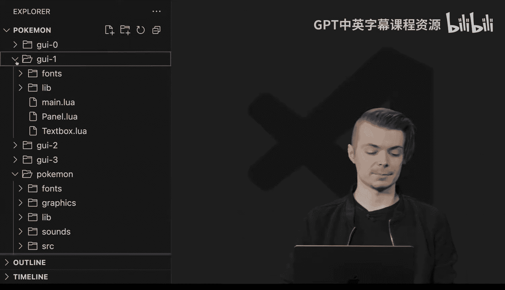

Here。And then we'll notice that I've gone ahead and supplied some Lom Ipsum like text。

 this is actually a Latin excerpt here。About the nature of good and bad and such forth that I found on Google from Cicero。

 but effectively it's just a large block of Latin text。

 notice that it looks like it doesn't quite end at the bottom of the screen。

 and that's because if I press enter will notice that it continues to the next section of text So our text box is intelligent enough to know that should the text overflow the bounds of this box。

 we don't want to essentially keep rendering it past the border of the text box。

 we want it to store the section of text that it's currently rendering and what it should render gets changed on the next click of enter。

 if I press enter again， notice that it's still going quite a long excerpt。

 here it looks like it finally ends。 and if I were to press enter， it does indeed close the text box。

 therefore representing the conclusion of the text or whatever purpose we want that to then impart onto our game。

 for example， maybe we go onto the next state or whether this to sort of set the stage。

 maybe itself is a state that we can think of that takes input it will sort get rid of itself and allow us to continue to the next part。

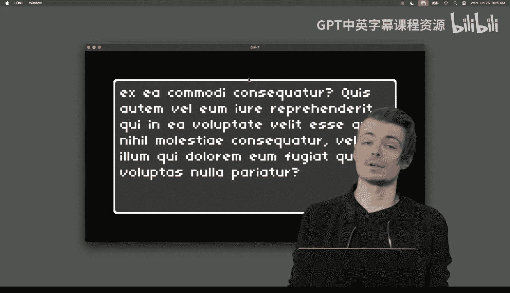

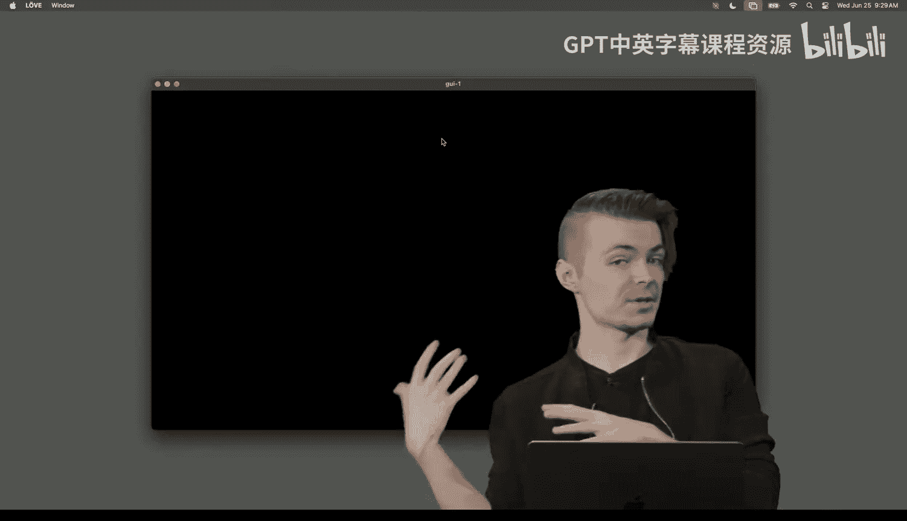

The game。But we have effectively now a relatively robust text box。

 if we were to look at the code here， we'll notice that not much has changed in Ma。

 we do indeed still have a text box， we do still where we have the panel rather we are instantiating a text box and it takes the same sort of arguments here。

 it takes a 32，32 in this case for the x and Y and then a width and a height。

 a really long string for the text here。And then we're passing it in also a font so we've allowed our text box to take in varying fonts of different sizes。

 should we choose to want to display a larger sort of exclamatory message or something that's more like a dialog box which has smaller font and thankfully love 2D gives us the ability to depending on font calculate what the line height is of our text and so with this information we can then calculate how much to fit in a text box if we open up text box here。

 notice that we're including panel because text box itself includes a panel within its instant within its constructor here so we are not only going to be rendering a panel as before we're essentially building on top of this Gui element that we created previously but we're going to now start to add new things to it。

 we're going to take in this text and a font as additional parameters beyond what we took in what the panel and then we can sort of preserve those by default will' say okay we'll be a small font if we don't have a font that we got passed in and then we're going to pass in we're going。

Going to initialize some variables here that are going to allow us to pad things more appropriately within our text box so we can provide a global padding。

 for example， if one were to render without any padding if we were to set this to zero。

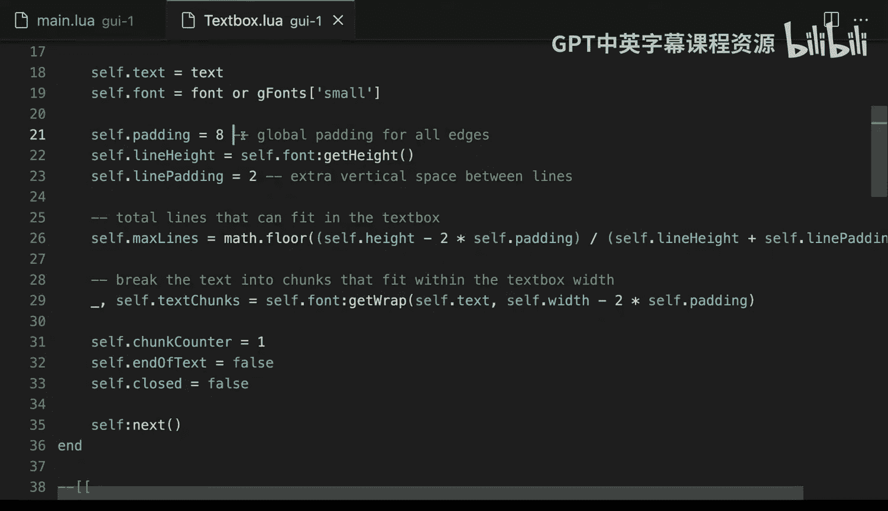

And then run this。Folks notice that it is uncomfortably close to the edges on the inside of the text box。

 and this is very not aesthetically pleasing。 So we've gone ahead and done is there's an actual。

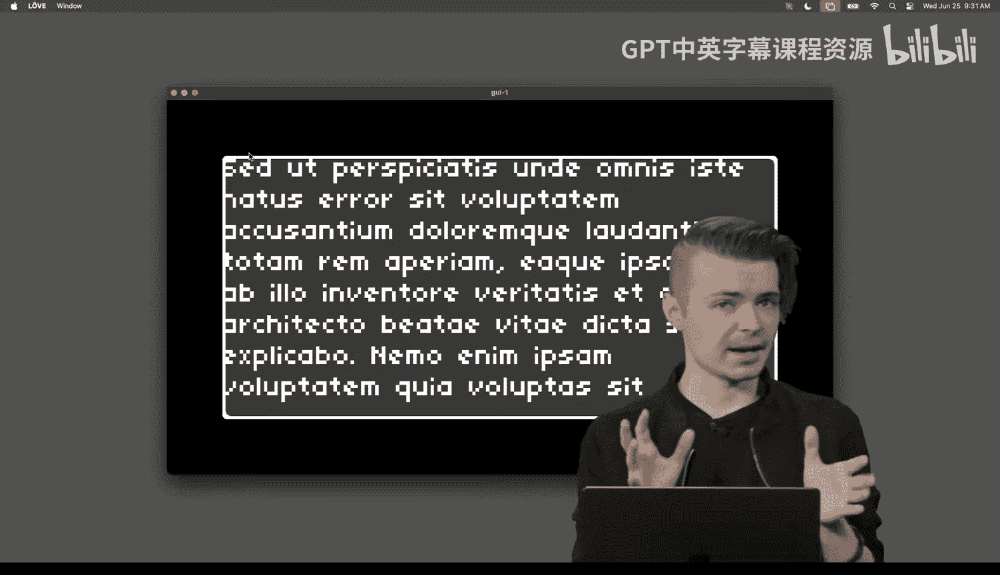

Come back here。padding variable here， which is going to apply to all print operations。

 everything ultimately is going to be deferring to print。

 which is what we've used so far with some helper functions we'll take a look at here in a second。

 but can if we apply some padding around the edges now we have a much more palatable to our eyes sort of container for text we have a line height we're gonna to get a reference to which thankfully love 2D gives us this ability every font that it has。

 it knows the line height of the font in this case if it's medium。

 I believe it's 16 pixels and if it's small， it's 8 pixels might be 81216 or 32 and so these pixel sizes are able to be essentially the determiner for okay I know that the line height is 12 pixels or 16 pixels and then I know the height of the box I can fit that many lines of text in my box and then if we want padding between the lines for example。

 some extra line padding we can just pass that in here as another sort of addition that applies to that multiplier per line which then ensures that every print statement。

That we call is spaced out a little bit more from the surrounding print statements and so we want to get the also the number of lines we're going to have to call a series of print statements folks might anticipate in our panel if we imagine drawing it。

 we want to then render every line of text that we know will fit and so it's going to call several print statements one for each of those and then we want to know how many lines can we fit and so we're essentially going to take the height times the padding。

And then we're going to divide that by the height。Plus the padding so that we get that actual what's the fonts full size if you were to add the line padding to it。

 and then that divided by what effectively is the height minus the padding because we're accounting for that because that's going to shrink effectively our renderable box。

 we therefore get the number of lines that we can draw， we can render into our box。

And so folks might also notice this kind of interesting function here。

 which is this font getrap function， which is kind of cool in that you can give it this large block of text and it knows effectively what the width of the text will be effectively sort of does a render or a simulated render of that text itll know the width of it。

 and then if you can say okay now I know what the box width is that I care about to render the text in which is going to be this self width minus2 times the self dot padding So twice the padding taken away from the width of the box if we know that we know our text well love2d can just divide and figure out okay for every line。

 what would the width be and then I can figure out I need to clamp the text to this much size per line so that it doesn't exceed the width of the panel that is trying to render into and through some just management of like okay how many chunks am I going to render。

 I'm going to maintain a reference to what the start I is get the end I based on the number of chunks and we're going to add however our max lines is。

This one， which is going to therefore eventually give us the number of lines that we can render right now in this chunk and then preserve an offset so that on further iterations of it。

 we will be able to just keep rendering and rendering and rendering until we are at the end of the number of lines of text this being self text chunks which is returned as a table from this font function so therefore we iterate over it。

 it's going to be this array of various subsections of this longer text block。

 we will reach the end at which point we can then。Set end of text to true and if end of text is true。

 we can then toggle， should we call this next function， which will occur on every pressing of enter。

 which as you can see here in update we will then set the panel to toggle itself and close to true therefore signaling that we reach the end of that text box and so now we have the ability no matter what the text is no matter what the font is given some padding which one could make parameterizable or sort make you could add parameters to this function in order to make it customizable such that the padding and such as tweakable folks could also just tweak it directly as a field on the object if they wanted to and now you have this very easily styleyable。

 customizable within certain limitations but sort of text box that serves I think most at least basic purposes particularly for today's RPG example and so that is the gist behind and again down here we have a sort of set of chunks which we're going to render we have a set of displaying chunks' we're holding a reference to every time we call next。

We're getting this set of chunks of that greater table of broken apart text chunks and then we'll just iterate over it。

 we'll print and we'll do some calculation based on the x and the y and also the line height and the padding those get added to every Y operation that gets multiplied down the line of chunks and so that's the gist behind how a text box works how a customizable sort of like detectable text box works given a particular font with the methods that love 2D gives us thankfully on their font object which is what we're dealing with every time that we have a new font we can therefore call functions like this getrap and get height so that's the gist behind how a text box functions。

Okay， sip some beverage。So that's text boxes then， but you know as folks might have seen in the game you have text boxes sure for the dial and whatnot。

 and we've seen how those work and how you can press enter to toggle them and remove them。

 but folks might have noticed in the battle state， we had what looked similarly to a text box at first glance。

 but which was actually a menu which had a cursor and you could move options around and presumably when you click on those or press enter on them。

 they do a different action and can be wired up there。

And so I think it's important for us to take a look then at how we could make something like that work。

 which in concept might seem similar， but actually does have a fundamentally different approach to it。

 So if we go ahead and close these。Existing files here， I'm going to open up GuI2。

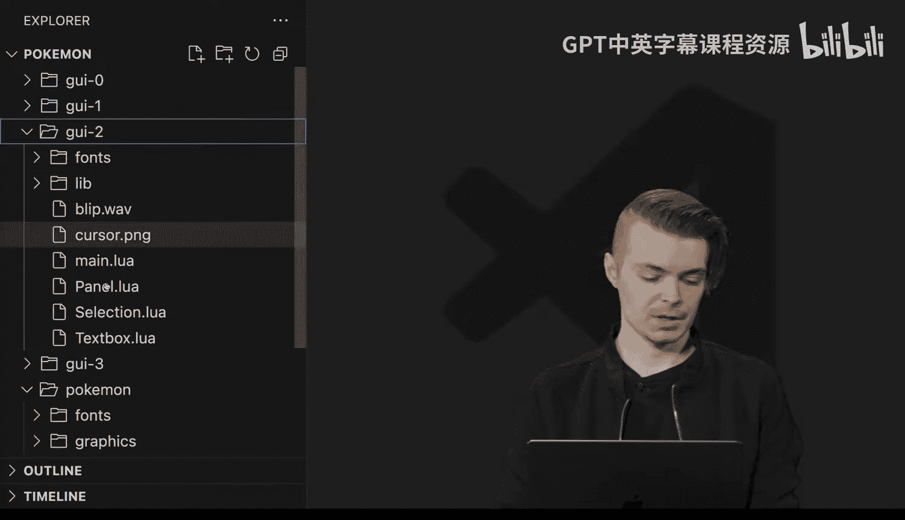

And then let's go ahead and run GuI2。So folks might notice here， I do have a menu。

Which is sort of wired up also with the sound effect from the game as well。

 But notice that we have four options。 We have a red， a green， a blue， and then a quit option。

 So as folks， my guest quit does indeed quit the game。 So I've got behavior wired up to the game。

 And then if I were to。

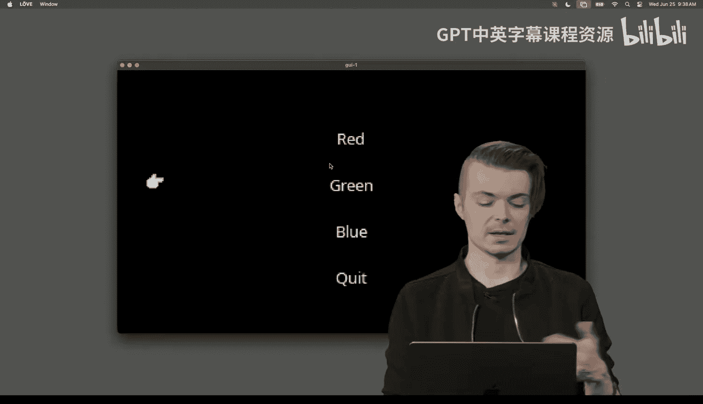

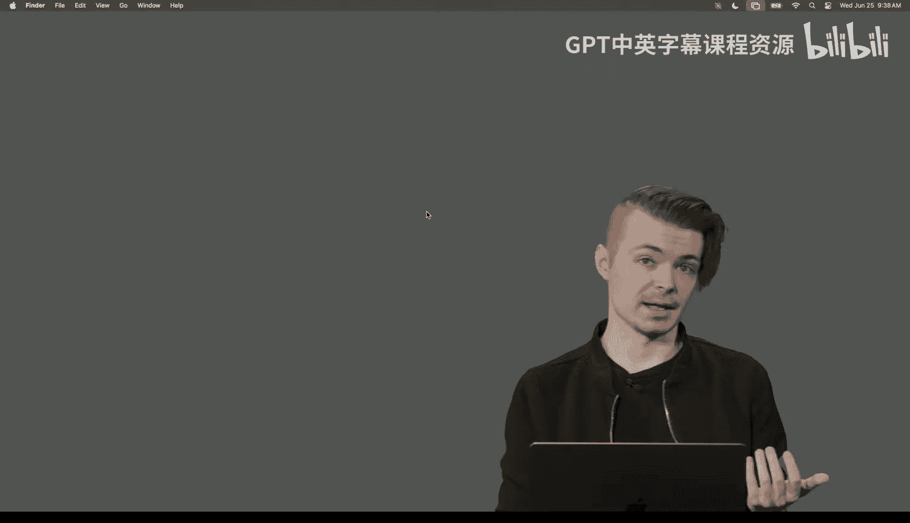

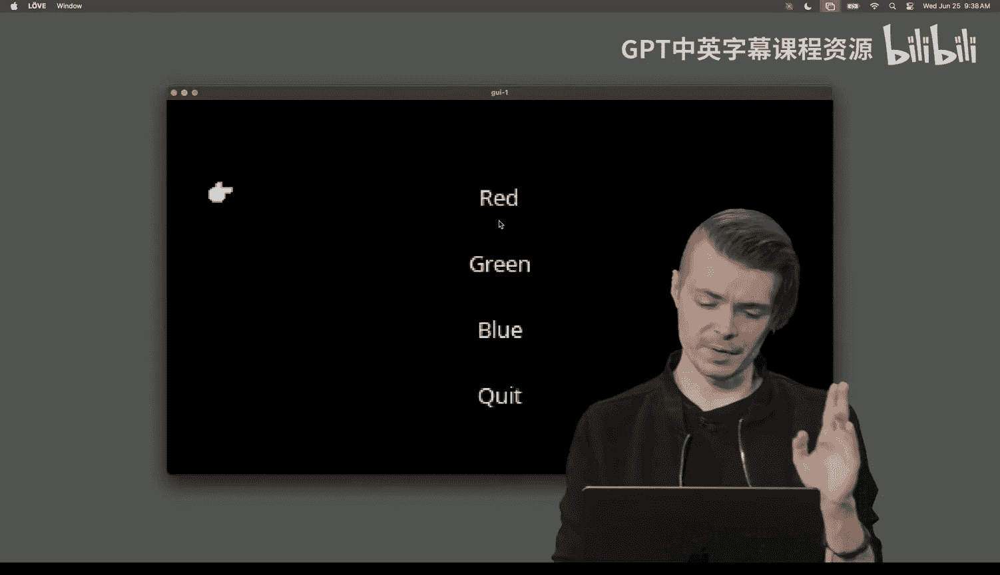

Reopen this and then for example， folks might be able to guess what's gonna to happen here if I click on red。

 we do indeed get red set as the overall clear color green and then blue and then quit。

 so we're affecting the world， we're affecting the game in some way based off of this menu that we've created。

 It's still a text box kind of and it doesn't have a panel in this example what we are using here is technically we're calling it a selection and we'll define a menu is being a selection that has a panel underneath it that effectively is being rendered therefore like a menu in a game might have a panel behind it。

 but the core of what's on top of that we might just call a selection and that selection is going to have varying options which we can click on or select and then on select there will be some sort of maybe anonymous function that we can wire up that perform some operation does something in our world that affects other things outside of the selection or the menu。

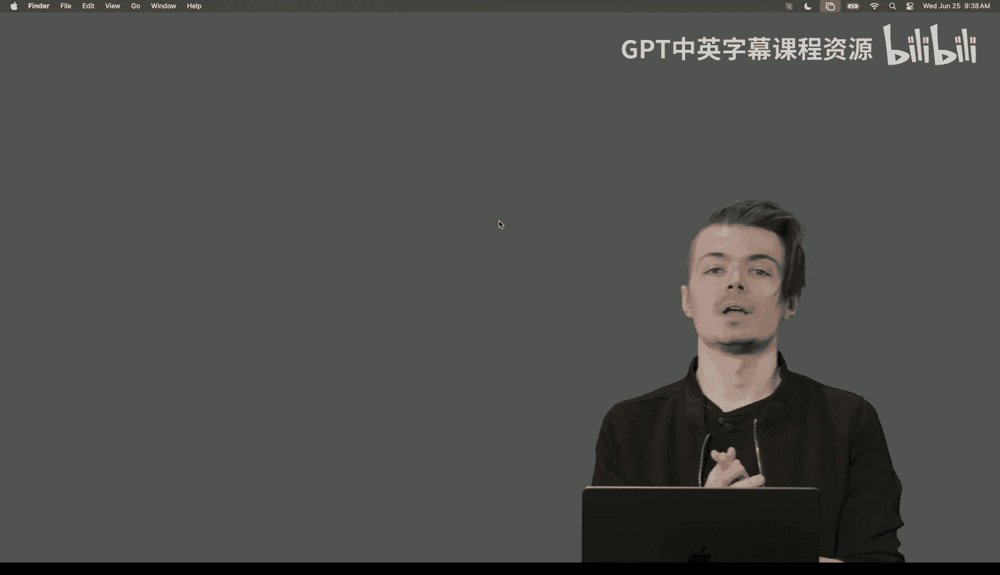

So if we go ahead and look at main here and I come down here。

 we'll see that we do indeed we have textures and sounds and whatnot that we've wired up just to get the example to be a little bit more sort of visually interesting and also feedback provides some feedback but notice that we have this selection we're passing it in and instantiating it with a table which again I believe we talk about this previously but just in case if you pass in just a table instead of instantiating with parentheses it's effectively the equivalent to calling a function or constructor with the parentheses and the curly brackets。

 so in Lua you don't have to call if your first and only argument is a table you don't have to pass in the parentheses。

 so that's all that this means here so effectively going to pass in a table which is a definition which is going to have an X and a Y a width and a height and then it's going to take this items field and this items field has two elements on each one being text so what it should render in that selection and then one being the onse。

Callback function， which is similar to some of the things that we've looked at previously with game objects and the like。

 but here we have this onselect callback function， which is again just an anonymous function where we're going to set some global variable BG to the table of 10。

0 here for red， green， blue。 so this is just going to be full red here for green It's going to be set to 01。

0 for green and then blue 0，01。Notice that down here， we can see that we are calling love。graphs。

 clear， which will clear the screen， fully render it with assuming nothing is being drawn on top of it with either BG should it be defined or 000 just full black which is what we started with when we ran the program notice that we are calling selection update and selection render so if we go ahead and open up selection here。

It takes in that item's de or takes in a de rather where it can get items the X Y width and height。

 a font as well， should we pass one in and by default it'll be just G font small。

 which we've defined in our main dot Lua theres a height based on how tall the actual selection is and then divided by the number of items so there will be a certain gap between things dependent on so it actually uniformly distributes the selections items within its container。

And then we're just going to instantiate whatever the current selection is。

 we need to know which the current selection is so that we can render a cursor onto that particular item to its left。

 and so if we were to press up or down， we will shift the number of our cursor。

Playing sounds as we do so。 And then if we press return。

 we're just going to at self items at index self current selection。

 just call that on select function。 And so whatever that does。

 it doesn't really matter to selection itself。 it could be anything we want to but folks might be able to therefore draw the conclusion that in Pokemon when we do the menu for example。

 fighting to trigger on select is just a function that's going to trigger some sequence of events where one Pokemon depending on their speed is going to attack another Pokemon and then you're going to see the animation and the H sort of decrease and then same thing for run if you were to run is's going to trigger a transition to a different state back to the field state but through a different sort of operation and it's the same exact logic that happens there。

 it's happening here in selection we're changing the background color with that function instead of doing something a bit more grandiose And so we can render it just by simply iterating over all the items figuring out where the y should be based on the gap height and then draw the cursor should we be at。

I being self current selection in our loop and then we'll just draw the text as well and that's the justist behind what a selection is text being drawn。

 a cursor or some visual indicator you could certainly highlight the text in a different color which we did a similar version of this implemented a little bit less robustly for something like breakout at the title screen where you had start game and the high scores you could go between the two of them and then that would effectively accomplish the same thing as this only those were not as implemented in as sort of customizable a way looking to the future for other gooys This is meant to be a replacement or a drop in widget that you could incorporate into any sort of。

Pece of your game to accomplish the ability to select things and have the selections affect the game state。

And so lastly。That was the panel we looked at then a text box and then a selection。

 I'll say that a menu is essentially just a selection on top of a panel so we won't have to necessarily look at an actual example for something like that。

 but the last remaining goi piece is as folks saw in the battle a progress bar and progress bars is are omnipresent in the web and things like that especially for loading indicators and such but they're also used for things like HP and for just overall stats and things that go down that you want to be paying attention to in a game that can be used for all sorts of things we'll be using it for HP and X Xp being experience points or sort of this value that represents how close you are to gaining a level which means fear level 5 you' go to level6 and then you'll get stronger and then in the actual Pokemon game when you get to like level 16 or 32 or something depending on which Pokemon it is。

 you will evolve and turn into some more powerful typically larger。

 more fierce looking or more sophisticated looking Pokemon。

We won't have evolution implemented in this problem set。

 but we do want to look at what a progress bar looks like， and so I'm going to go to main。

t Lua in GuI3 and I'm going to close all other examples here， I'm just going to run this。

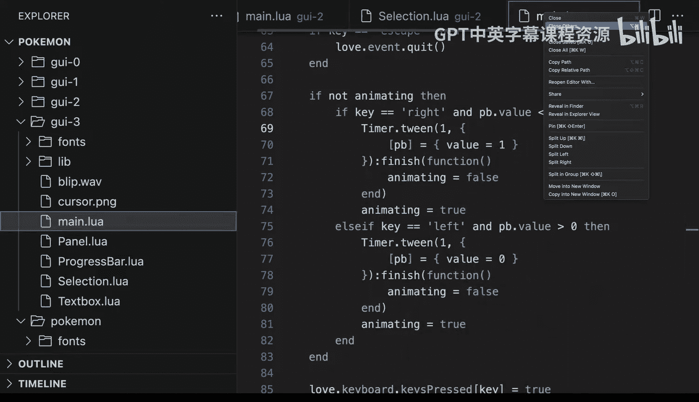

And we'll see that we start with this sort of gray background with a dark progress bar sort of simply filled。

 and if I were to press right。Notice that it fills from left to right in green， going from0。

 effectively zero to 1， and then forward to press the left。Again， from one to0。

 we have the progress bar now going in the opposite direction and if we just think about a progress bar as having a max value and an actual value。

 then we can determine whether from0 to that value。

 how far we should render maybe this inner rectangle。

 if we imagine having this outer rectangle being again another sort of like border radius rectangle that we're drawing just line rectangle and then a fill rectangle inside of it that is drawn with its x sort of direction or x its width scaled based on whatever that max or current value happens to be。

 we can then as folks might be able anticipate use something like timer do tween to tween that width to sort of up to the value of one times that multiplier of whatever the max value is to give us this transition over time rather than hard setting。

 maybe the progress bar， typically progress bars are more fun when they animate versus when they just are there。

 So this gives us the ability to do just that。 So let's take a look at what the。

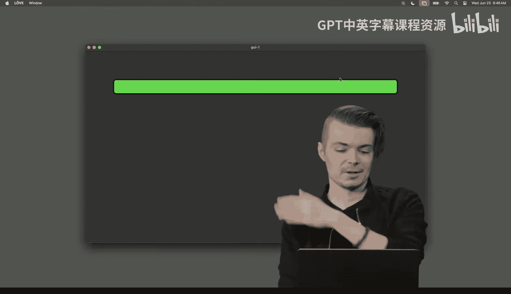

Progress bar itself actually looks like if to come up here。

 We'll notice that we are defining a progress bar as taking again this table definition。

 much like all the other gui examples we looked at X Y width and height a value to start with。

 So this will be whatever the actual value of the progress bar is a max value。

 So we'll just say we're going between 0 and1。 but this could be 0 and any value that we want if we're dealing with Pokemon that have 30 Hp。

 then you'd want this max to be 30 or if we had an Xp that you need to level up。

 This might be maybe you need 150 Xp before you level up。 So this will be set to 150。

 then a color we can make it whatever color we want to。 So folks might have noticed we use red for H。

 you could use green for H。Different RPGs might use blue to represent magic points or Mana。

 and then they might use in our example we used blue for XP， but you could use any color。

 you could use gray， you could use whatever color you want to。

They typically will have a different semantic purpose。

 so well offer the ability to customize that color here and then a text and a font should we want to render。

 things like that。Label and so on。So if we are animating and this is the gist of this main outtlua here。

 this is where essentially we're going to kick off based on whether we're pressing key left or right to trigger a tween from min to the max value or max or from whatever the actual value is to its max value。

 which is what we do we pass in PB in this tween syntax which we've seen before。

 over one second PB's value will set that to1 andB's value will set to0。

 if we press right or left successively， and then because the max value we defined as one that' will have the effect of transitioning the actual when we render it assuming that we're rendering the value based on the max value。

We'll look at the actual progress bar to see how it gets rendered here。

 but that'll have the effect of rendering a portion of it and tweing that value over time。

 You'll notice that we have the render width， which is right here。

 it's the value over max times width so that will just ultimately be some sort of multiplier between0 and1 So if it's0 over1 it will be0 and our value is actually one it will be sort of one it'll be just a multiplier on width and it'll fill the progress bar and we'll set the color here to the actual color that we set in the progress bar and then fill the rectangle based on that render width and will also curve it just a little bit in addition to the actual line rectangle we want to draw around the bar itself and that's the overall gist the actual inni function here as you can see isn't all that interesting it's just a initialization function just takes whatever the definition is and set those as member fields here but then we also have a set max and a set value function just as a couple of set。

Should we wish to use those， and that's justist on how progress bars work in our game。

And that overall is all of the core GuI components that we will use in today's lecture。

 but I thought it would be fun to do a little bit more than that。

 which we'll take a look at in just a second。 but first we want to take a look， I think。

 at statets because this will make the example clear。

 And this is also the other big element in today's lecture that we want to talk about a state stack being so far we've talked about state machines。

 which is just a way of representing some state that we're in has a transition to some other state based on behavior。

 So if we're Mario and we're ducking and we press spacebar or we let go or we let go of the key down。

 we jump or if we're idle and we set we press left or right。

 we start walking and those are different states。 and those are different transitions between states。

 but we can only be in one state at a time in that model So in a state machine you're only ever in one state。

 You're not in multiple states。 You're not walking and idle at the same time。

 they're mutually exclusive states of existence。 same thing for the game so far。

 the game states that we've looked at you're either in the play state or。

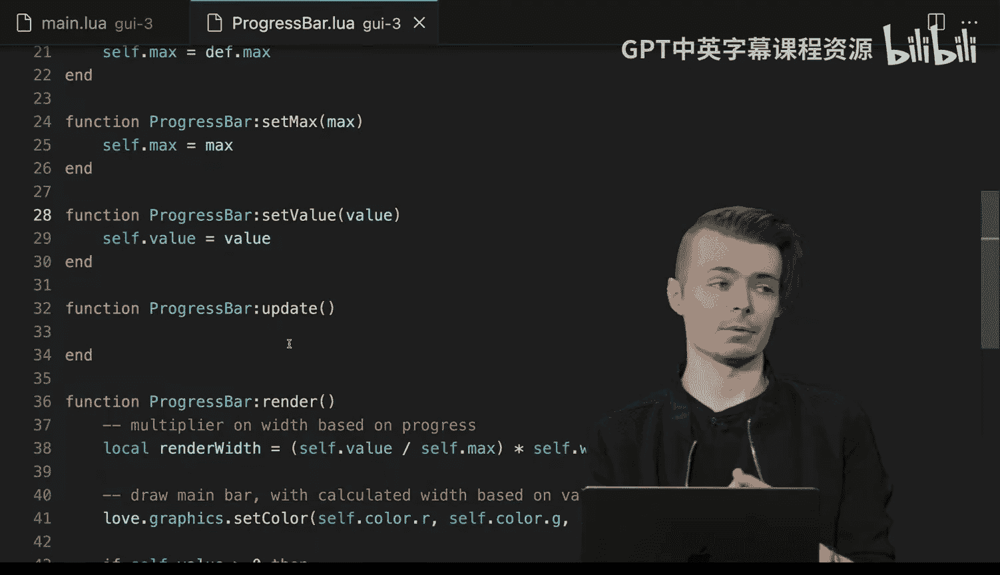

Serve state or whatever state， you're not in both of them at the same time。

 which wouldn't really make a lot of sense， but games are unique in that you often are sort of putting certain states on hold and for example。

 folks might think of like pressing enter or spacebar or escape。 you pause the game。

 and often it's the case that you see a menu but you can also kind of see what you were doing in the game in the background。

 and that's not really possible if we envision this model where you have a state machine that's transitioning from one to another state and recall。

 they're all like being spun up and instantiated in these anonymous functions that were only being held in one reference to one state at a time in our state machine and so how do we go about accomplishing this idea of having。

 for example， a pause state that's different from the play state but which can render on top of the play state while the play state doesn't do anything doesn't move it's like stays pause。

 we accomplish that via what's called a state stack instead So if we just think about actually taking a state。

And then stacking a pause state， for example， on top of a play state directly， well。

 now we've got two states and if we were to just only update one state， let's say the pause state。

We recall call anything only moves if we're actually updating with Delta time。

 so if we're not actually updating the play state， we could hold it in memory and nothing's going to change。

 nothing's going to update。

And then we can instead focus only on the pause state， which might move。 It might have a menu。

 It might have a menu of resume game or options and quit and so on and so forth that we can move back and forth between and select options and still see that get that play state in the background。

 And so what we can do if we just layer on this new state only update that state but render all of the states in order that they were pushed onto this stack。

 Well now simply you can see all states as they exist while being only able to update maybe the top state。

 maybe multiple states if you want to， if you want to have a couple of states that still move。

 maybe certain parts of underlying states can move independently。

 we won't get that sophisticated today will only show a relatively simple implementation of this。

 But with this one tool we can now do a lot more sophisticated rendering of UI and game states in a way that feels more robust and true to what most games typically do。

 So with that， let's take a look at what state stack are and what they look like how they're implemented and then look at a fun。

Implementation example。

So I'm going to go here。And this is going to be in stack。 So before I run stack。

 I'm going to first show what a state stack looks like。And it's quite simple。

 It's very similar to a state machine。 at least the state machine class that we used previously。

 notice that though we now have， instead of whatever the current state is。

 we now have a states table， which is going to have multiple states that we can store inside of it。

 we'll have an update function， So if we don't have any states we don't want to try to update anything。

 but assuming that we do， we want to just render whatever is at the end of states。

 meaning whatever we insert into the table is going to go to the very end and this is how we're going to approximate a stack based behavior。

 So when you insert a new thing into a table， it's going to add it to the end。

 and then when you remove something from a table or pop it off of a stack as the term independent of Lua。

 it will remove it from that same endpoint。 So whatever you add in。

Will be removed out on the next iteration， first in， first out， in other words， PIO。

 which is how stacks behave。And so what we can do。Is if we just set it to only update whatever that number of self dot states is in that self dot states thing。

 well now we can， even if we have a bunch of states in all the indices up till that last index。

And we don't update them。 They won't change。 They'll stay in the exact state we left them in。

 and so we can sort of think ahead in terms of how that might allow us to do things like pause screens and the like。

 same thing with process AI， which isn't all that dissimilar to the update function which we used previously。

 but notice the difference， the key difference here is that rather than rendering just the end state now。

 which wouldn't be all that different from the previous state machine。

 although it would allow us to maybe have the preservation of prior states。

Is that we're rendering the entirety of our stack in order from the start to the end。

 from the oldest to the newest， meaning that if we start on a play state。

 we open up a menu and that's its own state， it's going to render on top of whatever was below it if we're in the field。

 for example or if we're in the battle and so if that's the only one updating that gives the effect of the menu is going update but the background will stay frozen which might be exactly what we want。

 and again， it might not be exactly what you want depending on the game。

 you can get more sophisticated and have certain states flagable as being updateable even in a stack and then you can do some more sophisticated logic here and update rather than just rendering only or updating only the last one。

 but for today's example just to illustrate the concept。

 we're going to do a simple implementation and so pushing will indeed insert whatever that stack whatever the state is that we care about and notice it takes a state So we'll just be able to instantiate and pass in a raw state。

 it'll push it to self states called enter on it， and then we're going to pop by just doing the exact same thing。

Essentialsently calling exit on whatever is there at the end and then removing it from ourself do states and so with that example now we can sort of entertainingly。

 I'm going to run this code and we'll see what we can accomplish with this。

 this might take folks to some eras of perhaps the 90s or 2000s on the internet if they were to sort of not be careful with their browsing。

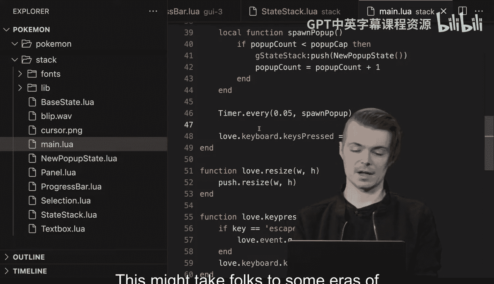

You might see something that looks something like this。

Or perhaps a computer of somebody who accidentally stumbled upon a virus or the like。

 And what's kind of fun about this is that these are actually all states。

 These are 100 states that are being instantiated onto the screen。

 they're all being rendered but only one at a given time is actually being updated。

 So notice that we've included or label at the top left to show us just how many stack states we have currently we have stack size of 100。

 And so we're using Lm Ipsom text here if I press enter。

 we'll notice that one of them gets updated right until finally it's going to close and then and then it gets popped off and notice that now we have 99。

 And so you know I could sort of。Almost fruitlessly， depending on the virus。

 you might have more states that are kind of being added to this so quickly that you can't evenclose them right。

 but this is kind of the trope for I think of old Windows XP or Windows 98 or the like。

 but this is a nice effective illustration of just how robust。

 you can get certain interesting visuals and updated mechanics in your game now not just being this mutually exclusive。

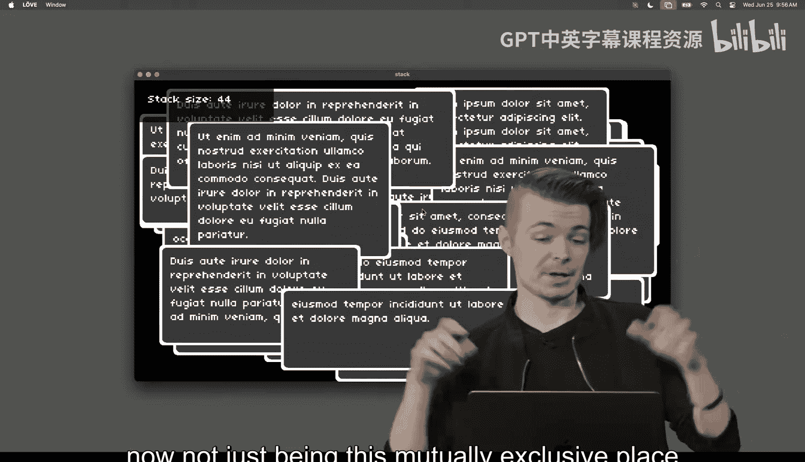

Place where you only have one state at a time。 now you can have。

As much memory as your computer holds worth of states effectively Now， typically in practice。

 you probably won't have more than a few， you might have a play state or a field state and then a menu and that menu might pop up some additional menus。

 and maybe you'll have a depth of 10 to 20 at max typically you won't go to 100。

 but now you could very easily do that and you could implement very robust UI in this way that have sort of this ordered priority of rendering。

 And again， you could implement more sophisticated ways of rendering and updating multiple states at the same time。

 rather than just updating whatever is on top of the stack。 But here for right now。

 we're just focusing on whatever is at the top of the stack。 So if we go into here。

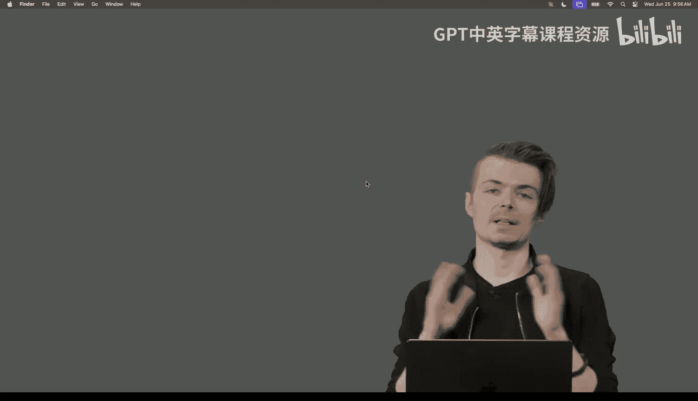

We'll notice that we have created a state stack here now instead of a state machine。

 we'll call it G state stack， we'll say we have a cap of 100 states and then we're going to create this little function here that's going to if we're less than the cap。

 if we call it spawn pop up， we'll go ahead and we'll push new popup state we're going to instantiate a new popup state onto the G state stack directly increment our count and then every 。

05 seconds here again， a great use of timer do every which we've seen before。

 we will then pass a reference to that function， spawn popup so again you can use either anonymous functions or and we could have just done that directly in line and you can also define them as a function somewhere with a name and then pass the name in just like this and what that effectively is going to do assuming that we then call very similar to previously this instead of calling G state machine update we're calling G statet update and then G statet render and then some additional logic here just to make sure that we display the number of states that are on the screen。

This new pop up state does exactly as you might expect。

 we're going to essentially define this sort of random set of lipum text that I found in a table。

 it'll choose between any one of them， any number of times between two and five。

 it's going to add that as it's going to concatenate that as a string rather using table。

comca which takes a table， and then for every element it will concate all of its members to be with this separator in this case of space。

So we can then just define a text box with this text， random laum。

 and then xY with height with that text as usual stuff we've looked at with text box。

 and then what's kind of neat here too， which gives us the ability to actually remove these states from this stack to allow us to get rid of a text box is going to be。

When the text box is actually closed， which the text box has an update function。

 just like any of these other GuUI elements， which sets closed to true if we were to press spacebar and close it at that point。

 we will then pop whatever the highest state is going to be which in this case is going to be this new popup state and so therefore we can pop ourselves off depending on how you want to look at your code if you're going to pop a bunch of states or push a bunch of states as we look at in the actual Pokemon source code our Pokemon source repo main repo。

 there's going to be lots of examples of this， but this is an illustration of how you can sort of get this pushing and popping in order to affect changes and to move from one state to another even in this stackbased model and so therefore not just render one menu or one state but rather now we can render hundreds thousands if we wanted to of these little essentially micro states now and sort of break our game up into pieces as a kind of fortunate byproduct。

Okay， cool， you get a beverage。So with that， we've essentially looked at all of the new topics that are primarily of interest to us right now。

 at least in terms of primarily the new code related things， although we do need to take a look at。

 for example， the RPG mechanics and the overall turnbased structure of Pokemon that is unlike some of the things we've looked at before。

 as well as do a general look at some of the code that is in the main repo itself， the main。

Actual part of the lecture and problem set。 I'm going to go ahead and close all these examples。

 and then let's open up Pokemon again。And not much in here of Maine Dt Lua is going to be that different。

 although folks will notice we do have a state stack。We are pushing a start stack onto the stack。

 and so this model is different slightly than what folks are used to probably in the examples thus far where we have G state machine change to this sort of like toggle operation between one state and another。

 we're always pushing stack rather states onto the stack and popping them off whenever we are trying to transition back to something else。

And so it's just a slightly different mental model。

 but altogether everything is relatively the same in here。

 everything is just being deferred to the state machine and the state stack rather。

 we are still using state machines for entities and the like because those are still ultimately these sort of mutually exclusive states。

 we don't need to have multiple states of an entity certainly you could do something like that if you had an entity with various parts that might behave in particular ways or layer on top of each other and still ultimately have some kind of a behavior or a graphic that needs to render but we don't do anything like that in this example we will still be using state machines just for those we won't spend a ton of time looking at the specifics of that。

But if we look at the start state， if I go over to our states here， everything is still in game。

 we notice that there are quite a lot more states this time and we'll take a look at these。

 but the start state is ultimately still just a regular state。

 we have an intro music folks might remember if I go ahead and start this up and play this。

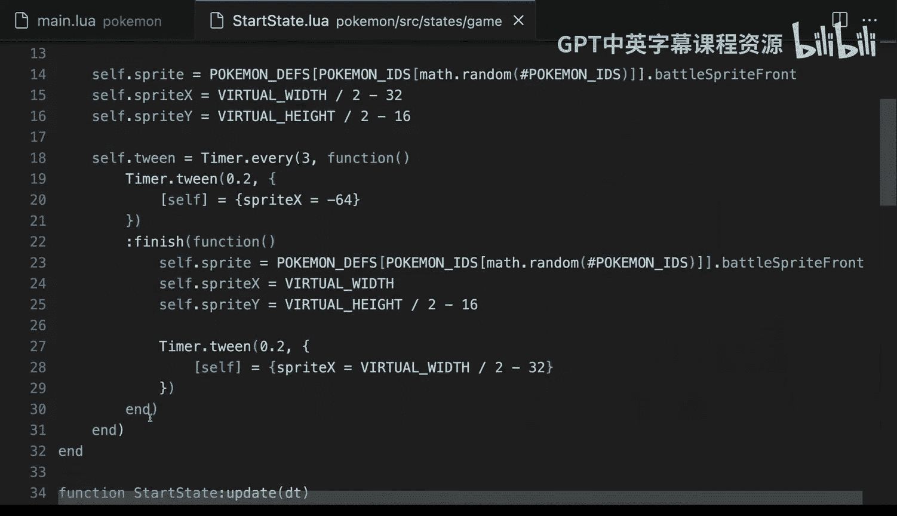

We've got this sort of this is a characteristic of the I think this was used in several iterations。

 certainly it was used in red and blue， which was what I grew up playing and I don't think it was used in gold and silver but red and blue for sure where you have these Pokemon moving left and right and then this is sort of what the start state is and then to walk through it just really quickly notice that we do a fade to white then a fade out from white to the field state notice we have a dialogue here at the start。

 this is its own state so with press enter to dismiss it。Which pops off the stack。

 and then now we're in the field if we move through the field here。

 we're just moving and then an interesting thing to note too。

 and this is a part of what makes a J RPRPG sort of。

This might have been common even as far back as Uma， though I believe Utima was。

🎼Smth in some of its iterations， but certainly it first early ones were grid- based。

 but JrRPGs tend to be grid-based movement as opposed to continuous movement。

 which is what we looked at previously and most of our other examples。

 but if you go to like final fantasy or dragon quest these old school Japanese RPGs or Pokemon you'll notice that if I move up for example。

 I'm just gonna press the arrow key wants and he continues to move in this sort of discrete motion and this is not uncommon。

 the world is sort of conceived of and thought of as grid more so than it's thought of as this continuous sort of and this probably has to do with early hardware limitations。

 but it became a sort of traditional facet of JrRPGs。

 which is that at least in classical style JRPGs you move in a very fixed grid-based fashion And so if I move this way you'll see the character does indeed move And so what we can do is we can essentially just say okay if you press left right up or down tween your position be this animation but don't stop and don't take input。

 don't treat input until。You'veAived at what is that tiles offset times。

 whatever the Xy of that grid tile is， times， whatever its pixel value。

 whatever the tile size ought to be to get its pixel value。Transitioning it。

 translating it to zero based pixels， and so if I walk through the grass。

We'll notice eventually and this is random， just a random chance。

 we pop another fade state and then we have a， again another state here with a couple of dialogues。

 these are battle messages， battle message states。We have a menu state here， so if I hit F。

 we then go into the attack the take turn state， which is kind of like an attack or a fight state。

 so in the take turn state we'll see that a couple of operations happen。

These are sort of like timerbased operations so after a certain set of time， do this animation。

 blink a certain number of times， do another animation， blink a set of times。

 choose whichever goes first， whichever goes second。

 and so once that's finished then we pop back off or back into and then we pop another menu state back onto the stack and then we just do this over and over again until eventually the goal is that should we I'll illustrate it here。

Should be able to win this fight， it looks favorable for me。We're just right at the cusp there， okay？

So we put a message onto the stack， and then we're going to do a transition。

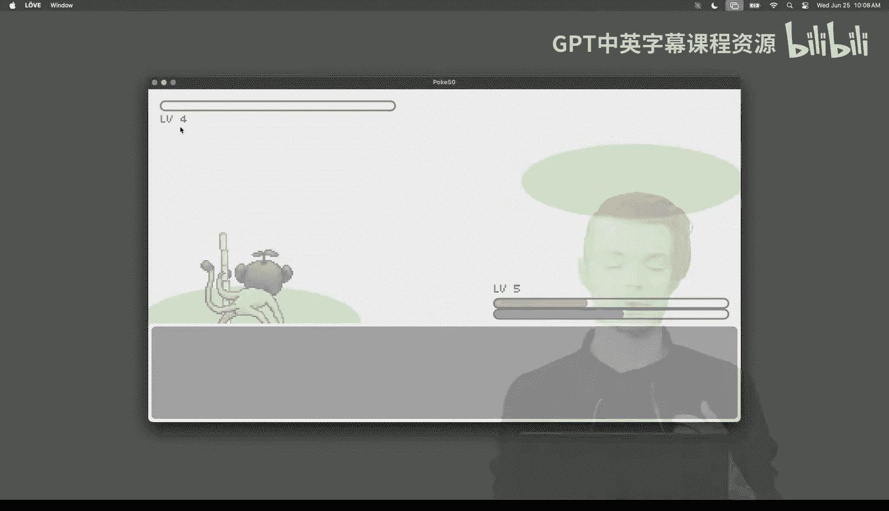

🎼After all we're gonna to do the XP first because we want。

 and then we're going to essentially it's hidden its sort of invisible but what we're doing is we're fading and then we do several pops off the stack because we have the battle state。

 we had that message state， we've got a fade state that's on the stack at that point in time so we have to do several pops there But if we do pops of all of those states。

 we get back ultimately to where we were before we left。

 we're in the same tile that we were there previously， this hasn't changed。

 we're not reset for example， when we instantiated to start with we have the dialogue that was there So we're preserving where we were but we have to think of things a little bit differently。

 we can't just change from field to from field to battle or battle to field or attack to not attack things have to be popped and push off and so we have to mentally keep track where are we in the stack at this point in time。

 and especially when we deal with sort of these asynchronous things happening。

 it can be a little bit of a balancing act and you have to make sure there's no bugs in your code。

 when you're doing this because if you were to accidentally over pop a state。

There's not going to be any states left， the field state， Once the field state's gone。

 you're essentially finished in the game， you have nothing left in the game。

 no more states in the stack and you just see a black screen。And so。If that happens to you。

 if you just have a black screen， you might have over poppedpped and if you're stuck in a state in a way that you feel like doesn't make sense。

 like it's waiting for something to happen， you might have under poppedpped states as well。

 or overpo in a different context。 and so that's the only differentiating factor here that can be a little bit tricky to fully get used to。

 which is this idea of asynchronous state popping based on time。

 which is common in a game like this in an RPG where you have animations taking place that have to exist that have to once they're finished。

 resolve and then maybe you knock at your opponent or they knock you out and you have to go to a different place。

 make sure that these things after a span of time occur in a very well managedage。

 very organized way。

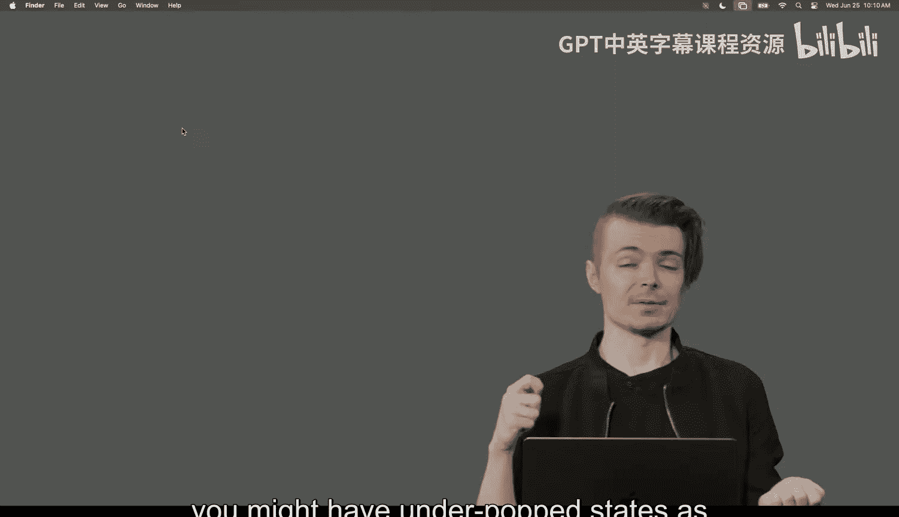

So the start state。Here is such that every three seconds here， we're just animating some。

Characers back and forth on the screen， these sort of fake Pokemon which are taken from an open source version of Pokemon folks might notice that there is a Pokemon defs constant table here with some IDs。

 if we go ahead and open that up， I've titled it Pokemon des here in the source code， which is again。

 data-dven design， we talked about this before， we don't want to necessarily think about the specifics of this。

 when we're loading in a data set， especially now that we are actually using these values in the game for a meaningful way that's not just rendering related。

 we have the name of whatever that fake Pokemon ought to be。

Spite for its front and its back because recall in battle， we have the back view。

 we see the front view for our opponent， we see the front view for the start state。

 and then we have these actual sort of base stat values。

 which will be where that Pokemon begins with its values。

 There are these things called stats in an RPG that determine how much damage do I do against an opponent that has a certain defense。

 I have an attack， They have a defense。There's a math involved that calculates what the damage result should be。

 Should the attack go against the defense value， there's going to be a resultant value。

 and it should be no less than one。 We should at least be able to do one point of damage to an opponent。

And then we have these things here which are called IVs， which we haven't talked about。

 which are actually part of Pokemon， which are these sort of individual values as they're called。

 which are essentially just a reflection of your Pokemons。

 almost DNA in the sense that it reflects how it's going to over time level up and change It's going to essentially be this value that we test against randomly and should we randomly generate a number that is less than that number it's going to evolve it it's going to increase its damage and so the higher the value of these IVs is the more that stat in particular is inclined to level up throughout all of its levelups and inclined to increase per level up and so this is often a thing that people that play Pokemon like to do。

 they like to find Pokemon that have particularly good IVs for their Pokemon and then evolve them or grow them over time so that they relative to another of that same Pokemon will be stronger at some level in the future and that's effective what we've modeled here and we've done it in data don。

To worry about that in our source code， we can just say， okay here。

 take this definition and then when we instantiate an actual Pokemon we can look okay what are its base stats。

 what level should it be， okay we're going to multiply its level times the IEV calculation to get its final stats and then therefore every time you level up that same operation will take place and then over time that's how you get leveling up and getting stronger and stronger and then that core loop of going through an RPG and being able to defeat and surmount higher and higher difficulty obstacles。

So in the start state， we have that being used here just for the sprite itself。

 but this will actually accommodate the instantiation of the actual Pokemon as well。

 so what we're doing here is we're pushing a fade in state when they press enter。

 there's not really a whole lot going on besides the animation。

 there's a tween occurring from the Pokemon going left to right or rather right to center than center to left and then that just allows you to see this sort of like slideshow of some of the species that are in the game but what we want to do if they press enter is previously we had this idea in other games and we started it with match3 where you have this rectangle on the screen in whatever state it is that you want to transition to some other state and while that worked and it was fine。

 should we decide okay I want to transition this state to maybe a different state with a different color or I don't want to do this kind of a transition。

Having a coupling of your state of your transition states to your actual you know be it the title screen or be it a play state or whatnot isn't as ideal as maybe being able to think of that transition as its own state we can think of rendering the underlying state the underlying title screen and then pushing a transition actually on top of that state on top of that existing state so we'll look at fade in and fade out real quick and here we're using the semantic of fade in as in fade a color in to full from zero so if we have some RGB color that we want to fade into fade into red。

 fade into white we're going to essentially define it in this instantiator in the actual constructor and then over some period of time we'll just do this tween operation and then notice we're just callingP it will pop itself off using that finish function which takes the anonymous function and then it'll call this on fade complete function and this is a very common theme in this kind of programming where。

You just have lots of callbacks and this is common in web as well。

 you have lots of callbacks and GuI programming is very callback driven。

 very famously event and callback drivenri so we'll pop our this state off from the stack assuming that we'll always sort of assume that this is the topmost state and then we will call onfade complete afterwards so we can pass in if we look back at our actual last file which was the start state notice that it takes in this function so we have a time that we want this to take place over it's going to take place over a second but then we have this function where after we fade in we're going to stop the music。

Were going after we fade into white rather。 So we're going to be a zero opacity。

 We're going to fade into white。 So there's going to be completely white screen in this new state on the stack。

And then we're going to remove the tween operation that was in this file for the Pokemon themselves so that we don't reference it and have a crash later。

 We're going to then pop the start state itself off the stack So there will no longer be a start state but we're going to push now the play state。

 So we've essentially accomplished the transition between the start state and the play state by just popping the ladder and pushing the former。

 And then as well notice that we had the dialogue state and we started the game and only when we started the game we're doing that here by pushing this new dial state which I will pause it as just simply a wrapper over a text box that has the same enter button。

 the same toggle operation that we saw previously and then lastly if we want to fade out that white color to like to zero opacity that remember we popped that we pop that ourselves in the actual fade in state。

 So we created another state called fade out state， which given this。

RGB here will over one second fade itself out and pop itself off after the stack after one second has gone by。

 so we preserve that appearance as if we are fading to white and then fading back out towards the new state towards this dialogue state being on top of this play state that is then ready to take input from the user and so all that to illustrate now the paradigm within which we're now working。

 which is the stack-based approach and transitioning states back and forth to each other。

So in the actual play state， we'll notice。We've got a level and this level is essentially just a tile map。

 nothing too fancy that we haven't looked at yet。And then there's going to be dialogues that can be open depending on if we faint and so what we want to do is or rather if we press P to heal our Pokemon。

 which we didn't take a look at， you can actually heal your Pokemon for debugging purposes。

 but also just to illustrate a having an actual dialogue state that we can pop ourselves back onto the play state from within it。

 you can press P that will open a dialogue and then therefore you'll be able to heal yourself and also test dialogues。

 but it's a pretty simple state altogether， we're going to go ahead and take a look at level。

And here's also an example of something we haven't done yet before。

 which is we have not had multiple tile maps rendering。

 but folks might ever called and I'll in fact rerender it just to show you。But。

🎼If I test exactly what I just described， we'll notice that we do have a couple of tile maps rendering。

 so it might not be obvious at first glance because the color is kind of blend together。

 but we have the green tile map of sort of light grass up top。

 and then we're actually rendering two tile maps such that the tall grass is rendering on top of in its own map that lower underlying grass。

 And the reason for that if we were to look at the graphics here， we'll see。

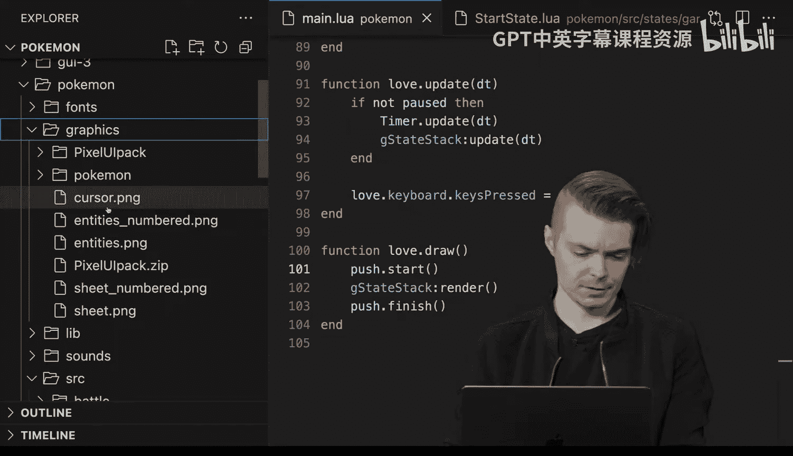

Open up graphics here。To our sheet。Well notice。That the tall grass doesn't have an underlying。Color。

 and that's probably by design such that you could choose if you wanted to to maybe render this grass on top of sand or something or some other texture that might not necessarily be this specific grass。

 and so sometimes it's better to often have these transparent sort of tile slash obstacles that might be the same pixel with as the rest of your things but if you're rendering a tile map and there's only one map。

 then the opacity obviously isn't going to be great。 It's not going show through。

 it's going to look like black if anything。 And so what we do is we essentially just render a full tile map of regular grass randomized grass between two different tiles。

 there's a couple different variance here。 and then an additional map that then renders that very grass that very tall grass which we can then test for when we're walking around And so if we go to play state rather if we go to level again which I should have still open here。

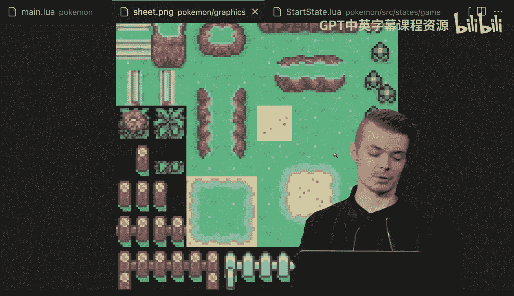

We will have two layers， a base layer and a grass layer。

 and so you can render as many tile maps as you want to achieve varying effects。 This is common。

 you can achieve depth this way too if if you don't want to mask necessarily like we showed last lecture and you instead want to have a rather in the Zelda lecture and you want to instead have a texture that or a map that renders over wherever your player is like some big archway or something that you know the player is always going be underneath in the game。

 you could just render that on top of the player and just have the player be rendered between two different tile map layers。

 that's another approach that works quite well for a situation like this。

 but notice that we do have a player with a state machine。

 a walk state and an idle state we then create the tile maps with random Is。

 given we want two different variance potentially of the grass and then we just render the base layer and the grass layer and a tile map is essentially just a very lightweight Xy rendering of a two-dimensional tile grid。

 nothing that。haven't really seen thus far a tile is essentially the same thing， has an XY at an ID。

 renders itself at tiles at ID， all sort of just like nice and cleanly encapsulated as classes here。

 so we're going to close all these examples since there's quite a lot currently opened。

And then we'll go back to the play state here。Or rather， sorry， let's go back to level。

 So what's important here is when the player is moving around。

 this is the point at which we want to transition。 This is the mechanism by which we want to transition to。

The other main part of the game， which is the battle sort of state。

 the battle overall system and to do that recall is whenever we're moving through tall grass。

 and so if we're moving through regular grass， it's fine whatever we can walk forever。

 if we're walking through tall grass there's some random chance that we will trigger an encounter a random encounter at which point and there's just some number every time we take a step So math do random calculation should we trigger an encounter。

 well then we have some states again that we're going want to push onto the stack and then render and then start to transition So let's go ahead and look at the player walk state is where in particular' going to want to look at and the player again。

 it inherits some entity behavior so if we look at entity walk state for example。

 there's left right up down movement， we're going to have a two x and2 y we're going to try to move to。

 it's going to get calculated based on the pixel size times our actual x and y the tile size times the x and y minus1 so that we know pixel Y is we want to move to we're going transition there。

If we are here pressing left right up or down at the time that this finishes this sort of tween of our x and Y。

 which is where that smooth gridbased movement takes place。

 notice that we then detect if we're still pressing a key and then we can smoothly move around if we're not。

 we'll just change state to idle which is totally fine。

 but this isn't where we actually detect for encounters that's going to be in the because all entities there might be NPCs that walk around。

 we don't want NPCs to do that even though right now we have all of the input detected inside entity walk state。

 the player walk state is where we're going to actually take the actual logic for are we triggering an encounter。

 should we transition to the battle state， which is where the encounter begins and so we're going to do the same attempt to move。

As we do an entity where we actually do the tween operation， except if we're the player。

 we're going to at the time that we enter the walk state。

 which we'll recall be anytime we transition from as the same logic that we've used in prior lectures if we transition from idle to walking in the same way that we did in Mario and Zed in and so forth right at the beginning。

 we're going to run this function， check for encounter and so what that's going to do is essentially determine where we are on the X and O Y。

And then we're going to see is there at the actual grass layer a tall grass ID in that that's the second layer。

 there's the base layer in the grass layer。 is there an actual grass I there at at that X Y that we're trying to move to and then is there a we'll do a one in10 chance did we get a one in10 chance being equal to one。

 And if we did that's our 10% chance to trigger and encounter every footstep we'll then set our entity to idle change the music。

 and then here's the same code that we saw before we're just going to push this new fade in state to white。

 We're going to then once that's finished do the battle state and a fade out state So all the same code that we did to transition from the start state to the play state only here we're doing a battle state we're not pushing two states before the fade。

 we're just passing in the battle state and the entity and so that brings us to well what does the battle state look like So if we open a battle state here。

And so some of this will skim over because some of it is relatively repetitive。

 but just at a high level， we have an opponent that we're going to be facing Now this in the actual game Pokemon might be a single Pokemon where you're just fighting one wild Pokemon in the grass。

 but there are also trainers that you can come across other Pokemon trainers。

 you yourself are a trainer， a Pokemon trainer in the game。

 you have up to six Pokemon on your person at any one time。

 part of the problems that will be implementing that feature。

 but you can also come across other people， other not real people although you can fight with real people through certain mechanisms。

 but in the actual game itself as you're walking from place to place。

 you will come across you will cross the gaze of the line of sight of another Pokemon trainer perhaps out in the wild。

 they will challenge you to a duel， they will themselves have one to six Pokemon and you will see who can knock out all of the other players entities characters Pokemon。

 and so that's why we're essentially modeling here， we have an opponent， they have a party。

we're just modeling an opponent that has one Pokemon and we don't have an actual opponent as a trainer as a separate creature or character that gets modeled that could be something you very well could do。

 should you choose to for simplicity we have a single opponent who's got a party of just one Pokemon which takes a constructor it's going to get a random de from that de file that we saw before and then it's going to make it be between level two and six whichs can do some math it can figure out okay this should be have these stats based on its level based on its IVs that we saw before and then now we're ready to fight it we create two battle sprites those being images that come in from left to right and we' reflect what our Pokemon look like as they're fighting each other and the things that will actually blink recall that one would blink one would turn sort of flash white when it triggers an attack one will blink opaque and not opaque to signal that it got hit and those are what we do for that we have progress bar is being used here。

 we have a progress bar with a width and height in particular locations so that it can be rendered as the。

The sort of trainers's progress bar for its health versus our progress bar for our health and our XP。

 So notice that we have the players bar being rendered at a particular height and width and the particular X and Y close to the bottom of the screen。

 The actual progress bar of the opponent is going to be at the top left。 This is common。

 This is standard for the game itself。 It takes in different a particular color again。

 we saw all of this before。 it takes a value and a max and those that these values are not hardcoded anymore。

 these are actually based on whatever the current H is of whatever the Pokemon is in this case hardcoded to one。

 but this could be for whatever current index of Pokemon in the party of the player or the opponent In this case。

 both are only going to have one Pokemon part of the problem set will be able to catch and have a higher number of Pokemon in your party。

 you're going want to be able to take that into consideration。

 The value is going to be whatever the current H is， which can decrease the max or the regular HP。

 The actual。HP will always be static， which is why we set it to Max here。

 and then it the same thing here for the XP bar， we do the same thing only we're using XP to let the progress bars should render depending on whether the creatures have slid in all the way。

 and then we have just all the same rendering code that we saw previously here。Again。

 trigger slide in。 We actually are going to slide in the characters。

 trigger starting dialogue is what's going to actually trigger that like go X Pokemon。

 do all these things， sort of giving a high level view here because most of this is relatively the same and relatively just large。

 This is kind of a byproduct of Guibased callbackbased programming get code that's not all that complicated or sophisticated when you know how the pieces work。

 but it does get quite large，150 lines here because we've got so many things happening。

 We've got all these GuI elements that all have values that need to get set。

 We've got all these messages that have to go onto the screen。

 We've got all these things that have to animate it's timer dot tweens。 It's the state machine。

 the state stack pushing things， progress bars and menus and panels。

 but ultimately it's quite simple at the end of the day。

 it's really just a set of UI elements and sort of behavior that we expect to run。

So the very end here， the last part that allows us to get out of the battle state and move on to the battle menu state which is where we can actually derive some of our core behavior。

 is we pass a battle message state， which says a wild X appeared。

 which you might want to conditionally change to if you're fighting a trainer we then at its callback recall this will function after we finish with the battle message state。

 we're going to push another battle message state which then says go X。

 and then we're going to finally ultimately push after we press enter and close out this battle message state。

 another last state， which is the next core functionality based state。

 no longer doing just visual things， the battle menu state。

 which is going to be able to have a reference to the current actual battle state so that we know what the opponent is。

 and we can keep track of what the values are between us and the opponent。

 we keep a reference to it in the battle state and then will stay there until we pop the battle state so we have a reference to either we have and we can therefore do various things that affect the currently held player and opponent。

But let's open up Ba menu real quick。And then notice that the battle menu is the exact same thing as we saw with a selection only now it's called menu。

 it's essentially just a selection on top of a panel。

 but it is the exact same thing as we saw a selection where you have an Xy width and height Sure as is normal for all of these elements but then you have an items that takes in again text and then these onse callback functions and this is where the core sort of being able to effect the game takes place。

 this is where the actual gameplay occurs albeit simplistically ultimately you're just making one of two choices but it gets more complicated in the actual game itself where you have multiple moves。

 they all have different types， they have different numbers of times with this stat called PP for each of them for PowerPoints that you can allow yourself to actually cast a certain use a certain move maybe 5。

10，20 times before you have to go heal your Pokemon again so on and so forth。

 we're just essentially modeling one fight where they just fight each other with their attack and defense stats and their speed affecting which goes first and then。

Wwhich also is in Pokemon， which again in the actual game might be random if you've come across some really aggressive。

 really dangerous Pokemon， maybe you can't run and you're sort of out of luck and maybe you should not go to that place because you risk sort of having all your Pokemon faint Pokemon don't die in Pokemon。

 they faint and then that you wake up sort at the nearest Pokemon center where you can heal up all your Pokemon。

 a lot of information about the game itself to sort of I guess at the stage but some of these ideas are going to be part of the problem set。

 some of them are going to be mentioned later and are games like this RPGs in general tend to be very complicated。

 have a lot of pieces but with this foundation you could certainly run with it and do all sorts of things here but notice if we were to select the fight option we're going to pop this actual menu state and then we're going to push a take turn state which takes in the battle state so that it has a reference to the opponent and the player and so therefore this is how we transition to whatever this next state is。

Every sort of change in behavior can be modeled by a state effectively。 If we run。

 we'll play a sound， We'll pop the menu again。And then we're going to we're going to push a message where're pass this flag false so that we can't actually close it with any input。

 This is an input disabling flag。 folks can look at the battle message state to see that after 。

5 seconds， we're then going to and notice also we're using timer all over the place this is kind of a great point where we can see so many ideas that we've talked about come together to provide this very interactive experience but we're going to then do another fade to white here the callback that's going to occur is going to take us back to the field。

 we're going to resume the field music， we're going to pop the message and then the battle state which are still on the stack again stack management very important when you're dealing with a state stack versus the state machine you're going to have to keep this keep aware of what is currently possibly pushed onto the stack or what is if you guarantee a particular flow that is one single flow just keep track of what they are and then we're going to do a fade out state ultimately this is going to take us back to the field state that we left off on previously the core just ultimately of what we want to look at and the last。

Sort of big piece of Pokemon that we want to take a look at and is core to the problem set is going to be that take turn state。

 So take turn state is probably the more complicated part of all of these different states that we're looking at。

 particularly in the battle state。But we'll notice if we come to the very top。That。

The first thing we want to do。Is effectively keep track of whoever should be the attacker and the defender in any sort of attack and this is determined in our implementation via a speed stat。

 so whoever is faster is the attacker versus the defender or rather are first both of them will exchange blows。

 but one of them will go first， the other will go second and so we determine this by comparing their speed。

 and then we're going to set a pointer to first and second Pokemon。

 and then that's going to allow us to simplify how we call code later because when we call enter。

 notice that we call this function called attack。So attack will trigger。

 this is going to be the instantiator or the initializer will run， then En will run。

And then so selfattack is this function that takes in an attacker and a defender or rather a first and a second Pokemon。

 and then the sprites for them as well and then their progress bars and so what's going to happen is it's going to remove sort of the message that got pushed onto the stack about who XY attacked so actually let's take a look at attack so we can see what happens there exactly。

When we call attack， attack is going to perform one of the two attacks， so two attacks need to occur。

 Pokemon A， and then Pokemon B， A being the faster， B being the slower。

 it could be either the opponent or the player， vice versa。The attack means A will attack B。

 it will flash。Trigger a hit that hit will cause some flickering。 their HP will get subtracted。

 It will tween to that value。 That's the end of an attack， but we want to do two attacks。

 We want to do a attacks B， and then B will attack A。 This is how Pokemon works。

 This isn't necessarily how all RPGs work。 but in Pokemon， both entities。

 trade blows at the same time。And so we're going to trigger attack wants。

 and then we're going to trigger it a second time， but in the one invocation or in each invocation of attack。

 we're going to push a message state first that says， okay， X Pokemon attack， Y， Pokemon。

Then after 0。5 seconds， we're going to sort of play like a little power up sound。

 which is going to be like the flashing white， so whichever one's attacking is going to flash white。

 hit the other Pokemon。And it's going to set this sort of like blinking flag on that sprite every 。

1 seconds for six times limited to six times。 This is a new method on the timer class。

 which we haven't looked at， which timer dot every normally is just infinite。

 but you can set it to be capped to a certain number of ins。 In this case。

 six times which will result in the thing flickering or seeming to flicker three times it'll go from normal to the flickering state to normal to flickering normal to flickering and back。

 So thatll result in six ins and therefore three flashes。

 and then limit can then be paired with finish。 So after six ins of timer dot every of that callback function。

 we will then do a。Same operation on the whatever other opponent got hit。

 but now with their opacity so we'll set their opacity equal to either 64 over 255 so close to0 or1。

 which will have the result of them sort of phasing in and out six times and then their damage will be figured out whatever the attackers attack minus the defense So whatever the differences of that should it go negative should go0。

 we're going to make sure that it's at least one with math do max and then finally we're going to call at the very end here this onend function which will tell whatever the calling code was that we did finish our take not our take turn state rather we finished this attack。

 this first attack and so if we come back to take turn state attack notice that we do have on end being this sort of last parameter here if we come up here to where we called it here we'll see selfdot attackt does all of these it has all these parameters here and then this function is the last parameter this is the。

On end function。 So this is another way that we can sort of pass in a callback that gets triggered once something finishes。

 In this case， once attack finishes， we want there to be some operation that occurs。

 for the first attack， We want the second attack to take place for the second attack。

 We want some sort of like resolving thing to happen or to go back to the battle menu So we're going to do is we're going to pop whatever the message on the stack。

 which was the sort of X attacks Y message we saw before。 We're then going to see， okay。

 were there any deaths。 We did either of them in technically Pokemon Dond， which I just said。

 but we're calling it check deaths or check for fainting。 We're going to see， is that true。

 Okay well what is what is check deaths look like。Check deaths down here is just going to see。

 okay is the player Pokemons Hp less than or equal to0。 If so， then we have fainted。

 we need to sort of perform whatever logic that is。

 which is to usually in the game you would respond at the Pokemon center and it's not as good of a thing。

 It's not you don't get a victory or anything like that in Pokemon。

 you get a victory song if you were to win if you were to defeat the enemy Pokemon and so we want to call a function called self-vicy。

 if it's the opponent's Pokemon is less than or equal to zero。

 Otherwise we call faint on ourse and then either of these will return true else will return false so that we can tell or calling code which of the two branches we ended up or which whether we actually took one of these branches or whether we didn't and then therefore we should go back to the battle menu state if we come up here。

Back to attack， which is what we were just looking at。 Not that we。Are going to sorry。

 this is attack。 We're going to look again at the enter state of take turn。

 which we did the one attack。 we're they check deaths。 If it's true。

 meaning that we either fainted or there was a victory。

 we're going to pop whatever the current state is on the stack and then we're going to call we're going to return because now both of them are done。

 we don't want the battle menu on the stack。 we want instead just have a essentially whatever the faint or the victory logic is going to be。

 it's going to take care of that for us， it's going if we're going to faint。

 which we'll take a look at， it's going to fade to black。 if it's a victory。

 we don't want to fade to black， we want the opponent's sprite to essentially fall off the screen and then say start the victory song and say。

 oh， you gained X Xp， then trigger some Xp to go along on the bar。

 but otherwise if that happens after attack A， then we'll do that。

 but then we still do need to do attack B。 before that even can occur necessarily。

 if assuming both are still alive。So what we're going to do is remove the message here and essentially do the exact same thing。

 check deaths on the opposite hit， the opposite attack。

 and then should we still be in a state where we are not fainted or in a victory then we want to pass we want to remove the attack state off the stack which we're currently in and then push back onto the state the battle menu state so we go back to this loop of like okay now we can choose to attack again or we can run if it doesn't look like the battle is in our favor so let's take a look lastly down here at faint so faint is essentially just our sprite goes down below the bottom of the screen。

 we fade the black we go back to the field state so that's what we do here our sprite goes down to the bottom of the screen once it' finished battle message state you faint it and then we push a fade in state to black RGB0 and then we're going to heal our Pokemon back up to full health change the music and then a fade out state in a dialogue state。

 a dialogue state we're pushing so that when we go back to the field we have this oh。Past out。

 but your Pokemon has been fully restored。Should we have a victory instead and this part is relevant for the problem set because part of the problem set is going to be add an actual victory menu to show you where your stats increased if you were to level up during a victory。

 we want to bring the opponent sprite down， and instead we're going to start the victory music。

A battle message state that says victory after which we want to once we press enter。

 we're going to calculate what our XP is， we're just going to sum all the IVs of the opponent and multiply it by their level。

 which is going to give us some Xp value that is a scaled measure of that Pokemons overall like power and its level as well。

 there is a ton of different ways you could look at doing Xp modeling and Xp curves are a very important thing for balance。

 we're doing something relatively naive， but it works fairly well in that it does ultimately represent a scaled sort of approach to Xp based on your opponent's skill or at your opponent's strength。

 but we're going to pass another battle message onto the stack， and then after 1。5 seconds。

 we're going to render the Xp itself tweing in the progress bar below our health as we sort of alluded to previously。

And that's what we're doing here we're essentially just going to make sure to sort of put it at the very end of the XP bar no further using mathth dot min so it doesn't exceed the bounds of our XP bar and then we're going to pop that message off actually set it on our Pokemon which is important and then should it exceed the sort of Xp cap the max level cap for our Pokemon。

 we're going to then trigger a sound effect， and then call this function called level up。

 which is going to effectively just do some math on its IVs。

 improve all of its stats at which point you can then pass a battle message state says congratulations you leveled up。

 fade out to white， which is just a utility function that we wrote here。

 which does the fade in to white and then fade back out to opaque so we go back to whatever our previous state was presumably our play state and that's overall the gist behind how the Pokemon turnbased system works。

 and there's a lot more that we can certainly do with it， but that overall represents the core。

Underlying most turn base systems， most RPG loops， and it would be up to you to potentially change some of those behaviors。

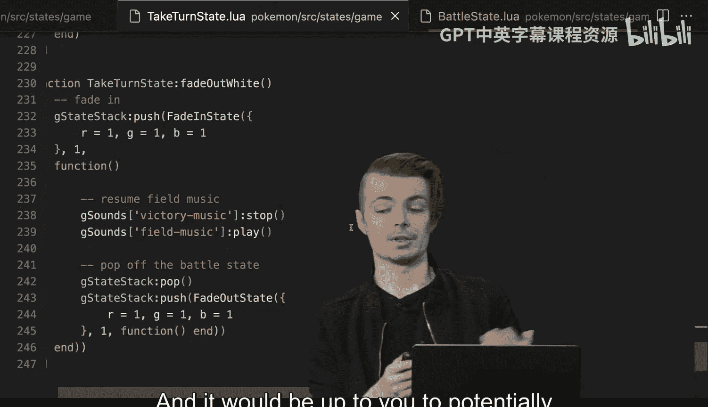

So some of the missing features that we talked about， you， detailed level up screen。

 that's essentially part of the problem set。Monster catching is a huge part of the problem set as well。

 that is a huge part of the game itself， which is that you you have one Pokemon。

 but you got to catch them all is the phrase and there were 150 to start with and I think there's now like 800 or something of them in the newest iteration。

 so it's a lot harder these days to catch all of them。

 but this is gonna be part of the problem set you notice that there were multiple different kinds of Pokemon there's I think five or six in the example and so by going through the wild grass and just like letting the random number generator to its thing。

Actually implement the ability to catch some wild Pokemon part of the problem set。

 which we'll see on the next slide。So right now field many for browsing that would be great to have。

 we don't really have a way to see what our Pokemon are what they look like， what about items。

 you know in RPPGs it's very common that you would have maybe potions or some other item Poqueballs or the things that you use actually throw at Pokemon to catch them and that's kind of an important detail needed for catching Pokemon if you want to make it a sort of limited resourcebased thing or constrained thing and not just be able to unlimited catch them for free。

We didn't have anything beyond just attacking with sheer attack versus defense。

 but different attacks， different abilities， different ways to manipulate the state of the actual battle itself with different weather effects and various things like that。

Pookemon gets very complicated the more you do in RPDs in general， but trainers as we mentioned。

 Mon evolution， which we've mentioned being able to evolve。

 we don't have anything really like towns or routes which are common in Pokemon in our example。

 but we did talk a little bit about， for example Zeldabased dungeon generation you could seek to implement something similar for yourself in a world and overworld or you could by hand create an actual fully fleshed out world with routes and with blocked off areas and the like and then in starting in gold and silver you could actually take two Pokemon and breed Pokemon and get eggs that you could then cultivate and then raise and grow Pokemon and get certain kinds that were only available doing that and then something a day night cycle during the daytime。

 certain Pokemon come out during the nighttime， certain Pokemon come out and you tie it to your physical device I remember that as a kid in gold and silver that was one of my favorite features that they had added。

And so for assignment7， some of those ideas will utilize to provide a， I think。

 cool and robust problem set for folks to take on when you level up。

 display a menu with all of your stat increases so that you don't know just that you leveled up。

 but like oh， now I'm two points more attack， I've got two points more defense or whatever。

When you're in the field， if you could press a key to open up a menu and actually see what are the Pokemon that I have in my inventory and how much HP do they have。

 what are their stats， what level are they？And then have a ability to catch them as well。

 which ties into that second point， which is to have some sort of third menu option in the game。

 perhaps or the ability to have an item that lets you do it， but certainly just for the problem set。

 have a catch Pokemon option， should you get the Pokemon to be 25% HP or less then that's typically I mean there's different Pokemon of different attributes some are just legendary and impossible to catch almost at any amount of HP but typically the weaker the Pokemon is that you fight assuming it's not a trainer。

 you can't catch trainerss Pokemon， but assuming it's wild。

 you can throw the Pokeball at it at 25% or less it'll catch it potentially hopefully if you're lucky and then lastly make sure that you can only catch six and that they're part of your party it's common in Pokemon that you can only catch six Pokemon。

 that's the max size that you and all trainers can have and so that'll be the requirement for the problem set and so that ultimately concludes CS502D。

 this was CS52D and that we went through a whole bunch of different games。

 starting from pong which was just shapes moving around on the screen just rectangle。And colors。

 and we moved on to visuals， graphics and gravity and platformers and physics。

 and today we looked at RPGs， turnb systems， state stacks， state machines。

 This course ran the gamut throughout a whole bunch of genres and went throughout history and it was a pleasure。

 And now with these fundamentals， you have the ability to go not just through 2D games but you can even begin to dive into 3D games and beyond this was CS52D and we'll see you next time。

😊，That was really good up until the ending。This was CS502D。Could do it a couple more times。

 but faster in different variants。This was CS502D。This was CS502D。This was CS502D。

And to dive into 3D games and beyond， this was CS502D， and we'll see you next time。Yeah。

 you can think Sly， that seems to work if you have， you're happy。

This was CS52D and we won't see you next time。是。This course ran the gamut of games and genres throughout history。

 from the old to the new， from mobile to the NES and beyond。

 and the principles with which we adopted， or sorry。Re from NS to mobile，h， from NS to mobile。

I don't know if I'm going to exactly say that when I was saying it。

 I didn't know if I completely liked it。Okay。A am I still hot？Okay。

We ran the gamut of games and genres throughout history， starting from humble beginnings in Pong。

 which is back in the NES era all the way through modern games。

 like Pokemon and Ang Birds and the like for mobile and current systems。

 And so with the principles with which we adopted to I messed up the same sentence I don't want to say principles we adopted you're pulling a me in。

The first time， man。Okay。First time always， first time it was always smooth， okay。

m thinking in too much about what I want to say now。Okay。

We ran the gamut of games and genres throughout history。

 starting from humble beginnings back with games like Pong and breakout all the way through more modern titles。

 like Pokemon and angryngry Birs， more mobile titles and the like， we learned all got damns， okay。

Okay。All right， things are great， things are great， things are perfect。Okay。

People get to hear me cus on stream if I keep messing up。Okay。

 we ran the gamut of games and genres throughout history。

 starting with more humblebble beginnings in games like Pong and breakout。

 using just shapes and progressing through things like 2D sprites and。😊。

We ran the gamut of games and genres throughout history， starting with more humble beginnings。

 like Pong and the like， through more modern titles， even mobile games。

 and we've learned the principles of 2D game development such that you could go and develop any of your own types of 2D games and certainly begin to take your steps even into the world of 3D game development。

 This was CSs502D。Hello world， my name is David Main and this is CS50's introduction to 2D game development with CS50's Z Colton Ogden。

 this course assumes that only that you have prior programming experience in any language and focuses on the development of twodial interactive games。

 some of which with which you might have even grown up。😡，In this course。

 you'll learn principles of 2D game development as you run the gamut of games and genres throughout history。

 taking inspiration from classic titles like Pong， breakakout。

 legendgend of Zelda and Super Mario Brothers， as well as more modern titles like Flpy Bd Match3 or Candy Crush。

 Angry Birds and Pokemon We'll start with understanding what a game loop is moving from the world of black and white shapes to images and color。

 rudimentary and more powerful ultimately physics， side scrolling and topdown games。

 even topics like event handling state machines and interpolation。

 all of this in the context of a well-known programming language Lua。

 in tandem with an amazing 2D game development framework calledLo This is CS502D。

Remin in the back of all his shot all of his shots。This seems very awkward。I guess so。

 I didn't expect him to， yeah， I forgot， and then he stood in front of me。

 I thought he was going over there。Oh， was that1。 Yeah， okay。Okay。Okay。

 you want to do it again How the is the fact that I because I often had to look to read the script and it's like measurably different from the island of the camera。

 is that perceptible on camera？Okay。It doesn't matter too much。

 I think maybe slightly towards whatever camera is going to be hot。

 the red camera because that's where I was tending to focus。But as long as it's not super visible。

 a huge deal， I was just worried about that being like a visible thing。WhenWhen you're looking at it。

 or are you looking at the screen or are you looking at the camera， the screen？

I'll let my eyes wander a little bit， but not too long because otherwise I'll lose my place。

That's kind of what my worry was， I' was just worried that I remember like previously the prompter would have like the camera behind it and I think it got the perfect eye line or whatever。

Though at this distance， it works pretty well。Yeah I think that should be a little bit better thanks for moving that what I would do though is commit to the your eye location like don't look back and forth to the lens trying to fix the situation like because then people will notice you' reading so if you look at the screen look at the screen so you never look at the camera or at least if you're moving your gaze it's like organic it's not like looking at the around not at the。

Sorry， what do you mean？

Up to David。Do we ever see the whole TV？We'll see it when you address it。Yeah， that's fine。

So long as it's visible to start。No， Christtine， I was going to say any cat here， okay， one cat here。

Kind of an intractable problem。Leard。I think so， Oh， excellent。

DoesMy collar look symmetric on both sides？Yeah。You're。This shirt is is peeking out more not a。

 So I thought you're talking about your sweater collar， Yeah， your inner shirt collar yeah。

That would make it more symmetric like that。Yeah。Yeah， thank you。

So if I just look at that primarily and I don't even look at the camera lens， will it be okay？

Appreciate it。And I'll glance at you as I did when accidentally bumped into you two and I walked didn mean to do that no。

 I forgot to walk out， I'm going to walk to the I'm going to pretend like I'm walking into the lectern Okay how far out of frame do I have to walk to the lectern or farther？

系政府。Okay。Sure， what's my last word， can you scroll down Max？WithWith which you've grown up。Yeah。

 think others this。All right， okay。Hello world， my name is David Main and this is CS50's introduction to Gate。

Sorry， that's all？Hello world， my name is David Main and this is CS50's introduction to 2D game development with CS50's own Cton Ogden。

 this course assumes only that you have prior programming experience in any language and focuses on the development of twodial interactive games。

 some of which with which you might have even grown up。

In this course you'll learn principles of 2D game development as you run the gamut of games and genres throughout history。

 taking inspiration from classic titles like Pong， Breakout。

 Legend of Zelda and Super Mariio Brothers， as well as more modern titles like Flpy Bird Match3 or Candy Crush。

 Angry Birds and Pokemon we'll start with understanding what a game loop is moving from the world of black and white shapes to images and color。

 rudimentary and then ultimately more powerful physics， sides scrolling and topdown games。

 even topics like event handling state machines and interpolation All of this in the context of a well-known programming language Lua in tandem with an amazing 2D game development framework calledLo This is CS502D。

Is it called love or love 2D love？I think that was good， but should we do it again？Got it。

It is weird reading of。Its a little awkward。The catch is where if you miss a word and you're like。

 I'll shoot and now it's too late， you had to like rewind or something。Hello world。

 My name is David Main， and this is CS50's introduction to 2D game development with CS50's Z Ctongden This course assumes only that you have prior programming experience in any language and focuses on the development of twodial interactive games。

 some of which with which you might have even grown up In this course you'll learn principles of 2D game development as you run the gamut of games and genres throughout history。

 taking inspiration from classic titles like Pong breakout legend of Zelda and Super Mario Brothers as well as more modern titles like Flpy Bird match3 or Candy Crush。

 Ang Birs and Pokemon we'll start with understanding what a game loop is moving from the world of black and white shapes to images in color。

 rudimentary and then ultimately more powerful physics， side scrolling and topdown games。

 even topics like event handling state machines and interpolation。

 All of this in the context of a well-known programming language。

 Lua in tandem with an amazing 2D game development framework calledLo This is CS50 to。😊。

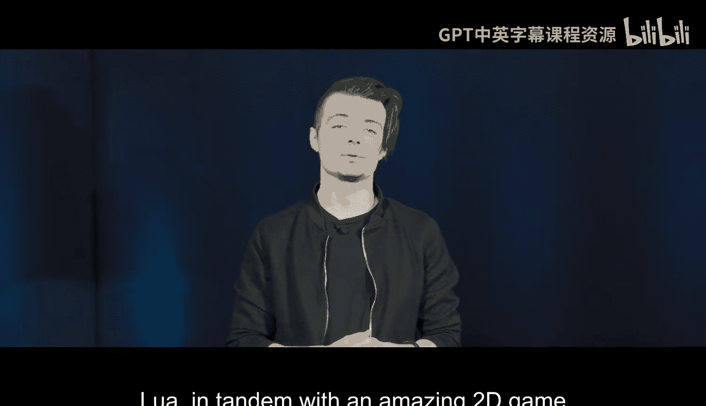

，That was good too， I think。Can I just pull up on the stream how it looks real quick？

let'ss can I type to。game development with C50 this course assumes only it was that you looked at in any language I don't think did the development of two dimensional interactive games。

 some of which with which might have even。In this course。

 you'll learn principles of 2D these work gamma games and genres throughout history I think we're classic titles like how concerned that。

