# 哈佛大学《CS50 Lec-9 Flask Fall 2024》中英字幕（deepseek） - P1 - GPT中英字幕课程资源 - BV1u8CaYREES

All right， this is CSs 50 and this is our last week in this year's studio as we focus finally on web programming using not only Python。

 but a framework within Python called Flask and combining with web programming H CSS perhaps some ja and so many of the ideas that we've been exploring over this past several weeks indeed today is really about combining all of those various building blocks so that ultimately you can build something of your own not only for this week's problem set but perhaps if you so choose for your final project as well let's consider where we left off last time which was introducing HTTP hypertext transfer protocol whereby we introduce you to how the browsers of the world and the web servers of the world intercommunicate using HtTP and a whole bunch of other protocols underneath those like IP and TCP in particular so last week though when we began to write H and CSS and even a little bit of ja recall that we served up the web pages that we wrote by using a very simple command in。

code that we preinstalled for you， namely HtTP server This was a little program whose purpose in life was just to listen for HtP requests coming from your browser or really any browser and respond to them by sending the contents of files from your code space to the browser typically aMl file but if you had an image like a ping or a it too could get sent a jascript file。

 a CSS file， really any files stored in your codespace could be served up by HttP server static and indeed that's the keyword here is that everything we did last week was within the context of Hm and cS static we wrote it we saved it or autosa it and then we loaded it in our browser if we wanted to make a change we would go edit the file resa it or let it auto save and we would reload in the browser but only once we got to ja did we have any kind of dynamism when I demonstrate for instance very briefly how we might implement something like autocomplete searching for all of the words that start with C and that big。

Dctionary from problem set5 but today we're going to focus on things more server side in fact。

 even the little bit about jascript that we introduced last week was all client side that jascript code was written once on the server downloaded to the browser and then executed in the browser but as a result that jascript code didn't have access to for instance any information that might be stored in a database unless somehow we enable it to somehow communicate again and again with that server so really what we're going to do today is dive into the world of web programming where we're actually going to write code in Python using functions and loops and conditionals and unlike last week we are going to use code to generate our HTML for us so that we can stop doing everything by hand especially for webs that might have dozens。

 hundreds thousands of web pages there's no human manually generating each of those web pages it's somehow dynamically generated through web programming so let's begin where we began last time focusing on the structure of。

We might request web pages because we're gonna make a little tweak this week in particular last week we looked at a canonical URL like this HtPS which is the protocol or scheme a colon wwwex co and recall that the typically indicated that we wanted the default webage for the website now that wasn't really germane last week when we were playing with the whole folder of files but if you were to request the default webpage on a website it's typically by convention literally a file called index html at least on a lot of platforms sometimes it might be called index htm sometimes it might be called default asPx there's different conventions but very often when you just request you're technically referring to a very specific file that has been configured on the server to be the default page that served up but you can of course be specifying specific files or even folder so we looked at URL formats like this if you want file htl you simply append that to the end of the if you want。

The default web page inside of a folder you might do slash folder slash and the server would serve that file up for you if you wanted to be more explicit you could specify slash folderfi html so that you can actually grab a specific file from a specific folder and suffice it to say you can nest these things again and again if you've got multiple folders and subfolds but today and really onward we're going start talking about everything after the tld as really being the path that the browser is requesteding solash path is just meant to generically mean whatever files and or folders are being requested in URLs and we're also going introduce slightly different nomenclature this week too that yes technically that's a path specifying a specific file in a specific folder or set of folders but in the context of web programming what's especially powerful those files and folders don't actually need to exist using web programming using Python for instance you can specify specific paths that don't actually exist in your code space。

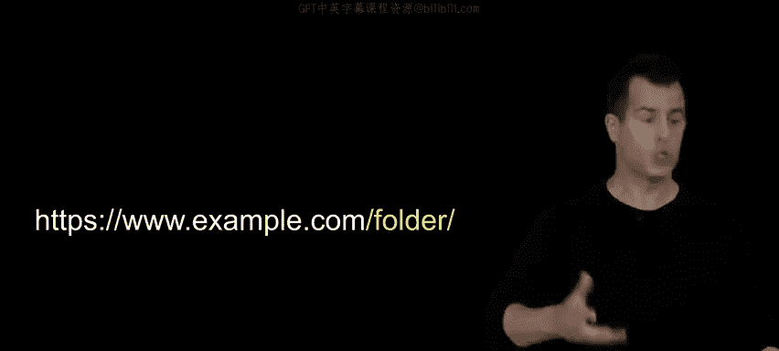

But that represent a resource indeed， uniform resource locator for URL。

 a resource that you want to be able to access via your browser So route generically means what path you want to select on a web server Now what's this going to mean for us well once we have configured a route in code we can even specify that that route takes user input and recall that from last time we introduced you to how Google co works and we didn't implement the backend of Google we let Google do that but we did implement our own frontend for Google that allowed you to fill out a very simple form。

 click enter and the web browser would then send automatically a request to Google server that somehow had key equals value particularly queue for query equals for instance cat and all of that followed a question mark So the same URL format here whereby we have slash route which refers to some path and then question mark key equals value and maybe an ampersand and more key equals values。

😡，Means that today we're gonna have the ability to implement the backend of Google if we so aspire or really the backend of a website and backend just means the part that really the programmer implements and touches frontend generally means the part that the human the user interacts with All right so with that said。

 let me propose that if we want to be able to read URLs of this format that have some key equals value and maybe some other key equals value we actually do need to introduce a bit of code So let's consider now how this request this HttP request is getting to the server Well recall that when you request something like cats via a web page submitting to Google via a form technically inside of that virtual envelope is a message like get slash search question mark Q equals cats then some mention of the version of the protocol being used like version 2 of HtTP maybe a reminder of the host of the server that's specifically being requested and then a bunch of other stuff that we saw last time as well an ideal。

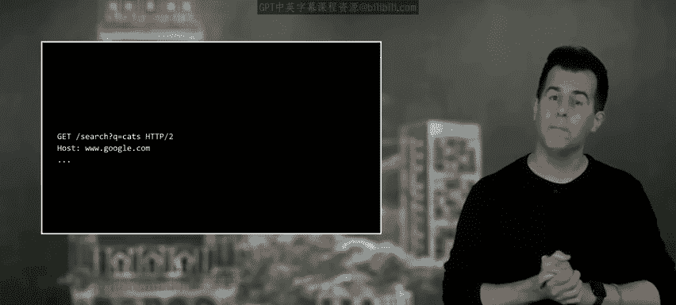

We want the server to respond to that request but here's where things get interesting How in the world do you go about writing code that opens up that virtual envelope。

 reads that getline and the search and the question mark and all of those keys and values well we could write code very methodically maybe using a for loop and iterating over every character but that sounds like a lot of work and in fact it's been much better in CSs50 alone that once you understand some concept rather than reinvent that wheel yourself use a framework or rather use a library instead and indeed that's what we're gonna focus on today is a very popular micro framework in the world of Python which means a relatively small library that solves some very common problems and saves us the trouble of having to write all of the code that reads the insides of those virtual envelopes and figure out exactly what web pages requested or route and exactly what keys and values were passed in to do so we're going to go ahead ultimately and not use H。

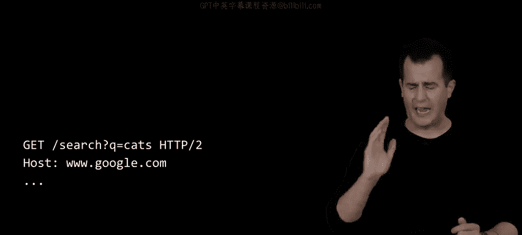

GTP server anymore。 that recalls is a command that only serves up static content。 starting today。

 we're actually going run a command namely flask run。

 so not only is flask a library as we'll soon see， which means we have functions and other features of it we can use in our own code it's also once you install it a command that you can run in a terminal window like your own code space。

 And so ultimately instead of running HTP server today we're going run flask run to still start a web server but a web server that's even smarter than HtTP server because it's not just going spit out the raw contents of files to the browser it's actually going execute your and my python code to generate those web pages dynamically So in order to get to that point。

 we're gonna have to start creating some files of our own and really writing some programs of our own and the convention when using flask this popular micro framework which again is just a library that standardizes how you and I solve some common problems we're gonna need typically。

two files， one by convention called app dot pi and a second one called requirements text or TxT and each of these files in conjunction will be understood by that flask command because flask knows to look for a file like app dot pi and knows how to execute it and as we've done so many times in past languages here for instance now in Python while using the flask framework is how we might implement the simplest of web applications so at a glance this is going to look a little strange because there's a lot going on on the screen but clearly that first line indicates that we are importing from a library called Flask some kind of feature known as flask capital F so it's a little weird but that's often a convention to import from something lowercase something that's capitalized to make clear that it's really what's called a class in the world of object oriented programming but more on that's down the line and then the second line of code says to flask please turn this file into a web application so this is。

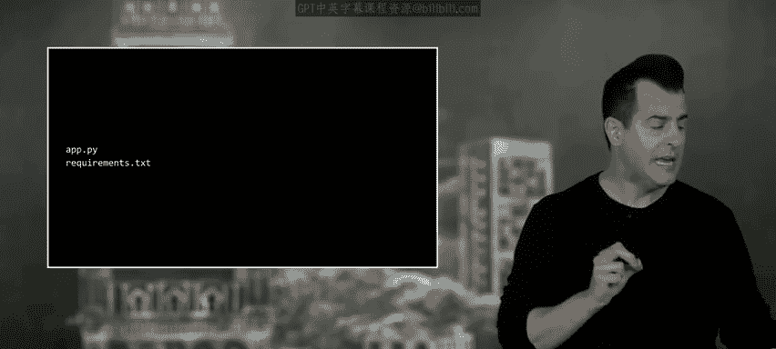

Arcane， but underscore underscore name， underscore underscore is something we saw so briefly a few weeks back in week6 when I said at the time you sometimes need to check what the name of this file is and doesnt equal quote unqu underscore underscore main underscore underscore because that enables you to more correctly implement libraries of your own which we did not do but I just mentioned that you might see it in the wild here it is again in a different form underscore underscore name underscore underscore is essentially a special variable that refers to the name of this current file So the second line of code is essentially telling flask please turn this file into a web application and let me refer to it via a variable called quite simply app AP Now after that there's some new weird syntax but this is technically just python。

 a feature we haven't yet seen technically you're seeing now the at sign for probably the first time app which is that same variable route and then an argument there too So this is what's an example in python of what。

ll a decorator and a decorator is a feature of Python whereby you can wrap one function inside of another for our purposes today。

 what this third line of code essentially means is hey flask please turn the following function into a route that can be served up by the server to a browser what is that function well the function that I want to associate with that route is literally a function called index。

 but I could call it anything I want， I could call it fo bar ba or anything but index makes sense if this is meant to be the index of my website and the only thing that function does for now is literally return a string or stir in python speak namely quote unquote hello world So that is it and the fact that the argument to the app route function whereby route is a function or method inside of that app variable or object the quote unquote just tells flashask whenever the user visits like example co please call this function and send to the browser。

Whatever this function returns Now， long story short。

 this is not the only way to implement a web application， but this is the way to do it using flask。

 this very popular micro framework。 if you ever use something else like in Python there's a calledjango and there's many others and many other languages as well。

 This just standardizes for us what are the conventions when I want to create a route and I want to return some hml because you can solve that problem any number of ways。

 but what's important today is really the application of last week's ideas even though we're using a very framework this is not meant to say that you're learning flask and C50 per se but you're learning a web framework that's going be representative of many others out there as well we chose one that's both popular and relatively simple。

 So with that said， I think let's go ahead and implement the very first of our web applications here namely by switching over to vs code here And within my Vs code environment I've hit in some distractions。

 I've already closed my activity bar and I've closed the file Expr so that as always we have room for some。

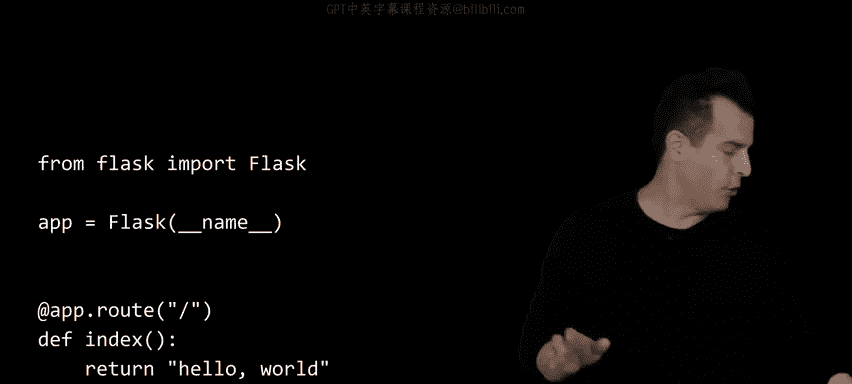

Ts and we have my terminal at the bottom but like last week I also have an additional tab inside of my terminal area here for not only the terminal window itself but also these here ports recall that last time we talked about TCP ports in particular unique integers that identify certain services like 80 for web servers or 443 for the secure version Https thereof here again we see port 1337 which is meant to connote L because this is a CSs50 specific use of this TCP port but soon we'll see another port just like we did last week when I launched HttP server so let's go ahead first and create a file for instance called appt pi and just to keep things simple I'm going to isolate all these files to a specific folder so I'm going to create a new folder with makeD and I'm going to call it hello for my first application called hellello I'm going to CDd into hello and indeed now I'm in there and now I'm going to run code of app dot pi to begin writing the content of this here web application。

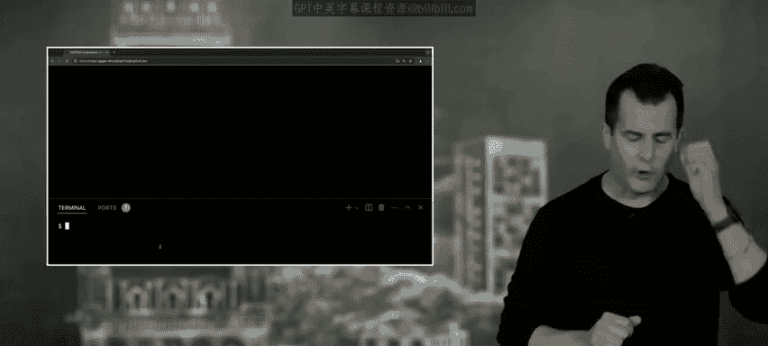

And for this， I'm pretty much just going to use the contents of the sample program we saw a moment ago by doing the following I'm going to say from flask import flask lowercase F and uppercase F respectively then I'm going to say app equals capital flask underscore underscore name underscore underscore which is the line of code that says hey flask turn this file into a web application and give me a variable called app via which to reference it and then down here I'm going to do at app route and then in parentheses pass in a single argumentlash I could use single quotes。

 I could use double quotes for consistency with C as we did in week6。

 I'm going to keep using double quotes most of the time now I'm going to go ahead and define a function in Python called index but I could call it anything I want this particular function is not going take any argument So all it's going to do is return a string or stir of text hellello comma world and that's it Now just to be consistent with style 50 I've actually deliberately left a couple of lines blank。

bewe my function and everything above it and that's just a stylistic convention in Python but otherwise this is just some relatively little python code albeit using a couple of new features。

 a new library and using a new piece of syntax， the at sign for that so-called decorator and again to be clear all a decorator does in Python or in this particular case is it says hey Python turn the following function into one that should be called automatically whenever the user requests the forwardlash route All right I need to do one more thing at least on some systems let me go ahead and run code of requirements txt and in this file I'm going to simply specify what are all of the libraries that I want this web application to use and I'm quite simply going to say flask capital F here but strictly speaking it's not necessary because in CS50 dev because we've pre-installled a flask for you but in general and certainly in the real world what I'm doing now is associating with this application zero or more list of。

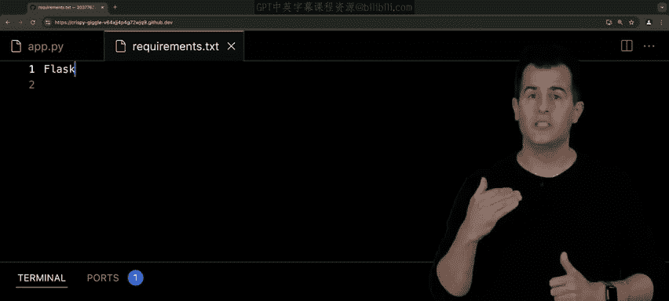

Pendencies， librariesbraries that I want someone to install in order to ensure that this thing here works that's all I need to put in this file but even though it's already been installed what I can do is this let me go ahead and maximize my terminal window here and let me run that command we ran briefly back in week  six when we want to have install libraries I'm going to do Pip install and instead of installing cowi or something silly like that again I'm going to do Pip install R requirements text and what this command would do for me if flask is not already installed is it would install it for me on this here system so I'm not going bother executing that because I already did it earlier for everyone's code space but that's indeed how we could use that requirements file to automatically install things would have to manually typing that and other things out。

😡。

All right， well let's go ahead now and do something incorrectly。

 suppose I'm in the habit of forgetting things and I run HtTP server in my terminal window I can certainly run it and it's certainly going to work especially if I override this helpful reminder we put in place to discourage you from doing this but I'm going to say nope I want to go ahead and run it I'm going to see the same kind of output as I saw last week I'm going to be prompted to open in a browser that particular web application but that particular web application is not really my own per se it's just the contents of this folder so if I go ahead and zoom in on the directory index of that there folder we see my two files app pi and requirements text if I click on app pi I'm not going to get a hello world In fact it was a little subtle but what my Mac just did was it downloaded app pi which is not the goal I want and in fact you've just let the world access your source code if there's anything sensitive in that there program because the browser doesn't know what to do with an app pi file inside。

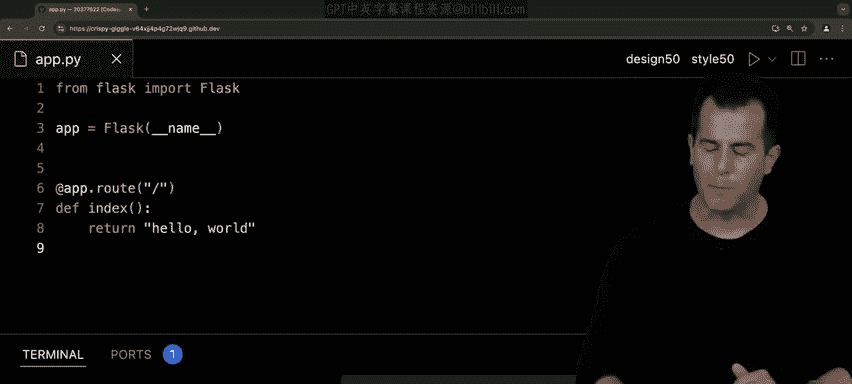

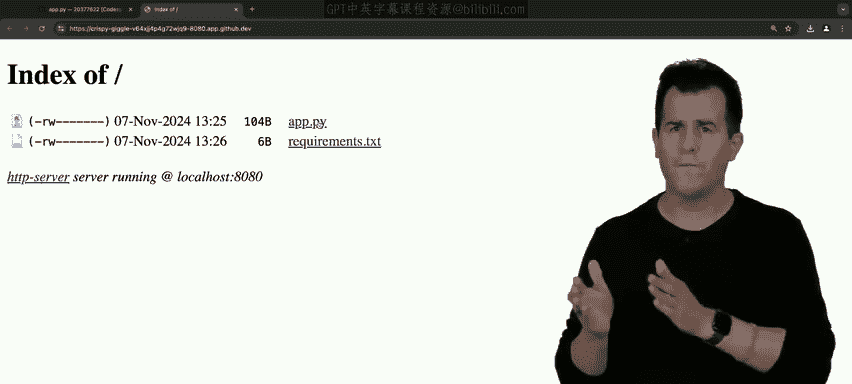

My browser so that was incorrect so I'm gonna to go ahead and go back here but just to make clear that we do indeed have a second port running now just like last week because Hp server can't use port 80 or 443 because code spaces that is cs50 dev is already using that for you it did choose the default port of 8080 which is commonly used for development purposes and that's why we see not only 1337 but 8080 now as well so let me go ahead and back to my terminal window hit control C to interrupt Htp server and let me now do things the right way by running flask run enter and what we'll see now is that my application is running not on 8080 but on 5000 which happens to be flasks default choice of ports but you can override this if you so choose but I'm gonna stick with that one and now even though it's a little underwhelming。

 I'll zoom in now I see hello comma world and in fact if I right click or control click on。

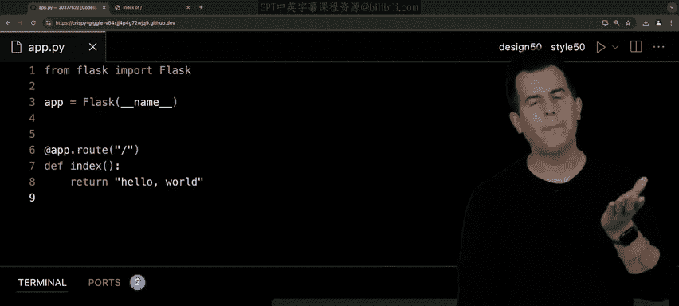

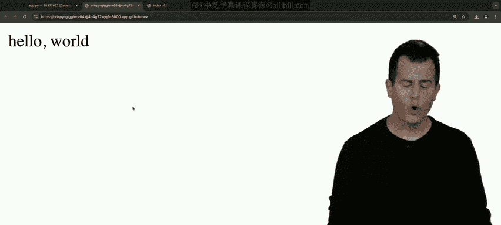

Chrome here or your browser more generally and for instance view page source you will see that there's really no even HTML here just text because what I've essentially sent to the browser is just literally hello comma world but already we have a building block here  clearly I can write Python code that generates output that is sent to the browser so really there's nothing stopping me from now sending not just raw text but actual HTML to the browser let's do this sort of poorly at first let me go ahead and hide my terminal window just so we can focus on code now for a moment even with flask actually running and this is gonna to look deliberately ugly for the moment but let me go ahead and do this if I want to send the browser a proper web page heck I remember some HTML from last week so open bracket exclamation point doc type H close bracket and then open bracket H then lay equalsquote E for English then I'm going to go ahead and do head for the head of the page and then title for the title therein。

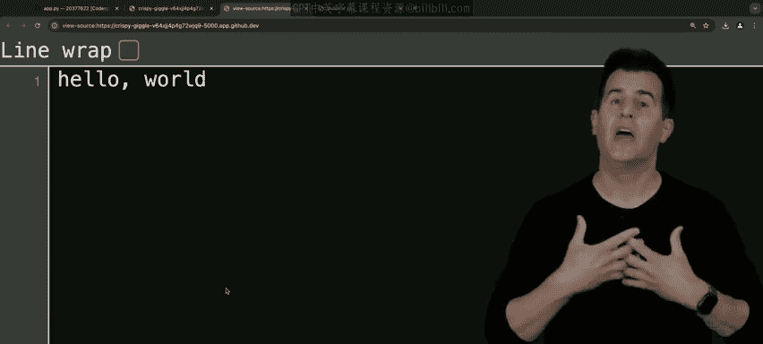

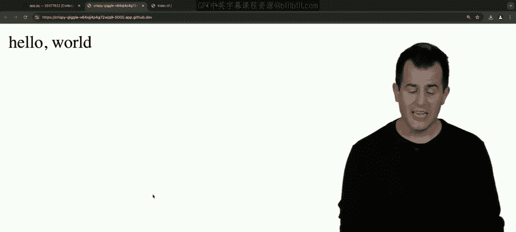

going to say something like hello comma title like I did last time， let me close that title tag。

 let me close that head tag， let me open now my body tag inside the body I'll say hello comma body I'll close the body tag I'll close the HTML tag and I'll close my quotes but I'm going to be careful here notice that I used an attribute value in here with double quotes that's probably going to confuse Python because I have these outermost double quotes so I can fix this in a couple of ways I'm going go ahead and use therefore single quotes on the outside of this python string which unlike C is fine for strings not just chars as and C and I think that will at least assure that the quote marks don't get confused。

Allright， this is probably not going be the best design and hopefully this is not how we generate web pages。

 but let me go ahead back to my other browser tab， which previously said hello world。

 let me reload now and I seem to have changed not only the output of this web program but really the contents underneath the hood as well let me right click or control click on the white portion of my screen here and there is some proper HTML it's not particularly pretty printed。

 there's no new lines， there's no indentation， but if I scroll from left to right in my browser here there is a well-formed web page as I intended so again。

 not particularly fun， not particularly pretty but we seem now to have the capability of writing code that generates not only text but HTML as well so how can we go about improving this program further well let me do this This is not really the nicest design so let me go ahead and highlight all of this HTML I just wrote and let me go ahead。

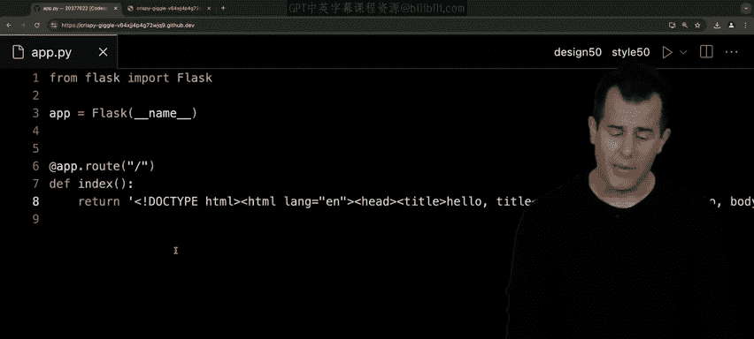

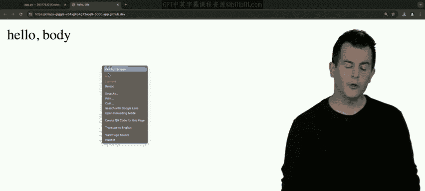

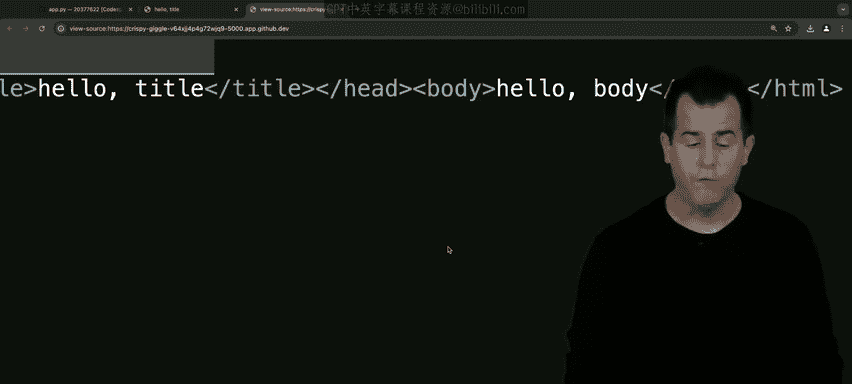

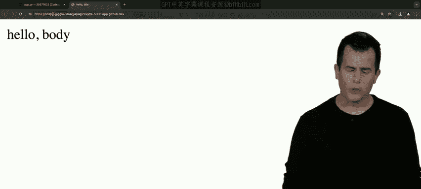

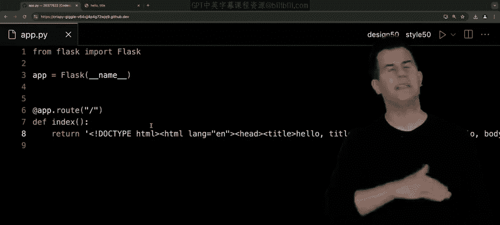

Cut it to my clipboard and let's come back to that code file in a moment。

 Let me go ahead and reopen my terminal。 I don't want to kill flask run just because it's convenient to keep it running。

 so I'm gonna to create a second terminal window by clicking plus and I can toggle between them right here So one is still running flask the other is now a blinking prompt I'm in the wrong directory by default so I do need to go back into my hello folder with CD hello but in here what I'm going do now is this I'm going to go ahead and create another folder inside of this that by convention is called templates and when I hit enter here I'm going then do CD templates to go inside of it and now I'm going create an actual fullfledged H file index Hm by convention enter and inside of this file I'm going go ahead and paste that long string of HTMLl and I'm gonna go ahead and clean it up to look a little bit more like it looked last week and I'm going even stylize it further here so everything's very pretty printed and human readable and I'm gonna to put the head up there I'm going put the。

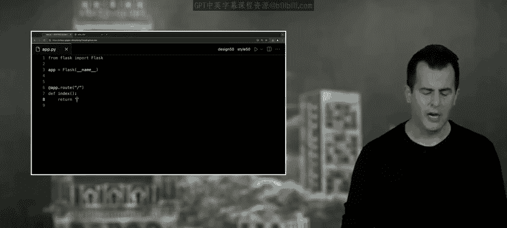

D here and below low that。 I will close my Hl tag。 So no different in terms of the content。

 but now I have all my HTML in an actual file。 All right。

 what do I now do with this well wouldn't it be nice if I could go back into app and say don't return just hello world don't return this long messy string of Hml but return the content of a file called index do h Well to do that I can import not just flask capital F from the flask library I can also import a function called render template。

 This is a function specific to flask， but it does exactly that it will render a template for you in the sense of it will go open an h file for you。

 it will then send it from server to browser and as we'll soon see it will can even do some fancier stuff than that。

 but now instead of returning quote unquote hello world or quote unquote a big long string of HTMLml what I'm actually gonna do is something like this I'm gonna say like。

😊，Tl equals render template and what template do I want to render index do HTML and I'm going to store that template so to speak in an HTML variable and then I'm going to return that variable Of course as we've seen in seeing in Python and even ja。

 we don't really need variables per se if we're just defining them and using them once so I can actually tighten this up a bit let me go ahead and highlight the actual function call get rid of the variable and let me just immediately return the return value of render template passing in index HTML Now notice a subtlety if I go back to my terminal window recall that I created index HTML inside of my templates folder which is inside of my hello folder but render template is smart as its name implies its purpose in life is to render a socalled template more on what we really mean on that in a moment but by default flask knows that if you're trying to render a template oh sure it must be in your templates。

Folder it's got to be all lowercase templates。 your file has to be exactly named as I'm specifying here。

 but this is now how a web server can associate a route like slash with a specific file on the actual server no matter what folder it might be in so let me go and go back to my other tab let me go ahead and cross my fingers as always and click reload and so far so good and in fact just to prove to you that this is the new version of my HTMLl that was pretty printed let me go to view page source and there indeed it is printed in the browser's memory just as I wrote it on the server Allright so now let's take a look at the code as we left it whereby for the slash route we are returning the return value of the render template function once passed an argument of index H and let's see if we can't make our web application truly more dynamic so that it's not just saying hello title hellellobody all of the time but。

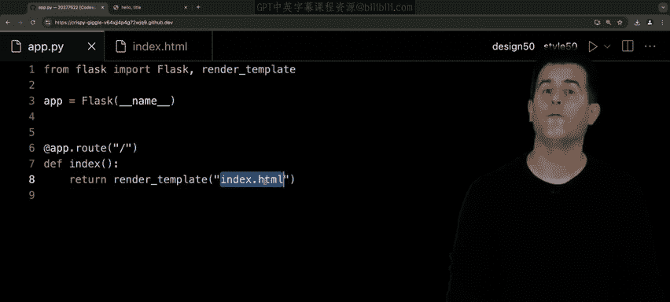

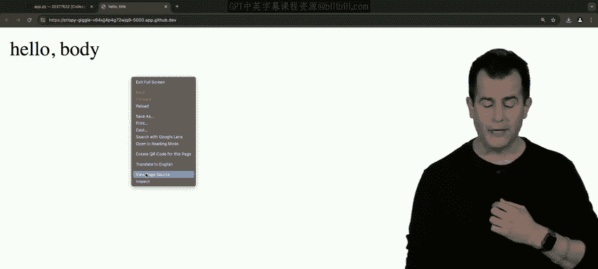

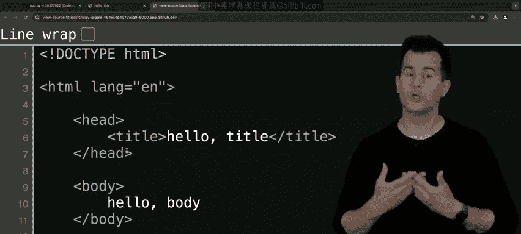

Deally saying hello to a particular person now how can I possibly pass user input to a web application because my users on the internet certainly don't have access to my keyboard let alone my terminal window they only have access to my web via a browser but of course as we saw in the Google example if you were to pass in somehow at the end of the URL not just a route but also a question mark and key equals value maybe an ampersand key equals value maybe another ampersand key equals value we can somehow send from the browser to the server user input of course that user input ideally does not come from the human typing it in manually to the URL but filling out a form hitting enter and letting the browser convert that form to the appropriate get request in the URL but let's start to simulate this for now let me go back to this URL here put my cursor at the end of it and say question mark name equals for instance David the intent being that I want this site to say hello David instead of hello title and hello body enter on。

Fortunately when I hit enter nothing changes and I can confirm as much by viewing source and indeed nothing about the page has changed because we haven't done anything dynamic in code。

 but I do think we can fix this let me go back over to VS code here and let me propose that we go into the template first which currently only says hello title hello body let's go ahead and simplify the title for now and focus on just dynamically changing the body and let me propose that what I really want this thing to say is hello and then a placeholder so I don't want to literally say placeholder where placeholder is just something into which we plug in a value because now I'm going to see a website that says hello comma placeholder so the syntax you're about to see is a little bit different but it's going to be a technique via which I can tell Python specifically flask to substitute a value for this here placeholder and the syntax for that when using flask is to do two curly braces on the left and two curly braces on the right it's a little different from our。

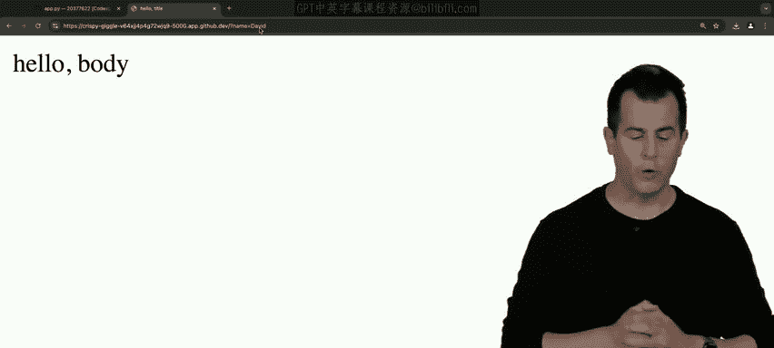

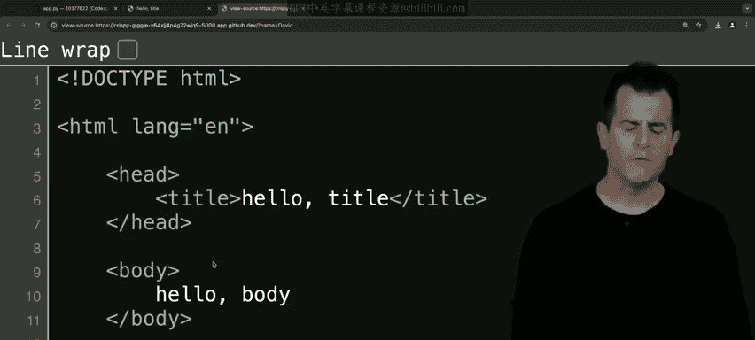

Sts or format strings in Python alone。 but in the context of an H template， the way you specify。

 hey flask substitutetive value here is indeed with two curly braces on the left and the right Now of course。

 nothing's going to happen yet until I go back to app pi and actually tell the template somehow to plug in a value therein Now how can I go about doing this Well。

 the simplest way which says follows in addition to importing flask and render template。

 I'm also going to import another variable that comes with the flask framework called request and this is a special object that's going to give me access to all of the HttP parameters。

 the user input in the HttP request that's causing this code to be executed。

 So how do I use that Well let me go down here and let me create a variable called anything。

 but I'll call it name and I'm going to go ahead and set that equal to something like request orgs open bracket quote unquote。

Close quote Now what in the world is going on here。

 Well it turns out what we've introduced here now is a special variable request orgs that somehow magically automatically stores all of those key value pairs and here again is why we're using a framework like flask because it's not gonna to be particularly fun code to have to write code that opens that virtual envelope reads the HtP message inside of it parses or that is analyzes and figures out what is each key。

 what is each value， what route is requested like every website on the internet practically is probably doing exactly that nowadays we might as well not reinvent that wheel ourselvesself So in request orgs we have this special variable that comes with flask that just gives us a python dictionary that contains all of those key value pairs and in fact think back to week5 when I propose that dictionaries or in Python are so very useful because they allow you to associate keys with values keys with values that's what flask is doing here So if I go back to my code。

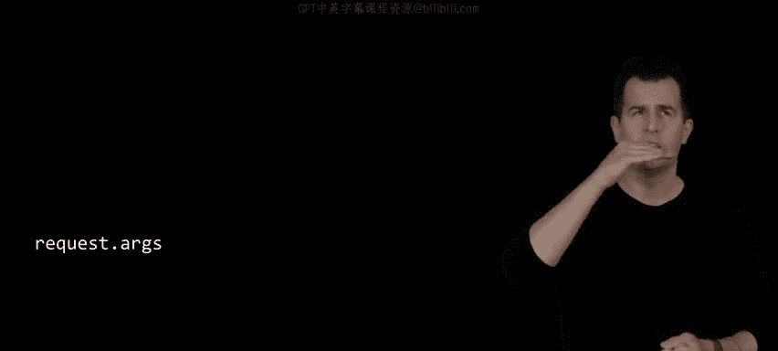

What we really see is that I'm creating a variable called name and I'm setting it equal to the value of the name key inside of this dictionary。

 that is requestquest。orgs is a Python dictionary at this point。

 how now do I pass in the value of that variable to my template so that we actually see hello comma David or hello comma someone else。

 well in app pi， I have to pass now a second argument to render template and the convention for that is placeholder equals name？

😡，In other words， I can use Python's feature for named parameters。

 which we've seen before like the print function in Python has that end parameter that we can use to override the line ending。

 which is by default slash n here I'm passing in a positional parameter in Python which just means the first one first position but then I'm passing in a second parameter that has an explicit name and the name I'm giving it is literally placeholder y because I want flask to replace placeholder in this template with the actual value of the name variable so if I go back to my second tab here which previously said hello title hello body but notice a moment ago。

 we passed in question mark name equals David which was previously ignored now if I reload this page having changed my python code in app pi there is my hello David and my tab is more simply now just hello All unfortunately this is not the best solution y because suppose that。

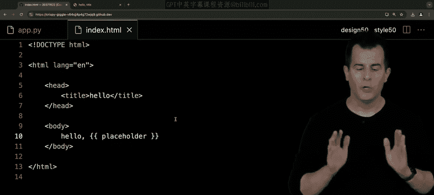

A user doesn't visit this URL and certainly doesn't have the wherewithal to type in manually Que mark name equals David。

 Let me go ahead and delete that HtTP parameter， the key value pair let me go ahead and reload this page now and now I got a bad request a 400 error which means I did not request this website correctly now that's just kind of bad design because surely the user should be able to visit a URL without having to manually type in parameters so how do we fix this let me go back to my other tab for VS code let me go ahead and open up app pi and it seems to be the case that I'm just blindly assuming on lines8 and nine at the moment that there will be a key called name inside of this dictionary and clearly that's not the case if the user has not visited URL that has question mark name equals something so I think we just want to use some weak one style logic using Python syntax specifically to say something like this let me go ahead and change line8 to ask a question first。

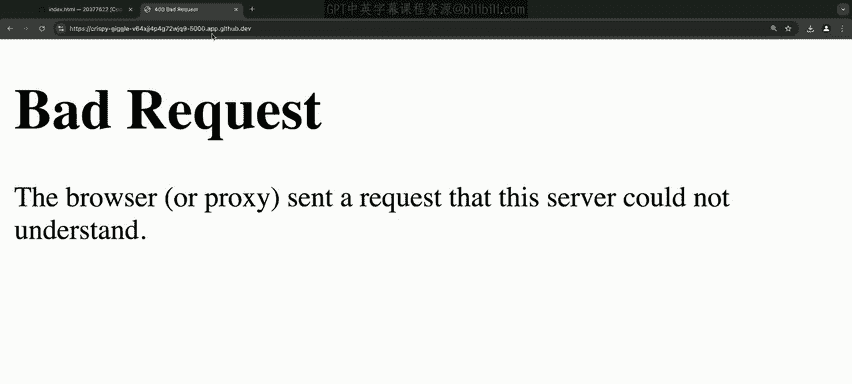

If there is a name key inside of request do orgs， then and only then go ahead and create a variable called name whose value is request do orgs quote unquote name else if there is no name key in that dictionary we've got to handle that situation which I wasn't a moment ago all right fine let's create a name variable and set it equal to some default value like world and now line 12 can remain unchanged because no matter what I'm passing in a legitimate value for name that's either whatever the human typed in in the URL bar。

 for instance， or it is by default world So if I go back now to my other tab and without changing the URL I just click reload now we're back to something correct if underwhelming that says hello comma world Of course this is a little maybe suboptiimly designed in that well I've used my placeholder already what if I want to say two placeholders or three placeholders or more I probably shouldn't be in the habit of literally。

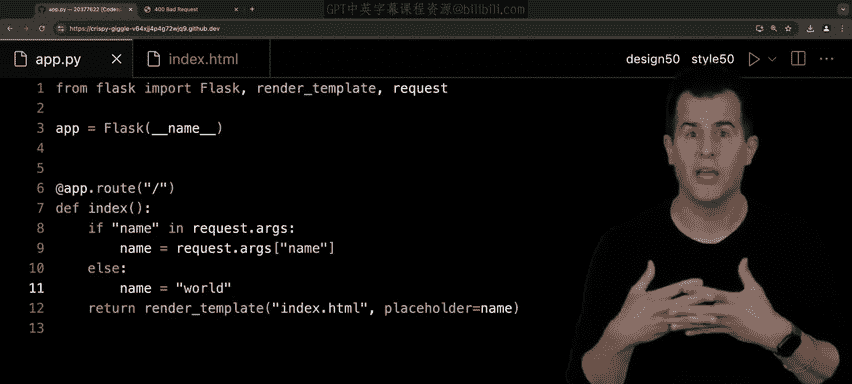

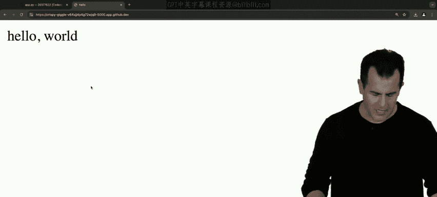

ussing the wordplaceholder in my template， even though that's what it is。

 let me go ahead and be a little more descriptive， just like with our variable names in general。

 and let me go ahead and say what I really want here is hello comma name where I want the value of name to be interpolated just like in an F string inside of these double curly braces。

 but I now need to change my code because I've now changed my placeholder to literally be name。

 this is going to look a little weird but the convention in using this library is quite often to say now name equals name。

 why because the name of the parameter I'm passing in to the left of the equal sign must match the name of the parameter that I'm using in my template。

😡，Though the value that I want to pass in for that placeholder can be anything I want。

 it can literally be quote unquote David， but if the value isn' in a variable。

 then what I want to do is pass in the name of that variable So this looks a little stupid admittedly。

 but this is the convention for better or worse name equals name means plug in the value of the name on the right for the template placeholder called name on the left。

 That's all but this is indeed a common convention Now is there a better way to do this。

 Well this feels a little bulky to have four lines of code if this else that just to check if an HtP parameter was passed in and in fact there is the convention in flash would actually be to not bother with this explicit if else。

 but instead to do something like this name equals request do orgs and then specifically call a method or a function called get whose purpose in life is to get the value of a key what key Well。

 the name key and what the get function also does for us is if it can't find a value there。😡。

You can specify a default value so if you want the default value to be world。

 you pass that in as a second argument so the behavior now is gonna to be no different。

 but if I go back to my other tab and click reload， nothing changes but it's still working。

 it's not showing some error however if I go into my URL bar at top and add question mark name equals David zoom out and hit enter it's still working in that case as well but I've distilled those four lines of logic now into something a little simpler by actually having now a use of the get method which is doing more of that logic for me All right so suffice it to say this too is not the best design because you certainly don't want to make a web application where your users to provide user input have to manually edit the URL that would be like searching for Google by only being able to edit the URL by adding search question mark Q equals cats anytime you want to search for cats let alone some other value and certainly if you want to type in your email address or a credit card number or anything that we're in the habit of typing。

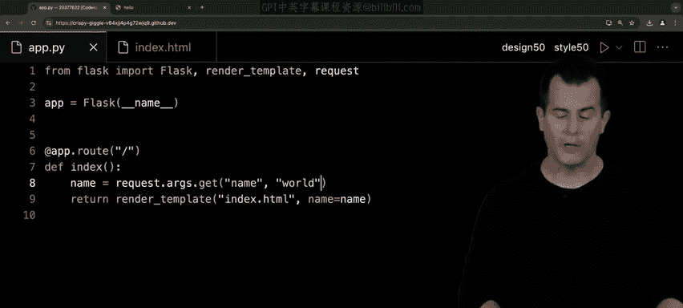

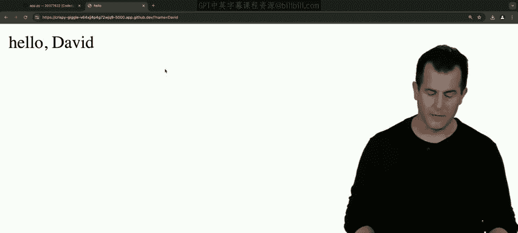

Into forms on the web you don't want to have to manually do that instead in the URL which is to say how can we make this now a more typical web application that still takes user input but takes it via a proper web form we saw how to make forms last week for instance we made a frontend for Google let's now implement the backend thereof so let me go back over to VS code here now and let me propose that we will create a actual form and index htl So index htls purpose in life is no longer to be a template that says hello comma so and so all it's going to display as a template So let me go ahead and delete this line here and let me delete this use of a placeholder and let me go into index html and remove the body here that we had for that placeholder and let's actually now in this here body create a web form so I'm gonna to do form。

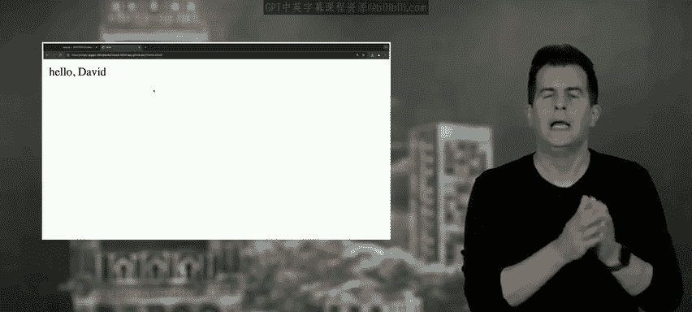

And then inside of the form tag I'm going create an input and the name of that input is going to be name because I want the human' name and the type of text the type of that input is going to be text even though that's the implied default but recall from last time there's some nice features I can enable anytime I make a form I can turn off autocomplete so it doesn't remember the previous person's name I can autofocus that input so that the cursor is blinking and ready to go and so that the human knows what to do with it。

 I can say placeholder equals quote unquote name so that there's little gray text that's explanatory text Now notice there's some potential confusion here。

 my use of name here is to define the name of the H parameter that I do want to end up in the URL the name here is the name of the HTML attribute that it comes with the input tag if you want to use it placeholder here is another attribute that can be used with the input element so even though we're seeing lots of names and lots of placeholders they're the same。

😡，IBut they mean different things in different context Now we're looking at HTMLm alone。

 All right besides that input fields， let me go ahead and create a button。

 the type of this button is gonna be submit so it knows to submit this form and I'm going to have that button say greet So it's obvious that I click on this button to greet that person's name All right what more do I need in here this is just a form which is fine visually but I haven't told the browser where to submit it just yet and if I don't specify that it's actually going to submit back to the same URL for instance slash if that's what's serving this up So if I actually want to change the action that the browser should really take there turns out there is indeed an action attribute which allows me to specify where I'm submitting this and I'm not going submit it to Google for instance this week I'm instead going to submit it to my very own route。

 which doesn't yet exist but it will in a momentlash greet and the method I want to use is going to be specifically get where in contrast with post because I do want to use get so that the parameter is very visible。

appear in the URL if only so that I can show you what's happening if I were to use post instead recall that sort of hides the inputs still in the envelope。

 but sort of more deeply inside of it so it's not exposed in the URL。

 which is appropriate for anything personal maybe an email address maybe a credit card number a password or the like but this is just a person's name so I'm okay for now with revealing it in the URL let's now go back to my other tab if I delete the URL parameters there and hit enter and go back to my default template I see indeed a form asking for a name and a button to greet someone So I'm gonna type in my name David and I'm going click greet and notice what happens to the URL at top it does automatically bring me to greet question mark name equals David So I the human did not need to type all of that in as I have been the browser knows when submitting a form via get do that unfortunately I get a 404 not found why because my app high file only has one route for is no。

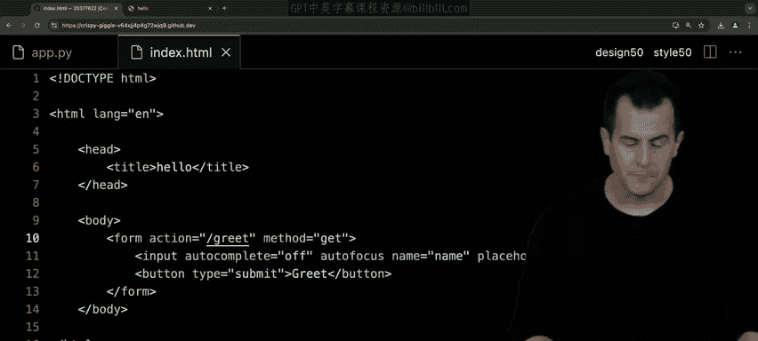

Route yet for slash greet。 So I think we can fix that too by just practicing what I've been preaching here as follows。

 Let's go into app pi and say app dot route quote unquote slash greet。 And here too。

 I can call it anything I want， But I want I want parity with what I just put in my form and inside of this under this decorator。

 so to speak， I now need to specify exactly what function I want to be called when this route is visited。

 I can call this function anything I want。 But to keep myself sane。

 I'm gonna use a name for the function that kind of matches the route itself。

 So I'm gonna call this function greet。 even though it can be anything I want。

 And then after this function， which is not going to take any arguments。😊。

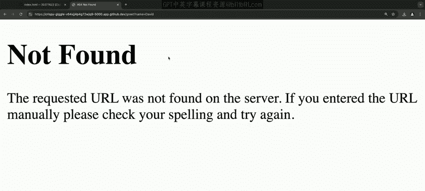

I'm going to go ahead and do this I'm going say in here name equals request do orgs do get quote unquote name to get the value of the name parameter from the get string but if there's no such value there let's grab a default value of world and then as before I'm going to return the return value of render template but this time I'm going to render a different template that to be fair does not yet exist。

 but I can solve that problem to greet dohm and I'm going to pass into that template once it exists the value of name equaling the value of that variable so same ideas as before。

 but I've now moved a lot of my logic into a brand new function and route called greet all right so what's now going to happen here。

 well let me go back to my browser which previously was 404 and not found because the route didn't even exist I'm going to click reload and I'm going see a new problem I think because the route exists but I don't think that template existsG do Hm yet so let me hit enter。

😡。

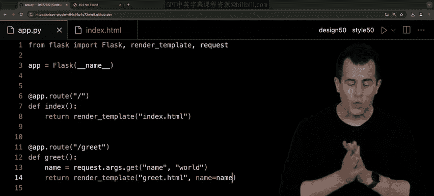

Reload and now I've got an internal server error which welcome to web programming。

 This is gonna be the new segmentation fault of C but in the context of web programming when you see 500 internal server error as much as you might like to hope otherwise it is your fault you have made a mistake somewhere as I just did So let's see how to diagnose this let me go back to my other tab let me reopen my terminal window and thankfully within my terminal window I should see among any number of other errors some hint as to what went wrong So to be clear when you see a 500 error in your browser internal server error one it's your fault but two there's probably diagnostically useful hints in your terminal window if you've created two terminal windows that's fine you have to realize that your commands are going be left alone you have to go back to your other terminal window where flask run is still running and you might want to scroll up and down look at the most recent error in there and。

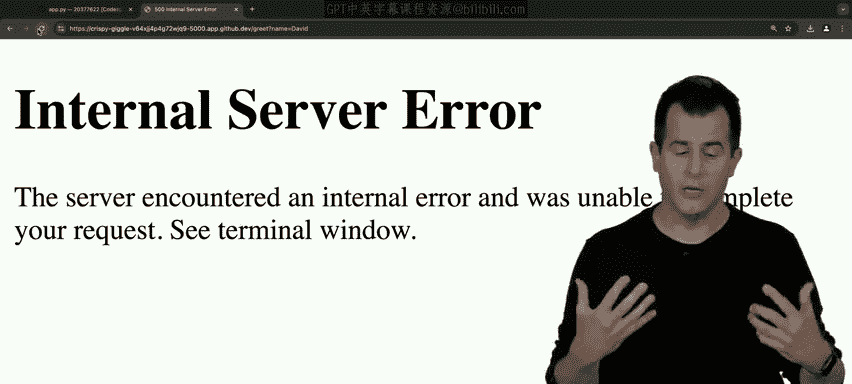

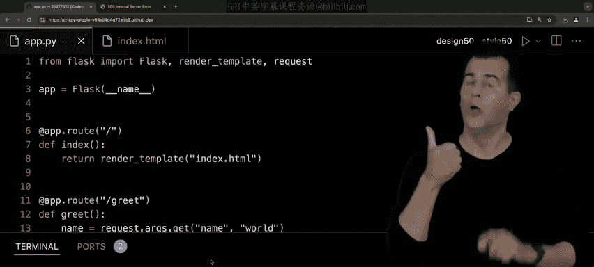

You'll see something useful and indeed I do think I do template not found greet do H and that's pretty much hitting the nail on the head and telling me exactly what there is wrong but interestingly we haven't seen this word yet Ginja exceptions exceptions we've seen before and you might recall that we can try to do something but if an error happens in exception might indeed be raised Ginja though is a new term and this is just referring to another library that anyone on the internet can use but the folks who invented flask decided to adopt this other library themselves called Ginja and what Gja is is essentially a templatelating library its purpose in life is just to handle everything inside of that templates directory So if I go back to my own index do Hm it is technically a library called Ginja that is reading that template top to bottom left to right looking for among other things pairs of curly braces so that Ginja can do the substitution for you now why。

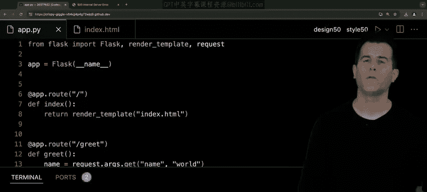

I flask using ginja Well flask realized the folks who invented it。

 we don't have to reinvent the wheel of templating because some other people on the internet already created a templating library called Ginja so we might as well use those in conjunction and this is gonna be more and more common even though when we started using libraries and C they were very small and welldefin and only did one thing once you get to web programming and really software engineering in the real world you're gonna to be using multiple libraries often in conjunction with each other。

 some of which our dependencies for other libraries So we're just seeing an example of that So this is to say ultimately this problem is still mind internal server error means I messed up we know now for my terminal window that the template is not found。

 So what's the solution let's go ahead and create that template let me go back into my terminal window but not the one with the error but my other terminal window that gives me access to a working command prompt let me go ahead and type code greet hml and hit enter and just to make the point let。

Poantically type out this whole file again so open bracket exclamation point doc type HTML。

 then below that HTML Lng equals E。 then below that， let's put the head of this page。Inside of that。

 let's put the title of this page。 We'll call itG just so I know which template is which then let's put the body of the page here and then let's go ahead and do hello comma name using the same placeholder as before。

 So in essence， my greet do Htl template is now what my index do HTMLl template used to be before I deleted the latter and replace it with that interactive web form。

 but now if I go back to app pi， we'll see that greet do HTMLl。

 which is to be rendered should now work as intended and I'm passing in name equals name so that I can have that template。

😡，Use of this placeholder substituted with the actual person's name All right。

 let's cross our fingers， go back to my other tab and reload this page and there we have it hello comma David All right let's now go back to the code via which this current application is implemented and consider what could be done better In fact let me reopen my terminal window and clear it temporarily and type in LS in my templates folder just to confirm that I do indeed have two files let me do CD do do Ls in my hello folder just so that you can see what files are therein and in fact what you see here now is a pretty representative structure for a web application implemented in Python using the flask framework before long we'll see one more folder in here。

 not just templates， but something called static because up until now we haven't served off any images any jascript files any css files we can and by convention those such files will be stored in another folder called static so indeed what you're seeing here is the representative list of files。

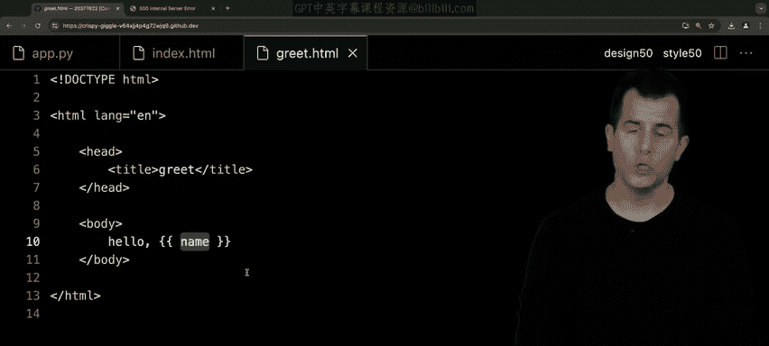

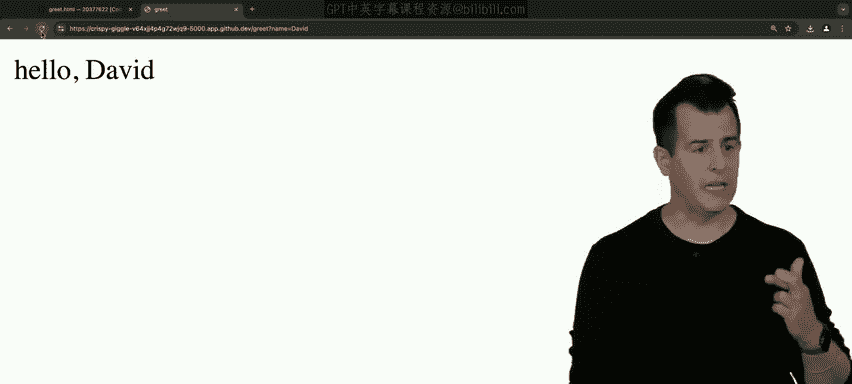

or folders that you typically need to create at some point when building a flask application but I dare say even though we're following these conventions。

 we haven't necessarily done things the best way why well case in point let me hide my terminal window and open up again index。

 html let me go ahead and open up greet hl and if I togg go back and forth between these you can clearly see that they're not changing all of that much there's a lot of commonality。

 the doc type at the top the HTML tag the head tag the title tag the body tag it's really only the contents inside of the ladder head title and body that are actually changing Moreover let me point this out let me go back to my user interface here let me go back to my web form here and you'll see that I've zoomed in a few times so everything's very visible but let me go ahead and open up this feature let me go to rightcl or control click on my viewport let me click inspect to open the developer tools that we talked about last time and notice that。

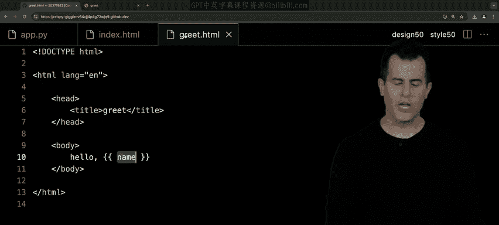

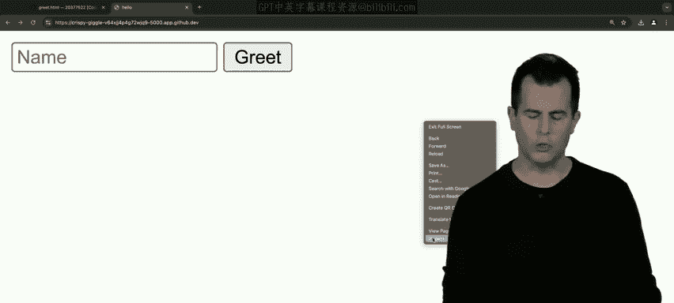

I can actually click this button here at top left which is a useful toggle for changing the type of device you're visiting a website on so for instance if I type this now what you'll see if I shrink my developer tools you'll see a mobile version of this web page so what that button does in Chrome at least in other browsers have similar features you see what this web page would look like on a mobile device and suffice it to say I can barely tell what's on the page the default font is clearly way too small and at least on my phone there really is no easy way to zoom zoom zoom you can tinker with the settings but you don't want your users having to zoom in just to use your website which is to say that my website as implemented now is not responsive to the type of device that's visiting it it is not mobile friendly now there's many different ways to address this including using libraries but minimally a solution to this problem typically is to go in and add an additional tag to the head of your web pages。

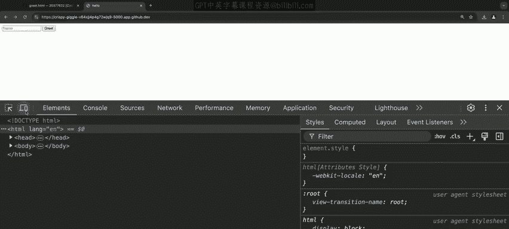

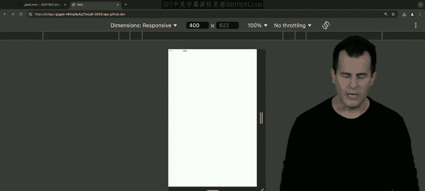

So let me go back to index。htm let me go into the head here and this is a bit of a mouthful。

 but I'm going to use a tag called meta which refers to metadata I'm going to give it an attribute called name and set that equal to viewport why I'm just following the documentation then I'm going to specify that the content of this meta of the content for this meta tag is going to be cryptically an initial dash scale equals one comma with equals device with this is a mouthful and technically I'm reading it off of a sheet of paper because I can never remember exactly what to type here but this tag alone will make my application and my website more generally more mobile friendlyri。

 it's not going to fix all of my potential problems but it is going to tell the browser in particular that it should size things to the specific device with be it an iPhone an Android device an iPad。

 a tablet of some sort or the like and case in point if I now go back to my other tab which is still in my mobile view mode。

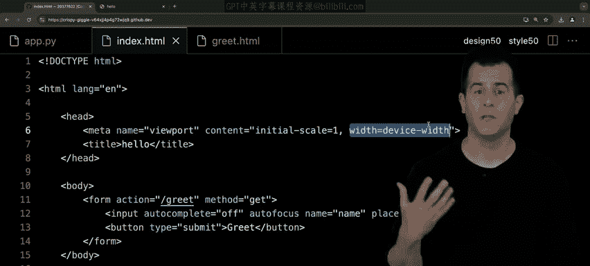

Let me click reload now and notice even though there's the tiniest of forms up there in the top corner when I reload now。

 now it's at least more usable， still relatively small。

 but it's at least readable at this point so that one meta tagag alone goes a long way to making your website responsive in the sense that things are going be resized automatically by the browser based on the device type I mentioned that only because it's going lead to another design opportunity let me close my developer tools let me go back to Vs code here。

 and you know what my great template still doesn't have that mobile friendly tag So all right fine let me just save myself some keystrokes let me highlight this whole line 6 let me go into into its head paste that there and okay now I had argue that I've solved this problem on this page2 but where are we going with this well almost any time in CS50 when I've copied and pasted something it's almost always been the wrong solution to a problem it' suggests say poor design because why copy paste if I can somehow。

😡。

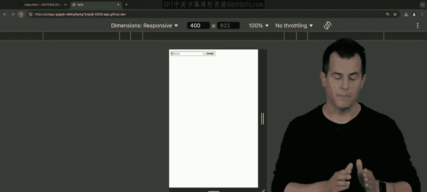

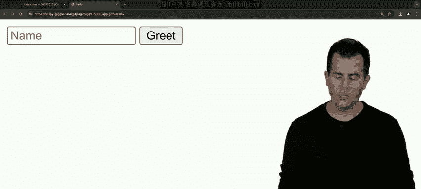

Factor out commonalities and indeed this is the point now to be made if we toggle back and forth between these two files。

 index do HTMLtm and greet do HTMLt there is so much commonality I dare say now all of this is common from line1 through part of line7 all of this is common from line 15 down through line 17 wouldn't it be nice if in HTML we can somehow factor out that code to and here is where templates start to get very powerful because the answer is indeed yes we can actually factor out all of those common lines of HTML in such a way that we don't need to type them again and again so now let me propose that we'll create one more file even though this will allow us to make these two files simpler as follows I'm going to go into my terminal window where I have a command prompt I'm gonna to seed back into my templates folder and I'm going to create a new file called layout。

Html， which is a file name you need to adhere to when using flask because that's the default name。

 all lowercase one word layout html enter I've now got a new tab。

 I'll close my terminal window and for the last time hopefully I'm going type out doc type hml then I'm going to do HTMLl la equals quote unquote then inside of that I'm going have the head of my page inside of which I'm gonna have the title of my page and because this application doesn't really need to change that much I'm just gonna say the title for every page and this application is hello but we could parameterize that if I wanted I'm also though going add that meta tagag so meta name equals quote unquote viewport content equals quotequote initial scale equals one comma with equals device with close closed bracket and then I'm going have the body of my page but here is where the website really varied by template in index that HTMLl was a form but in Greek dol it was hello so and so So what I really want is a whole block of content potentially。

Go in here。 So in fact， what I'm gonna to do inside of the body is use some weird looking syntax。

 This is more gingja syntax and I'm gonna say this open curly brace percent sign block body close percent close curly brace and then with nothing in between there I'm again going go open curly brace percent sign and this time I'm gonna say n block one word no space percent sign close curly brace So this is weird syntax you'll have to look it up to remember it over time。

 but this is the way to specify to flask plug in the content of another template here。

 not just a variables value， but another file should go here。 you can call this anything you want。

 I could call this fo or bar or ba which are the go to terms in computer science。

 but I'm going call it body only because one I only have one such placeholder for now and it's in my body。

 So let's just say this is the placeholder for the body of this web page Keep it simple。

 So now what can I do in my other file。Now that I have that template here， I can go back to。

 for instance。My index do Html and I can delete all of this and I can delete all of this So now an index do html is literally only the form that is going to vary for this particular page though I now need to tell flask how to embed this snippet into my full layout and the way to do that is as follows at the top of mirror template opencurly brace percent sign extends as a verb quote unquote layout html and this is a line of saying this is the way of saying in flask please extend layout do html with the contents of this file。

 I do need to do one more thing。 I need to define the block of code that I want flask to substitute for me and so here too I'm going to say block body just like I did a moment ago and then in here I'm below this I'm going say end block and it's weird this is a ging thing。

😊，Block space body up here， but it's just end blocklock down here the word ED is is prepened to the name of this ginja tag just to be a little nippicky I'm gonna to go ahead and indent this properly so it's only indented once there and that's it and admittedly this looks a little weird but what's important is that now I've only implemented in this file the minimum amount of HTML that differs for this particular route what am I going to do in Greek do HTML well I'm going to delete all of this up here and I'm going to delete all of this down here at the top of this file I'm again going to say extends quote unquote layout do HTMLm close quote and then another percent sign and close curly brace below that I'm going to say block body percent sign close curly and then down here I'm going to say as before end block and close that tag I'm going to fix the indentation here just to be consistent。

😡，And now I have a second。Block that will be plugged in when greet do html is used。 So again。

 these files now differ only in terms of the contents of that block。

 So if I toggle back and forth here， you'll see that let me add spacing just for consistency here。

 index Htl has the form greet do Htl has the hello and the placeholder for name All right。

 after all of that work。 let me go back to app pi and surprise。

 don't need to change anything because I'm using the render template function。

 it knows not only how to handle those curly braces with variables as placeholders。

 it also understands curly brace percent signs， percent signs。

 curly brace as per the documentation for Ginja itself。 So in fact。

 what I'm gonna go ahead and do now is go back to my web page without changing anything in app pi just for good measure。

 I'll reload this page here wasn't expecting this to happen。 but I've clearly induced a problem。

 I'm now getting one of these 500 internal server error。 So how do I diagnose this。

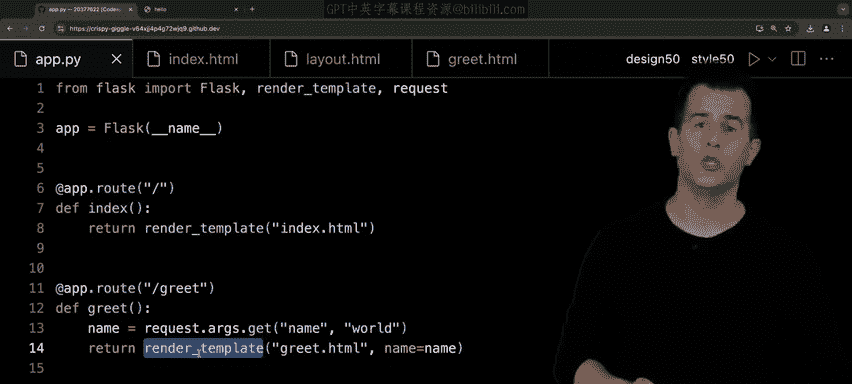

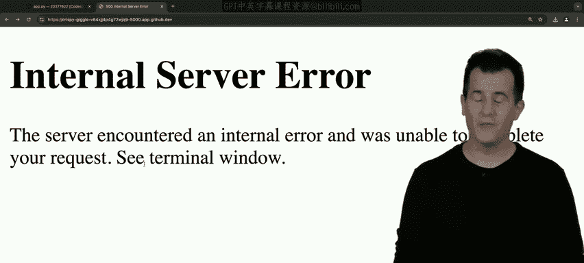

Well， a good programmer would know to go back to their terminal window。

 go specifically to the one that's running flask， and here we have another Gingja exception template syntax error。

 expected token end of statement block gott string Now where is that let's go back into my layout。

 HTML。😡，And this looks correct， let me go back into index。htm， ah， super subtle。

 I did something dumb。😊，Can anyone spot the mistake？Before I reveal。Anyone see it very subtle。

And I think， yes， we have someone pointing it out。 I stupidly forgot my double quotes。 So that's all。

 And that's why it was seeing a string or a stir instead of the tags as it expected。

 So subtle and I was holding my breath that I was actually gonna be able to solve that in front of everyone but the solution was clearly or the hints of the solution was clearly in my terminal window so now let's hide my terminal window go back to my other tab cross my fingers which maybe I forgot to do before which is the problem reload there we go index HTML is working and if I type in my name and hit enter or click read now the whole thing is working again。

 but more importantly， if I view page source notice that I indeed see that the same template has been used the same blueprint。

 if you will for this page as well as if we go look at the other all of this stuff is common to these files Now as an aside once you're in the browser viewing the output from the server it's okay if not everything is pretty printed perfectly what matters when it comes to style with web programming as with programming in general is what you and。

😊。

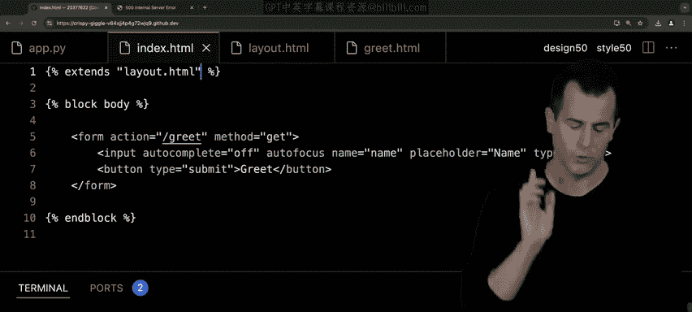

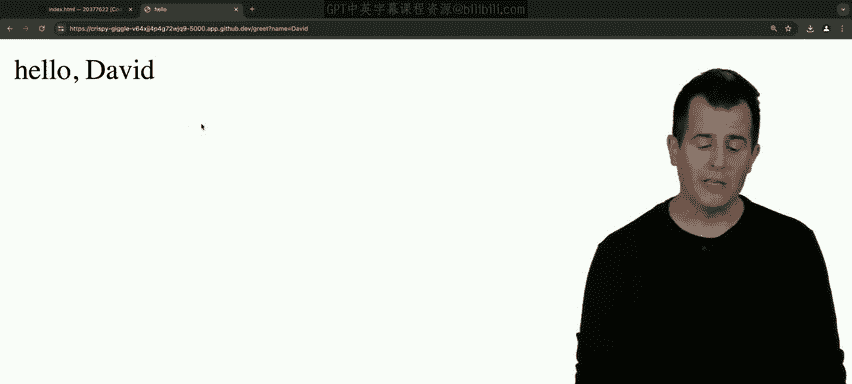

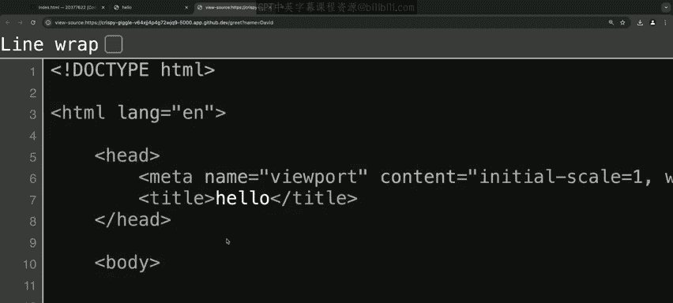

Developer see on the server， the browser is perfectly okay with there being less or more white space just because it was all dynamically generated。

 but indeed if I go back now， not just to hello and not just to my greet route。

 but this one EnVi page source， you'll see that's what's been generated by the server is indeed almost the same up until a point。

😡。

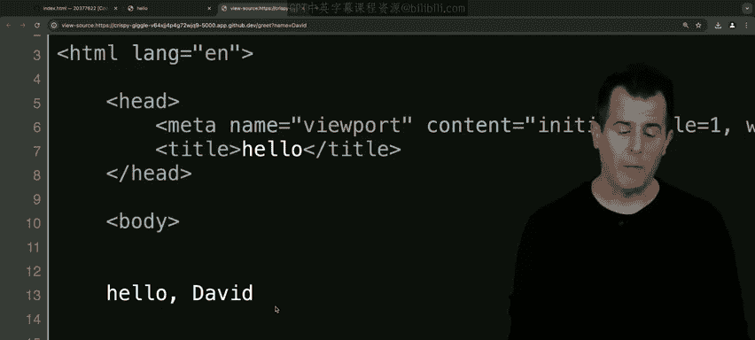

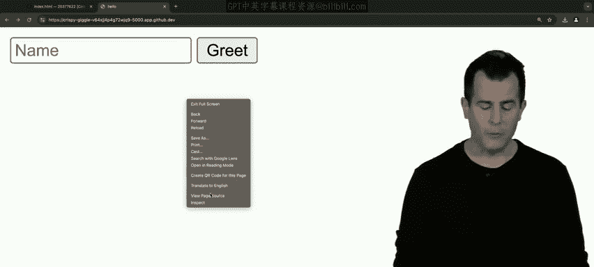

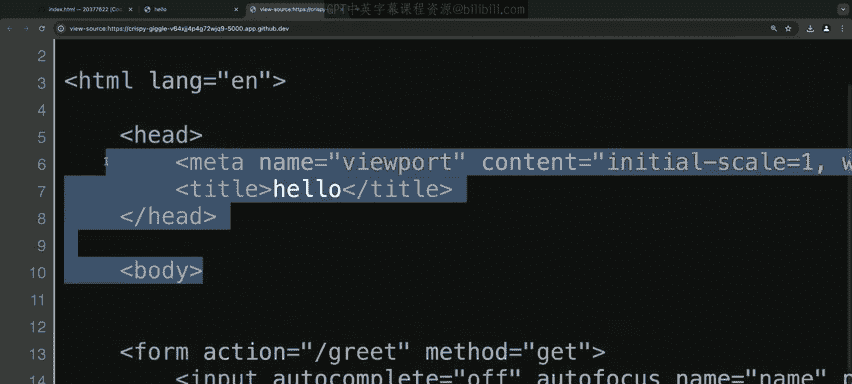

All right， so up until now we've only been using HtTP get requests whereby any user input。

 whether it's from the form or manually typed in is indeed being sent from browser to server via the URL itself but it turns out there are other methods that we can use besides get recall that there's also post and post treats your data a little more privately in the sense that it' still kind of puts it into that virtual envelope。

 but it shoves it down deeper such that it doesn't appear in the user' URL bar this of course is compelling if it's a password credit card or anything personal or private so how can we switch our own application for instance from using get to using post instead well let me propose that we go back first to index HTML because it's in index HTML that we explicitly specified in method of get before so it's very easy in HTML to change the method that this form is going to use from get to post now weirdly again in HTML you should lowercase get and post even though when you see them inside the actual virtual envelope or in your developer。

😡，Tool it's capital it's an uppercase get and an uppercase post， but that said。

 let's go ahead and see what happens when I make that simple change from get to post in my form alone because I've changed my HTML。

 I'm going to reload the page just to make sure I have the latest HTML in my browser's memory I'm going type my name as before and I'm going to clickG and notice this time that the URL is not going to display name equals David because I've switched from get to post En。

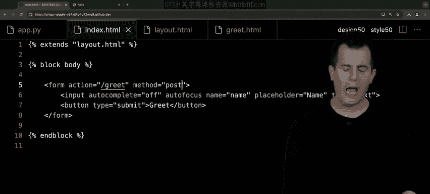

But even though I'm ending up at slashG and I'm not seeing question mark name equals David。

 the method is not allowed。 This is a weird 405 error now why is that well it turns out if I go into do pi by default when you create a route using flask as in line 6 or in line 11 by default only get is going to be supported but if you read the documentation or follow along here you can tell flask what additional methods if any to actually support so in fact if I want this greet method to actually support not get but instead post what I can do is pass in a second argument a named parameter and say methods equals and then pass in a python list of methods that I want to support if I only want to support post I can literally just do quote unquote post if I want to support get and post I can do both as a comma separated list inside of this Python list because again from week6 recall it square brackets imply that this is indeed a Python list。

😡。

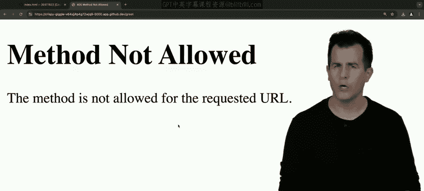

But for now I'm a fine with just supporting post and so I just pass in as the value of methods a list with one value。

 quote unquotepost and all caps Allright， let's now go back to my browser tab let's go back to the form let me type in my name again crossing my fingers and greet and now so close the error is gone but it's not greeting me。

 it's using that default value hello comma world now this makes sense at a glance because clearly there's no parameter being passed into the URL but my code it turns out was assuming that if there were a parameter it would come in via get not via post and this is among the weirder design decisions in flask but whereas get parameters are stored in request do orgs as we saw a dictionary that gives you all of those key value pairs from the URL。

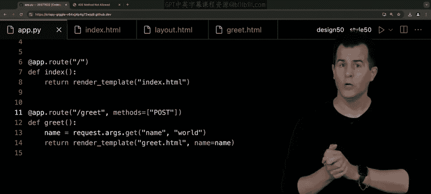

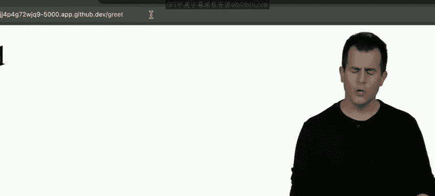

Post requests， keyvalue pairs are stored in flask using request form so it makes sense that they come from the form but it's a little ambiguous at least to me like why we say arggs here and form here you just kind have to memorize it or look it up Request orgs is forget requestquest form is for post the implication then is if I go back to vS code here it's a pretty simple change I just have to change request orrg to request form so I look in the right place for that key value pair let me go back to my other browser tab click reload noticing that the browsers now going to caution me are you sure you want to resubmit this form and that's useful because you don't want to accidentally pay for something twice on a website by submitting your credit card twice you don't want to type in your password maybe more times than needed and so in this or send your password more times than needed So the browsers cautioning me because I'm using post underneath the hood do I actually want to resubmit this form So yes in this case so I'm gonna click continue and now I do see。

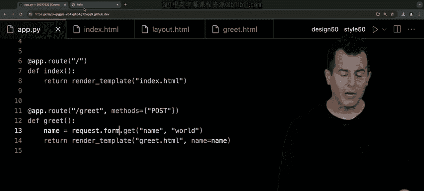

Hello comma David because it's been passed in underneath the hood if you will inside more deeply that envelope and we can actually see this let's do one other thing here。

 let me go back to the form， let me right click or control click on my viewport and click inspect to open up the developer tools let me go under network here and let's go ahead and do this let me go ahead and type in my name and then clickG and like last week when we were poking around all of the HttP request going back and forth from browser to server let's see what the browsers actually sending when I clickG I indeed see that the URL at the top change toG but there's no mention of David or name but if I go down here into my developer tools and click on that HttP request in my log I can now scroll down and see a the request method was apparently post and if I scroll down further I'll see not only the response but if I keep going I'll also see the request headers which are sent inside of that envelope as well but what I really。

Care about in this case is payload If I click on payload。

 This is a term of art that means what inputs are you sending from browser to server。

 you'll see a list here of all of the form data name Col and David so you can actually see in your browser's developer tools exactly what was sent and you can do this on any website the next time you log into a website buy something online you can poke around the network tab of your developer tools and see all of the key value pairs and frankly you're going to probably see many more values than you might have expected because browsers of course have lots and lots of features more than we're implementing in these simple examples but it's just key value pairs again and again。

All right， so we've solved a bunch of problems now in fact。

 we've even added a layer of privacy if you will， in so far as the data is still being sent yes。

 but it's not showing up in the URL， which means it's not going to end up in my autocomplete。

 which means it's not going to end up in my history in the same way which is indeed great for anything private like credit cards or the like but what more can we do here Well as we've often done in the past let me see if we can tighten up our code a little bit for instance could we use a single route and still implement the same application now this might not be desirable so consider this an example of how you could collapse some of your code into fewer lines。

 but this isn't necessarily to say it's the right way or the only way to do things but I do think it's compelling in some cases as you'll see for instance in the problem set for this coming week wherein we adopt a similar paradigm to try to keep the code a little bit simpler So let me go back into apppi and let me propose to do this let's just have one route that does everything including presenting the form and also displaying hello so and so but。

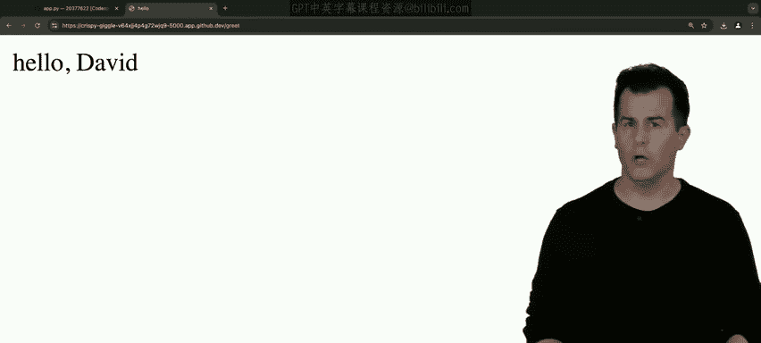

Support both get and post for this route so I'm going to say methods equals and then in aython list quotequ get comma quote unquote post overriding the default which again is just get then inside of this function what I'm going to do is this if request method equals equals post then let's do this else let's do this In other words if the request coming in happens to be post and this is just another special variable inside of the request object which we imported earlier turns out there's another variable if you will called method and you can check what is the method that came from the browser is it get is a post is it something else too and if it is let's go ahead and do this else if it's not it's presumably get so let's just render the default template so what can I now do I can grab this code from greet and delete it let me delete the greet function entirely and I think。

I can do is just move all of this functionality in here let me fix my indentation but now if the request method is post then I'm gonna to do exactly what we did before else I'm going to display the form to the user so what more do I need to change let me go back to my index HTML wherein previously I had an action value ofG but this is no longer applicable there is no more route I just want to submit to s and frankly at this point I can also just get rid of action altogether because the browser by could default will assume you want to submit to the same URL from once you came but to be explicit I'll go ahead and leave it for now let me go back now to my browser tab and go back let me reload to get the very latest of everything let me go ahead and type in David and watch now that the URL does not in fact change toG but I am in fact greeted there's nog anymore but it was in fact sent from browser to server using。

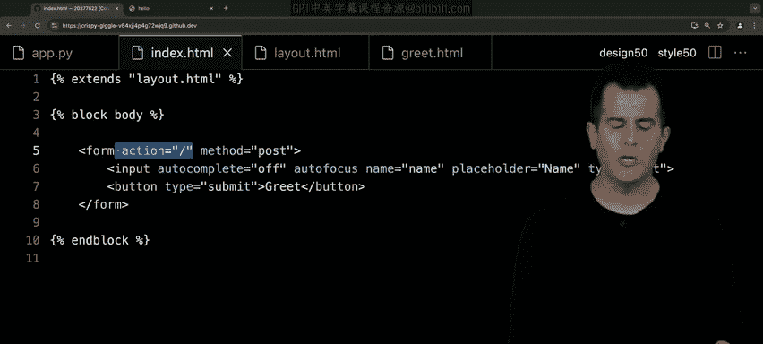

PostAnd my web application now using just a single route is handling both methods now in this case。😡。

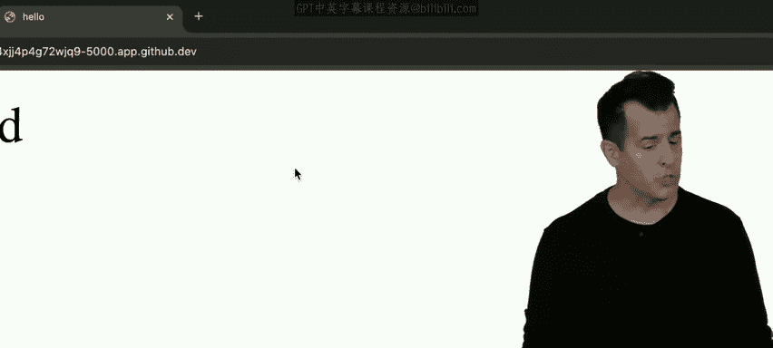

All right， so we've tightened things up， which might be useful for larger web applications wherein we might want to not have as many functions and complexity in our apppi。

 but what more can we now do Well it turns out Ginja the templating library that flask uses has its own documentation page and frankly it's super long but there's some fairly simple features documented therein and I'll show us at least one of them here so at Ginja thus far it allows us to place values inside of those curly braces。

 it also allows us to do that block feature， which is really templating by definition to grab the contents of layout HTML and plug in this particular templates block of code。

 but we can do other things conditionally even in Ginja as well So for instance。

 suppose I want in app to just get rid of this logic whereby I am not only getting the form from the value from the form I'm also passing in。

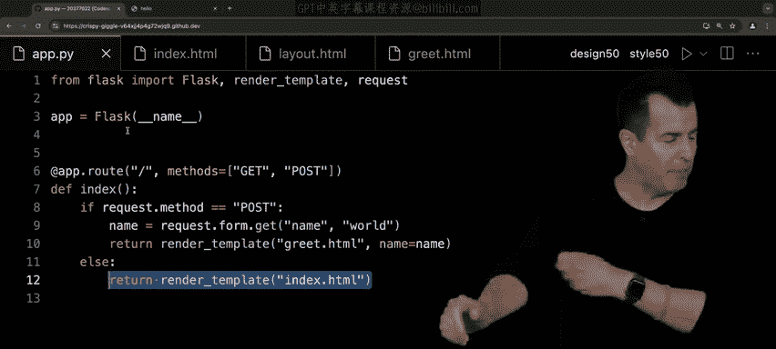

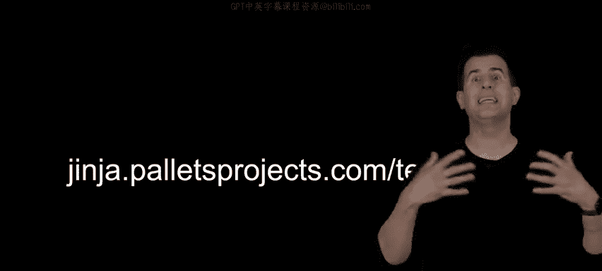

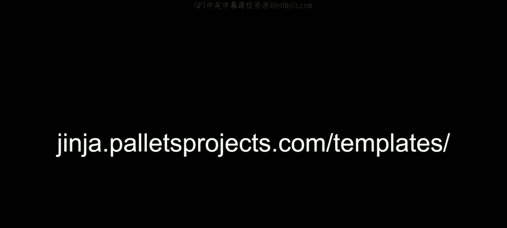

Default value in app dot pi supposeose that I want to relegate these default values to the templates because after all if what the templates are what the humans actually see。

 it's pretty reasonable then for whoever is creating the templates put the default values closest to the user in those templates So this is to say let me just get rid of this default value of name for name of quotequote world and just no matter what is in the form go ahead and just pass it into the template and frankly as before we don't strictly need this variable at all。

 I can get rid of this whole line9 and just replace name equals and then the return value of request do form get quote unquote name in order to get that value same thing just getting rid of a variable if if nothing else but I have gotten rid of to the default value quote unquote world how can I restore that Well here's what's cool about Ginja and templating techniques in general with web programming if I go back to Greek do HTML。

 I don't want to just blindly say hello comma name because。

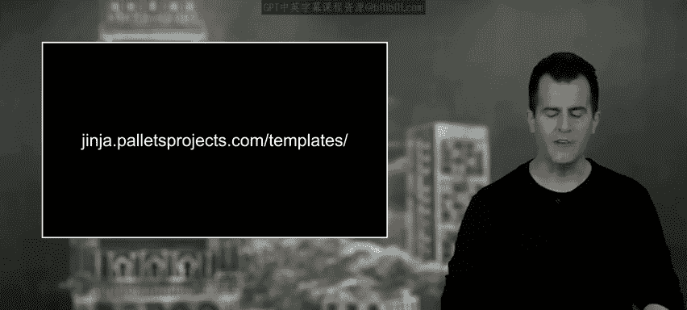

mightight be blank it might not have an actual value， but it turns out that's okay。

 What I'm going to do here is the following instead of just saying hello。

 I'm going to go ahead and say hello comma and then if there is a name value then let's go ahead and spit it out inside of these double curly braces else if there is no name value then let's go ahead and spit out the word world and then as before use end and the same name as the first tag and if so we haven't seen the syntax yet。

 but it's clearly similar in spirit to the block syntax and this is gingja syntax for doing something conditionally if name has a value that's not empty like quote unquote then go ahead and just display the name right here else if it is a blank value or absent altogether go ahead and spit out world instead and that's it for the if conditional Now notice I've used like several lines of code here。

 which seems weird because don't。say hello comma and then the person's name on the next line but remember how HTML works it's gonna to ignore anything more than a single whitespace so even though the name or the word world are on different lines all of that whitespace is going to get collapsed into a single space visually for the user in the browser so if I did this right let's go back over to my tab here and let's go ahead and hit reload on the page itself by clicking on the URL and hitting En。

 I didn't want to hit command R or control R because I don't want to resubmit the form I want to reload the page and the best way to do that would be indeed to just go ahead and click on the URL and hit En let me go ahead and type my name in and clickG and hopefully there I am again hello comma David if I view page source here notice you see the template and you even see that my name is on a new line because that's where it was in the conditional but the browser doesn't care it's consolidating all of that multiple whitespace into a single whitespace instead。

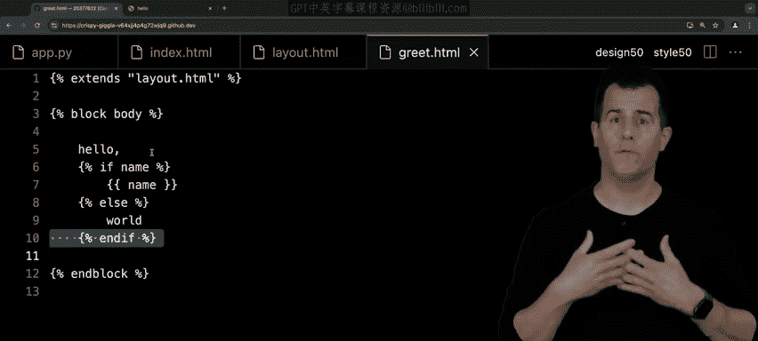

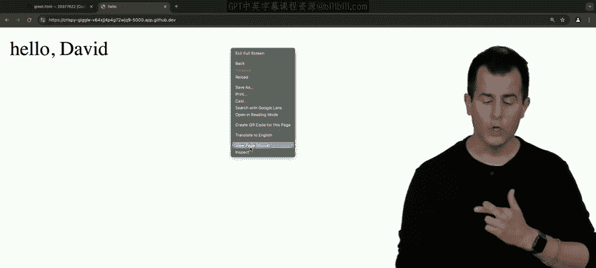

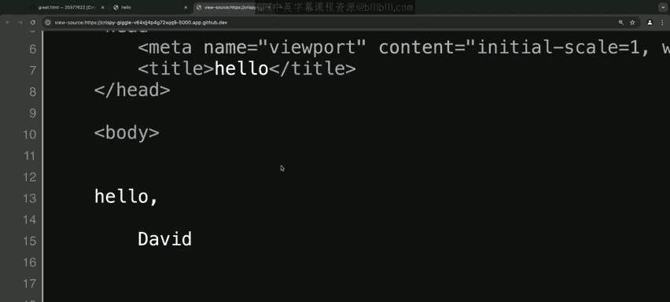

So that's a lot of examples just to say hello world。

 but the overarching goal here thus far has been to implement really the simplest of web applications that takes user input produces dynamically HTML that corresponds to that input effectively implementing our very first back end Of course all of these examples thus far really just say hello world to the user so let's go ahead though take a break and when we come back and say let's say five minutes we will see how you could implement your very own website for a freshman intramural sports program just as I did like 25 years ago by teaching myself web programming after having taken CS50 unfortunately the internet back in the late 90s looked quite like this I don't know to this day why I used a repeating background image but that's what the web looked like but we'll see ultimately how you could implement something like this when we return in five minutes See you soon right we are back so back in 1997 the way that Harvard Undergraduates were register for freshman。

intratramural sports， otherwise known as Frosh I ams was they would pick up a piece of paper。

 They would write down their name on it。 They would like check off a box for any of the sports that they wanted to participate in and then they would walk across Harvard Yard open up one of the dormitory doors and slide the sheet of paper under the door of what's known as a proctor。

 a resident advisor who was running the sports that year。

 Suffice it to say there was an opportunity to move all of this online。

 even though the Internet itself was still rather in its infancy or at least as we now know it。

 However， I had already taken CS50 in fall of 1996 this was probably the spring or fall thereafter and I decided even though CS50 at the time didn't even introduce people to web programming。

 I actually tried to learn a bit of it on my own。 and I undoubtedly did not do things very well and certainly not the best way possible but at the time I taught myself a language called Pearl which was very popular for web programming nowadays we have languages like Python and PP and Java and Ruby and Javascript and many others as well。

 But the point is。😊，Even after just CS50， maybe one other programming course。

 you really should have this solid foundation via which to teach yourself new languages much like the trajectory we've had you on from scratch to C to Python to SQL to javascript and now bringing it all together in the context of web programming so let's without the ugliness recreate a little bit of what I build way back when to allow students to register for Frosh Ims via web browser instead of a piece of paper let me flip over here to VS code where in advance of this demonstration I prepared a few files based on the hello demos from before in particular in a Frosh I ams directory which I created a new I have the following files already app requirements text and templates and inside of templates I have index hl and layout h and let me go ahead and hide my terminal window you can see in the ladder the following layout which is identical to what we used a moment ago for our hello examples but I've changed the。

From hellello to Frosh I ams the index template meanwhile。

 extends that layout or equivalently inherits from that layout。

 but I haven't put any body inside of this block here I deleted we had before just so I don't have to type as much to get us started now and then in app up pie similarly I copied the first couple of lines of code but delete it all of my routes just so that I dig again don't have to type all of those from scratch but let's go ahead now and implement the simplest of registration forms for some number of sports and what I'm going to do is the following I'm going go over to my index HTML which again extends already layout HTML and let's begin to put together a registration form I want this page to very clearly be about registration so I'm going to use like an h1 tag and I'll say register for instance and then below that I'm gonna to have the start a form tag the action of which I could make anything including slash itself but let's keep things clear and let's have the action B register for this one and the method for this。

One will be quote unquote post insideside of this form tag notice now I'm gonna have an input。

 I'm going to turn off autocompte as before， I'm going to turn on autofocus for that input and I'm going specify that the name of this input is itself name because this is going be for the students name who's registering the placeholder value I'm going to use is capitalized name to make clear and gray text what they should type in and the type of this just to be explicit is indeed going to be a text box Now I'm going introduce another form element that you see all over the place on the web even if we haven't necessarily had occasion to use it ourselves I'm going have a select menu which is equivalent to a dropdown menu in a browser and the name for this menu is going to be sport because I want this dropdown menu to be a list of sports that the student can select inside of that let's come up with three sports for now option value equals basket ball and then inside of the open tag and close tag for option I'm gonna just repeat myself basketball。

Then below that， I'm gonna have another option whose value is going to be soccer American football in this case。

 Then I'm going to type soccer inside of the Open tagag and close tag。

 and then the third and final option will have a value of quote unquote ultimate Frisbee and then inside of that open closed tag I'll say again ultimate Frisbee。

 So this clearly evinces some redundancy， however， what this reveals is that with a select menu。

 much like with links with the anchor tag， you can have the human see one thing。

 but the value actually used is another， even though for simplicity I'm keeping them exactly the same Now let me go ahead and go into my other tab。

 which up until now has been saying hello David and hellello world。

 but I haven't stopped running flask。 And so if I keep doing this and reload if I keep visiting this URL I'm going keep seeing that form and if I type in David I'm going to click because my previous web application is still running So I can't just start。

😊。

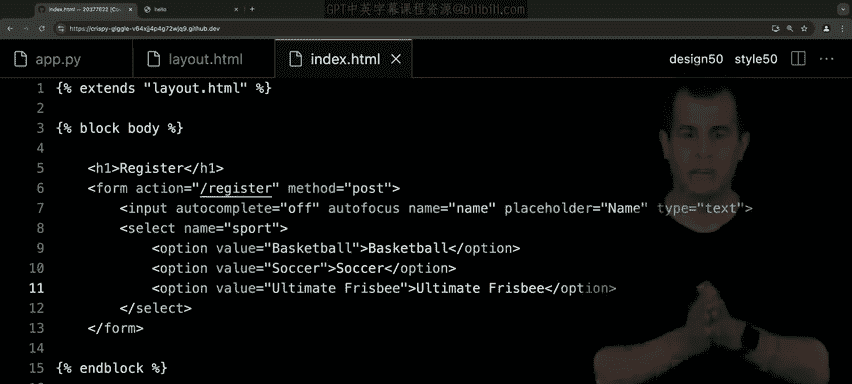

new web application and expect that this browser tab is going to work even though it's still port 5000。

 let me go back to VS code， open my terminal window。

 go to my very first terminal wherein we see all of the logs from flask that have been running and in fact among the error messages there is actually some diagnostically useful output sometimes what flask is showing you in this terminal window even though I've hidden it most of the time is a log that is a recording of all of the get requests and all of the post request that came from a browser to the server and you're seeing dates and times。

 the IP address and so forth some of which is going to be not very useful in this environment because we're using a code space instead of putting this website on the actual web publicly everything is private now to me but there is some diagnostically useful information there for instance this get request at the top returned status code of 200 as did every post and get below that but this is again where we'll see any errors and if we start introducing SQL before long we'll even see copies of our SQL。

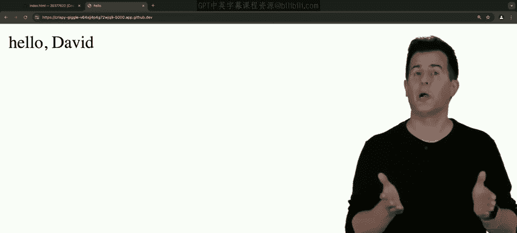

So that we can diagnose any problems in those but this is all to say that I don't want flask to be running in my hello folder anymore。

 so I'm going to hit controlr C to interrupt that I'm going to hit Cd to get back to my default folder。

 I'm going to type Cd Fro Is now which my other terminal was already in and indeed if I type Ls in here I see those same files now I'll clear my terminal and I'm gonna rerun flask run in my Frosh Is folder turns out that's going to open up the same port 5000 by default。

 So in fact I can just directly go back to this tab。

 which previously was my hello app and just by reloading that URL enter now I see not found 404 So I've clearly broke something but why is that well I don't have any routes in this Frosh Is application yet because I started almost from scratch So let me go ahead and close my terminal window for now and go back to app do and let's just start serving up that default template quite simply let's do app route as。

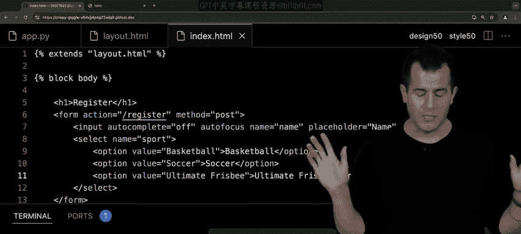

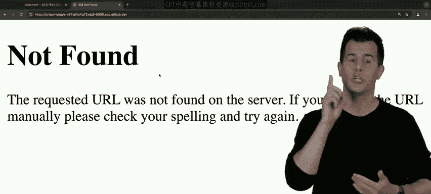

quote unquote s let's create a function as before called index that we could call it technically anything we want and let's have this function do very little。

 let's just return render template passing in index do hm Now for this new web application that slash route exists which means if I go back to my other tab hopefully it will be found when I click reload and sure enough there is my registration form with a name field and the cursor is autofoed inside of it with the cursor blinking and there is my select menu indeed if I click on it I see basketball soccer and ultimate Fribe So this form doesn't really do anything yet。

 and frankly， I'm not sure I love the fact that basketball is sort of the implied sport like it would be nice to maybe see a default value or blank value that's just an aesthetic detail if I go back to VS code here go back into index there's a few ways I could fix this I could do for instance。

 option value equals quote unquote maybe nothing because it's a default value and I could just say something like sport to be sort of a title for that。

😊。

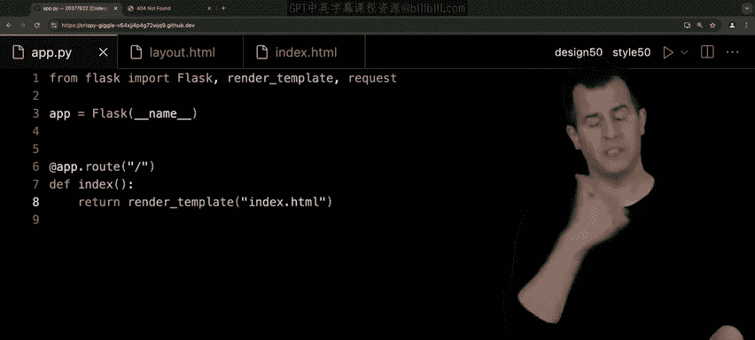

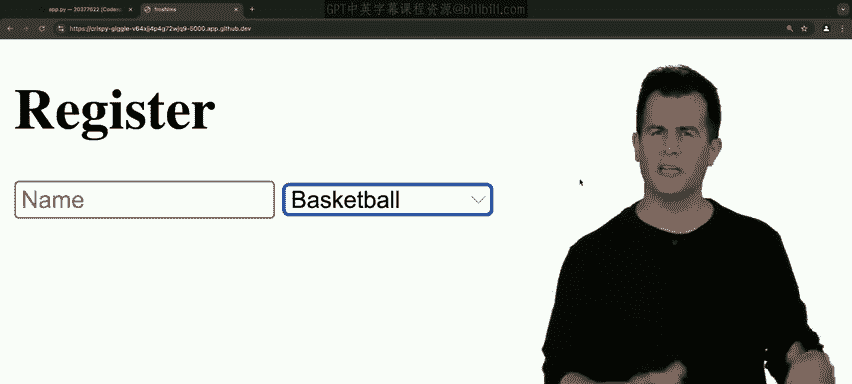

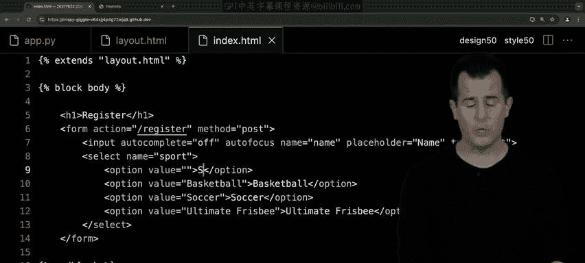

Drop down let me go back to my browser reload and yeah sure enough I now have sport as the top option。

 but this is a little weird because I don't want the user to be able to register for sport I don't really want it to be a selectable option so it turns out there's some other attributes we can play within this context and in fact if we want to display a title like that sport we can actually specify that the option itself is disabled but it is selected by default so these are two other HTML attributes that you can use with the option tag in HTML they don't need value so they don't need equal signs or quote marks you can just say disabled and selected but now when I go back to this tab and reload once more notice that it indeed still says sport but it's grayed out so I can't actually submit that value I can only choose from these three things here and using libraries like bootstrap for CSS you can style these things even more beautifully than this but this is perhaps the simplest way to at least have a title。

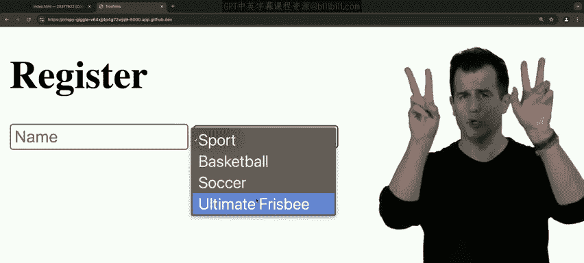

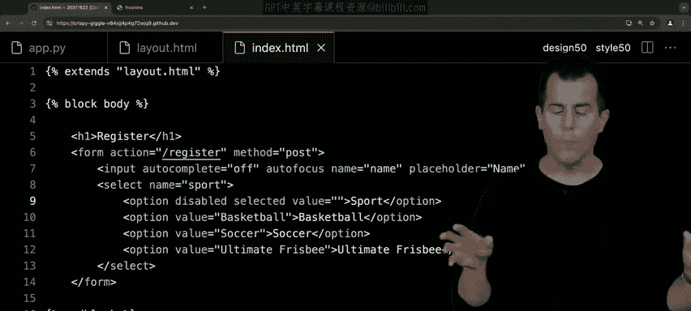

For that there select menu。 Allright， I need one more thing in this form。

 Let me below my select menu here。 let's do a button。

 the type of which is submit and then that's gonna be a register button now instead of green。

 So if now I go back here and reload one more time。

 Now I have the name the sport dropdown and the registration button as well。

 but we're not yet in a position to do anything with that information until I think we implement another route。

 So let me go back to vs code。 let me open up app pi。 and in addition to my index route。

 which is just serving up that web page， let's create another route app dot route quote unquote register this one just for privacy reasons is going to use post instead of get。

 So I'm going to say quote unquote post inside of a python list there。

 let's define another function called register though again， it can be anything I want。

 but I like to name them exactly the same as the routes themselves to keep things straight。

 and then let's go ahead and do this。 Let's go ahead and check whether the。😊。

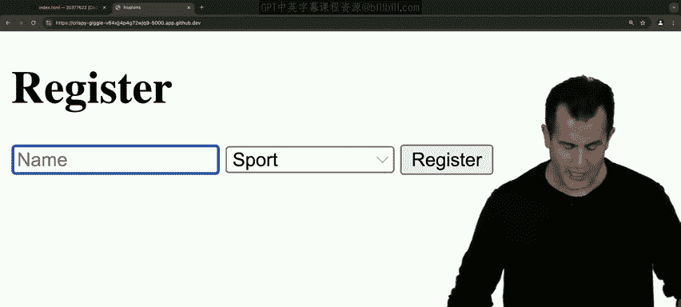

Use hass registered or not and then tell them whether we're successful or there's a failure。

 So for now let's actually well let's do this。 How about we return this to keep it simple。

 return render template and let's pretend like a template exists for success htm This suggests that I should probably have a template called success hl so let's whip one up really quickly and in success html let me do this first let me open my terminal and get to a prompt so I can type code actually first CDd template to make sure it's in the right place then code success html in this file I do need a bit of boilerp so extends quote unquote layout do htl with the close quote this time then block body over here。

Then I'll do an end bloody body so close。 block body。 then let's end block down here。

 And inside of here， let's just say something successful Like you are registered。 well。

 not really because we we haven't actually done the hard part yet。

 Let me go back now to app pi just to confirm that okay， when this route is called。

 no matter what for the moment， we will render success do H。 So let's try it。

 So's go back to the browser here。 type in David， let's choose say basketball for the sport and click register。

 and internal server error 500， which we know is my fault。 So let's go back to VS code。😊。

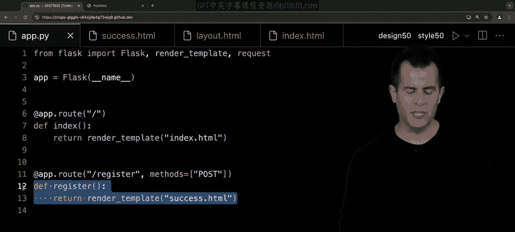

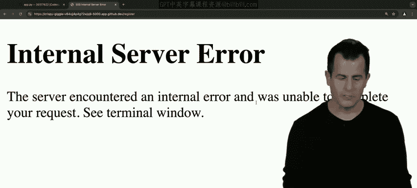

Let us open up my terminal window。 Let's go to the first one that's running flask run。

 And I did it again。 somehow， a template syntax error， unexpected curly brace。 Allright， well。

 where could that be， I did it again， But this time with a different character。 Okay。

 so I was so focused on adding the double quote， I did not add， in fact， the。

curly I'm so focused on adding the double quote I did not add the second percent sign。

 So now let's go back to my internal server error， click reload。

 resubmit the form that I just submit and now I'm told you are registered well not really that's because the route's not doing anything intellectually interesting yet it's just rendering that template blindly All right well let's improve upon that。

 I think what we should require is that to register first sport。

 the student should have to provide a name and have to provide a sport。

 Unfortunately that is not a current requirement。 For instance。

 if I go back to the form and I don't type in a name and I don't type in a sport and click register。

 I'm still told you are registered to be fair I'm told well not really So you let's make clear that this is a bug。

 let's get rid of the parenthetical。 Let's go back to the form。 let's not type a name。

 let's not choose a sport and click registered now it's clearly buggy because I am not in fact registered。

 I've done nothing with this information。 All right let's go back to BS code here let's go back to a。

😡。

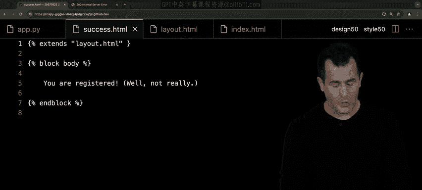

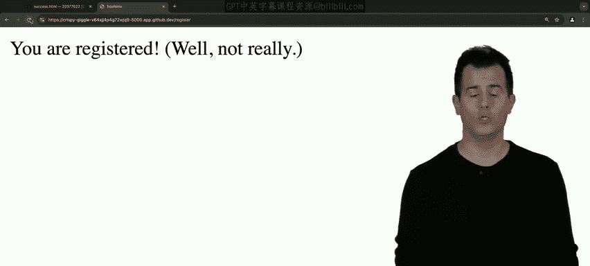

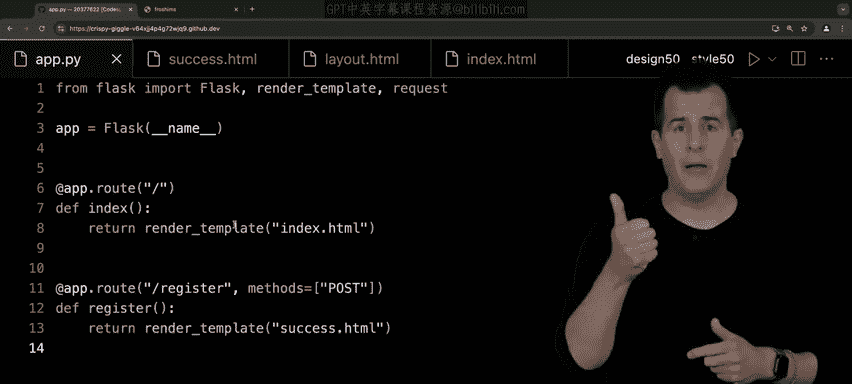

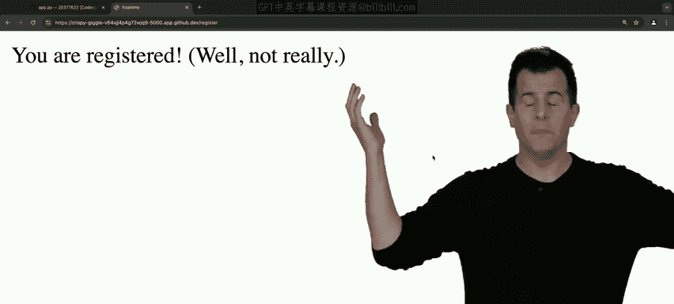

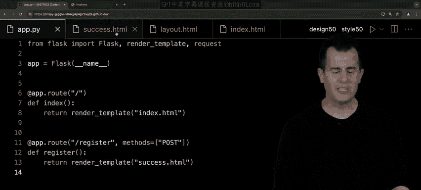

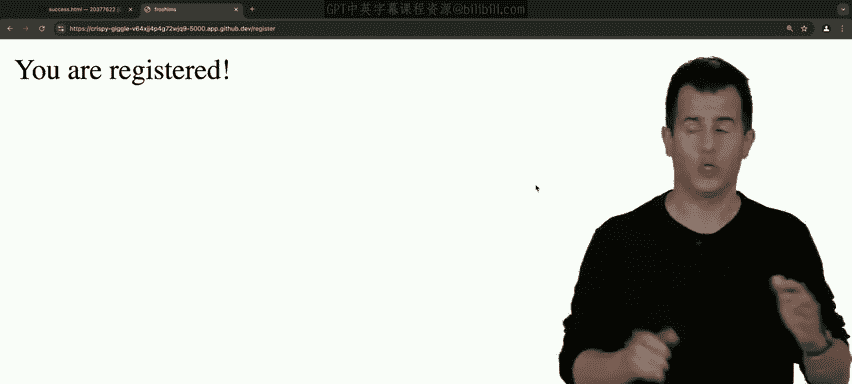

And let's express this idea of if there's not a name or there's not a sport， it is a failure。

 do not let the user register so let's try this we can express this in a few different ways in Python I'm going to propose to do it like this if there is not a value for request form get quote unquote name or there is not a value for request do form get quote unote sport then go ahead and return render template quote unquote failure HTML else if there is a value for name and for sport great let's go ahead and render template success h now I can tighten this up slightly strictly speaking if I'm conditionally returning a template in line 14 I don't really need the else so just to type this out I'm going to remove that altogether together but this is just the same kind of logic we could have done in C or in Python before we introduce flashask or。

Javascript， this is equivalent to an if else because returning， of course。

 immediately returns from this register function so you don't strictly need the else。

 And I'm doing this just to tighten up the code， but it's not logically necessary。

 Of course failure do htl does not yet exist。 So let me save a couple keystrokes here。

 let me copy the contents of success html let me go into my terminal create another file called failure html I'm going to go ahead just to save a moment in class to copy paste that there。

 but I'm going to say this in this template you are not registered。

 Now granted I'm copying and pasting， which almost always is a bad thing but when it comes to using templates in flask using gingja here you do still need lines 13 and7 to make this work So those are necessarily copy pastsable or retyable but now I think we have two scenarios。

 let me now go back to the form Let me go ahead and type in my name and choose my sports and click register and we're still good if we haven't done anything with the data but at least the human cooperated。

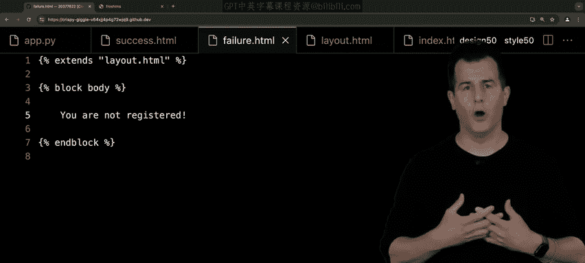

Go back now， reload the page， don't type a name， don't choose a sport and click register aha now we're at least telling the user they are not registered all right so we're making progress we are conditionally checking whether or not the user has actually registered for sport。

Let's now make sure that they can't really hack us or do something malicious because right now if they type in their name and they type in a sport。

 we will register them or so we say but recall that anything client side isn't necessarily robust in fact let me go back to index HTML and let me actually do this let me add the required attribute here and let me add the required attribute here you don't need to give it a value within an equal sign and quote unquote let me go back to my browser and click reload and now let me try to click on register without giving a name or a sport unfortunately the browser prevents me or fortunate the browser prevents me so let me type in David let me not choose a sport register okay so we seem to have error checking now preventing the human from submitting this form without valid data but not quite because indeed all of this is happening client side if I view source in my browser I can see。

😡。

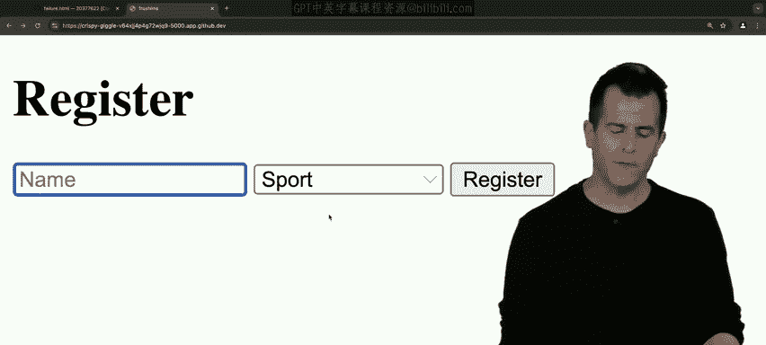

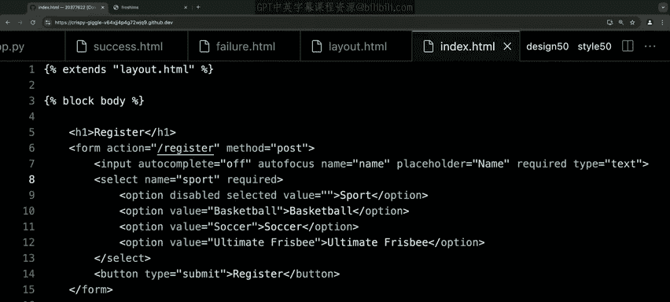

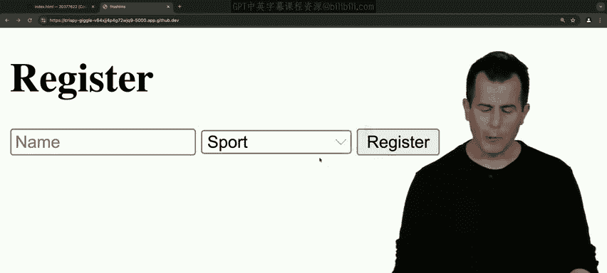

The required attribute at the end of the input tag and at the end of the select tag here。

 but recall that this is my copy of that HTML and if I want to be malicious。

 I could control click or command click on my viewport and choose inspect to open my developer tools。

😡。

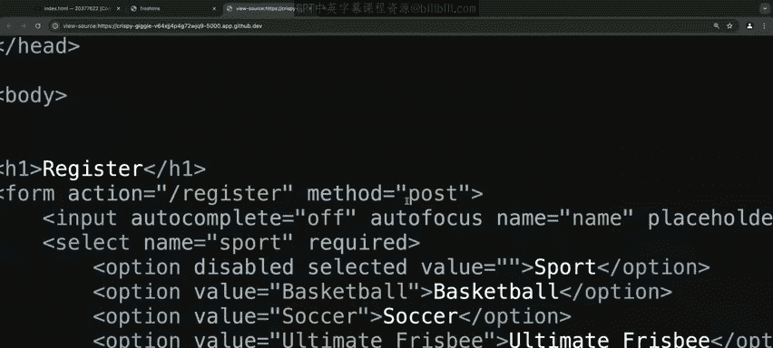

Recall from last time I can look at the elements of this page Pre printed like this and notice here。

 let me shrink the CSS part of this window notice that I can actually edit this HTML if I want。

 for instance I can sort of click on required click delete and then save it and now the registered the required attribute is gone I can do the same here on the select field and get rid of that and now it's gone and now I can type in David but I can for instance skip the sport and click register and it doesn't stop me anymore from doing that because I've disabled client side validation Moreoverover。

 things can get even more malicious suppose that in a protest vote I don't want to register for basketball or American football Aka soccer or Frisbee like I want to register for like actual football so in the European sense for instance。

 so let me go into my attributes here let me change the value of soccer to。

Let me change what the user sees from soccer to football and now let me go ahead and save that now let me confirm that I still got my name but notice now I can register for football instead of soccer click register and now I'm registered for a sport that at least semantically is not even supported in the web application itself and frankly by that logic I could have register for any sport that I happen to type in into the web pages HTML which is to say we need serverside validation it is fine to use client side validation as by adding the required attribute in places if you just want to give the user immediate feedback and prevent sort of good users from doing something incorrect or foolishly you can't prevent the adversaries。

 the malicious users from messing around with your form using client side techniques alone so let's go into VS code again and let's this time open up app dot Pi and in app dot pi。

 let's go ahead and make a canonical global variable containing。

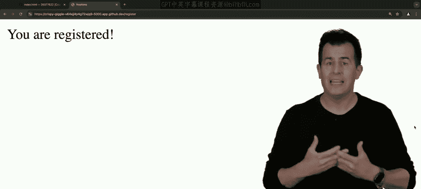

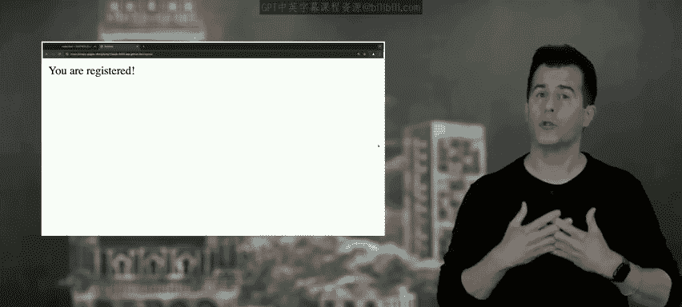

All of the sports that are officially offered this semester so let me create a variable and I'll call it sports in all caps even though Python does not have constants per se still conventional to capitalize the variable just to make clear that you shouldn't change this and it's global let me go ahead and set this equal to the following Python list this list is going to contain basketball quote unquote soccer quote unquote and ultimate frisbee here as well and you can it's often conventional I have a trailing slash even after the last element just to make it easier to copy paste and reorder things in code even though logically it's not in fact necessary what am I going go ahead and do next now well if I have now this variable containing all of these sports I don't actually need to hardcode them into my template so I'm actually going to do this let me pass in a placeholder called sports into this index template and set it equal to that global variables value and now in index。

 HT。😡，Let me go ahead and instead of enumerating all of these sports manually。

 let's use another feature of Ginja， which is going to make our life easier and much more dynamic whereby I can use a ginja for loop instead So let me go into my select tag here below that disabled option let me use open curly brace per sign for sport in sports So notice this is ginja syntax per the curly brace and per the percent signs but it's very python like it's very similar to the exact syntax you would use in python but there's no colon and strictly speaking we're inside of the template here below that let me just proactively say end4 and it's a little weird but again this is how ginja does things you end the name of the ginja tag that you began per its documentation and then inside of this loop let's just generate one option at a time So open bracket option value equals quote unquote and this is where templing gets really powerful curly brace curly brace sport curly brace curly brace。

Close quote and then so that the human sees the same。 let's do it again out there as well。

 But technically， those could be different values from what the human sees and the browser sends。

 So now we don't have three sports here manually typed in we're doing this dynamically because we're passing in a placeholder called sports。

 But instead of just spitting out its value， we're using a for loop in Ginja to iterate over that loop and generate one。

2，3 options programmingmatically instead， So here is the programming and web programming。

 we are generating all the more HTML now using some logic。 All right。

 let's now go back to my other tab， go back to the original page and click reload。

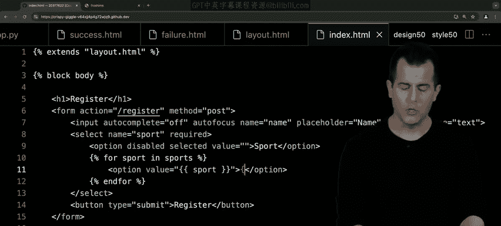

I screwed up somewhere else all right， so let's go back to VS code， let's open up my terminal window。

 let's click on the first terminal and oh name error， sport is not defined。

 did you mean sports so now Python is very graciously trying to be nice to me here yes I did mean that somewhere so let's go back to app up high stupid mistake。

 sports equals sports So now if I go back to my browser click on reload。😡。

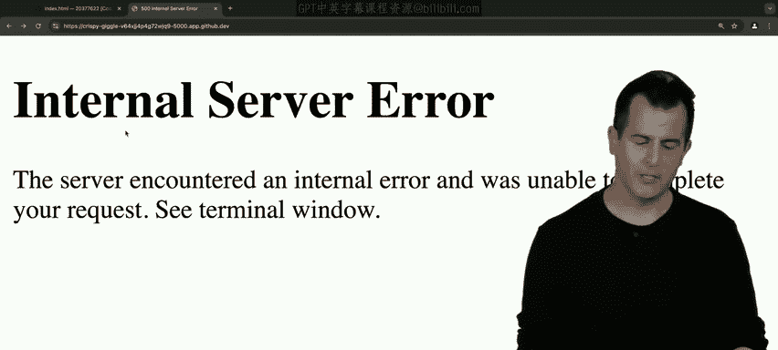

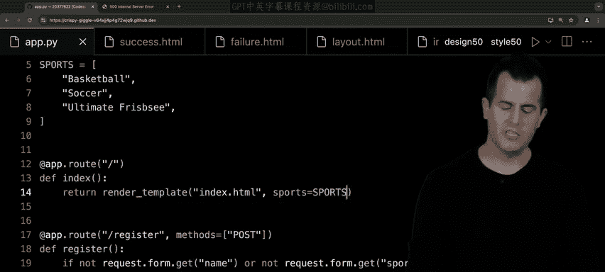

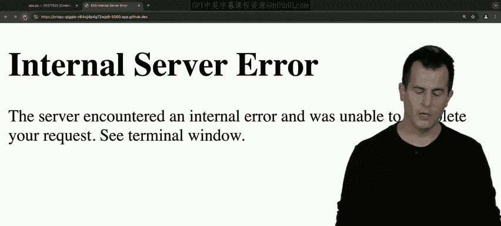

Now I have another error， so we go back to VS code， reopen the terminal now I'm just an idiot。

 so it's not sports with two Ss， so that was a mis clickick let's delete that and let me stop touching the keyboard。

 Let me go back to the browser。😡。

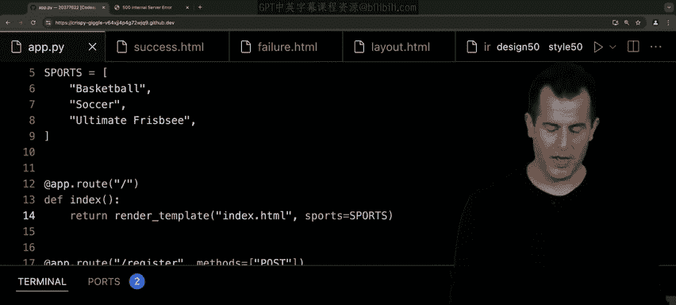

Let me reload a third time。And there we have it。 Very impressive。 I know。

 So now I've gotten thank you for the applause。 Now we've got the name field， the sport field。

 all of which are still there， but they were dynamically generated based on the value of that variable So what's valuable about that technique。

 Well， one， I'm not manually typing out all of these options anymore and think about the extreme if it's not three sports but 30 sports or 300 sports or whatever you don't want to manually type all of that out。

 you probably just want to have a simple Python list of those values。 or heck。

 we can even put it in a text file or a database if we wanted。 But moreover。

 now that the server knows what the valid sports are。

 we don't have to just naively check if there is a value for sports as we previously did。

 I could probably do something logically now where I make sure that the sport we did get is one of the supported value。

 So now we have server side validation as well So how can we do this Well。

 relatively straightforward if we have this variable called sports。😊。

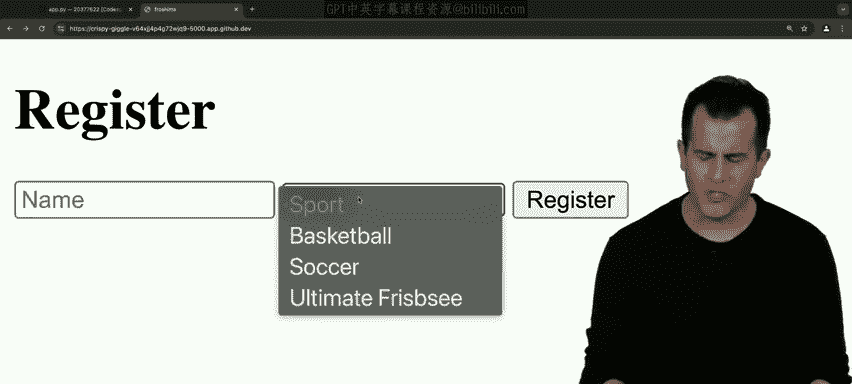

Capital S at the end， I can instead do something like this。

I can change my logic to say if there is not a value for name or the current sport is not in the sports variable。

 then consider it a failure it's a very nice pythonic way to let Python essentially search through the whole list of valid sports checking for the value that human actually sent and if it's not there we are going to return the failure template so now if I go back to Frosh Is let's reload to get the fresh copy of the form。

 let's type in David， let's go ahead and not choose a sport and click register I still have the client side validation that's fine。

 but let me go ahead and hack that by removing it， let me open up inspect let me go under elements inside of this form。

 let's get rid of the requirement for the name even though I gave one let's get rid of the requirement for the sport even though so that I don't have to give one close my developer tools notice I still have not chosen a sport click register it goes through。

😡。

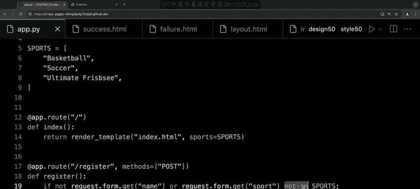

But we catch it and we tell the user no you are not registered。 Moreover， watch this。

 let me go back to my developer tools。😡，Let me go into the form again。

 let me not only delete the required aspect of this from both of those tags。

 let's also change soccer to football which while technically the same sport across countries is not the same string that we want in the server so let's change soccer to football here and soccer to football here and now close my developer tools type in my name but choose an invalid sport that the server does not know about click register still catches it because now we are doing server side validation and I cannot express this enough。

 if you proceed after CS50 or even for your final project let alone problem set9 to implement validation of user input。

 you should never ever trust what the human themselves are sending and you should never rely on client side validation alone it's all too easy for someone who's just taking a single introductory course to disable all of your client side validation so if you value the safety of your server。

 the integrity of your data。😡。

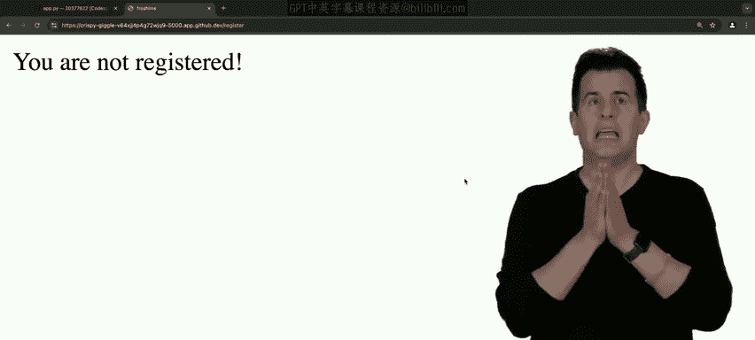

Always check serverside for valid values。All right。

 so what more can we do to improve this kind of application Well。

 we can tickker with the user interface a little bit if only so that you've seen different UI user interface mechanisms。

 let me go back to the form here and indeed we have now this dropdown menu otherwise known as a select menu Well there's other ways we could get input from the user In fact let me go back to my index hm and we don't have to strictly use for instance。

 a select menu。 we can actually use input tags to achieve what are called radio buttons。

 those little circular things that you can choose among sort of like oldtimey car radios where you would push one button and it would pop another out。

 you push in that button and it pops another one out same thing with radio buttons in the web。

 they are mutually exclusive you can choose one but not multiple radio buttons by design So how can I do this Well in my index Hm。

 Let me go ahead and get rid of the select tag there and the select tag here let me go ahead and get rid of the disabled option and then。

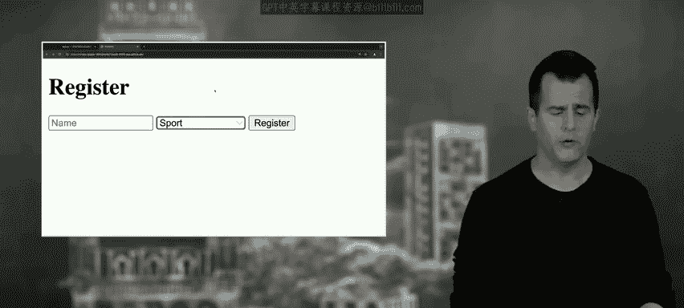

Just go ahead and still iterate over all of the sports， but instead of spitting out an option tag。

 which is only relevant for the select menu， let's go ahead and spit out an input tag whose name is quote unquote sport the type of which is no longer text but radio the value of which is the current sport in this current iteration of the loop quote unquote and then to the right of it just so the human has something to look at。

 let's also repeat the name of the sport。 So again here we're making a distinction just like with anchor tags for links what the human sees and what the server sees。

 but they can be one and the same let me go back to my other tab let me go ahead and reload this and my select menu will now be replaced with some pretty ugly but still functional radio buttons let me go ahead and zoom out so it all appears on one line and now if I type in my name and I select something like basketball and click register everything else is the same but I've changed the frontend by changing the HTML。

 Of course whether we're using。

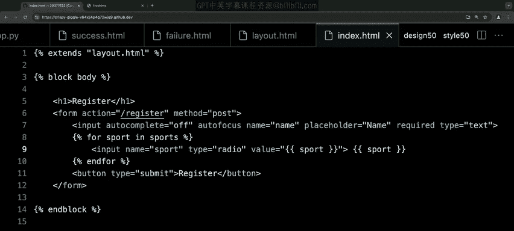

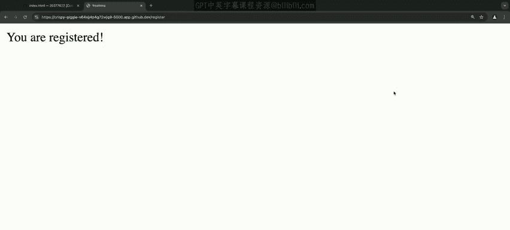

Elect menus or radio buttons we're still never actually telling the user why they're not registered in those cases where something goes wrong where。

 for instance they accidentally leave a field blank or even maliciously they try changing those fields so how can we go about being a bit more informative let me go back to VS code here and inside of our register route which is doing the validation let's do a little more validation than we are at the moment and let me propose this let's be a little more verbose with our error checking and how about this let's first go ahead and grab the name that the user typed in if any so name equals request form get quote unquote name and then let's ask a question just like we did before but with a shorter block of code if not name then go ahead and return render template but instead of just simplistically returning failure hl with no clarity as to what has gone wrong let's return a different template error h and let's pass in a specific error message to the template that the human will see。

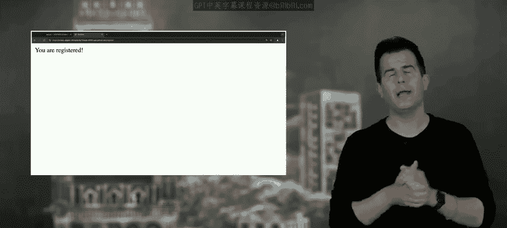

That's somewhat informative and in this case I'll say aptly missing name quote unquote just so that there's more informative errors otherwise let's go ahead and do this let's first get the sport from the user from request form get quote unquote sport and then as before if not sport let's go ahead and return an error but this time with a message return render template quote unquote error htm but the message this time will be missing sport but there is something else that can go wrong here if the sport the user typed in is not in our sports global array global list then let's return render template quote unquote error htm。

 but the message this time will be in valid sport now ideally users should never see this ladder message at least because only if they tried to hack our HTML so to speak would they actually be able to submit an invalid sport but for good measure you should assume the worst and you should absolutely be handling this error。

Even if you don't strictly speaking need a user friendlyly error message for those same adversaries。

 but otherwise I think we can assume it's a success as before。

 but we do need to create this here template so let's do this let me go ahead and close success。

 h let me go ahead and openfa h but now close it and let me go ahead in my terminal window create a new file code of error do htm paste the contents of failure。

 ht just so we have a starting point but in error。 hm let's actually have a more useful message instead of just saying you are not registered。

 let's instead say something like H1 error to make clear that this is an error page and then maybe put a paragraph of text below it even though it's succinct and plug in that message that we past in via gett and heck if we really want to be fun here we can actually go ahead and do an image tag alt equals well let's not do that yet。

😡，Okay let's now try to induce this here problem。 Let's go back to index H let's get rid of the required attribute so that I don't have to keep hacking my own HTML but let's now go back to the tab with the web application go back to the form itself which in its most recent incarnation is indeed these radio buttons and let me not type a name and not type a sport click register in just a moment at which point previously I saw you are not registered hopefully this time I'll see a more useful error indeed missing name It's not a very pretty page but at least it's giving me some information so let me go back and type in my name now let me register without choosing a sport missing sport and if I did again hack my HTML so to speak by changing soccer to football that too which show an error but invalid sport according to my logic Now just for fun we could make these error pages look a little more interesting and in fact what I'm gonna go and do is this let me go back into VS code let me go ahead and open up error。

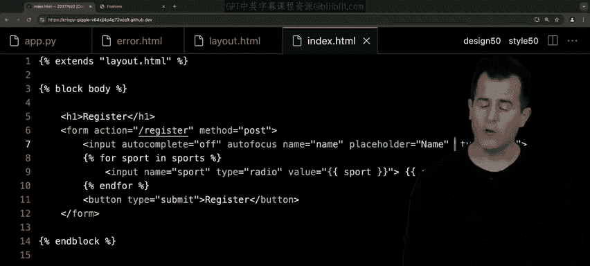

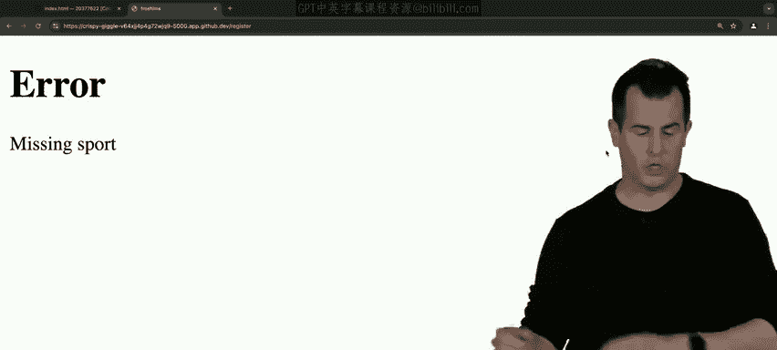

Html and below that informative error message let's use an image tag let's specify that the source of this image tag is gonna be that of a file。

 maybe a picture of a cat however， as I hinted earlier when we have static files like images or CSS files or JavaScriptscript files by convention they should be in a folder called static so in my HTML I'm going literally say static cat jpeg I happen to know already that this is going to be a grumpy cat hence the error message I'm going to give an alternative text for accessibility of grumpy cat who's internet famous and now I'm going to open up my terminal I am going to clear it CD do dot to go back into Frosh Ims where again at the moment we have just app pi requirements text and templates I'm then going to go ahead and make a new directory called static all lowercase I'm going cd into it and then with a wave in my hand I'm going to go ahead and copy from today's distribution code a copy of cat JpeEg。

So that now when I type Ls I indeed have a cat do jpeg that I came prepared with earlier let's now go back to my browser tab。

 let's click reload to still submit a form that's missing a sport but now we should see per the image tag we've introduced and the cat do Jpeg in the static folder that I indeed now see a very grumpy cat for this error message now using some CSS and such I can make it prettier and make the cat and not take up the entire web page。

 but for now we've at least demonstrated how we can have a static file alongside dynamically generated content by putting that static file in the static folder All right so now let's actually do the most useful thing and start storing in memory these names and sports for which students have registered。

 let's go back to app pi and acknowledge that at the bottom of this register route all I'm doing is blindly saying success HTMLtm you are registered even though I've not done anything with the actual data。

😡。

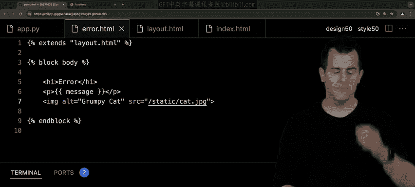

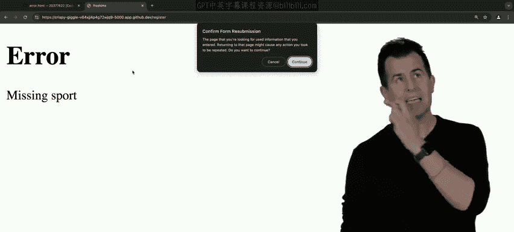

So it's an app pi that we have the opportunity to save some of that data and so what I'm gonna to do is this at the very top of the file but below my sports variable。

 let's create one other variable in all cap registrants and I'm using all caps again to signify that this is a global variable even though it's not constant let me set that equal to open curly brace close curly brace which even though we've been doing those curly braces all over the place in our templates per gingja syntax we are just in app pi now this is python syntax from week six wherein I've now created an empty dictionary or dit object in python by using curly braces this is the same thing as saying dit open per end closed per end which is returns to me an empty dictionary but it's a little more pythonic just to use the syntax of open curly brace close curly brace but why this well if I've got names and sports names and sports that's like keys and values I might as well store that kind of data in a python dictionary where the keys are the names and the values are the sports so how do。

Do this。It's actually pretty simple right before I declare that the student is registered。

 let's just go into that registrance array， let' just go into that registrance dictionarys index into it at the name location that I want to put into the dictionary and set it equal to the value of that sport and I'm simply using the variables that I created earlier for the purposes of doing error checking and using the name and sport in different places but I'm now using that same variable name and that same variable sport as my key and value pair now as an aside this is a little naive of me and it's not the best implementation as written this will not let two David for instance register for two different sports why because we're allowing one name to overwrite another identical name so if two Davids try to register for these sports probably not a good outcome because we're going to cloer or overwrite the previous person's registration but let's consider a simple world in which there's only one of any name in the world so that we don't。

😡。

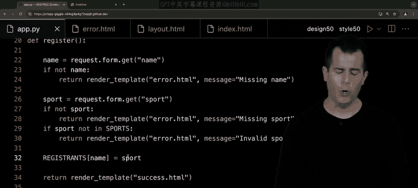

To worry about that just yet。

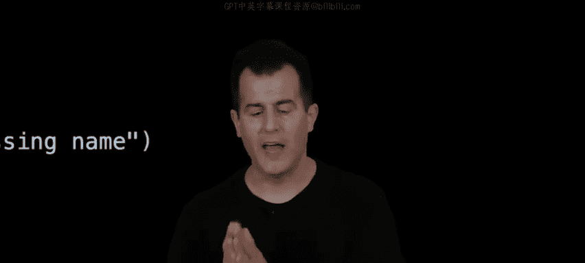

Now let's go back to my other browser tab clicking back in that so get back to the form。

 let's type in David， let's type in basketball and register says that I'm registered。

 but who knows at this point let me go back to the form let me type in Ulia and let's register Ulia for soccer click register claims that she too is register even though who knows but hopefully in app pi before success HTML is rendered we're indeed adding David and then Yulia and then anyone else to that global dictionary and so long as the server stays running that dictionary of keys and values is just gonna get bigger and bigger and bigger but let's see if we can't show ourselves those registrants well maybe the simplest way to do this is to give ourselves a third route so let me say app route quote unquote registrants and then below that decorator let's say death registrants to define a new function called exactly that and let's keep it simple return register。

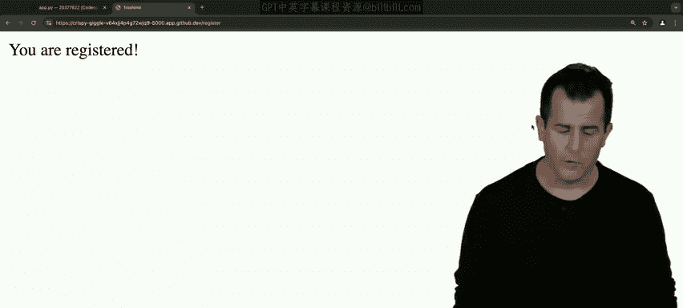

Sorry， return render template quote unquote registrants hm but I got to pass in those registrants to the template so it knows what registrants to show。

 that's fine registrants equals registrants in all caps so same convention is before but I'm providing the registrants hl template with that global dictionary of names and sports Of course I need another template。

 so let's do that let me open up my terminal window let's go back out of the static directory。

 let's go into the templates directory let's create a template called registrants HTML I'll close my terminal and up here I'm gonna to do the same boiler platelate as before extends quote unquote layout hl and I'm gonna to type every keystr correct this time then I'm going say begin no I'm not then I'm going to say block body percent sign close curly brace down here I'm gonna to say end block。

😡，And then the same and in here I am going to output a list of all of the registrants and I can do this in a number of different ways。

 but frankly I think it suffices to maybe just kind of do maybe a bulleted list initially so how might I do this Well I could do something like an unordered list tag there inside of which I have a whole bunch of list items or li tags well I could do something like this for name in registrants which is the placeholder or the rather the variable the parameter which was the parameter that was passed in then let me proactively close that four tag and Ginja and then in here let's do li and then inside of the open andclo tag let's just do name for now before we take a look at the effect of these changes though I am going to open my terminal window and I'm going to hit controlr C just to stop the server and then I'm going to rerun flask run just to ensure that flask knows about this very latest version of my code into which I've added that global dictionary。

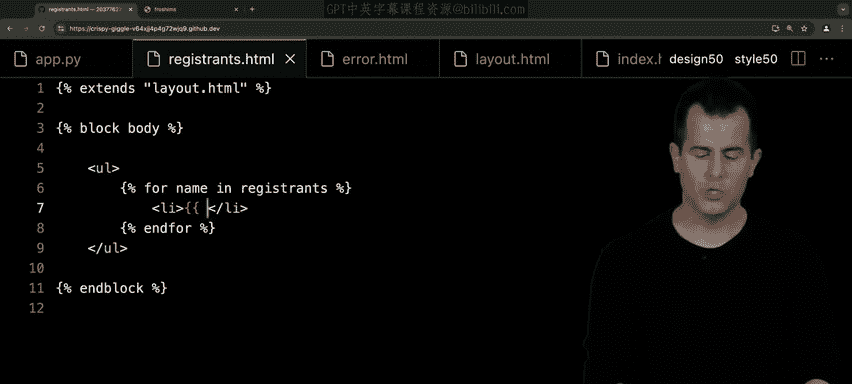

Now I'm going go back to my same browser tab as before which is still running on TCP port 5000 and I'm going try to register a couple of people so I'm gonna register myself for basketball for instance and I seem to be registered I'm then going to go back and I'm going to try to register Julia say for soccer and I'm gonna click register and now my hope is that both David and Julia are in the server's memory in that global dictionary as keyvalue pairers so if I go up to my URL here and zoom in and I change register to registrants and hit enter I indeed see now a bulleted list of all of the names of people who have registered for sports thus far now it doesn't have to be a simple bulleted list because it would be nice to know what sports we registered for but that's just a matter of HTML let me go back into VS code and hide my terminal window let me go into registrants HTML and we can go all out in this if we want for instance let me go ahead and do this let me get rid of the unordered list tag there let's give ourselves a proper title of registrants this time in。

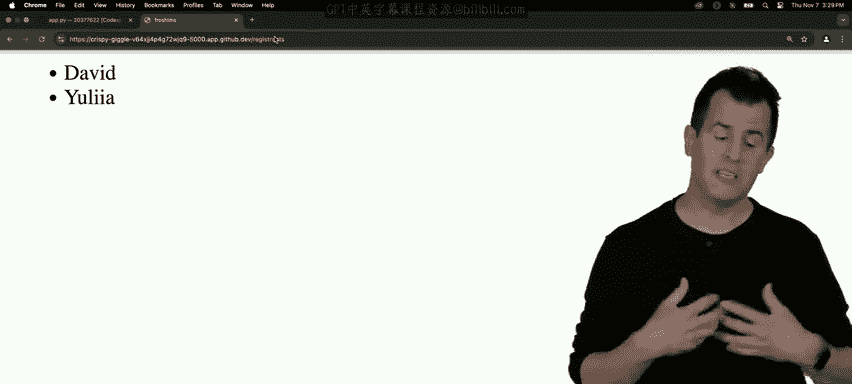

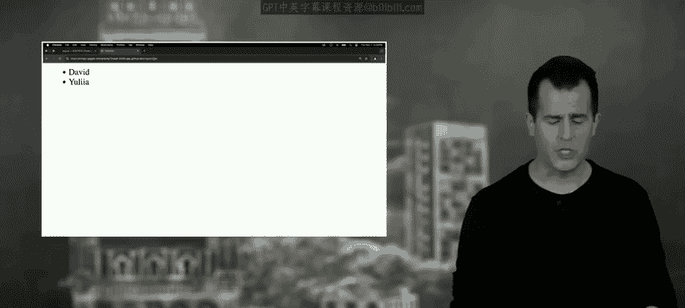

H1 let's then begin a table inside of which is going to be a table head initially and inside of that table head will be a table row and inside of that table row will be two table headings namely name as well as another table heading of sport In other words I want to have a two column table if simplistic that shows me name sport name sport or more generally key value pair below the tablehead let's go ahead and do a T body for table body and in there let's use that for loop as before for sport in nope。

😡，For registrants in registrants。Nope， let's not do that。For a regrant， name and registerrant。やep。

Inside of that table body， let's now iterate over that same dictionary。

 but let's do it a little more pedantically such that I'm going to do for each name in the dictionary in that registrants dictionary then let's proactively put an end4 below that and inside of this four loop。

 let's create a table row for each person let's create a table data inside of that row inside of which is going to be that current name then in the second column via a second table data tag。

 let's go ahead and put the value of that key， the syntax for which just like in Python is registrants but index into that dictionary at that specific name with curly braces on both sides as in Python when I iterate over a dictionary in Ginja here in this here template。

 I'm indeed iterating over all of the keys in that dictionary so if I want to get at the value I need to use that key that is name to index back into that dictionary Now if I go back to my browser tab here previously I saw all of this is an unordered。

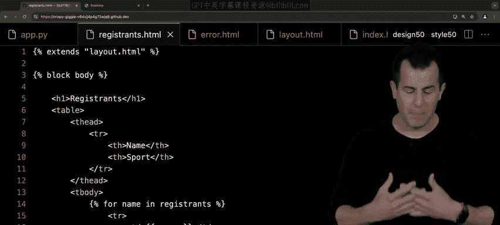

But if I now click reload on my registrants route， I now see a big bold H1 tag registrants followed by a simple HTML table。

 one column for name， one column for sport， it's not the best formatted。

 but I think if we introduce some CSS whether my own or bootstrap， for instance。

 we could make that even prettier as well。All right， with all that said。

 I think we have an opportunity for maybe one final version of Fsh I ams whereby we can actually store all of these registrations in a database The problem at the moment being this if I go back to VS code here and open my terminal window and either intentionally or accidentally hit control C such that the server stops or worse the server loses power or somehow the server reboots everything I've stored in the server's memory and that global dictionary is going to get erased by default because I'm gonna to get a brand new dictionary when the server restarts In fact。

 if I rerun the server now with flask run go back to that very same tab which had David and Yulia and click reload all of a sudden we're gone and the table is empty except for that heading So that's not the best way to persist data In fact if that could happen we might as well go back to yesterear's pieces of paper to keep track of everything but I think we can fix this So wouldn't it be nice if we could use a proper SQL database instead to store all of these key value pairs Well in fact let me。

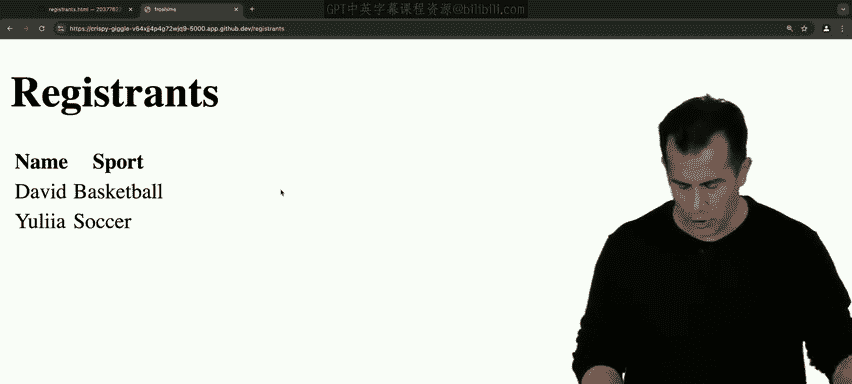

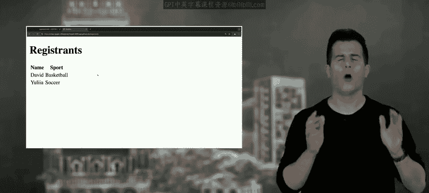

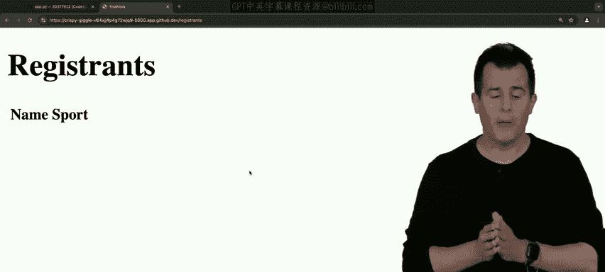

Back to Vs code here。 and inside of Vs code， let me show you a database file that I prepared in advance。

 Let me maximize my terminal window and I've just copied over already a file called Frosh ims do db。

 which is a database just for these intramural sports let me run our old friend SQL light 3 on Frosh I Db that puts me inside of the SQL light program and recall that if I type do schema I can see what table or tables are inside of this database sure enough。

 there's just one table here called registrants and it seems that that table has three columns an I column which is an integer。

 presumably the primary key a name column which is text that cannot be null and a sport column that's also text that cannot be null。

 and sure enough， the primary key of this table is that first column I So if I now take on faith that this table exists。

 even though at the moment， select star from registrants seems to have no rows in it。

 I think I can write some code to put registrants there So let me go back to。

Here and at the top of my file， let's do this from CS50 import， it's SQL feature。

 And then down here a few lines later， let's go ahead and create a connection to that database via a variable called DB said it equal to SQL quote unquote SQL like colon so even though looks like a URL you do need the third slash in this case Fro ims Db and recall that from week 7 this is how I'm going to be able from Python talk to that SQL database Now what do I want to do with this let's know scroll down to this registrants variable which previously I was using to store these key value pairs and let's just get rid of it all because I don't want to keep storing these registrations in memory let's go down further to my register route and get rid of the use of that dictionary because instead I want to do something now with SQL in particular I'm going do this Db do execute quote unquote insert into registrants maybe two things name comma sport I'm gonna let SQL。

😊，maticically fill in with auto increment， the ID column therein the values I want to plug in though are these two with two placeholders question mark question mark close quote and the two values I want to plug in for those placeholders in SQL are name and sport respectively So here too I'm using the same terms placeholder but in the context of SQL not in the context of Giningja the syntax and the purpose is a little bit different but that's exactly what we explored in week 7 with SQL and Python Now after that I think we're good with the register route what we do still need to do is get rid of this final use of that dictionary previously I was passing into my registrants route that global dictionary So I have all of those key value pairs Now a SQL tables。

 not all that different from a dictionary。 if we focus on just two of its columns name and sport So how can I get at those columns inside of my registrants route let's create a registrants variable said it equal to Db do execute and this part's easy select。

Name comma sport from registrants to select exactly those two columns that's going to hand me back a list of dictionaries。

 each of which itself represents a name value and a sport value so if I now change this value from registrants in all caps to registrants lowercase。

 this is the variable being passed into template， this is the value thereof。

 and I think if I go now into registrants do HTML， I just need to make a tweak whereby now if I'm iterating over。

Those return values from Db do execute I need to be a little more explicit。

 so instead of iterating over a dictionary as I did before。

 I'm going to more generally iterate over a registrant in that list of dictionaries and I'm going to spit out here regrant name and down here I'm going to spit out registrants do sport and it turns out in some context I can use either the square bracket notation or even the dot notation。

 the dot notation being a little easier to read because there's less syntax but the reason I can do that is because again the regstrants variable that I'm passing into this template is itself a list of dictionaries and each of those dictionaries represents a row from the SQL table and so if I want to access the name column therein I can say regrant do name or the sport column therein I can access registrant singular this what is about to be my next typo regrant sport and so now crossingfi B time this time let me go。

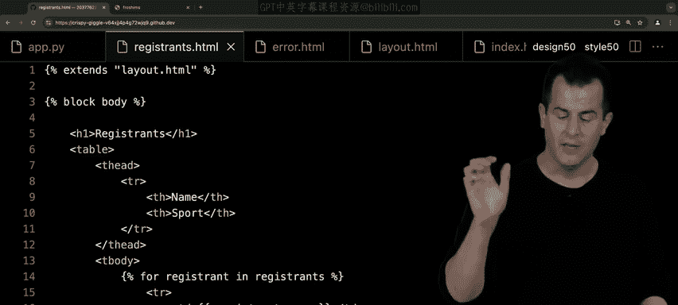

And go back to the form itself， let me go ahead and register myself for basketball because we cleared the memory when switching to SQL。

 let me now go back again and register say Ulia this time for So and register and now let me manually change my URL to be registrants big time crossing my finger and there we have it David and Yulia I was as surprised as you as at work this time but David and Yulia are registered and more importantly。

 if I go back to VS code here， select star from registrants in my database。

 there are those two rows Moreover， if I exit out of SQL light and I go into my other terminal and even control C and restart flask with flask run and go back to slash registrants in my browser and reload the data is still there we have made now a fullfledged web application if ugly that is actually storing data permanently full time that survives clearing of memory and even reboot。

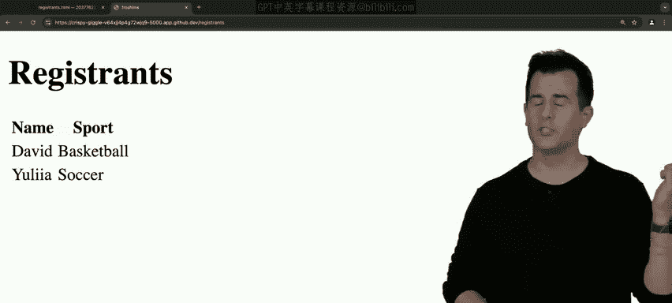

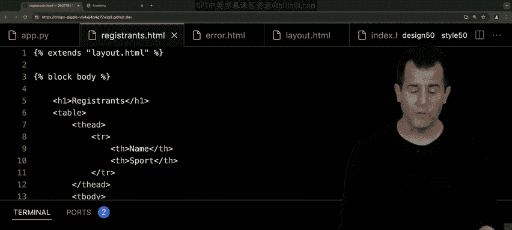

It's of the server。Allright， still more to come。 let's go ahead and take a five minute break And when we come back。

 we'll add some of lastly some of the most familiar features that you see in today's actual web applications。

 Allright， so up until now， even though we've been building an application that's very specific to Frosh Is it's actually representative of a paradigm when it comes to web programming and software engineering more generally In fact up until now what we've really been implementing is a couple of concepts。

 one is what we generally know in software engineering is a controller So app pi is representative of a type of program that you might call controller for exactly that reason it's controlling everything about your application。

 it contains the so-called business logic for your application。 Meanwhile。

 though there is a part of the application that the user season interacts with and that's generally known in some circles as a view So everything in the templates folder really is a so-called view but in that most recent example with Frosh Is once we started writing and reading data to and from a database we introduced。

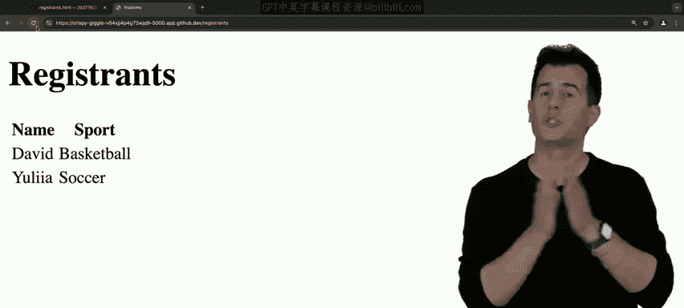

A third piece of the puzzle， which is generally known as a model and model refers to the database or some kind of storage that you're using to read and or write data and collectively these three ideas of model and view and controller are generally referred to as MVC model view controller and it just describes one type of architecture when it comes to implementing a web application or really other types of application whereby when you sit down to design them you don't just implement everything in one massive file which we've kind of been doing throughout much of CS50 but rather you separate concerns。

 you put all of your templates aka views over here you put all of your model related code over here and then you have a controller that's somehow orchestrating between those two concepts it doesn't change anything we've yet done but it does slap some industry standard labels on top of them speakingea of industry it turns out it's incredibly common on websites of course to log into them as like your Gmail account for instance if you use or Office 365 or。

other email service or really any website nowadays for which you have a username and password and log in and indeed up until now。

 neither of the applications we wrote， the hellello world application or Frosh Is had any notion of individual users there was no login which means anyone who sits down at the keyboard could type in some input what that means similarly is that anyone who's at the keyboard can see all of the information they'in including the form itself the list of registrations。

 the confirmation pages and that might not be ideal because if we really are implementing the idea of those paperbased forms back in the day well really only that resident advisor or Proctor should have access to the forms once they're submitted everyone shouldn't be able to just change their URL to registrants and be able to see something which is to say if we did want to add the ability to log into a website so as to exercise finer grained access control so that I can see this you can see that we need to somehow add more functionality to these applications much like Google has added to。

Gmail page。 unfortunately， the way HttP is designed is that every piece of information that goes between browser and server has to be sent all at once for the browser to know about it。

 and yet when the user then clicks on another link ideally in some cases the server would like to remember wait a minute this is the same user and I already log them in before you don't want to have the user to have to log in every time they click a link or every time they submit a form to prove to you that they are who they claim to be in other words。

 you'd like to be able to remember that someone has already logged in。 So for instance。

 in the real world if you go into a club an amusement park or a bar。

 sometimes they put a little bracelet on you or sometimes they stamp your hand and that's hand stamp is meant to confirm if you come and go through the same door we've already authenticated you we've already checked who you are so that we don't have to pull out your I and look at it again So in I actually have a little hand stamp here and so if you imagine that here is my hand with no stamp on it。

Psented to get into some fun amusement park once I've shown them my ticket or my ID。

 what they might very well do is if not a bracelet。

 put a stamp on my hand like this here smiley face and so long as I show that to the bouncer or the tickettar again and again they will remember that I have already authenticated myself by showing them my ticket or showing them my ID in the past Now it turns out that Http funny enough can implement exactly this same idea albeit more technically recall that when using Http you see a message like this in the browser being sent to the server for instance For instance。

 when you log into Gmail specifically inside of that virtual envelope goes a post message followed by or such some s route followed by the version number of Http and then maybe some reminder as to what host name is being posted to mean。

 the server hopefully respond as we saw last week with Http 200 which is a status code meaning okay but wait a minute if we have already this mechanism。

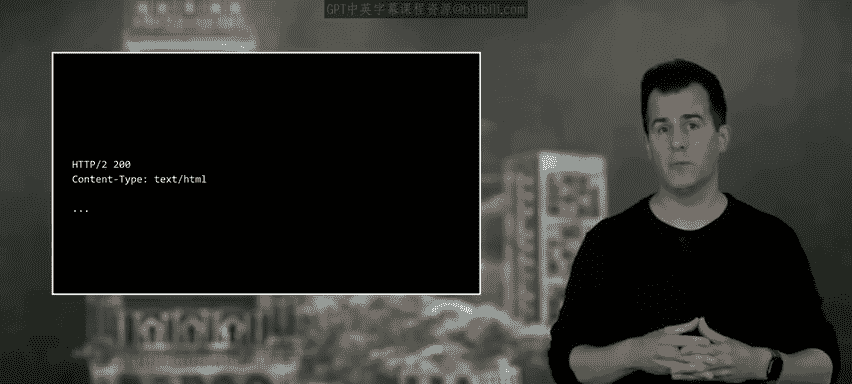

whereby the browser can talk to the server and the server can talk to the browser could we implement from the server to browser this notion of a hand stampamp Well we can we haven't dwelled on these too much。

 but recall that inside of that virtual envelope such as one pictured here is a HtTP header one or more of those things and in fact every time I've pulled up developer tools there's actually been a whole bunch this is just a key value pair so maybe if we could somehow implement this notion of a hand stampamp as a key value pair we could remember that someone has logged in Moreoverover we can remember who has logged in somehow as well and in fact the way that HttP has browsers and servers do that is as follows when you log into Gmail or really any website what that server does in its response message to you is unbeknownst to you really is it stamps your hand specifically it includes in the virtual envelope among all of those HtP headers another key value pair namely set cookie colon and then。

some value。 And while you could somewhat foolishly just put the user's email address like set cookie colon session=s maillin@harveddu generally the value inside of that HtP header is like a big random value a big string of text and or numbers that somehow the server keeps track of and remembers that okay I gave David this big random number I gave Ulia this big random number so we don't all get the exact same smileyface handstand but the next time the user from that same browser clicks a link submits a form unbeknownst to you。

 the browser sends another header in addition to the usual namely a cookie header cookie colon and then the exact same string session equals value for instance and session itself is kind of a term of art session refers to the concept of maintaining state between the browser and server even though Http by design is really meant to be state list once the browser icon stops。

You've gotten all the data you're gonna to get from the server but so long as the browser knows that once it receives a cookie。

 send it back to the server， send it back to the server。

 included it in every subsequent virtual envelope， the server can remember that I've seen that smiling face before I've seen that big random number before that must be David that must be Uia and so it's a very clever way of just reminding the server who you are and to be clear the cookie itself could be your email address Heck you could even use your password just to constantly remind the server here's my username here's my password Here's my username here's your password but that's generally not a good idea and you should not be doing that nowadays because it's all too easy potentially for the data to get intercepted and certainly don't send username and passwords over the internet more often than you need to just as a good principle So with that said if we have the ability to stamp the user's hand in this way and to remind the user what's there what you're looking at indeed our cookies and in fact this class is so long already it's a。

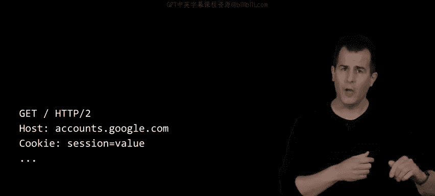

We brought some snacks for today。 So these here cookies。

 these are what cookies actually are and all of us have probably heard about cookies in the context of the internet for some time whereby cookies get saved on your computer from the servers that you actually visit Well what is a cookie。

 there's really no academic value to what I'm doing here but what is a cookie in the context of the web Well it is just typically a big random value that's stored on your computer and it doesn't have to be random it can be。

 for instance， your username。 it can be your email address Hopefully it's not your password but if you've ever checked that box that might remember your email address and auto populated。

 it may very well be the server that's reminding you of that same value The reason that cookies get kind of a bad rap though。

 is that there's a lot of cookies typically being stored on your browser from servers around the world and a lot of those cookies are used to track you and me Now it stands to reason that if I've logged into a website。

 Well of course the websites going to be able to track my behavior on that website because I literally told them who I am。

But when the world of advertising， for instance， it turns out that even if you're not logged into a website。

 there are enough unique features to your computer and your browser and the way that you use it that servers can typically plant cookies on your computer even without your logging in and even though they don't know that I am David and that is Julia they do know that I'm the same user again and again and they can effectively build a profile of who you are based on all of your clicking behavior So if you recall last week when I first was demonstrating various features of HTML and the like I was actually deliberately using incognito mode sometimes because I wanted to start with a fresh slate and so among the things that incognito or private browsing mode typically does is it gives you a brand new empty cookie jar so to speak it clears the browser's memory just for that window that you've open privately and it makes sure that you have no cookies by default and you have no other settings by default being sent back and forth to the server effectively ensuring that you're starting from scratch but if you're using。

Same nonincognito or nonprivate tab again and again and again。

 you really are accumulating a lot of these cookies and in fact if you open up developer tools you can see under the storage tab or thereabouts and other browsers all of the key value pairs that servers are storing on your computer So with that said。

 let's use cookies know not for evil but for good and to actually use them to remember that a user has logged into a website and to do that we're gonna leverage a feature of flask that is built on top of these cookies known as a session which is again just some form of memory that keeps track of the fact that we have seen some user before In effect a session is the technical way to describe something like a shopping cart anytime you've bought something online or added something to your shopping cart you could come back a few minutes a few hours a few days later and depending on how the website is implemented it can remember what is in your cart thanks to these cookies Similarlyly we can remember that you're logged in via these cookies using this here feature so let me go into VS code here。

AndIn advance， during break， I went ahead and created the beginnings of a login based application。

 If I type Ls in my login directory here， we'll see apppi requirements text and a templates directory inside of which as before is just index do htl and layout hml but let's go ahead and implement a website that now keep knows if I'm logged in or not albeit simplistically let me go ahead and open up my index template in templates and I'll close my terminal window and in here I'm going to use some gingja syntax that we've seen before。

 if the current user has a name well then they're clearly logged in So let's go ahead and say you are logged in as name period and if it's not the case that there's a name value then let's go ahead and say you are not logged in period and I'll going to add an end if down here So at the moment I'm just assuming that name is a thing and it actually exists。

 but I'm going to need to implement now that logic next So let me go。Into my terminal window again。

 this time opening up my app dot pi， which isn't really doing much yet and start to make a few changes in addition to in addition to importing flask and render template and request I'm also going to import a feature called session and then down here I'm going to configure flask to use sessions as follows and this is the kind of thing you can copy paste from documentation or these here examples。

 but I'm going to say app dot config quote unquote session permanent equals false capital F for false and Python and app dot config。

😡，Quote unquote sessionession type equals quote unquote file system in lowercase this essentially enables the ability to store sessions put another way。

 this turns cookies on for this web application it ensures that the cookies are not permanent in the sense that what cookies I'm using should disappear when the user quits their browser ultimately。

 but I'm using on the server， the file system like the files and folders locally to keep track of who is logged in and then lastly I'm going to say session capital S and specify app there too and I'm going to import one other line that I forgot from。

😡，Fask session import session capital S。 Again， there's there's some hoops to jump through here。

 I too have to check the documentation or my own examples to remember what， but in short。

 I'm importing flasks support for sessions I'm importing this session specific library as well。

 I'm specifying these configuration options。 and I'm now turning on sessions with this final line of code。

 Of course for this to work。 I actually need another requirement。

 So let me open up requirements text which up until now we've not needed because we already put flask in there but I actually now want to use the flask session library as well。

 strictly speaking you don't need to do this in CS5 do dev because we've pre-installed it。

 but for a typical real worldorld application we would need to tell the server that we indeed have another library and install it with Pip。

 All right So that's mostly copy pastsable boilerplate。

 let's go ahead now and implement a route So app route quote unquote slash for my default route to find a function called index as before。

 and let's very simply return。Reendnder template， quote unquote index do html。

 and then that is it for now。 Let me hide my terminal。 go back to my other browser tab。

 which still shows the previous application for I ams but so long as I run flask run in this tab here and go back to that tab and click reload I should now see this new application And indeed I do it just says you are not log in because I haven't done anything related to logging in yet。

 Well that's okay how do I want to go about implementing this then instead let me propose that if we want the user to be able to log in we need a form via which they can tell us who they are So let me go back to vs code I'm going to go back to my second terminal window here and I'm going to cd into my login folder to be in the same place into my templates folder to be in that place and I'm going to create one more template called login html inside of login hml。

 I'm going very carefully type extends quote unquote layout htl close quote percent sign down here I'm going say。

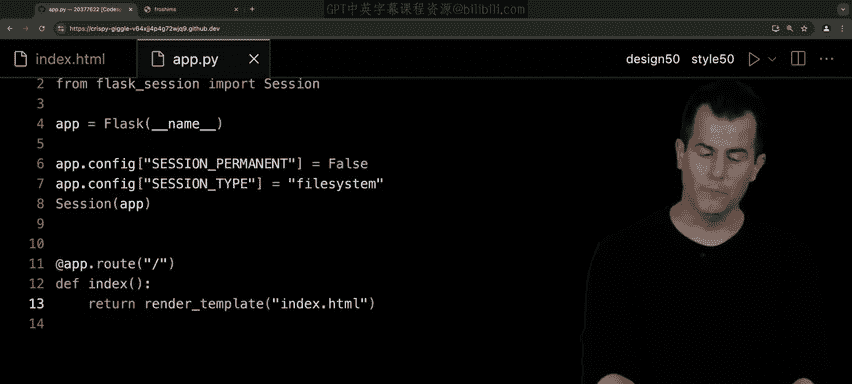

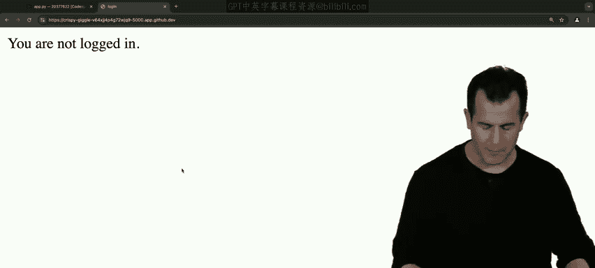

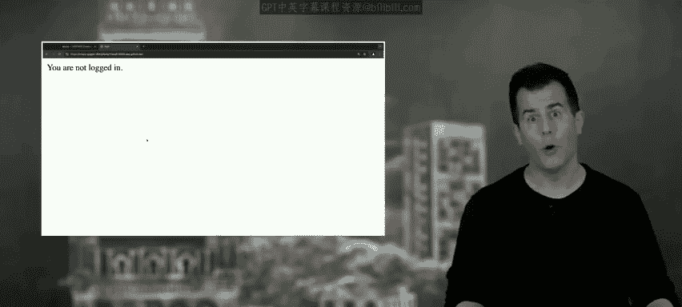

B body as always， and then end block down here and then in here I'm gonna to whip up a very simple form。

 So form action equals quote unquotelash login。 the idea being in a moment I will create a new login form the method I'm going to use for logging in for privacys sake is going to be quote unquote post then inside of this form I'm going to have a text field where autocomplete is off also for privacy sake autofocus is on for convenience's sake。

 the name of this field is name for the user's name the placeholder they'll see is quote unquote name and the type of this field to be clear is text for simplicity sake I'm not gonna to bother with a password。

 In fact， we'll see that in the next problem set， but for now I'm just going allow the user to log in just by telling us their name and no password So I'm going have a button the type of which is submit and then the label for that button shall be log in。

😊，How now do I actually render this template so that the user sees it when it's time to log in。 Well。

 I think this is fairly straightforward。 If I go back to app dot pi。

 I can create another route down here， app dot route， quote unquote slash login。

 then I can create a function called， for instance， login to keep it simple。

 and then I can simply do render。😊，Template， quote unquote， login。htm。

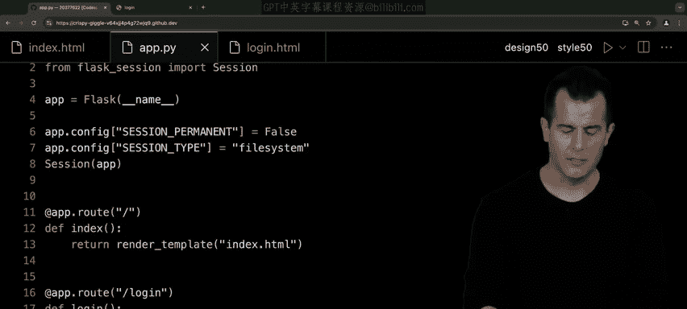

Now I could go manually to slash login to access that page。

 but let's make this template a little more user friendly that we began with。

 let's actually give the user a link AHF equals quote unquote slash login and then inside of that anchor tag log in period otherwise let's proactively do this AHF quote unquote log out and then inside of that anchor tag。

 log out。😡。

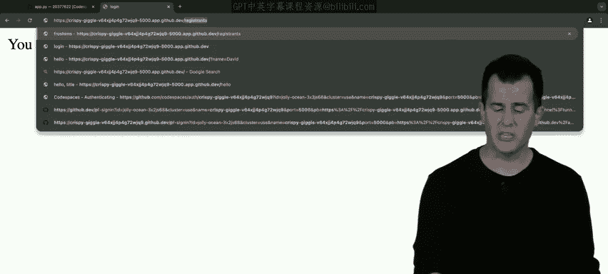

That is backwards。 So let's do it correctly this time here， we're going to say log out。

 if the user is logged in down here， we're going to say log in if the user is logged out。

 So I think now it's consistent with the English I already had earlier。 Allright。

 let's go back to the form itself。 whereby I。

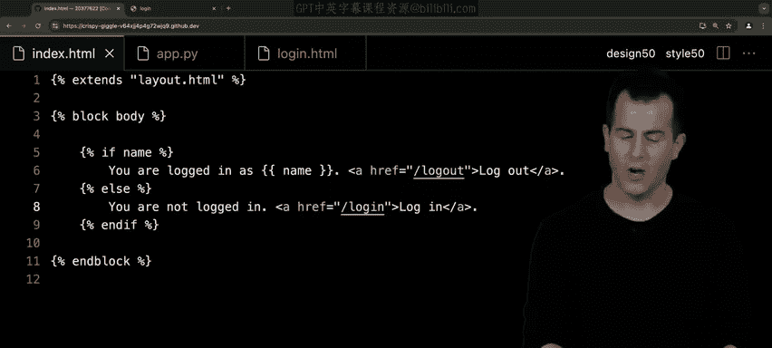

Let's go back to the original URL whereby it says you are not logged in。

 but it now gives me a link to log in。 If I hover over that super tiny。

 but in the bottom of my screen， I will see that it's going to the slash login route。

 and indeed if I click on that I find myself at the first the 10 of many errors today so let's go back into Vs code let's open up my terminal window click on the one that's running flask and the view function for login did not return a valid response。

 the function either return none or ended without a return statement So user error on my part let's scroll down and sure enough I did something done I need to return the return value of render template All right let's hide that let's go back let's click reload enter and now we see the login form Of course it doesn't do anything useful if I type in David and click login it goes to the login route but it's saying method not allowed because I haven't done anything yet with post that's fine too let's go back to my login route and let's do this if the requests。

😡。

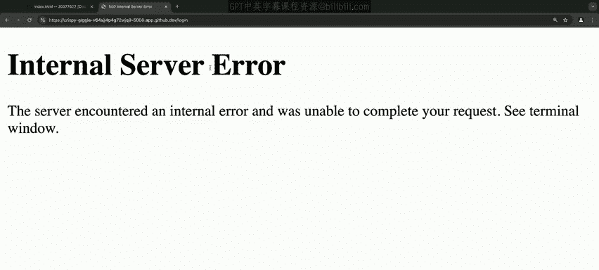

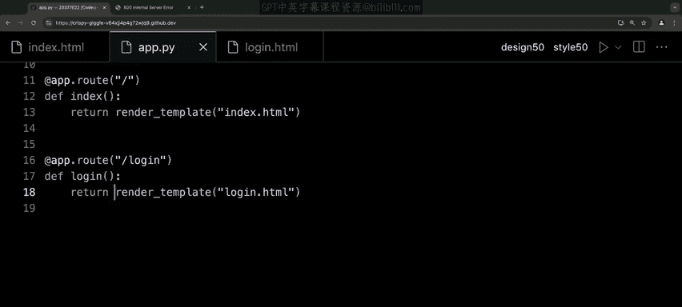

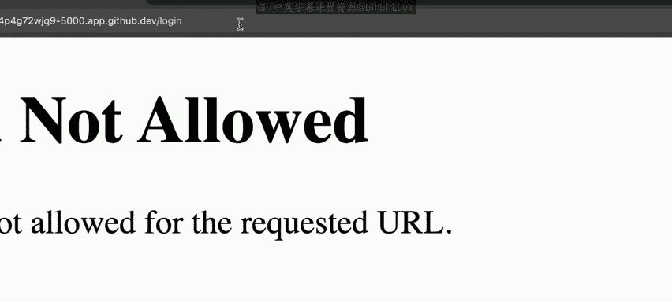

Method equals equals post， the implication being the human clicked the login button after typing in their name。

 then let's do this session， then in square brackets name equals request。form。

 get quote unquote name。😡，And then we will， let's say。

Return redirect quote unquote slash so what's going on here if the user indeed submitted the login form using a request method of post which is implicit because that is the method I'm using in login。

 HTMLt thereby allowing me to distinguish between whether the user just visited the form or they submitted the form。

 if I go back to app high， I am in the case of submitting the form going to store in a special global variable which I imported up here on line1。

😡，A key called name， and I'm going to set the value of that key equal to whatever the human's name actually is。

 Now as an aside， I'm not bothering with error checking now。

 so it's possible to just click the button and not type in a name。

 but imagine from Fro Is we could borrow some of that if not logic to make sure that the human gave us a valid name but the point here is that this special global variable that I've now imported and enabled by way of these lines of code here is essentially giving me a global variable that's in essence a global dictionary in which I can store any key value pairs。

 the first key I'm storing is name， the first value I'm storing is the human's actual name and what I can now do more interestingly is this when I comes to displaying the default page which recall is index HTML recall that I was checking is there a name being passed in Well there can be instead of just rendering the template index HTML let's pass in。

😡，The user's actual name by using session。ge， quote unquote name。And here too。

 I'm using a feature of this session global variable whereby it too， like request。

 orgs and request form comes with a get method built in that allows me to get the name of sorry that allows me to get the value of that specific key and as an aside if there is no such value it will at least return none capital n in Python which is similar in spirit to null。

 but unrelated to memory but it's the special value that indicates there was no such name。

 but so long as I'm using this logic in index HTML checking if there is a name that's either going to be a valid name or blank or missing in either case I will display the user's name I think So if I've done everything correct here。

😡，Wwhichch I haven't but I caught myself this time I did one last thing on line 20 if the user has submitted the form via post and per line 19 I've remembered in my session that they're logged in that sort of equivalent to stamping their hand storing their name in the session effectively remembering who they are last thing I'm going to do is redirect the user back to slash why we think about most any website you loggged into if you try to visit a page and you're not logged in you log in hit enter and you're usually redirected back to like the home page or the default page how can you do that will slash represents the default homepage so I just need to import one more feature of flash the redirect function so I'm gonna add that to my comma separated list on line1 and that gives me the ability to send if you recall from last week one of those 301 status codes or 300 something that tells the browser that the website has moved to this other。

Location， for instance， from this to this other one All right。

 let me go back now to the browser here， Let me click back to the main page such that I'm told you are not logged in let me click on login let me type in my name crossing my fingers enter and now darn it I'm still getting method not allowed but this is something we've seen before that's just because I'm trying to use the login route for both get and post so I think I need to add methods equals quote unquote get and quote unquote post just as with F I am and now if I go back and I try to resubmit this form and click continue now you are logged in as David period。

😡。

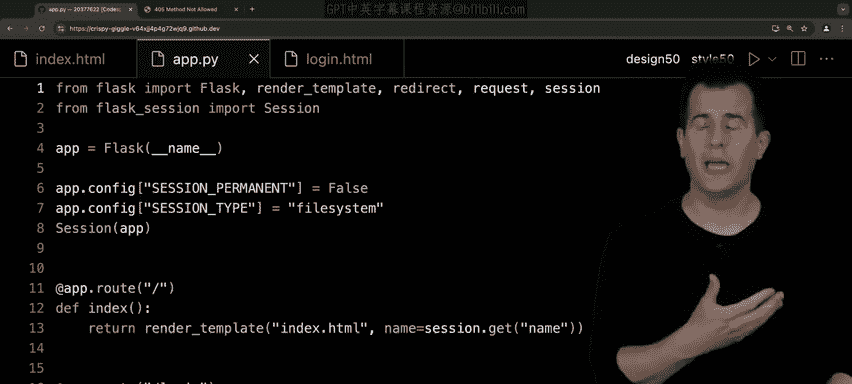

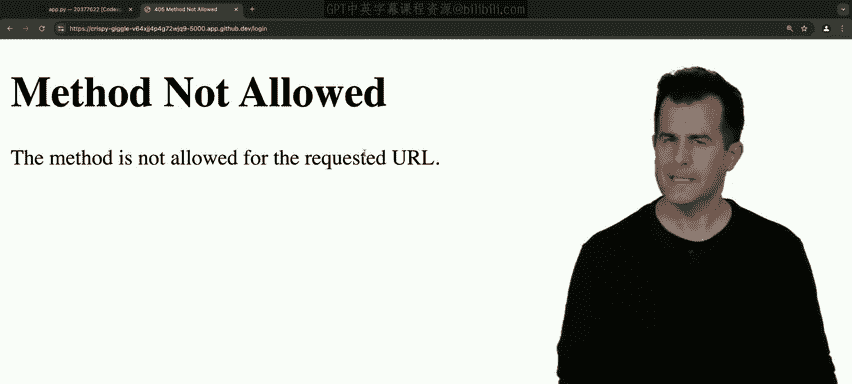

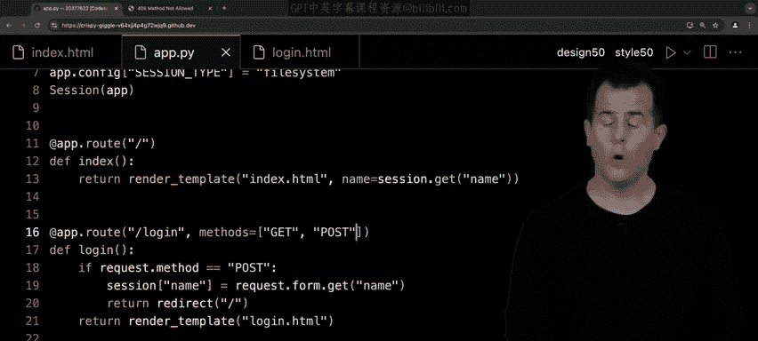

There's still a bug or really a missing feature。 If I click log out， I go to slash logout。

 which is not found at all， but that's just because that route doesn't exist。 That's fine。

 Let me go back to Vs code here。 Let me create one final route app do route quote unquotelash log out and then in this route。

 let's define a function called log out to keep it simple and in here I just need to clear the session。

 I need to like clear off the hand stamp from the user so as to tell them stop sending me this cookie and so we can actually do a function called session do clear which clears the contents of the session and then I can go ahead and return redirect quote unquote so that once you log out you're just sent back to the homeage again so if I try this again over here 404 let me go back to where I was let me click log out now and notice I'm still at slash but I'm no longer logged in I can do it again all day long type in David log in click log out。

 I can log in now as Yulia。😡。

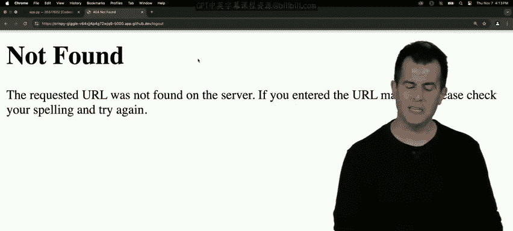

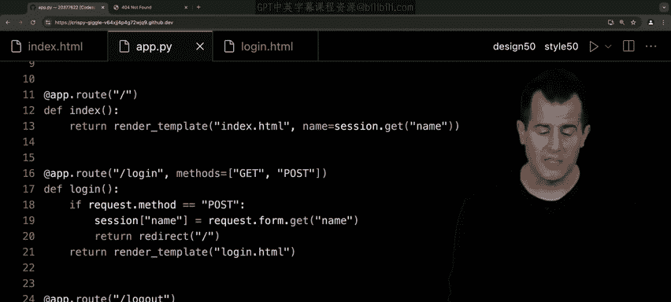

Log in， now she is logged in and now she's logged out and even though I keep saying slash recall that browsers are typically just in the habit of hiding values that don't really need to be there all the time。

 so if you see nothing after the TLD in the URL， it's implied that you're visiting slash the default page。

😡。

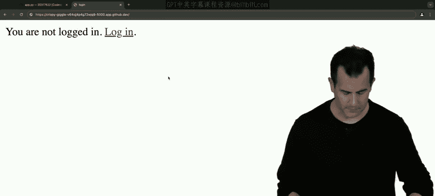

All right， so with that said， what we've just introduced then is this idea of a session whereby because of how HP works and because of how cookies can be sent back and forth from browsers and servers and because flask is used by so many people they've implemented all of the functionality for us to keep track of those cookies and reading them and figuring out who is who what's nice about the session global variable is that you can implement one web application and if you want to store something in memory for a specific user you can store it in the session dictionary instead of in a global variable instead of in a database So if you want to keep track of who is logged in on a per browser basis you use session if by contrast you were to use a global variable like registrants like we did a little bit ago every user of your website would have access to that memory which you don't want So session is sort of like a per user variable and you don't have to know or care。

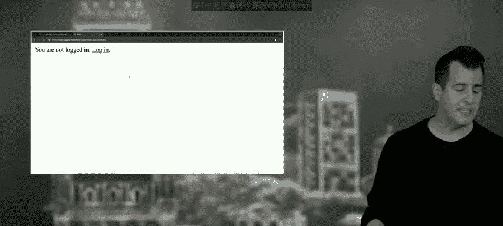

How it's implemented， but being in CS50， you know now that that session abstraction that per user global variable is really implemented under the hood because Flask is opening that virtual envelope。

 looking for the set cookie and the cookie headers back and forth and taking care of all of that to ensure that you can just use session as we intended on a per user basis。

😡，All right， with all that said， let's go ahead and consider just a few final examples。

 let's go ahead for instance and implement maybe our own shopping cart and let me do this let me go into VS code here and actually give me a moment to pause and open something up here。

Al right， let's go ahead and implement another application that also implements a very common feature using sessions。

 but this time to implement full-fledged shopping carts， for instance。

 if you want to implement a bookstore online via which people can add books to their shopping cart let's see where to begin in advance I've created this folder called store and inside of it I've got a few files app pi requirements text store db which is new and templates and inside of templates is the usual index htl and layout ht let me go ahead and use SQL light to open store db let me go ahead and maximize my terminal window and simply do a dot schema to see what's inside here seems that there's a single table in store db called books that has three that has two columns one is an ID which will be a unique identifier our aka primary key the other of which is title if I want to select star from books I can see all of them and in this database there's only five sort of five of my favorite books if you will Allright so now that we know that we have that data。

Can we go about implementing our own version of Amazon， if you will。

 our own shopping cart to buy these books。 Let's go ahead and open up requirements text。

 and as before let's also include as a dependency flask session even though it's already installed on the server but if you use this application anywhere else you'll need to install that to via P Now let's go ahead and open up app do pi close my terminal and let's add some of those same variables up here let's import as well redirect as well as request as well as session let's above that go ahead and import from CS50 the SQL feature as we've used earlier and let's also import from flask session。

 the feature called session capital S then down here let's proactively connect to the database with the SQL function specifying SQLite colon s store Db let's then configure sessions as before with app do config quote unquote。

Session underscore permanent equals false， then let's specify app。config。

 quote unquote session type equals quote unquote file system。

 all lowercase and then lastly to enable session session passing in app。

 essentially wrapping the web application with this session functionality Now let's do something simple a very simple template that just spits out all of the books。

 so let's define a route for slash that function therein shall be called index as before。

Inside of that function， let's do this， create a variable called books， set it equal to Db。 execute。

 quote unquote， select star from books to keep it simple， and then let's return。😊，Reendnder。

 template， passing in， the templatebook。html， which I'll create momentarily。

 and passing in those books as we've done many times now with a key and a value as a named parameter。

😡，Okay， let me open my terminal， let me open up a file in templates called books。

htm so that I can create now this template and this one will be relatively short but dynamic in that we're going to do the following let's extend layout。

 HTMLt as we keep doing。😡，Let us then define a block called body as always。

 end the block down here and inside of this block， let's do this。

 how about a nice big H1 that says books to list what's in the catalog。

 then let's do this for each book in the books parameter that was passed into this template and proactively I'll do N4 down here。

 let's go ahead and output。😡，How about each of the books's titles， So how might I do this， Well。

 let's go ahead and maybe start like we did earlier with a U tag。😡，Down over here。

And inside of let's let's do a bunch of lis。 wherere inside of the li。

 I'm going to go ahead and do the books dot title to spit out its title。 Alright， so with this done。

 now I'm going to go back to my terminal window and as before I'm gonna to do flask run having previously stopped the other instance of flask in my other tab enter and now I'm going go ahead and open up the application as always。

 And when I hit reload， we should see no longer our login application but store and sure enough。

 there is a very simple， if un usefulful， bookstore that just lists all of the titles therein。

 All right， well let's make this more interesting now。

 let's actually enable the user to add things to their cart。

 we can do the user interface in a bunch of different ways。

 but let me propose that we do this instead of a U tag， let's do an actual form。

 So let's actually do how about。

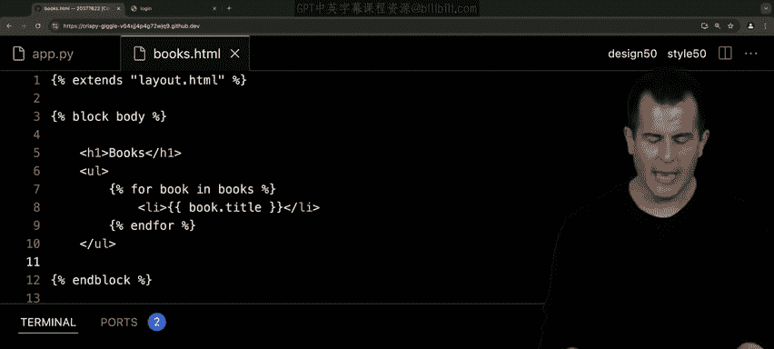

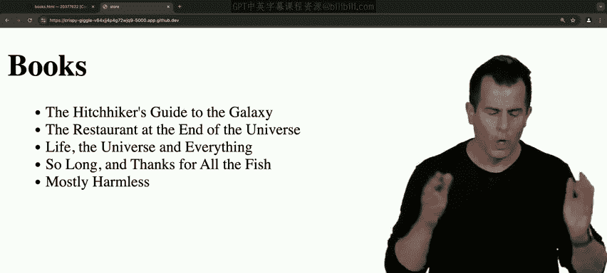

This for each book in books， let's go ahead and output an actual usable form for every book。

 even though this is not necessarily the only way to do it。

 it's perhaps the simplest to start with for this book let's go ahead and output in H2 tag with its title so book do title and then down here let's do a form for this book form action equals quote unquote cart。

 which I'll claim is a route we'll implement in a moment the method I want to use for privacy sake is going to be post for this form now I'm going to go ahead and include a button whose type is submit and the value of that button is going to be add to cart and now I need to actually specify what I want to send to the server so that it knows what book to add to the cart so I can do this for instance。

 input name equals title of the book the value of which is quote unquote the books title as。😡。

BeforeAnd the type of this box could be text。 Now let me go over to the store tab again。

 let me hit reload。 and if I haven't messed up， I think I should。

 if ugly have for each book an input that shows its title and a button that will allow me to submit that title to the server Now this is silly because I already have the books title here。

 and it certainly shouldn't be the case that I can change the title of a book to add it to my cart so I don't think I want an input of type text so there's another way I can do this。

 I can actually make those inputs hidden by changing the inputs type from text to hidden Now if I go back to that tab and click reload I still have the buttons and underneath the hood I still have the books's titles such that when I click add to cart the books title will be sent to the server but this too is a little sloppy because recall that the database that we're using if I seed in my other tab into the bookstore and do SQL light of。

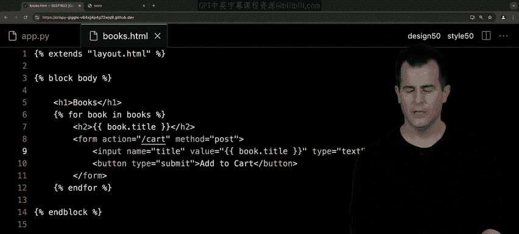

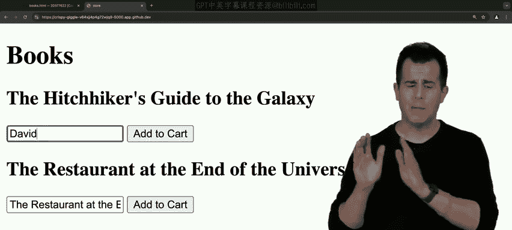

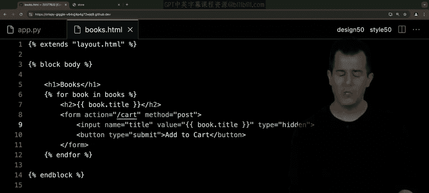

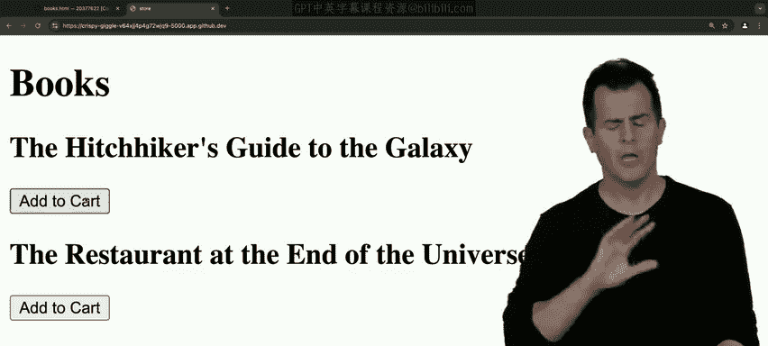

St Db and do select star from books recall that I have for each book not only a title。

 but also unique identifier。 and this is good because even though this database is small。

 what if two books have the same title that's definitely the case in the real world but they might have different authors and they definitely have different ideass So much better practice than sending a string of text is to use what we learned in our week on SQL use the primary key to uniquely identify these books and so by this I mean let's change our template here to pass in not a hidden title but a hidden I so that what's actually going to be submitted is the number one or two or three on up So if now I go back to that other tab and reload visually nothing has changed but notice if I right click or control click view page source I indeed have a bunch of forms on this page but notice this form will submit value one to the to the server this form will submit value2 this form will。

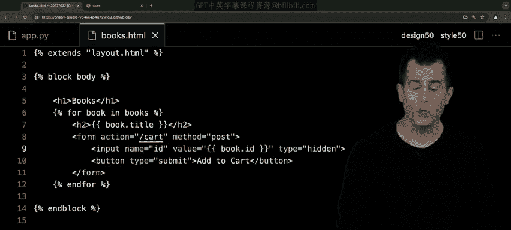

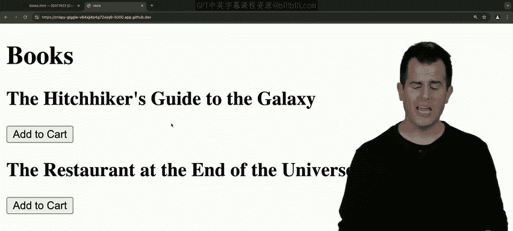

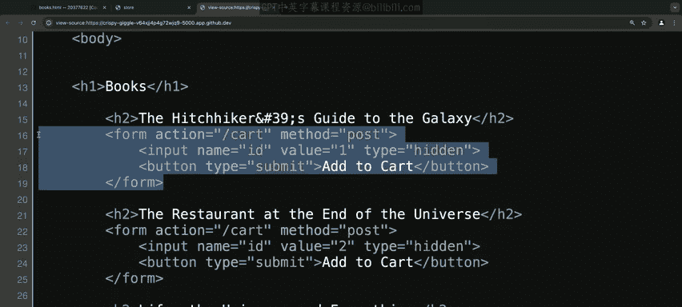

Smit value3 This is exactly how websites like Amazon and the like work such that when you click add to cart。

 your browser is sending a unique identifier for that book or whatever it is to the server and the server is then saving that I in its database or its session or somewhere else to remember what book or item is in your cart So we too can do that let me go back to VS code and let me go into app high and let's add a bit more logic that's going to allow me to add those numbers to my cart。

Well what is the cart going to be Well we have to implement a route for this so let's define app route quote unquote slash cart and then down here let's define a function called cart and then in here let's do a couple of things let's first say if request dot method equals equals post。

 the implication of which is the user clicked a button to submit a form then let's go ahead and get the ID from that form I'm going to get request。

form。ge quote unquote ID now just to keep myself saying I'm going call it book underscore ID just so I know it's a books ID and not some other identifier here in Python as always I'm going to do some error checking if the book ID exists then I'm going to add that book ID to the shopping cart in my session by app it to that cart。

Now what's going on here， I'm assuming at the moment that there's already a shopping cart in my session。

 What is the type of that cart Well， because I'm using a pen which we have used in the past it's a method that allows you to append a value to a list of items turns out I'm assuming at the moment that my shopping cart underneath the hood is implemented as a simple Python list but to do that I need to make sure it exists。

 I don't want this to be some global variable I just need in my route to check that the cart exists for this person So what I'm gonna do is this if the cart key does not exist in this user session then let's go ahead and create a shopping cart for this user in their session that equals an empty list and again you can think of a session as a global variable for this specific user and it's flask that handles all the cookie stuff to make sure that abstraction works but the very first time someone accesses your。

Shoing cart and tries to put something in it it literally won't exist because the session itself is completely empty。

 but I can put a key in there， the value of which is an empty list and then subsequently I can add anything I want to that list just as I'm doing with this append function down here once now something has been added to the shopping cart。

 let's return the user by redirecting them to their shopping cart otherwise if the request method is not post and it's get which is to say the user just visited the cart let's show them the contents of their cart。

 let's create a variable called books set it equal to Db do execute quote unquote select star from books where and here's where we can use more SQL skills the idea of the book is in this list of id using a placeholder and parentheses to make clear in SQL that I want to check if it's in a list of values much like we talked about nested queries in week7 but what list of values do I want to pass。

Well， that's easy session quote unquote， cart pass in the list that I've called cart to which I've been appending all of these IDs and once I have those books and recall that Db executeute returnsturns a list of dictionaries。

 I can return render template of quote unquote， cart。htm passing in those books。😡。

As the value of that named parameter。And so if I now want to actually see what is in that cart。

 we need just one more template， so let me open my terminal window， let me exit out of SQL light。

 let me go into my templates folder， and create a cart。htl template， hide my terminal window。

 extends layouthtml。😡，Close quote and percent sign， then block body as always。

 then down here and block as always and then in here let's do something super simple H1 for cart to make clear this is your shopping cart and not the catalog of books let's do an ordered list just so we can see the order in which things were inserted and now we'll do four book in books and inside of this Ginja for loop and for let's go ahead and specify a link a list item of that books title and again you can use different syntax and Ginja you can do book dot title or you can do book quote unquote title indexing into it in that way but I'll use slightly simpler syntax as we've been doing for a while。

😡。

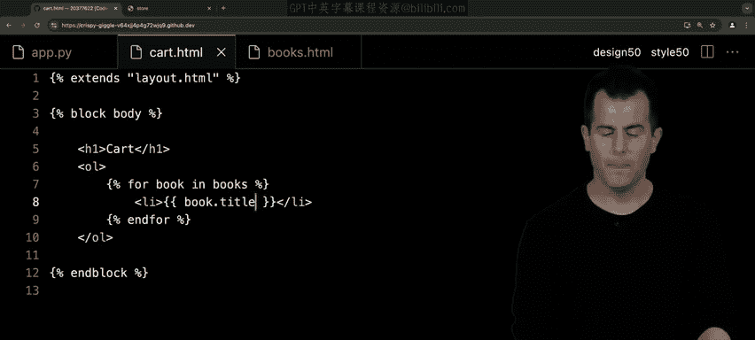

All right， if I've now made no mistakes， which is low probability。

 let's reload the application itself， the cart we now see the same catalog of books。

 let me proactively go to slash cart in my URL up top and hit En and you'll see that my cart is empty at the moment。

 but because of all of the logic I've added to my cart route。

 watch what happens if we add these to the cart， let's try adding the very first book the hititchhickerker's Guide to the Gal click。

😡，All right， I screwed up here， I did get redirected to cart， but but but that method is not allowed。

 we know I'm using post because that is what was in my form。

 but I think this is an easy fix if I'm using method equals post here。

 I need to support that route here so I need to specify the methods I want to support are indeed not just get but also post for my cart route All right let's go back again。

😡。

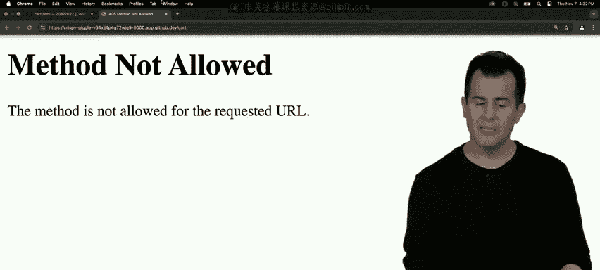

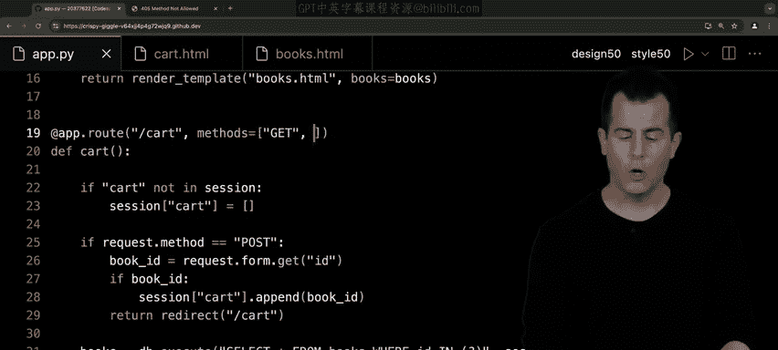

Back to the catalog and click add to cart。A not only has it been added to the session。

 I've been redirected to slash cart and because it's in my session， there is the first book。

 Let me hit back now。 let's add the last book to the book to the cart mostly harmless click and now I have those two books in my cart Now to be clear these are only stored in the session they're not yet stored in a database so this isn't like the user has placed an order it's more like they have added something indeed to their shopping cart temporarily and in fact。

 you can kind of see what's been going on all this time as follows if I seed back to my store directory and let me clear the terminal and type LS notice this other folder magically appeared called flask session and in fact if I look inside a flask session you'll see it turns out a couple of files now because I've been using this for some time I've created two sessions over time and I essentially have two cookie values stored in this folder that's keeping track of what the user has been doing on my way。

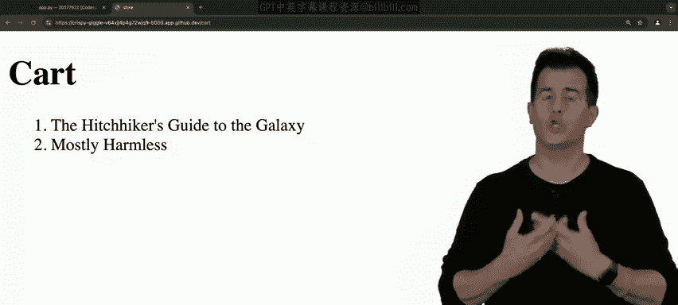

In short， these files that are stored temporarily in that folder are the result of having configured the session as follows to use a file systembased session so that Flask is creating these files for you and storing in those files as much information as it needs to remember what is in whose cart。

😡，And it uses cookies ultimately， to main that kind of state。All right。

 I think we have time for one final set of examples whereby we' connect all of the dots2 from week six and week 7 together in a final implementation of an application let's do this let me close all these tabs here let me open my terminal window let me hit control C on flask and go into now our final example called shows and in my shows directory which I created in advance。

 I have similar files， but not the same apppi and requirements text shows do db which is our old friend from SQL wherein we have thousands of TV shows from imMdb as well as my templates folder which as before has index html and layout htl as well What I'm going to do now though is go ahead and introduce that much bigger database and make an application that's going to let a search imMDB albeit with a simpler UI than at imMDB co So how might I do this let's go ahead and。

😊，s implementple app pi first， let me open up app pi and hide my terminal and this list from this starting point。

 let's do this， add to it from CS50 import SQL， and down here let's go ahead and create a connection to that their database。

 DB equals SQL， quote unquote SQLL colon s/ shows do DB。😡。

Now I'm going to go ahead and create a route app route quote unquote slash for my default define an index function and this function's purpose in life quite simply is to return render template of quote unquote index htm Now what's that route actually going to do well that index do Hml is going to be very simply a search form so let's implement that let me open my terminal and go into templates and then open up index hml which has the starting point of our body as before and in here let's do this form action equals quote unquote slash search which will be the next route that I implement the method I'll use now is get just to make clear what's going back and forth between the browser and server let's create as we have in the past an input with autocomplete equaling off autofocus on for this field the name of this field will be Q just like our Google example from last time the placeholder for which will be。

For Q and the type of this just to make it is slightly better is search。

 which is almost the same as text， but it usually gives you a little X。

 you can click to clear the search box then I'm gonna have a button。

 the type of which is submit and the label on that button will be search and that's it for that form Now this isn't fully functional yet。

 but let's test it out let's go back to my terminal window back to my shows folder run flask run in this one after making sure that it's not running in my other tab and in my other tab I'm going to go into my shows folder but only in one of these am I going run Fask run Allright I'm going go back now to my other tab which still shows my shopping cart I'm gonna shorten the URL to just and hit enter and now we see my shows application Of course if I search for something like the office enter nothing actually happens why because even though the browser brought me to search question mark Q equals office there's no search route yet So let's go back to。

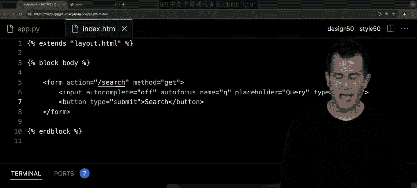

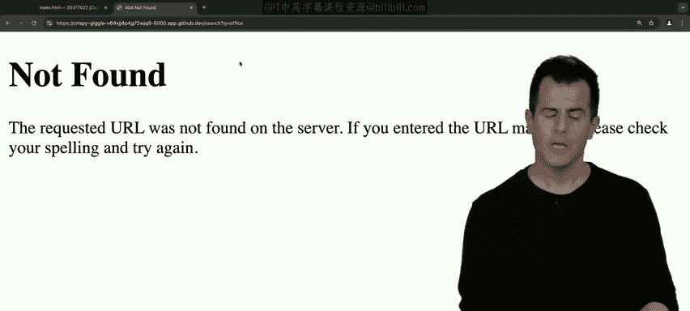

code and in VS code let's go back to app pi and implement that route Now in this route。

 I'm going to go ahead and in app pi I'm going to create appt route quote unquote search So creating the route is super easy to a function called search or whatever and then now let's go ahead and search for titles that match what the user typed in So shows equals Db do execute quote unquote select star from shows where the title equals question mark as my placeholder let's now pass in request do org get quote unquote Q which is the query that the human typed in to the form I could create a variable but it's so short enough line of code it fits on the screen I'm going to leave it as that then I'm going return render template quote unquote。

😊，Search dot htm comma and let's pass these shows into this template shows equals shows Now I don't have a search do htl template yet。

 so let's go and create that in search do HTML I just want to print out those titles so let me go into my terminal window specifically the one not running flask let me see the into templates and then let me go ahead and run code of search do h hide my terminal and really quickly do an extends quote unquote layout do ht then let me do a block body then let me do an end block as always and in here let's just do a simple unordered list of these titles of shows for。

😡，Show in shows where shows is the variable I passed in as my name parameter。

 and let's end that for loop， then inside of here a link a list item passing inS。

t title as my value to interpolate。😡，All right， let's see what happens now。

 let me go back to my other tab， back to the form itself， let's search for office， search。

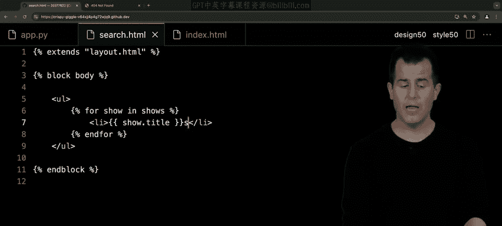

Ha nothing so no actual results on the page In fact。

 if I view page source by right clicking or control clicking notice that I've got a UL but no list items All right well technically the show is not called office but the office so let me do that the office search we actually have a bunch of versions of the office which we saw not only the American one but the British one and others as well so it seems that my equal sign in my SQL query is behaving exactly as we learned in week 7 whereby I'm literally searching for a specific title that I'm plugging in for that placeholder so I think we can improve this slightly recall that you can make things a little more flexible by not using equals but we could actually use like unfortunately we need to when using like use those wild card characters like a percent sign to the left and or right of the thing that we want to match on so the easiest way to do this might actually be this let me create a new variable here called query and set it equal to sure request。

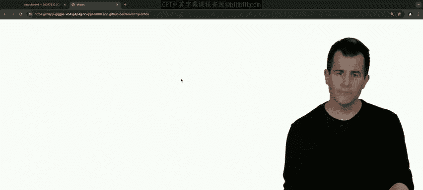

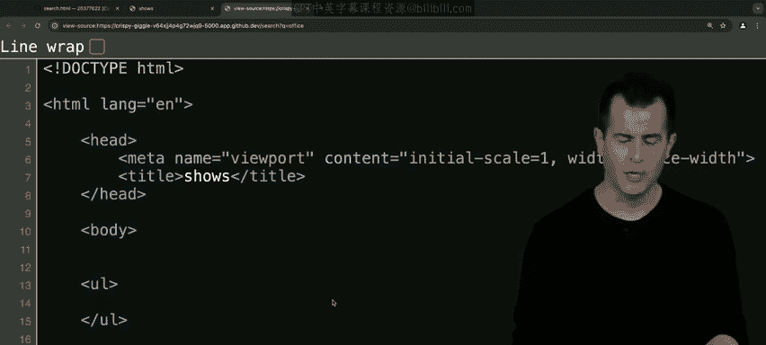

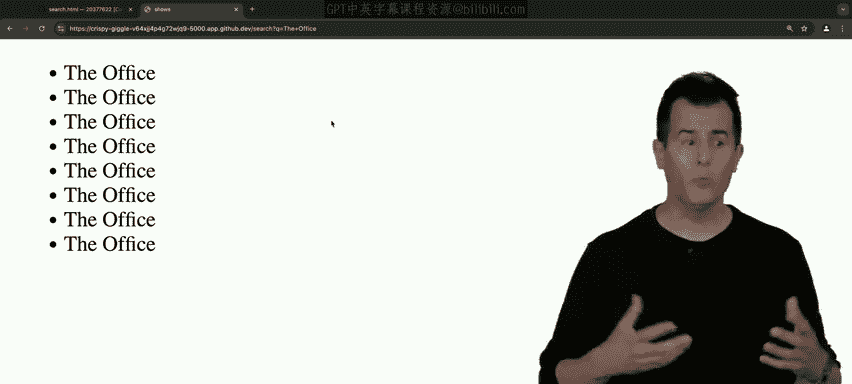

t orgs do get quote unquote Q。 However， let me actually prepen to that a percent sign to be my wildcard。

 and I'm going to use plus， which we is the concatenation operator and Python alternatively。

 we could use an f string or some other technique， but to be pedantic。

 I'm going literally add to this string， Another percent sign at the end as well as the beginning there。

 So if I type in office， this will just construct a Python string or stir。

 that's percent O FF IC percent。 These percents have nothing to do with ginjas templates。

 they have everything to do with SQL per week 7， which are wild card characters。 Then over here。

 I can plug in not the raw value that the human typed in。

 but I can pass in that query so that it is placed where the question mark is and it is properly escape to avoid any SQL injection attacks。

 So now let's go back to my other tab and hit back And instead of searching for the office。

 let's search for office click Now I get back not only all of those。

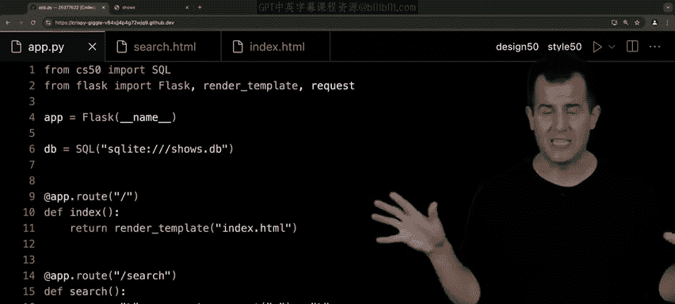

But also every TV show that has ever had the word OFF ICE in it or a substring thereof。

 So maybe overkill， maybe not what I want， but it did in fact make the search a little more versatile But it turns out we can improve upon even this user interface。

 but notice up until now what we've really been doing now is combining Python and SQL and HTML and well。

 no CSss and everything's quite ugly for it but we've combined almost everything what if we introduced to the mix a little bit of jascript code as well whereby I could move away from this model where every time I want the browser to talk to the server。

 I don't necessarily need to send data from browser to server and then reload the whole page perhaps at a new URL much like our autocomplete example at the end of week 8 recall that we could populate the body of the web page the Dom or dogum and object model using jascript as well。

 So in fact， even though we haven't done this yet， I bet I could write。

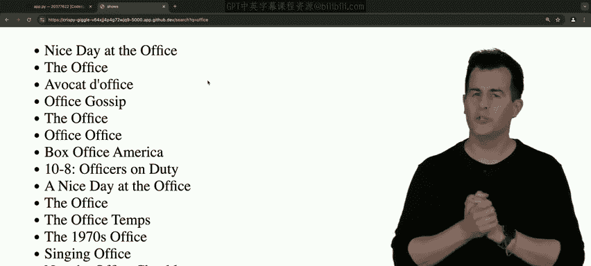

A little bit of JavaScript code that talks to the server and says give me more results。

 give me more results and just displays them instantly in the existing web page without having to generate everything server side in other words you can actually use JavaScript to generate some code client side as well。

 so let's see how this might look。😡，I'm going to go ahead now and implement in this next example the following so let me propose to tweak our implementation of index。

 HTML such that it still has a form but it additionally has some javascript code that goes and fetches from the server。

 any book titles that match what the human has typed in rather than have any submit button at all that sends the whole form to the server and lets the server generate all of the HTML together let's instead do a little more client side so I'm going to go into index。

 HTMLt here an inside of this template I'm going to change the way this form here is implemented and I'm going to simplify it as follows I'm going to get rid of all of this this traditional form and I'm just going to give myself inside of the block body an input type for which autocomplete as before is off which is autofocused as before whose placeholder is still quote unquote query whose type is actually search what I'm not going to bother doing though is giving this thing a name。

😡，I don't want1 to submit this form to the server per se I just need a form field that I can use JavaScript to grab the value from what I'm next going to do is create weirdly an empty unordered list with nothing in it but I'm going to fill it dynamically with JavaScript ultimately in fact here comes a script tag as we saw at the end of last week whereby inside of this script tag I can write some actual JavaScript code and this is going to look a little cryptic at first but I'll walk us through it as follows。

😡，First， let me create a variable called input in JavaScript and set it equal to document。

 queryry selector quote unquote input this code will grab from the webage's dom or document object model that is the tree that's been built up in the computer's memory。

 the tag of type input so this will give me JavaScript access to this here HTML tag Now I'm going listen to that input for any keystrokes and I'm going to say input dot add event listener。

😡，And I'm going listen for the input event， which just means I've inputted a keystroke。

 So I'm not caring about key down or key up。 I'm just saying when something's been inputted。

 go ahead and call this function， So I'm going to use a slightly new feature today that's called async which means what's about to happen is going to be asynchronous for reasons we'll soon see insideside of this function I'm going now do the following I'm going create another variable called response。

 and set it equal to the result of waiting for a function in jascript called fetch that will know how to request via HttP a specific route specifically slash search question mark Q equals and then some value that I'm going to append and what I'm going to append is the value of that input box。

 In other words， this line of code is going to make an HtTP request from jascript to the server requestinglash search question mark Q equals office or whatever I've typed in but I'm therefore using code to。

😡，Simulate and induce an actual HTTP request without the human actually clickingubmit。😡。

After that I'm going to say let shows equals a await responseponse。

tex which just means wait for a moment until I get back the text of this HtTP response in JavaScript and then I'm going to do document。

 query selector quote unquoteUL I'm going to fix my capitalization and I'm going to change the inner HTML of that UL element as we did once last week to be equal to whatever the text in that variable is In other words these lines of code do the following it listens for human input in the form and the input Im sorry。

😡，This line of code listens for human input in that text box。

 this line 13 makes an HtP request from JavaScript to the server asking for/ search question mark Q equals something where something is whatever the human typed in。

😡，Line 14 waits for the response from the server Line 15 uses the response and plugs it into the inner HTML of the UL element。

 effectively putting a whole bunch of LI tags therein Unfortunately search as a route does not quite do what we need just yet。

 so I'm actually going to go back into apptop pi here。😡。

And I'm going to modify the behavior of app pi such that it behaves as what we generally call an API。

 an application programming interface， which is a way of standardizing how you provide input to a service and get output therefrom the API here is going to be super simple。

 All I'm going to do now is this I'm going to go ahead and search for as before。

Some shows in the database as I've done here and what I'm then gonna to do is actually render the same template search ht but now that I've confirmed that that part itself doesn't need to change I am going change the template in search HTML instead of sending a proper UL tag which I don't need I'm just going to send a whole bunch of li elements instead a snippet of HTML if you will but there is one more change I need to make to search do HTML because I don't want to send a whole laid out web page with the HTMLl tag and the body tag and everything else so I'm actually not going to bother extending my layout all I'm going to send back is just the results of this four loop here just a raw snippet of HTML but without all of the tags we've normally seen so now I'm going go back to my other tag wherein I have a search box but no submit button because I didn't include one this time I'm now in the search。

😡。

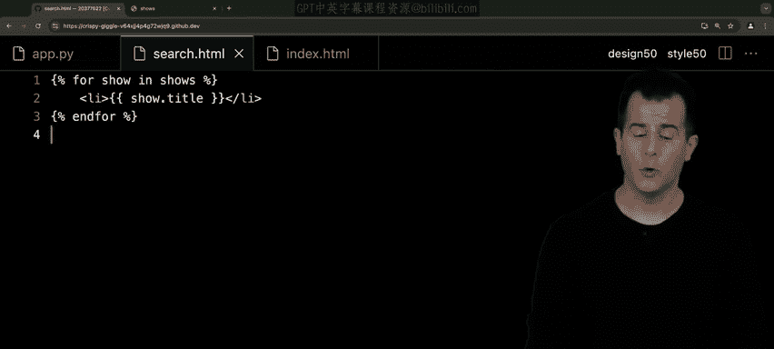

going to type O， which is gonna take a moment because there's a lot of shows in that database。

 but I do see now an unordered list of all of the shows that have the letter O somewhere in them But what's really happening underneath the hood let's do this reload the page let me open my developer tools and let me click on the network tab which up until now I've generally used the doc tab therein which specifies I want all of the topleve documents traffic log but now I'm gonna click on all so I can see everything and I'm going go head into this search box and type O it indeed takes a moment but notice in the logs here of my network tab I can see the request that was sent from jascript to the server if I click on that you can see in this query here and it's a big one so we're seeing a little spin under the response tab I don't have a fullyform web page I have a whole bunch of li tags and the titles of those shows in there hundreds of them if not thousands of them which is why it was a bit slow whereby the server generated not a fullfledged web page but just a snippet of H。

Instead and so this is an example of indeed what's really an API。

 albeit a naive one that's just returning a minimal amount of HTML that you need to populate your own unordered list。

 but generally speaking， this isn't really the best way to do this really when it comes to APIs you should be not sending back snippets of HTML but really the raw data and so in fact very common in the world of APIs as you use something called Json jascript object notation bit of a mouthful。

 but what it means is that instead of sending back all of that HTML what you should probably send back is really the equivalent of a python dictionary。

 Javascript doesn't have dictionaries per se JavaScriptscript has what the world calls objects but for our purposes here they are the same and in fact what you see on the slide here is a snippet of jascript object notation that wonderfully happens to be the same format that we use in Python for dictionaries kind of a coincidence but probably deliberate but finally things are looking the same and in fact if I select all。

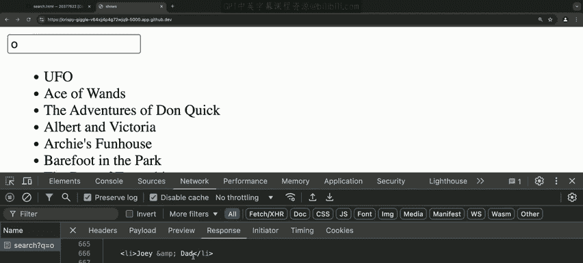

The columns from my shows table in that database I'll get back not just the titles。

 but the ideas of the shows the year in which they started as well as the number of episodes。

 Allright let's go back into Vs code and modify app in such a way that our search route now returns a proper Json response of results as opposed to just returning the snippet of Hm So in VS code I'm going first go up to the very top and import one last feature from flash namely a function called jsonfi which as the name kind of suggests it's going to turn into Json anything you pass into it。

 So for instance， if I pass to it a list， I'm gonna get back a Json version at that list if I pass in a list of dictionaries I'm going get back a json version of a list of dictionaries in short it converts whatever is in Python's memory to the corresponding jascript object notation So let me scroll down now to my search route and let's make a change as follows let's go into the last line and instead of rendering a whole template of HTMLl let's actually。

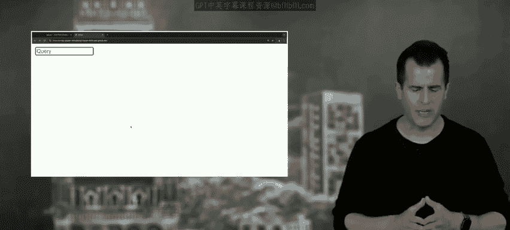

The return value of Jsonify passing in all of those shows， though for good measure。

 let's actually fix a couple of other things as well。If for instance。

 the user did not actually type something in， we probably don't want to search blindly for some value we know is empty。

 so let's actually tweak even this part as follows I'm going to go into my search route further and I'm going to define query whoops query equals request orgs do get quote unquote Q but then I'm going to ask a question if there is in fact a value for that query。

 then let's go ahead and query the database for that query but prepen to it a percent sign first plus the query itself plus a percent sign after closed parenthesis else if there is no query that is they didn't type in anything at all。

 then let's go ahead and specify that the shows list is really empty there's no results so that at least when it comes time to Jsonify that variable where Jsonifying either an actual result set of results or nothing at all but consciously so and just to speed things。

😡，Instead of selecting thousands of shows that might contain the letter O。

 let's limit this to like the top 50 just to speed things up。

 even though in the real world you probably want all of them All right let's now take a look at index HTML which we do need to now modify to understand that it's going be getting back Json as the first server response instead of that snippet of HTML The first thing I'm going to do on line 14 is tell jascript to treat that response indeed as JSson and not text because what I don't want is a big string what I really want in the browser's memory is a proper array of objects that is to say a proper list of dictionaries in the browser's memory but after that I don't want to just blindly plug that code into the inner HTMLt of the U rather I want to build up my HTML myself So I'm going do this as follows I'm going create with let another javascript variable called HTML instead set it equal to quote unquote I could use double quotes but I'm using single quotes for pary with ja convention。

But it's just an empty string at this point then I'm going to say in a for loop in JavaScript 4 let's show of shows and this is going to be my way of iterating now over all of those shows。

 the of preposition is a little weird in JavaScript but this allows me to iterate over each of the objects in that array so let's go ahead and do this let me go ahead and append to that HTML string with plus equals or concatenate a li tag of my own making followed by that shows title followed by a close li tag of my own making and then outside of that for loop let's do document query selector。

😡，Quote unquote U to get access to that same empty U element that we do still have and change its inner HTML not to be what came back from the server but my own dynamically generated HTML instead now as an aside I should note that it's possible that this code might be a little buggy because if the show's title contains any special characters like the less than sign or certain other characters that have special meaning in HTML things might very well break and I should probably replace any such characters with their corresponding HTML entities for now I'm gonna wave my hand at that just to keep the code relatively simple。

 but know that we might need to do that kind of escaping of the strings we're pasting in let me now go back to my browser here let me reload the page so I get the latest version of the code and let me go ahead and type something like oh for office and there we have it and unordered list generated not by the server but by me client side such that now I can search for oh or office or anything else and all of that is happening。

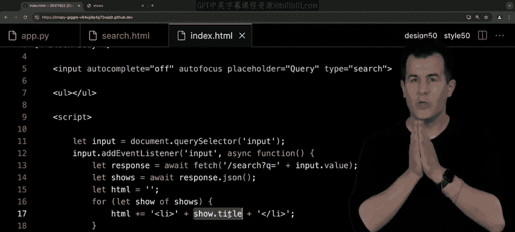

Now by generating the list items for that UL within the browser itself and in fact。

 if I reload here and open up my developer tools again via Inspect and go to the network tab and search for oh I can click on that row and under the response tab I can see that I'm not getting back any HTML per se I'm getting back JSsonN albeit pretty printed here and in fact that then reveals to me that indeed I'm getting back JSON and I'm plugging it in to the browser accordingly so all that said it seems that now we have the ability using HTML and CSS and JavaScriptscript with a bit of Python with a bit of SQL。

 can we build fullfledged web applications that increasingly are being used not just on our desktops but in laptops but also on our phones as well in fact using all of these languages can you build backend and a frontend that communicate with each other to build things like your own freshman intramural website your own problems at9 or we hope your own final project。

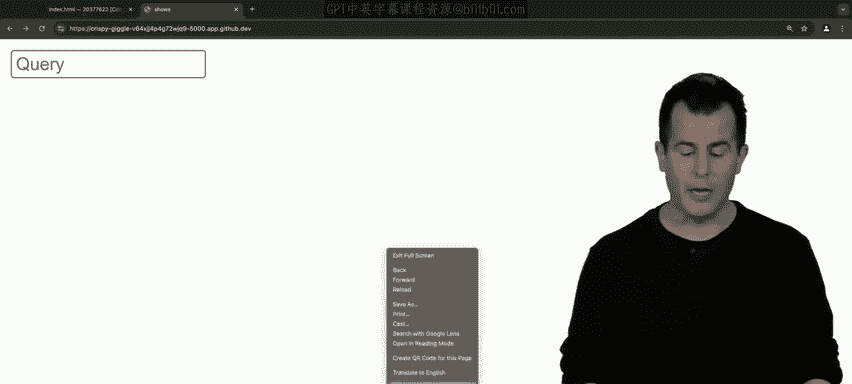

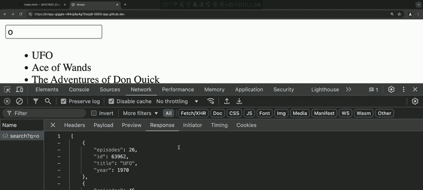

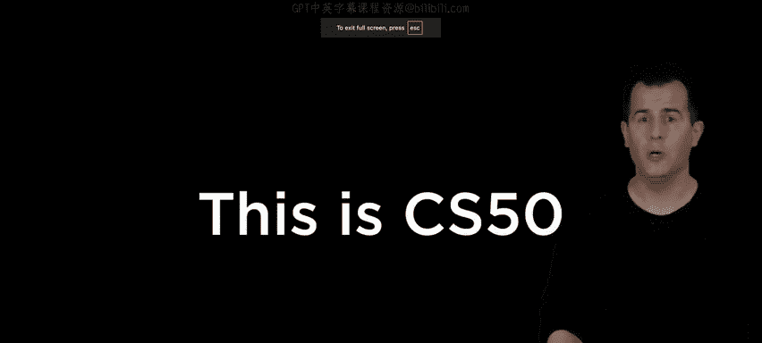

That's it for CS50， we will see you back in Sanders Theater one more time。

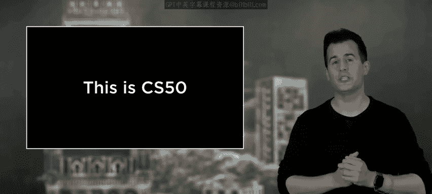