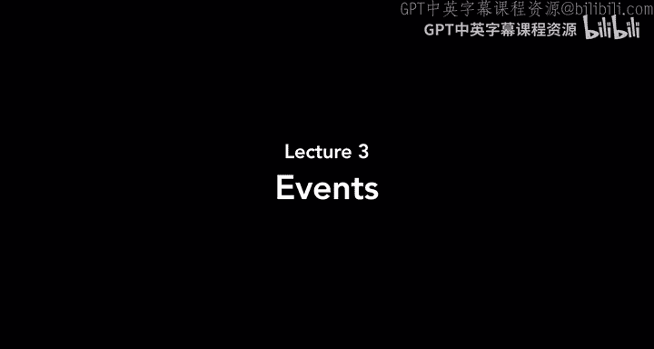
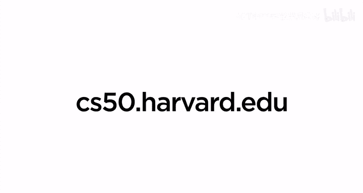

# 哈佛大学《CS50 Scratch 编程｜CS50’s Introduction to Programming with Scratch 2024》中英字幕 - P3：Events - Lecture 3 - CS50s Introduction to Programming with Scratch.zh_en - GPT中英字幕课程资源 - BV1nx4y1s77C

Welcome back， everyone to an introduction to programming with Sctch。

 And last time we took a look at the fundamentals of programming。

 putting together a sequence of instructions that we called functions by assembling these different colored scratch blocks。

 And by putting together these different colored scratch blocks。

 we were able to bring our projects to life。 We were able to take characters or sprites on the stage and have them move around or draw pictures and play sound and more。

 And so today， let's take those concepts of programming and build upon them a little bit more。

 I'll go ahead and open up scratch again and let's start with a program that we've seen before。

 I'll go ahead and go into the looks section of the blocks and pull out this。

 say hello for two seconds block。😊，And as you might recall。

 when I click on this block to run this stack or scriptive code。

 you'll see that my cat over on the stage says hello for two seconds。 and then it stops。

 And so that seems to work well。 but notice that in order to run this program。

 I had to click on the code that I wanted the cat to run。😊，And that might be fine。

 but if you've used programs on your computer on your phone before。

 then you probably haven't specifically told the program which part of the code you want it to run when you open up an app and some code runs or you click a button and some code runs or you type something onto your keyboard and some code runs。

 you're not specifically pointing to what lines of code in a program you generally want to run。

 And one other problem here might be what might happen if I have multiple scripts across multiple sprites。

 maybe imagine that it's not just the cat saying hello。

 but the cat talking to let's pick another sprite。 let's pick the dinosaur。

 So I'll go to animals and choose the dinosaur and maybe I want these two to say hello to each other。

 So I'll move it so that the cat and the dinosaur or next to each other。

 and I want to turn the dinosaur around so that they're facing each other。

 And I can do that recalled by going into the direction for the dinosaur and having it face the left instead of facing the right。

 And now it seems like the dinosaurs upside down。I just need to remember to change the rotation style to left and right instead of all around。

 And so now the cat and the dinosaur are facing each other。

 and if I want them both to say hello to each other， well then this dinosaur。

 notice the dinosaur is now selected， is also going to need a block that lets it say hello。

 So I'll also give it a block that says say hello for two seconds。😡，But now。

 if I want the cat to say hello to the dinosaur， well then I'll need to go to the cat。

 click the say hello block， but then very quickly， click on the dinosaur and click say hello too so that they can both say hello to each other。

 It was a bit tedious for me to have to quickly jump back and forth between two sprites。

 And you could imagine that at a more complex project where a sprite might have multiple different scripts that we want to run or you might have many more sprites。

 it's not going to be possible for me to in any reasonable amount of time。

 go to all of the different sprites and start up all of the different blocks that I want to run。

 it would be better if I could just say， let's start the project。 And when the project starts。

 then I want all of these scripts of code to run automatically。

 And we can do just that via this button that's in the upper right of the scratch window。

 This is the flag。 And generally， when you click on this green flag。

 that marks the start of your scratch project。😊，Of course， right now。

 when I click on this green flag， nothing's happening。

And so here' is where we're going to introduce a new concept in programming。

 And that's the concept of an event。 And we can see the event blocks as one of the options along the lefthand side of the scratch window。

 and the event is just something that happens inside of our program that we could have some code respond to。

 we could say that when something happens， for example， when the flag is clicked。

 then I want the cat to say hello for two seconds or I want the dinosaur to say hello for two seconds as well。

😊，And so we do have this very first event block here when flag clicked。

And I'm going to take this block and drag it on top of。The say hello for two seconds block。

And so now I've attached my code to a particular event。 This block here is called when flag clicked。

 it means that when this event happens， when the flag is clicked。

 we are going to run all of the code that is attached beneath it。

 And notice that nothing can be attached on top of this event block。

 This event is the beginning of the script of these blocks of code that I want to now run。

 And so now when I click on the green flag， the dinosaur is going to respond by saying hello for two seconds。

 So I go back to the project here。 click on the green flag and the dinosaur says hello。

 And now if I want the cat to say hello too， well， then all I need to do is click on the cat in the spitechor down below and add the when flag clicked event to it as well。

 So I'll take the when flag clicked block， drag it on top of this say block。😊。

And now when I click the green flag， I just have to click once and both the cat and the dinosaur are going to say hello。

 rather than me having to click one block immediately。

 very quickly jump to another sprite and then click on the block as well。

 And the nice thing now is that someone can run my project without ever looking at my code。

 And the code will still work。 They don't have to know which blocks to click on。

 They can just click on the green flag and see the project work。 And in fact。

 that's what happens if you were to share your scratch project on scratch's website。

 sending it to friends or family， for example， they'll usually just see your project without seeing the code at first。

 and they can run your project and see that both the cat and the dinosaur in this case are going to say hello。

😊，So these are events where when something happens in the project。

 we can respond to that happening by having some blocks of code run。

 But there are other events that we can use as well。 And let's take a look at another event。 Now。

 I'll delete the cat in the dinosaur for now。 and let's add a new sprite。

 Let's pick an animal and let's go back to the duck here。😊，So we have the duck。

And the event that we we'll take a look at now is this one here。

 It's called when this sprite clicked， meaning when this sprite is clicked on some code is going to run in response to the fact that I've clicked on the duck in this case。

 and I can have anything happen。 and maybe what I'll have happen just for now is I'll go into motion and I'll have the duck go to a random position。

 So every time I click on the duck。 It's going to go now to a random position。

 So I'll go into the stage。 I'll click on the duck and the duck moves。

 I'll click the duck again and it moves。 I click the duck again and it moves If I want it to move a little bit more smoothly。

 remember that go to will immediately jump to a random position。

 But I could instead by removing this block and replacing it with this one。😊。

Have the duck glide to a random position。 Take one second and just glide smoothly to a different position。

 Now， every time I click on the duck， you'll notice the duck。😊。

Glide across the stage to a different random position on that stage。 And it's responding again。

 not to when I'm clicking on the code itself， but when I'm clicking on the duck and the duck is responding because it's an event。

 The event is when the sprite is clicked on， we're going to glide。 And what you'll notice， too。

 is that on the left side of the scratch window。 when the sprite is clicked。

 you'll see this script light up to tell us and indicate to us that this script is currently running。

 right now， it's not running。 But notice that as soon as I click on the duck。

 it lights up for one second， as the duck is moving And then it stops the Englishglet。

 And while it's lit， that's when we know that this particular script happens to be running。😊。

And so the ability to have sprites respond when we click on something on the stage。

 when we click on that sprite on the stage gives us a lot of flexibility and creative potential for creating new types of user interfaces for letting the user interact with our project in different ways。

 In fact， you might think of this as something like a button where when you click on a button on a computer program。

 something happens in response to you clicking on that button。

 And now that we have this event when clicked， we can create buttons of our own inside of our scratch projects。

 And so let's try just that。 I'll get rid of the duck for now。

 And let's add some backdrops that we might want for our project。 I'll add a new backdrop。😊。

And I like the Arctic backdrop， so we'll pick that one first and let's choose a couple that I might like to use in this project so I'll choose another one and let's go now to the jungle。

 that one seems interesting， slightly different。 and we'll do one more and we'll go back to the underwater one that we were using with the fish before。

 And so I've got three different backdrops that are part of my project。 I've got the Arctic backdrop。

 I've got the jungle backdrop。 and I've got the underwater backdrop here。 Of course。

 only one backdrop can be active at one time。 we can switch between them。

 but only one can be there at any given time。 So let's add some buttons to let the user control which backdrop is going to be selected。

😊，I will add a sprite。And notice that there are a couple of different types of buttons that I can choose from。

 I'll go ahead and choose this button button 2。And I'll drag the button down to maybe the left side of the screen。

And let's first modify the button， I'll go to the costumes and I'll add some text to the button。

I'll add some text， and the text will say Arctic， for example。I'll select the text， change its color。

And I'll make sure that this is by clicking on the arrow。Make it the text a little bit bigger。

And center the text approximately on the button。And so now I have one button that says Arctic on my project。

 But， of course， when I click on the Arctic button。Nothing's happening just yet。

So let's add an event such that when I click on this button， something is going to happen。

 I'll go back into events。 The event I want is when this sprite clicked。

And when this sprite is clicked， what do I want to happen。

 Will I want the backdrop to change to the Arctic backdrop。

 The backdrop changing that has to do with the look of the project。

 So we'll go to the look section of blocks。 And let's switch backdrop to。Arctic。

And now when I click on the button， you'll notice the backdrop change。

 I clicked on the button and because we have that event， it's responding to us as well。

 And so now let's add buttons for each of the other backdrops that I might want to switch to in this project。

 And I could do that by doing exactly what I've just done by adding a new sprite。

 choosing the button again， adding some text， but it'll be a little bit easier actually for now to just duplicate the sprite that I already have this button here。

So I'll go ahead and right click or control， click on the sprite and click duplicate。

 I've got another button。 These these are just called button 2 and button 3。 For now。

 It'll be a little bit nicer if I give them names。 I'll call this button Arctic button。

And I'll call this button。Jungle button。What do I need to do， Well。

 let's go into costumes and first change this text。 Let's change the text to jungle。

Recenter the text a little bit there。And now when this sprite is clicked。

 when the jungle button is clicked， I can switch the backdrop。To the jungle instead。

And notice that in the upper right portion of the code editor。

 you'll always see a slightly transparent image of what sprite you're currently working on in case you ever forget。

 it's also selected down below， but right now I can tell because I see this slightly faded jungle button that right now I'm editing the code for this jungle button。

😡，And now when I click on the button， the backdrop changes to the jungle。

 and I can drag this so that it's underneath the Arctic button。

And let's add one more button by control click and duplicate this button。

 I'll change the name of the button to underwater button。And now we'll go into costumes。

 change the text， change this to underwater， the text is a little too long。

 so I'll need to make it a bit smaller to fit on the button。 That's okay。

 I can just click on the arrow and that will let me drag and resize various different elements on my costume。

So now I've got a button that says underwater and I'll switch back to the code tab now instead of the costumes tab and now when this sprite is clicked。

 let's switch the backdrop to underwater 1， which was the name of that backdrop。

 And now when I click underwater， we switch to the underwater backdrop。

I'll stack these buttons on top of each other。 And now what I have are three buttons that the user can click on to switch between the various different backdrops。

 depending on which button they click。They'll be able to see the backdrop respond to the buttons that they're clicking on as well。

And so using this， we really have the ability to let the user interact with the stage。

 click on the stage and see something actually happen。 And I'll show you one more example of this。

 I'll get rid of our buttons for now， and I'll go back to backdrops and go ahead and switch us back to the plain white backdrop。

😊，But let's add some sprites that the user might interact with。 I'll go ahead and add sprites。

 and so far I've mostly been using animals， but let's jump to the music tab for now and add a few instruments。

 let's add a snare drum and let's add one more，'s add the conga drums and let's add one more let's add。

😡，The symbol。So we'll go ahead and move these around， I've got three。Different drums。

 And now when I click on each of them， let me go to events and drag out this when this right clicked button。

We'll go into sound and we can play a sound and I'll play。

 We have a bunch of different snare drum sounds I can choose from。 let's use like the tap snare。

 for example， and let's add a sound to each of these various different drums for when I click on that sprite。

 So for the Conga drums I'll go back to events。When this sprite clicked I'll go back to sounds and and say。

 let's play a sound let's play the let's go with the high conga sound。 And finally。

 we'll go into the symbol and say now when the symbol is clicked， let's go ahead and play the sound。

😊，Crash symbol。And just with that with two blocks of code for each of my three drums。

 one event and one block that plays a sound。 now I have a drum kit that I've built just using scratchtch when I click on any one of these drums。

😡，You hear some sounds。🎼。And you could have fun with that， adding other instruments， playing music。

 remember we had that music extension that we took a look at last time that gives you various different options for playing notes and playing other instrumental sounds。

 And so you could create some music and let the user create some music just by clicking on things inside of their scratch project。

😊，And so that then is the power of responding to a click event。

 clicking is an event the user clicking somewhere on the stage。

 And just by adding this one block when this sprite clicked， we were able to add functionality。

 Some behavior that happens， some functions that run when we click on a particular sprite。

 But clicking isn't the only way that users can interact with a project。 They might also。

 for example， type something onto the keyboard， press a key for example， and that too， is an event。

 We've seen a couple of different types of events now。

 but pressing a key on the keyboard is absolutely an event to that we might want our scratch projects to be able to respond to。

 So let's give that a try。 I'll get rid of our drums for now。😊，And， let's add a。Fish。

 we'll go back to the fish。And we'll bring the fish into our project。

And I would like for the fish to do something when I press a key。 So let's start simple。

 It's first figure out what event do I need to use And what we have this block here that is when space key pressed。

Which I guess would mean that when I press the space bar on my keyboard， something's going to happen。

 What do I want to have happen， Well， let's go into sound。 And let's play the sound。

Bubbleles until done。And so now I'll go ahead and press the space key。And when I press the space key。

 you hear the bubbles。 And every time I press the space key， that's a different event。

 and that's going to trigger the running。Loves that code。But notice， too。

 that this block is actually customizable。 I can change it。

 parameterize it slightly just by clicking on this arrow。

 and this opens up a menu where I can choose what key it's going to respond to。

 It doesn't just have to be when the space bar on my keyboard is pressed。 I can have it respond to。

 let's say the right arrow or the left arrow。 So Ill go to right arrow。😡。

And instead of playing a sound， when you get the right arrow。

 let's go ahead and change the X value by 10。 Remember that each sprite exists in this X Y coordinate and grid on the stage where X refers to how far to the left or to the right。

 a particular sprite is。 and y refers to how far up or down a particular sprite is。

 And so now the right arrow key is going to move the fish to the right by 10 spaces。

 I'll press the right arrow key and you'll see the fish move a little bit。

 press it again and it moves and it keeps moving every time I press that key。

Let's now add the ability for this sprite to respond to the left arrow key。

 And this is going to be very similar。 I just want to move in the opposite direction。

 I want to go left instead of going right， and I could drag the event out and then drag another change X by and change it to negative 10 instead of 10 this time。

 But in this case， because it's very similar to the code I've already written。

 I can actually control click or right click on this script。And just say， duplicate。

And when I duplicate， I get a copy of what it is that I've just written。

And now I can modify it instead of responding to the right arrow。😡。

Let's have this script respond to the left arrow。And instead of changing x by 10。

 let's change x by negative 10 to have the fish move in the negative direction instead。

 And just for fun， let's go ahead and click on the stage and change the backdrop to underwater so that it actually feels like the fish is swimming around underwater。

😊，And so now when I press the right arrow， you'll see the fish moving to the right and when I press the left arrow。

 the fish is moving backwards， I might not be exactly what I want， but it is moving to the left。

 at least， and I can make this a little better， maybe by allowing its rotation to change。

 Let it face the left when it's moving to the left。

 let it face the right when it's moving to the right。 And remember， I can do that。

 just by using this point in direction block。 So when the right arrow is pressed。

 let's go ahead and point in direction 90，90 degrees， meaning facing the right and move 10 steps。

And if the left arrow key is pressed， let's point in direction negative 90。

 And if you didn't remember what number it was， you could use this dial， of course。

 to change the value as well， and then change x by negative 10。 And this might be closer。

 Let's try it out。I press right， and the fish moves to the right。Now I press the left arrow key。

And the fish turns upside down。 Okay， not quite what I wanted。 Again， by default。

 when you rotate a sprite， it's just going to rotate in a circle。

 which means it might end up upside down。 If you just want it to be able to go back and forth between left and right。

 be sure to go to direction and change the fish's rotation style to left and right。

 And now when it goes right， it faces the right。 And when it goes left， it faces the left。

Notice too that if you wanted to change this with code， you also have this block here。

 set rotation style that will let you using a block of code decide what rotation style that particular sprite should have。

😡，And so now I have the ability to let this fish move。Left and right。 And I could add to this， too。

 if I want to let it move up and down， then I'll add one more event and say not when the space key is pressed。

 but when the up arrow is pressed， let's go ahead and ahead and have it move。

 We're not changing X anymore。 We're instead changing Y because y refers to the up and down direction of the sprite。

So when the up arrow key is pressed， we're going to change y by 10。😡。

And I'll duplicate this by going to the event block， control or right clicking， clicking duplicate。

And now， when the down arrow is pressed， let's change y by negative time。

And so now I can get my fish to move to the right， I can get my fish to move to the left。

 I can get it to move up or down as well， and I can get it to move across the stage all just by pressing keys on the keyboard and using that ability you could imagine trying to create some sort of game。

 maybe you've played a game on a computer before where you use the arrow keys or other keys on the keyboard to move some character around now we have that exact same ability within scratch itself to by clicking we're pressing various different keys on the keyboard。

 we can get our sprite to respond to that as well。 and it's not just the space in the arrow keys it's letters of the alphabet that you could have be pressed or numbers on the keypad。

 for example， that might be pressed and so let's give that a try two just for fun。

 I'll add a few more blocks here。 let's let the fish change in size。

 maybe I want to be able to choose between how big or small the fish is going to be。

 And so when the one key is pressed。 Let's make it small and you press one。 So we're go into looks。😊。

And let's set the size to maybe 50%。And I'll duplicate this block again by clicking or right clicking or control。

 clicking on the event block， clicking duplicate。Now when the two key is pressed。

Let's make it normal size 100， and we'll duplicate one more time。 Now， when the three key is pressed。

 let's set the size to be bigger， we'll set it to be 200%。And so now watch what happens。

 I can still move the fish around it's still responding to the arrow keys。

But now I can also use the numbers to control how big or small the fish is going to be。

 if I press one， the fish shrinks， it's now 50% of the usual size When I press2。

 it goes back to normal size， and when I press seat 3 the fish gets much larger。

 it goes to 200% of its original size。And so by putting together these various different scripts。

 each of which is responding to a different key on the keyboard。

 you can allow the user to control your sprites in any number of ways。

 allowing them to interact with the stage by telling them what to click on。

 what to press in order to see a particular response appear on the stage as well。

And so now we have the ability within our scratch programs to respond to a number of events that can respond to the flag being clicked to a click of something on the stage also responding to a press of a key。

 But there are a couple of other fun events that we might let our sprites respond to。

 So let's try one of them now。 I'll go ahead and get rid of the fish。😊，And let's change the backdrop。

 we'll go back to the plain white backdrop。And let's add a new sprite。

 and the sprite I want to add this time is the balloon。 We haven't really played around with that。

 I'll go ahead and center the balloon。And I'll go into events and the event I'm curious about now is this one here when loudness is greater than 10 and loudness refers to input coming in from your computer's microphone。

 So when you use this block for the first time， your browser might ask you for permission to use your microphone because Sc is going to be listening to that microphone。

 And what it's going to be doing is calculating how loudly it hears something。 For example。

 it's all going to be on a0 to 100 scale where0 is like complete silence and 100 is very， very loud。

 And so if I set this to maybe 30 or so。😊，Then this code is going to respond。

 and it's going to run some code whenever the loudness gets above 30， for example。

 And what I'm going to do。Is when the loudness gets above 30。

 let's go to looks and change the size by 10。 We're going to increase the size of the balloon by 10。

 And I haven't connected them yet because I don't want this code to start running just yet。

 But once I connect it， what's going to happen is that whenever scratch detect text that the loudness has gone above 30。

 And I might have to play around with that number a little bit。

 then the size of the balloon is going to change by 10。 And so this lets me have a little bit of fun。

 I can try and blow up the balloon。 for example， I'll connect these two blocks and。😊。

Every time I blow， that triggers the loudness threshold， It goes above the 30。

 and I've disconnected it for now so that the balloon doesn't get bigger and bigger while I'm talking right now。

 But every time the loudness goes above a particular threshold。 well。

 then the size of the balloon is going to change。 And you probably saw that balloon get a little bit bigger and bigger every time。

 And you could have fun with this playing around with that threshold deciding how loud something needs to be or how quiet something needs to be in order to get a particular result to happen。

 And so loudness is another type of event that scratch will let you respond to。😊。

And just for one final example， notice here， too， that this loudness is a drop down menu in the same way that pressing a key on the keyboard had a drop down menu where I could say。

 I don't just want the scratch project to respond to when the space key is pressed。

 but I wanted to respond to an arrow key or a letter or a number。 I have another option here。

 I can choose when loudness is greater than 30 or when timer is greater than a particular number。

 And so every scratch project that we haven't seen it just yet has a built- in timer and the timer is keeping track of how much time has passed since we started the project。

😊，So when the project starts， we start counting how much time has passed。

 and that timer is keeping track of that for us。 And so originally。

 if you think back to our first program that we made earlier。

 where we had the cat and the dinosaur talking to each other and they both said hello at the same time。

 Why did they both say hello at the same time。 They both said hello at the same time because they were both responding to the same event。

 the when flag clicked event that happened once and as soon as I pressed the green flag then both the cat and the dinosaur said hello in an actual conversation。

 of course， they probably wouldn't both say hello at the same time。

 the cat might say hello and the dinosaur might respond a few seconds later。

 and we can take advantage now of this timer the ability to wait for the timer to reach a particular number and when the timer reaches that number。

 then an event is triggered that will let us time our sprites a little bit more precisely。

 And so let's give that a try by going back to the project we created at the beginning of today。

 I'll delete the balloon。😊，to my sprites。 and let's add our cat back。

 We'll bring our cat over to the left， and I'll add one more sprite。

 We'll go ahead and bring our dinosaur back as well。

That dinosaur is going to have a rotation style of left， right。

 because I only wanted to face the left or the right， and I'll change the direction to negative 90。

So that the cat and the dinosaur are facing each other。And for the cat。

 the code is going to be the same。 We'll have the cat respond to an event。

 The event will be when flag is clicked。I want the cat to say hello for two seconds。

But I want the dinosaur not to immediately say hello when the flag is clicked。

 but to wait for the cat。 let the cat say hello， and then the dinosaur can respond。

So under the dinosaur， instead of using the when flag clicked event， which would happen right away。

 I'm instead going to use a when timer。Is greater than two。In other words。

 after the timer reaches to， in other words， after two seconds have passed in my project。

 will then and only then should the dinosaur say hello for two seconds as well。

 And so now notice what happens， I'll press the green flag。😡，The cat says hello for two seconds。

 and only once the cat is done， the dinosaur then says hello as well。

 And that's because the dinosaur is waiting。 It's not going right when the project starts。

 It's waiting for the timer to reach to。 and the timer again begins every time we click on the green flag。

 When when the green flags click， the timer resets back to 0 and it's counting up in terms of how many seconds have passed since the beginning of the project。

😊，And there are other events that we can use inside of scratch as well that we haven't yet taken a look at。

 There's one here， for example， that checks when the backdrop switches to a particular backdrop。

 So recall before we had those various different backdrops with the Arctic in the jungle and underwater。

 you could add events that say as soon as the backdrop switches to underwater then play those bubbles or the ocean sounds。

 for example， or do some other action depending on what backdrop happens to be switched to。

 but you can hopefully now start to see how these events really start to make our scratch projects more powerful and more interactive。

 we no longer need to say run this block of code now， run that block of code now。

 we can add events to our project and let our project decide when to run that code。

 letting it respond to when the project begins or when we click on something or when we press a key on the keyboard or when the loudness changes or any number of other different types of events that scratch now gives us the ability to use and hopefully now using events will be able to create all the more interesting and interactive projects as well。

 That's it for。😊，to programming with scratch for today。 Next time。

 we'll take these ideas and build upon them even more。 See you then。

