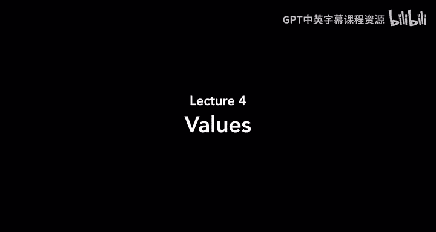
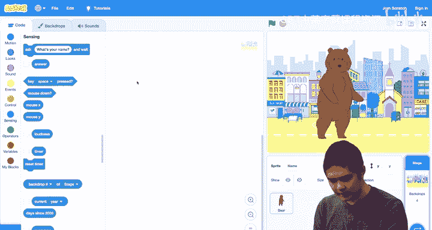

# 哈佛大学《CS50 Scratch 编程｜CS50’s Introduction to Programming with Scratch 2024》中英字幕 - P4：Values - Lecture 4 - CS50s Introduction to Programming with Scratch.zh_en - GPT中英字幕课程资源 - BV1nx4y1s77C

Welcome back， everyone， to an introduction to programming with Sctch。

 And last time we took a look at events， things that can happen like us pressing the green flag or clicking a button or pressing a key on the keyboard and letting our scratch project respond to those events。

 And how do they respond Well they respond with functions。

 those blocks that we stacked on top of each other to let our sprites through the stage respond in some way。

 And so let's take a closer look today at those functions。

 We've seen already that we can have the cat move， for example。

 just by using a block like this move 10 steps such that when I click on this block。😊。

The cat moves by 10 steps。And we discussed before that these functions。

 these blocks can accept input， input in the form of whatever goes in this oval here。

 which is 10 by default， but we were able to change that if we wanted the cat to move more steps or fewer steps。

 we were able to change the number here to control how many steps the cat was ultimately going to move that again was called an input and the actual information that goes inside of that input。

 we might call a value， a value is just some piece of information in this case it could be something like a number。

 like the number of steps to move like the number 10， but a value could also be words， for example。

 you might recall that we were able to make our sprite speak up if we go into the look section and choose a block like say hello for two seconds here。

 the word hello is a value as well， values are just pieces of information that our program might be able to use。

😡，And it turns out， in addition to us just being able to type values into these oval shaped spaces inside of our scratch functions。

 there are some blocks in scratch that are themselves values。 And today。

 we're going to be exploring those。 So if you notice here in the motion section of blocks。

 Most of these blocks they are all a very similar shape。 Some might be longer or shorter。

 but they're all kind of rectangular and they have these indentations so that they can stack on top of each other visually。

 But you'll notice that down here at the bottom of the motion section。

 we have a few blocks that are a different shape。 This one's called exposition。

 This one's called Y position。 This one's called direction。 They're not rectangular。

 They don't stack on top of each other。 And in fact。

 we wouldn't be able to just drag this underneath the existing blocks and expect them to snap together。

 Sct is a little bit smart， and it's only going to allow blocks to connect to each other。

 If it makes logical sense for those blocks to connect to each other。 Instead。

 these three blocks are oval shaped。😊，They're not functions anymore。 They're values。

 They're pieces of information that represent something about the scratch project that we're currently running。

 This block is a value that represents what is the ex position of the current sprite。

 how far to the left or to the right is that sprite。 This block represents the Y position。

 How far up or down that sprite happens to be。 And this block represents the direction。

 What direction that sprite happens to be facing。 And because they're oval shaped。

 we can't just add them above or below the script， But we can put them inside of these oval shaped inputs。

 Notice the inputs to all of the functions or oval shaped。 And therefore。

 because these values are also oval shaped， they can snap together that way instead。

 We're going to be putting a block inside of the input to another block。😊。

So let's see what that looks like。I'll go ahead and get rid of the moveve 10 steps。

 we'll just keep the say hello。But instead of saying hello for two seconds。

 let's have the sprite say it's x position for two seconds。

 meaning how far to the left or to the right is the cat right now。😡。

And I'll have this happen when the flag is clicked。 So I add an event when the flag is clicked。

 go ahead and say your exposition for two seconds。 And now when I click the flag to start the program。

 let's see what happens。The cat says 10。It's saying its current exposition。

 which we can see down here。 its exposition is 10。 And if we drag the cat far to the right。

 for example， now click the green flag and you'll see it's going to say a bigger number 175。

 And if we drag the cat far to the left， now it's going to say a smaller number， negative161。

And if we want， we could have it say both its x position and its y position。

 I'll add another say block。😡，And instead of saying the exposition， let's go back into motion。

And let's choose why position。Now it's going to say it's x value for two seconds。

 and then it's y value for two seconds。I'll click the green flag。It says negative 161。😡，Negative 13。

And so these values， these oval shaped x position and y position blocks， they're no longer functions。

 These are just values that we can put in any spot inside of our functions where they have an oval shaped input where we could add something into that oval to describe how what we want the cat in this case to say。

😡，And right now it's saying the exposition for two seconds and then it's y value for two seconds which is fine。

 but maybe I'd like the cat to say them together to say like here's where I am right now。

 and to do that I need some way of combining these values。

 I need to combine the X location and the y location of this cat。

 and here's where we're going to introduce another new concept within scratch and within programming more generally。

 and those are operators。😊，An operator is going to accept values as its own input。

 and the operator is going to produce a new value for us。 And so one operator， for example。

 this very first one is plus， it will take two values。 Maybe like one and2。 And we add them together。

 and it's going to give us three。 So what would that look like。

 I'll disconnect these for now just so we can try something a little different。I go into looks。

 have it say something for two seconds。But instead of saying hello for two seconds。

 let's have it say。😡，One plus two for two seconds。Now I press the green flag to start the program and the cat says three。

 this operator， this green block here， is performing the task of addition， it accepts two inputs。

 two values of its own as inputs， the one and the two and then this entire oval block is going to calculate what is one plus2。

 it's going to be3， and because that's inside of this say block now the cat is going to say the number three for two seconds。

😡，And so we have blocks to perform math like addition， subtraction， multiplication and division。

 We have other blocks as well。 and the one I'm interested in right now is this one down here called join right now。

 it saysJoin， Apple and Ban you could use this for any characters we might want to join together and what it's going to do is it's going to take two different values and it's just going to combine them together into one。

And so I would like to combine together the X location of the cat。

 in addition to the y location of the cat， and so let's use the join operator to do just that。

I'll get rid of this block that was just doing some math。And instead take this join block。

 and I want to join together the X position。😡，And the Y position notice that these ovals snap into place because the two inputs in the join block are also oval shaped。

😡，Now， I don't need two say。 I only need one， and let's take this join block and put it inside of the say block and notice the say block 2 will grow in order to make room for the block that's inside of it now。

 And now I have a block inside of a block inside of another block。

 The say block has this join block in it。 and inside the join block or the X and y values as well。😡。

And so now when I press the green flag， notice what happens。It says negative 1，61， negative 13。

 and it was all kind of mashed together。 And I might not even know exactly where that coordinate is。

 So if I wanted2， I could change the backdrop。 Let's give myself a。Grid。

 I think there's a grid backdrop if I do a search for grid。 Yeah， here's an X Y grid。

 So I can see on an X Y grid kind of where the cat is on this plane。I'll press it again。

- 161 minus-13， that's fine， but maybe if you've used math before you're more used to like x comma y。

 you see one value， comma another value instead of them just being right next to each other without even a space in between them。

😡，So how could we do that， How could we add a comma just to separate the x value from the y value a little bit more。

Well， I can use another join。This is going to look a little bit complicated。

 but here's what I'm going to do。😡，Instead of joining together the x position and the Y position。😡。

Let me first take a comma and a space。😡，And join that with the Y position。 and then put that join。

Inside of the input to the other join。 So this is starting to get a little bit more complicated。

 But let's try and break down exactly what's happening here。

 I've got a lot of blocks nested inside of other blocks。 But here I'm saying something。

 What am I saying， Well， I'm joining together these two things。 I'm joining the X value of the cat。

 and this block here。😊，And what is this block， Well。

 that block is joining together a comma and the y value of wherever the cat happens to be。

 So taken all together， what does this big oval now do， Well。

 it's going to take the X position and then take a comma。 And then the y position。

 And that all together is going to be what goes inside of the say block。😊。

we're starting to nest a lot of blocks inside of each other。

 But the net result is that if I take the cat and move it to。Near the middle of the stage。

 for example， press the green flag。 It's going to say4 comma 3。

 That's where in the world it happens to be。 If I move its location somewhere else and press the flag again。

 it's going to give me some different numbers。 But now it's saying at all at once。

 one value comma another value。 And if I wanted to make this a complete sentence。

 I can even add one more join。 let me say I am at。And then take this whole big join block that says its's position and put that on the other side of the join and now have the cat say all of this。

 I am at X comma Y。 and so now if I drag it down here， it says I am at negative 30。

 comma negative 96。😡，If I drag it here， the cat says， I am at 49， comma 61。

And so using these values and operators， we can start to combine values together and start to make some more interesting projects as well。

😊，And we did this just now with the x position and the y position。

 but there's also this direction block that we could do this with two。

If we wanted the cat to not only say where it is， but also what direction it' facing。

 you could imagine using that direction blocks so the cats that could say I am pointing at 90 degree angle or I am pointing at a 45 degree angle or for example。

 and we could have it use that value inside of its blocks as well。

So let's try something a little different now we've taken a look at these motion values let's look at what other values we might have。

 I'll keep scrolling down inside of Scratch's interface and under the look section we have a whole bunch of other functions that we've used before。

 we've used the save block， we've used the switch costume and switch backdrop blocks。

 we've used changed size notice down below though。😡。

We also have a couple of blocks that are not the shape of the normal functions。

 They're instead oval shaped， meaning they are values。 We have one for the costume number。

 We have one for the backdrop number， and we have one just called size。

 and size in this case is going to represent how big or small。 Our sprite is。

 Remember that our sprites start out at 100% size， but we have already seen how we can make them smaller or we can make them bigger。

So when might we want to use something like the size block to know how big or small a particular sprite is。

 Well， let's take an example。 Let's imagine we're not using the cat anymore。

 I'll go ahead and delete the cat。And I'll change the backdrop back to our plain white backdrop。

Let's pick out a new sprite。Going to animals and let's grab the hedgehog。

And if I wanted the hedgehog to move， I wanted the hedgehog to move every time I pressed the right arrow。

 for example， we saw last time how we could do that。

 I had an event saying not when the space key is pressed， but when the right arrow is pressed。

 now I want the hedgehog to move 10 steps。😡，If if I drag it over to the left。

 I press the right arrow。And it's moving。And that seems like a reasonable pace for a hedgehog of about that size。

 but if I made the hedgehog much smaller。It try 50% and now have it move。

Notice that is' moving because it's smaller。 It's still moving 10 steps every time。

 It's moving maybe a little bit fast for how big it is。

 I might like to change this so that my programs a little bit more responsive to how big or small a sprite happens to be。

 if a sprite is bigger， then it's probably taking bigger steps， I want it to move more every time。

 And if a sprite is smaller。 Well， then it's probably taking smaller steps。

 So I want it to move less every time。And so instead of moving 10 steps。

 I'll change the size back to 100。But instead of moving 10 steps， let's have it move。Size steps。

 size is a value representing how big or small the hedgehog is。

 and I'll drag it inside this oval shape input。 it snaps right into place because it is ovalsd and now instead of moving 10 steps every time it's going to move a number of steps dependent upon the size of the hedgehog。

😡，And so because this hedgehog is 100% size now when I press the right arrow。😡。

It's moving 100 steps every time。 And that's probably too fast。

 I want to cut down on this a little bit。 And here is where we can start to do。

 maybe a little bit of math。Let's go into operators and let's use division division I can use to cut down on the size of something。

 make the number smaller。 Let's do size divided by 10。

 You could play around with this and decide what you want it to be。

 And so now what's going to happen， let's try and analyze the math of this a little bit。

 If the size of the hedgehog is 100。 meaningan it's full size to begin with。

 Then every time I press the right arrow key。 we're going to move size divided by 10 steps。

 The size is 100。100 divided by 10 is just 10。 And so the hedgehog is going to move 10 steps。

What if the hedgehog were smaller， What if the size was 50， Well。

 then the hedgehog is going to move 50 divided by 10 steps。

 meaning it's only going to move five steps， smaller steps for a smaller hedgehog。

 What if the hedgehog were bigger， What if it was size was 200， Well。

 then it's going to move 200 divided by 10 steps。 In other words， it's going to move 20 steps。

 Every time we hit the right arrow， It's moving more steps because it's a bigger animal。

And so now when I press the right arrow， it's moving 10 steps every time。

If I change the size of the hedgehog， make it a little bit smaller， size 15。

Now it's moving only five steps every time I press the right arrow。And if how make it bigger。

 make it size 200。Now it's going to be moving。20 steps every time I press the arrow as well。

And so we can start to use these values to get information about our sp。

 where it is in the world how big or small it is， and use that to affect the way that our program behaves by using not just values that we type in。

 but by using values that are given to us as part of scratch to make it work too。😡。

And so I'll go ahead and change the size back to 100。

 I'll go ahead and center the hedgehog again so it's back in the middle。

And let's try something else fun in these operators。

 One thing I'm noticing in these operators is that we can do math。

 We've seen like addition and division， and there's also subtraction and multiplication。

 We've seen how we can join two words together with this like join Apple and banana block。

 There's another block that looks interesting。 Pick random one to 1。😊。

Pick randomand1 to 10 is a type of block that's going to let us add a little bit of randomness into our project right now most of our projects are just doing the same thing every time unless we use like the random position movement which we used a couple of times。

 but pick random we'll just pick a random number for us so that we can let this project do something different each time we run the project。

😡，And so just for fun， I might say when the flag is clicked。

 let's go ahead and go to motion and have the hedgehog point in a particular direction。

 and instead of always pointing in direction 90， let's have the hedgehog pick a random number between 0 and 90。

And we've put that value inside of this point and direction block。

 And so now every time I press the green flag， what's going to happen。

 we're going to pick a random number between 0 and 90。

 and the hedgehog is then going to point in that direction。So I can try it。

 I'll press the green flag and the hedgehog tilted slightly。 I'll press it again。

 Now it's facing a totally different direction。 I'll press it again。

 Now it's facing a different direction。 And every time I press the flag。

 it's going to calculate a random number between 0 and 90。

 and the hedgehog is then going to point in that direction。

And so randomness can add a little bit of fun to your projects as well。

 so that there's something surprising every time you run the project where it's not always going to be the same thing every single time。

😡，Alright， so we've seen some values that we can use inside of motion and inside of looks。

 and we've seen some operators we can use to do some math to join things together。

 to pick some random numbers。 And if we keep looking around for other values。

 I'll go ahead and scroll and I'm looking for anything that might be shaped like an oval potentially that I might want to use one thing that catches my attention is this value here。

😊，It's called timer。 And you might recall from last time that we have used the timer already。

 Every scratch project has a built- in timer that's counting how many seconds have passed since we started running the project。

And we used that before to control the timing of our different sprites that existed in this project as well。

 but we can also use this if we just want to know how long it's been since we started the project。

 I'll go ahead and get rid of these blocks here。Let's use the timer value for something。

 Let's say let's go to events When the sprite is clicked。 When I click on the hedgehog。

 let's go ahead and have the hedgehog say。Whatever the value of the timer is。

I'll go ahead and change the hedgehogs direction back to 90， so it's still facing the right again。

And now I'll press the green flag to start the project， the project' now started。

 and now when I click on the hedgehog， it says it's been 4。45 seconds since we started the project。😡。

And I'll press it again。 It's been 9。90 seconds since we started the project and honestly now I don't really need to know that number in all that much detail。

 I don't care if it's 9。90 versus 9。91， for example。

 I just want to know has it been 9 seconds or 10 seconds or 11 seconds for example。

 and so what I could do in this case is go back to operators and there's an operator here called round and round if you're familiar with it for math。

 just takes a number and rounds it to a whole number。 So if I have 9。

9 it's just going to say you know what， let's call that 10 it rounds up to 10 seconds。

So we'll take the timer， put it inside of the round operator。

 and we'll take the round operator and put it inside of the say block。

 Now we're saying the rounded version of the timer for two seconds。

 Now I click on it and it's been 58 seconds now， not 58。 something for example。

 I wait a few more seconds now it's been 53 seconds since the start of the project。😡。

And so these values give you a lot of ability to know something about what's going on inside of the project。

 and Sctch just figures out what each of these values should be， it knows。

 what the X position and y position and size is for any given sprite。

 it knows how long it's been since we started running the project so it knows what the value of the timer should be。

😡，But there are some other values that the user can have a little bit more control over as well。

 And that's where our projects can get even more interactive and even more interesting。😊。

Let's take a look now。 I'll go ahead and get rid of the hedgehog， and we'll bring back the cat。

Let's take a look now at the sensing section of blocks， which we haven't really looked at just yet。

 but notice this block here。Ask what's your name and weight？😡，This is an interesting block。

 It is a function。 It's shaped like all of those other function blocks。

 and it seems to be asking the user a question。 It's asking something like what's your name And what's your name here。

 This， if you'll recall， is the input to the function。

 Anything in this oval shape and a function block。 That's an input to the function。

 It's telling this function， what question should you ask by default。

 The question is what's your name， But the question might be different。

 We could ask whatever question we want。😡，But the user is going to type in an answer。

 and that answer is going to then be the output of this function。

 And we haven't really seen outputs too much just yet。

 These outputs also called return values are values that come back after we run a function。

 And it turns out this ask， what's your name and weight block， has a return value。

 And the return value is this value here， which is called answer。

This block here answer is going to be a value that stores whatever it is the user typed in in response to that question。

😡，So we can ask the user a question。 and based on what the user answers。

 we can use that answer later on in our program somewhere。😡，So let's give that a try。

 let's try that out and see what we can do。I want to say that when the green flag is clicked。

 when I first start this project。Let's go to。Sensing and choose the ask what's your name and weight block？

And when you do that。Let's go ahead and just say it back to them。 I'll go to say。

 say hello for two seconds。 I don't want you to say hello for two seconds， though。

 I want you to say the answer for two seconds。 Whatever it is the user typed in when they were asked that question。

 that's going to be this return value called answer。

 And we're now using answer later in the project to say the answer for two seconds。

 So now when I run this program。The cat asks the question， what's your name？

And we haven't moved on in the program yet。 The program is waiting。

 and it's waiting for me to answer the question。 It's waiting for me to type in my name。

 I'll type in Brian。 I'll press return。And the cat now says my name back to me。And if I wanted to。

 I could make it a little bit more friendly。 I can go into operators and let's use that join again。

 instead of saying answer， let's have it say hello， comma。And then the answer。

So I'm using that join operator to combine two values together。

 and I'm using that inside of the save block now when I press the green flag， what's your name？😡。

I say， Brian。And the cat says hello， Brian， for example。

And so we can ask the user questions and use their answer inside of the program。

 And that opens up a lot of interesting doors for what it is that we can do with our scratch project。

 Remember before we've been using move to move a certain number of steps。

 and we could say move 10 steps or move 20 steps， for example。

Let's ask the user how far we want to move。 Let's ask。How many steps？

And then instead of moving 10 steps， we'll go into sensing， we'll grab the answer， that return value。

 and let's move answer steps。 whatever the user typed in， that's how many steps I want to move。

 So I'll drag the cat back to the left hand side。 We'll press the flag。 how many steps。

Or if I type in 10？We move 10 steps。Let's try it again。 How many steps I'll type in 50。

 something bigger。Now we move 50 steps， press it again， how many steps let's try 200。

And the cat moves 200 steps。 When I type in that number。 So whatever number I type in。

 that's the return value of the function， that becomes the answer。

 And because I'm using the answer inside of this move some number of steps block。

 that's going to result in me， the user being able to control， as by typing it into my keyboard。

 how far I actually want the cat to move。 And I can use this for other blocks， too， right。

 we've seen before。😊，That we have the ability to set the X value to something。

 to make it go somewhere。 And we've also seen that we can set the y value to something to have it go somewhere else。

 So I can ask， pick X。And then let's set x to that answer。Then ask。Pick why。

And set y to the new answer。So now I press the green flag pick X。 Let's pick。50。Pick Y。

 let's pick negative 100。And the cat goes to 50 and negative 100。

 if I wanted to go back to the center， pick X， I'll pick 0， pick Y， I'll pick0。

 and the cat goes back to the center。And so you can ask multiple questions， too。

 each time answer is just whatever the answer was to the most recent question。

And using the answers to those questions， we can start to do some interesting things。

 We can have the cat move around to various different places。

 And we can even use this in other blocks that control our project as well。

 Let's get rid of the cat for now and bring back another animal we've used before。

 We'll bring back the bear。😊，And the bear has a few costumes。 You might remember。

 If we go into costumes for the bear， we see that there's this one costume called bear A where the bears looks like this。

 And there's another costume called bear B， where the bear。Looks like that。

I'm going to go ahead and rename these costumes， it turns out you can name costumes whatever you want to call them。

 but I'm going to call this costume4， just the number four， because the bear is on four legs。😡。

And I'll give this costume name too， I'll give it the name2。😡，Because the bear is on two legs。Now。

 why am I doing this？ Well， it's because of what I'm about to show you。

 which is let's add an event when the flag is clicked。I want to ask a question。

And the question I'm going to ask is。😡，How many legs。

And now what I'll do is I'll go into looks and I'll say switch costume2 and notice that switch costume2 also has an oval shaped input next to it。

 This oval shaped input is a dropdown where I could choose which costume I want the bear to use。

 but because it's oval shaped， I can just put my own value inside of that oval if I want to。😡。

And let instead of using the drop down， let's just have it go to the answer。

And so now I press the green flagger。 The bear asks， how many legs。Let's say four legs for the bear。

And now the bear is on four legs。 If I want the bear to stand up， I'll press the green flag again。

 It says how many legs I press 2。And the bear stands up。And again。

 the reason that's happening is because when it asks how many legs。

 I type in something like two as my answer。 And so this block runs。

 we're going to switch costume2 in this case，2。 and because I named my costumes after those answers。

 If you remember that if I go back to the costumes tab， I had given those costumes particular names。

 I called one of the costumes for for the four leg version。

 and one of the costumes2 for the two leg version。 well。

 then I can use those blocks to control how many legs the bear is ultimately going to be standing on。

 and that works for costumes and it works for other parts of scratches interface like backdrops。

 for example， so we could try that out too I'll go ahead and get rid of well we keep the bear for now。

 but I'll get rid of the question。Let's add some backdrops's add。Colorful city。

 I like to look at that。 The colorful city during the day。 And let's add one more backdrop。

 Let's add。😊，The Knight city。SoWe have a couple different backdrops。

 and I'm going to change their names。😡，This colorful city， I'm going to call it day。And again。

 just up at the top here， I can change the name of this backdrop。And for the night city。

I'm going to call it night。So I have one。Backrop called day and one backdrop that I've called night。

And let's go back into the code。

And now for the bear。😡，When the flag is clicked， I want the bear to ask a question。😡，What time。

 like what time of day is it？And let's go ahead and switch the backdrop to。Whatever the answer is。

So the bear is going to ask me what time of day do I want if I say day， that's one possible answer。

 If I say night， that's another possible answer。 So we'll try it。 I'll press the flag。

 What time I'll say night。I'll press return。And now it's nine time。

I'll try it again what time of day， I'll say day。And now it's daytime。

And so using this ability now to have return values。

 we can create much more interactive and much more exciting programs by letting the user tell us something and using that answer in the project。

 letting them type in their name and responding to them by name or letting them type in what backdrop or costume they want or letting them type in how they want to control how sprite moves or where it's pointing or in what direction it's going。

 for example。 And so you give the user a lot more control over what's happening just by taking advantage of these values。

 That's it。 for an introduction to programming with scratch for today。 Next time。

 we'll continue this discussion。 And to take a look at some other features that we get in this world of programming with scratch。

😊。