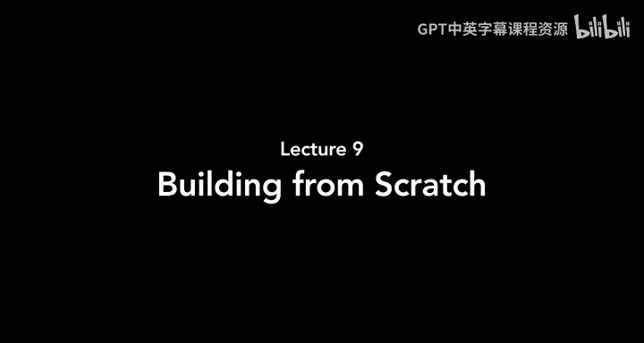
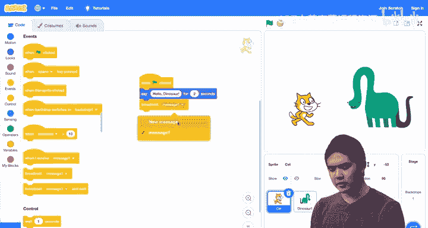
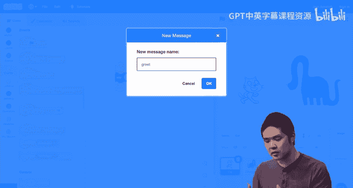
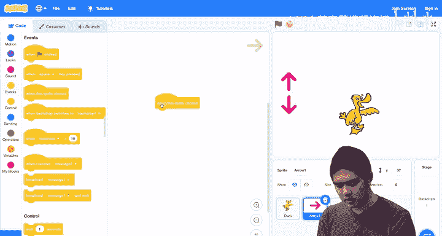
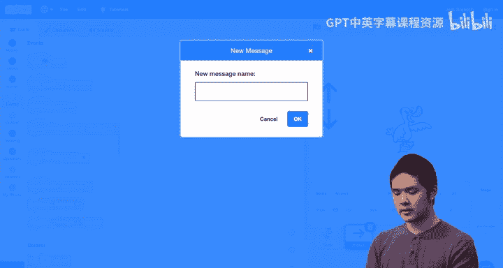
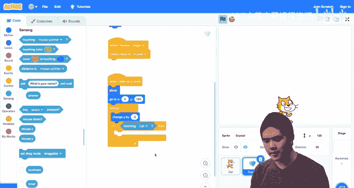
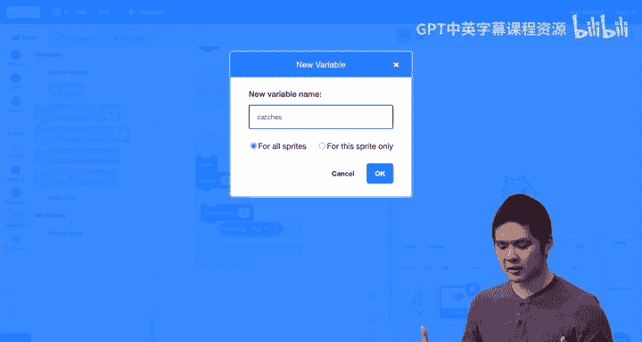
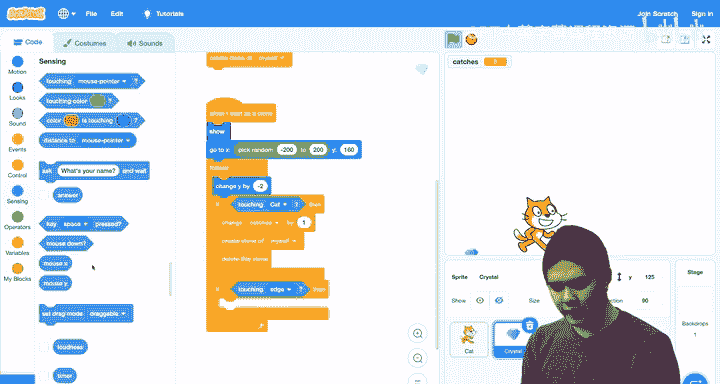
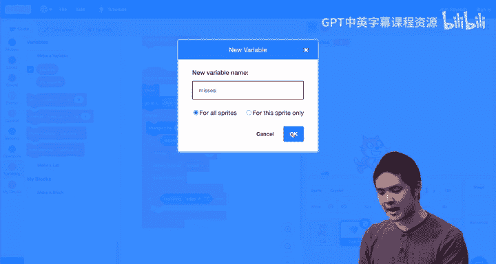
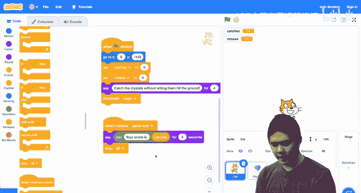

# 哈佛大学《CS50 Scratch 编程｜CS50’s Introduction to Programming with Scratch 2024》中英字幕 - P9：Building from Scratch - Lecture 9 - CS50s Introduction to Programming with Scrat - GPT中英字幕课程资源 - BV1nx4y1s77C

Welcome back everyone to now our final class in this introduction to programming with Scratch。

 And at this point， we've seen most of the major features that Scratch has to offer。

 So today in this final class， what we thought we'd do is show you a few additional features that you might find useful as you go about building your own projects and then show you how you could put the pieces together so to speak and use all of the tools and the ideas that we've explored during this course to see how you could put them together to create a complete game using scratch So let's go ahead and begin by taking a look at a couple final features of scratch to introduce and the first involves how it is that sprites communicate with each other。

 you might recall that in an earlier project， we had a cat talking to a dinosaur， for example。

 and how we did that with something like this。 I had a cat and then I added the dinosaur。

 which I'll go ahead and find and bring back I wanted the cat and the dinosaur to be facing each other so I took the dinosaur I said it's rotation to left right。

 and then set its direction to negative 90 So it was facing。😊，The other way。

 And if I wanted the cat and the dinosaur to greet each other， then I would have the cat。😡。

When the flag is clicked。Do something like， say。Hello to the dinosaur。And then likewise。

 for the dinosaur， if I want the dinosaur to respond to the cat saying hello， well。

 the cat is saying hello dinosaur for two seconds。 so the dinosaur better wait two seconds before it responds。

 So the dinosaur， I did something like this， I said， when the flag is clicked。

 let's go under control， let's wait。Two seconds。And then。Say。Hello to the cat。

So now when I run the project， the cat says hellello dinosaur。

 and immediately after the dinosaur says a hello cat。What if I later wanted to make a change。

 I want the cat to only say hello dinosaur for maybe one second， for example。 Well。

 now the cat speaks。And I have this weird pause before the dinosaur responds。

 because I forgot to change how long the dinosaur was waiting。

 I'd also have to change that from two to one in order to get it to respond appropriately。

 Ultimately， this is going to start to get more complex。

 especially as there are more interactions between these two sprites or if later I add other sprites altogether for me to have to calculate exactly how long every sprite should be waiting in between one thing happening and another thing happening。

 What would be better is if the cat when it was done speaking， could somehow signal to the dinosaur。

 that it's now the dinosaurs turn to start speaking that way， I。

 the programmer don't have to do all this math of figuring out exactly how long these sprites should be waiting。

And so this brings us to one of our final topics in scratch， which is called broadcasting。

 Broadcasting is the ability for one object in scratch， one sprite， for example。

 to send some message that other sprites like the dinosaur in this case， could receive。

 So we have the ability to send or broadcast messages And then we have the ability for other sprites to receive those messages when they receive a message those sprites are going to respond in some way。

 So what would that look like， How could we broadcast a message from the cat to the dinosaur so that the dinosaur knows that it's time to greet the cat。

Let's go back to the cat。And after the cat says hellello dinosaur for let's go back to two seconds。

Then。Under events， I'm going to use this broadcast block to broadcast a message。😡。

And I'm going to choose a new message from the dropdown。 And I can just name this message。

 This is any message that I'm now going to send。 And I'm going to call the message greet just because it's going to be a message that signals to the dinosaur that it's time to greet the cat。

So the cat says hello dinosaur， and then broadcasts greet。😡，And the dinosaur now， instead of saying。

 hello cat， when the flag is clicked， I'm going to get rid of the when flag is clicked event entirely。

😡，And replace it with this event here。😡，When I receive， greet。😡。

So the cat is first going to say hello， dinosaur for two seconds。 and then broadcast this message。

 The message is greet。And then the dinosaur， when it receives the greet message。

 is then going to say hello to the cat。😡，And so now。The cat says hello dinosaur。 And immediately。

 the dinosaur responds。 A hello cat。 The cat broadcasted a message， and the dinosaur received it。

 And now it doesn't matter if there's a delay。 I could add。A delay of a second to the cat。

 and so the cat will now wait a second before speaking。😡，But the dinosaur still responds right on cu。

 I didn't have to change any of the timing because the cat broadcasted a message Once the cat was done doing whatever it was doing。

 and the dinosaur was then able to respond。So this works great for stories where you have multiple sprites and they're interacting in some way and you want some sprite to signal to someone else when it's their turn to say something or do something。

 for example， it can also be used in other ways to let one sprite control or influence the behavior of another sprite。

 Let's imagine that I had a duck add a new animal。 And let's go back to。😊，The duck here。

And let's say I wanted the duck to move up and down and we could use the arrow keys。

 I could use the up and down arrow keys to control it。

 but I'd like for the user just to be able to click on up and down arrows on the screen some user interface that they could use as visual on the screen that lets them control if the duck's going to move up or move down。

 So let's add that interface。 Here's an arrow。😡，And right now the arrow is facing the right。

 but if I want it to go up then I'm going to rotate it instead of 90 degrees。

 let's set it to zero degrees， that's going to be an arrow that's facing up。

And if I want a button that lets the duct go down。😡，Let's add an arrow。

And this time set it to 180 degrees。 and now the arrow is facing down。😡，So now I have two  errorss。

But clicking these arrows doesn't achieve anything。

 They just do nothing right now because I haven't added any code to them。But I could。

Let me add an event to the up arrow。😡，That says when this sprite is clicked。

 when I click on the up arrow。😡。

Well， then let's broadcast a message and the message is going to be up。

 That's the direction you should move。

Now let's choose the down arrow。😡，This time。When the Srite is clicked。

 let's broadcast a message not up。 but this time， a new message。And the message is going to be down。

😡，So now the up arrow is broadcasting a message that says up。

 the down arrow is broadcasting a message that says down。

 and now I'll have the duck respond to those broadcasts when the duck。😡，Receives the up message。Well。

 then let's have the duck。Change its y value by 10， going upward in direction。

And likewise under events， when the duck receives the down broadcast message。😡，Then。

We're going to change the y value by negative 10。And now these arrows， these sprites on the screen。

 are controlling the behavior of the duck if I click the up arrow。😡，The duck moves up。

And if I click the down arrow， the duck moves down and they're doing that because of broadcasting。

 When I click on the arrows， those arrows are themselves sprites that are saying。

 move up or move down。 They're broadcasting some message。 And the duck， in turn。

 is then responding to those messages。And it doesn't just have to be sprites that are broadcasting messages。

 the stage， the background can broadcast messages too。 I'll show you an example of that。

 I'll delete all of these sprites for now。 It's add a backdrop and let's go back to our underwater backdrop。

😡，And let's bring our fish back。So I'll add a new sprite。And add back。The fish。

And now what I would like to do is in the backdrop， I'll click on the backdrop， add some code here。😡。

I'll say， whenever the stage is clicked， when stage clicked。😡，Let's now broadcast a message。😡。

And the message is going to be。😡，Visit。I would like the the fish to visit wherever I click on the stage。

And now for the fish， whenever it receives the visit message， let's have the fish。

Point towards the mass pointer。And then take one second to glide to the mouse pointer。😡。

So now I press the flag at first， nothing happens。 but if I choose a location and then click。

The fish goes there。 I choose the location and click， and the fish visits。Wherever I happen to click。

 I click over here， the fish goes there。 and every time when I click。

 the backdrop is broadcasting a message， the stage is broadcasting this visit message and the fish is now receiving that visit message and doing something in response。

 pointing towards the mouse pointer and gliding there。

 So broadcasting allows multiple different parts of our scratch project to communicate with each other to decide when something should happen。

😊，And that's one very powerful， very useful feature within scratch。

 another feature that can be useful。 And for this。😊，Get rid of the backdrop。

 I'll go back to the default white backdrop is the ability to clone a sprite that if I have one copy of a sprite oftentimes in a game or in some sort of other animation。

 I might not just one copy of a sprite on the stage。

 but I might want multiple copies of that sprite on the stage as well。So let's add a sprite。

 let me search for the star and grab the star。And maybe what I'd like for what to happen is to not just have one star。

 but to have multiple stars inside of my project。 So let's add some code here。😡，I'll say。

When this spreadrite is clicked， when I click on the star。😡，I am going to， and this is under control。

😡，Create a clone of myself。😡，When the star is clicked， we're going to create a clone of the star。

 and that new clone is going to be another star that can behave on its own。😡。

Now I'll add this new event when I start as a clone， what should this clone star do。

 Well let's have the clone star just glide one second to a random position。😡。

So I have this star and watch what happens every time I click on the star。😡。

The star creates a new clone。😡，Every time I click a new clone is created。

 And when the new star starts as a clone， it's going to glide to a random position every time。😊。

I clone a star。 You'll see we create a duplicate of it and it ends up going to a random position。

 So if I want multiple of a particular sprite that appear on the stage。

 Clning is a great way to do that。 We can create multiple copies of a sprite and then decide how it is that those clones should ultimately behave。

😊，So now I'll go ahead and get rid of all those clones just by deleting the sprite。

And clearing the screen。Now we've seen a lot of features that Scratch has to offer。

 we've seen functions and we've seen events， we've seen variables。

 loops and conditions and now the ability to broadcast messages and clone sprites。

 let's take all of those ideas now and put them together inside of a fully complete game to show you how you could go about building a more complex project within Sctch。

And what characters should I use in the game， Let's start and just start building this game one piece at a time。

Well， let's start by using the cat。😡，Sort of the classic default sprite character。And。

Let's have the cat have some objective。 What is the cat trying to do， Well。

 I can just scroll through these sprites and look for what seems interesting。 Here are the crystals。

Let's have the cat try to catch as many crystals as it can。😡。

And what are the crystals going to do while just thinking about what I want the game to do。

 I could decide how I would like the game to work， and maybe the crystals are going to fall from the sky and the cat has to try to catch the crystals before they hit the ground。

 So that's ultimately what I would like to happen。 The cat's going to try and catch crystals before they hit the ground。

 I have a cat， I have a crystal。 but now I need to add code to figure out how to make that work。😡。

Well， what do I need， Well， first， I need some way for the cat to move around。

 and I'll have the cat move around with the arrow keys。 So let's add。In event。

When the left arrow is clicked。We are going to change x by negative 10。

And I'll duplicate this as well。😡，And I'll say that when the right arrow is clicked。

 let's change x by 10。😡，So now I have the ability to move the cap。 It can move around to the left。

 and it can move around to the right。And that's what I want。 As the crystals are falling。

 the cat's going to move left and right to try and catch the crystal。

 I don't need the cat to move up and down because really。

 the cat's only going to exist along this bottom portion of the stage here。

And now when the game starts， what should happen。 Well。

 the games going to start when the flag is clicked and when the flag is clicked。

 I'd like for the cat to go back to the middle of the stage just as a starting point。

 So I'll have the cat first go to like0 for x。 and we'll go like negative 125 for y。

 So this now is the starting point for the cat at 0 for x negative 125 for y。

 and from there I can use the arrow keys to move back and forth。And because it's a game。

 it's probably helpful for me to tell the user how to play the game。

Let's add a message for the cat to say。 And the cat's going to say something like。

 catch the crystals。Without letting them。Hit the ground。

Those of the instructions catch the crystals without letting them hit the ground and I'll have the cat say that for。

 let's say four seconds to give the user enough time to see that message and then respond to it。So。

We're going to start。 The cat speaks， catch the crystals without letting them hit the ground up。

 And now we have the ability to move around。That's a pretty good start。

Now let's see if we can do something with this crystal。

 Now one thing you might have noticed is that when I started the game。

 the crystal's already just hanging around here， maybe I'd like to not show the crystal until the cat's done giving the instructions。

 I want the cat to give the instructions and then the crystal can show itself and we can start playing the game。

😡，How would I do that， Well I would say for the crystal？When the flag is clicked。

 when this program starts running。😡，Let's go into looks。And let's hide。So initially。

 when I start the program， all that we see is the cap。 The cat gives the instructions。

 and now that the instructions are over， I would like the cat to somehow signal to the crystal。

 Alright， it's okay for you to create a crystal to now start falling from the sky。😊。

And maybe eventually in my game， I'm gonna have multiple crystals moving around but we'll start with just one。

 And what is this going to look like， How does the cat signal to the crystal that we're done giving instructions。

 It's time for the crystal to now appear Well we can use broadcasting。

 remember that broadcasting allows one sprite to send a message to another sprite to indicate that it's now their turn to do something or say something or appear on the stage。

😡，So I'll go to events and we'll broadcast a message。And the message will be。A new message。

 just called begin。Begin is going to mean all right。

 now is the time to actually begin the game we're done giving the instructions and now the crystal needs to respond to that begin message。

😡，So when I receive begin。😡，Now the crystal can decide what to do。

 but as I'm thinking ahead to the way that I want to organize the code in this game。

 I'm realizing that I might not just want one crystal。

 I might not just have one crystal that's falling， but I'm probably going to have multiple crystals falling once one crystal falls I want another crystal to appear and maybe there' are going eventually going to be multiple crystals at the same time。

 and so thinking ahead， when I receive begin。😡，Let's go ahead and create a clone。😡，Of the crystal。

 Just create a brand new crystal。 And every time I create a clone of a crystal。

 I'll get a new crystal that's going to start falling from the sky。😊。

And so what should happen when the crystal starts as a clone， let's start now by。Showing the crystal。

So how is this working at first， the crystal is going to hide itself。

 but once we receive the begin message from the cat。

 once the cat is done giving the instructions and the cat says begin。

 we're going to create a new clone of the crystal and when the crystal starts as a clone。

 the crystal will show itself So we see the instructions from the cat。😡。

And then after the instructions are over， we now see the crystal here。

We'd like for that crystal to go somewhere。 So let's have the crystal go to。

We'll have it centered for now， we'll have it centered at0 and y should be pretty big。

 I'll make it 160 just to make it a little taller。 And so now the cat gives the instructions and after the instructions are over the crystal appears right at the top up high at the top of the screen。

 but now I'd like the crystal to start falling It's up in the sky now I needed to get it to move down。

😡，Well， I can move down。😡，Just by changing the y value， if I change the y value by a negative number。

 like negative1， or if I wanted a little faster， negative 2， for example。

 that's going to cause the crystal to move down。But no。

I don't just want the crystal to move down once， but I want the crystal to move down over and over again。

 to move down a little bit and then keep moving down again and again and again。

 So I'll put all of that under control。Inside of a forever loop。

So now here is what's happening When we start a new crystal， the crystal is going to show itself。

 It's going to go up to the top of the screen。 And then forever， it's just going to start falling。

So now we can see what happens。 The cat gives the instructions The crystal appears and the crystal now is falling。

And so this is often what the development process is like for the game。

 It's not that you're going to write all of the blocks and put together all the different sps for the entire game and then run it and see the finished product。

 you're going to build it a little bit at a time。 I need the cat to move。

 I need the cat to speak some instructions。 I need the crystal to appear。

 now I need the crystal to start falling And after each time you add just a few blocks to change the behavior a little bit。

 you can run the project， see what happens。 And if you need to tinker with some of the blocks to make it work if it didn't work the way you wanted it to work。

 And we're now just building this game slowly， one piece at a time。😡，So what do we have so far。

 We have a cat that can move around。 That works。 We have a crystal that appears from the sky and starts to fall。

 But right now， nothing yet happens once the cat catches the crystal。

 Once the crystal touches the cat。 So let's add that。 How can we do that。😊，Well。

 that sounds like a condition。 We're checking if the crystal is touching the cat。😡。

So let's add an if statement。Into the loop。And we'll say， if。We're touching。Not the mouse pointer。

 but the cat。If the crystal is touching the cat， well， then what should happen？😡，Well。

 I want to somehow keep score， I want to keep track of how many crystals has the cat caught。😡。

And so to do that， I need to store information somewhere inside of my scratch project。

 sounds like we need a variable， some variable that's going to keep track of this information for us。

😡。

So let's go to variable。 Let's make a new variable。 and I will call this variable catches。

 that's going to represent the score。 It's how many catches the cat has made。

 How many crystals the cat has caught。 You'll notice the catches right now is 0。😊。

And I would like to make sure that when the game first begins that we always reset the number of catches back to0。

 So inside the cat， you'll notice that when the flag is click， we're doing a lot of resetting。

 we're going to this original x equals 0 position to center the cat at the beginning。😡。

At the same time， let me set catches to zero at the beginning， because if I accumulate a score。

And I play the game again。 I want to reset the score。 I want the score to go back to0。

 and then I can start adding to the score。How do I add to the score？ Well。

 that's going to happen in the crystal sprite when it's touching the cat。 If we're touching the cat。

 we have now caught one additional crystal。 Let's change catches by one。And now what should happen？

Well， now， once the cat has caught a crystal， let's create a new crystal for the cat to try to catch。

To do that。I can go back to control。And I can create another clone every time I create a clone。

 let's go ahead and stop this for now。Every time I create a new clone that is going to create a new crystal。

 And whenever we start as a clone， that crystal is going to go to the top of the screen and it's going to start to fall。

 And after I create a clone， let's go ahead and delete the current clone。😊，So what's going on here。

 Why have I added these blocks into place。 Well， when we're touching the cat。

 that's one additional catch， we're updating the variable， changing catches by one。

 I'm creating a new clone， because once the cat has caught one crystal。

 I'd like for a new crystal to appear at the top of the screen。 But then finally。

 I'm deleting this clone。 Once the cat has caught the crystal。

 I'm just going to delete that crystal because I don't need it anymore。

 I have a new crystal that's going to be falling from the top of the screen instead。😊。

And so now let's try this program。😡，I'll press the flag。The cat gives some instructions。

 catches resets back to zero， and we see the crystal falling， and when the cat catches it。

 notice that catches goes up by one， the score is increased and a new crystal appears and you'll notice this keeps happening it's in a loop every time a crystal is caught our score goes up by one and the crystal creates a new crystal that appears at the top of the screen and then the crystal that the cat caught disappears and we no longer see it。

So we're just seeing this flow of crystals appear one at a time。

 We're seeing our variable update and increase by one every time the cat catches a crystal。

 And ultimately， this seems to now work pretty well。

 The problem that I see is that the game's a little bit too easy。 Like。

 I'm not even at the computer right now。 I'm not moving the cat at all。

 And the crystal is just appearing right on top of the cat and the cat is catching it every single time。

😊，So that's maybe not quite what I want。 What I'd like to do is introduce a bit of randomness into a game。

 And this is a common property of games randomness because you don't want the game to be exactly the same every time。

 you want some different choices to be made sometimes a little bit of unpredictability so that the user is going to have to respond to whatever they see And in this case。

 the unpredictability that I want is the X value of the crystal that right now the x value of the crystal is always0 it's always going to x equals0。

 and because of that， the crystal is always just immediately on top of the cat。

 What I'd like for what to happen is for the crystal to sometimes be on the left and sometimes be on the right。

 That way I have to move around rather than just keep increasing my score by doing nothing。😡。

So let's go ahead and do that， I will come over here and stop my project。😡。

And instead of going to x equals 0， every time the crystal starts， let's add some randomness。

 I'll go into operators。 Heres pick random。And far left， that's going to be a big negative number。

 So we'll go from negative 200 to the far right， that's going to be a big positive number。

 I'll make it positive 200， but you could play around with those values for whatever you'd like。😡。

And now， when I start the game。The score resets。And notice that the crystal。

Is going to appear this time it was kind of centered， but maybe it won't be that way every time。😡。

Now the crystal's off to the right， and I have to move to the right in order to catch it。😡。

And every time I catch the crystal， the crystal is going to generate a new random number between negative 200 and 200。

 And that's going to tell me where I need to go in order to catch the crystal。

 This is a much more interesting game than when the crystal was just always appearing in the same spot every time。

😊，So this is definitely an improvement。And now I'm curious what happens if I miss？😡。

If I miss the crystal altogether and just let the crystal fall。😡，All right。

 the crystal hits the bottom of the screen， and now the game is kind of stuck。😡。

What I'd like to do is add some code that can handle this situation。

 What happens if the crystal ever touches the edge of the screen and I didn't catch it。😡。

What should happen？Well， let's add another condition。

 I'll add a condition to the bottom here underneath the loop。 Not if we're touching the cat。

 but this time， if we're touching。The edge of the screen。

 If ever the crystal makes it all the way down to the bottom。

 and now it's touching the edge of the screen， what should we do。Well。

 we can decide we haven't really talked about what's going to happen in the game at this point。

 maybe the game's over right away and we're just done， or maybe you get a couple of chances。

 you' give like three misses and after three misses。

 then you lose the game and let's try and do that。😡，In order to make that happen。

 I need to keep track of how many misses there have been so far， so I'm going to go to variables。😡。

And create a new variable called misses。 How many times has the cat now missed。

The crystal。And just as in the beginning of the cat。

 we set catches to zero to reset the value of catches at the beginning of the game。😡。

Let's also now set misses to0。 When the game first begins， you haven't missed any yet。

 So let's reset it back to 0 that way any previous progress in the game is erased。But now。

 if ever we're touching the edge， let's go ahead and change the number of misses by one。

And at that point， we can do much the same thing as we were doing before。

We're going to create a new new crystal by creating a clone。 Let's go ahead and stop this for now。

 Otherwise we're going get a lot of clones。 but then。😊，Let's also delete this clone after that。

So when we're touching the edge， we're going to change the number of misses by one。

 We now have one additional miss。 We're going to create a new crystal。

 and then we're going to delete the clone to say we're done with this crystal。

 We've now created a new one。So now we'll see how the game behaves。😡，The crystals are falling。

 I can try to catch them。That's the one that I caught， I'll catch one more。

Now let me miss this one and see what happens。The crystal is going to hit the bottom of the screen and I missed it you'll notice my misses goes up by one。

 if I missed this one as well， misses goes up again and now I effectively have two variables。

 one keeping track of how many times I've caught the crystal and one keeping track of how many times I've missed the crystal and there seems to be no limit right now misses can just keep going up and up and up every time I missed the crystal What I'd like to do is do something once I miss three of them。

😡，Once I miss three， I want the game to be over。So let's add a condition to check for that。

I'm going to take the if condition， I'll build it out here for now and then I'll drag it in just to keep it separate for now。

But I'm going to say if the number of misses is equal to3， so equals as an operator。

 and I'm going to say if the number of misses is now equal to3。 Well， what should we do， Well。

 the game is now going to be over， so I'm going to eventually delete this clone because I no longer need the crystal once the game is over。

😡，But at this point as well， I need some way to signal to the rest of the program that the game is over。

 I need the cat to know the game is over， because maybe the cat is now going to report what my score was。

 What is my score at the end of the game， How many crystals did I catch。

 So how can the crystal tell the cat that something has happened in the project， Well。

 that's going to be a broadcast broadcast as a way of sending messages again between sprites。

I'll broadcast a message。 But instead of begin， the message is going to be game over。

 The game is over。 Let's make sure the cat knows that。

And let's drag that into this logic right after we change misses by one。

 so we increase the number of misses and then we check is our number of misses equal to three。

 if so we broadcast that the game is over。😡，And now last step here。😡，In the cat。

 I need to respond to that event when I receive game over。What should happen？Well。

 when I receive game over， let's go ahead and say the score。😡，Let's say。

And I could just say the score directly， but to make it a little nicer， I'll join together two words。

 I'll say your score is。And then a space。And then I'll drag in。The number of catches。

And I'll say that for 5 seconds。So when the game is over， when I receive that message。

 the cat is going to say your score is this for five seconds， and then the game will be over。

So let's try it。 I start the game， catches and misses go back to zero。

 I get some instructions from the cat， and I can start catching。😊，I'll catch one。

Okay'll catch your second one。My catches are now too。 but now I'm going to。

Let the crystals just keep falling。We missed one。We're gonna miss a second one。

 and I'll miss a third one。 I'll get it out of the way just to test out what happens。

 And when I actually lose the game。 That's my third miss。 We broadcast that the game is over。

 and the cat reports that my score is too。😊，So at this point。

 we now have a completed game that does sort of what we wanted it to do。 The cat can move around。

 Crystals are falling from the sky。 The cat's able to try and catch as many of those crystals as we can。

 And you could now play this game， Sha it with others。

 And the nice thing is that you can always add to the game。

 If you think of new things you'd like to try inside of the game just to experiment with it。 Maybe。

 for example， right now。 I think the game is maybe a little too easy。

 There's always just one crystal following from the sky。 And I know how to move around to catch it。

 So let's try something。 Let's make the game a little bit more challenging。😊。

Where am I creating crystals in the game？😡，Well， I'm creating crystalism here。 When I receive Beg。

 we're creating a clone of the crystal to create a brand new crystal。😊。

But let's make that a little more exciting。 I'm going to put this in a forever loop。😊。

Meaning we're always going to be creating crystals。 Now。

 if I just did that to create lots and lots of crystals， what you'll see is something like this。

Where suddenly hundreds of crystals are falling from the sky all at the same time。

That's maybe a little bit too challenging。😡，But let's add a weight here。😡。

And say create a crystal and then wait 15 seconds or so。

 We're gonna wait 15 seconds and then create a new crystal so that a new crystal appears every 15 seconds。

 every 15 seconds， the game gets a little bit harder。 And so now I could try it again。

 And you could play with that number to see what it's like。 But let's try playing this game。😊。

I'm going to catch a crystal。And keep doing this a few times。And after 15 seconds or so。

 it should be in just a couple of seconds now， we'll see what happens。

It should create a second clone。 And now you'll notice I are two crystals that I have to try and catch。

 I'll catch one， Can I get the other one， All right， I caught the other one。

And in another 15 seconds， we're going to see the game get even harder。Now。

 if you notice there are three crystals that are all out there at the same time。

 and maybe I'm going to start to miss some of them。 I missed one already。

 and I'm probably going to miss a couple more now。 And now I miss three。

 and it's telling me that my score is 14。And the crystals are still falling and so what could I do to stop everything after the game is over。

 well after the game is over after I say your score is something I can go onto this block。

 stop all and that's just going to stop everything Every sprite is just going to stop operating after I say stop all so that the sprites don't continue to try to behave since I have multiple clones of the crystals stop all will just now stop all of them。

So hopefully you can start to see now that by combining these various different pieces。

 these different components， these different tools and programming from different parts of scratch。

 we can start to create some creative and exciting projects as well。

 So now as we wrap up this course， you now have the tools you need to build projects of your own that are interesting to you by taking advantage of functions and loops and conditions and values and variables and events and more to create interesting an exciting programs of your own。

 And I'd encourage you to do so， play around with this scratch interface。

 try and create a story or an animation or a game that's exciting to you， share it with your friends。

 share it with your family and we look forward to what you create。 Thank you so much for joining us。

 This was an introduction to programming with scratch。😊。

