# CS50 计算机科学导论：Python｜第6周：Python入门 🐍

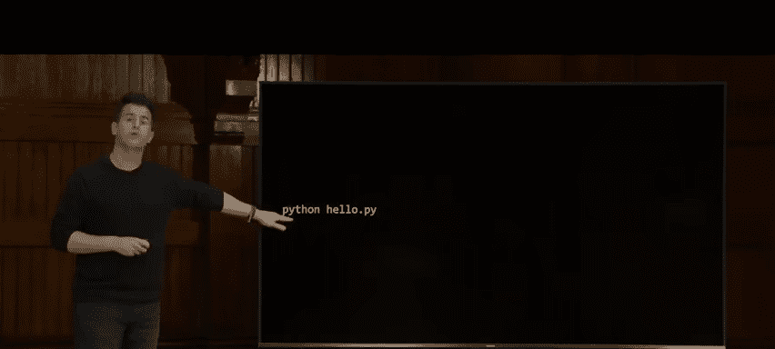


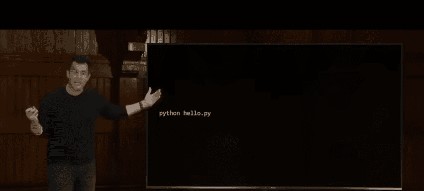

## 概述

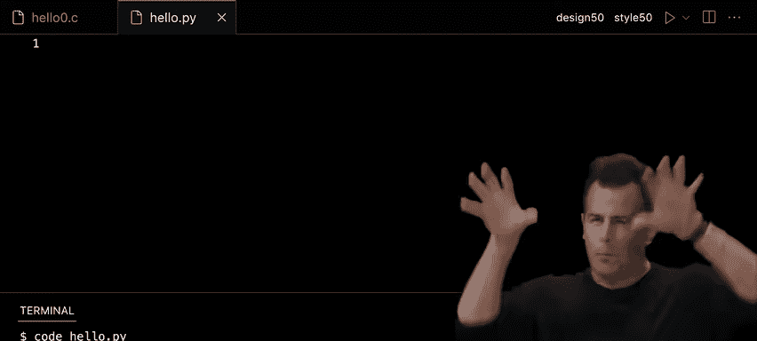

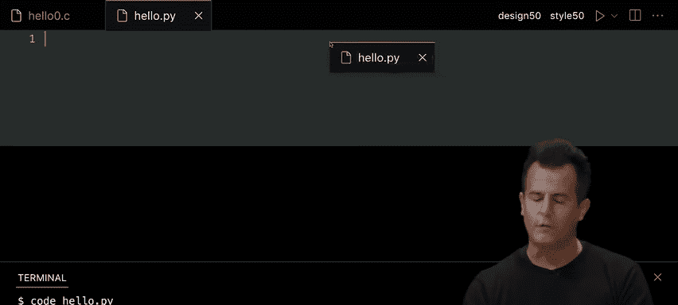

在本节课中，我们将从C语言过渡到Python语言。我们将学习Python的基本语法、核心概念，并通过对比C语言来理解Python作为高级语言的优势。课程内容包括变量、数据类型、条件语句、循环、函数、列表、字典、异常处理以及如何使用第三方库。我们将通过实际代码示例，展示Python如何简化编程任务，提高开发效率。

---

## 从C到Python的过渡

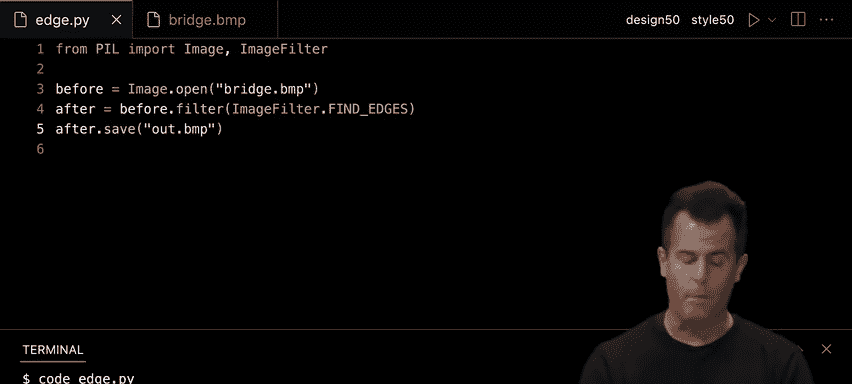

上一节我们介绍了课程的整体目标，本节中我们来看看为什么选择Python以及它与C语言的主要区别。


C语言是一种低级语言，需要程序员手动管理内存等底层细节。而Python是一种高级语言，自动处理许多底层任务，使编程更加简单和高效。例如，在C语言中实现“Hello, World!”需要多行代码，而在Python中只需一行。

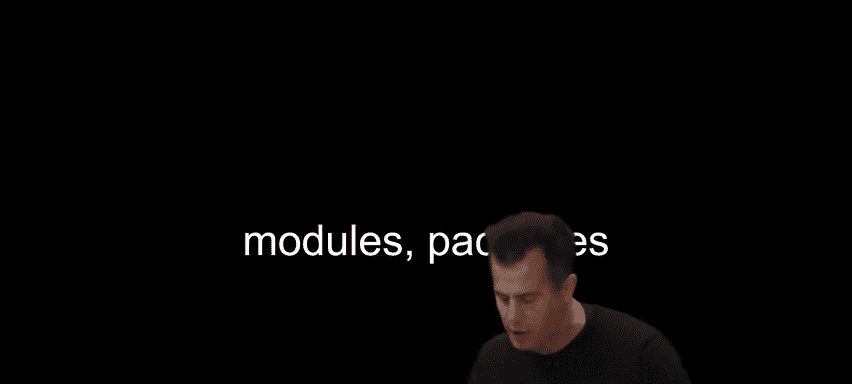


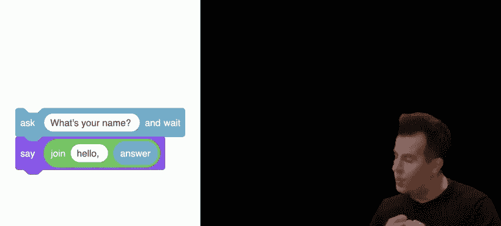

**代码示例：**
```python
print("Hello, World!")
```

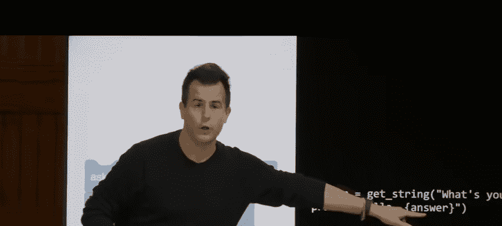

Python是一种解释型语言，而C是编译型语言。这意味着在Python中，你可以直接运行代码，无需编译步骤。

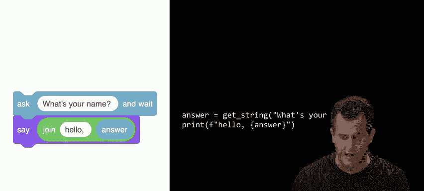

**运行Python程序的命令：**
```bash
python hello.py
```

---

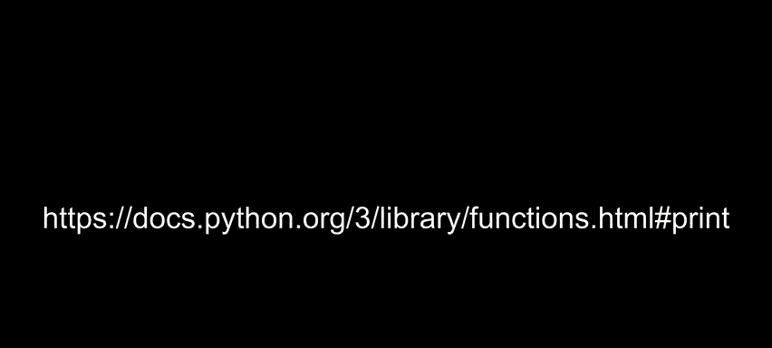

## Python的基本语法

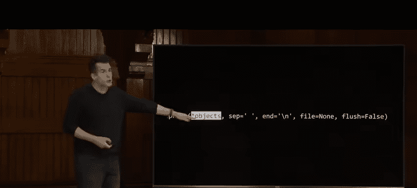


上一节我们了解了Python的优势，本节中我们来看看Python的基本语法，包括变量、输入输出和字符串处理。

### 变量和输入

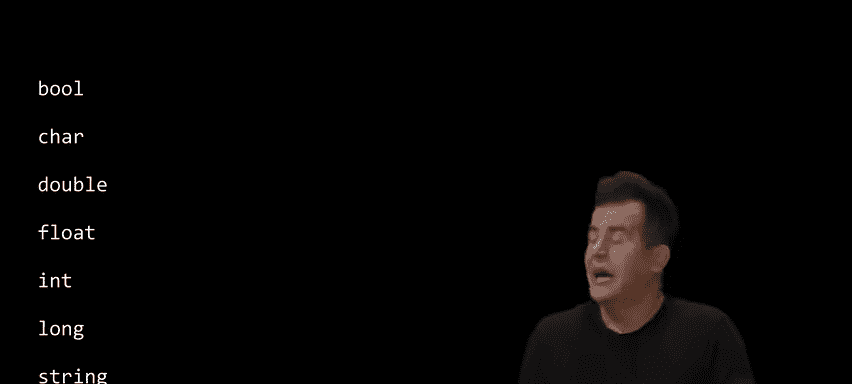

在Python中，声明变量时无需指定数据类型，解释器会自动推断。例如，使用`input`函数获取用户输入：


**代码示例：**
```python
answer = input("What's your name? ")
print(f"Hello, {answer}")
```

### 字符串处理

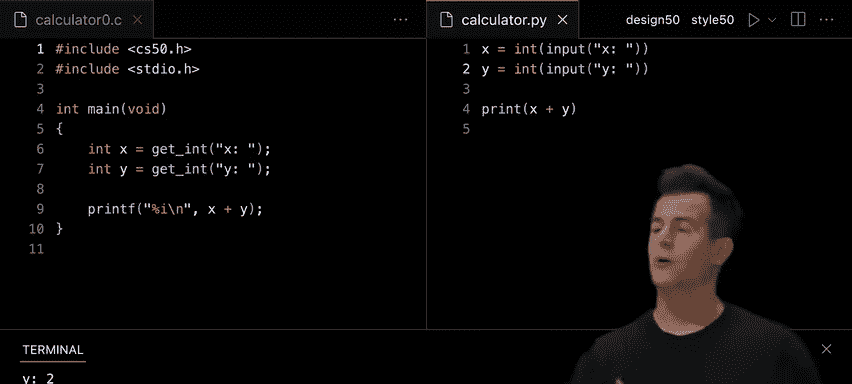


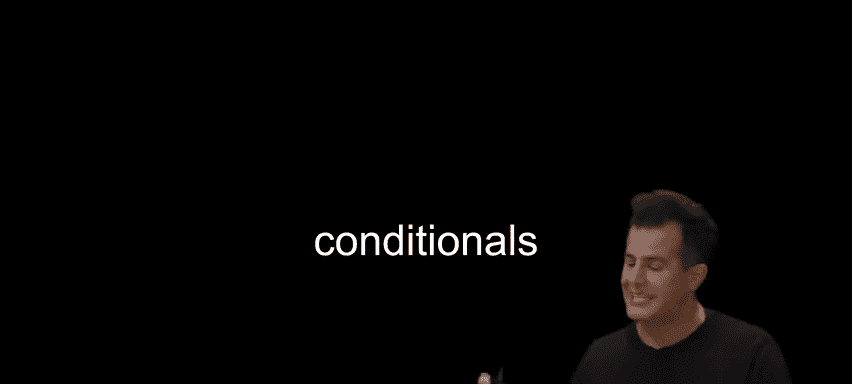

Python提供了丰富的字符串处理方法，例如`lower()`方法可以将字符串转换为小写：

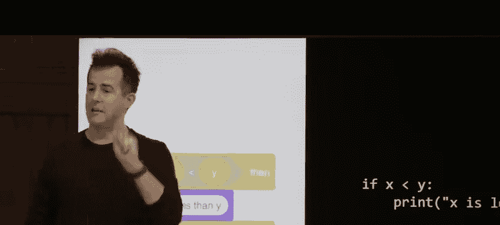

**代码示例：**
```python
s = input("Do you agree? ").lower()
if s in ["y", "yes"]:
    print("Agreed")
```

---

## 条件语句和循环

上一节我们介绍了Python的基本语法，本节中我们来看看条件语句和循环结构。

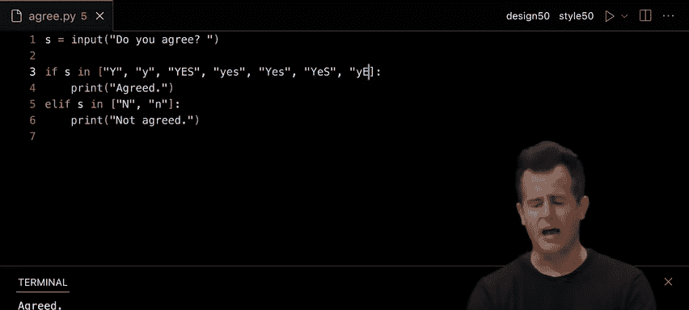


### 条件语句


Python中的条件语句使用`if`、`elif`和`else`，无需括号，但需要冒号和缩进。

**代码示例：**
```python
x = int(input("What's x? "))
y = int(input("What's y? "))

if x < y:
    print("x is less than y")
elif x > y:
    print("x is greater than y")
else:
    print("x is equal to y")
```

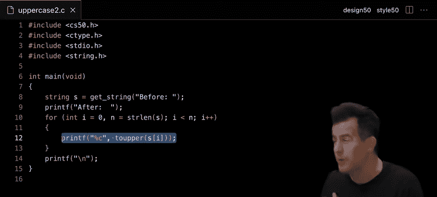


### 循环

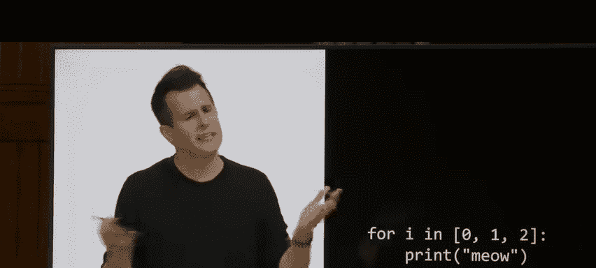

Python支持`for`循环和`while`循环。`for`循环通常与`range`函数结合使用。

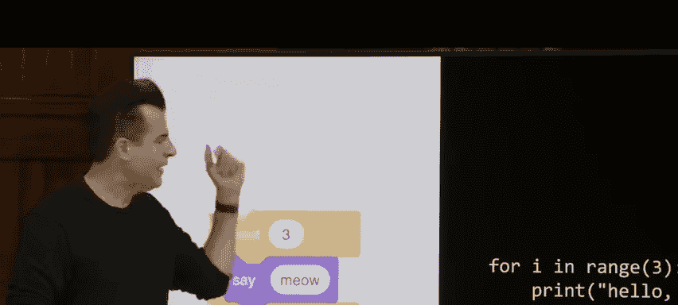

**代码示例：**
```python
for i in range(3):
    print("Meow")
```

---

## 函数和异常处理

上一节我们学习了条件语句和循环，本节中我们来看看如何定义函数以及如何处理异常。

### 函数定义

在Python中，使用`def`关键字定义函数。函数可以接受参数并返回值。

**代码示例：**
```python
def meow(n):
    for _ in range(n):
        print("Meow")

meow(3)
```

### 异常处理

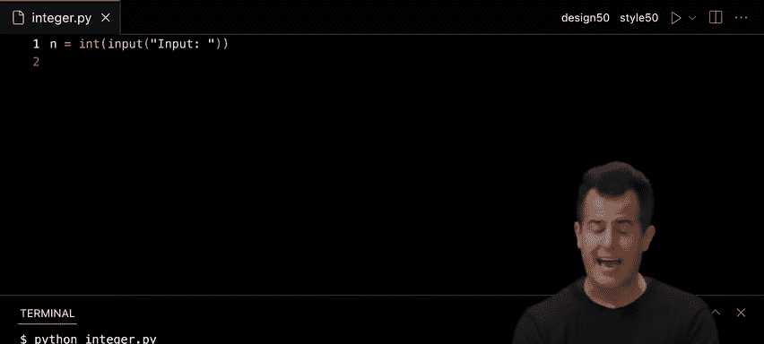

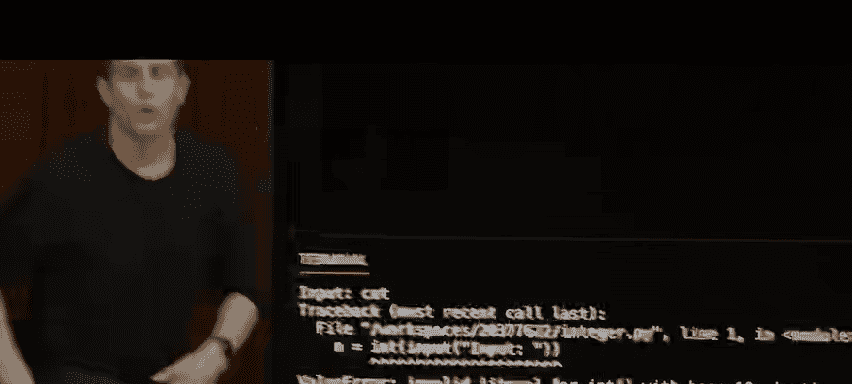

Python使用`try`和`except`语句处理异常，避免程序因错误而崩溃。

**代码示例：**
```python
try:
    x = int(input("Enter a number: "))
    print(f"You entered: {x}")
except ValueError:
    print("That's not a valid number!")
```


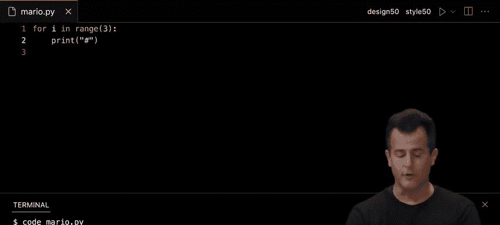


---

## 数据结构和第三方库

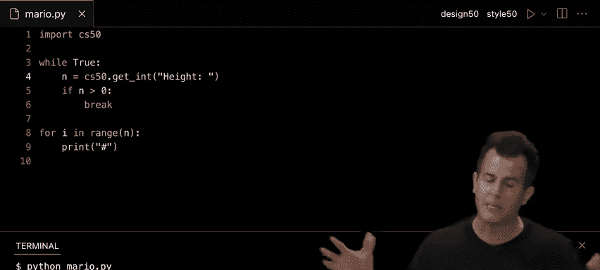


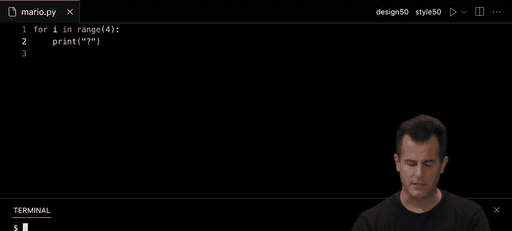


上一节我们介绍了函数和异常处理，本节中我们来看看Python中的数据结构（如列表和字典）以及如何使用第三方库。

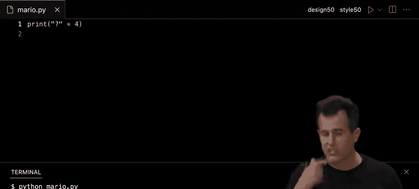


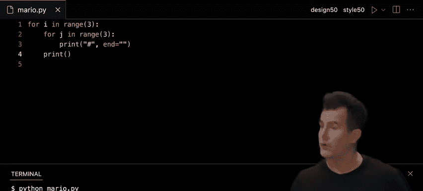


### 列表

列表是Python中常用的数据结构，可以动态调整大小。

**代码示例：**
```python
scores = [72, 73, 33]
average = sum(scores) / len(scores)
print(f"Average: {average}")
```

### 字典

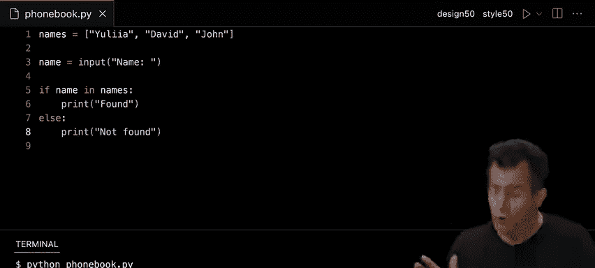

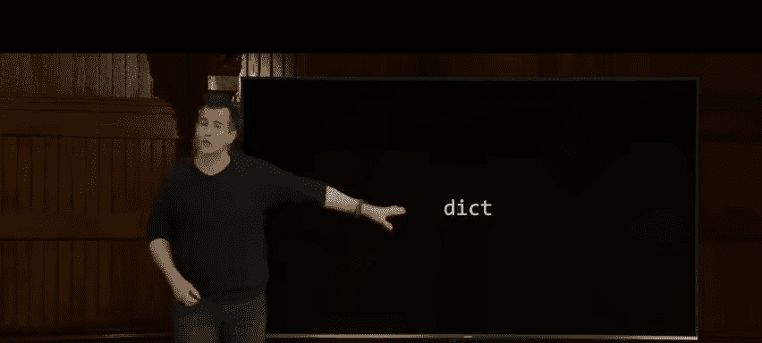

字典用于存储键值对，类似于哈希表。

**代码示例：**
```python
people = {
    "Julia": "+1-617-495-1000",
    "David": "+1-617-495-1000",
    "John": "+1-949-468-2750"
}

name = input("Name: ")
if name in people:
    print(f"Number: {people[name]}")
else:
    print("Not found")
```

### 第三方库

Python拥有丰富的第三方库，可以通过`pip`安装。例如，使用`cowsay`库生成有趣的输出：

**代码示例：**
```python
import cowsay

name = input("What's your name? ")
cowsay.cow(f"Hello, {name}")
```

---

## 总结

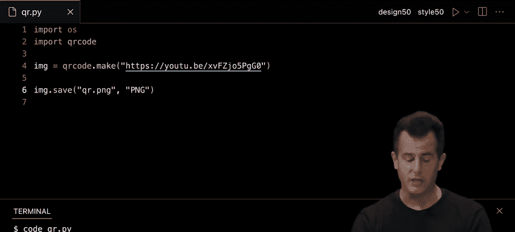


本节课中我们一起学习了Python语言的基础知识。我们从C语言过渡到Python，了解了Python作为高级语言的优势。我们学习了Python的基本语法、条件语句、循环、函数、异常处理、数据结构和第三方库的使用。通过实际代码示例，我们看到了Python如何简化编程任务，提高开发效率。希望这些知识能帮助你在未来的编程项目中更加得心应手！