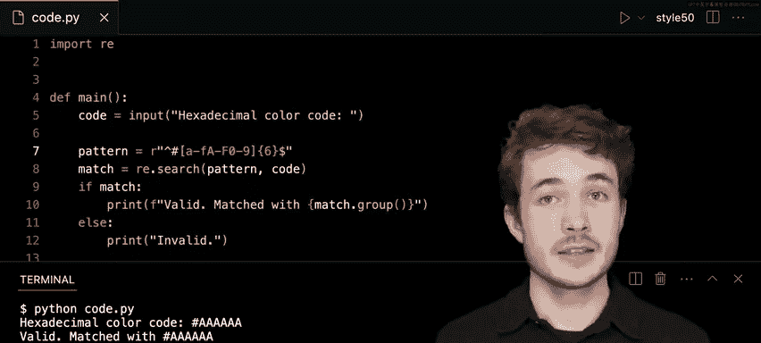
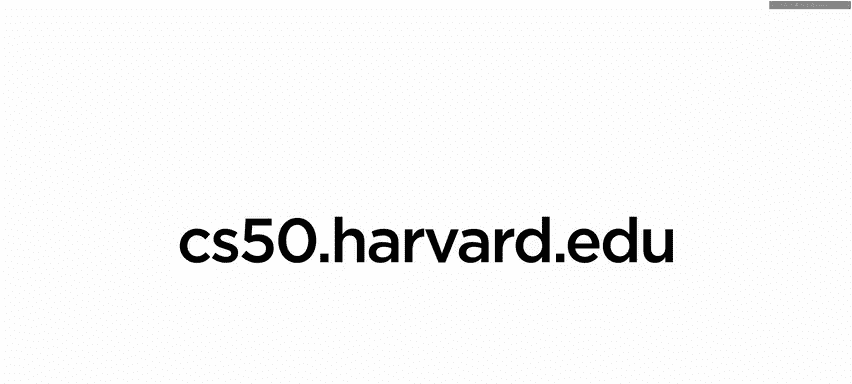

# 哈佛大学《CS50P shorts｜ Introduction to Programming with Python (CS50P) 2024 shorts》 - P12：-13-Patterns - CS50P Shorts.zh_en - GPT中英字幕课程资源 - BV1MS42197Vo

Well hello War and all and welcome to our short on patterns。

 We will look at how we can use regular expressions to create some pattern we expect in some data we might have。

 Now you see to do this with emails but one other kind of data we might be able to validate using a pattern is something called a hexadeciimmal color code So it turns out that colors like this shade over here have to them a certain assigned hexsimmal color code way of representing this color but in a computer's memory。

 So this particular color has this particular code。

 the hash symbol0076 B this corresponds to this particular shade of blue it turns out there's a pattern to this pattern you see over here。

 In fact they always will begin with this hash symbol and they'll be followed by six characters which range from zero to9 or a to f upper or lower case。

 and it turns out there's also a bit of a structure to them too the。

First two characters after let's say the hash symbol。

 well that defines how much red is in this color on a scale of 00 to FF the highest。

 there's also this second set of two characters in this case 7。

6 which corresponds the amount of green in the color and then the final two in this case BA correspond the amount of blue that's in this particular color here。

 again， each of these two sets of characters ranging from00， the lowest， meaning no red， no blue。

 no green， or the highest being FF， meaning all the red， all the green， all the blue， for instance。

Now let's look at a few other examples here， so here， as I said， this is entirely red。

 the redish red you can get， it is hash symbol FF 0，0，0，0。

 entirely red with northern colors involved this here is green，00， FF00 and this let's say is blue。

 the blue is blue you can get at least on the web using these particular color codes，00，00， FF。😊。

Now we can combine these colors too and get both black and white， so black。

 let's say or actually white white being the you know all the colors combined is FF FFFF and black being the absence of color well that will be 0000。

00， so this was our brief intro to these accessible color codes。

 let's go and see how we can create a pattern to validate codes like these。😊。

So I have over here a program called code dotpi and the goal again is to validate hexcesal color codes I might enter into this program。

 so up top I've imported this module called REE which stands for regular expressions I me to use regular expressions in my code here。

I then have a function called main which asks the user for some input。

 ask them to enter a hexsmal color code and I store that result what the user typed in in this variable named code but let's see how we could try to validate the input the user gives us using some kind of pattern Well the first thing to do might be to define the pattern we're looking for in this user's given code to say this is a valid hexsmal color code so I could maybe make myself here a variable called pattern and because this pattern is a regular expression。

 I' want to prefix it with this R character here， which means I'm going to create a raw string typicaly escape characters like backslash and for instance。

 won't be interpreted as backslash and the new line character that once said literally be interpreted as backslash and then N so this helps us here with regular expressions and social syntax。

That those expressions have。 I'll leave this blank here。 Let's continue on。

 Let's say I want to search this particular code the user has given me for this pattern。

 well thankfully the re module comes with a function called search and I can access it using re do search Now the first argument to search is the pattern I might expect to find in the text that I am given。

 let's say from the user here。 So I'll type pattern as the first argument to search I'll then type in this case。

 the string I want to search for this pattern within。 so I'll type code here just like this。

 and it turns out that re dot search returns to me something called a match object。

 which I'll store conveniently in a variable called match。

Now this only happens if search actually finds the pattern I'm looking for in the given input。

 so let's go ahead and maybe check this out， I'll say if match that is if I actually find a match we'll all print something like this。

 I'll print valid and just to be sure here just to be sure I might also try to have this match object show me what exactly it matched in this given input to search through so I could get access to that saying maybe matched with and then I can use match dot group。

 this function here that will show me exactly what search found as a match given this pattern so we'll see that in action a little bit Now otherwise if we didn't find a match。

 I might print something a little more simple， just like this in valid invalid。😊。

So this is our program， and a lot of it hinges on setting up this pattern to behave as we might expect。

Well， this pattern as you said before， will be a regular expression and one thing we maybe start with is the very easiest part of these Haxma color codes that they all begin with this hash symbol in fact if I go back to some of these slides here we'll see that these will be our rules what to look for it should begin with this hash symbol and be composed of six characters after the hash symbol0 through9 and a through F upper or lower case so let's be it's just this first part here it should begin with this hash symbol so if I go back now to my code I could type simply this hash symbol and this is my very simple pattern R dot search will look through the entirety of the code the user has entered and if it finds hash this hash symbol anywhere in that code it will return to me a match object and say yes I did find a match for this particular pattern inside the user's input so let's try it or on Python of code。

And I'll type in let's do a valid one， let's say hashtag A A A A A A don't quite know what color that is。

 but probably some shade of gray， given we have all the various red。

 green and blues aligning in the same level here I'll hit enter and I'll see valid and also matched with this hash symbol。

 So it seems like the reason we said this code was valid is that R dot search found that hash symbol inside of this text here。

But of course， I can do something like this， I could say Python code。 pi， hashtag， let's do G G。

 let's do I， I and K K。 like this is not a valid Ha color code， but。According to our pattern。

 it is because it sees in this case that hash symbol。

 so we need to improve this and we can do so by using other features of regular expressions。

 one of them is going to be called a character set and a character set begins with these square brackets here。

 one opening and one closing now within these square brackets。

 I could include all the characters that I could possibly match after let's say this hash symbol So if we go back to our slides again。

 we said that it should begin with a hash symbol， which we already have in our pattern but then we expect six characters in the range of0 through9 and A through F upper or lowercase。

 let's begin， let's say with these actual letters here。

 I'll go A BC D E F to say we could match any of these individually either lowercase A lowercase B C E EF。

We also want to take in the capital A B， C， D， E F and then anything between 01，23，4567，8，989。

 so this is our character set after we find let's say the hash symbol we should expect to find any character in this set so let's try this out I'll go ahead and run Python of code do pi and recall we gave I think it was hashtag G G I I K K just random letters I made up if I enter now we'll see invalid now why do you think that is well R dot search is looking for a hashtag which it finds。

 of course， but then immediately after the hashtag we want to find a character in this character set lowercase A through F capital A through F or0 through9 and it seems like we don't find that here we have hashtag G which is not in this character set。

So let's go ahead and try this one I'll try Python of code。pi。

 and let's go ahead and do the valid color from before hashtag AAAAAA hit Enter。

 and we'll see that this is valid。But perhaps not again for the right reason。

 I see matched with hashtag A， which is an improvement， but I think I could still do this。

 I could still do hashtag A， and then G G G GG， which is not a valid color code and this I think will still be valid。

So our problem here seems to be that we're expecting the right range of characters for the first character we see after the hash。

 but not for all of the six after， let's say we have this hash symbol here。

So how could we fix that What we can use what's called a quantifier and I can act as a quantifier using these curly braces here。

 So this ensures whatever number I put in here like6。

 This means that for this particular character set。

 whatever character or character set precedes as quantifier I should expect that number of them in this case exactly。

 So I'll expect six of these particular characters inside of this set here。 let's try this out。

 I'll going Python of code dot pi。 I think I'll demonstrate now that hashtag a G G G G G。

 this is not gonna to work for us。 I'll hit enter。 I'll see that is invalid。 let's try this one now。

 Python of code dot pi。 I'll do hashtag A A A A A and that seems to be valid Now for the right reason。

 we matched with the entire thing all of these in this case fall into this range of valid characters。

But I think there's still one more thing to go and improve here。 Let's try this。

 I'll do Python of code dot pi。 let's get a little bit tricky。

 I'll do hashtag A A A A A A and then something like why don't we just do a0 at the end。

 Now this is not a valid color code。 This is more than seven characters。 I'll hit enter here。😊。

It's still valid。Now this might be confusing because I did say earlier that this quantifier here ensures that we get exactly six of the characters in this character set。

And。Well， it seems like we've done that like I have here in this code hashtag， hash symbol here。

 and then A A A A A A that's certainly six of them。

 and so I seem to have found a match inside of this longer string and it's a little more clear I could even do this Python of code dot pi。

 the code is hash symbol A A A A A A well this is valid。

 even though I typed in the code is which I don't want to include in a valid hexsmal color code。😊。

So one thing I can use here it's called an anchor。 if I want to say that my pattern should start at the beginning of the string。

 I can do so by adding a carrot here so this will say that when I search for this pattern。

 this hash symbol must be the very first character that I see in the input text so this would no longer be valid under this carrot symbol here。

 this anchor me try it again I'll do Python of code do pi I'll say the code is a hash symbol A Aaa enter that now is invalid because our very first character in this input is not the hash symbol。

Now similarly， we can do anchor at the end， which looks like a dollar sign and that means that the last character。

 the last characters we expect should be these six in this range here so this will exclude things like the hash symbol AA AA Aa0 because that is more than in this case6 the last character we're matching is not is not within the six we expect here so I'll run python of code do pi and I'll type in hash symbol A A A Aa0 and that of course is invalid as well。

 so I think this pattern works pretty well for us but there is one way to improve how we write it I could typing all this out use a range I can say conveniently a dash F to insinuate or to imply I want a B C D E and F as valid characters。

The same thing for capital A to capital F， just like this capital A capital F that will give me capital A。

 B， C， D， E F and again， same thing for 0 through9， I could do hashtag here， giving me 0，1，2，3，4，5，6。

7，8 and9 all inclusive So this I believe should do the same thing for us I'll type Python of code dot pi type in hash symbol A A A A AA and this seems to be a valid color code。

So we've seen here how to use these things called regular expressions and the patterns that actually implement them to validate things that have a pattern to them。

 these are useful beyond just these， anything has a pattern to it。

 you can probably try to validate using these things called patterns and regular expressions this then with our short on patterns and we'll see you next time。

