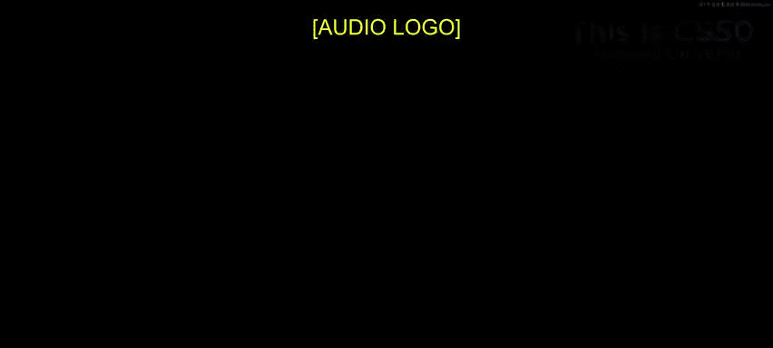
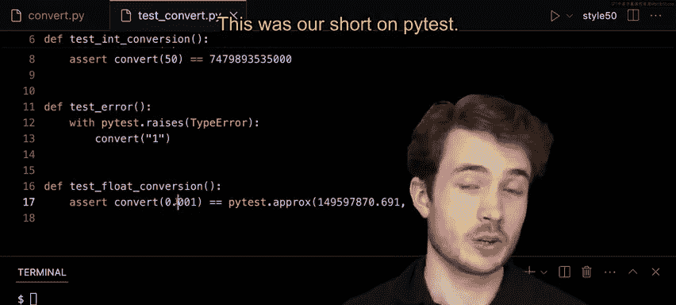

# 哈佛大学《CS50P shorts｜ Introduction to Programming with Python (CS50P) 2024 shorts》 - P14：-15-pytest - CS50P Shorts.zh_en - GPT中英字幕课程资源 - BV1MS42197Vo

Well hello what and all and welcome to our short on P test Now Pi test is a module you can use to test your code more thoroughly than you could on your own。

 and I have here a program called convert dot pi whose purpose is to convert this unit called an astronomical unit often used in space exploration and so on into a more friendly measurement called a meter。

So I have here down below the convert function and this does the following。

 it first checks if the argument AU is of type int or floatat and if it is not。

 it raises in this case a type error for the wrong type， it saysAU must be an int or float。

 in this case if it is not。Otherwise， if AU is of type int or float。

 we willll go ahead and return the conversion between astronomical units and meters from this function。

 convert。Now I could go ahead and run Python of convertt dot pi。

 and I could maybe test this on my own， I could type in maybe one for AU and get back in this case some large number of meters。

 I can go ahead and type Python of convert dot pi and get back in this case again some large number of meters。

I could probably be more thorough than this and I really hate the program much to sit down and write these tests myself。

 whichs kind of hitting you know control L to my terminal run this program again。

 type in some new input and check the result by hand。

 that's why things like pi test exist in the world Now if I want to write some test for my code and do so with code itself I can use by convention per pi test a file called test underscore and then some given name so I'll call this file test underscore convert do pi to test in this case this function I have called convert and again by convention in pi test files that hold tests for our code in this case have to begin with test underscore So I'll go ahead and open up code of test convert do pi and again by convention I'll go ahead and import this module called P test。

Now what could I do well I want to in this case test my convert function in general。

 when we're using P test， we're engaging in unit testing。

 testing individual units or functions in our program， so I'll save Ma for testing later on。

 I want to focus on convert right now。So I could go ahead and import the convert function from my convert file。

 I could type from convert this file here， import the convert function。

 and now I can use the convert function inside of test convertt。pi。Well， here， again by convention。

 if I want to write some code test， convert， I should write it inside of a function that begins with test underscore。

So maybe the simplest thing to test here is just some simple values like the conversion between1 AU and two meters instead。

 so I'll type def and then test， underscore conversion here。

 and this is mo making for myself a new function that will run when I call pi test in my terminal。

As we've seen before， pi test relies on this idea of asserting something to be true and if it is not pi test will let us know if our program has not behaved as we expect so here I could assert let's say that when I call convert and give it an input of one that should be equal to in this case this large number of meters go ahead and type this in here149597870700 I we check this here 149597870700 so this is a large number of meters but it is the conversion between 1 a2 meters Now a side note here is that if I was writing these tests I'd probably want to be very sure this is the right conversion and this is probably a good chance to say like if you want to type out what is this 12369 almost 12 numbers here just be doubly sure you're typing each of them right when you're writing tests like these here。

I'll go ahead and run pi test now that I have in this case my test convert dot pi file and when I run pi test in my terminal it will look for a file like this test underscore convert or begins with test underscore and it will then run all of the functions that begin with test underscore and let me know how many have passed and how many have in this case failed。

 so I'll go ahead and run pi test and fingers crossed。

 we see that one has passed in test convert dot pi there is one little dot here meaning this function did what it was supposed to do don encounter any errors。

Now it's a good idea to think through other kinds of scenarios to test in your code in this case I'm converting1 AU。

 but what are some other representative scenarios we could test maybe something like 50 AU as well convert 50 which happens to be this other long string of numbers so again message here is maybe write your test so you get fewer numbers than this 35。

three。5000， I'll double check this again， 747-989-3533500 zero great。All right。

 so this is the conversion between 50 AU to meters as well。

 I'll go ahead and run pi test again and fingers crossed。

 we see that again those tests have passed and notice here it still has one past down below one past。

 we count in this case by the function， but in this case these two individual tests have to both pass for this test be considered passing as well。

Now we could think of other kinds of scenarios test in this case negative numbers。

 maybe zero as well， things like that are really useful for testing your code here。

 but more on unit testing in lecture we'll focus here mostly on pi test so here what else could we do well we've seen that in convertt dot pi in convert dot pi I have in this case。

 not just the pathway of returning the actual conversion。

 but also this pathway of raising a type error and it's again a good idea to test all these pathways through our functions。

😊，So we could ideally try to test， does convert， raise a type error when given an input of the wrong type well thanks to P test。

 we can actually do this， I'll go ahead and go back to test convert and let's go ahead and try to add in in this case a new test one that tests for。

Proper error being raised， I'll call this one test error。

 and again we'll make sure this begins with test underscore。

I can then use what's called a context manager with here to go ahead and try to try to run。

 convert and expect， let's say that I get a type error in particular。

 so by convention or the syntax of P test， I could type with pit。 raises。Type error， colon。

 and indented inside of this with block， I'll type convert， and maybe give as input。Quote one。

 just like this。So this now means that if I were to call convert and give as input one quote unquote well I would expect a type error to be raised so slightly different syntax from we see online7 and8。

 but the same kind of semantics we expect whatever we run inside of this block here will raise a type error I'll go ahead and run Python of convert actually just pi test I'll hit pi test here and now we'll see that two tests have passed。

 so not just test conversion but also test error as well。

 so it seems like convert does raise a type error when given in this case an argument that is not an int or afloat。

Now there's still more to test， in fact up here I was really just testing whole numbers1 and 50。

 but it's worth thinking of floats as a special case when we're testing particular this is because of floating point imp precision so you've probably heard that there are only a certain number of bits we can use to represent certain numbers in code。

 in fact， in Python maybe have anywhere between 16 bits to 32 bits to 64 bits。

 but however number of bits we have， we're always going to have some finite number of bits to represent numbers。

 but when it comes to floats， actually an infinite number of floating point values out in the real world。

 any number of real numbers and so at some point we actually can't represent decimals completely precisely and so when testing them when testing inputs now put nest floats in particular。

 we have to make room for something called tolerance or approximation。

bit of wickgle room to say that yes， this value here is 1。000000001。

 but it's close enough to one that we take consider it as one so let's go ahead and try and see what kind of utilities PiT has for those kinds of scenarios。

 I'll go ahead and look at a new test here， one called de test float conversion。And for consistency。

 I'll say this is testing our integer conversion between whole numbers and whole numbers。

 but this here is testing our float conversion in here。

 I'll try to assert that I will be able to convert 0。001。

 a pretty small float itself to some value like this 149597870。691 double check this here， 149597870。

691 so here I'm essentially saying I expect that 0。

001 when given' input to convert will be equal to this particular floating point value here。

But this might not always be the case， depending on the level of precision I'm expecting。

So if I want to allow for some kind of tolerance， let's say I'll accept， you know this number 0。

690000001 as also a valid equivalency here， I can use pit。 arx， pit。

 arx and give as input the value I'm hoping to compare。

And this will use P test sensible defaults to allow for some tolerance when testing the equivalency of these two floating point values。

 both from the return value of convert and this one I've written over here。So if I run P test again。

 I'll see that three of these tests have passed， which seems pretty good here。

 but let's play around a little bit with the actual tolerance that a prox gives us here。

 I could if I wanted to change the tolerance， maybe make it tighter or a little looser。Now。

 if I wanted to allow any value plus or minus， let's say 0。1， I could type this， abs equals 0。1。

And this means that if convert 0。001 returns to me this number plus or minus 0。

1 all accepted as being equal to this particular number here。

 so a bit of tolerance weve given ourselves here I'll go ahead and run pi test and we'll see that that seems to have passed but let's see how tight we can make this tolerance before we get into some trouble I might type something like this maybe one e negative negative5 let's say so this is the same as writing1 times 10 to negative fifth。

 very， very small tolerance here， I'll go ahead and say pi test and。

So we seem to have gotten an error， it looks like comparison failed。

 we see here that the actual result obtained from convertt 0。001 was this number here。

 which is not within the range of our expected value plus or minus 1。

0 times 10 to the negative fifth。So with think we loosen our tolerance a little bit。

 I could do1 e negative4。Pi test again。Even that doesn't seem to work quite as well as you want it to。

 what if I do1 e negative3？Tingers crossed， even that doesn't seem to do one in negative2。

That seems to be okay。Lesson learned here is that you can actually adjust these tolerances to be exactly the way you want them to be。

 And what I mean by that here is that if I were actually willing to accept this tolerance。

 this would be great but I might be writing some scientific application like maybe one first base exploration and so on in which case a tolerance of1 e negative2 is really not going to cut it and so if I were to make this maybe1 e let's say negative 12 for instance a much more strict tolerance and I see that this test doesn't pass well I should probably do something in my code to make sure that I get a value within this particular tolerance so you probably shouldn't do what I had just done here which is adjust the tolerance until you get the passing test you should probably set your tolerance first and then make sure your code is giving you the right value you're hoping for here In this case I'll leave this alone。

 I'll say for now that a1 e negative to tolerance sufficient enough for me here but。In the future。

 I want to make this a little bit stricter。So here we've seen various features of P test。

 we've seen how to do simple asserts and testing for equality。

 we've seen how in this case we can test for raising certain errors。

 exceptions and so on and we've also seen how we can test conversion how we can actually go ahead and compare floatingpoint values using P test。

 or prox this was our short on P test we'll see you next time。

