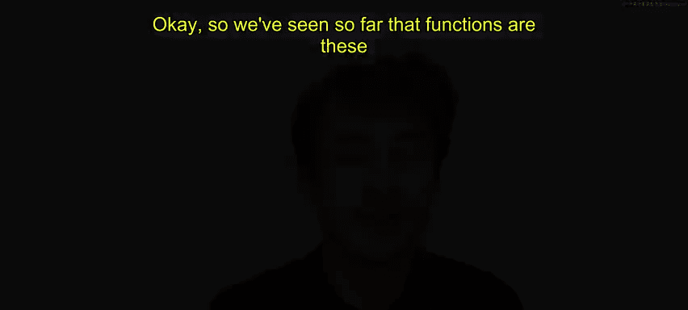
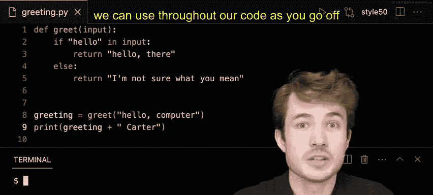

# 哈佛大学《CS50P shorts｜ Introduction to Programming with Python (CS50P) 2024 shorts》 - P17：-18-Return Values - CS50P Shorts.zh_en - GPT中英字幕课程资源 - BV1MS42197Vo

Okay， so we've seen so far that functions are these building blocks of programs that take input and produce output Now it turns out as we look more closely。

 functions can produce two kinds of outputs one kind is a return value and one kind is a side effect so in this short will look more closely return values what they can do to make our programs more flexible as you go off and write more complex programs over time。

Now here I have a function calledGte， whereGte takes an input as you can see on line one。

Now the function does something very simple， it basically asks the question is hello。

 this tech hello is that in the input and if it is it's going to print on the terminal hello there in response I' otherwise it's going to say I'm not sure what you mean so it is if hello is not in the input is going to say I'm not sure what you're talking about。

 which is fine， this is very simple chatbot if you will。😊。

So I'll go down to line8 and let me try to actually run this function to call it with some input。

 so I'll type greet down below and I'll say hello to the computer。

 I'll say hello comma computer I'll save it and I'll say Python of greeting dot pi in my terminal hit enter and now I should see hello there which is really nice so this is an example of a side effect I'm seeing something in my terminal but a return value is slightly different a return value is some value a function can pass to my program to use later on in my code。

And actually， right now， I haven't explicitly said that greet returns anything。To do that。

 I need to use this keyword called returnturn in Python。

 So instead of printing here where printing produces some side effect of text on the screen。

 let me try returning the actual text， I'll say， why don't I return hello there。

 and why don't I return， I'm not sure what you mean。So with this change。

 now I've said that greet has an explicitly defined return value， if hello is in the input。

 the return value will be， Ho there， if Ho is not in the input， the return value will be。

 I'm not sure what you mean。So let's try this again， I'll say Python of greeting dot Pi。

 and I'll hit enter。I don't see anything anymore， but that doesn't mean things are broken。

 so what happens now is that greet is returning some value。

 but I'm not really capturing it or using it in my program yet。To capture it and to use it later on。

 I need to make sure I store the return value inside of some variable。

 and I can do that let's say in let's say a variable called greeting。

 So I'll say greeting equals the result or the return value of calling greet with this input called hello computer。

So now line by line what will happen is I will first runGte and I'll give the input hellello computer。

Hello was in that input， so greet will return to me the value， hello there。

 and it will then store it using this greeting variable and this assignment operator this equal sign here inside this variable called greeting and now I could go actually go ahead and print the greeting itself so on line nine here I'll print greeting。

😊，Now I'll try this， I'll say Python of greeting dot Pi and I'll hit enter and now I see hello there。

 what if I did something like how's the weather like this。

 I'll say Python of greeting dot Pi and now I see I'm not sure what you mean。

So kind of nice Now let's say hello computer again and notice I can take this variable and modify in all kinds of ways before when I just had these simple print statements in greet going back something like this。

 print hello there and print， I'm not sure what you mean those were the only things I could print。

 but now with the return value， I could access to all kinds of ways I could modify the return value later on in my code。

 maybe I could do something like this， if maybe I could say why don't I print not just greeting。

Why don't I print something like hm and then add the greeting on later so now everything we'll begin with hm followed by the greeting。

 so I'll say Python greeting dot pi and now it should seem hm。😊，Hello there。

 or I could say something like， how is the weather？

How's the weather now I could say Python greeting do pi， and it's a little more thoughtful。m。

 I'm not sure what you mean。I could even go further。

 I could say hello computer again and why don't I try to have different kinds of greetings。

 I could say greeting and then I could say space Carterter just like this now I could say Python of greeting。

 pi and it says oh hello there Carter or I could do greeting plus David and now it says Python greeting。

 pi and then hello there David or runngshin I could type any name after this I could kind of add on people's names at the end so as you can see the value of return value is that it allows us to modify things throughout our code and to use the output of some function later on。

 a side effect is slightly different easily produces some change immediately whereas return value we can use throughout our code as you go off and build new programs。

