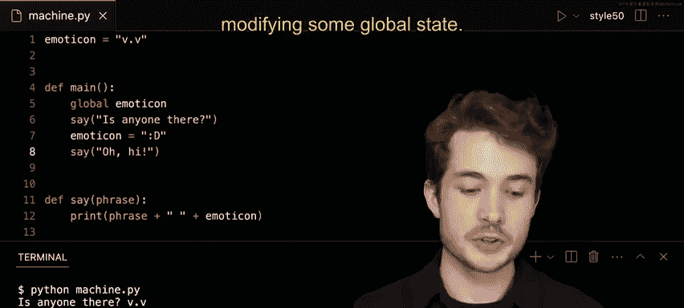

# 哈佛大学《CS50P shorts｜ Introduction to Programming with Python (CS50P) 2024 shorts》 - P18：-19-Side Effects - CS50P Shorts.zh_en - GPT中英字幕课程资源 - BV1MS42197Vo

Well hello one and all and welcome to our short on side effects。

 So we've seen that functions are these things in protoing languages that take inputs and produce outputs for us Now we've seen really that there are various kinds of outputs。

 one of them is called a return value The value of the function gives back to us after it finishes running but it turns out there's also a kind of output known as a side effect which is not the return value but anything else that gets changed while our function is running So let's take a peek at an example here here I have a program called machine dot pi or presenting some machine with some internal emotional state notice how up at the top here I have any modoticoning our machine' emotions at this given point in time in this case it has this particular modoticon are presenting something like sadness or forlornness and so we'll see if we make our machine more happy as you write our program but ideally we want this machine to say something to us and so let's go ahead and write。

😊，ourselves a function called say that we can then call inside of our main function here so I will underneath main。

 go ahead and write for myself a function called say using the Python keywordDe and the name for the function。

 say and maybe say should take as input as an argument here。

 maybe something called phrase the phrase to say and so by convention I will indent within this code block here to write the body of my function。

 the code I want to run when say is called or used in my program。😊，Well， what should say do。

 I think really to say something， our machines should print something to the terminal and so we can do that with a Python function known as print just like this。

 and what should print print will probably the phrase in this case。

 the phrase we gave as input to say。Now if we're just using print。

 we haven't really added much functionality here to the say function。

 so why don't we have the machine able to say something。

 but then it be append the emoticon at the end so it kind of says something with emotion here I'll go ahead and say print the phrase but then also print on a space followed by the emodoticon itself up top here so notice how phrase is really a local variable it's passed as input to this function say and used inside that function。

 a modoticon though as a global variable defined at the top of our file here is able to be accessed by any particular function in this case。

 say included so ideally say should then say whatever phrase we have followed by a space followed by the emoticon presenting our machine's emotions so why don't we try this out in the main function which we run as we run our program here I'll click I'll say say maybe oh is anyone。

question mark and so if we run our machine down below I'll say Python of machine。

 pi hit enter and we'll see is anyone there with a little bit of a sad face。

 so we made ourselves a sad machine but let's go ahead and try to make it happier as we go through so maybe it could later on say something like oh hi just like that and if I were to go ahead and run this I'll say Python of machine。

 pi hit enter and we see now two lines of text is anyone there and oh hi。

Now there's some things to fix， ideally the emmooticon would be happy in the terminal down below and it says。

 oh hi， but before we go there， let's first take stock of what we've done like we've actually written a program that has a side effect。

 this is one example of a side effect printing to the terminal in this case。

So our function say has the side effect of printing to the terminal。

 but what other kinds of side effects might there be Well we mentioned earlier that a side effect actually anything that gets changed while our function is running that is not the return value to actually give back at the end of our function So maybe inside of main we could try to change the emotional state of our machine as a side effect so let's try this out here。

 I'll clear my terminal with control L and then I'll go on to line 6 here and before we say oh hi let's try maybe making the emotion a little happier in this case。

 I'll say colon D for the big smiley face and ideally if we were to run this program we'd see is anyone there with a bit of a sad face followed by oh hi with a bit of a happy face I'll run Python of machine do pi。

We seem to still have ourselves a sad machine so how can we improve this Well I notice first here that a modoticon。

 if you can see very slightly is grayed out and this is because Python by default wants us to specify that we're trying to change some global variable inside of a function this more local scope so our side effect that we want to have happen is to change this global variable。

 but because this isn't always desirable Python wants us to explicitly specify what we're going to do so to do this within the main function。

 what I can do is use this keyword called global and I can specify after global the global variable。

 I want to make accessible and modifiable within this particular function and key thing there is it's now modifiable not just accessible notice how and say it was accessible to us modoticon was but in mainine it wasn't modifiable。

 I couldn't update this variable。😊，If I now say global the modoticon。

 I'm able now to modify the actual value of that variable as a side effect。

 not the return value here， but just a side effect as this function runs。

So here again we have our global emotional state for our machine。

 we then have our function called Maine within that function we say we're going to be able to change this global emotional state that we call a modoticon。

 we'll first say is anyone there， change the emotion and then say oh hi， so let's try this out。

 I'll go ahead and run Python a machine not pi and。There we go。

 we've now seen another version of a side effect， one that changes some global variable。

Now in programming this may or may not be desirable if you have a global variable there's access across many other functions。

 it can be hard to debug your code if that variable gets modified across all these different functions。

 so keep in mind when you side effects like these， make sure it's good design right decision to actually make when you're writing your program。

😊，But here we've seen two examples， printing the terminal， modifying some global state。

 there are others too， but I'll leave that for a later time， we'll see you next time。

