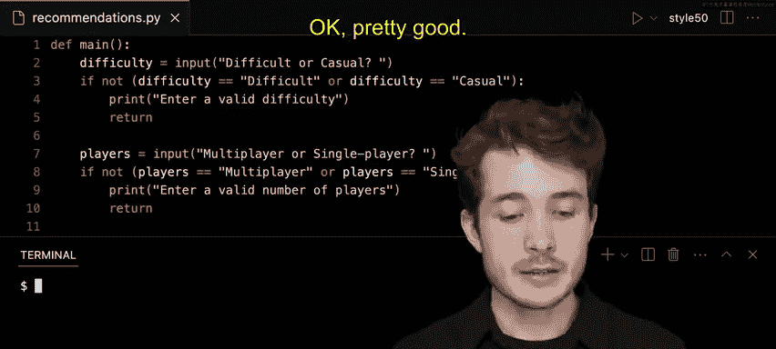

# 哈佛大学《CS50P shorts｜ Introduction to Programming with Python (CS50P) 2024 shorts》 - P1：-01-Boolean Expressions - CS50P Shorts.zh_en - GPT中英字幕课程资源 - BV1MS42197Vo

Well hello one and all and welcome to our short on Boolean expressions Now in an earlier short on conditionals。

 we wrote some game early some program to recommend the user some card games depending on the level of preferred difficulty and the number of preferred players in this case So let's think of ways to improve the design of this program we left off。

 we noted that there's a lot of repetition here in terms of code in particular。

 if we look at lines 6 through 11 and lines 13 through 18 we'll notice these are pretty much the same or at least asking the same kinds of questions here we have the same conditional。

 the same conditional， the same conditional， same conditional。

 we could probably do a bit better than this。 So in what ways could we do better。

 Well let's think through how we could perhaps check to see from the very beginning if the user gave us the right input we're looking for remember we want to make sure the user entered in either difficult or。

😊，Casual， either multiplayer or single player， not some other choice in this case。

So how could we do that We can actually make use of these conditionals again if I go down below where I get the user's input here and ask a question。

 I could probably ask a question of what is the value of difficulty and is it either difficult or casual or is it not so I'll go ahead and ask if let's say difficulty equals difficult just like this and if this was all I knew about Boolean expressions。

 I have to leave it as this， but thankfully I actually don't need to do that if I know more about these things called Boolean expressions。

 these expressions here that come after are conditionals。😊。

Now it turns out that Boolean expressions or simply these questions have yes or no values。

 and we see here one example of a Boolean expression， difficulty equals equal。

 meaning is equal to capital D difficult， that is a question that has a yes or no。

 true or false response。But I can actually do more than just ask or compare to values in a Boolean expression。

 I can actually combine Boolean expressions into one longer one using Boolean operators。

 so in Python we have access to three of them and we'll show one here now at one called or so it seems to me I care if difficulty is either difficult or casual。

So I could ask this all in one breath， one question， if you will。

 using or as well on I'll type in some other logical expression here。

 difficulty equals equals is equal to in this case。

 casual and now I have one longer logical expression here difficulty is equal to difficult or difficulty is equal to casual and now if either one of these two expressions is true。

 the entire expression will be true as well。But it seems to me that this actually isn't quite what I want。

 I want to check if the user actually did not enter difficult or casual。

 so thankfully I can make use another Boolean operator at one called not and not can negate the value of a logical expression。

 if it is true， it will negate that true to a false， if it is false。

 it will negate that false to a true value， or in words same equivalent between yes and no values too。

So if I were to think about this as one long logical expression。

 I could encase it in these parentheses， this means this is a separate logical expression that should be evaluated first。

Then I can actually propend this logical operator not well to take the result of this logical expression here and negate it and remember in Python。

 these logical expressions return， true or false values。

 so if it is true that the user has entered in both if it is true that these entered in either difficult or casual。

 our expression here will be false will not do whatever is indented in this particular branch of our code。

If though the opposite is true， the user has not entered in， either difficult or casual。

 we will run whatever code is inside of particular branch。

So what code should we run what we saw below， we kind of wanted to just prompt the user and say you should need to enter a valid difficulty。

 so I will copy and paste this print here and put it up top instead and I think now we could actually get rid of this else in our conditional structure so we're simplifying things a little bit down below as well。

Well， what else should we do ideally our program shouldn't keep running after we tell it after we tell users to enter a valid difficulty so we could type in this case return saying this is the end of our program in this particular case。

Now we can do a similar thing for the number of players。

 Why don't I actually just kind of copy and paste this for now because it's the same structure and let me try to modify it so it actually fits this new use case here。

 Well in this case， I care if a player entered the right number of players instead I'm comparing difficulty I'll compare players in this case and I'll ask the question is players either multiplayer。

Or single player just like this and so now if the user has not done that。

 I'll go ahead and say enter a valid number of players。

 notice the same thing we said down below on lines 18 and 25 So now we can really simplify things if I can get rid of this line 24 and 25 and even lines 17 and 18。

 I think we're in a better spot for these conditionals down below and moreover。

 we can actually alert the user immediately when they haven't typed in the right value to our program。

So what have we done， we've now seen here how we can use these logical expressions and actually Boolean expressions and Boolean operators to combine these together and ask more complex questions about user input。

😊，But you probably still do a little bit better down below here。

 one other way to write this would be to specify some more complex questions。

 notice how there's some repetition here。KdHaving the same conditional structure inside of these two branches。

 we could make this， I would argue， a little bit better designed or at least a little more readable in this sense。

So what if we did this instead， what if we tried trying to combine these questions into one Well here notice how I'm recommending poker if difficulty is difficult in players is multiplayer I could represent that same question I just asked in English is difficult equal to difficult and players equal to multiplayer in a single logical expression using another a Boolean operator one called and so I'll go ahead and say if difficulty is equal to difficult and players is equal to multiplayer multiplayer in this case in that case we would recommend poker。

I think we could really rewrite the entirety of these conditionals now using these more complex Boolean expressions and Boolean operators here。

 so in the case that difficulty is not difficult and players is not multiplayer will ask another question。

 we could ask if difficulty is equal to difficult and let's say players is equal to single player just like this。

Well， what trickline in that case we should recommend， as we saw before， in this case。

 Klondike a more difficult single player game？In the case that that's not what the user entered。

 we asked another question， we could say LF maybe difficulty in this case is casual and players is equal to let's do multiplayer in this case。

 in that case we would recommend we would recommend a game like hearts instead。Now。

 here at the very fourth condition， I argue we can use an else because we only gave the player four possible options。

 difficult or casual， multiplayer or a single player。

 which can just recommend really four different games。

 really its better think about it as really two。Two inputs， difficulty， and players。

 each of which have two possible options， multiplied together gives us four possible outcomes in this case。

So how could we think about this， well， if it's not these three combinations。

 there's only one more to recommend， so I will recommend in this case the last game。

 one called clock for casual single player card games。

Okay so we've now used these booleanagepresss and we've now used these Boolean operators to make more complex questions and simplify bits of our code let's quit ahead and test this out and see if it works I'll open up my terminal and I will run Python a recommendations pi so let's first test this branch of our code here lines3 through5 if I enter in something other than difficult or casual will I see enter a valid difficulty well'll type in maybe medium as a difficulty not a possible option here。

 I'll enter and I'll see enter a valid difficulty pretty good let's test now this branch here if I enter in a correct difficulty but an incorrect number of players hopefully I'll see enter a valid number of players I'll go ahead and run Python recommendations do pi I'll choose maybe difficult difficult and I'll type in oh maybe two player。

Again， is not an option。I'll enter here and now I'll see enter a valid number of players just as we planned from the beginning。

More to test， though， if I scroll down， let's try to test these various branches here。 ideally。

 if I type in both difficult。Difficult and multiplayer， I should see poker。

And I do if I now type in something like difficultiff。And single player， I should see something like。

Klondike， if I type in something like casual and multiplayer， I should see hearts。 And finally。

 if I type in casual or single player casual and single player。

 I should now see clock at the very end。😊，So we've rewritten now the very same logic in a different way。

 thanks to these more complex Boolean expressions and Boolean operators。

 certainly perhaps more ways to write this code， other ways to incorporate the same logic。

 but this now highlights ways we can actually combine various questions into more complex ones as well That's it for this short。

 we'll see you next time。😊。