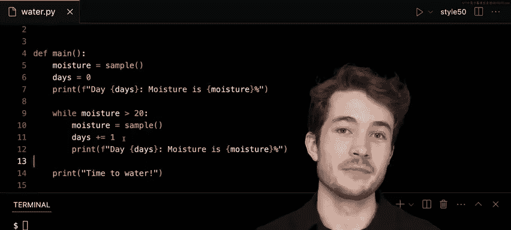

# 哈佛大学《CS50P shorts｜ Introduction to Programming with Python (CS50P) 2024 shorts》 - P22：-23-While Loops - CS50P Shorts.zh_en - GPT中英字幕课程资源 - BV1MS42197Vo

Well hello on and all and welcome to our short on Wild loops Now life is full surprises and one prize for me recently was taken care of this particular plant here Now it turns out this plan is pretty picky about the kind of water it gets and when it gets watered I'm supposed to water this plant when the soil is dry but not too dry and so I kind of check every day what the moisture level is before I should actually know should I water this plant or not so I thought I maybe write a program to remind myself when to water this plant depending on how dry the soil is and one thing I've learned is that you actually measure the moisture content of soil in percent water out of all the entire soil you might have and soil is considered dry supposedly when it reaches a moisture level of 20% or a little bit less so ideally here I could write a program to maybe check for me once a day let's just say。

What the moisture content of this plant's soil is， and if it's 20 or less。

 go ahead and alert me that I should be watering this particular plant。

So here I have a program called water dotpi and this program actually uses a function called sample that I've written elsewhere。

 but I'm going to just import it and use it in this program。

 no need to worry about how that's implemented in this case the purpose of sample is really to just sample my soil hypothetically in this case and maybe return to me the percent moisture that has sampled from the soil on this particular day so I program in mainine here is as follows I'm going to sample my soil。

 store the result in moisture and then print out the current moisture percentage or the water content at least of this particular soil on this particular day。

So go ahead and run Python of water。 pi and what do we see well today the moisture is 28%。

 so not quite dry enough to water。But what should I do now， this program only checks once from me。

 I'd love for it to maybe keep checking， keep checking， keep checking while the soil is still wet。

 and I'd love for it to stop when the soil is dry and alert me it's time to water this particular plant。

So notice how I said that I wanted to do something while some condition is true。

 I want to keep checking the soil， sampling while the soil is wet， so I could use。

 let's say a while loop， a while loop is great when I'm not quite sure how many times I want to loop。

 but I do want to loop while some condition is true。

Why don't I go ahead here and maybe update this program to be a little more dynamic and keep looping while some condition is true。

 I'll say maybe while the moisture content， moisture in this case is greater than 20 that is the soil is still wet I want to do the following I want to well sample again maybe it's another day I'll sample the soil again and I'll then report on the actual moisture content。

 the water content of this soil here。So now what we've done is updated our program and from top to bottom reads like this。

 I'll first sample the soil， perhaps immediately after I water it。

 let's say I'll start running this program， it will then report to me the moisture in that soil。

 and all then let's say while the moisture is greater than 20， while the soil is so wet。

 I will sample let's say once per day， the moisture and then report to myself the moisture that I need to the moisture content as it currently stands。

Now this while loop， the code is indented inside of it again。

 will keep running while this balloonagepress is true， but once no longer true。

 we'll actually exit out of this loop and in this case end our program。

 but before we do maybe I'll do this， I'll say time to water because I know that if moisture is not greater than 20 or it's equal to 20 or less。

 so I'll go ahead and say it's time to water， your soil is getting to dry。All right。

 so why don't I go ahead and maybe try this program now， I'll run Pythonofwater。pi。

And I'll see that we could maybe just for a sake of the magic here as soon this happens once a day。

 so the first day， 34% moisture， next day， 31%， then 27， 23。

 22 and 18 now 18 is definitely not greater than 20 so we would then exit our loop and say time to water but as long as moisture was 20 was greater than 20 we were as you notice。

 continuing to loop， continuing to loop as we went through。

Now let's just try this again one more time。And we'll see that seem to take a little more。

 a little bit more time here when I try this again。That seem to take only three days。

 so really soil moisture content can vary based on the weather， the sun， etc。

 and it might really be somewhat random how dry or wet my soil becomes over time。Now here。

 the magic of the while loop is that no matter when this happens， whether it's four days in。

 two days in， five days in， it's always going to end when this condition is no longer true in this case。

 and to make this point even more clearly， let's go ahead and add in a variable called days and we'll say the day I first start watering is days equal to zero。

 and then every time I iterate， I'll add one to days。

 so going from zero to one then one to two every day I sample my soil again and again。

 and I could actually make it clear what day it is， I'll say day days。And day， days here。

 and now if I run my program again and make this just a little bit bigger for ourselves here。

 I should hopefully see that this time it took five days indexing from zero。

This time it took six days indexing from zero and this time only took three days， so again。

 while loop the perfect choice when you want to keep looping while some condition is true。

 but you're not exactly sure how long you're going to loop at the end of the day。

 good for things like randomness， good for things like this， if a plant。

 you're not sure when to water。This was our short onW loops， we'll see you next time。

