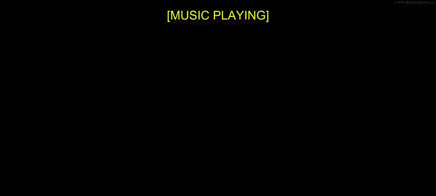
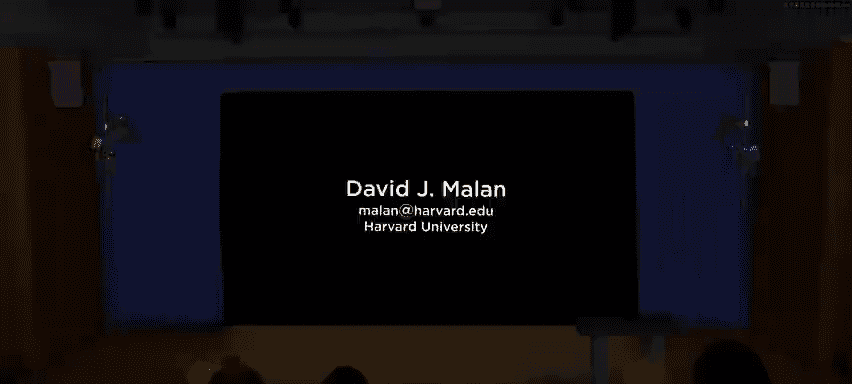
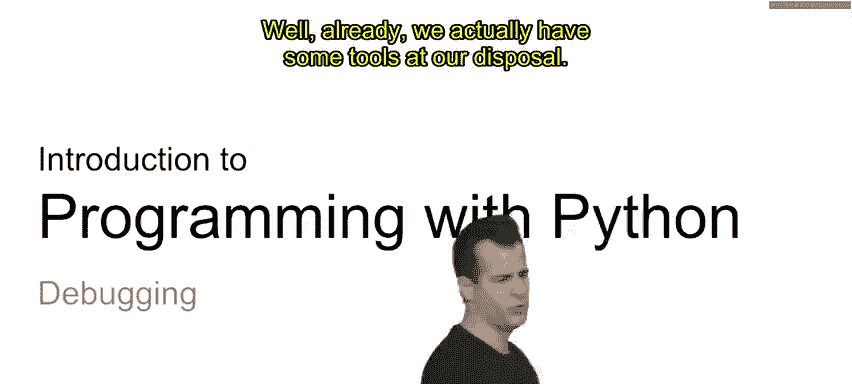
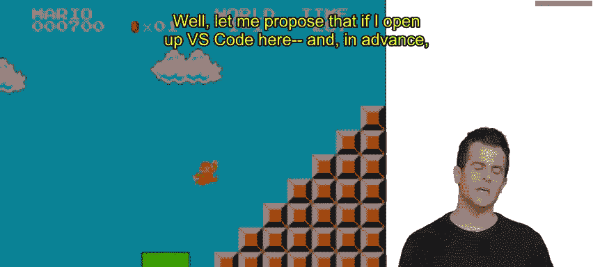
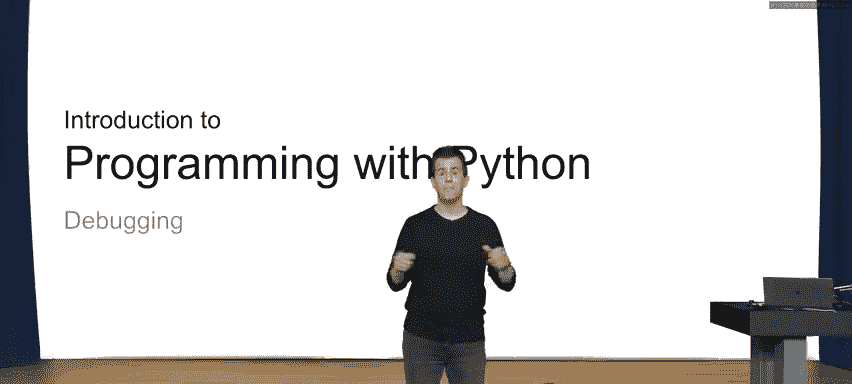

# 哈佛大学《CS50P shorts｜ Introduction to Programming with Python (CS50P) 2024 shorts》 - P4：-05-Debugging - CS50P Shorts.zh_en - GPT中英字幕课程资源 - BV1MS42197Vo

Alright， this is C S 50's In to programming with Python。 My name is David Main。

 and this is a look at debugging。 odds are by now， you've written quite a bit of code。

 And within that code is at least one， maybe even more bugs。

 that is mistakes that you accidentally introduce your code。 Now。

 maybe your code doesn't even run at all and you have some form of syntax error。

 or maybe you've gotten past that hurdle。 And you just have one or more logical bug so to speak。

 whereby when you run your code， it doesn't produce the output that you actually intended。

 So it's not quite correct， there are mistakes therein。

 and how do you go about then solving those problems。 Well。

 if you can't quite wrap your mind around what's going wrong by just reading with your own human eyes。

 your own code from top to bottom left to right。 and you don't have， for instance， a teacher。

 a friend， a colleague， a rubber duck to help you reason through what might be wrong in your code。

 what kind of tools do we actually have for chasing down bugs in code and ultimately fixing them。

 Well， already， we actually have some tools at our disposal。 And for instance。

 let me propose that we build something like this。

So pictured here is Mario from Super Mario Brothers is the original Nintendo game jumping over a pyramid of sorts。

 and that period is implemented with these bricks of sorts。

 Let's go ahead and create a textual version thereof whereby we use maybe hash symbols。

 simple hashes to represent each of these bricks and therefore the goal in printing out a pyramid textually that resembles that of Mario here would be to print out one hash and then two hashes and then three hashes and perhaps more of the pyramid itself is higher。

 Well， let me propose that if I open up Vs code here and in advance。

 I've created a file called Mario pi， let me propose that this is my intended solution to this problem。

 Let's go ahead and walk through what's here。 I first at the top of my file have a main function defined inside of which is the second line of code that calls input asking the user for the height of this pyramid immediately the return value of input is passed to the input of int so as to convert that textual input presumably。

😡。

Responding integer。 and then I'm storing on the lefthand side of that equal sign the value that the user typed in be it 1。

2，3 or anything else。 And then I'm using that variable as an input to a function that's apparently called pyramid so that I can ultimately print out a pyramid of that height Well what is this pyramid function。

 Well， it looks like on this line 6 that the pyramid function expects one argument called n and presumably for number And how am I using that number。

 Well， inside of this function， I have a four loop that's going to iterate， it would seem n times。

 and this is indeed our common paradigm doing for I in the range of n allows us to iterate from zero on up。

 And then that innermost line of code is just going to go ahead and print out some number of hashes and recall this trick whereby we're using the multiplication operator。

 but really just to automatically concatenate one or more of these hashes together。

 So hopefully the net effect of this program once we actually run it per these final two lines and。

I invoked and then pyramid is invoked is that we'll get a pyramid of the corresponding height。

 but suppose now that I very enthusiastically went about trying to run this program and so I went to my terminal window and ran Python of Mario pi and then I want ahead and propose a height of three。

 the goal being to have one hash， two hashes， three hashes so that the total pyramid is of height3 I'm a little disappointed already to see that it's not quite correct this output。

 I seem to have a pyramid really of height2 because there's a blank line and then a single hash and then two hashes。

 but again what I wanted was one hash than two hashes then three hashes forming a pyramid that's in total of height 3。

 Now you might have an immediate instinct as to how to fix this problem。 And indeed。

 relatively speaking， this isn't the most complicated program。

 at least if you're a few weeks into learning and writing code in Python but suppose that it's just not obvious to me or this is representative of even more complicated problem down the road。

😡，And so I'd really like to start figuring out systematically how to solve this particular bug。 Well。

 what's one tool in my toolkit。 Well， let me propose first that I do this。

 Let me clear my terminal window to get rid of the output from before。

 And let me propose that it might be helpful for me to maybe figure out if maybe I is wrong I is my variable in this four loop that's responsible for printing out presumably one hash then two hashes then three hashes and so forth。

 So maybe just to check my understanding here， I should maybe why don't I temporarily just print out I in addition to these hashes just so that I can make sure that I is what I expect next to the appropriate number of hashes。

 which is to say print itself， the function we've been using now for quite some time。

 is a very reasonable， effective tool for debugging at least in some cases。

 It's a nice way to quickly and dirtly kind of see what's going on inside of your code。 Well。

 let me do this。 In addition to printing out that number of hashes。 let me also print。😡。

The value of I， but rather than print out a new line。

 which I think is going to completely mess up the pyramid。

 Let me just end the line with a single space just to kind of push the cursor over to the right so that my pyramid is printed to the right of all of these integers。

 All let me go down to my terminal window again and run Python of Mariio do pi enter I'm gonna again type in three for the height and now I see essentially the same output。

 but I've prepened so to speak to each line， the value of I and now maybe it makes a little more sense to me。

 now maybe the proverbial light bulb just went off over my head because oh the reason I'm seeing a blank line and then only one in only two hashes on the screen instead of one。

2 and three respectively is because I of course now I remember starts from0 certainly when doing a four loop like the one I have here on line 7 So how do I go about fixing this。

 Well， I think instinctively I could just do this。 let me go ahead and remove the previous print Indeed when using print。

😡，To debug your code， it's usually temporary。 So I should now undo that change because I don't want those numbers to appear ultimately in my program's output。

 Let me go ahead now and print out， okay， I don't want to print out0 hashes and then 1 and then 2。

 I want to print out one more than the current value of5。

 And I bet there's a bunch of ways I can solve this。 But I think the easiest way might be this。

 Let me go ahead and in parentheses， do I plus1 So that what I'm really doing is multiplying the single hash by I plus1。

 So instead of being 0，1 and 2 hass respectively now it's1，2 and3。

 And I've parentthesized it just to make clear to myself that indeed， the math is gonna happen first。

 just like in math class inside of the parentheses and then I'm gonna to use that total value for the concatenation of all of those hashes。

 Allright， let me go ahead now back to my terminal window clearing it running python of Mario do pi once more。

 Let's again type in height of3 and now I。😡，The intended pyramid。 So a minor bug， if you will。

 certainly， if you're several weeks into learning Python already。

 that kind of bug might have jumped out at you pretty quickly。

 but that's not always going to be the case。 And so print is the first of your friends when it comes to debugging your code using print。

 you can temporarily， but pretty easily just display the values of variables or other things in your program just so you can help see what the computer sees underneath the hood。

 so to speak。😡，But it turns out there's more powerful tools and print can start to get a little tedious。

 especially if you're adding a print up here and up here and up here and up here and all over the place in more complicated programs。

 because then you have to clean up a whole mess that you've made and you might have put the print and not the right location and you have to remember what output is coming from one print。

 So eventually print is not so much your friend and we need better tools than that So let me go ahead and clear my terminal window again。

 let me undo these changes so that I again have the same bug where I'm now printing out I number of hashes。

 So0，1 and2 again， and let me propose that we use another tool that comes with a lot of programming environments nowadays VS code included Indeed。

 typically I've hidden the so-called activity bar to the lefthand side here of Vs code but I've revealed it today so that we can see some of the functionality that actually comes with Vs code and other text editors and other IDs In development environments often come with built in debuggers and indeed a debugger is a special type of program。

se in life is to do just that to help you debug your program。

 It doesn't necessarily solve the problems for you。 So it's perhaps a bit of a misnomer。

 but it helps you。 it empowers you to solve bugs yourself and eliminate them more methodically than maybe print alone would allow。

 So I'm going do this first， I'm going introduce this notion of what's called generally a break point a break point is simply a mechanism when using a text editor or an Ide that allows you to specify on what line or what lines of code do you want to pause or break execution of the program。

 just so you can start poking around at that line of code。 In other words。

 if I keep running Mario in my terminal window， it pretty much runs from top to bottom left to right again and again。

 pausing， of course， for my own human input， but it's so darn fast Python that I can't really see what's happening on each individual line of code。

 So let me go back to V code And this time set a break point。

 Would't it be nice if I could pump the break so to。😡。

And slow down the execution of my program so that I can tell the computer when I。

 the human am ready to step step step through each of my lines of code。

 So it turns out that to the left of the line numbers here in VS code。

 and this is a popular approach in other programs as well。

 noticeice if you hover over to the left of a line number。 it becomes a grayout form of red。

 And if you click on it once it becomes really red。

 and what that indicates is that I've set one of these things called a breakpoint。

 I've indicated to VS code in this case that I want it to break that is pause execution of my code just before main is called。

 and I can actually set it on almost any of these lines of code。

 but I'm starting at the very bottom one because of course that's the line of code that we know is going kick off the whole process of running my code。

 but it's going to allow me therefore to step through any and all of the specific lines therein。

 So let's go ahead and do this。 But now I'm not going to go ahead and just run Python of Mario pi。

 I need to actually run the debugger。😡，And the debugger in VS code is pretty smart to figure out exactly what I want to run。

 And you can even configure it to be even more customized。

 I'm gonna to go ahead and perhaps aly click on this icon here， Aka run and debug。

 And it's the little play icon with what appears to be an actual bug on it。 And when I click that。

 this additional panel opens up in VS code。 And it's big button there is called run and debug。

 Now I could follow more of the directions and customize it further。

 But I'm just going to go ahead and click run and debug and using some default settings that I might have specified earlier too。

 it's going to run my program。😡，But pause it on this line here。 notice that in yellow on line 12。

 that's where I set the break point and the yellow highlight of line 12 means that line of code has not yet executed。

 but it's about to be executed if and when I am ready。

 There's a bit of noise or messy output in my terminal window potentially。

 but that's just part of the debugging process in my terminal window eventually while I see that same prompt for height。

 but I don't yet， because I'm not at that line of code。😡。

Now let me draw your attention to all of these icons at the top of the screen。 The first of these。

 which looks like a play button with a line to the left of it is this continue button。

 If I click that button， the breakpoint is going to be left behind and my code just going continue on to the end of the program。

 That's probably not what I want in this case because I actually do want to step through it line by line。

 there's this next icon here。 an arrow going over a single dot。 that's the step over command。

 This would allow me to step over this line 12， it will execute it， but that's it。

 it's not going step into that function so that I can go line by line through main or in turn pyramid either。

 The 1 I really want to use now is this one in the middle step into and this is the line pointing down at the dot which is assembled that indicates that if I click this button in a moment I'm going to step into line 12 that is I'm going step inside of the main function。

 And from there I can continue to step by step walk through my code。 So watch what。😡。

app on the yellow on the screen here when I click step into like this。

 you'll see that now line 12 has begun executing， but when we step into that function。

 notice now that the debugger has broken or paused on line2 line 2 has not yet executed but as soon as I step over this one。

 I think we're gonna start to see some results。 and I was careful there to to say step over instead of step into y well notice on this line of code2。

 there's two functions， input and in。 and I didn't implement either of those and allow me to propose that the people who invented Python probably implemented input and in correctlyly。

 So there's really no point in my stepping into their functions or even trying to。

 I really should only be stepping into my own functions。 but I do want line two to execute。

 but let me call your attention to this at the top left of VS code now there is under the run and debug panel。

 some mention of variables。 both locals and globals and there's。😡，Under locals at the moment。

 because at this moment before line 2 has been executed， no variables actually yet exist in a moment。

 once I do execute this line of code and step over it。 Well， a variable called height should exist。

 So let's try that。 I'm not gonna click step into。 I'm gonna click step over。

 but that will not ignore the line of code， it will execute it， but not dive into it， if you will。

 Once I click step over， notice that the line is no longer highlighted because execution hasn't broken or paused yet。

 notice in my terminal window， despite the output from earlier。

 I'm being prompted for the actual height of the pyramid。 So this part is still interactive。

 Let me go ahead and type 3 and hit enter。 And now well see what's happened at the top of the screen。

 Line 2 has just executed。 The height variable now exist。 And indeed， if you look up here。

 you'll see in the debugger， a graphical summary of all， or in this case。

 the one variable that now exists。 and better still， you see the value of that variable。

 Now that's not。😡，That helpful at the moment， because I'm pretty sure the height is as the user typed in。

 So there's no off by one error or any bug there。 I think then the bug is probably inside of my pyramid function。

 So here I don't want to click step over because that's gonna execute pyramid and not allow me a chance to step through each of its lines。

 I'm going to again this time because it's my function step into the pyramid function。

 Once I do that now it's line 7 that's highlighted because I've stepped into the pyramid function。

 noticeice that the panel appear is changed。 the local variable。

 that is the variables that exist local to the pyramid function are indeed n because n was the argument that was passed in with a value of three。

 I does not yet exist because line 7 has not yet executed。 but here comes my for loop。

 and here's where it's going be interesting to step over and step over a few times。

 I don't want to step into because the range function again was invented by someone other than me and let's just trust that it's correct。

 So let's。😡，Over this line there by executing it， But watch the top left hand corner of Vs code。

 Let's step over at once。And now notice， not only does n equal 3。

 now there's another local variable called I that equals 0。 And what am I about to do on line 8。

 Well in a moment， I'm gonna click step over again because I'm gonna trust that print is correct。

 So I don't need to step into print。 but watch what happens now in my terminal window down here。

 No pyramid。 no bricks have been printed。 but as soon as I step over line 8 there by executing it。

 we see the first of my wait a minute。 I'm not seeing an actual brick。

 if you notice the cursor did move down。 and effectively a blank line was printed。

 And now there's an opportunity for that light bulb begin to go off。 Wait a minute。

 I saw the cursor move It printed something， but it's really nothing。 it's no bricks。 Oh。

 this is where now I might realize this is why my program is flawed because when I equal 0。

 I'm apparently printing zero bricks。 now， hopefully I understand。 if not no big deal。

 I can continue stepping over or stepping into each of my lines of code， I can click the。😡。

Stop icon or it can restart the whole process。 Sometimes it might not be obvious the first time around。

 and sometimes you might want to un or reset a different break point so as to figure out what's actually going on It's just part of the process of debugging For now that I figured it out。

 I'm gonna go ahead and just continue my program because I know that it's flawed。

 but I now know what the problem is Let me go ahead and close this panel over here。

 I'm gonna get rid of the breakpoint because I' now in my mind at least solve this problem。

 I'm going clear my terminal window I'm going go in and just logically add what I think is the solution to this problem by doing i plus one in parentheses again。

 I'm gonna now run one final time Mario with Python。

 I'm going type in height of3 and there it is my pyramid of3 So ultimately what are the tools in your tool will certainly print is something that you can always reach for not just in Python。

 but so many other languages as well or some equivalent thereof But sometimes once your programs get efficiently complicated。

😡，It's sufficiently sophisticated or heck， maybe it's someone else's code that you yourself didn't write。

 and therefore you would especially benefit from stepping through it line by line。

 stepping into functions of interest， a debugger like that that comes with VS code is going to be your new best friend。

😡。

