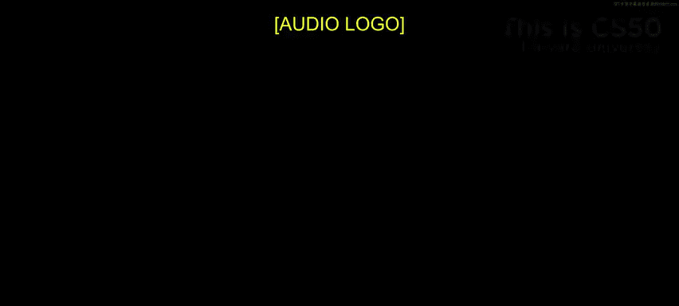
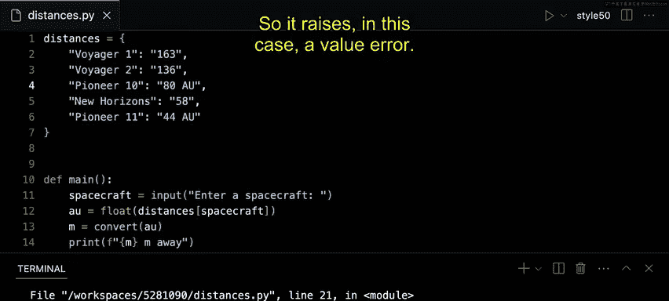
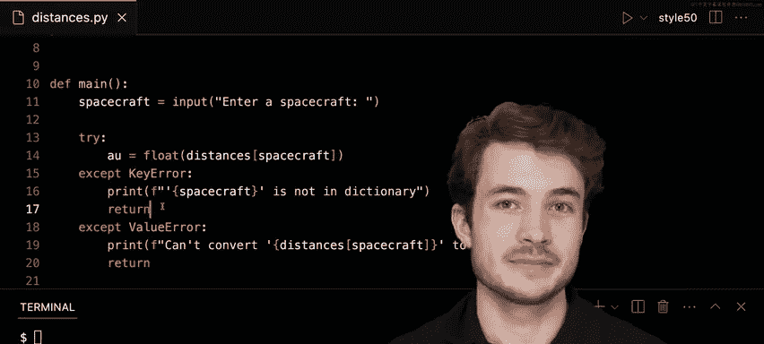

# 哈佛大学《CS50P shorts｜ Introduction to Programming with Python (CS50P) 2024 shorts》 - P8：-09-Handling Exceptions - CS50P Shorts.zh_en - GPT中英字幕课程资源 - BV1MS42197Vo

Well hello in and all and welcome to our short on handling exceptions Now when things go wrong in our programs。

 we can handle them and hopefully correct our program as it runs and I have here a program called distances do pi that I'll admit this little bit buggy Now what I hope distances do pi will do is take this dictionary of distances and actually convert each of them to meters when I ask for the distance of some given spacecraft so for instance I entered in Voyager 1 down here on line 11 I would hope to convert 163 here to meters and then print however many meters Voyager1 is away from Earth Now I use function called convert down here which simply takes some given number of AU astronomical units and converts it then to meters using this constant that converts between in this case AU and meters but I don't think my problem here is with convert。

upp here in Maine so let's go ahead and try this program out。

 I'll go ahead and run Python of distances。t pi and here I'll try to enter in Voyager1 and hopefully I should see the number of mes Voyager 1 is away from Earth。

I'll enter here and I seem to have gotten a memory error now why might this be the case Well。

 you might notice that Voyager 1 has a distance of 163 A U but this in particular is as written as a string。

 not a number and if I were to access this value 163 the string and pass it into convert well this star syntax means something else entirely from what it means with numbers when I take a string let's say the string 163 and multiply。

 let's say with this star operator by whatever this huge number is I'm essentially saying take this 163 as text and repeat it。

How many times this is down here which is more enough to kind of overflow the memory I have here in my computer and I don't want to be doing that down below so what should I do instead or we've seen these functions to convert between in this case text and numbers and you'll get messy data like this all the time so it's our job make sure we're getting the data we want to using functions like these here Well ideally I want to convert I want to convert let's say this text 163 or 136 into some number and I can use a function like float to do just that here I seem only to have integers but I can be more general and say let's just use floats I'll take maybe 163。

2 AU in the future for instance。So I'll take floatat here and I'll maybe first pass as input the value we hoped to get from our dictionary and I'll store that as a value called AU and I'll then convert the value of AU to meters in this case。

 so to be clear we're going to access the text 163 using this line of code here。

 we're going to convert it to a float using float and store that in the variable AU we' then convert AU to some number of meters and print that number of meters out down below。

I'll go ahead now and run Python of distances dot pi and I'll type in Voyager 1 again and now we'll see that Voyager 1 seems to be some very large number of meters away So that seems to work here but what still could go wrong Our data I would argue is still pretty messy if I look here at pioneer 10 I the text 80 A and that doesn't seem to be something that could convert to a float In fact let's try it。

 I'll type Python of distances dot pi and I'll type in pioneer 10 and。So here is our value error。

 we could not convert this string 80AU to a floatat， Python says how can A and U be a number。

 I don't quite know how to convert those， so it raises， in this case a value error。

So this is an exception that we can handle within our main function and in Python。

 the convention is simply try to do something and if things go wrong。

 handle the case where it doesn't go as expected so to try to handle this exception here。

 why don't we try using this block of code called try and accept block， as I said before。

 I can really just try to the thing I want to do， which is convert。

 let's say this distance to afloat and store it in this case in this variable called AAU but of course things can go wrong as we just saw before。

 and we should be mindful of how we handle the exception that could occur so if I want to make a new let's say handler a way of handling this exception。

 I can use an accept block here and I'll type accept which is a keyword in Python followed by the name of the exception that I think could happen and in this case we saw a。

errorSo I could within the invented block here， try to handle this value error maybe instead of showing the error to the user。

 I could maybe instead just print something a little more friendly。

 I could say maybe can't convert whatever the value we had here was distances spacecraft to a float just like this。

And then， because we can't really convert it to a float。

 I'll go ahead and end my program by callingReturn。

So let me separate this here for logics sake and style here I'm taking input and asking for in this case。

 let's say Pioneer 10 now we'll try to convert the value for Pioneer 10， which is 80AU to afloat。

 but in the case that we get a value error we' instead run this code indented within this block here and notch or the error to the user。

Let's try this year， I'll run Python of Diss。 pi， I'll type in pioneer 10 and we'll see we can't convert 80AU to aload and maybe first I。

 let me go ahead and put some single quotes around here just to do this。Pioneer。

and now it's clear that our string was 80AU， we couldn't convert that string to a float because of course it has AU for astronomical units inside of its value here。

So this is one exception we have handled thanks to try and accept。

 but often there might be more than one exception that could happen for any given line of code let's take a look at our line of code here inside of this try block What other things you think could go wrong with this line of code that could raise an exception？

What I have in my mind is that I have here five spacecraft。

 but what if I asked for one that wasn't on this list， would this code work or would it not。

 let's try it out， I'll say Python of Disances。 pi and maybe I'll enter in the James Webb Space Telescope which is not part of my dictionary up above。

 I'll go ahead and hit enter。And。Now I see another exception， one called a key error。

 which means I can't find this value James Webb's based telescope inside of my dictionary。

 or I can't find this key rather。So it turns out that this line of code could trigger a value error and a key error。

 depending on the input the user gives me， and if I want to handle those exceptions differently。

 I can certainly do that within this try and accept block。

 I can go ahead and add a new new block here to handle in this case， the key error we see down below。

So to be clear， when I put this line of code inside try。

 I'm kind of listening or waiting for being ready to handle any exceptions I might come across in this case。

 if those exceptions are a key error or a value error。

 I'll run the code indented in either of these blocks respectively。So if it's a key error。

 what could we tell the user， we would probably tell them that this spacecraft is just not in the dictionary。

 so I'll say here print and maybe can't maybe actually this type oh spacecraft。Spacecraft。

 whatever you typed in is not in dictionary， just like this。

 a bit of a more friendly message than the key error we saw down below。

 I'll similarly return saying my program is done if we can't find the spacecraft you're looking for and let's see what happens down below。

 I'll type Python of distances。 Pi， I'll then type in James Webbspace telescope hit En and we'll see that quote unquote James Webb's Space telescope is not in the dictionary。

So here we've created two handlers for these various exceptions that could be raised key errors and value errors Now you could if you wanted to try to handle all kinds of exceptions within one block。

 something like accept exception might work， but in general it's good practice be as specific with your exceptions as you possibly can it's good practice programmers actually know what kinds of exceptions could be raised as well in this case here there are really two kinds of exceptions that could happen here one of course was the value error and the other was the key error so as you write code try to anticipate these exceptions and hopefully write some code to handle when you might encounter those exceptions instead。

So this here was our short on handling exceptions， we'll see you next time。

