# 哈佛大学《CS50X Fall 2024 scratch》中英字幕（deepseek翻译 - P1：CS50 Fall 2024 - Lecture 0 - Scratch (live, .zh_en - GPT中英字幕课程资源 - BV1cWpgemEDo

All right。This is CS 50， Harvard University's introduction to the intellectual enterprisepris of computer science and the arts of programming。

 My name is David Main and actually took this class myself some years ago。

 but I almost didn't it was my first year in college and my roommates and I were living in Matthews Hall for those familiar Nice Matthews our claim to fame actually at the time was that our room was literally Matt Damons just three years prior。

 so onward from that but my first year I didn't really have the nerves to set foot in this classroom little on computer science。

 In fact for me computer science and CS50 in particular was very much this class to beware I was kind of comfortable with computers but I certainly wasn't among those more comfortable with computers and so I shied away my first year instead I actually took a whole lot of classes in government in fact in high school I was really enjoying history I loved this constitutional law class that I took my senior year of high school so I figured okay if that's what I liked in high school and that that's where my comfort zone。

Was that's probably what I should be doing in college。

 and so I essentially declared as my concentration or major government for the first year。

 year and a half of school。 but my sophomore year when I was living actually in Matherhouse instead。

😡， no one for math' in Matherhouse instead。 It was I sort of followed some friends。

 I think the first week of class in September of that year to a class called C S 50。 And honestly。

 like once I stepped foot in that classroom The professor at the time is a famous computer scientist by the name of Brian Knahan now at Princeton like I was hooked and literally would I go back thereafter on Friday evenings when at the time。

 problem sets were released and like sit down at like 78 PM on Friday nights and like dive into homework。

 which isn't necessarily something we recommend per se， But for me。

 it was like this sign that like wow， I've sort of found my calling。

 I found my classmates here on campus and that's not gonna be the case for everyone。

 Certainly we have no expectations that after taking one computer science class that you will or might want to take others。

 but what's so empowering about computer science and C S 50 in particular is it so applicable to the broader world。

 whether you're in the arts humanity， social sciences。

 natural sciences or beyond It's just so applicable。

ceptAnd the practical programming skills with which you will exit a class like this。

 Now it's gonna to be challenging along the way。 And indeed I put in my time back in the day。

 and even I did find it challenging And here， for instance。

 is a photograph of a very famous MIT hack so to speak from down the road whereby it communicates that getting an education from MIT is like trying to drink from a fire hose。

 which is to say there's gonna to be so much information like so much new stuff that certainly on any given day of the week。

 you're not going to be able to absorb all of it that first time around but at the end of the day。

 it's through that challenge putting the time in that the returns are therefore just so much higher at the end of the course。

 And indeed， will you walk out of the course with a much better understanding not only if computer science and programming but ultimately how to teach yourself new technologies and beyond for the next three plus months。

 well we have teaching fellows teaching assistant course assistants in myself by your side。

 sort of guiding you through the course's material but the goal by terms end is to take those。

And leave those training wheels off so that you're well equippedpped so sort of go teach yourself new and ideas beyond the class itself take comfort though and knowing that most CS50 students have never taken a CS course before and indeed as per the syllabus would ultimately matters in this course is not so much where you end up relative to your classmates but where you end up relative to yourself when you began and when you began is thus today and so consider just how comfortable or uncomfortable you are with computing。

 let alone computer science and programming， particularly if you've never explored either in a classroom before and consider the delta just a few months from now that will really describe how far you have come and that is all that matters not how much the student to the left to the right in front or behind you right now knows with that said。

 let me add some additional inspiration if I may here's a photograph of my own very first homework assignment in CS50 from 1996 and I will draw your attention to the fact that even though this is a so- calledled hellello。

😡，World program that will play with ourselves next week。

 It is pretty much literally the shortest easiest program you can write in a programming language called C。

 I still somehow got-2 on my very first homework assignment。

 which is to say we're all gonna make mistakes along the way。

 but the goal will be to learn and enjoy that process here on out the end of the day too like me。

 you'll exit with your own proudly held hight CS50 t-shirt as is our tradition too with that said。

 there' are so many other traditions within CS 50 both on campus and off and in particular。

 do we try in CSs50 to provide not only the academic support structure that you might want going through the class but also a collective shared community experience。

 which is to say in just a few days， we'll start off the term formally with CS50 puzzle day。

 which is not only an opportunity to get together with friends with pizza and prizes and also logic puzzles of sorts。

 but really to send the message the computer science itself is not about programming。

 It's not about C。😊。

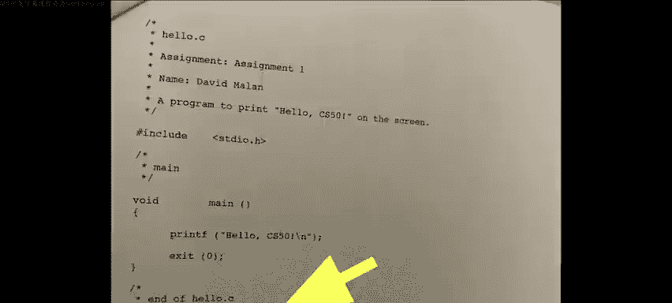

Not about Python， it's not about programming languages per se。

 but about problem solving ever more so collaboratively with other smart people by your site in this class or beyond and indeed for the end of the semester。

 reinforcements of the same by way of a little something that we call the CS50 hackathon。

 which will be an opportunity overnight to dive into your own final projects。

 the capstone of this course thereafter followed by the CS50 fair。

 which will be a campus- wide exhibition for students。

 faculty and staff across campus of your very own final projects be it your very own web app or mobile app or anything else you decide to create by terms end and indeed the sort of objective at the end of the day。

 truly with that final project in particular is going to be to create for yourel for your classmates for attendees。

 something that we didn't even teach you how to do and indeed that will signal ultimately that you're indeed on your way and ready。

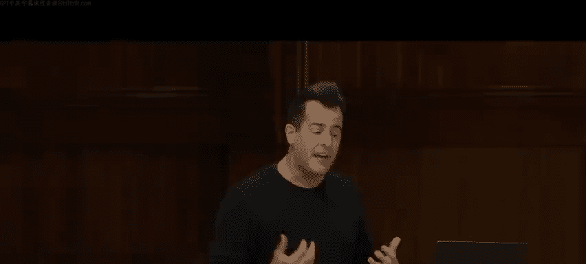

Toward that end， thought we would give you a sense of CS50's past by way of this short video if we could dim the light that paints a picture of all that awaits here and beyond。

🎼你是。🎼。

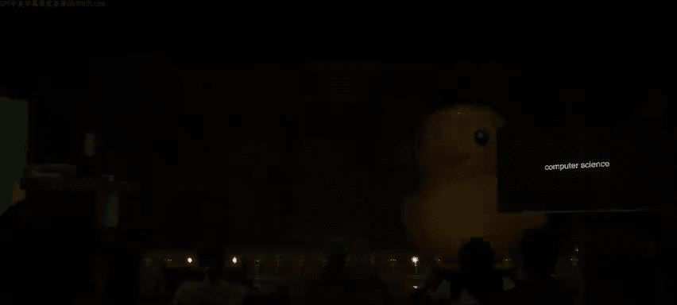

Al right， so welcome aboard to CSs 50 in computer science itself。 So what is computer science。 Well。

 put simply it's the study of information like how do you represent it and how do you process it。

 but more fundamentally， what we'll teach in this class is computational thinking。

 that is to say the application of ideas from computer science to problems of interest to us within the class and problems of interest to you after the class。

 And so at the end of the day， what computer science really is is about problem solving Ergo that sort of global applicability and by problem solving。

 we mean something quite simple。 In fact， we can distill it as follows with this mental image。

 this is problem solving， You've got some problem to solve thus known as the input that you want to solve。

 and the goal， of course， to problem solving is to actually produce a solution So the output in this model would be the solution。

 The interesting part ultimately is going be in how you process that input and turn it into that output Ergo solving problems But before we can do that we all kind of have to agree how to represent these。

😡，Inputs and outputs， especially if we want to do it in a standardized global way。

 using literally computers， be them laptops， desktops。

 phones or most any other kind of electronic device nowadays。 So how can we do that， Well。

 there's different ways to represent information in the world。 For instance。

 if I were to take attendance， old school style， maybe in a smaller room， I might do 1，2，3，4，5，6。

7 and so forth and just count people on my human hands。 That's actually known as uninary notation。

 otherwise mathematically known as base 1， because you're using your fingers literally in this model as digits。

 But little quick question， How high can you count with one human hand。

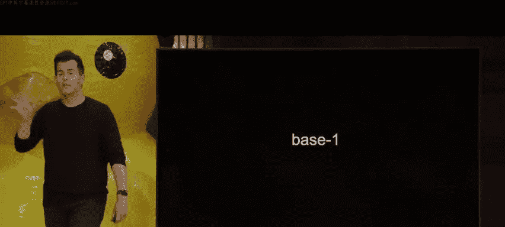

Five is incorrect if you use a different base system than one。

 so it's obviously correct if you're just using unary and just counting1，2，3，4，5。

 but I dare say I can come up with more patterns in my human hand alone that would enable me without a secondhand or a couple of feet to count higher than five In fact。

 maybe for those more comfortable， how high could you actually count on a single human hand perhaps。

😡，So 31， believe it or not， is in fact the correct answer。

 but why Well here I initially started pretty naively 1，2，3，4，5。

 and I just kind of combined all of my fingers and counted the collective total。

 but what if I'm a little more clever and take into account the pattern of fingers that go up so maybe this is still zero this is one but now maybe we just agree universally that this is two。

 even though it's just my single pointer finger， maybe we all just agree that this is three with two fingers up。

 maybe we agree that this is often offensive with just one middle finger up。

 but this would then be four， this could then be5， this could then be six。

 this could be7 and if I keep permuting my fingers in this way， allow me to spoil it。

 this would be in fact 31 but again why but the difference here is that we're no longer using unary or base one as mathematician would say but rather base  two because if we take into account not just the total number of fingers that I'm using。

 but whether each finger。😡，Is down or up being therefore in two potential states。

 down up a B black white， however you want to distinguish those two states of the world。

 you're now operating what's called base2 and perhaps more familiarly。

 even if you're not a computer person per se， this is the so-called binary system and odds are even if you're not a computer science person at all。

 you probably generally know the computers only understand or speak what alphabet so to speak。😡。

So with ones and zero， zeros in ones， otherwise known as the binary system。 And in fact。

 there's a term of art here that's worth noting when you're using zeros and ones， which， of course。

 are a total of two digits， you have binary digits。 So to speak by implying two。

 which means there's two possibilities，0 or1 if we actually get rid of some of these letters。

 and then join these two phrases here you have a technical term that is a bit。

 a bit is just a binary digit， which is to say it's a0 or one。 And this is in contrast， of course。

 with the system you and I know as the decimal system deck implying 10， because in the real world。

 you and I daily use 0 through 9， which is 10 possibilities， computers only use 0 in one。

 that is to say two bits to represent information instead。 So how do we represent this information。

 especially when at the end of the day， what we're using are indeed computers and electronic devices。

 Well， if I want to represent0， I can actually think of this as kind of analogous to the physical world。

 maybe I have a light bulb thats。O on controlled by a switch that turns it off or on so you can think of a binary digit that is a0 as really just being a light bulb that is off by contrast。

 if you think of a one in the digital world as of course， being the second of two possibilities。

 you can think of that in the human or analog world。

 the physical world as being a light bulb that is on and in fact， what's inside of your Mac， your PC。

 your Android phone， your iPhone are millions of tiny little light switches known as transistors that just can be turned on or off on or off and essentially you can use those transistors to store information。

 because if you want to store a0， you turn one of those switches off if you want to store a one。

 you turn one of those switches on of course that sort of invites the question， well。

 how do we count higher than zero or one， well we would seem to need to use more than just maybe a single bit a single light bulb。

 So if we want it to count higher than for instance， zero or one， why don't we go ahead and maybe。

This。 So just so I have some place to put these。 Let me borrow some of our actual physical light bulbs here from the stage。

 and let me propose that now with three bits on the stage 3 light switches  three transistors。

 whatever metaphor you're most comfortable with。 This is how a computer would represent a0。

 Because all of them are off So it's off off off But if a computer wanted to count to one。

 we could do naively this， we could turn this on。 And if a computer wanted to turn represent two。

 we could do this。 And if a computer wanted to represent three， we could do this。

 But I'm kind of painting myself into a corner and not using these light bulbs as cleverly as I could。

 because at the moment， I've only counted as high as3。 So if I want to count to4 to5 to 6。

 I'm gonna need more and more light bulbs， can we be a little more clever Well， again。

 someone else whos among those more comfortable， what's the spoiler here。

 How high using binary zeros and ones， could I count with three。Light bulbs total on back。😡，Yeah。

So7 here is the answer。 And if that too， you're sort of wondering。

 why are people figuring out 31 and 7， That's the goal at hand here。 So let me do this。

 Let me turn all of these off again so that my three light bulbs or switches。😡，Again， represent0。

 And the first ones easy。 This is how a computer would represent the number one。

 It would be it would be on off off how though， is a computer gonna represent 2， Well。

 just like my proposed finger example， Let's do this。 Let's turn this one off and this one on。

 That is how a computer would represent 2， by saying off on off In other words，0，1。

0 would be the way to pronounce it digitally。 What if I instead want to represent 3。

 That's how on my finger， I did this with two fingers。 Well， I'm gonna turn this one on This is3。

 Now， this will， for those less comfortable， it would be non obvious。

 This now is how I would represent the number。4our。This is how I would represent 5。

 This is how I would represent 6。 and this as per the spoiler is how I would represent 7。

 So perhaps very nonobous， what it was I just did or why I chose those patterns。

 But I dare say if you sort of rewind in your mind's eye or literally later on video。

 you'll find that I actually did show you8 distinct patterns of light bulbs。

 The first one was off off off。 The last one was on on on。

 And there were another six total in between then。 Well， wait， why 7， Well。

 if you start counting it 0， And I claim there's 8 possibilities， you can only count from 0 to 7。

 as we will soon see。 So how are these patterns coming about。

 And what is it that our computers are actually doing。 Well。

 it's actually doing something a little like this quite like in decimal。 So in the human world。

 you and I are very much in the habit of using base 10，0 through 9 Aka decimal。 Well。

 how do we use it instinctively as humans。 Well， what's this number obvious。on the screen。

Hundred and23。 But why is it123。 Like for years， you haven't really thought about why this pattern of symbols or digits on the screen 1。

2，3 represents mathematically this number that you know， obviously it's 123。

 But if you rewind to grade school， odds are like me you were taught that the rightmost digit is in the ones column。

 this second digit is in the1s column， this digit is in the hundreds column and so forth。

 So even though none of us have to do this math explicitly。

 what you're instantly doing is 100 times1 plus 10 times2 plus1 times3。

 which gives you 100 plus 20 plus 3， Oh that's why it is 1023。

 because these digits in this order have that significance。

 the digits to the left have more weight so to speak than the digits to the right。

 So what can we take away from this。 Well let's generalize it first。

 It's just any three digit number。 So number number number， the one's column。

 the tens column the hundreds column But there's some math going on there and it's not particularly。

Sophisticated， those are actually powers of 10。 So 10 to the 0，10 to the 1。

10 to the two and there's your decimal system because the base in this value is a 10。

 that's because there's 10 possibilities for each of those placeholders0 through 9。

 but in the binary world and the world of computers where all they have are zeros and ones y。

 because all they have physically is transistors， tiny， tiny， tiny light bulbs that can be offer on。

 if you only have two digits to play with the 10 base should of course become a two base。

 And now if we do some math here，2 to the0，2 to the one and  two to the two， you get the ones column。

 the two's column， the fours column。 And if we keep going 8， 16，32，64，128 and so forth。

 it's powers of two instead of powers of 10。 But this is to say computers represent information in exactly the same way you and I have since childhood。

 but they have fewer digits at their disposal。 So these columns need to be。differently。

 so we can still count from 0 all the way up toward infinity。 So what does this mean， Well。

 here we have3 bits on the screen，0，0，0。 If we were to convert this now mentally or on paper pencil to decimal。

 how do we do it， Well，4 times 0 plus  two times 0 plus one times 0。

 That gives us the mathematical number you and I know as 0。 That was  three light bulbs off off off。

Well， what if we turn on one light bulb all the way on the right。

 what decimal number does this binary number， 001 represent？😡，Just one because it's four times 0。

2 times 0，1 times 1， here's where things got more interesting。

 even if non obvious in light bulb form or even physical hand form，0，1。

0 in binary is what in decimal。😡，2， because it's  two times 1， and that's it。0，1，1 in binary。

 of course， now3。 This is now 4。 This is now 5。 This is now 6 and 7 on on on or 1，1。

1 is the highest we can count with these three bits。 All right。

 so how might a computer intuitively count as high as 8。😡，What do you need to do presumably？

You can need to add a bit so you need another light bulb。

 another switch you need more memory so to speak to use nomenclature with which you're probably familiar。

 So in fact， if we change all of those to0， but we give ourselves one more bit for a total of4 that's got to be the8 place because it's just another power of two so 1000 is the decimal number 8 you don't say 1000 in binary you literally say 1000 but that is the number you and I know as8 and you can keep going up and up and up and how then computers with Excel or any kind of number crunching software count really high and keep track of really big numbers。

 the computer just throws more and more transistors at it more and more bits to count higher and higher and higher than this。

 turns out the one bit3 bits even 4 bits aren't that useful in practice because like literally you can count as high as7 or maybe 15 or 31 so more commonly is commonly known is to use a byte of bits instead。

😡，How many bits is't a byte for those familiar。 So it's just8， Y 8s。

 It's just more useful than one or two or three or some other number。 And as an aside。

 it happens to be a power of two， which is just useful electronically as well。

 So a byte then is just 8 bits。 And here are those columns I rattled off off the top of my head。

 Here is how a computer would represent 0 in decimal， but using 8 binary digits or bits。

 little trivia。 And again， this is not what computer science is about。

 but it helps to sort of know sort of the lower bounds and the upper bounds of these kinds of values。

 How high can you count with 8 Bs or1 by。 If this is0。Yeah， so it's actually 255。

 So if I were to change all of these zeros to ones and then do some quick mental or calculator math。

1 28 plus 64 plus 32，16，8，4，2， and1 would actually give me 255 total plus 0。

 which gives me 256 total possibilities。 So this is only to say this is not， again。

 the kind of math will frequently do。 But you'll commonly see in the computer world and programming world。

 powers of two numbers like 2，55，2，56 y， because these are the common units of measures that systems tend to use。

So let me pause here and see with respect to binary， zeros， ones， transistors and the like。

 any questions。Or confusion， we can clear up。A really good question。

 Why are bits just on or off instead of maybe sort of 0%，50%，100% by playing with voltages。

 So the voltage inference of yours is actually correct。 That's what computers typically do。

 maybe they use  zero ish volts to represent 0， maybe 5ish volts to represent to represent one。

 it turns out it's just really easy to do extremes and computers。

 If you start to split that range of voltage levels for those who remember any of their electricity。

 it just gets harder and harder to be exact。 And if you get things a little too murky。

 you might mistake a0 for a one or a two or a3。 So it turns out it's just simpler to use the binary system。

 but there do exist computers known as turnernary computers that actually use three values，0，1 and 2。

 which is somewhere of course， between binary and decimal。 but you can do different things。

 It's just simple on and off in case in point， I don't want to really be dramatic and turn off my computer。

 But if I pulled out the power plug that could be off literally aka。plug it back in， that's a one。

 there's just a cleanliness and simplicity to that。😡，Other questions or confusion。

That we can clear up。 okay， so if， if you're in agreement for the moment that okay。

 using just zeros and ones， we can represent any number we want from 0 on up。

 Let me propose that we do more useful things with our computers in our pockets and desktops and Las。

 like represent letters for the sake of Google Docs。

 Microsoft Word or any kind of text text that we might want to write。

 So knowing now that computers only contain or only use zeros and ones and therefore only contain hardware like transistors。

 How could you represent something like a capital letter A in English inside of a computer。Which。

 of course， is not a number anymore。Like， what could we do yeah？So。Okay yes。

 so we could take the alphabet A through Z in English and we could just assign each letter a number and honestly that is not only the correct answer。

 it's really the only answer because at the end of the day。

 if all you have are 0s and ones available to you， that is the entirety of the potential solution to this problem so it turns out that yes。

 capital letter A some years ago was decided to buy a bunch of people in a room shall be represented with this pattern of zeros and ones。

01，0，0，0，0，01 and now trained as you are to do a bit of quick binary math。

 what decimal number is used to represent apparently capital A。😡。

So 65 because' 64 plus1 plus1 times 1 is 65。 What is B turns out at 66。 What is C 67。

 So they kept things simple there on out might have been nice if a were0 or maybe a were one。

 but nope we're stuck with 65 instead but everything after that is very much predictable and in fact。

 for lowercases there's a whole other set of numbers such as lowercase A happens to be 97 lowercase B happens to be 98 and so forth。

 but again， this is sort of like Cs trivia， but what's important here is that they're indeed contiguous from 65 to 66 to 67 on up。

 That's something we're going to be able to leverage beyond the letter A alone。 What is this system。

 what is this mapping that you yourself proposed， it's ASI the American standard code for information interchange and indeed it was a bunch of Americans years ago who came up with this system。

 Unfortunately at the time， they only allocated 7 and eventually 8 bits total4 representing。Letters。

 both uppercase and lowercase， numbers on the keyboard as well， punctuation symbols as well。

 And so per our conversation a moment ago， if the Americans in this room， so to speak。

 only used8 bits total， how many different characters can we represent with a computer in this story。

😡，So only 255， technically 256， if we again start counting from0。 So that's not nearly enough。

 but it to represent all human languages， but it is enough to represent at least English among some others。

 So here， for instance， is a chart of the ASI mapping。 And sure enough。

 if we zoom in on like this column here，65 is capital A 66 is capital B dot dot dot 72 is H 73 is I and so forth。

 So there is a standardized mapping for at least all of these English letters。

 Well suppose you were to receive an email or a text message or like a Google doc containing this pattern of zeros in1s。

 So 0，10，0，1，000 and so forth and so forth。 So3 bysworth。3 sets of 8 bits。 that is to say3 Bs。😡。

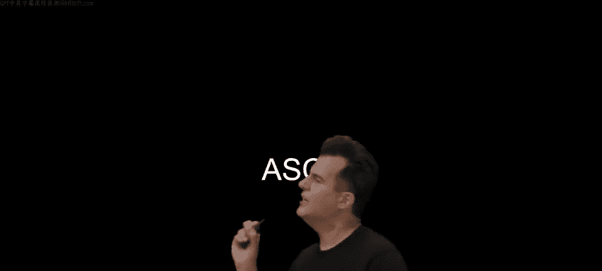

Each of which represents a single letter in ASCI。😡，What message have you received， Well。

 I'll do the math this time， so we don't have to suppose what you really received was decimal 72，73。

33。 What message did you just receive。😡，If you recall the previous chart hi was in fact。

 correct why because H is 72 I is 73 and wait a minute 33。 So here's H here's I 33。

 if we highlight it instead happens to be an exclamation point。

 So like that is literally what is going on underneath the hood so to speak when you get a text message today that literally says in all caps and an exclamation point。

 hi your phone has received at least three bys， each of which represents a letter of the alphabet。

 your computer is quickly doing the mental math to figure out exactly what numbers those are and then looking up in the so-called ASI chart in its memories in some sense。

 what letter should you actually see on the screen there And so if you were to then display that message。

 you would see it indeed in English as opposed to those numeric equivalents。😡。

How else might we use this then， Well， here again is that chart and maybe just to vary things。

 maybe take a little pressure off of me here。 Why don't we try spelling something else this time。

 a different three letter word， but maybe 8 volunteers could we get a bite's worth of volunteers。

 and I can sweeten the deal with some stress balls in exchange。

 You just have to be comfortable coming up on stage and being on the Internet。 So yes， one，2。

 about 3，4， about 5，6，7 and have about 8 come on up a round of applause for our volunteers。😊。

All right， so what I'm going to have each of you do is represent a bit in a particular order。

 so if you want to just in any order， line yourselves up here facing the audience。😡，Come on over。

All right， and we will have you wrappers well， we' got to see who ends up where sc this way a little bit。

 this way， this way， Allright， so you shall be the one's place and just hold that in front of you。

 chooses place。😊，Three fours place。It's place。16。32。

64 and 128 and just compress yourselves a little bit if you could。

 so each of these folks represents a bit in a particular place and let's say this if you're just standing there sort of uncomfortably without any hand raised we'll assume that you're representing a zero quite simply if your hand goes up though the audience should assume that you're representing a one and therefore what we'll do is spell out a three- letter word and on each round of this。

 you'll either stay like this or you'll raise your hand But first let's actually meet some of our volunteers here starting with position number one。

 if you'd like to say your name， perhaps where you're from and or studying Hi my name is Brooke I'm from Indiana and I'm studying biology and computer science。

😡，Nice， welcome。Hi， I'm Becca， I'm from Maryland， DC area， and I'm studying electrical engineering。😊。

Welcome。Lenjaer。Hi， I'm Sharon， I'm from Rwanda， and I'm studying CSN Math。Hi， I'm Grace。

 I'm from Alabama and I'm studying electrical engineering。Welcome， Hi， I'm Angelina。

 I'm from Maryland。 And also， I say in Matthews。 Nice and nice。😊。

And I'm studying App math and econ as well as fire science and public policy。😊。

I'm Owen Bells and I'm from Royal Virginia and I'm studying CS。 Nice welcome man。And my name is Max。

 I'm from London， I almost staying in Matthews and I'm studying computer science and neuroscience。

 welcome A as well。 If you're wondering why I was wearing these glasses at the start。

 So very common on the Internet nowadays as these POV videos。

 So it turns out these ray bands actually record video footage and we have a couple of them。

 and we thought we'd offer them to a couple of volunteers。

 if every wants to record their point of view for everyone here and Vlad here is going help make sure they're recording Second volunteer。

 yes number two。 All right So as Vlad gets those set on the backs of your pieces of paper。

 you have instructions for the following three rounds each round represents a letter。

 The audience participation part of this is to actually do the mental math to figure out what number these volunteers are representing so。

😊，Go ahead and execute round one， either keeping your hand down or raising it appropriately。Okay。

 what number are our volunteers here representing？66。

 because we have a 64 plus a 2 that then maps to what ASCI letter？😡，B was the first letter， okay。

 hands down， round two， go。😡，Little harder。 What's now being represented。I'm starting to hear it。

79 is in fact， correct， 79 because we have a 64 and an 8 and a4 and a two and a one。 So if it's a 79。

 we have the ASI letter。😡，Oh， okay， so we've got BO and then lastly third round go。We have 0，1，0，1，0。

1，1，1。What number is this？87， which spells in the letter。W， which spells the word。Not bow。

 take a bow if you could， all right， a round of applause for our volunteers here。

And come on off this way。And help yourself to a C50 stress ball。 So this is to say。

 if you can hand those of lad on the way out。 We only need the glasses back。

 Thank you to our volunteer。 So this is only to say we've now agreed on how we can represent numbers from0 on up。

 We've agreed on how we can represent letters。 but at least letters using ASciI。 and in fact。

 these are more than just decoration， in fact， is a little bit of trivia by lectures end if you want to come up for your very own C50 stress turns out there's 64 light bulbs at the foot of the stage here。

 if you them down into 8 by or single8 bit or single by chunks。

 There's an8 letter word that happens to be spelled out today using this here ASI chart。

 So today's mystery is what exactly is that their word。 But of course。

 if you have only 8 bit can only represent like 256 characters， which sounds like plenty for English。

 And indeed， it is0 through 9 a through B capital and lower uppercase and lowercase as well as punctuation。

 But there's so many other human。😊，Languages in the world that have other characters。 For instance。

 we have not just the English alphabet。 we might see here on a US English keyboard。

 We have accented characters。 We have various Asian languages have even many more glyphs。

 we need more than 256 possible characters。 And so nowadays。

 computers do not just use 7 or even 8 Bs， they might use 8 bit for some letters like all of the English letters。

 they might use 16 bits for certain other languages， maybe even 24 or 32 bits。 And fun fact。

 if you have 32 B。 and we have more than that on the stage。 If you've got 32 Bs。

 you can actually represent as many as 4 billion possible characters， which is quite a bit。

 No pun intended。 So what else can we represent。 Well， the goal of this system。

 not just ASI but something known as unIode， which is a newer standard is to be backwards compatible with ASI。

 So humans left all of those other numbers alone，65，66，67 and so forth。 But they added to it a super。

Of representations that maybe are 16，24 or 32 bits。

 The goal being to be able digitally to represent all human languages， past， present and future。

 and even through pictograms， things like sly faces and the like。

 even people places things in emotions that transcend human language and in fact。

 odds are within the past few minutes or hours， most of you have used one or more of these here emoji。

 these pictograms， which it turns out are just characters on a keyboard。

 you might have to hit a special button to pull up that form of the keyboard。

 but these are just here， characters， And so these emoji have exploded in popularity for a number of reasons。

 one of which is， my God， what are we going to do with4 billion possible patterns of zeros and ones。

 we can start to kind of have some fun with it and represent things beyond English and human languages alone Now as an aside。

 when it comes to Uniiccode， it turns out Uniiccode years ago， standardized this pattern of 32。

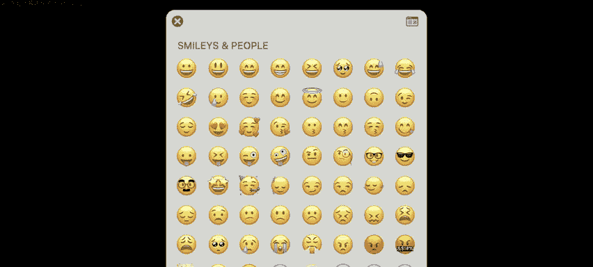

Zeros and ones to represent just one of those emoji。 So emoji tend to use even more bits here。

 Anyone know what decimal number this is， this is not a fun mathematical exercise。

 The spoiler is 4 billion36991，106 is the decimal number that actually represents as of present the most popular emoji in the world。

😡，Does anyone want to hazard to guess what emoji this here number represents？😡，快点。

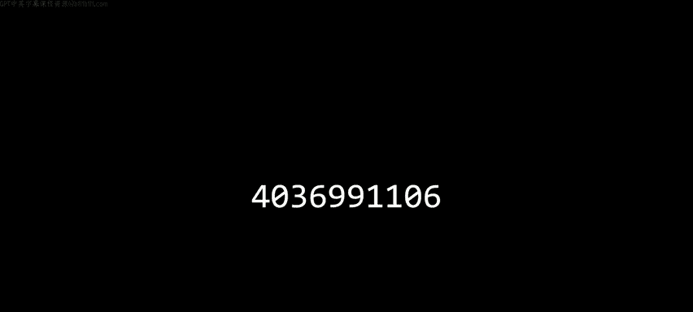

Which other emoji come to mind？

Hears hearts no， but it's actually this so-called face with tears of joy so perhaps think about the frequency that you send that one and even though it's obviously a picture on the screen sure it actually is more like a font because underneath the hood it's indeed just a pattern of zeros and ones or decimal number that the computer is storing but the computer be it Mac or Windows or iOS or Android no to display that pattern as this here picture but the pictures might look different depending on the hardware why because there's companies like Google and Microsoft and meta and others that have their own artists on staff as employees and those artists interpret the descriptions like face with tiers of joy differently so those of you with an Android phone actually see face with tiers of joy looking a little something like this and if you have telegram for instance installed on your phone it's even more animated than that it's this here emoji using the same pattern of zeros and ones so different artists render these here emoji in different ways but all。

😡，They are here are patterns Now for all of the other answers。

 save one that was shouted out a moment ago， this is a sort of cloud diagram of the most popular emoji as of a couple of years ago per Uniicode whereby the size of the emoji indicates its relative popularity。

 So heart I did here over here is indeed one of the most popular ones as well question。😡。

A really good question。 Why do certain emoji not show up on one device or another。

 It depends on how recent the software is pretty much every year。

 the humans behind the Uniode consortium release new emoji。

 which is to say they decide that this other pattern will represent this new emoji。

 this other pattern will represent this new emoji。 And unless you update your phone。

 your laptop your desktop to the very latest software and the manufacturer of that device or software。

 also update by hiring an artist to draw those pictures in their own font in their own style。

 you're going to see usually just like an empty black square or maybe just like a black and white heart instead of something more colorful。

 really just placeholders because it's as though you don't have the right font installed。

 or really you have an older version of that same font installed。

 but it's become sort of an annual tradition that new and emoji or released every year。

 which is among the reasons why these updates contain more and more yeah。😡，That is an amazing segue。

 How do you represent color。In bytes， Well， you use RGB。

 which happens to be by coincidence the next slide。 So let's again recap。

 we know how to represent letters。 We know how to represent numbers。 We can even represent emoji。

 but those emoji technically on the screen are， of course， composed of colors。

 like a whole bunch of yellow for that they smiley face。

 how do computers then using only zeros in ones represent colors。 Well by convention。

 they typically use a system that by an acronym is called RGB red， green blue。

 And this is to say that a computer to represent a single dot on the screen。 maybe this one。

 This one， This one will allocate some number of bits or some number of bys to represent the color of just that their dot。

 otherwise known as a pixel。 you can actually see pixels on your phone or even on your TV or monitor。

 if you go really close， especially if it's an older monitor， you can see the tiny little squares。

 Each of those has some number of bits telling the device what color to use in particular。

 these devices typically use three numbers in total，3。So that is to say 24 Bs per pixel。

 And they do this。 If you were to represent a single dot on the screen using these three numbers。

 just by intent here， this is 72，73，33， which in the context of a text message and email Google doc represents。

 of course， high textually， What if a computer uses that same pattern of zeros and ones that is the same pattern of decimal digits to represent the color on a screen。

 which is germane if you're opening image using photoshops。

 So using a different piece of software that knows about colors and images and not just text。 Well。

 this would imply that you want that dot on the screen to have like a medium amount of red。

 a medium amount of green and a little bit of blue。 Why do I see medium and little Well， again。

 if each of these numbers is using 8 bit or one by the highest we can count as we discovered was 255。

 So I'm kind of averaging here。 So 72 at a 255 feels to me like a medium amount of red。

33 feels like relatively little blue。But if now the computer combines those wavelengths of light。

 so to speak， a medium amount of red， medium amount of green， a little bit of blue。

 What you get is the color code for a single dot。 And does anyone want to guess what color roughly this represents。

These three bytes。Nott white， not purple。KNott brown。Yellow， in fact， is the answer。

 So it represents in a single pixel， roughly this shade here of yellow。

 which is to say if we look back at any of those emoji。

 which again are represented by patterns of zeros and ones。

 But you and I assume humans perceive them as images on the screen。

 let me actually go ahead and zoom and zoom in further to one such sample emoji。

 And when you zoom in far enough， or you put the phone close enough to your face。

 you can actually see all of those little dots known as pixels， all of the little squares。

 And given that so many of these pixels are yellow， that is to say that that pattern of three bys，72。

73，33 is used to represent this pixel， another three identical bytes are used to represent this pixel。

 this one， this one and so forth。 So now if you've taken digital photos on your phone or a camera。

 you're probably generally familiar from the Internet and hardware today。

 that a photograph is what like 1 me，10 mes depending on the resolution of it。 Well。

 megaby means millions of bytes。Where are all of these bytes inside of these photographs or these images you're taking or downloading。

 They correspond to every one of the single pixels on the screen。

 There's at least three Bs being used to represent every one of those dots。 As an aside。

 bit of a white lie， because nowadays there's fancy compression software that can use fewer than that many bytes。

 But in general， that's where all of those bytes， those millions of bytes are coming from。

So how is that for an answer to how do we represent colors。 Thank you。

 So if we agreed now that there's this way and perhaps others to represent colors， Well。

 how do we represent not just images， but videos。 Well， videos， you know。

 once upon a time or movies were called motion pictures。 So most pictures with motion。 Why is that。

 Well， it's analogous to growing up。 if you ever played with one of these picture books。 And in fact。

 there's memes nowadays that have made these popular again。

 whereby you have a whole bunch of images on individual sheets of paper。

 And if you flip through them fast enough， your human mind and eyes perceive it as actual motion。

 even though you're just seeing image image， image， image image image， but it's so fast。

 It looks like motion。 That's all a video is on your screen， That's all a film is on your TV。

 It is not， in fact， continuous motion， It's maybe 30 frames or images per second。

 maybe 24 frames or images per second， which is to say， we know how to represent numbers。😊。

I represent letters。 We know how to represent colors and those images。 Now。

 we kind of get videos for free because it's just more of the same。

 Use more and more of those patterns。 Why are videos so darn large。

 Why are they gigabys to download billions of bytes Because there's so many darn images。

30 some odd images per second in those kinds of videos， And maybe lastly。

 just to top off our multimedia， How could we represent sound。Maybe musicians in the room。

How using only zeros and ones could you represent something as sonorris's music。

Something analog as digital， yeah。Yeah， so each number that we store in the computer could correspond to a certain frequency。

 which has a direct relationship to the sound or the pitch of a note。 For instance。

 in the world of piano and many other instruments， you've got like your A your B， your C。

 maybe you have sharps and flats as well。 we could just agree like the ASCI people did years ago to represent the musical note A let's use this pattern。

 musical note a sharp， let's use this pattern and so forth。

 but maybe pitch alone or frequency alone is not enough， maybe we need that number。

 but maybe a second number for the volume， the sort of digital equivalent of how hard are you hitting the key on the piano。

 maybe a third number for how long are you holding the key down。

 So maybe the pitch and the volume and the duration kind of like RGB。

 we could use three Bte to represent every musical note in some piece。

 And if we want to keep track of what instrument should be played by the computer to sound that music Well。

 maybe that's just a fourth byte or something else as well。 which is to say at the end of the。Today。

 all we have are these zeros and ones to throw at the problem。So for now。

 that's it for representing information。 We've got our numbers。 We've got our letters。

 We've got our image colors and images， our videos and now sound。

 Any questions on how computers then are representing as promised those inputs and outputs。

Using just zeros and ones。 Yeah， in the middle。刚才。Correct。

 so the computer is taking as input at the end of the day。

 zeros and ones and is outputting zeros and ones， however。

 as we'll learn in this class by writing software by writing code that understands those zeros and ones。

 we will enjoy not just literally seeing zeros and ones。

 we will see AB we will see colors we will see video。

 we will hear sounds so long as we write the code to interpret those zeros and ones and indeed it's worth noting now that that same pattern I keep using for an example。

72，73，33， how does a computer know is that the message high， is that the color yellow。

 is it a dot in a video alone just depends on the context。

 simply put if you're opening that pattern of zeros and ones with like Excel or a calculator program。

 odds are the software will interpret those three bytes as numbers of course if though you open that same pattern in a text messaging program Google docs。

 Microsoft word that same pattern will be interpret it as a sequence of letters instead。

 if you open Photoshop， that same pattern， you'll probably see a single。😡。

Dot that happens to be yellow conversely， once you yourself are a programmer or even better programmer。

 you will be able to write in code how you want the computer to treat these patterns of zeros and ones。

 you can essentially tell the computer use this to store a number or a letter or a color or something else that's the power the programmer themselves have at the end of the day。

😡，Other questions。On representing things with bits。Now， all right， so lastly。

 then in this middle of this black box。 so to speak。

 is the sort of secret sauce that solves problems that converts those inputs to outputs。

 those problems to solutions。 So what is an algorithm。

 It's really just step by step instructions for solving some problem。 And， in fact， it's， it's the。😊。

An algorithm is step by step instructions for solving some problem。

 and indeed I think back to my own first time in CS 50 where we learned the same from Professor Brian Knahan。

 and as luck would have it， just had my 25th reunion where we pulled some video footage from 1996 and so we're actually fortunate to have the very first few minutes of CS 50 over 25 years ago。

 when I myself took it， but the lessons back then as today are fundamentally the same and what's important indeed is to not only express yourself correctly but precisely as we'll explore today this then is Professor Brian Knahan。

 who years ago， very memorably introduced us and my classmates to algorithms by actually in class。😡。

Shaving his beard if we could dim the lights here for Brian。

The other thing that we're going to talk about in this class is the notion of an algorithm。

algorithm is a very precise description of how to do something。

 And the operative word there is precise。 It has to be very， very， very， very precise。

 And the task that I am going to do is that I'm going to trim my beard， which has gotten out of。Wack。

And I brought a variety of things which one might use。T。Beards。With。All right。

 so suffice it to say I don't have much of a beard。

 but I do have this here other technology known once upon a time as a phone book and these phone books of course have lots of information in them happen to be storing numbers and letters in particular for those unfamiliar they are storing humans' names from A to Z here in English and associated with everyone's name is a number So even if you've never had occasion to physically used this kind of device turns out it's pretty much equivalent see the contacts or the addressbook app on your i phone or your Android phone as well why because if you pull up your contacts。

 of course you see some familiar names here alphabetized by first name or last name and if you click on any of those names。

 you reach the person you're presumably trying to call or text picture here then is John Harvards whose number here is plus 19494682750 which you're welcome to call or text at your leisure but here is John Harvard that's partway through the phone book digitally Well it turns out that physically in the phone book we might use an algorithm step by step instructions for finding John Harvard in pretty much the same way。

As iOS， Android， Mac O Windows or other operating systems themselves use。

 so I could when looking for John Harvard's first name starting with J。

 I could start at the beginning of the phone book and start looking page by page by page for John Harvard interviews there I can call。

 This is an algorithm。 It's indeed step by step。 but that was a bug。's a few pages turned。

 but is this algorithm correct。Step by step， assuming I'm paying attention。So yes。

 like if John Harvard is in here， I will eventually find him once I get to the J section。

 Now this is a little tedious， it's gonna to take like a while a few dozen few hundred pages。

 so maybe I could do things a little smarter from grade school like 2，4，6，8，10，12，14，16 and so forth。

 going twice as fast。 Is that algorithm correct。😡，So no， but why？

I could miss him I could just get unlucky really with 5050 probability because John Harvard could be sandwiched between two pages。

 Now， this isn't a complete loss this algorithm。 maybe what I could do is if I get past the J section to like K I could double back at least one page just to make sure I didn't miss John Harvard。

 So I can still go twice as fast plus an extra step just to make sure I didn't mess up。

 So the first algorithm might take as many pages as there are in the phone book。

 So if this phone book has 100 pages in the worst case。 if I'm not looking for John Harvard。

 but someone whose name starts with Z might take me1000 pages to actually get there second algorithm twice as fast literally might take me 500 plus one step to get there because I'm going two at a time。

 so long as I indeed fix that bug。 But what we used to do back in the day。

 and what your phone is doing today albeit' be a digitally is going roughly to the middle of the phone book looking down and realizing oh。

 I'm accidentally in the M section。 So halfway through the phone book。 But what do I now。

About john hav is he to the left or to the right。So he's obviously to the left because J becomes before M。

 So what I can do literally and what your computer does figuratively is tear the problem in half。

 throw half of the problem away， leaving us now with the same fundamental problem。

 but it's half as big。 So I've gone from 1000 pages suddenly to 500 pages and compare this to the other two1000 pages。

999，998 versus 1000 pages，998，996，994。 That's still slow。

 I went from 1000 to 500 in just one step of this algorithm。 What do I do next。

 I go roughly to the middle here。 Oh， I went a little too far。 I'm in the e section now。

 So is John Harvard to the left or right now。😡，So he's to the right。

 So I can again tear the problem in half， throw the left half away。

 knowing now that John Harvard must alphabetically be in here。

 and I can divide and divide and divide and conquer this problem again and again by using that heuristic of going left or going right。

 And I dare say if I do this correctly， I'll eventually be left with one single page on which John Harvard's number actually is or maybe he's not in the phone book at all。

 So how many steps maximally might that third and final algorithm take。 It's not 1000。

 It's not even 500 or 501。 How many times can you divide000 pages in half again and again and again。

😡，Roughly。It9，10。 so typically 10 times give or take。

 there's a bit of rounding there because it's not a perfect power of two。

 but roughly 10 times like that is fundamentally better than both of the two algorithms。

 because I go from 1000 pages to 500 to 250 to 125 and so forth literally having the problem again and again So we can actually appreciate and see this even more so graphically。

 And this is among the things we'll do later in the term when we speak to not only writing correct code。

 but is your code well designed， I it better than your previous code。

 I it better than someone else's code， I it better than some other product。

 if you have given more thought to the algorithms and the quality thereof。

 you can perhaps minimize the time required to solve problems， but no less correctly。

 So if we have a simple X Y plot here on the y axis or vertical is the amount of time to solve in whatever you know to measure。

 seconds pages however you want to count on the horizontal or x axis is the size of the problem measured in。

 for instance。Numbers of pages。 So this would mean zero pages in the phone book。

 This would mean a lot of pages in the phone book。 This would mean no time to solve。

 This would mean a lot of time to solve。 What's the relationship then among those three algorithms。

 Well， the first one is essentially a straight line。

 a slope of one and if the phone book has N pages in it we'll describe the slope here as essentially one over one for the algorithm with the first algorithm turning page by page by page which is to say if we were to add one more page to the phone book next year。

 first algorithm is going to take one more step。 But the second algorithm is definitely better。

 It's definitely faster， but it's still a straight line So it's going to take roughly n over two steps on average because you only have to go through half of the phone book because you're going two pages at a time。

 instead of the whole phone book in the worst case。

 if someone's name is Z to go through every page in total。 So if we actually compare these。

 let me just draw some dashed lines， suppose that you have this many pages in the phone book if you just draw this vertical white line。

Here it's going take this much time in red using the first algorithm。

 but it's gonna to literally take half as much time in yellow for the second algorithm because you're literally going two pages at once。

 But the third and final algorithm is a fundamentally different shape。

 it instead looks a little something like this。 It looks like it's flatter and flatter and flatter。

 It's always increasing。 It never gets perfectly flat。

 But it grows so much more slowly as a function of phone book size。

 And for those who recall their their logariths， this would be described as log based 2 of N。

 And in fact， that's where the math came from。 log base 2 of 1000 is roughly 10 in total。

 even if you need a calculator to confirm as much。 But this shape is fundamentally different Y， Well。

 suppose that Cambridge， where we are in Austin， the town across the street next year combined their two phone books。

 and they go from 1000 pages each to one phone book with 2000 pages。

 The first algorithm is going literally take twice as many steps or pages。

 Second algorithm is going to take half as many。Or 50% more because you're going two at a time。

 But the third algorithm is gonna barely miss a beat。 why。

 Because if this is 1000 pages here and 2000 pages is over there。

 just inferring from the shape of the green line， it's not going to be much higher on the vertical access than the other two were。

 So more specifically if you have a 2000 page phone book next year。

 how many more steps will it take you using that third and final algorithm。😡。

Just one because you'll divide and conquer a 2000 page phone book into a 1000 page phone book。

 and then you're back at the original story。 and that's the sort of power of learning algorithms。

 That's the power of learning computer science and learning how to program is to be able to navigate big data so to speak things the size of Google。

 things the size of artificial intelligence training data sets using better and better。

 more clever algorithms that perform faster， and therefore not only make the software more competitive。

 but also make it more usable and more favorable for people like you and me when using that software。

 So when it comes to implementing algorithms as programmers as computer scientists。

 What you're really doing is taking these algorithms， which might be expressed in English。

 conceptually as we just did， but really just translating them to code。

 be it C or C plus plus or Python or R or Ruby or any number of other languages that exist in the world。

 But for now， let's consider how we might implement that algorithm using something that's literally still English。

Sudocode， something that is still correct but precise and finite as per Professor Knahan's advice。

 which is to say use your own vernacular of English and just say what you mean， but very succinctly。

 There's no one way to write pseudocode。 It's not some formal language。

 I'm just gonna convert the steps I did intuitively to step by step instructions as follows。 Step 1。

 What I did was pretty much pick up the phone book。 Step 2。

 What I did was pretty much open to middle of phone book for the third algorithm。 Step 3。

 look at page， Step 4。😊，If person is on page。😡，Then step 5， call person。

 If that does not prove to be the case， Step 6， else if the person is earlier in the book。

 then open to the middle of the left half of the book， and then go back to line 3。

Then if the else if the person is later in the book。

Open to the middle of the right half of the book and again， go to line 3 else。

 There's a fourth and final case。 If the person like John Harvard is not on the page is not earlier。

 is not later。 What's the fourth scenario we'd best consider。He's just not there。 else。

 We should do something specific like quit。 Now， as an aside。

 everyone in this room has probably had one of these stupid technical support issues where your phone or your laptop or your desktop computer just freeze all of a sudden or maybe a spontaneously reboots for no reason。

 odds are that's because not you， but some other human made a mistake。

 they probably wrote code working at Microsoft or Apple or Google or somewhere else。

 And they didn't actually anticipate that oh， there could be a fourth scenario that could happen in the real world。

 But if there's no code that tells the computer what to do in that fourth and final scenario。

 who knows what the computer is going do。 It might by default reboot， it might by default freeze。

 that's just a hint of the bugs。 The mistakes in software to come。

 But even though this is just one way to write this code A K pseudo code。

 There are some salient characteristics that will use throughout today。 One， there are these verbs。

 these actions and henceforth is aspiring computer scientists or programmers。 We're gonna。

To call these by what more and more technical audience would these are functions。

 A function is an action or verb。 It's like a bite sizeized task that a computer can do for you。

 Those then are functions in this here pseudocode。 But there's other types of code in here。

 There are these things here， if else if else if else Those are example of what we're going start calling conditionals。

 These are sort of proverbial forks in the road where maybe you go this way。 maybe you go this way。

 but you decide which way to go based on a question。

 The questions that you ask are what we'll technically call Boolean expressions named after mathematician bull。

 a boolean expression is a question with a yes or no answer。 a true or false answer。

 A black or white answer。 a one or zero answer。 There's two possibilities。

 and there's a hint of the binary underneath a boolean expression is going to tell you yes or no you should go down that fork in the road。

 Notice what's important here。 is that indentation matter。As a result， notice that on line 4。

 when I first asked if the person is on page question mark， so to speak。

 I should only do line 5 per its indentation。 if the answer is yes or true。

 I should only open to the middle of the left half of the book and go back to line 3。

 if person is instead earlier in the book。 So indentation in pseudocode and in many programming languages has a logical significance。

 It tells you whether to do things or not。 but there's another construct in here。

 go back to go back to， which literally makes me go back to line 3。

 potentially again and again and again， creating some kind of cycle or what we'll typically call a loop instead。

 So even in this relatively simple realworld algorithm。

 we have these four fundamental characteristics of most computer programs that we will write in this class and you might write beyond this class that we have some technical jargon now to describe them。

 But what's important to note is that line 8， and line 11。

 even though they're saying go back to line 3。Go back to line 3。

 You might think you're running the risk of what we'll call an infinite loop where you literally get stuck in a loop forever。

 which doesn't sound like a good thing。 If at some point， you want to turn your computer off。

 even though it's still working， but。These will not induce infinite loops Y。

 What is happening in this particular algorithm Every time we go back to line 3 that guarantees eventually we will stop going back to line 3。

😡，Exactly if the person is on the page， we will call them or we will quit， but more importantly。

 because we keep dividing and conquering the problem in this case， having the phone book。

 having the phone book。 eventually we're gonna run out a phone book in which case indeed。

 John Harbert is either on that page or not。 and we will call or we will quit instead。

 So we'll see in time and in fact， allow me to promise odds are at some point you will write code that seems to take control over the computer for you where it's doing something。

 doing something， doing something and it literally won't respond to you anymore that's just going to be because of a mistake a so-called bug that you yourself will invariably added to your code accidentally。

 but we' show you ways for terminating it or breaking out of those conditions。 And indeed。

 what we'll do and just a little bit after a break for today's lecture is explore not just these concepts。

 but some of the ways you can use them to solve real and very visual and audio problems。 But for now。

 let's at least connect it to something that's been all too germane in recent months。

 the past few years， namely artificial。Inligence， which is the topic we'll come back to at the end of the course。

 too， to give you a sense of like what the connection is with what everyones been talking about in the world of AI and what it is we're gonna spend the next few weeks building up to by writing code if you were to try to implement something like a chat bot。

 for instance， that just answers questions and has a conversation with you。

 you could do that using pseudocode， and as we'll soon see。

 you can use see Python any number of other languages too。

 that pseudocode might look like this when implementing a chatbot。

 you could tell the chatbot if the student says hello to you。

 then say hello back and the indentation as per earlier implies this is conditional else if the student says goodbye to you。

 say goodbye to the student else if the student asks you how you are say you are well。

 So you can just enumerate question after question after question and just handle all of these conditional possibilities。

 But things kind of escalate quickly， especially with the tools of today like chat。

 are we really gonna have the wherewithal as programmers。

To write another conditional like else if the student asked why 111 in binary 7 in decimal like this kind of hints。

 oh my God， there's like an infinite number of things this human could ask the chatbot。

 do we really have to write an infinite number of conditionals like that's just not possible like there's not enough time in the day there's not enough lines of code available we artificial intelligence surely needs to be able to figure some of this out instead。

 And so indeed this is not how you implement AI， but rather how you implement an AI like a chatbot is you typically train it based on lots and lots of data。

 you give it lots of inputs， lots of inputs， training data and let it figure out what it should say in response to certain questions and it boils down to a lot of probability。

 a lot of statistics otherwise known now as large language models which if we really peak under the hood are actually typically implemented with what are called neural networks inspired by the world of biology whereby we humans have all of these neurons that transmit electrical signals such that my brain。

😡，Ca my hand to move this way this way in this other way。

 And so what computer scientists have been doing over the past many years is implementing in software。

 using literally zeros and ones， graphs or networks。

 neural networks that look a little something like this where each of the circles represents a neuron Each of the arrows represents a pathway between them and provides as inputs to these networks。

 huge amounts of data like all of the internet， all of Wikipedia。

 all of the books that it might consume as input， and then the goal of this neural network as per this single final neuron right here is to produce an answer to a question。

 maybe it's simple like yes， no， or maybe it's something like the answer to the 111 question or how are you or goodbye or hello or the like and what these neural networks do is use statistics and probability。

 and try to output the most probabilistically likely answer to this question that's been asked and really just hope that it is correct。

 There's no programmer at open。I or Google or Microsoft that's trying to anticipate every one of these questions we might ask not only in English but in other languages as well。

 So you might be wondering why there's this like eightfoot duck on the stage。

 So the persona that CS50's own AI takes is in fact that of a rubber duck because it turns out in programming circles and this is true long before CS50 it has often recommended to students and aspiring programmers that you keep like literally a physical rubber duck on your desk the idea being in the absence of a friend。

 family member， colleague T who could answer technical questions for you if you're alone in your room and matter at night。

 you can sort of talk to the duck maybe door closed and ask the duck your questions or more importantly。

 talk the duck through what confusion you're having and the mere act of talking through the problem explaining logically what you're trying to do what you're actually doing and what the error actually is invariably that sort of proverbial light bulb goes off and you realize oh I'm an idiot I hear in my own words。

I' gone awry and even though this duck will never say anything back to you that alone rubber duck debugging or rubber ducking tends to be a valuable programming technique。

 believe it or not， but thanks to these large language models we have not only physical but virtual ducks as well and so available to you will be in this class not tools like chat EptT and the like which are through policy disallowed it is not reasonable to use chattptT and the like but you are allowed and encouraged to use CS50's own AIbased tools which resemble those same tools but know something about CS50 and aspire to behave akin to a good teaching fellow guiding you two solutions as opposed to handing you something outright So this is a tool that will be available literally this URL throughout the course CS50 AI it will also be embedded in the programming environment you'll soon meet which is called visual studio code。

 a cloudbased version thereof the D will live in that environment as well as well as on stage from time to time which is to say will not only。

Talk about， but use throughout the course this thing known as AI。

But this is ultimately code that we're going to start writing next week。 And unfortunately。

 this code here is written in a language called C。 This is essentially the program that I lost two points on。

 like some 25 plus years ago。 and it does look admittedly cryptic。

 And that's why today what we'll focus on is not what this code looks like。

 nor the zeros and ones that that code gets converted to So your computer can understand as input what you want to do。

 We're going focus on a much more visual incarnation of this。

 but I know thus far this has been a lot。 So let's go ahead and take a five minute break here。

 and when we come back in five， we'll do some actual programming。 So see you in five。All right。

So it's now time to solve with actual code， some actual problems。

 albeit in a fun and visual and audio way， but recall that where we left off was this like starting next week。

 you'll be writing code that ultimately looks like this but thankfully you will not be writing zeros and ones and no normal person myself included can understand what all of these zeros and ones are at a glance we could take out some paper pencil and probably figure it out very tediously but this is exactly the point computers only understand this stuff but what we as programmers we'll start writing today and beyond is code at a higher level and indeed this is going be this is going to be frequent within computer science where there's different levels of abstraction that we operate at and the lowest level the nit gritty is like the zeros and ones that computer understand like that's it in this class for zeros and ones hopefully you at least have wrapped your mind around why zeros and ones can be used in triples as bytes to represent higher and higher numbers but lets。

😡，Just now agree that computers can do that。 Let's abstract away from that detail and focus on higher level languages than zeros and ones。

 namely a language like this。 So this is an example of the very first programming language I learned back in the day as per that homework in a language called C。

 It's an older language。 But it remains one of the most popular languages in omnipresent languages nowadays。

 because it's incredibly fast and it's particularly good at making devices operate quickly for us pedagogically。

 the value of C is not that you're probably in Silicon Valley and other such jobs going to be using C yourself that much。

 but because it's going to provide a conceptual foundation on top of which we introduce other languages like Python。

 which is newer and improved。 so to speak， that gives you more and more functionality sort of for free out of the box by abstracting away some of the stuff we'll focus on in the coming days first。

 So at the end of the day， you should better understand languages like Python and ja and SQ。😊。

Because of your underlying of a language like C。 but this is too much for the first day。

 many of you will think that this is too much for the second week， but in fact。

 C is really only sort of scary looking because all of the arearn punctuation and syntax。

 the semicolon， the parentheses， the double quotes。

 the curly braces and the like and I concur like this is intellectually uninteresting and a lot of the challenges early on when learning programming is you just don't have the muscle memory like that I or some of the teaching fellows might for knowing what symbol should be where。

 but that's going to come with time and practice。 I guarantee it what we'll do for today， though。

 is just throw away all of that intellectually uninteresting detail and focus really on ideas and some of you might be in your comfort zone here because if in back in middle school。

 you were playing with a programming language called scratch。

 you were probably using at the time just to have fun in class or out of class making games。

 animations interactive art what you probably didn't use it for at least in middle school。

Is to consider and explore programming languages themselves。 But what's wonderful about scratch。

 which is this graphical programming language from down the street at MIT where it was invented some years ago。

 is you can program not by using your keyboard per se， but by dragging and dropping puzzle pieces。

 otherwise known as blocks that will snap together if it makes logical sense to do so。

 and what you won't have to deal with is parentheses and double quotes in semicoons and all of that at least until next week。

 But the nice thing about scratch is that after this week and after the so-called problems set zero。

 the first assignment in which you'll use scratch， you'll have a mental model via which it will be easier to pick up all of the subsequent syntax as well。

 So let's see how we can start programming in scratch。😊。

By making the simplest of programs first you can do this at scratch miteddu。

 you needn't do this now in the moment， problems at zero will walk you through all of these steps。

 but what I've done here is opened up at scratch mitdu precisely the default web page therein This is after having clicked the create button in scratch。

 which is gonna allow me to create my first program but first a tour of the user interface here and what is ultimately available to you within the scratch environment we'll see a few different regions of the screen One we have this pallet of puzzle pieces at left。

 the blue ones relate to motion， the purple ones relate to looks。

 the pink ones relate to sound and so forth。 So the color of the blocks just roughly categorizes what that block's purpose in life is we're gonna to be able to use those puzzle pieces by dragging and dropping them from left to right in the right here in the middle of the screen is where I'm gonna to write my actual programs this is where I'll drag and drop these puzzle pieces lock them together and actually right。

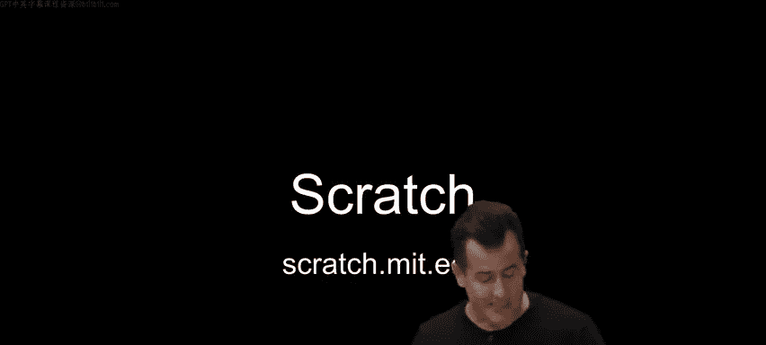

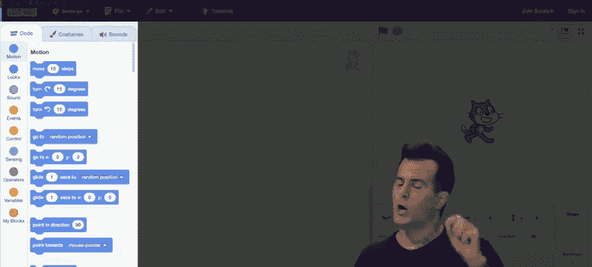

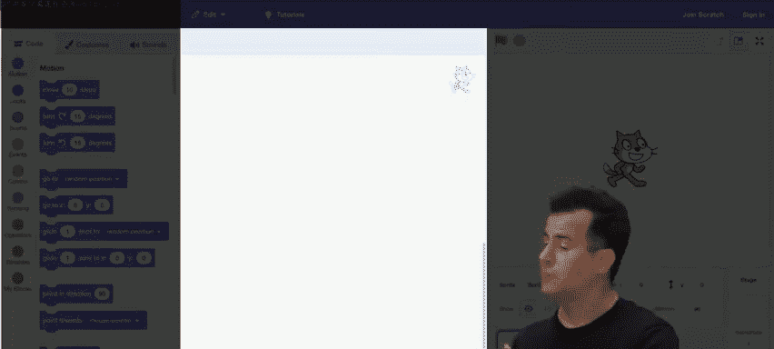

What am I going to be coding Well， I'm gonna to be controlling one or more sprites。

 much like in the world of games if familiar， a sprite is like a character that you might see on the screen。

 The default character in the world of scratch is， in fact。

 a cat that looks like this and in this case， I have just one cat。

 I can then make that cat do things in his own little world at top right by making the cat move up down left right spinning around or doing other things as well。

 But if you want to introduce a dog or a birder。 any number of other custom characters。

 you just add more sprites and they get their own place in that same world。

 As for how to think about movement in this world。 It's actually pretty familiar。

 even though it gets a little numeric for a moment。

 if scratch at the moment is in the middle of the screen the cat is at zero comma 0 if you think about X Y coordinates or latitude longitude。

 if you move the cat all the way up， this would still be x equals0。

 but it would be y 180 what's the 180180 pixels vertically or dots on the screen this is negative 180 pixels on the screen at the bottom。

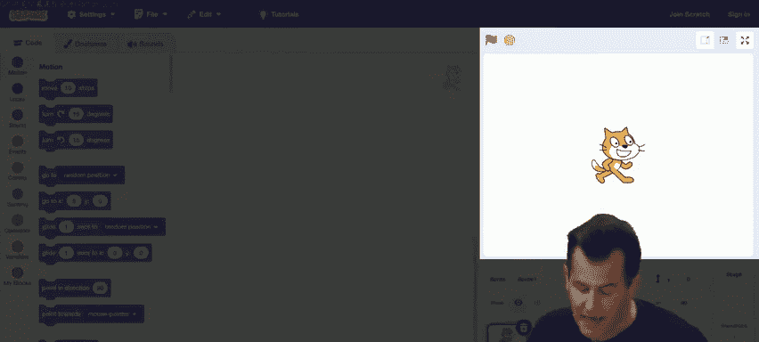

By contrast， if you go left and right， your x value might change negative 240。

 but y is0 or positive 240 and y is0 as well。 but most of the time you won't need to know or care about what the pixel coordinates of the cat are all you're generally gonna care about is the programmer most likely is you want the cat to go relatively up down left or right and let MIt figure out the mathematics of moving this thing around in most cases。

 All right so let's go ahead and introduce the first of these programs by doing something quite simple as we did in C there but a little more simply by writing code as follows I'm going go back to scratch mit do you do I've already clicked per before the create button and if I click on the yellow category of blocks here at left and I'll zoom in we'll see a whole bunch of yellow puzzle pieces and probably the most common one you will use to write code in scratch for just this first week is literally when green flag clicked why well if we go back over to the cat's world at top right。

 notice that above。

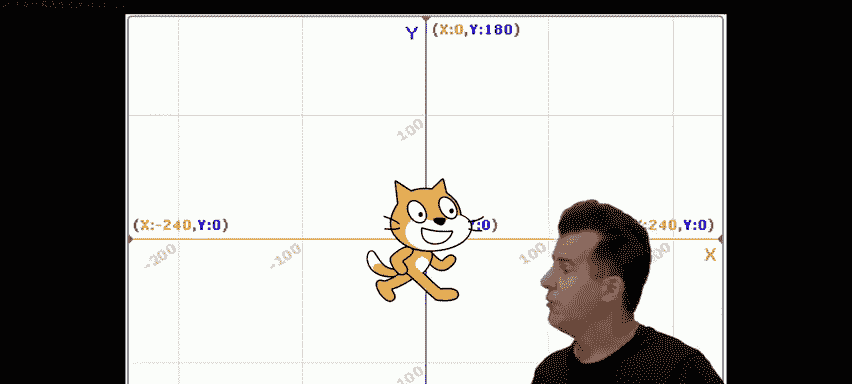

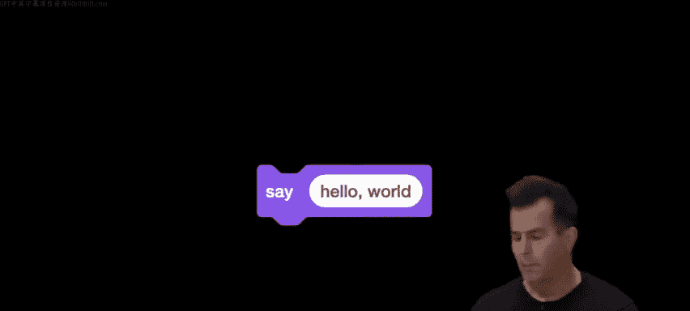

The cat's rectangular world。 There's not only a green flag for starting。

 There's a red stop sign for stopping as well。 So let's do this。

 Let me go ahead and click and drag when green flag clicked anywhere into the middle and let go And now I'm going go to looks。

 and it looks like there's a whole bunch of purple puzzle pieces here。

 I'm going choose something simple like say hello drag it and notice if I get just close enough。

 it's going to want to magnetically snap together。 So I'll just do that and it does its thing。

 the fact that there's this white oval with text means that is an input to this say puzzle piece。

 I can literally then change what the input is。 if I want to more conventionally say hello comm world。

 which in fact， according to lore was the very first program written in C。

 And nowadays in most every language and including in Brian Carnahan's book。

 So hello world is generally the first program that most any programmer first writes。 So that's it。

 as programme go。 Let me go ahead and zoom out here。 let me go over to the right。

And click the green flag。 and somewhat excitingly， maybe underwhelmingly。

 we've now written a program that quite simply says hello world on the screen。 Now。

 let's make this a little more technical for just a moment。 What is this here puzzle piece。

 As I keep calling it， It's actually a similar It's an incarnation of one of the ideas from our pseudo code before。

 What last time before break， did we call function damn。😊。

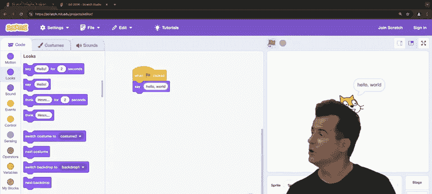

What did we call those actions and verbs last time in my pseudocode？😡，Functions， that's right。

 So these purple puzzle pieces here are indeed functions and some functions， as we can see。

 take inputs like hello comma world。 After all， how does scratch know what to say。

 you have to provide the cat with input which is to say functions can indeed take inputs like this in this case。

 one input， but we'll see opportunities for passing in more input as well。

 What the cat is doing though visually on the screen here at top right is what's generally called a side effect。

 sometimes when you call a function， it does something visually。

 and in this case you're seeing literally a cartoon speech bubble， hellello world。

 that is the side effect of this function。 So if we now want to map this to our world of inputs and outputs and see where this side effect is。

 this is the paradigm I propose at the start of class that is computer science in a nutshell and will be the framework we use literally throughout the class。

 no matter how no matter how the languages in particular evolve。

 So what's the input to this particular program well， this white oval hello world is my input。

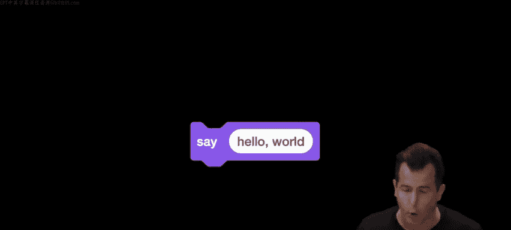

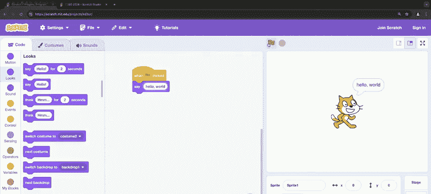

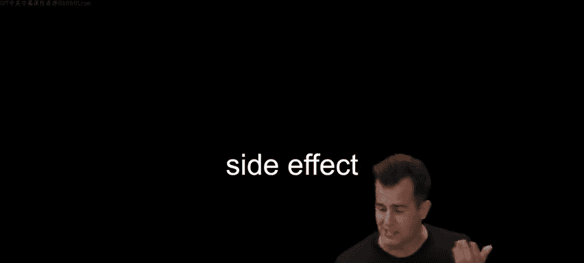

The algorithm， step by step instructions for solving some problem is implemented in code this language called scratch by way of this purple puzzle piece and the output of that function。

 given this input is the side effect whereby the cat indeed says hello world visually on the screen in that speech bubble。

 So the exact same paradigm with which we began today governs how exactly this cat here works。 Well。

 let's actually go back to this program and make it a little more interesting than that。

 let me go ahead and click the red stop sign。 and let me actually use a different type of puzzle piece。

 Another function that does something a little different。 First， I'm going get rid of the say block。

 So I'm going not only pull it away， I'm going drag it over anywhere it left and just let go and it will delete itself automatically or I could right click or control click and from a little menu I could also explicitly say delete And what I'm going to do now is under sensing。

 which is a light blue shade of puzzle piece。 There's a whole bunch here。

 but I'm gonna focus on this one ask。😊，Something and weight。

 And the default text is what's your name。 And that's fine。 But because it's a white oval。

 that input can be manually changed by me if I wanted to change the question。

 I'm gonna drag it over here。 it's gonna magnetically snap together。 And I'm okay with that question。

 But what do I want to say with the answer。 Well， let's go ahead and do this。

 I could go to looks again。 I could grab another say block。 let it snap in。

 and I could say something like hello comma David， But this is gonna be the first of many bugs that I make intentionally or otherwise。

 let me click the green flag， scratchtes now， just like in a web browser prompting me for some input here。

 So let me go ahead and type in my name， David， enter， andvo， like it works。 Ho， David。

 I'm kind of cheating though， right， because if I zoom out stop and play again。

 let me type in like Yu's name here。 enter and it still says hello comm David。

 So that didn't really implement the idea that I want it。 All right， so how can I。Well。

 it seems that this time I want more than a side effect。

 I want to use the value that the human types in。 And for this， we need another feature of functions。

 which is that not only can they sometimes have side effects， something visually happens。

 Some functions can hand you back a value。 A so-called return value that will allow you to actually reuse whatever the human typed in。

 So a return value is something that gets virtually handed back to you。

 and you can store it in something called variable like X， Y and Z in mathematics。

 and you can generally reuse it one or more times。 So let me actually draw our attention then to。

 at left， not only the blue puzzle piece， ask what's your name and weight。

 but notice that there's a special puzzle piece below it。 This blue oval called answer。

 and that represents what a computer scientist would call a return value。

 So Mit has kind of bundled it together side by side to make clear that one of those pieces relates to the other。

 What it means is that I can do this。 I can drag this oval and。

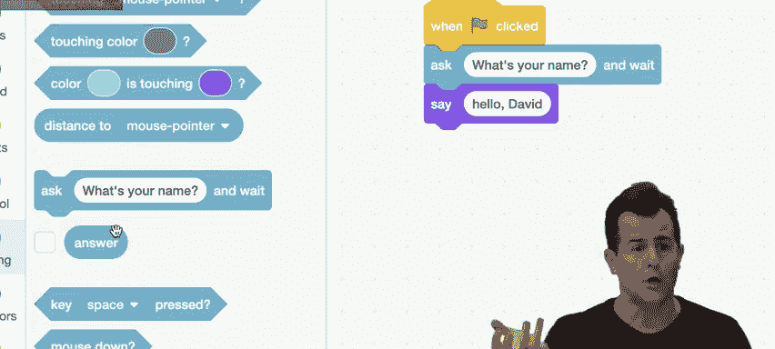

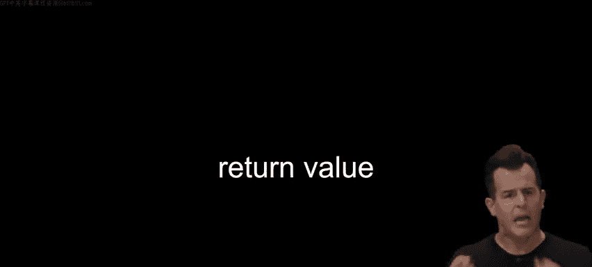

This oval as the input to the save function。 Now， notice it's not the same size。

 but it is the right shape。 So that's okay。 Scratch will sort of grow or shrink things to fit properly。

 But this too isn't quite right。 Let me go ahead and do this。 Let me go ahead and stop that。

 Click the green flag。 I'll type in my name again。 D A V I D， enter。

And it's just kind of like weird or rude。 Like I wanted a hello， at least。 And it just said。

 David on the screen。 Okay， so I can fix that。 Let me stop with the red stop sign。

 Let me just separate these temporarily， and I can leave it in the middle there。

 but they have no logical connection temporarily。 Let me go back up to looks。

 Let me grab a say block。 a second one。 And let me go ahead and say just to be grammatical。

 like hello， comma space。 and then I'll reconnect this here。 So at the moment。

 it looks like what I want。 I want a hello comma， and then the return value printed out based on whatever the human typed in。

 So let me zoom out。 Let me click the green flag。😊，Again， what's your name， D V D I V I D。

 and watch the cat's side effect enter。It's still not greeting me properly。 There's no hello。

 And if in case it was too fast， let's do it again。 Green flag， D A V， I D enter。 It just。

 it rudely just says my name， which is weird。What's the bug here， though， it's a little more subtle。

😡，哇， yeah。Yeah， it's just too quickly going over the say command or， the say function in this case。

 my Mac， your PC， your phone is just so darn fast， both are happening。

 but too fast for my human eyes to even notice。 so we can solve this in a number of ways I could actually use a different puzzle piece altogether。

 In fact， MIT kind of anticipated this notice the first puzzle piece and purple is say hello for a specific number of seconds and you can specify not just the message。

 but the number of seconds。 Er go two inputs otherwise now known as arguments to a function an input to a function is just an argument now。

 and that would be a fix here。 I could maybe a little more explicitly do this。

 I could go under events scroll down a little bit and sorry under control in orange。

 I could grab a weight block and I could kind of insert it in the middle and this might actually help so I could click on the green flag D VD enter hello David。

 and I could change the timing to be a little more natural。

 But what if I want the cat to just say hello comma David all in one breath so to speak。For that。

 I'm gonna need to use a slightly different technique as follows。

 Let me go ahead and get rid of the weight。 Let me get rid of the second say block and stop the cat with the stop sign。

 Let me go under operators here。 and let me somewhat cleverly grab this a join block at the bottom By default。

 it's using Apple and banana as placeholders。 But those are white oval so I can change those。

 Let me drag this over the white oval for the say function and let go and it will snap to fill。

 Let me go ahead here and type hello comma space instead of Apple。

 And what should I do instead of banana。Yeah， so the answer return value the return value。

 so let me go under sensing again， let me just drag another copy of it and you can use these again and again and again。

 they don't disappear。 I want to drag answer over banana so that the second input to join is actually if you will。

 the output of the ask block like that and it snaps to fit So now if I go ahead and click the green flag once more D VID enter now we have the sort of behavior aesthetically that I cared about but beyond the aesthetics of this。

 The goal here really was to map it again， the same paradigm which we'll see here the algorithm and the output in the input for this example or as follows the input to the save block was quote unquote what's your name the function of course。

 implementing that algorithm and code was the ask and weight block the output though of the ask block recalls not some visual side effect。

 it is a return value called answer like a variable special variable like X， Y and Z。😡，Math。

But in this one， we generally in programming， describe variables with actual words， not just letters。

 but this output of the save block， I kind of want to make room for it to pass it into the save block as a second argument。

 So let's do this， let's take one step back and propose that now for the join block that I just used it takes two inputs。

 hellello comma space and answer the function in question is indeed the join block。

 the output of this had better be hello comma David。

 what do I want to do with the output of the join block Well， let me clear the screen。

 let me move this over because now the output of the join block is going to instantly become the input to the save block so that the output now in this multistep process is the side effect of hello world。

 So the fact that I nested these blocks on top of one another was very much deliberate。

 if I zoom in here， notice that hello and answer are on top of join join。Is on top of the say block。

 And if you think back to like high school math。 This is like when you had parentheses and you had to do the things inside parentheses before the things outside parentheses。

 it' is the same idea。 But I'm just visually stacking them instead。

 But outputs can become inputs depending on what the function there expects。

 Let me pause here and see if there's any questions about not so much like what the cat is doing。

 but how the cat is doing this。Questions at hand。Alright， well。

 let's make the cat more catlike and do this。 Let me throw away all the say block and just let go there and let me introduce at bottom left。

 a nice feature of scratch。 whereby there's also these extensions that tend to use the cloud。

 the Internet to give you even more functionality。 And in fact。

 I'm gonna click on this extension up here。 Text to speech。 And if I click on that。

 I suddenly get a whole new category of blocks at the bottom text to speech。 They happen to be green。

 But what's nice here is that I can actually now have the cat say something audibly。

 So let me drag the speak block here instead of the say block。 I don't want it just just say hello。

 Let me stop that。 So let me go back under operators。

 Let me grab another join block because I threw the other one away。

 Let me change Apple to hello comma space again。 Let me go to sensing。

 Let me drag answer to banana again。 And now let me hit the green flag。😊，And let me type in my name。

 D A V I D。 And in a moment， I'll hit enter。 and Ho， David。Allright， it's not exactly catlike。

 but it was synthesized， but it turns out under these text to speech blocks。

 there are some others set voice to Alto， for instance， seems to be the default。

 but let's change this。 So notice that some puzzle pieces。

 don't just take white ovals they might even have drop down。

 So whoever created that puzzle piece decided in advance what the available choices are for that input per the dropdown。

 So I'm going change it to squeak， which sound or actually kitten， somes even more apt。

 Let me zoom out click the green flag。Type my name， DA VID enter。That's interesting。

 So it doesn't seem to matter what I type。 So how about David Main。

So it seems to meow proportional to how long the phrases that I typed in。

 it can get a little creepy quickly， like if I change kitten to giant。

 let me go ahead and hit play D VID enter Hello David。😡。

So you can sort of for very non academiccademic ways， like start to have fun with this。

 but just playing around with these various inputs and outputs。

 But let's actually make the cat do something more catlike and indeed Miow。

 instead of saying any words at all， So let me throw all of that away。 Let me go now under sound。

 Let me drag the play sound until done and notice in the dropdown here by default。

 You just get the cat sound。 you can record your own sounds。

 There's a whole library of dogs and birds and all sorts of sounds you can import into the program。

 I'll keep it simple with cat and let me click the green flag。😡，All right， so the cat me out once。

 if I want the cats to meow again， I could do this。😡，If I want the cat to meow third time。

 I could again hit play。😡，So this is kind of tedious if to play this game。

 I have to keep clicking the button， keep clicking the button to keep the cat alive virtually in this way。

 So maybe I want this to happen again and again and again。 Well， let me just do that。

 Let me sort of drag and drop or I could right click or control click and then a little menu would let me copy paste or duplicate blocks。

 but I'll just keep dragging and dropping。 Let's do this。😡，Cat's kind of hungry， unhappy。

 so like this like slow things down so it's adorable again， so let me go under control。

 let me grab one of those wait one second and I'll plop this here， another one， let me plop it here。

 click play again。😡，Cuter， less hungry， sure， but this program is now。

 I dare say correct if my goal is to get the cat to Yaow three times。

 but now even if you've never programmed before， critique this program， it is not well designed。

 even though it is correct， in other words， it could be better。😡，How might you think？Yeah。

So using a loop and why， why are you encouraging me to use a loop， even though it works as is？😡，Yes。

 so to summarize it's just easier to use a loop because I could specify explicitly in one place how many times I want it to loop。

 And moreover， frankly， any time you are copying and pasting something in code or dragging the same thing again and again。

 odds are you're doing something foolish。 Why because you're repeating yourself unnecessarily。

 And this is a bit extreme。 but suppose I want to change this program later so that the cat pauses two seconds in between mouse。

 obviously I can just go in here and do two But what if I forget。

 And suppose this program isn't like five or six puzzle pieces。

upp it's 50 or 60 or 500 or 600 eventually I or a colleague I'm working with is going screw up。

 they're gonna change a value in one place。 forget to change it in another。

 So why are you inviting the probability of making a mistake。

 Just simplify things so that you only have to change inputs in one place。 So how can I do this。

 Let me zoom out， let me throw most of this duplication away。

 leaving me with just the play and the weight function。 Let me now under control as well。

 grab one of these。 I could， for instance。Pat as follows。 Let me grab a repeat。

 I'm going to have to kind of move these in two parts。 So I'm going move this down。 It's too small。

 but it will grow to fit the right shape。 Then let me reattach it up here。

 Let me change the default 10 to a3。 And now I think I've done exactly what you are encouraging。

 which is simplifyimpl。 and I click play now。😡，Now， and。Yeah， so still correct。

 but arguably better designed as a result。 I can keep things simple and change things now in just one place and it will continue to work。

 but this is getting a little tedious now I claim like why am I implementing the idea of meowing like wouldn't MIT have been better to have just implemented a meow puzzle piece for us because the whole thing is themed around a cat Why is there not a meow puzzle piece。

 Why do I need to go through all of these complexity to build that functionality Well。

 what's nice about scratch and what's nice about programming languages in general is you can generally invent your own puzzle pieces。

 your own functions and then use and reuse them So let me go ahead and do this。

 I'm gonna to go under my blocks in pink down here。

 I'm gonna go ahead and click make a block and I'm gonna to be prompted with this interface here and I'm gonna call this block literally meow because apparently MIT forgot to implement it for us and I'm just going go ahead and immediately click okay And what you'll see now is two things One on the screen I've been given this placeholder pink piece that says。

Define meow as follows。 So anything I attach to the bottom of that defined block is going to define the meaning of meowing and at top left notice what I have under my blocks。

 I now have a pink puzzle piece called meow that is a new function that will do whatever that other block of code tells the cat to do So what do I want to do here Well I'm gonna keep it simple for now I'm gonna move the play sound meow until done and wait two seconds though let's change it back to one second to move things along and now let me drag the meow puzzle piece over to my loop such that now what's it gonna do。

 it's gonna meow three times and just to be a dramatic out of sight out of mind me for no technical reason just drag this all the way to the bottom of the screen and then scroll back up just to make the point visually that now meowing exists that is an implementation detail that we can abstract away not caring how it exists because I now know a higher conceptual。

If I want a meow， I just use the Miow puzzle piece。

 and I or someone else dealt with already how to implement meowing。

 So now let me go ahead and hit play。Okay so same exact code。

 but arguably better design because I've now given myself reusable code。

 so I don't have to copy paste those several blocks。 I can just use meow again and again。

 but let's make one refinement。 let me actually scroll down to where I did in fact。

 implement this Let me control， click or right click on it and let me edit the pink block that I created a moment ago because I want to practice what I've been preaching about inputs。

 So I don't want this function just to be called meow， I want this function to also take an input。

 and just for consistency with our use of n earlier which in computer science generally means number let me meow n times。

 and just so that this puzzle piece is even more programmer friendly。

 let me add just a textual label that has no technical significance other than to make this function sort of read left to right in a more English friendlyri way Miow n times。

 Let me click okay and now notice this thing at the bottom has changed such that it's not only called meow there's explicit mention。

😡，Of N， which is a circle， which is exactly the variable shape that we saw earlier when it was called answer。

 This is not a return value， though。 This is what again。

 we're gonna call an argument an input two way function。 So let me do this。

 I'm gonna move this back up to the top so I can see everything in one place。

 and I'm gonna make one modification。 because my goal now is to make a new and improved version of meowing that actually takes into account how many times I want the cat to meow。

 So instead of using a loop in my own program under one green flag clicked。

 I'm going to detach this temporarily， I'm going move this away。 I'm gonna move this code over here。

 and I'm gonna reattach it here。 So focusing for the moment on just the left。

 Miow is now defined as repeating three times the following two functions。 play sound and wait。

 But that's not quite right。 I want to get rid of the three。

 So what can I do because I created this input to the meow function myself a moment ago。

I can actually drag a copy of it overr that is changed the three to be generally an n。

 so now I have a function called now that will meow any number of times and what's nice now is my actual program that is governed by that green flag I can type in 3。

 I can type in 10。 I can type in 100 and it will just work and henceforth。

 I can again dramatically sort of scroll this down so we don't know or care about it anymore Now my program is a single line where by this notion of meowing has been abstracted away by just defining my own function or custom block。

😡，Questions then about just this idea， this principle of creating your own functions to kind of hide implementation details。

 Once you've solved the problem。 Therefore， you don't want to have to think about that same problem ever again。

And that's the beauty of programming， typically。Questions on what here we just did。NowAll right。

 well， let's do this。 Let's now make this a little more interactive in code。

 Let me go to this green flag。 Let me scroll down and just throw all of this hard work away that we have copies on the courses website of all of these programs step by step。

 If you want to review them in slower detail。 Let's do this under control turns out there's other ways to loop。

 There's this forever block that will just do something forever。 So in the forever block。

 There's some place for some other code。 And I'm gonna move to the control section here and grab one of these if block。

 So one of these conditionals。 Let's plug that in here。 and now notice if。

 and then there's this sort of trapezoid like placeholder that's gonna probably fit what the if is a conditional。

 forever is a loop。😊，Say and so forth had been functions。 What was the other key term we used？

So a Boolean expression。 we need to put one of those yes， no or true false questions here。

 So what are those。 Well， I've been using scratch for some years。

 So I know under sensing there's one of these shapes here， Toing mouse pointer question mark。

 The question mark literally evokes the whole idea of a Boolean expression being yes， no。

 It's way too big to fit。 but it is the right shape。 So let me drag it， Let go。

 It's gonna grow to fill。 And now let me go to sound。

 Let me grab that play sound meow until done and put it inside that conditional。

 such that what kind of program have I just implemented here， Arrguably。😡。

What will this program do when I click the green flag？Well， nothing at the moment。

But I'm not touching the cat。 So if I move the mouse pointer to the cat。Again。Again。

Kind of like implementing the idea of petting a cat， if you will。

 because I'm forever just waiting and waiting and waiting is the mouse pointer touching that sprite touching that cat。

 And only if so， go ahead and play that sound until meow play that sound meow until done。

 but now we can make things a little more interesting。

 let me stop this and let me do something actually completely different。

 let me throw all this hard work away let me go under extensions。

 let me go to video sensing because lots of laptops， my own included has a little webcam nowadays。

 let me approve use of that there and you can see me in the frame and let me do this。

 let me drag one of these when motion exceeds some measure and for through trial and error。

 I figured out that 50 tends to work well。 let me step out of frame here and program off to the side。

 And if I go to play sound meow until done notice that this is an alternative to using when green flag clicked。

 This is a category of block that's constantly waiting for what we'll call an event。

 an event is just something that can。On the screen， a click， a drag， a mouse movement， and so forth。

 so let me zoom out here。😡，And now if I can do this， here we go。No， too slow。Still too slow。 Oh。

 wait， did I click play， let's say。Try again。There we go， okay， 50 is a little too high apparently。

 so let's make this a little gentler， 10。There we go。There we go。 Okay。

 so we've implemented now more physically the idea of actually responding to petting a cat。 so。

 don' damn it。😡，Okay。Okay， so this is a bug like now this MI。

 So it's not stopping in response to the red stop sign。 So what do you do in doubt。

 most extremely reboot for now， I'm just going to close the window。

Okay so now we've seen all of those primitives that we saw in that pseudocode。

 but incarnated in this graphical programming language and again without parentheses and semicollonons and double quotes and all the punctuation that we will introduce before long。

 But for now， we have the mechanisms in place where we can do some really interesting things。

 So in fact， I thought in the spirit of sort of sort of thinking back on olden time thought I'd open up the very first program I wrote when I actually took I was cross-registered in an MIT class and took a class that introduced but aspiring teachers to scratch。

 and I implemented this program here called Oscar time。

 which was a game that used a childhood song that I was a fan of and it allows you to sort of drag trash into a trash can but to bring this to life and perhaps in exchange for one stress ball could get one brave volunteer who wants to come up and control this here keyboard。

 I saw your hand first come on up。Come on up。And you'll see， thanks to the team。

 We also have this amazing lamp post here being on Quincy Street as we are。

 Do you want to introduce yourself to the group？ Hi， my name is Anna。 I'm from Richmond， Virginia。

 and I'm in wed。😊，Nice well all right come on over so here And you'll have a chance to play the very first game I wrote in Sct。

 which admittedly is more complicated typically than we would expect of a student doing this for the very first time as in problem said zero but what I'm going to do is full screen this year I'm going to click the green flag and what you'll see on the screen or these instructions drag as much falling trash as you can to Oscar's trash can before his song ends and here we go。

🎼Oh， I love。Anything3 or dy or dusty。Anything racket or rock or roughy。🎼Yes稣。🎼Oh there we go。

 So as Anna continues to play， let's kind of tease this apart a little bit。 So one。

 there's some costumes on the stage like that lamp post is actually never going to move。

 but theres a couple of sprites。 There's the trash can， which seems to be a character onto itself。

 There's this piece of trash that keeps coming back and back。 That is a sprite。

 there's now this sneaker， which is another sprite and in fact。

 notice that Oscar of course keeps popping up from his sprite once in a while。

 So Oscar seems to have multiple costume。 So I offer this as an example as you keep playing if you would very good job so far。

 the song goes on forever。 This is a nightmare to implement it listen to this all day long。

 but how do how do we implement the rest of this。 we'll notice that the trash every time she throws into the trash can does reappear somewhere different。

 So there's some kind of randomness involved。 And indeed。

 scratch will let you pick random numbers in a range。 So maybe it could be negative 240。

 maybe it could be positive 240 at the 180 point on the top of the screen so you can sort of randomly put things on the。

🎼There's apparently what kind of construct that makes the trash fall again and again。

 I think no one's listening to me。 they're all just watching you。

 but what's making the trash fall from top to bottom。

 So it's actually some kind of loop because there's a motion block inside of a forever loop probably that just keeps moving the trash。

 one pixel， one pixel， one pixel， one pixel， one pixel creating the illusion there for of motion。

 And if we can cramp the crank the song a little bit more you'll see that this is all synchronized now。

June， if we can crank the music up。🎼anything30 or or that0。

Anying The song keeps going forever seemingly and now notice more and more sprites are appearing because they waited for here we go。

 climax。All right，' a big round of applause， Brianna， nicely done。There we go， here we go。Alright。

 so this is an interminable song。 And indeed I spent like hours building that and just listening to that song on loop was not the best way to program。

 but the goal here is to really use it as just an intellectual exercise as to how that was implemented and we won't do the entire thing in detail because I will say back in the day when I was younger。

 I didn't necessarily write the cleanest code and in fact if we see inside this and we poke around the bottom of the screen here。

 you can see all of my different sprites and the code is kind of complex。

 like things just kind of escalated quickly， but I did not set out and write all of these programs all at once for each sprite。

 I pretty much took baby steps so to speak。 And so for instance。

 let me open up just a few sample building blocks here that speak to this that are written in advance。

 So here's version0 computer scientists typically start counting it zero and let me show you this example here that only has two sprites on the screen。

 We have Oscar the trash can and we have the piece of trash and now notice what does Oscar do Well let me go ahead and zoom in on this。

Scrt， as it's called， the program is a script。 When the green flag is clicked。

 Oscar switches his costume to Oscar 1。 That's his default costume where the lid is closed。

 Then Oscar does this forever。 If it's Oscar is touching the mouse pointer。

 change the costume to Oscar 2， Otherwise change it back to Oscar 1。

 So that whole idea of animation where Oscars popping in and out iss just like a quick costume change based on a loop inside of which is a conditional。

 waiting for the cursor， like Anna did to get near the trash can。 Meanwhile。

 if we look at the piece of trash here， notice that the trash。

Is actually not doing anything in this first version because I didn't even implement falling first。

 So let me hit the green flag。 nothing is happening in this very first version。

 but notice if I click on the trash and drag as soon as I'm touching Oscar there comes that trash can lid and it was just the result of making this one program respond to that input。

 All right what did I do next。 Well next after taking that single baby step。

 I added one other feature， let's see inside this version1。 again。

 Oscar is behaving the exact same way， but notice this time the trash is designed to do the following。

 First， I'm telling the program that the drag mode is draggable。

 that is I want the trash to be movable when the user clicks on it。

 then I tell the piece of trash to go to a random X location。 X is the horizontal。

 So it's going somewhere between 0 and 240， but all the way at the top of the screen 180 Then forever。

 the piece of trash just changes by negative one。 So it just moves down and down and down。

 And without looking at the second script yet， let me just hit play。

And notice without even doing anything。 and eventually once there was lots of trash falling。

 like Hannah was struggling to keep up with this， it's just moving one pixel at a time forever until thankfully。

 MIT does stop things automatically if they hit the bottom。

 lest a six yearear old get upset that all of a sudden their sprite is gone forever。

 So there is some special casing there。 But what else is this trash doing， let me zoom in here。

The piece of trash also when the green flag is clicked is forever asking this question。

 If you are touching Oscar， then pick a new random location between 0 and 2。

40 at positive 180 and go back to the top。 So in other words。

 as soon as this piece of trash is dragged over to Oscar like this。 And I let go。

 it recreates itself at the top， It's just sort of teleporting to the top and thus was born this feature。

 And I won't slog through all of the individual's features here。

 But if we do just one more and see inside this one， notice what happens now。

 when I click the green flag， drag this piece of trash in and let go notice now that。

What is different about this one？Oh， sorry， wrong1。 Let me go ahead and open up this one。 See inside。

 And if I click the green flag here， drag the piece of trash over to Oscar and let go。

 what's different this time。 Alright， did you go to time。Oh， okay， sorry。

 I didnn't want to show you that one other。Wrong one， third times the charm。Yes。

 so now let me go ahead and hit play。 notice at the top left of the screen。

 there's a score currently zero。 but now when I click the trash and let go notice that the score is being incremented by one。

 And this in fact is how an your score kept going higher and higher and higher。

 every time I noticed oh the trash is touching Oscar， let's not only teleport。

 let's also increment a variable and we didn't see this before。

 but if I go to this Oscar scratch now， you'll see that it is exactly the same。

 but if I now go to the trash piece here， and we go to when green flag clicked。

 you'll see that I'm initializing a variable in orange called score to0。

 but if we scroll down to the bottom， Oscar is also doing another thing in parallel at the same time。

 when the green flag is clicked， Oscar is forever checking is the piece of trash touching Oscar if so change the score by one and then go to top。

 which is another location on there that screen。 So in other words。

 even though at a glance something like。Oscar time might look very complicated。

 and it did take me hours。 The goal， especially with problems at zero。

 is not going be to bite off all of that at once， but to take proverbial baby steps。

 implement one tiny feature so that you feel like you're making progress at another feature another and invariably you might run out of time and not get to the best version of your vision but hopefully it'll be good。

 hopefully it'll be better but you'll have these sort of mental milestones。

 hoping that you at least get to that point because as you will soon discover everything in the world of programming unfortunately takes longer than you might expect。

 that was true for me 25 years ago and it's still true today。 Well。

 let me introduce one final set of examples here。 this one written by one of your own predecessors。

 a former student Let me go ahead and open up three baby steps if you will toward an end of implementing a game called Ivy's hardest game whereby it's now more interactive quite like Oscar time。

 So at top right here notice and I'll zoom in we have this world that's initially very simple to black lines。

ll if you will， and a Harvard sprite in the middle。 But when you click the green flag。

 notice that nothing happens initially， except that the sprite jumps to the middle。

 but I can hit the up key or the down key or the left key or the right key。

 But if I try to go too far even though it's not the edge of the world it's only touching that their black line it's still going to stop as well。

 So intuitively， how could you implement that type of program。

 How could you get a sprite from what we've seen to respond to up down left right。

 but actually move when I touch my arrow keys。😡，Like what does it mean to move， yeah？Exactly。

 so much like with representing information at the end of the day。

 all we've got is zeros and ones when it comes to algorithms at the moment。

 all we have are functions and loops and conditionals and boolean expressions and soon some more things too。

 but there's not all that much we have at our disposal。

 So let me zoom out from this and let me actually show you what the Harvard sprite is doing It's doing this When I go up to the green flag here。

 the Harvard Sprite is going to zero come a0 So dead center in the middle。

 and then it's forever doing two things listening for the keyboard and feeling for walls left and right。

 Now those are not puzzle pieces that come with scratch。 I created my own custom blocks。

 my own functions to implement those ideas。 let's not abstract away for now。

 let's actually look at these features and indeed to to your instincts at left here。

 what does it mean to listen for the keyboard。 Well。

 if the up arrow key is pressed change y by one move up if the down arrow key is pressed change y by negative one。

The right arrow key is pressed， change x by one。 If the left arrow key is pressed。

 change x by negative one。 So take sort of all the magic out of moving up down left right by just quantizing it as plus minus this and that it's all numbers indeed at the end of the day。

 But what else is it doing Notice that it did indeed bounce off the wall。

 So my other custom function， which I chose feel for walls to kind of evoke this idea It's asking two questions。

 if you're touching the left wall， then change x by one。 So bounce in the other direction。

 else if you're touching the right wall bounce in the negative one direction。

 And so what are left wall and right wall， I mean， I kind of cheated， I just use two more sprites。

 these sprites are literally nothing except black lines， but because they exist。

 I can ask that question in my conditional saying are you touching those other sprites。

 and I could have color them any way I want。 but this is enough if I zoom in to implement this idea of going up down left and right and preventing the sprite from leaving that little。

All right， so if you'll agree that there's a way now to implement motion up down left right。

 let's go ahead and implement this idea by adding a rival into the mix like a yale sprite。

 and what the Yale sprite is gonna do if I click the green flag is this So Harvard at the moment is still gonna be movable with the arrow keys up down left to right。

 But Yale for better for where is just gonna mindlessly bounce back and forth from left to right forever。

 It would seem the operative word being forever。 So how's that working， Well。

 let's look here's the Yale sprite at the bottom。 let's zoom in on its actual code here。

 the Yale sprite starts at0，0， it points in direction 90 degrees， which means left right。

 essentially， And then forever does this， if touching the left wall or touching the right wall。

 turn around 180 degrees。 So I don't want the Yale sprite to just stop by moving it one pixel to bounce off slightly。

 I want it to wrap around and just keep going and going and going forever。 And that's it。

 Everything else is the same。 So one final flourish， let's add a more formidable。

Advers like MIT here， whereby if I zoom in and hit play， notice that if I move the Harvard sprite。

 Mit comes chasing me now。 Now， how is this actually working。 Yale is just kind of doing its thing。

 bouncing back and forth。 Now， Mit is really latched on to me and it's following me up down left right。

 So how is that logic now working。 Well， again， it's probably doing something forever。

 because that's why it's continually doing it， let's click on MIt， This too is pretty simple。

 even though it's a pretty fancy idea initially， the Mit Sprite goes to a random position。

 But thereafter if forever points toward the Harvard logo outline。

 which is just the long name that your predecessor or former student gave the name for that sprite。

 and then it moves one step， one step， one step。 So suppose this were an actual game and in games like things get harder and harder。

 the adversary moves faster and faster。 How could we make Mit even faster。

By changing just one thing here。Like how do we level up？Change the one to like two pixels at a time。

 two steps at a time。 So let's see that。 Let's go ahead and zoom out。 Let's hit play。

 And now notice that MIt is coming in much faster this time。 Alright， so it wasn't noticeably faster。

 let's do this。 Let's move 10 steps at a time。 So 10 steps faster than originally。 I mean。

 now and now notice it's kind of twitching back and forth in this way。 why well。

 probably if we worked out the math。 probably the Mit sprite is touching the sprite and it's bouncing off of it。

 But then it's realizing， oh， I went too far。 let me move back。 wait a minute， I'm still touching it。

 let me move down。 So you can get into these perverse situations where there is actually a bug。

 be it logical or aesthetic。 But in this case we probably want to fix that。

 So 10 is probably too fast for this to work particularly well。

 But the final final flourish here really is to show you the actual version of a game that one of your predecessors。

 a past classmate actually implemented before thereafter we will adjourn for cake in the transep。

 which is the Cs50 tradition。 But can we get one more final volunteer to come on up to play IVs。😊。

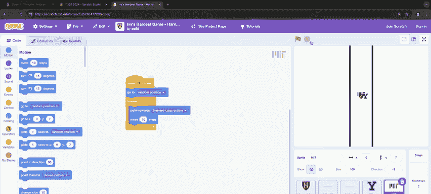

Hardest game。 I'm seeing your hand most enthusiastically there。 Yeah， come on down very happily。😊。

In just a moment we will indeed adjourn， but the goal here now is going to be to navigate a maze that's a little more difficult than the last。

 let's have you first though introduce yourselves to your classmates in front Oh Hi y'all。

 I'm Eric I'm from Philadelphia and I'm also from Hollis Hall。😡，one person from Holliace， nice， okay。

 welcome， all right， so Eric go ahead and take the keyboard here。

 it too will be all about up down left to right as soon as you click the green flag。😡。

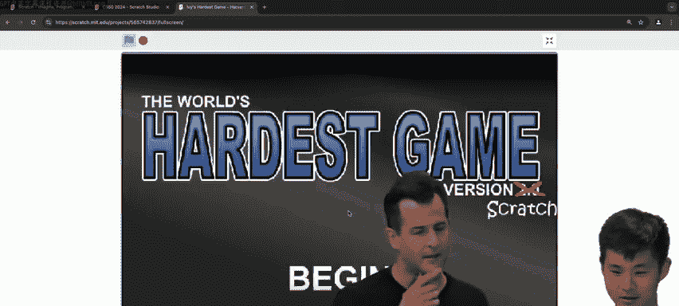

And if we can crank the music。🎼快。けたしです。So notice the black walls are a little more involved than last time。

 but the goal is to get to the sprite all the way right and just touch it at which point you move to the next level。

 but the next level of course has Yale doing its thing back and forth。

But you've made it to level three。But now there's two yale。

 so another sprite is in the mix that's randomly moving a little different in terms of direction。

Three yales。I told you， oh， boy！Next level MITs in。And just。Nice。The walls are now gone。

Princeton's in the mix。🎼Like。Nice。Two Princetons。け張して。🎼好。Oh， okay， new life。🎼A real。🎼のす。🎼TheNow。🎼被梦。

は。😊，Okay， another life， nice， nice。🎼ち。崩溃。Nice， second to last level， three Princetons。

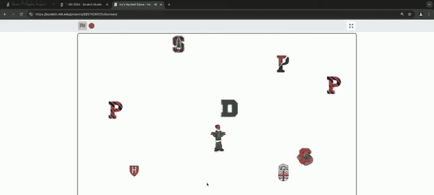

Last level。Congratulations。All right， this then was CS50 Wele Aboard cake is now served。た。

