# CS50X 计算机科学导论：第7讲：SQL


## 概述


在本节课中，我们将学习 SQL（结构化查询语言），这是一种专门用于与数据库通信的编程语言。我们将看到如何通过从 Python 过渡到 SQL，以新的、不同的方式解决一些问题。虽然 Python 功能多样，但某些计算任务可能并非其理想选择，而使用 SQL 这样的专门语言，可以让我们用更少的代码、更轻松地完成实际工作。

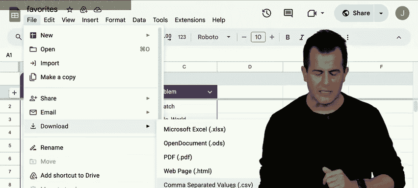

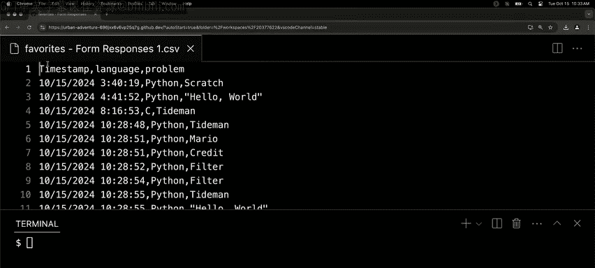

我们将从处理简单的 CSV 文件开始，逐步过渡到使用真正的数据库，并探索如何通过 SQL 高效地查询、排序和分析数据，最终理解关系型数据库的设计原则和优化技巧。

---

## 从 CSV 文件到数据库

上一节我们介绍了 SQL 的基本概念。本节中，我们来看看如何从简单的数据文件开始我们的探索。

为了进行演示，我们首先需要一些可以操作的数据。我们通过一个在线表单收集了现场数据，询问了两个问题：你最喜欢的编程语言（选项为 Scratch、C、Python）以及你最喜欢的问题集中的哪个问题。

这些响应被收集并自动导出为 CSV（逗号分隔值）格式的文件。CSV 是一种简单的文本文件格式，通过逗号来分隔不同的数据列，每行代表一条记录。第一行通常是列标题。

以下是我们收集到的数据示例（存储在 `favorites.csv` 中）：
```
timestamp,language,problem
2023-10-26 10:00:00,Python,hello, world
2023-10-26 10:01:00,C,hello, world
...
```

---

## 使用 Python 处理 CSV 数据

在深入 SQL 之前，让我们先用 Python 来处理这个 CSV 文件，看看我们能做什么。

以下是使用 Python 读取 CSV 文件并统计每种语言受欢迎程度的代码：

```python
import csv

# 初始化计数器
scratch = c = python = 0

# 打开并读取 CSV 文件
with open("favorites.csv", "r") as file:
    reader = csv.DictReader(file)
    for row in reader:
        favorite = row["language"]
        if favorite == "Scratch":
            scratch += 1
        elif favorite == "C":
            c += 1
        elif favorite == "Python":
            python += 1

# 打印结果
print(f"Scratch: {scratch}")
print(f"C: {c}")
print(f"Python: {python}")
```

运行此程序，我们得到了类似以下的输出：
```
Scratch: 11
C: 59
Python: 243
```

这个程序虽然能完成任务，但代码有些冗长。我们创建了多个变量，使用了多个条件判断。如果未来语言选项增加，代码会变得更加复杂。

---

## 引入 SQL：关系型数据库

上一节我们用 Python 分析了数据，但过程略显繁琐。本节中，我们来看看 SQL 如何让我们用更简洁的方式表达相同的查询。

SQL（结构化查询语言）是专门为数据库设计的语言。数据库中的数据存储在**表**中，表由行和列组成，类似于电子表格。SQL 允许我们执行四种基本操作，常被称为 CRUD：
*   **C**reate（创建数据）
*   **R**ead（读取数据）
*   **U**pdate（更新数据）
*   **D**elete（删除数据）

我们将使用一个名为 **SQLite** 的轻量级数据库。首先，我们需要将 CSV 数据导入到一个 SQLite 数据库文件中。

在终端中执行以下命令：
```bash
sqlite3 favorites.db
.mode csv
.import favorites.csv favorites
.quit
```

现在，我们创建了一个名为 `favorites.db` 的数据库文件，其中包含一个名为 `favorites` 的表，数据已从 CSV 导入。

---

## 使用 SQL 查询数据

让我们进入 SQLite 交互环境，开始查询数据。

```bash
sqlite3 favorites.db
```

首先，查看数据库的**模式**（即设计）：
```sql
.schema
```
输出会显示创建 `favorites` 表的 SQL 语句。

现在，执行我们的第一个 SQL 查询，计算喜欢 Python 的人数：
```sql
SELECT COUNT(*) FROM favorites WHERE language = 'Python';
```
这条简单的 SQL 语句直接给出了答案，无需编写循环或条件判断。

为了重现之前 Python 程序的结果（统计每种语言的计数），我们可以使用 `GROUP BY` 子句：
```sql
SELECT language, COUNT(*) AS n FROM favorites GROUP BY language ORDER BY n DESC;
```
这条查询语句：
1.  `SELECT language, COUNT(*) AS n`：选择语言列，并计算每组的行数，将结果列别名为 `n`。
2.  `FROM favorites`：指定从 `favorites` 表查询。
3.  `GROUP BY language`：按语言值分组，将相同的语言归为一组。
4.  `ORDER BY n DESC`：按计数 `n` 降序排列结果。


输出结果与 Python 程序一致，但代码更加简洁、声明式。

---

## 设计关系型数据库

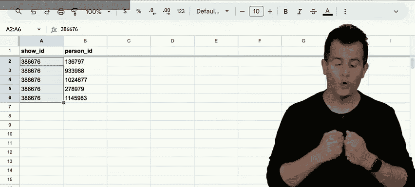


上一节我们操作了单个表。本节中，我们来看看如何设计包含多个相关表的数据库，以存储更复杂的数据（如 IMDb 电影数据）。

在关系型数据库中，我们通过**主键**和**外键**来建立表与表之间的关系。
*   **主键**：表中唯一标识每一行的列（通常是名为 `id` 的整数）。
*   **外键**：另一个表中引用主键的列，用于建立关系。


关系类型主要有三种：
1.  **一对一**：例如，一个节目对应一个评分。
2.  **一对多**：例如，一个节目对应多个类型。
3.  **多对多**：例如，一个节目有多个演员，一个演员参演多个节目。这通常需要一个**联结表**来实现。

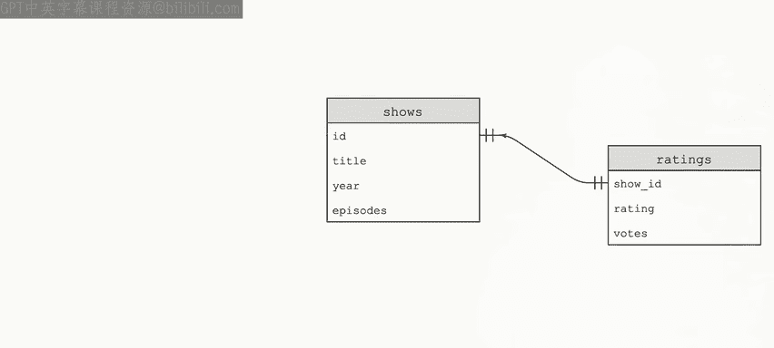

以 IMDb 数据库为例，我们可能有 `shows`（节目）、`ratings`（评分）、`genres`（类型）、`people`（人员）、`stars`（演员关系）等表。

查看 `shows` 表的模式：
```sql
.schema shows
```
输出可能类似于：
```sql
CREATE TABLE shows (
    id INTEGER,
    title TEXT NOT NULL,
    year NUMERIC,
    episodes INTEGER,
    PRIMARY KEY(id)
);
```

---

## 执行高级 SQL 查询

有了多表设计，我们可以执行更复杂的查询。例如，查找“办公室”（The Office）节目的所有演员。

这涉及到 `shows`、`stars`、`people` 三个表。我们可以使用 `JOIN` 来连接它们：
```sql
SELECT people.name
FROM people
JOIN stars ON people.id = stars.person_id
JOIN shows ON stars.show_id = shows.id
WHERE shows.title = 'The Office' AND shows.year = 2005;
```
这条查询：
1.  将 `people` 表与 `stars` 表通过人员 ID 连接。
2.  将结果再与 `shows` 表通过节目 ID 连接。
3.  筛选出标题为“The Office”且年份为 2005 的节目。
4.  选择并返回演员姓名。

我们也可以使用嵌套查询（子查询）来实现：
```sql
SELECT name FROM people WHERE id IN (
    SELECT person_id FROM stars WHERE show_id = (
        SELECT id FROM shows WHERE title = 'The Office' AND year = 2005
    )
);
```


---

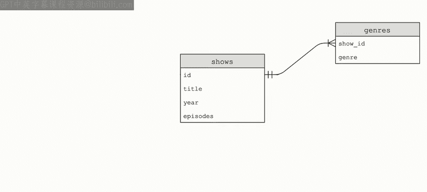

## 优化查询：索引


当数据量很大时（如 IMDb 有数十万行），查询速度可能变慢。为了加速查询，我们可以在经常用于搜索或连接的列上创建**索引**。

索引就像是书籍的目录，它帮助数据库快速找到数据，而无需扫描整个表。但索引也有代价：它会占用额外的存储空间，并可能减慢数据插入、更新和删除的速度，因为索引本身也需要维护。

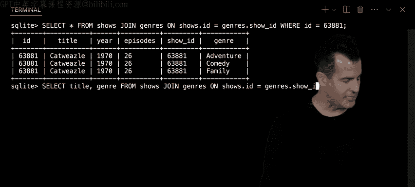

例如，如果我们经常按节目标题搜索，可以创建如下索引：
```sql
CREATE INDEX title_index ON shows (title);
```
创建索引后，针对标题的查询速度会显著提升。


在查询演员的示例中，我们在 `people.name` 和 `stars.person_id` 上创建了索引，使查询时间从零点几秒减少到几乎瞬间完成。

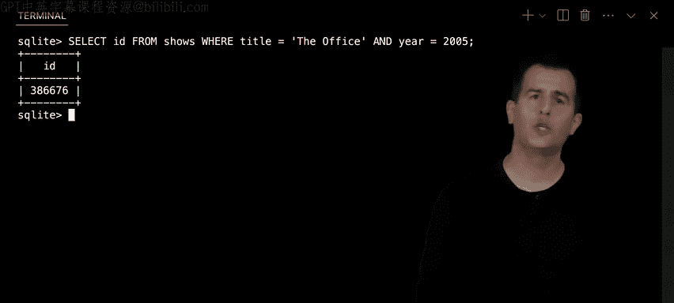


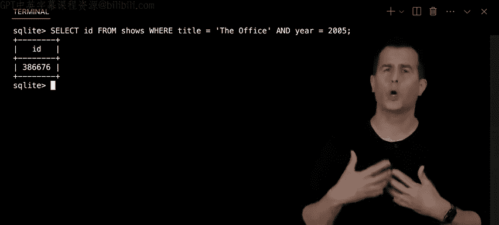

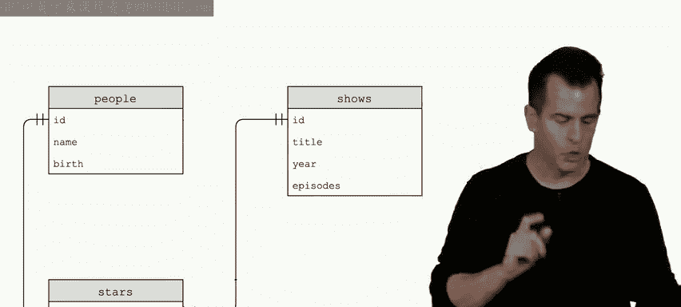

---

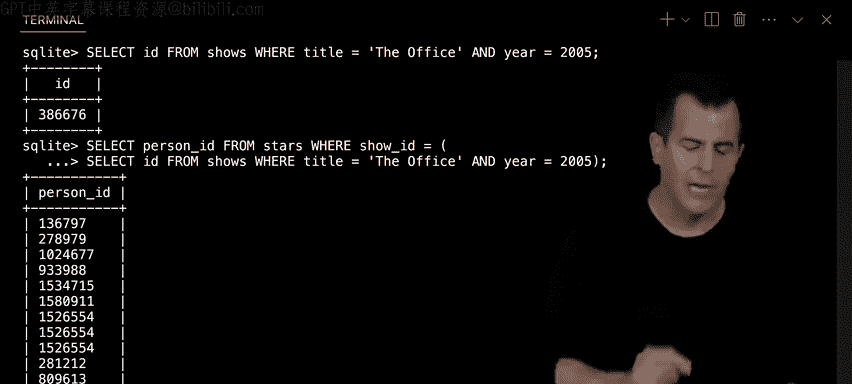


## 在 Python 中使用 SQL

在实际应用中，我们经常需要在应用程序代码（如 Python）中执行 SQL 查询。CS50 库提供了简便的方法。


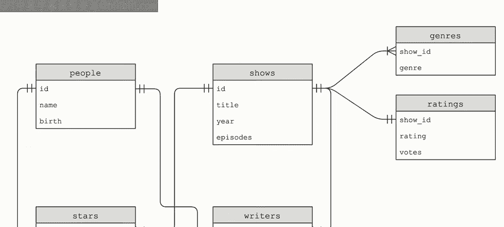

以下是一个示例程序，它提示用户输入喜欢的语言，然后使用 SQL 查询数据库中喜欢该语言的人数：
```python
from cs50 import SQL

# 连接到数据库
db = SQL("sqlite:///favorites.db")

# 获取用户输入
favorite = input("Favorite: ")

# 执行 SQL 查询，使用 ? 作为占位符以防止 SQL 注入攻击
rows = db.execute("SELECT COUNT(*) AS n FROM favorites WHERE language = ?", favorite)

# 提取结果
row = rows[0]
print(row["n"])
```
使用占位符 `?` 并将用户输入作为参数传递，是防止 **SQL 注入攻击** 的关键安全实践。

---

## 数据库的潜在问题与解决方案

使用数据库时，需要注意两个重要问题：

1.  **竞态条件**：当多个操作同时读取和修改同一数据时，可能发生数据不一致。例如，两个用户几乎同时给一个帖子点赞，计数器可能只增加一次而不是两次。
    *   **解决方案**：使用**事务**。事务确保一系列数据库操作要么全部成功，要么全部失败，不会被其他操作中断。
    ```sql
    BEGIN TRANSACTION;
    -- 执行一系列查询
    COMMIT;
    ```


2.  **SQL 注入攻击**：如果直接将用户输入拼接到 SQL 查询字符串中，恶意用户可能输入特殊字符来改变查询意图，甚至破坏数据库。
    *   **解决方案**：**永远不要信任用户输入**。始终使用参数化查询（如上面的 `?` 占位符），让数据库库来处理输入的安全转义。

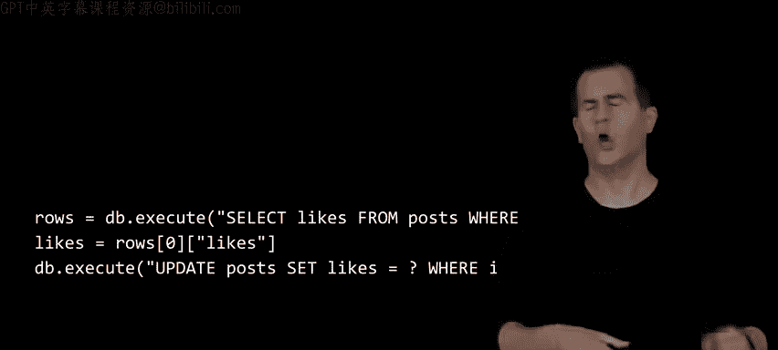


---

## 总结


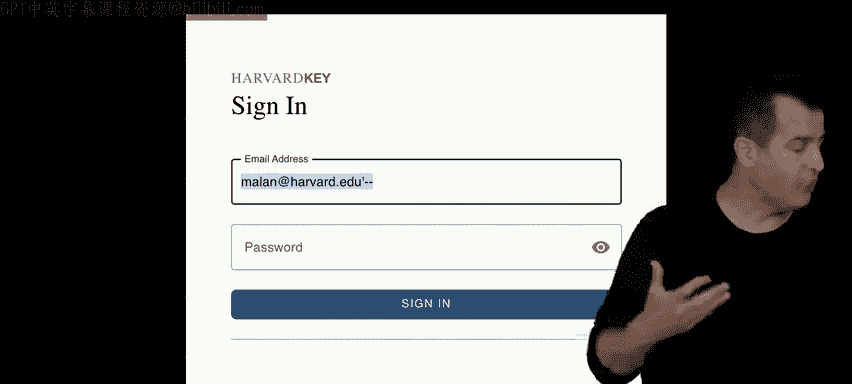

本节课中我们一起学习了 SQL 的核心概念和应用。我们从处理简单的 CSV 文件开始，过渡到使用 SQLite 关系型数据库。我们学习了如何设计包含主键、外键和多表关系的数据库模式，并掌握了使用 `SELECT`、`JOIN`、`GROUP BY`、`WHERE` 等子句进行数据查询、过滤、分组和连接。

我们还探讨了通过创建索引来优化查询性能，了解了在 Python 程序中安全执行 SQL 查询的方法，并认识了数据库应用中常见的竞态条件和 SQL 注入攻击及其防范措施。


SQL 是一种强大而高效的工具，能够让我们用简洁的代码表达复杂的数据操作。理解其原理和最佳实践，对于构建可靠、高效的应用程序至关重要。