# CS50X 计算机科学导论：2：数组


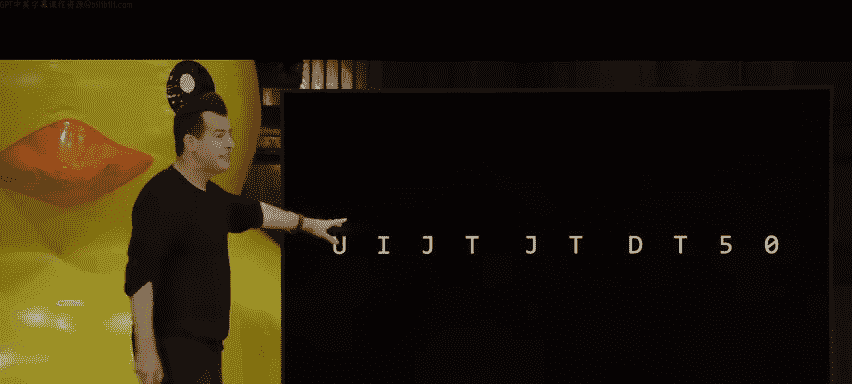

在本节课中，我们将学习计算机程序编译的底层过程，探索调试代码的有效工具，并深入理解一种新的数据结构——数组。我们将了解数组如何存储数据，以及如何利用它们来操作文本，例如计算字符串长度或实现简单的加密算法。

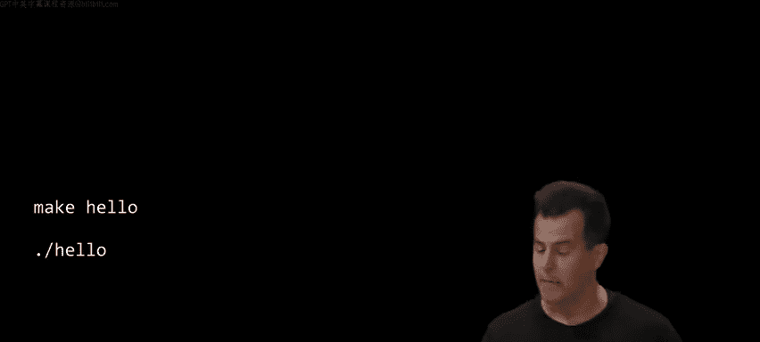

## 编译过程揭秘


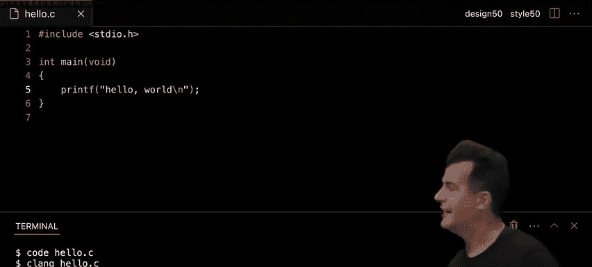

上一节我们介绍了如何使用 `make` 命令编译程序，本节中我们来看看这个命令背后究竟发生了什么。编译并非一个单一步骤，而是由四个阶段组成：预处理、编译、汇编和链接。

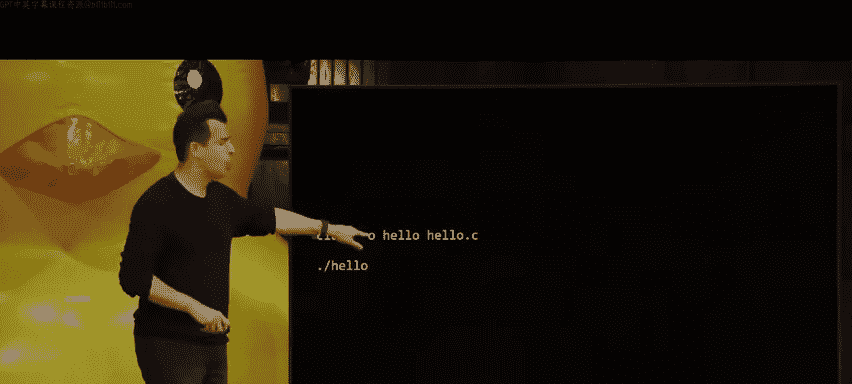

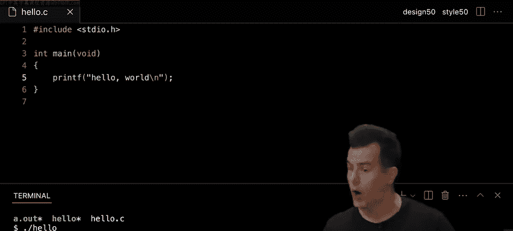

*   **预处理**：处理源代码中以 `#` 开头的指令（如 `#include`）。预处理器会找到指定的头文件（如 `stdio.h`），并将其内容“复制粘贴”到你的源代码中。
*   **编译**：将预处理后的 C 语言代码翻译成另一种更低级的语言，称为**汇编语言**。这种语言更接近计算机 CPU 能直接理解的指令。
*   **汇编**：将汇编语言代码转换为计算机能直接执行的**机器码**，即由 0 和 1 组成的二进制指令。
*   **链接**：将你的程序代码编译成的机器码，与所有用到的库函数（如 `printf` 来自 `stdio.c`）的机器码合并成一个完整的可执行文件。

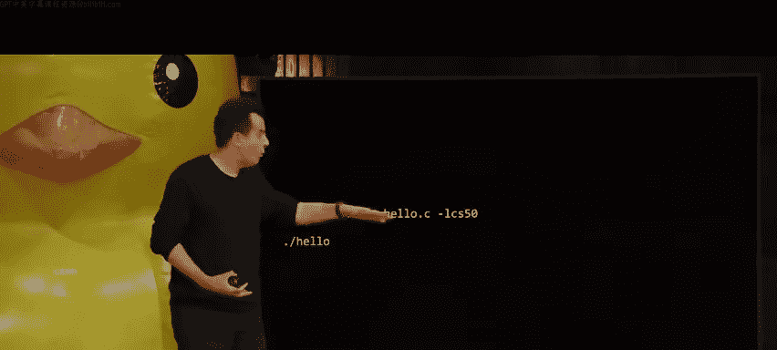

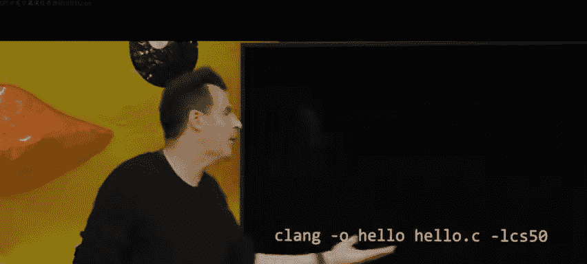

当我们运行 `make hello` 时，它实际上是在后台替我们执行了类似 `clang -o hello hello.c` 的命令，其中 `clang` 就是执行上述四个步骤的编译器程序。

## 调试技巧

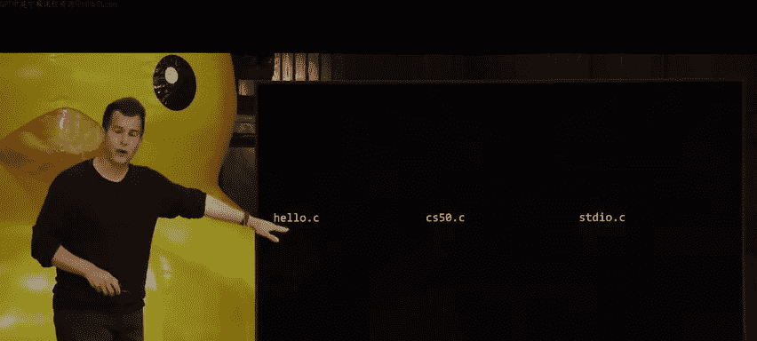

编写代码时难免出错，本节我们将学习两种查找和修复错误（即“调试”）的方法。

### 使用 `printf` 进行调试

一种简单直接的调试方法是在代码中临时插入 `printf` 语句，打印出关键变量在运行过程中的值，从而观察程序逻辑是否符合预期。


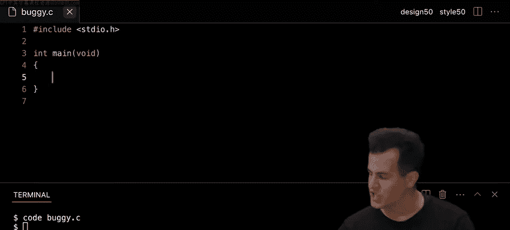


例如，以下循环错误地打印了四个 `#` 号，而我们只想打印三个：
```c
for (int i = 0; i <= 3; i++)
{
    printf("#\n");
}
```
通过添加 `printf(“i is %i\n”, i);`，我们可以清楚地看到 `i` 的值从 0 变化到 3，共循环了 4 次，从而发现应将条件 `i <= 3` 改为 `i < 3`。

### 使用调试器 (Debugger)

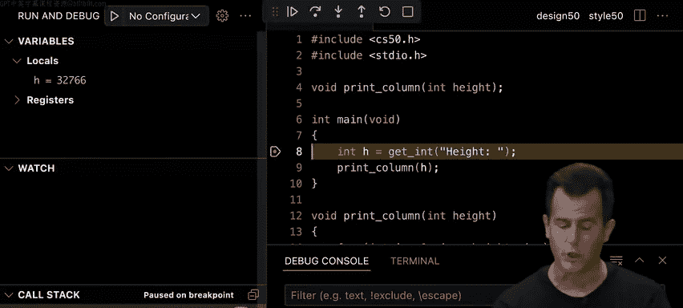

对于更复杂的程序，使用集成开发环境（如 VS Code）中的调试器是更强大的方法。调试器允许你：
1.  **设置断点**：在代码的特定行暂停程序执行。
2.  **逐步执行**：一次运行一行代码，观察程序状态的变化。
3.  **检查变量**：在程序暂停时，查看所有变量的当前值。

在 CS50 环境中，你可以使用 `debug50` 命令来启动调试器。这能让你直观地看到代码执行的流程和内存中数据的变化，是理解程序行为和定位复杂错误的利器。

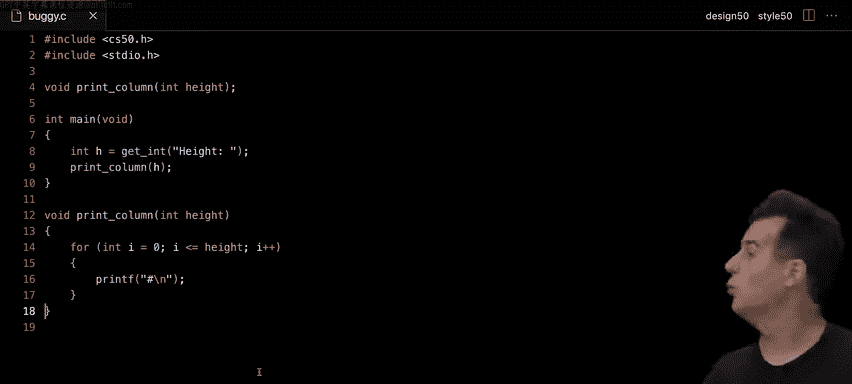

## 数组

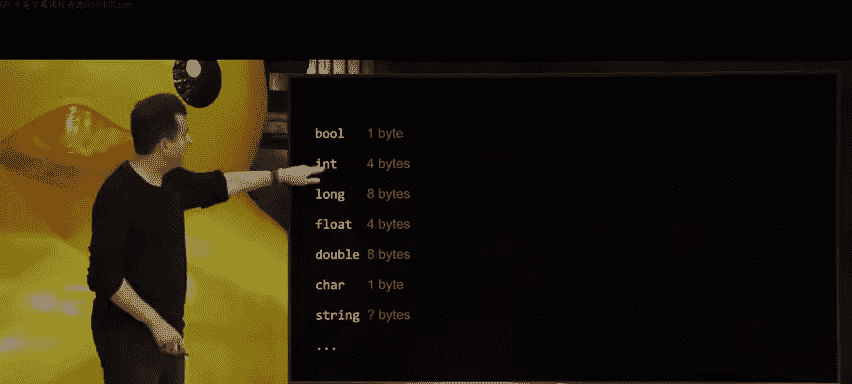

之前我们处理多个同类数据（如三门成绩）时，需要创建多个独立的变量（`score1`, `score2`, `score3`），这非常繁琐且不易扩展。本节我们将学习**数组**，它是一种能存储多个相同类型值的单一数据结构。

### 数组的概念与语法

数组是一块**连续的内存空间**，用于存储一系列**相同类型**的数据。

以下是创建和使用数组的语法：
```c
// 声明一个可以存储3个整数的数组
int scores[3];

// 为数组元素赋值（索引从0开始）
scores[0] = 72;
scores[1] = 73;
scores[2] = 33;

// 访问和使用数组元素
int average = (scores[0] + scores[1] + scores[2]) / 3.0;
```
通过使用循环，我们可以更高效地处理数组：
```c
for (int i = 0; i < 3; i++)
{
    scores[i] = get_int(“Score: “);
}
```

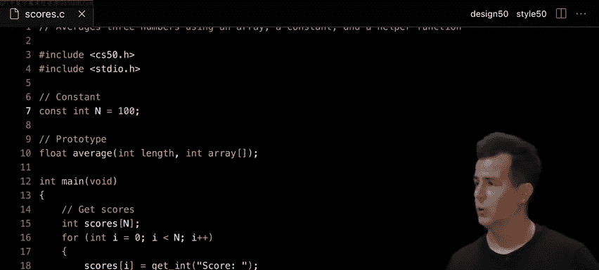

### 字符串即字符数组

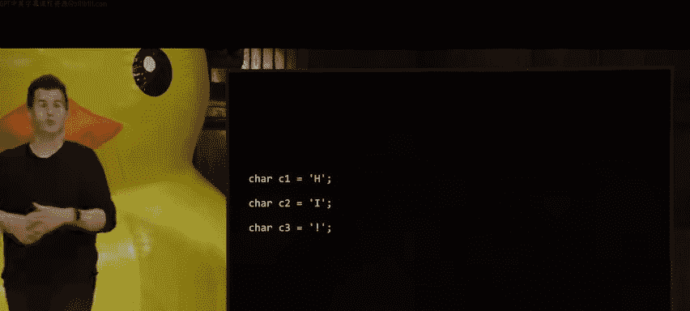

在 C 语言中，**字符串本质上就是字符数组**。字符串有一个特殊之处：它的末尾会自动添加一个空字符 `\0`（其 ASCII 值为 0）作为结束标记。

这意味着字符串 `”Hi!”` 在内存中实际存储为四个字符：`‘H’`, `‘i’`, `‘!’`, `‘\0‘`。

理解这一点后，我们就可以手动计算字符串的长度：
```c
int n = 0;
while (s[n] != ‘\0‘)
{
    n++;
}
printf(“Length: %i\n”, n); // 打印字符串长度
```
当然，更简单的方法是使用 `string.h` 库中的 `strlen(s)` 函数。

## 命令行参数

到目前为止，我们的程序都是在运行后通过 `get_string` 等函数获取用户输入。本节我们将学习另一种输入方式：**命令行参数**。它允许用户在启动程序时就直接提供输入信息。

`main` 函数可以接收两个参数来实现此功能：
```c
int main(int argc, string argv[])
{
    ...
}
```
*   `argc` (argument count)：一个整数，表示命令行参数的数量。
*   `argv` (argument vector)：一个字符串数组，存储了所有的命令行参数。
    *   `argv[0]` 始终是程序的名称。
    *   `argv[1]` 是用户输入的第一个参数，依此类推。

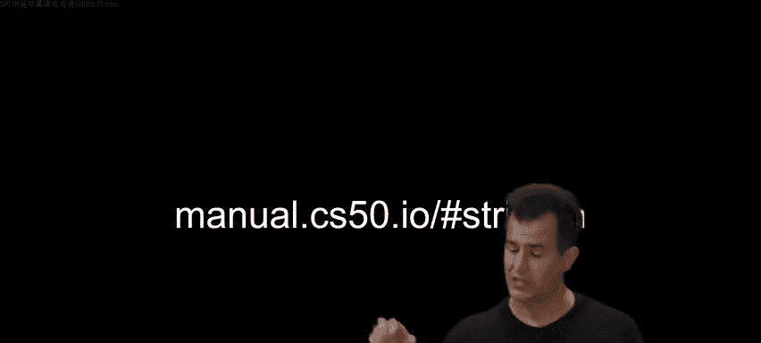

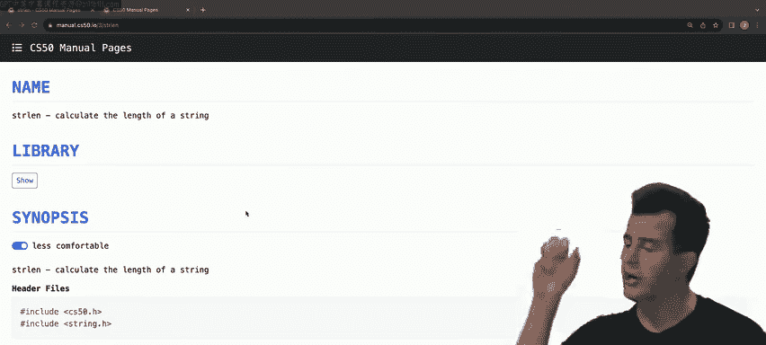

例如，运行 `./greet David` 后，在程序中：
*   `argc` 的值为 2。
*   `argv[0]` 是 `”./greet”`。
*   `argv[1]` 是 `”David”`。

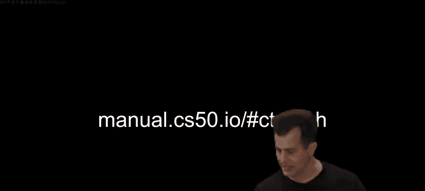

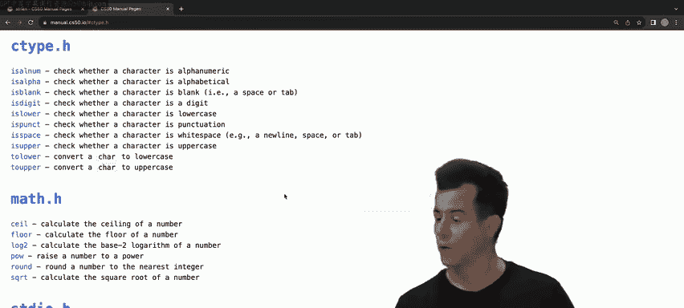

我们可以这样使用它们：
```c
if (argc == 2)
{
    printf(“Hello, %s\n”, argv[1]);
}
else
{
    printf(“Hello, world\n”);
}
```

## 应用示例：字符大小写转换与简单加密

利用数组和对字符 ASCII 码的理解，我们可以轻松实现文本处理功能。

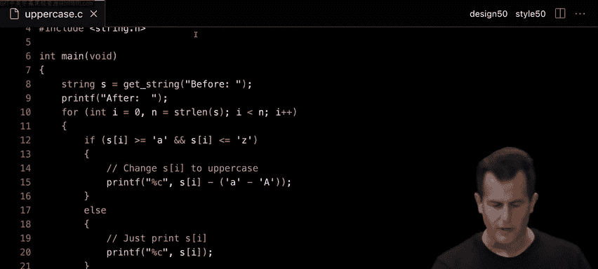

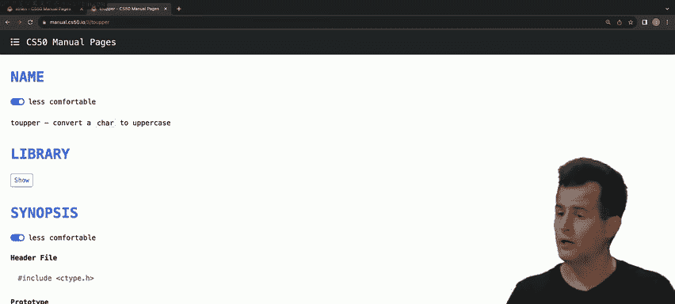

### 大小写转换

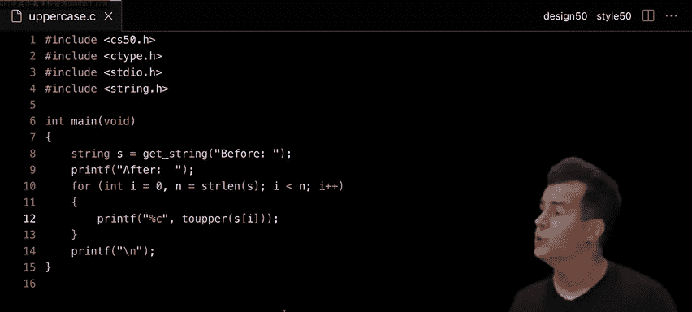

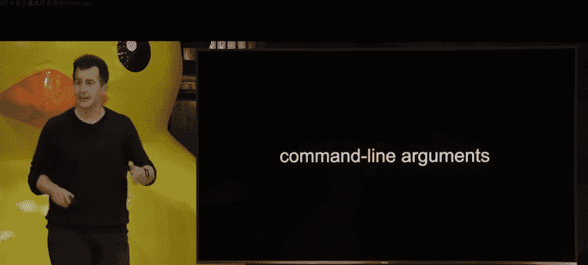

我们知道，在 ASCII 码表中，同一个字母的大小写相差 32。例如，`‘a‘`（97）和 `‘A‘`（65）相差 32。因此，可以通过加减 32 来进行转换。

更优雅的方式是使用 `ctype.h` 库中的函数：
```c
#include <ctype.h>
...
char c = ‘h‘;
char upper_c = toupper(c); // ‘H‘
char lower_c = tolower(‘H‘); // ‘h‘
```

### 凯撒加密

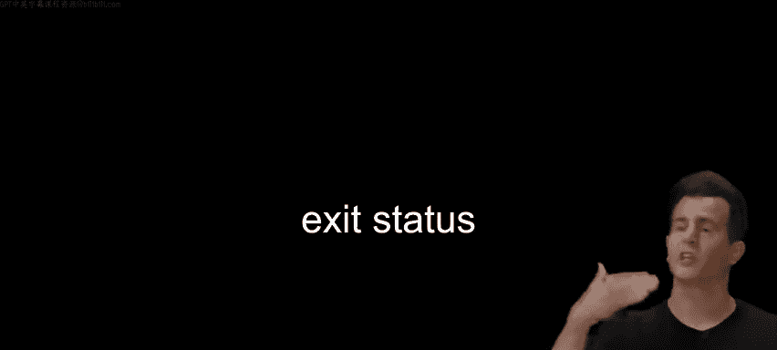

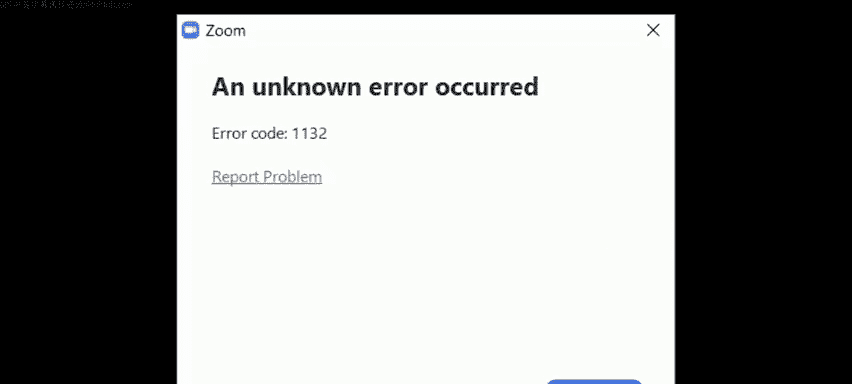

凯撒密码是一种简单的加密算法，通过将字母按字母表顺序偏移固定位置（即密钥）来实现加密。例如，密钥为 1 时，`”Hi!”` 加密后变成 `”Ij!”`。

加密和解密的核心操作是字符的“旋转”。需要考虑边界情况，例如 `‘z‘` 加 1 后应变成 `‘a‘`。
```c
// 概念性代码：将明文字符 plain 用密钥 key 加密
if (isalpha(plain)) // 如果是字母
{
    char base = islower(plain) ? ‘a‘ : ‘A‘; // 确定基准点
    // 计算偏移后的字符，并处理回绕
    cipher = (plain - base + key) % 26 + base;
}
else
{
    cipher = plain; // 非字母字符不变
}
```
解密过程则是将加密过程反向进行（减去密钥）。

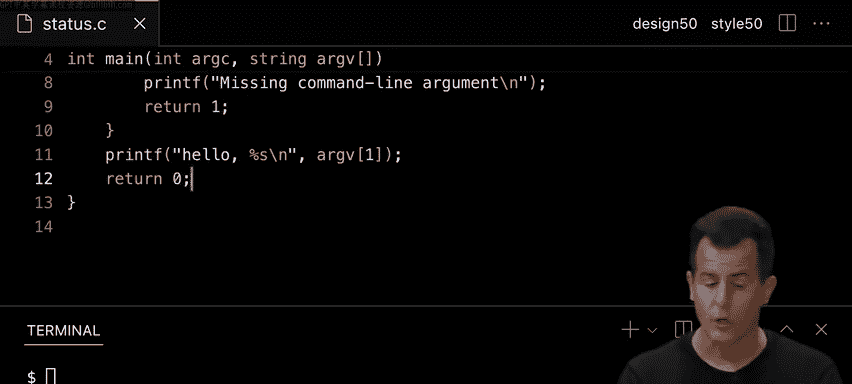

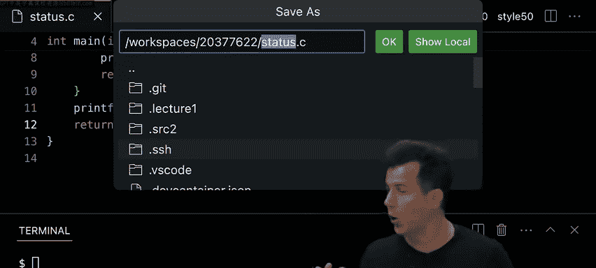

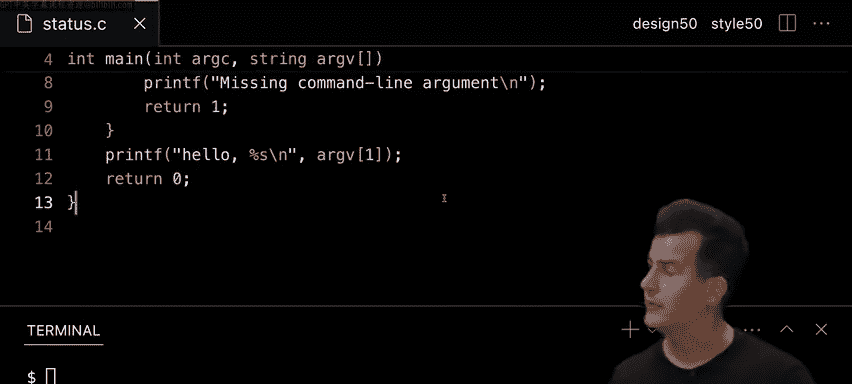

## 总结

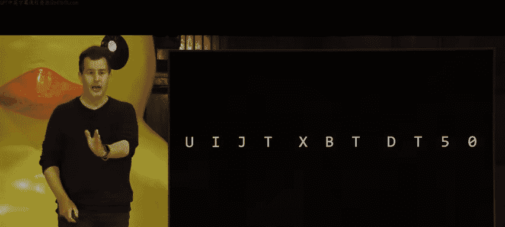


本节课中我们一起深入探索了 C 语言编程的多个核心概念。我们揭开了编译过程的神秘面纱，了解了从源代码到可执行文件的四个步骤。我们掌握了使用 `printf` 和调试器来高效排查代码错误的方法。我们重点学习了**数组**这一强大的数据结构，明白了它如何高效地存储和管理同类型数据集合，并认识到 C 语言中的**字符串本质上是字符数组**。我们还学会了如何通过命令行参数让程序在启动时接收输入。最后，我们运用这些新知识，探索了字符大小写转换的原理，并接触了凯撒加密算法这一经典密码学实例，为解决更复杂的问题打下了坚实基础。