# CS50X 计算机科学导论：第3周：算法 🧠

## 概述
在本节课中，我们将要学习算法的核心概念，包括如何评估算法的效率，以及如何实现和比较不同的搜索与排序算法。我们将从线性搜索和二分搜索开始，然后探讨选择排序、冒泡排序和归并排序，并使用大O符号等渐近记法来分析它们的运行时间。

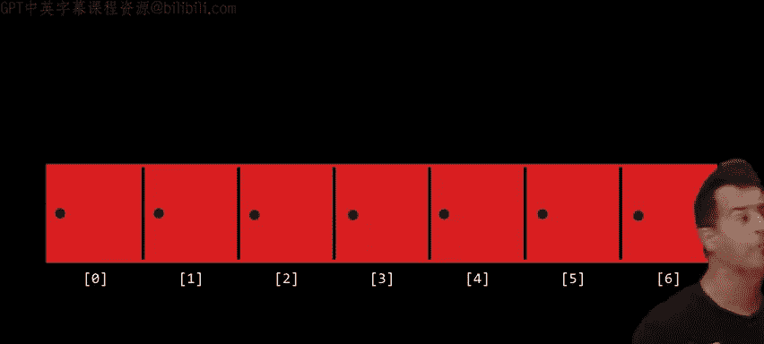

---

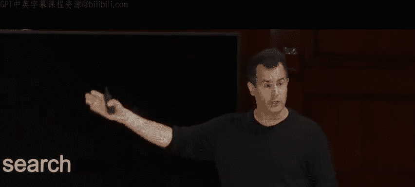

## 从搜索算法开始

上一节我们回顾了第0周关于算法设计的初步讨论，本节中我们来看看如何具体实现搜索算法。

在计算机科学中，搜索是一个基础问题。输入是一个数组（例如一系列数字或名字），输出是一个布尔值，表示目标值是否存在于数组中。

### 线性搜索
线性搜索是最直观的搜索方法。它从数组的一端开始，逐个检查每个元素，直到找到目标值或遍历完整个数组。

以下是线性搜索的伪代码描述：
```
对于数组中的每一个元素（从左到右）：
    如果当前元素等于目标值：
        返回 true
如果遍历完所有元素仍未找到：
    返回 false
```

**关键点**：线性搜索在最坏情况下需要检查数组中的每一个元素。如果数组有 `n` 个元素，那么最坏情况下的运行时间是 **O(n)**。

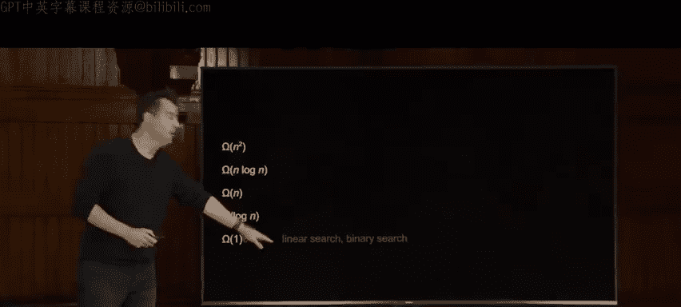

### 二分搜索
如果数组是**已排序**的，我们可以使用更高效的二分搜索算法。它的核心思想是“分而治之”：不断将搜索范围减半。

以下是二分搜索的伪代码描述：
```
如果数组中没有元素：
    返回 false
如果中间元素等于目标值：
    返回 true
否则，如果目标值小于中间元素：
    在数组的左半部分递归执行二分搜索
否则（目标值大于中间元素）：
    在数组的右半部分递归执行二分搜索
```

**关键点**：二分搜索每次都将问题规模减半。对于一个大小为 `n` 的已排序数组，其最坏情况下的运行时间是 **O(log n)**。但请注意，二分搜索**要求输入数据必须是有序的**。

---

## 评估算法效率：渐近记法

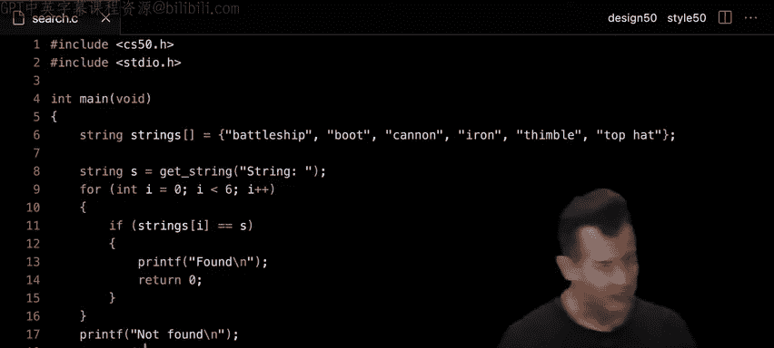

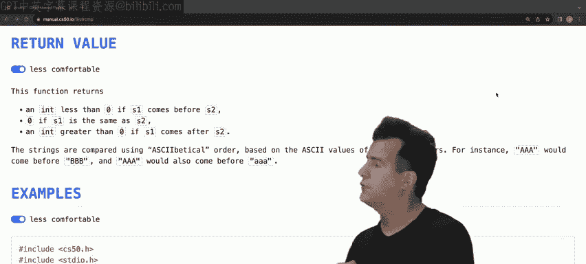

在比较算法时，我们关心的是当输入规模 `n` 变得非常大时，算法的性能如何。我们使用**渐近记法**来描述算法的运行时间。

*   **大O符号 (O)**：描述算法运行时间的**上界**，即最坏情况下的性能。
    *   例如，线性搜索是 O(n)。
*   **大Ω符号 (Ω)**：描述算法运行时间的**下界**，即最好情况下的性能。
    *   例如，线性搜索在最好情况下（目标在第一个）是 Ω(1)。
*   **大Θ符号 (Θ)**：当算法的最好和最坏情况运行时间在渐近上相同时使用。
    *   例如，选择排序是 Θ(n²)。

**核心思想**：我们关注最高阶的项，并忽略常数因子，因为当 `n` 很大时，它们的影响微乎其微。

---

## 实现数据结构：结构体

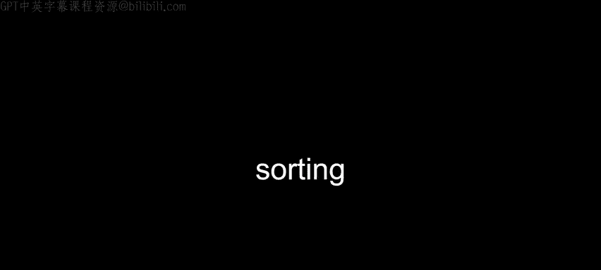

在实现更复杂的算法（如电话簿）之前，我们需要一种将相关数据捆绑在一起的方法。C语言中的**结构体**允许我们创建自定义的数据类型。

例如，我们可以定义一个 `person` 结构体来存储一个人的姓名和电话号码：
```c
typedef struct
{
    string name;
    string number;
}
person;
```
然后，我们可以创建一个 `person` 类型的数组，并使用点运算符 `.` 来访问每个结构体的字段：
```c
people[0].name = "David";
people[0].number = "+1-617-495-1000";
```
这比使用两个平行的数组（一个存名字，一个存号码）更安全、更清晰。

---

## 排序算法

搜索通常更适用于已排序的数据。那么，如何对数据进行排序呢？本节我们将探讨三种排序算法。

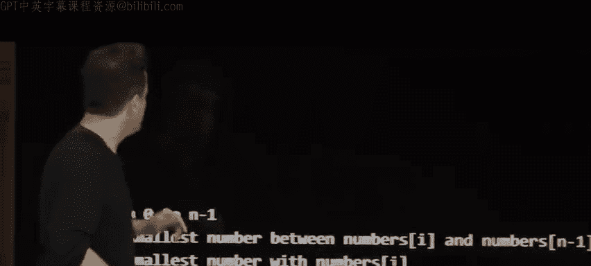

### 选择排序
选择排序的思路是：反复从未排序的部分中找出最小（或最大）的元素，并将其放到已排序部分的末尾。

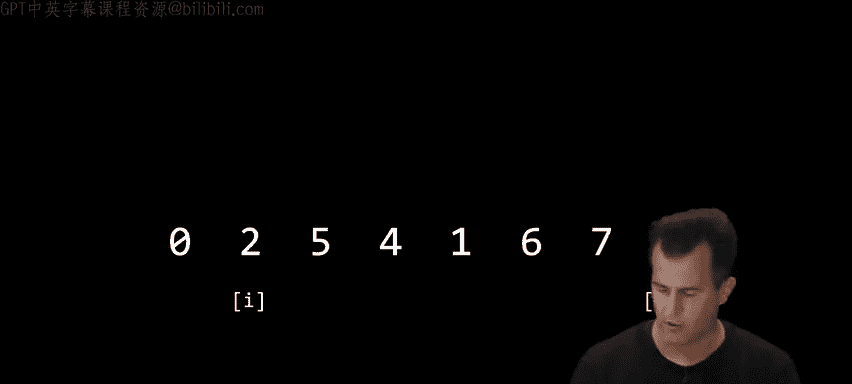

**算法步骤**：
1.  找到数组中最小的元素。
2.  将其与数组第一个位置的元素交换。
3.  在剩余未排序的数组中重复步骤1和2。

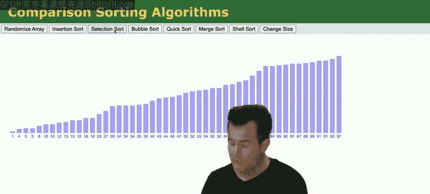

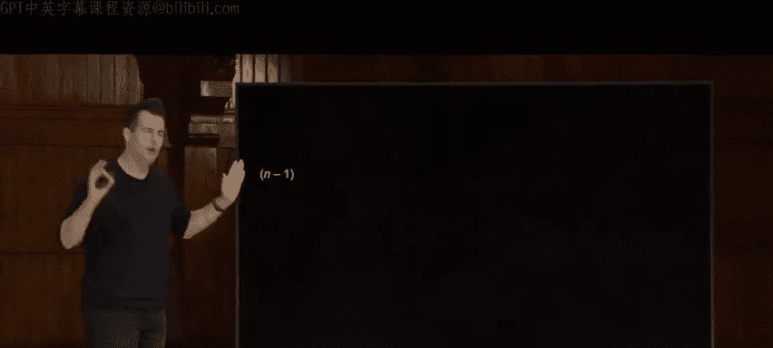

**运行时间分析**：选择排序需要进行大约 (n²)/2 次比较，因此其运行时间是 **Θ(n²)**。无论输入数据是否已排序，它都需要进行这么多步骤。

### 冒泡排序
冒泡排序通过反复交换相邻的无序元素来工作，较大的元素会像“气泡”一样逐渐“浮”到数组的顶端。

**算法步骤**：
1.  从数组开始处开始，比较相邻元素。
2.  如果顺序错误（例如前一个比后一个大），则交换它们。
3.  对每一对相邻元素重复此过程，直到数组末尾。完成一次后，最大的元素已就位。
4.  重复步骤1-3，每次忽略最后一个已排序的元素，直到没有交换发生。

**运行时间分析**：基础版本的冒泡排序运行时间也是 **O(n²)**。但可以优化：如果在一轮遍历中没有发生任何交换，则说明数组已排序，可以提前终止。优化后，最好情况（数组已排序）下的运行时间是 **Ω(n)**。

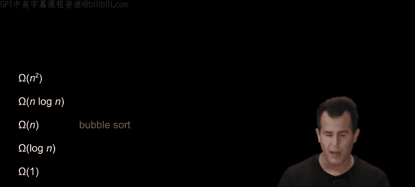

### 归并排序
归并排序是一种更高效、采用“分治法”的排序算法。它是**递归算法**的一个经典例子。

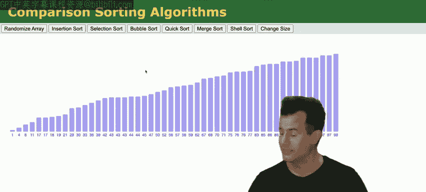

**算法步骤**：
1.  **递归地将数组分成两半**，直到每个子数组只有一个元素（一个元素的数组自然是有序的）。
2.  **合并**：将两个已排序的子数组合并成一个新的有序数组。合并时，使用两个“指针”分别指向两个子数组的开头，比较指针所指元素，将较小的放入新数组，并移动该指针。

**运行时间分析**：
*   **分解**：将数组分解到单元素需要 **log n** 层。
*   **合并**：每一层的合并操作总共需要 **n** 次比较（因为每个元素都会被处理一次）。
*   总运行时间为 **Θ(n log n)**，这比选择排序和冒泡排序的 n² 要快得多。

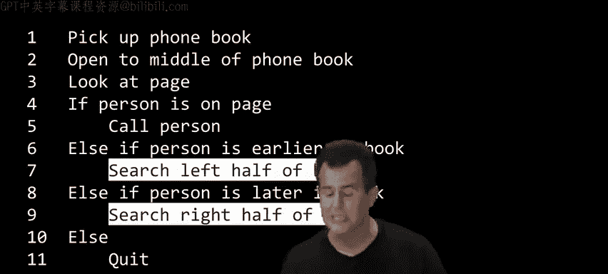

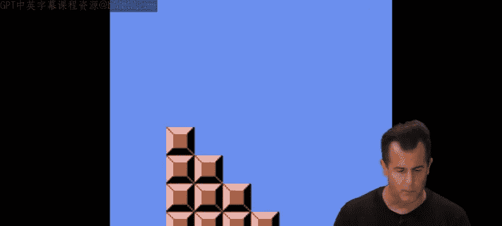

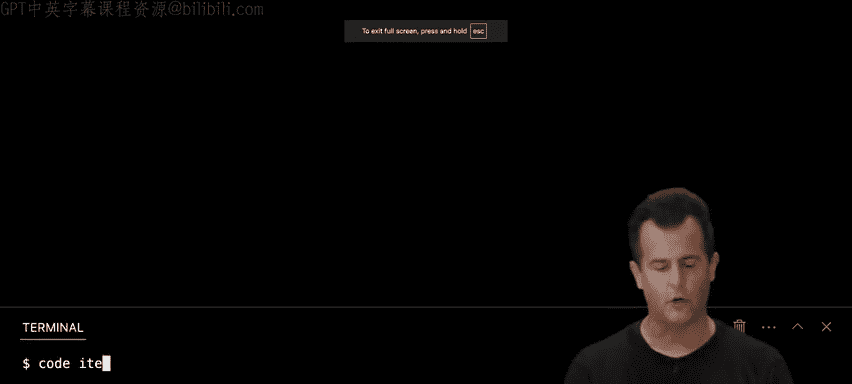

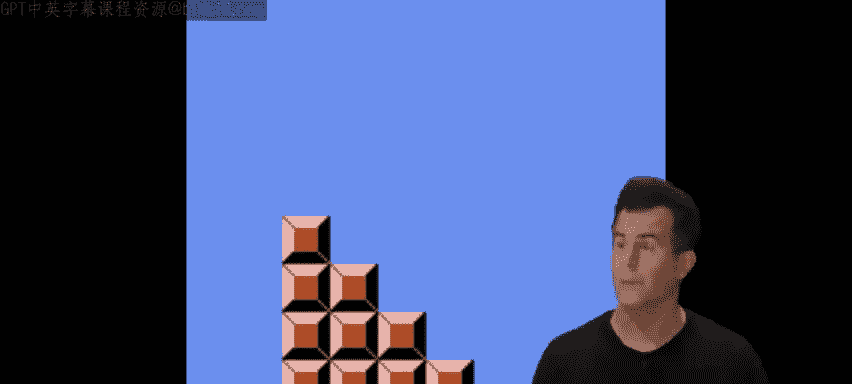

**空间权衡**：归并排序在合并时需要额外的存储空间，这是一种典型的“以空间换时间”的权衡。

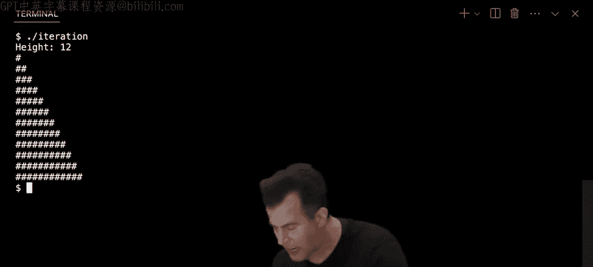

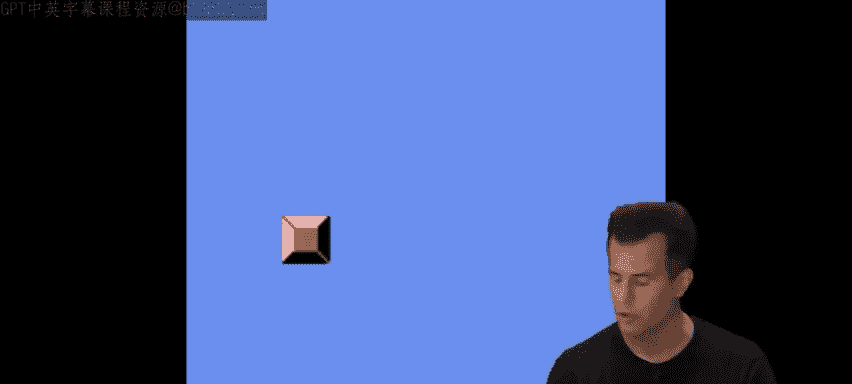

---

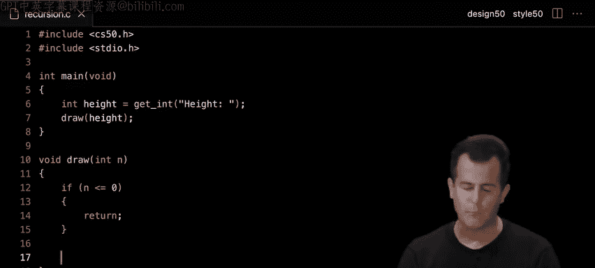

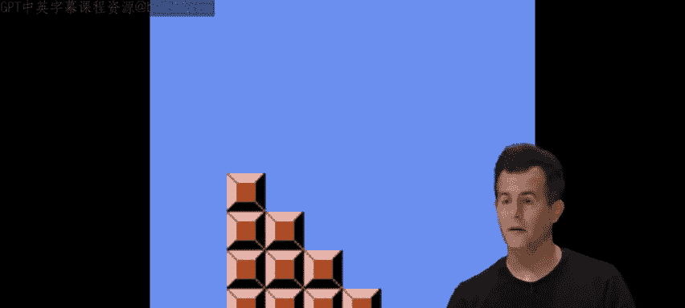

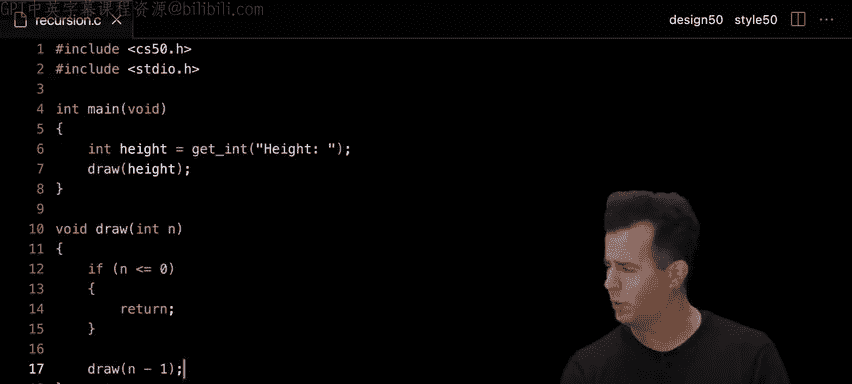

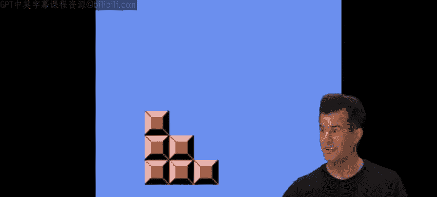

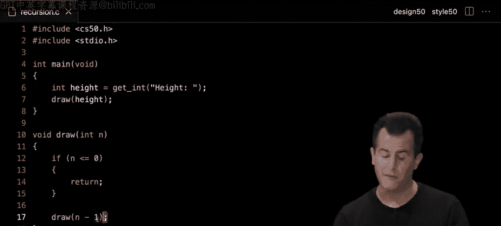

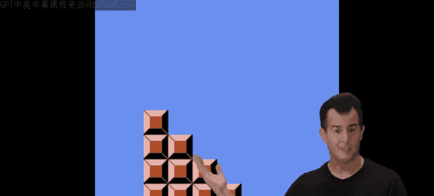

## 递归：一个强大的工具

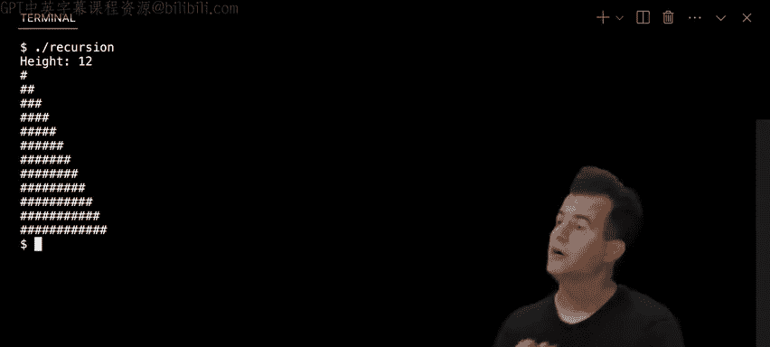

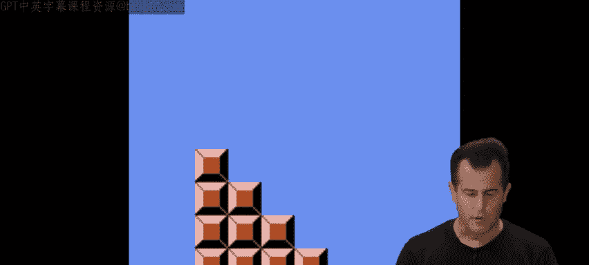

归并排序展示了**递归**的力量。一个递归函数会调用自身来解决更小规模的子问题。

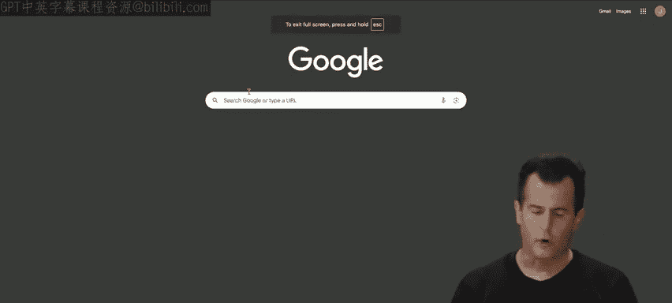


**递归的两个关键部分**：
1.  **基准情况**：最简单、不可再分的情况，直接提供答案，阻止无限递归。
2.  **递归情况**：将问题分解成一个或多个更小的子问题，并递归调用函数自身来解决这些子问题。

例如，用递归打印一个高度为 `n` 的金字塔：
```c
void draw(int n)
{
    // 基准情况：高度为0，什么也不做
    if (n <= 0)
    {
        return;
    }

    // 递归情况：先画一个高度为 n-1 的金字塔
    draw(n - 1);

    // 然后画最下面的一行（n个砖块）
    for (int i = 0; i < n; i++)
    {
        printf("#");
    }
    printf("\n");
}
```

---

## 总结

本节课中我们一起学习了算法的核心概念。
*   我们比较了**线性搜索 (O(n))** 和**二分搜索 (O(log n))**，理解了数据有序性的重要性。
*   我们引入了**渐近记法（大O、大Ω、大Θ）** 来科学地描述和比较算法的效率。
*   我们使用**结构体**来更好地组织数据。
*   我们详细分析了三种排序算法：
    *   **选择排序** 和 **冒泡排序**，它们简单但较慢，运行时间为 **O(n²)**。
    *   **归并排序**，它利用递归和分治法，实现了更快的 **O(n log n)** 运行时间。
*   我们探讨了**递归**作为一种强大的问题解决范式，它通过将问题分解为更小的自相似问题来工作。


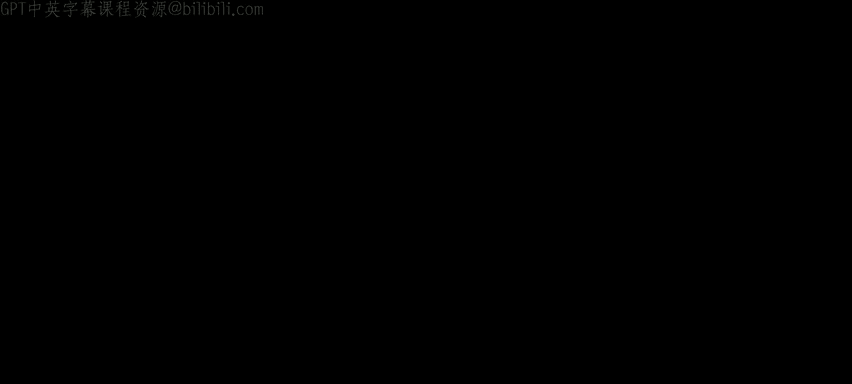

理解这些算法的原理和效率，是成为一名能够设计出既正确又高效程序的工程师的重要基础。在现实世界中，你通常不需要自己实现排序算法（可以使用库），但理解它们背后的思想至关重要。