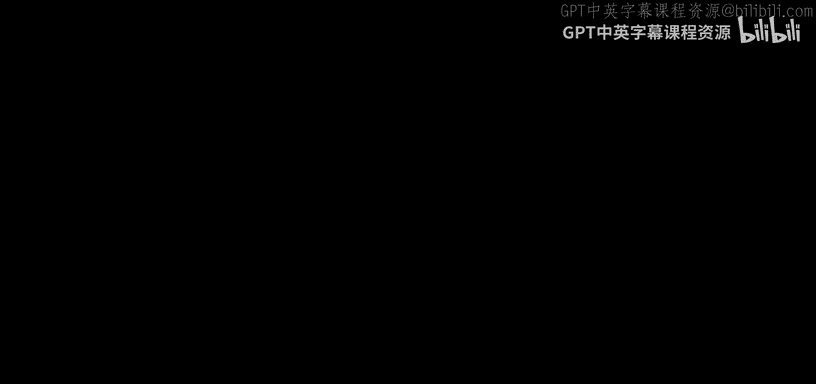

# 哈佛大学《CS50X 计算机科学导论｜introduction to computer science 2025》中英字幕（deepseek - P1：-01-CS50x 2025 - Introduction.zh_en - GPT中英字幕课程资源 - BV1hFrxYPEfa

Hello， world。 My name is David Main and this is C S 50。

 Harvard University's introduction to the intellectual enterprises of computer science and the art of programming for majors and non majors alike。

 Indeed， whether you're among those less comfortable or more comfortable with technology。

 this course in computer science more generally are， in fact for you。

 and it is free via platforms likeedx， YouTube， Apple TV。

 Google TV and C50's own website through this course， you'll learn how to think more methodically。

 more algorithmically， so to speak。 you'll learn how to communicate succinctly and precisely。

 and you'll learn how to solve problems efficiently with code。 Indeed。

 this course begins at the very beginning with a very friendly graphical programming language called scratch via which you'll write code by dragging and dropping puzzle pieces that only interlock together if it makes logical sense to do so We then transition to see a more traditional keyboardbased language via which you'll learn how computers work underneath the hood。

 so to speak Thereafter， the course moves on to Python， a more modern。😊。

Wage via which you can analyze data， automate processes。

 build web applications and more and SQL via which you can read and write lots and lots of data in databases toward courses end will dive into HTML CSS and jascript languages which you can create web apps and mobile apps alike and at courses end。

 you'll design and implement your very own final project for the world to see you will have learned how to program。

 And if at any point you get stuck。 there's a whole CS50 community to support you as well as nowadays。

 a virtual rubber duck of whom you can also ask questions anytime thanks to AI All this and more this is CS 50。

