# 哈佛大学《CS50X 计算机科学导论｜introduction to computer science 2025》中英字幕（deepseek - P3：-03-CS50x 2025 - Lecture 1 - C.zh_en - GPT中英字幕课程资源 - BV1hFrxYPEfa

🎼Yeah。Alright， this is C S 50。 This is week 1 because of course， last week was week 0。

 and this is the week where we'll actually start programming in a much more traditional way。

 that programming language we promised called C。 Of course， we started with this。

 And hopefully by now， with problem set one， you've had a little bit of fun even if you've played with it before。

 and the goals of scratch beyond sort making things feel very accessible and user friendly is really to elucidate some of the fundamental concepts that we'll see again today。

 and really every week subsequently， like functions and conditionals and loops and variables and so much more。

 And in fact， among the goals of scratch is again， to kind of plant these visuals in your mind。

 So even as today onward feels all the more like a fire hose。

 especially when it comes to really weird cryptic textual syntax。

 the ideas are still going to be the same。 So today， this program， hello world becomes this instead。

 And in fact， just a color code things temporarily I dare say that what I've color coded here in orange。

 which looks probably to those of you。😊。

Program pretty cryptic is the equivalent of the when green flag clicked orange puzzle piece like this。

 What remains is just one line in purple with a bit of white。

 which is what ultimately is going to get the screen today to say， hello world on the screen。 And。

 of course， we had a name for something in purple。 In fact， if we rewind to week 0。

 this block in purple represented。 what type of functionality。

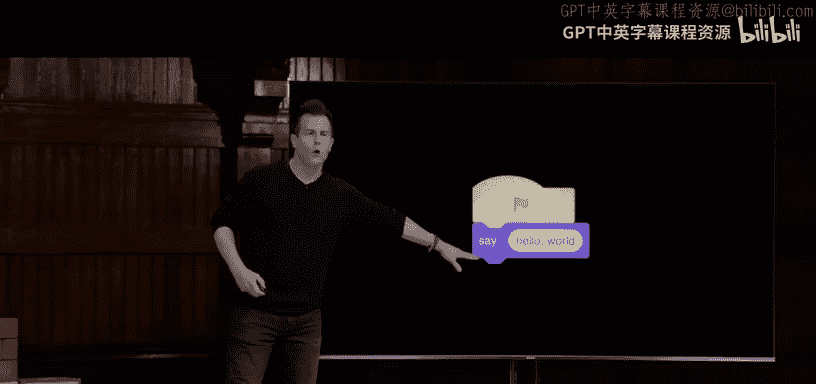

A。I function itself。 an action a verb that gets the computer to do something。

 So what looked like this last week is about to look like this。

 Let's take away the color coding and focus really on what we're gonna now start calling source code。

 So this is what programmers do in the real world。 This is what software developers。

 So engineers do in the real world。 They write code that looks like this。 And clearly。

 it's a little English like， but it's not English in the way you would compose an essay or an email。

Clearly， there's some patterns and some special syntax to it that will highlight ultimately today。

 The problem is， though that computers， of course， don't understand source code。

 They only per last week Under like zeros and ones。 That is it the so-called binary system。

 So somehow we've got to get what already looks cryptic into something that looks at a glance。

 even more cryptic。 The zeros and ones。 the computers do understand。 And for today's purposes。

 just know that built into your Mac， PCs and phones there is a builtin understanding of what these patterns mean。

 Maybe it means a number， maybe it means a letter But today， maybe it means an instruction。😊。

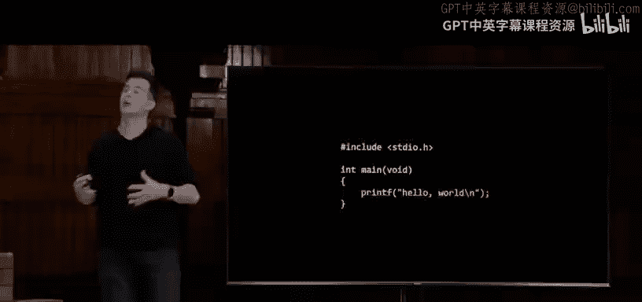

Like print something on the screen or save something or load something。

 That is to say computers use patterns of bits。 not only to represent all the stuff we talked about last week。

 numbers， letters， colors， images， sounds， and all of that。

 They also use patterns of bits to represent fundamental functionality， print things。

 play things much like those same scratch blocks。 But no computer scientist really。

 unless they take out a paper pencil or write a program or use a website to convert this can sort of read this and know what's going on。

 That's why we humans are actually going use not machine code。

 as it is called the zeros and ones that computers understand。

 we are gonna start writing source code。 And last week， you already wrote source code。

 but in the form of dragging and dropping those puzzle pieces。

 So this too is gonna to be the paradigm that sort of guides us through the entire semester。

 problemble solving。 programming is really about input becoming output and we'll focus today then on a certain type of input becoming output。

 Someone has to get the source code that's written in a language like see into the machine code。

 the zeros and ones that the computer actually understands。

So source code today is going to be our input。 Mach code is going to be our output。

 and we're gonna give you today。 a special program called a compiler whose purpose in life is to translate one to the other。

 And there's compilers for different languages in the world。

 we're gonna focus on one that supports today's language known as C。 And here， as promised。

 is the programming environment were going to use。 It's tailored to C 50。

 which is to say we've preinstalled certain software that you might find useful during the term。

 but for all intents and purposes， the tool you will use for C 50's problem sets henceforth is a very popular industry standard tool called visual studio code or Vs code for short。

 We are using a cloudbased version of it that lives literally this URL C50 you can sign into that So long as you have a free Github account with which for which you signed up presumably already。

 And that will give you access to not only an industry standard programming environment。 but again。

 an environment that has some C 50 specific things preinstalled。

 And at the end of the semester or even in the middle you're so inclined， you can actually download。

😊。

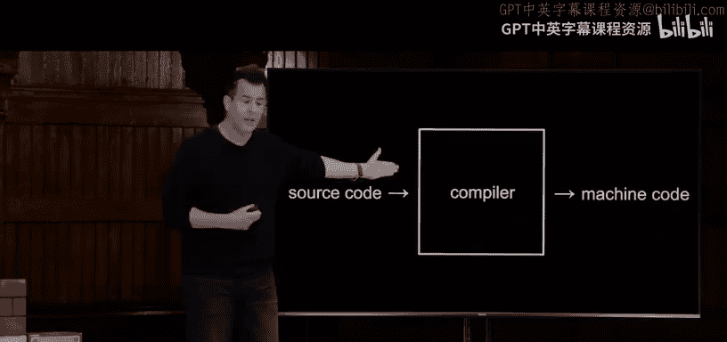

For free VS code onto your Mac PC， you can disconnect from the Internet。

 and you can actually program on your own computer。 caveat， though。

 is that you tend to hit technical support headaches in the very beginning of the term。

 So we suggest you do that later in the term once you're already comfortable with this cloudbased environment here。

 And here it is。 This is what programming shall look like whether we're using C now or Python in a few weeks or jascript or SQL thereafter。

 So here is what what is VS code configured as follows at the top right。

 you'll generally have one or more tabs for code， much like tabs in a browser。

 And this is where you'll write code that looks a little something like this。 And in fact。

 this is exactly the code that you saw a moment ago。 What VS code does。 among other things。

 is it actually highlights your code for you。 It colorizes in what's generally in an illuminating way。

 So I did not choose to make this red。 I did not choose to make this blue in this purple。

 the computer sort of automatically does that for you as well soon see So sort of draw your attention to different ideas in the program itself that all happens。

😊，Automatically at the bottom here， you're gonna use a more advanced interface today onward known as a command line interface in the form of a terminal window。

 So you can still use your mouse or trackpad and click and drag and do things like that in this environment。

 but you'll find and many programmers prefer that it's much more efficient ultimately to use your keyboard more often than the mouse or the trackpa。

 So we'll introduce you to that textbased terminal window there appear at top left。

 you'll have a file Expr。 So what's nice about VS code is that not only will you have textual commands with which you'll get comfy。

 you also have like a normal Mac or PC or phone nowadays。

 like literally files and folders will visually appear appear to you。

 so you can play with or manipulate them there。 And then lastly， this is sort of like the menu。

 the so-called activity bar that just has icons for various features， including C S 50's duck。

 So in fact， if you poke around。 you'll see ultimately a duck icon when you log in which is your own C 50 specific chatbot of which you can ask questions throughout the process。

😊。

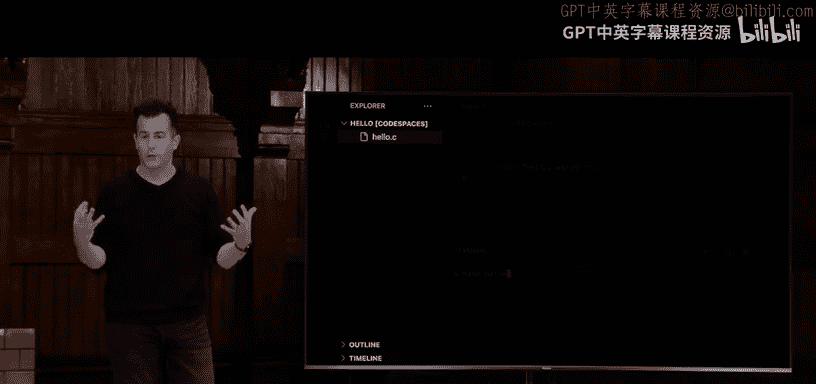

Now that we've got VS code here， let's go ahead and actually consider what it represents。

 So this is generally for jargon's sake， a graphical user interface。

 which means buttons and icons and menus and all of that。

 we all take that for granted almost any device nowadays， that's abbreviated just so you know。

 as Gui G U I but built into VS code again is what's not only the terminal window by name。

 but conceptually this is a command line interface。

 So not a graphical user interface but a command line interface whereby there aren't icons to click on or double click on rather if you want to run a program。

 you use the command line interface or Ci to type the name of the program that you want to run。

 And so this will feel like a step backwards initially today。

 because we all sort of sort of tap and point and double click at things nowadays。 But again。

 it's gonna give us more power， more efficiency ultimately beyond this。 So with that said。

 let's go ahead and actually use it for just a moment during class， you're welcome to follow along。

 but suffice it to say will generally go somewhat quickly。Really。

 you're going to learn how to program by way of the problem sets each week。

 I'll introduce and focus on the concepts， the ideas。

 the sort of primitives that will get you started， but only through actually doing the problem sets is the muscle memory and practice going to come。

 So not to worry if it doesn't all sort of code down easily the first time around。

 So here is the code that I claim is equivalent to last week's hello world program。

 Let's actually go ahead and do this in the programming environment。

 So I'm gonna go ahead and switch over to Vs code itself， which is now running on my Mac here。

 It's not just a screenshot。 And I'm going go ahead and do the following to get started with programming。

 I'm going write literally in my terminal window。 the word code。

 and I might have to give it focus by clicking down in that quadrant of the screen。

 And then I'm gonna give the name of the file that I want to code。 and in this case。

 I'm going propose that we call it hello do C in the world of scratch。 When you downloaded it。

 you might have noticed the files are all called like SB3 or some such file extension when writing code and C。

 you literally name the file something。Dot C by convention。 But notice some other details。

 especially if I zoom in everything I've typed as far as lowercase。 There's no spaces。

 And so this is going be important。 And unfortunately。

 computers are not forgiving and odds are one of the first stupid mistakes you'll do is miscapize something。

 misspell something。 Add too many spaces or the like not to worry like in time。

 that kind of muscle memory will come with practice。

 So let me zoom out let me now just hit enter and you'll see it top right。

 the code tab that I promised。 So I'm gonna go ahead and type out this program pretty quickly because I've done it before。

 include standard I O do H int main void and then some curly braces as they're called and then print unquote hello world backlash and close semilon All so that's a lot。

 But that too will come in time with practice。 But this is the exact same code that we saw just a moment ago。

 Indeed， if I zoom in It's color coded just as in the screenshot。

 And thus I have written my first program。 V S code will automatically save for you。

 but you can also hit control。😊，Or command S to ensure that it's saved。

 but notice what's happened at top left。 Not only do you see my code over here。

 you see a visual icon just like on a Mac or PC that yes， this file now exists in your account。

 And that too， is what you're getting with V S code for C 50。

 You're getting your own sort of server in the cloud。 It's called a container nowadays。

 So there's some virtual disk space somewhere in the cloud。

 ilo or Google Drive that's going to store all of your files。 And at the moment。

 because I refreshed my account before class。 I only have one file in my own account。 What's this。

 what's this。 Well， this is like my I D number for Github not really a big deal that's just randomly generated by Github U adventure is the name of my programming environment today。

 Otherwise known as a code space。 This is just a Github thing， which is again。

 one of these cloud companies。 instead of choosing like random letters and numbers to uniquely identify all of our programming environments。

 It's popular in the tech industry nowadays to just put together random English words that sometimes sound kind of cool。

😊，Just by coincidence， not something I chose yours will be different。😡，Alright。

 so like I've written some code。 Ive created hello dot C。 I typed in all of that code。

 I confirmed visually at left that it was created。 I'm gonna hide my file Exper Hencefor just so we can focus on the code。

 How do I actually run this program。 Well， on a Mac or PC。

 we would be in the habit of like opening the folder and double clicking on it or on your phone。

 you would take it out and tap on an icon。 But not here here。

 we're focusing primarily on the command line interface within this whole environment。

 So I'm actually gonna have to introduce a few command。 You saw already the code command。

 which for our purposes， is V S code specific。 that just creates a new file called hello dot C in this case。

 But I need two other commands to actually run this program。 The first nicely is called make。

 And then I specify what program I want to make。 And then a little weirdly。

 I have to type dot slash hello。 But just to take a step back， make hello。

 if this is about to be my second command that I type。 What does that step represent， perhaps。😊。

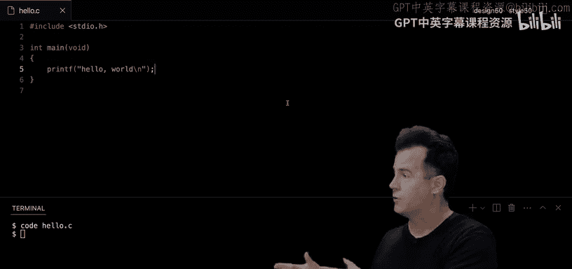

Given what I said just a minute or so ago， that's gonna translate your source code into perfectect。

 So make represents the compiler。 So to speak， the program that converts source code to machine code。

 I have to do that for now manually by running make hellello。 Now， make is kind of smart。

 And even though I'm saying make hello， not make hellello dot C， make is smart。 And it's gonna say。

 oh， if you want to make a program called hello。 I'm going assume that there is somewhere in this folder。

 a file called hello dot C。 So you should not type make hello dot C。 You just type make hellello。

 And then this third command even more cryptic。 What might it do。😊，If this is step 3 or 3。

That's gonna run the machine code。 It's gonna tell the computer in this folder。

 sort of the dot implies this current folder。 and dot slash just means something in this current folder。

 run the program called tellello。 So that's it。 Like there's three steps to writing a program and C。

 you create the file as with the code command。 But there are other ways to do that too。

 And you don't gonna have to use V S code。 You can use dozens of other alternative program in the world。

 You run the compiler， which in this case is called make little white line makes not actually the compiler but more on that next week。

 but make is going to trigger compilation of this code。

 And the last step 3 is to execute or run the program called tellello。

 So let me go back to V S code here。 And you'll see that my code is still at the top。

 My terminal windows at the bottom。 I hid my file Expr just because it's not that interesting anymore。

 And I'm gonna do what you proposed， which was M A K E space hello， all lowercase。

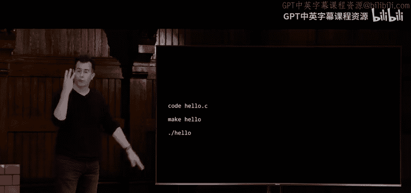

Enter and ironically， thankfully， nothing happened。

 And that's actually a good thing in this environment。 If nothing seems to happen。

 like you probably did good。 if anything does seem to happen on the screen， you probably screwed up。

 and you've made some mistake。 So seeing nothing is generally a good thing。 But what has happened。

 Well， let me actually go back and open up my file Expr。 And notice， there's not only hello dot C。

 but there's a second file now。 hello， which is the name of the program。

 So hello is the program I want to run。 I'm gonna go back to my terminal here and to run this program。

 I'm gonna do dot slash H E L O， I'm gonna cross my fingers that's all often now do。 Andvoa。

 my very first program in C。😊，How else can we see this file。 Well， down here in my terminal window。

 Let me zoom in。 You keep seeing a dollar sign。 That has nothing to do with currency。

 It's just a weird geeky convention that you're prompt at a terminal window like where you type commands generally starts with a dollar sign。

 Sometimes it's a hash symbol。 Sometimes it's an angled bracket。 depends on the system you're。

 But dollar sign is very common。 It just means type your commands here。 I've typed code。

 I've typed make and I've dotlash hello， But I can type other things to and more on these later like L S。

 which doesn't actually spell something but as short for list。

 I T programmers tend to just be as succt as they can。

 So most commands are not full words're often abbreviations。 if I hit enter now。

 You'll see also two things。 You'll see hello do C and you'll see in green just to draw attention to it hello as well。

 The asterisk here just means in the programming environment。 This program is executable。

 you can actually run this by doing dot hello。 The fact that this is just white here。

 that just means it's some text file。 It's in fact。So in other words。

 L S lists the file in my current folder， or you can use your human eyes in the file Exper at top left and just look at what files exist。

 These are one and the same。 One is a gui。 One is a CI， graphical command line and so forth。

 And we'll start to take these kinds of these kinds of paradigm soon for granted。

But let me pause here and see thus far now that we've written our first of many C programs。

 Any questions。Or confusion。 We can clear up。It Ok。

 if you don't understand most of the lines of code， that's what today is about， yeah。

And the difference between hello and。What's the difference between hello and hello doty。

 So hello doty is literally my source code。 It is a file that exists somewhere in the cloud that contains all of the code I myself wrote。

 The hello file is the file that the compiler created for me by converting the source code to the machine code。

 So inside of hello theoretically as a whole bunch of zeros in ones。 We can't quite see them。

 But if I do this， let me zoom out， let me click on hello。

 and notice that VS code is gonna yell at me。 this file the file is not displayed in the text editor because it is either binary。

 that is zeros and ones or uses an unsupported text encoding。

 whatever that means if I do open it anyway。 But I don't recommend this like heed these warnings。

 you won't see zeros in ones， but you will see sort of nonsense。

 And this is because VS code is trying to interpret those zeros and ones incorrectly as ASI text like English text。

 but it's not their instructions for the computer。 So as soon as you see scary red stuff like this。

 like undo close whatever tab you open because sorry you can only。😊。

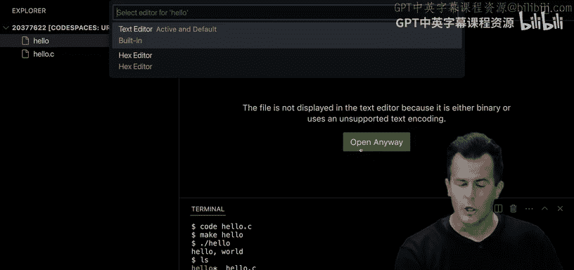

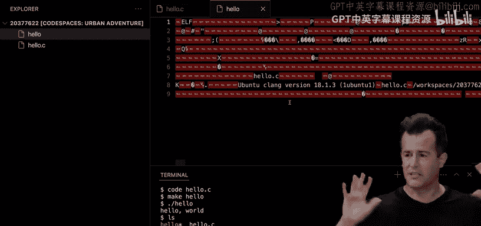

Break the program you just created。 It's not a huge deal。 You can recreate it。

 but that's what's inside of those files。Yeah。Really good question。

 What if we don't type dot slash hello， we just type hello。 Well， let me do this。

 Let me hide my file Expr again because it's not that interesting here on out。

 I'm gonna clear my terminal window by hitting control L just to be neat and tidy in class or you can literally type clear and it will clear it。

 But again， that's just to keep things tidy。 your TF might do that in section 2。

 If I just type hello enter。 I'm gonna get this weirdly bash hello command not found。

 So more on bash down the line。 But this just means literally the command hello is not found because you need to tell the computer where it is。

 So dot slash hello means run the hello program that is in fact， right here。 By contrast。

 You don't run dot slash for code for make or other commands that will soon see like L S。

 because why those are installed in the system for everyone， not just in your individual folder。

 So that's the difference。 Any programs we write， itll be dot slash something。 Allright。

 So let's tease apart what is actually going on here and see if we can lean heavily today on scratch。

 especially as the syntax gets weird。Perhaps a little overwhelming。 Still the same idea。

 So this last time， of course， was our scratch program that just said hello world。

 I claim today that this is the nearest equivalent that any programmer could convert scratch into C if we color coded accordingly。

 indeed this sort of lines up with when green flag clicked is the orange And then the purple is just the equivalent of the same block。

 So the say block we said earlier was a function。 So let's compare these things side by side。

 because there's actually some rhyme and reason to what MI T did with scratch as to why the shapes look like they do and so forth。

 So in scratch， there's a function called say recall that it takes an input otherwise known as an argument or a parameter is another name。

 and that's always provided in these white ovals。 a0 or more white ovals in C， we've already seen。

 but let's do it a little more pedantically。 the equivalent of say is essentially the word print。

 Why did MIT say you say just because it's a little more kid friendly。

 but print is the idea in our environment。 It's actually not print。 It's print F。

 because we're gonna be able。😊。

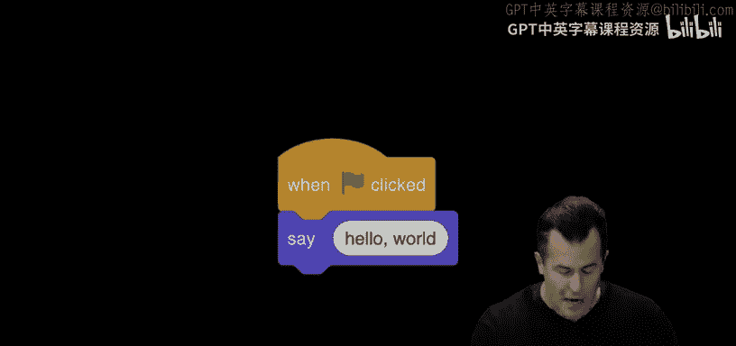

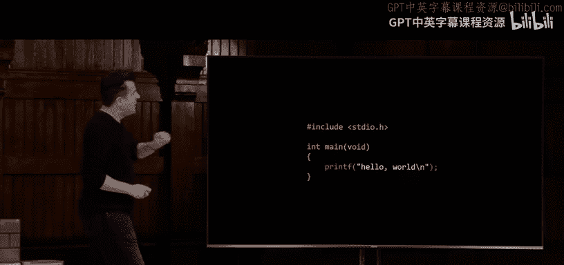

mat our text in interesting ways more on that in a moment。

 But notice the opening parentheses and closing parentheses here sort of conjure up the idea of that white oval。

 So that's kind of intentional on an Ms part。 What， though， in C goes between these parentheses。

 Well， literally the input or the argument you want to pass to the function like hello world。

 But in C， you have to be a little more pedantic because you don't have a nice little graphic like this purple block with the white oval。

 you have to surround everything in double quotes。 Those of you with prior programming experience in C。

 you need double quotes， not single quotes in this context。 And then there's this arcane detail here。

 backlash n， which will come back to in just a moment。

 But that's essentially what's going on line by line from scratch to C。

 there's kind of inequality between those two， even though they of course look a little bit different。

 Well， let's see what that backlash n is doing just to highlight some details here。

 So let me actually zoom in a little bit here。 and let me go up to my code。

 and let me just sort of recklessly delete。😊。

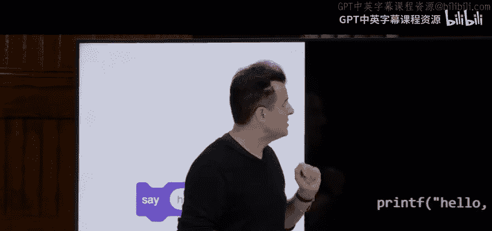

The back slash N， I'm gonna let it auto save。 I'll zoom out in my terminal window。 Now。

 I'm gonna run make hello to recompile the code from source code to machine code because I changed the source code。

 Nothing seems to happen。 That's good。 Now， I'm gonna type dot slash hello En。

 And there's a subtle bug。😊。

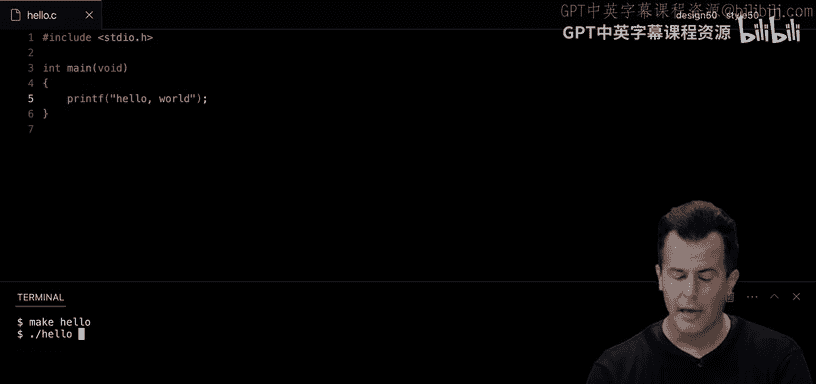

Since I made that change， what looks wrong to your eye now。找个人。Yeah。

 the dollar sign our so called prompt is at the end of the line instead of on its new line。 I mean。

 this isn't really a deal breaker， like the code works。 and you can still type a new command。

 but it just looks a little stupid。 Like this was not the intent of the program。

 It's sort of good practice to move the prompt to the next line。

 And that's because the backslash N is what we're gonna call an escape sequence。

 So it turns out in programming， don't you have to tell the computer exactly what you want to do。

 So if you want a new line。 the equivalent of hitting enter on the screen。

 you have to tell the computer to put a new line there。 What you do not do is this。

 if I zoom out and I go into my code here and I'll zoom in on the code。

 If you want to put a new line， you don't do this。

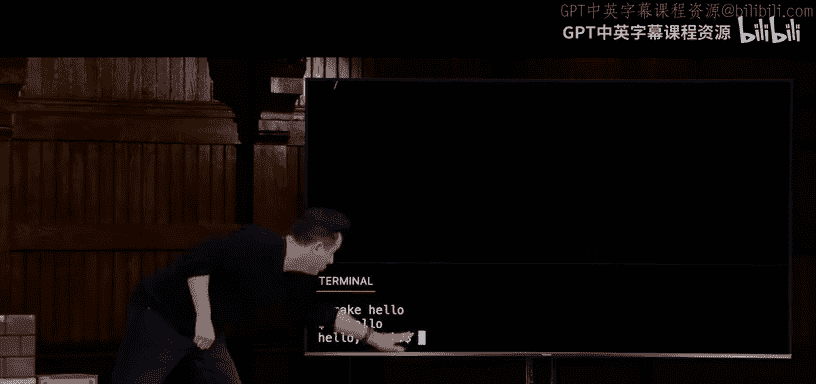

Why it's just confusing for the computer Like， wait a minute。 Is that a typo。

 Did your lines just wrap。 Do you want to put a new line there， It just looks stupid。

 And it makes it less linebased the code itself。 So humans decided years ago。

 if you want an actual line break， don't just naively hit the enter key。

 literally tell the computer put a new line here。 If you want to move two lines down。

 Just do two of those。 if you want three， just do three of those Well why the backslash again。

 these are what are called escape sequences。 And you don't literally want an N， let alone an and N。

 what you want is a new line， which is represented in code as simply backlash N Now。

 for the mathematicians among you like what we're doing now by writing using functions like printf is just sort like F of x notation。

 If you recall that from high school or prior， where F is a function X is an argument or an input there too。

 And we're using parentheses in code just like mathematicians would to write functions like these。

 And the types of functions we're using right now， still follow this model。 you've input。

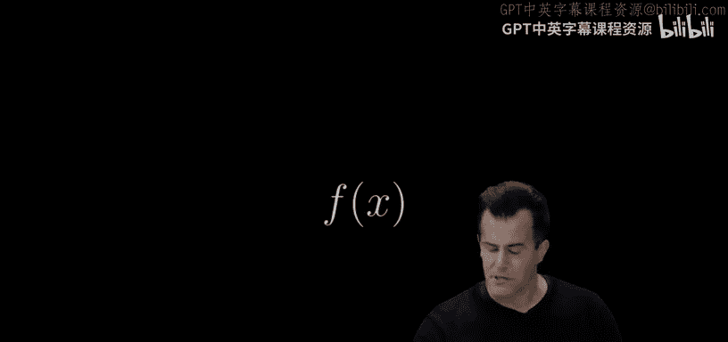

You want output in this case， the input to printf， for instance。

 just like the say block is what's called an argument。 The output， though， of the function。

 printf is what we call a side effect。 And the easiest way to think about that is a side effect。

 is's just something that sort of like happens on the screen visually， Aly， it just sort of happens。

 and there's that effect on the screen and will contrast this with other types of outputs from functions。

 But for now， we're focusing on just this， which is reminiscent， of course， of what we did last week。

 which is if you type hello world into the white oval， use the say puzzle piece。

 you get out the side effect of the cat appearing to have said hello world。 Now。

 as for those escape sequences in C， there's bunches of them。

 but very few of them we actually use in practice backslash and is a new line。

 backlash R is a little more subtle。 and it's kind of a feature of yesterear。

 it moves the cursor not to the new line， but to the beginning of the line。

 kind of like an oldtimey typewriter。 if you've seen how those work。

 Sometimes though you might want to。😊。

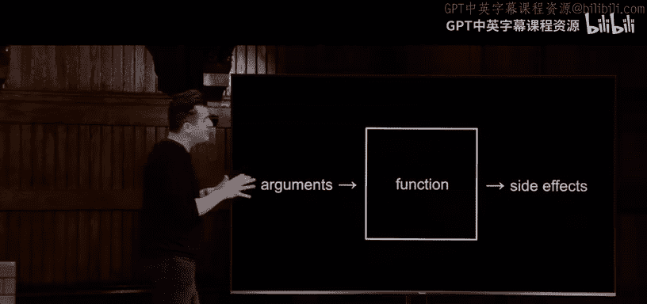

Print out an actual double quote。 But there's a problem， of course， if this is my code here。

 and I'm already using double quotes as sort of special symbols to surround the text I want printf to say。

 it would probably be a little word like if you wanted to say。

 hello world with sort of finger quotes， why might this not be a good idea。

If you think about this from the computer's perspective。

Like why is this probably not the right way to do this， yeah。Yeah， exactly。

 the computer is indeed gonna read your code top to bottom， left to right。

 And when it sees the first open quote。 Okay， that's fine。 it understands that。

 But when it gets to the second quote， it's gonna to assume oh wait a minute。

 maybe you only want me to say hello comma， And then it's gonna keep reading and be like wait a minute。

 Why is there the word world here。 And then wait a minute。 Now， there's two more quote。

 It's just confusing。 It's ambiguous And computers need you to be again very precise。

 So if you want a quotation mark to literally be displayed on the screen。

 you would escape it so to speak。 which looks a little weird and take some getting into the habit of。

 But this just solves that kind of problem。 And similarly might you use single quotes in other context more on that soon。

 And if you really want to bend your mind。 how do you actually print a literal backslash if you ever care to。

 It's not that common a character to type。 But if you ever want it on the screen。

 it seems that we're using backslash as a special character that says， hey。

 give me a new line or give me a carriage return or give me a double weirdly in programming。

 if you want to type a literal backslash on the screen。 You。😊，do back slash， backslash。

 But that's it for sort of weirdness for now。 But this is to say。

 humans tripped over the same problems years ago。 They came up with solutions。

 And now we indeed have these conventions in code。

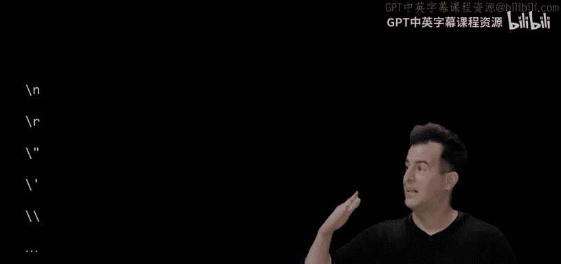

Allright， so let's tease apart some other features of this in every program we're gonna to write。

 namely what's at the top of this file。 So at the very top of this file。

 there is this cryptic looking hash include or pound include standard I O dot H in angle bracket。

 So this is a little weird。 we'll talk more about this next week， too。

 But this is what's called a header file。 Any file that ends in do H is not a source well any file that ends in dot H is what we're gonna call a header file and inside of that header file is functionality that maybe came with the system came with the programming language itself。

 So for instance， I'm going to do this。 I'm going go back to my code here and I'm gonna make a very common mistake that you yourselves might make in the coming days where I just forget that line because I don't even understand it in the first place。

 So I certainly didn't think to type it here。 Now， if I go back to my terminal window after clearing it。

 And I run make hello because I want to recompile it because I've changed the source code。

 I'm gonna see a fairly cryptic errors。

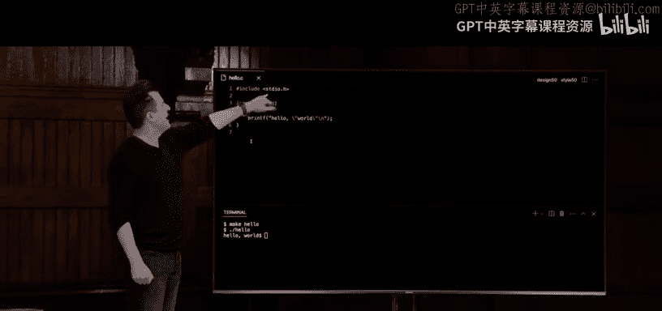

More error on the screen than there is code up here。

 But you'll get the hang of sort of reading it to try to figure out what's going on。

 And I'm seeing this。 Hello dot C line 3 character 5。

 So that just means line 3 colon character 5 from left to right。

 It's sort of a visual cu as to where the problem is called to undeclared library function printf with type dot dot dot。

 And the rest of overwhelms me visually at this point。 But that's a hint。

 If you do not include that header file at the top of the code you've written。

 you do not have accesss to what's generally called a library。

 a library is a collection of code that someone else wrote for you。 Maybe it was Mt。

 maybe it was the authors of the C language itself years ago， maybe it was C S 50。

 if we wrote some code for you， a library is a collection of code that someone else wrote for you。

 And you access it again， by including header files that those same people wrote for you。

 So if I go back to my code now， let me clear my terminal window just be。Overmed。

 Let me undo what I just did and put that file back。

 Can you perhaps infer just functionally what is inside of standard I O dot H that， again。

 someone else wrote what must be inside。Printf， so some whoever invented printf decades ago。

 probably put that code in this file。 And so by including it。 so to speak in my code。

 I now have access to printf functionality。 So that's all。 And again， C is lower level than scratch。

 It's obviously tech space， which means you have to be a little more pedantic yourself as to what you want the computer to do for you。

 And if you want to use someone else's code， you indeed have to include it。

 Scratch didn't bother with this， But we do need to do this in the context of C。As an aside。

 just to preempt some unnecessary headaches， this word is not studio dot H。 Every year。

 a nonzero number of people can't understand why their codes not working because studio dot H is not found。

 It's standard I O S T D I O dot H。 That's when you one of the first frequently made mistakes otherwise。

Allright， so remember that。 let me undo now the unnecessary quotes I added here。

 and let me propose that we show you where you can learn more。

 So all of these libraries generally are documented like people wrote instructions for how to use them。

 So you don't just have to listen and pay attention only in class。 you don't have to pull up a book。

 there tends to be online documentation as well。 For instance， for the standard I O header file。

 And the documentation in the world of programming for C specifically are called manual pages or man pages for short。

 Unfortunately， theyre really written decades ago for like the more comfortable among you those who have an eye already for programming And so what C 50 has done at this URL manual do C 50 dot I O is we essentially have more user friendly versions of the documentation for this header file and others。

 So， for instance， if I pull up manual do C50 do I。 You'll see a web page like this。

 And if I just scroll quickly， you'll see a whole bunch of header files。

 do H files and a whole bunch of functions beneath them。 And there's only a couple。😊。

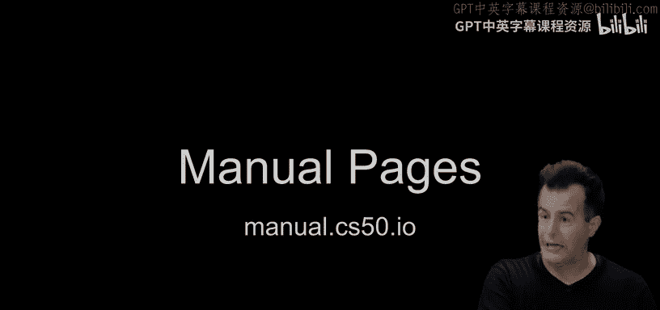

Dozen or so here。 And indeed， per this checkbox at the top frequently used in C S 50。

 We have sort of highlighted the functions that odds are over the next month and half like you will probably want to use。

 If I turn off that less comfortable mode。 There's actually hundreds of functions that come would see and no programmer knows all of these functions。

 What they do is they read the manual when they want to find some new piece of functionality。

 So I'm going simplify this， I'm gonna scroll down though to standard I O dot H， for instance， here。

 and you'll see more functions that we'll eventually get to。 But if I click on printf。

 you'll see hopefully some fairly user friendlyend instructions for how this thing works。

 For instance， under synopsis， you'll see that we tell you what header file you should include in order to use it。

 below that is something called a prototype more on that later。 But below that is a description。

 And here is where we， the C50 staff have written in layperson's terms。

 explanations of how this function works。 how to use it and so forth。

 But if you'd rather see what the。😊，Real world uses。

 you can turn off that mode and you'll see much more arcanely the original language。 So in short。

 these are sort of like training wheels that you can turn on and off at your leisure。 But ultimately。

 this is real worldor documentation as well。 So if we want to see something else， for instance。

 let me go back to the main menu。 And as we'll see today。

 there are actually functions in a header file called Cs50 dot H that for a few weeks。

 we're gonna lean on heavily。 long story short， it's actually kind of hard it's annoying and C to get user input ironically to like get the human to type in a word or a number。

 like you have to kind of jump through some technical hoops to make that happen。

 And we'll show you how to do it like the real way in a few weeks。 But for now。

 among the first training wheels is a C 50 library code that we wrote that will just make your life easier。

 And indeed， we're gonna give you access to functions that simplify the process of actually getting input from the user。

 So case in point， we're gonna give you access to functions like。😊。

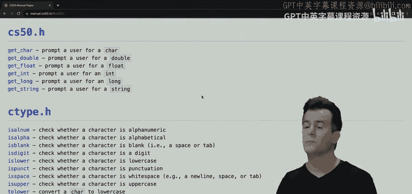

Get string when you want to get a string of text from the user。 String is just text。

 So if you want to get one character， one word， one sentence， one paragraph。

 you can call a function called get string。 We're gonna give you another one called get int。

 when you want to get an integer from the user like one or0 or negative one or anything else。

 you can use that function as well and we'll see today， too。

 there's other functions you can use from C50's library。 In a few weeks time。

 well take these away once you sort of don't need them anymore。

 And you'll see what those library functions have been doing all along for you。 But for now。

 let's focus on this。 perhaps the most useful of them。

 get string and solve a problem that we did already pretty easily in scratch。 So recall in scratch。

 this was a program that use two functions。3， In fact， ask to ask a question of the user。

 say to actually display something on the screen and join to combine the default of Apple banana or in this case。

 hello and whatever the human answer was。 So this made our hello program a little more interactive last time。

 How can we actually。ranslate this into a similar paradigm now。

 So input and output as the story as always。 In this case。

 we have arguments going into those functions。 but now we're going introduce not side effects。

 which is stuff that happens visually。 We're going to revisit that blue circle called answer or the blue oval called answer that represented last week。

 what we call a return value。 And this is what many functions will actually do for us。

 They're not just going to display something presumptuously on the screen or play a sound or video or something like that。

 they're going hand you back virtually a value text or integers or sounds or images that you can then do with what you see fit。

 So the paradigm will now have is much like in scratch。

 If the input is what's your name and the function is ask and you get back a return value of answer。

 We want to actually do this now in C。 So side by side。

 What code like this in scratch is going to look like today onward is this。

 instead of using the ask block。 you literally use C50's function called get string。Takes input。

 So we put the parentheses on the left and the right to kind of conjure the idea of this white oval inside of that string。

 You can put a prompt。 So to speak， Like， what do you want the human to be asked in this case。

 And I'm missing something still per the placeholders here。 What's missing。So quotation marks。

 So literally quotation marks on the left and the right。 And I'm gonna be a little anal here。

 I'm gonna put a space at the end because I don't want to。 I could。

 but I don't want the cursor to go to the next line。 hence no backslash n。

 If I want the cursor just to sit there blinking waiting for the user after the question mark。

 I'm just gonna put a space。 So it will stay there for me。

 But this is just an aesthetic detail using the same idea as before。

 So that is the analog of this block。 But how do I get access to the so-called return value。

 MT just plopped it on the screen for us automatically in C。

 we have to write a little more code to get access to that return value。

 And the way we do this is on the left hand side of this line of code。

 we come up with a name for for the return value， You can call it anything you want but answer is a nice equivalent to what Mit did。

 You could more generically call it X or y or Z。 but that's not really useful。

 And so computer scientists on like mathematicians will tend to use variables that are a little more verbose like the word answer。

 But in C， it's again， a little lower level， You have to tell the。Computer。

 what type of variable this is going to be。 So I'm kind of conflating variable and return value。

 but they're being used in an intertwined way。 The get string function just like this ask block returns a value。

 If you want to do something with it。 you need to put it in something called a variable。

 which is denoted in text here。 But again， per last week。

 the computer doesn't know if it's looking at numbers or characters or images or sounds。

 you have to tell it as the programmer that the zeros and ones that are somehow involved here underneath the computer's hood are。

 in fact， to be treated as text， Aka string。Now， there's one stupid subtlety still missing from this line of code。

 Does anyone know， especially if you program， Okay， all of youve programmed before， yes。Semicolon。

 So one of the headaches of C in a lot of languages is you actually have to finish your thought explicitly。

 So the computer knows that that line of code is done。 And it's not a period like in English。 It's。

 in fact， a semicolon。 Now， you don't use these everywhere， we'll see where you use them。

 But that too is a very common mistake to overlook something simple。 But again， in the coming weeks。

 even though this might look very cryptic with muscle memory and practice。

 you'll start to see these things instantly， even if for a few days。

 you sort of bang your head against the screen。 So to speak。

 not seeing what the T F and I much more readily C。 So let's go ahead and do this。

 Let me go back over to B S code here。 Let me zoom in just a little bit。

 and let me go ahead and do this。 I'm gonna get rid of my single use of printf。

 And I'm gonna say the exact same thing。 string answer。😊，Equals get string。 quote unquote。

 what's your name， question mark space。 close quote semicolon。

 And now I want to print out that answer。 Well， let me do this incorrectly。

 deliberately for the moment。 Let me just say print F quote unquote， hello answer。

 if I want to plug in answer。 and I want to add a new line at the end semicolon。 So let me try this。

 But there's multiple mistakes now in my code。 Let's trip over them deliberately。

 Let me go down to my terminal window by clicking at the bottom of the screen。

 let me run make hello again， enter And oh my God， there's even more errors now than there were before。

 but not a problem。 Let me click on this little triangle here。

 which is just gonna zoom in on the terminal window。 So it takes up my full screen。

 And just generally， all you have to do is find a few keywords visually。

 They give you a clue as to what's going on。 Or as before， you can always ask the C 50 duck。

 So here's the command I ran， make hello。 somehow that induced all of these errors。

 always read them top to bottom， not bottom up。 So from top to bottom， there's a problem on。😊，M，5。

 character 5 use of undeclared identifier string。 Did I mean standard in。 No， no， no， I didn't there。

 And then also like two errors generated too many errors areted。 What did I do wrong， Well。

 it turns out what I do need to do at the top of this file。

 Let me click the triangle to zoom back out。 If I want to use the get string function to get a string。

 I actually need to include another header file， which is probably called。Include C， S 50 dot H。

 technicalically， any order is fine。 I tend to alphabetize because I just know therefore。

 where to look alphabetically for a certain header file。 Now that that's in place， let me again。

 run make。 hello， enter。And now we're back in business。 No error message。

 So even though you might have more errors than you have code， odds are。

 it's just the computer is confused and it could be something simple and an easy fix like that。

 So just to be clear， standard I O dot H。 because I'm including it， I can use printf C S 50 do H。

 I can use get string because the people who invented C and the people who invented Cs 50 wrote those two files。

 So to speak respectively。 Allright， unfortunately， even though the program compiles。

 that doesn't mean it's correct， it just means it's syntactically valid， It's valid C code。

 if I go ahead and run dot slash hello and hit enter now， I'm going to be prompted for my name。

 So I'll type it D V I D and notice there's a space to the right of the question mark as promised。

 enter but it just says hello answer， which of course， is not the intent。 I wanted to say hello。

 David， So how can we do this。 Well， in scratch， it took a couple of puzzle pieces。

 but it was pretty straightforward。 If I wanted to say the combination of two phrase。😊。

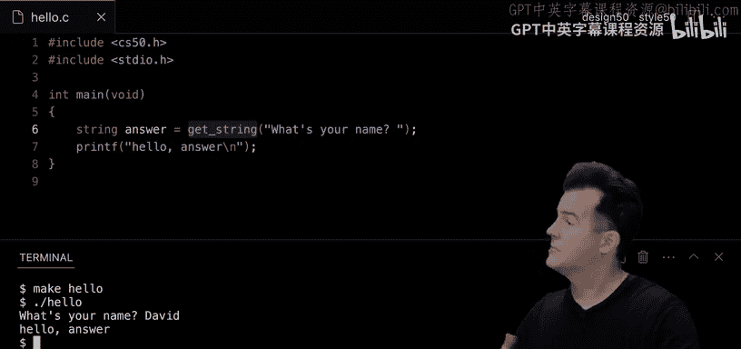

hellello and something else。 I joined those two。 and then pass that output to the input of say in C。

 it's gonna be a little different here just because it's an old language。 And this is how it's done。

 still use printf because that's the same thing as say。 I got my parentheses， I got my semicolon。

 good to go。 But inside of that， this is where printf is different。

 if you want to say something followed by something else in the world of C。

 you tend to use placeholders。 So you don't just join things together as we will do in Python and other languages。

 you say to the program you say to the compiler， give me the word hello comma and then something else。

 And the percent S means put another string here。 It's sort of like leaving a placeholder in your code or a template where you'll actually plug in some values。

 Now， if this is what I want to display， I still use my quotes as before， and I might， in fact。

 have a backslash in。 if I want to move the cursor to the next line。

 But this is where printf is a little different。 say， unlike， say， which took one input， printf。😊。

Its kind of like join。 It can take two or more inputs。 If you so choose。

 you just have to separate them with a comma。 So much like the join block has two ovals here that are initially white。

 Apple and banana until we dragged and dropped answer on top of it。

 print F and really any function in C。 if you want to pass in multiple inputs。 that's fine。

 If they're supported。 just separate them with commas。 There's no multiple parentheses。

 There's no multiple ovals， Just separate them with commas。

And now notice a potential point of confusion。 What's different about this comma and this one。

 just instinctively。Sort of minor detail， but important， yeah。Inね。So one is inside， one is outside。

 So the one that's inside the quotes is literally the English grammatical comma that you want the human to see。

 The one out here is a C thing that's separating the first input to this function printf from the second。

 Strly speaking， you don't need a space there， but it's good practice stylistically to separate your arguments with single spaces just as I've done there。

 So let me go ahead and now do something with this。 Let me go back to my C code here。

 I'm gonna clear my terminal window just to get rid of that distraction。

 And now I'm going to change answer to percent S。 And then outside of the double quotes on line 7。

 I'm gonna do comma answer。 And then after it auto saves， I'm gonna go back to my terminal window。

 And just to make another deliberate mistake。 dot slash hello， enter what's your name， David， enter。

 It's still broken。

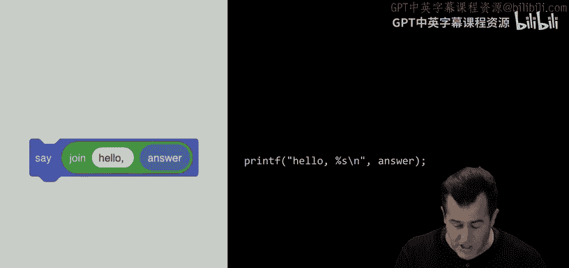

But why。Still have to recompile it。 So again， you just get into the habit when you change your code。

 you have to recompile。 So you get new machine code in the file。 hello。 So let's do it again。

 make hello， No errors is good。 dot slash hello enter what's your name again。 D V I。

 And now hello comm David。 So again， slot of this is still cryptic。

 but it's going to start to follow patterns like this functions like in math class F of X are written function name。

 parentheses input comma input comm input， however many you have they're going follow these patterns。

 But notice too， On 6 and 7， I have finished each of my thoughts with a semi So what are the other commands that you can run in your terminal window beside something like L。

 Well， it turns out there's a whole bunch of them。 L S， of course， was simply short for list。

 which shows you the files in your current folder。 But there's also C D for change directory。

 which is the command equivalent of double clicking on a folder to open it up in a graphical environment。

 Theres C P， which is short for copy， which allows you to make a copy of。😊，File or folder。

 There's make D M K D IR， which is short for make directory。

 which is how you could make a new folder， There's M V， which is short for move。

 which would allow you to move one file or folder from one place to another or simply rename one of those to a different name。

 There's R M， which is short for remove。 And there's R M D， which is short for remove directory。

 So in fact， let's play around with a couple of these。 Let me go back to V S code here。

 Let me go ahead and open up my file Expr and recall that at this point， I've got two files。

 hellello dot C， which contains my source code， and then hello， which contains my machine code。

 the executable program that I previously generated by running make。 Well。

 let me go ahead and propose that I'd like to prepare to keep all of my files in folders very orderly。

 So if like for every program I write or for every problem on a problem set I write。

 maybe I want to store my relevant files in a specific folder for that problem。

 So suppose then that I want to put hello do C in a folder。

 otherwise known as a directory called hello。 I can't do that quite yet。

Because I already have a program called Hello。 So let me use one of those new commands。 R M space。

 Hello will delete or remove hello from my current directory。 So I'm gonna hit enter。

 I'm going be prompted to confirm with why for yes or end for no， remove regular file。 Hello。

 I'm gonna hit why and enter。 And as I hit enter， watch the top left of my screen as the hello file would seem to disappear。

😊，Vila， it's now gone。 So now I'm gonna go ahead and use a different command。

 Let me go ahead and do M K D for make directory。 I'm gonna call the directory itself hello and watch again at top left what happens。

 enter。 Now I have not a file but a folder called hello。 And in this Gui。

 the fact that it's a folder is indicated one by its icon and2 by that little right facingcing triangle。

 which means I can expand it to see what's inside。 And in fact， if I do that， I'll see， of course。

 that nothing's in it because we literally just created it。 All right， well。

 what if I want to move hello dot C into the new hello folder。 Well。

 I could just like on Mac O or Windows。 I could actually in my file Explorer。

 click and drag one into the other。 But let's do this entirely within the terminal window。

 So let me do this， let me move or Mvy for short， my file called hello dot C into a new destination folder。

 hello。 And I can optionally put a slash at the end of hello just to make super clear that it's a directory。

 but that's not strictly necessary。 But if I say M V hello do C。😊，Hello with spaces in between。

 assuming hello exists as a folder。 Watch what happens at top left now。 it's a little more subtle。

 But hello dot C is going to move inside of the hello folder right now， And indeed。

 it's only slightly more indented， but notice if I collapse the hello folder。

 notice that it seems to be gone because hello dot C is now inside of that folder。 Of course。

 if I expand that， I'll see it again。 if I go back to my terminal window and type Ls for list。

 Now I don't see hello dot C。 and I don't see an executable program anymore。

 but I do see hello in the slash there， just make super clear to me the user that it's indeed a folder。

 So how do I change into that folder。 Well， I can obviously use the graphical interface at left and click and expand and sort of see what's going on。

 But there's no direct connection between the file Exp at top left and my terminal window at bottom right。

 Rather those are just two different ways to explore the underlying system。

 So if I want to change my terminal window into this new directory。 I can do C for change directory。

Hello and then enter。 and now notice my terminal windows prompt changes slightly。

 There's still a dollar sign， which indicates type my commands here。

 But before that dollar sign just so that I have a reminder sort of breadcrumbs that visually remind me what folder I am now in。

 I see that I'm inside of hello。 if I now type L S。 I should see the file I expect to be in there。

 which is indeed hello dot C。 Now， suppose I want to try out some of those other commands and suppose I want to maybe rename this file I really want this file to be called something else。

 So maybe I might do something like this M hello dot C space and now a new name for the file。 Well。

 maybe I want to make say this is like an old version of my code because I want to start fresh with something new。

 So I could do something like this M hello do old dot C and watch what happens to top left hellello dot C。

 of course， gets renamed via the move command。 So I can use move to move a file into a folder or I can use it to rename a。

😊，File or folder， as I've just done here。 Now， suppose I want to undo that。 Well。

 I can't just type undo， I can't just take control C， but I can do the opposite in effect。

 M V old dot C， hello dot C。 Well now per top left， change it back into that file。

 If I want to make a copy of this file maybe as an actual backup because I'm really happy with this version and I'm worried about breaking it。

 Well， I could do Cp for short， I can then do hello dot C。

 and then I can do something like backup dot C or any other file name。

 I'm taking care to use the same file extension so that if I do open this file later。

 it still opens and gets highlighted and colorized in the same way。

 but watch what happens now at top left when I type enter， I now have two files in this hello folder。

 And indeed if I type Ls now， I can see exactly the same。 So long story short。

 there's this whole list of commands and even more than these that allow you to manipulate the underlying system in exactly the same way that you and I have probably done for years by using a mouse and pointing and clicking and double clicking。

 But for now， let's undo all of this because I haven't。😊，W that many programs today。

 And I'm gonna keep things simple today and keep everything in my same folder。

 So let's undo all of this。 Let me go ahead and now remove back up dot C。

 because I don't particularly care about that。 I'm gonna be prompted to confirm as much。

 Then let me go ahead and move hello dot C out of this folder and into the original folder and conceptually the original folder is what we would call the parent folder。

 The folder that contains this hello folder。 And the way you can specify the parent folder。

 like back up from once you came is with dot dot。 So a single dot as we've actually seen do slash hello dot slash a dot out means execute a program in this directory dot but dot dot refers to your parent directory。

 So watch what happens to top left when I move this hello do c file out of this folder。

 It shifts a little bit to the left to indicate that it's no longer in that folder。

 I'm gonna go ahead and type C dot dot， which will bring me back to my parent folder or even more useful。

 especially if you get confused。Or lost somewhere within your folders。

 You can actually just type C and nothing。 And that will whisk you back to that original folder。

 no matter where you are。 So it's a nice shortcut。 and it's a nice way of undoing any confusion you might have caused for yourself。

 Lastly， let's go ahead and get rid of the hello directory with R M hello enter And that now disappears at top left as well。

 Now， what I was hinting at here， whereby I had my hello do C file in a folder。

 And I was moving things around and renaming things and backing things up isn't strictly necessary because there's actually other features still inside of Vs code that you're welcome and encouraged to play around with。

 In fact， if I go to my so-called timeline at the bottom of my file Exper here。

 you can actually see that there's been automatic backups made over time of this file。

 So if you click， click， click through those backups。

 you can actually see different versions of this same file slightly in the past。

 which might save you the trouble of having to manually create files。 and in fact。

 in the world of software development in industry。There's actually standard tools very similar in spirit to what we've been using Github for that allow you manually to make different versions of your code so that you can proactively keep track of all the changes you've made without manually renaming things as you might typically on your own Mac or PC。

 Alright， let me clear my terminal window and ask if there are any questions。Yes， over here。有点。Yeah。

 a really good question。 If we had something other than a string of text。 we had an integer。

 would you still use percent S。 No， you would use something else。 And indeed。

 percent I is what we're gonna use， And we're gonna actually do that perfect segue to other types that C actually has。

 So up until now， we've been calling a string of text， literally a string。

 And this is common in many programming languages， including Python in jascript strings in the programming world just mean text。

 whether it's zero or more characters thereof。 But C does have other data types。

 Just a few of which will dabble with today， but you'll use more over time。

 We've already seen string for instance， which is indeed a string of text。

 But let's focus as well on like in integer。 As an aside， there's other types too。

 there's Boolean values， like true or false， there's chars which are single characters instead of full phrases or sentences。

 There's doubles and floats， which are real numbers， something with a decimal point。

 the equivalent of fractions。 and there's longs， which are integers， but like longer integers。

 even bigger integers than you might type by default。 So let's focus on an int。😊。

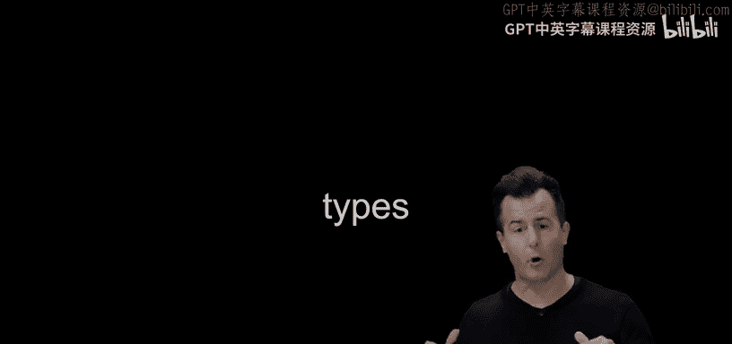

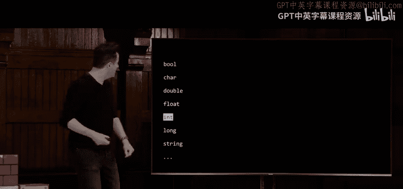

So many of so many computer programs， of course， manipulate numbers in some way。

 So what can we do with this。 Well， if we want to be able to get an integer， lucky enough。

 C5's library comes not just with get string， but also get int。

 So that's gonna be a third function we now use and C。

 And we need to know what generally called format code。

 So that placeholder I called before percent S is indeed for a string。

 if we want to place a integer inside of something we're printing to the screen， we are， in fact。

 going to use percent I instead。 So let's now actually use these building blocks。

 get in and percent I to actually get numbers in some way to sort of solve a problem。 Well。

 what problem could we solved， Let's introduce another concept from scratch。

 and programming more generally known as conditionals like those proverbial forks in the road。

 if something is true， do this else maybe do this other thing。 So in scratch。

 we might have had a set of puzzle pieces that look like this。 if x is less than y。

 then say or have the cat say X is less than y。

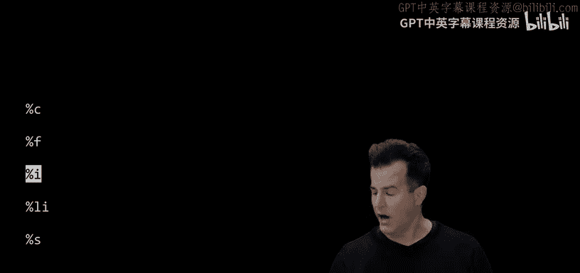

Stup program。 But it just demonstrates if how we have two variables。

 X and Y in the context of scratch。 We're comparing them with a Boolean expression。

 We're using a conditional to then conditionally say or not say this phrase here。

 depending on whether this question has answer of true or false。

 Yes or no in C doesn't look all that different。 It's a little more cryptic。

 but you say literally if you use parentheses similar to functions， but confusingly by convention。

 you put a space after the word if。 So you don't put spaces after function names。

 you do put spaces after words like if and you use the parentheses to conjure up this weird trapezoidal like shape。

 So there's no real keys that kind conjure that So C uses parentheses like most languages。

 And then there's these weird curly braces， which at least in English， we don't use all that often。

 but they're there on your keyboard English or otherwise。

 and they essentially allow us to create this sort of hugging shape to the puzzle piece。

 Anything inside of those curly braces is going be equivalent to anything。

Inside of this yellow hug that's sort of grabbing one or more pieces inside。

 So what do we put inside， Well， this part is straightforward， printf。

 quote unquote X is less than y backslash n semicolon。 So nothing new here。

 the only bit of new code is this if construct instead。 What if you have an if else。

 So two way fork in the road。 This is what that looked like in scratch， same question。

 If x is less than y than say x is less than y else。 say x is not less than y in C。

 the code is gonna be set up initially like this。 So two sets of curly braces to represent this pair of yellow bars and this pair of yellow bars。

 And what's inside of them indented no less。 just like our pseudocode last week is two printfs。

 X is less than y， X is not less than y。So that's it。 So the only new stuff here， really。

 is now the else keyword， which does not need parentheses because you're just saying else do this other thing。

 But what if it's a threeway fork in the road。 And we'll stop after that。

 here's a threeway fork in the road in scratch。 If x is less than y， then say this else。

 if x is greater than y， sayy this， else。 if x equals y， then say this。

 So this is a little more precise because now we're handling equality。

 not just greater than or the opposite。 in C， it's gonna look similar to before。

 But we're adding this element here。 And at first glance。

 especially if we've never programmed before， It looks like I'm an idiot。 and I made a typo。

 What looks wrong。There's like two equal signs， like not a typo。 So it turns out recall from earlier。

 when we used the equal sign the first time around。

 we used it in the context of getting a return value back from a function。

 like the get string function handed me back the user's answer。 So unfortunately。

 because humans decades ago decided， hey， let's use the equal sign to assign a return value from the right hand side of a line of code to the left hand side。

 We sort of painted ourselves into a corner and like， oh， shoot。

 what do we do when we actually want to test for equality of two values on the left and right。

 So what most languages， including C do is use double equal sign。

 So you can say double equals or equals equals or whatever。 But it is， in fact。

 syntactically correct。 What's inside of these three sets of curly braces。 same idea， printf， printf。

 printf based on what English phrase you want to print out。So this code， both in scratch and see。

 Ill claim is correct。 It won't run because we still need like the other stuff。

 the the equivalent of the when green flag clicked， but out of context， this code is correct。

 But there's a subtle weakness in design。 And we'll talk a lot about this this week and beyond correctness just means the code does what it's supposed to do。

 Design is more subjective， Like， how well have you written your argument in an English paper。

 How well have you written your code is design。This code is not designed as well as it could be。

 because I'm doing more work than I need to。 Yeah， andm back。Yeah。

 I don't need the x equals equals y， but y logically。😡，Exactly， that's just a math thing。

 Like either X is less than y or it's greater than y。

 or the third and final option is they must be equal。 So it's subtle。

 But why would you bother wasting time writing a line of code and expecting the computer to run a line of code that is just gonna answer a question that logically you could have concluded already。

 because if x is not less than y。 And X is not greater than y。 then my God。

 just print out X is equal to Y， because you know at that point logically， it's true。

 you don't need to waste your time or the computers asking a third question unnecessarily。

 And reality it's not a huge deal。 no one's gonna notice in the real world on a macro PC that there's this extra line of code。

 but it's a bad habits。 Keep it simple。 don't write code that doesn't need to be there if logically。

 you can conclude otherwise。 So in fact， let's clean this up both in scratch in and C。

 I can tighten this up。 so to speak， use less code here it's less code here And honestly。

 if only statistically， the less code I write the less likely I am going to make mistakes。

 So that too is。Probably a net positive overall， the less writing less code is generally better than writing more code。

 not unlike English essays 2， perhaps All right， questions about this feature of C conditionals。

And this syntax。哎呀。Oh， a really good question。 And yes， jumping the gun。

 There are alternative ways to solve problems like these。 And the question was to summarize when。

 when to use if else if else versus what's called a switch statement more on those another time。

 But this is gonna be true in general in programming， not just C， not just in scratch。

 but every language。 there are going to be several dozens。

 hundreds and infinite number of ways to solve problems among the things we're gonna teach you。

 though， is indeed， how to do things well or better than you might otherwise。

 And we're gonna introduce you eventually to another feature of the language that can even simplify this code too。

😊，So for now， let's actually use this then。 So let me go over to V S code again。

 I'm gonna go ahead now and clear my terminal window。

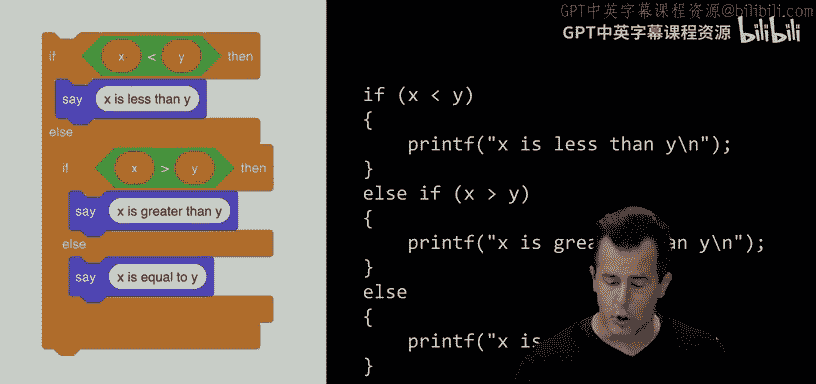

Down here， I'm gonna go ahead and close the hello dot C tab just so that it we're gonna create a new program。

 And let's just do something a little simple using some operator so to speak。

 And I haven't used this word by name。 but it turns out that there's lots of operators that come with C。

 just like a lot of operators that came with scratch for doing assignment or less than or less than or equal to greater than greater than or equal to actually equal to not equal to now some of these are a little cryptic。

 But there's no easily found key on your US English keyboard。

 at least where you can do less than or equals or greater than or equals。

 So what most programming languages do is you don't use a special symbol where there's like an angle bracket and then a line below it。

 you actually just use two character。 So greater than or equal is literally this。

 this less than or equal is literally this， this we already saw that equals is this this and not equals is to use an exclamation point。

 So this two is a thing in programming using exclamation point pronounced bang is how you invert logically certain。

😊。

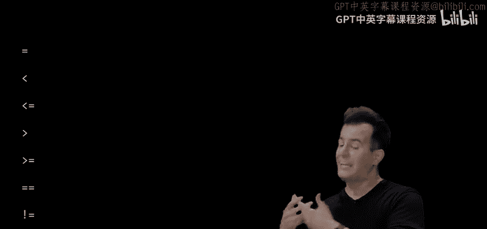

ThSo bang equals or not equals is how you would express exactly that idea。

 It's just a symbol on the keyboard that some human decided let's use this one to invert the idea。

 But we're gonna need one other thing for this program， specifically variables。

 which we've used already， sort of because in scratch， we got one for free。

 we had that answer variable that stored the return value of the ask block。

 But let's consider in general how you can and probably did for problem set 0。

 use a variable of your own like keeping track of a counter or or score or the like in scratch。

 if you want to create a variable called counter。 You can set it equal to some initial value like 0。

 in C， that code's gonna look similar， you literally just write whatever name you want to give the variable。

 then an equal sign。 And then the value you want to give that variable。

 And because the equal sign is the assignment operator。

 it will behave essentially right to left and copy the zero into counter。

 But this isn't enough for C。 Remember that you， the programmer have to tell the computer is this indeed。

😊。

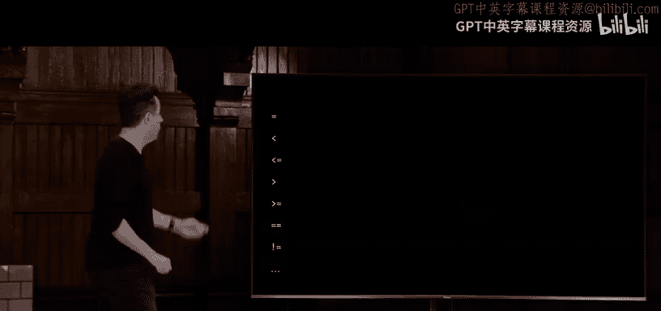

Is it a letter， Is it an image， Is it a sound， You have to tell the computer that this is an integer。

 otherwise written as int for short in C。 But there's one other stupid detail that's missing。

 which is now。Semicolon to finish the thought here。 But this then is equivalent to this in scratch。

 Let's do another in scratch。 if you wanted to increment the counter that is add one to it。

 you could literally use this puzzle piece here and specify you want to add one。 in C。

 it's gonna look like this。 Count equals counter plus1 semicolon。 Now， at a glance。

 this seems like a paradox of sorts。 Like how can counter equal counter plus one。

 Like I can't make that math expression true。 but it's not math in this case。

 the single equal sign is assignment。 So this means take the current value of counter whatever it is。

 add one to it and then copy that value from right to left in two the same variable thereby changing it from one to2。

2 to3 and so forth。 This， though， is so common in programming to be able to increment or even decrement numbers by one or two or more。

 I that you can tighten it like this。 This is the exact same thing a little faster to type。

 saves you keystrokes。 maybe less chance error。 Count plus equals one semicolon is the exact same idea。

😊，Better still， this is so common in C and C plus plus and Java that there's a third way to do this to my comment earlier about solving problems in different ways。

 The most canonical， the most popular way is probably just to say counter plus plus semicolon。

 which literally automatically adds one to that value， only works for one。

 If you want to do two or three or some other increment。 You have to use one of the other approaches。

 But this simply does the same thing as this。 And if you want to invert it to negative one。

 you change the plus plus to a minus minus instead。 So again。

 just little things that well see and pick up over time invariably。

 you'll have to look them up or check the notes or look back at the lecture slides。 But in time。

 this will get familiar if you are not already familiar。

 So let's consider just logically how we might implement this in code。

 Let's go back to V S code here。 and let me propose that we create a program called to compare do C whose purpose in life is just to compare a couple of values。

 I'm gonna go ahead and proactively based on the previous chats include C 50s。😊，from the get go。

 I'm going include standard I O dot H from the getgo。 so I can use get int and printf respectively。

 I'm gonna just on faithith type int main void。 And today we won't explain what that does more on that to come for now。

 just assume it's like when green flag clicked。 But in this program， let's do a couple of things。

 Let's declare an integer called X， and assign it。 the return value of get int。

 And let's just keep it simple， Let's ask the user， not what's their name。

 but what's X question mark semicolon。 Now， so that we have something to compare。 let's do it again。

 but with y int y equals get int quote unqu What's Y question mark。

 And I'm leaving again a space just visually。 So the cursor nudges over a bit。

 followed by a semicolon at this point in the story。

 My users will be prompted for X and y respectively。 Let's do something with those values。

 How about if X is less than y， then go ahead and print out unquote X is less than Y backlash。😊。

Close quote semicolon。 Allright， and let me hide my terminal window for just a moment。

 This is a 13 line program at the moment。 But really， it's like five or six interesting lines。

 The rest has been copy paste from previous programs。 notice a few details。1。

 I've indeed used my curly braces here and notice if you highlight lines。

 you'll actually see little dots that can help you make sure oh， there are indeed four spaces there。

 I've been indenting just like we did last week with pseudocode strictly speaking。

 it's not necessary。 but it's gonna be way easier to read your code。

 if you do at all of this white space。 so to speak。

 than if you write and then submit to us as homework。

 a program that looks sort of got awful like this， which is to make it much。

 much harder for the human to read it for you to read it。

 your colleagues in the real world to read it。 but the computer is actually not gonna care。 In fact。

 as an aside。 One of the tools we have built into VS code for C S50。

 is this button at top called style 50。 This is a program that we indeed wrote that will give you。😊。

Suggestions on how to improve the style of your code。

 So it looks like the right way that programmers would generally write it。 As an aside。

 the computer world is fraught with like religious debate。

 so to speak as to like what code should look like。

 And people in the real world will have really stupid arguments over how many spaces to use for indentation and what lines code should go on and so forth。

 generally in the real world or in a class， there's an official style guide that someone sort of autocratically。

 this is how everyone should write their code so that just everyone's code in the company or course looks the same。

 but you'll find in the real world reasonable people will disagree。 When you click style 50。

 it will be formatted， as we ourselves recommend in Cs 50。 And in fact。

 let me zoom out here And this looks a little cryptic at first glance。

 But on the left is the code that I just wrote and made a mess of by deleting all that white space on the right is the way the code should look。

 If it is well styled。 So whereas correctness is all about。

 does the code work the way it's supposed to Design is about。How well have you written that code。

 Is it efficient。 Did you make good decisions。 Style is purely aesthetic。 Is it readable。

 Does it follow a standard， Can another human sort of easily skim it top to bottom left to right and understand what's going on。

 So these green highlights or saying， please add white space there。

 And so I can actually change my code to match on the left hand side here。 if I realize。

 oh my code's looking pretty ugly。 watch on line 6 at left as I hit the space bar to sorry。

 on the left，1，2，3，4， notice that the right hand side is starting to be happier with my code by getting rid of the green indicators and I can do1。

2，3，4 that fix that over here， I can do 1，2，3，4， I can move this onto its own line by hitting enter And you know what if it's taking too long once you get into the habit of things。

 you can just apply changes， it will give you the suggestions automatically and we're done and on our way。

 But for practice's sake， I would get into the habit of doing。😊。

Things manually until it gets boring and tedious。 And at which point。

 you might as well automate the process with a single click。 Allright。

 so this actually run this code。 I'm going to go ahead and open my terminal window again。

And clear it for clarity。 I'm gonna run make。Compare and hope that I didn't make any mistakes。

 I don't seem to have yet。 dot slash compare。 And now notice I'm prompted for X。 Let's type1 for y。

 let's type 2 enter and X is less than y。 let's do a little sanity check。 so to speak。

 Let's rerun it。 dot slash compare。 What's X， Let's do2 this time。

1 for y And this time it said nothing。 So that's to be expected。

 because that didn't have a two way or a threeway fork in the road。

 the only time this code should say anything is if indeed X is less than y。

 So for those of you who might be more visual when it comes to learning。

 here's a flow chart that represents this same exact program。 If you read it top to bottom。

 you start the program with dot slash compare。 you are then prompted for X and y。

 and you're asked this is x less than y。 And the fact that this is a diamond means this is a boolean expression。

 A question that the the computer is asking itself。 If the answer to that question is true。

 then quote unquote， X is less than y gets printed and the program stops。If x is not less than y。

 as in the second scenario， the answer is， of course， false and nothing more happens。

 But we can build out this tree。 So to speak， by adding a bit more code。

 So let's make it look like the second scratch example。 If I go back here。

It's not hard to just say else。 if x is not less than y。

 let's say that X is not less than y backslash n close quote semicolon。

 Let me now go ahead and rerun， make compare， enter dot slash compare。 enter。 And again。

 I'll do the second example，2， which is bigger and one， which is smaller in this time。

 I will see x is not less than y。 If then we were to look not at this flow chart。

 but a slightly bigger one。 you can sort of visualize it this way。

 Everything in the left hand side of this picture is the same。

 But if it's not true that x is less than y。 The answer is thus false。 This time we say。

 quote unquote X is not less than y。 And we can do this obviously one final time。

 just to bring the point home。 if I go back to my code。

 and I even more pedantically compare these three values， let me go ahead and do this。 So else。

I don't want an else actually。 So let's go ahead and do this。 else。 if X is greater than y。

 let's then say x is greater than y in English。 And then finally。

 have an else that says print F X is equal to Y close quote or rather back slash n close quote semicolon。

 So just to show this all on the screen at once。 This is identical now to that scratch version。

 It's well designed because I'm not asking the equals equals question unnecessarily。

 if I go back to my terminal window here。 clear the screen， run make compare， enter。

 and then dot slash compare again， enter what's x， let's do one。 let's do two。 X is less than y。

 Let's run it again。 dot slash compare。 What's 2。😊，And one X is greater than y。 What more time。

 dot slash compare。 What's x1。 What's Y，1。 And now X is equal to y。 As an aside。

 if I seem to be typing fairly fast， you can actually kind of cheat with your keyboard。

 If you go up or down， you can scroll through all of the past commands that you've typed。

 So it's actually excuse me very useful。 if you just hit up。

 itll it will prerite the previous command for you at which point you can just say enter。

 or there's other fancy features built into this programming environment。

 if you do dot slash CM and then get kind of bored with typing out the whole English word。

 you can hit tab for tab completion like in a web browser and it will autocomplete。

 if it finds a file that starts with those letters。 little efficiencies here。😊，Questions， then。

On the code here， yeah。Sure。A good question。 Is there any downside you're just putting in all of the libraries like we saw in the manual pages a moment ago。

 performance。 So generally speaking C is meant to be a very efficient language。

 so much so that even though it's decades old， still used omni presently nowadays。

 because it's so fast。 it therefore minimizes time。 it minimizes energy use。

 So its still being used heavily。 you would slow things down if you told the compiler。 By the way。

 give me all of these other functions that I'm never going to use So in short， just don't do that。

 because it's unnecessary。 But a good question。 Other questions on what we've done。Here， yeah。

 in front。What is it a Y is C faster， A Y is C faster than other languages。

 Let me answer that in more detail in week 6， when you'll see how much easier it is to write code in other languages。

 because someone else is doing a lot of the work for you。 So as an introductory course。

 we're sort of teaching you bottom up， like， how do you write code has the computer understand code。

 eventually， this kind of stuff。 Certainly after like 5，6 weeks of this。

 It's gonna get tedious doing some of these things。

 We're gonna switch to another language that takes away the tedium and allows us to really focus on the problems to be solved once we've sort of graduated to that point。

 Yeah。😊，Sure， to repeat the keyboard shortcuts， you can just go up up up up up。

 and that will go through all of your previous commands。 at which point you can just hit enter。

 or you can use tab completion。 So you can start typing a word like code and CO。

 OD tab will finish the thought or dot slash COM tab will finish that thought just to save yourself some keystrokes and clearing the screen is control L。

😡，Which has no functional purpose other than keeping things neat and tidy in class。

 So a design question。 So this code， I dare say is correct。 Let me zoom in a little bit here。

 Let me change the code to just do this。 even though we already saw from scratch that we probably shouldn't do this。

 Why should we not do this， if especially， I'm just more comfortable asking three separate questions。

 like if X is less than y， if X is greater than y。 if X equals y， do this。

 Like it's a nice world to live in， just ask your questions。

 You don't have to worry about if else if forks in the road， you can just ask three questions。

 but let's。😊，Put a finger on， why is this correct， Yes， but not well designed。Yeah， in backingham。

Okay， there could be cases that are potentially outside of these three。

 because this is relatively simple math comparing numbers。

 Like we don't have to worry about that here。 But， yes， in general。

 you might miss a scenario without using a catch all like else。Yeah。

 so maybe more than one of them could be evaluated as true。 Not gonna to happen here， but， yes。

 you could accidentally create a situation where two things print or three things print because you didn't really think about the boundaries among these questions that you're asking。

 Again， not applicable here， but in general， a good concern。You're forcing the compete。Really good。

 really， what's concerning here in this example is you're slowing the computer down by wasting its time。

 having it do work that is logically unnecessary even more so than the scratch in the first C example。

 Y， suppose that I type in one for X and one for Y。 because I wrote this code top to bottom。

 This question is gonna be asked no matter what。 the answer is gonna be false。

 This question is going be asked， no matter what the answer is gonna to be false。

 This question is going be asked， and no matter what the answer is going to be true。

 We're okay there， because we had to ask all three questions。

 But suppose I did the first thing X is one， Y is2。 Then this first question is going to be true。

 because x is less than y 1 is less than2。 So this is gonna print。

 And yet then I'm wasting everyone's time asking is x greater than y， even though it obviously isn't。

 is x equal to y it obviously isn't， you're adding you're doing three times as much work in that particular case。

 it's just not good design。 And again， for those of you who think a little more visually。

We can actually make this picture to match。 Here is a final flow chart for bad code， bad design。 why。

 because no matter what when you start the program and you want to stop the program。

 you're going through all three of those darn questions， no matter what。

 whereas the previous flow charts got us to the stop bubble faster by taking alternative arrows based on true or false answers。

 So in short， still correct， but bad design。 And so again。

 even for problem set one when we start writing C code， consider not just getting the job done。

 but how you might get the job done better than you might otherwise。Alright。

 let's add a few other features into the mix。 Here we have those same data types that are supported by C。

 Let's focus for a moment on something a little simpler。 just chas， single characters。 Unfortunately。

 for better for worse in C， the language makes a distinction between strings of text。

 which are generally words， phrases， they can confusingly。

 be single characters or even zero characters if you don't type anything in between the quotes。

 But more on that another time。 But when you know from the get go that you only want to get a single character back from the user like why for yes。

 and for no， for instance， which is super common in programs。

 you can get that using a char and C S 50's own function， get cha。 So how might we use this。 Well。

 let's go back to V S code here， I'm gonna close compare dot C。

 And let's write a third program altogether。 Let's call this one agree do C。

 And this is meant to represent like terms and conditions where you have to check a box yes or no or something like that。

 in this program， I'm gonna go ahead and do the following， I'm gonna go ahead and。😊。

includelude Cs50 dot H。 so we've got it。 include standard I O dot H so that we've got it int main void because we have to do that for now more on that another time。

 And now let's ask the user a question， Do they agree So I'm gonna call get cha and then passing a prompt of do you agree question mark with a space semicolon。

 But as before with get string and get int， those functions return a value。

 So I want to assign that value from right to left。 to a variable， which I could call answer again。

 But honestly， this program so short， we're just gonna to use the letter C， which is conventional。

 So C for cha I for int or n for number are very common。 But one more thing， what's still missing。

For my variable here， the type， I need to say this shall be a char， not an ant， not a string。

 a single char。 Alright， now， what do I want to do。

 I can ask a question if C equals equals lowercase Y。

 then go ahead and print out just so we see something on the screen。

 agreed period back slash N as though they agreed to the terms and conditions。 else。

 if C equals equals lowercase N go ahead and print out， for instance， not agreed。

 just so we see something on the screen。 So let me hide my terminal window and focus on the code。

 there's a couple of details here that are a little interesting。 So one。

 what did I do online line 7 and 11 that is not consistent with what I've done before。subtlele。

So I'm using apostrophees or single quotes now。 instead of double quotes why it's a C thing。

 when you're using strings， you use double quotes。 When you use single chas， you use single quotes。

 So the argument to get cha。 That's still a string。 It's a whole sentence that I'm passing in。

 So that is just like get in just like get string。 But when I get the answer back the return value and put it in this variable。

 And I want to check what is that one char。 I have to surround the char I'm comparing against in single quotes or apostropphes both for the y and for the N。

 So this program is not super well designed because it's not gonna handle upper case。

 it's not gonna handle weird inputs very well， but let me open my terminal window， make agree。

 enter the code compiles O。 dot slash agree。 Do I agree， Let's try it。 Why for yes， Okay。

 Let's try it again， dot slash agree and for no， not agree。 Let's do it one more time。

's very enthusiastically， say， yes， in all caps。 and it just kind of ignores me。But why？ Well。

 this is a feature of C S 50s get char function。 If you tell us you want to get a char。

 we're not gonna tolerate a whole string of text from the user。

 We're gonna I prompt them again and again and again until theyd give us just one cha。 So what， yes。

 is three times too long。 So let's actually just do a single capital Y and see what happens。 Re。

The program ignores me all。 So， allright， this is kind of a poorly designed program。

 It's a little annoying that we'll just ignore humans。

 even if they type in Y or N that just happens to be uppercase。 So let's improve this。

 Let me go ahead and add a couple more conditions else， if C equals equals uppercase Y。

 then go ahead and print out agreed same as before， And then down here， else。

 if C equals equals capital and then let's go ahead and print out again， not agreed。

 So this is now more correct， it's still gonna ignore bogus input that makes no sense。

 if it's just like the word if it's a different letter altogether。 But this two code， while correct。

 in some sense， is still poorly designed。 Even if you've never programmed before。

 what rubs you the wrong way。About this code now。Be critical， yeah。Yeah。

 it'd be nice to merge the lowercase and the uppercase Y together the same thing for the lowercase and the uppercase and why if only because like literally lines 9 and 12 are identical lines 17 and 21 are identical。

 And while not a huge deal， know if I go in and I change this sentence。

 odds are over the course of my lifetime programming， I'm going forget to change this one。

 even though I change this one， I'm gonna forget to change this one in this one。

 So you don't want the code to get out of sync potentially。

 and you certainly don't want to repeat yourself。 So don't repeat yourself is a ten of programming 2。

 if you can avoid that by somehow factoring out some commonality。

 you should do so similar in spirit to math。 when you factor out variables or the like。

 So let me tighten this up so to speak， let me get rid of what we just did So that it's a little shorter as before。

 And let me express myself with two conditions using the following syntax。

 I want to check if C equals equals lowercase y or see equals equals uppercase Y。😊。

You can actually use what's called a logical operator， Two vertical bars， which means or。

And and we can do this down here or C equals equals capital N。 So same exact functionality。

 But to your point， we've now eliminated what like another one， it was like what，1，4。

 It's like 8 lines of code now are gone， which is 8 fewer lines that I might screw up in this program。

 like less opportunity for mistakes or bugs， probably a good thing。 So now if I run this。

 let me open my terminal window。😊，Let me run， make， agree， enter， dot slash agree， enter。

 Do I agree capital Y。 Now， it seems to be handling both of those situations。

 So just a little tighter。 as an aside， we won't use it here。

 But if you want to say and which would be nonsensical。

 it a little confusingly is too ampers sands means a logical and whereby the left thing has to be true and the right thing has to be true。

 So it's too bullolean expressions at once， This one makes no logical sense， though。

 because a character cannot be simultaneously lowercase and uppercase。

 it's got to be one or the other。 So two vertical bars is logically correct。

 that represents our notion here of or。Question。No。Yeah。You could not write or。

 So I'm saying or just because that's a little more normal。 but this is incorrect。 However。

 sneak preview in the language of Python， you actually will literally say or， among other things。

 which gets a little more user friendly。Other questions on this here。Searching， yes， and back。

Is there an easier way to handle case sensitivity。 Yes， and we'll show you that next week， In fact。

 so we can combine this code to be even tighter。 Allright。

 let's do one final set of examples before taking a cookie break if we could。

 but let's go ahead and close a agree dot C here。 let me open my terminal window。

 and let's go ahead and implement a sort of virtual cat as we did last week。

 I'm going code up a file called cat do， and I'm gonna implement this in a few different ways。

 the first of them pretty foolish。 So here I'm going include standard I O do H。

 no need for c5 do just yet in main void inside of these curly braces。

 let's go ahead and do printf Miow to get the cat to meow And then to save time。

 I'm gonna copy paste that two more times。 So this cat shall meow three times in total。 All。

 I'm gonna go ahead and make the cat So to speak all good dot slash cat enter and meow three times just like our scratch cat last time。

 I'll stipulate。 This is correct。 is a really well implemented cat correctness wise。

 But why is it bad design。😊，Intuitively， just like last week。Sorry。I you' serious。

I keep repeating the code。 I mean， I literally copied and pasted。

 which is sort of your first obvious sign。 I'm probably doing something wrong If I'm copying and pasting because I'm literally repeating myself。

 So to spoil it， like odds are a loop is probably gonna be our friend here。 And so， in fact， in C。

 we have those features as well。 So in the world of C。

 we can implement some of last week's same ideas。 in a few different ways。

 These are a little more mechanical， but suppose we want to repeat something literally three times。

 Sctch gives us a repeat block with an input so easy。

 C and a lot of languages is gonna be a little more mechanical。 and it's gonna look ugly at first。

 it will take some getting used to。 but it is a paradigm you will use again and again and again。

 this will become very rot memory before long。 Well。

 the most direct translation of this scratch code to C is probably something that looks a little something like this。

 whereby initialize a variable here called I and set it equal to3。

 That's the code equivalent in C of putting up three fingers。

 Then what I want to do is while I is greater than。0That is to say。

 while I have at least one finger up， go ahead and do the following。 And then once I've done that。

 for instance， say now on the screen， I want to go ahead and decrement I and then do this whole thing again。

 Now， I could have called this variable counter for consistency with earlier。

 But it turns out it's conventional when you've only got one variable involved in your code and all it's doing is something simple like counting。

 you can go ahead and call the variable I for integer， for instance， but it would not be wrong。

 to instead call I counter。 But notice， too， that in this so-called while loop。

 as we'll start to call it， there is this parenthetical。

 And that parenthetical is actually itself a boolean expression。 But unlike an if statement。

 whereby the boolean expression is evaluated just once。 And if the answer is true or yes。

 you do that thing， the boolean expression in a while loop here and C is evaluated again and again and again。

 every time you go through the loop to check if you should keep going through the loop。 So。

 for instance， if the goal at hand is to say。Mow， Well， of course。

 the comparable C function is gonna be printf。 And I want to print out on the screen Miow。

 followed by a new line。 Well， what's going on。 Well， again， I initialize I to3。

 I then check is I greater than0。 and of course it is because effectively in the computer's memory。

3 fingers are up。 I go ahead and print out meow。 I decrement I。

 which means to put down one of those fingers， and then I check the boolean expression again is two greater than0。

 Of course it is。 So I print out meow。 and then I decrement I putting down one more finger。

 Then I check the expression again is one greater than0。 Of course it is。 I print out meow。

 and then I decrement I and now I'm down to0。 I check again is a 0 greater than0。 Well， no。

 And so the loop will automatically by the definition of how this C code works terminate for me and proceed to any other lines。

 if there are more lines of code that I've written。

 So how do we actually implement this then in code and get it running。 Well。

 it's gonna be pretty much the same idea。 Let me go back to Vs code here。

 I'm gonna get rid of all of this copy paste。😊，And inside of my main function。

 I'm gonna do exactly what we saw。 Int I equals 3 semicolon。 while I is greater than0。

 then go ahead and print out with printf miow back slash N。 And then be sure you decrement I。

 and notice that lines 8 and 9 are not only indented， they are inside of that while loop。

 so to speak， which means they will both happen again and again and again。

 because what's happening in code here is those curly braces are kind of like the yellow pieces that are hugging the other puzzle pieces in scratch。

 it will keep doing this， this But every time through that loop or cycle。

 this Boolean expression will be checked again and again and again until the answer is false at which point the computer is gonna jump to the last line。

 And if there's nothing left， that's it for the program。 No more to be done。😊。

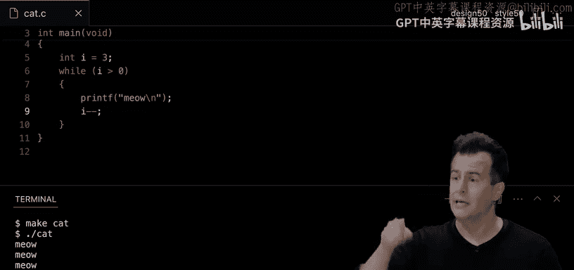

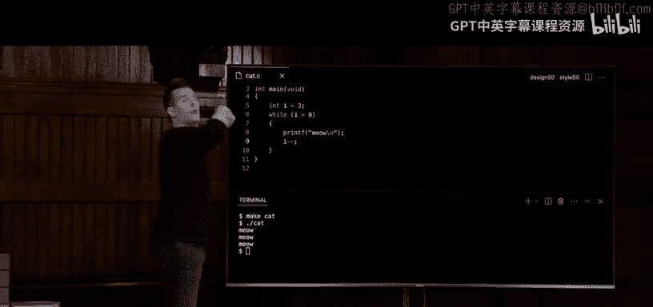

So same exact idea in scratch， even though it's a little more mechanical。

 So that's how we might implement this。 And you can think of it。Sort of these variables。

 This is perhaps a little gratuitous。 But let's do this。

 So if you have a variable inside of a computer's memory。

 And that's a detail we'll get to in more detail before long。

 you can really think of it just as like a container that stores values。 So for instance。

 this clear plastic bowl。 It can be thought of as a variable。 It just stores values。 And right now。

 there's obviously three stress balls in it。 So it represents the number 3。

 So what's really happening in code like this is we've initialized I to 3， which is this bowl。

 We're then checking the question on line 6 is I greater than0。 obviously。

 So we proceed inside of the curly braces and we print out meow。 we then decrement I。

 So for the sake of unnecessary drama。 like that's decrementing the variable。

 So what's being stored in this this container now is one less。 We do it again。 Check the count。

 Nope， two is greater than 0。 So we keep going nowow， decrement I Check the variable。

1 is greater than 0。 So we print meow decrement I， we check the condition again。 I。😊。

Is not greater than 0 because 0 is not greater than 0。 And so the rest of the code stops executing。

 I'm not sure if that was any more effective than fingers on my hand， but we had the ball。

 We had the ball。 So same exact idea。 Vas are just storing some value and incrementing and decrementing would just be adding or subtracting stress balls in this case。

 But there's other ways we could do this。 In fact， let me zoom in on my code here。

And it's not really conventional in programming to count down。 like nothing wrong with it。

 It's just not really a thing。 We would typically count up。 So we could alternatively do this。

 set I equal to 1 initially。 So we count 1，2，3。 like a normal person。

 And we can change our condition If I'm gonna count from one2，3。

 What should my comparison be in my Boolean expression here。I is less than3。Less than or equal to 3。

 I think。 So if I is initialized to one， we're gonna to go through this one times。

 two times three times I is going eventually get incremented to 4。 But at that point。

4 is not less than or equal to 3。 So it's only going execute a total of three times。

 But there's still a bug in this code。 What other line needs to change。Yeah。

 so line 9 needs to become plus， plus。 so this code is just as correct。 And honestly。

 you could reasonable people will disagree。 Your TF might say do it this way and not this way。

 but like this is still correct。 but it's not the most conventional way as per last week。

 Comp scientists and programmers generally actually start counting from 0 by convention for reasons will'll soon see。

 So the better way， the more conventional way， arguably would be always start counting from 0。

 count up to， but not through the number you care about。

 And so this form of the code is probably the most popular way to do it。

 Start at 0 count up to3 but not through3 as with less than or equals them。

 All three are correct can't really do counting up as easily with the bowl without picking up the balls。

 but the exact same logic applies。 And， in fact， this version of the code is so commonly done that there's a different way to implement it all。

 there's a similar way to implement it all。 In fact， this code here。 same exact。

T repeatpeing three times because it's so commonly done that you want to initialize something to0 and keep doing something until like the value 3。

 you can actually use a different preposition 4， which is another keyword in C。

 and it looks a little more cryptic， but it just tightens things up。

 This is what's called a four loop。 previous is what's called a while loop。 And honestly。

 even though it probably to the newbie still looks just as cryptic。 It's just a little tighter。

 because you're expressing all of these ideas on one line。

 you specify the variable you want to create and initialize。

 you specify the Boolean expression you want to check again and again。

 you specify what increment or decrement you want to happen。 and confusingly。

 you do use semicoons here， not commass。 you do not put a semicolon here， you。

 of course don't put them after these things， you generally only put them after functions thus far。

 So we do have one semicolon here。 But in short， this you'll get more comfortable with。

 this is how I， for instance， almost always write a loop， but it's doing the exact。😊。

Same thing mechanically as this。 Same thing as counting on your fingers。

 Sam thing as counting the stress balls。 There's just different ways to express the exact same idea。

But there are ways to screw up。 So， in fact， let me go ahead and do this。 Suppose that the cat。

 we'd like the cat to live as long as as possible。 and we don't want it to stop meowing after just three or a finite number of times。

 How can you do something forever again and again and again。 Well， let me go back into V S code here。

 let me delete all of the code from earlier。 and let me go ahead and say while something is true。

 I'll come back to that， let's just go ahead and print out meow backlash n ideally forever。

 But what do I want to put in here。 Well， if I want to do something forever。

 I could do something kind of stupid like while one is less than two。

 which is always gonna be the case。 or while 50 is less than 51。

 which is always gonna be I could just ask an arbitrary question。

 but like arbitrary not good in general， like you should have meaning behind your code。

 So if you want the expression to be true all of the time， just say while true。

 because true is not changing anytime soon， if it's literally true， It's always gonna be true。

 the only caveat is to use this trick for now， you will need to include the C 50 library。

 which for today's。Purpos makes that possible。 But there's a problem。 Of course。

 if the cat's going to live forever， if I do make cat dot slash cat enter。

Like you can very quickly lose control over your terminal window。

 and you can see like the meowos are flying across the screen。

 at least based on the bottom from what we're seeing。 like this cat will never stop meowing。

 And this is either a feature or a bug so to speak。

 depending on how long the cat here should live virtually。

 But how do you terminate a program that is out of control like this infinitely So one of the takeaways for today is control C is your friend for cancel or interrupt the program。

 if you ever sort of lose control over a program because you've got intentionally or unintentionally an infinite loop。

 you can go into your terminal window， hit control C。

 sometimes multiple times if it's ignoring you and that will break out of the program and just essentially forcequi it like in Max or PCcs。

 But let's make one improvement here still， The last thing we did with our cat in scratch before now we'll take a break in a moment was we defined our own functions。

 And recall that we did that to abstract away the idea of meowing because scratch didn't come with a meow puzzle piece。

 C definitely does not come with a meow。

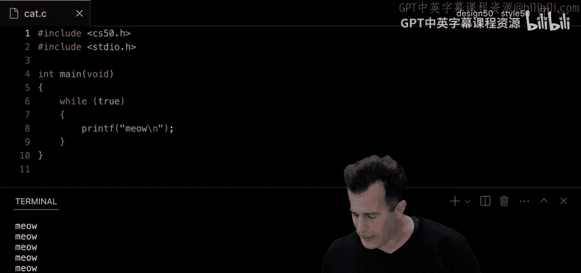

Function we have to implement it ourselves。 So quickly toward the end of week 0。 we did this。

 define a function called Miow that just plays the meow sound。

 And now we have a meow puzzle piece we can use and reuse in C， we're about to do this。

 And this is gonna look a little cryptic， but it's gonna lay the foundation for future weeks when we do this even more。

 I've got a meow function， weird mentions a void。 that just means there's no input and there's no output for this function。

 It just does one thing simply And that one thing is printf meow。

 So how do I use this here code here in scratches how we used it last week。

 When the green flag is clicked repeat three times the Miow function。 in C。

 it's gonna look like this。 It made void and all of that。 And I can use a four loop a while loop。

 I'm copying and pasting the four loop version of the code set I equals0。

 make sure it stays below three incremented on each iteration or cycle and just called meow。

 So what's nice here is that we have fairly simply a away in C to create our own functions called meow or anything else that lines up perfect。

😊，With what we did in scratch， we'll take some time to get comfy with the syntax and remember it。

 have to look it up frequently for reference。 But let's go ahead and actually do this。

 If I go back to V。 S code， clear my screen， Let me hide my terminal window temporarily。

 Let me go ahead and invent this meo function per the code earlier。😊。

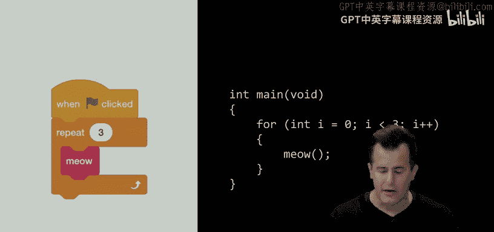

I'm gonna go ahead and do this。 void meow void。 And again， the two voids mean no input， no output。

 It just does one thing。 Well， printf quote unquote， meow back slash n。 And now down here。

 I can use a four loop。 So 4， and I know this for memory int I equals 0 I less than 3 I plus plus and then inside of curly braces。

 I'm gonna go ahead and call the meow function。 noticeice when I'm creating the function up here。

 I explicitly pedantically say void void， no input， no output。

 When I use the function online line 13， you just say open parenthesis close parenthesis。

 That's the equivalent of a scratch puzzle piece without a white oval。 You just put nothing there。

 you don't put the word void。 So that's it。 Let me open my terminal window。

 Let me run make cat to rerun to recompile dot slash cat。 And I think I have a working cat。 Now。

 this is correct。 the only thing I don't love about this version。

 If I hide my terminal window is that when。😊，Start writing bigger and bigger programs。

 It'd be nice if my main function， which I told told you to sort of take on faith for today。

 is at the top of the file。 if only because like literally the name main means this is the main part of my program。

 It'd be nice if it's the first thing I see， which is to say， just to be pedantic。

 It's very common to put any functions you write at the bottom of your file。

 Maybe alphabetically maybe organized some other way。 But you put main first by convention。

 just like the when the green flag click。 It was the first thing you always started with last week。

 But watch what happens now。 if I go into my terminal window。

 and command or control J is hiding and showing it if you are curious。

 but probably you'll just leave it open on your own all the time。 Let me do make cat again。😊。

And I've screwed up somehow。 All I did was move the meow function from top to bottom。

 and I'm getting call to undeclared function Miow， something something something。 Well。

 what's going on。 Well C is pretty naive and simplistic。 It's only gonna do what you tell it to do。

 And it's only gonna do things top to bottom left to right。 And unfortunately， on line 8。

 you are telling C， call a function called meow。 but that does not exist in C 50's header file that does not exist in standard I O header file。

 It exists at the bottom of my file at which point it's too late because I'm trying to use it before it exists。

 So I could just undo that and put this meow function at the top of the file。

 but you're gonna eventually get into a perverse scenario where you can't put all of your functions above all of your functions like you got to pick a lane at some point。

 So the solution to this albeit a little weird。 And the one time and C 50 in programming that it is encouraged and necessary to copy paste is what you can do at the top of your code be above main is just copy paste the first。

Line of your own function。 This is the socalled prototype of the function。

 And it simply describes how to use the function。 And funny enough， we actually saw this earlier。

 but I sort of I kind of swept it under the rug a moment ago。

 or bit ago when we looked at standard I O do H。 And we looked at the printf function in the manual pages。

 I highlighted the header file。 But I also glossed over the so-called prototype， which is sorry。

 the first line of the printf function， just as this is the first line of my Miow function。

 This is like a little clue。 This is like saying to say， hey。

 there's going to be a function called meow， that takes no input has no input takes no input has no output。

 just know that it exists eventually and that will satisfy the compiler。

 because if I go back to my terminal， rerun make cat it now knows on faith per line 4。

 this function will eventually exist。 And indeed， once it gets to the bottom of my code line 14 onward there。

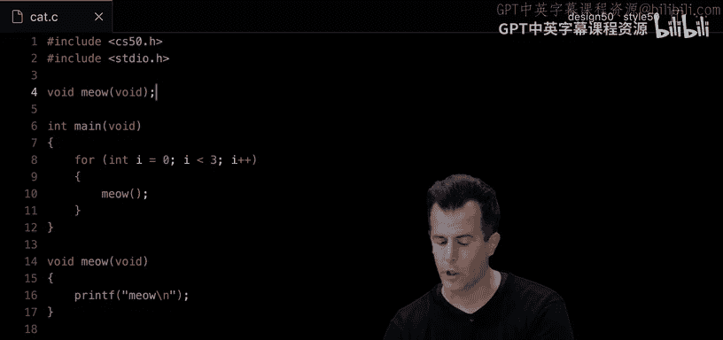

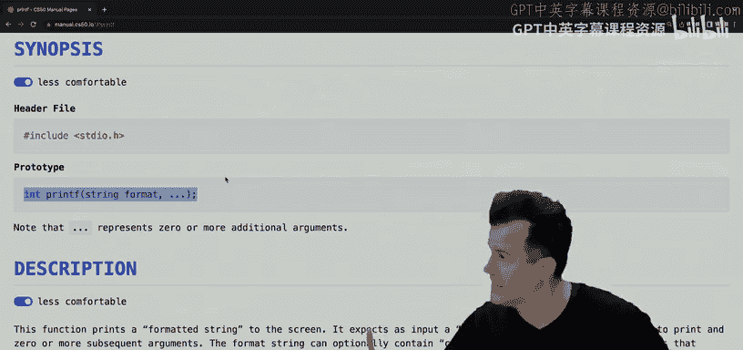

In fact， is。 So you just copy the one and only first line of your functions code to the top called a prototype。

 And now if I do dot slash cat， I get finally， meow， meow， meow， yet again in this case。

Questions on these here， cats。No， all right。 then the last flourish before I keep promising cookies that I promise they exist。

 So last flourish。 like just as we did in scratch。 So in scratch。

 recall that we parameterized our meo function by letting us tell Miow how many times to meow so that we didn't need to use our loop inside of our when green flag clicked block。

 In other words， if I want to actually have the cat Miow a specific number of times。

 I can actually go ahead and do that proactively with some of my own code。

 such as this here in scratch。 When I edited my meow function last week in scratch。

 I specified that I want it now to take an input called N， which represents some number of times。

 And I changed my repeat block not to be3 perpetually。

 but to actually have n generally baked in there instead or actually。

 instead of just saying place on meow， I had a repeat block using N as the placeholder instead of a hard coded3。

 So how can I now use this in C， in C， it's almost the same。😊。

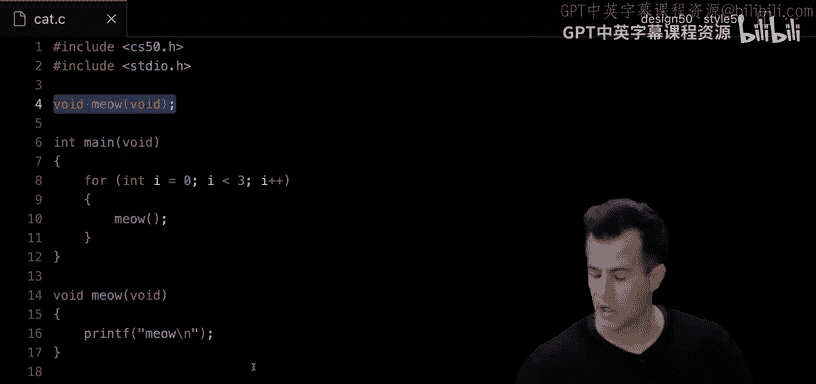

It's still void at the beginning of my function name， which means no output still。

 It only has side effects。 But what did change， Via V， the previous version of Mio。What has changed？

Exactly， instead of saying void a second time in parentheses。

 it literally says int N inside of those parentheses， which means in C。

 this function called meow takes input。 It means the exact same thing as the pink on the left。

 And again， this is why we keep emphasizing the scratch box。

 like no new ideas with a lot of these features。 It's just different syntax that you'll get used to over time。

 So if I go back into V S code here。 And I change this function， let's do that。

 Let's change my prototype to be int N where n represent some number of times。

 Let's change the actual function on line 14 to also have int and here。

 And let's actually move the for loop from main into the meow function such that I now have my curly braces here。

😊。

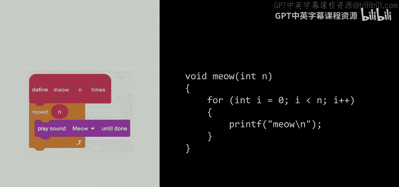

I have my print statement inside of those curly braces。 And now in mainine。

 I can get rid of all of that code， just say Miow any number of times like three。

 And just like I did with scratcht， let me hit enter an arbitrary number of times sort of out of sight。

 out of mind。 Now， the essence of my program is like one real line of code。

 Miow three times because I've abstracted away the idea of Miowing and told the cat instead exactly how many times to Miow by way of that function。

😊。

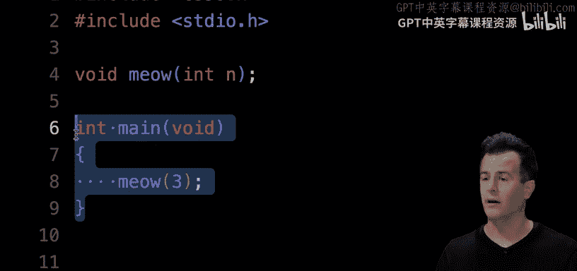

Okay， I can't keep stringing long cookie so long。 Let's go ahead and take a 10 minute break here。

 And when we come back， more cats， more code。

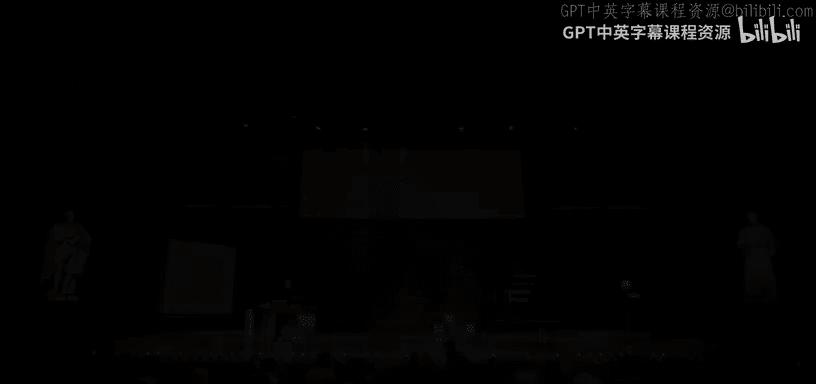

All right。So we are back。And w to add one final flourish to this program because now more so than a lot of the examples。

 like now the programs are starting to grow in length。

 and indeed soon there'll be a few dozen lines of code， which is not uncommon。

 But let's suppose that we gonna to start stop hard coding 3 everywhere and actually prompt the user for some number of Mios here。

 Well let me do this in V S code。 I'm gonna go ahead and get rid of this one line for now。

 And let's do something like this。 Let's ask the user for an integer。

 So in maybe n for number equals get in and we'll say something like just number to give a number of meos。

 And then we'll go ahead and actually call meow passing in not three this time， but passing in n。

 So we are using the return value of get int to store it in a variable called N On line 8。

 And then we are passing n as the input or argument to the function called Miow On line 9。 And again。

 the actual implementation of meow online 22 onward like who cares out of sight out of mind once。

We can sort of abstract it away mentally， but I'll keep it uptight here anyway。 Alright。

 so let me go ahead and open my terminal window。 make cat dot slash cat number。

 I can still type in 3 and it works， or I can go ahead and type in5。 Meow meo meow。

 but it's not actually meowing five times why。I didn't realize this either， but there's a bug。Yeah。

 exactly。 So the four loop， when I copy pasted it before before break， I actually kind of got lazy。

 and I forgot to change the three to an n so that it matches the name of the argument that's being passed into meow。

 So that was a bug unintentional on my part， but we have now fixed it here。

 And now we are passing this N from main to meow。 So if I make cat dot slash cat and type 5 this time I indeed get five me。

 But it's worth noting there's some subtleties here in my code in that I've used n a couple of times。

 So this is actually deliberate that I've used n twice in this way to induce a bit of confusion。

 But it turns out this n is's actually not the same as this N nor this one。 So what's going on here。

 Well， it turns out in programming， There's often this idea of scope。 and long story short。

 generally speaking， variables only exist in the scope in which you create them more down to earth。

 variables。Only exist inside of the curly braces in which you defined them。 So， for instance。

 suppose I got a little sloppy and suppose I didn't bother giving me meow an input。

 and I didn't bother giving its prototype and input。 And I just used n on line 14， because why well。

 I already defined n on line 8。 So this is just an alternate universe in which I'm not changing meo to take input。

 I'm just using n in two different functions in main On line 8 and 9。 actually。

 I don't even need that On line 8 and 9 and also， again， on line 14。

 This code will not work like the compiler will not like this Y because N does not exist inside of Miow。

 Why per the heuristic I offered n exists only inside of the curly braces in which it was defined namely these curly braces here。

 So N is in scope in main。 So to speak， But it is not in scope in Miow。

 And that's why we kind of have to jump through these hoops and use inputs and。

Outputs and inputs and outputs and pass things around among functions without sort of sharing things across functions instead。

 Now， I could clarify this and maybe change my argument here from n to like times。

 If I want to make clear that oh， this is the number of times。 I want now to be said。

 I don't have to use n for both， but just realize that if you do it's just a coincidence。

 they are not usable in two different scopes。 All right， let's do one other thing though。

 let's not keep let's not only prompt the user for the number here。

 let's make sure that it makes sense what number they give us。

 So if I do make cat just to clean things up s cat。 I type 0。 Okay， I suppose that's correct。

 if I say now zero times and it doesn't meow at all， that's arguably correct。

 But if I type in something like negative5， it ignores me。

 which I guess is better than crashing or freezing or something。 but ideally。

 it might be nice to handle this situation。 And if they give me a negative number。

 prompt them again for a positive number， prompt。Again， for a positive number。

 Like make the program make sense。 So how could we do that。 Well， a couple of ways。

 if I go back into my code here， I could do this。 I could maybe do something like a loop or let's see So if I get n。

 So if n is less than one， then it makes no sense。 So what do I want to do if n is less than one。

 Well， I could just prompt the user again。 And I' say， okay， let's get n again。

 And then I can say if n is less than one， what do I want to do， I guess we could ask the user again。

 And then if n is less than one， like just again， like I can give them like three tries4 tries to get this right。

 Like this is obviously stupid。 Like I'm copying and pasting。 I'm repeating myself。

 there's no end in sight。 like I can't do this forever surely。

 So this just feels like the wrong solution。 So there are different ways to solve this problem。

 And funny enough， like a while loop is not really the best way。

 a do while loop is a while loop is not the best way。 A four loop is not the best way。

 It turns out there's one other type of loop。That we want to introduce that's super useful for getting user input potentially again and again and again。

 so that the user cooperates。 specifically， what I'm gonna do is this。

 I'm gonna literally say do the following while something is true。 So it's more of a mouthful。

 I'm spreading it out over multiple lines。 But what am I gonna put inside of the do block here。

 I'm gonna say int n equals get int and ask for that number as before， close semicolon。

 And I'm gonna keep asking while sorry， accidental enter。 while n is less than one semicolon。

 So notice the semantics of this。 even though it's a little weird looking， it does read in English。

 do the following Okay， get in int stored in n。 and keep doing that while n is less than one。

 But this code as written is not quite going to work yet。 Let me try opening my terminal window。

 make cat enter。 damn it。 like use of undeclared。N， Well， here's where the line number is helpful。

 The line number is indicated here 12， and it's repeated here 12。 So I clearly screwed up at line 12。

 There's not that much going on at line 12。 Y is N undeclared。In line 12。

 even though I literally just declared it in line  10。

Exactly because I declared an inside the scope of the do block。 so to speak。

 inside the curly braces on lines line and 11， that variable n no longer exists by the time we get to line 12。

 It'd be great if it did， but it doesn't because it violates that heuristic， I propose。

 which is that variables only exist in the scope of the curly braces in which they were defined。

 So how do I fix this。 Well， it turns out you can declare a variable in advance outside of one scope。

 but then define it。 that is initialize it elsewhere。

 So the solution here is actually this inside of the loop。

 just set n equal to the return value of get nt。 but per the heuristic。 you've got to declare n。

 make it exist inside of the outermost scope of this function。 So it's a little weird。

 And we're kind of breaking this down into two steps。 But this is valid， recommended， correct C code。

 you declare a variable without giving it any value initially， And then in line 11。

 you proceed to give it a value， potentially。Again and again and again。 Now。

 what's useful about a do while loop。 So a do while loop is the name implies。

 we'll do something no matter what， but it will potentially do it again and again and again。

 while some question is true， like N being less than one in this case。All right， as an aside。

 why did we not do a while loop。 Well， let's think about that。 while n is less than one。

 but wait a minute， N doesn't have a value。 Okay， so I guess we have to go back to doing get in number colon semicolon。

 but while n is less than one。 We're back to the same problem where we have to repeat ourselves again。

 So this is why4 loops while loops not the right solution when you want to do something at least once。

 but potentially again and again， So the right solution here again。

 is this new and final loop in construct。 I'm just hitting control Z a lot whereby we've done it as follows。

 All right， let's try this clear the screen。 make cat enter dot slash cat。

 let's type in5 still works， let's type in negative 5。

 and notice it doesn't just ignore me it prompts me again and again and again， even if I type in0。

 I've got at least give it a positive integer。 Well。

 this actually seems like kind of a common paradigm。

 Like what if we want to prompt the user for a positive number in other programs too。 You know。

 we're nearing。Point already， even after just week1。

 it would be nice to like write our own reusable functions that solve common problems。

 And eventually eventually maybe we can put them in header files as well。 But for now。

 let's go ahead and do this。 I'm gonna actually copy all of this code。

 And I'm gonna create one more function in this file below main called get positive int for integer And I'm gonna specify that it doesn't need any inputs because the only thing this function is gonna do is that exact same thing。

 So notice that I've just moved my code for main into a function that's name describes what it does get positive int。

 I'm declaring n here。 I'm doing this again and again， and I'm doing that while n is less than one。

 And what am I going do up here。 I can do something like this。

 Give me a variable called times for how many times do you want to meow。

 And just call get positive int semicol。 So now again。

 we've abstracted things away And just like in scratch。 our final example。

 which looked a little something like this where we just called a function to meow3。😊。

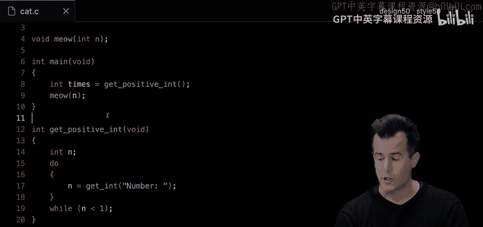

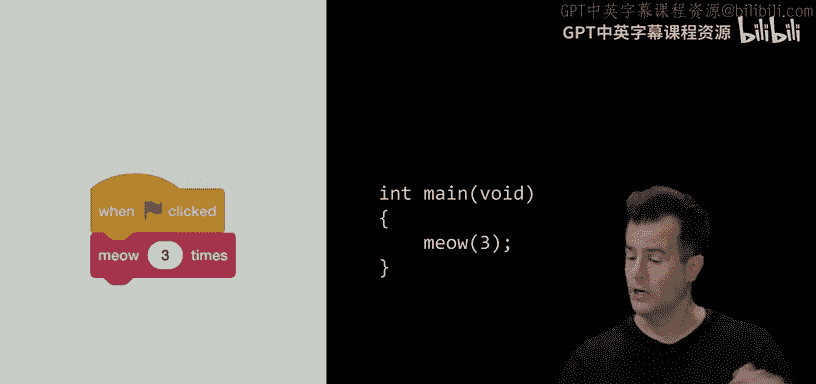

TimeNow， we're calling a function to get text。 If I hit enter an arbitrary。

 dramatic number of times out of sight out of mind。 I now have two functions in this world。

 Get positive int and Miow that are collectively implementing this entire program。

 but it's not quite correct。There's one mistake here。 Still。

 Notice that get positive int is written slightly differently from the Miow function。

 And just to be clear， too， let me copy its prototype to the top of the file just so we don't make that same mistake I made earlier where I didn't put the prototype at top。

 So C didn't know what it was。What is different about these two prototypes at a glance。Yeah。Okay。

 so get positive in apparently。 and we've not talked much about this。

 A does have an output of type integer。 It's supposed to return and it hand me back and in。

 It doesn't have any input。 That's what the void and parentheses meant。 No input。 But yes。

 output and meow， funny enough is the opposite。 Yes， input。 No output。 Why。

 because it has a side effect。 The visual thing where it prints something to the screen。

 but doesn't hand me any useful value back like the ask function or the ask puzzle piece did。

 So these are sort of opposite and functionality， which means I actually need to return an integer from this function to whatever function wants to use it。

So if I want the assignment operator to work here on line 9， I need to do what all this time get in。

 get string and other C 50 functions have been doing。 I need to， in my own function。

 return that value， literally with a new keyword called return。

 And this is why I keep sticking up my hand。 When you want to function to like hand you back a value。

 you literally use return。 and then that value。 That's why we have return value as a term of art。

 literally the return keyword。😡，So if I open my terminal window now， make cat enter。

 I did screw up accidentally。How， yeah。Yeah， so on lines 9 and 10， I made a quick change。

 I changed my variable to times， but I stupidly didn't change this。 That's fine。

 That's why n was undeclared in that context。 Let me clear my terminal。 make cat once more。 Okay。

 that work dot slash cat， Let's type in 5 and it's still working。 So again。

 even though the code feels like it sorry， Even though the code is kind of growing and growing and growing。

 It's the exact same program。 we wrote super simply before break。

 But now we're sort of modularizing it。 We're creating reusable functions。

 And this is why functions like get string exist， get in exists like C 50 wrote those years ago。

 And we realize why are we copying and pasting these functions in all of these different C 50 programs。

 Let's factor out that functionality into a function of our own get int， get string just like here。

 I'm proposing to factor out this functionality。 get a positive integer that gives you even more precise functionality。

 So theoretically you could use and reuse it in other programs， too by not even just putting it here。

 We could go put it in a file of your own name and。😊。

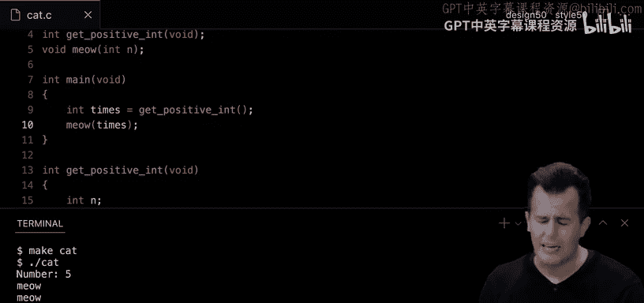

It in future programs as well。 Like that's all a library is。 Someone realized geez， other people。

 including myself， might find this function useful again and again。

 Let's package it up in our own custom functions， just like our customow puzzle piece last week so we can indeed use it again and again。

 and the takeaways for now is that unlike scratch， which was a little more user friendly in see。

 you have to specify if you want your functions to have inputs and you must specify if you want them to have outputs as well。

 But more on that syntax to come So where does that bring us。 So after all this discussion of code。

 like at the end of the day， like this is what's important in the world of programming。

 not surprisingly， it's like what's important when it comes to grading and evaluating the quality of code。

 one and first and foremost， is correctness。 Like if the code does not do what it's supposed to do what was the point of writing the code。

 So correctness sort of goes without saying design again is much more qualitative It's like getting feedback again on English say reasonable people might disagree。

 You can make your argument better。 You can structure the paper better。😊。

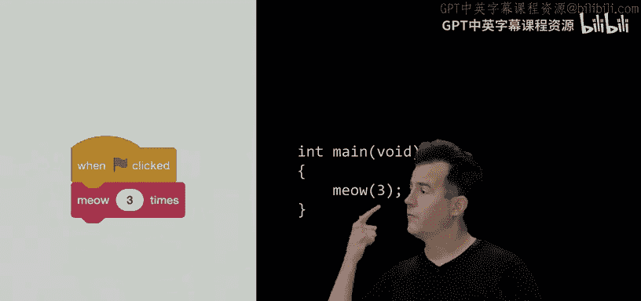

You can structure the code better in the case of programming and style is purely aesthetic。

 Does it look good。 Is it pretty printed。 so to speak， Can other people。

 colleagues future and classmates present actually read and understand it。

 That's what we mean by style。 Nicely enough within C 50's programming environment。

 you will have tools to evaluate the quality of all three of these axes。 So to speak。

 So in problem set one onward， you'll be introduced to a command line tool that you type its name at the prompt Call check 50 that will check for you the correctness of your code。

 not necessarily exhaustively like there might be mistakes you've made that we don't catch。

 which doesn't make your code correct。 but it is a tool for finding many of the mistakes in your code in the real world。

 you would have colleagues or yourself would write tests for code you wrote or someone else wrote。

 So like testing code is not just a grading thing。 It is a realworld thing to ensure that systems are design correctly。

 We saw the style 50 tool in V S code already， you click the style 50 button。

 there is now thanks to the duck， a design 50 button。😊。

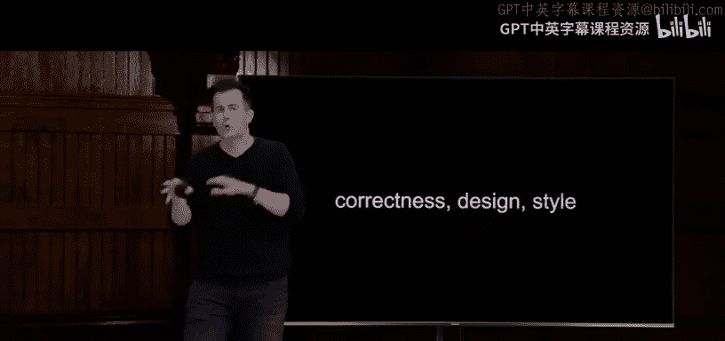

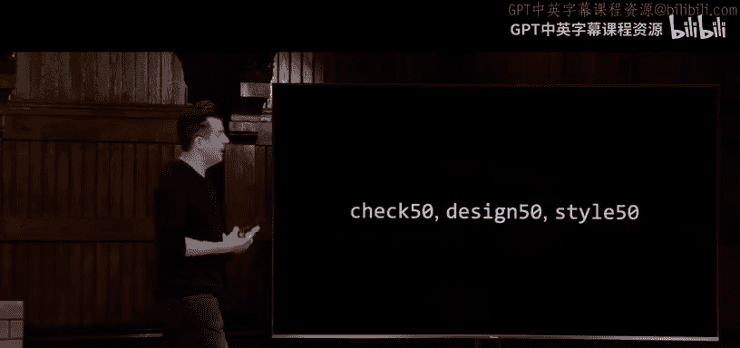

ToAlso in that top right hand corner， whereby once your code is correct and working。

 like several of my programs have been， you can click design 50 and the duck will not just quack。

 but give you qualitative advice if it can on how you can make that code even better even before you submit。

 And of course， there's all of us humans in the room and online that you can ask these same questions of as well。

 So let's now solve some sort of real world， but still simple problems。

 as opposed to emphasizing small bite size as we have thus far。

 So the first of these programs falls into this category if having side effects。

 So let's implement one or more functions that takes an arguments input And as its output produces these visual side effects。

 We'll draw inspiration from Super Mario brothers not surprisingly， perhaps here， the original one。

 which was very twodiional side scroller left to right， Mario or Luigi move from left to right。

 and generally have to like jump over things like pyramids or other shapes on the screen。

 So how might we go about implementing some of the screens from Super Mario Brothers。

 albeit it textually。 we'll make it a little black。😊。

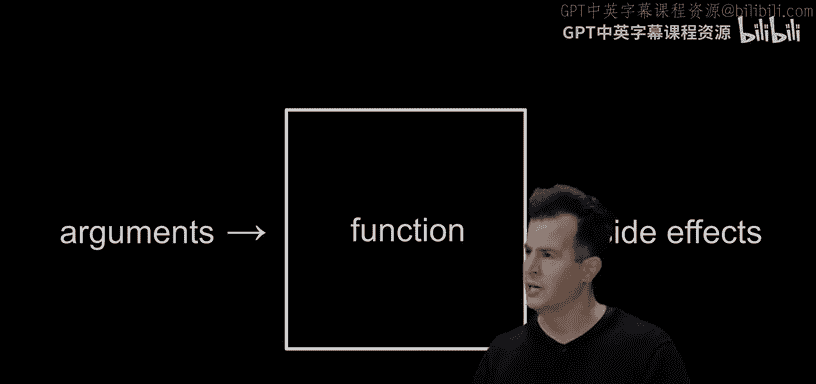

In white and ASi art。 so to speak here using just our keyboard。

 But suppose we want to write a program called Mario dot C that just prints out four question marks。

 It's not gonna be nearly as pretty as what's on the screen here。

 but the logic is gonna be the exact same as what Nintendo presumably did years ago。

 So let me open V S code。 My terminal window。 Let's code a program called Mario do C in Mario do C。

 I'm gonna start with some boiler plate。 I know I want to print。

 So even if I don't know how to do this yet。 I'm gonna include standard I O do H for today's purposes。

 I'm gonna copy paste or type out that same line again and again。

 main void And inside of my main function akin to the green flag being clicked。

 I' want to go ahead and print out four question marks。 Well， honestly。

 the simplest way I can think of doing this is with printf Que mark question question More question mark。

 maybe a backlash and to move the cursor and that's it。 So that is arguably correct。

 So let's do make Mario and the terminal do slash Mario。

 And it's not quite as pretty as the game version of it。 But it is， in fact，😊，Exact same idea。

 But here's sort of an opportunity， stepping stone to do better design。

 like this game changes over time。 And not all of the screens have just four question marks。

 It might be 5，6 or even more。 So what's the right programming construct with which we could generalize how many question marks are printing here。

Like what feature of C do we want？A like a loop， like a four loop。

 a while loop or something like that。 And there's different ways to do this。 But honestly。

 I've proposed earlier that we get into the habit of reaching for four loops as just very conventional。

 So let's do that 4 int I equals 0， I less than 4， because that's how many I want for the moment。

 I plus plus， and then inside of my curly braces there。 Let's go ahead and print out， quote unquote。

 a single question mark， but no new line。Let me now go ahead and make Mario。

 And can you anticipate a arguably aesthetic bug when I hit enter。

 It's not going to move the cursor to the next line。 But the solution here is a little not obvious。

 I don't think this helps me If I put the backslash end there。

 And I do make Mario again in dot slash Mario。 What is this output gonna look like instead。Yeah。

 like a vertical column of question marks， which while nice enough is not the goal at hand。

 The goal is these horizontal ones。 So someone else。

 what's the fix here if clearly putting the backslash an inside of line 7 is wrong。

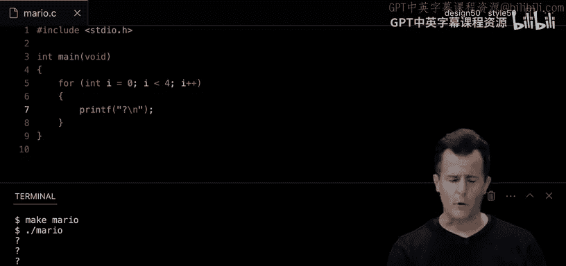

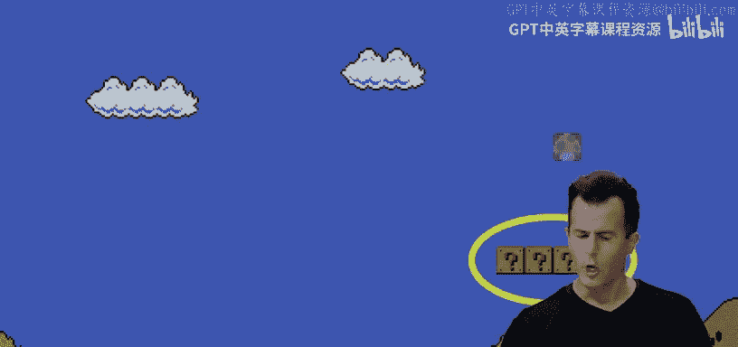

Yeah， so put it after the loop and not after the printf line specifically after and thus outside of the loop so that after that loop is finished executing three total times。

 it's totally fine to just print nothing other than a backslash n。

 So long as we now recompile the code。 make Mario do slash Mario and voila。

 Now we have four in a row。 It's a little generalized。 Okay。

 so we've sort of plucked off a fairly easy problem。 Well。

 let's go back to the world of Mario and try something that is， in fact， vertical like this。

 So this is another scene with like three bricks here instead of using question marks。

 We'll use hash symbols to represent bricks， This actually is the incarnation of my mistake a moment ago。

 So let me undo this by getting rid of that printf。😊。

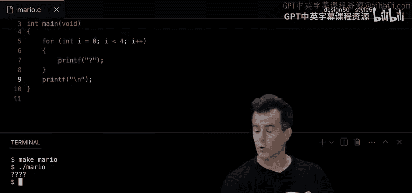

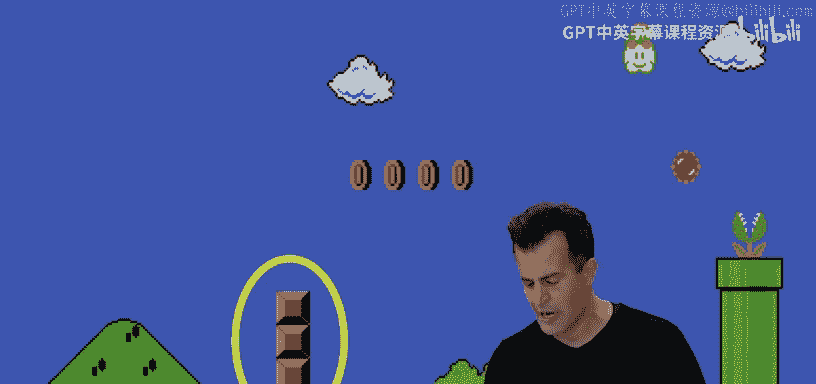

Let me change the inside one from a question mark to a hash symbol。

 which looks the most similar in ASI to a brick。 And let's go ahead and put in backlash n after that。

 If I do go ahead and do make Mario。 dot slash Mariio， It's not that interesting。

 but and it's actually not that correct because I want three。 So no big deal。

 I can of course go back to my code and change the4 to a three or better yet。

 I could use get int or my new get positive in function and just generalize this further so that I can print out any number of them。

 But for now， dot slash Mario gives me three。 Allright， so we've pled off the second of two problems。

 let's now let things escalate a bit。 So it turns out once you get to like world2 and beyond there's some underground parts of Mario where you actually have bigger more solid bricks like these here。

 And just by eyeballing it， this is like a three by three grid bricks like 9 of them total will conjecture。

 So how can I go about implementing this。 Well， now is where the program gets a little more interesting。

 And the sort of not Well， the poorly。😊。

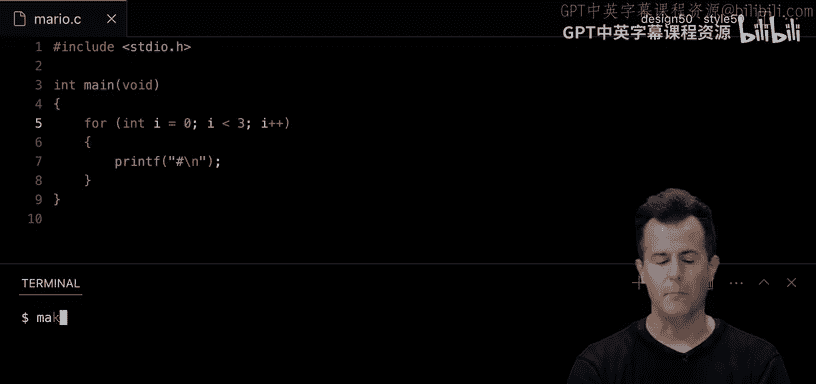

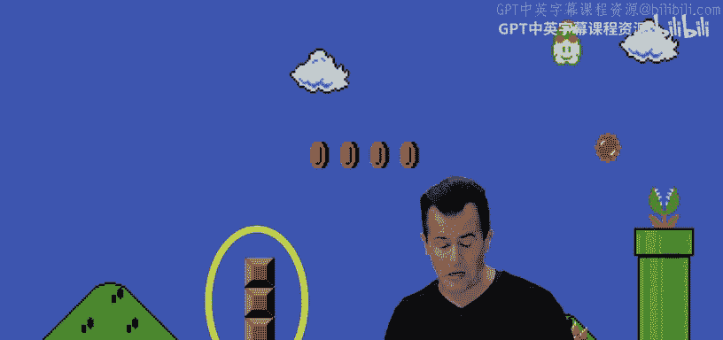

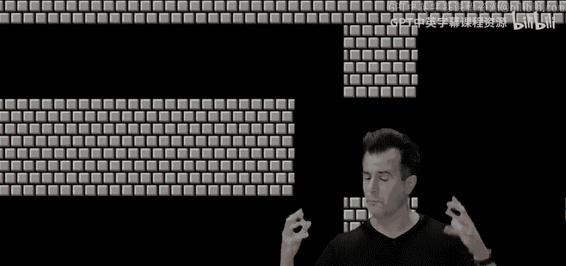

Designed way to do this would be like printf， hash hash， hash back slash N semicolon。

 and then maybe printf printf。 like that's kind of like correct， but not well designed。

 So make Mario dot slash Mario， You know， it doesn't look like a square just because these hashes are more vertical than the are horizontal。

 but it is correct。 this example。 but it's not very generalizable。

 And this is like literally hard coding。 I copy paste。

 And I'm just doing a lot of bad practices here。 So what could I do instead。 Well。

 turns out we can combine today's ideas， including loops to do things again and again。

 So what is this grid of bricks。 It's a three by three。 So that's like。

 it's like a row and a row and a row， And then within each row， there's like column column column。

 So it too is like an oldtimey typewriter that sort of prints one line then the next line。

 then the next line and so forth。 So how can we conjure that in code。 Well。

 let me go ahead and do this。 I。😊。

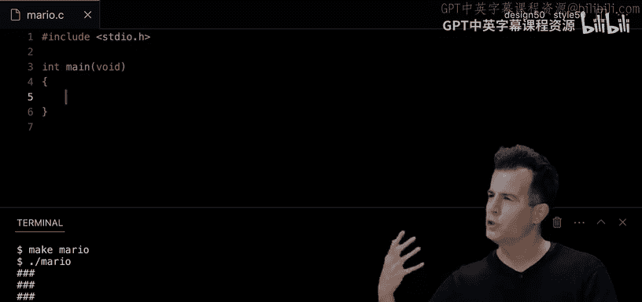

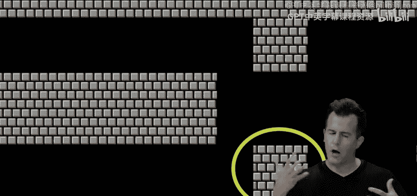

Think think a print approach would work is like this for int I equals 0。

 I less than three I plus plus because I know I want to do something three times。

 but what do I want to do three times This loop kind of represents in my mind's I， row， row， row。 So。

 in fact， I could be more pedantic。 if I want my I to mean something beyond int。

 I could say row equals 0， row less than 3 row plus plus just to help me think about it。

 And then what do I want to do on each row， What do I want to print。

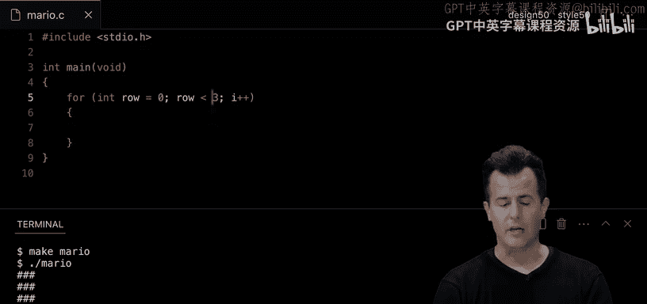

Like column column columns， So brick brick brick。 So how do I print three bricks or any number of bricks。

 Well， I could kind of cheat and just do print hash hash hash back slash n。 But again。

 I can't generalize。 I can't take an input from the user and print 4 or5 or six bricks。

 So that's gonna get me into trouble eventually， So maybe I could use a loop。

 So I could do like for int I equals0 I less than3 I plus plus inside of my loop。 And then in here。

 I could print out one hash。 And that's kind of on the right direction。

 the right path because now I'm just using the simple building block or brick。

 but reusing it again and again。 And it's totally fine to have nested these columns in this way。

 I used I out of habit， but what would a better name be well。

 maybe column or maybe just COL call for short， So that my code is sort of saying what it does for me。

 And I don't have to use row or column explicitly。 I don't need to print them but I am using them as counters 1 after the other。

 So let me go ahead and run make Mario。

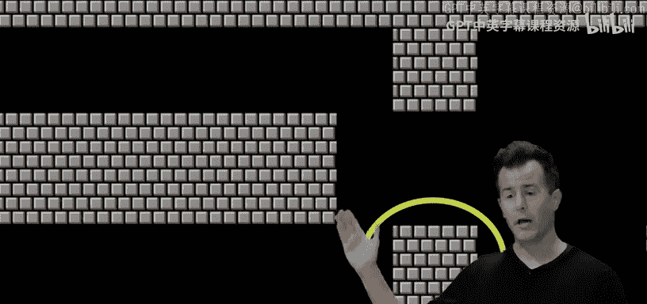

dot slash Mario。 And I'm feeling good about this， but。😊，Damn it， There's 9 bricks。

 but they're not really laid outright。Why， what's the fix， yeah。Yeah， I never went to， a new line。

 And let me do what I think you're not gonna suggest。 I do。 Let me just go to the obvious place。

 Alright， well， let's put one right after the brick。 But， of course。

 if I do make Mario dot slash Mario， I'm making the same mistake as before。

 I'm printing out too many new lines。 So in between。

 what lines do I actually want to print a new line。Betweentween啊。Yeah， so 10 and 11。

 So outside of the inner loop。 but inside of the outer loop。 So it happens again and again。

 So let's just print out as before a single backslash n semicolon。

 now let's do make Mario dot slash Mario enter now it's generalized as I see fit。

 And if I really wanted to dwell on this。 I could go in。

 and I could prompt the user with get int or with get positive in。

 figure out what row and or column should be。 we can make any size brick that we want。

 But now we have sort of a nice starting point。 But there's another way to think about this。

 because I dare say especially for like your first CS 50 problem if you're trying to print bricks the world of Mario in this way。

 It's probably not gonna be obvious to come up with loops like this and just magically get it working after like 45 seconds in total。

 itll be a struggle at first， But there are some patterns to follow。 So one。

 it's pretty conventional。 nonetheless， to use just I and then J and then K and then L and if you've got nested nested nested nested loops at some point nesting。

 you're probably。😊，Bad code。 It's not well designed。

 but one or two or maybe three nestings could be an okay thing。

 but you cannot use and reuse I again and again， why， Because if you're counting I here。

 but then you're changing I here to do your columns left to right。

 You're gonna get all of your math out of sync。 So you need two separate variables。

 I and J or conventional or row and column would work too。

 But if we go back to this idea of rows and columns， Well， let me actually factor something out here。

 And this might help you instead。 suppose that you set out on this problem。

 You know you want to do something like three times。

 but you don't quite understand how to print those rows。 Well take a baby step。

 a bite out of the problem， and maybe do this， create a function with no output just a side effect whose purpose in life is to print a row。

 And how many rows， Well maybe end for some number of rows for some number of bricks rather。

 How do you print a row of bricks。 Well， let me just think about this in isolation。

 How do I print a single row of bricks。 That's easy。Or int I equals 0。 I is less than n。

 If I'm generalizing I plus plus。 and then whoops I plus plus， and then inside of my curly braces。

 go ahead and just print out a single hash。 And at the end， as you suggested。

 print out a single new line。 In other words， abstract away the idea of printing a single row。

 And in fact， at this point in the story， especially if you're struggling to get started。

 You don't even need to start with main。 Like take a bite out of the problem that makes sense to you that's smaller than the whole problem Pri a single row。

 because then you can come in and iterate。 Then you can go in and say， okay。

 now let's write my actual main function。 So in main void as always。 And now what do I want to do。

 I want to print out a whole bunch of rows。 How do I print out a whole bunch of rows。 Oh my God。

 it's like the same idea， for int I equals 0， I is less than let's call it three for now。

 But we can generalize that I plus plus And what do I want to do on each iteration of this loop。

 My gosh， Just print row。With three bricks。 And then we're sort of done。 right， again。

 out of sight out of mind， this function can go away and never be seen before because once print row exists。

 that's what it， in fact， does for me。 Now this isn't100% correct。

 I still need my prototype because if I've made my own function。

 I need to tell C in advance that it shall exist。 or I need to copy and paste that one line of code。

 if I were really being pedantic， this is bad design， in general。

 when you have the same number in multiple places in a program。

 a programmer would call this a magic number， like how is that working。

 like you're just honor system that you're using the same number again and again。

 So a better solution here。 even if you're not gonna take user input would be to do this n equals3。

 and then use n here and then use n here， or you could call it anything you want。

 But now youve specified3 in one and only one place。 And we can go one step further。

 It turns out in C and in other languages， you can protect yourself against yourself。 If you know。😊。

That a variable should never change its value。 It should always stay3 in this case。

 You can use what's called a constant where you can specifically say。

 I don't want just end to be an int。 I want it to be a con int。 Cons for short for constant。

 And this means even if I try to change and in my code， the compiler will not let me。

 So I can protect myself from myself or in the real world。

 you can use a variable that none of your colleagues can foolishly change on you without you realizing that it is happened。

 So a lot of programming， honestly， is just， you know。

 not trusting yourself the next morning when youve forgotten what code you wrote。

 let alone the next month， the next year when you're writing code in the real world。

 So constant just give us a feature to defend against ourselves。

There's another feature that's useful， too， especially when you wake up the next day you're like。

 oh my God。 like how does this code work， What does it do， Well， there's comments in code。

 And some of you might have used this in scratch， you could add little yellow sticky notes in scratch for comment in code。

 you can do something like this。 you can if you want to put an English reminder to yourself。

 or if you speak some other human language a comment in Spanish or any other human language。

 You can write it with a slash slash at the start of the line。

 And then you can say something like print N row。 And then this tells you in a comment what those subsequent lines of code are doing。

 It's sort of a note to self。 It has no functionality for the computer's sake。

 It just is a note to yourself or you can say something like this。

 Like never change n because you're making clear that it's indeed constant。 But that， too。

 is a little pedantic since cont says the same。 But comments are notes to self to help you remember what is something is doing or why you did it this way。

Questions now on any of these Mario。Problems that we have solved。No。Alright。

 so one final set of examples that push the limit of like what computers can actually do。 thus far。

 we've solved like every problem I proposed。 That's because I've kind of been skirting some of the underlying challenges。

 So it turns out that we have not only functions that give us side effects like visually on the screen。

 We again have functions that have return values。 So let's focus on those and where that where things can go wrong。

 And let's use a bunch of other operators as well。 suffice it to say computers got their start by being really good calculators So computer support addition subtraction multiplication division remainder operators represented by the percent sign here。

 which says take the remainder of something over something else。

 And there's even more operators than this。 So let's go ahead and implement our own calculator of sorts that actually has some bugs along the way。

 Let me go back over to B S code here。 I'll close Mario do C。😊。

Open my terminal and code up one final file called calculator dot C。 And in this calculator file。

 let's go ahead and do something super simple initially， let's go ahead and include C S 50 dot H。

 Let's include standard I O dot H。 Let's do in main void， as always， all boiler platelate thus far。

 And now let's do something more interesting。 int X equals get int。😊。

And we'll prompt the user for an X value。 Int Y prompt the user for a y value。

 As we've done previously for comparing numbers。 And let's just do something super simple。

 Let's give myself another variable。 Int Z equals x plus y。 And then let's print out the sum。

 So print F quote unqu， and I don't want percent S here。 If I want to print out a number。

 Someone said it earlier。 We want percent S for string， but percent I for integer。😊。

Back slash n and print out the value of Z。 So it's a little silly。 This calculator。

 It just adds two numbers together， but it's gonna demonstrate some point。 So make calculator enter。

So far so good。 dot slash calculator。 let's just say X is1。 Y is 2。 Z is going to be 3。

 This code is correct， Simple， though it is。 Is there an opportunity for marginally better design。

Could we tighten this up， make it shorter， Fer lines means less lower probability of bugs， probably。

 yeah。Yeah， we don't really need a separate variable Z。 I mean， it's fine if it's clearer to you。

 If it's clearer to your TF。 if it's clearer to your colleagues。 But honestly。

 this is so relatively simple， I think we just get rid of Z and just say something like x plus y here。

 which is totally reasonable as well。 But you don't want to take this to an extreme。 Heck。

 if we don't need Z。 do we really need x and y。 Well， we could do something like this。

 Let me actually whoop let me actually delete these lines of code and claim we can do this all in one very pretty one liner we could do say get int X plus get in y。

 and notice now kind of like the join example last time。 I'm calling get int once， get in twice。

 both of them return of value， which is like gonna be one and two respectively based on what I typed earlier。

 then I'm doing one plus2。 that's going into printf as the second argument。

 Like this is actually correct and willll work， It's just just stupid。 Like don't do this。

 Like we've crossed some ill。😊，Find line where this is just harder now to read。

 And so even though the variables aren't strictly necessary， I would argue。

 And I think most programmers would argue this is just much more readable。

 Each line is doing a little bit less work。 There's less chance for error。

 It just makes a little more sense， But reasonable people will disagree。 So therefore。

 this will this is to say over time too。 like you and your TF might disagree。

 you and your colleagues might disagree。 And at that point is when the sort of religious debates kick in as to which way is the right way。

Alright， so that's one calculator。 Let's do something else that maybe just like doubles a number here。

 So let me change this to just get one integer from the user。 Let's just call it X。

 And let's just double it quite simply。 So print F percent I back slash N X times 2 will quite simply double it。

 The star operator is indeed multiplication in this case。

 So that's gonna go ahead and double my number。 So make calculator again， dot slash calculator。Enter。

 and let's go ahead and type in one， and I get back two。 Let's run it again。 type in 2。 I get back 4。

s type it again。 Let's type in3。 I get back 6 and so forth。 Alright。

 so that's not bad in this case here。 But what if we actually want to write a proper program here。

 In fact， Yeah， let's see。 this is sort of a meme that comes and goes。

 let me see if you recognize this。 I'm gonna go ahead and say another variable net X。

 let's be more specific。 like dollars equals1。 And then let me deliberately induce an infinite loop。

 Sometimes it is useful to induce an infinite loop So long as you eventually break out of it somehow。

 if you don't want the program to run forever。 I'm gonna ask the user question asking them for a cha C using get cha。

 And I'm gonna ask them unquote， Here's percent I period。

 double it and give it to the next person question mark。 This is ringing a bell。

 And then we can pass in to get cha the dollars value there。 So actually。

This looks a little cryptic already。 I'm gonna put a dollar sign in front of it as though we're actually dealing with US currency。

 And what do we want to do， How about if the user says why for yes。

 double it and give it to the next person， then let's go ahead and do dollars and let's double dollars。

 So I can do dollars equals dollars times2 or recall the trick for plus and minus。

 I can also do times equals2， which just doubles it in one line as well。

 Just little syntactic sugar as programmers call it that just tighten up your code。

 even though it's the exact same thing。 But what if the user does not type why and they want to keep the money。

 Well， we have an else condition at that point， you don't want to keep asking asking asking asking them with getchar。

 let's just break out of this loop instead So break is another keyword that if you're inside of a four loop。

 a while loop a do while loop， you can forcibly break out of the loop early， if and when you want to。

 And so this sort of satisfies the goal of making sure that this doesn't run forever。

 But it is gonna run again and again and。Again， while we keep prompting the user with this question。

 So let's see now what happens， except at the end， let's go ahead and make sure the user knows like how much money they're walking away with。

 Here's dollar sign percent I backlash n。 So we will see at the end of this。

 whatever dollar amount the person ends up with。 make calculator enter dot slash calculator。

 and let me increase my terminal window size。 So here we go。 Here's 1 dollar。

 double it and give it to the next person， Yes， here's $2， Doub it and give it to the next person。

 Yes， yes， yes， yes， yes， so you know the Instagram reels aren't that long。

 But if like you keep doubling it again and again， this is called exponentiation。

 which will make you quite wealthy quite quickly because notice we're already in the thousands of dollars by just saying yes and yes and yes。

 it's an interesting sort of societal question as to what dollar amount you would keep the money and no longer double it and pass it on。

 But for now， well just keep doubling it because this is just getting bigger and bigger。

 See the infinitely large in the C program。 But oh my God。Like， apparently。

The Instagram reels cut off the meme too short because eventually it goes negative and then 0。

 like what's actually。Going on here。 like the code is actually correct。

 but we're bumping up against a different kind of problem。

 Any instinct for what is actually going wrong here。 It's not doubling forever。Yeah。😊，Yeah。

 there's not enough bits to store bigger and bigger numbers。 recall with 32 B。

 which happens to be how big most ins are。 you can count as high as 4 billion。

 if you start at 0 or roughly as high as 2 billion。 if you want to handle negative numbers as well。

 negative $2 billion to positive 2 billion。 So eventually。

 once I get to like 2 billion or $1 billion。 It goes negative， And then it just goes to 0 altogether。

 This is because of something called integer overflow whereby if you only have a finite number of bits。

 and you keep incrementing them， incrementing them， incrementing them。 eventually。

 you can't just carry the one because there's no 33rd bit So all of the other bits wrap around from ones to zeros。

 and it looks like all 32 of your bits are0， because the 33rd bit was supposed to be the one。

 but it's not there。 they don't have enough memory。

 So this is a fundamental problem with computers whereby if you count high enough。

 things will just start to break at least if you're using C or C plus plus or certain other languages that don't anticipate this。

 And there's。Very real implication of this。 So here's here's a photograph of something we'll look at more in time to come like of memory inside of your computer or phone or any electronic device。

 Suffice it to say there's only a finite amount of memory。

 And if you're only using 32 Bs then or heck， even 3 Bs。 you will eventually overflow。

 We use 3 Bs last week。 So here's an example in binary。

 if you're only using 3 bits per the white digits here， I've put in gray， the fourth。

 just to show you what carry we might want to have。 here's 0，1，2，3，4，5，6，7， just like last week。

 And just like last week， someone said， how do we get to 8， we need another bit。

 But if that bit is grayed out because it doesn't exist。

 we've just overflowed this tiny integer and gotten back to 0， just like my money went to 0 instead。

 So how do we actually avoid that。 You know， one way to do this is this。

 Let me get control C to break out of the program。 or I could just type no。

 Let me shrink my terminal window。😊，And clear it here。 I could actually do this。

 It turns out that int use 32 B， typically， but there's another data type that was on the slide before called long。

 which is a longer version of an int， which is 64 B， which is crazy big。

 There's not that many dollars in the world， but it's still finite。

 even though I can't pronounce the number that big。 But if we change all of our int to long。

 And we change our placeholder from percent I to percent L I for long int。

 I can actually count higher and higher。 So case in point， let me actually go back to my terminal。

 make calculator enter。😊，Make it larger again。 dot slash calculator。

 And I'm just gonna keep saying yes， but faster this time。 The sequence is exactly the same。

 But recall that once we got into the billions， it started to wrap to negative and then 0。

 This is a lot of money now。 Like longs are indeed longer。 And I could do this probably all day long。

 Oh， interesting。 Oh， okay， I shouldn't have said that。

 can't do this all day long because eventually， a long too will overflow。

 I just didn't think it was gonna happen that。😊，So a long tube will overflow because we'll need a 65th bit。

 but the computer has not allocated it。 So that， too becomes an issue of overflow to read an excerpt。

 like these are very real world issues。 And in fact， here's a photograph of a Boeing 7。

87 years ago that actually had issues beyond the most recent issues with Boeing airplanes whereby after 248 days。

 the Boeing 7，87 years ago can lose all of its electrical power due to the generator control units simultaneously going into failsafe mode。

 whatever that means。 But if you dig into this。 It turns out that there was a software counter in these airplanes years ago。

 that would overflow after 248 days of continuous power，248 days why。 Well。

 Boeing was using a 32 B integer。 And they were using it to count1s of seconds。

 And it turns out if you do the math after 248 days。

 you have used too many1s such that you overflow the size of a 32。Bit integer。

 The plane would essentially have this integer， this tiny， stupid little variable overflow。

 But generally speaking， when your number suddenly go negative or 0， bad things happen。

 the plane could literally lose its power， midflight or on the ground。 And if you can believe it。

 anyone want to guess what Boeing's workaround was till they fix the actual software。我在。

Not even reboot the plane。 like they were told every few days， Certainly every 248 days。

 turn the power off， turn it back on， which stupidly is what all of us have been told for years with our Mac and PCs and phones。

 Why because sometimes because of bugs and software， computers get into funky states。

 which is a colloquial way of saying like some programmer made a mistake and some counter overflowed or some condition wasn't handled and just weird unexpected things happen。

 So rebooting just resets all of your variables back to their original values and sorts of gives you more time。

 more runway in this case， No pun intended。 There are others， In fact。

 one of the most famous ones from like the 1980s was the original pman game。

 only had support for 255 levels。 Why they were using 8 Bs recall that 8 Bs gives you 256。

 When if you start counting at0， you can only go to 255。

 So the crazy kids who were so good at packman that they got to level 256。

 The makers of Pacman did not anticipate that anyone was going to win that many levels and just weird stuff。

Happened on the screen。 All of the fruits sort of started overwriting everything because they didn't have enough memory allocated to the level。

 nor did they have a condition that says if level equals equals 255， you win。

 like there was just nothing handling that corner case， so to speak。

 So these things abound even these days， thankfully。

 in some languages there are better solutions where you can use big integerors。

 And you'll just use 64， maybe 128， maybe256 bit。 but you need to use a language or a library that allows you to grow and shrink the amount of memory being used。

 And many， if not most languages do not do that for us。

 So there's a few final problems to see that we've been taking for granted thus far。

 And they also involve numbers and memory。 So let's go back into our calculator。

 Let's throw away all of this meme code here。 And instead。

 let's go ahead and do something simple again。 int X equals get int and prompt the user for a variable Xt Y equals get int。

 prompt the user for a variable。IAnd this time， instead of addition， instead of doubling。

 let's do division。 So print F， quote unquote， percent I back slash n。

 and then plug in x divided by y。 So use a single forward slash for division。

 Let me go ahead and make calculator down here。 dot slash calculator。

 And let's go ahead and do one divided by three， which should， in fact， be。😊，It's not really 0。

 right， It's like 0。333。 Let's try this again。 How about dot slash calculator 3 divided by 2 should be 1。

5。 Nope computer thinks it's 1。Well， what's happening here。 Well。

 it turns out when you're using integers in a program。

 you are vulnerable to what's called truncation。 an integer plus an integer gives you an integer。

 In integer divided by an integer， funny enough， gives you an integer。

 So even if the answer is supposed to be 0333。 or 1。5。

 Everything in the world of integers throws away the decimal point onward and you only get the integer part of the value。

 So it's not even rounding。 It's truncating everything after the decimal。

 So this program is just not correct， but there are solutions potentially， for instance。

 if I go back into my code here。 And I use a different format code we haven't used yet。

 We had s for string I for int， there's also F for float and a float was like a real number。

 something with a decimal point in it by definition， we just haven't used it yet。

 I could tell the computer to print this as a float。 So let me do make calculator again。

 And now it specifying type double。 There's an error here。 The problem。

Is that I can't just tell the computer to format this number as a float。

 I need to convert the number x divided by y to a float。 And I can do this in a couple of ways。1。

 I can literally change all of this to floats and just avoid the problem altogether。 use float。

 use get float， use percent F and I'm done。 But if I want to use ins for whatever reason because I want the user to type in integers。

 But I want to show them real numbers with decimal points for correct math。

 I can do what's called casting a value。 I can in parentheses。

 which is a weird new use of parentheses。 I can say， hey， computer。

 Please treat the following integer as a float instead， thereby avoiding truncation。

 do not trunccate for me。 So if I now run， make calculator again。Dot slash calculator and type in。

 for instance，1 for x，3 for y。 Now I get an actual floating point value。 I'm formatting it as such。

 and I'm telling the computer to actually arithmetically calculate it as such as well。But here， too。

 I'm kind of cheating you of a reality。 It turns out， let me clear this screen here。

And it turns out that there are fancy ways in printf to tell it how many digits to show you。

 how many significant digits。 And the syntax is very weird。 I have to look it up constantly。

 But instead of just saying percent F， you literally put some numbers in between there。 And you say。

05。 And that will say it's weird syntax。 hey， print F format this to 5 digits instead。

 So let me go ahead and do make calculator again。A dot slash calculator。And let's do one divided by3。

 And indeed， I get five significant digits there。 But suppose I get a little crazy。

 And I want 50 significant digits。 Well， according to grade school。

 I should just see more like  threes， But watch this make calculator， dot slash calculator。

 And it turns out that whoever taught you grade school math was kind of telling you some white lies because if you really do it with a powerful Mac or PC or phone。

1 third is actually  point3，33333334326744079 who's right。😊，Mr。 Mrs。 so and so from grade school。

 or like。The Internet。What's going on here。What explains this。

 It all comes down somehow to weak  zeros， zeros and ones。

Why is this floating point number imprecise， so to speak。What's the intuition？Yes， similar in spirit。

 just as ins only use 32 B， floats also use only 32 B。 If you want more， just as int has long。

 floats have something called double。 So I could kind of avoid some of the problem by switching to double。

 But that's still gonna to be finite。 And if you think about this intuitively。

 if you're using a finite number of bits， be it 32 or 64， you can only represent literally。

 so many patterns。 And thus so many floating point values。 So many real numbers。

 But how many real numbers are there in the world。Like literally。

 infinitely many is the challenge of real numbers。 You can just keep adding numbers after the digit。

 So how could a computer， Mac PC or otherwise possibly represent every floating point value super precisely if there's not enough patterns to represent every number in the world。

 Moreover， the way the computers used to represent numbers sometimes do not allow them to represent numbers so precisely。

 we can get more significant digits maybe but not 100% perfection or precision。

 So floating point precision2 is a fundamental problem with computers today。 And unless again。

 you're using a specialized language or library that understands for scientific computing。

 the implications of overflow or imprecision， your code will have mistakes。

 much like Boeing discovered， much like PAman discovered as well。 And in fact。

 just to end on a gloom and doom node。 It turns out there's another problem like this on the horizon already。

 So back in my day， everyone was really worried about the Y2 problem。 The year 2000 problem。

 why because for decades when computers were invented。Most systems were using just two digits。

 independent of bits， two digits to represent years。 Why computers came out。

 you know a few decades ago， who'd think that a computers still gonna be running decades later。

 turns out they were， especially in government and corporations and the like。

 But if you're only using two digits to represent years and the millennium comes around and it's 1999 about to roll over about to roll over what comes after 1999。

 Well， if you're only using two digits， ideally 2000， But if you're only using two digits。

 the year 0 comes after the year 1999。 and the whole world truly look it up nowadays on Wikipedia was freaking out because there were so much old software in the world that could have had this mistake and who knows planes falling out of the sky。

 computers rebooting freezing， like no one really knew because this was an unhandled situation and code。

 So thankfully， the world actually got its act together。

 the world did not end in the year 2000 and most systems were updated in time without crazy horror stories。

 But we're gonna have this happen again because it turns out。Just a few years from now。

 at this point， computers for years have been using 32 B integers to keep track of time in the sense of like what time of day it is。

 And the point in time they decided years ago was， hey， like， hey， everyone。

 let's just keep track of how many seconds have passed。 Since January 1，1970。

 And we can relatively compute time any time thereafter。 So that's great。

 that gives us a lot of decades worth， but 32 Bs eventually maxes out at like 4 billion positive or 2 billion。

 if you want negative and positive。 And it turns out if you count the number of seconds between 1970 on up on the day  January 19。

2038， the world might again end because all of these clocks are going to overflow。

 and we're gonna end up in the year 0 or negative something。 Now， what's the solution there。 I mean。

 my God， it's the exact same thing。 Like stop using so few bits use more bits。

 But bits and memory and computers used to be expensive。 Nowadays， storage is so much more available。

 But among the。😊。

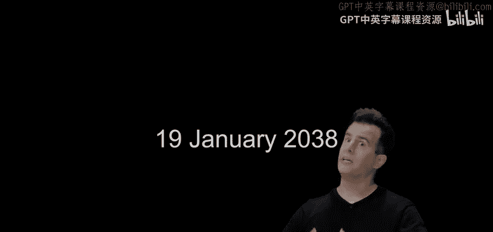

We'll discuss then is how you can throw both hardware and software at this problem。 But for now。

 if you set a Google calendar reminder for January 19，2038， and hopefully we'll see you next week。

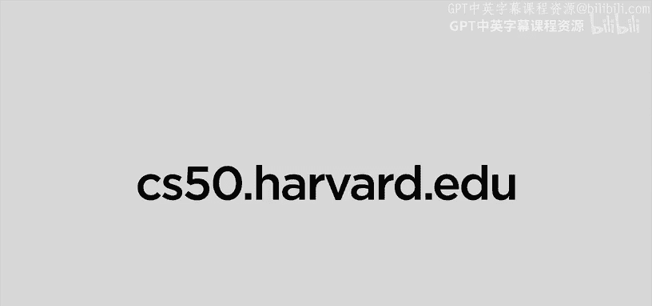