# 哈佛大学《CS50X 计算机科学导论｜introduction to computer science 2025》中英字幕（deepseek - P4：-04-CS50x 2025 - Lecture 2 - Arrays.zh_en - GPT中英字幕课程资源 - BV1hFrxYPEfa

🎼。

Alright， this is C S 50。 and this is week 2， our third together。 Last week， of course。

 we introduced C on the heels of scratch and might have indeed felt like things escalated quickly。

 but that's really because there was a lot of new syntax， especially if you' never programme before。

 But keep in mind that these of me what we did in week 0。

 there weren't that many new ideas last week， we just kind translated them literally to another language。

 there were still functions and loops and conditionals and variables and things like that。

 even though the syntax was and will remain for some time until you get ample practice under your belt quite different。

 Now， today， what we're gonna do is try to take some of the magic out of what we did last week。

 So even though it might have seemed complicated， there was some sort of magic。

 like somehow you write some code， you literally type make and then enter and a program somehow gets made。

 assuming there's no errors within the code。 Well， today we' take the hood off of that process。

 give you a better sense of what's going on。 because at the end of the day。

 And by the end of the course， there really won't be any surprises。 And even if you won't feel an。😊。

In every little detail， you'll at least have this bottom up understanding of what's going on so that once you're out of this class and in the real world and maybe dabbling or doing full-time programming。

 you'll have a much better technique and mindset for actually solving real worldorl problems So in fact。

 one of the real world problems we thought we'd begin with today is a specific domain like this like reading level。

 So like if you look at a block of text at what reading level is someone reading is it maybe kindergarten。

 first grade， middle school， high school or the like。

 there're certainly arranged there and while all of us might have an instinct for what makes something easy to read versus harder to read。

 we'll see this week， if we can't quantify that a little bit。

 And I thought we'd do this by way of some examples。 In fact。

 if we could give us some mood lighting here， we'll introduce three of our volunteers who stood up early in class if you'd like to each say hello。

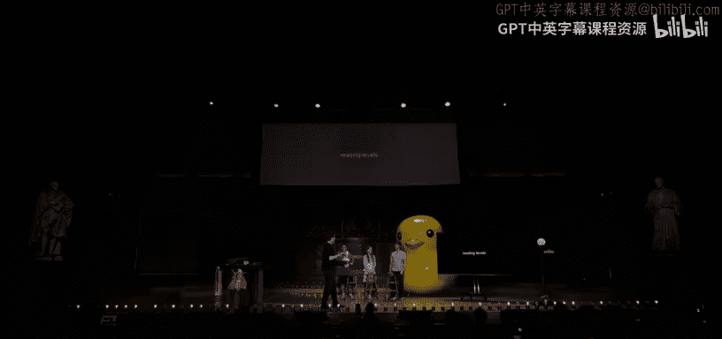

Hello， I'm Eric， I'm from Philadelphia， and I'm in Hollis Hall。Hi， I'm Elizabeth。 I'm from Baltimore。

 and I'm also in Hless Hall。But no one else seems to be from Holli Hall this year。 Okay， I'm Jesse。

 I'm from South Florida， and I'm in Canada。

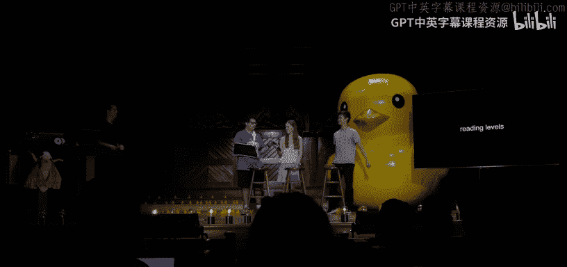

Wow， all can， all right， so the first exercise we thought we'd do is have Eric open the envelope that he has in front of him inside of which is a reading snippet from a book with which many of you might be familiar and we'll ask Eric to read this aloud and then we'll ask you at what level Eric seems to read。

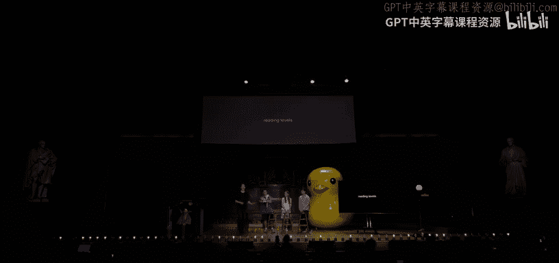

He's turning on the POV glasses， we'll give you the microphone and breathe away。1 fish。2 fish。

Redfish， blue fish。 wonderfulful to Eric。 So what， what level do you would you say that， Eric。😊。

Is currently reading， yeah。

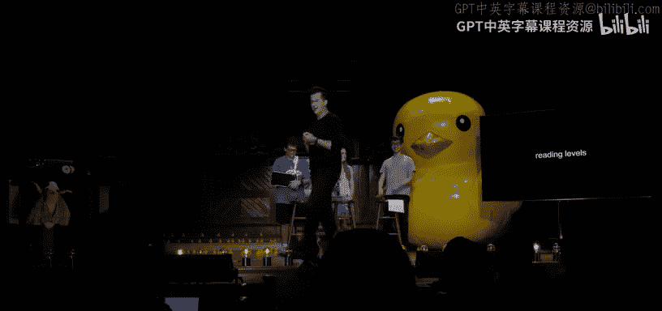

First grade， okay， and why first grade。😡。

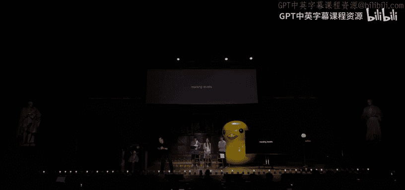

Yeah， so the words are really simple， there's not much complexity and if we look at it textually there is indeed very short sentences。

 very few words in each， and so if we adopt a heuristic。

 we could assume that this probably suggests with high probability that this is a lower reading level and in fact。

 the correct answer， at least according to an algorithm you will explore in problem said two this week is actually before grade one。

 so maybe kindergarten or the like， but let's go ahead and do a second example here if Elizabeth you could read one of your favorite texts。

😡，Congratulations， today is your day。 You're off to great places。 You're off and away。😊，All right。

 so also Dr。 Seus， and does someone want to conjecture at what level Elizabeth reads？😡。

Advanced， okay， so give me a number， though， a grade level， perhaps more advanced for sure。

 someone else。야， 애 the메。So third grade and Y， what's your instinct behind that？😡，Okay。

 so still shorter sentences， but longer words and indeed the right answer。

 at least according to one measure is indeed amazingly third grade。

 so let's do one final one with Jessse here if you want to read your favorite text for us。

 turning on your second pair of glasses。😡，It was a bright， cold day in April。

 and the clocks were striking 13。 Winstonsmith， his chin nuzzled into his breast in an effort to escape the vile wind。

 slipped quickly through the glass doors of victory mansions。

 though not quickly enough to prevent a swirl of gritty dust from entering along with him。😊。

All right， and one final query of the audience， at what grade level does Jesse seem to read？It's10th。

 ninth。11。12 okay so we're trying all numbers， the correct answer according to one measure is indeed D10 and why you probably have an instinct for much longer words。

 longer sentences， full paragraph and indeed that would seem to quarelate with a higher reading level and D but if we go back for just a moment you can sort of see this with your humanized at a glance。

 but if this were actually digital like in a word document。

 a Google document or a very simple text file， how could you actually go about writing code that applies the heuristics that came intuitively to all of you here and actually spit out with printerta for instance and C an actual numbers and that's going be among the goals for this coming weekss problem said in the meantime maybe a round of applause for our three volunteers。

😡。

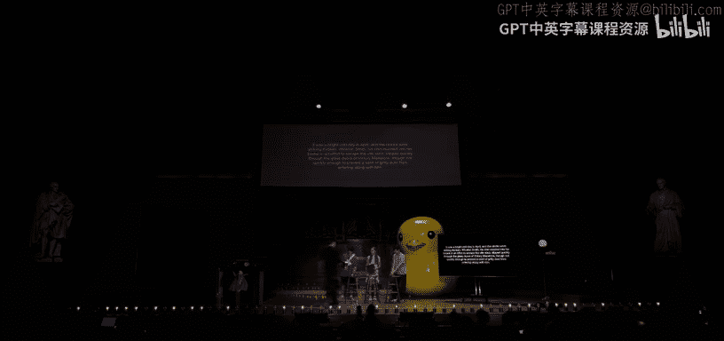

So beyond reading levels we thought we'd explore this week other problems as well and in fact very much current and omnipresent nowadays is the art。

 the science of cryptography， the art scrambling information so as to communicate securely whether it's a private message you want to send or maybe credit card information or a password or the like among the challenges for this week too after this week's introduction is going to be to apply these lessons to actually building some form of cryptography yourself and here for instance is an example of a message so-called ciphertext that's been encrypted that is scrambled somehow to make it harder to read now there is a bit of a hint baked into this it's not the most sophisticated algorithm。

 but does anyone want to conjecture what this secret message would seem to say。😡。

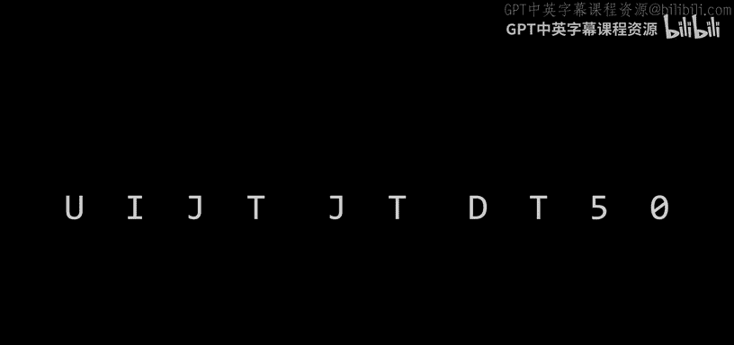

So it does happen to say this is C， S 50。 And indeed， we're leaking information there。

 But why is it this is C S 50， Well， you might have kind of guessed that it sort of has the right number of letters and words。

 But what comes before you。T， what becomes before I？😡，H， what becomes what comes before J I。

 And so there seems to be。 It's not just random。 It seems to be there's a pattern here。

 And insof far as if we keep playing that game， each of the letters on the screen is sort of won away。

 rotate it or shifted from the actual letter I claim it represents。

 know I bet using some very simple arithmetic。 We could write code to do just that。

 But what we don't yet have in our toolkit。 so to speak。

 is the ability to manipulate text in programs， The ability to manipulate what we called last week's strings。

 We could print a string like hello world， we could get a string like David。

 but we didn't necessarily have the ability to sort of analyze it letter by letter or do more interesting things with it。

 And that， of course， is what the whole world does when analyzing text searching a database searching the web itself is actually analyze some of the text on the screen。

 So we'll equi you with exactly that。 So it will become clear among other things why this indeed says this is the S 50。

 So how do we get there。 Well， first， let's understand some of the magic that took place last week and recall that this was the。

😊。

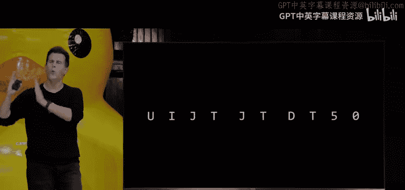

Process that was sort of distilled into a very simple command， literally make， make hello。

 make Mariio or whatever program you're trying to make。

 The input to that process was source code might still look sort of cryptic to you。

 but it's at least English like the output of that process was machine code zeros and ones that really makes no sense to humans unless you pull out a paper pencil and somehow convert it back to something else。

 But the compiler is sort of the algorithm， step by step instructions for converting source code to machine code embodied in a program that you can run。

 So that was compilation converting or translating source code to machine code And the code。

 of course， that we played with mostly last week was something like this。

 Sst program you can perhaps and see， simply to print out hello world。 But the computer， of course。

 only understands the corresponding zeros and ones。

 So how do we actually get from source code to machine code。

 That is to say what's actually happening underneath the hood when you run a command like make。 Well。

 up until now， you。

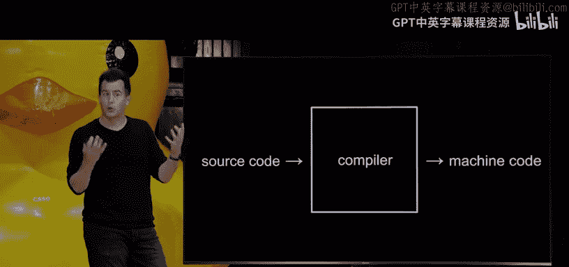

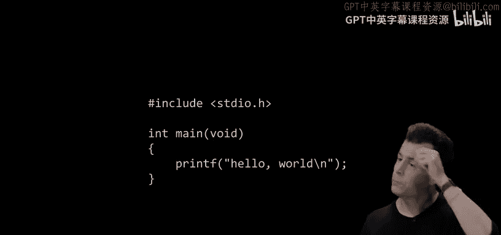

After making a file like hello do C， you would type make hello cross your fingers。

 hope there's no syntax errors， no typos of any sort。 and then to run it。

 you would do dot slash hello。 It's a little weird that you have to do that but dot means the current folder and dot slash just means run the program called hello in the current folder。

 This is the command line interface equivalent of like double clicking an icon on your Mac PC or tapping an icon on your phone。

 It just runs it with the keyboard instead but I did reveal briefly last week that make is not actually a compiler It is a program it is a useful program。

 but it automates the process of running an actual compiler for you。

 What is that compiler while there's many different compilers in the world but the one we use in class that's free and open source and therefore very popular in the world is actually called clang sort of for C language and so really what's happening when you run make hello or any other such command is that make in turn is running another。

Program for you called clang。 The catch， though， is that this program by default is not nearly as user friendly。

 It doesn't sort of say what it does。 let alone give you a useful output because the output it gives you is actually a file by default called a dot out for assembly output。

 whatever that means， which is to say if you use clang directly instead of make。

 you don't get a program called hello。 you weirdly get a program called a dot out。

 So let's actually see that。 But then let's fix that sort of step backward。 So here I am in V S code。

 I've hit in my activity bar in the file browser。 But I'm gonna to go ahead and run code hello dot C。

 And I'm going to very quickly recreate last week's program with including standard I O dot H。

 And then inside of main void， I'm gonna put printf quote unquote hello comma world back slash and and a semicolon。

 And now instead of running make。 I'm gonna to do clang hello dot C enter。😊。

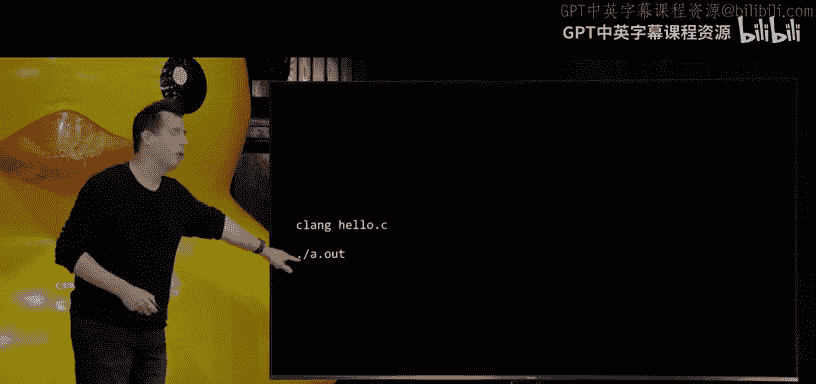

So notice I did do clang hellello dot C the name of the file。

 I didn't just say make hello the name of the program。 So that's one change here。

 And now what was actually made， Well， what was the command for listing files in a folder。😡。

So L S for list。 and you'll see that not only do I have hello do C there， I also have a dot out。

 And in fact， if I open up my file Exper at left， they are those same two files。

 Hello dot C and a dot out。 So here on after。 It's all the same。 dotlash a dot out。

 and there still works as exactly as I intend。 it's just sort of a stupid default name for a file。

 So how do we go about making this program， just sort of more user friendlyly， more aptly named。

 Well， instead of running clang and then the name of the file。

 we can actually provide more arguments to clang。 And I haven't used this term in this context before。

 but there's a new term of art will explore today called command line arguments。

 And all that means is that when you run a command in your terminal window。

 you can type not only the name of the command or program you're running like Ls or make or clang。

 you can give arguments that is input to that program。 And I didn't use that phrasing last week。

 But when you run when you run， for instance， make hello the argument the command line。

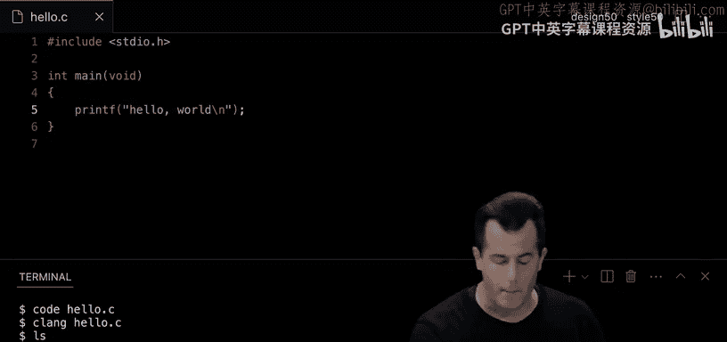

An argumentment you're passing to make is indeed hello。 And if there was a second word。

 that'd be another argument， a third word that'd be a third argument and so forth。

 So command line arguments are inputs provided to command at the so-called command line in your terminal window So that's it just a term of art。

 But instead of running make hello I just ran of course。

 clang hello do C that gave me the wrong file name as output。

 but there is a fix here we simply need to know from its documentation from a class from a book。

 what other command line arguments clang support and indeed if I look that up or pay attention here。

 I can somewhat cryptically change my command to be clang O in lowercase， hello。

 then hello do C and this is a very common technique in command line environments whereby when you want to modify the behavior of the program by providing more arguments。

 you use things like flags or switches here called different things by different people but dash O means output a file called hello when you compile hello do。

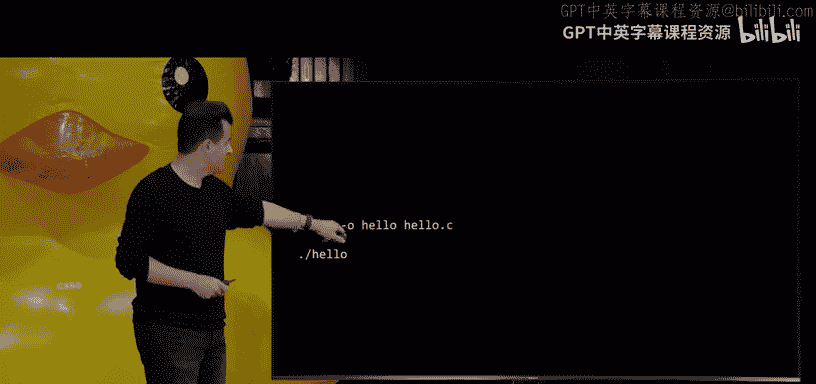

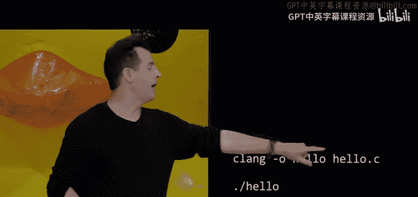

Eventually， you memorize these things， but it's not sort of not intellectually interesting other than this is how you can provide not one。

 but now three argument to a program。 Then that gives you indeed dot slash hello。

 So let me go ahead and do that。 I'm gonna go ahead now and clear my terminal window run now clang O hello。

 And then hello dot C enter Similarlyly， nothing seems to happen。 if I type L S now， though。

 you'll see three files。 And in fact， dot slash hello works exactly as it did last week。 In fact。

 I don't need a dot out。 So there's different ways to delete things。 I could go into my file， Exp。

 I could right click or control click， select delete explicitly。 or we didn't see this last week。

 but you might have learned it since you can actually do R M for remove a dot out enter。

 And even though this is a little verbose remove regular file A dot out。

 it's just asking you now for y or N for yes or no。 and I can say why enter。 And now if I run L S1。

More time， I'll say just those two files。 So that's how I might remove or delete a file。 Obviously。

 just be careful when doing that if the file is otherwise important。

 So let me pause here and see if there's any questions。

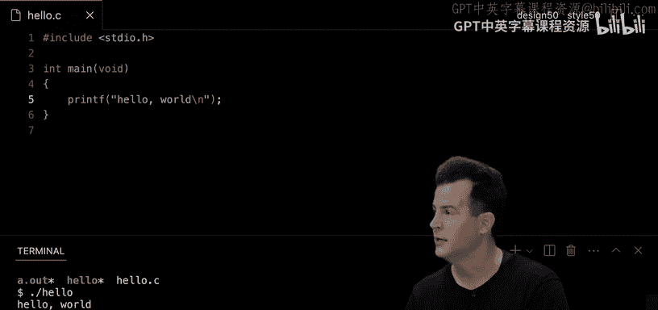

On what we just did。Or what a command line argument actually is。Soon today。

 you'll have the ability to use and create these things yourself in your own programs。 Allright。

 so seeing none， that doesn't feel all that compelling， right， Okay。

 so we saved a few keystrokes instead of typing make and instead of typing clang I have to do dash Oh。

 hello。 But that's again， one of the upsides of make。 It's fine。 It's not that hard to do dash O。

 hello。 But why bother when you can use another program make to sort of automate that process for you and just save you time。

 And indeed， that's what these command line environments are all about。

 Just saving the programmer or the technical person time as you get better and better with these things。

 All right， but now let's consider another ramification of what make actually does for us by taking a look。

 for instance， at this same program。😊，But consider what's going on underneath the hood step by step if we add a couple of more lines of code so recall that the second program we wrote using C last week was this whereby added the CS50 library and then I used a function we wrote for you called get string I stored the return value of get string in a variable called name for instance of type string and then we use this placeholder technique last time whereby plugged in the value of the person's name based on whatever they themselves typed in now there's a lot going on here。

 but today we'll sort of peel back the layers of like what's happening line by line in why we have to keep typing stuff like this at the top well recall that when you ran compile that program last week all you had to do was run make hellello but that's because whenever you use thirdpart libraries code that other people wrote like CS50 then these commands when you use clang directly just get slightly more annoying if you want to compile that program。

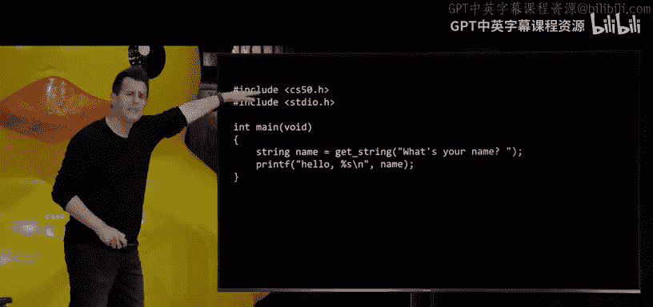

From last week with clang directly you can do O hello to specify the file name。

 You have to specify hello do C to compile that file。 but now somewhat annoyingly。

 you have to do L Cs 50， no space in between to specify that you want to use the library called C 50 because that's specific to us。

 it's not globally available in the whole world。 So the system doesn't know about it unless we've preinstalled it。

 So this just tells it to support the C50 library as well。 Now， as an aside。

 some of you for problems that one probably use the math library。

 maybe to round some values or something like that。

 it turns out that you can also do Lm in order to use the math library。

 but the math library is so darn popular and it actually comes with C that you don't have to actually do Lm but it's the same idea It's just so common that they automate that process for you。

 but for thirdpart libraries you have to do this。 Now at this point。

 this is really starting to take or increase the tedium of compiling your code。 This is why we。

Say make hello last week， which automates the process of generating hidden for you this entire command underneath the hood。

 But that is what's happening to get a file called dotlash hello。 So we're back to where we began。

 But what does it actually mean now to be compiling this code in the first place。

 So we keep saying and I will keep saying to compile your code to compile your code to translate source code to machine code。

 but that's actually an abstraction。 so to speak it's like a simplification of a multistep process that the computers actually doing for you。

 And this too will be briefly sort of a deeper dive to look at this lower level of what's going on。

 But then again， after today， we can sort take for granted that this just works。

 but you'll understand hopefully better what's really happening underneath the hood。 So again。

 there's no magic。 So it turns out that when you run make and in turn。

 it runs clang four separate things are happening。 Each of which does something a little different for you preprocessing actual compiling assembling and linking。

 It's just the world kind of combines all four of these terms into。Compiling by convention。

 So let's consider the first of these。 What does it mean to pre processcess a file。 Well。

 even though we haven't used this word before， here is one of the programs we wrote last week。

 it was a little longer， but this was a program that three times called the meow function。

 which I had ultimately implemented quite simply with this Miow function of my own that just says printf meow and recall that I did a couple of things at the top of the file。

 I included standard Io do H because I need print access to printf but I also did this。

 And what did we generally call this second line。😡，sorryrry。A prototype。

 the prototype was just the first line of a function semicolon。

 so nothing in between the curly braces and recall that that's just kind of a hint to the compiler that this function doesn't exist as a line2 but I promise it eventually will and that was to avoid having to move the whole function from the bottom of the file to the top because you can imagine once you have343040 functions it's probably going to be hard to put all of them above the other。

 So this is a way to just tell the compiler in advance to expect that this thing will exist。

 So what is now going on in the very first step of compiling what we called it preprocessing and anything that starts with a hash sign like this is what's technically called a preprocessor directive。

 Now big mouthfall， but that just says that there's something in that file that you want to get essentially copy pasted into this one So what's really happening now is and that's actually consider sorry let me double back here let's actually consider a simpler example for a moment namely the second program again whereby we use。

Gettrained to get the human name。 And we just said hello to them。

 This one had two preprocessor directives。 So let's consider what's actually happening here。

 What did we say was inside of CS50。h last week。😡，Getstr but more specifically the prototype for getstr。

 a little bit of a hint that tells the compiler what it looks like， what's its name。

 what's its input or arguments and what's its output or return values so this file technically when you run the preprocessing step just like the compiler goes into that file CS50 H finds the relevant code and essentially copy pastes it into this current file and in fact it's not even that sophisticated essentially copy paste the entirety of CS50 H at the top of your code so you don't have to manually copy paste anything yourself。

 mean， this second line standardIo， this of course is there for printf's sake。

 but printf has a prototype， it's got a name it's got inputs it's got output so that you don't have to go and find that file and copy paste it。

 the preprocessing step goes into that file for you finds the relevant code and some other stuff and effectively copies and paste it there as well that then is preprocessing It just saves you time so that you can reuse functions that someone。

😡，Besides， you perhaps wrote and use and reuse them and automate the copy paste process。

 anything starting with a hash sign therefore， gets preprosed。😡，Okay what happens next。

 the compiling step which is again the catch all term for all of this。

 but when we say your program being compiled， what we mean now is this here's that same code after it has been preprocessed and when you actually compile this code this means it gets translated from one language C in this case to another language we haven't talked about and after today we're not really going talk about it。

 but it gets translated from C into something crazy looking called assembly code and now if you take other courses in computer science。

 lower level courses so to speak you'll actually learn a language that looks a little something like this which at a glance is even more cryptic than C。

 which is why we don't spend all that much time on it in this class but there are some interesting terms that I can highlight here so even in this weird looking language called assembly there's a mention of main there's mention of getstring and there's mention of printde and there's some other things worth highlighting here there are a little more arcane but there's some mention of pushing。

 moving， subtracting。😡。

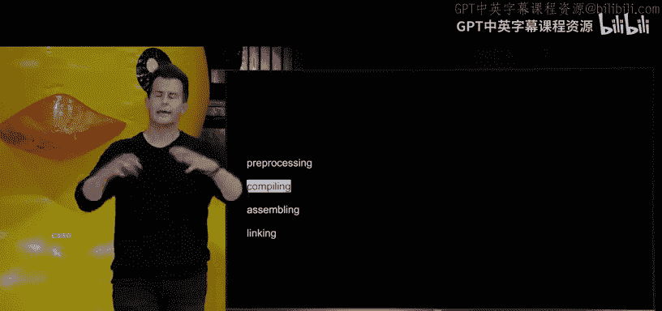

Caing and so forth， even though there's some other letters like Q in there as well。

 but it turns out that inside of your computer is that CPU， the central processing unit。

 Intel inside or M1 or M2 or M3 from Apple，😡，Those CPUs。

 the brains of your computer at the end of the day， they don't understand C。

 They don't understand scratch。 They do understand zeros in ones。

 but what they really understand are specifically these commands。

 These commands have corresponding patterns of zeros in ones。

 But if you're actually building a computer and you get the manual from Intel。

 there will be documentation for all of the low levell commands。

 the instructions that an individual CPU actually support。

 and this might differ between Macs and PCs and phones and other devices。

 but this is what happens when you compile your code from C into this lower level language called assembly code。

😡，All right， we'll never again see this。 I think for the most part。 So what's the third step。

 The third step is to finally convert the assembly code to actual zeros and ones。

 because that's indeed what the computer understands。

 So here's that exact same assembly code once it is assembled。

 that means the computer outputs this that most humans wouldn't understand unless again they pull out that same manual。

 But the computer will understand this。 And the very last step is what's called linking。

 So what do we mean by linking， we'll take a look at this code again， And just from inference。

 like how many files are presumably involved in the process of compiling this whole thing。

 And I mean compiling in the greater sense， like going from source code to zeros and ones total。😊。

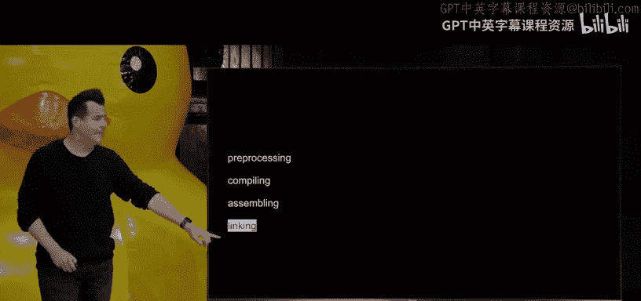

How many files are implied by this screenshot？

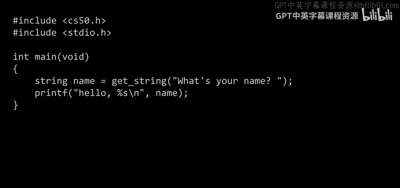

Okay，3， why3， you saw two here， but y3。😡，Does have the main program like Hello。tc。

And then we have C5。Cs50 do H and of course standardo so there's three different files involved and even compiling the simplest of programs like this now I'll stipulate that somewhere on the server's hard drive there is not only a do H file which has those prototypes。

 there's also a CS50 C file there's also a standard Io C file as well which contains all of the actual code that we or other people wrote。

 it's not necessarily called exactly that but there are C files containing all of those lines of C code so what really happens now in the fourth and final step of building your program compiling your program is this hello do c CSs50 do C and standardIo do c wherever the latter to R on the server。

 we pre-installed all this stuff for you， you only wrote in the story this file when you finally compile and once you have preprocessed compiled and assembled your files you essentially have three sets of zeros and ones each of which corresponds to each of those files。

😡。

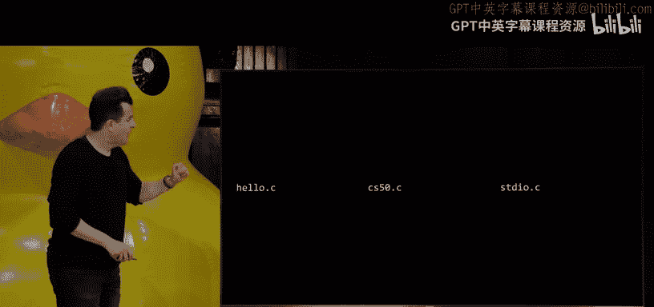

is the code you wrote once it's compiled to zeros and ones。 This is the code that CS50 wrote。

 this is the code that came with C standardIo do C itself。

 So the fourth and final step is literally linking。

 what does it mean Well you've got three sets of zeros and ones。

 you've got to somehow mash them together linknk them together and linking does exactly that So this is such a mouthful to say that you write C code it ends up zeros in ones but each of the steps can be very cleanly broken down like that So you understand exactly what's going on underneath the hood and now if you consider the command we talked about earlier。

 O just specifies what file the linker outputs at the end of the day is it hello。

 is it a dot out is it something else and L CSs50 more specifically doesn't just mean L library It means dash L link So link in CS50's library to ensure you have access to those zeros and ones。

 You don't have to do it for math。 you don't have to do it for standard Io but you do have to do it for thirdpart code that other people all wrote。

For you。Okay， done with that deep dive， questions， confusion on any and all。Of that。Yeah。

 in the front。明白吗。A lot of things。后来我得挖。And it's your way to pull out。A really good question。

 If you only want access to one function and not all of them in a library like C 50s。

 Can you extract just a subset， It depends。 The compiler ideally would do some of that for you。

 and it would only dynamically link in what you actually need。 if though by default。

 you sort of statically link everything and you get all the zeros and ones。

 This is actually now a more sophisticated answer to a question， someone asked here last week。

 which was about the efficiency of all of this。 and unfortunately by default。

 you would typically get bigger and bigger files， if you're linking in too much stuff unnecessarily。

 So， yes， that's absolutely an optimization。 That is possible。

 But the compiler should be handling most of that for you。 not you。

 the programmer generally worrying about it。 Yeah。Really good question in the prototype for printf。

 why was there an int before， let me come back to that and we'll talk a little bit about something related in spirit today。

 Maine actually all this time also has the wordint in front of it， we'll explain that one first。😡。

All right， so what can we take then away from this。 Well， if that is all compiling。

 can we actually reverse the process， Can you go about decompiling code， That is to say。

 if you have a program installed on your computer or your phone。

 and it therefore contains all these zeros and ones。 Can you maybe reverse engineer it。

 that is convert it back to source code。 Well， was that possible。 Well， sort of， in fact。

 here's an example of a program written and see that's already been compiled down into machine code And by compiled。

 I mean， it's already been preprocess compiled， assembled and linked and these are the zeros and ones。

 Well， it turns out that if you break these zeros in ones up into chunks of like 8 or maybe 32 or 64。

 you could very tediously or using some software to automate the process， look up in Intel's manual。

 what all of those patterns of zeros and ones represent。

 and you probably could reconstruct the fact that you know what， I bet this thing says hello world。

 Like there's enough pattern in there to figure out something like that。 and surely。

It says hellello world we could generate source code that does the exact same thing。

 But what if there's some kind of loop in there and hello world is actually getting printed two times or three times or four times or an arbitrary number of times。

 I don't know if I could decompile the code quite as effectively why Well once I have it down to the levels of zeros and ones I don't know if the programmer used a while loop a four loop。

 a dowhile loop like there's ambiguity in that process ultimately so while you can reverse some processes at some point it becomes harder or ambiguous to do so and this is a relatively short program even though there's some more zeros and ones not pictured when you're talking about something like Microsoft word or Excel there are millions of zeros in ones inside of that and honestly in the amount of time it would take you to figure out tediously what those zeros and ones correspond to in C or some other language you're probably smart enough to just start writing the program yourself in the other direction and that's sort of the supposition when it comes to intellectual property and protecting your。

Software is IP rights， the reality is like the people who are gonna be so good as to reverse engineer it probably could just recreate the software itself so there's a bit of pushback there inherent but later in the term we're going to talk about other languages HTML CSS and JavaScript that stuff is not compiled into zeros and ones in any way like this so that code is actually revealed to literally anyone on the internet we could go on Harvard or Yale's website right now look at the JavaScript code that powers parts of it and actually see what's going on but more on that in just a few weeks time。

😡，So today is all about debugging ultimately too， like finding and fixing mistakes in your code and debugging actually does indeed mean removing mistakes from your code。

 there is mythically sort of story behind that。 So this is rear Admiral Grace Hopper from the United States Navy who had her PhD from Yale and actually is known for many things。

 but among them is for working on the Harvard Mark1 computer that looks a little something like this in black and white。

 it's now housed across the river in the science and engineering complex at Harvard。

 which can visit if you hop across the river someday， but in the Harvard Mark 2。

 another successor to this large mainframe computer Dr。

 Hopper was responsible for keeping the log book and pictured here is if we zoom in here。

 the first actual case of a bug being found some kind of moth was physically found inside of the Harvard Mark 2 disrupting its operations and that's not literally what we mean nowadays when it comes to bugs and soft。

😊。

And this really just popularized the term It wasn't the origin of the term itself。

 but that's among the stories that gets tossed around typically when talking about bugs and of course。

 debugging So among the goals for today is to actually make your life easier when it comes to solving problems this week in onward because odds are you were a bit in the dark if you had some mistake in your code last week you could have of course asked the duck you could have asked teaching fellow were teaching assistant you could have struggled through it but let's actually give you more tools in your toolkit to solve problems。

 So here， for instance， was one of the simpler problems we did last week and we'll keep it simple so we can focus on the debugging techniques and not the complexity of the code and recall that this example was all about just printing like a column of bricks using hash symbols otherwise known as ASI art Well。

 the first debugging technique we gave you and encouraged you to use last week was of course this virtual rubber duck or even a physical rubber duck In fact。

 on the way out today after class we have not only these ducks but like hundreds of others if you'd like to walk home to your dorms with。

Ruber duck and we'll bring them to those of you at Yale。 you may at day's end。

 But the virtual version of this is of course powered by artificial intelligence。

 and not only will the duck listen to your questions。

 it will try as betist can in English or some other human language to respond。

 but the general idea of rubber duck debugging or rubber ducking is to talk to an inanimate object like this or nowadays in AI And again。

 per week  zero in that process of sounding out your confusion and telling the duck like a teaching assistant what your problems are odds are that proverbial light bulb will go off and you'll realize some ill logic。

 some mistake you've made at which point you can actually solve it yourself。

 But when the problems get harder。 And when the material is especially new。

 it's not going to necessarily come to you off the top of your head。

 So let's give you some more techniques。 It turns out that one of the most common and useful ways to debug code is literally with a function we use since week one printf because printf lets you print。

Anything you want， including the contents of what's inside of the computers memory。 so to speak。

 inside of your variables and functions and the like。 So let's go ahead and do this。

 Let me switch over to VS code here。 let me go ahead and create a new file that deliberately is called buggy dot C。

 So code buggy dot C。 and this will be relatively simple include standard I O dot H int main void。

 and then inside this， let me aspire to print out this column of bricks here of 1，2。

3 bricks top to bottom。 Al right， back in my code， I'm going do4 int。😊，I equals 0。 I。

 I want three of these。 So I'm going to naively do I less than or equal to3 I plus plus。

 And then inside of my4 loop， I'm gonna do print f quote unquote hash sign backlash N close semicolon。

 So if you're already pretty comfortable with C in four loops at this stage。

 you can probably see the bug already。 But again， the focus here is on techniques。

 not the actual code。 it looks like I've done something stupid though。

 because when I do compile this code。 and I'm gonna to do make buggy instead of bothering with clang because we now can sort of stipulate that we know there's more going on there。

 but we don't need to care about it every time dot slash buggy is not gonna print3。

 it's going print4 of those hashes instead。 All right。

 so how do I go about wrap in my mind around what's wrong。 Well， I remember from class。

 I'm supposed to start counting from0。 if I want to go up to3， it's less than or equal to3。

 So we can probably reason through this without much effort。

 But let's suppose that this is representative of more sophisticated problems。😊。

here can be your friend。 If you want to see what's going on inside of this loop。

 I would propose that you temporarily maybe add a second print F that says something like this。 I is。

 And then I'm going to use a placeholder percent I backslash and close quote comma I。

 So if I just want to wrap my mind around what's going on every iteration of this loop。

 Let me just literally print out the contents of that variable。 So let me remake this。 make buggy。😊。

Thought slash buggy enter。 Okay， now， let me enlarge my screen。 What has happened。 I is 0。

 I get a hash。 I is 1。 I get a hash。 I is 2。 I get a hash。 Oh， I is 3， I get another hash。

 So the solution here is， is one of a few things。 I could either regress and start counting from one。

 But in general， I would propose， do what programmers do， start counting from 0。

 So if I leave I at 0。 What is the correct fix here。So just change it to less than3 instead。

 which again， is sort of the convention， even though it's by no means the only way to do this。

 If I go ahead and do that， let me clear my terminal window and make it larger temporarily。

 make buggy again， dot slash buggy。 Okay， now I got it。 I is 0， I is 1。 I is 2。 and I only get hash。

 hash hash。 So printf is your friend。 Just remember， certainly in the context of a class。

 like homework and the context of the real world。 once you're done using printf to debug your code。

 go in and delete it。 So it's not printing out a confusing message to the autograder。

 the correctness tests or the like there。 Allright， so that's how you might use something like。😊。

Print F。 But what if I did something a little more sophisticated here， Let me do this。

 Let me change up this program and get rid of the for loop and let me， for the sake of discussion。

 just make it a little more complicated。 Let me go ahead and create an integer called H for height。

 Let me ask the human using get int for the height of the column of bricks that they want。

 I immediately have to go in and add the C 50 library。

 Because if I want to use get int that comes with C S 50， not with standard I O dot H。

 Once I've done this， let me go ahead and call a function that doesn't yet exist。

 But will print column of height H。 And this is sort of where we concluded roughly in week 1。

 whereby I factored out some of the functionality for printing a row of bricks。 today。

 I'm flipping it around to say， print a column。 because now I'm gonna to do this。 void print column。

😊，And then the input that this will take is going to be the actual height。

 but I can call that anything I want so long as it's an int。

 And here I'm going to recreate the correct code 4 int I equals0， I less than not three。

 but height if I want to genericize it。 I plus plus and then inside of the loop。

 I'm going go ahead and quite simply print a single hash and a new line so that it gets hash hash。

 hash， hash1 per line。 but there's technically a bug here。

 Let me hide the terminal window and scroll back up。 What one mistake have I still made。

I'm missing the prototype， right， because if I compile this as is the clang， the compiler。

 as we now know， won't know what print column is because when it sees it for the first time on line 7。

 it has never seen it before。 So the solution， of course， is to copy paste。

 And this is the almost the only time copy paste is acceptable and encourage that first line of the function itself。

 All right， let me open my terminal window。 Let me run， make buggy。😊。

It seems to work dot slash buggy enter and it's gone ahead and done let's say three。

 this is the correct version。 So just a bit of a sanity check that it's working as intended。

 Now let's break it。 Let me hide my terminal window。

 let me make the same mistake as before and let me say that printf for now is your friend but by week 3。

 week 4， week 5 in the real world， you're not gonna want to just start printing everything out because you're going be printing so many darn things you're gonna to then go remember to delete the stuff。

 It's gonna to mess up the output。 there are better tools。 And even though this week。

 it will take you more minutes to play with and get comfy with what I'm about to show you。

 this will pay off in hours over the course of the term and in the real world。

 spend a few extra minutes this week playing with a proper debugger which is going to introduce you to more sophisticated techniques for debugging your code。

 We are going run now a program called debug 50， which sounds C50 specific but that's only because it automates the process of starting。

V S codes built in debugger for you。 So this is not a C 50 thing。

 This is representative of a debugging tool you would have in the real world available to you。

 And V S code is among the most popular。 So let me go back to my own code here。

 Let me open my terminal window and let me confirm now by recompiling buggy。

Enter and running dot slash buggy。 Now we're back to the problem where if I type height of  three。

 I'm getting four hashes。 So how can I wrap online mind around why that is the case without using printf。

 Well what I'm going to do now is this， I'm going run debug 50。

 And then I'm going to run the name of the program。 dot slash buggy。

 So debug 50 is a program that expects its own command line argument。

 What program do you want me to help you debug。 I'm going go ahead and hit enter。

And I made my first mistake。 Looks like you haven't set any break point。

 set at least one break point by clicking to the left of a line number and then rerun debug 50。

 So what is a break point。 Well， let me hide my terminal for just a moment。

 a break point is sort of a stop sign that you can add to any one of your lines of code and tell the computer break execution at that point。

 That is run my code but pause temporarily here， so I can poke around。

 So what I'm gonna to do is because the first line of juicy code is at line 8。

 notice if I hover in the socalled gutter of Vs code。

 There's this little stop sign or red dot that appears， I'm gonna hover over line 8 and as directed。

 I'm gonna click and it gets even redder that is a break point。

 It says run my code but stop at this point so I can poke around。 Let me reopen my terminal window。

 clear it and do this again。 debug 50 dot slash buggy enter。

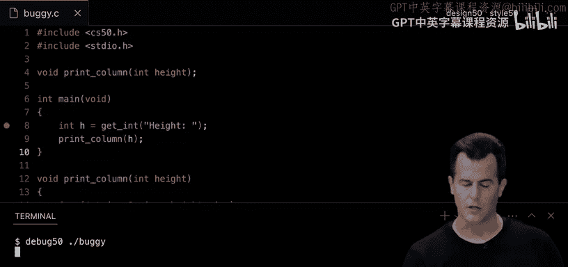

Alright， so a whole bunch of stuff seems to be happening automatically。

 It's a little confusing at first glance。 I'm gonna zoom out just so we can see more of it here。

 I'm gonna go back to the terminal window because notice there we go in my terminal window I have a blank window now because why line 8 is about to prompt me for input。

 So what is happened here。 Well， let me go over here to the code， this is still my buggy do C file。

 notice that there's a play icon here， there's some arrows， there's a stop icon and some other stuff。

 notice that line 8 as hoped is highlighted because execution has been paused on line 8 before it executes Let's now actually see what's going on at the top though。

 there's some curiosities。 all of my variables in this program that are currently in scope that is accessible between these curly braces or summarized here。

 Where did 32766 come from。

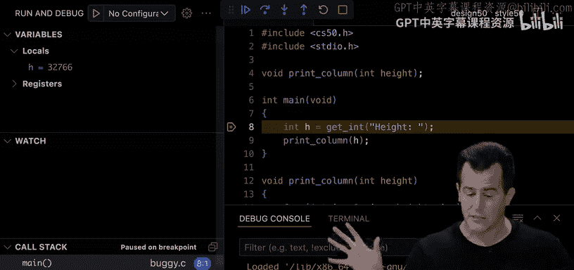

Any instinct for Y H apparently has this weird value， even though I haven't even typed in anything。

 let alone such a big number。😡，Yeah， how about over here？Yeah。

 I think that's a reasonable way to think about it。 Maybe it's like a previous program。

 Use the same memory inside of the computer for something else。 Maybe it was an integer。

 maybe it was a string or something else。 So what you're seeing is actually what we're gonna to start calling a garbage value。

 It's like remnants of what the memory was previously used for It has no significance to us。

 It's not a big deal because as soon as I let the debugger proceed one more line。

 the value of H is going to be changed to whatever the human run actually types in。

 but what you're seeing is what's really going on inside the computer。

 You're certainly using and reusing the memory inside of your computer all day long。

 because you don't want to run out so you need to reuse it So the debugger is letting us see that。

 So now notice the arrows at the top of the screen。

 I can either hit play to say like just keep running the whole program or I can do something like this。

 step over。 So this second arrow here。 step over。 We'll actually run line 8。

 but then pause on the next line for me and we'll see what else we can do in a moment。

Im to click step over。And now notice， in my terminal， I have been prompted for a height。

 Let's go ahead and type 3， enter。Now I've typed in three what happened at top left。

 now the local variable so to speak， local in the sense that it's inside of these curly braces is in fact what I would expect which is3 notice now that line 9 is highlighted。

 it hasn't printed anything yet， so let's step over line 92 and see what happens with this value of H let me click step over again。

😡，The highlighted line becomes 10， which is almost at the end of the program。 but unfortunately。

 I see 1，2，3，4 damn like it's still buggy in this case。 and honestly。

 this wasn't really enlightening setting the break point there。

 I really have just slow down the process of seeing my mistake， but it's still in fact there。

 So let's actually just run the program to completion。

 I'm gonna hit the play button but I could just as soon hit the stop button because their equivalent because the program is essentially over。

 all of that is gonna to close。 but my breakpoint is still at line 8。 I'm gonna do this。

 I'm gonna leave that there。 I'm going run debug 50 once more。

 Let's actually step over this line as before， to get my input of a height of， say3。

 but now on line 9， which is highlighted， let's not step over this because obviously that's just gonna print out the same wrong thing instantly。

 let's step into this function。 Why this one because I wrote print column ironically I also wrote get in。

 but I'm pretty sure get int is not incorrect。 I'm pretty sure print column is incorrect。

 So let's step into it。The icon for that is the third icon here， the second arrow step into。😡。

Click and now notice that execution has jumped into the print column function。

 Nothing is printed yet because I haven't even started the for loop。

 but now I can actually poke around here and notice this。 This is an even crazier value for I。

 But for the same reasons， it's just some garbage value left over from whatever this memory was being used for previously。

 But the moment I click step over now， the second icon。 now notice at top left I is 0。

 And we're about to print a single hash。 Let me click step over once more and watch the terminal window at the bottom。

 I currently have no hashes。 But now I have one hash。 Now the highlights back on line 14。

 Let's step over that and watch as I do at top left。 Is value is gonna change from 02。One。

 because that value just changed。 Now I'm highlighting line 16。

 Let's click step over and watch the terminal window。 There's my second hash。

 Let's step over line 14。 Watch I at top left。I equals2。 Let's go ahead and step over at line 16。

 There's my third hash。 Let's now step over line 14 again。 Watch the I at top left。

 Here's where you can see that oh I equals 3。 but wait a minute， line 16 is highlighted。

 I'm about to execute the darn thing again。 Oh， that's why I'm getting the fourth hash。

 And if I do this one more time step over line 14。 watch what happens to I。

 I now disappears altogether。 why because I've jumped out of the four loop because I became44 is not less than three。

 So we're done with that four loop， And now if I go ahead and hit play。

 It's just gonna run to the end of the program， which is essentially already that because the curly brace was already there。

 So kind of tedious to walk through a program in this way。

 but notice it has given me the ability to step through my code line by line by line at a normal person pace。

 not at like a Mac or PCs pace， which is sort of over in the blink of an eye to get rid of a break point。

 you just click on the little stop sign again， it goes away and your code。Will run as usual。

 even in the debugger。Questions then， on this technique of。Debugging。Questions。Okay， use debug 50。

Okay use the rubber duck。 that too should be helpful over time。

 but let's actually now take these ideas out for a spin and actually see what's going on in the actual computer's memory with these new techniques。

 so recall from last time that when you write code you can use like strings like hello world you can use integers like the number 50 or 7273。

33， that is because C like a lot of languages supports different types of data and think back to week 0 when we stipulated that everything is zeros in ones so how does the computer know if that's a number。

 a letter， a color， an image， a video， a sound， well it's context sensitive and I simplified in week 0 and said well。

 if you open something in Photoshop， the zeros and ones are gonna be interpreted as numbers。

 as colors but that was a bit of a white lie， the better answer is when you open in Photoshop。

 a bunch of zeros and ones， the programmers at adobe。

 the people who wrote that software specified in the code that those zeros in one should be treated as colors and not as numbers and text per se。

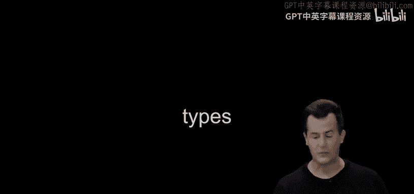

So in the world of C， there are these data types and we had this list up last week and we focused particularly on string and string and int。

 we introduced briefly float for real numbers with decimal points。

 longs which are even bigger than integers so you don't avoid but you at least postpone integer overflow by using more bits and here for instance is how big these data types in C typically are nowadays。

 technically it varies by computer or device but typically it's safe to assume these values here。

 so a booleion a true or false takes up one byte even though that's overkill。

 you technically just need one bit but C uses a full byte in integer is typically four bytes。

 four bytes is 32 bits that means you can count from zero to2 to the 32 power that's0 to 4 billion or if you want to support negative numbers negative 2 billion to positive2 billion along is8 bytes that's in the quintillions depending on whether you want negatives or positive values as well。

😡。

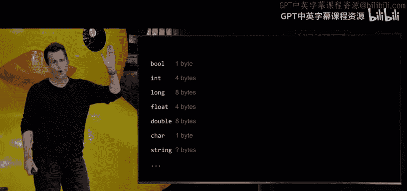

Float is4。 double is8。 A char。 a single character is one that's going to be gur Ma today。

 and a string I'll propose is sort of unknown because it depends how long the word is。

 if I type in D V ID， it would seem to be of length 5 at first glance or H or just two。

 a string is going vary based on the actual contents of the memory And here then is a picture of memory。

 So this isn to scale at the moment。 but this is what might be inside of your laptop or phone or desktop and it would look similar in spirit like a green circuit board or logic board with tiny little silver or gold traces that are essentially like tiny little wires that allow zeros and ones to flow back and forth。

 And there's these black chips that actually store the zeros and ones as your computer's memory。

 So if we actually zoom in on one of these black chips。

 I'll propose that no matter how big this chip is， I bet we could come up with addresses for all of the bys therein。

 So if this thing is like one gig 1 billion bys doesn't matter how we number them。

 but for the sake of discussion。😊，Maybe this is the first byte。 This is the second byte。

 This is the third byte。 This is the billionth byte for gigabyte。

 So you could imagine if you've got this many bytes， you can slap some numbers on them。

 just like on a building in the real world， you can slap a unique address on it。

 like 45 Quincy Street Cambridge， Massachusetts，0213 USA is where we are now in the world of memory。

 let's keep it simple，0，1，2，3 and so forth。 So let's actually redraw this as a grid of sorts whereby each of these squares represents a chunk of memory。

 So if you were to store a char in the computers memory。 that's one byte。

 So maybe if the human were just to type in a single character。

 maybe it would be stored up there in the top left corner or who knows somewhere else。

 if you were to store an integer， which is four bytes， typically maybe it would be stored there。

 but they are necessarily contiguous。 Can't use one by here，1 by here。

1 by here for data types like integers and strings and chas they're all going be back to back to back。

 So that's4。 What about a long or double for that。😊，Matter you might need8 bytes。

 Those are all gonna be contiguous here。 Well， let's actually go ahead and abstract away the hardware because it's not really that interesting that there's a physical circuit board。

 Let's think about memory more abstractly， it's just like a canvas kind of like in Photoshop where every little dot can store some byte some set of8 bit Let's zoom in here and consider what could go inside of those bytes So for instance。

 how about three lines of code like this out of context。

 but suppose we whip up a program real quickly that allows me to calculate like my average on like three homework assignments or three quizzes or three exams in this class or any other。

 suppose I did you know so， so on the first two score one was 72 score2 was 73 score3 not so good 33。

 what's my average grade as of now。 Well I think we could whip this up pretty easily for instance。

 let me go over to VS code here。And let me go ahead and create a new file called about scores dot C。

 And in scores do C。I'm gonna go ahead and do maybe a little something like this。

 include standard I O dot H int main void and inside of main。 Let's do int score 1 equals 72。

 int score 2 equals 73 int score 3 equals 33。 And now let's just print an average。

 So and I'm gonna make a comment to myself print average。 So I remember what's going on。

 comments are just for the reader， not for the computer's sake。

 printf average colon just to format it nicely。 I want as many partial points as I can get。

 So I'm gonna to use a float instead of an int backslash n。 And then to compute the average。

 just like in the real world， I think I do score 1 plus score2 plus score 3 in parentheses。

 all divided by3。 And then a semicolon。 So let's see if this works。

 I'm gonna go down to my terminal window and do make scores， which will run clang for me。

 But I screwed up already。 Let me make this bigger。😊，I'm not sure we've seen this error before。😡。

Let me rerun it。More simply。What did I do wrong here？Even though it's cryptic can back。

Or just stretching。Just touch。Yes， and there。I'm missing a parenthesis。

 I don't think not bad instinct， but I'm not。 in this case。 I think I'm balanced。The format is wrong。

 So the format code is wrong。 I'm using percent F， but it wants me to use percent D。

 which technically means decimal， which is a synonym for percent I for integer。

 but I actually no no no I don't want it to be an integer。 Like if I got partial credit。

 I want to be rounding up not down。 so to speak。 So there's actually a more subtle error。

 And remember the issue last week of truncation whereby if you've got int plus int plus int divided by int。

 what do you get back， you get an int so you would don't even round properly。

 it truncates everything after the decimal point。 So one way to solve this problem would be to say all right really I want to divide by 3。

0 So long as you get a floating number involved， then the math will work correctly。

 or I could do what I did last week too， I can cast the three to a float but frankly。

 it's pretty equivalent and few keystrokes fewer to just say 3。0 as my denominator。

 And again to be clear the reason for that， I don't want integer division。

 I want a floating point value。 So if I'm getting partial credit， It's point something。

sNot thrown away。 All right， let's try again。 make scores enter。 seems to work now。

 dot slash scores enter。 and my average is indeed， thank to you 59 and one third still kind of failed。

 but like at least it's not 59。0 truncated down。 All right， So that's one way of doing this。

 But what's actually now going on inside of the computer's memory。 Well。

 here is the computer's memory abstracted away is just squares， when I create score 1 is a variable。

 That's like asking the computer for four of these squares。

 call it score1 and plop the number 72 there。 When I ask for score 2。

 That's like getting another four bys of memory， probably next to it。

 but not necessarily And when I create score 3 that gives me another chunk of memory。

 Also4 bys with the number 33。 Again， because there's no other variables as of yet in this program。

 they probably will end up back to back to back。 but that's not necessarily a requirement depending on how you implement the code。

 Well， what is the computer really doing in the memory there。 Well， it's really putting3。😊，bits。

3 patterns of 32 B， because， again， by default， integers tend to use 4 by or 4 times 8，32 B total。

Okay， so if that's what's going on inside of the computer's memory， it is would seem to be correct。

 And indeed， my math was correct。 But what is badly designed about this program。

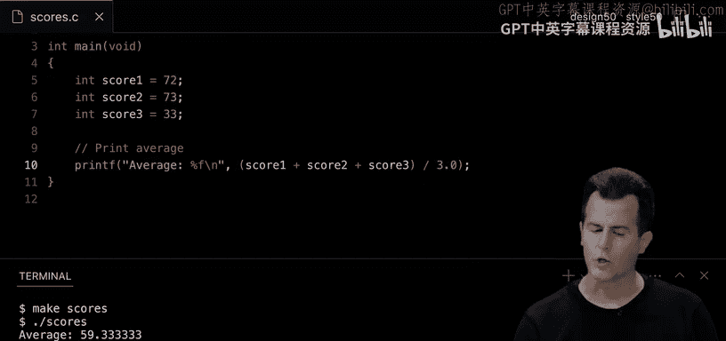

It's super simple， and there can't possibly be too many shortcomings。But what's bad， yeah？Yeah。

 really well said。 So if I want to add in more scores， like next week。

 a fourth score than a fifth score than a sixth score， Well。

 I can just kind of modify the code and add a line line line here。

 but then I have to add like variable variable variable here Like it's not very well maintained And honestly。

 if you kind of let your mind extrapolate。 What if I've got like 10 scores or 100 scores of the course of years of college Does it really seem like good design to have score 45 score 46 there's got to be a better way than coming up with these stupidly named variables where I just manually add a number。

 add a number， add a number， wouldn't it be nice to just call all of them collectively scores and not have to create individually all of these unique names and frankly I don't have to call them score one score2。

 score3， I could have called it a or something arbitrary like that， but that's even less clear。

 It would be nice to just call them all collectively one thing。 Well。

 it turns out that there is a way to address this and to do better than this in code We're gonna introduce the first。

😊。

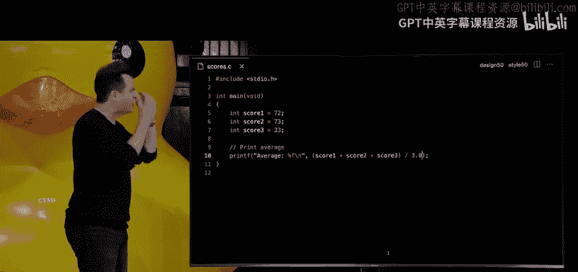

Of our data structures this week in class whereby we can introduce the notion of an array an array is a block is a sequence of values back to back to back in memory an array is a sequence of values back to back to back or contiguous in memory all of which are the same data type so int in int or Charchar cha or something else along those lines and the syntax for creating a single variable that contains not one。

 but any number of values is relatively simple in C you simply specify what type do you want the values to be int what do you want the name of the variable to be scores plural。

 just for clarity and how many integers do you want to be associated with this variable called scores you use square brackets。

 which is something new now， but the square brackets indicate hey compiler this is an array of three integers that will give me access to all three back to back to back in memory So if I want to now initialize each of these values。

Numbers the syntax is pretty similar to before， but I don't have to come up with new variable names for each of them I can instead keep using this square bracket technique as follows to initialize the first score I can say scores bracket0 equals 72 semicolon the second one is scores bracket1 the third is scores bracket2 they are zero indexed so to speak as before we're almost always going start counting from zero and C and in most other languages。

😡，So0 is the first。 One is the second， two is the third。

 But notice these aren't separate variable names now。 they're all called scores。

 but I am indexing into the array by jumping to a specific location。 The first one。

 the second one or the third one。 first， middle last。 so to speak。

 So if I want to use this technique now let me actually go back to V S code here。

 And let me modify my version of scores as follows。

 I'm not going quite do what you recommended over there a moment ago。

 which is to sort of avoid repeating myself a few times， but I am going to clean this up。

 I'm going to say int scores bracket 3 to give me an array of three values。

 Then I'm going manually say scores， bracket 0 equals 72， scores bracket 1 equals 73。

 scores bracket2 equals 33， semicolon。 And then down here。

 I have to change my formula to be scores bracket 0。Scores bracket one。Scores bracket 3。

 so sorry scoreses bracket 2 and then divided by 3。0 for the same reason as before。

 if I open my terminal now， clear it， make scores again seems to compile dot s scores still gives me the same value but it's a little better designed。

 I've got one variable now with three spots in it instead of three variables and God forbid even more if I want more and more of these values。

 Well， what is now going on in the computer's memory， well。

 these three lines of code now look fundamentally the same4 bytes，4 bytes，4 bytes。

 but the names that the computer is giving them is scores bracket 0。

 scores bracket 1 scores bracket 2 and to be clear， it's one variable。

 but this is saying go to the first location， location 0， go to the second location。

 Aka location1 go to the third location aka location2 It's a little confusing that everything's off by one。

 but you get used to it over time。So if that's what's going on inside of the computer's memory。

 let's actually tinker with it further and toward this end of making it even better。Ultimately。

 let me propose that we' go back here and maybe modify this as follows instead of。😡，It's hard coding。

 my three score， 72， 73， 33， and then having to like update this code next week and then update it in two weeks by adding more and more scores to it。

 what would be the right programming technique here to just prompt me again and again。😡，Like loop。

 again， we don't have to write all of these lines of nearly identical code。 So let me do this。

 Let me get rid of these three lines， which look like copy paste， except for the changing number。

 Let's do four int I is 0 I less than3。 So I'm not gonna screw up this time。

 not less than or equal to， but less than3 I plus plus then inside of this four loop。

 let's go ahead and use this syntax scores bracket I equals let's actually ask the user now for their score rather than hard coded at all using get int like this。

 So we're using the square brackets now in a few different ways。

 even though the rest of the code is now the same in this line of code。

 I'm declaring the variable called scores to be an array of size 3 integers kind of a mouthful。

 but that's all that's going on there。 When I use the array later。

 I don't have to say int ever again， That was just to tell the computer once。

 what types of values do I want to put in here hereafter， I can just say scores bracket I Well。

 what is。Well， on the first iteration of this loop， it's gonna be  zero and then one and then two。

 like magically it's gonna plug into those square brackets exactly the number I want，0，1，2 on up。

 get int is going to be called1，2，3 or more times based on however many times I loop。

 so I don't have to type 72，73 or 33 in my code at all。 Now the code is still imperfect。

 I'm still kind of cheating that I've got the three here。 I've got three of these here。

 I've got the three here， the three here。 This is still poorly designed but it's better poorly designed in the sense that I've got this magic number three everywhere that I am going to mess up at some point。

 if I change it to a4， I bet you I'm gonna miss one of those locations so we should probably improve that as well。

 Well let me go ahead and just confirm that I didn't make things worse make scores。😡，I did。

What did I do wrong here？Error， call to undeclared function。 get in。Yeah。

 I didn't include C 50 dot H。 That's That's why the compiler just doesn't know what it get int even is。

 So that's an easy fix。 Let me go ahead and type that in here。 clear my terminal。 Rerun make scores。

 Okay， now we're back in business dot slash scores。

 Now I'll type them in when prompted by get int 72，73，33。 And I'm still getting the math correctly。

 But I can do a little better。 So let me hide my terminal window。

 Let's get rid of this magic number 3。 How can I do this。 Why I could do something like this。 int。

 and maybe capital n equals 3 for a number that's not changing， but actually， there's a technique。

 If you want to tell the computer， don't even let me change this number。😊。

What can I write on line 6 before int。Consant， we haven't used it much。

 but this is just a way of protecting you from yourself or protecting your code from some dumb collie who goes in and tries to change a number that they are not supposed to。

 So constant n equals 3 means this variable shall be forever。 the value 3。

 What can I then do with this。 Well I'm gonna to change the3 here to n。 the3 here to n and down here。

 it's kind of a step backwards。 I don't want to do n just yet。

 but I can cast this to a float to make sure that that three is treated as though it's 3。0。 Now。

 I capitalized n just by convention。 generally when you use constants。

 humans tend to like capitals Y because it just jumps out to the reader Wait a minute。

 like this is capitalized for some reason。 that usually means it's meant to be a constant just as a little visual heuristic。

 This is still imperfect because I'm still assuming that n is always gonna be3。

 But one problem at a time。 let me open my terminal。 make scores。 Dot scores，72，7333。

Code still seems to be behaving correctly except for Notice this time we're seeing a bit of an artifact。

 Now， suddenly， I lost a one1000000，100001 millionth of a point。So the roundings a little different。

 but that's because fundamentally when dealing with floats， they are going to be imprecise。

 maybe not very imprecise， but slightly imprecise。 thus far。

 we were getting an additional three there， not a two。

 that's just a side effect per last week's discussion。 Well， let me go ahead and do this。

 instead of typing this one out myself。 let me go ahead and grab sort of from the oven already cooked a program called scores version 5。

 which I wrote in advance。 which now has everything。 So this is a lot on the screen all at once。

 but let's focus on what's similar。 I'm including Cs50 do H and standard I O dot H。

 I'm declaring a con。 Notice， though， that I've put it at the top of my file and instead of inside of main。

 and that's okay。 It is sometimes okay and a good idea to put your constants outside of functions。

 so that if I do want to change it somewhere， it's obvious where to change it。

 It's not buried in some function， It's at the very top of the file where it's more obvious to the reader。

 Notice now I've introduced a function。Caed average more on that in a moment。

 because the problem I still had was even though I had 3，3，3 in a variable。

 I was still manually adding scores 0， scores 1， scores 2。 What about scores 3，4。

 56 as the program grows。 Well， how am I solving this Wellll notice this in main now。

 I'm giving myself access to end scores。 So whatever n is make the array big enough。

 And this is a cool technique with arrays， If you don't know when you write the code what the size is just use a variable。

 and the computer will give you an array of that many spots。

 The four loop is exactly the same here exactly the same here。

 I'm just prompting the user again and again for each of their scores。

 The only thing I've changed now is fix the final problem。

 instead of just printing out the average of scores 0 plus scores 1 plus scores 2 divided by3。

 I'm actually asking a helper function。 so to speak。

 another function that I wrote called average that takes two values。1 is N。

 because it's got to know how many values to average， What's the denominator。

 and then the array itself。And this is the only new piece of syntax。

 Now with respect to arrays is how I'm passing this in。 Let's focus on just the math for a moment。

 How do I calculate an average when I don't know in advance how many values there are。

 so I can't just do this plus this plus list all divided by3。 Well。

 let's create a variable called sum。 Let's then iterate over the length of that array。

 Let's use some of last week syntax to add to that sum。

 the value at location I location I location I as I goes from 0 to one to2 on up。 And then lastly。

 how do you calculate the average， Well， whatever that sum is divided by the length of the array cast it again to a floating point value。

 So the only thing here is a recollection from sort of grade school calculate the average。

 you just add add add add add all of the numbers in the numerator and divide once by the denominator。

 So I've used some C code with a variable and a four loop to do just that。

 The only weird thing call out here is this notice how I wrote the average。😊，Fction。

 it's called average。 It returns a float， which we haven't seen before。

 but it stands to reason if we can return ints， and if we can turn nothing like void。

 I could probably return a float。 And that's correct。 This is the output of this function。

 That is why I can return a value。But this is weird。 not only does average take two arguments。

 One of those arguments as of today is now an array。

 so I could call these arguments anything I want A B X Y。

 but I'm calling them more usefully the length of the array and then the name I want to give this array。

 but I could call it anything。 I could call it numbers but I called it array for the second class of making super explicit what an array is。

 but this is the weirdness。 when a function takes as input。 someone else's array。

 you don't have to know in advance what the size is So you just say open bracket closed bracket and leave it at that。

 but you need to make sure that that caller， the function who created the array also tells you with a second argument how big it is。

 This is not true in Python。 this is not true in jascript in certain other languages that some of you might be familiar with。

 but in C， if you pass an array as input， you don't have to the function doesn't have to know how big it is。

 but you have to tell it how big it is by giving it a second argument。😡。

And that's it for this use of square brackets。 We've used it to create the array。

 to access or index into the array。 And now to pass the array。

 So square brackets almost always are going to hint。 There's an array going on here。😊。

I suppose we should run this to be sure that I didn't screw it up。

 So make let's do this copy dot source 2 scores 5。 So we haven't showed you this yet。

 but if I have a file secretly called scores 5 c。 and I want to name it to scores do C。

 I can use the Cp command for copy for short， it's gonna to prompt me overwrite scores do c yes。

 and so now if I open what was always called scores do c。

 I now have exactly the same file as we walk through a moment ago。 So let's run this now。

 make scores dotlash scores 72，73，33， and we still get the same correct average。

 but now the code is arguably not only correct， it's better designed。

 even though things kind of escalated quickly because to make this code better design。

 I needed to generalize it to handle not three but ultimately any number of exams or scores by changing the three to4。

or a 5 or 100 or anything else。 And heck， if we really want。

 we could ask the user how many scores do you have already by calling get in one more time and then avoid the constant itself。

😡。

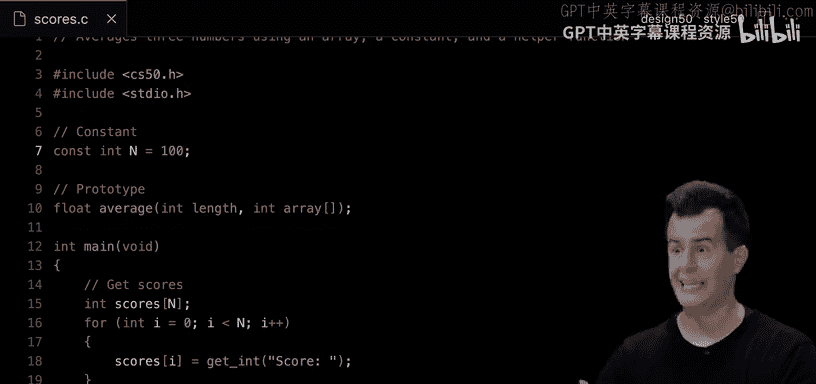

不。Okay， that was a lot just to calculate a very bad score。Questions。Yes。A really good question。

 What it happens if you try to access a point in the array that hasn't been given a value yet。

 we will see that actually soon， you can go there but you don't know what you're going to expect。

 so just to be a little dramatic， why don't we go ahead and have some delicious animal crackers。

 take a 10 minute break and when we come back， we'll start building on these examples。😡，All right。

Now that we have this new tool in our toolkit of arrays。

 let's see how we can sort take it out for spin and sort of rethink and also solve different types of problems。

 starting with a super simple message of high， which is where weve really began over the past couple of weeks2 so suppose I wrote some code and an actual program soon that just stores three chas and I'll call them simply C1 C2 C3 initialize them to H exclamation point which not coincidentally is exactly the numbers we've been playing with 727333 recall from our so-called ASI charts from weeks past so what's going on with code like this well let's go ahead and try it out let me open up a new file called how about high C and in VS code I'm going to quickly do include standard Io H int main void and then inside of main let's give exactly those three lines so char char C1 equals quote unquote H cha C2 equals quote unquote I cha C3 equal。

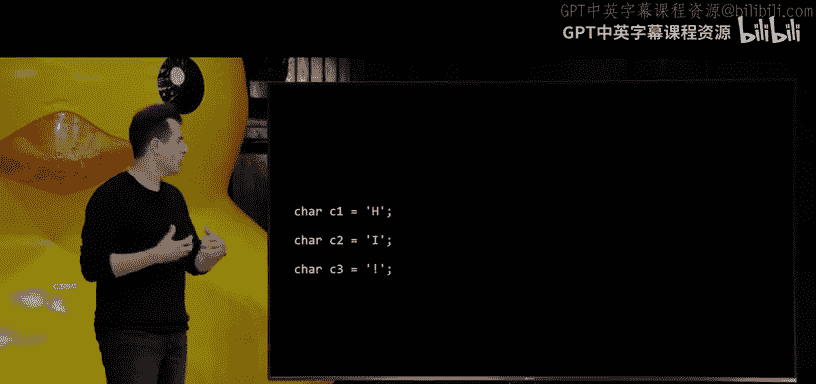

unquoteExlamation point。 and just to be clear， why am I using single quotes instead of double？

So it's a character， not a string。 So strings are double quoted。

 Individual characters are single quoted。 Allright， so with that said。

 let's actually just poke around these variables。 So let me go ahead and use printf and print out three things3 placeholders per C percent C percent C backlash N and let's plug in the value of each of those variables。

 C1， C2， C3 just to see what's going on。 Well， this one won't be all that enlightening。

 but if I do make high dot slash high， I should see literally H exclamation point。

 but I'm not printing it as a string， I'm printing it as char char char back back from left to right。

 Allright， so can I maybe improve this a little bit。 Well， let me go ahead and tinker like this。

 if I actually want to see the numbers that the computer is storing。

 let me first add some spaces here for clarity。 and let me add some spaces here for clarity。

 and let me change the placeholders from C to I。 because it turns out that if characters are just numbers。

😊，Our discussion of ASCI and then more broadly UniIcode。

 what's really stopping me from just telling the computer treat this sequence of bits not as a char anymore。

 but as the integer that it actually is so we can use printf with percent I instead to do exactly that so let me rerun makeH dot/ slashhi and what should I see now when I hit enter。

😡，Probably 72，73，33， which we keep using。 and indeed， that's all that's going on underneath the hood。

 so to speak of these three characters。 In fact， if we take a look at this code now in the context of the computer's memory。

 a char recalls one byte by definition。 So we need three such bytes for three chas。

 So that might end up being h I exclamation point here or who knows maybe elsewhere in memory with those three variable names now in describing those three locations。

 Well， once I've got that in place， what's really going on underneath the hood， well。

 obviously it's actually storing 72，7333， and if we really go down lower level to where we began week 0。

 technically what's inside of the computer's memory is these three patterns of zeros and ones。

 But again， who cares about these zeros and ones， but they are there。

 but it's easier to think about them as numbers or in the context of actual words characters instead。

 So what is a string。 Well， we introduced a string last week as being a。

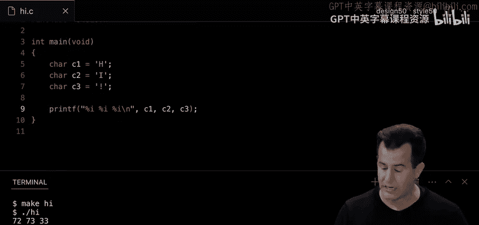

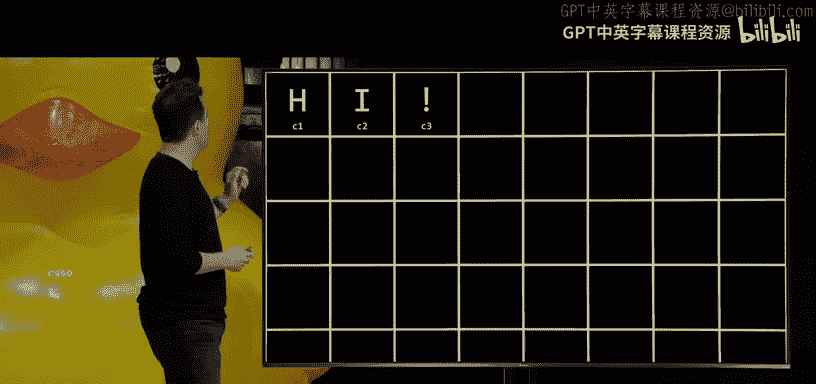

Sequence of characters。 But it turns out that we actually really know more so now what a string is。

 So for instance， here is an example of declaring a string called S and setting it equal to the value of hi。

 Let's actually put this into some code。 Let me go back over to VS code in high dot C。

 and let me just tweak this code by really throwing away all of these lines。

 Let's do string S equals quote unquote in double quotes now high exclamation point。

 and then print out percent S back slash n and print out S itself。

 And just so I have access to it more on this another time。

 let me proactively include cs 50 do H at this stage。

 So all I've done is exactly this line string S equals high。 And let's just print it back out。

 just like hello world before it。 make high dot slash high。 And indeed， I see H exclamation point。

 But what's going on now inside of the computer's memory。

 Well just like the sequence of H exclamation point。 What is a string。 Well， a string is a。😊。

Of characters， yes， which means back to back to back， contiguous in memory。

 So if this is the computer's memory。 and I have created a string called high。

 it is indeed going to be called S。 And it's going to have H exclamation point back to back to back in the computer's memory。

 Well， what's noteworthy here is that this looks awfully similar to stuff we've been doing thus far。

 Like， in fact， if a string is yes， a sequence of characters。

 could we slap another name on what a string actually seems to be as of today。😊。

An array of characters， right， It's a sequence of values， contiguous in memory。 Well。

 that's pretty much equivalent of what I've been calling a string。

 So I bet we could think about high as really being three locations called S where this is really S bracket 0 S bracket1 S bracket 2。

 And it's not that hard to even reveal this with a bit of C code。 Let me go back to V S code here。

 let me leave line 6 alone。 But let's go ahead and do this。

 instead of printing out one placeholder percent S。

 let's print out percent C percent C percent C back slash N comma And there's no C 1 C2 C3。 Now。

 there's only S。 So let's print out S bracket 0 S bracket 1 S bracket 2， close parenthesis semicolon。

 go down to my terminal window， make high dots slash high。 It's the same darn thing。

 So all of this time as of last week when we were playing with strings。

 We actually already werere using arrays。 We just didn't call them that。 but a string。😊。

I a sequence of characters and array is a sequence of values。

 So really a string is just a more precise type of array specifically containing characters。 Well。

 what's really going on inside the computer's memory then is indeed this you've just got one variable called S。

 but it's got indeed three locations but the difference here between strings now and what we were playing with previously scores where we had one。

2，3 scores and we had to keep track of the number of scores with a variable like n or by literally typing3 into my code。

 if I only have one variable in this program S。 and yet it somehow working。

 how does the computer know where S starts and where SNs like when I print out percent S as a placeholder。

 why is printf not just printing out everything that's in the computer's memory。

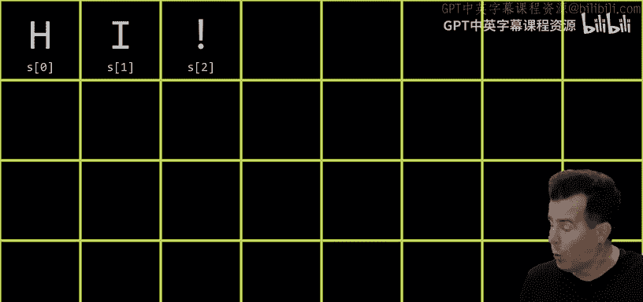

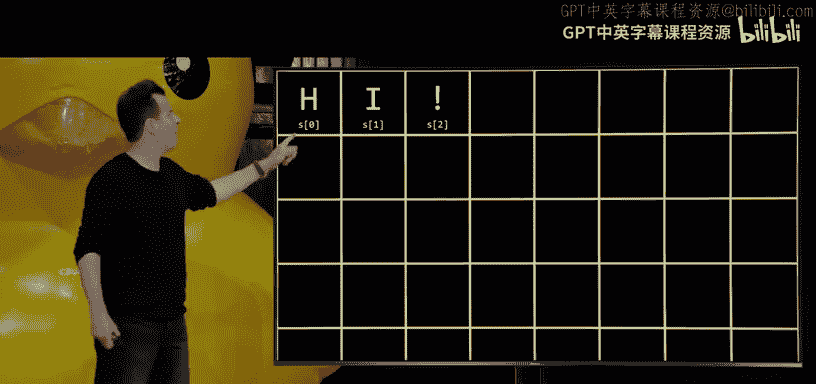

How could we solve this Well at the end of the day， there's no magic。

 Like all we have is this canvas of zeros and ones。 And if you want to keep track of something。

 you have to spend some of these bits。 you have to use some of these bytes。

 So it turns out that the way a computer keeps track of where the end of a string is even if that string is three characters。

 the length of the string the length of the array really that storing the string is' technically four。

 It's one plus whatever the actual length of the phrase is So if S begins here。

 it's obvious to our human eye， the S ends here， but how does the computer know that it spends one extra byte always for strings unbeknownst to you and it fills them with all zeroes。

 And so technically S is yes， length3 H exhallamation point。

 but it uses four bytes because of this special value， this sentinel value。

 this terminating character that indicates， hey， the string stops there Now this kind of invites the question。

 well how do you。And all zeros more on that another time。

 But for now we're just using all zero bits as a special signal that string stops here。

 Now let's stop talking about bits all the time。 This is really just the number zero。

 So technically whatever the string is the last byte in a string will always be zero This though is a little ambiguous is this like zero bits or is this like the number0 on my keyboard like do I want to see the zero So typically the convention is to put a backslash in front of the zero to make clear that this is a special character。

 This is a special character like backslash n like some of the other characters we've seen that just indicates the string ends here。

 it's the same thing is all zeros， but it avoids that visual ambiguity So we can actually see this。

 if this is what's actually going on underneath the hood。

 we can actually see the fact that this is there Let me go back to VS code here and let's just kind of get a little curious instead of printing out three of these things let's go ahead and do this Let's print out percent。

😊，I， percent I， percent I as before。 and this is no different from earlier。 make high dot slash high。

 There are those three numbers， but let's kind of get curious and print out one more placeholder。

 percent I and print out S bracket 3， which I'm assuming will exist because as indicated。

 a string always gives you one extra byte for that special terminating character。

 make high dot slash highvoila like there is the zero unbeknownst to us last week and unbeknownst to us before break。

 it's always been there with any string underneath the hood。

 the variable keeps track of where the string begins， but zeros indicate where the string ends。

Questions on this technique or this implementation detail。😡，Yeah。

What would happen if you went to the next good question and honestly there's nothing really stopping us So let's try going one more location。

 So S bracket 4。 let me go ahead and do make high dot slash high37 comes next。

 whatever that is if we do one more percent I S bracket 5。

 let's do make high dot slash high enter 1005 comes next So these are actually unpredictable and are actually representative of those same kinds of garbage values that I alluded to earlier that don't really belong to us like I really shouldn't be poking around places where I haven't asked for the computer to give me memory but odds are those are sort of evidence of other values in this program or maybe remnants of the memory having been used prior。

 but the only one we can trust will exist is one greater than the string's actual length。

 Really good question。Alright， so what is this thing called， Well， it conventionally。

 this thing is called。Nll， so N U L， single L will'll see another version of null that spelled a little differently。

 And we've actually seen it before， even though we kind of waved our hands at it。

 here is the ASI chart from week 0， in fact。 And we focused on H exclamation point。

 But here's the first column And notice location 0 in the ASI chart has always been what humans call N U L or null。

 which is just a special Sinel character， a terminating character that says string and there。

 All right， Well， what if we have multiple strings。 for instance。

 like one string S called high with a value of high and one string T with a value of buy。

 let's actually play a little with that and see where things end up in memory。

 So let me go back to Vs code。 let me get rid of this long print F。

 and let me give myself another one string T equals by exclamation point。

 And they'll print out both of these print F。😊，Quote unquote S back slash n comma S and then print F S back slash n comma T semicolon。

 and now make high dot slash high， and we'll see as you would expect just high and by on the screen。

 What's going on inside of the computer's memory though。

 Well odds are we're gonna see two chunks of memory and use。 S and T respectively。

 maybe S ends up here， which is the whole thing here， technically， this is S back at0，1，2，3。

 But who really cares at this point， it's just a string called S storing this value。

 And though this is up to the computer and the context and we write the code。 odds are by。

 we'll end up right next to it in memory。 It's too big to fit on the screen。

 So there's still another character here， but it's indeed here。

 So even though you and I only ever write high exclamation point or by exclamation point。

 the back slash0， the null character ends up being added automatically for free， and fun fun fact。

 This is what the double quotes are in。😊，When you use double quotes that's a visual cu to the language。

 oh， this is a string， let me terminate it with backslash0。

 you do not want to backslash0 for a single char because single would mean one character。

 so single quotes distinguish that for the computer as well。😡，Alright， so now that we know this。

 we can actually sort of solve other problems as well。 In fact， let me go ahead and do this。

 let me go ahead and syntactically play around here。 So if I know that I have two variables here。

 let me sort of draw some inspiration from the scores example。 if I have a whole bunch of strings。

 I probably don't want to call it like S T U V and so forth。

 let's just give myself one variable called word whoops one variable of type string called words。

 let's give me two of them for the sake of discussion。

 and then let's have the first word So words bracket 0 equal quote unquote high。

 let's have the second word， words bracket1 equal quote unquote by by So just like I did with the scores。

 let's just consolidate all of these arbitrary variable names and one。

 that's a little more descriptive like scores or in this case， words， how do I now print these， well。

 instead of printing S and T， I can print words， bracket 0。 and I can print words bracket1 and。😊。

If I go down to my terminal， make high again， dot slash high still says the exact same thing。

 But here's where things get kind of interesting。 You can compose these ideas in different ways。

 Like this is not something that's useful， but it does speak to the fact that there's no magic like now that you have the square bracket notation。

 you can start poking around wherever you want for better or for worse。 So， for instance。

 suppose I want to print out the three letter word high。 Well。

 I could change percent S to be percent C。😊，Perscent C， percent C for H exclamation point。

 But wait a minute， how do I print out characters。 Well。

 this is kind of a neat feature If words is the array and words bracket 0 is the first string in that array。

 Well， what is a string。 It's just an array itself。

 So if you want to go into the first character of the first word you can actually do this syntax。

 use brackets twice。 the first set of brackets says what word do you want。

 The second set of brackets says what character do you want， because again。

 this is an array of strings。 Aka an array of arrays。 So let's do words bracket 0。

 bracket 1 words 0 bracket2， And then down here， I know this is a four letter words。 So again。

 this doesn't really solve a problem。 It just demonstrates what's going on。

 Here's a four letter word， let's change this to words bracket 1 location 0， words bracket 1。

 location 1， words bracket。One， location two， words bracket one location three， so again。

 not something that's really。Compelling to use， but it does demonstrate that there's no magic。

 All that's happening is percent S is saying go print a bunch of characters until you see the backslash0。

 percent C is letting me manipulate these things manually。

 So make high dot slash high exact same thing as before by just building on the assumption that these strings are really just as。

😡，Okay， so how do we actually leverage this idea and sort of figure out dynamically how long these strings are。

 Because I bet anytime we want to start iterating over the length of text。

 maybe to determine like the reading level of a chunk of text。

 We're gonna have to be able to read the thing from left to right and stop when the sentence or the paragraph actually ends。

 So how might we do this。 Well， let me actually go back over to V S code。

 Let's create a new file called length。 and let's write a program that figures out the length of a string for us。

 So length do C shall be the name of this file。 Let's go ahead and include C 50 dot H at the top。

 let's include standard I O dot H at the top int main void and then inside of main。 Well。

 let's do this。 Let's ask the user for their name string name equals get string and then prompt them for their name with name colon unquote Then let's go ahead and figure out the length of this string。

 So how can I figure out the length。 Well， bunches of ways。

 but loops come to mind if I want to iterate from left to right。

 So let me propose that we first initialize any variable to0。I'll call it n for number。

 but I could call it length or count or whatever。 Then let's do a four loop。 or no，s do。

 let's do a while loop， actually， like this while。The name array at location N does not equal the null character。

Go ahead and increment N。 And then at the very bottom here。

 let's just print it out print F of percent I back slash n N。 Allright。

 so there's a bunch going on here， but it's relatively simple idea。 what do we have。

 So we're prompting the user on line 6 for their name pretty straightforward per last week。 line 8。

 we're just saying start a variable at 0。 So like all fingers are down or the stress ball bowl is empty。

 This is the only line that's a little weird to see for the first time。

 but it's just doing this line 9 is saying while it is the case。

 that the name string at this location does not equal the null character。 increment n。

 So it's like using a finger and pointing at the string from left to right。

 asking itself is this null is this null is this null。 And if it is not null。

 then it's gonna increment n。 So if the first letter is H at location 0。 Well。

 H is not equal to the null character。 So N gets incremented once。 So the expression high has it。😊。

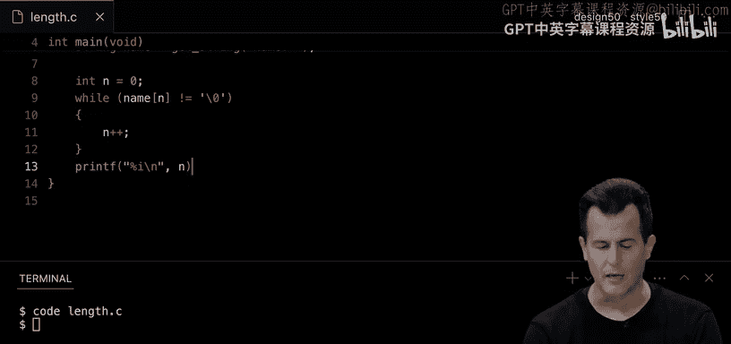

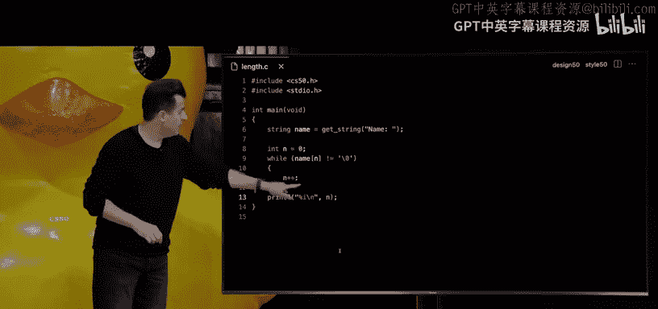

A length of one I does not equal the null character。 So N is gonna to get incred again。

 The length is now at least two。 exclamation point does not equal the null character。

 N is now three but what comes after H I exclamation point。 the null character。

 So the character at location3， name bracket 3， which is the fourth total location because we started counting at0 is the null character。

 This does not get incremented anymore。 I've only got three fingers still held up。

 We're gonna see the value 3。 So this is a very mechanical kind of clunky but very correct way of figuring out dynamically。

 the length of a string by just looking looking， looking， looking and figuring out where it is。

 How does print if then know when to stop printing characters on the screen when you just hand at the name of a variable。

 It is literally doing the same thing。 It is looking at your string left to right and checking is this null is this null is this nu And as soon as it is it stops printing words on the screen。

 It's been doing this for us。Since last week， so if I open my terminal window now， do make length。

 enter dot slash length， type in a name like David En， and I do get back the number5， not6。

 because I'm not including the null character， I'm stopping once I hit it and therefore I get five。😡。

Syntax is a lot， but any questions。On this here。Allright， well。

 let's make one tweak and then make it even simpler。 So in my code here。

 wouldn't it be nice if I could just call a function that figures this out for me。 So， for instance。

 suppose I want to get the length of the name。 Well。

 let's just give myself a variable called int length。

 set it equal to the return value of a magical function that doesn't yet exist called string length and pass in the name to that function and then go ahead and print out with printf exactly that length with percent I comma length。

 So wouldn't it be nice if a string length function exists。 Well， it's not that hard to create one。

 If I have a function called string length that returns the length of a string。

 I want this function to return an int。 So that's its output or return type。The name is gonna be。

 of course， string length。 What's the input to this function gonna be， Well。

 it expects a string as input， and I can call it anything。 So I'll keep it simple。

 I'll call it S for string。 And then inside of this function， Honestly。

 I think I can kind of copy paste that code from before， I just need to change name to S。

 And instead of printing N。 What do I want to do with the very last line here。😊，Yeah， so return S。

 hand it back to whoever is using this function so that it gets passed from right to left。

 stored in this variable and then printed。 There's one thing I have to do again。 It's kind of silly。

 but copy paste the prototype at the top of the file so that the compiler knows about it。

 But I think now I've created my own string length function that can just figure this out for me。

 And as before with scratch， sort of out of sight out of mind。

 I never again need to implement a string length function。 If I've already done it once。

 But let's not be dramatically just unlete all of these blank lines。 let's now compile this code。

 So make length again。 I messed up。What did。I don't want to return S。 I screwed up。

 I want to return n， which is the number。 S is the string。 So that's what it's saying here。

 And we'll come back to in a couple of weeks what these words like pointer and conversion mean。

 make length。There we go。 dot slash length D A V I D。 I still get5。 Well。

 wouldn't it be nice if like someone had solved this problem for us already。

 And it turns out there is。 So recall from last week。

 there are some standard libraries that come with C， not just CS50， not just standard I O。

 not just the math library。 There's actually a string library。

 that's got a bunch of string related functions in it that are super helpful。 In fact。

 in the manual pages or man pages for the string library at a URL like this， which is C50's version。

 you'll see exactly the an option called the St L function。 S T R L N for short。

 Theres the documentation on the screen。 and sure enough。

 there exists a function called St L that does exactly this。 So in fact。

 I can actually wonderfully enough， get rid of most of the code I just wrote by deleting that as well as its prototype。

 I do need to include one more header file， So string do H， but instead of calling string length。

 I can call St L， and now。😊。

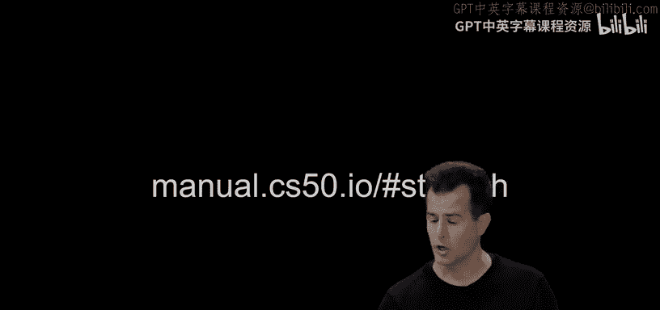

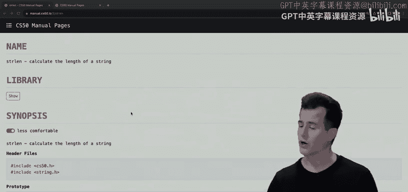

Programs done。 So here this is sort of evidence of like why we stand on the shoulders of programmers before us like someone else already solved this problem。

 It's sort of intellectually interesting to understand how they solved it。

 But why bother reinventing the wheel again and again when you can use a library function to do exactly that。

 So this version of the code， I think make length dot length D VD enter still works。

 But it's like three lines of actual code now instead of know a dozen or more that it was。

For a moment。All right。Questions on any of this。Questions。No， all right。

 so let's do a different sort of problem， but still sort of borrow code that others have written before。

 So besides the Sterling function in the string library。

 there's another oddly named library called the C type library。

 which is related to C types So converting from one thing to another a detecting things。

 So in the C type library whose documentation is here you'll actually see a whole bunch of function。

 So if I go here you'll see things like is Al nuum It checks whether a character is alpha numeric is alpha check whether a character is alphabetical is digit。

 check whether a character is a digit is space， check whether a character is white space and so forth to upper to lower to convert a chart to lowercase to uppercase。

 There's so many functions that someone else wrote that actually seem at a glance， pretty useful。

 But how might those kinds of things be implemented。

 Well here's that same ASI chart is before and notice this kind of curiosity。

 here are the start of the uppercase letters here are the start of the lowercase letters and just take a look at like a we know from week 0 that a is 65 and。

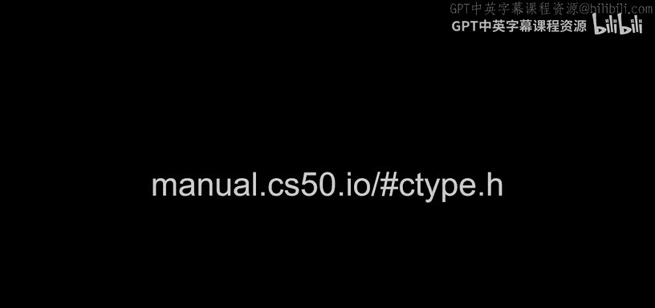

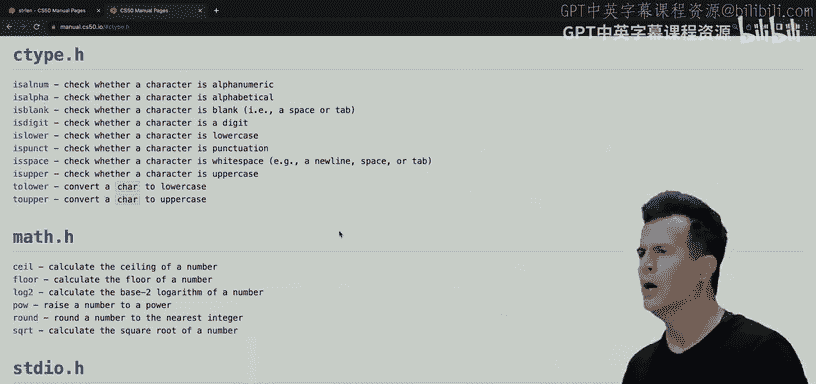

lowerercase A is 97。 Quick mental math， how far are part of those numbers。97 minus 65。That's right。

32。 So they're 32 apart。 But notice the pattern。 How far apart are 98 and 66，99 and 67， and so forth。

 they're all 32 apart。 And this is actually wonderful for the real geeks in the room like you can just change one bit out of 8 and turn a number from uppercase to lowercase and back。

 But for the rest of us， notice that 32 is the constant here that explains how you get from uppercase to lowercase and back。

 Well， we could leverage this and implement our own function that somehow plays around with the cases of letter。

 So in fact， let me go back to V S code here。 And let's create a new program this time called string dot C just to play around。

 And in string dot C。 I'm gonna go ahead and include my same header file。 So Cs 50 dot H。

 And in standard I O dot H。 And I'm gonna use string dot H。 And then in int main void。

 I'm gonna go ahead and do this。 let's prompt the user for a string S。😊。

By using get string and just ask them for input， whatever that input actually is。

 let me just preemptively say print F quote unquote， output。 and let me just go ahead and whoops。

 close， quote， close parenthesis semicolon。 And now what I want to do is convert the userss input。

 actually， for now， let's do it simple。 Let's just print the exact same thing that the human types in。

 So we're gonna keep it simple just to make sure we have the framework for a program good to go。 So4。

 int I equals 0。 I is less than stirling S。 let's go ahead and do I plus plus。

 And then inside of here。😊，Inside of here， let's go ahead and just print out that character。

 So print out percent C backslash。 no， let's know backslash N percent C clone unquote S bracket I。

 So I think this code here will print out the I character of S from 0 to 1 to 2 forever long。

 it actually is。 And at the very end of this program。

 Let's go ahead and print out just a single backslash N。

 So this doesn't do anything that interesting yet。But let me go ahead now and run make string。

I messed up because I'm typing too fast。 This semicolon goes on the outside。

 Let me do make string dots string。 and I'll type in D V I D。 and I get the exact same output。

 So not all of that， all that interesting。 But before we start playing around with uppercase in lowercase。

 let's actually kind of clean this up slightly， this program is correct。

 if my goal in life is to just print the exact same thing as output as I was provided with input。

 But it's arguably not well designed yet for a very subtle reason。

 even though I am very cleverly practicing what I preached a moment ago。

 using the Stling function from the string library。😊。

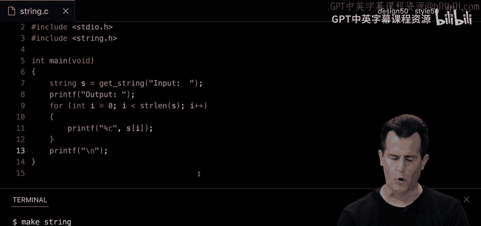

Now this is super subtle， but on line 9， recall how a four loop works like you initialize I to 0。

 then you check the condition， then you do something， then you increment。

 then you check the condition， you do something， you increment， then you check the condition。

 you do something and you increment what might rub you the wrong way designwise about the story I just told given that Sterling is involved in that decision making yeah。

😡，Every time。Perfect， really good intuition。 Like the length of S is not changing。

 So why am I wasting everyone's time by calling the Sterling function again And again， And again。

 I is changing， So that part is correct。 But why am I calling this function and notice because I have written Sterling parenthesis S。

 It will call the function again and again and again， it's not going very intelligent be like， oh。

 well， it hasn't changed necessarily， let me just do that for you。

 unless you have a compiler that has a feature like that enabled， But at a glance。

 this just seems very inefficient。 So how can I improve this。 Well。

 I can do this in a couple of different ways， Let me go back to the code here。

 Let me grab Sterling of S and let me do this like length equal Stling of S。

 And then I could do this。 So this is arguably marginally better because I'm calling Sterling once storing the return value and a variable and then using it again and again。

 Now that's fine。 That's correct。 That is better designed。

 But there is this is such a common paradigm， There's another way to do this。

 And instead of doing Stling of S。😊。

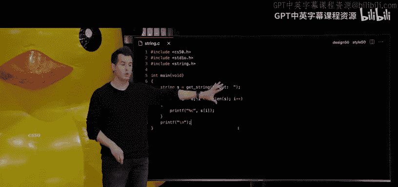

Inside of the condition， you can instead do this。 you can declare a second variable like length or heck。

 I'll keep it simple。 N set it equal to the string length of S。 and then all in within your for loop。

 you can do the comparison by having initialized not one but two variables at a time。

 so long as those variables are both the same type。 Now I'm declaring two integers at once。

 but the first part here before the first semicolon is only executed once because that's the initialization So again。

 subtle， but it sort of speaks to efficiency， because I'm not calling the darn function again and again when this string S is never actually changing in length。

 So subtle but arguably better designed。 Now with that said。

 can we go and actually use this knowledge。

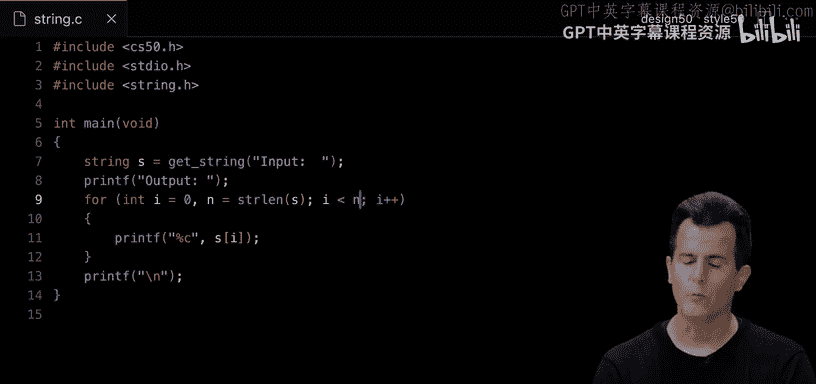

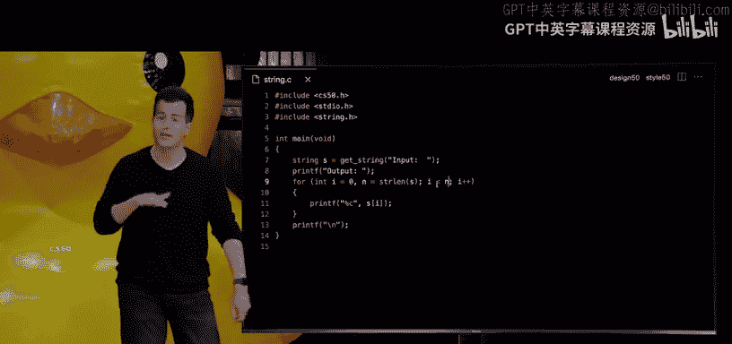

Of the ASI chart。 Can we use this technique of optimizing with Stling to sort of combine things and start changing things to and from uppercase in lowercase。

 Well， let's try this。 Let me go ahead and open up a new file called uppercase dot C。

 and in uppercase do C， let's go ahead and use those same files。

 include C 50 do H include standard I O dot H， include string dot H。

 And now in int main void inside of main。 Let's go ahead and do the same kinds of things。

 but a little bit differently。 string S equals get string。 And let's ask the user for input。

 We'll call it before。 So what's the string before we do anything to it。

 Now let's go ahead and proactively print out the word after。 just so that we can compare it。

 And I'm gonna very cleverly use two spaces just because before is longer than after。

 But I want them to line up perfectly above each other。 So I'm adding two spaces there。

 just for aesthetics。 Now let's do this。 Let's iterate over the characters of S。 And。😊。

Check if it is lowercase， let's turn it to uppercase。 Otherwise， let's not touch it at all。

 So how can I express that for nt I is 0。 I less than the string length of s I plus plus and then in here。

 But wait a minute， let me learn from what I just said let me avoid calling Sterling again and again and again。

 let's just call it n equal Stling of s and then compare I against n n's not changing I is changing。

 So that condition is now handling the logic I want。 inside of the four loop。 Now。

 I have to ask a question is the current character。 the Ih character of S。 lowercase。 If so。

 change it to uppercase。 Now that's kind of a mouthful。

 but I can kind of use last week's building blocks。

 And this week's understanding of a to express exactly that。 So if it is the case that S bracket I。

 So the Ih character in S is greater than or equal to lowercase A。And。

S bracket I is less than or equal to quote unquote Z。

 Then I want to go ahead and change S bracket I to uppercase。

 I don't know how yet I'm just putting a comment putting in pseudocode else， if it's not lowercase。

 then just print S bracket I。 Now， let me go back to our little cheat sheet here。

 So we only have the beginnings of it highlighted at the moment。

 But we know that the difference here is 32。 but more interestingly。

 we know that S sorry that lowercase starts at 97。 And if I look in the shaded part， it goes to 122。

 So technically， I could actually do this arithmetically with numbers。

 And I could go in here and say is greater than or equal to 97 and less than or equal to 122。

 That's fine。 But honestly， because we know from the previous example。

 a char is just an int and int is just a char and you can format them however you want。

 you can also manipulate them mathematically， however you want。

 So it's arguably better design and clear to you clear to the TF clear to the reader。😊。

The colleague that， oh， you're comparing the ASI values。

 not some random number that I don't remember from class years ago。

 So greater than or equal to lowercase A， less than or equal to lowercase Z expresses exactly what we want。

 So I'm gonna plugl off the easy one first。 How do I just print S。 while I do print F percent C。😊。

Coma S bracket I。 that means just spit it out unchanged。 It's not lowercase。

 So there's no change to it。 Let's just spit it out。

 whether it's already uppercase or maybe it's punctuation or number， whatever。 Now。

 this part is the last part。 How do I go ahead and change a character from lowercase to uppercase。

 Well， I know minimally， I'm gonna want to print some character。

 So let's just proactively do percent C as my placeholder。 I kind of want to print S bracket I。

 but I want to change S bracket I to low to uppercase。

What could I do mathematically to a lowercase letter to make it uppercase。

According to the cheat sheet。Yeah， just subtract 32。 So subtract 32 here。 And now if I。

 let's add one final flourish， let's just add a backslash n。 just of the cursor。

 Finally at the very end of all this is at the bottom of the prompt。

 Let me go ahead and open my terminal。 Make uppercase。 En。 Okay， I did screw up。 did it again。

 going too fast。 semicoon on line 14。Let me clear my terminal， rerun make uppercase。

 good dot slash uppercase D V I D with one capital letter， the rest lowercase enter and voila。

 Now we've uppercase everything just by understanding the underlying implementation details of what's going on。

Honestly， if you don't remember 32。 we can even abstract this away。

 Like whatever the distance is between capital A and lowercase A。

 that's actually what I want to subtract。 I could do B or C or Z or whatever 32 is fine。

 but it's arguably better to do little a minus big A because then you know it's going to be dynamic between the two。

 even if you forgot from class what the actual difference of 32 is。 All right。

 but this is a little silly that I'm doing all of this work just to change things to uppercase and check for lowercase。

 How can I make this a little better。 Well， turns out thats C type library is actually our friend here。

 Let me go back into this code here。 let me include my C type library and it's not necessary， but I。

😊，to alphabetize things just because then at a glance。

 I can see what law header files am I actually using。 And I'll know if something is missing。

 Let me go into my code here。 And you know what， instead of doing all of this。

 it turns out that in the C type library， there was a function called to upper。

 And if I read the documentation of to upper， it essentially takes as input per its prototype in our own documentation down here。

 a char call it C， And it returns the uppercase version thereof， it technically returns an integer。

 But who cares， we know that this is functionally equivalent to the same thing。

 So let me go back to my code。 And honestly， because I've now included C type do H at the top。

 I can just say to upper of S bracket I Let me open my terminal， let me rerun。

 make uppercase dot slash uppercase。 whoops， dot oops dot slash uppercase D A V I D。

 And now it's still the same。 But even this is kind of silly。 because if I read the documentation。😊。

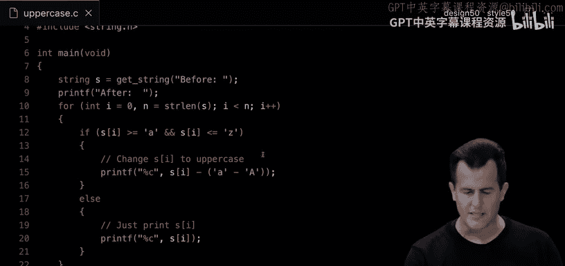

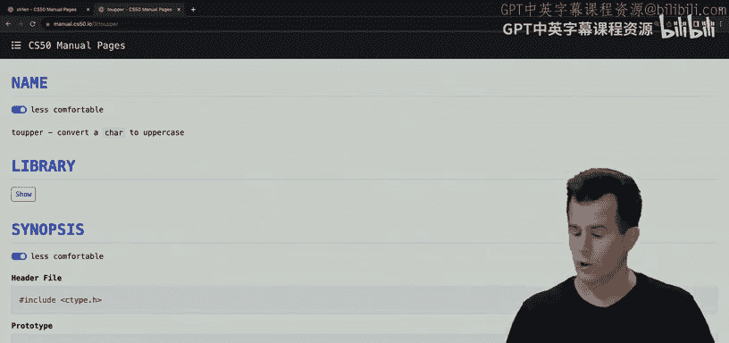

Or the two upper function more clearly， it actually says that it will handle this conditional decision of whether the thing is already uppercase or not or whether it's lowercase or not。

 so I can actually change all of this messiness into just。😡，A single line of code in my loop。

 print f quote unquote percent C comma to upper S bracket I。 Now， semicolon at the end。

 let me reopen my terminal window make uppercase dot slash uppercase， D V I D yet again。

 that to work。 So again， like libraries are your friend or designing a function once and then somehow reusing it。

 which is another technique。 we'll introduce upper time。 will save you time in the long run。

 once you have invented one wheel， you do not need another for the same problem。 So to speak。😡。

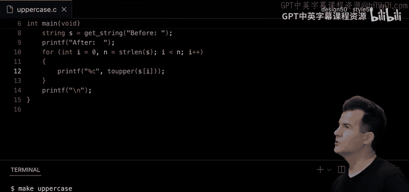

Okay， any questions on this exercise here， the goal of which to be clear was really to paint the picture of one。

 how you can manipulate all of these lower level details now by understanding the ASCI chart from week  zero and now arrays from week two and solve all of these problems by just using someone else's code already。

😡，In the form of these libraries。Okay， so let's come full circle to where we began so that we also touch ultimately on a bit of that cryptography and the art of scrambling information to better prepare you for actually solving some of these problems with your own code。

 this notion of command line arguments that I mentioned earlier。 command line arguments are again。

 just words you can type at the command line to influence the behavior of a program。

 So make hello hello is the command line argument clang hello do C hello dot C is the command line argument。

 Ho hello， hello do C o and hello and hello dot C are the command line argument plural。

 So how do we actually write code that accesses words at the command line because thus far。

 we have not written any code， any programs that can do that。

 But make can and clang can and other programs can as well。 So how do we make our own Well。

 up until now， this has been how we've implemented main we've been asking you to take on faith that it returns an int always。

 even though that hasn't been useful for。😊，Anything yet and we've always specified that main takes no input so just write void I've been literally typing this for every program as did you presumably for problem set1 Well it turns out that you can actually change the void in main to be something else if you want your program to accept command line arguments。

 words at the prompt when you run your own code and you can change this void it's a bit of a mouthful to be this whole thing instead。

😡，Now it's long at a glance， but what is it。 It's two arguments。 One is an int。

 One is a string technically an array of strings。 So this is why we introduced that syntax earlier。

 when you have an array being passed into a function。

 you just use square brackets and no number inside。

 So what this implies is that main can if you want take an integer and an array of strings。 Now。

 technically you can call these things anything you want A B X Y， the convention， though。

 is to call it argc an arg v where argc means argument count。

 how many command line arguments have been provided and argv stands for argument vector。

 a vector is often another word for an array， although there are subtle differences。

 but in this context， it just means array argument vector is an array of all of the words that the human type at the command line。

 So how can we use this technique。 Well， let's go ahead and do something like this。

 let me go back into VS code， and let's go ahead and create a program called。

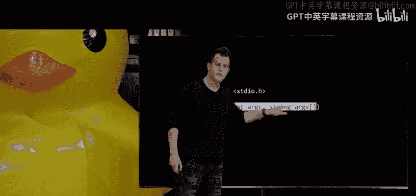

Dot C。 So in greet dot C， let's write a program that just greets the user。

 But instead of using get string， let's just ask them for their name at the command line so they can type it all at once。

 hit enter and be done with it。 They don't have to wait and be prompted and then hit enter。

 So let's go ahead and include C 50 dot H。 Let's go ahead and include standard standard standard I O dot H int main not void。

 Let's do let's do void first。 actually， void。Just to compare and contrast what we did last week in this。

 what we did last week would have been literally answer equals get string。

 prompt the user for what's your name， question mark space。 semicolon。

 And then printfqu hellello comma placeholder back slash N comma answer。 So this is week1 stuff now。

 And we saw this same snippet at the start of today。 make greet dot slash greet。

 I am prompted for David。 And now I am greeted。 hello， David。 So that's the old way of doing it。

 What is now the new way using this prototype for main instead using this signature。

 which is essentially synonymous， which means now what if main takes two input and still returns one output。

 Let me go ahead and in my second incarnation here。 Let's tweak this as follows。

 Let's get rid of all of this。 Let's change the void to be int Rrg C comma string Rrg V open bracket。

 close bracket make。😊，Or it's an array， not a single string。 It's an array of strings。

 And then inside of this function， let's do this。 print F， quote unquote， hello。

 comma place holder backslash N， like always。 But what do I want to print。 Well。

 if Rrg V is an array。Let me do R V， bracket0。 maybe semicolon。 And that's it。

 Let me now open my terminal window。 Let me again do make greet dot slash greet。

 And this is gonna look a little weird。 But here we go。 dot slash greet。 David。

 You'd think this would now say hello， comma， David， but it says。Hello do/g。Alright， so wrong。

 given my intent， But what can you infer about what is stored in R V 0。

 A by convention by having just poked around here。The name of the program。

 which hasn't been useful yet。 But if you ever want like to have documentation maybe built into your program。

 or maybe like an explanation of how to use it， it might be nice to sort of reflexively know what is my name。

 and you can actually figure out the program's name dynamically， even if the user renames the file。

 by using M V or right clicking or control clicking on it。

 You can figure out what your name is in Av bracket0。 Well。

 where is the actual name that was typed in。 Rrg V1 is where the actual words begin that the human like me typed in。

 So let's recompile this。 Let's do make greet again。 dot slash greet D V I D。

 And now I think I'll get a proper hello comma David， I'm not using get string。

 I'm not prompting the user I'm doing it all in one breath。 Unfortunately， if in the current moment。

 I forget to provide a name。 Let's just run dot greet enter So null。 And this is not N U L。

 This is a different type of null and， this just means no value。

 So this is not very pretty maybe we can defend。And we can。

 Let me go ahead and close my terminal window。 Let me temporarily get rid of this line code。

 and let's conditionally print that greeting out。 So if the argument count equals equals to。

 then you know that there's the name of the program， which is always gonna be there。

 no matter what automatically for free。 and another word is there。

 like the name of the human typing the program。 then let's go ahead and okay， let's print out hello。

 so and so。 else， if the user has not provided their name or they provided too many words。

 let's just go ahead and give them a default value like hello， comma world， semilon。

 Let me open my terminal window， clear the terminal， make greet again。

 dot slash greet David still works as before， because the number of arguments in Arg V is2。

 the name of the program and whatever I typed in， But what if I try to be a little more formal greet David Main enter。

 It just ignores that。 because now the argument count is presumably3。 and we didn'。

Handle that so I can't even greet people with last names， but that's fine。 Similarlyly。

 if I just do dot slashg and no name， that's also not too。 So we again get the default value。

 but at least now there's no way this code is going to print out null weirdly because I'm at least handling and checking how many characters there actually is。

😡，You can do other things with this too。 Now， if I were to sort of iterate over all of the words typed in。

 I could do this for int I is0 I less than arg C I plus plus so a relatively simple four loop。

 I can print out percent S comma N and then arg V bracket I。 So what am I doing here。 let's just try。

 I did that fast。 But let's do make greet dot greet David Main。

 what am I gonna see on the screen program name， my name， my last name。 if I type in more words。

 So maybe I do David middle initial J mailin， I just get one per line。 So again。

 there's really nothing intellectually that interesting going on here。

 we just have a new integer conventionally called arg C that tells us how many arguments there are。

 there is a new array called arg V conventionally that's just the array of words that were typed in。

 So we can use last week's techniques with four loops。

 which are the exact same idea of loops from week0 to just iterate over these things。 So again。

 the syntax is new， It's gonna be hard to remember it even Ive screwed up multiple times。

 it's just gonna come with practice。 What's important is to understand the ideas。😊。

And why these things work， not like where the quotes and square brackets must be。

 because that will come indeed with practice。Alright。

 so this is actually actually a fun way to demonstrate this is this。

 This is not sort of educationally redeeming， but it's fun to show。

 Let me actually maximize my terminal window。 It turns out that there's a lot of programs that come with systems like the operating system we're using called Linux。

 which is again， the operating system running in the cloud underneath the hood of V S code in your terminal window。

 AskI art， which is a phrase I've tossed out there a couple times。

 is like using the characters on your keyboard to depict things。 People places things。

 Anim are the like。 Well， we can actually use kind of a fun program called cowai， which again。

 is really just for fun， but it does take command line arguments and just for fun。

 I thought I'd share these。 So if I want to go ahead and run cow， let me do cow mu enter。

 And apparently this program's purpose in life， is to print a cow using ASI art and then put the word you type as the command line argument in there。

 if I change the word to be longer， like enter the ASI art sort of adapt。

 So someone's spent like a bunch of hours to figure out how to format this dynamically to make things look nice。

😊，They also added some other features， whereby with additional command line arguments。

 it doesn't just have to be a cow saying things， it can be like a duck。

 So the program is still called cow say。 But if you change the mode to be that of duck。

 and then say something like quack。 you'll see three command line arguments now And thus when I hit enter。

 now we have a cute little duck quacking and perhaps especially fun is this cow say F dragon like Ra enter and you get this crazy thing that took someone way too long to create。

 So again， nothing educationally redeeming here other than hey， kids。

 here's an example of command line arguments just to do silly things like this。

 It's a very common technique to more efficiently provide inputs to programs。

 So there's only one last thing to distill about main。

 which we've been asking you since last week to take on faith is why does Maine return an int。

 even though we've not been doing anything with that。

 We didn't even know what the return values were initially Well， it turns out that programs can。😊。

Exit statuses and we've not seen these visually yet。

 but even though we've seen programs with side effects printing out Mo or quack or Ra on the screen。

 technically programs can also return sort of secretly numbers and those numbers are useful usually to the programmers or to the computer to signal more methodically whether something succeeded or failed so case in point if you've been using zoom sometimes when things are wrong you might see weird zoom error message like this like an error code 1132 that means nothing to the layperson but odds are there's one or more employees at Zoom that know oh shoot there're seeing error code 1132 that is because we wrote code that returns this value in certain situations that indicate failure This is a little different but more of us are probably familiar with other numbers in the real world like 404 whereby you go to a web page where the the URL is wrong。

 the file has been deleted you're in the wrong place 404 is similar a number that to a computer indicates what has gone wrong because some human decided。

😡，404 shall mean file not found for instance。 So it's a little different from C code， but same idea。

 Numbers are used to standardize what can go wrong in programs。 So if we look back at C。

 here is the way we define C most main most recently and we're now taking command line arguments。

 It turns out， though that as before main still and should always be returning in integer。

 even though we've done nothing with it even if you don't have command line arguments。 So in fact。

 we can take a step backwards there and consider exactly what this int does for us。

 let me go back to VS code， shrink down my terminal and close our old example。

 let's make one final program here called status do C because these integers are called status codes for instance。

 let's do this。 int sorry， include Cs 50 do H include standard Io do Ht main and I'll stick with void because I'm we're sort of done with command line arguments for now。

No， we're not。We will do int main int main then int arg C string argv with square brackets。

 And now let's actually use exit statuses to indicate that something went wrong as opposed to just printing something on the screen。

 So I'm going do this。 if Arg C does not equal to So I'm inverting the logic now instead of equaling to if it does not equal to。

 let's go ahead and tell the user yes， missing command line argument backlash n。

 so that the computer knows that something went wrong to。

 let's also return any number other than0 within our certain range。

 So it turns out that one is a good place to start。 otherwise， if all went well， and I can say。

 in fact， hello comma placeholder and then plug in Argv bracket name is before。

 let's explicitly indicate to the computer that all is well and successful and return0。

 And even though。😊，This feels a little backwards。 Like usually one is true or yes。

 and0 is false or no turns out that0 means success by convention and any positive number and sometimes negative numbers means failure。

 Why is this， Well， if everything successful， like it's either successful or not。

 But there are dozens， hundreds， thousands of things as you know that can go wrong in computer systems。

 that's why we're using every number except zero to describe erroneous situations。

 So I'm gonna keep it simple and use  one and 0， I could use 11，3，2 to be like zoom， I can use 4。

04 to be like a browser， but we'll keep it simple because I want to indicate failure or success respectively。

 Unfortunately， you don't see this by default。 If I do make status enter dot slashops dot slash status。

And then I will not provide a command line argument。 I'm just gonna go ahead and hit enter。

 And I'm told missing command line argument。 But I don't see a number one。 Similarlyly。

 if I run dot slash status and I type in David， I see hello David， But I don't see a status of0。

 But there is a way at your keyboard to see what the status code is。

 And we see a 50 will use for automatic rating， for instance。

 we will look at the status code with which your program executes to determine， oh。

 was this successful or not in the real world， when you're automating test to make sure the industry code works。

 you might secretly check， is it a 0， is it a1， is it 1，1，3，2， I it 404。

 these status codes are very useful for automation， even though practically speaking for you and me。

 they won't be as useful day to day。 But you can type this esoteric command。

 E dollar sign question mark and see what the exit status was of the most recent command that you ran。

 So， for instance， if I go into my terminal And again。

 let's just rerun make status to recompile it dot slash status。😊。

And let's not provide a command line argument。 enter。 I see the error。

 But if I now type this command， echo dollar sign question mark， enter， I should see one。

 because that is what I returned。 if I contrast， let's clear this。 I rerun dot status。 David enter。

 I see hello comma David， if I echo dollar sign question mark again， I now see0。

 and just to emphasize the zoom idea。 like if I do 1，1，3，2。 That's actually too big to be used here。

 that would show me 1，1，32， but really， it should be a smaller number in the context of these programs。

 but that indeed is what's going on underneath the hood。

 So we will very often in programs and problems that's prescribed that you should have main return this number or this other number in certain cases。

 so that one we sort of be doing things the conventional way。 And2。

 we can also automatically detect exactly what has happened。 Allright。

 so let's come full circle the last of the real world domains namely cryptography。 and even。

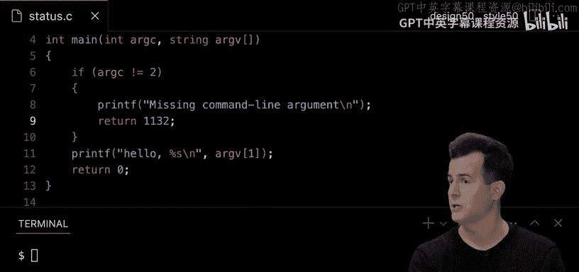

The way we encrypted this is CS50 earlier it's pretty simple like we just changed every letter by one position we now all these minutes later have the ability to analyze text if a human types in something with get string you now have the tools to iterate from left and right to infer how what's the reading level of this person how do I convert this cipher text to plain text so to speak or vice versa we have the ability now to manipulate text already now in week two so how might this be useful One encryption is the process of scrambling information but in a reversible way it's sort of useless if you just scramble it and can't get the original back so encryption is meant to be reversible so here is the mental model you might have whereby your inputs and outputs as always become plain text which is the original message in English or whatever human language the cipher text is the scrambled version thereof what's in the middle the black box this week is always an algorithm implement it perhaps in code。

 but a cipher is the type of function that。Cphers information from plain text to cipher text。

 So it's just some terms of art here。 But the catch with the cipher is that it must rely on a secret。

 And so there's a secret value， generally known as a key that is provided to ciphers as a second input。

 after all， if all of us were using the exact same cipher in the exact same way。

 we could all decipher or decrypt each other's messages。 if it all works the same way。

 But not if we all choose a secret key， like a big random number that only I and the recipient know。

 then you guys can use the exact same algorithm， but without my key。

 you're going to be trying all day long to figure out what my key was。

 at least so long as we pick a big random enough value。 So how does that work， given the plain text。

 given a key， we can encipher the information to spit out that cipher text。 So for instance。

 if the input plain text is high exclamation point。

 and the key for the sake of discussion is super simple and one， what can we do well。

 the output would be。IJ exclamation point if you're using an encryption algorithm known as the Caesar cipher。

 so back in the day when the whole world was not really familiar with encryption algorithms yet because we're talking hundreds of years ago。

 they didn't have to be that sophisticated because if no one else was thinking to do this。

 you might as well just add one to all of your letters or something like that。

 so generally it's believed that Caesar was among those who used rotational or ciphers like this whereby a becomes B B becomes C or maybe you use bigger numbers and rotate more than one place it's pretty secure if you're the only one on the planet doing it at that time。

 Meanwhile，1 plus high would give us IJ exclamation point because I plus one gives us H plus one gives us I and I plus one gives us J and in this scenario numbers punctuation just gets passed through unchanged which is why I leaked the number 50 before even though this is C was properly encrypted Meanwhile。

 if we want to make things a little more sophisticated， we could use 13。And in fact。

 a special case of the Caesar cipher with an input of 13 on the internet is called Ro 13， R Ot13。

 which just means rotate the letters 13 places。 so adding 13 to H and I gives us U and V。

 If you got too close to the end of the alphabet， you just wrap around from Z to A。 and in fact。

 that's going to be one of the challenges for this coming week's problems is to figure out if you're encrypting something with letters of the alphabet that are a little later。

 how do you indeed wrap around so you get back to A's and B's and C's。Meanwhile。

 if we do something that's a little more compelling。

 like you wanted to pass a note to someone in class yes year and you're worried about the teacher intercepting it。

 and that message is super sensitive。 like I love you。 well。

 you probably want to use something bigger than one， maybe 13。

 because a teacher upon seeing this written on a sheet of paper probably isn't going to try and probably isn't going to care to decrypt it。

 but they could。 if we're only using a relatively small key of one or 13 or 14 or 15。

 they could if they really cared， just brute force their way through it。

 And this is actually a technical term， much like in yesterear。

 sort of using a battering Ram to like brute force your way into a castle door， for instance。

 brute force digitally means try one， try2， try3， try4 dot dot dot try all possible keys and eventually the plain text is going to pop back out if you have enough time。

 So the world has much fancier encryption algorithms nowadays than this。

 but we begin by using this as representative of those。 The math has of course。

 gotten more sophisticated。 This is not a good key to use。

There's this internet joke for sort of people in the know online and on Reddit's like。

 oh Ro 26 is twice as secure as Ro 13， Why is that funny？Right's the same thing， A to A， B to B。

 right， This just literally gives you the same message。 So don't believe everything you read。

 for instance， online。 So what about decryption， Well， in the case of the Caesar cipher。

 it's just the opposite instead of adding one or adding 13， you subtract one or you subtract 13。 So。

 for instance， here might be a message， a little different from the one with which you begin。

 whereby if we subtract one from each of those， we can decrypt this。 So for a final flourish here。

 And for a taste of what lies ahead for problem set 2， what happens if you subtract one from you。

 What do you get。T and then。H， and then I， and then S and thenoo W， A S， T S， And this was C， S 50。

 We'll see you next week。😊。

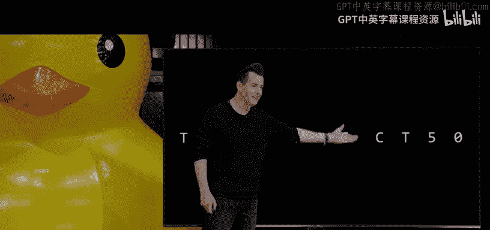

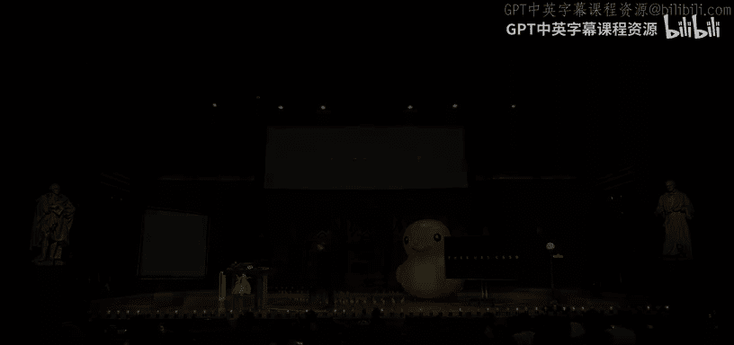