# 哈佛大学《CS50X 计算机科学导论｜introduction to computer science 2025》中英字幕（deepseek - P9：-09-CS50x 2025 - Artificial Intelligence.zh_en - GPT中英字幕课程资源 - BV1hFrxYPEfa

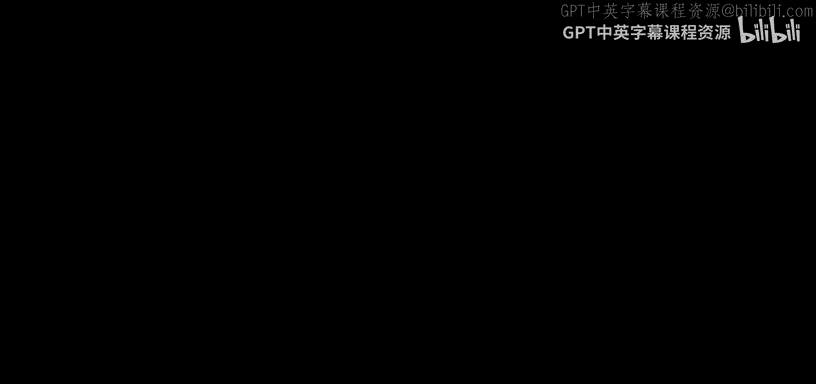

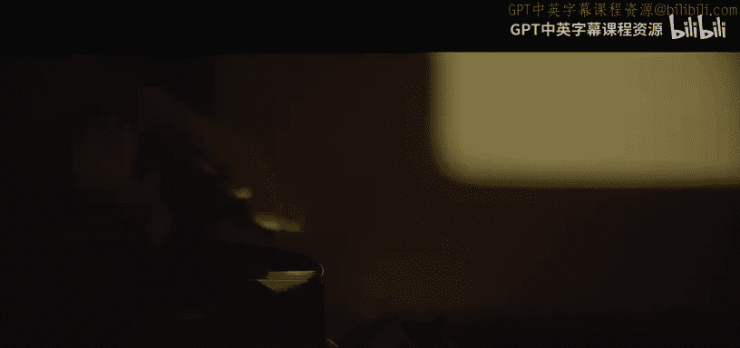

I'm going to show you some magic。It's the real thing。I mean。It's all。The real。Think。

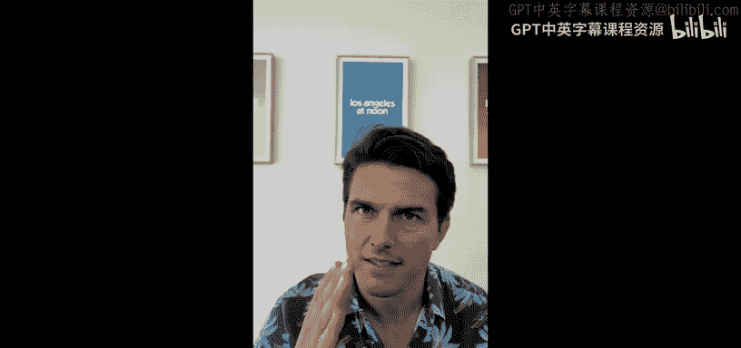

Yeah。Alright， this is C S 50， and this is a family weekend here at Harvard College。

 We have lots of parents and siblings and other relatives here in the group。

 and this is meant to be a family friendly lecture on artificial intelligence or AI。

 My name is David Main and I am your instructor today。 and in C S 50 for some time。

 we have had this tradition of giving every student in the class a rubber duck like this one here。

 whereby the third or so week of the class， we hand these out in the idea that if students are struggling with some concept or they have some bug or mistake in their code。

 they are encouraged to literally talk to the rubber duck。

 and in that process of verbalizing what confusion and questions they're having invariably that proverbial light bulb tends to go off Now。

 some years ago， we actually virtualize this rubber duck and implemented a software version of it。

 whereby students， for instance， could open up a chat window in C50's programming interface。

 They couldin to converse with this here virtual duck。 I'm hoping you can help me solve the problem。

 And then randomly once。😊。

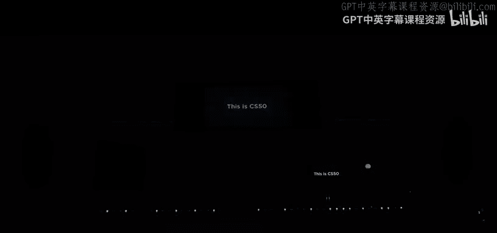

iceOr three times with this duck quack back in response。

 We have anecdotal evidence that this was sufficient educationally to actually prompt the student to figure out what was going wrong because they had already verbalized their confusion。

 but much to the surprise of some of these students predecessors just over a year ago。

 did the duck literally overnight in spring of 2023 start talking back to them in English。

 And that is all because of Under the hood now is indeed some artificial intelligence。

 So among our goals for today is to give you a taste of artificial intelligence and in Cs50 itself。

 but to also give you a sense of how this technology itself works。

 because it's certainly not going anywhere， it's only going to become all the more omnipresents most likely。

 So hopefully at the end of today's hour， you will exit here all the more of a computer person。

 But the talk of the town has been specifically something called generative AI like AI as a field of computer scientists been with us for decades。

 but it really has made exponential improvements in recent months。Recent years。

 But the focus of late has been on degenerative AI。

 whereby we're using some form of artificial intelligence to generate stuff。

 and that stuff might be text。 That stuff might be images。

 That stuff might be video content and so much more in the years to come。 In fact。

 the Tom Cruz that you saw agreed us just a moment ago was not， in fact， the real Tom Cruise。

 But a so-called deep fake， which we introduce today's class with playfully， of course。

 but there's actually serious implications suffice it to say when it comes to information。

 disinformation in the world。 But for today will focus really on the underlying technology and know how So want to make this as participatory to as we can。

 And so over the past couple of years， lots of publications。 The New York Times among them。

 has sort of tested people's ability to discern true from false reality from artificial intelligence and the New York Times。

 for instance， put together a sequence of images that we thought we'd share with you。

 I'm joined by C50's preceptor here up on stage。 Julia。

 who's going to help guide us through a sequence of multiple choice problems。😊。

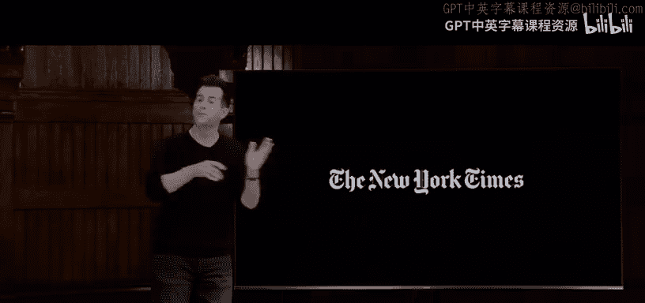

If you will， the first of which is going to be this one here， Two images， one left， one right。

Which was generated by AI left or right。 And if Julialia。

 you want to switch over to our special software， we'll see the votes coming in。

 Looks like 80% of you are voting at the moment for right。 The left is making some progress here。

4% or so unsure。😊，Think that's pretty close to the right winning。

 Let's see what the correct answer is。 If Elio， we could switch back to this。

 The answer was indeed the one on the right。 and why is that who someone who voted right。

 Why did you say right。Feel free to just shout it out， yeah。Why right， why right？Okay。

 so it's more clear， See a little more vivid， maybe a little too good。 Okay。

 so pretty good heuristic， but still 20% of you got that wrong。 So let's try one more left or right。

 which was generated now by AI。😡，Left or right， which was generated by AI。

 Let's toggle over and see what the responses are looking at this time。

 looks's youre just switched your most confident answer here。

 So 70% just under or voting now for the person on the left。

30% person on the right about 5% still unsure。 we toggle back to the two photographs。 unfortunately。

 to question， both of them were generated by AI。 So it's getting harder already indeed。

 and it's only gonna get their say impossible before long。 Well。

 let's turn our attention to text because clearly that's what underlies something like C5's own rubber duck。

 Heres a headline from the New York Time some months ago did a fourth grader write this or the new chatbo and a chat chatbo is just a piece of software that converses with you textably and invariably soon via voice as well。

 This test is textual。 And I'll read it aloud1。 I like to bring a yummy sandwich and a cold juice box for lunch。

 And sometimes I'll even pack a tasty a piece of fruit or bag of crunchy chips。 as we eat。

 we chat and laugh and catch。😊，UOn each other's day。Ssay 2， my mother packs me a sandwich， a drink。

 fruit and a treat。 When I get in the lunchroom， I find an empty table and sit there and eat my lunch。

 My friends come and sit down with me。 So one of those was written by a fifth grader。

 One of those was written by AI， which was written by AI， S1。😡。

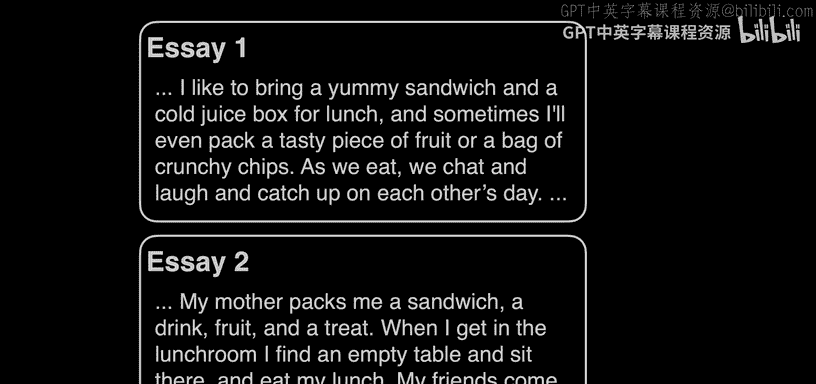

Or SA 2， let's see the votes as they come in。😡，So similar percentage。

 So maybe it's roughly the same group of people for each of these votes。

 having switched last time and now stayed in the lane， about 76% essay 1。

23% essay to fewer people are now unsure。 So that's progress。23%。 So still indeed， progress。

 Let's go back and take a look。 The answer in this case was S1 was the AI。 And here， too。

 it's not necessarily obvious， but I'm not sure how many5 graders say they catch up on each other's day in middle school。

For instance， So this， too， though， is only going to become more of a challenge。

 Thank you to C S50's preceptor Julialia here as we and maybe a round of applause for I having choreographed that so perfectly。

 Thank you， Julialia。😊，So where do we begin So in CS50 in spring of 2023。

 we indeed began to embrace artificial intelligence in some form。

 We were not sure quite how we weren't quite sure how well it would work。

 This has all been very much an experiment， but chatttpt itself as you might recall。

 only came out about 23 months ago in November of 2022 and how quickly the world seems to have changed already。

 but at least in our educational context， this is sort of the premise from which we begin all of CS50's work and development with AI is that chattypt and being and clawed in tools like it。

 they're just too helpful out of the box educationally， as you yourselves might have experienced。

 they're all too willing to just hand students answers to problems。

 which is great if they just want to get that answer， but if they want to learn the material。

 certainly if a teacher wants to assess their understanding the material all too willing to just handout answers rather than lead students to successful outcomes and so we actually put two years ago almost in CS50 syllabus that it's not reasonable to use chatttP or similar tools we can't prevent it technologically but we do communicate。

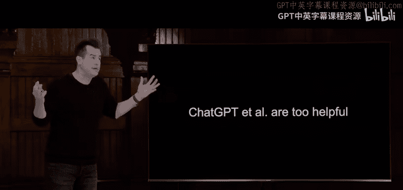

Both ethically and through policy that it's indeed not allowed and thus not reasonable。

 but we do think it reasonable to use CS50's own AIbased software。

 including that virtual rubber duck in several different forms。

 only one of which you've glned glimpsed so far which indeed is designed to lead students to solutions but indeed not hand them to them outright so we thought we share with you then a taste of how this duck is implemented。

 but then in turn how artificial intelligence is making all of this work and here for more of the engineering folks in the audience。

 the computer persons is an architectural diagram of what that CS50's team has been building over the past couple of years including CS50 AI。

 which is like the central server that runs all of this it provides of course students with a very user friendlyly interface。

 including a rubber duck but we also have a local vector database as they're called these days where we actually after every lecture convert for better for worse。

 everything that comes out out of my mouth to text。

 then run it through a database of ours so that it can then be searched not only by students but in turn this under。

😡，AI and all of this is built on top of third party tools。 So we have not reinvented the wheel。

 We have not built our own large language model， as these things are called， as we'll soon see。

 but we're building on top of things called As application programming interfaces。

 which are third party services that the open AIs， Googles， Microsoft and others provide。

 so you can build your own tools。 Education nature in our case here。 Now。

 as for what this looks like， for instance， this is just one of the views。

 your own student or child can perhaps give you a better sense。

 but this is the chat interface as students experience it in CSs50。 similar in spirit to chat。

 And indeed for now， we do have disclaimers that it's not going to be perfect。

 there are things called hallucinations that we on occasion might suffer from as well more on that soon。

 but here is a representative question that a student might ask。 Bless your hearts。

 but unfortunately， this is about as detailed as the questions get some time。

 My code is not working as expected。 Any ideas And so the duck upon seeing not only that question but the student code actually and with a way。

I a hand I'll stipulate today the Duck debugger or DDB doesn't just answer the question outright。

 but responds with something like this。 it looks like you're trying to add to integers。

 but there's an issue with how you're handling the input。

 what data type does input return and how might that affect your addition So ideally behaving like a good teacher a good tutor and interactively having the conversation with the student not always perfect。

 but pretty darn good already out of the box and surely as industry progresses it's only going get better and indeed the conversation will only get richer and more involved for students Now besides our students here in Cambridge。

 besides our students down the road in New Haven at Yale。

 we actually have a very rich history of opencourseseware in CS50 where everything we do curricularly and technologically is freely available to anyone around the world teachers and students alike so to date in spring of 2023。

 we have some 201000 students and teachers already using this here Duck that's averaging 35000 prompts or questions per day a total of 9。

4 million as of this morning。

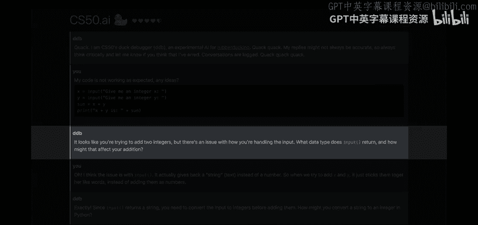

Not only are our own students here， but really the world is starting to embrace these tools。

 whether it's off the shelf like ChattPT or ducks like ours here So the overarching pedagogical goal though and the utility as our own students probably know by now is really to provide this students with 24。

7 office hours， one on one or duck on one opportunities for help with the courses homework assignments and more and to approximate really what is the holy grail I dare say educationally。

 a one to one student to teacher ratio， which even in a place like Harvard or Yale where we have the luxury of lots of teaching fellows are teaching assistants。

 many of whom are students themselves， we still might have in-class ratios of one to6。

1 to 101 to 20 which is great but in you think about this as we often do even if you have just six students in a room at office hours and that office hour is indeed an hour that's like 10 minutes per student which for the struggling student has never been historically enough time necessarily for that in-person interactions and so with software now we hope to continue to leverage the exact same humans。

We have， but allocate those same resources ideally to the students who need it and benefit from it most while allowing those students more comfortable to indeed interact virtually if they prefer any time of the day with this duck。

 So as for what then is powering this duck and similar technologies underneath it is sort of a new term of art that you might have heard in the real world that have prompt engineering So we've got these AIs out there chat U among them。

 and it's become a skill， sort of a LinkedIn thing， dare say better or for worse。

 to know prompt engineering， which essentially means how to ask good questions of an AI generally in English。

 but really in any human language， it's a little bit hackish。

 this is not really an engineering skill as much as it is just getting acclimated to what kinds of patterns of questions tend to induce the AI to respond to you better like being good at Google searches。

 This is not something that's probably going to be a necessary skill before long because the software is just going to get better But in essence。

 what prompt engineering means is that someone somewhere。At least written for the AI。

 a system prompt， a set of instructions usually in English that tell the AI how to behave what domain of information to focus on and so forth。

 So for instance， in the case of CS50 when we built our duck on top of open AIs As we literally tell open AI this in CS50's socalled system prompt unquote you are a friendly and supportive teaching assistant for CS50 essentially coercing the underlying version of chat Eptt to behave in a CS50 specific way。

 But our second sentence in our so-called system prompt is this you are also a rubber duck and that is enough to coerce some degree of quacking or other similarly adorable behavior。

 but we further go on to tell the AI answer student questions only about CS50 in the field of computer science。

 do not answer questions about unrelated topics do not provide full answers to problem sets as this would violate academic honesty and then in essence we say answer this question and we copy and paste whatever the student has typed into the window their question which is。

Generally known as a user prompt， much like you might type into chat G so that not only does the underlying AI know what the question it is。

 it has this system prompt for additional context so that it behaves unlike the default and more like a pedagogically designed rubber duck in our case。

 In fact， let's see how we might implement this in code。

 Let me go over to a program I've got running on my machine here already。

 which students know as V S code visual studio code， which is the programming environment。

 we and lots of folks in industry use。 I'm gonna run a command called code chat dot pi。

 And I'm gonna implement the simplest of chat bots here live in a language called Python that we just learned a few days ago。

 I'm going go ahead and say message equals input。 maybe something like what's your question question mark。

 And what this line of code is doing for the parents and siblings in the room。

 This is what's called a variable similar and spirit to mathematics， like X Y Z。

 But I'm using an English word instead， input is a function， like a verb that will tell the computer。

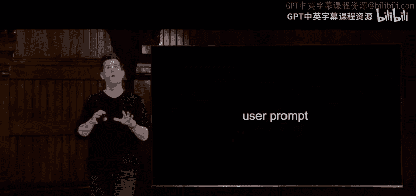

What to do for me。 in this case， get input from the user。 And in quotes here。

 I have the prompt or the question that I want the a computer to ask of the human。

 Then I'm gonna go ahead and do this。 print quote unquote quack quack quack。 So in essence。

 this was like version one of our rubber duck。 And if I run this program now with a command in the bottom of my screen Python of chat do and hit enter。

 you'll see that the cursor is now waiting for me to provide my user prompt， if you will。

 how about what is a I question mark。 And that was it for sort of version 1。

 But I dare say if you'll humor me and let me just type somewhat quickly a little more advanced code that even ourRC 50 students this past week have not yet seen。

 I can actually turn this into an artificially intelligent duck as well。

 So let me clear the bottom of my window and hide that for a moment。

 And let me start doing a few things。 Then I'm gonna wave my hand to some extent。

 but I'll explain a few of the lines as we go。 So I'm gonna first import some functionality relating to the underlying operating system。

 I'm then going to import for a。EV， a dot environment， a function called load dot N V。

 which is just gonna make it easier for me to talk to open AI without having to like log in and do a bunch of stuff that I did in advance of class already。

 And I'm going call that function called load dot E V right away。 After that。

 I'm going import from a library I already installed called open AI。

 which they make freely available to us And anyone else。

 And'm going import a feature called open AI capital O capital AI。

 I'm then going create another variable called client， which refers to like the software I'm writing。

 And I'm going to set that equal to whatever that functionality that feature does for me。

 Open AIs feature。 And I'm gonna specify that the API key that I want to use is equivalent to whatever is in my operating systems environment in a special variable called API key。

 which again， I configured before class。 Just saving myself the trouble of log in with a username and password here。

 All right， What do I do next， Let's first define a system prompt now in a third。😊。

And that system promptly reminiscent of what we actually do in C 50。

 You are a friendly and supportive teaching assistant for C 50 period。 You are also a do period。

 And that's it。 Now I'm going go ahead and create a fourth variable called user user prompt。

 set that equal to the input function， which we saw briefly earlier。 And I'm just gonna to say。

 again， what's your question question mark。 But now I'm gonna to do something whereby I'm talking to open AIs API passing to open AI。

 my system prompt and my user prompt together。 So it behaves in the way I want。

 I'm going to create another variable called chat completion， set that equal to this function。

 which is a mouthful client do chat do completions dot create open parenthesis。 Then on a new line。

 just so it doesn't look messy on the screen。 I'm gonna to say that the messages I want to send to open AI is this list of messages for students from this past week Me。

😊，I thus a named parameter， but it's just a parameter to a function。

 And the square brackets mean this is a list。 The list I'm going to provide it has two things。

 two Python dictionaries， sets of key value pairs。 The first is going to say special keyword here。

 Ro colon system and then the content for this role is going to be the system prompt variable that I defined earlier。

 So this is passing to open AI， the system prompt。 Then I'm going pass in one more of these things where the role this time is going to be that of quote unquote user。

 Then the content of that is going to be the user prompt， which the human typed in。 After that。

 I'm going to specify one other named parameter， which is to say the model I want to use is something called G 40。

 which is the latest and greatest version with which some of you might be familiar in the real world。

 I know it's a mouthful， but we're almost done。 Now I'm going to go ahead and create a final variable response text to literally look at the text that comes back from open AI。

 I'm going to set that equal to the chat completion。😊，able choicesices， attribute。

 the first element therein， starting at 0， the message therein and the content thereof。

 And then lastly， finally， I'm going to print out that response text。

 Now I don't normally write this many lines of code all at once in class。

 So I'm going to cross my fingers big time now。 reopen my terminal window， run Python of chat dot pi。

 I'll increase the size of my terminal just so we focus on this。😊。

Hopefully I made no typographical errors。All right， let's ask again， what is AI question mark En？Oh。

I okay， some of you knew that。 Thanks a lot。 Okay， so response text。 Oh， the last line， too， okay。

Alright， so that's a bug， as we call it in programming。 Let's run this again。 Python of chat do I。

Okay， what is AI question mark？

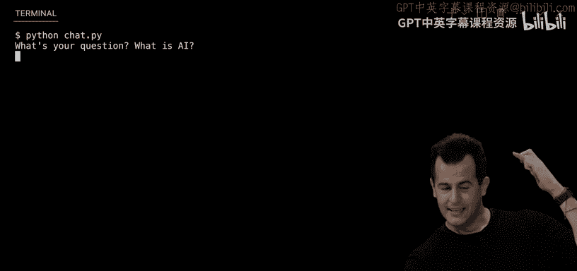

There we go。 AI， your artificial intelligence refers to the simulation of human intelligence and machines that are programmed to think and learn like humans。

 dot dot， dot， some other educational stuff。 And quack at the end， which was generated for us。

 So thank you。😊，So suffice it just today， we've spent a lot more time。

 The whole team of C 50 spent a lot more time building the fancier version of chat doie。

 That is C50 AI itself。 But that is it in essence as to how people like us are building on top of today's AI to build very specific applications that hopefully leverage them for better instead of for worse。

 But how did open AI make all of that possible。 How do these large language models。

 ChatT and in turn C 50's duck work。 Well， let's consider ultimately。

 what has been getting developed over the decades now underneath the hood that defines what AI is。

 But before we go in that direction。 let me propose that， we look at。

Not only generative artificial intelligence， which is， again。

 the use of AI to generate content as we just did in text。

 but specifically artificial intelligence more generally。

 So here's where we take a spin through the world of AI。 So AI has been with us for years。

 even though we only really started talking about it every day in the past couple of years。

 Any of us who've been using Gmail or outlook or the like the spam filters have been getting pretty darn good。

 It's pretty rare。 at least with most big mail programs nowadays where you have to manually deal with spam。

 It's often going into your spam folder。 But there isn't some human who works at Google or Microsoft who looking at all of your email。

 or even all of the email coming in and saying spam not spam spam that would just not be feasible nowadays。

 So somehow AI is inferring using some kind of techniques or algorithm。

 step bystep instructions for solving problems。 What is spam and what is not。 It's not perfect。

 but hopefully it's usually correct。 And indeed that's the behavior we might want。

 Handwriting recognition on tablets and phones on the like。 This has been using AI for years。

 because no one at Microsoft or Google knows what your specific handwriting looks like。

It looks similar though to other people that have trained the AI watch history。

 the Netflix and other streaming services are getting pretty darn good at recommending based on things you have watched and maybe up votedted or down votedted similar shows or movies that you might want to watch as well that too has been AI and then of course all of these voice assistants like Siri and Alexa and Google assistant。

 they don't know your voice specifically but it's pretty similar to other humans voices and so they learn and figure out how to respond to not only the Google and Microsoft employees but to your and my voiceice as well and then of course we can actually go way back to things like the one of the earliest arcade games which some of you might have played as a kid this here being pong it's of like a tennis game where two people move the paddle up down and up down and bounce the ball back and forth so it turns out that games is a nice domain in which to start talking about AI because one it's fun but two it also tends to have very welldefined rules and goals like maximize your score or minimize the other persons score。

😡。

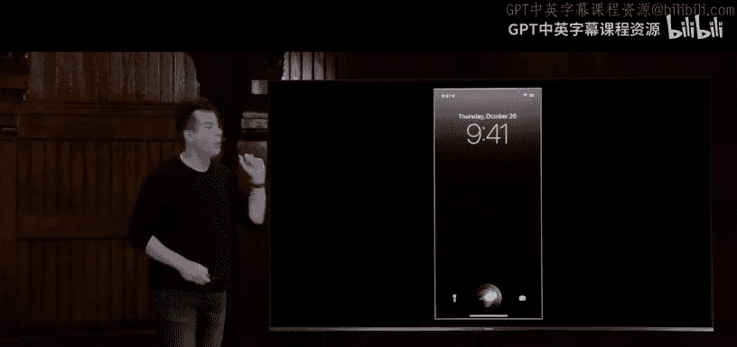

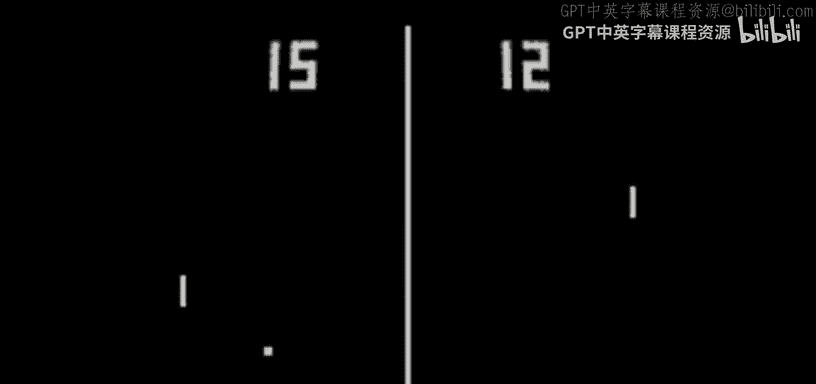

In fact， here's another incarnation of really the same idea。

 This was an arcade game that came out later called breakout exists in many different flavors。

 But in this case here， things are sort of flipped around。 There only needs to be one player。

 And the idea is with this paddle， you bounce this ball against the bricks and the bricks disappear once you break them。

 And therefore， the goal is to get rid of all of these bricks。

 But even just based on this screenshot， Like odds are all of us as humans have an instinct for which way the paddle should move。

 If the ball just left the paddle and went this way。

 Which way should the paddle be moved by the human left or right。I mean， obviously to the left。

 if this thing is gonna bounce or reflect off of that first brick。

 So there's a very welldefined heuristic that even we have ingrained in us already。

 maybe we can translate that to code and something a computer can ultimately do Well。

 the first way we'll try thinking about this actually comes from like the class before us 10 or decision trees or from strategic thinking more generally whereby you can actually draw a picture like a tree in programming that we've seen in week5 of C 50 where you have some root node where you begin and then all of these different children via which you can decide yes or no。

 do this thing So a decision tree for something like the game we just saw could be a drawn like this is the ball to the left of the paddle If so then go ahead and move the paddle left。

 which is what everyone's instinct here was but if the ball is not to the left of the paddle。

 then you should ask a second question， you shouldn't just blindly move to the right because there's actually three scenarios here。

 even if not-ob is the ball to the right of the paddle that too has a yes no answer。 if yes。

 then obviously move the paddle to the right， but。No。

 then you should probably don't move the paddle and stay where you are。 So not very hard。

 but now you can imagine， especially if you're in C S 50 or you're a computer person。

 we could probably translate this to some kind of code in some language because it's very much based on conditionals。

 if else if else， so to speak。 So what does that do for us。 Well。

 we could translate this to pseudocode， English like code that we might write in C 50。

 while the game is ongoing。 if the ball is to the left of the paddle， then move the paddle left。

 else if the ball is to the right of the that's atypo second bug， sorry。

 if the ball is the right of the paddle， move the paddle right， else don't move the paddle。

 So there's perfect translation from decision trees as a concept and as a picture to the code that we've been writing over the past several weeks and any number of languages。

 But let's try a slightly more sophisticated game that most of us probably grew up playing on like pieces of paper and napkins and the like that oftictk toe for those in familiar。

 It's a three by three grid， you play x's or O's is two different。😊。

PeopleAnd the goal is to get three in a row，3 x's either horizontally vertically or diagonally and whoever achieves that first wins unless it's a high。

 Well， Tit toe lends itself to a pretty juicy discussion of decision making。

 because there's a lot of different ways we could play even the simplest of these games。

 So for instance， if we are considering here， this board where X and O have each gone once。

 let's consider what should happen next in particular， if we translate this into a decision tree。

 whoever's turn it is should ask themselves， can I get three in a row on this turn Because if yes。

 well， then they should play in the square to get3 in a row period。

 But if they can't get3 in a row on this turn， they shouldn't just choose randomly。

 they should probably answer another question for themselves like this。

 can my opponent get3 in a row on their next turn。 Because if they can。

 then I want to block them by playing in the square to block the opponents3 in a row。

 But here's where things get interesting， if the answer is no， where do I go， Well， if there's only。

😊，One space left is pretty obvious。 go there。 If there's two left， which is better。

 If there's three left， which of those is better。 and the further you rewind in the game。

 the less obvious it gets where you the human should go。 That said。

 there is an algorithm for solving this problem optimally。 In fact， I'll disclose now。

 if you ever lose tick ta toe， you are objectively bad atic ta toe。

 because there is a strategy that won't guarantee that you'll win always。

 but there is a strategy that will guarantee that you will never lose。

 you can at least force a tie if you're not going to win。 So with that set and sort of bubble burst。

 perhaps let's consider how we can go about answering the question mark part of the tree。

 especially when the game starts super early like this。 where does O go to play optimally。 Well。

 what we could do is this。 recognize first， that with this particular game。

 we have these inputs and outputs that can be represented mathematically more on that in just a moment。

 But the goal of Tt toe then can be said to be to maximize， maybe or minimize a score。

 maybe X wants the biggest score possible。Once the smallest score possible for instance。

 specifically let's do this let's talk about an algorithm in computing called minimax and as the name implies this is all about minimizing and maximizing something which is really whattict O we can see is all about for instance here are two sample boards of Tt O on the left is one in which O has one on the right is one in which x has one and in the middle is one that's a tie doesn't matter what numbers we use。

 but we need to agree so let me propose that if O wins。

 we're going to call the board a negative one value if x wins it's a positive one and if no one wins it's a zero as such it stands to reason that x's goal in life now is clearly be to maximize its score and o's goal in life is to minimize its score we can flip the numbers around it doesn't matter but we sort of reduced a fairly fun childhood game now to boring mathematics if you will but in a way that we can now reason about it and quantify just how easy or hard this game is as each of x and Y of each as x and O aspire to maximize or minimize their score respectively。

😡。

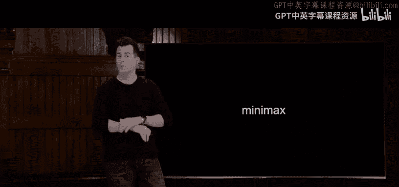

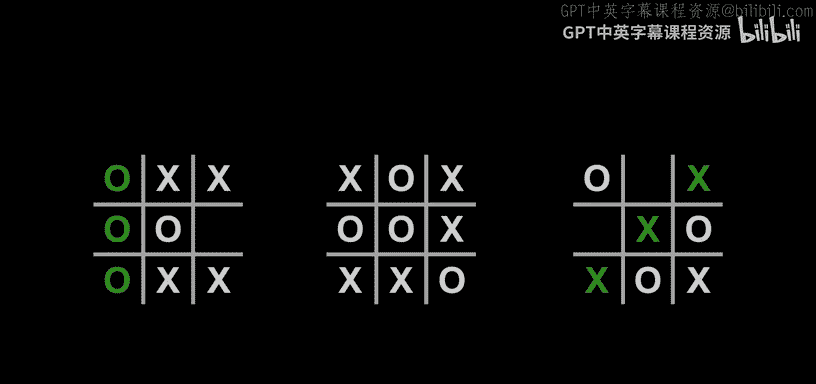

Here then in the board in the middle here is one little sanity check。

 What is the value of this board on the screen per my definition a second ago。I heard one。

 I heard zero。I had -1。 Great。 We're seeing the range of answers。

 The answer here is going to be one because I do see that x has one。

 And I proposed earlier that if x has one， the value of the board is a1。 So again， if x wins。

 its one If O wins， it's a negative one， those are the correct answers for Tit toe here2。

 and a tie means0。 So let's back up one step Here is a board that's got only two moves left。

 suppose now that it's o's turn， where should O go Now you might as a x Tt toe player have an immediate instinct for this。

 but let's break it down into some decisions。 So if it's o's turn， O can ask itself。

 what is the value of this board because I want it to be negative one or borrowing that。

 I want it to be0。 Well what's it gonna be Well， if O goes in the top lefthand corner。

 what's the value of this board。 We're not sure yet because no one has one Well。

 if then x goes invariably in the bottom location there。

 darn it now x has one So the value of this board way down here is by definition one。

 there's only one way logically to get from this board to this board。 So we might。

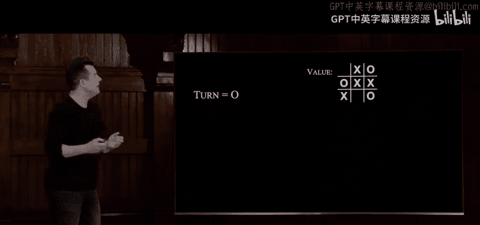

Well， by transitivity， say that the value of this board is one。

 even though it hasn't been finished yet， because we know where we're going with it。

 So that then invites the question is this board any better。 So if O goes bottom middle。

 what's the value？ Well， the only place x can go is top left And now the value of that bottom right board is actually better。

 It's a0 because no one has one。 logically， the value of this board might as well be considered one a0 as well because that's the only way to get from one to the other。

 So now the decision for O is do I want value 1 or do I want value 0。

 O's goal as I defined it is to minimize its score，0 is less than one， So O had better go to Sorry。

 O had better go to， then the bottom middle location。 And the value therefore。

 if this board is ultimately gonna be 0。 So this is to say， if you play like O just did。

 you won't always win， but you will never lose because you can choose between the right paths in the tree。

 Now， the problem is even if you're on board with that algorithm。

 let's go one step back such that there's not two places left but three。Unfortunately。

 the size of this decision tree is essentially doubles。 In fact。

 it's an exponential relationship because now there's 1，2，3 spaces in the board。

 If we remove one of those and we go to four moves left， the tree doubles again， remove another。

 the tree doubles again。 And so the initial board of decisions that you might need to consider for Tt toe actually gets really。

 really darn big。 more so than you might imagine， In fact， in the world oftict toe。

 If we implement it exactly like this。 If the player is X。

 for each possible move that is in a loop in C50 speak， consider every possible move。

 calculate the score for the board。 and then choose the move with the highest score， just like I did。

 So this is the pseudocode for what we just walk through verbally。 if the player is O， though。

 for each possible move， calculate the score for the board and then choose the move with the lowest score。

 So in other words， if both X and O are sort of thinking is many steps ahead as they can。

 they can either win or force a tie， and I claim never lose according to this algorithm。

 But here's the rub。 how many different。😊。

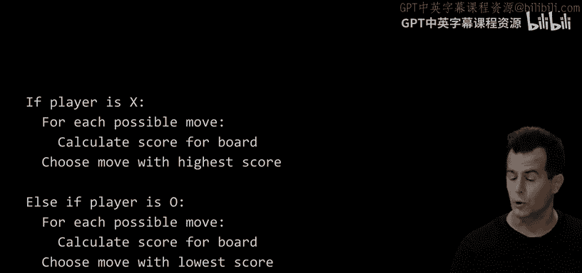

ays are there to playtict toe。 You might have bored of it years ago as a kid。

 but you surely did not play all possible versions oftict toe with your brother or sister growing up。

 for instance， why there are 255000 ways to play a 3 by three grid oftic toe back and forth back and forth。

 which means that's a really big decision tree， Certainly for a kid to keep in their mind。

 let alone waste the time sort of figuring all of that out to be fair。 computers。

 no problem considering 255 different255000 different ways to play a game。 They have lots of memory。

 They have very fast processors nowadays， drop in the bucket for a computer， big deal for a human。

 But what about other games that are more sophisticated thantict toe。 Some of you might play chess。

 And will keep chess simple。 If you consider only the first four pairs of move。

 So one player goes than the other。 Then again， then again， then again， So  four pairs of moves。

 How many ways are there for those two humans to play the first four moves of chess。

 over 85 billion ways。

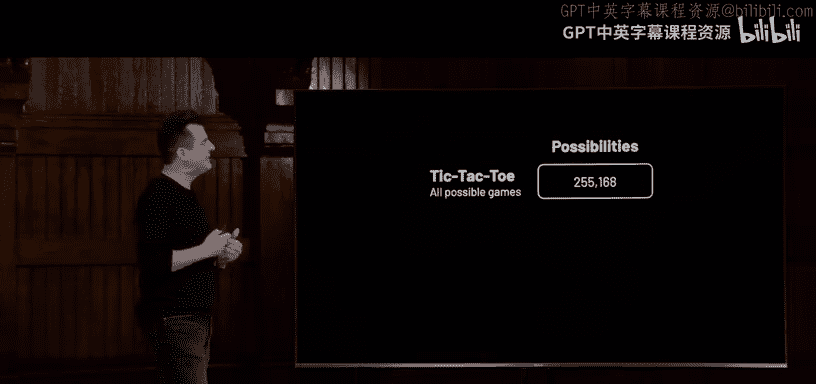

Because of the various permutations on a normal chessboard。 if you're familiar with the game of go。

266 quintillion ways to play that game， there's no way with our current computers that they can possibly think that many steps ahead and then make a lot of decision tree and optimal decision。

 So even the IBM Watsons of the world with which you might be familiar playing jeopardy years ago and the like they were really doing their best to approximate correct answers。

 but they were not taking all day long or all of our lifetimes to crunch all of those numbers to get through those numbers。

 So here really then is the motivation for actual AI。 Everything we've talked about thus far。

 the world called AI， or they called the computer， the CPU player。

 but it was really just code written with ifs Elts and else to dictate how the ball moves。

 how the paddle moves， who goes intict toe and what order and the like， it's all very deterministic。

 But today is really about artificial intelligence learning and figuring out on its own how to win a game when it can't possibly have enough memory or enough time to figure out。

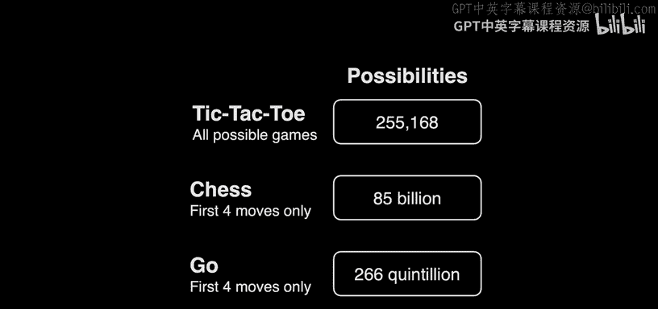

Terministically， the perfect answer。 So thus was born machine learning。

 We're now we're not writing code to tell computers exactly what to do。

 but we're really writing code that tries to teach computers how to figure out the solutions to problems。

 Even if we ourselves don't know the correct answer。

 And so machine learning is indeed about trying to get computers to learn from from available data。

 And， in fact， what we feed to them is input is training data of some sort。

 And there's different ways we can train computers。 One way that we thought we'd introduce today。

 It's called reinforcement learning。 And it's actually relatively simple。 In fact。

 could I get one volunteer Who's comfortable coming up on stage on the Internet。 Okay， come on down。

😊，Come on over here。Maybe a round of applause because this is always awkward。

👏We have no microphone today。 So just talking near me。 What's your name， Max Max。

 and you want to say a little something about yourself。 Hi， I'm Max。 I'm a senior in high school。

 I'm here for family weekends。 Nice， well， welcome， come on over here。

 And we're gonna teach Max how to flip a pancake。 So we've got an actual pan here。

 And we've got a fake pancake here。 And what I'd like Max you to do。

 is to figure out how to flip this pancake up。 So it goes up and around， but stays in the pan。

 And I will either reward or punish you。 So to speak by saying good or。😊，Good or bad each time。

That was actually very good。 Okay， do more of that。😊，That was bad。 Do less of that。Getting worse。

😀Yeah。didnn't really flip。 One more try。All right， it's a round of applause。 Thank you tonight。😊。

👏Here， come on here。We have a little a parting gift for you here。 too。 We would like。 Thank you。

 So the point here is that even though that sort of peaked early there and did really well with the first one。

 But I was sort of rewarding and punishing Max by giving some kind of feedback like good or bad or somehow reinforcing the positive behavior and not reinforcing the bad behavior。

 if you will。 So this is actually representative what we mean by reinforcement learning。

 And if you're a parent， you've done this in some form。

 presumably with your kids over time to get them to do more good behavior and ideally less bad behavior。

 But how might we do this than with code Well， here， for instance。

 is a visualization of a researcher working in a lab with not max this time but an actual robot and we'll see over time that the more we reward and reinforce good behavior。

 the better even a robot controlled by software can get over time。

 without being programmed to move up or down or left or right。

 but just try movements and then do more of the good movements and less of the bad movements。

 So the human is going once just to show it some good movements， But there's no code。😊。

Here in question， there's no one way to flip a pancake correctly。

 And so the first time does worse than max。The third time。Still not so good。Fifth time， not so good。

 but it's trying different movements again and again， that's 10 trials。

The human is now fixing things again。11 trials。No， getting a bit more air，15 trials。Still bad。

 but if we start too fast forward to 20 trials。是。😊，Now， just another angle of the same。

 So all of these movements can be broken down into X， Y， and Z movements。

 So when we say do more of that， it can do more of the X， more of the Y， more of the Z。😡。

But it's really trying to infer。 And now it's sort of picking up what to do more of。

 And it seems to be repeating the good behavior such that after 50 such trials。

 the robot is able now to do this again and again and again。

 So that then is reinforcement learning So Max you are well taught growing up it would seem for that particular exercise。

 But let's consider now the implications of using reinforcement learning in other contexts。

 and see if this is solves all problems for us。 Well。

 heres a very boring distillation of a game that's like a maze。

 whereby this might be the player in yellow here， the goal is to get to this green exit。

 And then the rest of the floor may or may not be lava。

 whereby there could be some red lava pits that the yellow dot does not want to fall into。

 So the best this player can do is really try randomly up down left right。

 And when it falls into a lava pit， do less of that。 But if it doesn't do more of that。

 So for instance， suppose that we know with the bird's eye view here， where the lava pits are。

 supposeose that the yellow dot gets unlucky and trips into the one first。 So now we say。

Don't do that。 And so it can use a little bit of memory as represented by this darker red line。

 Like let me not go there again。 That was a bad decision to make。 So now I have a new life。

 Just try again。 So the yellow dot now tries this， maybe it tries this。

 maybe it then falls into the same lava pit， not realizing because it does not have the same bird's eye view as us that it fell into a lava pit again。

 So let's remember with a bit of memory or Ram do less of that。 again， again， again， lava pit。

 that's okay， let's use a bit more memory to reinforce that bad behavior negatively， again， again。

 again， okay， bad， but we're making progress again， again， again， And now I think the yellow dot。

 know， just by luck， might find its way to the green output。 And so this is a success。

 We've now won the game。 but we haven't necessarily maximized our score。 Why。

That was a correct solution， but it could get there much less。 Yeah。

 it could get there in fewer moves by going more like a straight line。

 even though it still has to go up down left right。

 It didn't really need to take this circuitous route。

 But the problem is if that you only reinforce the good behavior， and then you stick to your guns。

 you may never maximize your score by just following the path with which you're most familiar。

 And so there's this principle actually in computing， whereby ideally。

 this thing would know that yes， this is a correct solution as per the green recollections。

 But what if we start exploring a little bit nonetheless， whereby each time I play this game。

 even if I know how I can win， let me just with like 5%，10% probability， try a different path。

 This is something you can actually practice in the real world。

 As soon as I learned about this principle in computing， I realize that， oh。

 this explains my own behavior in restaurants， whereby if I go to a restaurant for the first time。

 I choose something off the menu and I really like it。

 I will never try anything else off of that restaurant' menu， because I liked it well enough。

 But who knows if there's an even better。😊，Dish on that menu。 problem is。

 I tend to in the real world， Exp knowledge。 I already have。

 I really reinforce that first process of learning， but I rarely explore。

 but maybe we can find better solutions to problems by just exploring a little bit。

 maybe we fail sometimes But maybe we'll get lucky too。

 And so here in pseudocode is how we might distill this idea。 Let's choose some epsilon value。

 just a variable to like 10%。 whatever it is to sprinkle a little bit of randomness in here。

 And then if a random number we choose is less than that value， which will not happen often。

 if it's so small， make a random move instead of going right and following the path already traveled。

 go up this time and see what happens else， make the move with the highest value so to speak。

 So sometimes you will fall into another lava pit。 But again。

 if you do this again and again and again over time， probabilistically you might， in fact。

 find a better path。 And if you let your mind wander for a moment and consider why tools like chat EptT are wrong sometimes maybe they're doing a little bit of exploration for just me and darn it。

 they gave me a wrong answer as。😊，You can think about it being a little bit like that in the real world。

 And so now if we try again sprinkling in a bit of randomness。

 I might very well find a path that as you noted， gets me to the green exit all the more quickly。

 So we can still reinforce good behaviors and punish bad behaviors。

 but by sprinkling in a little bit of randomness in there we can instead ensure that maybe over time。

 we will find an even better solution。 Now we can see this in other contexts as well as if we revisit breakout。

 let me go back now to a video version thereof whereby you might think that over time。

 the best way to play breakout is again， move the paddle left and right very deterministically like we proposed earlier with the screenshot。

 and you will just gradually work your way through the blue。

 then you can work your way through the green， then you can work your through the yellow and so forth。

 But what this video is of is a computer learning by reinforcement learning what to do more of So somewhere there's a human。

 probably giving it feedback that that was good do more of that or maybe。😊。

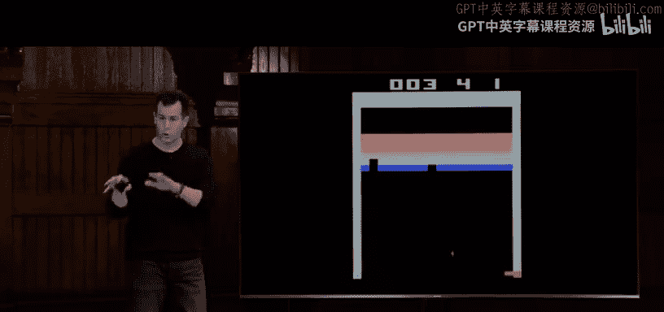

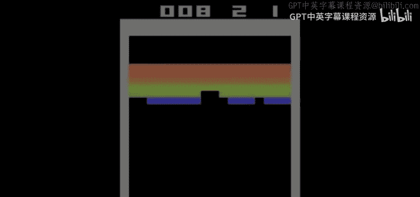

Don't do that or it can be baked into the score based on the color of these bricks。

 And I dare say if we give more points to the top bricks and fewer points to the bottom。

 that's equivalent to rewarding the best strategy and maybe punishing the worst strategy because you really want to get to those higher bricks first。

 but here sort of to the surprise of the researcher if you will。 the AI。

 a little creepily finds out that the best strategy is to sort of let the game play itself。

 and you can perhaps see where this is going。 Now it's sort of in hands off mode。

 it's getting all of the highest score on its own。 And it only would have done that if maybe it tried a few things randomly and like oh my God。

 I found a better strategy now then just mindlessly going back and forth and forth。

 And so this sort of exists in so many different domains。

 not just restaurants but games in the world of these large language models in more。

 But what we've seen thus far is that these are examples of really reinforcement learning。

 there's got to be some point system associated with this maybe a human supervising the whole process and indeed in the context of learning。

 anytime you have a human providing。

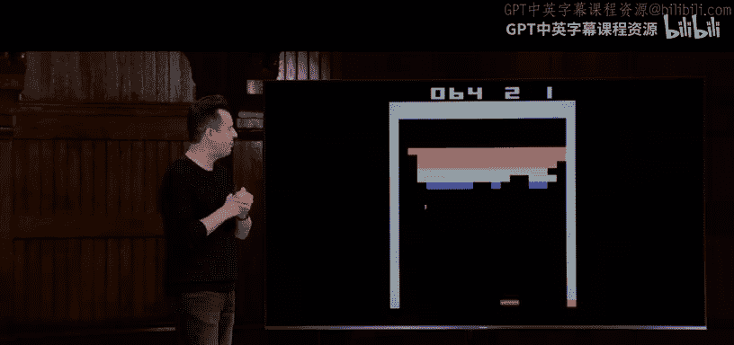

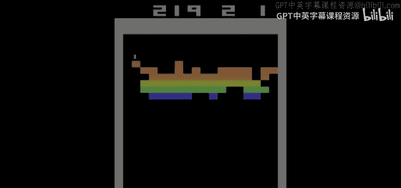

Fedback， whether it's the fellow in the video of the pancakes。

 giving feedback to the robot or someone kind of working behind the scenes at Google initially trying to teach the servers what is spam and what is not the catch with supervised learning is that there's only one of that guy。

 And there's only a finite number of humans working at Google doing this。

 And once the data exceeds what a human can do or wants to do we probably need to transition from supervised learning to unsupervised。

 where we still write the code that ideally teaches the machines how to learn。

 but we don't have to tell it constantly what is good， what is bad， what is correct。

 what is incorrect， Let's let the software figure that out too and take us out for better or for worse of the picture altogether。

 So what we're really transitioning to as a society now， if you will， something called deep learning。

 which goes beyond the reinforcement learning， the supervised the un supervised learning that we just saw。

 But deep learning is often grounded in what we might call these here neural networks。

 and a neural network is really inspired by real。😊，Biology。

 whereby governing our human neural system or all these little neurons that have some kind of physical connections to each other。

 And somehow there's like electrical signals traveling through us such that if I think a thought。

 that's how I know to like stick out my hand or shake someone's hand or the like。

 There's some kind of control system going on here。 So here's a picture。

 a rough picture of what a neuron might look like。 Here's a pair of them being close enough to somehow communicate being computer scientists。

 we're going abstract this away。 and really just think of each such neuron as a circle。

 And if they have a means of communicating， we're gonna draw an edge between them turning this into really mathematical graph。

 So these are nodes in our C50 speak。 And these are edges in this case。 But it's still the same idea。

 There's something communicating with something and heck。 we can think of this is maybe the input。

 And this now is maybe the output。 we can really map。 this biological world to the computing world。

 Suppose you have a world of two inputs， though that's fine， maybe based on this input in this input。

 This here output can give us some answer to some question。 Well， what does this mean。😊，Well。

 let's make it more real。 Let's shrink that down and move it at left。

 Let's come up with a Cartesian plane here with X and Y coordinates。

 And let's assume that in this world， there exist dots。

 and those dots are either blue or they are red。 and it would be nice in this world to be able to predict based on the X Y coordinates of some dot if it is going to be blue or red。

 So you can imagine this representing other types of questions to which we might want answer。

 So here's our y axis。 Here's our x axis。 if I only have a limited amount of training data， though。

2 dots，1 blue，1 red， the best I can really do is sort of guess at what defines red versus blue in this world。

 So maybe I can think of this neuron is representing X。 This neuron is representing y。

 and the output I want is an answer。 red or blue dot based on x comma Y。 Well。

 how do I come up with this。 Well， know best guess， maybe it's just a straight line。

 So maybe everything to the left of this line is going be blue in this world。

 Everything to the right is going to be red。 So what I really am trying to figure out here and learn here is what is like the best fit line。

😊。

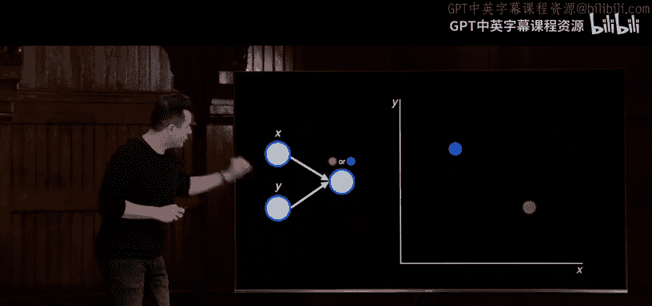

That somehow separates the red from the blue。 Well。

 what I'm really trying to do then then over time is adjust this。 The more training data I get。

 the more actual dots in the real world， I might need to modify my best guess here。

 And so blue is now over here。 So I think want to maybe tilt this line and come up with a different slope for it。

 And if you give me more and more dots， I bet I can do better and better in sort of refine the line might not be perfect。

 but this is pretty darn good。 I got most of the blue at left。 and most of the red at right。

 And frankly， if I want to really get it correct， you're gonna have to let me do more than just a straight line。

 I'm going need to somehow use some quadratics or something to have curly lines in there to capture this perfectly。

 But if you see where this might be going。 if I've got x' is and y。

 I'm trying to find the best fit line， And what I'm trying to do is think of this as representing a neural network。

 what I'm really trying to do is something like this。 Can I come up with mathematically。

 a value for a and a value for B that gives me an answer C that is either red or blue。 Yes or no。

 if you will。😊，Well， how might I do that， Well， again。

 not to do all too much on sort of grade school math here。

 high school math but A X plus By plus C is sort of that of a line of some sort。

 And maybe we can just arbitrarily say that if you give me an x and a y value and you've given me enough training data to figure out what a should be and B should be in C should be if the answer to that mathematical expression is say greater than zero。

 I'm gonna say that dot should be blue。 And if it's less than or equal to 0。

 I'm gonna say it should be red instead。 It doesn't matter。 It's just like Tittoe。

 we just have to agree how to represent these games or these questions mathematically to which we can then get a boolean answer。

 Yes or no red or blue。 And so with these neural networks are really trying to do is based on lots and lots of data just plug in a whole bunch of parameters。

 coefficients， if you will， of those x is and ys so that when you pass in inputs like these。

 you get back a correct answer over here。 And what's funny about neural networks。

 at least right now among computing circles is that even the best engineers at Google。

 Microsoft and open AI。😊，We're using neural networks to， given your input or your question。

 produce an answer there too， chat E。 even though there's millions。

 if not billions of numbers involved underneath the hood， no computer scientist。

 even the head engineer can point at this and say， oh， well， this node represents such and such。

 And this edge is this value because of this reason。

 it's all sort of a black box in a sense of abstraction。

 And so because we're just throwing lots and lots of data at these things。

 the computer is figuring out what all of these interconnections should be mathematically and what we're really just trying to do probabilistically。

 is with high confidence spit out the right answer。

 But even we humans don't really know how these work step by step underneath the hood and there in lies this idea of machine learning。

 So with that said， how might we apply this to some real world domains。 Well。

 maybe you're in meteorology。 And so given a humidity level and pressure。

 the goal is to output a rainfall prediction。 Maybe you can do that with a neural network by feeding in your。

Comp with a whole bunch of sample humidity， sample pressure values and historical rainfall amount。

 and just let it figure out how to represent that kind of pattern。

 alternatively in the world of advertising， if you know how much you spent in a month and what month that is。

 I bet if you give me enough historical data， I can crunch those numbers somehow and predict what your sales are going to be based on that data。

 not 100% correctly， but probably confidently correctly most of the time。 Well。

 what we have then in chat GBT and what we have then in CS50s is what's called a large language model。

 whereby the inputs to these neural networks have been like all of the content of the Internet。

 So Google search results and redit's in stack overflow dictionaries and encyclopedias and any such works that it's just been consuming as input。

 and what these large language models are trying to do is figure out based on patterns and frequencies of text in all of those input Well。

 if someone asks me how are you question mark probabilistically based on。All of this data。

 I bet 99% of the time I Chattpt or CS50's duck is supposed to reply。 good thanks。 How are you。

 So not always the correct answer， but probabilistically。

 And that's why chatttpt is sometimes wrong because there might be misinformation on the Internet。

 Maybe there's a bit of exploration sprinkled in randomly。

 but it's not always going give you the right answer but probabilistically it's going to。

 And this stuff is truly hot off the presses in 2017 folks at Google proposed what is generally now called attention。

 which is a feature that underlies AI， whereby you can sort of figure out dynamically what the relationship is between words in English paragraph or an English text or really any human language and giving weight to words in that way has actually fed a lot of these new large language models in 2020 did open AI published its G model and most recently in 2022 did chattpt itself come out and what underlies what we're talking about here is technically this big mouthful。

 generative pretrain transformformers whereby the purpose of these AI。

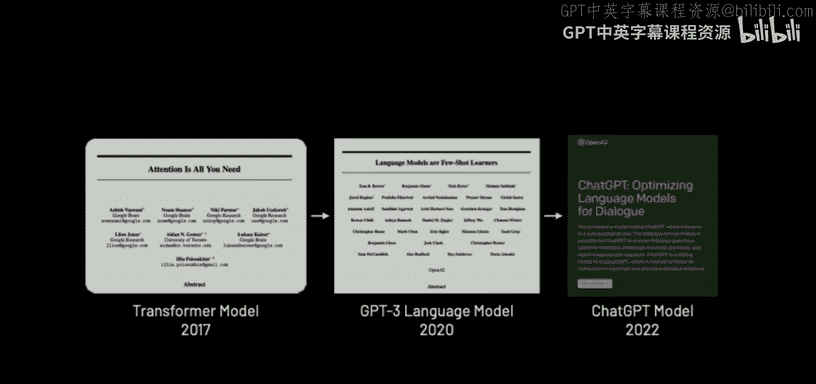

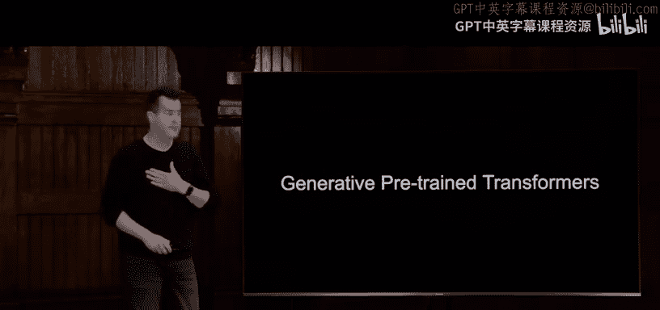

Gerate stuff。 They've been pretrained on like lots of publicly available data。

 And the goal is to transform the users' input into ideally correct output。

 And if you see where I'm going with this， that's the G in chat G。

 which itself was never meant to be like a branded product。

 It's a little weird that G has entered the human vernacular。

 But what it does is evokes exactly these ideas。 So here's a sample paragraph， for instance。

 Massachusetts is a state in the New England region of the northeastern United States。

 it borders on the Atlantic Ocean to the east。 the state's capital is dot dot dot。

 essentially inviting us to answer now this question。 Well。

 historically prior to 2017 it was actually pretty hard for machines to learn that。

 this mention of Massachusetts is actually related to this mention of state。

 Why because they're pretty far apart， this is on a whole new sentence。

 And unless it knows already what Massachusetts is and technically it's a commonwealth。

 it might not give much attention to these two words too much weight to the relationship thereof。

 But if you train these G。

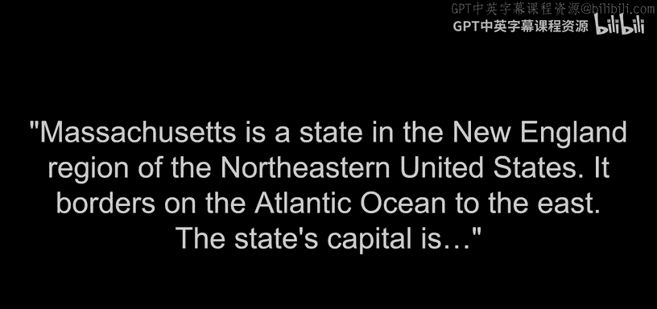

On enough data and you start to break down the input into sequences of words， for instance， Well。

 you might have an array or a list of words here in Cs50 speak。

 you might be able to figure out based on your training data。

 that if you number all of these words from like one to 27 or what not in this case。

 you could represent them mathematically somehow as an aside。

 the way that these large language models are representing words like Massachusetts。

 literally is with numbers like this。 This is 1536 floating point values in a vector。

 aka list or array that literally represents the word Massachusetts。

 according to one of these algorithms。 Let's take a step back and abstract it away as little rectangles instead。

 and use these little edges to imply that if there's a bolduler edge here。

 that implies that there's really a relationship in the training data between Massachusetts and state。

 one of those words is giving more attention to the other as opposed to is which is maybe a thin line because there's not much going on there between Massachusetts and is as opposed to those two nouns in that case。

 All of this input， all of these vector。

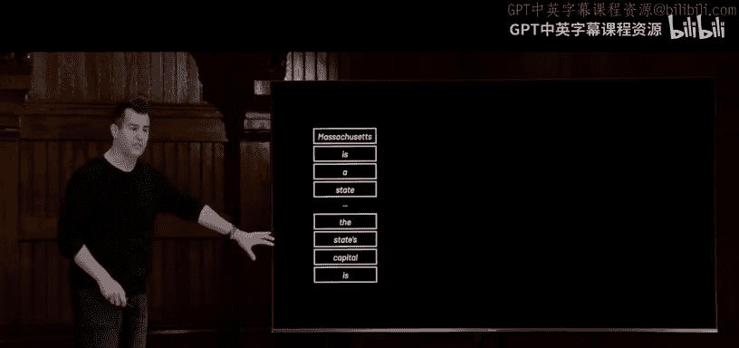

Are fed into large neural networks。 They have lots and lots of inputs far more than one and two and three。

 The output of which ideally then is the answer to this question or a whole answer to your question。

 And so when you ask the duck a question， you ask Cha the question essentially the software is sort of navigating this neural network trying to find the best path through it to give you the most correct answer and ideally it's going to get it correct。

 but it might not necessarily do it every such time。 And so in fact。

 there are these things and will end will begin， known as hallucinations where sometimes Chat E and admittedly。

 even CS50's own duck might just make something up and tell you such very confidently those are indeed known as hallucinations and what I thought we'd end on is a note that actually was published quite some time ago。

 perhaps in your childhood as well from Shell Silverstein here。

 the homework machine from which we have this here poem。

 the homework machine or the homework machine。

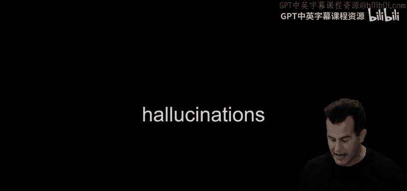

Most perfect contraption that's ever been seen。 Just put in your homework， then drop in a dime。

 Sn on the switch。 And in 10 seconds time， your homework comes out。

 clean as can be quick and clean as can be。😊。

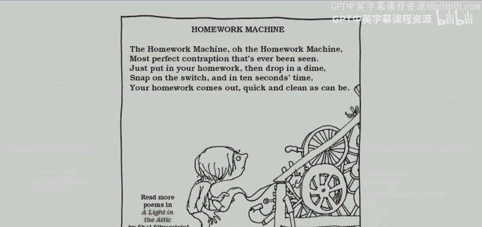

Here it is 9 plus4 question mark， and the answer is3。3。Oh me。

 I guess it's not as perfect as I thought it would be。 So four toldold decades ago。

 what we're now here talking about。 But this then was C S 50。 This was then AI。

 This is the URL at which you parents and siblings and others are welcome to take the course。

 so to speak in any way。 Feel free， though， to come on up with any hellos or questions。

 That then is our class。 and we will see you hopefully， next time。😊。

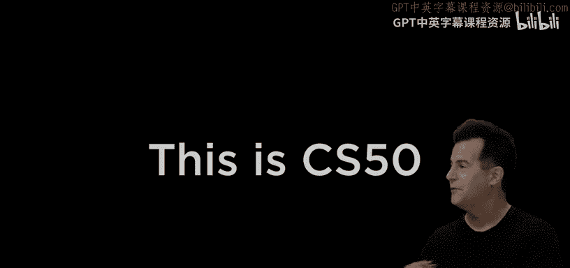

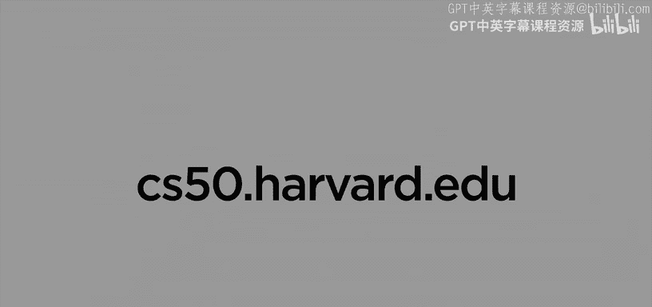