# 哈佛大学《CS50x2024计算机科学导论｜Introduction to Computer Science》（中英字幕，豆包翻译） - P6：-06-CS50x 2024 - Lecture 5 - Data Structures - GPT中英字幕课程资源 - BV16k4y1X7KZ

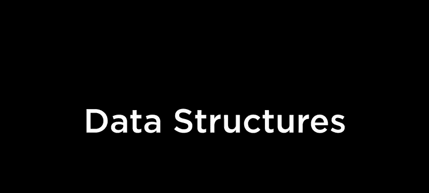

Alright， this is Cs 50 and this is week 5 and among our goals for today are to revisit some topics from past weeks。

 but to focus all the more on design possibilities， particularly by way of data structures。

 So data structures again is this way via which you can structure your data。

 but more specifically and see it's like how you can use your computer's memory in interesting and dare say clever ways to actually solve problems more effectively。

 but we're gonna to see today that there's actually different types of data structures and we'll make the distinction between abstractions like high levell descriptions of these structures and the lower level implementation details。

 so to speak。 So in particular， we'll talk first today about what we call abstract data type。

 So an abstract data type is kind of like a data structure but it offers certain properties。

 certain characteristics and it's actually up to the programmer how to implement the underlying implementation details。

 So for instance， there's actually this abstract data type that's common in computing known as a queue and from the real world。

Most of us are presumably familiar with cues， otherwise known in the US typically as lines or forming lines。

 In fact， I have here three stacks of three bags of cookies because I get like three volunteers to come up on stage and queue up。

 okay I saw your hand first how about your hand second and in the blue in the blue Okay。

 come on down just you three。😡，Come on over and if you want to queue up over here if you could。😡。

Come on down Thank you as we begin， you want to introduce yourselves first Hi my name is Ata Arwoods I'm the first year studying computer science and economics and I sleep at home at all next Hi everyone my name is Catherine I'm planning on studying engineering not sure mechanical or electrical yet but one of the two and I'm currently in Kennedy Nice nice to me。

😊，Hi， everyone。 I'm Isabella。 I'm in Strauss， and I plan on majoring in computer science。 Wonderful。

 Well， welcome to all three of you。 And I think this will be pretty straightforward。

 I have here these three bags of cookies you formed nicely this line or this cu。

 So if you'd like to come up first and take your cookies。 Thank you。 And right that way。

 That's all there is to this demonstration。 You're cookies as well。 right this way。

 And your cookies right this way。 Woly well done。 Thank you to our volunteers。

 the point is actually sincere， though simple as that demonstration was and as easy as it was to get those cookies。

 cues actually manifest a property that actually is germane to a lot of problem solving in computing and the real world。

 specifically cues offered this characteristic FiIfo first in first out。 And indeed。

 as our volunteers just noticed as they queued up on stage 1，2，3。

 that is the order in which I handed them their cookies。 and dare say it's a very equitable approach。

 It's very fair。 First come first served might be more casual way of describing FiIfo first in first out。

 Now structures like these。😊。

Actually offer specific operations that make sense。 And in the context of cues。

 we generally describe these operations as Nqueing and dequeing。

 So when our first three volunteers came up， they N queueed and as I handed them each a bag of cookies。

 they de queueed and exited in that same order。 Now。

 how could you go about implementing a queue in code specifically in see what we can actually implement it in bunches of different ways。

 but perhaps the most obvious is to borrow our old friend namely arrays。

 and we could use a data structure that looks a little something like this whereby we specify the total capacity of this data structure for instance。

 we might store a total 50 people or just three in this case。

 we might define our structure then is containing those people as simply an array。

 And if a person as a data type that we've defined in week pass。

 you can imagine each of our volunteers is indeed a person。

 and we've stored them one after the other contiguously in memory by way of this actual array。

 but we do need to keep track inside of a queue using one other piece of data。Nely。

 we need to keep track of an integer like the size。

 Like how many people are actually in the queue at this moment。

 because if we have a total capacity of 50， I'd like to know if I only have three volunteers that I can do some quick arithmetic and know that I could have fit another 47 people in this same queue。

 But it's finite。 Of course， if we had 50 volunteers all wanting cookies。

 that's as many people as we could actually handle。

 So there is this upper bound then on how many we could fit。

 But there's yet other ways for storing data inside of a computer's memory。

 And there's some other abstract data type known as a stack and stacks are actually omnipresent as well。

 even though it's not necessarily the system you would want when you line up on stage。 For instance。

 could we get three more volunteers。 I saw hand here right here and right here。 Come on down。

 We'll have the orchestra come up this time。All right， come on over。And if you wouldn't mind。

 come on over， we'll do introductions first。This will be almost as easy as the last one。

 if you want to introduce yourself and let me just stack you against the lectern this time。

 So if you could go there and if you could come over here and if you could come over here。

 we'll stack all three of you。 So you were first。 So you're first in the stack。 Hi， I'm C。

 I have no idea what I'm studying。 and I live in Straus。 Wonderful。 And next。 Hi， I'm T。

 I'm studying Econ and C S。 and I live in Canada。Hi， I'm Claire。 I want to study applied mathth。

 and I'm in Wiglesworth。 Woful。 welcomele to all three of you。 And if I may。

 let me just advance a bit more information about stacks。

 the catches that stacks actually support what's known as LFO。 So last in first out。

 which is sort of the opposite， really of a queue or a line。 So in fact， you were last in line。

 So here we have your cookies。 Thank you so much。 if you'd like to exit that way。

 We have your cookies here。 Thank you so much。 We'd like you exit this way。

 And even though you were first， like LiIFO doesn't really give you any cookies。

 because you first in， not last in and so yeah， points made， we'll give you their cookies。

 so thank you to all three of our volunteers。 But LiO suffice it to say。😊。

Doesn't offer the same fairness guarantees as a queue or a line more traditionally。

 And imagine just go lining up in any store or the dining hall or the like。

 ideally you want the people running the place to adhere to that queue to that line so that FiIO is preserved if you indeed care about being first whereas there are context in which LIFO does actually make sense In fact。

 if you think about Gmail your inbox or outlook typically you're viewing your inbox as a stack because when you get new mail。

 where does it end up it actually ends up on the top on the top and the top and if you're like me odds are which emails do you tend to first。

 I mean， probably the ones on the top， the ones that came in last most recently that is and that might actually be to the detriment of people who emailed you earlier today or yesterday because once they sort of fall off the bottom of your screen frankly unless you click next you may never see those emails again but stacks are indeed one way of storing data and Google and Microsoft presumably made the judgment call that in general we users want to see the。

😡，recent data first， the last information might be the first we want out Now。

 just in terms of nomenclature， the two operations that are analogous toqueuing and dequeing。

 but with this property of LO or instead called push and pop So when our first volunteer came up on stage so to speak I pushed him onto the stack against the lect there Second person was pushed third person was pushed。

 And then when it was time to hand out the cookies， we popped them， so to speak one after the other。

 But preserving that LO property。 But here's where things are a little interesting in terms of implementation details。

 a stack could be implemented almost identically underneath the hood to a queue。

 because what do you need， you need an array of people。

 which we could use our person data type 4 for per pass classes。

 we have to keep track of how many people are in the stack so that even if we have a capacity of like 50 we know at least that we can store3 plus maybe 47 others Now there's still gonna to be a change in the underlying implementation details because not picture here is the。

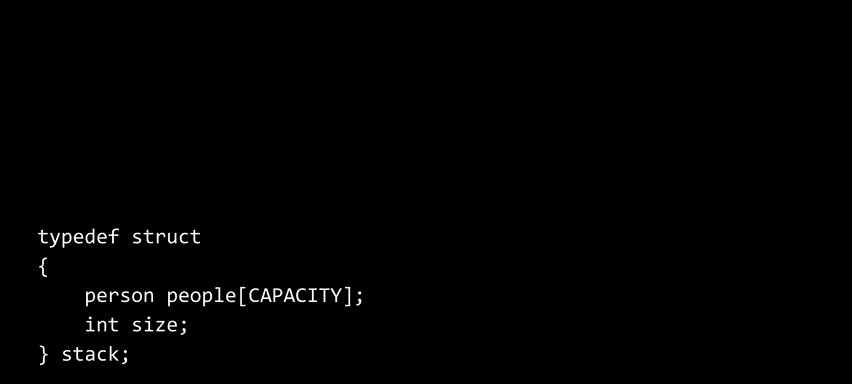

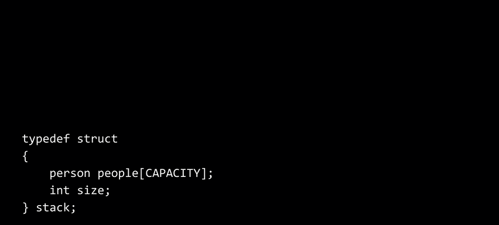

C code that actually pushes in pops or N queues and Dqes。 So whatever loops you're using。

 whatever code you're using odds are， that's where those properties are gonna be implemented FiIFO versus LIFO。

 you're gonna implement maybe the loop in this direction instead of this one or some such distinction。

 But at the end of the day， Stas and cues are just abstract data types in the sense that we can implement them in bunches of ways two of them among them here thus far on the screen。

 but that array is gonna to come back to bite us because if you only have a capacity of 50。

 what happens if 51 people want cookies next time， like you just don't have room for them even though clearly we have enough room for the people themselves。

 we have enough memory and so it seems a little shortsighted to limit just how much data can fit in our data structures So with that said。

 a friend of our Shannon Duval at Elon University kindly put together a visualization of the same and allow me to introduce you to two fellows known as Jack and Lou if we could dim the lights for this video。

🎼Once upon a time there was a guy named Jack。 when it came to making friends。

 Jack did not have the knack。 So Jack went to talk to the most popular guy he knew he went up to Lou and asked。

 what do I do， Lou saw that his friend was really distressed。 Well， Lou began。

 Just look how you're dressed。 Don't you have any clothes with a different look。 Yes， said Jack。

 I sure do。 come to my house， and I'll showed them to you。

 So they went off the Jacks and Jack showed Lou the box where he kept all his shirts and his pants at his socks。

 Lou said， I see you of all your clothes in a pile。 Why don't you wear some others once in a while。

 Jack said， well， what I remove clothes and socks， I washed them and put them away in the box。

 Then comes the next morning and up I hop。 I go to the box and get my clothes off the top。

 Lou quickly realized the problem with Jack， He kept clothes， Cds and books in a stack。

 When he reached for something to read or to wear。 He chose the top book or underwear。

 Then when he was done， He would put it right。😊。

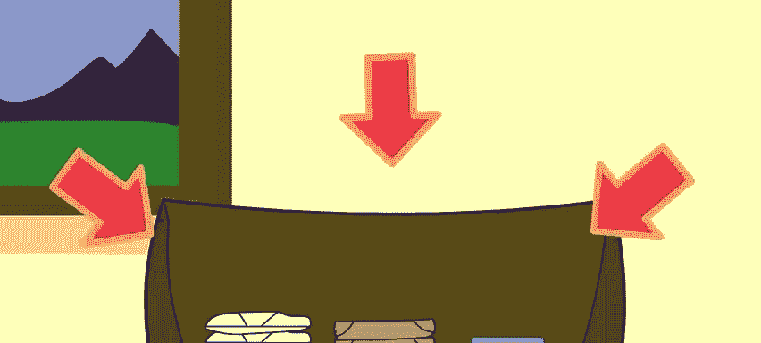

🎼Back back it would go on top of the stack。 I know a solution， said a triumphant Lou。

 You need to learn to start using a cu。 Lou took Jack's clothes and hung them in a closet。

 And when he had emptied the box。 He just asked it。 Then he said now， Jack， at the end of the day。

 put your clothes in a left。 when you put them away。

 Then to morrow morning when you see the sunshine。 Get you clothes from the right from the end of the line。

 Don't you see， said Lou， it will be so nice。 You'll wear everything once before you wear something twice。

 And with everything in cus in his closet and shelf， Jack started to feel quite sure of himself。 Oh。

 thanks to Lou and his wonderful cue。😊。

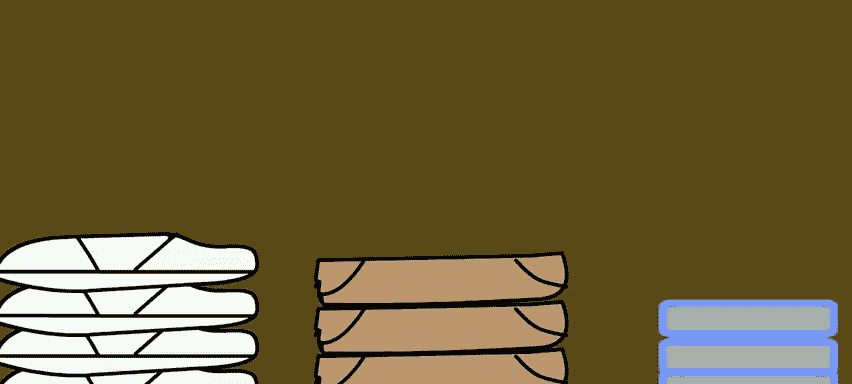

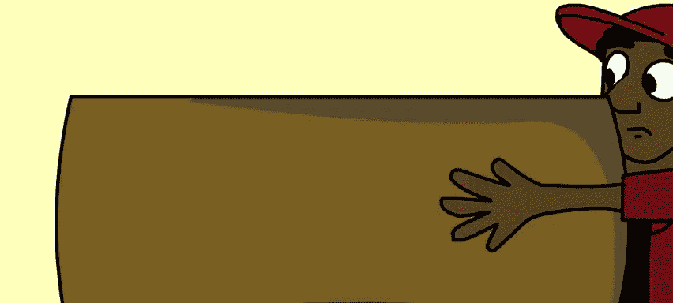

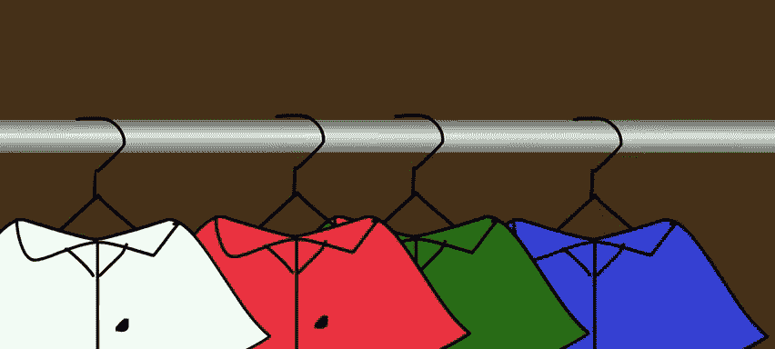

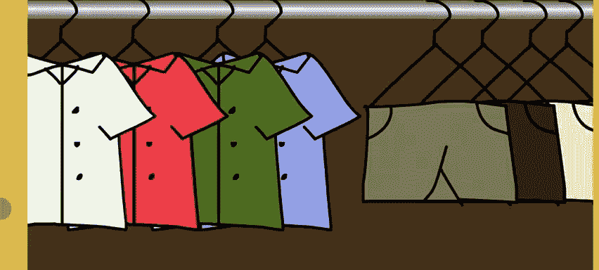

So the same wonderful thanks to Shannon。So you might have noticed I wear black all the time so we could make a similar gag about here's what my stack of clothes at homes looks like。

 even though I might own a blue in a red sweatshirt。

 doesn't really work if you're popping everything from a stack every time cleaning it。

 replenishing the black sweaters before the red or the blue even get popped themselves。

 but we're gonna focus today， not just on like stacks and cues。

 which for us are really meant to motivate like different ways of designing data。

 even though the implementation details might differ。

 but we're gonna start focusing on solving some problems that invariably we'd be bumping up against any as we develop more and more realworl software not just smaller programs as in class an arrays recall。

 or what， like what's the key characteristic or definition of an array with respect to your computer's memory and storing things in it yeah。

Sttors。Perfect， so it stores the data contiguously back to back to back。 And as we've seen thus far。

 when you allocate space for an array， you typically do it with square brackets。

 you specify a number in those brackets or maybe a constant like capacity like I just did and that fixates just how much data you can actually store in there。

 We did see last week though that we could start to use malloc to allocate an equivalent number of bytes。

 But even that when you call it just once gives you back a specific finite number of bytes。

 So you're similar toly deciding in advance how much memory you can store in an array。

 So let's consider what kinds of problems this should get us into。 So here's an array of size 3。

 And suppose for the sake of discussion we've already put three numbers into it 1。

2 and3 literally suppose now we want to add a fourth number to that array。 Well， where does it go。

 like intuitively in pictorially， you'd like to think it could go there。

 But remember the context we introduced last week。 when we talked about computers memories。

 there's lots of stuff going on。 And if you only ask the computer， the operating system for three。

For three integers who knows what's here and here and here not to mention everywhere else on the screen。

 So if we zoom out， for instance， we might like to put the number four there， but we can't。

 if in that greater context， there's a lot more stuff going on So for instance。

 suppose that elsewhere in my same programme or function I've already created a string like H ELL comma space world backlash0 just by bad luck that could be allocated right next to my 1。

2，3 why well， if I ask the operating system for space for three numbers。

 then I ask the operating system for space for a string。

 it's pretty reasonable for the computer to put those things back to back because it's not going to anticipate for us that well。

 maybe they actually want four numbers eventually or five numbers or more Now as for all of these Oscars the grouchs that's just meant to represent pictorially here the notion of garbage values like there's clearly other bytes there and available I don't know what it is and I don't care what it is but I do care that I can't just presume to put something right。

😡，where I want in the computer's memory unless I preemptively ask it for more memory now if all of those are garbage values。

 which is to say that who cares what they are， it's just junk left over from previous runs of the function or the like。

 there's clearly plenty of room for a fourth number I could put the number for here or here or here or down here or here or here。

 but why would I not want to just plop the for wherever there is a garbage value currently。😡，Exactly。

 I wanted to be next to my array of 1，2，3， because again， arrays must be and must remain contiguous。

 Now， that's not a deal breaker， right， because where else could I put maybe the entire array， Well。

 there's room up here for four numbers， There's room down here for four numbers。 So that's fine。

 And that could be a solution to the problem。 if youve run out of space in your fixed size array。

 Well， maybe I just abstract everything else away， and I just move my array to a different location that's a little bit bigger。

 But there is gonna be a downside， even though this is a solution。

 even though I can certainly copy the one， the two， the three， and now I can plop the four there。

 And heck， I can then let go of the old memory in some way and give it back to the operating system to be reused later。

 This is successful， But why intuitively might we not want this to be our solution。

Of creating a new array that's a little bigger， copying the old into the new and getting rid of the old。

呢。Good， yeah， I think I had one more step。 Suppose I want to add a fifth number， a sixth number。

 Like， that's a lot of work。 And in fact， what's the expensive part or what's the slow part of that story。

 yeah。takes of time。 It takes a lot of time。 But specifically。

 what's taking time if we can put our finger on it。 Yeah， and back。Okay， for a period of time。

 I'm using twice as much memory， which certainly seems wasteful because even though I don't eventually need it。

 it is going to kind of mushroom and then shrink back down。

 which seems like an inefficient use of resources。 But what specifically is slow about this process。

 too Yeah， and metal。😡，Yeah， good choice of words。 You're iterating over the array to copy it over using a four loop。

 a while loop。 So it's probably like big O of n steps just to copy the array and technically big O of n plus one。

 if we had one more， but that's still big O of n。 So it's the copying the moving of the data。

 so to speak。 That's certainly correct。 but maybe it's not the best design。

 Would't it be better if we could do something otherwise。 Well。

 let's consider what this might actually translate into encode and what the implications then might be。

 let me switch over here to VS code。 let me propose to open up a file called list do C brand new。

 And let's create this list of numbers and then add to it over time and see when and where we actually bump up against these problems。

 So let me include standard Io do H in order to simply be able to print things out ultimately in main void。

 So no need for command line arguments here let me give myself an array called list just of size 3 for consistency with the picture thus far。

 And then let me go ahead and just manually make it look like。

In memory what it did on the screen so list bracket0 is going to equal to number one list bracket1 is going to equal the number two and list bracket2 equals the number three so even though the array is of course zero index I'm just sort of using more familiar1。

2，3 as my digits here Now suppose I want to print these things out。

 let's just do something is a simple exercise So for int I equals0 I is less than3 I plus plus inside of this loop I'm going to do something simple like print out iter iteratively as you note backslash n list bracket I so very simple program it's not the best design because I've got this magic number there。

 I'm hard coding the three， but the point is just to go through the motions of demonstrating how this code works。

😡，Ah， oh good， you got oh， you got it in before I hit compile， so wait。😡，Thank you。All right。

 maybe a round of applause， thank you。All right。Allright。

 so this is gonna get aggressive though eventually so let me add the semicolon。

 let me recompile this list seems to compile okay and if I do dot slash list I should see of course123 so the code works。

 there's no memory constraints here because I'm not trying to actually add some values but let me consider how I could go about implementing this idea of copying everything from the old array to the new array。

 frankly， just to kind of see how annoying it is how painful it is。

 so you're about to see the code escalate quickly and it will be helpful to try to wrap your mind around each individual step even though if you take a step back it's gonna to look like a crazy amount of code to solve a simple idea but that's the point we're gonna to get to a place particularly in week  six we're all of what we're about to do reduce this to like one line of code so hang in there for now so let me go ahead and do this if I want to create a version of this code that can grow to fit more numbers for instance how can I go about doing this or at least demonstrate as much。

Well， I cannot use an array in this traditional way of using square brackets because that makes list the variable forever of size 3。

 I can't free it。 Remember free， you can only use with malloc。

 so you can't give it back and then recreate it using this syntax but I can use this trick from last time whereby if I know there is this function called malloc whose purpose in life is to give me memory I could for instance。

 reeccl list to be a pointer so to speak， that is the address of a chunk of memory。

 and I could ask malloc for a chunk of memory namely of size3。

 but not three per se three integers for good measure。

 so technically that's three times the size of whatever an int is Now for our purposes today that's technically three times4 or 12 but I'm trying to do this very generally in case we use it on an old computer or maybe a future computer where the size of an might very well change that's why I'm using size of int。

 it will tell me always the correct answer for my computer So to use malloc not。😡，Me me on this one。

 what header file do I need to add？😡，Standard standard lib dot H。

 So I'm gonna go ahead and include standard Lib dot H， which gives me access to malloc。

 And what I'm gonna additionally do is practice what I preached last week， whereby in extreme cases。

 malloc can return。 not the address of an actual chunk of memory。

 What else can Maoc return in cases of error。Yeah。No in U L L in all caps。

 which represents technically address  zero， but you're never supposed to use address  zero。

 So it's a special sentinel value that just means something went wrong。 Do not proceed。

 So it's gonna to add some bulk to my code， but it is good practice。

 So if list at this point actually equals equals null， there's no more work to be done here。

 I've got to abort the demo altogether。 So I'm gonna to return one just arbitrarily to say we're done with this exercise。

 It's not going to be germane for class。 we can surely find room for three integers but best practice whenever using malllo。

 Now this code here does not need to change because list is now still a chunk of memory of size 12。

 I can actually get away with still using square bracket notation and treating this chunk of memory as though it's an array。

 And this is a bit subtle， but recall from last time we talked briefly about pointer arithmetic whereby the computer can do some arithmetic。

 some addition subtraction on the actual addresses to get from one location to the other。

 And that's what the computer is gonna to do here。 because it says。😡，Bet 0。

 that's essentially just going to put the number one literally at that beginning of that chunk of memory。

 and because this is a modern computer， it's going take four by in total。

 but I don't want to put the number  four here to shift it over myself because I'm using square brackets and because the computer knows that this chunk of memory is being treated as a chunk of addresses of integers。

 pointer arithmetic sort of magically kicks in so what the computer is gonna do for me is put this one at location 0。

 it's going to put this number two at location one time size of in So4 and it's gonna to put this number three at location two times size of in which gives me8 So in other words。

 you don't have to think about how big that chunk of memory is if you already gave the compiler a clue as to the size。

 for our purposes today， don't worry too much about that。

 The bigger takeaway is that when you allocate space using malloc。

 you can certainly treat it as though it's an array using week two notation， which is。😡。

Simpr than using dots and stars and all of that。 But this isn't quite enough now。

 because let me stipulate that for the sake of discussion at this point in time here。

 on line 16 where the cursor is blinking。 suppose I realize just for the sake of discussion like I should have allocated space for four integers instead of three。

 Now， obviously， if I were writing this real， I should just go fix the code now and recompile it all together。

 But let's just pretend for the sake of discussion that's somewhere in your program。

 you want to dynamically allocate more space and free up the old in order to implement this idea of copying from old to new memory。

 So how could I do that。 Well， let me go ahead and temporarily give myself another chunk of memory。

 And I'm going literally call it Tmp for short， which is a common convention tempemp。

 I'm gonna set that equal to the amount of space that I actually do now want。

 So I'm gonna say four times the size of an int。 So technically， it'll give me 16。

 but space for four integers this time。 And what that's doing for me in code is。

Essentially trying to find me four space for four integers elsewhere that might very well be garbage values now。

 but I can therefore reuse them。 So once I've done this。

 something could still go wrong and I could check if temp equals equals null。

 then actually I should exit all and finish up， but there's a subtlety here and you don't need to do all too much on this for today。

 but there is technically a bug right now， why based on week four last week。

 might it not be correct technically to immediately return one and abort the program altogether at this point。

😡，Okay， so when you allocate memory， sometimes there might be garbage values there。 That is true。

 but that is to say that those 16 Bs might be garbage values。 have Oscar。

 the gruches all on the screen， but temp itself will literally be the return value of malloc。

 and Maoc will always return to the address of a valid chunk of memory or will return null。

 So this line is actually okay。 What I don't love is that I'm returning one immediately。😡，Yes。

 so this is where it's subtle。 It's not quite right to just abort right now and return 1 Y because up here。

 remember a few moments ago， we used malloc presumably successfully because if we got all the way down here we did not abort on line 9 So we kept going but that means we've allocated three times size event it So 12 bytes earlier So frankly if you compile this code run it and then ask Valalgrind。

 it's going to identify a memory leak of size 12 because as you know。

 we did not free the original memory。 So this is where frankly C does get a little annoying because you and I as the programmers have to remember all of these details So what I really want to do here before I return one to be best practice I want to free the original list So I give back those bytes to the operating system Now as an aside technically when any program quits all of the memory is going to be given back to the operating system but practicing what I'm preaching now we'll get you into better situations later because if you don't free up memory。

 you will have leaks and that's when。😡，Macs and PCs tend to start to slow down and use up more memory than they should。

 But let's avoid discussion of more error checking there。

 Let's just assume that now I'm on line 23 of this program whereby I have presumably successfully allocated enough space。

 So the next step after allocating these four bytes is to。

 as you noted earlier iteratively copy the old numbers into the new space。

 So this is actually pretty straightforward I'm going go ahead and4 int I get 0 I is less than3 I plus plus just like I was printing last time。

 I'm going to go ahead and set the eighth location of temp equal to the I location of list semicolon and that's it I'm just copying into the temporary array。

 whatever was in the old array， but that still leaves me with this fourth byte of course sorry this fourth location where I want to put the number four。

 but if I'm going do that for the sake of discussion even though this isn't really a compelling real world program I'm going just manually go into。

The last location in temp Aka temp bracket 3 and set that equal to my fourth number。

 So that's all The whole point here is to mimic encode what it was we wanted to do here。

 But now there's one more step。 What was the next step after copying the one， the two。

 the three and adding the four What do I want to do。😡，Now I can safely free the list。

 Now I want to go ahead and get rid of the original memory or at least hand it back to the operating system。

 So here is where I can free the list， not in the case of an error。

 but actually deliberately free the original list because I don't need those 12 bytes anymore。

 But now if I want to really have unquote list point at this new chunk of memory， well。

 then I could also do this list equals temp。 So this is a little weird。

 but recall that list has just now been freed。 So even though list technically contains the address of a chunk of memory。

 it's no longer valid because again， it was freed。 So yes， it's still technically there。

 but it's effectively garbage values now。 So I'm certainly free no pun intendedended。

 I'm certainly allow to update the value of list and I want list to now point to the new chunk of memory。

 So sort of metaphorically if list was originally pointing a chunk of memory there。

 maybe now I want to point over here。 So I'm just updating the value of list ultimately All right。

 now that。got this all done。 I think I can just use this same loop as before。

 I could change the three to a4 because I now have four numbers at the very bottom of this program。

 though， Also subtle， I should probably now at the very end free this list and for good measure Let me go ahead and return 0 But now I think I have a complete program。

 that again， to be clear is not how you would write this in the real world because you would not allocate3 by 3 integers then to decide you want to allocate for then fix all of this。

 but we could probably borrow， copy and paste some of this code into production code eventually whereby this would solve some actual problems dynamically。

 So let me cross my fingers， make list。 So far so good dot slash list。 And I should see 1，2，3，4。

 So long story short， it's a lot of work just to get from the original array to the second So ideally。

 we would not do any of this in the first place。 ideally， what could we do instead。

 Well maybe we should just allocate more memory from the get go in order。

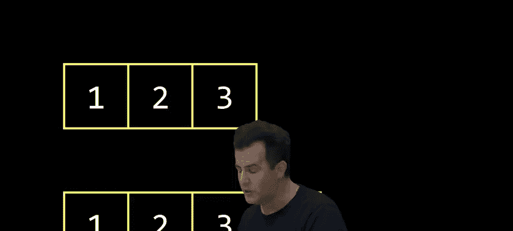

To avoid this problem altogether。 So how might I do that， Well。

 instead of having allocated3 an array of size 3， let alone an array of size 4。

 why don't I just proactively from the beginning of my program。

 allocate an array of size 30 or heck 300 or 3000， And then just keep track of how much of it I'm using。

that would be correct， it would solve the problem of not painting yourself into a corner so quickly。

😡，But what remains as an issue。I'm using a bunch more memory。

 especially if this is program only going to ever manage a few numbers。

 why are you wasting 10 times more memory than you might actually and there's another corner case that could still arise。

 even though this sort of solves the problem。😡，Exactly。

 we can eventually still run into the exact same problem because if I want to put 301 numbers in the list or 30001。

 while I'm still gonna have to jump through all of these hoops and reallocate all of that space。

 and honestly now per your concern about the looping。

 iterating 300 times 3000 times is certainly eventually going start to add up if we're doing it a lot in terms of speed and slowdown。

 So maybe there's a better way altogether than doing this。 And indeed， there is。

 if we start to treat our computer's memory as a canvas that we can start to use to design data structures more generally。

 a raisezor data structure， arguably， they're super simple。 Theyre contiguous chunks of memory。

 But we could use memory a little more cleverly， especially now per last week that we have pointers。

 which is sort of painful as they might be to wrap your mind around sometimes they really just let us point to different places in memory And so we can start to stitch things together in an interesting way。

 So the only syntax will really need to do that to sort of stitch things。

Together in memory and build more interesting structures are these things Str。

 which allows us to representstructs already。 and we did this with persons。

 and we played with this last time as well， and we saw it already for cues and stacks。

 The dot operator。 We haven't used it that much， but recall that whenever you have a struct。

 you can go inside of it using the dot operator， and we did that for a person。

 person dot name and person dot number when we were implementing a very simple address book。

 The star was new last week。 and it can mean different things in different contexts。

 use it when declaring a pointer。But you also use it when dereencing a pointer to go there。

 But just so you've seen it before， it actually tends to be a little annoying。

 a little confusing to use star and dot together。 You might remember one example last week。

 were in parentheses。 I put star， something and then I use the dot operator to go there and then go inside the structure long story short。

 We'll see today that you can combine simultaneous use of star and dot into something that actually looks like an arrow。

 something that vaguely looks like a foam finger that might be pointing from one place to another。

 So we'll see that actually in some code。 So where can we take this。 Well。

 let's implement the first of these ideas， namely something that's very canonical and computing known as a linked list。

 And let's see if we can maybe do this。 How about skullly。

 could we get you to come on up in volunteer here。 So our friends scully。

 there's some cookies in this for you。 So Suls come prepared with a whole bunch of balloons to represent chunks of memory because we。

😊，Like to paint a picture here of what's involved in actually allocating space that's not necessarily contiguous and might be over there or over here or over here in the computer's memory。

 So， for instance， if I want to start allocating space one at a time for a list of numbers。 Sully。

 could you go ahead and malloc one balloon for me。 And in this balloon， I'll store， for instance。

 the number one ultimately。 So we have a balloon here。We've rehearsed this before。

 and these balloons are actually really hard to blow up and tie off quickly。 So thank you。

 So here we have a chunk of memory。 And I could certainly， for instance。

 go in here and store if I might here we go， I could certainly go ahead here and store in this balloon。

 for instance， like the number one。 But if in the worlds of an array。

 it would just be back to back to back。 And actually， frankly， why don' we need the balloons even。

 I could just use these numbers 12，3， but the problem doesn't indeed arise note that when we want to put a fourth number。

 well， where does it go， Well， again， just to paint a picture ideally， I might allocate space for4。

 but if this is my array of size 3， Like where does it go， like this is the point。

 We can't just put it next to the three， maybe there's room for the four over here。

 but we have to somehow connect these from one to the other。 So in fact， let's sort of act that out。

 So if I instead use this balloon metaphor just allocateocating space from wherever it is。

 Can you go ahead and allocate like another chunk of memory for me。😊。

And here is where I'll now have a chunk of memory in which I can store the number。

Computer's a little slow。So in here， the second balloon， I'll have a separate chunk of memory。😊。

There we go， okay， good。Second chunk of memory， thank you， Sly。Now， I can certainly。I can thank you。

 I can certainly now store the number two in this chunk of memory。

 but it's not necessarily contiguous。 like this chunk came from over here as per Scully's position originally。

 this chunk obviously is coming from over here。 And if you don't mind holding that for a moment。

 this is breaking the metaphor of an array which was indeed contiguous。

 And even though I as the human can certainly go over and walk next door。

 that's the equivalent of like copying values from one place to another。

 What if we're a little more clever though， And if Sully found space for this number one over here。

 let's just leave this balloon here。 And if she' found space for the number two over there。

 let's leave that balloon there。 But we do somehow have to connect these numbers together。

 And here is where to， I'll try to do this on the fly， maybe I could do something like this。

 I can take this balloon here。 and I can actually tie a string to it。

 so that if I want to connect one to the other， we can sort of link these， if you will together。

 And so here now I have a linked list that is not necessarily contiguous。

 There's a whole bunch of memory that may very well have real values very well have。Arbage values。

 But I've somehow now linked these two together。 And maybe just as a final flourish。

 if we could blow up one more balloon to represent more space。

 And now she's finding room for that balloon over there。Nice， this one is a yale chunk of memory， so。

😊，Now I' need。😡，One more link， if you will。 And if I actually connect these two in this way。

 let me go ahead and tie this off here。Now I can go ahead and connect these two。

If you never see this demonstration again in next year's videos。

 it's because this did not go very well here。Here now we have the number one。

 where we first maloced it， the number two， roughly where we next malloced it and the number three。

 Okay so maybe we'll fix this some other year。 Now we'll have the number three allocated there。

 but the whole point of this silly exercise， is that we can certainly use the computer's memory is more of a canvas。

 put things wherever we want， wherever is available So long as we somehow connect the dots。

 so to speak。 and can make our way from one chunk of memory to the next to the next。

 thereby literally linking them together。 But， of course， we're using balloons for this metaphor。

 But at the end of the day， this is just memory。 So how could we encode code link one chunk to another chunk to a third chunk。

 might you think What's the trick， yeah。😊，Using pointers。

 right that's why we introduced pointers last week because as simple as an idea as it is。

 as hard as it is to write sometimes in code， it's literally just a pointer。

 sort of a foam finger pointing to another chunk of memory。

 And so these pointers really are metaphorically being implemented now in with these pieces of string。

 So we'll have to debrief later and decide if we ever do this demo again。

 But thank you to Scullly for participating。😡，一台。We have plenty of oh okay， put bear fire。

There we go。 Thank you to Sly。 So let's now actually translate this to something a little more concrete。

 and then get to the point where we can actually solve this problem in codes。

 So here's that same canvas of memory。 And if in this canvas of memory now。

 I actually want to implement this idea of the number one， The number two， the number3。

 let's stop tying our hands in terms of expecting our memory to be contiguous back to back and start to move away from using arrays。

 So for instance， suppose I want a malloc space for the number one， just as Scly。

 I first asked of Scully， S it ends up over there on the board。

 The important thing for discussion here is that that number one。

 wherever it ends up is surely located at some address and for the sake of discussion as in the past。

 suppose the number one just ends up at location， Ox1，2，3。 So Ox1。

23 is where Sly was originally standing right here。

 Then we asked for malloc for another chunk of memory。

 suppose that it ends up over here at address Ox 4，5，6。

 So that's maybe roughly here when Sly was standing in her second position。 Lastly。

 we allocate the number three。😊，Maybe it ends up at location O X 7，89。

 which was again Perculy's third malloc roughly over here on stage。 Now。

 this picture alone doesn't seem to lend itself to an implementation of the string metaphorically to the pointers and we allow ourselves a new luxury instead of just storing the number one to3 in our usual squares。

 I think what I'm going to have to do is kind cheat and use more memory to store what the pointers as you proposed。

 So here's a tradeoff that I promise we would sort of start to see more and more。

 if you want to improve your your performance in terms of time and avoid stupid copying of data from one place to another again and again and again。

 if you want to save time， you're going to have to give up some space。

 and there's gonna be this tradeoff between time and space and it's up to you to decide ultimately which is more important。

 So if you allow yourself not enough memory for the numbers 12 and3。

 but twice as much memory for the numbers 12 and3 and three。1 for each。 What could we now do， Well。

 if this node and this is a computing term， like node is just a generic term describing like a box of memory。

 a chunk of memory in this case， If I've given you this blank slate here。

 what value would make sense to store here if it's associated with this。Number one， yeah。Good。

 maybe the address of the next element。 So the next element technically supposed to be the number two。

 So at this location， I'm going to store the value， O X 4，5，6。

 What then logically should go here in the second box。O， X 7，8，9。

 And then here's a little non obvious。 It's the end of the list as of now。

 So we can't afford to let it be a garbage value because the garbage value is a value。

 and we don't want Oscar to effectively be pointing to some random location， lest we go there。

 So what would be a good special value to put here to terminate a list。Soul null， So not N U L。

 which we used for strings， but same idea。 N U L L， which we keep using now for pointers。

 otherwise known as the zero address， which I could just write for shorthand as Ox 0 in this case。

 which is the same thing as null。 So here then， even though we've changed nothing about how a computer works。

 This is just my computer's memory， I'm using more memory now to effectively link one chunk to the next chunk to the next chunk。

 So easy just note that the downside is more space。

 but now we don't have to worry about ever copying and moving this data around。

 which maybe over time for really big programs big data sets could very well be a net positive and a win for us。

😡。

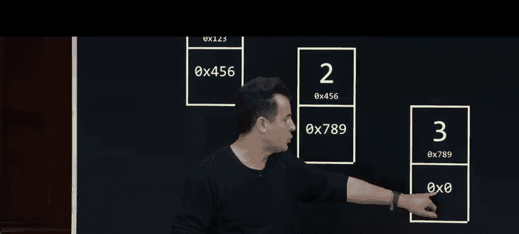

So any questions first on this notion of what a linked list？😡，Actually is。No， all right。

 Wellll recall from last time too that rarely do we actually care what the specific addresses are。

 So this is one node， two node and three nodes。 and inside of each of these nodes is two values。

 The actual number we care about and then a pointer which in now this is actually an opportunity to introduce a term that you might see increasingly nowadays data So one two and three which we obviously care about in this case。

 and then we could actually refer to these pointers more generally as metadata like it's actual data because it's helping me solve a problem。

 get from one place to another。 but metadata is distinct from data and that I don't fundamentally care about the metadata。

 that's like an implementation detail， but it does help me organize my actual data。

 So this is more of a highlel concept。 So what though is a linked list it turns out the store linked list will generally use just one more value。

 and I'm going to draw it only as a square a single box because if I declare now in my code as I soon will a variable maybe called list that points to a node this is effective。

How I could implement a linked list。 I use one node per value。

 and I use one extra pointer to find the first of those nodes。 And in fact。

 here again is where I don't need to care fundamentally where any of these addresses are。

 it suffices to know that yes， computers have memory addresses。 So I could just abstract this away。

 and this is how I might pictorially represent a linked list a cleaner version of those three balloons whereby I was here。

 this was scly's first balloon， second balloon， third balloon。

 these arrows now just represent pointers or strings with the balloons。 So with that said。

 how can we go about translating this to some actual code。 Well， here's where we can call into play。

 some of that same syntax from last time。 and even a couple of weeks ago when we introduce the notion of a structure。

 So here， for instance， is how we defined a couple classes ago， the notion of a person。

 Why C doesn't come with a person data type。 but we concluded it was sort of useful to be able to associate someone's name with their。

And maybe even other fields as well。 So we type def a structure containing these two values。

 We learned last week that string is technically char star。

 but that doesn't change what the actual structure is。 And we call thisstruct a person Well。

 here's what we've revealed last time， again taking those training wheels off。 It's just a char star。

 let's keep going in this direction， though。 If I wanted to define not a person。

 but maybe more generically something I'll call today a node like a container for my numbers and my pointers。

 Well， I similarly just need two values， not a name and a number， which isn't relevant today。

 but maybe the number as an actual int， So I can store the one， the two， the three。

 the four and so forth。And this is a little less obvious， but conceptually。

 what should be the second value inside of any of these nodes。Yeah， so indeed a pointer。

 a pointer to what， though， a pointer to another node。

 And here's where the syntax gets a little weird。 But how do I define there to be a pointer in here to another node。

 Well， you might be inclined to say node star next because this means next is the name of the property or the attribute the variable inside thestruct。

 star means it's a pointer。 What is it a pointer to， clearly a node。

 But here's where C can kind of bite you。 The word node does not exist until you get to this last line of code。

 right C goes top to bottom left to right。 So you literally can't use the word node here。

 if it's not existing until here， the simple fix for this is to actually use a slightly more verbose way of defining a structure you can actually do this。

 And we didn't bother doing this with person because it didn't solve a problem。

 But if you actually make your first line a little more verbose and say give me a definition for a structure called node now in here。

 you can actually do。This right， this is sort of an annoying implementation detail when it comes to implementing structures in C。

 But essentially， we're leveraging the fact that because C code is right from top to bottom。

 if you give this structure a name called struck node。 now you can refer to it here。

 But you know what， it's annoying to write struck node struck node struck node everywhere in your code。

 So this last line now just gives you a synonym and it' shortensstruct node to just node。

 So long story short， this is a good template for any time you implement some notion of a node as we will today。

 But it's fundamentally， the same idea as a person just containing now a number and a pointer to the next as opposed to someone's name and phone number。

 So let me go ahead and walk through with some code how we might actually implement this process of allocating a balloon and putting a number on it。

 Allocating another balloon and putting a number on it。

 and then connecting those two balloons again and again。 So we'll do this step by step in a vacuum。

 So you can see the syntax that maps to each of these ideas。

Then we'll actually pull a B S code and combine it all and make a demonstrative program。 So here。

 for instance， is the single line of C code via which I can give myself the beginning of a linked list。

 That is a pointer that will eventually be pointing to something。 So sort of metaphorically。

 it's like creating a pointer。 right know we've gotten some some complaints about that in the audience。

 will'll use the Harvard one to represent a pointer to something。 But if I only do this。

 And I only say give me a variable called list that is a pointer to a node that's going leave a garbage value。

 So this is like pointing to some random location， because it's previously some value。

 who knows what it is。 But we can solve that how what would be a good initial value to set this equal to。

😊，So null， at least if it's null， we then know that this is in a garbage value。

 This is literally O x0， a a null。 And I'm just gonna to leave it blank for cleanliness。

 So this would be the right way to begin to create a link list of size 0。 There's nothing there。

 but at least now that foam finger is not pointing to some bogus chunk of memory， some garbage value。

 So this is how the world might exist now in the computer's memory。

 How do I go about allocating space now for a node。 Well， it's just ideas from last week。

 Once the word node exists as by as by that type def。

 I can just use malloc to ask for the size of a node， and don't have to do the math myself。

 I don't care how big a node is， just let it do the math for me。

 then that's gonna return presumably the address of a chunk of memory。

 big enough for that big rectangle。 and I'm gonna store that for now。

 in a temporary variable called N that itself is a pointer to a node。

 So if this might look like a lot altogether。 But this is just like before when I allocated space for a string。

Allocated space for a bunch of numbers and set it equal to a pointer to integers。 For instance。

 most recently。 Allright， so this gives me a box in memory。 This gives me a pointer called n。

 So it similarly just a single square because it's just an address。

 And it similarly gives me a bigger chunk of memory somewhere in the computers memory containing enough space for the for the number that's going go there。

 a one， the two or3 or whatever and a pointer to the next value。 So these lines of code collectively。

 this half creates this in memory。 This half creates this in memory。 And the assignment here。

 the equal sign essentially does the equivalent of that。

 I don't care what the address is the actual number。

 it's as though n is now pointing to that chunk of memory。 But this isn't very useful。

 If I want to store the number one here with what code can I do that。 Well。

 I could do this borrowing an idea from last week。 So star N presumes that n is a pointer star n means go there。

 Go to whatever you're pointing at。 the dot operator means。😊，If you're pointing at a structure。

 go inside of it to the number field。 And we did this a couple of weeks ago with number and person when we implemented an address book。

 So star n is go there and the dot operator means go to the number field。

 The one on the right hand side and the equal sign means set whatever is there。

 equal to the number one， It turns out this is the syntax， though。

 that I alluded to being a little bit cryptic and not very pleasant to remember or type here， though。

 is where you can synonymously instead use this line of code。

 which most C programmers would use instead。 This means n is still a pointer。

 the arrow literally with a hyphen and a greater than sign means go there。

 It's the exact same thing as the parentheses with the star with the dot。

 This just simplifies it to look like these actual pictorial arrows。

 So this would be the most conventional way of doing this。 How now do I update the next field。 Well。

 I think I'm going just say the same thing。 N go there but go into the next field。

 and set it equal to null。 Why null。

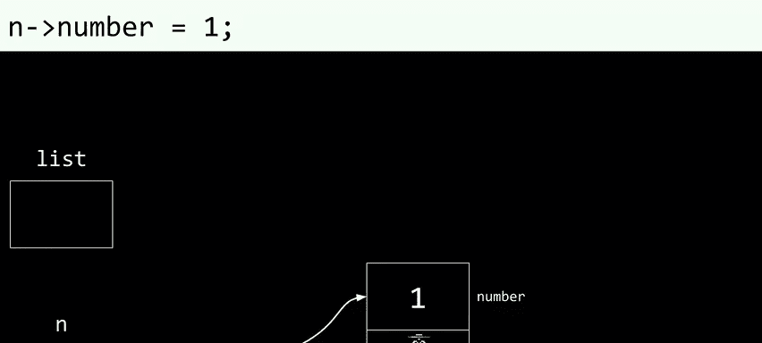

If the whole point here was to allocate just one chunk of memory， one node。

 you don't want to leave this as a garbage value because that value will be mistaken for an arrow pointing to some random location。

😡，Alright， that's a lot。 And again， we're doing it in isolation step by step。

 just to paint the picture on the screen。 But any questions on any。Of these steps。

Each picture translates to one line of code there。 Allright。

 so if you're comfy enough with those lines there， what can I proceed to now do？ Well。

 let me propose that What I could now do。With this same approach is set list itself equal to n because if the whole goal is to build up a linked list and list represents that linked list。

 list equals N is essentially saying whatever addresses here， put it here。 and pictorially。

 what that means is temporarily point both pointers to the same exact place。

 Why because this is the list that I care about long term。

 This is maybe my global variable that I'm gonna keep around forever in my computer's memory。

 This was just a temporary pointer so that I could get a chunk of memory and go to its locations and update it with those values。

 So eventually this is probably gonna go away altogether together。

 And this then is a link list of size one。 This is what happened when Sckuully inflated one balloon。

 I wrote the number one on it。 and I point it at that single balloon。 Allright。

 if I want to go ahead and do this again and again， we'll do this a little more quickly。

 But it's the same kind of code for now。Here's how I allocate space for another node。

 Here's how I can temporarily store in n。 And I'll reeclar it here。

 just to make clear that it's indeed just a pointer。

 So the left hand side of the expression gives me this。

 The right hand side of the expression gives me this。 where could it be， I mean， I put it here。

 it could have been there。 It could have been anywhere else。 But Maloc gets to decide that for us。

 N equals this just sets that temporary pointer equal to that chunk of memory。

 I should clean this up。 how do I now put the number 2 into this node。 while I start it N。

 I go there， I go to the number field， which I keep drawing on top， and I said it equal to 2。 Now。

 it's a little nonobvious what we should do here。 So I'm gonna be a little lazy at first。

 And rather than put these numbers into the linked list in sorted order， like ascending order 1，2，3。

4， I'm just gonna p it at the beginning of the list。 Y because it's actually a little simpler。

 if the each time I allocate a new node， I just prepen it。 So to speak to the beginning of the list。

 even though it's gonna end up looking backwards in this case。 So notice at this point in the story。

I've got list pointing to the original linked list。 I've got N， pointing to the brand new node。

 And ultimately， I kind of want to connect these just as Sully and I did with the strings。

 This is just temporary。 So I want to connect these things。 Here's how I could do it wrong。

 if I proceed now and update， rather， after one more line setting this equal to Nell。 Sorry。

 let's at least get rid of that garbage value。 Here's how I could proceed to maybe do this wrong。

 let me go ahead and update， for instance， list equals N。 So if I update list equaling N。

 that's going to point the list at this new node。😊。

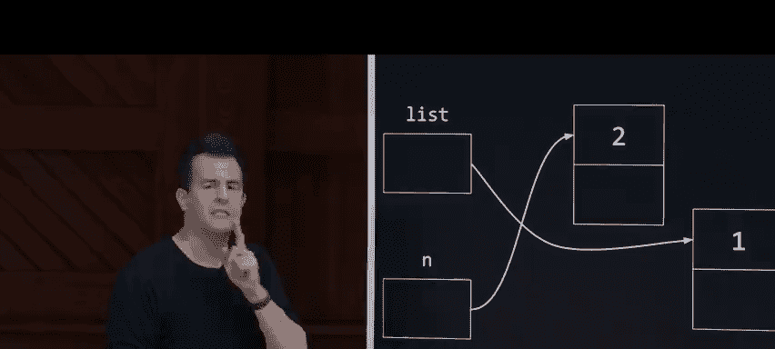

But what has just happened。What did I do wrong yeah？So nothing's pointing to one。

 And even though you and I obviously have this like bird's eye view of everything in the computer's memory。

 the computer doest。 If you have no variable remembering the location of that node。

 for all intents and purposes， it is gone。 So what I've essentially done is this when I update that pointer to point at the number two。

 It's as though this is a much nicer idea in theory when we talked about it。

 but this's not really working。 But this is effectively what we've tried to achieve。

 which is I've orphaned so to speak the number one。

 and that is a technical term in the context of memory if no one is pointing at it。

 if no string is connected to it， I have indeed orphaned a chunk of memory aka a memory leak and Valgrind would not in fact。

 like this and Valgrind would in fact notice this。 So what would be the better approach instead of let me rewind instead of updating that address to be that of this node。

 let's rewind to where we were a moment ago， where list is still pointing at the original and is still pointing at the new chunk of memory and what should I do instead。

 what should I do is maybe this let's go to the next field。

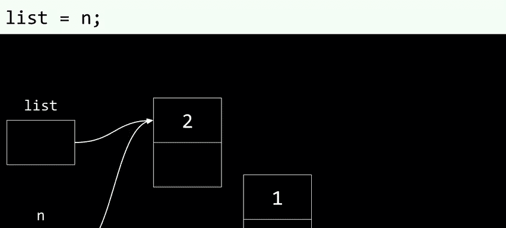

Of the new node。 So follow the arrow。 go to the next field。 And what should I put here instead。

 Why don't I put the memory address of the original node， How can I get that， Well。

 that's actually this。 So if list is pointing at the original node。

 I can just copy that address into this next field， which has the effect of doing that。

 albeit in duplicate。 I've updated the next field to point that the very thing that the original list is already pointing at。

 And now for the sake of discussion， let me get rid of my temporary node called N。

 And what you'll see ultimately， is that once we set list equal to N and get rid of it。

 now we can just。Treat the whole linked list as being connected in linkednkedIn this way。

 How do we do this again， We won't belabor the point with more。

 But suppose I want to allocate a third node。 I have to do the exact same thing。

 but I have to update this next field to point at the existing list before I update list itself。

 Long storyory short order of operations is going to be super important。

 And if I want to stitch these data structures together。

 if I would encourage you to think ultimately， certainly when it comes time to write something like this。

 Think about what it is that we're actually trying to tie together。 So let me go ahead and do this。

 I'm going go over to Vs code here， I'm going delete the old code for list do C。

 and perhaps now we can transition away from our old approach and actually do something with these pointers instead。

 So I'm gonna go ahead and let's say， include as before。

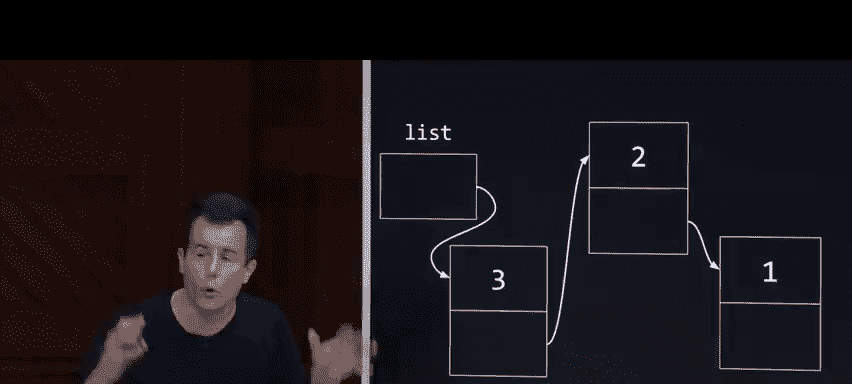

Include standard Io do H。 Let's go ahead and include standardlib do H proactively。

 and let's go ahead and create that data type。 So type def， astruct called node。

 and inside of this node， let's give us an integer called number to store the one， the two。

 the three， the4。 and then let's create astruct node star value called next whose purpose in life is going to point to the next node in any such list。

 I'm gonna shorten the name of all this to just node simply。 And then in main。

 let's go ahead and do this。 we'll bring back our friend Arg C and Argv so that I can actually implement a program this time that lets me construct a linked list using numbers that I just pass at the command line。

 I don want to bother with get again and again or the CS50 library so let's just use Arc C and。Arg V。

 but with Arg V recall string now as of last week is synonymous with char star。

 So that's the exact same thing as we've used in week two onward for command line arguments。

 So what do I want to do My goal in life with this demonstration is to create encode this linked list here or at least the beginnings thereof So how can I do this。

 Let me go back into VS code let me declare a linked list called list， but initialize it to null。

 So there's nothing there just yet How now can I go about building this linked list by taking numbers from the command line。

 So let's do this4 int I equals one I is less than arg C I plus plus let me go ahead and do this。

 I'm going go ahead and just for the sake of discussion。

 Let me print out where we're going with this。 Let me go ahead and print out percent S backlash n。

 whatever is in Argv bracket I。I'm not doing anything interesting yet。

 but let's just demonstrate where we're going with this。

 Let me go ahead and make list dot slash list and let me put the numbers 1。

2 and3 as command line arguments enter there。 we just have those numbers spit out I'm just kind of jumping through this hoop to demonstrate how I'm getting those values but notice the values in ArgV are always strings Aka cha star So if I actually want to convert a string to an integer like this How can I do this I want to set the number variable equal to ArgV bracket I。

 but RV bracket I is a string， how can I convert a string to a number anyone recall。😡，Yeah。

A to I so ask E to I so ask key to integer。 so if I do a2 I。

 I can actually convert one to the other in this way and now I can actually print this as an int instead of a string now that's not going change the aesthetics of the program if I print it out again but it does in fact give me an integer to work with but let's not bother printing it。

 let's instead put this number and any other number at the command line into a linked list so let me go ahead and allocate a pointer called n let me set it equal to the return value of malloc asking malloc for the size of one node ideally that will give me a chunk of memory that can fit this number and a pointer just for good measure I'm going to check well if n equals equals null then actually this isn't going to work so we should probably free memory thus far so I'm just going to leave this like this because there's a few steps involved so free memory thus far。

😡，And then we can go ahead， for instance， and return one。😡，Al right， if now I don't have an error。

 and N is not， in fact all， but it's a valid address。 I can go into N。

 I can follow that pointer to the number field and set it equal to the actual number。

 So this is a little strange at first glance that I've got number on the left and number on the right。

 but they're different。 N is currently pointing at a chunk of memory that big enough to fit a node。

 N N arrow number means go to that chunk of memory and go to the top half of the rectangle。😡。

And update that number to be whatever the human typed in after we've converted it on line 16 here to an actual integer。

😡，Alright， what next do I do N bracket or n arrow next should probably be at this point initialized to null and how now do I actually add this node n to my original linked list well I could just do list equals n and that would update I'll allow the foam finger my list variable to point at this new node but we said before that that's potentially bad why because if list is already pointing at something。

 we can't just blindly change what it's pointing at because we'll have orphaned any previous numbers It's not relevant at the moment because we're still in the first iteration of this loop but we don't want to orphan or leak any memory So what do I first want to do before I actually point the linked list at that new node I'm going instead say go to this current node arrow next and actually set that equal to list so strictly speaking I don't actually need to initialize it to null I can initialize the next field of this new node to point。

😡，At the existing list。 So what I'm gonna do here is instead of initializing the next field equal to null。

 if I want to insert this new node in front of any nodes that already exist。

 I can simply say set the nodes next field equal to whatever the list currently is。

 And now in this last line， I can update the list itself to point to N。 So after this。

 let's just go ahead and do something relatively simple。

 even though the syntax for this is going look a little complicated at first。

 how do I go about printing the whole list。 So print whole list。 Well。

 there's a couple of ways to do this， But if you imagine a world if we fast forward to a world in which we now have a length list of size 3 for instance。

 Here's where we might be at some point in the computer's memory。 We've inserted the one。

 then we inserted the two， then we inserted the three。 But because we're prepening everything。

 it actually looks like three to1。 So how could I go about printing this。 Well， ideally。

 I could do this。 if a computer can only look at one location at a time， I can。

grab my foam finger and point at the three and print it out， point at the two and print it out。

 point at the one and print it out。 And then because this is null。

 I'm all done pointing and printing。 But how can I translate this to actual code while I could implement that foam finger so to speak in the following way。

 I could give myself a pointer often abbreviated by computer scientists as PTR specified that that's indeed a pointer to a node as per that star and initialize that pointer to be the list itself So this is the code equivalent of if I have this same picture on the screen declaring a pointer variable and point it at whatever the list itself。

😡，Is storing first。 And now。That's akin to doing this。 If I now go back into my code。

 how can I do this Well so long as that pointer does not equal null that is so long as that pointer is not at the end of the list。

 let me go ahead and print out using printf and integer with backs percent I and then let's print out whatever I'm currently pointing at in PTR arrow number So whatever I'm pointing at go there and print the number that you find after that。

 what do I want to go ahead and do， I'm going to set pointer equal to pointer arrow next。

 So what does this mean if I go back to my picture here。

 and I want to actually walk through this thing that first line of code ensures that this foam finger aka PR represented it here is pointing at the first elements of the list once I've printed it out with printf I'm then doing pointer equals pointer next which is like following this next arrow So PTR now points at the two。

😡，I then print that out and set pointer equal to pointer next。

 That's like following this arrow and updating pointer to point at this node instead。 at that point。

 it's the next step is gonna be to point it to null。 So for all intents and purposes， I'm done。

 And that's why we can actually get away with this while loop because while pointer is not null。

 It's going to print and print and print。 Now， let me go into my terminal window。

 let me go ahead and make list and really hope I didn't make any mistakes because there is a lot all at once。

 seems to have compiled okay。 when I run dot slash list of1，2，3， theoretically， this code if correct。

 should unbeknownst to me， build up an entire linked list in memory but what's it going to print out ultimately。

What do you think it's going to be print？could print out null if I really screwed up， yes。What else？

Or could print out 3 to 1。 And frankly， that's what I'm hoping for。

 So even though I've given it in org V 1，2，3， because I'm prepending to the beginning of the list。

 the beginning of the list， beginning of the list each time， I think， indeed， we're gonna to see 32。

1。 Now， that's fine。 That's correct。 But it's not necessarily what we might want。

 So how could we actually go about inserting things maybe otherwise， because， in fact。

 if we consider this algorithm， what's the running time of insert。😡。

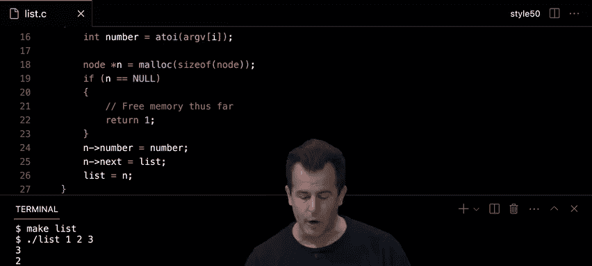

The running， how many steps are required right now， given the linked list of size N。

 if you want to go ahead and insert one more node， there's actually a reason I took this lazy approach of prepending。

 prepending。In big O notation， how much does it cost us to insert into a linked list？😡。

Think about it this way。 Does it matter how many nodes are already in the linked list。

 whether it's  one or 2 or 3 or 300 or 3000。 If you're prepending。

 doesn't matter how long that chain is。 You're just constantly putting it in the beginning。

 at the beginning at the beginning。 Now， how many steps is this。 I don't know exactly。

 I'd have to count the lines of code， But it's some small number。 It's like two steps，3 steps。

 How many lines of code is it， It's very few to prepen Prepen。

So I would dare say that the running time of insertion into a linked list is actually constant time。

 It's big O of1。 and that's super fast because it doesn't matter how big the list is boom， boom。

 boom， you've prepened to the list。 But there's a flip side。

 What's the running time of searching a linked list looking for something in it。

Finding a number in it。Well， if it looks like this。

 how long does it take you to find some arbitrary number that the human might ask you for？😡，Like。

 how many steps it will take to find me the number one if it's there。

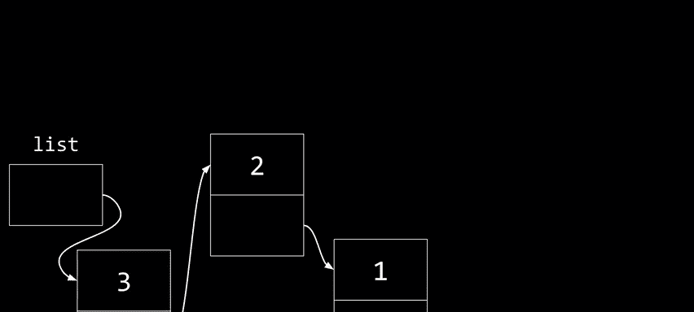

So N big O of n， because in the worst case， the number you're looking for might be all the way at the end。

 And even though you and I again have this bird's eye view and we can obviously see where the one is。

 the only way we can get to the one is by starting at the two。 How do you get to the two。

 you got to start at the three， How do you get to the three。

 you've got to start at the beginning of the list itself。

 And so whereas in the world of arrays where you had this contiguous chunk of memory。

 just like we had lockers on the stage weeks ago， and you could jump to the middle and then the middle of the middle and the middle of the middle of the middle。

 that was all predicated on contiguousness， why Because if you know where the first locker was。

 and you know where the last locker was， you can subtract one from the other D by two and boom。

 you get the index or the location numerically of the middle locker and you can do that again and again。

 I not do any such math here， the middle of this linked list is obviously here。

 But it doesn't matter what the location of this one is in memory doesn't matter what the location of this is in memory because they could be anywhere in the computer's memory。

 So you can subtract one from the other D by two。 And that's going。You in some random location。

 because these chunks of memory are not back to back to back to back。 They're every which way。

 So this is to say， what algorithm from week 0 can we not use on linked lists。

So binary search so that very algorithm we started the class with was all predicated on contiguous chunks of memory like an array。

 the problem with an array though， of course though。

 is that you paint yourself into this corner and you have to know in advance how many locations you want and if you round up your wasting space if you round down your wasting time so you're sort of screwed either way a linked list avoids those problems it's more of a dynamic data structure that can grow and frankly if we code it up it could even shrink we could remove these nodes back and forth and so we're not necessarily wasting time but on insertion but we are on searching this thing we're back to big O of n when it comes to searching a linked list as opposed to it being log n which was much much better So the upside of prepenending nodes in this way is that we have constant time insertion of new nodes because we just continually insert certain certain to the very beginning of the list of course a side effect of this is that the numbers might end up in like completely reverse order as they have here because I first inserted one。

😡，But then I prepened two and then I prepened three。

 Well we could perhaps take a completely different approach and append the nodes upon insertion instead。

 So for instance， if I start off with an empty list， I could then insert one。

 I can insert two and I can insert3 and in this case I actually get a bit lucky that now they are in fact in sorted order Now to be fair that's not guaranteed but let's at least consider what the code would look like if we were to take this alternative approach of a pending nodes instead of prepenending Well rather than write out the code from scratch let me open up a premade version of list C that even has some comments to explain what's going on some of this code is pretty much the same。

 but allow me to scroll down roughly to the middle where we'll see the actual logic and question So first on 35 here we're checking if the list is null because if there's no list yet it's actually pretty easy to prepen or append we're just going go ahead and update the list variable to point to this new node N。

 but if the list isn't empty and there's at least one node there already then what we're gonna to do is。

😡，This in line 45， we're going iterate over that existing linked list。

 and I'm going do so with a temporary variable called pointer or PR for short that's initialized to the beginning of the list。

 sort of a foam finger pointing at that first node initially I'm going to on every iteration update that pointer variable to point to the next node to the next node sort of pointing one node ahead with that foam finger but on each iteration。

 I'm also gonna make sure that the pointer variable is not null because if it is null。

 that means I'm sort of pointing past the end of the list or that is the list has ended But if inside of that loop。

 I notice that the current node's next field is null。

 I actually know logically that I'm at the end of the list without going past it。

 So at that point if my goal is to append this new node。

 I'm going to go ahead and set pointer arrow next which is currently null but set it equal to the address of this new node effectively appending that node to the end of the list so for instance。

 if we started with a list。1 and two， what we've just done is updated tos next field to be equal to the address of the node containing3。

 Meanwhile， the node containing three's next field is null by default because it is now the new end of the list。

😡，Now， what are the implications for maybe performance or efficiency now， Well。

 we are now appending to the list， which means we're no longer gaining constant time of insertion right because anytime we prepened。

 it took us some finite number of steps。 we just had to update a couple of pointers at the beginning of the list the beginning of the list and it doesn't actually matter how much longer the list is getting because we're never traversing the list when we're prepending。

 But when we're app pendingending by definition， we're finding the end of the list。

 finding the end of the list， finding the end of the list。

 And so our running time now for insertion is no longer big o of one or constant time。

 it's now big O of n because if there's n nodes in the list already， just to find the end of it。

 we need to actually traverse the whole list to actually find where this new node should go。

 But even so we've gotten lucky in this appending case that we inserted one than two then three。

 that's just because of my choice of inputs。 suppose that we don't know in advance what the inputs are going be。

 they might be large numbers， small numbers or anything in between。

 but they weren't not necessarily be an order。But if we want to maintain this linked list in sorted order。

 I think our logics actually going to have to change。

 So let me actually go ahead and open up a new version of my linked list code。

 this one to main in advance and in this version of my code as we'll soon see I've gone about changing the logic just a little bit so that I can actually now handle this additional case because when inserting nodes an arbitrary order if I wanted them to end up being sorted。

 I have to consider a few possible scenarios， maybe there's no list whatsoever。

 so let's actually look for that let me scroll down in this final version of my linked list code and actually that case here on line 35 is pretty much the same。

 if there's no list there in the list variable is null let's just update it to point to this new node but things get more interesting when there is at least one node there because if the goal is to maintain sorted order we now need to decide does this new node whatever its number is go before the beginning of the list。

😡，The end of the list， in the middle， some more of the list。 So let's break that down。

If we find that the new nodes number is less than the lists number here， well。

 then it belongs at the beginning of the list because it's smaller than any of the numbers already there。

 So what I'm going go ahead and do is update this new nodes next field to point at the current linked list。

 and then I'm going to update the linked list variable to equal the address of this new node。

 the effect then is no matter how long the existing list is if this new nodes number is smaller。

 then everything else in the list， I want to just kind of splice it in at the beginning。

 So that's actually pretty straightforward with just a couple of pointer updates。

 But the other scenario is that it doesn't just belong at the very beginning of the list。

 it's somewhere else in the list。 and that itself is two scenarios。

 maybe it's in the middle of the list， maybe it's at the very end of the list。

 So let's consider those scenarios as well。 let me scroll down here and in my else clause。

 it's a bit bigger this time why because on line 51 in this case。

 I'm going to induce another four loop as before。 But this time I'm trying to determine。

This node belongs at the end or somewhere in the middle。

 So I'm not just looking for the end this time。 I'm actually comparing the value。

 the integer inside of this new node against what is currently in the list。 So for instance。

 if logically I actually find my way all the way to the end of the list whereby the next field in the pointer variables node equals null will then logically I didn't find an earlier spot for this node。

 So let me go ahead and update that pointers next field to equal the address of this new node and then like before let's just break out because I'm done I somehow mathematically got all the way to the end of the list because there is that null pointer so it must be the case logically here that this new node belongs at the end。

 but this is the juicier slightly more challenging one。

 but it's what ensures that we can maintain sorted order。

 even if the new node belongs somewhere in the middle。 So down here on 62。

 I'm going ask this question。 if the new nodes number is less than the number in the。Next node。

 that is to say， if my phone think is pointing here。

 but the number I'm trying to insert is smaller than the next node over there and implicitly the same as or greater than the current nodes number。

 Well， then I'm gonna go ahead and do this。 I'm gonna update the new nodes next pointer to be equal to whatever the current node I'm pointing at next pointer so that I can then update that pointers next field to equal the new node。

 and then I can break out all。 doing a similar splice in the middle of this list。

 but manipulating a node effectively to the left and the right to make room for this new node。

 So collectively what does this code do。 Well， if we start out with that initially empty list and maybe we insert the number two。

 it just goes right there。 But suppose that we insert next the number one。

 which of course is smaller， this code now ensures that the one is going to get inserted at the beginning of the list。

 If we then insert the number four。 Well， that's bigger than one and bigger than two。 So it。

Logically is going to end up at the end of the list and lastly in this example， if we insert three。

 which again is initially out of order， this code can ensure that we still insert it in sorted order because it's going to end up in between nodes2 and4 So here too in terms of running time insertion is still big O of n it's not quite as bad in practice as always adding it to the end of the list the end of the list as was the case when we blindly appended new nodes but it is going to be in big O of n because in the worst case here if we've got end nodes in the list already。

 then in the worst case it might indeed be such a big number that it belongs at the end of the list。

😡。

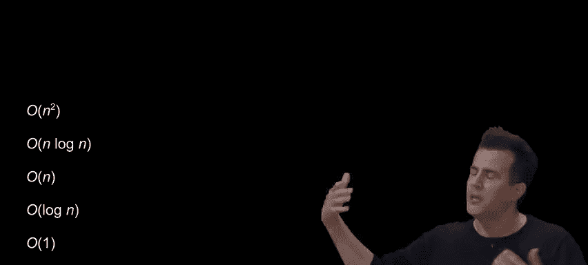

All right， that was a lot， let's go ahead and take a delicious cookie break here and we'll be back in 10。

😡，All right， we are back and to recap the problems we've solved and the problems we've created。

 our arrays were problematic because they were a fixed size and that could get us into trouble。

 or it causes us to waste more space preemptively even though we might not ever use it。

 so we introduced the linked lists again to solve that problem by being more dynamic and only allocate as much memory as we need on demand step by step。

 but of course we're spending extra space for the pointers。

 we might gain performance if we at least prepend all of our elements to it。

 but we lose time again if we append or insert in sorted order。 So it's not clear， frankly。

 I think to me and even hearing these upsides and downsides if there's a clear win。

 but maybe there's a way to get the best of both worlds by trying to capture the upsides of having information that is kept in sorted order that allows us to maybe divide and conquer still but still gives us the dynamism to grow or shrink the data structure and thus we're born trees。

SoWhat we're about to explore are variants of these ideas of arrays and linked lists and see if we can maybe kind of mash up some of those building blocks and create more interesting。

 more compelling solutions that are even not just one dimensional sort of left to right。

 but are maybe two dimensional and sort of have different axes to them or dimensions。

 So a tree in the real world of course， tends to grow up from the ground like this。

 but it tends to branch out and branch branch。 And that might already in your mind's I evoke notions of forks in the road or conditionals as we've seen。

 And let me propose that we first consider what the world calls binary search trees and so by is back in that we can do things in half and half and half somehow if maybe we think about arrays a little bit more cleverly。

 So here's an array of size 7。 And I chose that deliberately because there's a perfect middle there's a middle of middle and so forth。

 just like the lockers a few weeks back。 So when the world of arrays like this was actually pretty efficient because we can do binary search and middle of middle middle middle。

😊，middle and so forth。 And that gave us logarithmic running time。 But it's only size 7。

 And we concluded that it's gonna be like big O of n headache to copy this into a slightly bigger array。

 free the old memory and so forth， and thus we're born linked list， but with linked list。

 we lost log of N running time。 Why because we have to always start the beginning to get。

 for instance， to the middle or to the end of the list in the worst case。

 But what if we start to think a little more cleverly in multiple dimensions。

 So just for the sake of discussion， let me highlight the middle of this here array。

 let me highlight the middle of the middle and then the middle of the middle of the middle。

 So there's sort of implicit structure here， there's a pattern of sorts。 And in fact。

 just to make this more obvious。 let me not treat this in as one dimension left to right。

 but how about two and give myself a bit of vertical space。

 So it's the exact same array but allow me to just think about it now as though the middle elements way up here。

 the middle of the middles are slightly lower and the middle of the middle of the middle or the leaves really are at the bottom of this tree。

 And that words deliberate。 we actually borrow vernacular from the world of trees。

The leaf nodes or leaves are the ones at the very bottom and the root node is the one at the very top。

 So for the sake of discussion， computer scientists draw trees like this instead of like this。

 but it's the exact same idea they just tend to grow down in discussions more like a family tree if you drew those growing up for instance So what's interesting here。

 Well at the moment we've sort of broken the array model because this memory is absolutely not contiguous because this number here。

 this number here here here and here it's all over the place。

 but we do have pointers now in our toolkit whereby even if these numbers are anywhere in the computer's memory。

 we can kind of stitch them together like we did string and those balloons now it's not sufficient just to have one piece of string for each node or one pointer but what if we actually give each of these nodes not just a number like the number four。

 the number two， the number six， let's give them each a number and two pointers a so-called left child and a right child so to speak so we。

Do this。 And I'm gonna abstract away now。 technically。

 there's like they're not even rectangles anymore。 like the really long rectangles or they're like sort of upside down Ts that have three boxes to them。

 but I'm just gonna to abstract away nodes now is just simple squares and it's an implementation detail as to what thestructs actually are。

 But the arrows suggest that each of these nodes now has two pointers。 You don't have to use them。

 the leaf nodes have nothing to point to。 So those can all be null probably but each of these nodes now has two pointers。

 Now， what's the implication of this。 this here is what we call a binary search tree because one and first and foremost。

 it's obviously a tree。 But it also is a data structure that's kept in sorted order whereby notice what is true。

 if you pick any node in this tree， like the number4， everything to the left of it， its left subte。

 so to speak is smaller。 Everything to the right of it。 It's right subte is larger。

 and that's true elsewhere， look at the6。 Everything to the left is smaller。

 Everything to the right is bigger。And same thing over here So in some sense。

 this is a recursive data structure because you can say the same thing about each of these nodes because each of these subtrees compose a larger tree or conversely this big tree is a composition of one two subtrees plus one more node so think back to our mar example in those bricks Well what's a pyramid of height4 Well there's a pyramid of height 3 plus one more row What's a tree of height 3 well it's two subtrees of height 2 plus one more row or really one new root node to connect them So this already is sort of a recursive data structure by that logic how do we translate this into code Well we won't sludge through so much low levell C code this time around but let me propose that we could implement a node now as being similar in spirit to what we did last time where every node used to have a number and a next pointer but now let's actually make some room for ourselves and redefine a node is still having a number but now having two pointers and I'll call them obviously left and right that we can call them。

😡，Anying we want。 I could call it next and previous。

 but really left and right would seem to make more sense with children of a given node like this。

 So this in C is how we might implement， therefore a node in a binary search tree。

 And so let's consider pictorially what the running time is of searching for something。

 If this here is the tree。 And it follows that binary search tree definition where everything to the left is smaller。

 everything to the right is bigger， Well， how many steps might it take。

 if you have n nodes in a tree like this。 Well， it's not gonna take me n step。

 because I certainly don't have to look through every node。 And in fact。

 just like a link list starts on the lefthand side。 so to speak。

 though that's just an artist' rendition。 just as a link list starts on one end and you have to traverse the whole thing。

 a tree， because it's two dimensional always starts in memory at the root node。

 So this is always where you start any operation in search and deletion searching。

 So by that logic in the worst case， if there's n nodes here， how many steps would it seem to take。

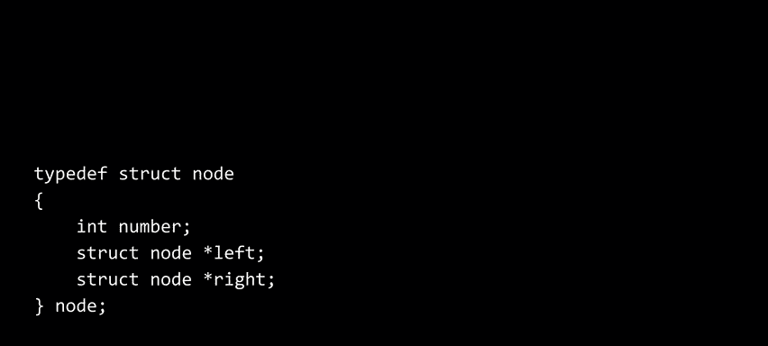

It's not big O of N， but。So it's actually back to big O of log n why。

 because actually if you kind of think of the height。

 there's roughly8 nodes in here in log base2 of 8 is actually 3。 and so 1，2。

3 is the height of this tree。 So in the worst case at the moment it seems that it's only going take me like one node。

 two nodes， three nodes or really just two steps to get to the very bottom of this tree to decide is a number there or not。

 I certainly can ignore like this entire subtree why because I'm searching for the number 7。

 just like the phone book from week 0， I can kind of divide and conquer this problem。

 if I'm looking for 7， I don't need to bother wasting any time looking at this entire subtree。

 which is almost 50% of the picture on the screen and so I can focus on this half than this half and boom I'm done。

 So we sort of have binary search back。 we have the metaphor of the lockers back by operating now in two dimensions to mitigate the reality that our memory is no longer contiguous。

 but that's fine。 we can follow these arrows。 We can use these pointers instead to get any。

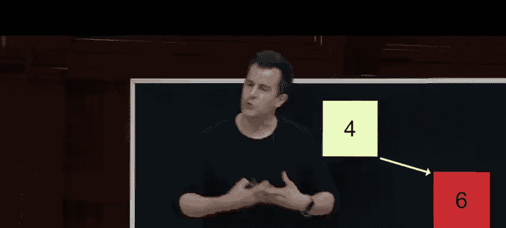

Where that we actually want。So any questions now on trees or specifically binary search trees。

 which I dare say are sort of like the best of both worlds， all of the upsides of an array。

 And it's like log and running time and all of the upsides of the dynamism of linked list。

 because this thing can grow and shrink。And doesn't need to be contiguous。Any questions on this？

Alright， well， the code2 lends itself to relative simplicity。

 and here's where recursion applies not just to the structure of the data， but also the code itself。

 So just for the sake of discussion， we won't run this kind of code。

 We'll just look at it on screen here。 suppose you're implementing a function called search whose purpose in life is to search a tree and return true or false。

 I found the number you're looking for。 Well， here's the number I'm looking for。

 It's one of the arguments。 and the first argument more importantly。

 is actually a pointer to the tree itself。 a pointer to the root of the tree。

 And that's all the information we need to search a tree and go left， go right， go left。

 go right How well， let me do this as always， we'll have a base case when it comes to recursion。

 because if there's no tree there then it makes no sense to even ask me this question。

 I'm just gonna return false。 if you hand me null， there's nothing to do return false。

 But suppose that you don't hand me null and suppose that the number I'm looking for is less than the number in the tree at the moment。

 the number at that root。 Well， what do I want to do， I effectively want to go left。

 I want to search the left。re，How do I do that， I'm going to return the recursive return value from the same search function passing in a slightly smaller tree。

 a socalled subtree， but the same number。 And this is where recursion is kind of beautiful。 Like。

 look at the relative simplicity of this。 If search exists。

 which it doesn't exist in its entirety yet。 but we'll get there。

 If you want to search half of the tree， just go there， So go to the root of the tree。

 follow the left child's pointer and pass that in because it's a tree， it's just a smaller tree。

 but pass in the same number。 What if though it's a bigger number。

 So what if the number you're looking for is bigger than the number at the root of the tree。 Well。

 then just search the right subtree instead。 And now logically， what's the fourth and final case。😊。

If it's equal。 so I can express that as if the number you're looking for equals equals the number in the tree。

 That is the root of the tree。 then I'm gonna to go ahead and return true。

 And you might remember from our days with scratch， like even this conditional is not necessary。

 I just did it to be explicit。 We can tighten that up as just an else instead。

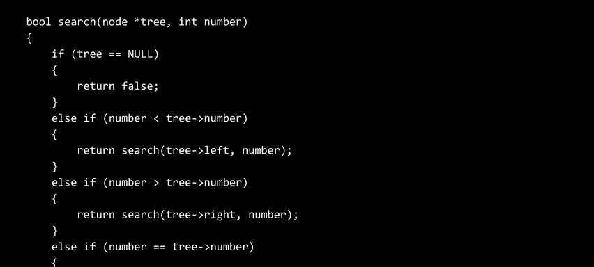

And that's it。 And this is where， again， recursion finally is maybe a little more accessible。

 a little more obvious in it's cleanliness。 There's relatively little logic here。

 but what's important is that these recursive calls here and here are dividing and conquering the problem implicitly why。

 because it's solving the same problem。 Search for a number。

 but it's doing it on just half of the tree， or the other half of the tree。

 And because we have this base case here， even if you get all the way to the bottom of the tree and you try to go down the left child or you try to go down the right child。

 but those pointers are null， then you know， you didn't find it because you would have returned true sooner if anything had been。

 in fact equal。 So that then is recursive code for searching a binary search tree， which is again。

 just to connect the dots of what we introduced last time of actually doing things now recursively and revisiting some of our own week zero problems。

 but I'm kind of lying to you here。 like， yes， this is a binary search tree。

 but it's not always as pretty as this， it's certainly not always seven elements。

 but it doesn't actually you have to be as well。😊，As this one here is， In fact。

 suppose that we insert the following numbers into an empty list。 starting with two。

 I can pp the two right there。 That's the current root of this tree。 supposeuppose， though。

 that I insert next， the number How about one， Well。

 it stands to reason that it should go now to the left。 And so now this is the tree of size 2。

 now I insert the number， say3， it， of course， can go there。 So that makes perfect sense。

 And I just kind of got lucky。 because I inserted these numbers as two， then one then three。

 I very cleanly got a balanced tree that sort of know weighted properly left and right。

 But what if you have a more perverse set of input so to speak， You're not lucky。

 and like a worst possible situation happens in terms of the order in which the human is inputting data into this data structure。

 What if the human inserts one first， Okay， well goes as the root of the tree。

 But here's where things get starts to devolve。 What if the human then inserts 2， Okay it goes there。

 What if the human then inserts 3。 Well， according to our definition， it goes there。 It looks like。

part of a tree because of how I've drawn it， but what is it really？If you kind of tilt your head。

 right？It looks really just like a linked list。 and there really is no second dimension。

 I've drawn it this way。 But this for all intents and purposes is a linked list of size 3。 Why。

 because there's no having。 There's no actual choosing left or right。 Now this is fixable。

 How could you fix this。 It's still the same number is 1，2，3。

 And it does adhere to the binary search tree definition。 Every number to the right is greater。

 Every number to the right is greater。 Every number to the left is Well it's inapplicable。

 but it certainly doesn't violate that definition。Could you kind of fix this tree somehow and make it balanced so it's not devolving into big O of N。

 but it's still technically log of n。What should be the root？😡。

So I could reverse the pointer from one to two Yeah。 And so sort of pictorially。

 if I kind of take this and I just kind of like swing everything over and make two the new root。

 then indeed， this could be the new route up here， one could be hanging off of it over here and three can be hanging off of the two as is So long story short。

 when it comes to binary search trees， by themselves。

 they don't necessarily guarantee any sort of balance。 So even though theoretically， yes。

 it's big O of log n， which is fantastic， not if you get a perverse set of inputs that just happen to be。

 for instance， the worst possible scenario Now it is fixable。 And in fact。

 in higher level courses and computer science specifically on algorithms and data structures。

 you'll be introduced if you go down that road of how you can tweak the code for insertion and deletion in a binary search tree to kind of make these fixes along the way。

 And it's gonna to cost you a few more steps to kind of fix things when they get out of whack。

 But if you do it every insertion or every deletion。

 at least you can maintain a balanced tree and you'll learn about different types。balanced trees。

 but for our purposes now， we don't necessarily get that property。

 even if we do want log N unless you keep it balanced along the way。😡，Now。

 what about other combinations of arrays and linked list。

 like we can really start to mass these things up and see what comes out of them。

 Dictionaries are another abstract data type， similar in spirit to stacks and cues and that you can implement them in different ways。

 a dictionary is a data structure that stores keys and values。 and those are technical terms。

 keys and values。 The analog in the human world it would be like literally a dictionary that you'd have in a classroom like a dictionary with words and definitions more generally known as keys and values。

 So that's all a dictionary it is， it associates keys with values。 So for instance。

 you could think of it almost as like two columns in a spreadsheet where on the left you put the key on the right you put the value or specifically you put the word in a dictionary and the definition thereafter and that's roughly how the pages on the printed pages in a dictionary are laid out So dictionaries associate words with definitions or more generally keys with values。

 but it's an abstract data type and that we could implement。

A bunch of ways we could use maybe two arrays， one array for the keys， one array for the definitions。

 and you just kind of hope that they line up at bracket I and this one is the maps to bracket I in this one。

 but an array is not going give us the dynamism that we want might run out of space when Marm Webster or whoever comes up adds new words to the English language you might not want to be using an array。

 you might want to use a length list。 but again， linked list devolve into big O of n and that's not good for dictionaries and spell checking if you have to check every possible word to find something。

 getting something that's a little faster than that is compelling So let's consider how maybe Apple。

 maybe Google， maybe others are actually implementing contacts because even though I implied in week0 and maybe outright said。

 it's an array it's a big list of all of your names of contacts， maybe of some fixed size。

 they probably better be using some variance of a length list otherwise you could never add more friends potentially you'd max out and they'd say you have to unfriend someone just to fit it。

As an aside， this is sort of true in the social media world Like once you have like 5000 friends on Facebook。

 you can't have 50001。 once you have some number on LinkedIn， you can't have more connections。

 that's not necessarily that they're using arrays， but it is the same implication that they've chosen some finite size for memory。

 So how might we consider implementing a dictionary specifically for your address book or your context so you can store the names of everyone ideally alphabetically but also their phone numbers and maybe anything else。

 Well， ultimately we want to be able to get at someone's name and lead to their number So the keys and values for our discussion here will be names are the keys and phone numbers are the values。

 but the values themselves could also include email address and mailing address and all of that。

 but we'll keep it simple names and phone numbers So here's how you might think about this or draw it on a chalkboard to columns or in a spreadsheet left and right but how could we actually implement this in memory because ideally we don't want it to devolve into something linear like we don't wantna have to look through all of my friends and family and colleagues to find someone who's。

Name starts with Z， for instance， or anything else。

 It would be nice to have something logarithmic with binary search， but with binary search again。

 we have to maybe I maybe use a tree instead， but now we have to use two pointers instead of one。

 there's a lot of tradeoffs here。 let's see how else we could solve this same problem because wouldn't it be nice。

 and we've not really talked about this before。 if we instead aspire to this sort of holy grail of algorithms。

 like the best algorithm out there is surely one that's big O of one like constant time because what that means is it doesn't matter if you have one friend。

10 friends，1 hundred1000 a million a billion friends doesn't matter how big n is。

 your searches will always take you the same amount of time。 It is independent event。

 And that's why it's sort of the ultimate goal for performance。

 So can we get to this this aspiration。 Well， a couple of building blocks。

 There's this notion and computing known as hashing and hashing is a technique， literally a function。

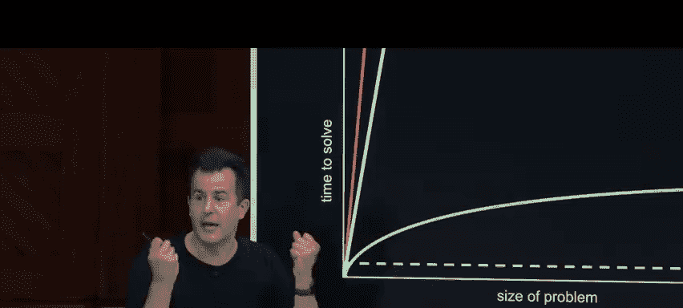

In math or in code that actually takes any number of inputs and maps them to a finite number of outputs。

 So if you think back to like high school math domains and ranges。

 you can take an infinite domain with any values in the world。

 but it reduces them a hash function to a finite range of specific values。 So for instance。

 it's no accident that we have these four buckets on the stage now each of which has a suit from a deck of cards。

 we got for visibility sake the biggest cards we can the super jumbo playing cards and in this box or a bunch of randomly ordered playing cards。

 And typically if you were to ever like play some game or you wanted to sort these for some reason。

 how would you go about sorting them by suit and also by number， you know odds are for you like me。

 you'd probably kind of take some shortcuts and maybe pull out all of the hearts pull out all of the spades pull out all of the clubs or you kind of bucketize it into categories。

 And that term is actually technical here are four buckets to make this clear。 And for instance。

 if the first card I find is like the five of hearts， you know just to kind of make my life easier。

I'm gonna put that into the hearts bucket or here we have four。

 here we have five here we have six here we have queen and notice that I'm putting these cards into the appropriate buckets why because ultimately then I'm gonna have four problems but of smaller size of 13 size problem 13。

1313 and frankly it's just gonna be easier cognitively。

 dares say algorithmically to then sort each of the 13 cards in these buckets rather than deal with like four suits somehow combined altogether So if you've ever in life made piles if you've ever literally use buckets like this you are hashing I'm taking some number of inputs 52 in this case and I'm mapping it to a finite number of outputs for in this case So hashing again just takes in inputs and hashes them to output values in this way So beyond that terminology。

 let's consider what we can now do with hash functions that's a little more germane to storing things like our friends and family and colleagues and dictionaries。

 a hash function。😡，It's just one that does that。 I。

 as the human was just implementing or behaving like a hash function。 But technically。

 a hash function is actually a math function or a function in C or scratch or soon Python or other languages that takes as input。

 some value， be it a physical card or a name or a number or something else an output some value。

 And we can use hashing as an operation to implement what we'll call hash tables。

 And that's kind of what that dictionary was。 If you think about how I drew it on the screen is two columns。

 It's like a table of information。 Keys on the left values on the right。 So what is a hash table。

 The simplest way to think about it is that this is an amalgam of a combination of arrays and linked lists。

 we kind of borrowed some ideas of linked lists a moment ago to give us trees and two dimensions。

 What if we stick with this idea of having two dimensional world。 But now use an array initially。

 So we get the speed benefits of an arrays because everything's contiguous。

 we can do simple arithmetic and jump to the middle or the middle of the middle the。😊。

So the last very easily。 And then you know what， let's kind of use the horizontal part of the screen to give us linked lists as needed。

 So for instance， if the goal at hand is to implement the contacts in my cell phone or my Mac or PC。

 let me propose that we start at least in English with an array of size 26。

 Of course it's zero index So it's really location 0 through 25 and for the sake of discussion。

 let me propose that location 0 represents a location 25 represents Z and then everything else in between why we know from C that we can convert things to ASI and Uniode from letters to numbers and back and forth。

 So in constant time we can find location a in constant time we can find location Z why because we're using an array just like in week2。

 All right， well suppose that I want to think about these more letters of the alphabet。

 the English alphabet rather than numbers So it's equivalent to label them a through Z And suppose now I want to start adding friends and family and contacts to my address book。

 How might this look Well。first one I want to add is Mario。 Mario's name starts with an M。

 And so that's， A，B，C， D， E okay M goes there。 So I'm gonna put Mario at that location in the array。

 After that， I add a second person for instance， how about Luigi Well L comes just before M。

 So it stands to reason that it goes there in the array。 Meanwhile。

 if I go and add another character like Peach， she's gonna go there。

 a few spots away because her name starts with P。 Meanwhile。

 here's a whole bunch of other Nintendo characters that happen to have unique letters of their first names。

 and there's room for everyone room for everyone on the board A through Z with some blanks in the middle。

 But you can perhaps see where this is going when and where might a problem arise with this array based approach。

Yeah， so when we add someone else whose name collides with one of these existing characters just because by accident。

 they have a name that starts with the same letter。 So for instance， there's Lock2 here。

 which collides with Luigi， potentially， Here's link who collides with both of them。

 But I've drawn a solution to this along the way。 I could， if I was toronian。

 just remove Luigi from the data structure and put Lock2 in or remove and then put link in there instead。

 but that's kind of stupid。 if you can only have like one friend whose name starts with L。

 like that's just bad design。

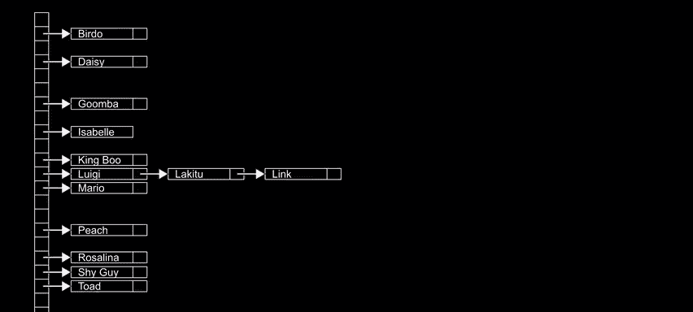

But what if we now in the off chance， I have two friends whose names start with the same letter。

 Well， I'll just kind of string them together， link them together。

 No pun intended using pointers of sorts。 So my vertical here is an array。

 And this is just an artist rendition。 There's no actual notion of up down left right in the computer's memory。

 But this is my array always of size 26， And each of the elements in this array are now not a simple number。

 but it's a pointer to a linked list。 And if there's nothing there， it's just null null null， null。

 but otherwise it's a valid address that points to the first node。

 And you know what if we have multiple names with the same letters。

 we can just string these nodes together together using pointers as well。

 So a hash table then as implemented here is an array of linked lists。 And that allows us to one。

 gets some speed benefit because look how fast we inserted or found Mario。

 Luigi and Peach but it's still covers the scenario where okay， some people can have the same first。

LetSome of these names will collide。 So collisions are an expected problem with a hash table。

 whereby two values from some domain happen to map to the same value。 And frankly。

 you'll see this here， too。 So these buckets are technically a finite size。

 they're definitely big enough for 13 cards each。 but you could imagine a world where if I'm using two decks。

3 decks or four decks， I'm gonna run out of space。 and then my data structure can't fit any more information。

 But we're not gonna have this problem here because the link lists as we've seen can grow and even shrink as much as they want。

 in the world in Nintendo， there's actually lots of collisions and these aren't even all of the characters。

 So that's then a hash table。 So with a hash table in mind， how fast is it。

Did we achieve that holy grail of like constant time？ Well， for some of these names， if I back up。

 Yeah， it's kind of constant time。 like Yoshi and Zelda boom， Contant time， locationcation 24。

 locationcation 25， some of them， though， like Lu， dude link。

 it's not quite constant time because I first have to get to Luigi's location。

 And then I have to follow this linked list。 So technically， then。

 what's the running time of searching a hash table。😊，Sometimes you'll get lucky。

 but sometimes you won't。Consider the worst case。 Big O is often used to describe worst case。

 So what would be the worst case in your own contacts。Little letter。So and why？😡，Correct。

 and so to summarize， like， some weird scenario， like all of your friends and family and contacts could have names that start with the same letter。

 And then it doesn't matter that this is a hash table with an array of linked list for all intents and purposes。

 if your friends names only start with the same letter。 all you have is a linked list。

 much like with a tree， if you don't keep it balanced， all you have really is a linked list。

 So technically speaking， Yes， hash tables are big O of N。

 even even if you're good about even if you have in the worst case。

 hash tables are big O of N because it can devolve into this perverse scenario where you just have lots and lots of collisions all at the same values。

 But know， there's got to be a way to fix this right Like how could we chip away at the length of these chains so to speak。

 could I decrease the length of these linked lists so that with much higher probability。

 there's no collisions， Well， maybe the problem is that I started with just 26 buckets。 I mean。

 four buckets here，26 here， maybe the problem is the size of my array。

So what if I instead just give myself a bigger array and it's too big to fit on the screen。

 but what if I instead have a bucket for names that start with LAA and LAB and LA La do dot dot all the way down now when I hash these names into into my hash table Locktu' is going to end up at their own location here link at their own location here。

 Luigi at their own location here and so now I don't have link lists。

 I really just have an array of names so now I'm actually back to constant time why because so long as every letter of the alphabet has an ASI value I can get that in constant time and we did that as far back as week1 and so I can figure out what the arithmetic location is of each of these buckets just by looking at one。

 two three characters or the total number of letters that I care about which is just three in this case so this feels like a solution even though I haven't drawn all the names it feels like we've solved the problem but。

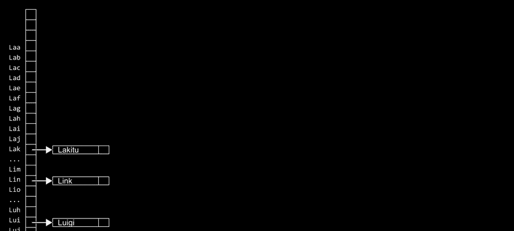

What's the downside or trade off of what we've just done。谁？

Memory so not pictured here is the dot dot dot and everything above and everything below this just exploded in terms of the number of locations in this array。

 why， because if I'm taking into account not just the first letter， but the first。

 the second and third， that's 26 to the third power，26 times 26 times 26。

 And even though there's gonna be a crazy number of names that just don't exist。

 I can't think of an Nintendo character whose name starts with L， you still need that bucket， why。

 because otherwise you don't have contiguousness， you can't just arbitrarily label these buckets。

 if you want to be able to use a function that looks at first second third letter and an arithmetically figures out where to go。

 whether it's 0 to 25 or 0 to 26 to the third power minus-1 being the number of buckets there。

 So there's a tradeoff there。 you're wasting a huge amount of memory just to give yourself that time。

 but that would then give us constant time。 So in that sense， if we have an ideal hash function。

 whereby the function insurers。That no values collide。

 We do actually obtain that holy grail of big O of one。

 because it only takes one or maybe three steps to find that name's location。 Now。

 to make this clear， how do we translate this as something like code。 Well。

 here again is thestruct we used last time for that of a person and a person had a name and a number here for a hash table。

 we might do something a little bit differently。 We might now have a node in a hash table storing a person's name。

Person's phone number and a pointer to the next such person in that chain if needed。

 hopefully this is gonna be null most of the time all of the time。

 but we need it just in case we do have that collision。 we've seen in our pictures。

 the names like Mario Luigi and so forth。 We didn't see the numbers but that's what's inside of those boxes on the picture。

 but that kind of node would give us what we need to build up these linked lists。 Meanwhile。

 what is the hash table itself， that vertical strip along the left。 Well。

 it's really just a variable we could call it table for short of size 26 and each of the locations in that array that was on the side here。

 at least in the simple small version was a pointer to a node So it's null if there's no no one there or it's a valid address of the first node in the linked list。

 So this then is a hash table and each of those nodes to be clear would be defined as follows。

 So what's the takeaway then with a hash table， ideally with a good hash function and with a good set of inputs where you're not presented with some perverse set of input。

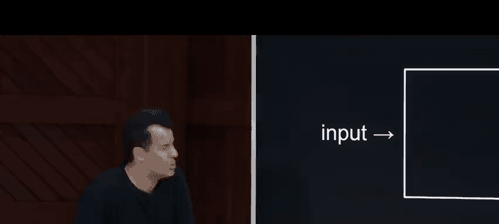

That's like all of the friends whose names start with the same letter。 ideally。

 what the hash function will be doing for you is this。 The input is gonna be someone's name。

 The algorithm in the middle is going be the hash function and the output is the so-called hash value or location in this case。

 So for instance， in the case of Mario， when we had just when we had just 26 buckets total the input to the hash function would be Mariio。

 that hash function would really just look at the first letter M in that case and would ideally output the number 12。

 I did the same thing， but in my head， whenever I pulled out a card like the five of diamonds here。

 I figured out okay that's location 0 out of my 0，12。

3 or4 total buckets here we're doing it instead alphabetically。 And so someone like Luigi meanwhile。

 would have a hash value of 11 these numbers would be bigger of course， though if we're looking at 1。

2，3 letters instead of just one。 So with that said， if we were to implement this in actual code。

 a hash function I did it sort of。By acting out the cards。

 Here is how we might implement this in code using C。 I could have a function called hash。

 whose argument is a string， Aka cha star， the a name of which is word where the word is like the first name first word in their name。

 we want this function to return an inch， which ideally in this case of 26 buckets would be a number from 0 to 26。

 And how do we achieve that。 Well if we use our old friend C type。

 which had a function like two upper from a couple of weeks back。

 we could pass in the first letter of that word capitalize it。

 which is gonna give us a number that's 65，66，67 on up for the 26 English letters。

 And if I subtract 65 Aka quote unquote a single quotes because it's a char。

 that's going to mathematically give me a number between 0 and 25 inclusive。 There's a potential bug。

 if I pass in punctuation or anything that's not alphabetical like bad things will happen so I should probably have some more error checking。

 but this is the simplest way in code that I could implement a hash function。

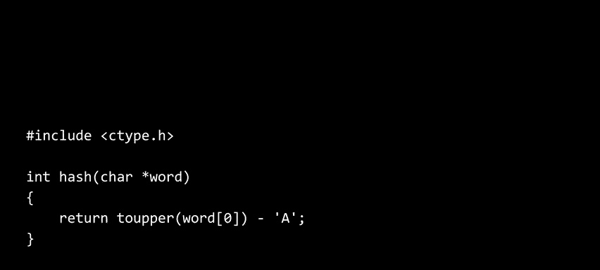

It looks only at the first letter of their name， Probably not ideal because I can think of friends in the real world who have the same first letter of their name。

 whether this is better or worse than looking at two letters， three letters，4 letters。

 it's going to depend on how much memory you want to spend and how much time you want to ultimately save Let me tweak this though a little bit it's conventional and see just so you know that if you're passing in a string that is a char star to a function and you have no intention of letting that function change the string you should probably declare the argument to the function is con and that will tell the compiler to please don't let the human programmer actually change that actual word in this function it's just not their place to do so and we can actually do something else in a hash function because you're using in this case。

 the output， the integer as a location in an array it had better not be negative you want it to be zero or positive And so technically if you want to impose that in code you can specify that the int that's being returned has to be unsigned that is it's zero。

Up through the positive numbers， it is not a negative value。

 So this is slightly better than the previous version where we didn't have these defenses in place。

Alright， so what does this actually mean in practice。

 you don't get to necessarily pick the hash function based on the names of your friends。

 presumablys Apple and Google and others already chose their hash function independent of what your friends' names are。

 So ideally， they want to pick a hash function that generally is quite fast Big O of1。

 But practically speaking in a hash table unless you get really lucky with the inputs which you generally won't really。

 it's big O of n running time。 Y， because in the worst possible scenario。

 you might have one long length list。 But in practice， ideally， and this is a little naive。

 But suppose that you have a uniform distribution of friends in the world where one1 26 of them have names starting with a。

 and then another 126 out of B and then dot dot dot Z。

 that would be a nice uniform distribution of friends。

 technically then youre running time of a hash table for searching it or deleting or inserting。

 but technically be big O of n divided by K where K is the number of。😊，It's a constant。

 So it's technically big O of n divided by 26。 Now again， per our discussion of big O notation。

 that's still the same thing right you get rid of constant factors。 So yes。

 it's 26 times faster the chains are 2126 to the length。

 but basymptically in terms of big O notation， it's still big O of N。

 And here's where now we can start to veer away from like what is theoretically right versus what is practically in reality in the real world if you work for Google。

 Microsoft Apple and others 26 times faster is actually faster in the real world。

 even though a mathematician might say that's really the same thing。

 but it's not like the real world wall clock time。 if you watch the number of seconds passing on the clock N over K is a much better running time than big O of N。

 So here too， we're getting to the point where the conversations need to become a little more sophisticated。

 it's not quite as simple as theory versus practice。

 it depends on what matters ultimately to you but ideally in little。

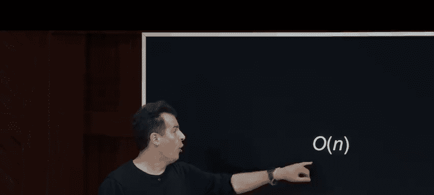

If somehow or other， they picked an ideal hash function。

 big O of one would really be the ideal here would really be the running time we achieve。

 And what you'll generally find in the real world is that you don't use hash functions that are as simplistic as just look at the first letter And honestly。

 they won't generally look at the first in the second and third letter。

 they'll use some even fancier math to put real downward pressure on the probability of collisions so that yes。

 they will still happen but most of the time， a really good hash function。

 even if it's not quite ideal will be darn close to constant time。

 which makes hash tables and in turn dictionaries， one of the most universally compelling data structures to use Now。

 with that said， we have time for just another data structure or so。 And this is not a typo。

 This one's called a try and a try short for retrieval， which is weird because you say retrieval。

 but we say try， but that's the etymology of try and a try is sort of the weirdest amalgamation of all of these things whereby a try is a tree of arrays。

 So a has。Table is an array of linked lists。 A try is a tree of arrays。 So at some point。

 computer scientists just started like mashing together all of these different inputs。

 and let's see what comes out of it。 But a try is actually really interesting。

 And what you're about to see is a data structure that is literally big O of one time constant time。

 but there is a downside。 So in a try， every node is an array。

 And every location in that array generally represents a letter of the alphabet。

 that you could generalize this away from words to。 But a try in this case， if we have a root node。

 that root node is technically a big array with 26 locations。

 And if you want to insert names or words more generally into a try， what you do is this。

 you hash again and again and again， creating one array for every letter in your word。

 So what do I mean by that。 if we've got 26 elements here。 this would be representing a。

 this would be representing Z and initially these。😊，All no by default。 when you have just this route。

 But suppose I want to insert a few friends of mine， including toad， for instance， T O A is the name。

 So how would I do that， I would first find the location for T based on its number 0 through 25。

 And if this is T， what would I then do。 I would change the null to actually be a pointer to another node Aka another array。

 And then I would go into the second array and hash on the second letter of toad's name， which is。

 of course， O。 And then I would set a pointer to a third node in my tree。

 which wed be represent it here。 So another 26 pointers。

 Then I would find the pointer representing a， and I would create finally a fourth node。

 another array representing the fourth letter of toad's name。 But because toad's name ends with。😡，D。

 and therefore I already have four nodes here。 We need to specially color。

 though we could probably use an actual variable here。

 I need to somehow indicate that Toad's name stops here。 So it's not null per se。

 this actually means that T OA is in this data structure。

 But I did this deliberately because another friend of mine might be Tot in the Nintendo world。

 And Todt， of course， is a super string of toad that is it's longer， but it shares a common prefix。

 So Tot could continue， and I could have another node for the E， another node for the T。

 another node for the second T and another node for the last E。

 but I somehow have to sort of mark that E it's the end of her name as well。

 So even though they share a common prefix。 the fact that there's two green boxes on the screen means that T Oad is in this dictionary as a key as is T OA D E T T E is another key。

 And technically speaking， what's in these boxes too， it's not just a pointer。

 it's probably toad and Todt's phone number and email address And like the actual value。

Of the dictionary， which is to say this too is， in fact， a dictionary。

 A dictionary is just an abstract data type， a collection of key value pairs。

 just like I claim to stack and a cus in how you implement it can differ。

 You could implement it with a hash table， an array of linked list as we just did。

 or you can implement a dictionary as a try， a tree of arrays。

 And let me add one more name to the mix， Tom， for instance。

 about a name from the universe T O M just means that， okay。

 that name exists in this structure as well。 Now， what is the implication of storing the names in this way。

 which is sort of implicitly。 like I'm effectively storing toad and toadt and Tom in this data structure。

Without actually storing T or O or A or D or any of the other letters。

 I'm just implicitly storing those letters by actually using valid pointers that lead to another node。

And so what's the implication of this encode code。 Well， in code it might look like this。

 Every node in a try is now redefined as being an array of size 26。

 and I'll call it children just to borrow the family tree metaphor。 and that in each of these nodes。

 there is room for the person's phone number， for instance， Aka string or char star。

 So what is this mean， well， if there's actually a non null number there。

 that's equivalent there being a green box。 Like if you actually see plus1 61，7 whatever there。

 that means there's a green box because toad's number is right here or tod's number is down here or Toms is over there。

 But if this is null， that just means that maybe this is the T or the O or the E which are not actually ends of people's names。

 So that's all these nodes actually are。 And if we think back now to what this data structure looks like this is。

 in fact， a data structure that can be navigated in constant time。 Why well。

 all we need to keep track of this data structure is literally one pointer called。

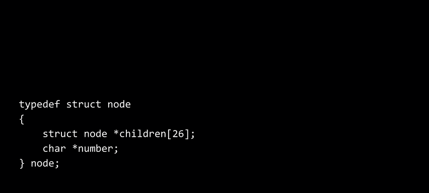

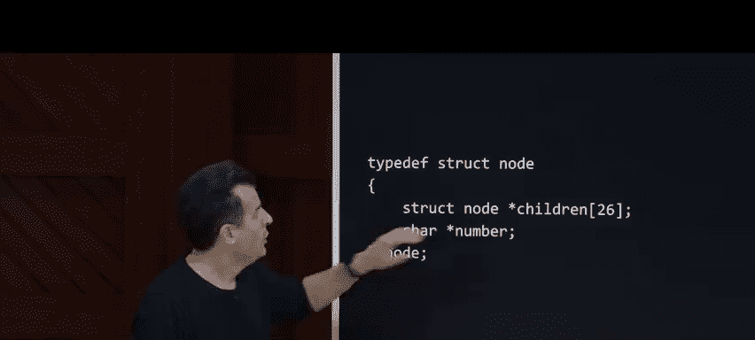

TThat's a point or to the first of these nodes， the socalled root of the try and when it comes to now thinking about the running time of a try。

 well what is it， Well， if you've got n friends in your contacts already or if there's N keys in that data structure。

 how many steps does it take to find anyone Well whether I have three names， Toad。

 Todt or Tom or3 million names in that data structure。

 how many steps will it take me to find toad ever。😡，T， O， A D， How many steps for tot， T， O， A D， E。

 T， T E 8 steps， How about for Tom 1，2，3， And frankly， I'm sure if we looked it up。

 there's probably a limit on the number of characters in an Nintendo characters's name。

 maybe it's 20 characters total or maybe a little longer 30。 There's some fixed value。

 It's not unbounded。 There's not an infinite number of letters in any Nintendo characters's name。

 So there's some constant value， call it K。 So no matter whose name we're looking for。

 it's gonna to take you maximally K steps， but K is a constant。

 And we ever always said that big O of K is the same thing as big O of one。

 So for all intents and purposes， even though we're taking a bit of liberty here， searching a try。

 inserting into a try， Deleting from a try is constant time。

 because if you have a million a billion names in the dictionary already。

 it's going take up a huge amount of space， but it does not affect how many steps it takes to find toad or todt or Tom that depends only on the length of their names。

 which effectively is a constant value。But there is a downside here。 And it's kind of a big one。

 In practice， I dare say most computers， most systems would actually use。The hash tables。

 not tries to implement dictionaries， collections of key value pairs。

 What's the downside of this here data structure， might you think。

And this is just representative picture。For Toad， Tom and Todets。All the space it takes up。 I mean。

 even for these three names， look at how many empty pointers there are。 So they're null to be sure。

 but there's like 25 unused spaces here， another 25 unused spaces here，24 unused spaces here。

 and what's not pictured is if I've got more and more names。

 this thing is just gonna to blow up with more and more and more and more array even though there's not going to be someone whose name starts with like L or LB or LBB。

 there's gonna be so many combinations of letters where it's just gonna be null pointers instead。

 So it takes up a huge amount of space but it does give us constant time。

 and that then is this here tradeoff。 So I would encourage you here on out as we exit the world of C and so much of today's code in the past several weeks's code will soon be reduced in a week's time to just one line of code。

 two lines of code because Python and the authors of Python will have implemented all of this weeks and last week's in prior week's ideas for us。

 we'll be able to operate at a higher level of abstract and just think about what problems we want to solve and how we want。

To do so algorithmically and with data structures and data structures and conclusion are everywhere。

 Has anyone recognized this spot in Harvard Square。Anyone， what are we looking at？So this is sweetgr。

 a popular salad place。 And this is actually a dictionary or really a hash table of sorts why。 Well。

 if you buy a very expensive salad at sweet green and they put it on the shelf for you。

 if you've ordered the app or online in advance。 And if I， for instance， were to order a salad。

 it would probably go under the D heading。 If Carter were to order a salad。

 It would go under C Ulia under why。 And so they hash the salads based on your first name to a particular location on the shelf。

 why is that a good thing， Well， it' just one long shelf that wasn't even alphabetical。

 it would be big O of N for me to find my salad And for Carter and Ulia to find theirs because they've got 26 letters here。

 It's big O of one， It's one step for any of us to find our salads， except again。

 in perverse situations， where to might this system devol like 1230 PM in the afternoon。

 for instance。😊，What could go wrong？Yeah， a lot of people with the same first letters of their names might order a salad。

 So there's a lots of like D D D D where do we put the next person。 Okay， well。

 maybe we overflow to E。 What if there's a lot of E people。

 it overflows to What if it overflows to them we go to G and it sort of devolves anyway into a linked list or really multiple arrays that you have to search in big O of end time。

 I've even been to sweeten at nonpopular times。 And sometimes the staff just don't even choose to use the dictionaries。

 they just put it like what's closest to them。 So you have to search the same thing anywhere。

 But you'll start to see now that you've seen some of these building blocks like data structures are everywhere。

 algorithmms are everywhere。 And among the goals of C50 now or to harness these ideas most efficiently。

 So that's a app， we'll see you next time。