# 哈佛大学《CS50x2024计算机科学导论｜Introduction to Computer Science》（中英字幕，豆包翻译） - P8：-08-CS50x 2024 - Artificial Intelligence - GPT中英字幕课程资源 - BV16k4y1X7KZ

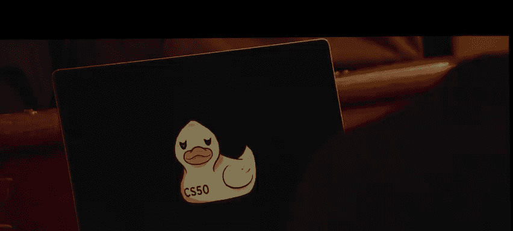

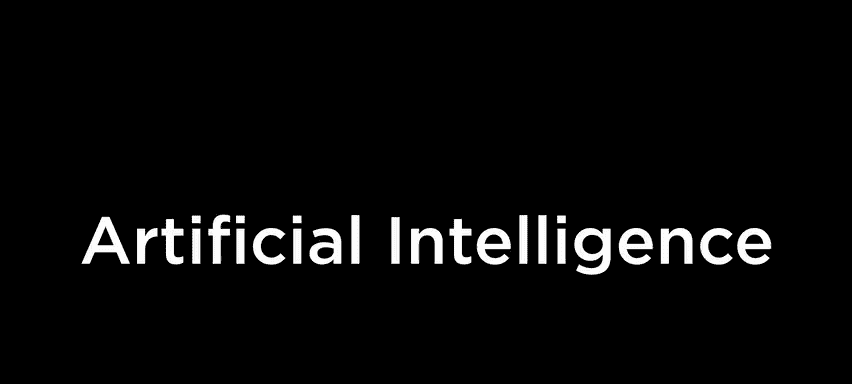

I'm going to show you some magic。It's the real thing。I mean。It's all。The real。

Alright， this is C S 50。 Harvard University's introduction to the intellectual enterprises of computer science and the art of programming。

 My name is David Main， and this is our family friendly introduction to artificial intelligence or AI。

 which seems to be everywhere these days。 But first， a word on these rubber ducks。

 which your students might have had for some time within the world of computer science and programming in particular。

 there's this notion of rubber duck debugging or rubber ducking。

 whereby in the absence of a colleague， a friend to family member。

 a teaching fellow who might be able to answer your questions about your code。

 especially when it's not working， ideally， you might have at least a rubber duck。

 or really any inanimate object on your desk with whom to talk。

 And the idea is that in expressing your logic talking through your problems。

 even though the duck doesn't actually respond invariably you hear eventually the ill logic and your thoughts and the proverbial light bulb goes off。

 Now， for students online for some time， C S 50 has had a digital version thereof whereby in the programming environment that C S 50 students use。

😊，For the past several years， if they don't have a rubber duck on their desk。

 they can pull up this interface here。 And if they begin a conversation like I'm hoping you can help me solve some problem up until recently。

 C 50's virtual rubber duck would simply qua once twice or three times in total。

 But we have anecdotal evidence that that alone was enough to get students to realize what it is they were doing wrong。

 But of course， more recently has this duck and so many other duck。

 so to speak around the world come to life really。 And your students have been using artificial intelligence in some form within C S 50 as a virtual teaching assistant And what we'll do today is reveal not only how we've been using and leveraging AI within C50。

 but also how AI itself works and to prepare you better for the years ahead。

 So last year around this time， like Dolly2 and image generation where all of the rage you might have played with this whereby you can type in some keywords and boom。

 you have a dynamically generated image， similar tools are like midjour。

 which gives you even more realistic 3D imagery and within that world。Of image generation。

 there were nonetheless some tellss like a an observant viewer could tell that this was probably generated by AI。

 And in fact， a few months ago， The New York Times took a look at some of these tools。

 And so for instance， here is a sequence of images that at least that left isn't all that implausible that this might be an actual photograph。

 but in fact， all three of these are AI generated。 And for some time。

 there was a certain tell like AI up until recently really wasn't really good at the finer details。

 like the fingers are not quite right。 And so you could kind of have that sort of hint。

 But I dare say AI is getting even better and better。

 such that it's getting harder to discern these kinds of things。 So if you haven't already。

 go ahead and take out your phone。 if you have one with you。 And if you'd like to partake。

 scan this barcode here， which will lead you to a URL and on your screen。

 you'll have an opportunity in a moment to buzz in。

 if my colleague Wgshin wouldn't mind joining me up here on stage。

 Well ask you a sequence of questions and see just how prepared you are for this coming world of AI。

 So。Stense， once you've got this here。codeode scanned if you don't， that's fine。

 you can play along at home or alongside the person next to you here are two images。

 and my question for you is which of these two images left or right was generated by AI。

 which of these two was generated by AI left or。😡，Right。And I think Wngshhan。

 we can flip over and see as the responses start to come in So far。

 we're about 20% saying left 70 plus percent saying right，3%4%， comfortably admitting， unsure。

 and that's fine。 let's wait for a few more responses is to come in。

 though I think the right hand folks have it。 And let's go ahead and flip back and see what the solution is in this case。

 it was， in fact， the right hand side that was AI generated。 So that's great。

 I'm not sure what it means that we figure this one out。 But let's try one more here。

 So let me propose that we consider now these two images。 it's the same code。

 So if you still have your phone up。 you don't need to scan again。 it's gonna be the same URL here。

 But just in case you closed it。 Let's take a look now at these two images。

 Which of these left or right was AI generated left or right this timech。

 should we take a look at how it's coming in。 it's a little closer this time left or right。

 right's losing a little ground， maybe as people are changing their answers to left more people。

are unsure this time， which is somewhat revealing。 let's give folks another second or two。And Wngshn。

 should we flip back。 The answer is actually a trick question。 since they were both AI。

 So most of you， most of you were， in fact， right。 But if you take a glance at this。

 this is getting really， really good。 And so this is just a taste of the images that we might see down the line。

 And in fact， that video with which we began Tom Cruise， as you might have gleaned was not， in fact。

 Tom Cruise。 that was an example of a deep fake a video that was synthesized where by a different human was acting out those motions。

 saying those words， but software， artificially intelligence artificial intelligence inspired software was mutating the actual image and faking this video。

 So it's all fun in games for now as we tinker with these kinds of examples， but suffice it to say。

 as we've begun to discuss in classes like this already。

 disinformation is only going to become more challenging in a world where it's not just text。

 but it's imagery and all the more soon video。 But for today will focus really on the fundamentals。

 What it is that's enabling technologies like these and even more。😊。

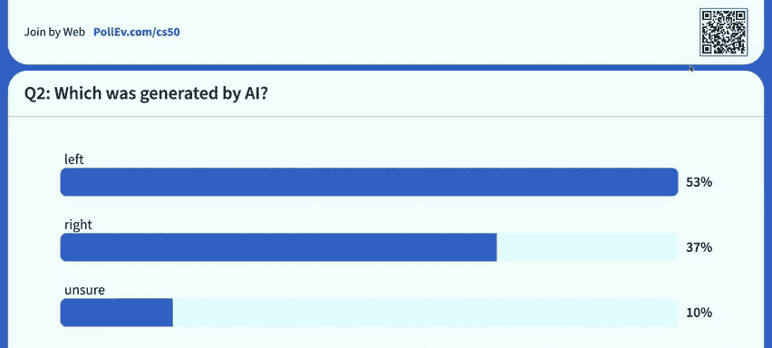

Similarly， text generation， which is all the rage。 And in fact， it seems just a few months ago。

 Probably everyone in this room started to hear about tools like chat G。

 So we thought we do one final exercise here as a group this was another piece in the New York Times where they ask the audience did a fourth grader write this or the new chat bo。

 So another opportunity to assess your discerning skill。 So same URL。

 So if you still have your phone open and that same interface open， you're in the right place。

 and here will take a final stab at two essays of sorts。

 Which of these essays was written by AI1 or essay2。 And as folks buzz in。

 I'll read the first essay1， I like to bring a yummy sandwich and a cold juice box for lunch。

 Sometimes I'll even pack a tasty pe of fruit or a bag of crunchy chips as we eat。

 we chat and laugh and catch up on each other's day do dot dot2， My mother packs me a sandwich。

 a drink fruit and a treat。 when I get in the lunchroom。

 I find an empty table and sit there and I eat my lunch。 My friends come and sit down with me。😊。

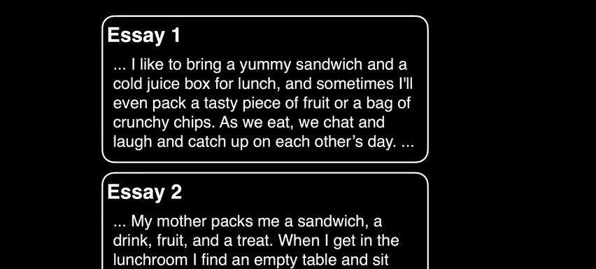

Dot dot dot runction should we see what folks think It looks like most of you think that SA1 was generated by AI And in fact。

 if we flip back to the answer here， it was in fact SA1 So it's great that we now already have seemingly this discerning eye but let me perhaps deflate that enthusiasm by saying it's only going to get harder to discern one from the other and we're really now on the bleeding edge of what's soon to be possible but most everyone in this room has probably by now seen tried certainly heard of chat EptT which is all about textual generation within CS50 and within academia more generally have we been thinking about talking about how whether to use or not use these kinds of technologies and if the students in the room haven't told the family members in the room already this here is an excerpt from CS50's own syllabus this year whereby we have deemed tools like chat EptT in their current form just too helpful。

 sort of like an overzealous friend who in school who just wants to give you all of the answers instead of leading you。

😡。

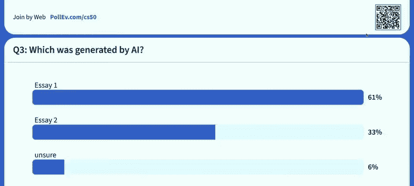

To them。 And so we simply prohibit by policy using AIbased software such as chat Gpt。

 thirdparty tools like Gitthub Copilot Bing chat and others that suggests or completes answers to questions or lines of code。

 But it would seem reactionary to sort of take away what technology surely has some potential upsize for education And so within C50 this semester as well as this past summer。

 have we allowed students to use C50's own AIbased software。

 which are in effect as we'll discuss built on top of these thirdpart tools。

 chatgptT from open AI companies like Microsoft and beyond And in fact。

 what students can now use is this brought to life C50 D or DDb Duck debugger within a website of our own C50 AI in another that your students know known as CS50 So students are using it but in a way where we have tempered the enthusiasm what might otherwise be an overly helpful duck to model it morekin to a good teacher。

 a good teaching fellow who might guide you to the answers， but not simply hand them outright。

Actually mean and in what form does this do co Well。

 architecturally for those of you with engineering backgrounds that might be curious as to how this is actually implemented。

 if a student here in the class has a question virtually in this case。

 they somehow asked this questions of this central web application， C50 AI。

 but we in turn have built much of our own logic on top of thirdpart services known as As application programming interfaces features that other companies provide that people like us can use so they are doing really a lot of the heavy lifting the so-called large language models are there。

 but we too have information that is not in these models yet， for instance。

 the words that came out of my mouth just last week when we had a lecture on some other topic not to mention all of the past lectures and homework assignments from this year。

 So we have our own vector database locally via which we can search for more recent information and then hand some of that information into these models。

 which you might recall least for open AIs cut off as of 2021 as of now to make the information even more current So。

Actually that's sort of the flow。 But for now， I thought I share at a higher level。

 what it is your students are already familiar with and what will soon be more broadly available to our own students online as well。

 So what we focused on is what's generally now known as prompt engineering。

 which isn't really a technical phrase because it's not so much engineering in the traditional sense。

 It really is just English， what we are largely doing when it comes to giving the AI。

 the personality of a good teacher or a good duck。 So what we're doing is giving it what's known as a system prompt nowadays。

 whereby we write some English sentences， send those English sentences to open AI or Microsoft that sort of teaches it how to behave。

 not just using its own knowledge out of the box， but coercicing it to behave a little more educationally constructively。

 And so， for instance， a representative snippet of English that we provide to these services。

 looks a little something like this。 quote unquote You are a friendly and supportive teaching assistant for C S 50。

You are also a rubber duck。You answer student questions only about CS50 in the field of computer science。

 do not answer questions about unrelated topics， do not provide full answers to problem sets as this would violate academic honesty。

 And so in essence， and you can sort of do this manually with chat E you can tell it or ask it how to behave we essentially are doing this automatically so that it doesn't just hand answersswers out of the box and knows a little something more about us。

 So's also in this world of AI right now， the notion of a user prompt versus that system prompt and the user prompt in our case is essentially the students' own question。

 I have a question about X or I have a problem with my code here in y so we pass to those same API students own questions as part of this so-called user prompt just so you're familiar now with some of the vernacular of late Now the programming environment that students have been using this whole year is known as visual studio code。

 a popular open sourcefr product that most so many engineers around the world now use but we've instrumented it to be a little more course specific with some course。

😡，Specific features that make learning within this environment all the all the easier。

 It lives at Cs50 do。 And as students in this room know that as of now。

 the virtual duck lives within this environment and can do things like explain highlighted lines of code So here for instance。

 is a screenshot of this programming environment。 Here is some arcane looking code in a language called C that we've just left behind us in the class。

 and suppose that you don't understand what wonder more of these lines of code do。

 students can now highlight those lines right click or control， click on it， select explain。

 highlighted code andvoila they see a chat G like explanation of that very code within a second or so that no human has typed out。

 but that's been dynamically generated based on this code。

 Other things that the duck can now do for students students on how to improve their code style。

 the aesthetics。 the formatting thereof。 And so for instance。

 here is similar code in a language called C and I'll stipulated that it's very messy everything is left aligned instead of nicely indented so it looks a little more。

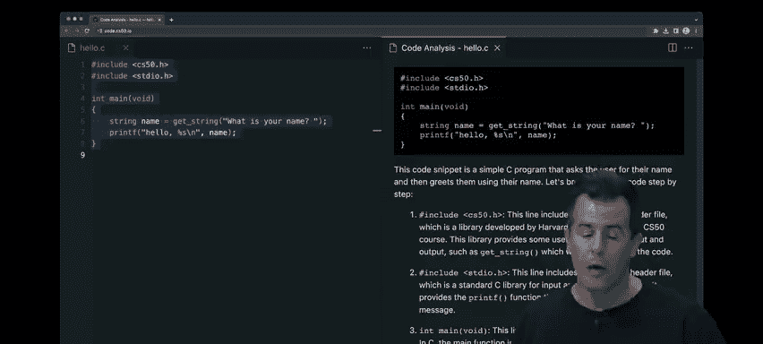

Strd students can now click a button they'll see at the right hand side in green how their code should ideally look。

 And if they're not quite sure what those changes are or why they can click on explain changes。

 and similarly， the duck advises them on how and why to turn their not great code into greater code from left to right respectively more compelling and more generalizable beyond CS50 and beyond computer science is AI's ability to answer most of the questions that students might now ask online and we've been doing asynchronous Q andA for years by a various mobile or web applications and the like。

 but today it has been humans myself included responding to all of those questions now the duck has an opportunity to chime in generally within three seconds because we've integrated into an online Q and A tool that students in CS50 and elsewhere across Harvard have long used。

 So here's an anonymized screenshot of a question from an actual student but written here as John Harvard who asked this summer in the summer version of CS50 what is flask exactly。

 So fairly definitional question and here。I what the duck spit out。

 thanks to that architecture I described before。 I'll stipulate that this is correct。

 but it is mostly a definition akin to what Google or Bing could already give you last year。

 But here's a we our nuanced question， for instance。

 from another anymized students in in this question here。

 the students including an error message that they're seeing they're asking about that and they're asking a little more broadly and qualitatively。

 I there a more efficient way to write this code， a question that really is best answered based on experience here。

 I'll stipulate that the duck responded with this answer， which is actually pretty darn good。

 not only responding in English， but with some sample starter code that would make sense in this context。

 And at the bottom， it's worth noting because none of this technology is perfect just yet。

 It's still indeed very bleeding edge。 And so we have chosen to do within C 50 is include disclaimers like this。

 I am an experimental botck， do not assume that my reply is accurate unless you see that it's been endorsed by humans quack。

 And in fact， at top right， the mechanism we've been using。This tool is usually within minutes。

 a human， whether it's a teaching fellow course assistant or myself will click on a button like this to signal to our human students that yes。

 like the duck is spot on here or we have an opportunity as always to chime in with our own responses。

 frankly that disclaimer that button will soon I do think go away is the software gets better and better but for now that's how we're modulating exactly what students expectations might be when it comes to correctness or incorrectness It's coming to in programming to see a lot of error messages。

 certainly when you're learning first tohand a lot of these error messages arercane， confusing。

 certainly to students versus the people who wrote them soon students will see a box like this whenever one of their terminal window programs errors they'll be assisted to with English like Tf like support when it comes to explaining what it is that went wrong with that command and ultimately what this is really doing for students in our own experience already providing them really with virtual office hours and 247。

 which is actually quite compelling in a university environment。

Where students schedules are already tightly packed， be it with academics， curriculars。

 athletics and the like， and they might have enough time to dive into a homework assignment。

 maybe eight hours， even for something sable。 but if they hit that wall a couple of hours in， yeah。

 they can go to office hours or they can ask a question asynchronously online。

 but it's really not optimal in the moment support that we can now provide all the more effectively。

 we hope through software as well。 So if you're curious， even if you're not a technophil yourself。

 anyone on the internet can go to CS50 AI and experiment with this user interface。

 this one here actually resembles chatypt itself。 buts specific to CS50 and here again is just a sequence of screenshots that'll stipulate for today's purposes are pretty darn good and akin to what I myself for a teaching fellow would reply to and answer to a student's question in this case about their particular code。

 and ultimately， it's really aspirational。 The goal here ultimately is to really approximate a one to one teacher to student ratio。

 which despite all of the resources we within C。

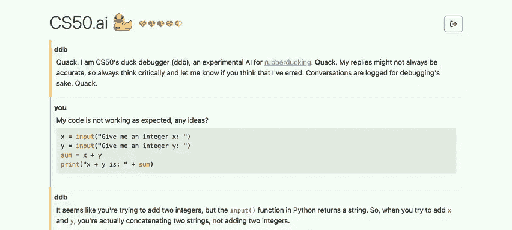

5 we within Harvard and places like Yale have we certainly have never had enough resources to approximate what might really be ideal。

 which is more of an apprenticeship model， a mentorship whereby it's just you and that teacher working one on one。

 now we still have humans and the goal is not to reduce that human support but to a focus it all the more consciously on the students who would benefit most from some impersonal one on one support versus students who would happily take it at any hour of the day more digitally via online and in fact。

 we're still in the process of evaluating just how well or not well all of this works。

 but based on our summer experiment alone with about 70 students a few months back。

 one student wrote us at terms end， it felt like having a personal tutor I love how AI bots will answer questions without ego and without judgment generally entertaining even the stupidest of questions without treating them like they are stupid it has and as one could expect。

 ironically an inhuman level of patients。 and so I thought that's telling as to how even one student is perceiving。

😡。

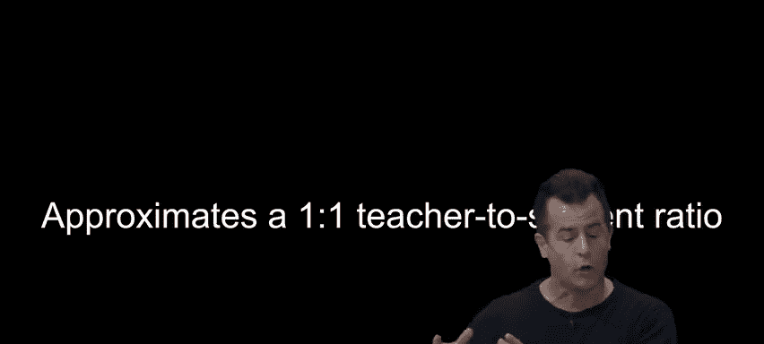

These new possibilities。 So let's consider now more academically what it is that's enabling those kinds of tools。

 not just within CS 50 within computer science， but really the world more generally。

 what the whole world's been talking about is generative artificial intelligence。

 AI that can generate images， generate text and sort of mimic the behavior of what we think of as human。

 So what does that really mean。 Well， let's start really at the beginning。

 Art intelligence is actually a technique a technology a subject that's actually been with us for some time。

 but it really was the introduction of this very user friendlyri interface known as Cha Gpt and some of the more recent academic work over really just the past five or six years that really allowed us to take a massively forward。

 It would seem technologically as to what these things can now do。

 So what is artificial intelligence。 It's been with us for some time it's honestly so omnipresent that we sort of take it for granted nowadays。

 a Gmail outlook have gotten really good It spam detection If you haven't checked your spam folder in a while。

 That's testament to just how good they seem to be。It out of your inbox。

 handwriting recognition has been with us for some time。

 I dare say it too is only getting better and better。

 The more the software is able to adapt to different handwriting styles such as this recommendation histories and the like whether they're using Netflix or any other service have gotten better and better at recommending things you might like based on things you have like and maybe based on things other people who like the same thing as you might have liked and suffice it to say there's no one at Netflix akins to the old VHS stores of yesterear who are recommending to you specifically what movie you might like。

 And there's no code， no algorithm that says if they like X。

 then recommend Y else recommend Z because there's just too many movies， too many people。

 too many different tastes in the world。 So AI is increasingly sort of looking for patterns that might not even be obvious to us humans and dynamically figuring out what might be good for me for you or you or anyone else。

 Siri， Google assistant Alexa， any of these voice recognition tools that are answering questions that too suffice it。

Is all powered by AI， but let's start with something a little simpler than any of those applications and this is one of the first arcade games from yesterear known as Pong and it's sort of like table tennis in person on the left can move their paddle up and down personal on the right can do the same and the goal is to get the ball past the other person or conversely make sure it hits your paddle and bounce his back Well somewhat simpler than this inof far as it can be one player is another Atari game from yesterear known as breakout whereby you're essentially just trying to bang the ball against the bricks to get more and more points and get rid of all of those bricks but all of us in this room probably have a human instinct for how to win this game or at least how to play this game for instance。

 if the ball pictured here back in the 80s as a single red dot just left the paddle。

 pictured here as a red line Where is the ball presumably going to go next and in turn。

 which direction should I slide my paddle to the left or to the right。😡，So presumably to the left。

 and we have an eye for what seemed to be the digital physics of that。

 And indeed that would then be an algorithm， sort of step bystep instructions for solving some problem。

 So how can we now translate that human intuition to what we describe more as artificial intelligence。

 not nearly a sophisticated as those other applications， but will indeed start with some basics。

 you might know from economics or strategic thinking or computer science。

 this idea of a decision tree that allows you to decide。

 should I go this way or this way when it comes to making a decision So let's consider how we could draw a picture to represent even something simplistic like breakout。

 Well， if the ball is left of the paddle is a question or a Boolean expression。

 I might ask myself in code if yes， then I should move my paddle left is almost everyone just said else。

 if the ball is not left of paddle， What do I want to do Well， I want to ask a question。

 I don't want to just instinctively go right， I want to check is the ball to the right of the paddle。

 And if yes， well then yes， go ahead and move the paddle right， but there is a third situation。

 which。Is。Right， like don't move。 It's coming right at you。 So that would be the third scenario here。

 No， it's not to the right or to the left。 So just don't move the paddle。

 You got lucky and it's coming， for instance， straight down。

 So breakout is fairly straight when it comes to an algorithm and we can actually translate this as any Cs50 student now could to code or pseudocode sort of English like code that's independent of Java C C plus plus in all of the programming languages of today。

 So in English pseudocode while a game is ongoing if the ball is left of paddle。

 I should move paddle left else， if ball is right of the paddle should say paddle that's a bug not intended today。

 move paddle right else don't move the paddle。 So that too represents a translation of this intuition to code that's very deterministic。

 you can sort of anticipate all possible scenarios captured in code and frankly。

 this should be the most boring game of breakout because the paddle should just perfectly play this game。

 assuming there's no variables or randomness when it comes to speed or angles or the like which。😡。

World game certainly try to introduce。 But let's consider another game from yesterear that you might play with your kids today。

 or you did yourself growing up。 Here's T toe。 And for those unfamiliar。

 the goal is to get three o's in a row or three x's in a row vertically horizontally or diagonally。

 So suppose it's now X's turn if you play Ti ta toe。

 Most of you probably just have an immediate instinct as to where X should probably go so that it doesn't lose instantaneously。

 But let's consider in the more general case， how do you solve toe。 frankly。

 if you're in the habit of losingtic toe， but you're not trying to lose T。

 you're actually playing it wrong， Like you should minimally be able to always force a tie in T toe and better yet。

 you should be able to beat the other person。 So hopefully everyone now will soon walk away with this strategy。

 So how can we borrow inspiration from those same decision trees and do something similar here。

 So if you the player ask yourself， can I get three in a row on this turn， Well， if yes。

 then you should do that and play the X in that position。

Play in the square to get three in a row Str forward。 If you can't get three in a row in this turn。

 you should ask another question， can my opponent get three in a row in their next turn。

 because then you better preempt that by moving into that position， play in the square to block。

 play opponent3s three in a row。😡，What if though that's not the case， right。

 what if there aren't even that many exs and nose on the board if you're in the habit of just kind of playing randomly like you might not be playing optimally as a good AI could。

 So if no， it's kind of a question mark。 In fact， there's probably more to this tree。

 because we could think through what if I go there， Wait a minute。

 what if I go there or there or there。 you can start to think a few steps ahead as a computer could do much better even than us humans。

 So suppose， for instance， it's O's turn。 Now those of you who are very good at techtto might have an instinct for where to go。

 But this is even harder problem， it would seem I could go in eight possible places if I'm oh。

 but let's try to break that down more algorithmically as an AI would。

 And let's recognize too that with games in particular。

 one of the reasons that AI was so early adopted in these games playing the CPU is that games really lend themselves to defining them if taking the fun out of it mathematically defining them in terms of inputs and outputs。

 maybe paddle moving left or right ball moving up or down， you can really quant。

It at a very boring low level。 but that lends itself then to solving it optimally。 And in fact。

 with most games， the goal is to maximize or maybe minimize some math function， most games。

 if you have scores， the goal is to maximize your score。 and indeed get a high score。

 So games lend themselves to a nice translation to mathematics and in turn， here， AI solutions。

 So one of the first algorithms， one might learn into class on algorithms in on artificial intelligence is something called minim。

 which alludes to this idea of trying to minimize and or maximize something as your function your goal。

 And it actually derives inspiration from these same decision trees that we've been talking about。

 But first the definition。 here are three representativetict O boards。

 Here is one in which O has clearly one per the green。

 Here is one in which X is clearly one per the green。

 and this one in the middle just represents a draw。

 Now there's a bunch of other ways that Tite could end。 but here's just three representative ones。

 But let's make Tit， even more boring that it might。

O always struck you as let's propose that this kind of configuration should have a score of negative one。

 If O wins， it's a negative one。 If x wins， it's a positive one。 And if no one wins。

 we'll call it a0。 We need some way of talking about in reasoning about which of these outcomes is better than the other and what's simpler than 0。

1 and negative one。 So the goal， though， of x， it would seem is to maximize its score。

 But the goal of O is to minimize its score。 So x is really trying to get positive one。

 O is really trying to get negative one。 And no one really wants0。

 but that's better than losing to the other person。

 So we have now a way to define what it means to win or lose。 Well。

 now we can sort of employ a strategy here。 here just as a quick check。

 what would the score be of this board， just so everyone's on the same page。Or so one。

 because x has one and we just stipulate it arbitrarily。

 this means that this board has a value of one Now let's put it into one more interesting context here。

 a game has been played for a few moves already。 there's two spots left no one has one just yet and suppose that it's o's turn now Now everyone probably has an instinct already as to where to go but let's try to break this down more algorithmically So what is the value of this board we don't know yet because no one has one so let's consider what could happen next so we can draw this actually as a tree as before here for instance is what might happen if O goes into the top lefthand corner and here's what might happen if O goes into the bottom middle spot instead we should ask ourselves what's the value of this board。

 what's the value of this board because if o's purpose in life is to minimize its score it's gonna go left or right based on whichever yields the smallest number negative one ideally but we're still not sure yet because we don't have definitions for boards with holes in them like this So what could happen next here。

😡，Obviously going to be x's turn next， so if x moves， unfortunately， x has one in this configuration。

 we can now conclude that the value of this board is what number。😡，So one。

 and because there's only one way to reach this board by transitivity。

 you might as well think of the value of this previous board as also one because no matter what it's going to lead to that same outcome。

 and so the value of this board is actually still to be determined because we don't know if O is going to want to go with the one and probably not because that means x wins but let's see what the value of this board is。

 Well'll suppose that indeed X goes in that top left corner here。

 what's the value of this board here。😡，Zero because no one has one， there's no x's or o's 3 in a row。

 so the value of this board is0。 there's only one way logically to get there。

 so we might as well think of the value of this board as also0。

 and so now what's the value of this board， Well， if we started the story by thinking about O's turn。

 O's purpose is the min in mini Max， then which move is O going to make。

 go to the left or go to the right。😡，Os probably gonna go to the right and make the move that leads to ups that leads to this board because even though O can't win in this configuration。

 at least X didn't win。 So it's minimized its score relatively， even though it's not a clean win。

 Now， this is all fine and good for a configuration of the board。 that's like almost done。

 there's only two moves left， the game's about to end。 But if you kind of expand in your mind's eye。

 how did we get to this branch of the decision tree。

 if we rewind one step where there's three possible moves。 frankly。

 the decision tree is a lot bigger。 if we remindd further in your mind's eye and have four moves left or five moves or all nine moves left。

 imagine just zooming out out and out， this is becoming a massive， massive tree of decisions。 Now。

 even so here is that same subtree， the same decision tree we just looked at this is the exact same thing。

 but I shrunk the font so that it appears here on the screen here。 But over here。

 we have what could happen if instead， it's actually X's turn because we're once move prior。

 There's a bunch of different moves。X could now make too。 So what is the implication of this。 Well。

 most humans are not thinking through Tit toe to this extreme。 And frankly。

 most of us probably just don't have the mental capacity to think about like going left and then right and then left and then right。

 this is not how people play Tit toe。 like we're not using that much memory。 so to speak。

 But a computer can handle that。 and computers can play Tt toe optimally。

 So if you're beating a computer at Tt toe。 like it's not implemented very well。

 it's not following this very logical， deterministic minimax algorithm。

But this is where now AI is no longer as simple as just doing what these decision trees say In the context oftict toe。

 Here's how we might translate this to code。 For instance， if player is X for each possible move。

 calculate a score for the board as we were doing verbally and then choose the move with the highest score because X is goal is to maximize its score。

 If the player is oh， though， for each possible move。

 calculate a score for the board and then choose the move with the lowest score。

 So that's a distillation of that verbal walkthrough into what C 50 students know now as code。

 or at least pseudocode。 But the problem with games， not not so muchtict toe。

 but other more sophisticated games is this。 Does anyone want to ballpark。

 how many possible ways there are to play Tit toe。😊，Paper， pencil to human children。

 How many different way， How long could you keep them occupied playing Ti tak toe in different ways。

If you actually think through how big does this tree get。

 how many leaves are there on this decision tree， like how many different directions， Well。

 if you're thinking 255168， you are correct and now most of us in our lifetime it probably not playtictk toe that many times。

 So think about how many games you've been missing out on there are different decisions you could have been making all these years now that's a big number but honestly like that's not a big number for a computer。

 that's a few megabytes of memory maybe to sort of keep all of that in mind and sort of implement that kind of code in C or Java or C plus plus or something else。

 but other games are much more complicated and the games that you and I might play as we get older。

 include maybe chess and if you think about chess with only the first four moves back and forth four times So only four moves。

 that's not even a very long game anyone want to ballpark how many different ways there are to begin a game of chess with four moves back and forth。

😡，This is evidence as to why chess is apparently so hard 288 million ways。

 which is why when you are really good at chess， you are really good at chess。

 because apparently you either have an intuition for or mind for thinking it would seem so many more steps ahead than your opponent and don't get us started on something like go 266 quintillion ways to play goes first for move。

 So at this point， we just can't pull out our Mac R PCC。

 certainly not our phone to solve optimally games like chess and go because we don't have big enough CPUs。

 We don't have enough memory。 We don't have enough years in our lifetimes for the computers to crunch all of those numbers and thus was born a different form of AI that's more inspired by finding patterns more dynamically learning from data as opposed to being told by humans。

 Here is the code via which to solve this problem。 So machine learning is a subset of artificial intelligence that tries instead to get machines to learn what。

should do without being so coached step by step by step by humans here reinforcement learning。

 for instance， is one such example thereof where in reinforcement learning。

 you sort of wait for the computer or maybe a robot to maybe just get better and better and better at things and as it does you reward it with a reward function。

 give it plus one every time it does something well and maybe minus one you punish it any time it does something poorly and if you simply program this AI or this robot to maximize its score。

 never mind minimizing maximize its score ideally it should repeat behaviors that got it plus one it should decrease the frequency with which it does bad behaviors that got it negative one and you can reinforce this kind of learning。

 In fact， I have here one demonstration could a student come on up who does not think they are particularly coordinated okay wow you're being nominated by your friends。

 come on up， come on up。😡，Their hands went up instantly for you。Okay。

 what is your name My name's Ama Amaka， do you want to introduce yourself to the world Hi my name is Amaka。

 I am the first year at Hallworthy planning to concentrate and see S。 Wo。

 Nice to see you Come on over here。😊。

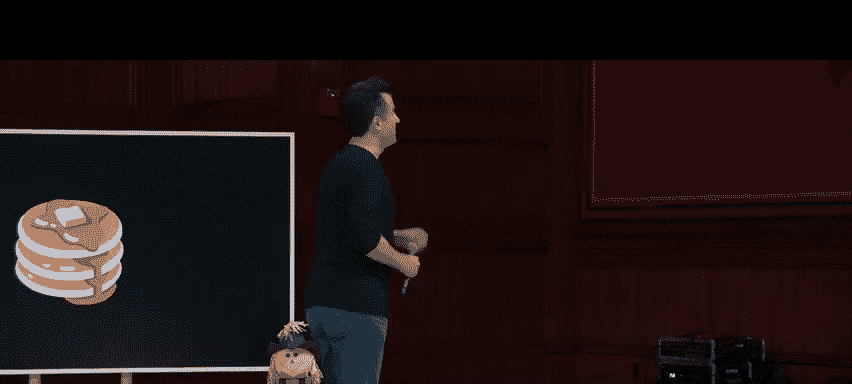

So yes， oh no， it's sort of like game show here。 We have a pan here with what appears to be something pancake like。

 and we'd like to teach you how to flip a pancake so that when you gesture upward。

 the pancake should flip around as though you cook the other side。😡。

So we're going to reward you verbally with plus1 or -1。Min-1。Minus one。Oh， okay， plus one， plus one。

 so do more of that。Minus one。Minus one。Minus1， do less of that。All right， a big round of applause。

Thank you。 We've been in the habit of handing out Super Mario Brothers Oreos this year。

 so thank you for participating。So this is actually a good example of an opportunity for reinforcement learning and wonderfully a researcher has posted a video that we thought we'd share it's about a minute and a half long where you can watch a robot now do exactly what our wonderful human volunteer here just attempted as well so let me go ahead and play this on the screen and give you a sense of what the human and the robot are doing together so their pancake looks a little similar there。

😡，The human here is going to first sort of train the robot what to do by showing it some gestures。

 but there's no one right way to do this， but the human seems to know how to do it pretty well in this case。

 and so it's trying to give the machine examples of how to flip a pancake successfully but now this is the very first trial。

 look for you're in a good company。😡，After three trials。Okay。But okay。😮，Now，10 truck。

There's the human picking up the pancake。After 11 trials。And mean。

 there's presumably a human coding this in the sense that someone is saying good job or bad job plus1 or minus1。

😡，20 trials。Here now we'll see how the computer knows what it's even doing。

 There's just a mapping to some kind of like X， Y， Z coordinate system。

 so the robot can quantize what is it' doing。 Nice to do more of one thing， less of another。

 And you're just seeing a visualization in the background of those digitized movements。 And so now。

 after 50 some odd trials。😡，The robot too has got its spot on and it should be able to repeat this again and again and again in order to keep flipping this pancake。

 so our human volunteer wonderfully took you even fewer trials。

 but this is an example than to be clear of what we'd call reinforceforment learning whereby you're reinforcing a behavior you want or negatively reinforcing that is punishing a behavior that you don't Here's another example that brings us back into the realm of games a little bit but in a very abstract way if we were play a game like the floor is lava where you're only supposed to step certain places so that you don't fall through in the lava pit or something like that and lose a point or lose a life Each of these squares might represent a position this yellow dot might represent the human player that can go up down left or right within this world I'm revealing to the whole audience where the lava pits are。

 but the goal for this yellow dot is to get to green but the yellow dot as in any good game does not have this bird's eye view and knows from the get- go exactly where to go it's gonna to have to try some trial and error but if we the programmers maybe reinforce good behavior or punish。

😡，Bad behavior。 we can sort of teach this yellow dot without giving it step by step up down left right instructions。

 what behaviors to repeat and what behaviors not to repeat。 So， for instance。

 suppose the robot moves right fell the lava。 So we'll use a bit of computer memory to sort draw a thicker red don't do that So one so to speak the yellow dot moves we can reward that behavior。

 by not drawing any and allowing it to go again Its making pretty good progress， but darnnet。

 it took a right turn and fell into the lava。 But let's more the computers memory and keep track of。

 do not do that thing anymore。 maybe the next time the human dot goes we want to punish that behavior。

 So well remember as much that red。 But now we're starting to make progress until now we hit this one。

 And eventually even though the yellow dot much like our human like our pancake flipping robot to try again and again and again after enough trials。

 it's going to start to realize what。ors it should repeat and which ones it shouldn't。

 And so in this case， maybe it finally makes its way up to the green dot。 And just to recap。

 once it finds that path， now we can sort of remember it forever as with these green thicker lines。

 any time you want to leave this map anytime you get really good at the Nintendo game。

 you' follow that same path again and again， So you don't fall into the lava。

 But an astute human observer might realize that yes， this is correct。

 it's getting out of this so-called maze， But what is suboptimal or bad about this solution。 Sure。

really long。The question。Exactly， it's taking a really long time and inefficient way to get there because I dare say if we just tried a different path occasionally。

 maybe we could get lucky and get to the the exit quicker。

 And maybe that means we get a higher score， we get rewarded even more。

 So within a lot of artificial intelligence algorithms。

 there's this idea of exploring versus exploiting whereby you should occasionally， yes。

 exploit the knowledge you already have。 In fact， frequently exploit that knowledge。

 But occasionally， you should probably do is explore just a little bit。

 Take a left instead of a right and see if it leads you to the solution even more quickly and you might find a better and better solution。

 So here mathematically is how we might think of this。10% of the time。 we might say that epsilon。

 just some variable sort of a sprinkling of salt into the algorithm here。

 Epsilon will be like 10% of the time。 So if my robot or my player picks a random number。

 that's less than 10% that's gonna make a random move go left instead of right。

 even if you really typically go right。make the move with the highest value。

 as we've learned over time。 And what the robots might learn then。

 is that we could actually go via this path， which gets us to the output faster。

 We get a higher score。 We do it in less time， It's a win win。 frankly。

 this really resonates with me because I've been in the habit as maybe some of you are。

 when you go to a restaurant， maybe that you really like， find a dish you really like。

 I will never again know what other dishes that restaurant offers。

 because I'm sort of locally optimally happy with the dish I've chosen。

 And I will never know if there's an even better dish at that restaurant， And again。

 I sort of sprinkle a little bit of epsilon， a little bit of randomness into my gameplay。

 my dining out， the cats， of course， though is that I might be punished。

 I might therefore sort of be less happy if I pick something and I don't like it。

 So there's this tension between exploring and exploringing。 But in general in computer science。

 And especially in AI adding a little bit of randomness， especially over time can， in fact。

 yield better and better outcomes。 But now there's this notion all the more of deep learning where。😊。

You're trying to infer to detect patterns， figure out how to solve problems。

 even if the AI has never seen those problems before。

 and even if there's no human there to reinforce positively or negatively behavior。

 maybe it's just too complex of a problem for a human to stand alongside the robot and say good or bad job。

 So with deep learning， they're actually very much related to what you might know as neural networks inspired by human physiology。

 whereby inside of our brains and elsewhere in our body。

 there's lots of these neurons here that can send electrical signals to sort of make movements happen from brain to extremities。

 you might have two of these via which signals can be transmitted over a larger distance。

 And so computer scientists for some time have drawn inspiration from these neurons to create in software。

 what we call neural networks whereby there's inputs to these networks and there's outputs from these networks that represent inputs to problems and solutions there。

 too。 So let me abstract away the more biological diagrams with just circles that represent nodes or。

In this case， this would be would call in C 50， the input。 This is what we would call the output。

 but this is very simplistic， very simple neural network。 This might be more common。

 whereby the network， the AI takes two inputs to a problem and tries to give you one solution。 Well。

 let's make this more real。 for instance， suppose that suppose that just for the sake of discussion。

 here is like a grid that you might see in math class with a y axis and an x access vertically and horizontally respectively。

 supposeupp there's a couple of blue and red dots in that world。

 And suppose that our goal computationally is to predict whether a dot is going to be blue or red based on its position within that coordinate system。

 And maybe this represents some realwor notion， maybe it's something like rain that we're trying to predict。

 but we're doing it more simply with colors right now。 So here's my Y axis。 Here's my X axis。

 And effectively my neural network， you can think of conceptually is this。

 It's some kind of implementation of software where there's two inputs to the problem。Give me an X。

 give me a Y value。 and this neural network will output red or blue as its prediction。 Well。

 how does it know whether to predict red or blue， especially if no human has painstakingly written code to say when you see a dot here conclude that it's red。

 When you see a dot here conclude that it's blue。 how can an AI just learn dynamically to solve problems。

 well， what might be a reasonable heuristic here， honestly this is probably a first approximation that's pretty good。

 if anythings to the left of that line， let the neural network conclude that it's gonna be blue。

 And if it's to the right of the line， let it conclude that it's gonna to be red until such time as there's more training data。

 more real worldorld data that gets us to rethink our assumptions， So for instance。

 if there's a third dot there clearly a straight line is not sufficient。

 So maybe it's more of a diagonal line that splits the blue from the red world here。 Meanwhile。

 here's even more dot。 and it's actually getting harder now， like this line is still pretty good。

 most of the blue is up here， most of the red is down here and this is why if we fast forward to today。

You know AI is often very good but not perfect at solving problems。

 but what is it we're looking at here and what is this neural network really trying to figure out well again。

 at the risk of taking some fun out of red and blue dots you can think of this neural network as indeed having these neurons which represent inputs here and outputs here and then what's happening inside of the computer's memory is that it's trying to figure out what the weight of this arrow or edge should be。

 what the weight of this arrow or edge should be and maybe there's another variable there like plus or minus c that just tweaks the prediction So x and Y are literally going to be numbers in this scenario and the output of this neural network ideally is just true or false is it red or blue So it's sort of a binary state as we discuss a lot in CS50 So here too to take this sort of fun out of the pretty picture it's really just like a high school math function what the neural network in this example is trying to figure out is what formula of the form AX plus BY plus C is going be arbitrarily greater than zero。

😡，So let's conclude that the dot is red。 If you get back a positive result。 If you don't。

 let's conclude that the dot is going to be blue instead。

 So really what you're trying to do is figure out dynamically。

 what numbers do we have to these parameters inside of the neural network that just give us the answer we want based on all of this data more generally。

 though this would be really representative of deep learning。

 it's not as simple as input input output， there's actually a lot of these nodes， these neurons。

 there's a lot of these edges， there's a lot of numbers and math are going on that frankly。

 even the computer scientists using these neural networks don't necessarily know what they even mean or represent it just happens to be that when you crunch the numbers with all of these parameters in place。

 get the answer that you want at least most of the time。

 So that's essentially the intuition behind that。 And you can apply to very real world if mundane applications given today's humidity given today's pressure Yes or no。

 should there be rainfall and maybe there is a mathematical function based on years of training。Data。

 we can infer what that prediction should be。 Another one。

 given this amount of advertising in this amount of in this month。

 what should our sales be for that year， Should they be up or should they be down。

 Sorry for that particular month。 So real worldor problems map readily when you can break them down into inputs and a binary output often or some kind of output where you want the thing to figure out based on past data。

 what its prediction should be。So that brings us back to generative artificial intelligence。

 which isn't just about solving problems， but really generating literally images， texts。

 even videos that again， increasingly resemble what we humans might otherwise output ourselves and within the world of generative artificial intelligence do we have。

 of course， these same images that we saw before， the same text that we saw before and more generally things like chat UptT。

 which are really examples of what we now call large language models。

 these sort of massive neural networks that have so many inputs and so many neurons implemented in software that essentially represent all of the patterns that the software has discovered by being fed massive amounts of input。

 think of it as like the entire textual content of the internet。

 Think of it as the entire content of courses like CS50 that may very well be out there on the Internet。

 And even though these AIs， these large language models haven't been told how to behave。

 theyre really inferring from all。😡。

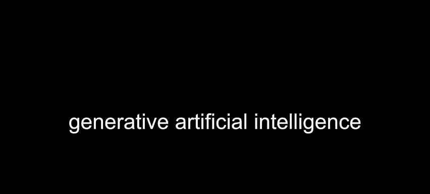

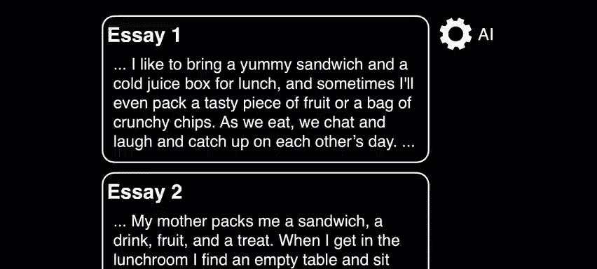

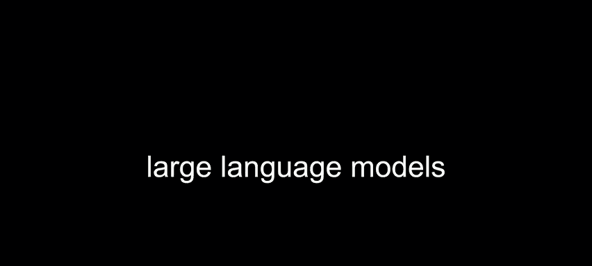

These examples for better or for worse， how to make predictions。 So here， for instance， from 2017。

 just a few years back is a seminal people from Google that introduced what we now know as a transformer architecture。

 And this introduced this idea of attention values。

 whereby they propose that given an English sentence， for instance， or really any human sentence。

 you try to assign numbers， not unlike our past exercises to each of the words。

 each of the inputs that speaks to its relationship with other words。

 So if there's a high relationship between two words in a sentence。

 they would have high attention values。 And if maybe it's a preposition or an article like the or the like maybe those attention values are lower。

 And by encoding the world in that way。 Do we begin to detect patterns that allow us to predict things like words that is generate text。

 So for instance， up until a few years ago， completing this sentence was actually pretty hard for a lot of AI。

 So， for instance， here Massachusetts is a state in the New England region of the northeastern United States。

It borders on the Atlantic Ocean to the east。 the state's capital is dot dot dot now you should think that this is relatively straightforward。

 it's like just handing you a softball type question， but historically within the world of AI。

 this word state was so relatively far away from the proper noun that it's actually referring back to that we just didn't have computational models that sort of took in that holistic picture that frankly we humans are much better at if you would ask this question a little more quickly。

 a little more immediately you might have gotten a better response but this is dare say why chatbots in the past they been so bad in the form of customer service and the like because they're not really taking all of the context into account that we humans might be inclined to provide what's going on underneath the hood without escalating things too quickly what in artificial intelligence nowadays these large language models might do is sort of break down the user' input。

 your input into chat U into the individual words we might then we might then take into account the order of those words。

😡，Massachusetts is first is is last we might further encode each of those words using a standard way and there's different algorithms for this。

 but you come up with what are called embeddings。 that is to say you can use one of those As I talked about earlier or even software running on your own computers to come up with a mathematical representation of the word Massachusetts and Wngshin kindly did this for us last night。

 this is the 1536 floating point values that open AI uses to represent the word Massachusetts and this is to say and you should not understand anything you are looking at on the screen nor do I but this is now a mathematical representation of the input that can be compared against the mathematical representations of other inputs in order to find proximity semantically words that somehow have relationships or correlations with each other that helps the AI ultimately predict what should the next word out of its mouth be so to speak so in a case。

😡，Like this， these values represent these lines represent all of those attention values and thicker lines means there's more attention given from one word to another。

 thinner lines mean the opposite， and those inputs are ultimately fed into a large neural network where you have inputs on the left。

 outputs on the right and in this particular case， the hope is to get out a single word which is the capital of Boston itself。

 whereby somehow the neural network and the humans behind it at open AI， Microsoft。

 Google or elsewhere have sort of crunched so many numbers by training these models on so much data that it figured out what all of those weights are。

 what the biases are so as to influence mathematically the outputs there from。😡。

So that is all underneath the hood of what students now perceive as this adorable rubber duck。

 but underneath it all is certainly a lot of domain knowledge and CS50 by nature of being open courseware for the past many years。

 CS50 is fortunate to actually be part of the model as might be any other content that's freely available online and so that certainly helps benefit the answers when it comes to asking CS50 specific questions that said it's not perfect and you might have heard what are currently called hallucinations where chatGT and similar tools just makes stuff up and it sounds very confident and you can sometimes call it on it whereby you can say no that's not right and it will playfully apologize oh I'm sorry but it made up some statement because it was probabilistically something that could be said even if it's just not correct Now allow me to propose that this kind of problem is going to get less and less frequent and so as the models evolved and our techniques evolve this will be less of an issue。

😡。

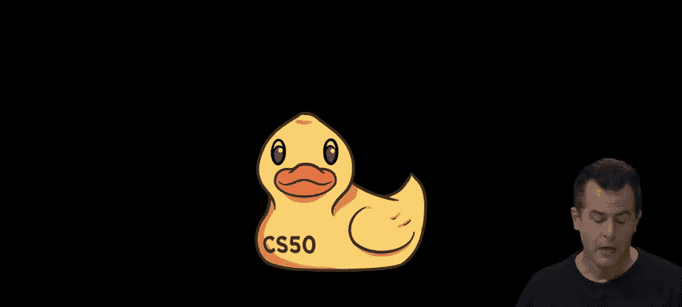

But I thought it would be fun to end on a note that a former colleague shared just the other day。

 which was this old poem by Shel Silverstein， another something from our past childhood。

 perhaps and this was from 1981， a poem called homework machineine。

 which is perhaps foretold where we are now in 2023， the homework machine。

 oh the homework machine most perfect contraption that's ever been seen just put in your homework。

 then drop in a dime， snapnap on the switch and in 10 seconds time。

Your homework comes out quick and clean， as can be。 Here it is 9 plus 4， and the answer is 3。Three。

 oh me， I guess it's not as perfect as I thought it would be。 So quite for telling sure。

Quite for tellingling indeed， though if for all this and more。

 the family members in the audience are welcome to take CS50 yourselflf online at CS50。edx。

org for all of today and so much more allow me to thank Brian Rungshin， Sophie Andrew Patrick。

 Charlie CS50's whole team if you are a family member here headed to lunch with CS50's team please look for Cameron holding a rubber duck above her head。

 thank you so much for joining us today this was CS50。😡。

