# 哈佛大学《R语言编程入门2024｜CS50R Introduction to Programming with R》中英字幕（豆包翻译 - P6：-6-CS50R - Lecture 5 - Visualizing Data.zh_en - GPT中英字幕课程资源 - BV1Vw4m1e75r

う。😊。

Well hello one and all and welcome back to CS50's introduction to programming with R。

 My name is Carterzenki and this is our lecture on visualizing data。

 Now a good visualization can help you see trends you wouldn't have seen otherwise help you compare groups in your data and help you share your findings with others So we' to do all of that and more today with the help of R and with this package called Gpl to that is part of the tidyverse Now this name Gpl is a bit weird。

 but theres a reasoning behind it the plot in Gpl means we're going to plot R data。

 which on the word for visualizing it translating it from a table into some picture to represent that same data and the G and G plot stands for this grammar of graphics which put simply of expressing ourselves graphically in particular this grammar of graphics gives us some individual components we can combine to create plots or visualizations from our data But what are those components。

 Well the first one of course is going to be data itself before we can do anything。😊。

We need to have data to visualize。 and so let me propose， we use this data here。

 a table of candidates and the votes for each of these candidates。

 so notice how I have three of them， Mario Peach and Bowser。

 and each has some number of votes Now of course， data is just data。

 It's not a visualization yet our goal is to translate this table into some picture。

 So we'll need another component of our visualization to take this data and convert it into that picture。

 Now what we'll need is what we call a geometry more formally and a geometry simply way of saying what kind of visualization do we want。

 I think it's best shown through example here。 So I'll show you three different plots each with their own different geometrymetries。

 notice here I have one involving columns good for data that involves groups and values associated with those groups。

I have one plot that uses points here， good for representing relationships between two columns in your data perhaps and I have here a line geometry。

 one that can actually show us change over time and so I'm curious given these three geometries which there are many more focus on these three for now。

 which one do you think would be good or best for the data we have here where we have three candidates and some number of votes。

 let's see what our audience thinks what kind of geometry among these three here would you use to visualize this data in particular。

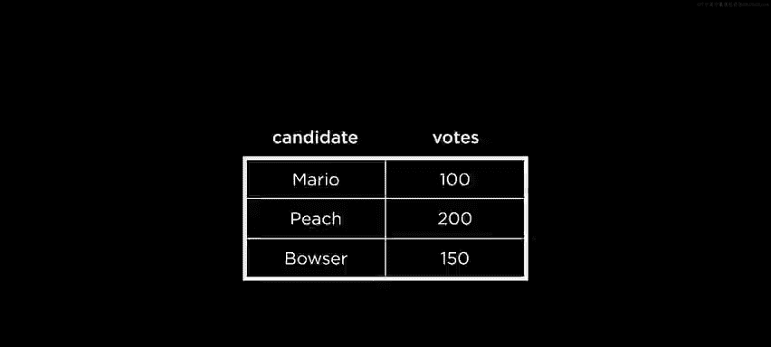

I think we will use columns to present it in more visualized example。

I like your thinking so we could use these columns here to visualize our candidates and their number of votes and more particularly let me say that maybe each candidate gets their own column and how high or low the bar goes。

 the column goes that would be the number of votes that candidate received So notice here how we're specifying not just the data involved and the kind of plot we want but also how that data references or represents is represented on our plot here。

 how many columns we have， how high or low the columns go those are all associated with some part of our data now we call this association more formally this aesthetic mapping。

 which is a bit of a big term， but we can break it down in smaller pieces here an aesthetic is some visual feature of our plot。

 maybe how many columns there are how high or low each of those columns go and a mapping is really another word for a relationship Well what are we relating here we're relating our data to。

 some visual features of。

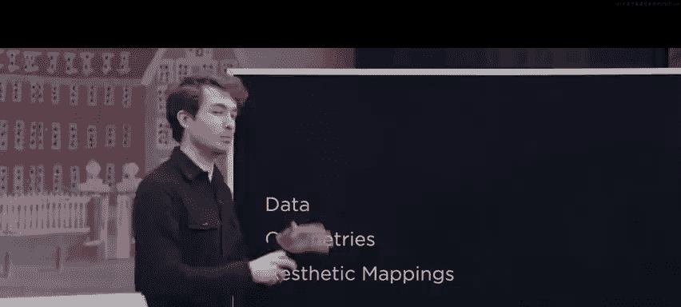

Ploot I think this is best shown by example so here I have a plot and you've often seen plots with a both vertical line and a horizontal line here and if I look at this plot kind of naively and you ask me to draw some columns I might say well how I mean do they go left to right do they go up to down I'm not quite sure how to draw these columns even if you want me to so thankfully there are certain aesthetic or visual features of this plot that we could talk about and relate our data to namely most plots tend to have what we call an x axis on this horizontal line here this is known as our x axis and most plots too have what's known as a y axis a vertical axis here and if we have both a y or a vertical axis and an x or a horizontal axis we could talk about well which parts of our data go on the X axis and which parts of our data go on the y axis here so let me show you again our data。

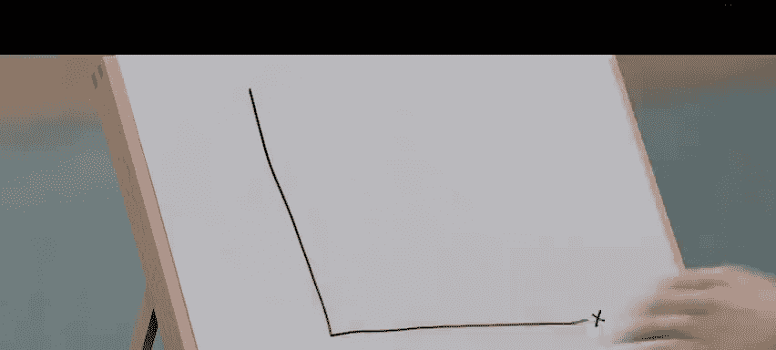

We had here candidates， one column and votes， one column。

 let me ask more precisely now which column of our data do you think should be mapped to or represented by the X axis of our data。

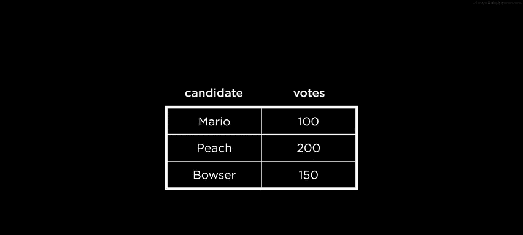

Our candidate column maybe our candidates right because we could have the candidates on the X axis representing now one individual column for each of them。

 so we will map， let's say our candidate column to this X axis and by process of elimination。

 it seems like votes should go now on the Y axis and so we can see what it looks like now map these columns to our plot over here Well if I wanted to map my candidate column to the X axis what could I do。

 I could kind of write these candidate names on the X axis here I'll start with Mario。

downown below， and then I'll follow it with Peach， who's our second candidate just like this。

 and now I'll follow that with Bowser to our third candidate， just like that。

 so now we could say our column candidate is mapped to our X axis。But now we the y axis and we said。

 well the y axis is going to be represented is going to have this votes column on it here so how could we do that well notice that these votes here fall into some range between let's say0 to 200 at the maximum so maybe on this y axis I could say let's start at the very bottom with zero and all the way at the top we'll put to00 so now the height of these columns should correspond to the y axis and I think now that I have these x and y axises。

 I know much more how to draw these columns if you told me draw columns representing the number of votes each candidate got I would know how to do exactly that I would know they should chart the bottom and move all the way up in terms of height so let's draw these now I see Mario has100 votes so I want to put a column on here for Mario well Mario's column should be of the height on the x axis that is equal to 100 which should be right in the middle between 0 and 200。

Draw Mariio's column a bit like this。 I'll put it right in the middle here and I'll draw Mario a column just like that。

 That's Mario's column。 Now I want to draw peach's column。 Well Peach had 200 votes。

 I'll make peach's column go all the way to the top of our y axis where we put the 200 votes and I'll make sure that that column reaches all the way up there and finally for Bowser。

 Bowser had 150 somewhere between Mariio's 100 and pes 200。

 so I will put Bowser' column right in between those two just like this。

 So this now is our complete plot。 we've worked with data。 we've worked with our aesthetic mappings。

 taking our columns and aligning them to the X and the y aes and now we've worked with our geometries。

 this actual visual representation of now our data in terms of columns So all that's stuff to do now is do this in codes。

 we'll come back now to our studio and we'll look at how we can use this package G plot2 to do just。

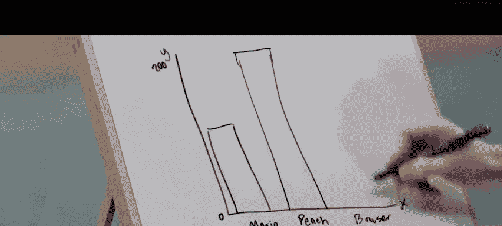

I have opened here a file called votes R and I'm reading in this cv called votes。

 csv notice is here how it goes into a table that I'm calling votes and this is the same table we saw before on the slides we have a candidate named Mario。

 a candidate named Peach and a candidate named Bowser and each has some number of votes Well if I want to create a new blank plot about like what I had before here I'll go ahead and I'll use this function。

 G plot just like this and so long as I have installed the tidyverse and loaded it using library down below tidyverse just like this。

 I can have access to this function called G plot that creates for me a new blank plot So let me run line3 here and what do we see well in the plots column or in the plots tab here I'll see this blank plot that I can then draw put brushstrs on to visualize my data。

But。We haven't actually given our plot anything at all。

 This GG plot function has no input whatsoever， so I think it's worth thinking about what kinds of inputs we need to give to our plot so that it can visualize this data we have in our table here Now the first input as we saw in our grammar of graphics is going to be the data to visualize so let's give us input now to this G plot function。

 the data itself I'll come back now to our studio and it turns out that the first argument to this G plot function which creates for me a new plot is the data itself。

 I'll provide it the first argument now， this votes data frame。😡，And now if I run line three。

HWell I still see nothing and that is kind of expected because we said that data at the end of the day is just data。

 we still need a way to map its data to certain aesthetic features of our plot。

 certain visual features and we need to say what kind of plot we want Well let's do just that now in code I'll come back now to our studio and it turns out that one other another piece we need here is our geometry。

 we've given it some data， but we need some geometry。

 specify what kind of plot we want now well the way we can do this syntactically in R and NggG plot more generally is to use this plus sign here and to follow it with the part of geometry we want。

 which is going to be a column geometry now to get a column geometry I can use this function here。

 geometry underscore call and there are other geometry functions like geometry point or geometry line but now we'll use geometry call to create ourselves some columns。

Notice here this plus so you've seen plus and we've been adding up some numbers like one plus one。

 but this is not that kind of addition。 In fact， the creators of G plot have almost called overloading this plus sign no longer means addition It means something else entirely In fact it means we're going to add a new layer to this blank plot let me show you what I mean with this prop over here so we had here our visualization which had columns on top of it but I drew these columns on the same layer let's say that I drew my axes turns out Phom G plot。

 our plots have multiple layers。 So instead of everything being on the same page so to speak what we instead do is the following let me erase my columns that I have here and let me instead do this let me take out a new layer I could put on top of my blank plot here。

 my x and y axes and on this layer could I draw my columns let me go ahead and do the same thing we did before。

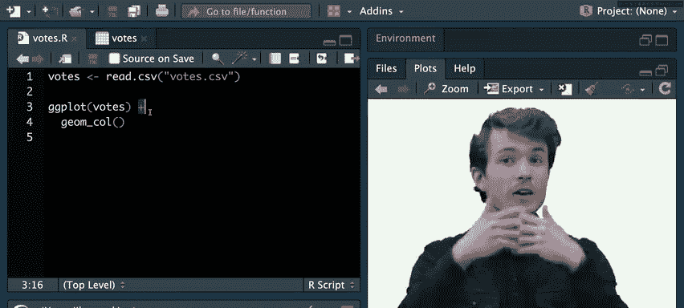

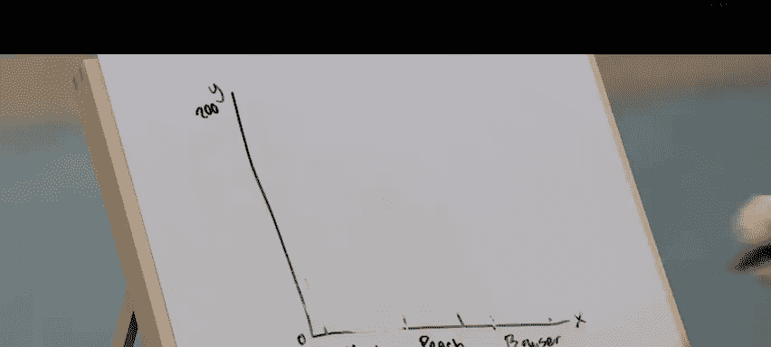

Mar had about 100 votes， I'll put these halfway up the Y axis， Peach had 200。

 I'll put those all the way up at 200， and Bowser had 150 somewhere between Mario and Peach's votes。

And now notice what I've done， I have separated my plot now into layers。 One layer， of course。

 is my columns here， and one layer seems to be my axes。 same thing I'm doing here。

 we've started now with this blank piece of paper， thanks to G G plot and we're now adding a new layer。

 one that involves columns。 So let's see what happens I'll come back now to our studio。

 and let me go ahead and run this here and see what we see。Hm。Nothing yet。

I do see this error that the GM call function requires the following missing aesthetics X and y。

 and so I think GG plotot is running into this same problem that I did earlier if I don't know how to map my data to the visual features of this plot。

 well how can I even draw these columns， so we'll need to specify these aesthetic features。

 X and Y before GG plotot knows how to draw these columns here？😡。

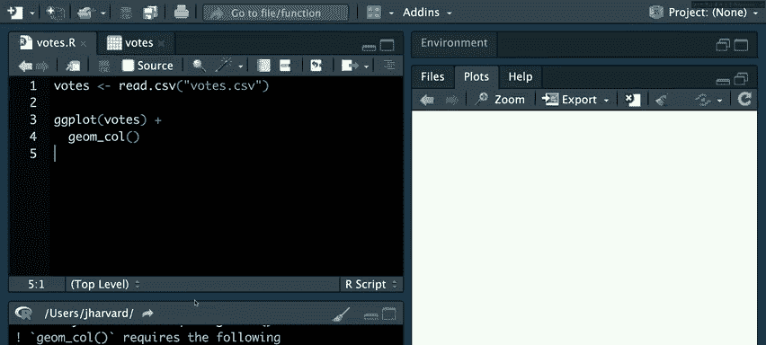

Now， it turns out we can specify these aesthetic features using a function， one called AES。

 which stands for aesthetics here。 at aesthetics， the function looks a bit like this。

 AES and it takes as input any number of pairings between aesthetic values like X or Y。

 and the columns in my data。 For instance， like this。 This would be one aesthetic mapping。

 I'm taking one column in my data and assigning it to control some visual feature now of my plot。

 So let's do the same thing now using AES， this aesthetic function and actually make it happen for us inside of R and G plot。

😊。

I'll come back to our studio here and let's go ahead and use the AES function to tell this plot exactly how to map our data to certain visual features of our plot more generally so it turns out by reading the documentation。

 I know the second argument to G plot is this AES function which we know takes input certain pairings between these aesthetic features like X and Y and columns in our data so one aesthetic feature is the x axis。

 which column should go on the x axis of our data Well we know we're going to put the candidate's column on that X axis here。

😊，I'll go ahead and I'll say x equals candidate just like this。

 This means that the candidate column in my data should now be mapped to the x axis of my plot。

Now they do the same for the y column well the y aesthetic。

 the y aesthetic is going to be mapped to the votes column and vice versa so the votes column should control the y axis effectively I'll go ahead and say that y equals votes and now with these aesthetic mappings specified I should be able to visualize this I'll go ahead and run line3 andvoilah we have our very first plot now created with GG plot thanks to starting with data defining how that data controls visual features of our plot like the X and y axes and now using a new layer adding in these columns。

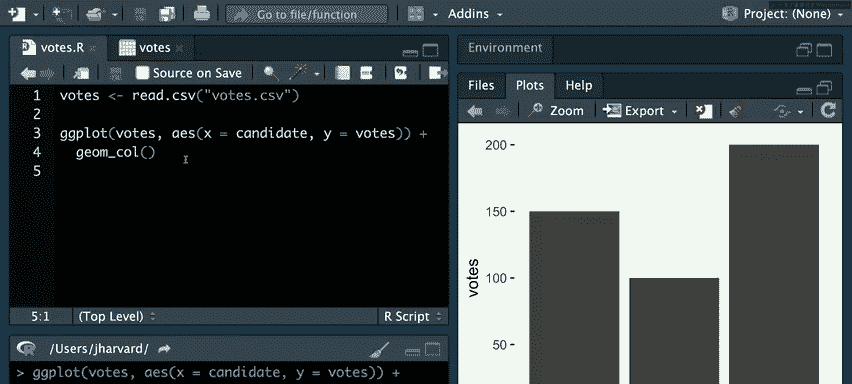

So let me ask now， what questions do we have on what we've done so far？

If you look into the x axis of the plot that we did now in Ggipl2。

 the order of our candidates is slightly different from what we drew in in the board so why is that and how do we expect Ggipl to order our our levels Yeah a really good observation I was hoping you might notice this actually so notice here on the plot our names are not in the same order we saw them in our data in our data it was Mario Peach and then Bowser。

 but it seems like on the X axis here it's Bowser Mario and peach Well what order is this turns out this is alphabetical order so Bowser with B comes first followed by Mario followed by peach so we can generally expect Ggipl to sort our data on either axis in this case because we're working with names sorted alphabetically down below on the X axis。

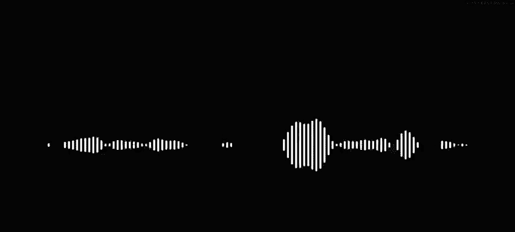

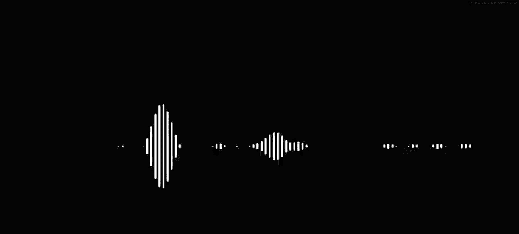

What a good observation to make。Now， let's keep going and G plot gives us some pretty good defaults for our plots。

 I'll notice here that on the labels here for my axes。

 I see the name of the column like candidate and on the y axis I see votes for the y axis and even on the y axis it has decided for me that the range of values should be 0 to 200。

 So these are pretty good defaults， but sometimes you might want to override or change those defaults。

 which you can do by adding new layers to your plot So let's consider how to do just that。

 Well here one thing I want to do is change this plot。

 So I have a little more headroom up here on pe's votes column。 maybe on my y axis not stop at 200。

 but to go up to， let's say to 50 Well to do that we'll need to learn about this other concept in plots in an G plot 2 more generally one called scale。

 So let's learn about scales a little bit together。 a scale is simply a way now。

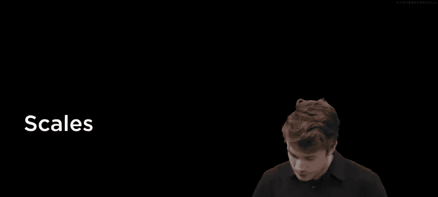

Of specifying how our values actually control our aesthetic mappings。 And， for instance。

 there are really two kinds of scales， one called a continuous scale。

 and one called a discrete scale。 Now， a continuous scale is for values that fall in some range。

 You could think of our y axis here with some number of votes between 0 and let's say，200 or 250。

 That is a continuous scale because some boats could fall in some range。A discrete scale though。

 is for values that are what might call categorical。 they fall into categories。 For instance。

 our x axis has a discrete scale。 There are three distinct candidates。

 It wouldn't quite make sense to put them on any given scale。 they're just names。

 So this is what we call a discrete scale。 Now scales that are continuous have what are called limits and exactly what we've seen here is are y axis。

 our y scale starts at 0 and goes up to 200 currently。

 Those are the limits of this scale from 0 to 200。 but we kind of want to change limit here from 0 to 250 instead。

 And so it turns out that G plot gives us functions to modify different scales something using some of these right here。

 So we see scale x continuous as a function。 scale y continuous is a function。

 scale x discrete and scale y discrete。 These change various different scales on our x or y axis。

 depending on it。They are continuous or discrete Now we said before we want to change our y axis so that narrows our possibilities either this one here。

 scale y continuous or this one here， scale y discrete but we said our y axis is a continuous scale It has a range of values doesn't have discrete values has a range of values。

 So we could probably use scale y continuous to modify now R y axis。

 let's go ahead and do just that by adding a new layer to our plot。

 I'll come back over here and let's say I go back to our studio Well I want to change now this y axis is default and I can do so as I said before by adding a new layer I'll use this plus here to add a new layer to my plot and let me now kind of overwrite the scale I currently see on the board I'll use scale y continuous which will allow me to adjust my continuous y scale that I currently see and it turns out that everything documentation I know。

Scale y continuous takes this argument called limits just like this and limits takes a value。

 which is a vector of length2 where the first value is where the scale starts。

 let's say0 and where the scale ends， let's say 250 so I'll say I'll give limits here。

 this vector0 to 250 and that should now change for me my scale on my y axis let me go ahead and redraw this plot which I'll do by running this line of code here。

And now we'll see my access has changed。 So what have we done， We have first defined this blank plot。

 given it some data and some map in between that data and its visual features。

 We have then drawn some columns on top of it。 thanks to G call。

 And then we've kind of overridden the default scale， moving it from 0 to 200 to instead0 to to 50。

 We're kind of building up our plot as we go now， using these layers。Well。

 one more thing we could do is override the labels here。

 I'll see this one is candidate with a lowercase C。 This one is boths with a lowercase V。

 I'd love to make them capital to make them more professional and also I want to add a title people can look at this and know exactly what they're looking at immediately so I can add a new layer now to my plot to add in the labels and either override some default or add some new labels altogether Well it turns out the function I use to do this is one called labs。

 Las is short for labels I'll go ahead and add a new layer now to my plot called labs and labs takes this arguments the kinds of labels I want to adjust on my plot Now for instance I could use x equals and set it equal to a character string that I want to be the label for my x axis I'll call this one candidate with a capital C。

 I could also give it a label for the y axis by saying y equals and some character。

Here I'll go ahead and call this votes with a capital V。 and then for my title。

 why don't I use this election results， making it very clear exactly what we're visualizing for any viewer who comes in。

 I'll go ahead and now build up my plot step by step again by running all these lines of code and now I should see my plot as it should be。

 I have all my candidates on the X axis， my votes on the Y axis and those labeled now appropriately。

 I even see my title up top election results。

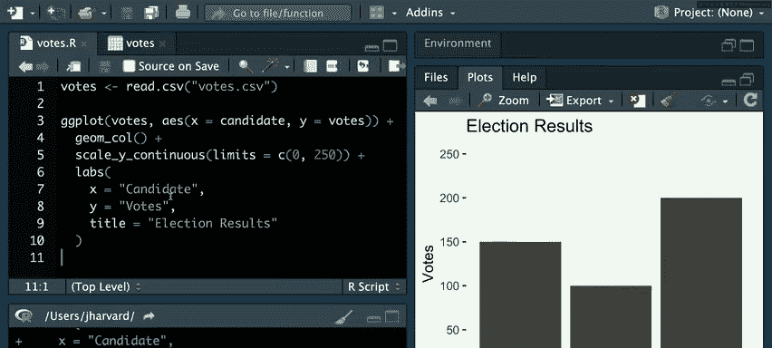

So we have started with the blank plot。Added columns to it。 adjustedjust our scale and added labels。

 Let me ask what questions do we have so far on how we've built up this plot using G plots layers here。

 Are we going in this lecture to to know how to design or to change the layout of the aesthetics like the votes and the candidates columns and the columns representation to the user a good question。

 So you might be asking， well， how could we change these aesthetics。

 And often you'll get to this plot and say， I don't exactly like how this works。

 Maybe I actually want my columns to be on the going like across vertically。

 let's say we could absolutely change our aesthetics here to change what this column what this plot is doing here。

 we could do so I changing these values X and y。 Maybe I would make x equal to votes and y equal to candidates and that would map my columns so they go now left to right as supposed to up to down。

 That's one way we could change our plot visually。 The next way will。

though is how we could change our plot in terms of colors。 And I think the type you'reuding to here。

 which is our plot looks pretty nice， but it's pretty gray。 It's like black and white。

 We could probably do better in terms of colors。 So let's do just that。

 Well I'll come back now to our studio。 and let's see how we could change the fill color that is the color filling these columns depending on the candidate's name。

 Well， notice here I said I want the color to depend on the candidate's name。

 which seems a lot like these aesthetic mappings。 I have some visual feature In this case。

 the fill color of my columns that I now want to be dependent on the value in the candidates column。

 Well， I can do this using the AE function like we saw earlier。

 and there are more aesthetics than just X and Y。 there is in fact an aesthetic called fill that can change the fill color of each of these columns。

 So here I want to change the fill color of these。😊，themselves。

So what I'll do is pass in the AES function as input to G call itself。 And here I'll specify。

 I want to change the fill aesthetic， the color that fills these columns。

 and I want it to depend on the candidate column in my data。

So what I've said here is I want to specify a new aesthetic mapping。

 one that applies only to columns I want to change their fill color and have it depend on now the candidate column。

 I'll go ahead and I'll run this update to our plot。

And now we'll see some color which is pretty nice， notice how every candidate has their own color。

 which is because as input to J call， we said the fill aesthetic should depend on now the candidate column we have。

 each candidate should effectively get their own color。But。When we work with color。

 it's important to be mindful that people who might look at this plot might be looking at it with some form of color blinddness。

 and so when we convey information with color， we make sure we do it as excessively as we can。

 thankfully in R andgg plot。 there are ways to adjust colors to make sure they're friendly to those who might look at this with some form of color blindness。

 So let's see how to do that now we come back to our plot here and actually noticed on the right hand side。

 I've created kind of a new scale。 I have here different colors assigned to different candidates。

 This is in fact， it's very own scale， one called a fill scale。

 we have our X scale and our Y scale and now we have a new one called a fill scale determining what colors will belong to each of these candidates here。

😊，Well， if I want to change this scale， I could do it in a way that's very similar to the way I changed the y scale by adding a new layer to my plot and overriding the default and actually thankfully R comes with this scale called the verus scale。

 which is known to be very friendly to many different forms of color blinddness。

 if I want to use the veritus scale I can do so using this function here。

 I'll go back to my plot and I'll go ahead and add this additional colorblind friendlyly scale in I'll say I want to adjust the fill scale I just created the one you see on the very right hand side and I want it to instead be the veritus scale。

 which is going to be set to the discrete version of that scale So recall how we had both continuous and discrete scales can being on a range discrete being individual values there's a special scale called verus discrete or verrus D for short that allows me now to say I want to take these discrete colorblin-fly colors and make them the colors I'll see for each to my candidates。

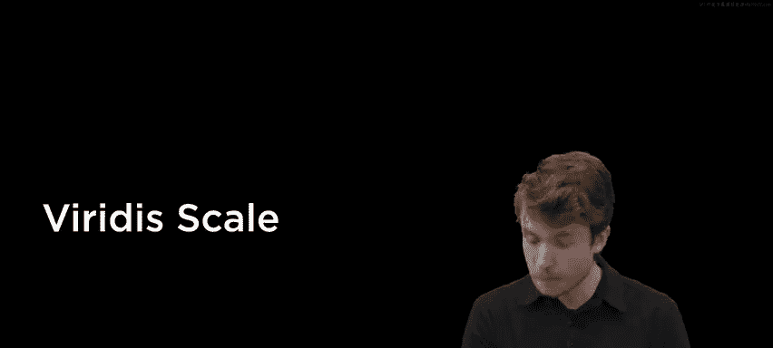

I can do this F with the plus sign。 and now I've added in this new layer that overrides the default colors and makes them more colorbl colorblind friendly。

 Let me go ahead and build this plot again。 And here I'll see my colors changed to be more friendly now to those who might looking at this with some form of color blinddness。

 And there's one more thing we could do here。 notice how on the right hand side。

 this scale has a name candidate。 but I want this to be capitalized。

 So I could change this by passing into scale， fill verus D， the title I want for this scale。

 let me come back and do just that。 I'll come back over here and say I want this verus scale to instead be named Now。

 candidate。 I'll go ahead and rebuild my plot， and I'll see on the right hand side。

 I've changed not just the scales colors， but also its title。😊。

Now while we're thinking about aesthetics and how nice this plot looks。

 one more thing I could do is change its theme。 Gpl comes with several themes and by default or by convention。

 these themes are often applied at the end of our plot after we've added our layers of columns and adjusting scales and adding labels we can change the theme of our plot。

 so I'll go ahead and adding new layer， one final one to my plot here and I can use this family of functions that all begin with theme underscore and there are many themes to choose from you could do a theme BW or theme classic these are all available in a reference on the Gpl package website。

 but here I'll use theme classic which is more minimalistic here。

 I me go ahead and say I want my theme to be the classic theme and Gpl。

 I'll go ahead and rebuild my plot now and here I'll see that I've kind of changed the aesthetics more so visually I've dropped the gray background。

 I've simplified my scales and I think things just look now much prettier。

 thanks to this theme layer here。

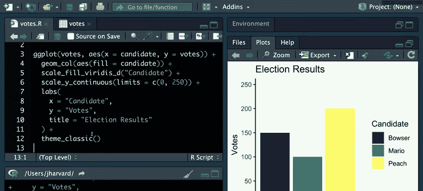

So now we've updated the aesthetics by changing now the colors of each of these candidates and changing the general theme of the plot。

What questions do we have and how we built this plot up from a blank page to adding columns to changing scales。

 to adding labels， and now changing the theme at the very end？What questions do we have？

Can the layers be in any order or do we have for a specific order for them a really good question。

 can these layers be in any particular order or is there some defined when we have to use turns out the only thing that has to come first is this G plot function This gives us metaphorically that blank page to write everything else on top of we could put these other layers in any other order we wanted to。

 but there is some convention generally speaking we go but from a blank page to adding our geometries like these columns here。

Afterwards， we'll adjust our scales if we need to here I adjusted the fill scale。

 the one we see on the right hand side， and I adjusted the Y scale。

 the one going vertically now here。😡，After we adjust our scales。

 should we adjust our labels if we want to here I did just that。

 I adjusted the labels here saying my x axis is the candidate name down below。

 my y axis has the votes name on this lefthand side here and my title is election results and by convention at the end do we add in our theme here to say。

 I want to take all this I've just done and style it in some particular way in this case this classic theme which is more minimalist in spirit。

 but a really good question on the ordering of these layers here。

Let's take one more question on what we've just done so far。

Is there a way to get rid of the legend on the right since it is redundant with the X axis labels？

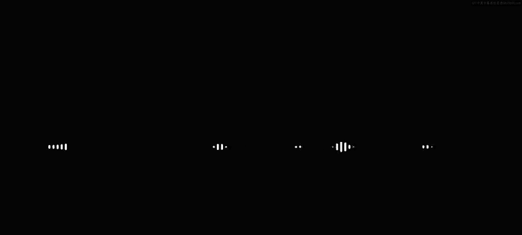

Yeah， a good question。 So here you might notice that I have one color for each of my candidates and I have this so-called legend on the right hand side called candidate that tells me which colors these are associated with Well because I only have one color for each candidate and I already have their names down here you could probably argue that this is redundant。

 so I want to remove this and it turns out I can do that using a parameter of G call。

 one called show dot legend which by default is true but we could change to false let me go ahead and do that over here。

 I'll come back to our studio and let's say I want to make sure that this fill aesthetic of my column does not produce a legend on the right hand side。

 Well I could say I to specify the show dot legend parameter and have it be not true by default but false instead and because this is getting a little long here。

 let me go ahead and put each of these arguments now on their own line just like this and move this parent to its own line and now I should see if I were to。

Rebuild my plot top to bottom that I've removed that legend。

 and now I just have those candidates on the X axis and different colors now for each of them here。

But there's one more problem I would say with this too which is in our original plot。

 we had something like this。 we had Mario and then peach and then Bowser， if you look here。

 we had different ordering than we see in our plot here I have Mario Peach and Bowser but on this plot here I have Bowser Mariio and Peach because by default。

 as we said before Gpl will order these values in alphabetical order by name Bowser Mario and then peach there is a way to reorder these explicitly if we wanted to using what we'll call factors but we'll save that a little bit more'll save that for a little bit more later on now we have here our plot。

 let's say good enough for now， and I want to save it so I could share it with a friend here this is currently all in our studio。

 I'm seeing it here， but I want to maybe get an image file I could share with somebody else well I could do that as well with a special function called G save let's me save my G plot to my own computer。

Let's see G save in action now I'll come back over here and why don't I take this entire plot I've built and now store it in an object and by default for plots。

 we use this P name for plot objects where I'll say everything we've done here starting with a blank plot adding in each of these layers will be stored now under the name P this object here and I could later on in my code still add more layers as long as Ive save this plot as this object P I could say well P and let's go ahead and add in some new layer down below。

 but we won't do that well instead save our plot Well we have a function called G save it let's us save our plots and G save works a bit like this I'll type G save here as the function name and it takes quite a few arguments to save this plot to my computer the first one is going to be the name of this file in this case votes p and G let's say and the next one is going to be the plot I want。

save under this file name Well here I wanted to be the plot P I just made。

 so I'll say the plot parameter to G save is equal to the P。

 this argument here we want this to be the plot we save I'll then say how wide and how tall I want this image to be here I played around this little bit before and I found that if the width is around 1200 pixels and the height is around 900。

 So a 4 by3 kind of square。 this looks pretty good for this kind of plot here and also specify that these units are pixels just like this I also have inches and so on or centimeters and so on but here I' use pixels and so thanks to all of these parameters here。

 the file name， the plot to save how wide and how tall and what units we're working with if I were to run G save and go to my file Expr will now would see boats do p and G and if I click on it here。

 I'll see my own file here。 now saved my computer visualizing all。

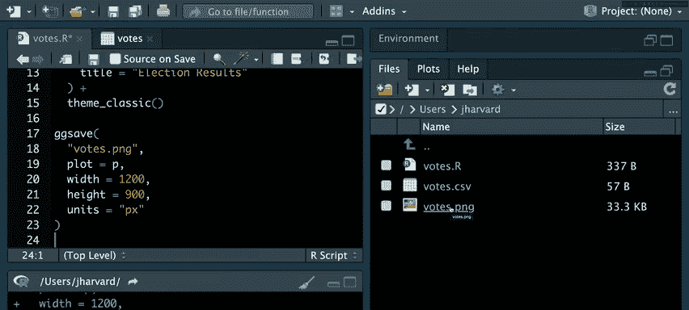

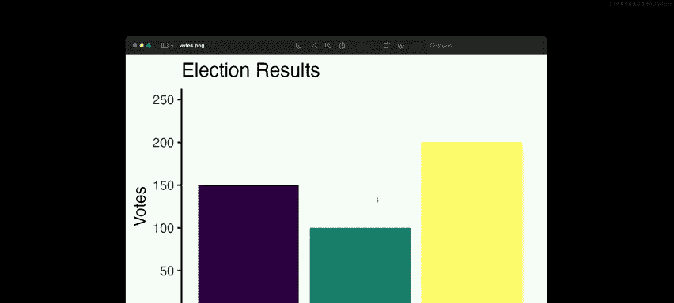

Of this data。So we've seen so far how to visualize our data using columns。 we come back。

 we'll see how to use another geometry， one called a point to visualize relationships among columns in our data。

 See you all in a few Well we're back and so we've seen so far how to visualize our data using columns but now we'll take a look at a new kind of geometry namely the point a point is good when we want to visualize a relationship between two columns you might have in your data and those columns are both on a continuous scale so to illustrate this point no pun intended。

 we have here this data set of candy namely we have names of candy and there price percentile and their sugar percentile what does that mean a price percentile is best illustrated through example here so let's say I bought this Hershey's milk chocolate bar and I went and bought to the store and it turns out that this milk chocolate bar is more expensive than 92% of candy So the Hershey's milk chocolate bar this is a pretty expensive candy overall。

On the other hand， a Reese's peanut butter cup。 Well。

 this is more expensive than 65% of other candies。 So a little less expensive than this。

 but still not that cheap either。 Now， on the other hand， sour patch kids is a candy。

 this is more expensive than 12% of candies。 So a little bit on the cheaper end as far as candies go。

 So this is price percentile。 It's a relative measure of how much this candy costs among other candies in general。

 But we also have sugar percentile。 Well， if we take this same candy。

 this Hershey smoked chocolate bar。 it turns out that has more sugar than 43% of other candies。

 and this reese's peanut butter cup seems to have even more sugar。

 has more sugar than 72% of candies。 So in general here， a higher number for any of these columns。

 either price percentile or sugar percentile means this candy has more expensive or has more sugar than other candies comparatively。

 So let's see how we could visualize now this data。 Well I have here。

 this plot where on the X axis I have。😊，Price and on the y axis I have sugar。

 and it might make sense for us to go through these candies one by one to plot them as individual points on this plot here。

 So here， let's look at again， this Hershey's milk chocolate bar。

 which has a price percentile of 92 and a sugar percentile of 43。

 Where would this candy go on this plot。 I could look first let's say my x axis which has this price percentile variable here。

 if I see that this candy has a 92 price percentile。

 that would be kind of over on the right of my price axis here， this x axis close to 100。

 Now it has here a sugar percentile of 43， which seems like it would go a little bit below 50。

 So maybe somewhere if I point at the x axis and the y axis somewhere right around here。

 I'll go ahead and draw that point here for the Hershey's milk chocolate bar and maybe as we add these points。

 we could ask ourselves if we pay more for these candies， do we actually get more sugar。

 make sugar is what we want We'll see。

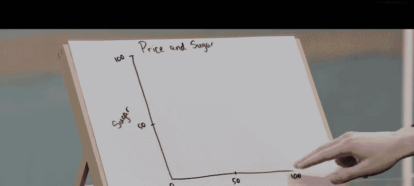

Next one was this receses peanut butter cup here。 It turns out that compared to other candies。

 this is in the 65th percentile for price and the 72nd percentile for sugar。

 So a good on sugar in these。 let's go ahead and plot this point on our plot here。

 Well on the X axis it's the number 65 So a little bit past 50。

 let's say maybe right around here and the sugar percentile is 72。

 So probably somewhere in the top right or so why don't we say maybe right around here。😊。

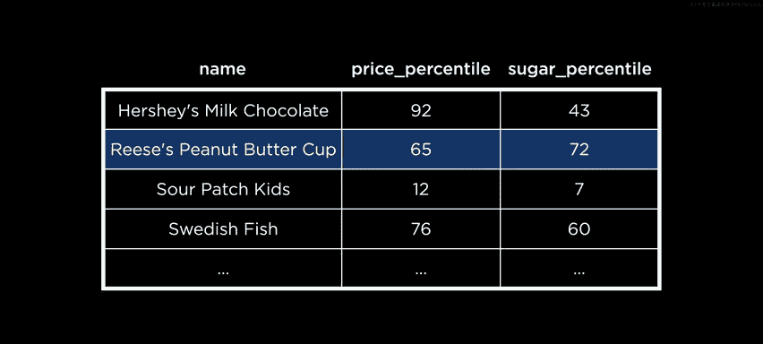

Would be our reese's peanut butter cup now plotted on our plot here。

 Well there's still more candies to go。 We have as well sour patch kids just like this。

 which is relatively less expensive and also doesn't have that much sugar compared to other candies So this would probably go somewhere in the bottom left I would say it's pretty low on both the x and the y axises。

 So if we look here it has 12 on the price percentile So kind of closer over here and a7 on the sugar percentile。

 So also pretty low over here。 I'd say we could plot this point right about here for sour patch kids So it seems like we're seeing a bit of a trend maybe going on here。

 What if we tried now Swedish fish Swedish fish similar to this Reese's peanut butter cup。

 they're pretty high in price， but also pretty high in sugar。

 so let's plot this one too I'll come back over here and say well 76 is somewhere in the middle between 50 and 100 So around here on the X axis and the 60 is just above。

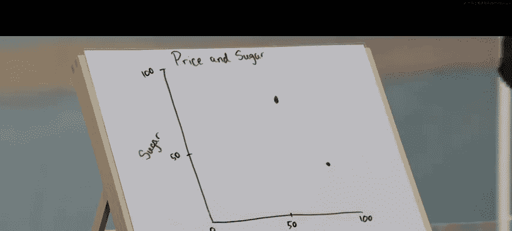

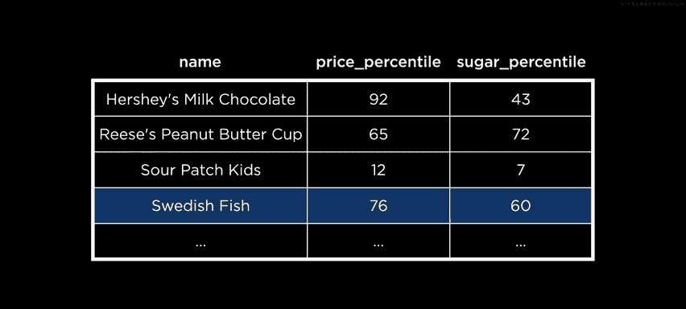

50 here on the y axis。 So let me go ahead and plot this as our Swedish fish point。

 So maybe some relationship here， we see as price goes up， maybe our sugar intake goes up as well。

 Well we'll see now one thing we could do with this plot is think about some edge cases。

 which is here I have plotted four different candies， but let's say along comes another candy。

 this one called Hershey's special dark。

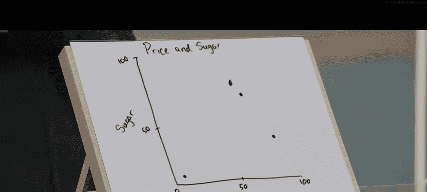

What do you notice about Hershey's special Dark as compared to other candies on our list so far？

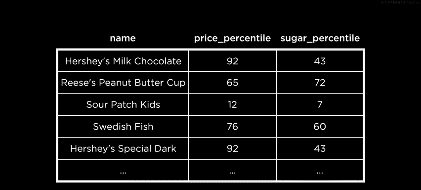

One thing I notice here is that Hershey special Dark has actually the same price and sugar percentile as Hershey's milk chocolate。

 so it brings the question how do we plot this data point Well if I look at this chart here and want to plot Hershey special dark I'll go ahead and look at and say well the price percentile is about 92 and the sugar percentile is 43 that would put it right here。

 so I'll go ahead and plot it just like this and。嗯。

It seems like these points overlap so although we've plotted supposedly five candies， I see here1，2。

3，4 points， so it seems like I'm now missing a point because these two here are overlapping so there are a few ways to solve this one as we'll CG plot is actually to do what's called jittering these points or we might be familiar with jittering like you have the jitterters about being nervous or excited here it's kind of the same idea with these points I could take this point here and I could do what's called jittering it。

 I could say well I don't really care if it's exactly where it needs to be as long as these two points are just slightly separated。

 that's good enough for me I'll erase this point here， but keep in track where I had it。

 I'll put one point slightly below and one point slightly above and now we see two distinct points even though they have the same value we kind of jitter them around so they have a nonoverping visual here。

 so as you go about plotting these points keep in mind if your data has these overlaps。

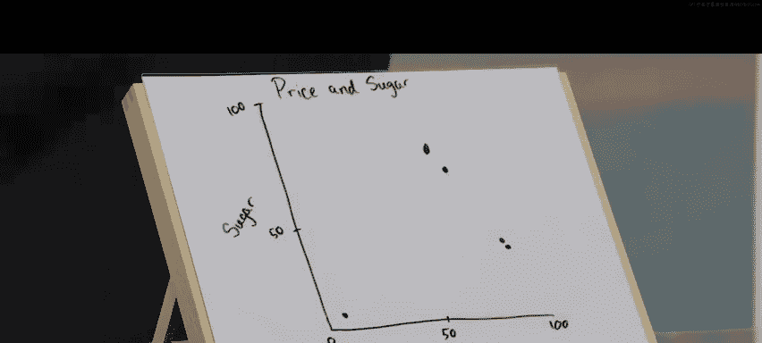

carere about seeing each individual point， you might want to do what's called jittering them。

 so you can see all of them and not just some of them in terms of overlaps as well。😡。

So one thing left to do now is to translate this intocodes。

 Let's go back now to our studio and see if we can make a plot like this with Gpl。

 I'll come back now over here and let's take a look here I have a file called candy do R and the first thing it does is load for me。

 this file called candy do R data inside candy R data is this data frame called candy。

 So if I were to run line1 I'll now see that I have this data frame called candy and inside is much more than just5 candies。

 I have lots of different candies in here and their price and sugar percentiles So let's see if we could visualize them using G plot I'll come back now to candy do R and of course we'll begin with our G plot function to begin with a new blank plot just like this I now have my blank can that I can add layers2 Well。

 the first thing I want to do is sell say to Gpl what candy what data frame are you using here in this case the。

Any data frame so I'll pass this first input here， candy and then I'll also assign some aesthetics。

 I should probably assign the x and the y axes， as we saw here on my chart。

 I'll say aesthetically I want the x axis to match the price percentile column and I want the y aesthetic that vertical bar to match the sugar percentile column just like that。

 and this is getting a little long as a line So I will on one line。

 put the candy data frame and on the next line， put these aesthetic mappings。

 let's say and this is the very beginning of my plot。 In fact。

 if I were to run what I have right now， I would actually see that G plot has constructed for me a plot that has these axes。

 notice how on the bottom， I see price percentile and on the y axis I see sugar percentile very similar to what we have in our chart here but just different kind of numbers that we're seeing on in the individual axes here here I have0。

5100 here I have 0，5100 here I have 0，255751。And so on， so same thing。

 but different numbers on this plot here。So what more could we do we want to visualize these points which we can do using a new kind of gm we saw G call last time。

 let's see what Gem point could do for us I will add a new layer to my plot let's say I'll come back over here and I will add this gm point layer which will draw for me these points according to every individual row that I have Jm point will look at my data frame and make a new point for every individual row I have of candy inside this data frame I'll go ahead and I'll run this and what do I see well now I see lots of individual points representing the candies I have their price and their sugar content Now the relationship seems a little bit less clear here if you pay more maybe you get more sugar。

 maybe not depends it seems on the candy。I'd argue we're running into the same issue we just saw with this physical plot here which is if any two candies have the same price and sugar percentile。

 well they're going to be overlapping each other and in fact I can show you a few points that do just that if I come back now to my table and show you in the candy data frame let me sort this by price percentile and scroll down a little bit more here I'll see that between Hershey's crackle。

 milk chocolate， special dark， these all the same price and sugar percentile。

 so these would appear as only one point on my plot when I ideally want to separate them even just a little bit。

So to do just that I can use a geometry not called geometry point。

 but one called geometry jitter we said were going to jitter our points。

 meaning kind of move them around a little bit randomly but so they're still in the same roughly the same places that they're supposed to be so I'll use geometry jitter here and I'll run this top to bottom and I'll see ever so slightly my points have changed and now I' more able to see individual points。

 particularly around these you might see just a bit of separation around these you might see a bit more separation here too you can tell GG plot how much to widen or to change the height of these points here but for now we'll leave it as the default we can now see a little bit more of these individual points。

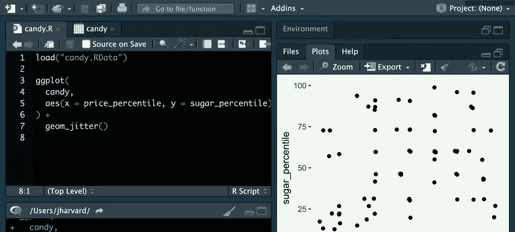

Now go ahead and improve this chart some more here I want to probably add some labels。

 like renaming my X axis and my Y axis， adding a title， and let's go ahead and set our theme to。

 I'll come back now to our studio and let me change this。

 I will add in a label layer and I'll set the X label equal to price。

 the Y label equal to sugar and the title of this chart will be simply price。Price and sugar。

 and then finally I'll go ahead and adjust my theme， I'll again use the classic theme here。

 and we should see my chart is now coming into shape。

So what have we done we have started again with this blank canvas and given as input。

 our candy data frame， we've told GGplot we want to map the price percentile column to the X axis as we just did here。

 and we want to map the sugar percentile column as we just did on the Y axis here we're going to go ahead and add in these points and jitter them just a little bit so we can see those individual points to。

 we're going to add labels and set our theme。😡，Let me ask。

 what questions do we have so far on this point geometry， jittering， R points。

 or anything more related to this plot here？When does does this plot is preferred over the column Yeah。

 really good question and it's one you probably will run into very frequently when you're visualizing your data is what type of visualization is best here Now when we have data that involves both categorical and continuous variabless like we saw in our candidates remember we had called the X axis is a discrete scale or a categorical scale it had individual candidates and each of those candidates had some continuous value associated with them。

 their number of votes， that's a good kind of data to use for a bar chart or a column chart。

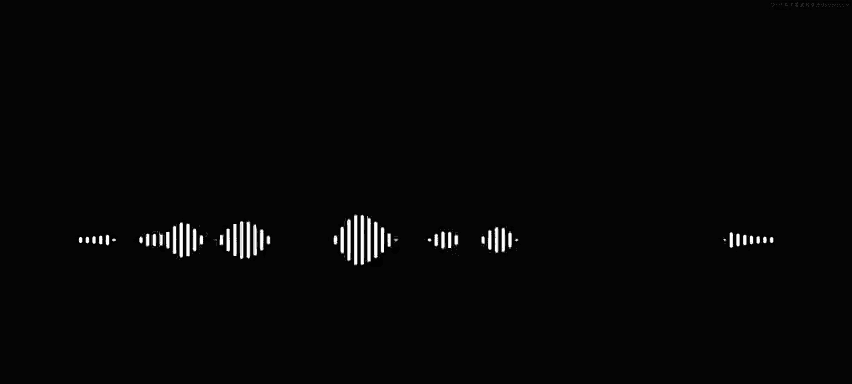

Here though， we have actually two continuous variables。

 two continuous scales on the x axis I see a range of values between 0 and 100 and on the y axis I see the same thing。

 Well if you have a continuous range of values on both your x axis and your y axis that's going be a good hint。

 you probably want to use something like points， for instance， you could imagine using columns here。

 but I'm not exactly sure what that would look like。

 maybe I need to have two columns for each of my candies。

 one for sugar content and one for price content which wouldn't quite show me the relationship between price and sugar here I argue that this serves us much better。

 the relationship between price and sugar when both are continuous that is on this individual scale here between zero and 100。

But a good question and want to consider is you go often design your own plots， too。

Now let's go ahead and tie this up a little bit more and maybe I can go ahead and actually do one thing which is the title doesn't appear to be showing here。

 I have price and sugar， but I didn't set the title of it here。

 so let me go ahead and go back and change that。 I will update the label layer to instead say the title is price and sugar。

 Let me rerun this and we'll see price and sugar up top but now one kind of fun thing I could do is change the color that I see on these points。

 and it turns out that there is an aesthetic that I can apply to my points here with John Diitter one called color Now one color I kind of like is this one called dark orchid and in R you actually have access to certain color that are known by given names So there's one called dark orchid and we'll see here that our studious automatically show me what color Dark orchid is but you also have more primary colors like blue or like red or like green and so on。

 and it turns out that this color。When applied to this point here。

 actually it'll change the color of these points we're seeing， so I'll try to make these points。

 this color dark orchid， which kind of evokes some candy here for us。

 Let me go ahead and see what that does。 I'll go ahead and run this and now I'll see that my points have changed to this color dark orchid。

Now notice here that we're not specifying an aesthetic mapping an aesthetic mapping tells Ggipl to map some column in our data to some given aesthetic like X or y or even color if we wanted to what I'm doing here instead is saying well all points should actually get this same color if I want to apply any aesthetic to have only one value。

 I don't need to use the AES function， I can simply say the aesthetic name and then the value wanted to have inside the geometry I want to apply it to。

 So in this case I want to change the color of these points that are generating about and change it to dark orchiId in particular。

Now， one other setup we could change two is one called size。 Well these points have a certain size。

 a certain radius， a certain size on this page here。

 Then I could change using this aesthetic called size。

 let me go back and do just that I'll come back to our studio and let's try changing the size of these points to be。

 maybe a little bit bigger。 I could set size which is by default somewhere between one and two let's 1。

5 or so I could change this perhaps to maybe two to make it just a little bit bigger。

 I'll go ahead and visualize this and I'll see my points are now just a little bit bigger。

 I can make them even bigger。 I can make them maybe size4 or so just like this and now we're better able to see our points because they're bigger but there's still a lot of overlap here。

 So one thing do is maybe make them smaller to reduce that overlap I'll come back over and say let's change this from4 to maybe like a 0。

5 make them pretty small and now it be better able to see these individual points。

 I think I'll leave it somewhere around two or so to make this chart more。Usually interesting。

 but you can have access to this aesthetic called size to change what your plot looks like in terms of how big these dots actually are。

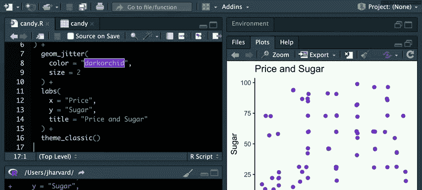

Now， a few more we can work with one is all going to be called in this case。

 fill and one is going to be called shape。 we actually seen fill already。

 we've filled in our columns， but we can also supply the fill aesthetic if we change the shape of some of our dots here So let's go back to looking at our dots and let me play around with this aesthetic called shape to let me go actually and put this above size to keep these arguments in alphabetical order here。

 I'll say that shape is equal to Well what do I want。 I mean。

 it turns out I can't specify something like triangle。

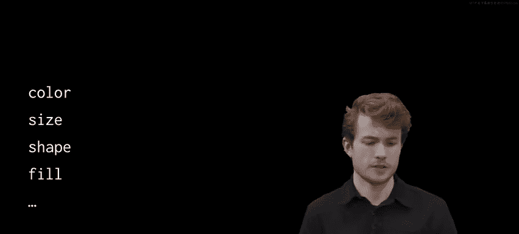

Like this。 And I can't use something like square like this。

 I have to actually put in some numbers here。 And if I look up on the Gpot reference what numbers correspond to which shapes。

 I can actually see which shape I want and type in the corresponding number。

 Let's go through a few of these here just see what they look like。

 I'll change shape to be one and see what I get。 I'll go ahead and rebuild this chart。

And now I see my dots are still there， but they're a little more translucent。

 I see here that they have the color on the outside and on the inside they seem to be transparent。

 I actually see through to the white background at the bottom of this page， if you will。

I could change to a different shape2。 Then they come back and try maybe the second shape option we have shape equals 2。

 And now I get triangles， which is kind of cool。 I could also use maybe shape 3。

 And now I get some plus signs。 There are lots of shapes you can play around with and use。

 depending on how you want to visualize your data and change things aesthetically。😊。

Now one shape I like in particular， particularly for this kind of data is going to be shape 21 and I only know that because I looked up online I went through the shapes in G plot and I found that this shape corresponds to the number 21 so let's see what that looks like I'll come back over here and I'll try shape equals in this case 21 let me go ahead and rebuild my plot and I'll see those translucent points again but it turns out that actually this shape 21 allows us to specify both a color and a fill where the color to be clear is this color on the outside of the dot and the fill is the color on the inside of the dot so I could have kind of a twotone dot here with some border around it' a little bit darker and some fill it's a little bit lighter take it more aesthetically pleasing Well let's try setting the fill aesthetic here I'll come back to R studio and let me change in this case the fill aesthetic to B a color that I found in R's manual。

callled just regular old orchid like this。 So my color。

 my border of these dots will be dark orchid and their fill。

 color on the inside of them will be this kind of pinkish purplelish color called orchid。

 I'll go ahead and rebuild this plot and now I'll see some kind of twot dots。

 I see here that I have that ring around them in dark orchid and the middle I see that color orchid for their center of fill。

 So here we've now played around with different aesthetics for are dots， including color fill。

 shape and size， there are more irrepo too， but more on that another time。

And this I think is a pretty good plot， we've built it up from scratch， adding in our dots。

 our aesthetics， our labels and our themes， let me ask what questions we have on designing plots now with points。

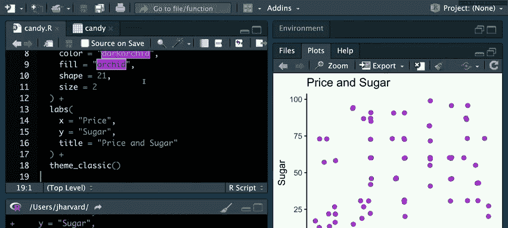

Is there a way to randomize the dots in the color of the dots in the clot to randomize the color of the dots？

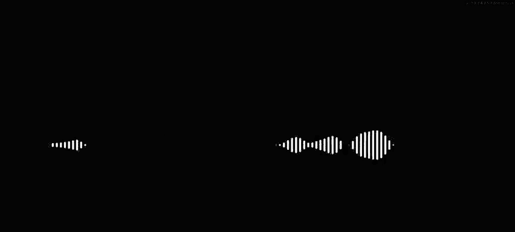

Yes， so one way we could do it is specifying a new aesthetic。

 so if we ever want to vary a certain aesthetic like let's say color or fill or shape or size based on some data。

 whether it's random or not， we wouldnt specify an aesthetic here so you can imagine specifying a new aesthetic mapping。

 one that involves color and is associated not what they call them in your data set but some random data you give it and you can certainly do that to make sure the color is randomized across these different dots。

A good question， too。 One thing I'm seeing is I think people are trying this and seeing that shape。

 I can actually specify a text input to it。 So let's try that。 I'll come back over here。

 And I said that we couldn't do something like type in square。Square or triangle or things like that。

 but let's just try it and see， I'll go ahead and type in square。And I do get squares。

 maybe triangle here and I'll type in triangle oops triangle and I'll see I get triangles I could try circle too just to see what we could go off and do and now I see circles so it seems like some basic shapes you can specify but in general what we'll tend to do is specify these shapes by numbers looking them up in GPro reference now to determine which shape it is we want like 21 that has both this fill and this color aesthetic here。

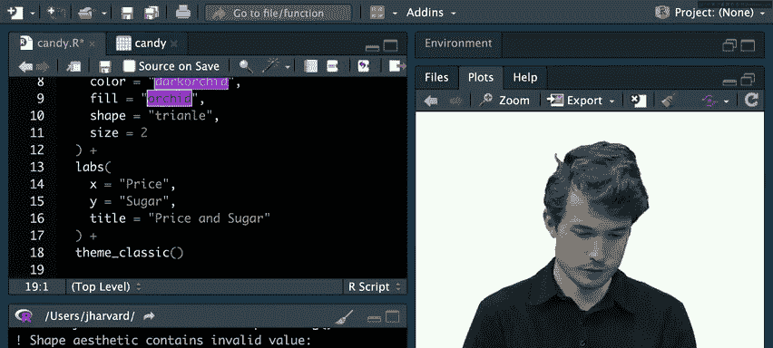

Pretty cool。Okay， so we've seen now how to visualize relationships between two continuous variables in this case price and sugar。

 and we come back we'll see how to visualize change over time in the context of hurricanes。

 we'll see you all in five。What we're back and we'll do next is visualized data that changes over time。

 otherwise known as time series data， and we'll do so in the context of a particular hurricane named Hurricane Anita that happened in the Atlantic in 1977 Now here's a picture of Anita making landfall in Mexico and thankfully it did so in an area that wasn't very heavily populated。

 but it still unfortunately did much damage so by looking at this data and visualizing it we can actually hope to learn how hurricanes like these evolve and change over time so that we can better prepare for them and ultimately respond better to them in turn。

Now here are some observations of how Hurricane Anita grew over the days it was active here I have a column called wind speed or is called wind。

 and it's representing wind speed in terms of knots。

 this kind of nautical term for how fast the wind is blowing。

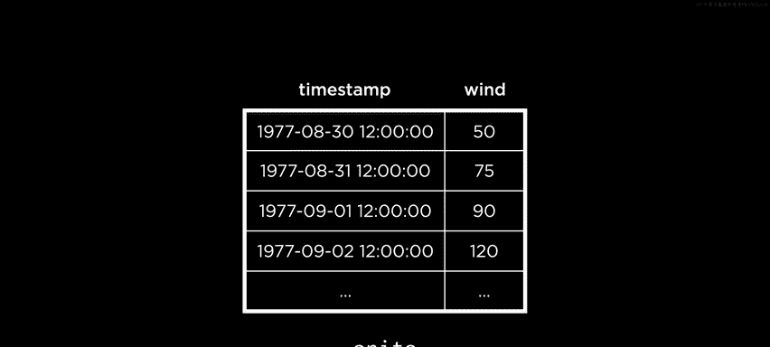

I here have a column called timetamp2 that tells me on what date this observation was taken and what time to。

 so here I'll see that this one is taken in 1977 on August 30 around 12 noon and the wind speed of Anto was known to be about 50 knots in total on next day on August 31st at also 12 noon。

 the wind speed was about 75 knots in speed So here we can see how Hurricane Anita is evolving over the days thats growing actively too。

Now， how could we plot this data， Well we could do it very similar to what we saw before putting points on our plot。

 like we did with the candies here。 maybe on the X axis。

 we have our timestamp and on the y axis we have the wind speed。

 that's exactly what we have over here。 So here I have a plot wherere on the x axis I put the date in this case。

 August 30， August 31， September 1 September 2 Now on the y axis I now have the wind speed in knots going all the way up to 160。

 Now to plot this data I could go point by point and add it to this chart here maybe for the first one I see this happened on August 30。

12 noon， the wind speed was 50 So if I look at this plot I might look and see August 30 and the wind speed being about 50 or right up here Now true to how G plot works。

 let's go ahead and add a new layer to our plot here one for these points we're adding I'll go ahead and put this over my axes and let me go ahead and draw this first point I'll say August。

is equal to wind speed of about 50， so I'll put it on above August 30th and kind of beside let's say where 50 might be right around here。

 let's say for our first observation。😊，On the next day I to strengthened and it was about 75 knots on August 30。

 so I'll go ahead and add that here， I'll go over to August 31t and say it was about 75 knots。

 I'll go maybe just below 80 on my Y axis somewhere right around there and then on September 1 well I need to blue about 90 knots here so 90 would go well above September 1 and maybe between 80 and 120 so somewhere around there let's say September 2 I need to blue 120 knots。

 so let's go over and add that one， I'll put that one kind of right beside 120 let me put that one right here and let me lower this one just a little bit to be sure。

Make sure we're accurate here， and this I think represents the points that Anita would have as it grew in wind speed over time。

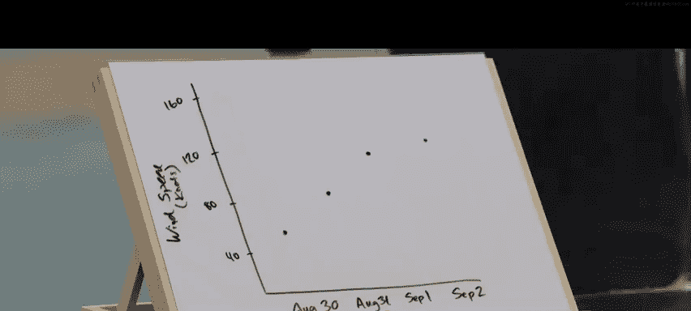

Now， one thing I could do to make this even more apparent is change over time is maybe connect these dots with a line。

 and so I could very much do that by adding a new layer here to my plot。

 I'll add this on top and I'll decide， well I want to connect these points to show how I need to grew over time I'll start by connecting these first two points here。

 this one between August 30 and August 31， I'll draw this line here。

 and now I've seen how I need to change between August 30 and August 31t。

 allll do the same now for August 31 to September 1 just like this and the same again for September 1 to September 2。

 just like this。 and now I argue I'm better visualizing change over time。

 I'm seeing how this hurricane strengthened over the days that it occurred and how it grew to be a full-fledged hurricane but see how it could make a plot a bit like this now using Ggi plot itself。

I'll come back now to our studio and let me go ahead and open up this data file called Anita。

R data and inside AnitaR data is this table here， one called Anita that tells me many observations of how Hurric Anita grew and here see I have more than the observations we saw on our slides。

 I have ones I have multiple for each day even let's see on September or August 30th I have the midnight observation。

 the 6 a observation， the 12 noon， like 6 o'clock observation。

 there's a lot of observations here in more detail of how Iita grew。

But we still have those same columns， timestamp and wind。

 So let's use them now to visualize this data in terms of a plot。

 I'll start as usually do with our G plot function to give myself this blank canvas to work with I'll then pass in as the first argument to G plot。

 the Anita data frame just like this and I'll assign these aesthetic mappings。

 I want to make sure that the timestamp column falls on the x axis and the wind column here falls on the y axis。

 So I'll assign them in terms of the aesthetic mappings now I'll say that x equals timestamp and y y equals wind just like this。

 and of course， given what I have now I have my scales on either the x and the y axis。

 but now I want to add in my points that I just made originally over here。

 I'll add a new layer now syntactically and G plot with this plus sign and I'll say geometry points what I want to add to this first layer and now with this more complete set of observations do we see exactly。

How to grew over the days that it was considered a storm all the way from August 30th or so to September 3rd or so。

But we ideally want to connect these points。 It's showing change over time and thankfully we do have another geometry we could use one called geometry line。

 so let's do just that and use geometry line to connect these points。

 Well similar to what we just did over in this demo table here by adding a new layer to our plot I could do the same I could have more than one geometry on my plot I could have one for points and one afterwards for let's say lines just like this。

 geometry line draws lines between all of the data points that we have。

 So maybe go ahead and run this here and I'll see now all of these dots are connected by lines and in fact my plot has multiple layers similar to this one。

😊。

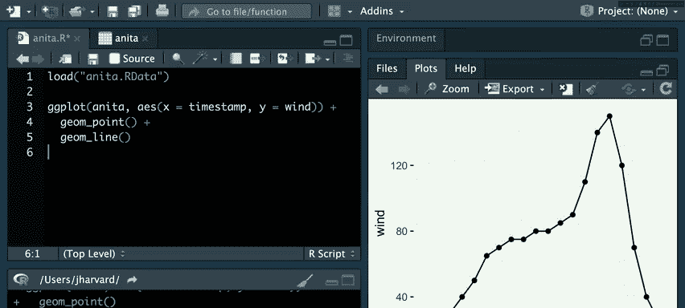

One layer are these lines， one layer are our dots here。

 and the bottom layer is our aesthetic mappings in our blank plot here。

 so I'll go ahead and remake this plot right here and we'll see the same over in Ggi plot to be sure。

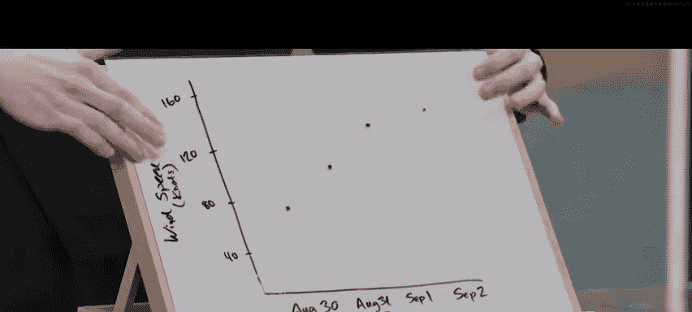

Now let's spruce this up a little bit more， I wanted to maybe change the labels here。

 give it a title so I'll do this sta， I'll come back over to our studio and add in a label layer。

 I'll say let me go ahead and add some labels， make sure the X axis is maybe let's call it date like we did over here and I'll go ahead and say the wind the wind column which called wind but we'll call it maybe wind speed in knotugh to be more specific and then we'll go ahead and say the title is going to be hurricane Anita to be clear what we're visualizing here。

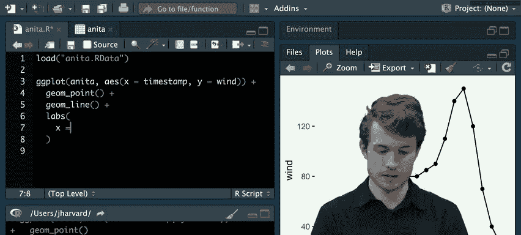

Let me rebuild my plot。 and I'll see all of those labels now in place。 So we're getting pretty far。

 But what else could we do to improve the design of this plot。 Well。

 I'd argue that we could play around with some colors here。

 make sure it looks a little more a little more amusing， little more interesting to look at。

 And one thing we could do is experiment with the color for these points。

 So we saw before that we might want to change colors of points we can do so by setting this color aesthetic inside of our geometrym point or gm jitter。

 both those are drawing points for us。 inside， let's say geometrym point。

 I can go ahead and say I want to set this colors to be equal to what I found is called deep sky blue4s up online。

 and's a pretty cool our color kind of symbol hurricanes， at least for me。

 I'll go ahead and reload this plot and we'll see I now have。😊，These dots here， now colored too。

But if you look a little bit closely。I'll see that this line is actually overlapping these dots and I'm not sure that's what I want。

 I think what I really want is for this line to be behind these dots。

 and so similar to thinking of our plot in layers， it seems like I drew the points first underneath the line layer and so the line of course will kind of overwrite or be on top of the points if I want to vice versa I should change the order of these here to the question I'm ordering earlier。

 if you want your geometries in certain order one on top of the other。

 well ordering does matter in that case So let me switch now geometry line with geometry point。

I'll comee back over here and I'll decide now to change this to have first the lines drawn just like this。

 and then the points drawn on top of them， I'm going rebuild my chart and now suddenly we'll see that the lines are behind the points and the points are now in front of them。

So here we've seen our very first chart using both geometries， point and line。

 let me ask what questions do we have about how we visualize this hurricane and its growth so far。

Is in formatted in the graph， but it is not well formatted in the data file。

 A good question about the format of your data。 And so it kind of harkkenens back to last time we were learning about clean data。

 making sure data is clean before we actually can visualize it here the reason able to visualize this plot is because I have my data in a certain order I have each individual column that I can then map to individual axes here if my data were not in that shape or in that format I couldn't do what I'm doing here So it is important to make sure your data is in the right format in order for you to visualize it in the way you want to visualize it。

 but more on that actually last time we saw how to clean data as well。

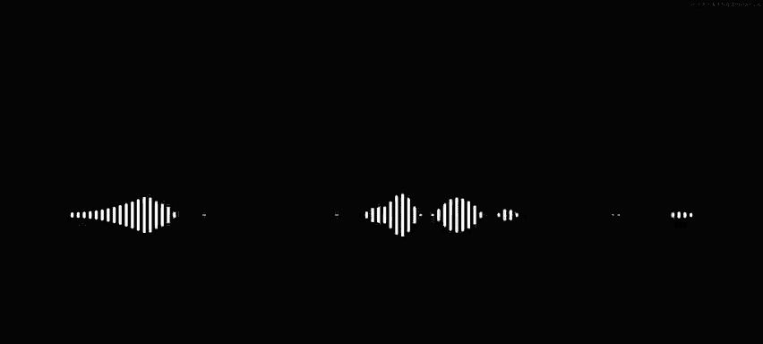

Well let's keep going and they more visually interesting and we've seen now these points but what about these lines。

 how could we change how they look Well it turns out that geometry line or this line geometry has its own aesthetics we can play with two and I'll show you two of them in particular let's come back now to our studio and play around with a few of these aesthetics one of them is called line type and one of them is called line width and kind of true to their name。

 line type changes the type of line， let's say whether it's solid or dashed for instance。

 and line width changes how why this line might look。

So I'll come back now to our studio and let me try to adjust the style of this line。

 Well maybe I'll first play on with the type of line and I can probably do so by specifying some number。

 much like we did for shape。 there are a few different line types among them this solid one that we see here dashed dot dash and so on。

 let's just see what a few of them look like here， line type 1 if I build this Well line type1 is exactly what we already have line type 2。

 what's that I'll visualize this and now we'll see kind of a dashed line I'll see that there are some translucent parts this line and I see dashes now between each individual dot and really on the line in general Let's try now maybe line type3 and see what that looks like line type 3 seems to be Well more so dotted I see not full dashes in my line now individual dots separated by spaces So there are many line type。

I encourage you to play around with them， look in the reference and see what kinds of types of lines you can create with GgiPot。

Now one other one we saw earlier was line width how wide or thick should this line be let's plan with that too I'll come back now to our studio and let me change my line type back to1 I kind of like that one the most and I'll use line width now where line width might be well let's just try one and see what that gives us I'll enter here and my line is a little bit thicker than I'd say it was before it is pretty thick here I can it kind of connecting these lines still I can make it even more thick or probably I'd argue I want it to be a little bit thinner so I'll make it smaller than1。

 maybe something like 0。5 or so I'll go back over to line width and say I want it to be 0。

5 in size and I'll see this seems more reasonable in terms of a width for my line and I encourage you to experiment with these line width and see which one actually best represents your data。

So here we' played around with these line geometries but we could probably still improve this chart a little bit more。

 I think I want these dots to be a little bit bigger and we saw how to do this just last time I could specify in geometry point a size for each of those points。

 not just a color but also I want to say the size of these is a little bit bigger than usual maybe a two instead and now just barely these dots are a little bit bigger and I think we're now seeing our data just a little bit better I'd say this looks pretty good。

Now let's go ahead and add in our theme here， to the bottom and say I've added in all of my geometries。

 my points， my labels， let me go ahead and say I want this classic theme to tidy things up here and now I'll see my chart。

 so I'm pretty sure I want it to be。Now this is pretty good as a chart。

 but I think there's more we could do to it。 One thing we could do is figure out when exactly hurricane Anita became a hurricane。

 In fact， hurricanes start as these lesser storms from as tropical depressions or tropical storms and they grow to be hurricanes Well here we don't quite have a sense of exactly when hurricane Anita became a hurricane but it turns out that hurricanes are considered hurricanes when they reach a wind speed in knots of 65 knots。

 so it seems like any dots that are above this 65 mark on my Y axis well that indicates when Anita was a full hurricane。

So if I want to add not just data points， but some arbitrary line。

 Well I could do that just as well here， too。 effectively。

 what I would do is add a new layer now to my plot。 I'll do that on our visual here。

 I'll take this plot。 And why don't I draw a line indicating when this hurricane became a hurricane。

 And we know it does。 So when the wind speed is greater than equal to 65 knots。

 So I could draw maybe somewhere between 40 and 80 right around here or so a line。

 maybe a dotted line saying that above this line。Above this line， Hurricane Anita was in fact。

 a hurricane。Now similar what I just did by adding a new layer to my plot。

 I can do the same in Dgi plot and I'll use this geometry called an H line for a horizontal line。

 we also have a V line for a vertical line but here we' focus on this horizontal line here let's come back now to our studio and see what it would look like to add this H line。

 this horizontal line while I probably want it to come after I add in my lines and my points I'll go ahead and add this layer after I specify my points here。

And I can do so by using GM underscore H line for this horizontal line， I want to add to my chart。

 I'll finish this off with a plus to make sure to add my labels later on。

And now there are a few parameters I can specify in terms of this H line。

 one I could specify is still the line type， it is a line so it has that same aesthetic of a line type。

 I could change that for H line perhaps to this dotted one we saw earlier， which was line type3。

But let me go ahead and try to visualize this， I'll go ahead and run。

 and I'll see I actually get a warning or really an error。

 GM H line requires the following missing aesthetics， Y intercept。What is a y intercept Well。

 as the name kind of implies is the place that this line intercepts or crosses with this y axis。

 In our case， we said that whenever a storm gets to 65 knots or higher， that means it is a hurricane。

 so it seems like the place that this line intercepts the y axis is well 65 knots。

 So I could as a parameter to H line Gm H line， say that the y intercept should be 65。

 meaning 65 knots。 I'll come back now to our studio and do exactly that。

 let me go ahead and say that the y intercept。 the y intercept of this line should be 65。

 exactly that， and then I'll go ahead and say let me run this top to bottom。

And now I have a pretty neat graph， I see the evolution of Hurricane Anita。

 I see what days it was considered a full fledged hurricane。

 and I also see what days it was not a hurricane， but a tropical storm instead。😊。

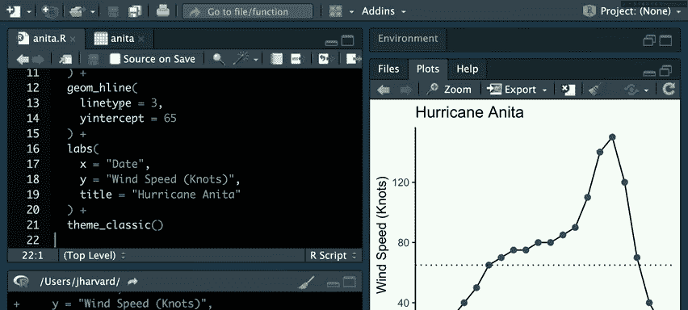

So we've gone from an empty plot to adding in many geometries。

 we've added in dots and lines and horizontal lines and so on。

 we've added in our aesthetics in terms of X and y and color and so on。

 we've added in our labels and our themes too making this final plot。😡。

What questions do we have on what we've done so far？Hi。

 I was asking if if it is possible that we do the color color color blind， color visualization。

 like any any anything above the 65， you change the color or maybe change a line color or something。

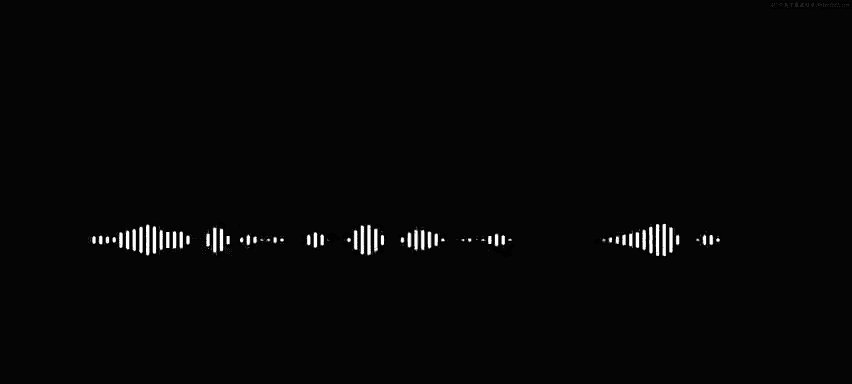

I really like what you're thinking Yeah， so you're considering what can we do to make this plot more colorblind friendly and that's a really good consideration when you're working with different colors having those colors mean something distinct in your data I would argue that in this data set of this plot the colors are more aesthetically pleasing。

 they aren't really showing me information in this plot but if I wanted to I could choose colors that are friendly to those who are colorblind and actually a good thing I could do is if I use multiple colors beyond just in this case black and blue well I could choose colors that are distinguishable to those who might have some form of colorbldness and for that I could actually look up what colors I might be able to use to make sure that that works for various forms of colorblindness。

 the verta scale might be a good place to start but here because I just have black and blue I'd argue that this is going to be good enough for now but a great question here。

😊，Okay， so we've seen now all in all today how to visualize groups of data and values associated with them。

 we've seen how to visualize relationships between two different columns in our data and we've also seen how to visualize data over time we come back we'll see how to actually test our programs。

 make sure they work as intended， but more on that next time we'll see you later on。

