# 哈佛大学《商业的计算机科学｜CS50's Computer Science for Business 2025》中英字幕 p06 CS50 Business - Lecture 5 - Implementing the Internet .cut.zh_en -BV1ArsFzQECJ_p6-

Hello world。 This is CS S 50。 and the second of our two live streams today。

 I'm here with CS 50s zone。 Eric Trk。 and Eric has been one of our teaching fellows for many years in some of C50's courses and is here today to tell us about how the Internet is implemented。

 I'll be behind the scenes entering any questions via the chat and raising my hand on your behalf。

 This is a new and improved version of C 50 for business A50 B that will go online later this year along with the assignment。

 So stay tuned for more attending today offers a bit of a preview。

 We've been kicking these things off with a bit of a fun fact。

 I gather you are quite the fan of board games。 and you have any favorite。 I am indeed。

 we actually have a collection over 200 board games。

 My current favorite game is Ark the card game interesting And how does that compare to like Monpoly with which I grew up It's a bit different from monopoly a more storytelling a bit of a shorter game and a lot more strategy involved Well so glad Eric is here we're gonna get started in just a moment or two。

 And as before we might start and stop and fix some things along the way。

 So please forgive any delays。😊，In a bit， thank you。Great。Hello everyone。

 welcome and thank you for joining me today today we will be talking about implementing the internet。

The Internet has changed our lives in so many ways right our communication is considerably better than it ever was before。

 it helps us learn， it helps us do business together。

 helps us interact with our friends and family today we'll be talking about a lot of the technologies that underlie the Internet that allow it to be what it is today and we'll be looking at some of the design decisions made along the way that help bring the quality of the internet now as it was。

 say 30 years ago， we've seen some tremendous improvements and we'll talk about how those have come to be first we'll talk about some history what are some other forms of electronic communication that has brought us to this point initially we had say the telegraph where we had electronic communications going over a wire。

 typically to a trained operator that would have to translate and interpret that message and then hand that off transcribe it right it down。

 hand that off to the ultimate recipient。

Fast forward a little bit。 We go into telephone。 We still have electronic communications going over a wire。

 but now we're able to actually hear audio and hear what the sender is saying to us。

 we can listen to that audio， but we still have a human being listening to that message on the other end of the line  moving forward a bit。

 we get radio Now we're not necessarily using wires。

 We're using airwaves but we're still sending this message far and wide。

 but ultimately some device is going to take that data and present it to us to a human being listener who would then interpret that content that's coming from radio。

 How is the Internet a bit different than this with Internet。

 we have a brand new paradigm The computers themselves are actually able to intercomicate without necessarily needing a human being to interpret it real time right computers can have conversations amongst themselves So how might that。

Happen we start out with protocols。 So what is a protocol in basic simple language we have some constraints or some conventions that are going to govern and structure some type of interaction So we have some day to- day examples of protocols that we're all familiar with For example。

 greetings When you walk up to somebody on the road or you see someone you'll likely say hello。

 how are you culturally， we may have some different different examples of that do we shake hands。

 for example， maybe we hug and kiss， maybe we do the fist bump or the elbow bump during during coVd times right So we've come up with different ways to greet one another and we may see around the world there are different versions of that dining。

 we may see that in some formal occasions there are some expectations of where exactly dishware or silverware may be laid out where perhaps in your your home on a casual meal。

 we might not necessarily follow some of those same rules。When we address letters， for example。

 different countries may have their own standards， but there's a very specific location where we're expected to write down these fields of data such as address。

 postal code， city， perhaps some region that it's being delivered to or a postal code。

 all of these things govern the way that we expect to interact。

With whatever it is we're talking about， say sending a letter with electronic communications。

 this is largely the same。 Only they're a bit more specific with human protocols。

 there's some room for ambiguity。 We don't always have to follow the rules with computers。

 computers aren't as good with ambiguity。 They're getting better， but not as good with ambiguity。

 So we need to be a bit more specific。 So we'll be talking about some machine to machine communication protocols that are indeed more specific。

 We'll look at some that created the Internet， and then we'll look at more as we go through we go through history。

 really， and we want to improve various problems we find with with problems we're trying to solve on the Internet and we'll look at how some of these protocols have done so So we'll look at IP Internet protocol can't have the Internet without an Internet protocol right So we have our starting point TCP DNS DHCP HttP。

 We'll talk about a bunch of these and other protocols by no means a full complete。

Lists that we'll be able to discuss today， but some of the important ones that you use every day as you're using your computer and as you browse the internet as you know it。

So let's start with Internet protocol。 What does Internet protocol actually do Well。

 for us to be able to send information from one machine to another。

 we need to be able to address or reference a specific machine and know who that is。

If I'm in a room with a few hundred people and I'd like to speak to one person。

 it would be very helpful if I knew their name we might find in human communications that the same two different people might have the same name。

 and perhaps again， there's some ambiguity with computers。

 this ambiguity doesn't work so we need to have a bit more specificity So we've come up with a system in IP version 4 which is coincidentally the first standalone protocol governing IP。

 which is a great name， we'll get to that a bit more later。

 where we have 32 Bs of information that identify uniquely a specific computer somewhere in the world with that address in theory。

 any computer with an address should be able to speak to any other computer with an address So we need some mechanism via which to label and address these computers so they can communicate。

Once they're addressed， we still need to know how to actually get there right so if we're sending data。

 it's not enough to say， well it's going next door， it's going across the street。

 if we want to get this across the world， we need to have some sort of routing mechanism。

 to be able to take these pieces of information， transfer them over a series of wires， airwaves。

 whatever it may be to ultimately wind up at its destination。Finally。

 it winds up being a problem when we start sending bigger and bigger pieces of information。

 especially when we send them in long distances。So we don't want one of those to fail and have to do the whole thing over again。

 So we actually break down。Our messages to smaller and smaller pieces。

 And we send out those small pieces and then reassemble them on the other side。 that way。

 if one fails。We only have to send that small piece again without having to resend the entire message。

 so this allows at a time when computers were much slower。

 this allows for a bit more safety and reliability in getting our messages delivered。

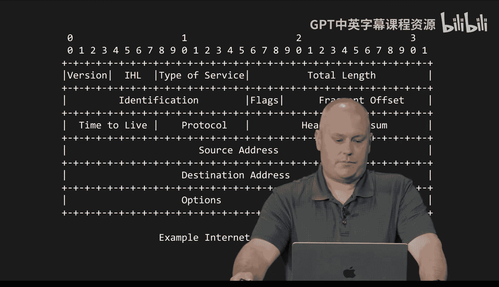

So what we have here is a bit of a graphical example of what the IP protocol looks like in terms of data headers we'll add these fields of different types of data in the front or ahead of the content that we are sending out in every broken down packet will have one of these headers so you can see there's a number of different fields here that will communicate so the machine on the other side is able to read these fields and understand what is being sent now because we agree in advance that these fields will always be in the same order。

 they'll always be the same length the structure that is the definition of this protocol right it's exactly the order and the structure of these fields so we know how to interpret it without a human needing to get involved and make decisions a computer can compare this against the expectation and say I know that this particular field will always be here and what that is going to me。

い？So that's great。 We have a way to get small packets delivered to an address。 fantasticastic。

 We've broken down that message into smaller pieces。

 but that can lead to some problems along the way。 So let's say I'd like to send a message。

 Let's meet for coffee tomorrow at noon。 and let's for simplicitys sake that we break this down into a smaller message。

 let's meet for coffee tomorrow at noon。 So each word is going to be its own message。

 This might be a a bit overkill and a bit simplistic， but for example。

 we can see how we might break this down。 The recipient on the other side。

 Let's say they receive four let's coffee tomorrow at meet noon。

 That doesn't make as much sense right there's no guarantee with I that the order of these messages that we send are going to be received the same way in which they were sent。

 and that can naturally lead to a bit of a problem。 that's not the only problem。 However。

 What if some packet。😊，Or fragments don't arrive at their destination at all。

 Let's say I send the message。 The buried treasure is beneath the flower pot。 And you。

 as the recipient， receive the buried treasure is beneath the。This is a pretty critical。

Piece of information that was missing。 And I'm sure most people would like to know where that last packet is。

 right？ So enter transmission control protocol。 This is an additional layer to be added to the I protocol。

 which allows some of these problems to be solved。 First， it lets us order these packets。

 We can give each a number， and know how many packets were expected to be delivering over the course of this message。

 So the recipient， even if they receive them out of order， this is 7 of 10。 This is  three of 10。

 This is one of 10。 once we receive them all， we can put them back in order and then make sense of what that original message was。

 that naturally will make it a lot easier to figure out what was being said for a simple message like。

 let's meet tomorrow at noon， It might be easy enough to figure out what was intended。

 But for longer and more complex messages， you could see that order would be very important。

There's also a mechanism to allow packets to be resent if they didn't arrive。

 and actually the way we handle this is the recipient will acknowledge each individual packet and send back that acknowledgement to the sender saying。

 okay， I've received packet number one， I've received packet number5 and anything where there is no acknowledgecment will actually go and send again to make sure that the full message has been received。

 We also might want to check for errors that happen along the way。

 we have some mathematical trickery we can use to make sure that the data we receive matches the data that was sent because otherwise we might not know if the message was damaged along the way and maybe we are receiving something different from what was sent。

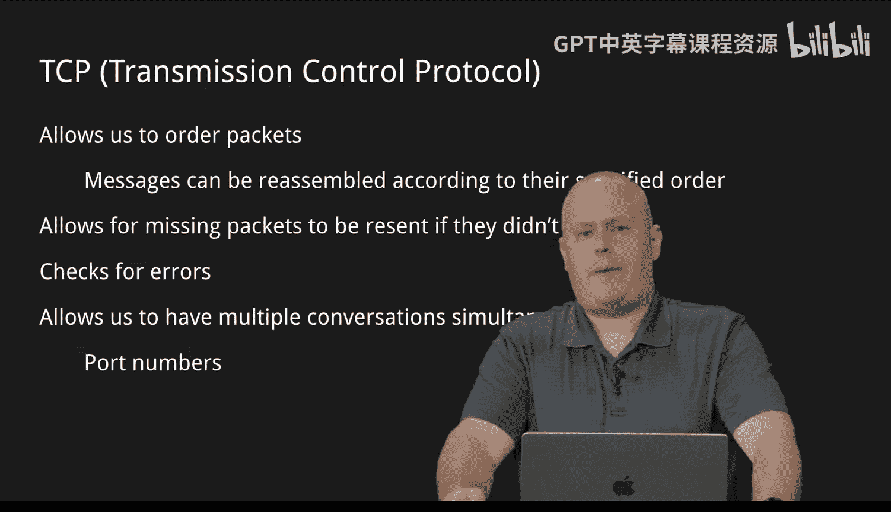

Finally， an example going back to perhaps the phone system。

 for those that remember working in a house that has multiple phones somebody may be on a phone call。

 say upstairs and you pick up the phone and you can actually hear that conversation that's going on。

 somebody's having a conversation with a different party。

 and if multiple people in the house each pick up an individual phone。

 you can all hear the same conversation this too can happen with the IP protocol alone and that if we send all these messages to the same computer。

 we could be potentially having different unrelated conversations that are all just slamming into this one machine。

TCP gives us the concept of port numbers which is really just a way to enumerate or separately number each conversation that is happening and we tend to group this by the type of software that is running so for example you may have even seen these in your day-to-day life using the internet port 80 or 443 are commonly used for HTTP or website traffic we use this in our browser so when a website message is coming in if we see port 80 or 443 we know specifically this is a website that's going to be handled to that browser that's its own conversation separately for example you might be sending an email which might be port 25 or 587 depending whether or not those contents are encrypted but again we can take that port number and determine how do we handle this particular message and what software should we handle this message off to based on that number so the same machine could be receiving dozens。

of different messages from all different sources， and we can group them by their functionality to make sure that it gets to the correct piece of software and all those conversations make sense。

Much like we had for IP we have a similar example of a TCP header。

 these are additional data fields that can be used and will indeed be used for every every packet that we're sending that gives us things like the port number and what options we're going to be using we have our error checking in here the checkum to make sure that if we dropped any data that if something changed。

 we would be able to detect that and realize that that we might need to get this packet again because it's not the same as what we would expect so both of these packet headers will be included nonstop in a full stream of messages that you're sending in all of these communications you'll have even just loading a simple website just getting data from point A to point B。

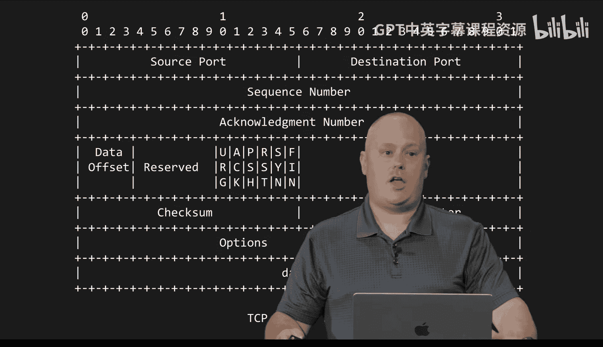

These underlying protocols， just these two create what was initially named ARPnet。

 which termed into the eventual internet as we know it。

 started out from the Advanced Research Project Agency。

 and really started out as just a small computer network on a few college campuses over a fairly short distance to send very basic small information。

 there's no video here， there's no YouTube and this is in the late 60s。

 but these two protocols start this computer network which eventually becomes the Internet as we know it today。

So we're going to start a theme looking at these protocols specifically being designed to solve problems。

 the internet is much smaller in the late 60s， early 70s than it is today， certainly。

 and there are some roadblocks we have to get over in order to get to the level of scale and the level of quality that we have today。

So we're going to go through a number of， not all of by any stretch， but a number of these protocols。

And discuss what problem are we trying to solve and roughly how did we solve that problem？

The first we're going to talk about is routing， we alluded to this a little bit earlier。

If we have computers very close by to one another on a very what we call local network。

 say you have a few different machines in your house。

 it's fairly easy for those computers to speak to one another because they're in a very small environment they're wired together and it doesn't have to cover long distances or multiple networks to be able to self-discover to have that communication。

 but what if we want to send a message across town or across the region or across a country or even across a continent or overseas。

 the further away we get the more wires we have to traverse。

 the more physical land and geography we have to traverse to get that information to where it's going。

Long distance gets a little bit complicated。So we have to ask。

How do the machines or the computers involved， how do they know how to get their message from where we sit today to the other side of the world？

Do they need to know？Do we need to know what path we need to take if I'm going to get in a car and drive to some location。

 I certainly need to know the directions because I'm responsible for the routing but your computer actually doesn't need to know and do we need to follow the same directions Do we need to get to the same destination the same way each time and the answer is actually absolutely not this is actually a design decision for the purpose of if we have a wire that gets cut or something that gets damaged or a natural disaster causes a power outage or really any sort of damage。

 we can get there a different way by taking a different route。

 or at least so we hope that process makes the internet what it is。

 if we couldn't communicate or if we couldn't find a away to get from where we are to where our recipient is we obviously would have no communication。

So how do we do this？We have a device called a router。

 A router does pretty much what it says it does， right， It routes things。

 It is going to to take those packets and figure out， do I know。How to route this particular packet。

 Do I know where this goes， Am I responsible for this network or not， And it really is that simple。

 If it's not responsible for that network， the router will then forward that packet to what is known as its gateway。

 right It's another router， a different machine that has slightly larger responsibility or slightly broader scope。

 And it's possible that that gateway2 doesn't know exactly where this should go So we forward yet again。

 downstream and further， further upstream until some machine。

Knows this is a network I'm familiar with。 you need to go in this direction at that point once we start having a route we can go and we find a router that will take responsibility for routing that network we get ever closer to our destination and this is largely the way the postal service will work we have postal codes that will put on letters that we're sending out When you send a letter from your house or from your place of business it's not being delivered directly from your house。

 No one's driving that or flying that from your house to the recipient right First。

 it's going to go to a sorting station and the sorting station might say is this an address that I service do I know where this address is And the answer is no。

 it will likely go to an even larger distribution facility。

 It might travel across the country to a new facility that is yet further away until ultimately one facility says I'm responsible for this particular geographical area to deliver this letter and I know what facility to bring it to。

So then it'll forward that letter further along to get another distribution facility。

 hopefully closer to our recipient and closer still until we wind up at their local post office and finally on a truck to your mailbox routers work almost the same way we're going to go wider and wider spread into these distribution facilities as it were or these other gateways until we recognize a distribution facility to send the correct packet and then we narrow in and we zoom in closer and closer to that destination and ultimately those packets arrive there are lots of protocols that make this happen and the process is fairly complex。

 we're not going to go into all those details today。

 but it is important to understand that routing is a very necessary component of the internet and you likely use these devices every single day Anyone who's managed a home network you probably have one of these devices somewhere near where a wire comes into your house and that's how you get on the Internet every day。

嗯。Domain name system。 So we have a slightly different problem we want to solve。

 We're getting more and more computers on the Internet in our story here。 now that we're routing。

 we can talk to computers all over the world。 and more and more of these computers are getting these unique addresses so they can speak to one another but we don't have a phone book right We don't know that somebody in Asia set up their recent computer and now it has a new address。

 How do we how do we know what that address is and who that person is or what their domain is on Now let's say somebody takes that responsibility and they pull out their notebook and they start writing down that you know Jim is at address 1。

2。3。4 who's ultimately responsible for that right Who can edit that。

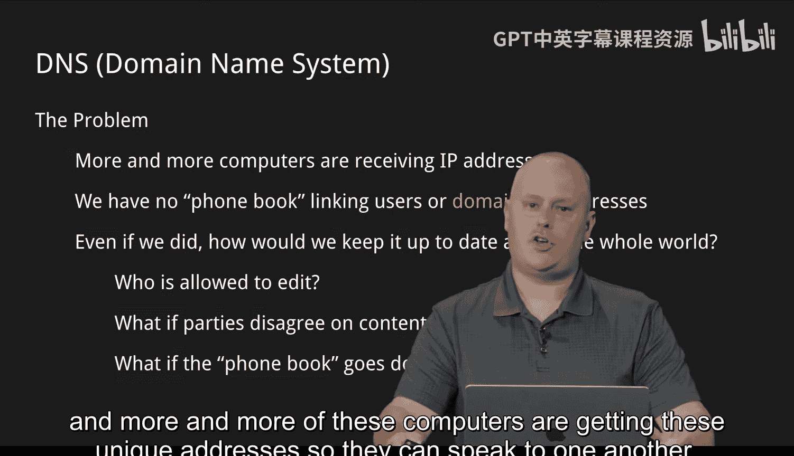

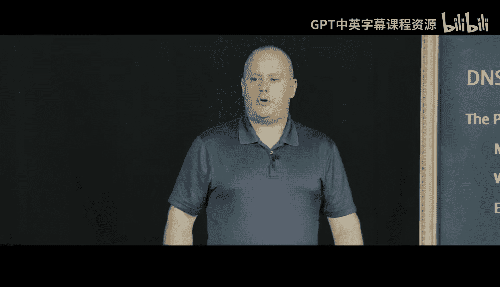

What if there are disagreements， right， what if we don't agree on what an entry should be。

 is there some sort of process to adjudicate that？How does that process grow and scale right if somebody gets tired of writing into their notebook and they just stop？

What happens， Are address books getting bigger and bigger， We need to find a way to deal with this。

 DNS is a protocol that does that exact same thing， and we have an organization called Ican。

 the International Corporation for Ass namess and Ners。

 They are globally recognized as the entity that is responsible for assigning temporary ownership of a specific name。

To an owner， and you can pay for the rights to this and while you are under control of a specific domain。

You are able to be the authority for all of the addresses at that specific domain When I say domain we have something like Harvard。

edduu or Googleo。com， Facebookbook。com， for example。

 we have a name and then we have what's called a toplevel domain or a suffix of some kind like Eduu likecom。

net。biz。uk there are plenty of examples all of those are managed by the same organization and the owner is able to manage all the records in their zone or their area of influence。

So we have this mechanism for searching for names， right If we are looking for the address of， say。

 Harvard dotduu， we need to be able to ask that question。 How do we do that。

 What's the address of HarvardDu。 Well， it turns out that DNS is a protocol where we can phrase a question in a very specific way。

 And we can pose this to a DNS server， And we would expect a response。

 The server has a decision to make。Do I know the address of Harvard。edduU or don't I？

If the server does know the address， then it's pretty easy， we just answer， well， sure。

 here's the address， the address for Harvard IDDU is the following number。

What if the server doesn't know we want to come up with a system that is decentralized。

 we don't want one area where if the one guy with a notebook falls asleep or isn't recording this。

 we don't have access to our phone books so we have computers all over the world。

actcting as DNS servers， if one doesn't know we go specifically to the authority， right。

 whoevers responsible for that particular domain， and we ask them， hey。

 what's the number for HarvardDDU？And what's important here is after that answer comes back。

 that server is going to remember that answer for at least a little while， maybe it's a day。

 maybe it's a couple hours， that way if the question comes up again。

We don't have to keep scouring for the answer， we're going to keep that close at hand and be able to respond with that same answer without having to ask without sending extra data eventually we might want to forget in case somebody changes that information right we don't want to just remember it and be the person that keeps answering the question wrong for years and years so we might forget it after a couple days for efficiency's sake。

 but we can ultimately ask these questions of any DNS server anywhere in the world and it will get an answer for us。

 it either knows or it looks the answer up。DHCP or dynamic host configuration protocol here's a different problem we may need to solve we have more and more computers coming onto our network and each one of them is going to need a unique address where do these addresses come from right how do I know which address this computer should get and how am I going to update my list when every time a computer turns on it needs a new address and every time one turns off it's not using that address anymore？

So we need to provide a mechanism to give out these addresses and also provide a mechanism to return the addresses back to a pool of possible addresses to send out once a computer is not using it anymore。

We also want to make sure there's no conflicts。 The whole way this system works is that each computer is uniquely identified。

 I can't give two different computers the same address because if someone tries to send a message to that address。

 which computer gets it， we have a whole lot of problems if that happens。

 so we need to make sure these stay unique。So we came up with a way for computers when they turn on。

 when they boot or connect to a network。To ask another computer。

 can you please assign me an address that is safe for me to use， right。

 So there might be some rules there。 There might be。

A different computer that keeps track of all the different numbers that are on the network that may already be used。

And say here is one that you are free to use， it's no longer being used by any other computer。

And it will assign us a lease so that will be a DHCP client and a DHCP server interaction。

 the client ask the server， which is going to be nomenclature we use for a lot of these protocols。

 the client is going to ask the server for this information and the server is going to be responsible for dishing out these numbers making sure they're safe to use there's no duplicates。

 assign a lease and most importantly when that lease expires right so usually it's after to say a day or so to say well you either can continue using the same number that's fine or you need to ask for a new one we're putting this one back in the pool to be recycled so in this way we don't have to keep track。

Of all of these day to day changes， every time someone turns a computer on and off。

 and when we do this at scale， that saves us an awful lot of time trying to manage the overhead of individually manuallyly assigning and tracking all of these different numbers。

Different problem to solve。TCP， we talked about the you know our messages being fragmented and coming in out of order。

 and that is a problem， right And if you， if you miss some packets。

 we don't know where that buried treasure is， that is a problem， but solving that problem with TCP。

Has has some costs， right， There are some downsides to that。 We have to acknowledge， as I mentioned。

 every single packet that comes in。 Think about how much extra traffic that is， right。

 If you're sending me 10 packets， I have to send you back 1000 acknowledgments just to accept your initial message。

I also have to wait until every one of those packets is received in order for me to reorder that message and and actually interpret it now for really mission critical data where I need to know the exact contents of what's coming in that's fine right that's not always the case say we have an example like web conferencing or streaming audio or video we're watching something if we're having a chat in some some web conference do I necessarily care that I lost a specific packet that was four words ago Sure you can resend it。

 you can send me that data and what am I going to do rewind and put that little clip of audio that that was already was already missed and go play that back that's not going to make any sense so in some cases we don't actually care that we lose some data and we would rather get rid of all this overhead and be able to just work a bit faster and a bit leaner so we have a different protocol。

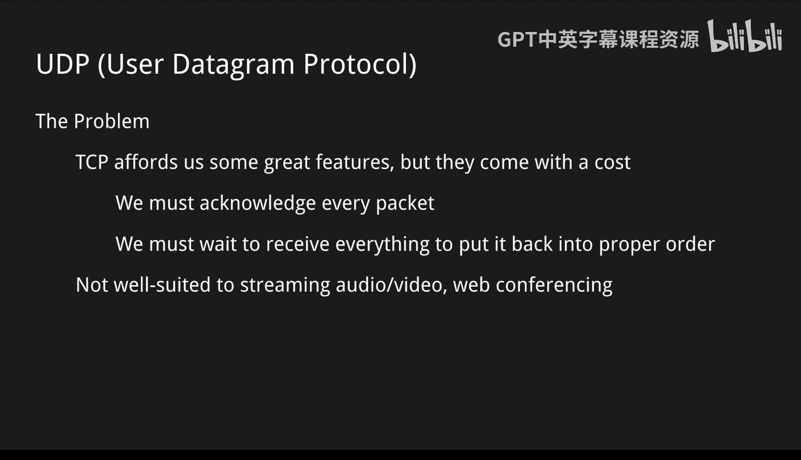

UDP or user datagram protocol which is just a bit of a contrast to TCP there are reasons to use both it's not that one is better than another it's that they're suited for different purposes and indeed there are yet other protocols that change a little bit the rules of how we exchange these packets specifically to solve a problem at hand this one is particularly relevant now that things like zoom calls and web conferencing and even YouTube videos like or any sort of streaming lectures like this one could be relevant so we might be using a different protocol for that I see we have a question。

For TCP， could it be more efficient for it to acknowledge every few packets instead of each and every one？

Could it be more efficient to acknowledge each several packets in a row Im sure it could be right we could take you know we could reduce that overhead by acknowledging several in a row we still do though need to have that back and forth where we're sending that data and waiting to make sure that we have acknowledged it and what can actually happen is over time if we haven't gotten an acknowledgement fast enough we might just send it again anyway and say。

 well I haven't heard back I'm going to assume you don't have it so as we start to add to that overhead we could be replaying things that you eventually maybe did receive but haven't had a chance to acknowledge yet or I haven't gotten your acknowledgement yet and we just have all of this back and forth that isn't really valuable to anything right if that message did eventually come through。

Does that make sense？All right， can we take the mics down for a second。Okay， new problem。😡。

We talked earlier about TCP and having some of these requirements that we wanted to acknowledge multiple packets to make sure that nothing got lost。

 we want to make sure that we are checking for errors that things are ordered properly and there are some costs to doing that we acknowledge each of these packets in some cases we might acknowledge multiple in a group but ultimately we are saying that every time we receive something we need to somehow convey back to the sender that your message has been received So imagine a situation where we're on say a webconferencing system or you're watching video or audio we don't necessarily care if we lose a piece of data that was four seconds ago if the audio blippped a little bit and we're having a conversation over say Zoom or something like that。

I don't necessarily need to get that packet back and then replay that tiny fragment of audio because the conversation has since moved on right so for this particular use case。

 it might not be as important to me so it's not that UDP user Datagram protocol is any better than TCP it's meant for a different use case and indeed there are many other protocols that we can use for slightly different use cases like these so we can be efficient for the problem that we're trying to solve。

So a lot of that overhead from TCP will be eliminated。 We're not looking for guarantees in delivery。

 We're not looking for any sort of proper ordering General。

 we're going to accept that most of the time the packets are going to come through in order and we're going to play what we get there may still be duplicates that come through We're going to let those things go and we're just going to let the time march on in our video or in our audio and generally you may be familiar with some of those little audio or video glitches as you're streaming video that's okay when we're using this protocol or're focused on what is coming next。

 let's make sure we get the newest data and continue playing from where we are we don't necessarily need to go backwards In that case it is preferable to drop or lose packets then it is to delay or to buffer right and to just wait until we have this entire message before we can play it smoothly。

You had a different problem IP address exhaustion， so it's been years since the 60s the internet has gotten bigger and bigger。

 we've developed a lot of these protocols and more and more computers all over the world are joining the internet as a whole IP addresses specifically in version 4 as we discussed before are 32 bits That's kind of a fancy way of saying that there are roughly 4。

3 billion different unique addresses that can be used to identify 1 specific computer。Now。

 a long time ago， that's a tremendous amount of computers， right， we'll never get that big。

Well nowadays theres 7 plusus billion people on the planet and think about how many devices are beginning to be internet connected First we have our PCs and laptops。

 those are given right we all have phones in our pockets we have we have tablets those are another fairly simple things we all have that are online yet more silly we're seeing washing machines and dishwashers and refrigerators start to be online right we have security cameras and we have all these other peripherals around the house or around our businesses that are taking up yet more space so a single person may be responsible for dozens and dozens of internet connected products and we just don't have enough numbers right we don't have enough to uniquely identify every computer that's out there not only do we have all these peripherals at home what are those computers talking to if there are services out there like your security footage is being uploaded to the cloud which we'll talk about later there are computers on the other side of that conversation。

We have all these servers and these public machines that are helping this infrastructure run。

 we simply have way more computers than we have addresses for and we are running out or we have run out。

Of addresses that are allowed in the IP version for allocation。

So there's a couple ways that we have tried historically to deal with this。

 a shortterm solution we have is called net or network address translation and this is actually the more complicated of the two。

 but it allows us to patch something in somewhat quickly so what we're doing here is we're taking several IP ranges out of those4 billion addresses。

 we're taking several ranges and we're saying we're going to call these ranges of addresses private。

 they're not publicly routeable， meaning you'll never be allowed to assign a particular computer that IP address and have some other computer in the world be able to contact you directly。

 we're saying those are all going to live behind devices like routers and in so doing it is possible that I have an organization that uses several of these IP numbers and you have a separate organization that uses those same numbers but they're not necessarily in conflict because。

You're not on the same network and because we've all agreed together that these numbers will not be publicly routeable that no router will offer a nonlocal connection to one of these IP addresses。

 we don't have that risk of a duplicate so there are some ranges here they're meant for different sizes of organizations we have the 10 range 10。

000 to 10。255255255 there's a lot of detail here and what all these numbers exactly mean。

 suffice it to say there are an awful lot of computers in the 10 block a medium block is our 172 to 16 to 172。

31 block and finally for smaller networks like homes and small businesses and you are probably most likely to have seen these numbers 192168 block so these are meant for different sizes of networks and again the specifics of these numbers we're not necessarily going to get into but suffice it to say we're providing these private blocks of numbers that will not be routeable and when you make a request from one of those computers。

You might be sitting at home on your computer and you might have one of these 192 numbers。

 you make a request your router before sending that message out to whatever site you may be viewing or whatever computer you're trying to communicate with is actually going to rewrite your return address not so much as one of these but as your public IP which we'll talk about in just a second by rewriting that address that's what we mean by network address translation and when that message is return to you it's going to do the same in reverse and say well let's change the IP address that we just received and we'll write it to which machine originally made the request so we're hiding and reusing several of these numbers in these smaller networks and then we're translating them so ultimately a big organization might just take one of those four billion IP addresses rather than potentially hundreds and hundreds so let's look at what that might look like we might start with a modem or a。

Like a fiber terminal that you likely have in your house or in your business this is where quote the internet comes in right this is your connection to the internet as as a home or as a business from there you will likely have a router in some cases those two may actually be the same machine a lot of times providers will provide a single machine that does both of these functions but maybe not you may have a standalone router that router however is actually in disguise it's almost two different machines it has two interfaces meaning it will have two different IP addresses One of those will be your one in4 billion IP address that the world can indeed route to anyone in the world could communicate with that router and that router could communicate with any other computer in the world but secondly there's an additional IP that is one of these private IPs that we discussed and that is only accessible by all the machines that that router is responsible for those are not directly routeable by any other machine on the internet。

So we might have your computer， your laptop， or your home office computer， a printer。

 a cellular phone， smart TV， dishwasher， whatever it may be。

 all these devices in your house will likely get one of these private addresses from the router and every one of those that looks to make some request out to the public is going to be translated to appear as having this public IP address and you can indeed test us at home if you have multiple computers you can go to a site like what's my IP or IPcheckin co and it will tell you what it sees your IP as being and indeed if you do that from several different computers in your house。

 you will likely see the same number and this is why so this is one mechanism we have to combat that IP exhaustion a little bit to say。

 well this small business might have one to 300 different machines rather than giving them 300 IP addresses let's just give them one and have them hide all of these other computers in this network behind that that spreads that number a little bit wider but it's not。

Only solution， and it's not the best solution。As we talked about numbering earlier。

 IPV4 being the first standalone internet spec， we have the logical next protocol we would have would be version 6 right so we have a much longer term solution in IP version 6。

 instead of using 32 bits we're going to use 128， which without going through all the math is a lot lot more。

To shorten some of these numbers， we're going to count in a slightly different base。

 we're going to count in base 16 rather than say base 10 or base 2 or other numbering systems we may talk about in computer science。

 and in doing so we're going to use some letters to replace what would otherwise be two digit numbers in say base 10。

 we're not going to get into too much of the math behind this。

 but ultimately we're trying to make this address somewhat readable and shorter。

Why do we want to do that， Well， let's skip to the bottom here。

 How many unique addresses are possible with 128 B。

 I'm not going to attempt to pronounce that number， but it's a lot right。

 a lot of addresses and safe to say we will not be running out of that in anyone's lifetimes anytime soon。

 That's a lot of individual addresses。 We have that different computers could take。

 But saying that my computer is you know number 7 out of whatever this number would be called it is easier to shorten that address by counting in a slightly higher base and using letters to represent these longer longer numbers。

 So you may have seen some of these addresses。 they're arguably still less common。

 at least visually than some of our IPV4 addresses。

 but we are using more and more of these every day。 Now， the trouble is。

If you've ever tried to arrange a lunch order for more than 10 people。

 you realize how difficult it is to get multiple people to agree on exactly what they want to do。

 getting an entire planet to agree on the exact rules of the next version of something when everyone is very opinion it and have strong reasons for why they'd like to do one thing over the other。

 it takes a long time to get agreement the proposal for IPV6 came out a long time ago and we're still working on upgrading our machines to be able to support them and to get adoption through and through it will indeed be the standard that eventually replace IPV4。

 but unfortunately even though our addresses have been exhausted。

 we still use IPV4 every single day but going forward more and more of these IPV6 addresses are being adopted and eventually one day IPV4 will be fully retired and will have more addressed space than we ever know what to do with IPV6。

Searching to a new protocol entirely， we've gotten to this entire point of how the internet works specifically talking about communications and these packets going back and forth。

 but we haven't really talked about the most important piece of what you likely use on a day-to-day basis which is websites it's common to conflate the internet with say the World web which is intended to be a collection of these website to this data that can be interchanged in a web browser。

 they're not necessarily the same thing， but we frequently talk about the internet worth thinking about opening up Firefox or Chrome or something of the like and looking at websites and to make that happen。

 we are using a protocol called HTTP or hypertext transfer protocol。

That defines all of the rules for interacting with what you know as a website right so we talk to a web server。

 we ask questions， we get this response and a website appears on your screen This is a probably the most important one we'll talk about today because it should。

Hit home just how much you use this on a day to- day basis and all of this is happening behind the scenes without probably thinking about it。

 and hopefully this will enlighten a bit just how much these things are part of our day to- day lives。

 even though we don't necessarily think about them in these terms。So let's say。As an example。

 we sit down and we're at our computer at home and we go to launch New York Times， HTPS。

 New York Times NYtimes。com， what happens between you hitting En。

And that website appearing on your browser of choice， right how do we get there？

The start of our journey is with a web browser， so what is a web browser， right？😡。

It's really a program like any other。 you have hundreds of programs on your computer。

 a web browser is one of them。 It doesn't necessarily have to be anything special。

 It is just a program that specifically speaks HTTP。😡。

It trades in writing HTTP queries to send out or requests to send out。

 it receives HTTP responses and then renders those and displays them on your computer so you can interact with them so what does that browser do beyond making that communication with those web servers that are out there on the internet it's going to translate a lot of that fairly ugly behind the scenes computer speak into a beautiful functional website that you are used to interacting with。

So in doing so the first thing we're going to need to do is we're going to need to draft an HTTP request。

 meaning we need to ask a question of a computer somewhere else in the world to say please send me the homepage for New Yorktimes co so we're going to draft this request and there are a number of pieces of this that will individually talk about So first we have a method so we have get we want to get a file sounds just like what it is we're asking to receive something we have we have a path that we're looking to receive in this case we're using just slash which is the homeage we'll get into a bit more of that bit later and then what protocol inversion are we using so specifically we're using HtTP。

 This references version2。 we will come back to that a little bit and talk about a few different versions of HttP and why that might be important we will get back to that in a second。

And then also we have potentially a whole number of headers separated with their values now in a real request this is going to be long off off the page several headers and several different values for simplicity we're boiling it down to really the host we're looking for this is certainly required we want New York Times。

com ornytimes。com there may be several other header values that are all going to do different things and maybe specify a bit more what we are requesting。

So we're going to send that request over the internet and just to reinforce this concept。

 all those other protocols we talked about， those are still in play here if we want to know how to send a message to New York Times ornytimes co we need to use DNS to figure out what address we're sending that to We need to look them up in the phone book then we need to break that down into into packets and send it out with TCPI and make sure that it's been acknowledged and they've received our request。

 we need to use routing tools because who knows where in the worldny timess might actually be hosted we have to send that data around the world and to all these different computers to make sure that it receives at its destination so just remember that all these things that we've talked about they're still happening behind the scenes they're just slightly lower level those are building blocks that we're abstracting away from and we're doing bigger and more powerful things but we're still using those core building blocks to get through our journey here。

So the server is going to receive our message and it's going to need to do something with it。😡。

So the first thing it's going to do is say， well， what software is this message？

Intended for earlier we talked about TCP port numbers right and how we can have different conversations on the phone so we're not hearing other people on the same line。

 this is more the same because we requested an HTTPS website which is an encrypted or secure HTTP website。

 this likely came over on port 443。So the computer is going to say well， I have a request in 443。

 I'm supposed to forward this to a piece of software called a web server。

 so it forwards that request along and the web server in turn now receives this entire message and says I have a new message。

 What am I doing with this data。 I see that someone would like to get a specific file particularly our homeage it's important to note there are other request types that we could make the most common we will see is we're asking to download just give me your homepage show me the data that you have but perhaps we want to send information say for example you're making an order on some online shopping website and it's time to check out you'll likely put your address。

 your name， your address where you're shipping it to perhaps payment information like a credit card and you'll submit that and we're sending that information to this server ultimately to do something we wish it to do like charge our credit card。

 purchase the object we're trying to buy and then put it in in the mail shipping it to us so we can both receive and send。

do many other things in HTTP that it would support primarily get is the easiest to talk about because it's simple。

 we're just downloading a file， give me this data。And then finally。😊。

We are going to draft the HTTP response and send that back so much like the browser needed to put together this text to send off to the web server to interpret。

 we may have the file but that file needs to be wrapped in some sort of protocol so the browser knows what to do with it。

 so it's going to write an HTTP response that might look something like this。

We'll still have our HTTP2， which gives us the version。

 we have 200 kind of a strange number to have there and we'll say， okay。

 we'll get back to that in a minute。Something like the date， these are other headers and values。

 we have a date like a current date and time， and then content type。

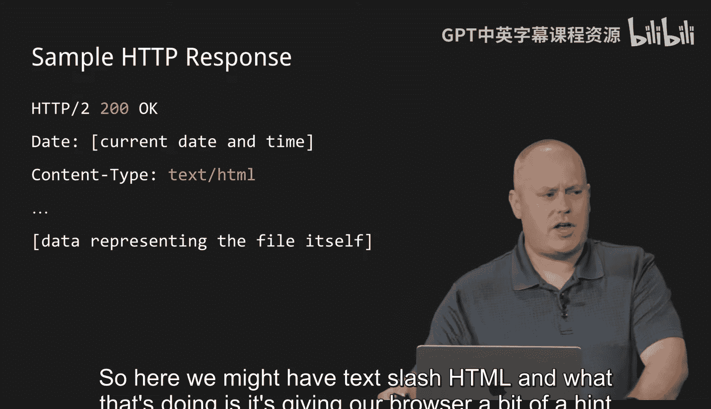

So here you might have tech slash H TM L。 And that what that's doing is it's giving our browser a bit of a hint。

Because there's a whole bunch of different files we could request。

 think about the type of content that you look at when you're on your web browser。

 you might watch videos。 you might listen to audio。

 you might be images that you're loading right in this case。

 we have an HTMLm site or basically a homep page that's going to be rendered It's possible you can be downloading a P or an Excel file or who knows however many other types of files So we're going to give the browser a bit of a hint saying this is the type of data I'm going to be sending you So when the browser receives this response。

 it has an idea of what to do with it because the browsers have gotten pretty powerful and they actually know how to delegate what they do based on the type that they're receiving they might try to open that file in Excel for you or maybe render that p in a different way or open up some other piece of software to render that p for you So we give the browser some hints and just like in the request。

 there are far other headers that aren't mentioned here that give those browser additional hints to give them clues on how they should behave in this continued back and forth conversation where。

achs are speaking to other machines， and then finally， of course， we will send the file itself。

 we requested the homepage。Here is the actual content of the homepage。

So we mentioned that code 200 earlier and thought that was maybe a bit strange there are status codes and there are well more than are showing on the screen here。

 but we have status codes in HTTP and that is a way for the server to respond and give the browser or the requester an idea of how this request was handled what happened now hopefully the most common one we're gonna to see is actually the first one which is 200 which we're good everything worked fine no problem here's your content you requested this I responded to you。

Case closed there are， however， other codes that we can get most likely when something goes wrong。

 So when we design these protocols， we're not just saying that things are going to work perfectly all the time。

 we expect that errors will happen on both sides of the transaction right the browser may make some mistakes or server may make some mistakes and we have a way to communicate what these errors might be so maybe we can present that to the user。

 give them an idea of what's happening or potentially try to recover from the errors themselves。

So some common ones here we see 301 move permanently this is a redirect very frequently we'll see this if you try to access a nonenncrypted website and they forward you to the encrypted version。

 we will frequently see that with a moved permanently tag 404 not found certainly we've all seen the 404 errors when you type in a URL that doesn't exist anymore and you get that error maybe that page has since been deleted or renamed generally we will see that the 400 range of numbers are all going to be errors that are somehow client related or caused their client-based errors and our 500 series of numbers are going to be server related errors so something happened on the server that cause this request to error in some way internal server error or the server is unava perhaps it crash due to some reason but this is an example of some of that behind the scenes communication that rarely is the human even going to be involved in seeing these numbers but the conversations is really happening between the two computers we're saying this is how。

This request resulted and here's what we can do as the next step。

So back to our lifecycle of an HTTP request here， the browser is going to receive this response and it's going to have to do something with it。

 The response we got is probably not the most human readable thing that we've seen it's going to have certainly the HTTP example we had before the content of the file may be partially readable It's going to be text there might be some code in there the browser is going to need to render all of that and present to the user an experience that they expect for NY times I'm expecting to see different articles and headlines and pictures and may probably a bunch of ads we're going to see all this different content that I would expect to see and then be able to interact with that comment I might expect to be able to click links or type in information on fields all that interaction is created by the browser rendering this data and presenting it to you in a human consumable way。

Now， one thing we will likely see。Is references to additional files。

 So what does this mean We requested one file right We requested the homeage ofny timess co。

 but that homeage might tell me to download javascript files， style sheet files。

 perhaps a whole bunch of images that we're going to see maybe some videos that automatically play about some breaking news there's gonna to be a bunch of other files that I might need to download each one of those is going to start this process a new each one of those is potentially a new Httb request starting from the browser drafting the request and sending it over the internet and you can imagine this happening in this big loop now in the case ofny times。

 co this happens many， many times。 Now I mentioned earlier is there's some versions of HttP。

 This is another example of some of the problems we've decided to solve over time。

 See for a long time we're using HttP version 1 or version 1。

1 and one of the big limitations of that version of。

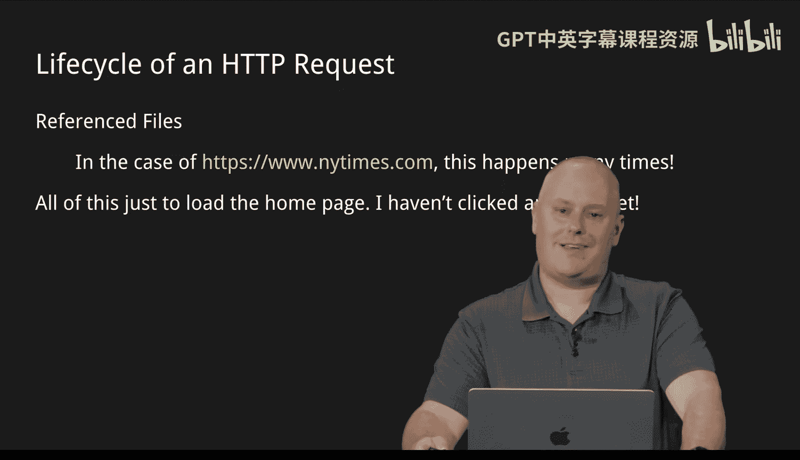

HTTP is that each one of these files needed to be requested individually so loading something complicated in big like New York Times that might reference hundreds of potential files。

 each one of these is creating this new request that we need to send wait to completely transfer weight to all those acknowledgecments come back wait for the server to respond and then give us here's image2 do it again here's image3。

 here's image4 you can imagine this makes the latency or the speed of these sites fairly painful right now internet's gotten a lot faster than it was 2030 years ago but we're creating all this extra overhead so with HTTP2 or now HTTP3 we have some additional features we're using to try to solve these problems one of those features is as we call multiplexing where we might be able to send multiple files at once as part of a package rather than having to request every single file as a unique request in hopes that we can consolidate a lot of this over。

headad into a much quicker transaction and much like IPV6 we have some adoption issues right it takes a while first the browsers will tend to support it。

 but do the web servers all support it right there might be some older web servers that haven't been updated in a while and they don't handle those new functions we need to make sure we're backwards compatible and we still support these really old version of these protocols but we do upgrade them over time to add these features again using protocols to solve problems we find as the internet gets bigger and as we use it more and more we want to solve those problems and make the experience better and indeed the experience is considerably better today in many ways than it has been in here prior。

So let's talk a bit about the components of a URL we waved our hand over this a little bit when we said in the spec for our request that there was a path that we're requesting so what exactly does path mean right so when we look at a URL。

😡，We have a number of different components first we have what we call a scheme。

 which is really the protocol that we're using now most of the time nowadays this scheme is going to be HTTPS or secure HTTP or encrypted HTTP。

Really， we're taking the HTTP protocol and we're wrapping it in an encryption scheme to make that communication private。

So there are other protocols that your browser may support。

 certainly it sports unencrypted HTTP that we're trying for privacy purposes and security purposes to get away from that more and more。

 there may be other protocols that your browser does in fact support。

 which will be a story for another day， but we can specify this scheme before the colon//lash。

Up next we have our sub domainomain now a sub domainomain initially in the first you know beginnings of this。

We always expect it to be WWW， which stands for the World Wide web， which is today a very dated term。

The idea， again， the internet and the World wide web are two somewhat different things。

 The internet is this giant connected network， whereas the World wide web。

 we refer to websites and the interconnected。Nature of the sites that can link to one another so for a while。

 every site was a WWW sub domainomain。And that reference specifically the web pages at that domain name so the web page at Harvarddu rather than say perhaps a chat server at Harvard。

du or a message board or some other service， it might have specifically the website associated with nowadays we use subdomains for any number of other reasons we might break out different business units。

 different brands， different subdeparts they all might have their own subdomain but the idea here is we're taking a domain which we'll talk about in a second and we're just breaking it up into smaller sections that are named logically something different and probably separating the content just to keep that content organized。

The domain itself we talked a bit earlier with DNS is the primary way that we're saying this is my area that I control。

 this is Harvard。duu。 that's New York Times that's Google that's Facebook we have a domain name which should represent the network for that entire organization kind of at the end of that we have what's called a tople domain or a domain suffix commonly these word co net org over the time much like IPv4 addresses kind of ran out of these right people start they make a run on these。

 they want to get all the misspellings they want to sign up for every single version of their company name and all we had was say co org now we've added many。

 many more of these so we get more names in circulation now different countries have their own country suffix that they can use so by doing this you might be able to register a particular domain name but in a different country so there could be that would have been a conflict。

Withcom now can be disambiguated using different top levelve domain codes。

 so there are more and more of these that are coming out and I'm sure at some point in the future when we once again have any sort of run on namespace there will probably be more that continue to be added。

Beyond that we get into the actual file and folder structure that we're likely requesting so this works largely like you would expect on your own computer where we may have a structure of folders inside of which we have files that could be requested via HTTP so we'll specify after the what folder we're looking at and after that file name we're looking at so for our example here we might have say the products folder of example co inside of which we might have hammered that HTML alongside any number of other products that we might have at our website then there could be multiple folders we could have folder A inside of folder B inside of folder C so some folder structure that we are conveying this is the file that I would like to request so all of these are different ways we can specify in more and more detail exactly the resource we are looking to receive from this HtTP server。

With all that。RightWe've talked about a lot of different lot of different protocols， by no means。

 all of them， by no means even most of them， we've talked about some important players that have been developed over the past 50 years to make the internet largely what it is today without those we certainly would not be probably even having this lecture right now right we we be using totally different technology without these things We're going to fast forward a little bit。

 we can talk about protocols all day， but we have the foundation down。

And we you know at this point we can communicate safely across the world。

 we can communicate reliably， we trust that our data is going to get where it needs to go。

 but there there's more know there's more we're not going to talk about now that we have these reliable communications。

 let's talk about how we use them in a you kind of a business standpoint and how this scaling to get bigger and bigger and bigger over the years。

 how that scaling works。So what we find is that our progress is always going to be constrained by the amount of processing power we have and the amount of data storage we have。

 everything else is usually some combination thereof those are the two big constraints that we may find is impeding our progress and indeed if we look at what we expected for processing power 10 years ago 20 years ago 30 years ago it has been such an enormous improvement and we have a bit of a graphic to show what that might look like the computer responsible for the Apollo 11 mission I believe had what was it yeah so yeah 12250 flops or floating point operations you don't need to worry too much what what that number actually means but how many operations it can do in a particular second compare that to say a large supercomputer in the 80s the fastest at the time。

 the crray supercomputer that would do 1。9。

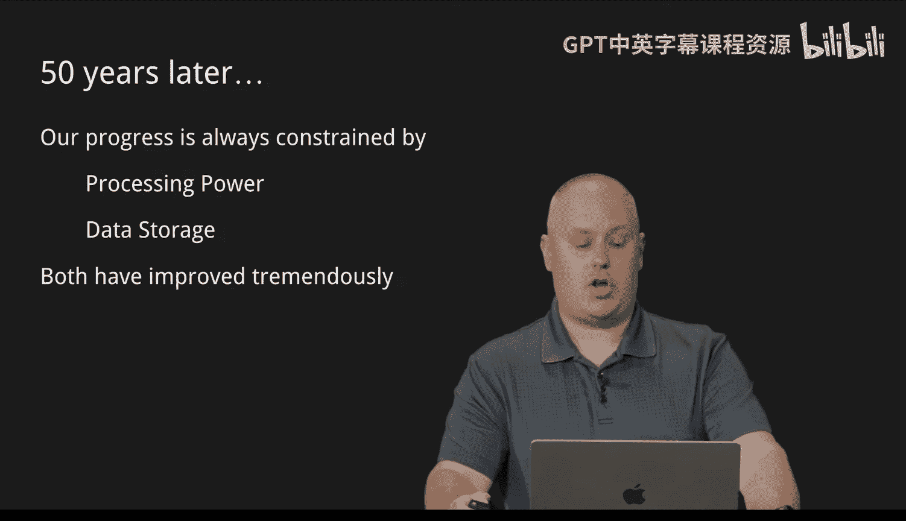

え？Floating point operations a second now that computer have would have weighed around 2。

500 kilograms for context。Fast forward yet more to the iPhone 12 which is roughly 2020 circa5 years ago。

 and that would have 11 trillion flops floating point operations per second and only weighed 164 grams at its release so you can see over time from the Apollo 11 mission to a computer that we all have in our pockets and at this point a retired maybe old version of a phone that we all have in our pockets has gotten so so much more possible。

So let's consider a scenario where we want to scale some internet operations and what some of our options are to work our way through this power curve so let's say we are a power utility where some sort of an electricity provider and we want to have a power outage map for our customers so you on a normal day how often does anybody log into their power company's website and take a look at their outage map I'm willing to bet it's almost never right as long as you have electricity at your house。

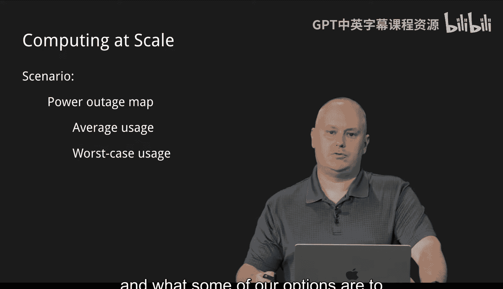

You're probably not looking at that outage map right so that's okay。 it exists and it works。

 It does its thing。 It tells us what you know who's out of power right now。

 when do we expect that power to be restored。Our average usage in this case might be maybe 100 users a day。

 maybe less probably very small reason to believe that anyone is long termm out of power in extremely developed areas but let's say。

 for example， our worst case usage might look a little different。 We have some natural disaster。

 some storm comes through does a ton of local damage。

 power lines are out everywhere and we have millions of people without power now what's happening everyone has their phone has a way to get online。

 even though their power is out， what are they doing。

 you better believe they're going to that site and they're saying when when is the power at my house going to be back on。

 is there a crew assigned yet， is there someone that's going to fix this and probably you're going to see an answer like we're working on it。

 we'll let you know it's going to be some non informative answer。

 So what does that mean you do you check again in an hour and then an hour later or even 20 minutes later。

 you refresh the page。 you try again you're constantly waiting to get better information So now we have this site that used to have 100 people a day。

Ts visiting this website， and now we potentially have millions of people hitting it over and over again on their phone。

 looking for more up to date information。As you can imagine， the number of requests。

 the processing power that's being requested of these particular servers that runs this map。

 it's going to take on a big burden， a burden that it doesn't expect every day。

 and all of a sudden it's being overwhelmed。We have a few options we can deal with that。First。

 we can say， look。My average， if I look at every day of the year， my average is 100 users。

 I'm going to optimize this server for 100 users and I don't care if we go over that。😡。

Okay that works， I think if you're a power company and millions of people a out of power。

 that's not going to work so well for you right people are going to get really upset when they are looking for this information and really the whole point is to be able to be the most communicative when people need the information。

 so probably not a very good strategy。We could take another option where we say let's spend a ton of money and let's get either really more powerful servers or way more servers。

 let's buy all this equipment to make sure that at any given time we can serve millions of people and we're going to have all that hardware up ready to go for moment notice that should something happen。

 we can serve a million people or millions of people constantly refreshing and looking for this that will work right you likely won't have too many disappointed customers if you do that。

 however， that's going to be underutilized hardware most of the time。

You're not using it， it's sitting there idle， you're paying for it， you're maintaining it。

 but it's not doing anything， so that's a very costly option。

So let's look at some different ways we could scale。 We could scale， we could scale vertically。

 which is a means of taking。Taking a machine and saying let's make this more powerful。

 maybe it had processor A that did this many flops using that same term from before。

 and let's buy processor B instead and get more flops out of it or let's buy more processors so this one machine or this one architecture can handle much much more in the way of throughput or perhaps storage we're getting bigger hard drives。

 more and more space so we can store more data。😡，Alternatively。

 we could consider what we call horizontal scaling， which instead of adding power necessarily。

 we're going to add quantity， maybe we don't get the top of the line。

 most powerful computer that's out there。Maybe we get several cheaper computers and we just use a lot of them that way when one of them gets real busy。

 we start giving some to the second and to the third and to the fourth and so on。

The more these computers we buy， in theory， we're still not paying top dollar for them。

 but we get more and more capability。Just in terms of quantity and we can come up with some way to spread that load to perhaps say as requests are coming in as we're bogging down these machines。

 maybe we have something that directs those requests to slightly different machines to say well this guy is not being used quite as much。

 let's get that request over to him， so he's a little bit more capable of handling that result。Now。

s that's not too bad， right this gives us this gives us some options。

 but there are still some limits to this。 We're looking at considering total resources that we need to put into this。

 We still have this problem of 99% of the time。 no matter which of these options I choose。

 if I scale to this huge degree， I'm still paying for stuff that I might not need all the time。

 What are some limitations ongoing on these approaches。 vertical scaling， for example。

 the cost is typically going to outpace marginal gains and performance。

 If you start out with a consumer grade machine。 you probably do have several steps to upgrade into some serious professional hardware we say。

 wow， this is so much faster than I had before。 Eventually， though， there is an end to that limit。

 there is a fastest computer in the world There is a most expensive computer in the world beyond that where else do we go we almost have to start scaling a bit more horizontally at that point As we start getting to those extremely powerful computers。

 we call marginal。formance gain is going to be pretty small。

 it's only a little bit faster than the one that came before it。

 but we have these requirements like the more power we have to give it actual electricity requirements。

 cooling keeping the thing cool and yet more power requirements we have a way of saying thermodynamics is always going to win in these situations that eventually you're going to have just too much power too much heat to be able to make much more progress horizontal scaling also has some downsides as we get more and more of these physical machines。

 we still need to maintain them right so we're doing software updates we're doing things like like data backups。

 we're making sure we have power backups for them there's this hardware that may fail like RA and hard drives and such that will need to replace so the more we have the more things we need to maintain eventually that may be a necessity but those costs certainly do go up as we start just throwing more machines at it there is a component to that management into that organization that we need to to account for。

Finally we have physical space constraints right we have know if you have a small closet where your computers are running out of and now you have 100 computers。

 do they all fit in that closet can you stack them more efficiently eventually run out of space and you need to have more and more space to do these things so these are some options for scaling and as you can see they maybe not perfect but they get us further down the road。

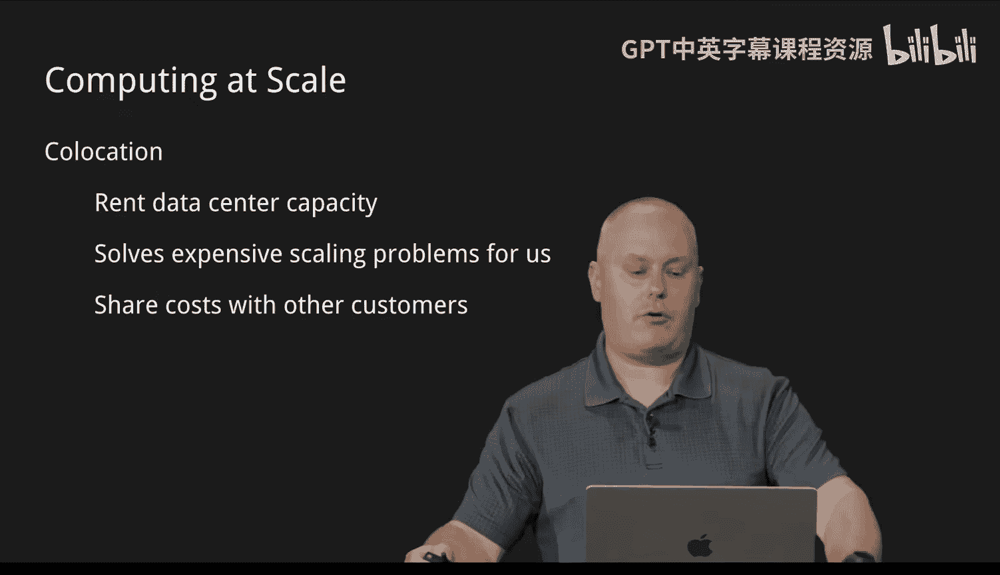

Then we can consider something like colocation So what does colocation mean instead of buying a better computer from scratch and saying。

 well， I'm going to this vendor and I'm going to buy this massive box and I'm going to install it in my my server closet in my business say I don't want to do that。

 I don't want to buy 100 different computers and managing them myself I would rather rent space or rent capability from a data center whose sole job it is to maintain a facility that has the redundant power backups that has redundant internet connections and cooling and all this other stuff this overhead that I don't necessarily want to think about。

 let me just pay them to do that and I'm going to rent however much computing。

 I need to rent from them and just pay that bill that way it's somebody else is maintaining it for me。

 I start to outsource a bit。 I don't need to worry about some of that overhead that gives me another way to scale and keep costs perhaps under control when a lot of those。

Costs are being sure they're being borne by the bill that I pay every month。

 but I don't have to actually manage and maintain things like hardware and software upgrades or physical security for the building to make sure that only authorized personnel can get into that room things like fire suppression and cooling we talked about all of those are handled for me I don't need to worry about how that works that lets me scale a bit more and focus on what I really care about which is the performance not so much how to deal with all this overhead。

There are still going to be costs associated with that。

 they still give us the power we need and maybe we can rent that。

 but again going back to our example of our electricity provider we're still we only need this 1% or less of the time when a whole bunch of people are out。

 there's got to be a better way than buying all of this hardware or even renting it so sure it's powerful enough but I'm paying for it my monthly bill is enormous now that I'm hiring this data center there's got to be a better way。

 how can we scale when we need it。But scale back down when we don't right it'd be very difficult to buy a top top line computer and then the second your power outages are over and everyone's back online line。

 sell the computer and buy it again， that certainly isn't going to work right we need something that is a little faster than that and this brings us to cloud computing。

So we have a way using concepts called virtualization and containerization。

 which we're going to go over briefly， which is ultimately a way to simulate a computer or applications。

On another computer。 so we can get these massive data centers， much like in a co located environment。

 but rather than specifically pay for the hardware itself or usage of hardware itself。

We can pay to have our hardware simulated or virtualized。

 so we'll take potentially an entire machine。You know operating system at all。

 and we turn that into a file and say here， play this file as if it were a video or as if it were a game or something and we execute that file and now we have this virtual computer。

😡，Running in some environment， what's nice there is if we want to stop using that。We shut it down。

 we hit stop and were're no longer putting any resources into this machine。

 even though while it was running， it may have consumed tremendous resources。

So we can run these simulations on very， very powerful machines。

 probably more powerful than we were willing to pay for in the first place。

But we share that power in those machines with other customers。

 not necessarily the same virtual computer or the same simulation， the machines that they run on。

 we can share with all sorts of other folks who are looking for temporary very powerful compute resources and while we're doing this we only pay for the time that we're executing our particular machines so when we talk about load balancing a while ago we say well we have a bunch of these computers we'll slowly move we'll slowly move the load or the requests that are coming in onto the computer that's available。

 we can wait until we anticipate this big power outage， we see the storms coming up the coast。

 we know we're going to get hit hard， we can just start to spin up some of these extra simulated computers and we can actually simulate the load balancing between them as well and say as requests start to come in we now have in the wings waiting all these other simulated computers ready to accept the massive influx of requests we expect to see and。

Ready for and sure we'll pay for it， we'll make sure that we are responding appropriately and quickly to these requests and as we start to bring that load back down as residents are getting their power back and fewer and fewer requests are happening we can start to shut down some of those extra simulations so we're not paying for them anymore and we kept our costs to a minimum。

 it's certainly spiked during that event， we keep our costs down and we are able to to fulfill the requirements that we have without missing our our SLAs and we're still communicating with our customers。

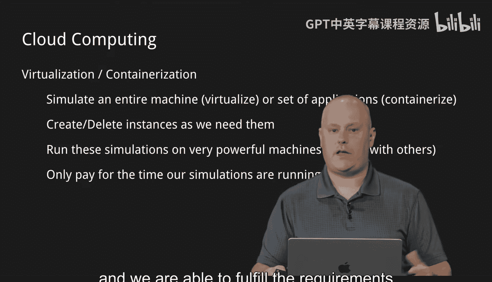

So what does that look like， We talked a bit about virtualization and cloud computing or sorry virtualization and containerization they are subtly different。

 We're not gonna to get too deep into the details， but specifically for virtualization we have basically as the operating system of a usually very powerful computer we have what's called a hypervisor So instead of running Windows or say MacOS or something like that。

 you're running a hypervisor and its job is specifically to run these simulations and each virtual computer that it's going to run has its own operating system running on there so you could virtualize a windows or a Linux machine and you would install that software just as you would on a physical piece of hardware all of that is being simulated on the hypervisor from there we can install whatever applications we need whether that's a web server or some proprietary software。

 whatever that may be containerization is subtly different instead of running on a hypervisor and。

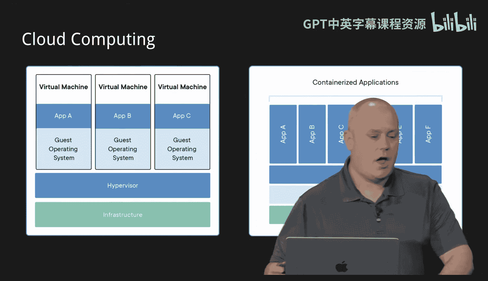

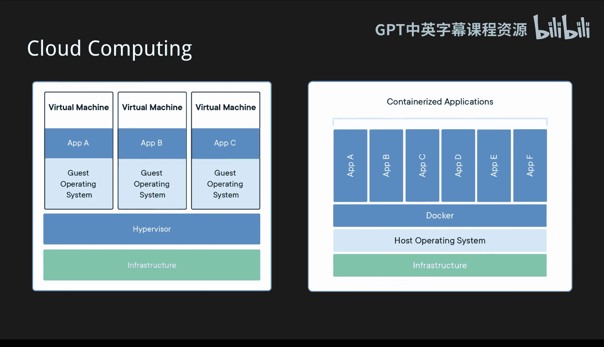

Creating all of these guest operating systems， we can run a containerization package like Docker。

 We can run that on a normal operating system like Windows like Mac like Linux we run this program and what it does is it simulates just the apps themselves in their own little sandbox they don't affect your larger computer and we can create as many or as few of these simulations as we want but we're not redoing the operating system。

 So when we virtualize every operating system we do， especially in say a Windows environment。

 we're paying licensing for those right we're saying well this is how many users use this there how many users use this and we're paying that over and over again we don't necessarily need to reproduce all the overhead of the operating system if all we really care about spinning up on demand is the application itself so in a containerized situation we are only simulating the application we're just keeping that sandbox away from other application that allows us to scale potentially across multiple container hosts meaning we may have。

Say 10 different computers rather than one scaling horizontally and we can create versions of that same exact application on all 10 of those computers。

 so if we need more and more， we spin more of them up and now we have more throughput so slightly different ways of handling things。

 but the idea is we are simulating the execution as if it were an actual piece of hardware。

 which allows us to do some very cool things to scale up and to scale down very rapidly and there are indeed several large industrial players that support this market and it is really how major compute is being handled handled nowadays。

That brings us to high availability。Ultimately， the goal for doing any of this is to have our services available as often as possible。

 we are trying to eliminate as much as possible single points of failure。

Any one device that if somebody trips over the cable and it unplugs and everything goes down。

 that's a single point of failure we want at least two of everything if we can。

 so if something fails， we have something else that can pick up the slack with as minimal downtime as possible What goes along with that is load balancing or taking taking this series of requests that we're getting that we're potentially getting overwhelmed with and finding a way to distribute that usage across as many different machines as necessary that everybody keeps their head above water and nothing crashes nothing takes too long or as otherwise noticeable to the user that we're having some sort of outage so the more we can spread spread that usage across different machines and make sure that if one of those dies crashes for some reason we just take it out of the pool that we're directing these resources too and we just direct it to one fewer one fewer machines no actual user is going to realize whether extra servers are being。

or removed as long as their requests are filled in a timely way we want to distribute that load as best we can and avoid overloading any one node that is ultimately the ideal how we actually implement that does take does take some trial and error。

 it takes some learning and understanding the usage that you have but once we do that we now have the tools available with some of these very grand cloud computing concepts to pretty much simulate an entire network and make sure all of it is redundant so if any one piece goes down even potentially an entire data center that's in one region again perhaps due to one of those natural disasters we could easily and automatically shift to a completely different data center somewhere else in the world because the entire thing is being virtualized or being simulated which ultimately has come an awful long way from getting a few packets from a computer lab across one university to another。

That has been implementing the internet， thank you so much for watching。Boooo。

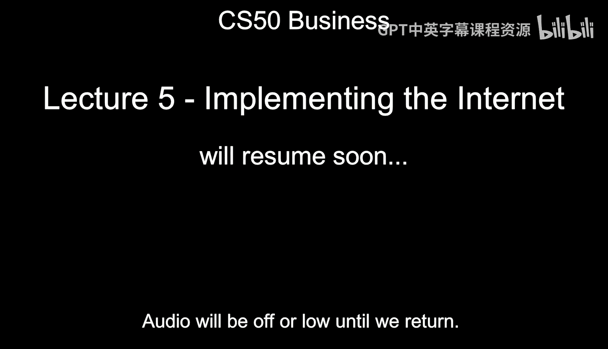

Fast forward to 2020， we have the iPhone 12， which has 11 trillion flops。

 which is such a huge improvement over even the Cray supercomputer from the 1980s。

 and even that at this point has become a fairly old phone it will continue to go in this direction for years to come or the power that we have will continue to increase。

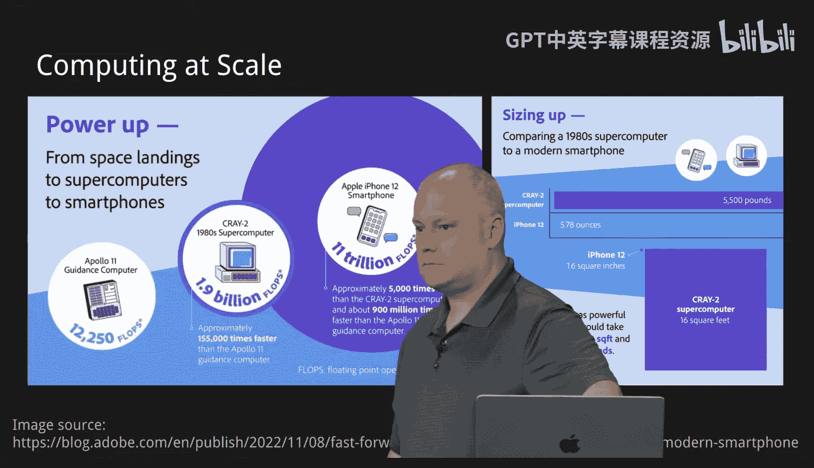

