# 哈佛大学《商业的计算机科学｜CS50's Computer Science for Business 2025》中英字幕 p07 CS50 Business - Lecture 6 - Weaving the Web .cut.zh_en -BV1ArsFzQECJ_p7-

Hello world， this is the second of today's two live streams。

 My apologies that were like an hour behind schedule， but this will be an introduction to HTML。

 CSsS and jascript。 if you're watching this video on YouTube and already follow CS50's channel。

 You're probably familiar with these already。 know that this lecture is meant to be part of a new and improved version of CS50B Comp science for business。

 So it's particularly for less technical folks so feel free to tune along in ask any questions you might have via the chat and we will do our best to address all through this lecture。

 please forgive though， if we start stop and make some fixes before we dive into the lecture itself。

 though we're gonna film a few different intro remarks for this lecture and a couple of other lectures so this will see out of context for just a few minutes。

Hello world。 My name is David Main， and this is an introduction to computer science designed especially for employers and employees who'd like to be more sorry。

 I flip the words， Hows so close。So perfect。Alright， ready。 This is an introductiond。Hello world。

 my name is David Main， and this is an introduction to computer science。

 designed especially for employees and employers who'd like to be conversant in today's and tomorrow's information technology。

Ultimately， this course empowers you to ask better questions and make better decisions。

 even if you're not in IT yourself Well begin with zeros and ones。

 the underlying language that today's laptops， desktop servers and phones speak。

 We'll then explore algorithms， stepby step instructions for solving some problem。

 We'll then introduce data structures， clever ways for storing information and memory to make algorithms better and faster。

 We'll write code in a language called Python， even if you've never programmed before and don't plan to after。

 you'll acquire a better sense of what programmers do。😡。

We'll look at what artificial intelligence or AI actually is and what it can do。

 We'll explore how the Internet itself works and what the worldwide web is， And we'll look at HTMLm。

 CsS and jascript languages with which web apps and mobile apps alike can be built。

 We'll talk about storing big data in databases will read and write some of that data with a language called SQL。

 and we'll discuss cybersecurity threats and defenses for you professionally and personally。

 All this and more。 This is computer science for business。😡，Let's do it once more。

 but I think that one was good。 I just changed web apps to websites by accident。Hello world。

 my name is David Main and this is an introduction to computer science designed especially for employees and employers who'd like to be conversant in today's in technology world。

 sorry。😡，It's much harder reading words than just saying them。All right。Hello， world。

 My name is David Main， and this is an introduction to computer science designed especially for employees and employers who'd like to be conversant in today's An wow。

I'm sorry。I know。 And that's why we just have to pretend， like， these are gonna work。All right。

 sorry， y'all。Hello world。 My name is David Main， and this is an introduction to computer science。

 designed especially for employees and employers who'd like to be conversant in today's and tomorrow's information technology。

Ultimately， this course empowers you to ask better questions and make better decisions even if you're not in I T yourself will begin with zeros and ones。

 the underlying language that today's laptops， desktop servers and phones speak。

 We'll then explore algorithms， step by step instructions for solving some problem。

 We'll introduce data structures， clever ways for storing information in memory to make those algorithms better and faster。

 We'll write code in a language called Python。 even if you've never program before and don't plan to after。

 you'll acquire a better sense of what programmers do。

 We'll look at what artificial intelligence or AI actually is and what it can do。

 We'll explore how the Internet itself works and what the world wide web is， and we'll look at Hl。

 CS and jascript languages with which websites and mobile apps alike can be built。

 We'll talk about storing big data in databases。We'll read and write some of that data with a language called SQL。

 and we'll discuss cybersecurity threats and defenses for you professionally and personally All this and more。

 this is computer science for Business。😡，That's pretty good。Alright。

 let's lean toward the second one， unless。Hello world。 My name is David Main， and in this lecture。

 we'll analyze algorithms， step by step instructions for solving some problem and among today's problems。

 searching， sorting and more with CS50's zone， Doug Lloyd。😡，Hello world。 My name is David Main。

 and in this lecture， we'll analyze algorithms， step by step instructions for solving some problems among today's problems。

 searching， sorting and more with CS50's zone， Doug Lloyd。Let's use the second one。Hello world。

 My name is David Main， and in this lecture we'll implement the Internet。

 Among our goals are to understand what it is from the bottom up and ultimately how we can build applications and services atop it with CS50's zone。

 Eric Tark。😡，Yep。Hello， world。 My name is David Main， and in this lecture。

 we'll implement the Internet。 Among our goals are to understand what it is from the bottom up and ultimately how we can build applications and services atop it with C 50's zone。

 Eric Tark。😡。

That was better。Hello， world。 My name is David Main。 And last time， oh。

 I just want to fix this one thing。 Sorry okay。Ready。啊some。Whenever you're ready。Hello world。

 My name is David Main and last time we implemented the Internet today we're gonna weave a web on top of it。

 That is to say the World wide Web or web for short is really just a service that takes for granted that there is an infrastructure like the internet that can get data from point A to point B but what we're going focus on today is exactly what that data is that's traveling between web browsers and web servers Now you can think of that process as being akin to sending an old school letter in the mail on the outside of the envelope you might put in the technology world the IP address of the recipient as well as a TCP port number that specifies the service that you're requesting perhaps 80 or 443 for the web and you might even have some kind of sequence number that allows the receiving server to keep track of just how many packets you intended to send and whether it's received all of those Meanwhile on the inside of this envelope can be any number of messages but when we're talking about the web it's going to follow a specific format recall that web browsers and web server speak a protocol。

 a convention called。😡，TTP hypertext transfer protocol that essentially just governs what the messages inside of these envelopes must look like both from the sender and from the receiver in response。

 So for instance， inside of the sender envelope might be a message like this get which indicates the root of or the default folder in a web server the following using the protocol hp version2 specifically get that from wwwnew York Times co in this particular case Now if the New York Times web server were to receive a message like this it would then prepare an envelope of its own ideally containing all of the day's news。

 it's homeage so to speak and send that back to the original sender that is your or my browser what's inside of that envelope a message that's even more arcane that looks a little something like this acknowledgement that the protocol and use is indeed HttP version2 some kind of status code which ideally indicates that everything is okay as the 200 here does maybe the date and time of the server。

you can keep track of when this message was sent and how current it is and then the type of content that was sent back and in this case and for today's entire class text HTML that is to say some kind of text file but specifically in a format known as HTML as we'll soon see and then thereafter is going to be the actual data that the web browser requested namely the contents of the web page written again in this language HTML Now HTML or hypertext markup language is not a programming language。

 it's indeed a markup language which means it's a way of structuring your data and adding metadata to it for instance。

 maybe formatting information or semantic information that's somehow conveys to the browser or in turn human what it is they're actually looking at so what we're going to see over the course of this lecture is how you can write HTML yourself or equivalently what it looks like so that you can better understand what's going on between web browsers and servers and at the end of the day H is actually relatively simple I dare say a single class on HTML。

ough to certainly understand the basics of it， even though it takes time and practice to actually memorize or learn all of the various features thereof。

 but those features are generally categorized into one of two things either tags or attributes that is to say the language HTML really only has two syntactic features tags and attributes and we'll see what those are going to do for us here is perhaps the simplest web page you can write in HTML version5 version5 is indicated by this first line here。

 which ironically makes no mention of five， but that's the version of the language that browsers and servers now use and then you have a whole bunch of what are called tags some of which may very well have what are called attributes Now what are these here well let's highlight this line by line this very first line of code here indicates to the browser that this is indeed a document written in the language called HTML this is the kind of thing that you just kind of have to memorize or copy paste it's technically known as a document type declaration。

It's just a standard string of text that indicates to the browser the server has sent me version5 of HTML below that is the actual HTML and you'll notice some symmetry in what we have on the screen here。

 This for instance is the beginning of the first HTML element so to speak and we'll see what that means whereby inside of this element are the following the tag itself So this is also equivalently an HTML tag and then there's an attribute in there called Lang which has a value of EN Now we'll see in a moment what all of these other tags and perhaps attributes do。

 but for now just know that this is essentially a conversation between the file and the browser that is to say this first line says hey browser here comes a web page written in HTML attributes modify the behavior of tags to give a little more information to the browser for instance as you might have inferred Lang which is short for language indicates to the browser that the language in which this webage written is in fact。

 EN or English。Now， Lang is standardized。 That's an attribute that you must spell as such。

 You can't say language。 You have to follow the specification itself。

 which says L A N G is the attributes spelling。 The value herein is standardized to using typically two or even three character codes that indicate what language is apt。

 And then below this well see is yet another tag。 another tag and so forth。

 but there's going to be a pattern that emerges。 This says to the browser。 Hey browser。

 here comes the head of the web page。 and the head is really just the tippy top of it。

 It's like everything you might see in the tabs at the very top of the screen， but not much else。

 Meanwhile， as you might surmise title says， hey， browser， here comes the title of the page。

 and then we have actual text。 Hello comma title。 Now I came up with that myself in the spirit of saying hellello world all of the time。

 Hello title is just literally what you would see as the title of this page。 In other words。

 if you look at the tab at the very top of the screen。

 odds are you would see depending on your browser exactly this text。

Now we have a different sort of tag。 This is what we're going to call now a closed tag which corresponds to this open tag or if you prefer an end tag that corresponds to this start tag and notice the only thing different between them is the fact that the closed tag or end tag begins with a forward slash inside of the angled brackets and the name of the tag title in this case is repeated verbatim。

 So with this effectively says is hey browser， that's it for the title。 Meanwhile。

 this line says hey browser， that's it for the head。 So this similarly closes or ends。

 what was the start or open tag here called head。 Meanwhile。

 here comes the body of the page quite literally hey browser here's the body of the page which is like 95% of the page really the so-called viewport。

 everything you see in the big rectangular region of the page that represents the web page itself。

 In this case， it's a super small web page because it's only going to have the text in that big rectangular region that says hello comma body。

 and then as you might surmise this tag here。Says hey browser， that's it for the body。 Hey browser。

 that's it for the web page itself。 So HTML is a markup language in the sense that we've marked up the actual data we care about the title of this page at the end of the day is hello comma title。

 the contents of this page at the end of the day body is hello comma body and everything else are just tags and perhaps attributes that inform the browser what it is that it's looking at you and I is the humans really don't care about any of this but it provides structure to the web page so that the browser knows what to do with it and it's no accident that the head is up here and the body is down here that's exactly the sort of metaphor that HTML is trying to convey when painting a picture of what this web page should look like Now。

 if you prefer to think about this same HTML more as a data structure it turns out that there's a perfect correspondence between this HTML and the indentation that I very carefully adhere to just to make clear what tags are。

Inside of which others and this tree structure here。

 if you think back on our discussion of data structures， this here is a tree known as a dom。

 a document object model and it's essentially the data structure that a browser would build up in its memory or RA upon downloading a web page that looks like this notice for instance we have a box up at the top well call it generically a node for the document itself by definition the web page itself has just one HTML element the so-called root element of the document and then that HTML tag or element and an element is everything between the start tag and end tag or the open tag andclo tag the HTML element here is said to have two children head and body respectively the head tag meanwhile。

 recall has a title tag inside of it so this is a child of this or equivalently this is a grandchild of that you can model a family tree off of the same paradigm but then lastly this oval down here is the raw text that is the soul。

😡。

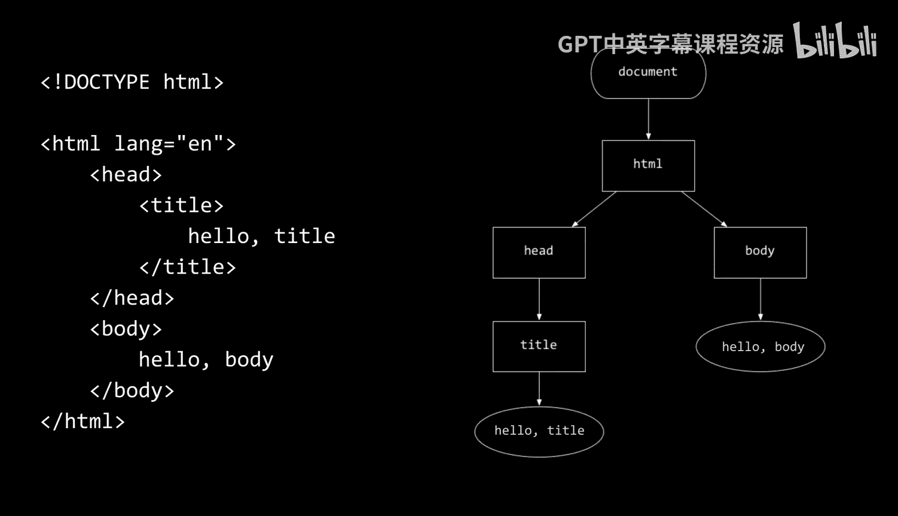

Child of the title element and this oval here。 Hello body is the so child of the body element here。

 Now this is a very simple web page， and you could certainly imagine a more complicated web page having many more nodes and many more edges than these。

 but there's gonna to be a one to one correspondence between the text that's received by the browser and what's ultimately built up in memory。

 but they're equivalent but it's worth noting that the indentation here is just for the benefit of really you and me and anyone else that might look at this code generally speaking。

 we'll see browsers don't care about white space， so to speak all of this pretty indentation in this pretty printing。

 so to speak， is really just for the benefit of the human reader not the computer。

 but drawn as such it also makes clear hierarchically what is a descendant of what in this case。

 So we have HTML at left and we have the Dom or document object model here at right。

So where does this H go rollll recall from last time when we were implementing the internet that we looked ultimately at the format of URLs in our discussion of HttP and in these URLs which might begin with a scheme of htps where the S indicates secure colon www example co which might be the fully qualified domain name in which some website lives Well we typically would have more than just that at the end of the URL not necessarily if you have nothing at the end of the URL。

 it implies that you want the default homepage of the New York Times website or any other in this case。

 though， we've explicitly noted that we would like specifically to access from the server。

 a file called file html Now it could be called anything in fact a default name is commonly indexed htl。

 but we've called this one file hl to make clear that it's indeed literally a file on some server specifically at wwwex co out there on the world web So what is inside。

File dot Hl。 Well， not surprisingly， it's actual Hl。

 So the convention for naming files that contain Hl is to end them with a file extension of dot html。

 Sometimes dot htm depending on the server that you're using。

 But nowadays it's not even necessary technologically for URLs to end with do Htl。

 you can actually hide the file extension altogether via any number of techniques。

 But here in this case， we're gonna keep it simple and literally use dot htl files to make clear their contents。

 So how are we going to actually serve up files。 Well。

 we're gonna to use ultimately a command called actually， let's roll back here。

 and let me transition from there over here to implement that file。In fact。

 let's go ahead and pull up VS code or visual studio code and create a file containing exactly those contents we saw a moment ago。

 So here in VS code， I've got the same setup that you might recall from our discussion of Python And the moment it's preloaded with a bunch of files I created in advance so that we have some examples ultimately to work through。

 I'm going go ahead and simplify my interface a little bit though and hide my activity bar at left。

 And for now I'm going to go ahead and hide my file explorer so that all we're left with here is my terminal along the bottom of the screen and then room for some code tabs or editors along the top。

 And what I'm going to do， as we did with Python is run the command code which is simply VS code's way of creating a new file and I'm going specify code of hello do Hm。

 Now I'm going go ahead just to give us a little more room and hide my terminal window。

 but it will eventually be back。 and I'm going go ahead and code up my very first H page。 Now again。

 I'm not programming per se。 but I am writing code， it's just that HTML， as we'll see， does not。😊。

The same kinds of features that Python had like functions and loops and conditionals and the like。

 We'll see that Hl is indeed a markup language that describes the data inside of the document。

 it doesn't provide you with programmatic control。 However。

 to the end of this lecture where we introduce an actual programming language called jascript which will give us back some of that same functionality。

 Allright， here we go in a file called hello do hl。

 I'm gonna to do open bracket exclamation point doc type space Hl closed bracket。 So to speak。

 gonna give myself a couple of blank lines。 And now I'm gonna say open bracket Html Lng equals E。

 since that's what this particular web page will be in You'll notice that somehow magicallylash Html appeared on its own inside of angled brackets That's just because VS code as a text editor。

 and also like an integrated development environment I is trying to save me time by trying to anticipate where we're going with this an autocomplet some of my thoughts。

 I'm going go ahead。😊，Then hit enter and you'll also notice that the cursor has been automatically indented just as with Python for spaces because it's presuming that I'm going to want to put something inside of this element called Hm。

 let me go ahead and open another tag the head tag it too was just autocomp。

 So I'll to enter to move my cursor down I'm going to go ahead now and do open bracket title close bracket and then inside of the title element I'm going to do hello comma title as before I'm going manually move my cursor down below the closed tag for the head element here and now I'm going open up a new tag open bracket body closed bracket and then move my cursor down and in there do hello comma body。

 So at this point in the story， all I've done is recreate exactly the file that we saw on the screen earlier So it's going automatically save So it would be nice to now look at this web page But how well at the moment because I'm using a cloudbased version of V code。

 I'm already using a web。

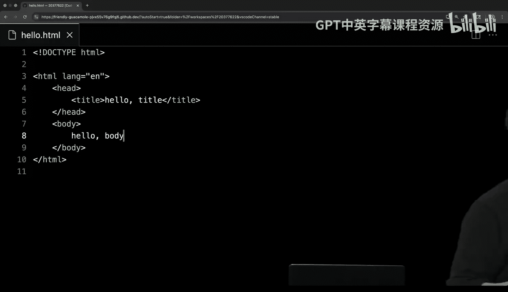

ver somewhere on the Internet。 However， that web server by default。

 like most web servers is running on some common TCP ports， namely 80 and 44。

3 for HttP and Htps respectively Therefore I can't really view my file at that same URL because that URL is which providing me with the cloudbased version of VS code。

 but here in lies the value of those same TCP port， even though this might be unconventional。

 It's actually very commonly done when implementing webs as a developer。

 you can use really most any other TCP port you want just temporarily while developing your site so that you can serve up web pages is really on your own private web server using the same physical server。

 but on a different TCP port， which is indeed is precisely the point of having on the outside of those virtual envelopes specific port numbers per services。

 So what I'm gonna do here is I'm gonna go overhead and open up my terminal window again。

The last thing I ran recall was code of hello do Html and notice at the moment that for today's class。

 I've revealed a second tab in my terminal window。 This one is specific to the cloudbased environment I'm using port 1337 happens to be in use already and that's a TCP port that this cloudbased environment is already using But what I'm going to do is go back to my terminal。

 and I'm going to go ahead now and run HttP server and then enter。

 and we're gonna to see a whole bunch of output on the screen followed by a prompt to open in browser your application running on port 8080。

 So by convention I've chosen 8080 as the TCP port that I want to use。

 I'm gonna click open in browser and you'll see now a listing of all of the files in my account in the cloud。

 Now there's way more files than I just created because I literally created just one file。

 All of these other files are the ones that I prepared in advance of class so that we can walk through some prem examples just to save on some keystrokes。

 But down here。😊。

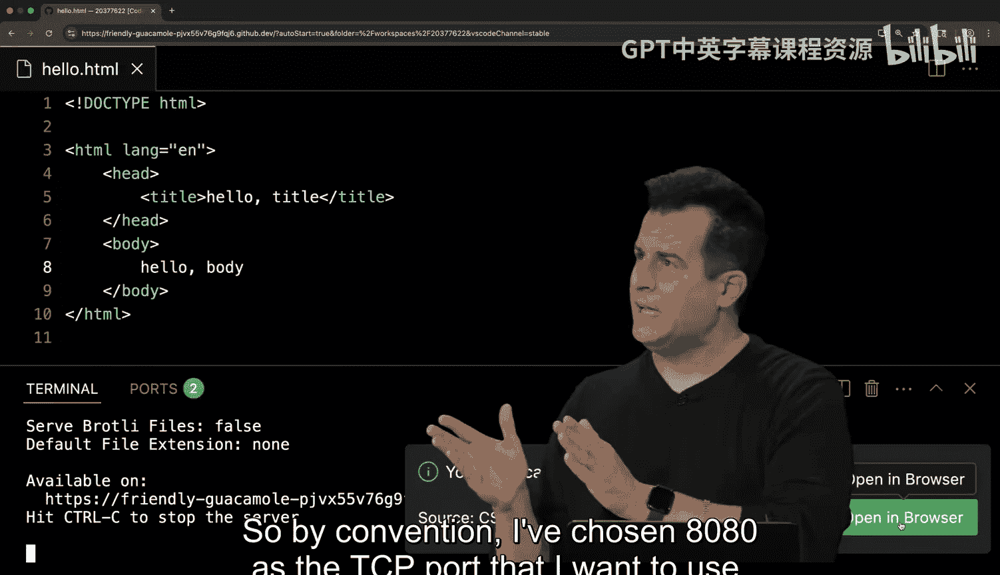

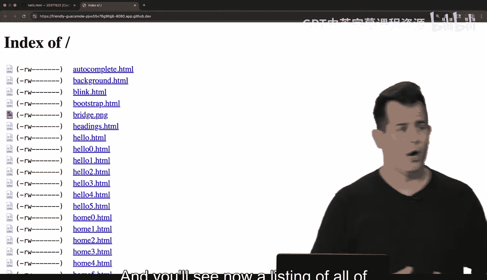

Indeed， hello do Htl， which is the file I just created among all of these others。

 So what you're seeing here is a directory index。 so to speak。

 a listing of all of the files in my cloud account。 However。

 you're seeing them hosted on a different TCP port specifically 8080 and in fact。

 if I go back to my other browser tab in which VS code still is you'll see under the ports tab next to my terminal that not only is port 13。

37 open So is port 8080。 Now this is not a detail that you'll necessarily see on your own Mac or PC if using VS code on your own Mac or PC。

 But if you do use a cloudbased programming environment like this， which is increasingly common。

 you'll find something very similar to this exact setup。 and indeed for this particular course。

 you'll see precisely this setup and again， you decide to use locally VS code on your own Mac or PC。

 But for now， what I'm going to go ahead and do as go back to my terminal window。

 I'm gonna create a second terminal window， In fact， by clicking this plus icon just。

That I can leave that command HttP server running really in perpetuity because I want to constantly during this class。

 be able to pull up web pages that I've created。 but I've got a second terminal now that I can still type commands at like code when I want to open or create other files。

 All right， so let's now go ahead back to my second browser tab where I see the directory listing of everything in my folder。

 I'm going to click specifically on hello do H。 And while you might not be that impressed by what we just made。

 it at least is， in fact， my very first page on the World wide web here of course。

 is hello comma body and indeed as promised the body is like most of the web page itself。

 but here's that title in the tab here， hello comma title So we see both we have both and this file now is available on the World wide web itself。

 but not quite publicly one of the tricks here using this cloudbased environment is that only I currently。

😊。

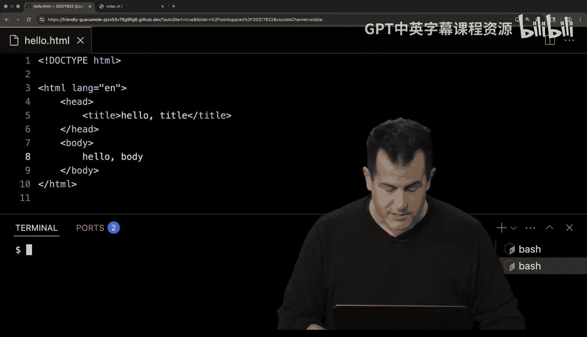

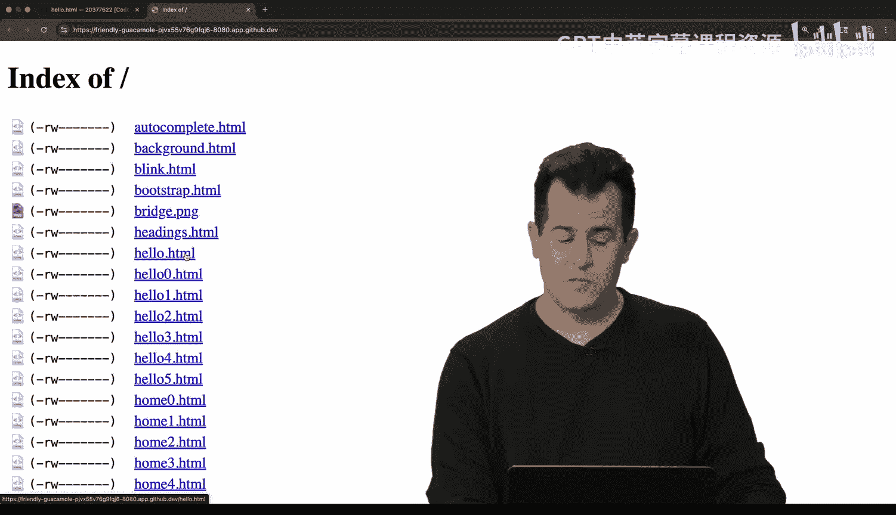

Im authorized to view this page， so even if you were to copy paste the actual URL at which this file lives。

 only if I click some buttons and make it fully public could anyone access it。

 but that's fine because now we're in the development phase。

 I'm not actually ready to push this to production so to speak at a nice user- friendly URL instead。

😡，So at this point， we have a web page that does actually work。 It's actually been served up。

 What more can we do with H because this certainly isn't all that inspiring yet。 but indeed。

 any page you visit on the Internet nowadays， looks a little something like this even though it probably has many more tags and many more attributes。

 In fact， why don't take a tour through some of the possibilities。

 let me go ahead and close hello do H let me go ahead and open up a file I created in advance called paragraph H。

 which looks a little something like this。 I'm gonna hide my terminal window just so that we can see a bit more of it and you'll see that at the top of the file as before we have our document type declaration this time on line3。

 we actually have a comment I wrote in advance just to remind you and me what this file is meant to demonstrate and we have here demonstrates paragraphs。

 All right， well what does that mean Well， it turns out in H if you want to have paragraphs of text。

 you have to convey as much to the browser you can't just write a paragraph。

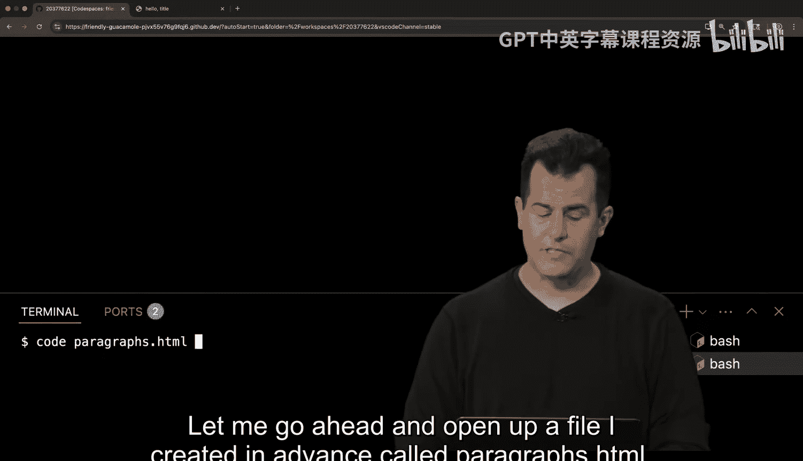

Hit enter， write another paragraph。 hit enter， write another paragraph。 hit enter。

 You actually need to introduce some tags into your web page that effectively tells the browser。

y browser here comes the start of a paragraph Then your paragraphy browser that's it for my paragraph。

 Hey browser here comes another paragraph。 Then your second paragraph。

y browser that's it for my second paragraph。 So we're gonna have more open and close tags。

 And indeed that's exactly what we have below the Hml tag。

 which is the same with the same lang attribute below the head tag and title tag， we have the body。

 and then inside of the body notice we have one，2，3，4， and perhaps more paragraphs as well。

 Now these paragraphs don't actually say anything even though they look like Latin。

 this is la Ium So it's just been generated to look a little something like Latin just to fill up some space。

 and it actually is so long each of these paragraphs that it sort of wraps past the end of the screen。

 But notice here we have open bracket P closed bracket， which is short for paragraph。

 then we have almost the same here Open bracketlash P closed bracket。

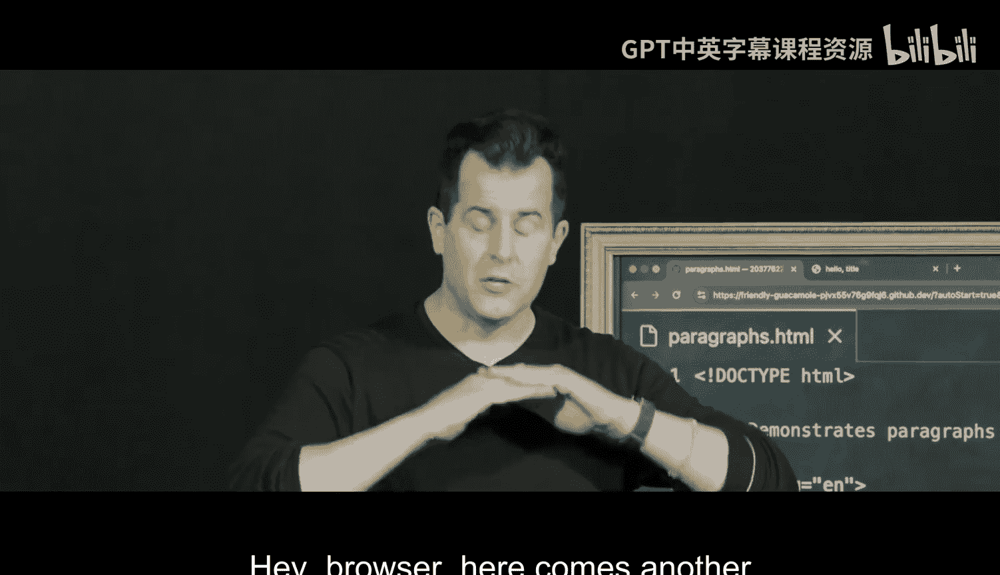

Wch again just means to close the previous open tag as well and that repeats repeats repeats with different paragraphs of text。

 So what actually does this look like Well， let's go over to our second browser tag I'm gonna hit the back button so we can go back to that directory listing which has every file therein let me scroll down to the one in question here called paragraphs html and voila there are our paragraphs of text albeit nonsensesensically here though。

 we do have some paragraph breaks， you'll see the white gaps vertically between each of those paragraphs and that is because the browser knows about the P tag for making paragraphs and formatting them in this way Now just for kicks what if I had omitted those paragraphs and I just done things the sort of oldfashed way by hitting enter a couple of times so let me remove this tag and these tags and these tags and these tags and these tags and these tags and this tag such that now I have what seems to be a whole bunch of paragraphs of text and I'll make。

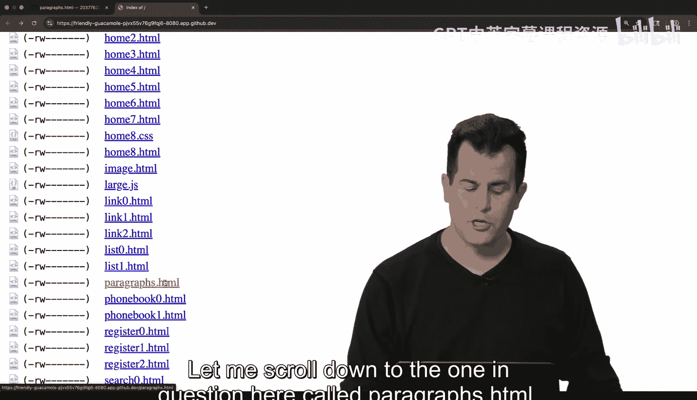

Much clear by even hitting enter after each of them to give them some white space vertically。

 If I now go back to paragraphs that HTML， it actually looks great still， but。

This file has already been downloaded from my web server。 so it's cached。

 so to speak saved in memory。 This is why I now have to hit the reload button or control R or command R to reload the page from the server so that my browser downloads a fresh copy thereof。

 So to be clear， even though I have two tabs open in the same browser。

 my first tab is Vs code somewhere in the cloud。 My second tab represents the browser trying to access files from that cloudbased server。

 So here we go。 if I go ahead and click my browsersload reload icon。

 Now it's just one big blob of text。 All of those paragraph breaks seem to have disappeared altogether。

 So suffice it to say I need those paragraph breaks explicitly。

 So I'm going undo undo undo all of those changes we just made。

 which is to say that HTMLl at the end of the day is pretty pedantic。

 when it comes to prescribing how you represent your data using this markup language。😡，Well。

 in addition to these paragraphs of text， it would be nice if we could format the document a little more beautifully。

 maybe have some chapter headings and some section headings。

 some subsection headings and the like like you might see in a paper or in a book Well we can do that as well。

 Let me go ahead and close this tab here。 and open up my terminal window again let me go ahead and open up this time a file called headings Hml and introduce a few more tags as well。

 let me open that file close my terminal window we'll see some familiar tags already document type declaration Hl head title body and now some new ones above my first paragraph of Latin like text。

 I've got what looks to be a H1 tag and then a close H1 tag then an H2 and an H2 And if I keep going I bet I'm gonna see one or more as well。

 So these H1 H2 tags and so forth represent headings tags and what they tell the browser to do is to format whatever word or words are between them big and bold but maybe a little less big and bold。

😊，lesss big and bold， ironronically， the bigger the number gets。 So H1 is the biggest and boldest。

 H6， it turns out， is still bold， but much smaller。 So in fact， if I scroll down。

 we'll see that there's not only H1， H2， H3， H4，5 and 6， above each of these paragraphs。

 So let's go back to my other tab here。 click the back button So as to go back to my directory index。

 And in this case， let me scroll up to headings Hml and see the result here now we have what looks like a more beautifully formatted book or chapter or paper or the like where the browser is automatically handling all of the formatting thereof Now what if you don't like the font。

 What if you don't like the font size， the bold facing all of that is changeable。

 I'll be using different techniques For now， we're really focusing on just marking up the contents of the page。

 the actual words here， be they in English， Latin or really anything else All right。

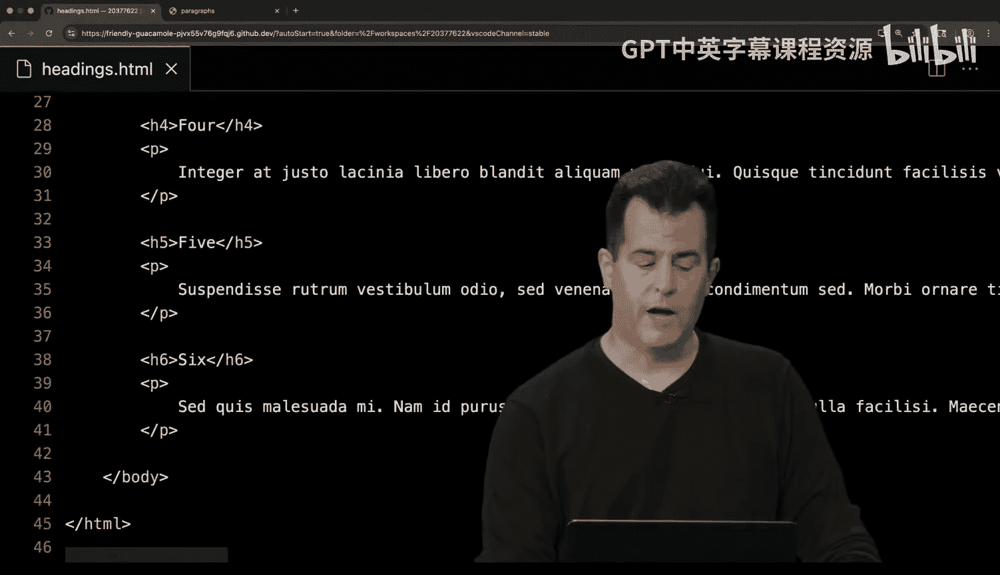

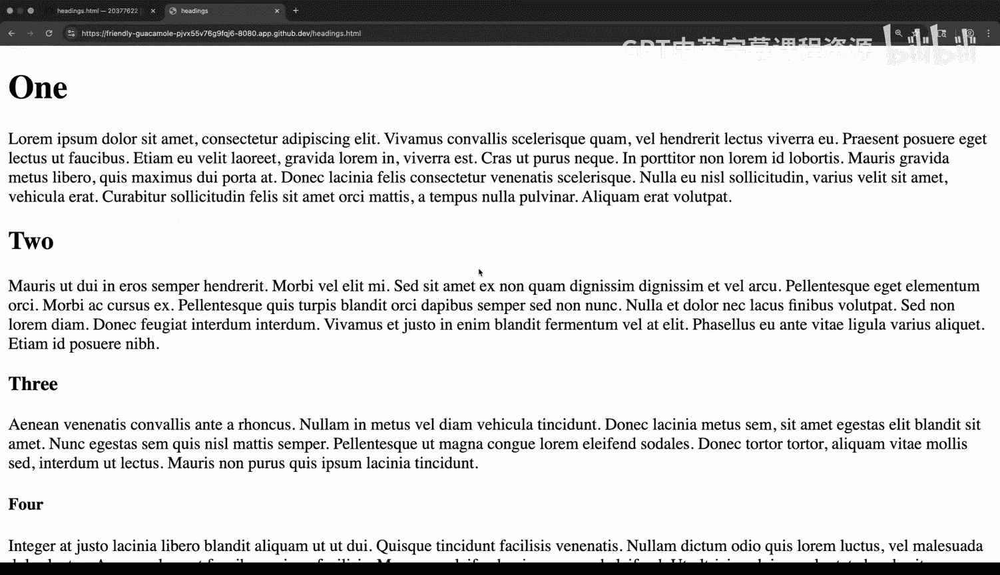

Can we do Well， it's very common nowadays on websites to have lists， for instance， of information。

 So let's go into another file here。 Let me close this tab here。

 open up my terminal and open up a file called list0， which is the first of my lists。

 I'll close my terminal window again。 And this page is actually quite simple。

 It still has the familiar document type declaration， Hl head title and body tags。

 But then a little something different。 It's got a U tag and a close U tag。

 Then a whole bunch of pairs of L tags here。 open and close， open close， open close。 fo bar and Bas。

 These are just sort of verbal placeholders for computer scientist。

 much like a mathematician might reach for X's and ys and Z。

 computer scientists when they just need placeholder words that don't really mean anything。

 they go with fo bar Bas and then a bunch of others as well。

 So this is just a list of three words that happen to be fo bar and Bas。 Well。

 what kind of list is this。 Well， you'll note that U here。

 indicates that it's the U here has three children， L L I， L。😊。

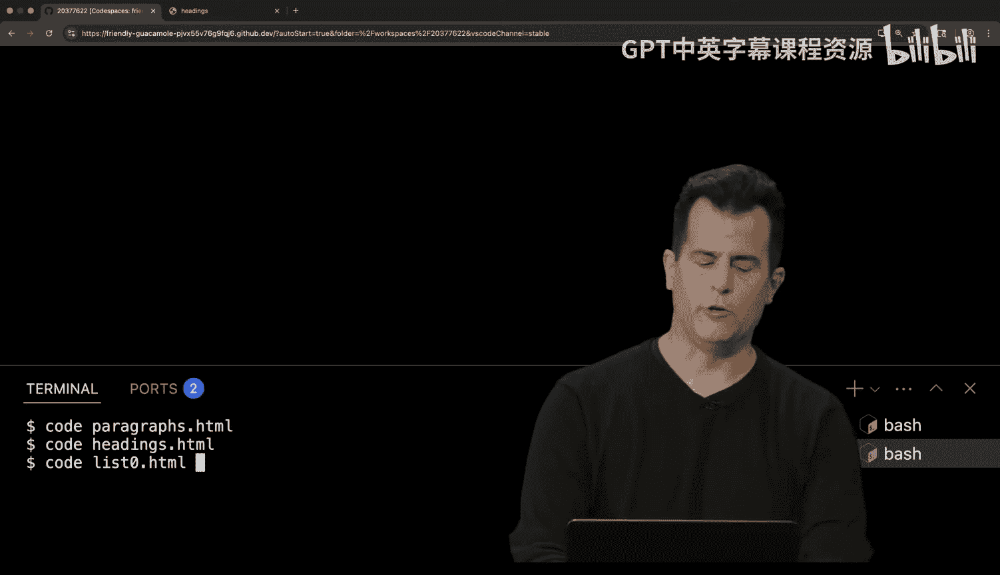

Each of which is closed。 So this is going to be a list of size 3。 But what kind of list， Well。

 let's take a look。 Let me go into my other browser tab。

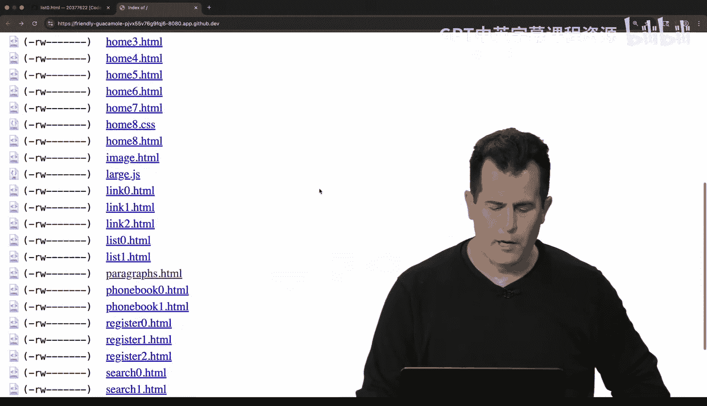

Click back to go to my directory index。 Let me go ahead and open up in this case list 0 do Htl。

 And oh， so quite simply it's a bulleted list， something you might get in Microsoft word or Google docs or the like。

 it's just a bulleted list， really an unordered list。

 unordered in the sense that there's no numbers here。 It does go from top to bottom。

 But there's no numeric indices associated with any of these list items because U stands for unordered list。

 Well， how can we change this Well， your mind might be going where where mine is here。

 I can go ahead and close this tab， open another， open up a file now called list one do htl。

 which is my second version because as before， we'll start counting from0。

 And if I now reveal the contents of this one， it looks almost the same except that we have an OL tag opened and closed instead of U。

 So whereas U was unordered list。 O is ordered list。 So in fact， if I go back to this tab here。

 click back， open up list1。😊。

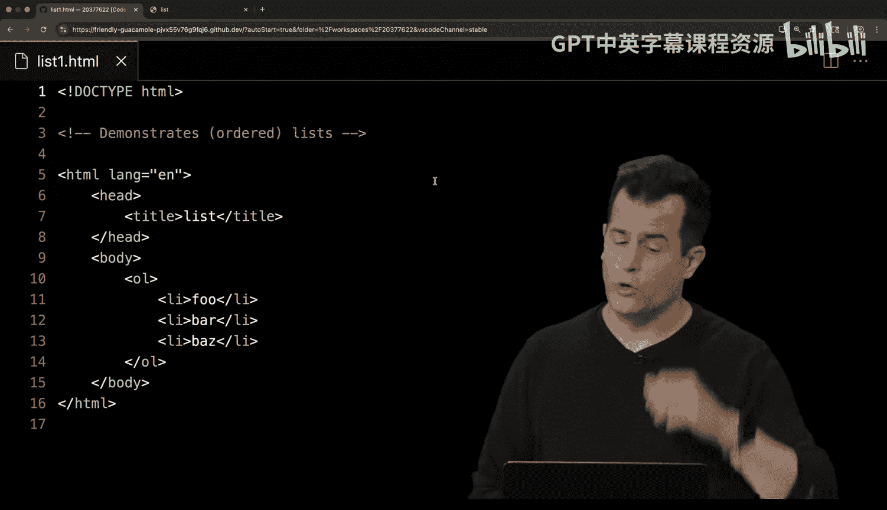

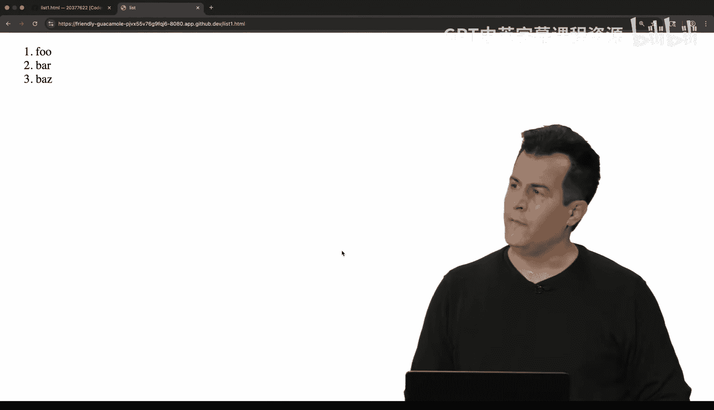

HTMLtm， same exact words。😡，But automatically numbered。Allright， so what's the value of this？

 After all， I could have just used a bulleted list using U。

 and I could have myself just manually said one period， two period。

 three period and made my own darn list。 But here's just one of the features of Hl。

 it stands to reason that you might eventually have in some webage longer list than this you might want to go in after the fact and add some elements in the middle at the beginning in the end。

 And if nothing else， it would just be annoying to have to manually renumber everything。

 This is one of the reasons why computers are so valuable。

 they can do all of this automatically for us。 The browser itself can probably use some kind of for loop or while loop and start numbering these things top to bottom for me without me having to worry about hard coding those numbers myself into my Hm。

 So here we have then in ordered list where the browser does more of that heavy listing for us heavy lifting for us。

 All right， Well， what more can we do with Hl using some more tags。

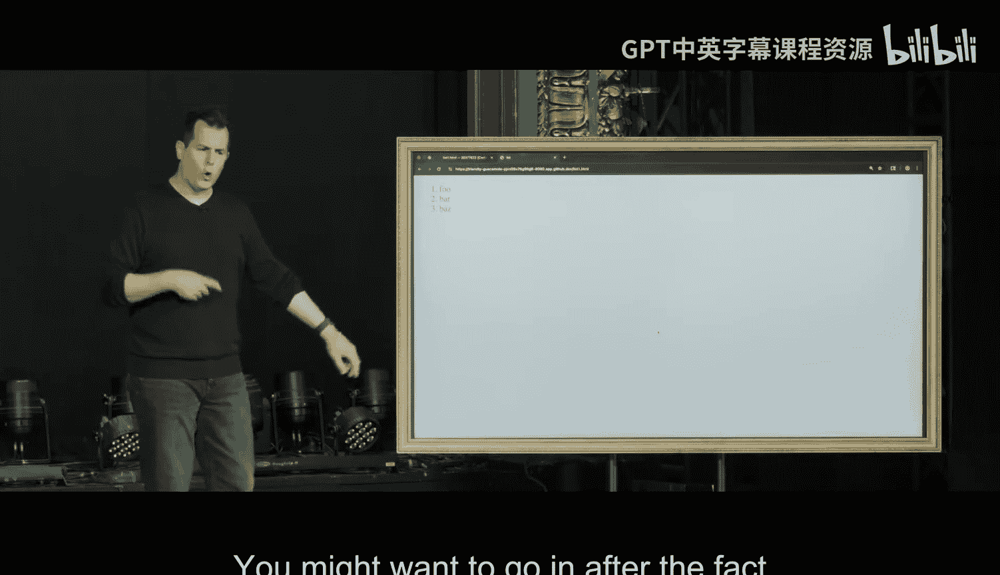

In our file。 Well， let me go ahead and open up another file here called Phbook0。 We， of course。

 have searched a phone book for such names as these。 And in fact， if I hide my terminal window here。

 we're gonna see all of a sudden a lot more HTMLl， but it's not very complicated。

 You just have to add to your vocabulary。 a few more tags。 and with it。

 you can now structure data in tabular form with rows and columns。

 So we got the same old tags up here。 but then the things get interesting inside the body whereby we have a table tag。

 then a little less obviously， we have a Thead tag， which stands for tablehead。

 So this might be the first row of the table that maybe looks a little different。

 maybe it's boldfaced or allows for sorting or something like that down the line。 T R。

 even less obvious， but this stands for table row。 and then T H just as succincly stands for table heading。

 So specifically even though this reads top to bottom a little weird。

 This says hey browser here comes a table。 Hey browser here comes the head of the table。

 Hey browser here comes a row in the table。What are the columns within that row。 Well， implicitly。

 the first column will have a heading of name。 The second column will have a heading of number。

 Why first and second， will， because they appear in the H in this order。

 So the browser is going to infer that if its one T H tag and then another top to bottom。

 it's going lay out these columns by default from left to right。 Hey， browser。

 that's it for the table head。 Hey browser here comes the table body。

 Let me scroll up a little so we can see more of the body here。 And we'll see。

Inside of the table body here， a whole bunch more of table rows represented by the TR element again and again and again。

 And so what's inside of this table body。 Hey， browser， here comes a table row。 the table data。

 TD for short should be Brian in the first column and then TD in the second column。

 This phone number here。 same thing for David， same thing for Doug。

 same thing for Eric and then John seems to have a slightly different phone number。

 if you'd like to give him a call or text sometime。 But ultimately after this。

 I think you can probably guess what's just off screen。 If John's row， has just begun。

 It has two table data。 Yep， there is the closed table row， there is the closed table body。

 there is the closed table， the closed body and the closed HM。

 So it's a much bigger file all of a sudden， but it's not all that much metadata。

 It's not all that many tags that are sorry。

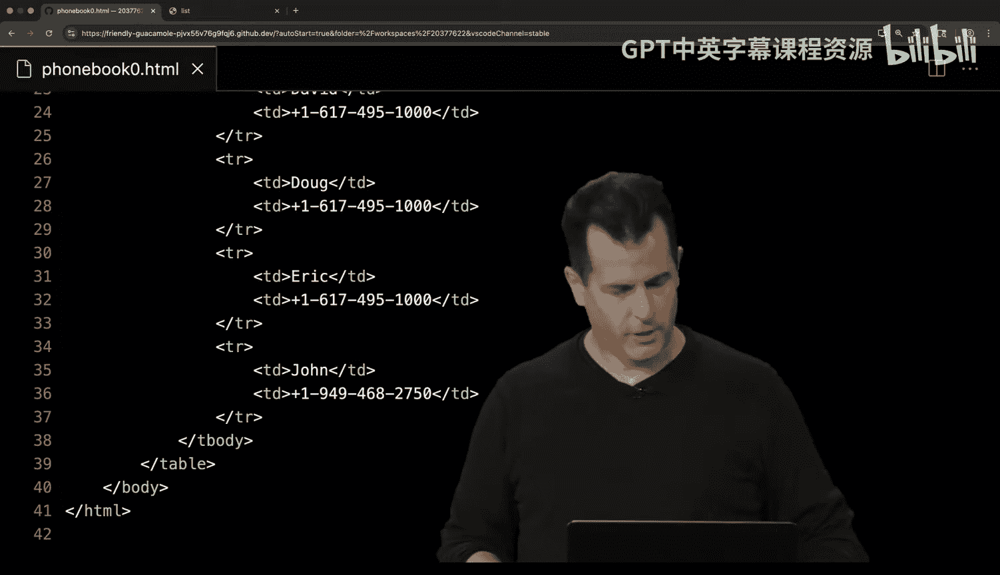

So this example has a lot more tags， but it's only because there's so many more components to this page。

 a whole bunch of rows and columns inside of which are what we might call in the world of spreadsheets。

 individual cells。 Now it's a little strange to think about your rows and columns in this indented HMl format。

 So let's go back to my other browser tab Let's go back into my directory index。

 Let's open up phonebook 0 do Htl。 and there we have it。 It's not the prettiest table to look at。

 but the table heading has been boldfaced automatically by my browser for me。

 thanks to those TH tags。 And then I do have a column of names and a column of numbers thanks to all of those Trs and TD tags therein that give me this simple phone book here。

😡。

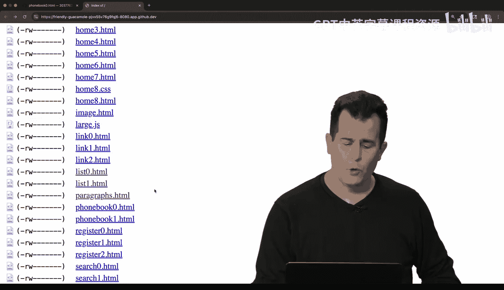

All right。So that's just more H Tl tags。 And we'll start to speed through some more and more of these tags because really all we're doing is trying to build out a vocabulary。

 We have yet really to introduce any new ideas。 We still have our tags。

 We still have our attributes here Now， we're just seeing some more examples thereof。

 But the Web pages we've made thus far， fairly textual in nature。

 Why don't we see if we can't go ahead and create something a little more graphical。

 So I'm going go back into my first tab in V S code and close this phone book 0 do Htl。

 I'm going open up my terminal window again。 And I'm going open up this time。😊。

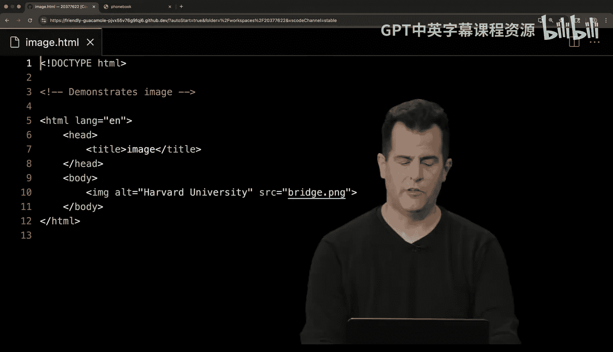

Image do Html and then close my terminal thereafter in this page， which is fairly short。

 We have a description of what's coming。 demonstrates images。 Well， how do we do this？ Well。

 inside of the body of the page， I've got an image tag IMg for short。

 I then have a source attribute SRC for short， equals quote unquote bridge do PNng。

 which apparently is the name of a file inside of my cloud account here that presumably is in the exact same folder as image do Hl。

 because this is what we would call like a relative URL or relative path in that there's nothing before。

 no mention of folders， no mention of another domain name or scheme。

 So this is presumed therefore to be in the exact same folder as the file that mentions it。

 Now this is the first example where we've seen an Hml element that has not just one but two attributes in this case we have not only source which is going to be the source of the image that file there。

 we have alternative。ALT for sure， which is good for accessibility。

 which is good for slow connections Y well for instance。

 someone with a screen reader on their computer could actually have these words。

 Harvard University read aloud to them by that software and indeed if you're on a slow connection and the image hasn't quite downloaded yet you can at least see the words Harvard University before you actually see what I would imagine is going to be a photograph of a bridge at Harvard。

 So let's see this in action let me go back to my second browser tab here。

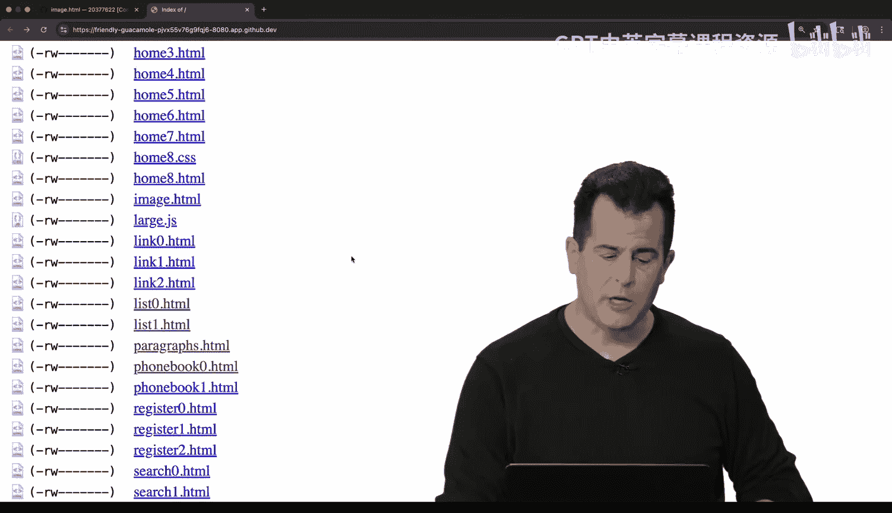

Click back to go back into my directory index。 Let me go ahead and open up image do Htm。

 and sure enough， there is what looks like a bridge。 In fact。

 I haven't actually properly resized this for the size of this laptop so I can go ahead and zoom out here and now we see the entirety of this image。

 It's not really cropped in a way that looks very beautiful yet。

 but that's because I haven't really done any manipulation of it， I've just told the browser。

 hey browser here comes an image Plop bridge do P and G there。 Well。

 notice too what's interesting about this image tag。 If I go back into VS code here。

 notice there's a subtle difference between the image tag and every tag thus far。

 something's missing。😡。

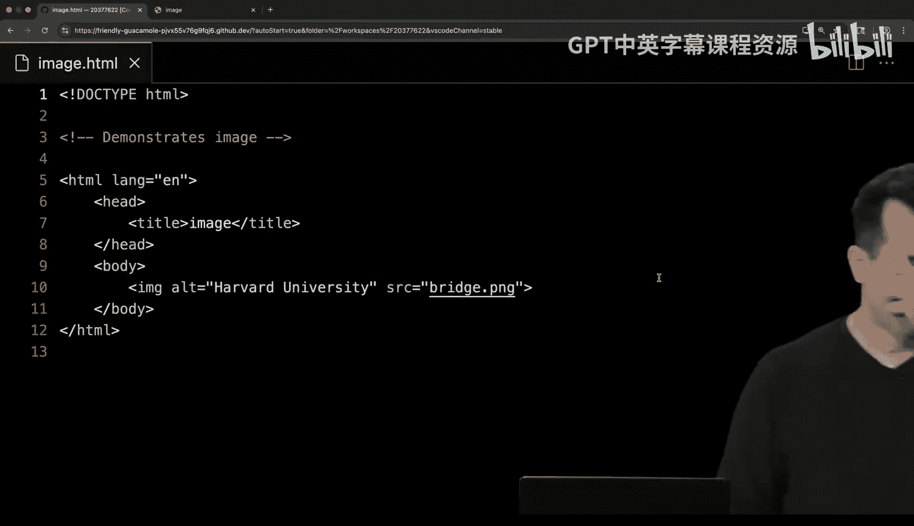

Like what seems to be off。 I mean， thus far， every tag we've used seems to be symmetric in some sense。

 whereby if I open the tag， I then close the tag if I start the tag。

 I then end the tag at some point but the image tag notice has no corresponding closed tag I don't see open bracket slash IMG closed bracket but that's actually okay because it turns out just sort of semantically like an image can't really start at one point and then eventually end like the image is either there or it's not So it would be sort of silly if you had to close the image tag certainly would be weird if you started the image tag here and then like closed it later on down there because how could you put something in the middle of the image you can't that's just not possible by design So it turns out that there are some empty elements in HTML。

 which is to say they don't require a closed tag Now there are variant of HTML that actually do have you specify a closed tag nonetheless or put a slash inside of those angle brackets nonetheless but that's not necessary and in fact will keep it。

Simple and omit those unnecessary syntactic details and just claim that the image tag can stand alone in this way。

 So it's a little bit different from everything else thus far。

Notice as an aside that when we've closed all of these tags。

 we do ignore the corresponding attributes。 So for instance， this only applies to one example。

 but we have it again in this example here， Notice that the HTML tag indeed has an attribute Lng equals quote unquote E。

 but we have never mentioned that attribute or value again down below。😡。

Because it's just not necessary。 when you close the tag， you do so only on the basis of its name。

 and the browser will realize by symmetry here that， oh， this tag lines up with this one up here。😡。

Now， another word， though， on these attributes to tie it together to discussions past。

 This Lng is the attribute。 This E N is its value。 By convention， we've got double quotes。

 You could use single quotes if you prefer， especially if there's words。

In the value with spaces therein。 But this is just another example of key value pairs。

 And we've seen this before in our dictionaries。 We've seen this before in Python in data structures more broadly。

 this notion of key value pairs， Htl's approach to key value pairs is in the form of these attributes and their value。

 So here， too， there's not really a new idea。 It's just incarnated here with a slightly different syntax than we've seen before。

Allright， well， what more can we do besides images。 Well。

 we might as well throw a video into the mix。 So let me go ahead and close this tab here。

 Let me go ahead and open up now a file called video0 do hml。

 And in this file we'll see quite simply how we might go about embedding a video in a page like this one here videomp4 for MPg4。

 How is this done。 Well， there's a video tag， much like there's an image tag。 but in this case。

 it's video spelled out completely where image is just Ig notice here are some additional attributes。

 and these two are curious。 It turns out with some HTMLml attributes。 They don't need to have values。

 the mere presence of the attributes names themselves is sufficient to coerce the browser to behave a little differently And you might infer what these two attributes do controls just means that I want to see like a play icon and a pause icon and maybe some other controls on top of this video when embedded in the web page muted means exactly that。

 I don't want this video to play automatically This is probably。

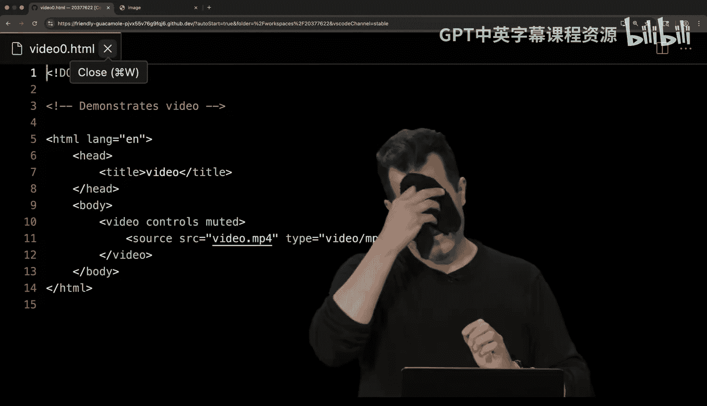

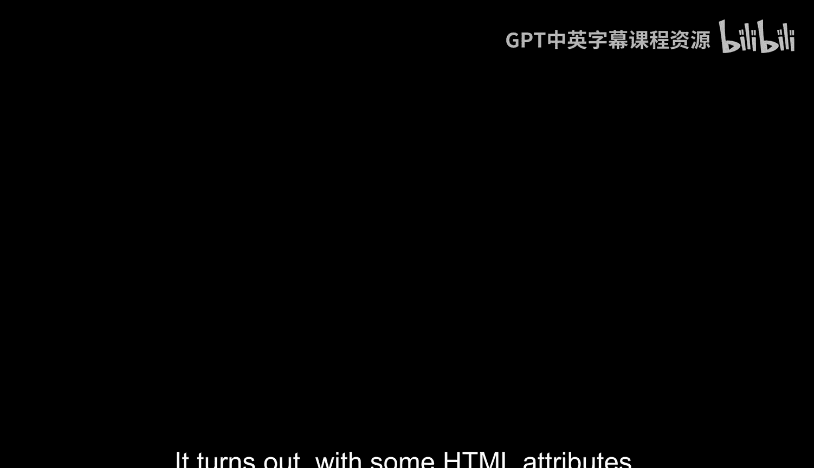

Good thing when it comes to browsers nowadays which typically don't play videos automatically。

 even if you want them to if they're going to play sound， if only because that's a bad UX。

 a bad user experience， and tends to be used by advertisement。

 but in this case we can at least try to ensure that the video is not going to bother anyone even though they might click play it's not going to play sound by default。

 Meanwhile， the source of this video， and this is spelled out actually a source not as SRC。

 weirdly the source tag does have an SRC attribute。

 but the value of that is video MP4 and the type of this video for clarity is video slashmp4。

 and this is what's generally known as a mindme type and this is just a standardized string of text that describes what type of file is inside of the actual file being downloaded in case it's not completely clear from the file extension alone。

😡。

So how else might we embed videos Well， besides this video here。

 and I'll leave it to is an at home exercise to open up this actual video and play it。

 perhaps with sound。 Let me go into my terminal window again。

 Let me open up video 1 do h just to show you an alternative way of embedding videos。

 which is so common today because of the omnipres of YouTube If you were to go to a video on YouTube and click the share button or similar。

 odds are you would be able to navigate your way to a little bit of HTMLml code that you can then copy and paste into your own files。

 For instance， that's exactly what I've done here。 It's a little long because it's wrapping off the screen there。

 but notice that I copied and pasted this exact line from YouTube。 It's a tag called iframe。

 which is a frame inside of the web page itself。 The width of it based on YouTube suggestion is 560 pixels across by 315 pixels down。

 though I could resize that ideally proportionally the source of this particular iframe or embedded video。

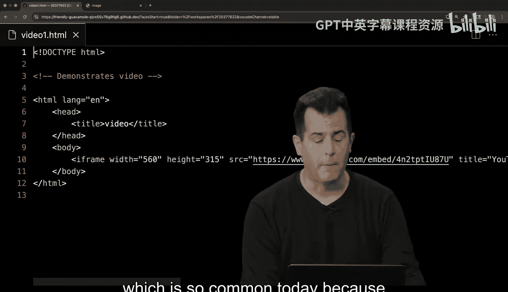

Will be this long URL here。 And if I keep scrolling， there's gonna be even more attributes here。

 some of which are a little specific to YouTube's own features。

 including an allow attribute and the values therein that YouTube has suggested a refer policy。

 allow full screen and perhaps more。 So in short。This is an incredibly common paradigm when visiting a website that has certain types of media like a video to copypaye some recommended HTML into your own website so that you can therefore embed it in your own。

 Now， you shouldn't be in the habit， though of just copying and pasting blindly any code that someone tells you to embed in your site。

 because you can actually accidentally inject， perhaps even malware malicious software into your site。

 not so much if it's an iframe like this， most likely depending on your settings。 but if it's。

 in fact， a chunk of jascript code more on that in a bit。

 which could actually change aspects of your page that you don't actually intend。

 So I would be aware when doing this， but it is nonetheless a feature and a popular feature at that。

 And I'll leave this one too is an at home exercise， if you'd like to open up in your browser。

 video1 Hl and see how the video embeds。😊。

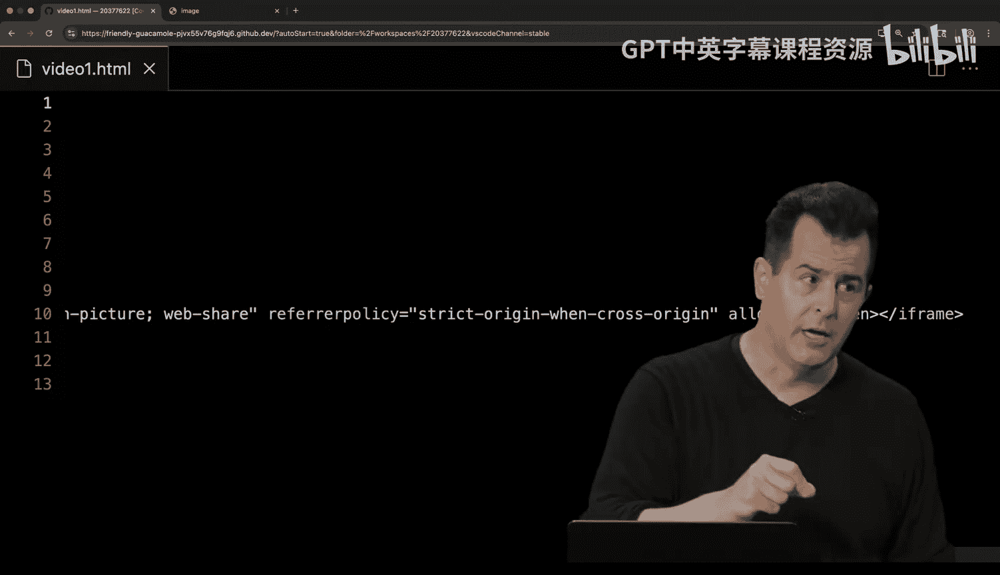

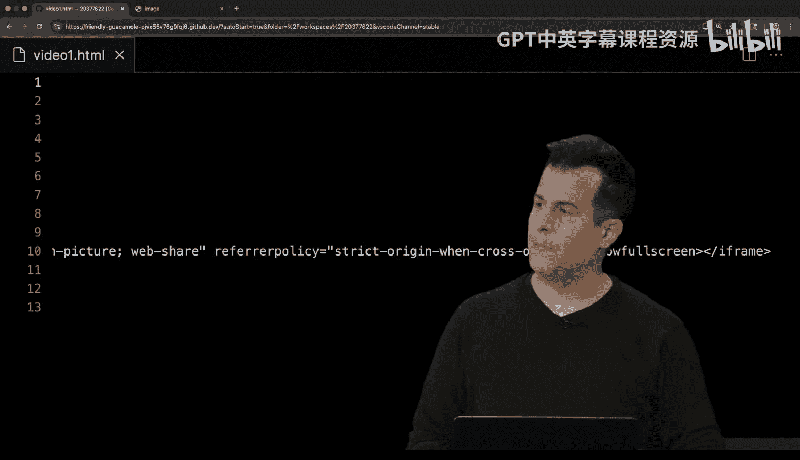

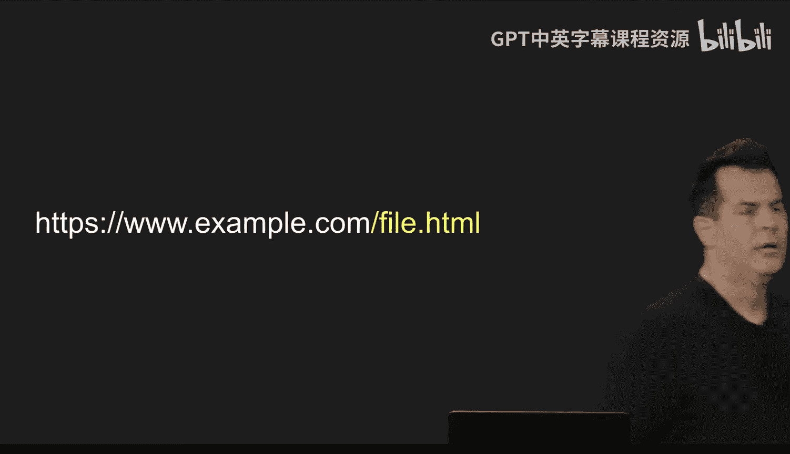

But not all URLs are of this form here ending in file。 HTMLt。 In fact。

 it's dare say more common for URLs to look a little something。😡，Darn。Sorry， out of order。

Now not all URLs are necessarily of this form， in fact。

 I dare say more common nowadays is something that looks a little more like this。

 where it's not necessarily a file name， but there is some path there followed by a question mark and then actually one or more key value pairs。

 and in fact in the context of HTTP's URLs， these I don't want to say that sorry。😡，Ready。Now。

 not all URLs necessarily look like this。 In fact， I dare say it's more common nowadays for URLs to look a little more like this where there isn't an explicit file name。

 but instead some kind of path followed by a question mark， followed by one or more key value pairs。

 And in fact， these key value pairs are the same idea that we've seen in data structures。

 as weve saw just in HTML with the format within URLs is a little bit different。

 it's literally key equals value。 instead of， for instance， shoot。😡，Nope， let me just do that again。

 Then we'll move on。Okay。Now it's not necessarily the case that all URLs are going to be of this form。

 In fact， I dare say it's more common to see URLs that look a little more like this where you don't see an explicit file name。

 but instead you see some kind of path followed by a question mark and then one or more key value pairs the key and value of which are separated by an equal sign and in if there's two or more you would then have an ampersand and then the second key and value respectively in that process can repeat for longer and longer URLs this in fact is how using HTTP a browser can provide input to a server that goes beyond merely requesting a specific page or path on the server In other words。

 if a user were to fill out a form with their name and email address， maybe some checkbox。

 credit card number or password or the like when that user hits enter or clicks a submit button all of those key value pairs the name and the actual person's name the email field and the actual value they type in。

😡。

Can be passed to the server inside of the URL itself after this question mark In fact。

 we can see this ourselves with a bit of HTML of our own Let me go over to。😡。

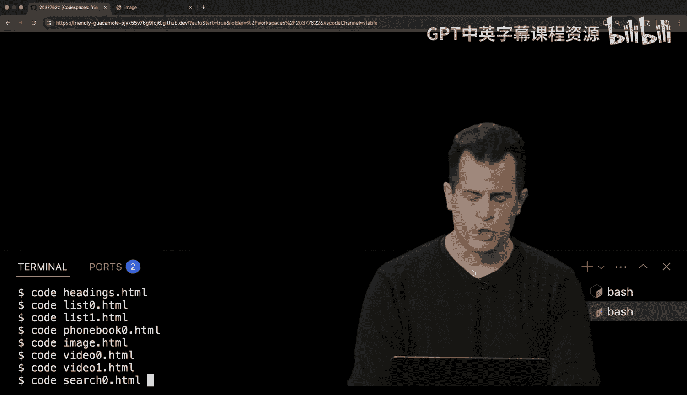

V S code here。 open up my terminal window again。 and this time open up search0 dot Hml。

 This too is not a large file， but it does introduce a few more tags and attributes as well。 In fact。

 inside of the body of this page， we have now a form tag which has two attributes。

 one of which is action， the other of which is method Now in reverse order。

 the value of method here seems to be quote unquote get recall that get was the operative word we saw earlier in our representative HtP request where the browser wants to get literally some web page on the server。

 This indicates to the server that it's indeed going to use that same get method or verb action here。

 albeit cryptically name means where do you want to get data from Well in this case。

 the value of the action attribute specifically what I'm aspiring to do with this example。

 is implementing my own version of Google。 I'm not going get into the backend thereof in the。

ase in all of the web pages， I'm just going to implement the so-called frontend of Google co。

 namely the search page。 And so if un'famili， this notion of frontend and backend is a very common paradigm in computing whereby the frontend is everything that the user sees the user interface really and the backend is everything the user doesn't see It's the server。

 the code on the server。 the data the database on the server that is nonetheless driving the frontend but not something the user can directly see Now what's inside of this form element in between its open and closed tags while we have two input tags and notice these input tags themselves have a couple of attributes name equals unquote Q that is to say this input is going to be like a little text box and I know it's text because of the second attribute whose type equals text and the name of this text box is going to be Q And I know to use queue simply because for all of these years。

 Google co think delar and Serge back in the day decided to standardize the name of their text box as Q。

For query。 So if I want to implement my own frontend for Google。

 I have to adhere to their same standard。 So I'm giving my textbook text box a name of quote unquote Q。

 Meanwhile， the second input here is of a different type， namely a submit button。

 So the mere fact that I've typed type equals quote unquote submit is going to turn this second input for this form into a clickable button instead。

 and the value of that button that is the label on it is going be Google search。

 So let's see the endresult here。 If I go back into VS code and open up my other tab。

Click back to go back to my directory index。And then scroll down to search0 htl。

 I'll see the simplest of web interfaces， namely a big text box and then followed by a button Google search。

 But what's powerful here now is if I click in this text box type in a word like cats。

 if I'd like to search for cats notice what happens to my URL。 if I zoom in at the top here。

 you'll see that I'm currently inside of a file called search0 do html。

 or rather that is the file I've requested from the server and the browser has rendered as soon as I click this button here。

 Google search， watch what happens up top all of a sudden the URL in the browser changes to https colon www do go do co search。

 which recall was the value of the action attribute of my form tag。 Meanwhile。

 if we go back to the second tab and again zoom in up here you'll see that following search the so-called path on the server is a question mark which says hey。

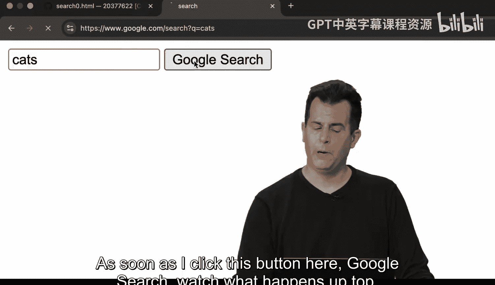

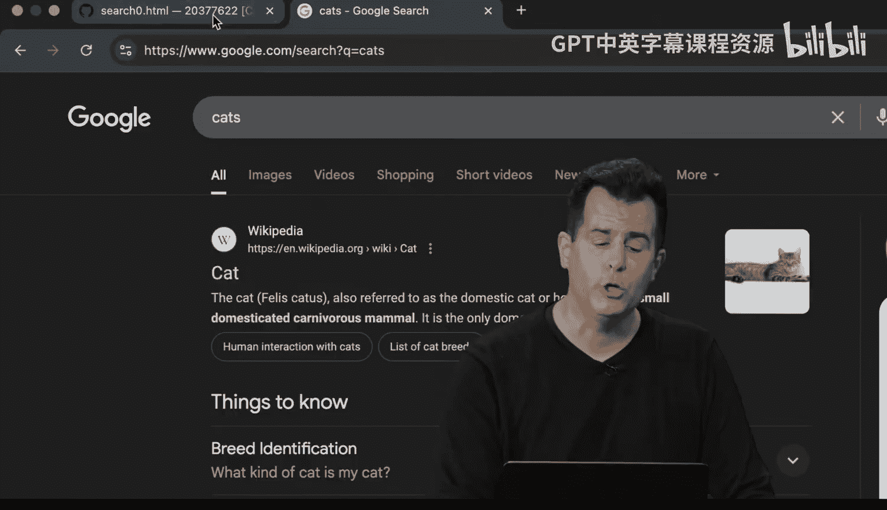

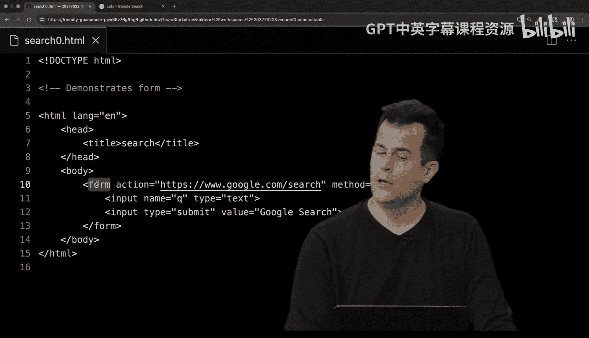

Server here come the key value payers， otherwise known as HttP parameters， the first of which is Q。

 the value of which is cats。 And that's why I see here。 the Wikipedia page for cat。

 And if I scroll down even more search results about cats。 Now， what more can I do besides this。

 Well， I could go back into。

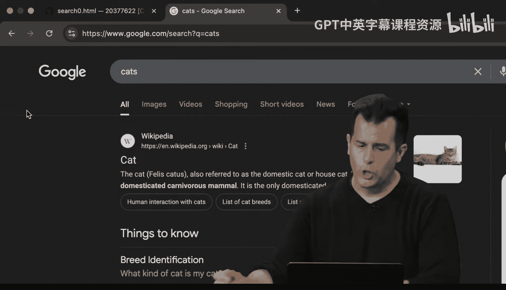

My previous form。 And you'll notice that this isn't very user friendly at the moment。 In fact。

 if I reload here， I have the。Sorry， let me fix this。Now， if I go back here to search 0 do Html。

 you'll see that this isn't the most user friendly form。 In fact。

 if I want to search for something else， I have to again click in the box and delete delete delete to get it rid of everything I've typed。

 but it turns out there are even more types of inputs then text and submit。

 In fact I can change quote unquote text to quote unquote search because it turns out browsers today。

 know that sometimes you want search boxes to be useful for search forms like this one here。

 which themselves might come with a specific feature。 In fact。

 let me go back to my directory listing go into search1 do Htl in which I made that same change and now you'll see when I click in this box and type in something like cats the simplest of opt of enhancements a little x that I can click that will just delete the whole thing at once。

 and that's a feature that comes from simply using a different value for that same type attribute。

 I can do more things here。 In fact， let me go back into VS code here。

 close search0 open up not search one which we just saw an action but search。

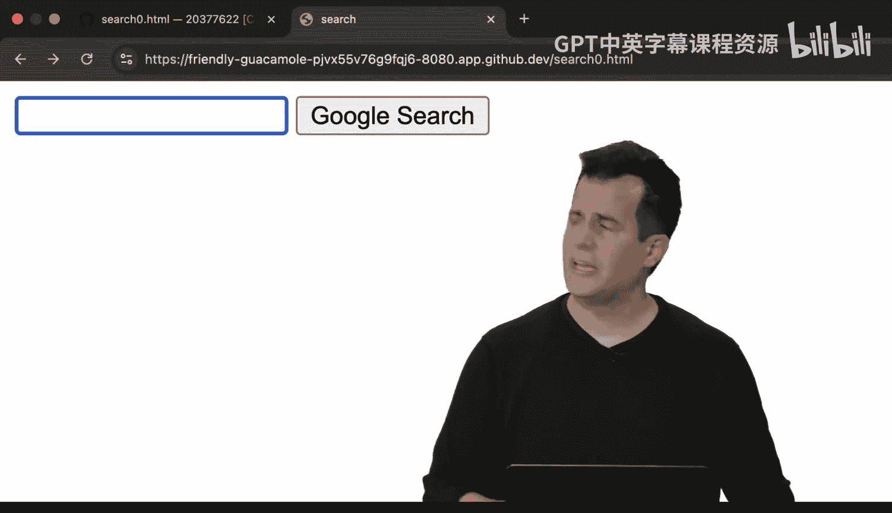

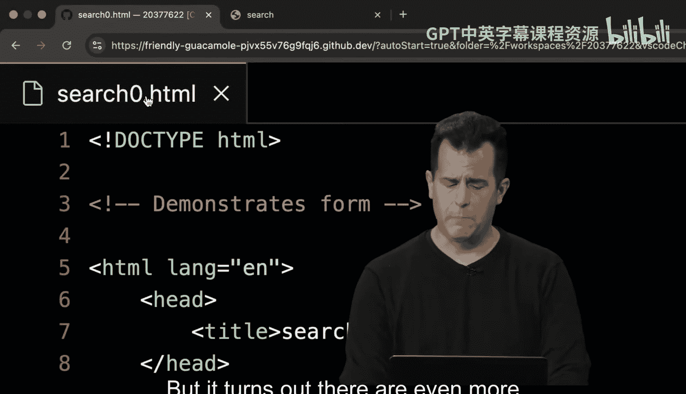

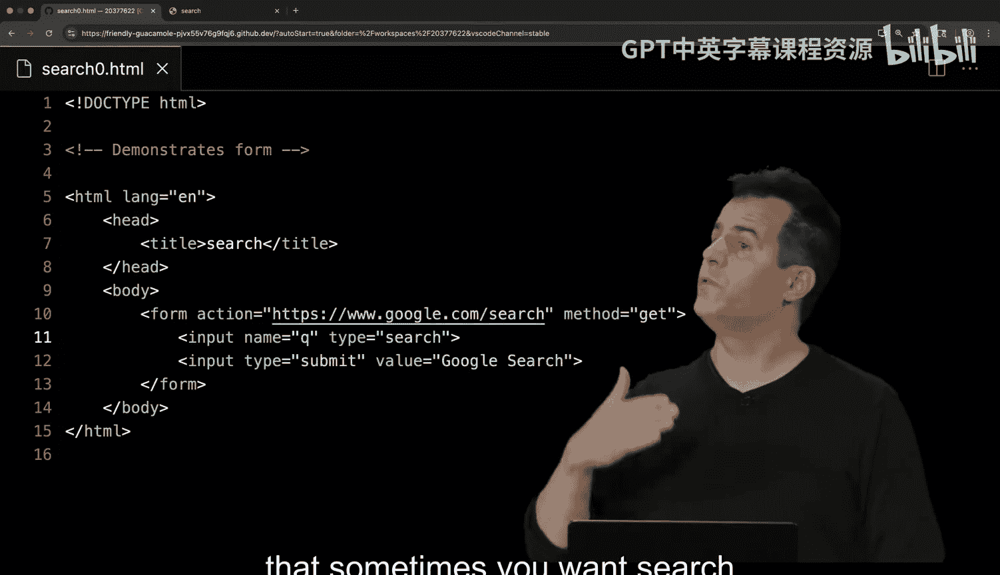

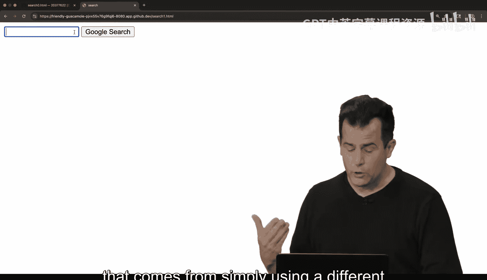

ht and you'll see a few more attributes on one of these inputs for my first input here。

 which notice still has a name of Q this time， though。

 a type of search notice that I've added a few other attributes as well autocomplete equals quote unquote off a moment ago you might have seen a little black pop over that indicated that I had previously searched for cats and so my browser was trying to autocompte my subsequent queries starting with C but this will turn that feature off Autofo。

 which doesn't actually need a value and therefore no equal sign after it indicates that I want the browser to automatically focus on this text box。

 which literally means move the cursor automatically into that text box so that force users to have to grab their mouse or trackpad and click on that specific text box。

 Meanwhile， placeholder is yet another attribute that the input tag supports which puts little gray out text inside of the text box before you start typing into it to help you know what it is you're supposed to type into that box So nothing。

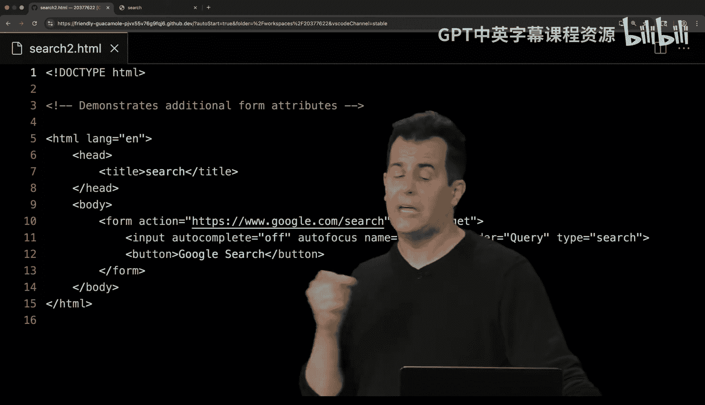

mentally gamechan here， but all of these minor enhancements that do ultimately I claim yield a better user experience or UX Let me go back to my other tab here。

 Let me go back to my directory index and this time open up search2 H and again fairly minor enhancements but creating a better experience for the users and therefore less friction for interacting with my site I can see query in gray which I can type over and type in cats the little X still pops up because this is a search box but notice as I start deleting cats or start typing something else that starts with C。

 I don't get the attempted autocomplete which might just mean there's less clutter on the screen it's a little more private for my users because subsequent users aren't going to see literally in the same text box at least what others have type so minor enhancements that nonetheless yield a better result and in fact it is just so common on so many websites nowadays not to have little refinements like these but it really is as easy as this with HTML alone to maybe add some attributes or change the value thereof。

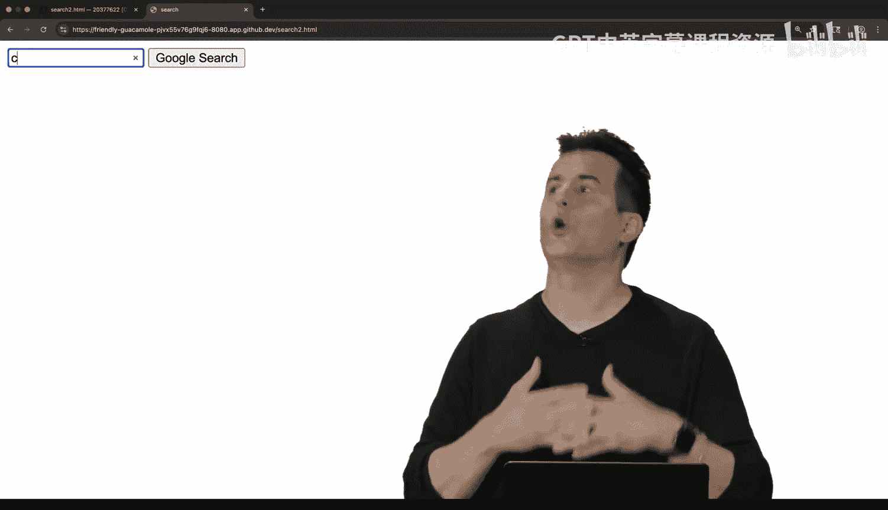

Just to improve the experience for your users and or say customers。😡。

Well what else can we do besides this Well， it turns out especially when collecting input from users。

 you can specify the format in which you want that data。

 for instance you might want a text box specifically to contain someone's email address which of course follows a standard format including at sign and maybe some dots you might also want to collect someone's phone number which in the United States might have some dashes or perhaps some parentheses or more formatting those digits Well it turns out in HTML and also in many other languages like Python like JavaScript and beyond you have support for what are called regular expressions which are quite simply patterns that you can validate against or in some cases even used to extract portions of information So there are admittedly a little advanced and the syntax is a little weird and take some practicing and frankly googling sometimes to remember what to do with them。

 but these regular expressions otherwise known as redJs support syntax like this if you want to depict a pattern。

😡。

That you want the browser to validate the user's input against you can do something like this。

 you can say dot， which means any old character， you don't care what， but at least a character there。

 you can say star after something like the dot which actually says zero or more of that previous thing or if you want at least one you can say dot plus which means one or more characters and not necessarily the same character。

 but just one or more characters again and again。 if you literally only want zero of those characters or one。

 you can use a question mark instead， if you know exactly how many characters you want。

 you can use curly braces in a regular expression and then a value n for number which specifies that you might want three or say four digits in some space specifically。

 or you can put a lower and upper bound on the same and there's yet other syntax2 with which you can express patterns like these mean。

 you can also express ranges of numbers that you want to allow or even letters as well inside of these square brackets so to speak。

 Meanwhile， you can specify ranges。😡。

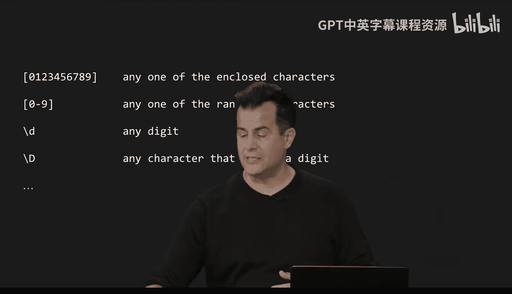

Of numbers， if you don't want to type out 0，1，2，3，4，5，6，7，8，9， you can do0。

 hyphen 9 to emphasize that range， or more succincly you can say backslash lowercase D。

 which means any decimal digit or backslash uppercase D。

 which means any character that is not a digit that is the opposite beyond this。

 you might didn't mind to do that。😡。

In fact， let's put some of these patterns to the test， let me go back here into VS code。😡。

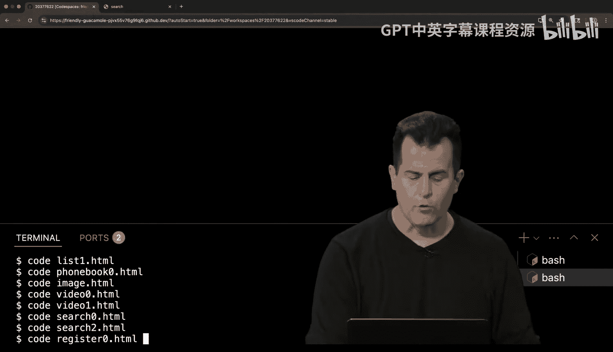

Let me close our previous search example and open my terminal， open up this time， say register 0。

 HTML and after closing my terminal， we have a relatively simple page here which contains again a form this time though it doesn't have an action or method because I don't actually care at the moment about submitting this form anywhere。

 but I do have an input tag here， autocomplete is off autofo is on the name of this text box shall be phone and the pattern to which the user's input must adhere is apparently this。

😡，And before I spell it out， consider what this might represent based on what we've seen。

Backslash lowercase D meant any digit 0 through9， curly braces 3 means give me three such digits。

 not necessarily the same， but any three digits， then give me literally a hyphen。

 then give me three more digits， not necessarily the same。 then give me literally a hyphen。

 then give me four digits。 And at least in the United States， this is one way of formatting a number。

 number， number， number， dash number， number， number， dash number， number， number number。

10 digits and total formatted exactly like this。 the rest of this line is familiar。

 If I scroll to the right here， the placeholder that I chose to give this particular input is just a visual cu to the user as to what format I expect。

 Meanwhile， below that， I have an alternative to an input element that had a type equals submit value。

 it turns out nowadays， you can also have button elements that don't even need a type equals submit attribute and value。

 If you intend for that button to be used in the same。

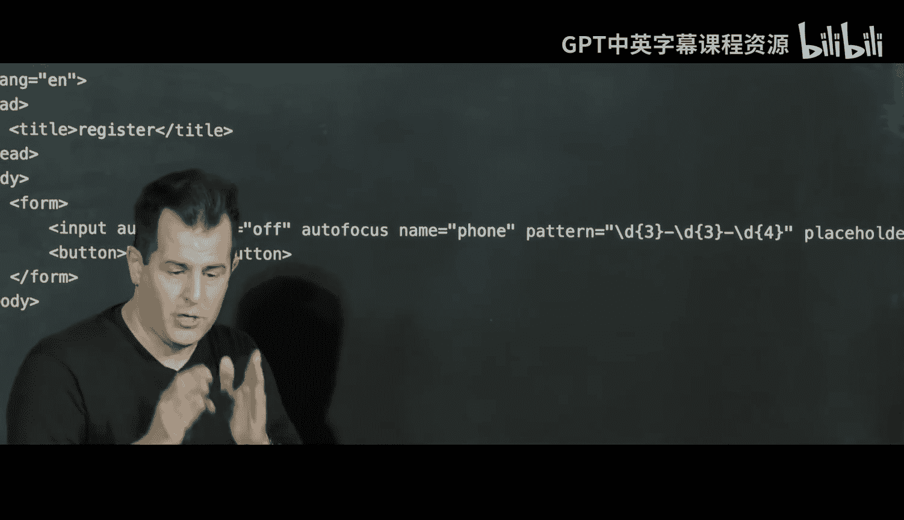

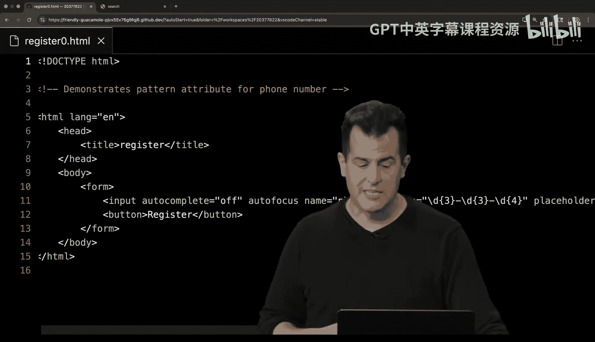

So the end result of this， if I now go back to my other browser tab。

 go back into my directory index and openre HTMLtm is a very similar form。

 but one that's prompting me to type in an actual number。

 but here's the rub if I don't cooperate here and type in a number in precisely that format and instead I do something silly and nonsensical like type in cat if I try now to submit this form。

 even though there's no action attributes so who knows where it's gonna go I click register my browser will admonish me the user saying please match the requested format。

 Now this is just referring back to of course the placeholder value I have here or I could maybe describe it somewhere else in the page but you're gaining a little bit of client side validation now as a result rather than relying on the user just to hopefully cooperate。

 the browser can at least to some extent enforce the same Now what if I contrast we wanted to collect not a phone number but an email address。

 well we can do that too， let me go back into VS code open my terminal， open up register。

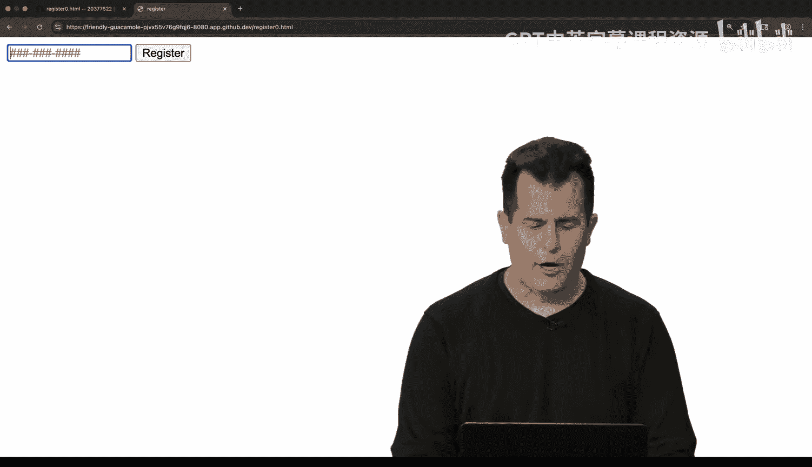

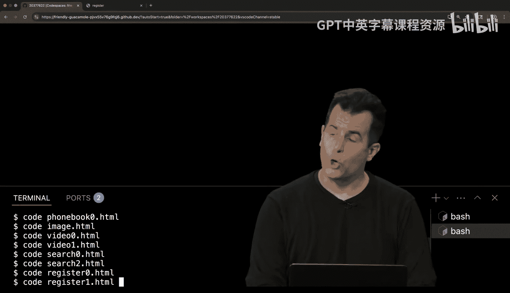

One dot HTMLtml and reveal this and this is a rough attempt at a pattern or regular expression for email addresses down here pattern equals quote unquote the following dot plus which means one or more character doesn't matter what character or characters but I need at least one character and maybe more then literally an at sign then dot plus which again means one or more characters。

 whatever they are， then in this case a backslash dot and this is a little weird but backslash is often used to escape characters that might otherwise have some special meaning So in this case backslash dot means no no no。

 I don't mean any one character which up until now that dot or period has represented。

 I mean literally a period right here a dot in the email address So this is a way of reversing the effects of having standardized on a dot representing sort of a wild card character when you want literally a dot you got to undo that meaning by using in this case a backslash and then。

plication here is that I only want to accept email addresses that end in do Edu。 Now。

 it turns out this is only a rough attempt at an email address validation。

 turns out email addresses are much more complicated than this and might actually have more characters to standardize。

 but this is a rough attempt at the same。 So in fact。

 if I go into this version in my other browser tab going back into my directory index and opening up register1 html and suppose I'm a little lazy and I just type mail in at Harvard and click register。

 well， there too， I'm gonna be admonished to match the requested format。

 which ideally I would spell out in a placeholder value or perhaps in some text elsewhere on the screen。

 Now it turns out I don't need to figure out what the pattern is for an email address。

 especially if it's so a common scenario。 So in fact， let me go back to BS code here。

 open my terminal and open the last version of register。

 register to htl and you'll see you don't even need sometimes to use patterns if they're just common paradigms that you want。

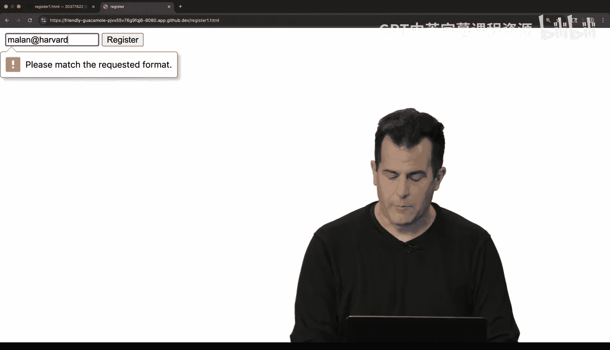

valalidate against I can just change the type of this input from text。

 say to email quote unquote now what does this give me well。

 it means that the browser will automatically use this regular expression which I dare say is incredibly hard to read and probably impossible to memorize but baked into browsers nowadays is this or similar regular expression it's more complicated and we'll spend time on here but this just kind of hintset how sophisticated email address validation can be and why it's in fact best than to leave it to the browser and not necessarily your own patterns that is not to say that regular expressions are not useful and powerful but you don't necessarily have to resort to them in fact when there's common cases like emails as well you can use some built in functionality。

😡。

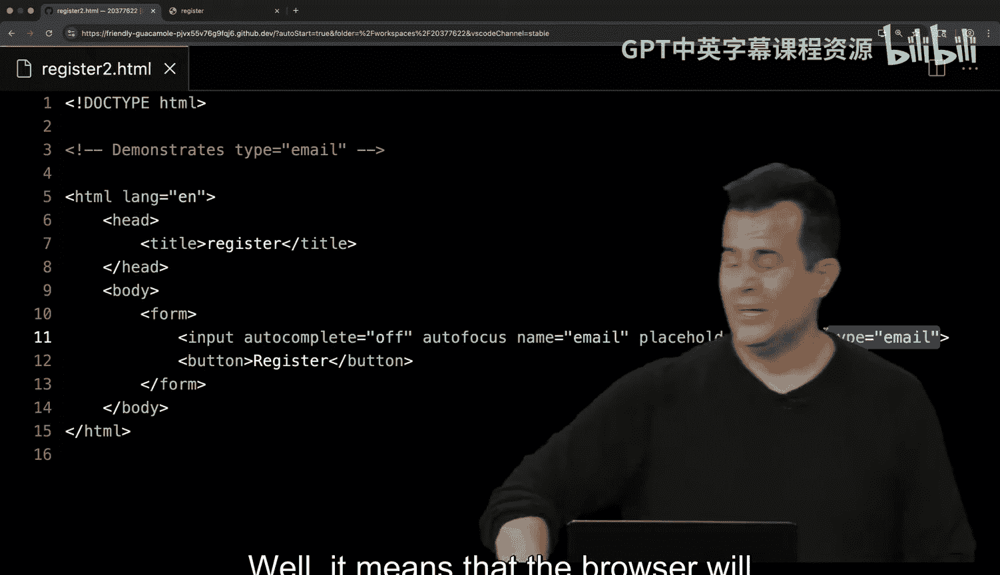

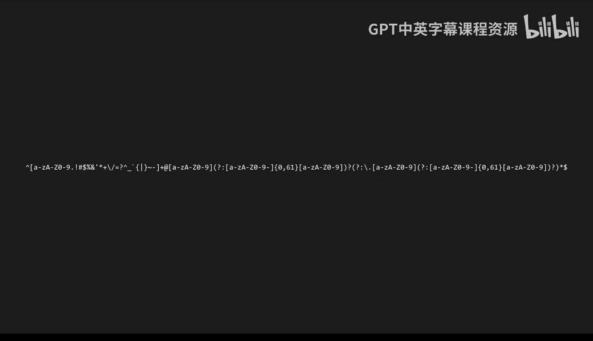

But there is a catch here。 And in fact， let me go back into register 1 H。

 which is requiring that I provide a specific format of email。

 I'm going to go ahead and reload the page just to clear out that form and point out that client side validation like I've been here preaching is really not sufficient。

 Why what have I done well it turns out that by adding these attributes to say the input tag I'm telling the browser that you should validate this against this pattern and prevent submission of the form。

 but the problem fundamentally with web pages is when a browser requests one from a server they download effectively the contents of that HTML into the browser's memory or RA where they maintain their own local copy or cache thereof at that point though all bets are off the user who has accessed that web page and has downloaded it effectively to their own Mac PC or phone is certainly free to change that HTML if they so choose and if they have the technical savvy。

 it's not all that hard to do so。

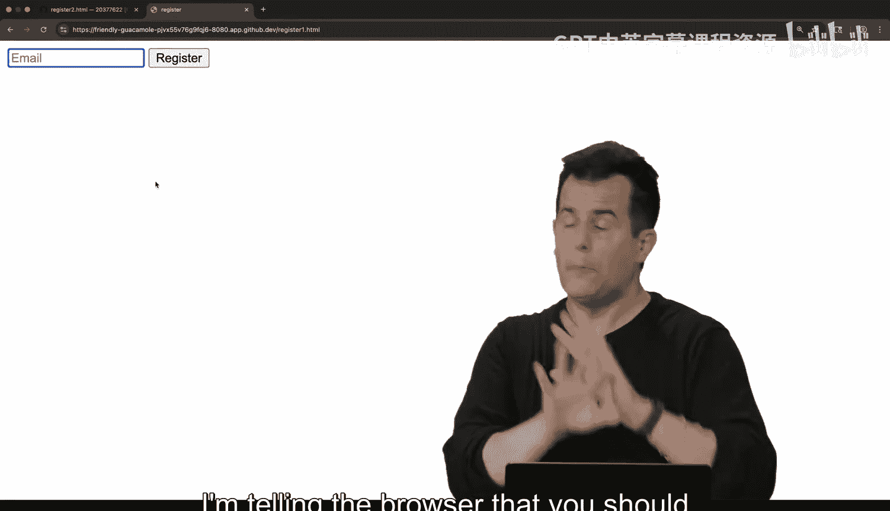

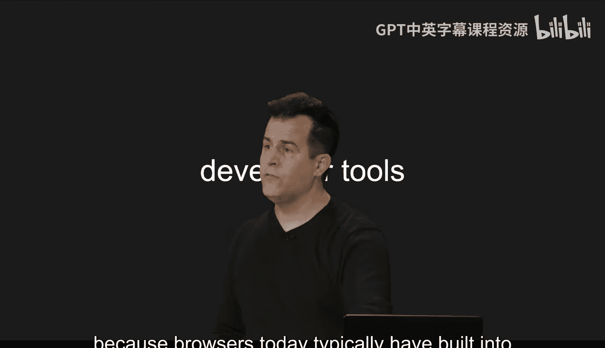

In fact， it's so easy because browsers today typically have。

Built into them what generally are called developer tools。

 That is features that you and I as typical users might not necessarily know about care about or use。

 but software developers， web developers might actually use these quite heavily So what do I mean Well。

 for instance， if I go back to Vs code here and open up my second tab after that where I have the register1 ht page。

 you might know already that you can do any number of things by rightcling or control clicking on a page。

 for instance， in this case， I'm using Chrome I can open up this context menu here and choose any number of menu options like view page source。

 which on your own browser might be called a little something different。

 Now this is just a view of the HTML that's been downloaded into the browser and in fact。

 you can do this on any web page if you go to New Yorktimes com or anything else on the web you can probably rightclick or control click somewhere on the page。

 not on a link， but maybe on some part of the background。

 find a menu options similar to view page source。😡。

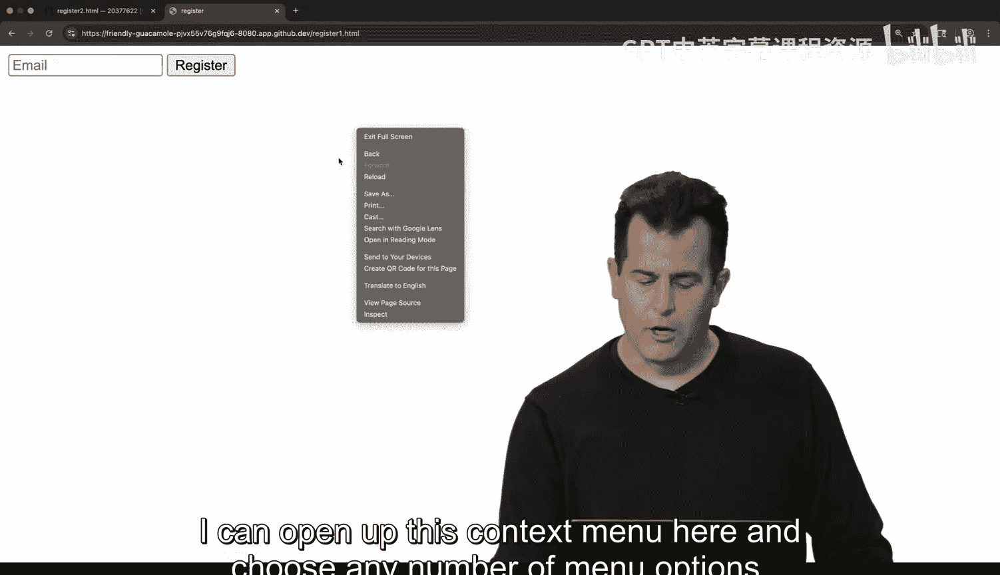

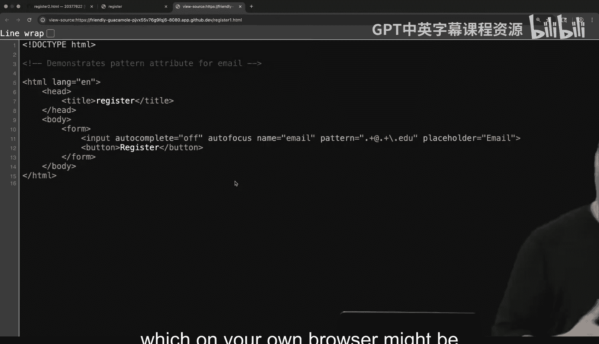

And see something quite like this and odds are if you actually go to a real website like New York Times。

 so the like you're going to see dozens， if not hundreds of lines of HTML and more that compose a much more sophisticated web page than mine。

 but this does in fact give me a view of the web page that at the moment is not editable。

 this is just a copy of my page that I've downloaded just if it's interesting to see。😡。

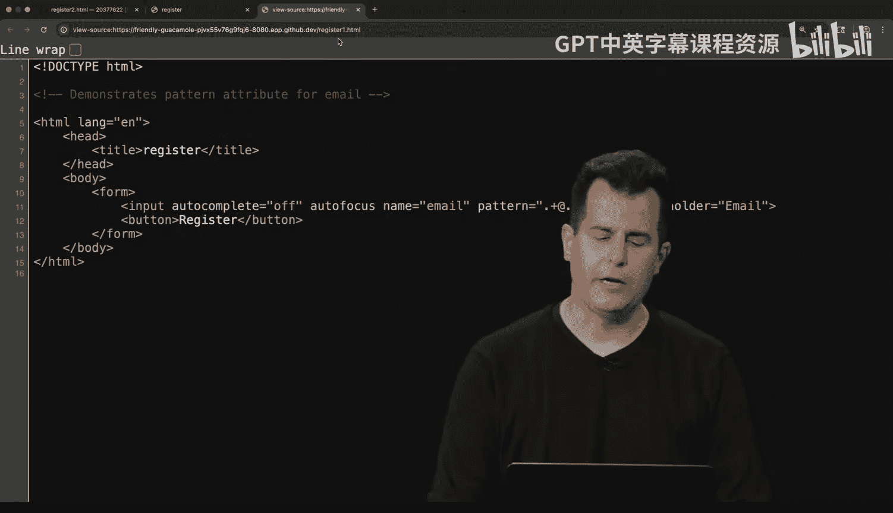

But notice too， if I close this view source， I right click or control click again on this register1 Ht web page and this time I go to inspect now I've opened up fullfledged developer tools where I have even more functionality at my disposal on the left-hand side here I can see all of the elements in this web page indeed under the elements tab and over there I have even more features that we might tinker with。

 Now these are all collapsed hierarchically just to make them more readable on the screen。

 let me go ahead and zoom in on the bottom left of my screen under elements and notice that I can expand the little triangle next to head and I can see oh what the title of the page is I can then expand the little triangle next to body and I can see what's in there a form which I can click on again and then see everything therein which is to say you can see what pattern is being used inside of the H that composes this page but I could change that or really anything else。

 let's do something innocuous。 let me go ahead and zoom out first and zoom in at the top and you'll notice that my register。

tabab is indeed called register why because in the title of this page at bottom left。

 if I zoom in again， the word inside of the title tag is indeed register。

 Well what if I want to do something a little malicious here or maybe just playful。

 I can actually click on this element here and change the text in between opentag closet title for instance if I want to really excitedly welcome the user。

 I'll added a single exclamation point and then save it。 And if I go back up to the tab here。

 you'll see that I've actually changed the title in this here tab All right well。

 that's not such a big deal， but recall that a moment ago。

 if I tried to register with something like mailin at Harvard which is not a valid address。

 the web page would not let me However， if I go down to the elements here and I click on this。

 I can if I want just highlight that pattern， delete it all together。

 save the new HTML and now that client side validation is completely gone which is to say。

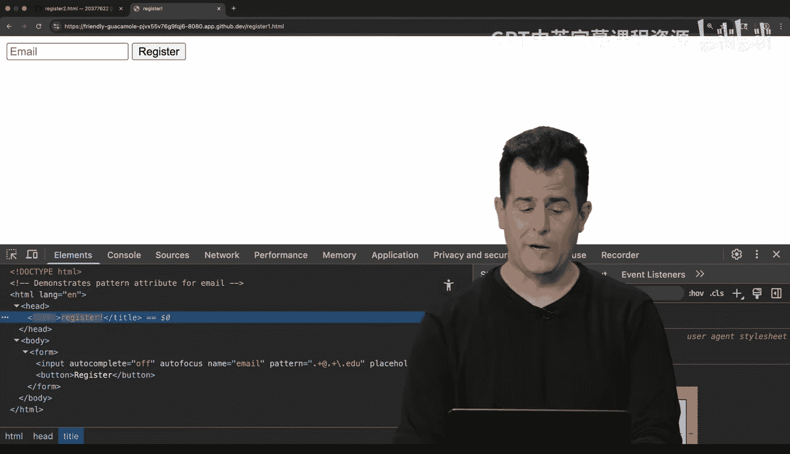

If I now click register I am not going to be warned by the browser now we won't really see an interesting effect here because again I don't have an action value so I'm not gonna to send this form to any interesting site。

 but if I were to click on the register button now it would not care what value I've typed in I could do mailland at Harvard I could use a co address netaduk address or anything else the pattern now is no longer in place now I could conversely make the form better and I could change the text here at the end and say type equals email and now the browser will enforce the email type。

 but no normal user is going to do this but malicious users might very well change your HTML within their browsers to circumvent these client side validations Now they're not hacking into your server because your HTML is still save somewhere safely in the cloud presumably on some server however again when a browser visits a website via URL it gets a copy of that HTML in its own memory。

😡。

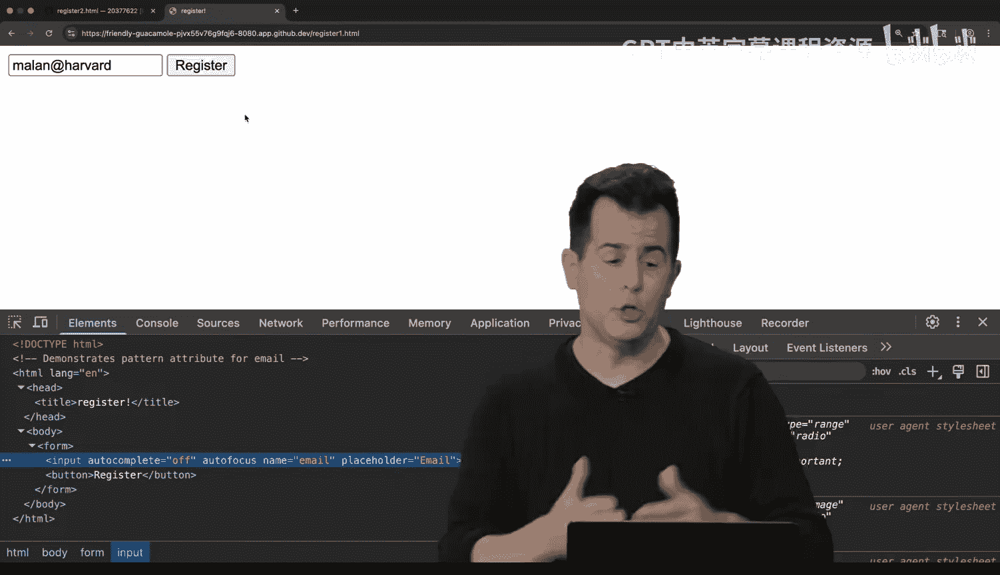

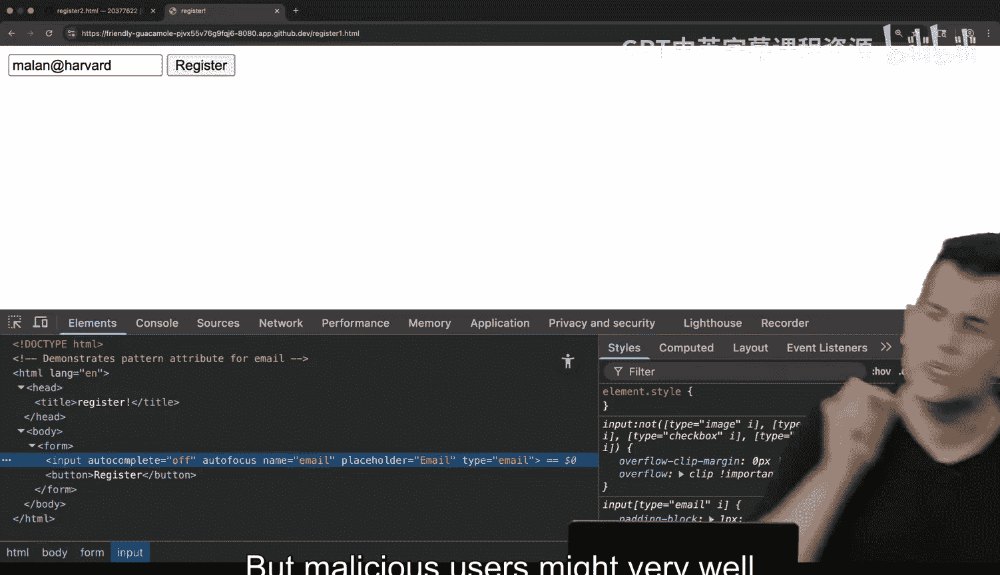

In fact， it's loaded into that tree structure that we described earlier as a Dom。

 but the browser and in turn the human controlling the browser can certainly tinker with that HTML if they want removing any of these validation。

 So on the one hand， these client side validations like these patterns wonderfully useful because the browser then can give immediate feedback to the user that theyve typed something wrong。

 thereby decreasing the probability that they're gonna to put invalid data or incomplete data into your server or database if they're submitting this form to you。

 The downside though， is that while it does improve the usability of the site。

 the user friendliness of the site。 it is not a sufficient defense against maliciousness。

 whereby a user could remove all of these things altogether。

 submit bogus invalid incomplete data for your server。

 and you're not going to be the wiser unless you have also implement it on your server using Python or some other server side language that receives that web form some other conditional checks or patterns。

Make sure that no data is going into our database unless it is validated here in duplicate serverside。

 so clientside validation is great for usability for user experience。

 but it is not good or sufficient for security， you'll still need serverside validation which might very well mean writing a bit of code in duplicate in some other language to do the same。

 though increasingly nowadays there are libraries， third-part code that someone has written that helps you generate validating code for both the client and the server。

😡。

In fact，One more tool that's worth knowing not only your own browser's tools， but this URL here。

 valididator。w3。 org is a simple but useful website into which you can actually copy and paste HTML that you've written in order to validate its correctness that is to say to make sure that all of your tags that have been open have been closed that all of the tags that you've written are in the right place and so forth it can't help you suss out security vulnerabilities like we discussed just a moment ago between client and serverside validation。

 but it can at least ensure that your HTML is correct as written and not therefore syntactically invalid in some way。

😡。

But with HTML alone， all we have is the ability to structure our data and web pages into the head。

 to the body and everything theyin to actually now begin to stylize things by changing formatting and font sizes and colors and more we need to yet another language which we'll soon see is called CSS for cascading style sheets。

 let's take a short break though in return with this second of our three languages today。😡。

T。Allright， so CSS cascading style sheets， another language that also is not a programming language inof far as we're not going to see loops and conditionals and the like as before。

 but it's the language we're going to use to stylize our webpage So htl hypertex markup language gives us the structure of the page and the layout CSS takes things the final mile so to speak and stylizes the fonts and the spacings and all of that So how can we use this well let's deploy it first to make a very simple homepage。

 for instance， for someone like John Harvard and I mean very simple but we'll progressively make it a little better and better focusing ultimately though not on the features of css but the fundamental ideas underlying it So let me go back into VS code here。

 let me close my developer tools from before go back into VS code itself close register to html where we left off open my terminal and starting fresh in my terminal let's go ahead and code up a new file called home html to represent a homep page for John Harvard this first one I'll do manually as before。

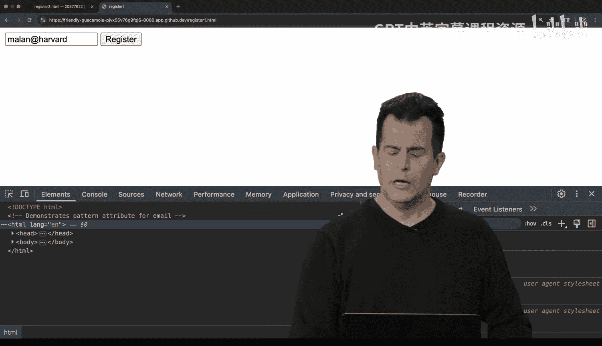

And what I think I'm going prepare is something that looks like this。 First。

 let me go ahead and close my terminal and my file explorer focusing entirely on home do H Open bracket exclamation point doc type HTMLm my document type declaration which again just reminds the browser that we're using HTML version 5 then below that open bracket H。

 the language of this page shall again be English notice that VS code is autocomplet that first thought the head of this web page is going contain a title。

 the title of this page shall quite simply for now be home and then below the head I'll start my body and inside of the body of this page。

 let's do sort of three paragraphs of textkeing things simple。

 maybe a header of the page that's just gonna have John Harvard's name so let's do open bracket P for paragraph then let's go ahead and inside of that put John Harvard's name below that let's create another paragraph so that the middle of the page says something friendly like welcome to my home page then below that a third and final paragraph a footer of sorts for the page。

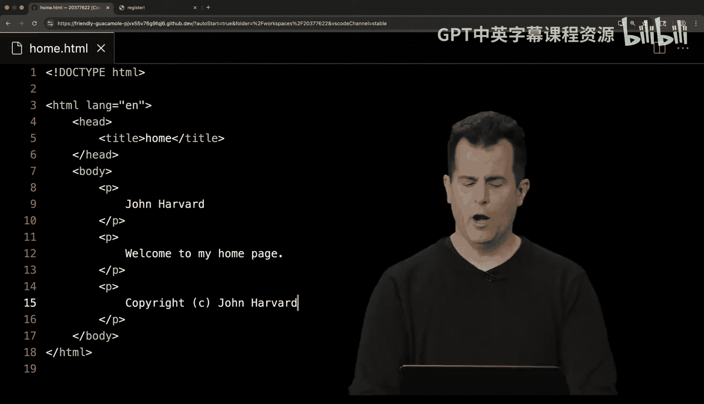

That says something like copyright， and then we'll put a little C symbol and parentheses。

 John Harvard。 All right， so a very simple web page， not that much to it。

 let's go back to my second browser tab and go back to my directory listing。

 Let me in here go to home Html。 and you'll see a very simple page with three paragraphs。

 if you will， but they're not really paragraphs of text。 It's really three chunks of text。

 three regions of the page。 but let's start to make them a little interesting like maybe I should have the top of the page。

 John Harvard be a large fonts because it is， after all his homep page and I'd like to center it maybe the welcome to my home page could be a little smaller。

 So like medium size text and also centered and then the footer， which is less interesting。

 We should probably make that a little smaller if centered as well。

 So let me go back into home do Hl。 and thus far， we haven't really seen mechanisms for styling the page。

 We did see our heading tags H1 through H6 but that was just sort of big and bold on down。

 but we can be more。

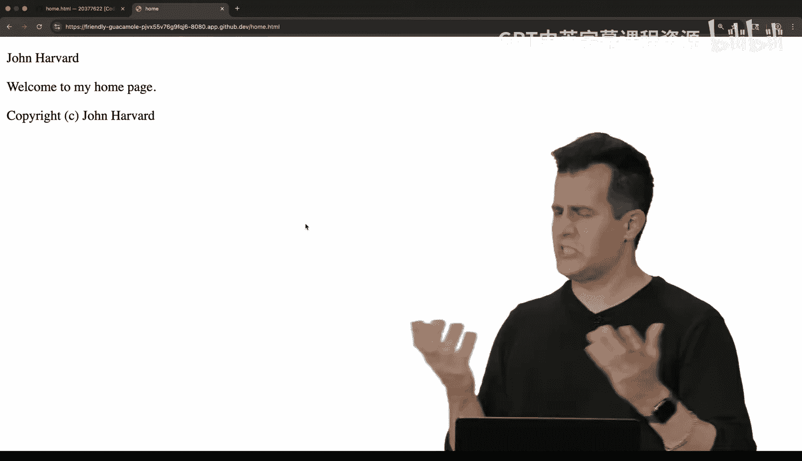

Fine now， much like a word processor， like Microsoft Word or Google Docs。

 we can be much more specific with our aesthetics。 And in fact。

 I'm going to do this as follows with CS。 CS is a language that essentially consists of properties and properties。

 Fun enough， are just key value pairs by yet another name in H。

 We have attributes and their values in CS。 we have properties and their values。 Now。

 there's other way there are multiple sorry。

Now， there are multiple ways to specify what properties you would like to apply。😡。

Sorry。Now there are multiple ways to specify what tags you want to apply properties to and we'll see now a few examples thereof specifically by introducing a style attribute to my HTML let's go back to VS code here and go into the first of those paragraphs and if I want John Harvard's name to be in a large font and centered here's how I can do that I can add to my paragraph tag a style attribute with style equals quote unquote and I'll finish the thought first and then move my cursor therein and say font dash size。

 colon large semicolon then after that I'll say text dash align colon center semicolon now strictly speaking。

 the second of those semicolonons is not necessary。

 you just need it to separate one property from another but for symmetry。

 I'll use it in both places Meanwhile let's notice the format here we have a key and a value separated by a colon we then after a semicolon have another key and value here though。

😡。

We do have some hyphens， whereas we didn't have that in the HTML attributes。

 at least among those that we saw， I don't want to say that。😡，啊。Let's see。

Try to remind fontine large。 F is called large。And then we have a second text line colon center。

 So in this case， we have two key value pairs。 That is to say two properties associated with this particular paragraph tag。

 Now， let's go ahead and do something similar but different for the second of these paragraphs。

 Let's add a style。Let's add a style attribute here。 this time， say font size medium， semicolon。

 but text align colon center and semicolon。 then down here on the last of these paragraph tags。

 let's add another style attribute here， font dash size colon small semicolon text align colon center quote unquote Now what is large medium and small。

 Well in this case it's left to the browser to interpret those relative to each other。

 but I could with CSs use other units of measure。 I could use pixels for dots on the screen。

 or I can use points with which you might be familiar in a typical word processing program。

 but to keep this a little bit simpler， I'm just gonna simply genericize things as large medium and small and let the browser decide what it means by each of those values。

 Notice though that I've text aligned in the center all three of these paragraphs。

 So let's take a look in my other tab now if I go back into home do hl and click reload because again。

 I've made changes on the server but my browser doesn't yet have a copy of those changes but will。

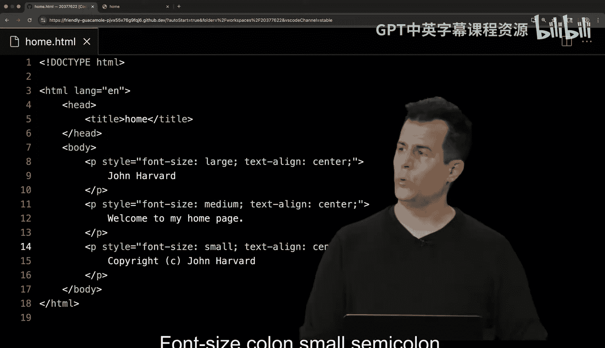

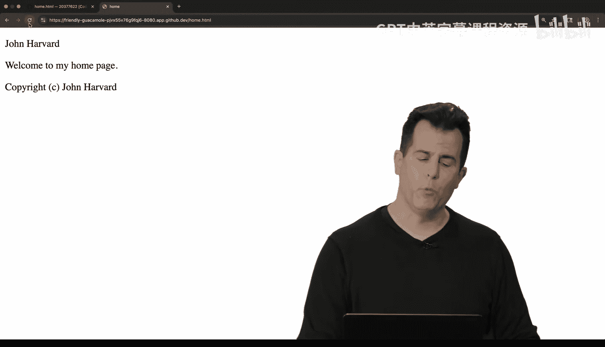

When I reload， now I have in the center of the page everything。

 including a slightly larger John Harvard， a medium welcome to my homep page。

 and then a smaller copyright down at the bottom。😡。

Allright， so what more can I do here。 Well， a minor refinement first。

 It turns out that I don't have to mimic the idea of a copyright symbol。

 It turns out that I could type that somehow on my keyboard。

 but even if I can't on some my US English keyboard here very easily turns out HTMLl also supports as an aside what arere called entities which are numeric codes that represent certain symbols that might otherwise be difficult to type on a keyboard。

 unless you copy and paste them from some other resource or use some menu that provides them。

 So in fact， I'm gonna go ahead and just as a minor change here。

 change this copyright symbol to be this pattern of characters。 Ampersand hash symbol 169 semicolon。

 thereby giving this page， what's called an Hl entity VS code just to be user friendly as color coding it that is syntax highlighting it to stand out from everything else。

 but that pattern， Ampersand hash 16，9 semicolon。 it turns out if I go back to this page here。

 and now notice focusing your eyes on that lower line Now it's a proper。

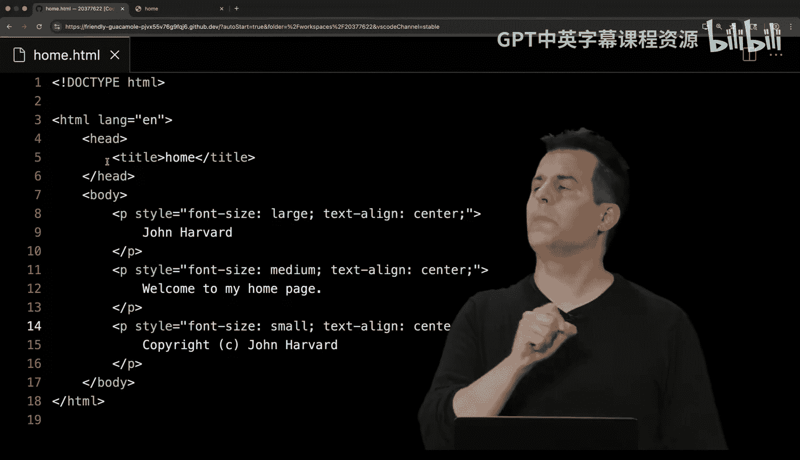

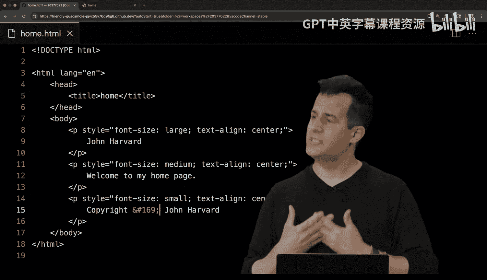

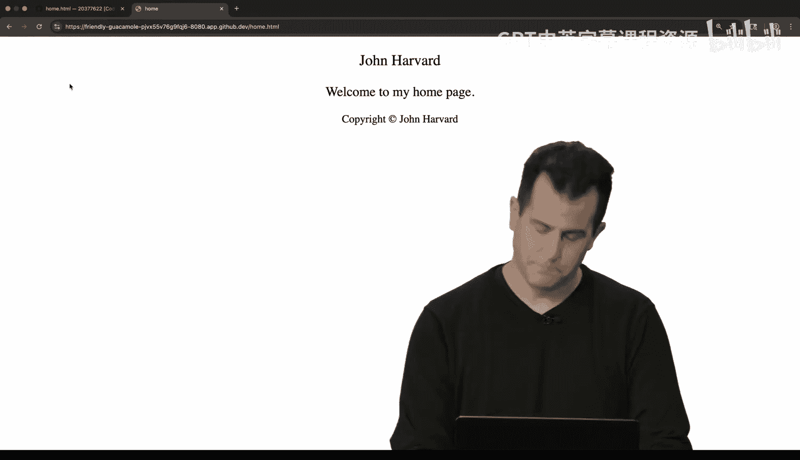

Copyright symbol that I've reloaded the page。 All right， as an aside， though。

 would that aside behind。

They can。That aside aside， let's now consider the structure of this actual web page。

 I don't really like semantically that I went with these P tags or paragraphs because these aren't really paragraphs of text。

 It's again， just sort of three regions of text Well it turns out there are more generic tags that you might use when you want to convey to the browser that yes you want to different chunk of text here。

 but it's not necessarily a paragraph and say the English grammatical sense。

 So what I'm going to do here is make a change to home html。

 and I' going change all of my p tags to div tags instead where div stands for division thereby giving me a different division or region of the page。

 So I'm going open and close each of those div tags accordingly but make no other changes In fact。

 if I go back to home html and reload at this point willll see that actually some of that white space has gone away because to be helpful。

 the browser has assumed that if you do have paragraphs of text like in a book or a paper you probably do want a little bit of that white space between them。

 but in this case， if you just got three。

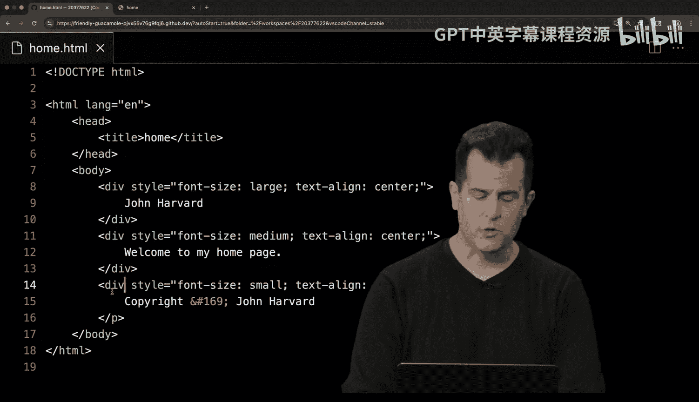

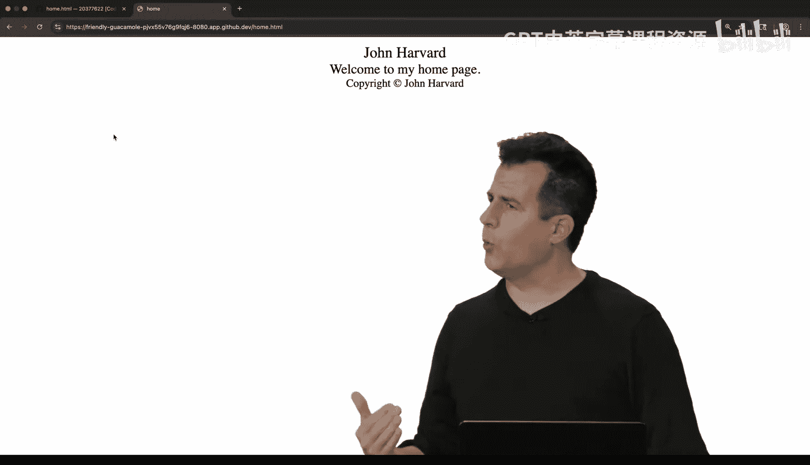

Visions of the page。 It's probably sufficient just to sandwich them together and leave it to me using Css to maybe add more padding or margins。

 so to speak， down the line。 But let's consider for a moment。

What is poorly designed about what I've done here thus far。

 I think this is an improvement to step forward to move away from paragraphs。

 which they weren't really to these divisions of the page。

 But notice that there's a bit of redundancy。 And if you think back to our time with something like Python。

 we generally try to avoid repeating ourselves for any number of reasons not the least of which was accidental mistakes that might get copied and pasted or just making more time consumings to make changes later。

 if we have to do it in multiple spots。 Now， I don't like the fact that I'm seeing text align center。

 text align center， text align center three times at least with font size。

 it was changing the value each time。 but can we maybe factor that out somehow。 Well。

 here's the C in CS Cascading style sheet essentially alludes to the capability with CS for styles or property specifically to cascade down onto children and grandchildren and descendant elements more generally。

 wouldn't it be nice then to maybe factor out text align center to the parent of all three of these。

Simping div elements by moving it to body。 And that I can do。

 So let me go back to my editor here and let me for the moment。

 go ahead and delete all of this text aligned center from the first of those elements。

 from the second of these elements and from the third of these elements。

 And I can keep or delete the semicolon at this point。

 there's only one property in each of those quoted values。 So they're not strictly necessary。

 but I can now go back and add to the body tag a new style attribute。

 quote unquote text aligned colon center here and inof far is body is the parent of div div and div。

 That style will cascade down onto each of those descendant and ensure that all of them will be centered。

 In fact， let's go back to my other browser tab。 Let me click reload and a bit underwhelmly。

 nothing seems to have changed。 but I would argue that not only is this just as correct。

 It is now better designed because I have factored out that commonality。 I can now change it in one。

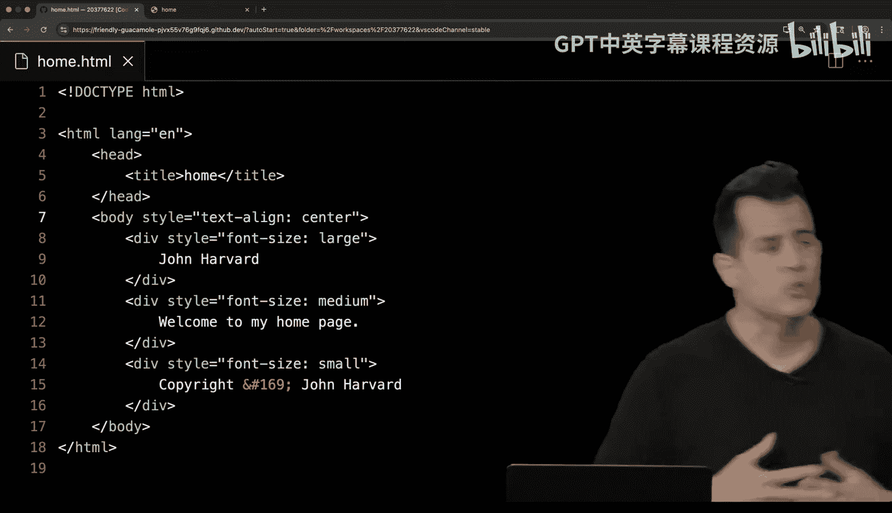

If I want to change center to left or to right I can in one place。

 I don't have to worry about copy paste or unnecessary characters in their file。😡。

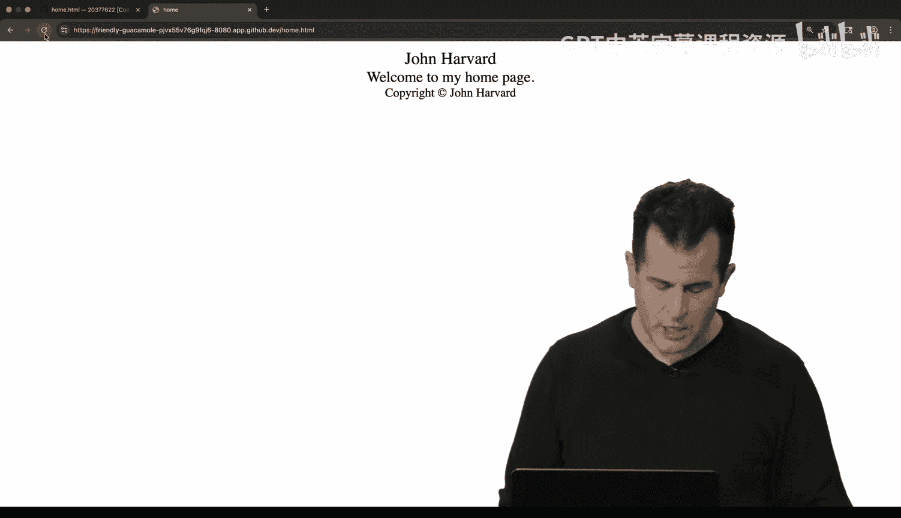

Al right， well， what more can I do next。 Well， it turns out that this isn't necessarily the best practice to put your CS inside of your Hl and commingle it in this way。

 It' just often frowned upon from a design perspective。

 if only because it means that now I cannot maybe separate these concerns。 I， for instance。

 one employee can't work on the H and have another employee。

 colleague of mine who's maybe more artistically inclined work on the CS。

 because everything's very commingled in the same file， which tends not to yield good results。

 at least if you're working exactly in parallel。 So what if we could factor out further all of this CS maybe to some common location that's separated from the actual H。

 Now I'll do this。 But here in technology， it's actually turns out that with some context of code。

 it's actually not all that uncommon to commingle CS and Hl in this way。

 particularly when making apps。 So these are different design paradigms and we'll see both of these ways here we've combined them。

 but。

Let's move towards something separate。 Let me go ahead now and delete all of these style attributes that I've created thus far。

And。Move all of those properties to a different location altogether。 In fact， look at the H now。

 it looks much tighter。 It's much more obvious that we have div div and the contents thereof。

 Let's put those same properties elsewhere。 And this is gonna be my first opportunity to go back into the head of the web page。

 And in addition to the title now add not a style attribute， but a fullfledged style tag。

 open and close。 And inside of that open and closed tag。

 what I'm going do now is specify using some css selectors。

 the names of some elements or perhaps other designations that allow me to associate properties with specific tags later in the Hm。

 For instance， if I want to apply one or more properties to the body。

 I'm going to type inside of this style， open and close tag。

 the word body followed by an open curly brace， which VS code is going autocomplete for me。

 and I'm gonna go ahead and hit enter just to move it to a new line。

 and then inside of those curly braces。 I'm going do something like this text。

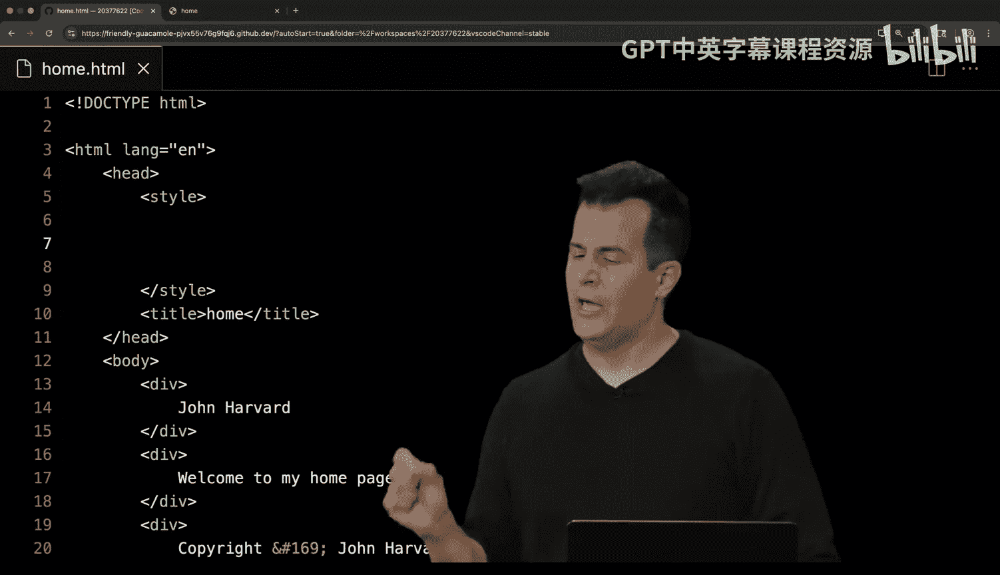

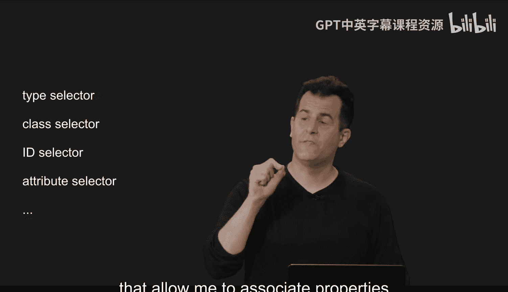

A line colon center。 Meanwhile， I'm going to specify how I want to style those other divs。 Now。

 I could say something like this。 div open curly brace。

 and then inside of this say something like font size colon。 but wait a minute。 I have three divs。

 and I want some of them one of them to be large， one of them to be small and the other one to be medium。

 So at this point， it's not sufficient to use the so-called type selector， the type of the element。

 the name of the element， div in this case， to associate properties with it because this property would associate with all of those same divs。

 So I need to be a little more specific。 So what I can do is actually use an Id selector instead。

 In other words， I can invent a word that makes sense to me。 and I can say something like this。

 hash header。 and then specify that the header of this page。 So' have a font size of large。

 and then down here I might say hash footer。 and then inside of its curly braces。

 I might say the font size there is small。

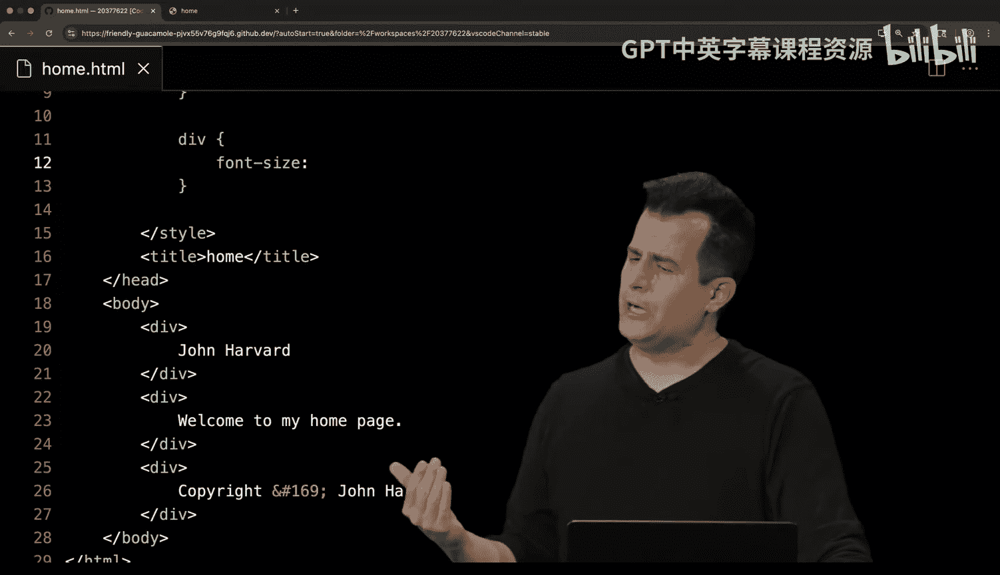

Now I can use these identifiers in my HTML as follows。

 I can go into this div and add not a style attribute。

 but a new attribute called ID and give this div a unique I of header and I can give this last div a unique I of footer and while I could give this middle div a unique I of its own because it's in the middle and it's just medium text。

 I could also be a little clever here。 and I could just say you know what by default the font size for this web page shall be medium unless some other selector overrides that default value。

 so now let's scroll down and see that I'm using header and footer in just one place each and indeed that's the definition of an I it must be a unique I used just once in your HTML but in this way I think I've associated one or more properties with the header and footer respectively as well as with the body more generally So let's take a look let's go back into our other tab which currently looks like this but when I re。

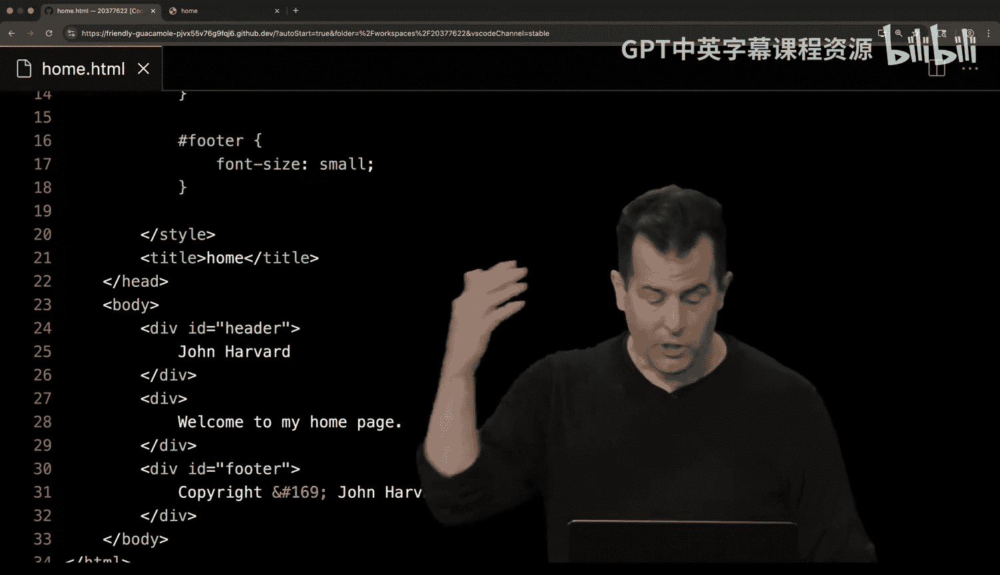

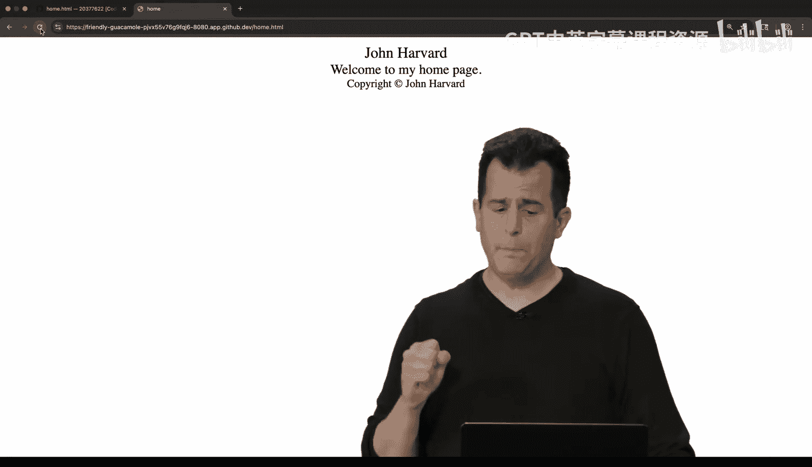

All of those changes。 it looks exactly the same。 So we have just another way now of designing this。

 even though it appears unchanged visually。 but here's two where we can tinker with some of those same developer tools on this web page。

 let me right click or control click choose inspect to open up developer tools and you'll see at bottom left the head of the web page。

 the style tag therein and if I scroll down。 I can see the body of the web page and all three of my divs notice though at right。

 which is convenient now， I see in this same elements tab， not just the HTMLm。

 but also the CSss properties that apply to that element。 In fact。

 notice here a mention of body and a mention of font sizeized medium and text align center。

 that means that because I'm hovering over the body element right now this property indeed applies accordingly to give it those two property values。

 Meanwhile， there's something italicize down here， which is browser specific。

 my browser is telling me that by default， it's going have a margin of8 pixels around the body of the page and。

display everything in block form。 but more on that another time。 Meanwhile。

 there's some placeholder here where I could manually add some styles。 and in fact， just for fun。

 this is where you don't necessarily have to go back and forth and back and forth between VS code in your browser tab。

 you could start tinkering with other elements here。 For instance。

 I could change the color of this page to be red just by adding a color colon red property and my browser Chrome in this case is giving me a little square to make clear to me what red actually means and notice that the web page actually change。

 but I'm not changing it on the server again， just like when we tinkered with developer tools to tinker with the patterns and regular expressions。

 if I reload this page， I'm gonna get the same original HTML and all of those temporary modifications went away。

 So again， this is developer tools in the sense that it's useful for me the developer maybe just to do some rapid prototyping and changes and see those results。

 But notice what I can also do here is if I go into the body here highlight the header。

 you'll see that not only does the body。

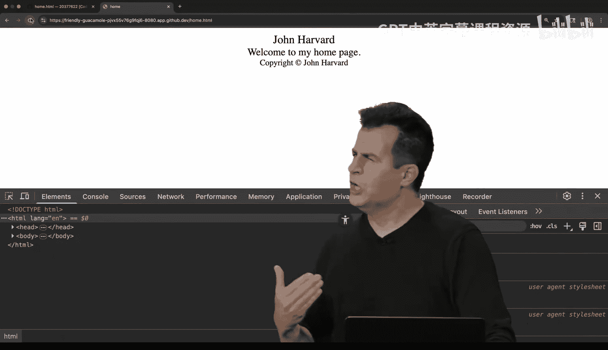

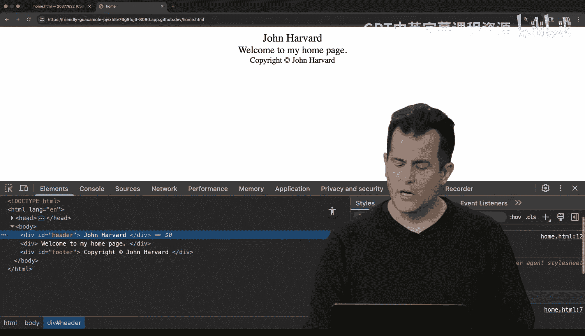

Feature get inherited。 It will specify for you in developer tools that the font size medium is no longer applicable。

 It's been struck through why because higher up， we have an Id selector。

 hash header that indicates indeed that the none no no， the font size should actually be large。

 But notice what happens if subtly in the page。 This checkbox。

 it's just part of these developer tools。 If I want to see what the page looks like if I turn off font size large。

 notice you can click on that and watch the top of the page， John Har's name just got smaller。

 That is it became medium。 if I check it again， it becomes large as well。 So in short。

 underneath the hood of your browser up until now have been some very powerful features。

 And if you choose to explore more Htl and now Css。

 there's a lot of ways to do this within your own browser and even see how other web page is yours。

 maybe your competition's web page is implemented by just understanding the layout and values for their Htl CsS and more。

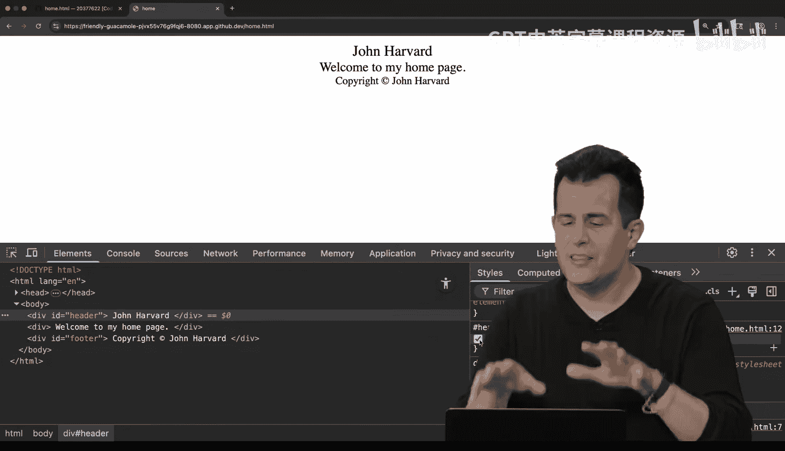

All right， Well， what more can we do here， Well， it turns out that we don't necessarily need to invent these Is ourselves。

 It turns out increasingly that the web is becoming more and more semantic。

 That is to say within the newest version of H Tm L。

 There are more and more tags that themselves have meaning。

 So we're beginning to move away from using divs and divs and divs。

 And there's a similar tag called span， which doesn doesn't give you a division of the page。

 but a smaller span。 thereof。

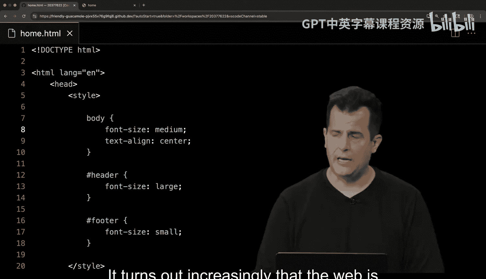

Ds can be replaced in this case with tags that have more meaning to the browsers themselves。

 And you can't invent your own words necessarily。 But there are。

 And if you read the documentation for Hml， any website， take a course or read a book。

 you'll find that there are many more tags than we're even seeing here today。 What I can do， in fact。

 is this。 let me move away from using these Id selectors And instead change this first div to literally a header tag。

 which is not my prerogative per se， but it does， in fact exist。 So that's why I can do this。

 Meanwhile， I can change this div down here to be footer and down here， I can close the same tag。

 Now， I could leave this middle element as a div。 But turns out there's another one that might be more appropriate。

 namely， it's called main。 So now I have semantically three areas of my page。 The header。

 the main part in the footer。 Now why is this useful。 Well。

 for something called Seo search engine optimization。

 it's probably useful to inform the Googles and the bings and the others of the world that when it comes to crawling this web page that is。

Downloading it automatically and loading it into their database so that other users can search for it subsequently。

 It's probably useful to tell them that， hey， these words here are part of the header of the page。

 which is probably important。 It's probably what you want to see in the search results as a preview。

 the main part of the page is where the really juicy content is and the footer probably is less important and so maybe we don't have to worry about searching over the footer as well this might be useful for screen readers as well for accessibility if someone with a screen reader wanted the software to recite verbally the contents of the page。

 it can probably forego the footer， at least initially and maybe even the header focusing on the main part of the page or other semantic clues like that。

 So just as with the alt tag we have now semantic the alt attribute we have semantic tags that you would know from reading documentation for HTML that just are better and better not only for users but also the crawlers。

 the search engines out there that try to make sense of what's herein So how do I change this why I can go back to a socalled type selector and instead of using the hash symbol。

 which is。

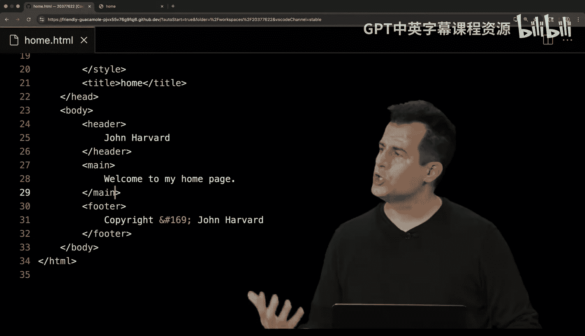

Shorthand notation for unique ID， I can change this to literally footer and literally header and heck if I want now I can add a main clause for my main for my main element saying something like font size。

 medium if I choose not to instead have it cascade from the body on down across everything so that's just yet another way to do this and I'm sure we could come up with infinitely many others as well。

😡。

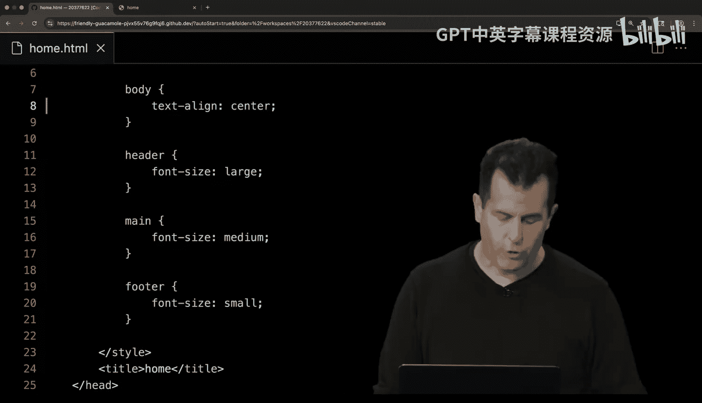

Now， there's just one catch with this approach too。

 is that we've seen this far now type selectors where we're specifying in our Css the names of our tags。

 We've seen Id selectors。 And it turns out there's something where you can select based on attributes and their values。

 but will focus lastly for now on class selectors instead The downside of the approach I've taken here is that these attributes。

 text align and font size apply only to these tags or previously only to those unique identifiers。

 What if though I wanted to have reusable sets of properties that I can use in34。

300 locations in my page or website。 Well， I can define classes instead myself。

 So how might I do this。 Well let me go ahead and delete all of these properties and start fresh inside of this style elements。

 If I want to create a set of properties that generally will center my text。

 I can use a dot which means in this case， I can specify。😊。

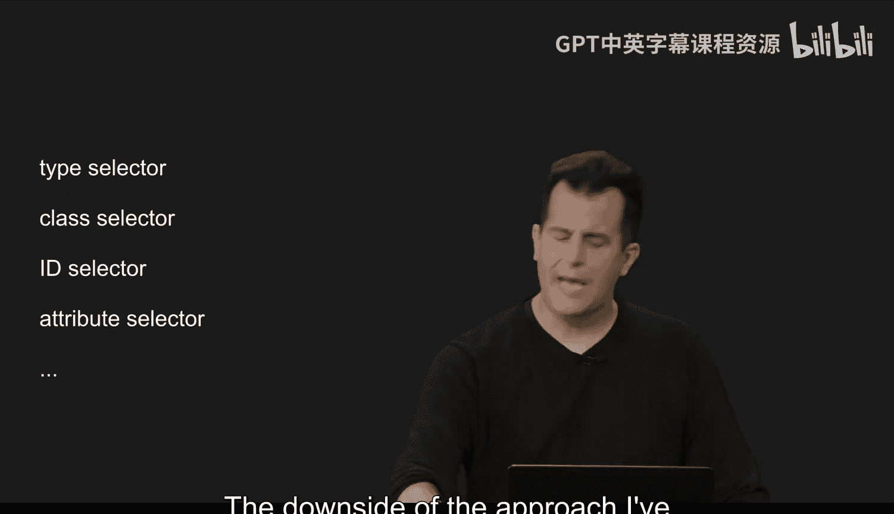

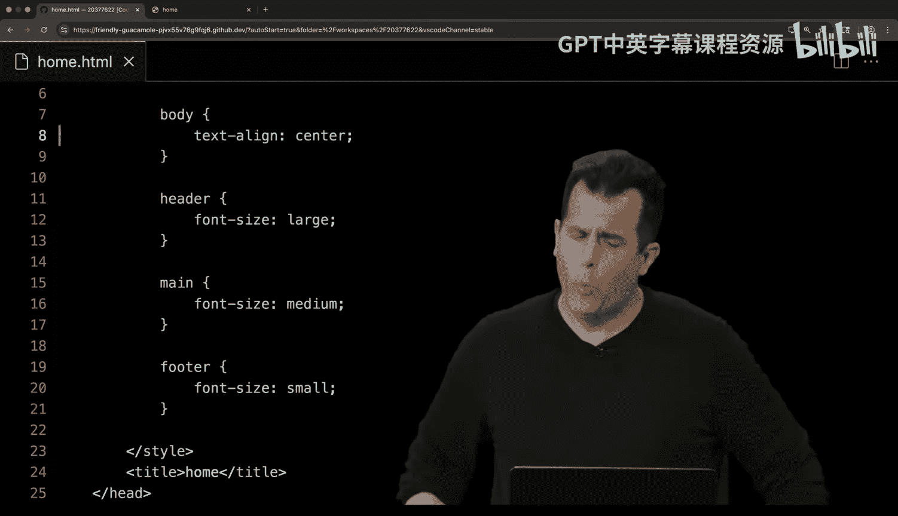

The name of a class。 so to speak， inside of that， I can specify the one or more properties that mean centered in my mind。

 So I'll say text align colon center Now below that， I might define another class called large。

 So that too starts with a dot that dot just means hey browser here comes a class name。

 And then inside of these curly braces， I can say something like font size colon large。

 then I might do say dot medium inside of there font size， colon medium below that。

 I might do dot small， and inside of that font size colon small。

 The only difference here fundamentally is that now I have created reusable classes。

 descriptions that I can use in multiple places on multiple tags without having to worry that the tag is itself unique as was required for an I selector。

 So if I scroll down here。

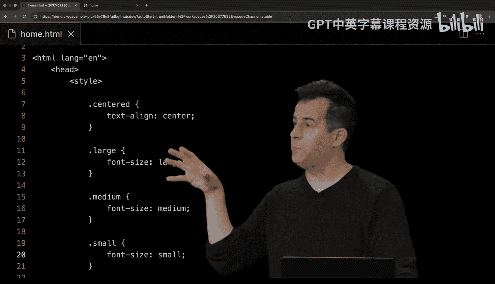

What I can now do is say， all right， if I want the header to be large， I can add that class。

 and I can say class equals large down here on main。 I can say class equals quote unquote。

 medium down here。 I can say class equals quote unquote， small for the footer。 Moreover。

 if I want to center all of those elements to， I can actually put two class names inside of the quote separated by a space。

 For instance， I can say centered small。 I can say centered meet。I can say。I can say centered medium。

 and I can say centered large or conversely， I can say large centered， mediumcented， smallcented。

 The order doesn't matter。 But in this case， I've used the common word first。 Now。

 this at a glance might already strike you as suboptimal why。

 because I'm repeating myself seemingly unnecessary。

 So let me actually undo that and delete all mentions of centered and go with where your mind's probably going。

 which is to factor that out to， put it on the body and say class equals quote unquote centered。

 and that will have the effect of now centering the entire body of the page。

 If I now go back to my second tab。 I'll close developer tools at this point and just reload the page。

 we should be exactly the same visual but underneath the hood。

 I've created now some classes that are reusable。 But the reusable at the moment only within this file。

 I think we can take this one step further and indeed enable collaboration across colleagues and company as follows。

 Let me go back into V S code。

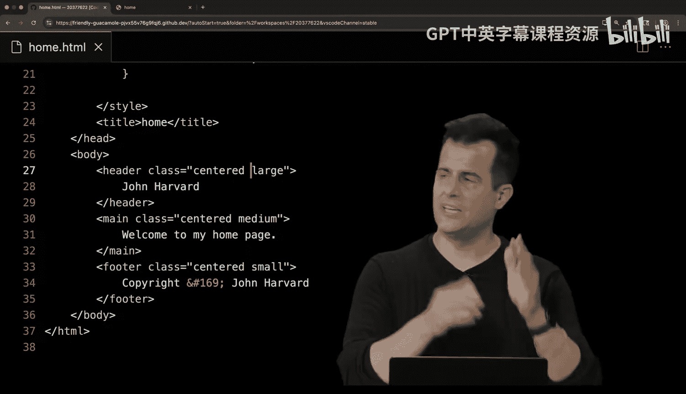

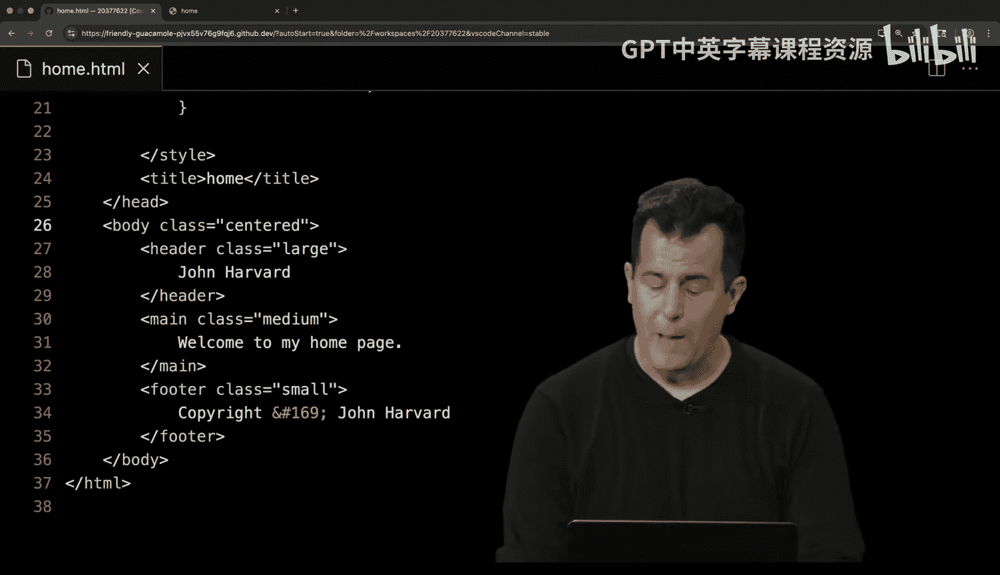

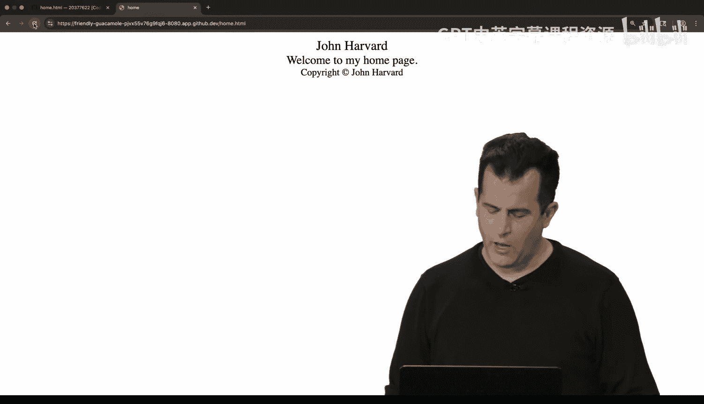

Let me scroll up here to my style element， let me highlight and cut that is remove all of that content including the style tags themselves。

 Let me open my terminal window and code a file called home do css This time the file extension do CSsS indicates that the contents of this file are going to be stylizations that is properties let me go ahead and open that file。

 close my terminal， paste what I just cut let me go ahead and highlight it and just deindent it so that all I have in home do css is exactly the same css as before。

 but it's all left aligned aligned and just nicely displayed in this file。😡。

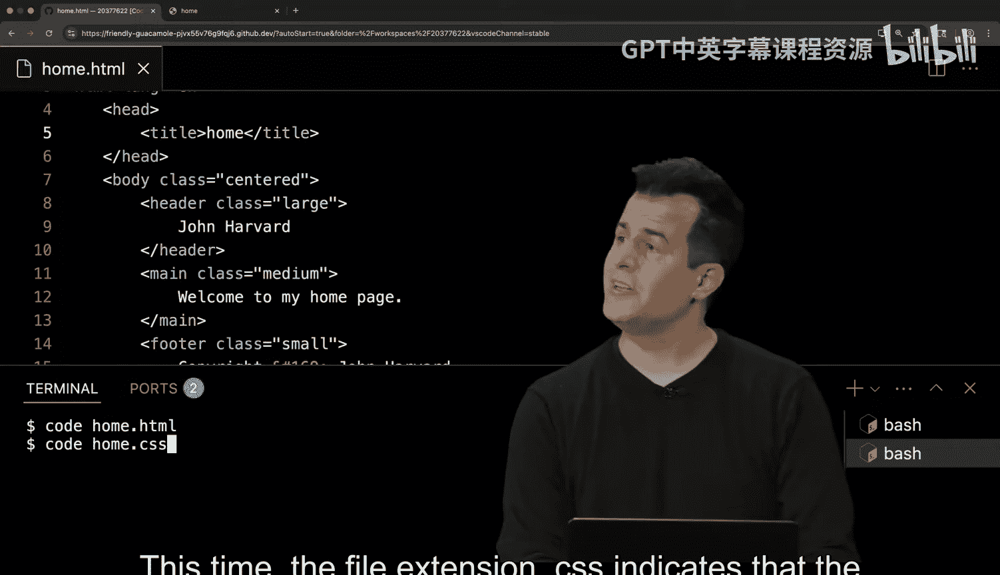

Then I'm going go back to home do html， which is still open。 I no longer have a style tab。

 but I'm going add one other tag instead in the head。

 I'm going have a link tag which has an h ref attribute which links to home css quote unquote and the relationship of that file to this one is going to be that of style sheet quote unquote Now even though link implies that this is a link like a clickable link that's not what we mean we're simply creating a link between this page and home CSss because the relationship is style sheet。

 the browser will know when it downloads home do htl to automatically download home do css either as well because of this line of code here。

 and then the browser will automatically apply the styles that is the properties in home do css to everything here in home html So here again we can go back to the home tab reload。

 see nothing different。😡。

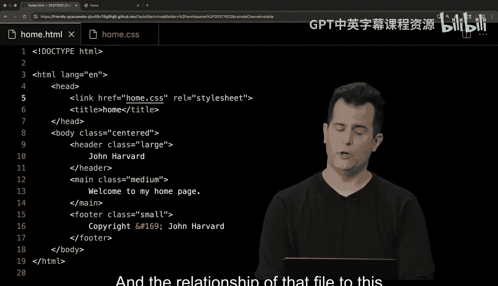

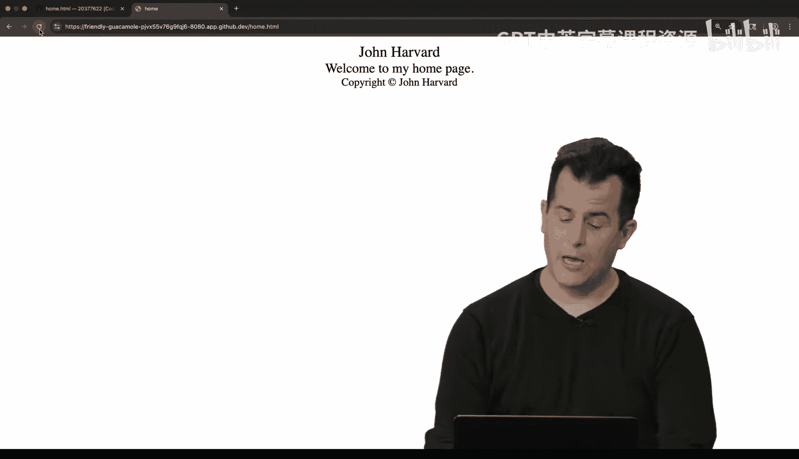

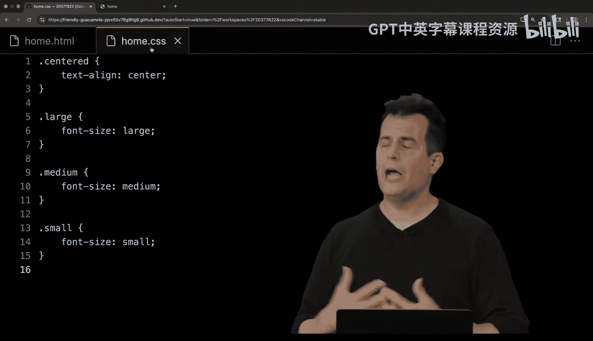

Because it still just works， but is arguably now better designed because if I go back into VS code now and using some kind of server or service。

 I bet I could continue working on home dot H， a colleague of mine， it can work on home do CSsS。

 We can bring the two together and make a more beautiful web page， having worked on them in parallel。

😡，Okay。Alright， so we can sorry。

You know what now that we have all of these more building blocks with Cs S。

 Let's go back to a previous example and see if we can stylize it a little bit further。

 Let me go back to VS code here。 I'm going go ahead and close home dot css and home dot Hml。

 And I'm going open up a file that I made in advance this one called link to do Hml。

 I'll close my terminal window and reveal what this file looks like， which has。

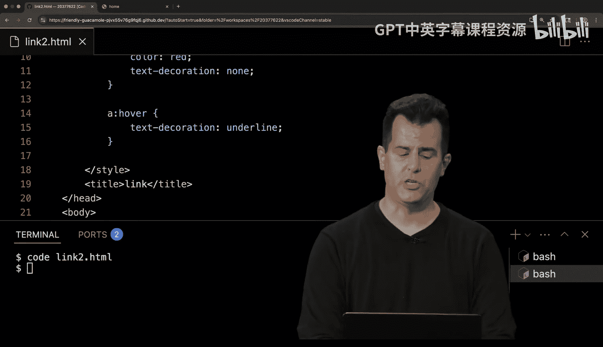

Which has， as before the same H T L down below inside of the body。

 we have visit Harvard with a link surrounding it。 But notice now we have inside of our style tag a little bit of Css that's adding some more color。

 In fact， I've chosen to specify the following properties for any anchor tag or link tag in this page。

 color， Col and red， which we've seen before， But this time text decoration， none。

 which we'll see removes the default underline of any given link。 Then down here。

 we have what's called a pseudo selector。 whereby I'm saying， whenever you see an a tag。

 that the user is hovering over， as with their cursor。

 go ahead and temporarily change the text decoration to an underline。

 So this is a neat use of CsS to create almost an animation of sorts。

 But just by using these key value pairs。 In fact， let me go back now to。😊。

My browser in my second tab and click back， let's go ahead and open up link to do Htl and we'll see visit Harvard。

 And indeed the word Harvard now is colored in red， but there's no underline。

 even though I do think it's a link。 But as I move my cursor over the word Harvard and hover over it。

 That's so- calledled pseudoselector kicks in call and hover because it's on this a tag and the browser knows to now underline and call attention to the same text。

 So again， using just a bit of Css knowledge， some properties， these key value pairs。

 whether you store those key value pairs inside of the HTML itself。

 or as we've just seen in another file altogether， we now have the ability to make our web pages all the more stylized as well as structured。

 Let's do one more thing。 let me go back into VS code here and let me open up the previous example。

 phonebook， But this time a second version thereof let me run code a phonebook 1 Htl。

 the first one was phonebook0 Hl。

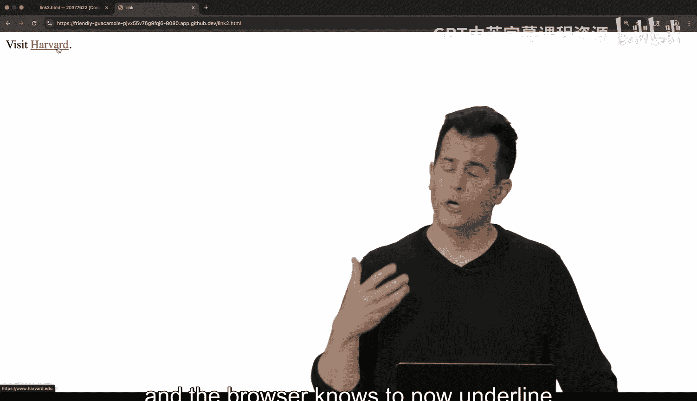

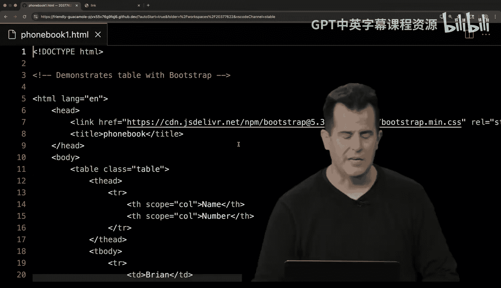

Close my terminal window and here you'll see that I've done just a little something different。

 I've added yes， a link tag which we've just seen before。

 but with a seemingly unfamiliar URL mentioning something called Botrap well。

 it turns out that one of the greatest upsides of using a language like CSS to stylize your web page is that you can make use of what are generally called frameworks otherwise known as libraries whereby someone else has written in this case a whole bunch of CSS properties save them into files of their own somewhere at a URL on the web that you can automatically incorporate into your own projects in order to stylize your web pages without having to write all of those styles yourself Now it's a library in the sense that it's indeed thirdpart code that someone else wrote in this case that happens to be open source and freely available to you and me but a framework further tends to just govern how you use the features thereof you have to design your files in such a way that you adhere to the documentation provided in that they。

So a framework is a way of doing something， a way of using some library。 and in this case。

 the library in question happens to be a popular one known as Boottrap。

 which can be included in your own project simply by having a link tag with an HF attribute that points to inapp URL。

 which I've copied and pasted from their own documentation Moreover insofar as this is a framework and I need to adhere to some of their conventions to use their code I have added a few things on my table tag from my phone book I've added class equals quote unquote table seems a little stranges because it's obviously already a table tag but this class call table as per bootstrap's own documentation。

 is what tells the browser to apply bootstaps table stylization to what was previously a very boring looking phone book Moreover down here I've added scope equals quote unquote call for column just to specify that name and number respectively referred to the columns of data below them。

But I know that only from having read the documentation and in this file is a huge number of key value pairs。

 a huge number of properties that someone El wrote that I can now use having read their documentation by just choosing the right classes so not only does defining classes in CSS help me and my own colleagues factor out some of our common work collaborate more readily it also allows us to stand on the shoulders of others incorporate thirdpart code into our own so as to not have to spend as much time reinventing the wheel like creating menus and buttons and forms and all of that including the aesthetics of tables so let me go back into my second tab here click back into my directory index。

 open up this time phonebook zero HTMLl as before which recall looked quite simply like this which was the browser's own default stylization thereof now let me go back and by having just added that link tag that class in those scopes。

 my same exact HTML is now stylized as。😡。

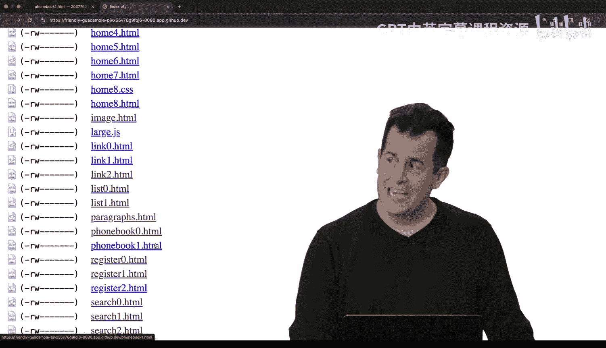

Now it might not really value， but I dare say this is much prettier to look at than the example we've already seen and if I were to dig deeper into bootsottraps I documentation。

 I could start to colorize this by adding colors， I could stripe it by making every other row a different column just to make things more visually apparent。

 so many features come with these frameworks， whether it's bootstrap or any other and indeed this is just one of the upsides now of having tools like HTML and CSS at your disposal。

😡。

But up until now， our content has been fairly static once we download the page。

 what you see is what you get and it's only interactive insofar as you might be able to interact with a form and send information elsewhere。

 but what if we want to keep the user on our same page and make our web pages more interactive themselves。

 well for that we need a third and final language， this one called JavaScript。

 let's take a short break and return with a look at just that。😡，So ja。

 the third of our three languages today and this one is a proper programming language。

 It's got functions and conditionals and loops and more and it's a language that's commonly used within web pages to control dynamically the contents of and the experience for the user So in the case of ja what we effectively have is the ability to take this HTML which recall is loaded into memory as a so-called Dom document object model by the browser we have the ability with jascript to make changes to this dom in real time In other words we can access data therein。

 we can add new nodes remove nodes， we can change the contents of the page and you actually see ja and use all over the place for instance。

 if you use Gmail or outlook and you just sit there watching your inbox odds are on some schedule。

 you'll see new mail and then new mail if someone's indeed sent you new mail and that's without having to click reload on the page to reload the entire pages content rather your browser behind the scenes is running a bit of code。

😡，A bit of ja code that essentially in a loop or some form is just constantly checking with the server。

 Have I gotten more mail， have I gotten more mail。 And if so， it updates the contents of the page。

 And now I don't exactly know how Google and Microsoft have implemented the H of their inbox。

 But I could imagine insof far as the emails are usually shown as rows and rows and rows of mail that maybe it's a table of some sort。

 And so using jascript or Google and Microsoft might do and Gmail and outlook respectively is just add more TR elements。

 more TR elements， more TR elements to a dom like this after your initial inbox has loaded。

Just I'm feeling something that the elements still okay， right？

It might just be the cable hitting my charso。Let's take a look at some- wait。

 let me just think for a second。Did I ever do that？Yep， okay。

Let's take a look at then some actual examples of JavaScript by introducing a final tag。

 the script tag into some of our pages well let me go back here into VS code and let me go ahead and close the phonebook1。

 HTML with which we ended， open up my terminal window， clear it and then open up hello1。

 HTML which I propose shall be the second version of our very first page hello。

 HTML let me go ahead and close my terminal window now scroll down to the bottom and we'll see in the body of this page we have a few new shoot oh sorry I can recover。

😡。

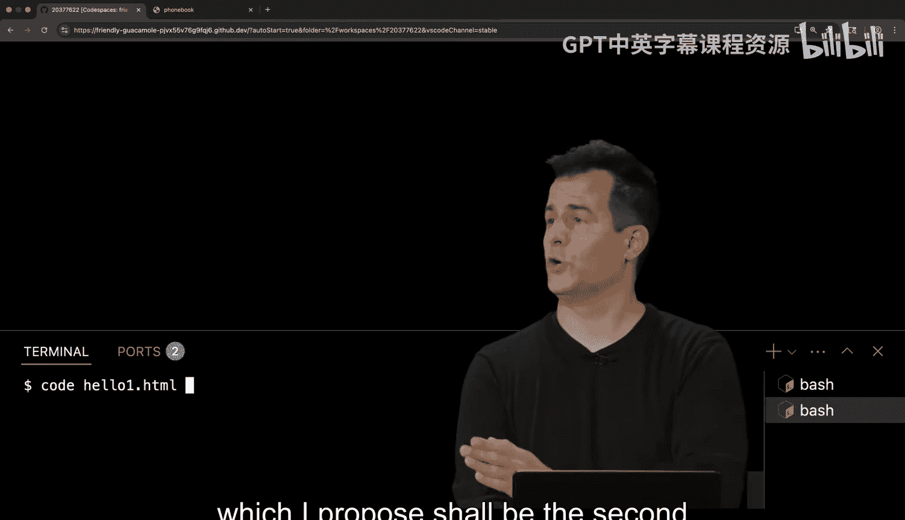

好了。Now let me scroll down to the body of this page and in the body of this page you can see a few new details。

 Well， we still have a form as we've seen in some of our examples。

 but we seem to have an unsubmit attribute here。 the value of which looks a little bit like Python code。

 but in this case it's indeed ja code， a different language altogether。

 we have some familiar input tags but down below but notice that there's mention of what looks like a function calledG。

 Now this is not a function that comes with jascript。 it's one that I wrote。

 So in fact if I scroll up to the top of this page。

 you'll see that between a new script tag I have defined in jascript。

 a function calledG Now the syntax isn't quite like Python recall that in Python we had the death keyword for define and we had slightly different syntax in ja。

 we have literally a function keyword that says hey browser define a function called greet in this case。

 then we have parentheses which indicates that this is a function that does not take it would seem any arguments。

 then we use curly braces。

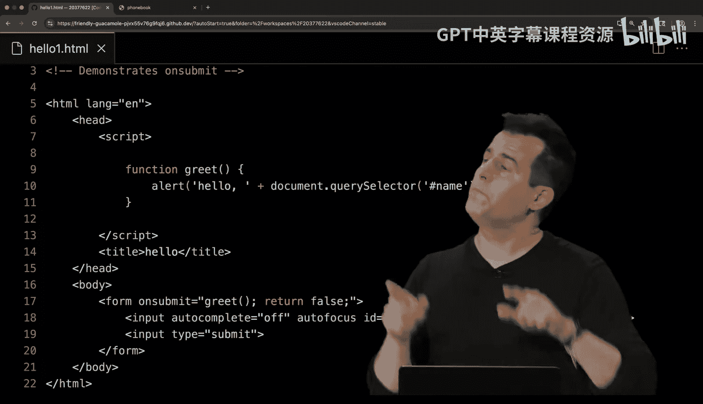

Indicate the body of this function， the lines of code that should be executed and the single line of code that should be executed albeit a mouthful is this call an alert function which does come with jascript then pass in an argument to that alert function as follows unquote hello comma space I'm using single quotes here but I could in jascript use double quotes instead but single quotes are dare say more common I'm using the plus operator which just like in python is concatetnation to join the string on the left with that on the right now here's that mouthful document query selector quote unquote hash name do value so what does this mean well jascript among its features when used in a browser gives you the ability to query the document for a specific node using a unique identifier to get at it or name to get at it and then go get its value So if we scroll back down here to the form notice that there's an input here whose unique ID is quote unquote name because as we'll see in a moment this new and improved version of hello1。

Html has a text box in which the user can type their name。

 so we're not gonna keep saying hello world。 I want this thing to say hello David， for instance。

 or whoever is using it。 So by giving this HTML element a unique I that I could call anything X。

 Y Z barba name makes more sense if I'm trying to get the user's name I can use the same syntax that we saw in CSs so these languages are borrowing ideas from each other it would seem。

 I can select with this query， that node in the dumbm and go in and get its value。

 whatever the human has typed in and then notice that this form will return false。

 which is a convention for saying hey browser even though the user might have click the submit button don't actually try to submit this form to a server like with an action attribute as we saw before。

 rather just return false and do nothing more after calling the greet function thanks to this on submitubmit attribute which itself is new for us now All right let me go back into my second。

go back from Phbook1 dot HTMLl and this time go into hello1 do html。 and in hello1。

 we indeed have this text box and a submit button。 I'm going to go ahead and type in my name D VID。

 I'm going click submitit andvoila， albeit crypptically and not very aestheticically prettily we have a pop up that says hello David below what seems to be like the URL of my unique code space in the cloud。

 my unique instance of VS code。😡。

In the cloud。 Allright， well， that's one way of doing this。 But let's see another。

 Let me go back into V S code here。 Let me close hello 1 dot Htl and open up this time。

 Ho2 dot Htl instead。 This one notice does a bit more of the lifting outside of the form element and entirely in the script tag。

 So just like with our discussion of C S S。 We try ultimately to factor out the Cs into a different location and better yet eventually into a file。

 I've done the same here。 There's no mention of on submit， there's no mention of greed。

 There's no mention of return false。 It's just pure H Tml。 But up here。

 I'm using some fancier features of jascript now。😊。

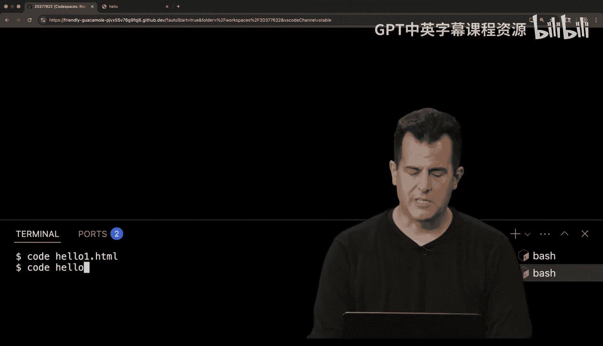

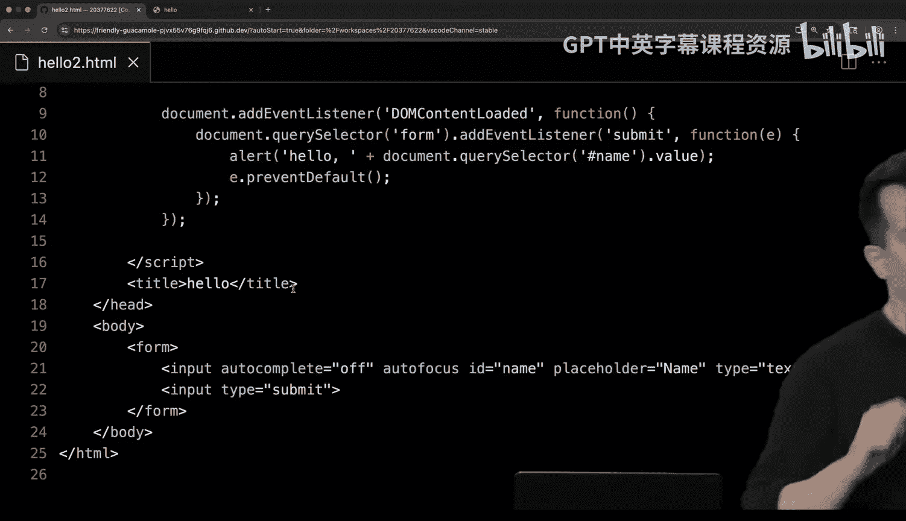

To do the following inside the script tag， I am saying document add event listener。

 which is just a function that comes with javascript in the context of browsers that adds what's called the listener。

 a function whose purpose in life is to wait for a certain thing to happen what thing Dom content loaded。

 which itself is a mouthful， but it kind of means what it says when the doms content is loaded into memory。

 That is once all of the HTML has been read top to bottom left to right and that treelike structure。

 the dom has been loaded into the browser's memory， then please call the following function。

 this function is anonymous in the sense that I haven't bothered giving it its name that is okay。

 and you can do this in Python as well。 but what matters is that everything in these curly braces is going to get executed when the doms content is loaded。

 What happens。 Well， document query selector is that same function is before。

 This time we're not using a unique I per se， we're saying whatever form is in this web page add another event listener。

 this time listening for the submission。😡，Event that is when the user clicks on the button or hits enter in the form。

 and then when that happens called this function， which takes an argument called E for event。

 but that I know only from the documentation， what though should you do when the user submits that form well called the alert function。

 which in the end is that thing that brought up the ugly but functional box。😡，Concatenate with it。

 the result of querying for the name field just as before and grabbing its value。

 And then this is the equivalent of return false E dotprevent default and the capitalization here is important。

 just means whatever this form does by default like submit to a server elsewhere don't do that because all I care about is greeting the user in this case。

 So more of a mouthful and definitely cryptic and not something you'll necessarily want to or have to write。

 but it just speaks to the functionality that we have here in the browser。 Well。

 what more can we do instead。 Well， I can go ahead now and maybe make a more interactive version of the same。

 let me go back into my second tab， let me go back into my directory listing。

 let's skip over that last example， which functionally is the same and go to hello 3 Hm which this time has no submit button。

 but when I type my name like D V I D it immediately edits the body of the web page and as I start to delete it。

 my name goes away。

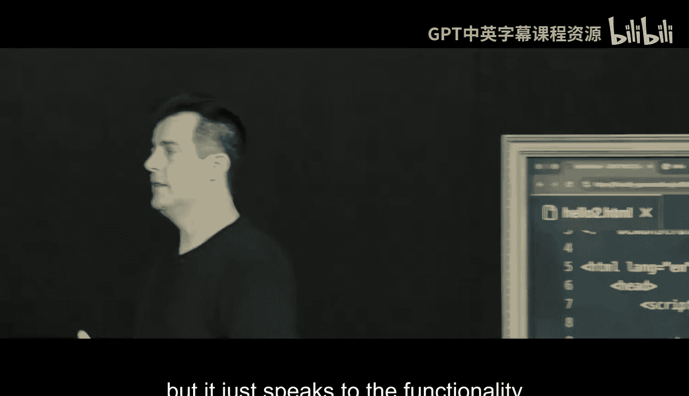

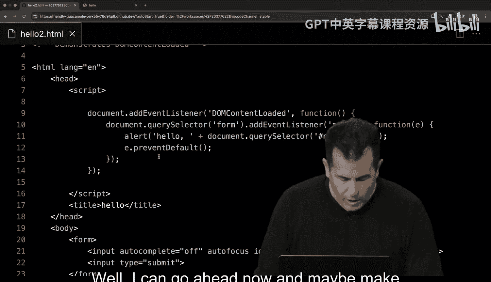

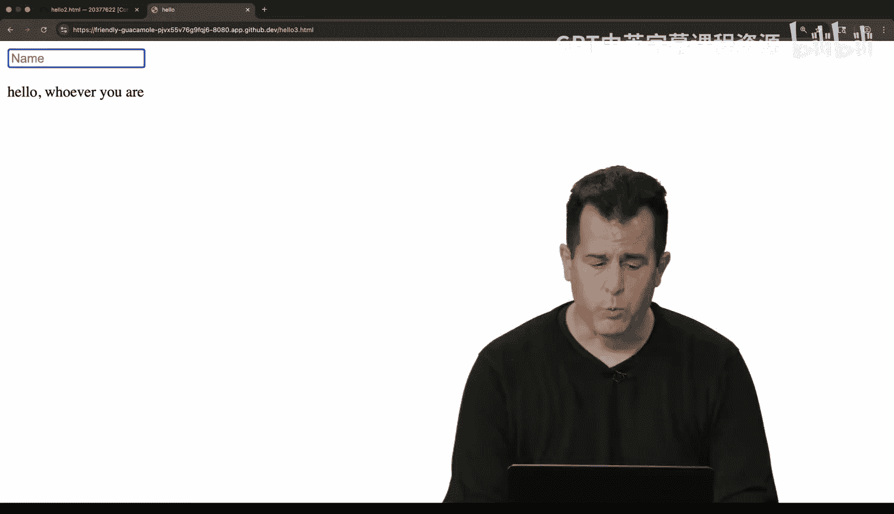

And then it puts in a default value instead， well how might I do this。

 Well if we go back into VS code here， close hello2。 HTMLt and open up hello3。 HTMLt。

 we'll see a slightly longer function that does the following。😡。

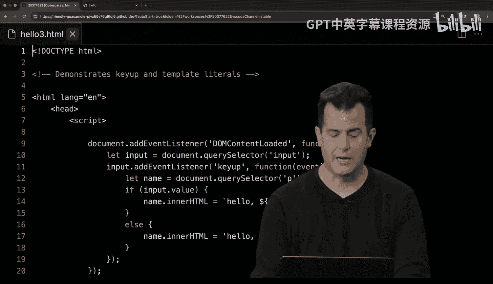

When the Doms content has been loaded， call the following function。 Well。

 first define a variable called input and let is a keyword that very politely asks the browser to create a variable in memory called input。

 but I could call it anything I want。 set that equal to the result of querying for the input element in this page。

 and there's just one。 That's why we saw the one text box。 then go ahead and for that input。

 listen for the key up event So that's an event that's defined in jascript for browsers。

 that means when the finger comes up from the key， go ahead and call this function。 Well。

 that function says define another variable called name， though I could call it anything I want。

 set that equal to the result of calling query selector for the paragraph tag on the page and we'll see that in just a moment。

 then。😡。

If that input already has a value will change the inner HTML of that element to equal hello comma and then input value。

 and I'm going wave my hand at some of the syntax here， but suffice it to say the dollar sign。

 the curly braces， the back ticks here all have special significance in jascript but that effectively allows me to concateate together hello and whatever the user has typed their name to be otherwise if there is no input value。

 just say hello comma whoever you are。 and that's what we saw when I deleted my whole name。

 What's neat about this example if we go back to that tab is if I open up my developer tools as we've done before and watch the body of the page notice that we see the original contents here rather let's reload the page。

 notice that when I expand the body here， we see the original contents of the page including a form with a single text box and it turns out in empty paragraph tag if I go back indeed to hello 3 HTML and scroll down that's all。

😡。

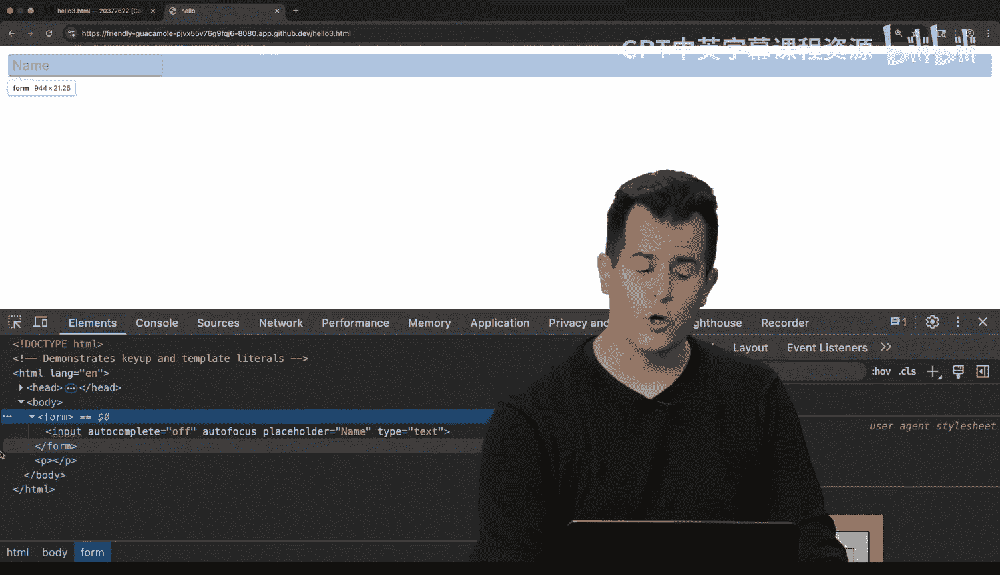

It's in this page。 I created a paragraph tag with nothing in it。

 but kind of as a placeholder for future text。 Now it's not really a paragraph of text。

 it's very short， but I could change it to a div or really any number of other things。

 but I went with paragraph for text here。 If I go back now to this form。

 Watch what happens in my developer tools at bottom left As I start topping typing here at top left as I type D A V IDD。

 the actual dom of the page represented here under the elements tab as dynamically changing HTML will change in real time So let's see capital D。

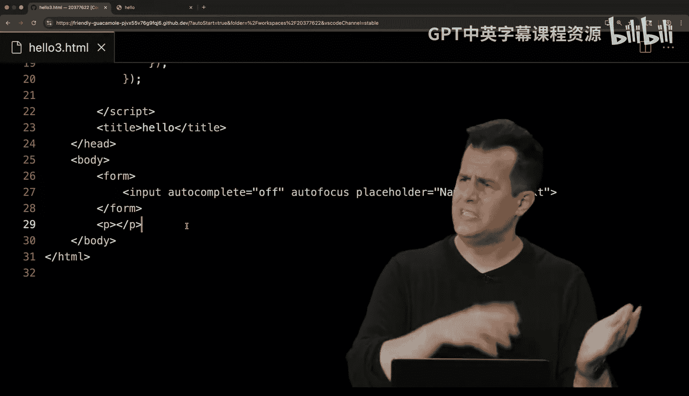

A and you're not seeing anything yet， but notice what happened to the P tag now there's a little triangle to expand it and indeed there it is hellello comma D。

 let's keep typing in the box。 VID and Chrome is flashing it just to draw my attention to the changes。

 This is the developer tools's equivalent of watching the JavaScript code， change that dom。

 that tree in memory and the browser is constantly updating the same thanks to this JavaScript code。

😡。

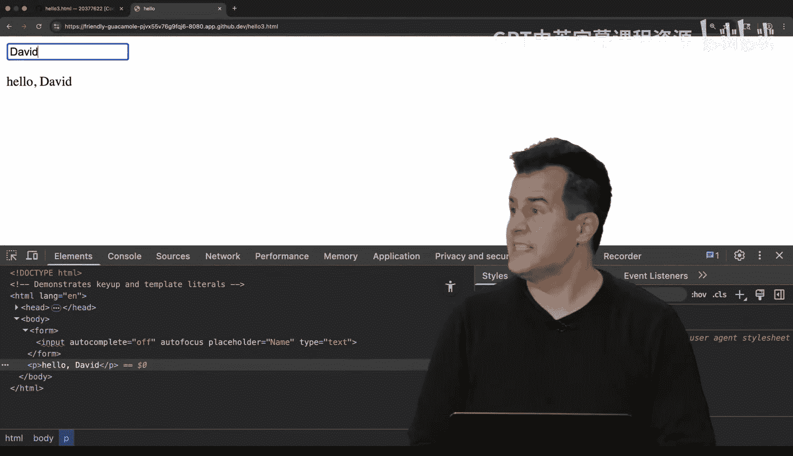

So with this example with these examples we've seen not only the submit event that might happen。

 but also the key up event that might happen and any number of other things might happen to and in fact I can go here and do something even fancier。

 let me go into hello4。 HTML， open up that file here and you'll see mention of some other features that come with today's browser。

 including the ability to synthesize speech and let me wave my hand at this code and propose that via a similar text box。

😡。

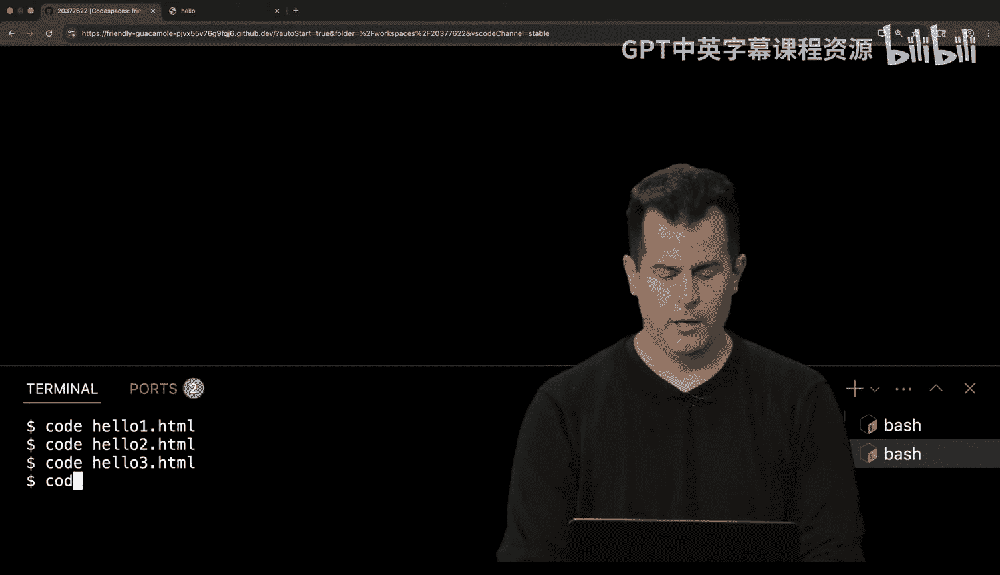

Passing the input from the user into this speech synthesis feature。

 I can now do something like the following。 Let me go back into my directory index。

 open up hello 4 dot Htl， Close my developer tools。 type in my name。 And in this version。

 there's back a button， let me click that。 And we'll hear hello。To indeed， my name。

 David verbally as well。 All right， Well， what more can we do too， Well。

 let me propose that one other approach we can take is to stylize this text box that we saw earlier。

 much more beautifully than that built-in alert function。 In fact。

 the alert function is not really meant to be used to create user interfaces。

 if only because it's especially ugly to look at。 However， using frameworks like Boottrap。

 you have access to not only CSS classes and other features for CSS itself。

 but often jascript functionality as well with that CSS。 So in fact。

 let me go ahead and open up in VS code here。

Hello5 html and we'll see in hello5。 h with a wave of the hand mention of as before this long URL for bootstrap。

 which gives me access via this link tag to its own CSS and I'll wave my hand at the JavaScript code here but I read the documentation therefore and I created what's called a modal a window that pops up on the screen and blocks the user typically from doing anything else until they close that same modal and what you'll see now is arguably a prettier version of a popup than the one that came by default with that alert function let me go back to my other tab click back and open up now hello5 H page isn't much to look at yeah but when I type in DVID and click submit notice that the popup now is indeed stylized it faded in it dropped down and using some HTML I embedded later on in that page I have compelled the browser using bootsts JavaScriptscript functionality and it's modal feature。

😡。

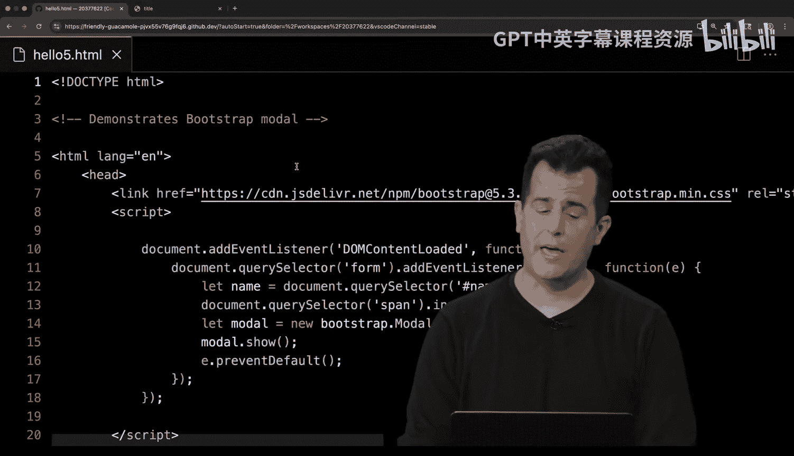

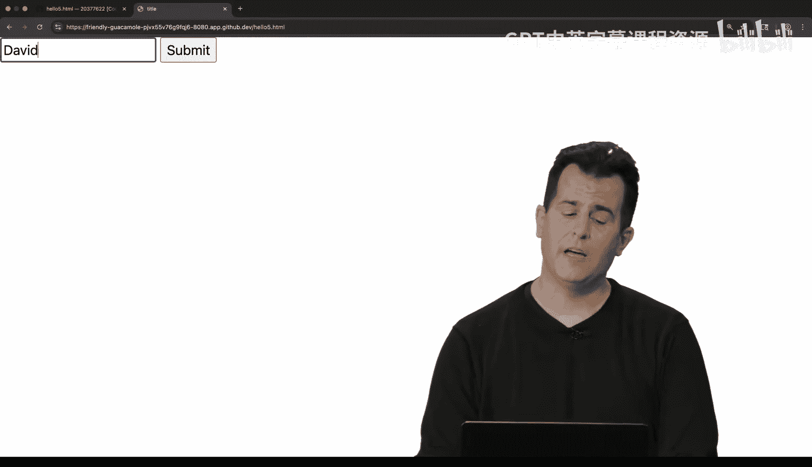

To give me something like this， which is really just a placeholder for a more interesting dialogue window。

 but you see the familiar X and the close button， and you could imagine filling that window with most any other contents of interest。

😡，So beyond the events we've already seen like submitting and keyup。

 there's so many other events that happen in browsers。 and indeed with jascript in browsers。

 be it on a laptop or desktop or phone， there are so many different events you can listen for and this is what's generally known as event drivenve programming where you write code not that just kicks off right when you click button where you write code that doesn't just start executing the moment the user logs in。

 but rather waits and waits and waits until something happens， a so-called event。

 So maybe something changes on the page or the user clicks or drags maybe the key goes up or goes down。

 maybe the mouse goes down or goes up， maybe any number of other events happen and a specific function is therefore called as soon as that event is heard and using events like these we can do so many interesting things as well for instance。

 just for fun let me go back into VS code here， let me open up a file that's called background Hml and in background Hl。

😡。

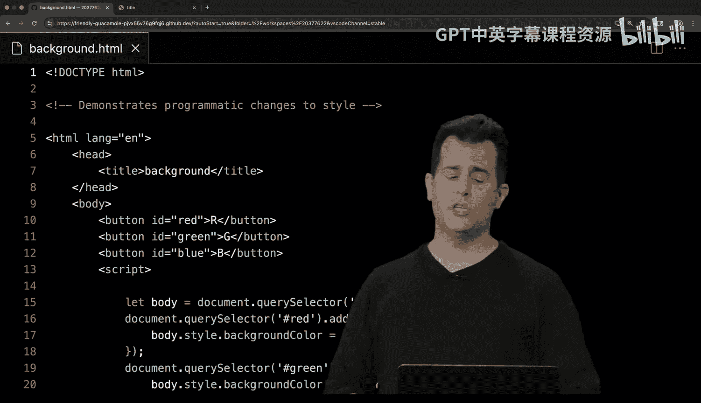

Just a little more HTML and jascript in turn that allows me to change dynamically the colors of the web page。

 Let's see what it does first in my other tab here。

 let me open up background HTMLtm and I'll see three buttons。

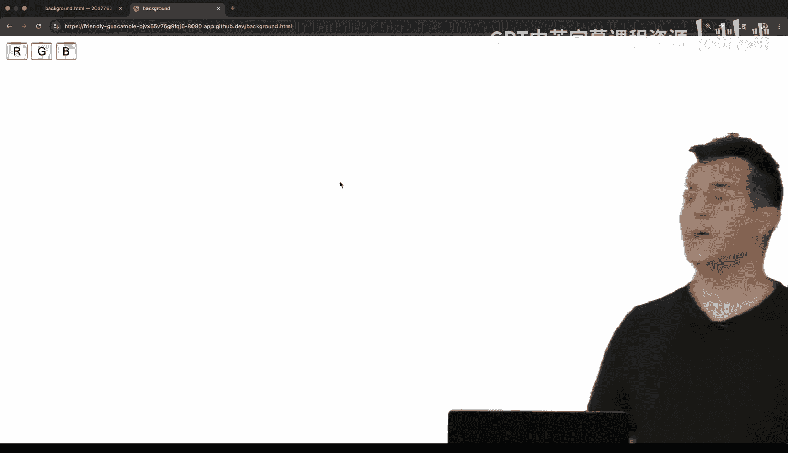

Sorry。And I'll see。And I'll see three button best to do this。I'll go back。O。I got to type in my name。

这吃吃。Tam it， where was I， Let's pick it up from here。Okay。Let me go into background。

 HTML where we'll see three buttons Rg and B and because I've written some jascript code that listens for clicks on each of these buttons and then changes the pages CSS to alter its background color I'm integratingrating HTML。

 CSS and JavaScript with this simple example when you click red you get red， when you click green。

 you get green and when you click blue you get blue how well let's look at the code here and you'll notice at the top of the body I have just three buttons each with a unique ID using HTML alone but then below that I have a script tag that does three things similarly。

 but first I declare a variable called body that declares a。😡。

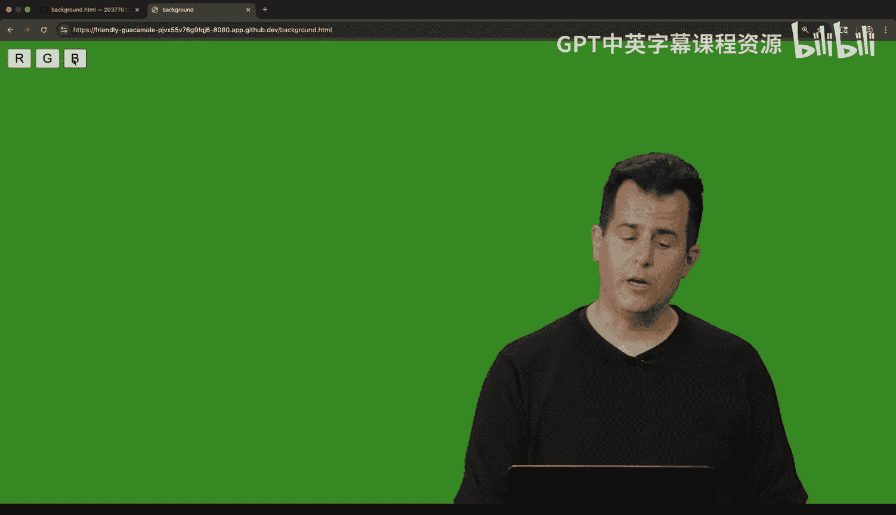

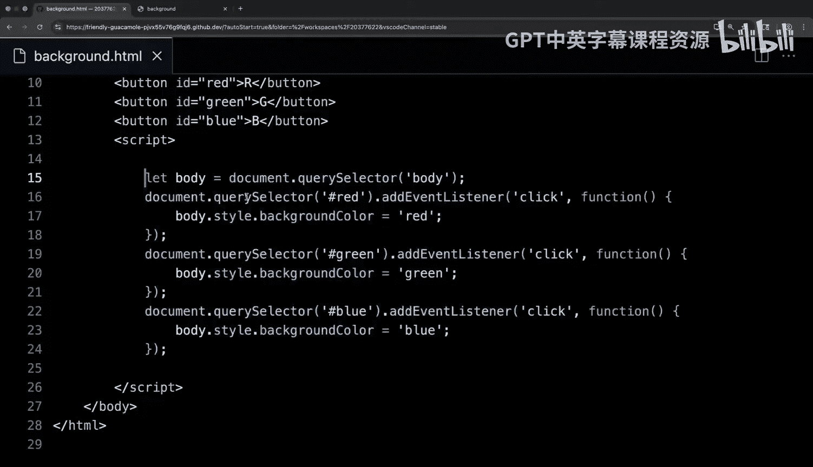

I declare a variable called body that stores the return value of query selector looking for the body。

 so this is just a variable that points to the node in the dom that represents the page's body alone。

 Then I use another query selector to select the unique identifier red and add to that input that button in event listener for click so when the user clicks on the red button。

 what happens， I change the bodies styles， background color to quote unquote red Now previously we saw color to change the color of text to something like red now we're seeing background color which allows you to change the background color of something to red as well the other chunks of code here are quite similar。

 I'm looking for green and setting to green， looking for blue and setting to blue and here too with our developer tools we can see what's actually happening。

😡。

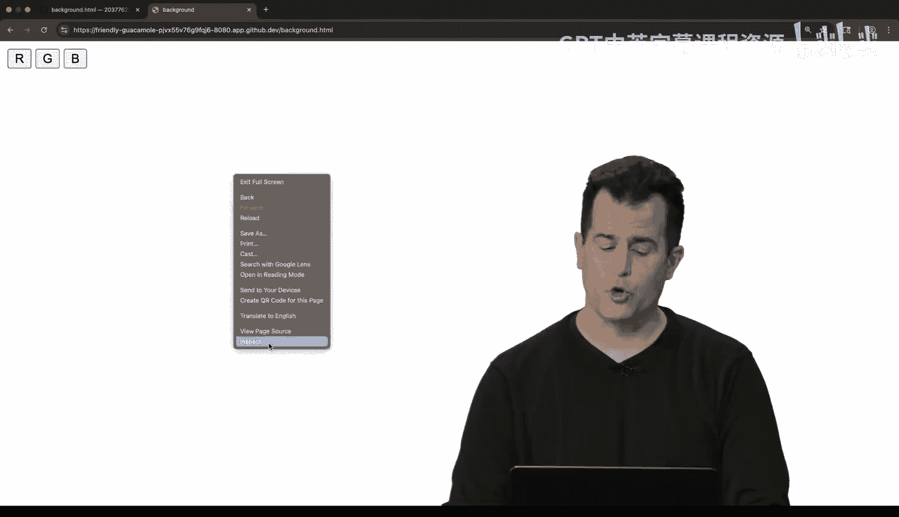

Let me go back to my second tab here and reload so we start with the white background。

 let me right click or control click and open my developer tools and now notice if I click on the body at the moment there is no background color but if I click on R for red。

 notice at bottom right that the background color of the element I've selected that is body has been changed to background dash color now there is a dichotomy here whereby the CSS property is' called background dash color in all lowercase。

 but the code we just saw was called background color capital C in so-called Caml case with a hump in the middle for the capital C。

😡。

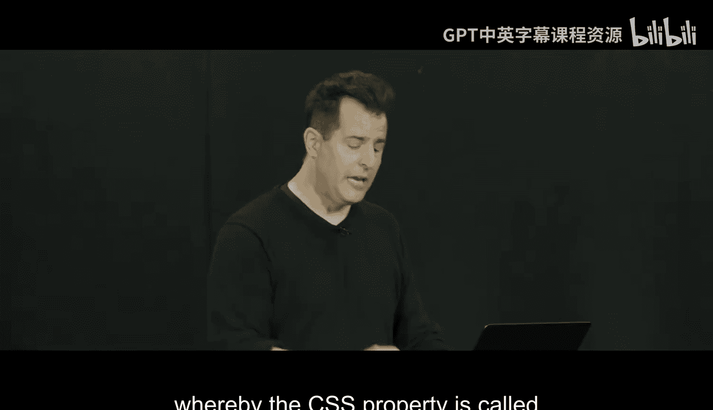

This is perhaps because the right hand was not talking to the left hand when these languages were designed and insofar as CSS was using a hyphen that's fine。

 but when it came time to control CSS with jascript a hyphen as you might imagine like in Python is also used for the subtraction symbol as well and so to say background minus color makes no sense so in JavaScriptscript the CSS equivalentence or camel case so to speak by getting rid of the hyphen and capitalizing the second word instead but in CSS alone it's still with the dash as we saw for something like dash size and something like text dash align well what more can we do well here's an example in blink do HTML that brings back one of the few tags that has the distinction of having been deprecated that is eliminated from HTML in this file there's a function called blink that has the effect of turning the body of the page from visible to invisible otherwise known as hidden back and forth back and forth by you。

😡。

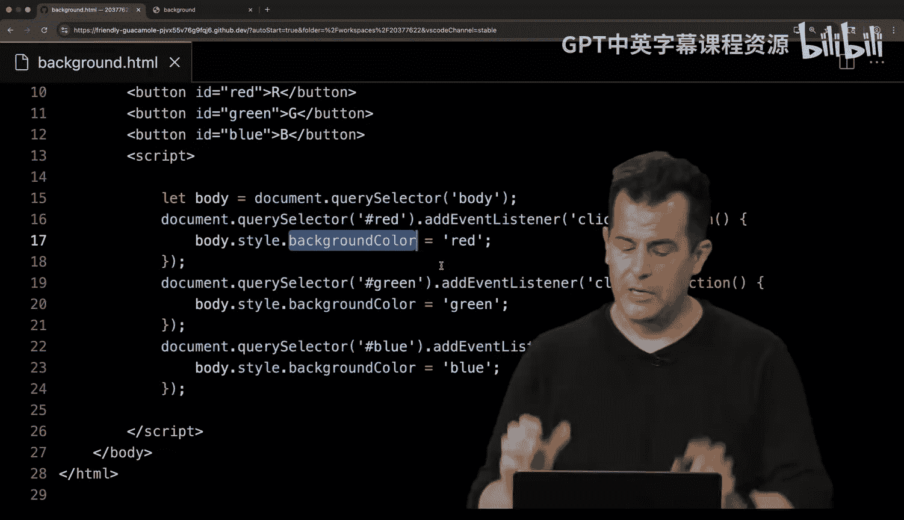

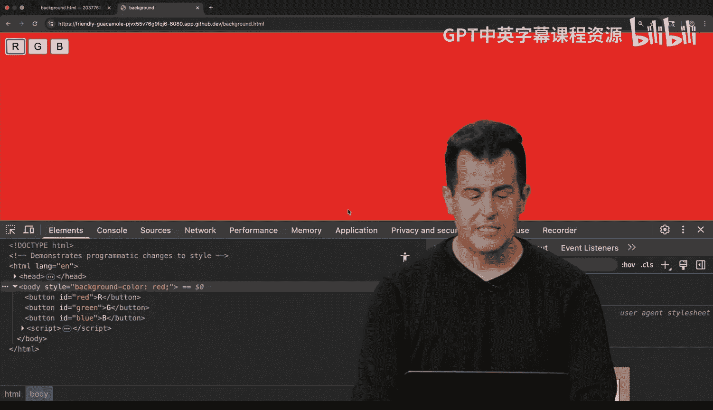

Another function that comes with browsers today。Called windowow do set interval that allows you to call it any old function。

 however frequently you'd like。 This line here means call the blank function every 500 milliseconds or half a second。

 And every time that same function is called blank it changes the visibility of the body to visible。

 hidden visible， hidden the effect then if I go into my other tab。

 close my developer tools and open blank is to bring back what started off in life as an actual HTML tag that was just so darn annoying and ugly in web pages around the world that it was indeed phased out。

 But we can bring it back with just a little bit of jascript code。 Well， what more can we do， Well。

 how about as a final flourish， we implement some of our own autocomp。

 Typ when you go to a website like Google or Bing or the like and start typing characters。

 you'll see words that start with those characters automatically。 Now。

 odds are those words are not coming entirely from the contents of the webage。

 they might be coming from a server or at least a file that's been downloaded in advance。 So let me。

 in fact， go back to。

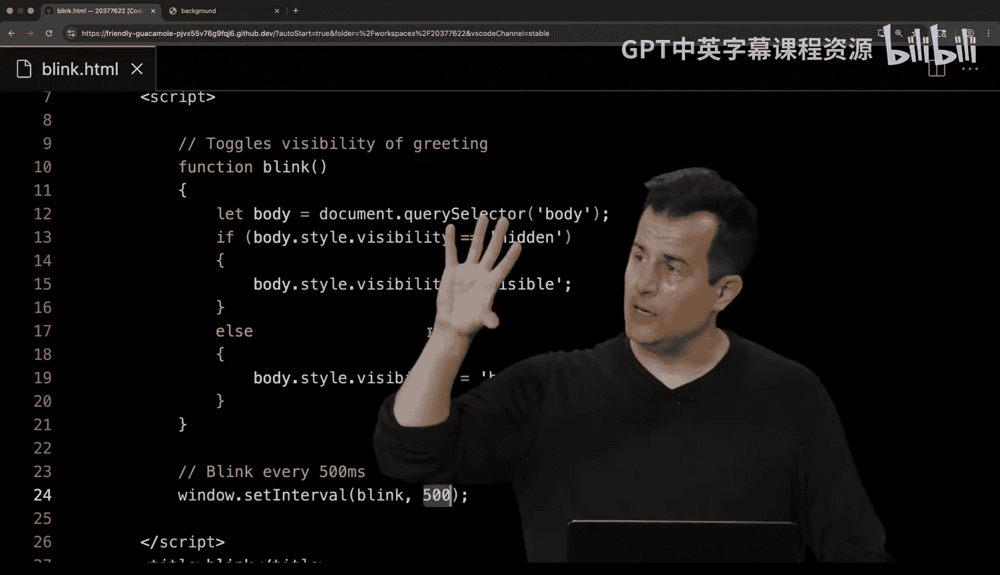

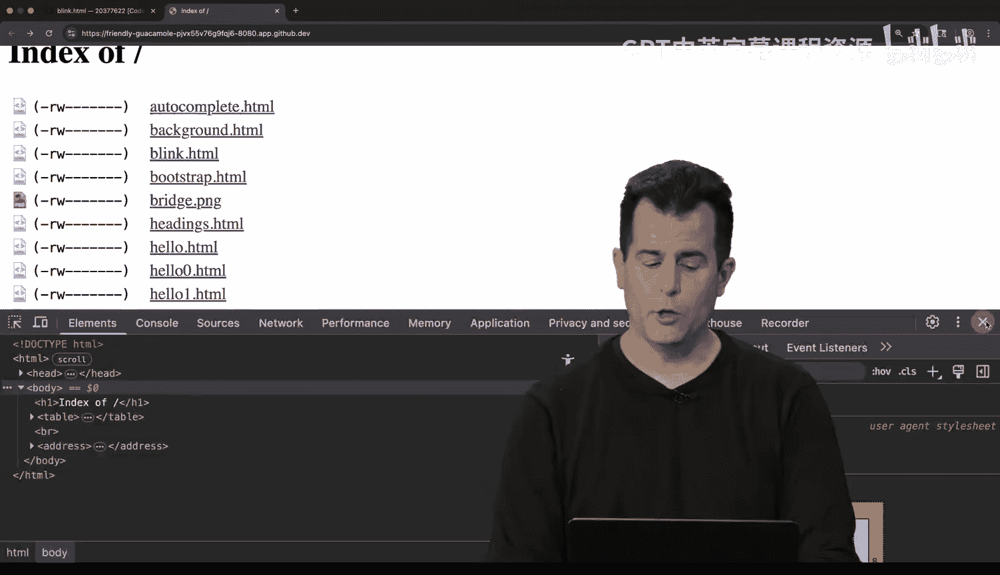

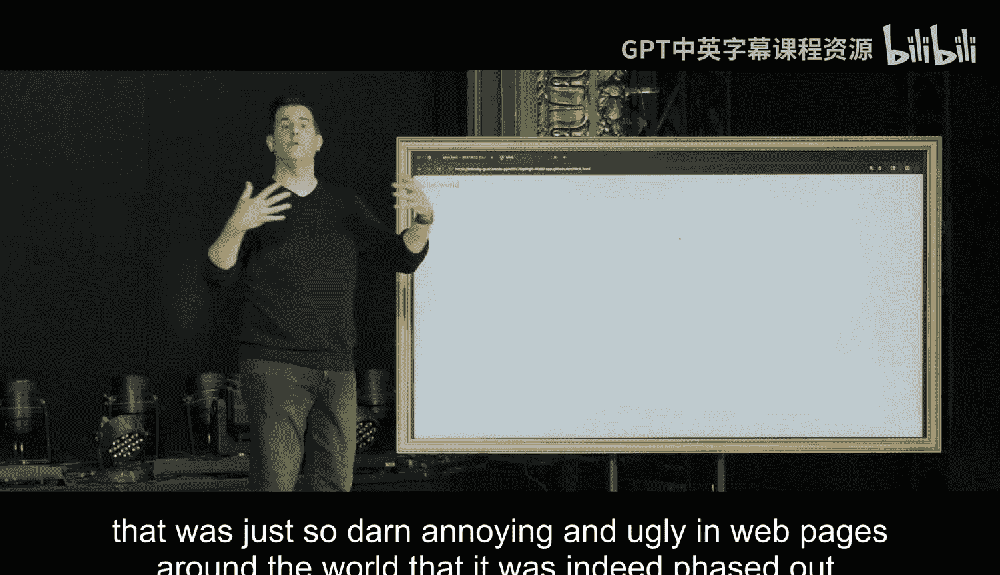

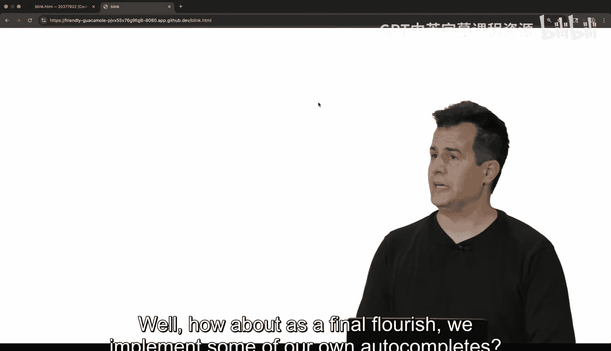

My directory index here， open up autocomplete。 And here in this box will see query。

 but no button because I'm going to be listening for some of those key presses such that if I type in C and then A and then T and then S。

 in this case， I'll see all of the words that start with precisely those letters。

 If I back up the bolded list will get longer and longer。 And if I search for instead， maybe dogs。

 I'll see only those words that start with Do O Gs and so forth。 Now， where is that。

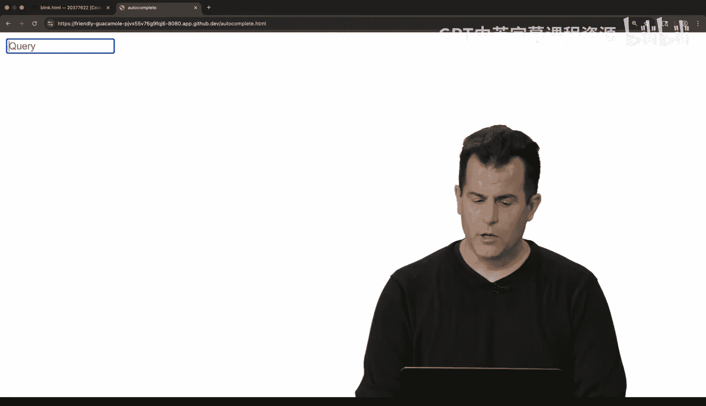

Coming from let's go back to V S code here， open my terminal and open up lastly autocomplete do Hml。

 And in this file here we'll see that I mention one file called large dot js。

 which happens to be a really big file of ja code that contains over 100000 English words alphabetically sorted and all lowercase。

 What's above that here is an empty unordered list or U。

 because that's why I want to put that bulleted list of search results once I've started searching for them。

 Meanwhile， in this code here， I have several lines of code that essentially search for the doms input element and find the value that the humans typed in。

 Then I use that to iterate over all of the words in the dictionary and look at whether a word starts with the characters the users typed in。

 And if so， I go ahead and concatenate onto a variable that I myself called Hml。

 a list list item element， open andclo tag。

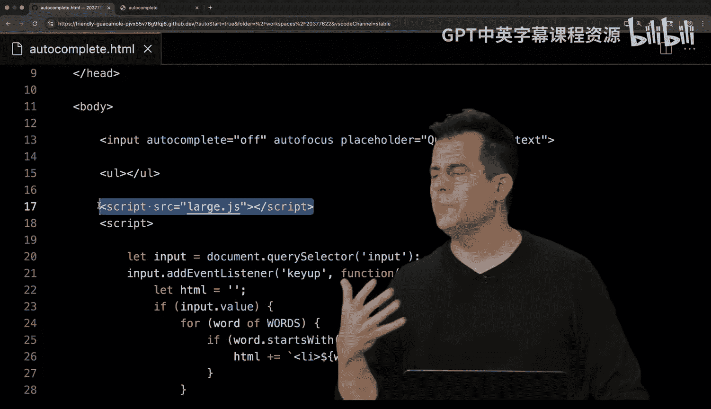

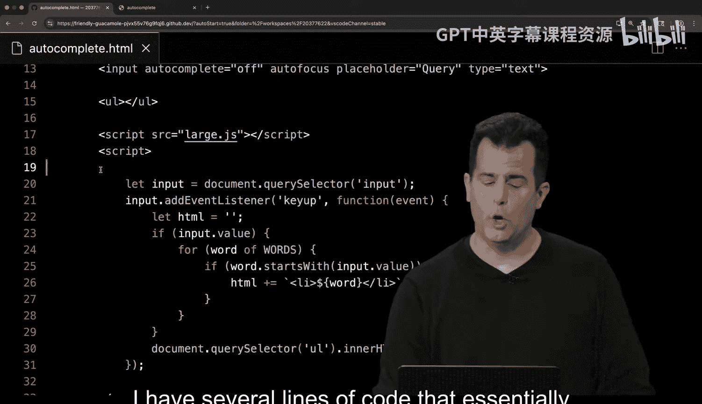

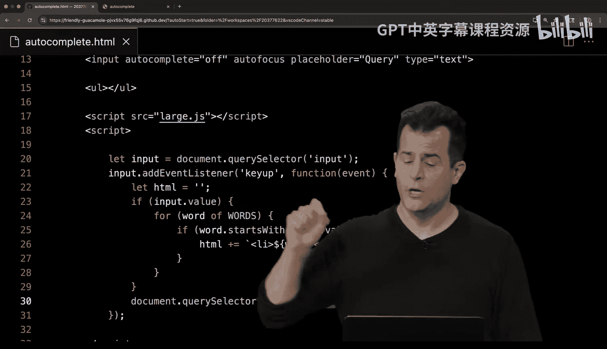

Paining that word。 and then lastly， I update the inner HTML of that unordered list with precisely the HTML that I've generated。

 The end result then is precisely the user interface that you might see on Google or Bing or any other website that's autocomplet All they are using is a bit of jascript code to dynamically search over some data and therefore dynamically update some CSS and or HTML on the page to render all of that data。

😡。

For you， the user。That then is how we might weave the web using these three languages like HTML CSS and JavaScript。

 which are predominantly used in websites today， but increasingly our HTML CSS and JavaScript used in mobile applications as well。

 moreover JavaScript itself， even though we have ourselves used a client side by creating JS files or HTML files containing it that are then downloaded from the server by the browser into local memory can also as a language be used server side as well。

 indeed JavaScript can be used as an alternative to something like Python。

 but using these technologies which dare say are not going anywhere anytime soon can you compose all of today's websites some of today's mobile applications。

 and even though we haven't looked at all of the tags and attributes and properties and functions that exist across these three languages。

 we have looked at all of the fundamentals on top of which you can build sites and applications of your own。

😡。

I don't know why I ended up over here， but okay。Of course， the most common- sorry。

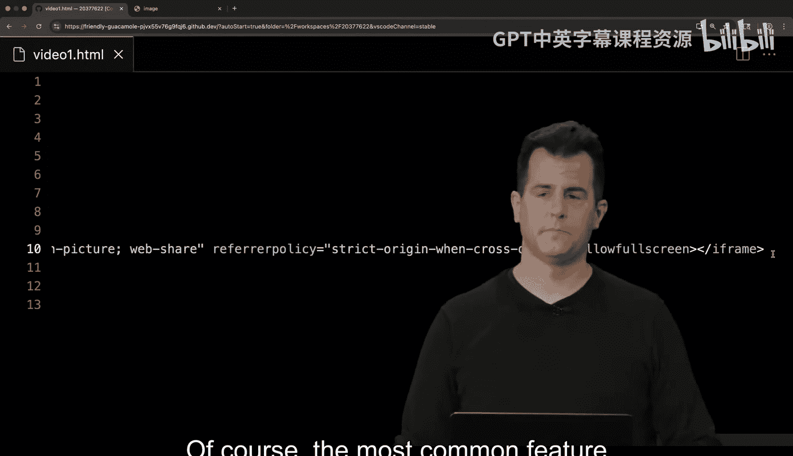

Okay。Of course the most common feature of web pages are probably hyperlinks or links themselves so how can we go about creating some HTML that allows the user to click on a word on the page and then be whisked away to some other page altogether let's go ahead and do this let me go back into my terminal window here after closing video1 h let me open up link zero h and let's see what's inside well here we have a relatively simple web page that introduces just one new tag down here a for anchor followed by an attribute of hre equals quote unquote for instance image h in other words if my goal is to create a page that has a hyperlink or link for short from this page to another such that when you click on that link it takes you from the former to ladder I can use this anchor tag with an hf attribute whose value is the page or even full URL that I want to take the user2 then outside of that tag I can specify the name of the link itself what I want to。

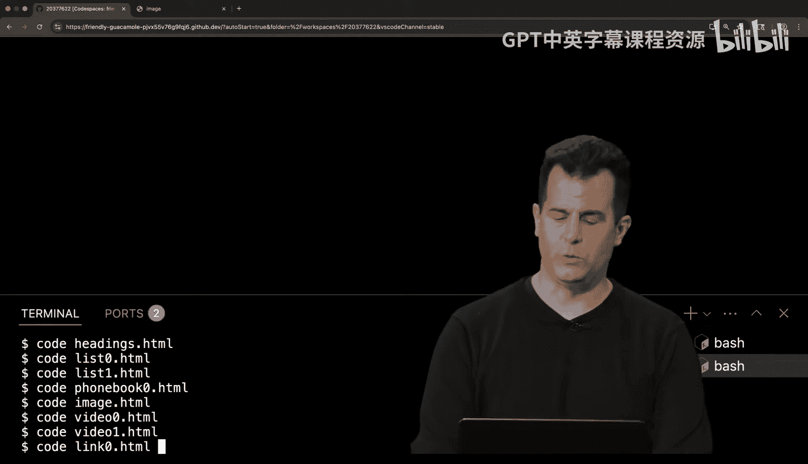

see and then I can close the anchor tag like this ideally the tag would have been called the link tag when it turns out the link tag was used ultimately for something else。

 but a is anchor for short and indeed is among the most common tags you might see in a page so let's go ahead and see the results here if I go back into my second tab and click back this time now if I go into link zero h I'll see exactly that visit Harvard with the link underlined and if I visit it before which I frequently have it will show in purple by default instead of in blue but if I click on this link you'll see that I'm whisked away to that same files before earlier image h now if I go back again notice this if I hover over this link you'll often see in the bottom corner of your web browser exactly the link to which you'll be sent this alone is a feature because unfortunately even the simplicity of this link tag lends itself to what are generally called phishing attacks whereby you might be misled into a following a link that looks like it goes。

One place but actually goes to another for instance here。

 instead of linking from one web page to another， I could link to a full URL like HtTPS colon//lash。

😡。

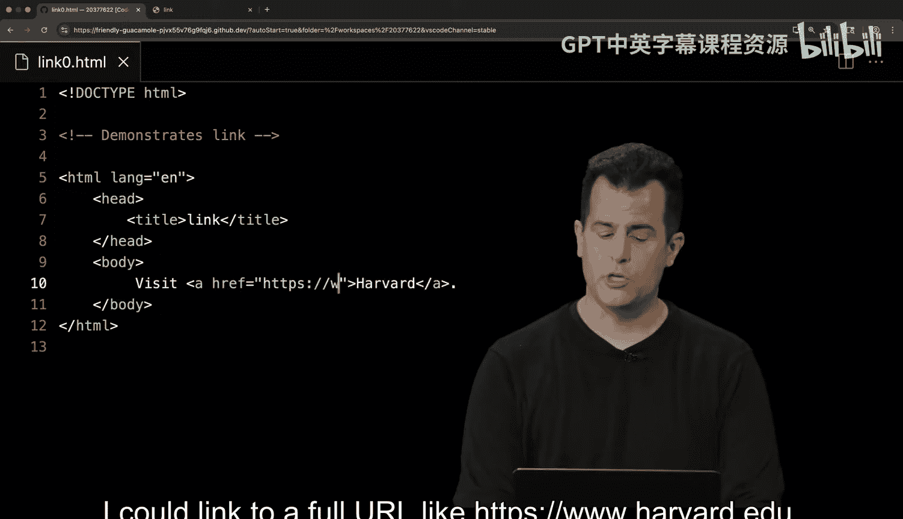

Like hdps colon/www。harvard。edduu what the user would see of course。

 is still the word Harvard but where they'd be linked to is the full URL。

 but there's nothing stopping me as a web developer from going in there and saying you might think you're going to Harvard but you're actually going to go to Yale instead and only if you hover over the link or actually go to it and see where you end up。

 will you know that even the word Harvard might link you to a different place altogether and indeed phishing attacks take advantage of this dichotomy between what you see and where you go to potentially mislead people into thinking that they're going to Harvard or even Harvard。

edduu but actually they're going to a different destination altogether。😡。

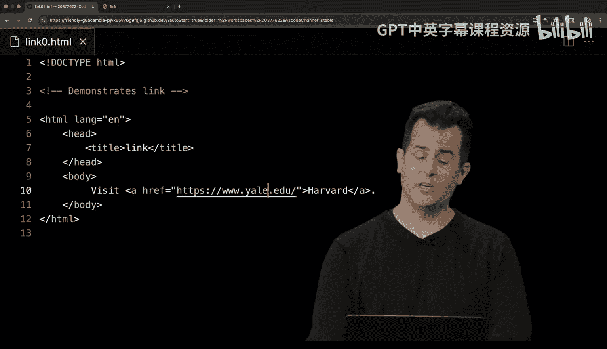

Give me one seconds。Oh， wow， I did that for memory。Oh， that's perfect， that was a good take。Okay。

 so the only。Why don't we do this， Let me run downstairs and tell them they can go。

